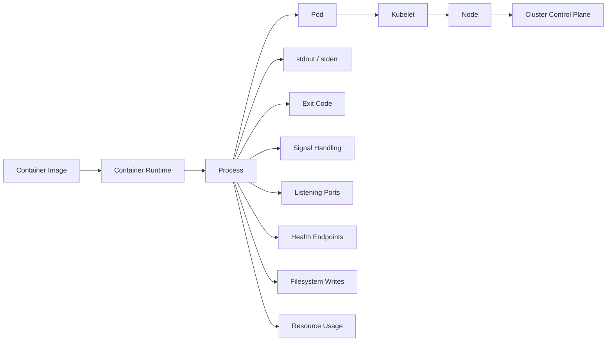
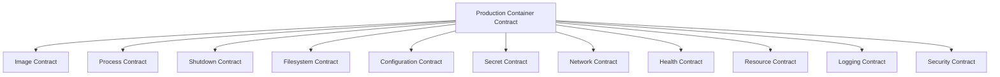
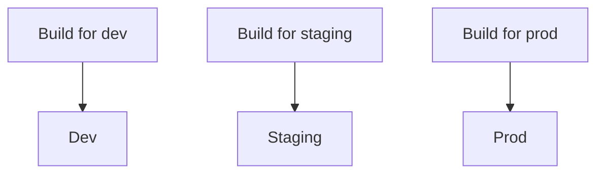
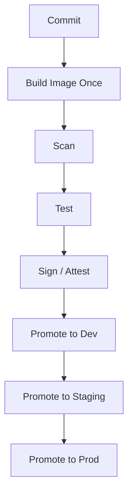
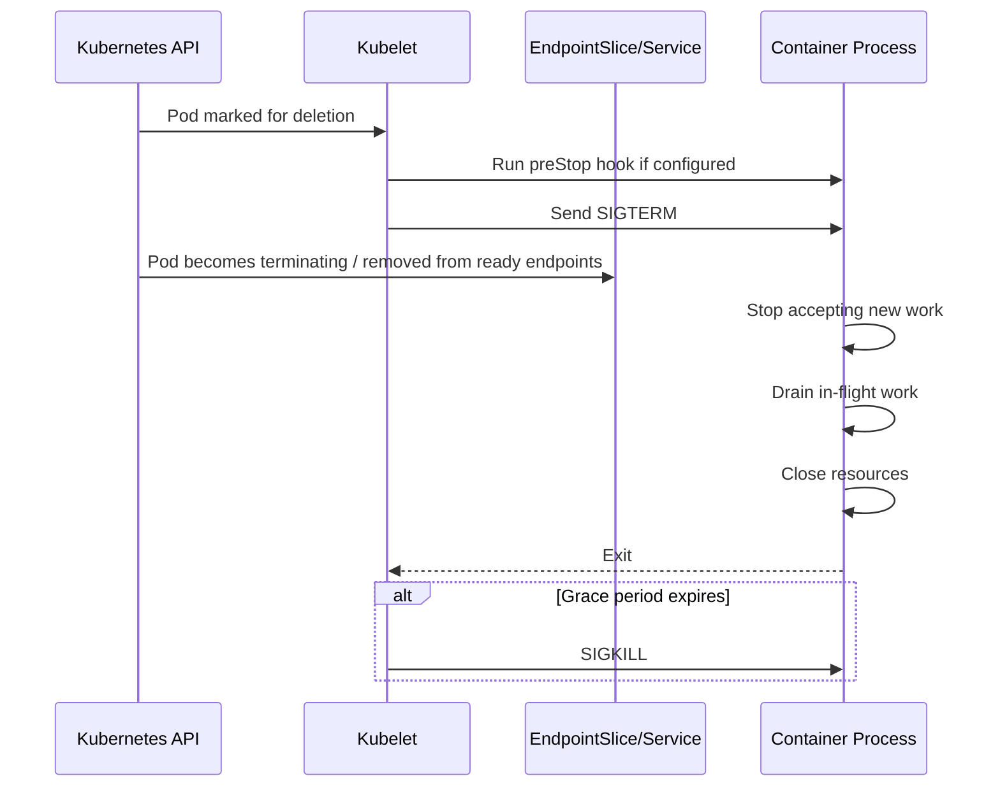
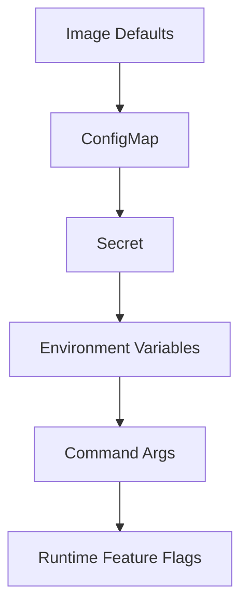

# Production Grade Container Boundaries

A Kubernetes cluster does not run your source code. It runs **containerized process contracts**.

That distinction matters. A good container is not merely an image that starts on your laptop. A production-grade container is a bounded, observable, replaceable process unit that behaves predictably when Kubernetes schedules it, kills it, restarts it, probes it, throttles it, moves it, isolates it, and rolls it out under cloud infrastructure constraints.

This part is about that boundary.

We are not yet optimizing EKS, AKS, networking, autoscaling, GitOps, or security policy. Those come later. Here we define the workload primitive that all later platform decisions depend on.

If your container contract is weak, Kubernetes will amplify the weakness. If your container contract is strong, Kubernetes can safely automate around it.

---

## 1. The Core Mental Model

A container is not a mini virtual machine. It is a process tree running with isolated namespaces, constrained resources, mounted filesystems, and a runtime contract supplied by the orchestrator.

Kubernetes sees your application through a narrow interface:



Kubernetes does not understand your domain model, Java class design, framework internals, database transaction semantics, or business invariants. It only observes operational signals.

Those signals include:

- the container image reference;
- the command and arguments;
- the process exit code;
- readiness/liveness/startup probe results;
- CPU and memory consumption;
- restart count;
- logs written to stdout/stderr;
- mounted configuration and secrets;
- container state transitions;
- pod conditions and events.

A production container is therefore an **operationally legible process**.

---

## 2. The Container Contract

Think of every container as signing a contract with the platform.



Each part has an invariant.

| Boundary | Invariant |
|---|---|
| Image | The image is immutable, reproducible, minimal, and pinned by digest in production-critical paths. |
| Process | The main process runs in the foreground, handles signals, and exits with meaningful status. |
| Shutdown | The process drains work and releases resources before `terminationGracePeriodSeconds` expires. |
| Filesystem | Writes are explicit, bounded, and either ephemeral or mounted to the correct volume. |
| Configuration | Runtime config is injected externally and does not require image rebuild. |
| Secrets | Secrets are not baked into images, logs, command args, or source repositories. |
| Network | The process binds correctly, exposes known ports, and does not assume fixed pod identity. |
| Health | Startup, readiness, and liveness mean different things and are implemented separately. |
| Resources | CPU, memory, ephemeral storage, file descriptors, threads, and connections are bounded. |
| Logging | Operational events go to stdout/stderr as structured logs. |
| Security | The process runs with least privilege and avoids unnecessary kernel capabilities. |

Most Kubernetes incidents that look like “cluster problems” are actually contract violations at one of these boundaries.

---

## 3. Image Contract

A production image should answer five questions:

1. **What exact code is this?**
2. **What dependencies are inside?**
3. **Can it be rebuilt deterministically?**
4. **Can it run with minimal privilege?**
5. **Can the platform safely cache, pull, scan, and promote it?**

### 3.1 Use Immutable References

For development, `:latest` is convenient. For production, it is ambiguous.

Bad:

```yaml
image: registry.example.com/payment-api:latest
```

Better:

```yaml
image: registry.example.com/payment-api:1.42.7
```

Stronger for critical workloads:

```yaml
image: registry.example.com/payment-api@sha256:3f2b...
```

Tags are mutable pointers unless your registry enforces immutability. Digests are content-addressed identities.

A production promotion pipeline should be able to say:

> The exact artifact tested in staging is the exact artifact deployed in production.

That statement is only defensible if the artifact identity is immutable.

### 3.2 Keep Image Content Minimal

A large image expands:

- pull time;
- cold-start latency;
- vulnerability surface;
- SBOM size;
- registry bandwidth;
- node disk pressure;
- forensic noise during incident response.

Minimal does not mean fragile. It means intentional.

Common choices:

| Runtime | Typical Base Strategy |
|---|---|
| Java | JRE-only base, distroless Java, custom `jlink` runtime for advanced teams |
| Go | static binary in distroless/static or scratch when compatible |
| Node.js | slim runtime, no dev dependencies, lockfile-controlled install |
| Python | slim runtime, pinned wheels, no build chain in runtime image |
| Nginx | official slim/alpine image, explicit config ownership |

For Java workloads, avoid shipping Maven, Gradle, source files, test fixtures, build cache, and `.git` metadata in the runtime image.

### 3.3 Build Once, Promote Many

A common mistake is rebuilding per environment:



This destroys artifact equivalence. A better model:



Environment differences belong in configuration, not in image contents.

### 3.4 Production Dockerfile Example for Java

This is not a universal template. It is a reasonable baseline for a Java service where Maven builds the artifact and the runtime image contains only what is required to run.

```dockerfile
# syntax=docker/dockerfile:1.7

FROM maven:3.9-eclipse-temurin-21 AS build
WORKDIR /workspace

COPY pom.xml .
COPY src ./src

RUN --mount=type=cache,target=/root/.m2 \
    mvn -B -DskipTests package

FROM eclipse-temurin:21-jre

RUN groupadd --system app && useradd --system --gid app --home-dir /app app

WORKDIR /app
COPY --from=build /workspace/target/payment-api.jar /app/app.jar

USER app:app

EXPOSE 8080

ENV JAVA_OPTS="-XX:MaxRAMPercentage=75 -XX:+ExitOnOutOfMemoryError"

ENTRYPOINT ["sh", "-c", "exec java $JAVA_OPTS -jar /app/app.jar"]
```

Important details:

- build tools stay in the build stage;
- runtime image contains only the JRE and app artifact;
- the app runs as a non-root user;
- `exec` replaces the shell with the Java process, improving signal behavior;
- memory behavior is explicit;
- the process runs in the foreground.

For stricter environments, use distroless Java and avoid shell-based entrypoints entirely. That requires pushing environment expansion into the launcher or using explicit JSON array entrypoints.

### 3.5 Image Pull Policy

Kubernetes image pull behavior depends on image reference and `imagePullPolicy`.

Practical production defaults:

| Situation | Recommendation |
|---|---|
| Immutable digest | `IfNotPresent` is usually acceptable. |
| Mutable development tag | `Always` may be useful. |
| Production mutable tag | Avoid this pattern. |
| Large fleet rollout | Pre-pull, stagger rollout, or tune node provisioning. |

Do not rely on image pull policy to solve artifact identity. Solve identity with immutable references.

---

## 4. Process Contract

Kubernetes manages containers by managing processes.

A production container process should:

- run in the foreground;
- not daemonize itself;
- handle `SIGTERM`;
- exit with a meaningful code;
- avoid unbounded child process leaks;
- expose readiness accurately;
- emit logs to stdout/stderr;
- avoid requiring interactive shell access to operate.

### 4.1 One Primary Responsibility

The old container slogan “one process per container” is an approximation. The stronger rule is:

> One container should have one primary operational responsibility.

Acceptable:

- Java API service;
- Nginx reverse proxy;
- OpenTelemetry collector;
- migration job;
- sidecar proxy;
- log shipping sidecar in legacy environments.

Risky:

- API server + cron runner + message consumer + admin daemon in one container;
- process supervisor hiding child process failure;
- shell script that starts five services and never propagates exit codes.

If multiple responsibilities fail differently, scale differently, or require different health checks, they probably deserve separate containers, separate pods, or separate workload APIs.

### 4.2 PID 1 and Signal Handling

Inside a container, the main process often runs as PID 1. PID 1 has special signal and child reaping behavior on Linux. If your entrypoint is a shell script that starts the real app without `exec`, Kubernetes may send `SIGTERM` to the shell while the child application keeps running or shuts down late.

Weak entrypoint:

```dockerfile
ENTRYPOINT ["sh", "-c", "java -jar /app/app.jar"]
```

Better:

```dockerfile
ENTRYPOINT ["sh", "-c", "exec java -jar /app/app.jar"]
```

Even better when no shell expansion is needed:

```dockerfile
ENTRYPOINT ["java", "-jar", "/app/app.jar"]
```

If your application spawns child processes, verify it reaps them or use a tiny init process where appropriate. Do not hide this under a heavy process supervisor unless you understand the operational consequences.

### 4.3 Exit Codes Are Part of the API

The process exit code is one of the few signals Kubernetes can reliably observe.

| Exit Pattern | Meaning |
|---|---|
| `0` | Completed successfully. Good for Jobs. Usually unexpected for long-running services. |
| Non-zero | Failed. Kubelet may restart depending on restart policy. |
| `137` | Often killed by SIGKILL, commonly due to OOM or grace timeout. |
| `143` | Often terminated by SIGTERM. May be normal during rollout. |

A service that catches fatal errors, logs them, and then keeps running in a corrupt state is worse than a service that exits cleanly and lets Kubernetes restart it.

---

## 5. Shutdown Contract

Kubernetes termination is not a polite suggestion. It is a timed protocol.

Simplified sequence:



Your application must treat shutdown as a normal runtime path.

### 5.1 Graceful Shutdown Invariants

A well-behaved service should:

1. stop advertising readiness;
2. stop accepting new requests or messages;
3. complete or safely abandon in-flight work;
4. commit or roll back transactions;
5. release locks and leases;
6. flush telemetry;
7. close network connections;
8. exit before the grace period expires.

For HTTP APIs, shutdown means draining in-flight requests.

For Kafka consumers, shutdown means stopping poll loops, committing offsets only when processing is complete, and closing the consumer correctly.

For batch jobs, shutdown means checkpointing or ensuring idempotent re-execution.

For workflow workers, shutdown means releasing or extending leases consistently with the workflow engine semantics.

### 5.2 Choose `terminationGracePeriodSeconds` Based on Reality

Bad:

```yaml
terminationGracePeriodSeconds: 5
```

Maybe fine for stateless edge proxy. Dangerous for APIs with long database transactions, queue consumers, or workflow workers.

Better:

```yaml
terminationGracePeriodSeconds: 45
```

But the correct value is not copied from a blog. It is derived from:

- max request duration;
- load balancer deregistration delay;
- framework shutdown behavior;
- database transaction timeout;
- message processing timeout;
- autoscaler disruption frequency;
- rollout speed requirements;
- SLO impact of slow termination.

### 5.3 Do Not Abuse `preStop`

`preStop` is useful, but not a substitute for application shutdown logic.

Reasonable uses:

- small sleep to allow endpoint propagation in some edge cases;
- call local admin endpoint to begin drain;
- notify sidecar or local agent.

Risky uses:

- business cleanup that can fail silently;
- long-running scripts;
- network calls to critical dependencies;
- complex orchestration logic;
- sleeping blindly for 60 seconds to hide readiness problems.

The application itself should know how to stop.

---

## 6. Filesystem Contract

Containers should assume the root filesystem is disposable.

When a container restarts, writes inside its writable layer may disappear. When a pod moves to another node, local state is gone unless explicitly stored in a volume or external system.

### 6.1 Classify Writes

| Write Type | Example | Correct Location |
|---|---|---|
| Temporary scratch | decompression, local cache | `emptyDir`, bounded ephemeral storage |
| Durable app data | uploaded files, embedded DB | PersistentVolume or external object/database storage |
| Config | generated runtime config | ConfigMap/Secret-mounted path, init container output, or app config store |
| Logs | application logs | stdout/stderr, not files by default |
| Diagnostics | heap dump, thread dump | explicit writable diagnostic volume |

### 6.2 Prefer Read-Only Root Filesystem

A strong default:

```yaml
securityContext:
  readOnlyRootFilesystem: true
```

But this only works if the app writes to known writable locations.

Example:

```yaml
volumeMounts:
  - name: tmp
    mountPath: /tmp
  - name: diagnostics
    mountPath: /var/app/diagnostics
volumes:
  - name: tmp
    emptyDir:
      sizeLimit: 256Mi
  - name: diagnostics
    emptyDir:
      sizeLimit: 1Gi
```

For Java, watch for libraries writing to:

- `/tmp`;
- current working directory;
- user home directory;
- framework-specific cache directories;
- generated native library extraction directories;
- heap dump paths.

Make those writes explicit.

### 6.3 Ephemeral Storage Is a Resource

Memory and CPU get most attention, but node disk pressure can evict pods too. Container logs, writable layers, image layers, and `emptyDir` volumes consume node storage.

Production containers should avoid:

- unbounded file logs;
- unlimited temp files;
- writing large exports into the container layer;
- crash loops producing huge logs;
- debug dumps into default paths.

Declare ephemeral storage requests/limits when the workload writes meaningful temporary data:

```yaml
resources:
  requests:
    ephemeral-storage: 512Mi
  limits:
    ephemeral-storage: 2Gi
```

---

## 7. Configuration Contract

Images should be environment-neutral. Configuration selects behavior at runtime.

A practical hierarchy:



Do not treat this as a universal precedence order. Each framework has its own configuration resolution semantics. The important idea is that the boundary is explicit.

### 7.1 What Belongs in ConfigMap

Good ConfigMap candidates:

- feature toggles that are not secrets;
- endpoint URLs;
- thread pool sizes;
- timeout settings;
- log levels;
- static routing rules;
- application mode flags;
- non-sensitive integration identifiers.

Bad ConfigMap candidates:

- passwords;
- private keys;
- OAuth client secrets;
- database credentials;
- API tokens;
- anything that would trigger incident response if pasted into a chat room.

### 7.2 Environment Variables vs Mounted Files

| Method | Strength | Weakness |
|---|---|---|
| Environment variable | Simple, familiar, easy for twelve-factor apps | Hard to rotate without restart, visible in process environment, poor for large structured config |
| Mounted file | Works for structured config and certs, can be updated by kubelet eventually | App must reload or restart, file watch complexity |
| External config service | Dynamic and centralized | Adds dependency and failure mode |

For production, choose based on reload semantics.

If a config change requires a safe rollout, do not pretend it is dynamic. Trigger a Deployment rollout intentionally.

### 7.3 Make Config Observable

At startup, log a sanitized config summary:

```json
{
  "event": "application_config_loaded",
  "service": "payment-api",
  "profile": "prod",
  "http_port": 8080,
  "db_pool_max": 30,
  "request_timeout_ms": 2500,
  "feature_x_enabled": true
}
```

Never log secret values. But do log enough non-sensitive information to debug wrong environment, wrong profile, wrong endpoint, or wrong resource sizing.

---

## 8. Secret Contract

Secrets are operational liabilities. Kubernetes gives you ways to inject them, but not magic immunity from leakage.

A production secret contract should enforce:

- no secrets in images;
- no secrets in Git;
- no secrets in command-line arguments;
- no secrets in logs;
- no secrets in exception messages;
- no secrets in metrics labels;
- no secrets in container image labels;
- no broad secret access from a namespace default service account.

### 8.1 Cloud-Native Secret Boundary

On EKS and AKS, a mature pattern is to keep secret authority in cloud-native secret managers and expose only what the workload needs.

Common options:

| Cloud | Service | Kubernetes Integration Pattern |
|---|---|---|
| AWS | AWS Secrets Manager / SSM Parameter Store | Secrets Store CSI Driver, external-secrets operator, app SDK with IRSA/Pod Identity |
| Azure | Azure Key Vault | Secrets Store CSI Driver, external-secrets operator, app SDK with workload identity |

Do not choose the integration mechanism only by convenience. Choose based on rotation, audit, blast radius, and application reload behavior.

### 8.2 Secret Rotation Question

Every secret injection pattern must answer:

> What happens when this secret rotates at 14:00 while the service is under load?

Possible answers:

- nothing until next restart;
- mounted file updates but app does not reload;
- app reloads file and refreshes connection pool;
- SDK fetches dynamically;
- rollout is triggered;
- both old and new credentials are temporarily valid.

A platform is not production-ready until the answer is known and tested.

---

## 9. Network Contract

Inside Kubernetes, pods are ephemeral. IP addresses are not durable identity. DNS names and service abstractions matter.

A production container should:

- bind to `0.0.0.0`, not `localhost`, when accepting traffic from the pod network;
- expose a stable container port;
- not assume its pod IP is stable;
- use DNS/service names for dependencies;
- implement client timeouts;
- handle DNS refresh correctly;
- avoid infinite connection pool stickiness after endpoint changes.

### 9.1 Binding Mistake

Common local-only mistake:

```text
server.address=127.0.0.1
```

The app starts, the container looks healthy locally, but no other pod can connect.

Production default:

```text
server.address=0.0.0.0
server.port=8080
```

### 9.2 Client-Side Timeouts Are Mandatory

Kubernetes does not make network calls safe. Every outbound dependency call should have:

- connection timeout;
- read/request timeout;
- total deadline where possible;
- retry policy with backoff and jitter;
- circuit-breaking or concurrency limiting for high-risk dependencies;
- clear failure semantics.

Without timeouts, graceful shutdown, autoscaling, and rollout behavior become unreliable.

---

## 10. Health Contract

Kubernetes probes are not generic “is the app okay?” checks. They drive automation.

| Probe | Question | Consequence of Failure |
|---|---|---|
| Startup | Has the app finished bootstrapping? | Liveness/readiness checks are delayed while startup is failing. |
| Readiness | Should this pod receive traffic now? | Pod is removed from service endpoints. |
| Liveness | Is this process unrecoverably stuck? | Container is restarted. |

A weak health check causes either false confidence or self-inflicted outages.

### 10.1 Bad Probe Design

Bad liveness:

```text
GET /health checks DB, Kafka, Redis, third-party API, and filesystem
```

Why bad?

If the database is down, every pod fails liveness, Kubernetes restarts all containers, and you convert a dependency outage into a full application restart storm.

### 10.2 Better Probe Split

| Endpoint | Behavior |
|---|---|
| `/startupz` | Returns success only after bootstrapping, migrations/checks, cache warmup, and server readiness are complete. |
| `/livez` | Returns failure only when the process is internally broken and restart is the correct repair. |
| `/readyz` | Returns failure when the pod should temporarily stop receiving traffic. |

Readiness may include dependency checks if the service cannot serve without them. But be careful: readiness failure removes capacity. If every pod fails readiness due to a shared dependency, the service has zero endpoints. That may be correct for some systems and disastrous for others.

---

## 11. Resource Contract

Resource configuration is not decoration. It is the scheduler’s input and the node’s enforcement boundary.

A production container should define at least CPU and memory requests. For critical workloads, also define limits and ephemeral storage where appropriate.

```yaml
resources:
  requests:
    cpu: "250m"
    memory: "512Mi"
  limits:
    memory: "1Gi"
```

CPU limits require care. A CPU limit can throttle latency-sensitive apps. Memory limits are more common as hard safety boundaries because memory overuse can destabilize a node.

### 11.1 Java Runtime Sizing

For Java services, container memory is not just heap.

Memory includes:

- heap;
- metaspace;
- thread stacks;
- direct buffers;
- code cache;
- GC structures;
- native libraries;
- TLS buffers;
- framework overhead;
- diagnostics.

A naive configuration:

```text
-Xmx1024m with memory limit 1Gi
```

This leaves little or no room for non-heap memory and can lead to OOMKill.

A safer style:

```text
-XX:MaxRAMPercentage=70
-XX:+ExitOnOutOfMemoryError
```

Then measure under realistic load.

### 11.2 Connection Pools Are Resource Boundaries

Kubernetes does not protect your database from 100 pods each opening 50 connections.

Pool size must be designed against:

```text
max_total_connections >= replicas * per_pod_pool_size + admin_margin + migration_margin
```

For example:

```text
20 replicas * 30 connections = 600 database connections
```

That may already be too high.

Production-grade workload design ties pod scaling to downstream capacity.

---

## 12. Logging Contract

Container logs should go to stdout/stderr. Kubernetes and node agents collect them from there.

Do not write primary application logs to local files unless there is a deliberate collector pattern.

### 12.1 Structured Logs

Prefer structured JSON logs for services:

```json
{
  "timestamp": "2026-07-03T10:15:30.123Z",
  "level": "INFO",
  "service": "payment-api",
  "trace_id": "9f4e...",
  "span_id": "aa12...",
  "request_id": "req-123",
  "event": "payment_authorized",
  "payment_id": "pay_789",
  "duration_ms": 84
}
```

Avoid:

- multi-line stack traces without structure;
- secrets in logs;
- high-cardinality values in log labels;
- logging request/response bodies by default;
- unbounded debug logs during incidents.

### 12.2 Logs Are Not a Database

Logs are for operational investigation and audit support, not primary business state.

If the only record of a financial decision, enforcement action, order transition, or workflow approval is a log line, the system design is defective.

---

## 13. Security Contract

The first security layer is not a scanner. It is a least-privilege runtime.

Baseline container security context:

```yaml
securityContext:
  runAsNonRoot: true
  runAsUser: 10001
  runAsGroup: 10001
  allowPrivilegeEscalation: false
  readOnlyRootFilesystem: true
  capabilities:
    drop:
      - ALL
  seccompProfile:
    type: RuntimeDefault
```

Pod-level security context:

```yaml
securityContext:
  fsGroup: 10001
```

Use capabilities only when required and documented. Most application services do not need extra Linux capabilities.

### 13.1 Root Is Not a Feature

Running as root inside a container is still running as root inside the container’s namespace. Container isolation reduces risk; it does not eliminate it.

For production application workloads, root should be treated as an exception that requires justification.

### 13.2 Debuggability Without Shipping a Shell

Minimal images often lack shell tools. That is good for security but can frustrate incident response.

Do not solve this by shipping curl, bash, package managers, and debugging tools in every production image.

Better approaches:

- ephemeral debug containers;
- node-level diagnostic tooling controlled by platform team;
- application admin endpoints with authentication;
- structured telemetry;
- reproducible local debug images separate from production runtime images.

---

## 14. Production Container Manifest Baseline

This is a compact example. Later parts will refine probes, rollout, security, networking, identity, policy, and autoscaling.

```yaml
apiVersion: apps/v1
kind: Deployment
metadata:
  name: payment-api
  labels:
    app.kubernetes.io/name: payment-api
    app.kubernetes.io/component: api
    app.kubernetes.io/part-of: payments
spec:
  replicas: 3
  selector:
    matchLabels:
      app.kubernetes.io/name: payment-api
  template:
    metadata:
      labels:
        app.kubernetes.io/name: payment-api
        app.kubernetes.io/component: api
        app.kubernetes.io/part-of: payments
    spec:
      serviceAccountName: payment-api
      terminationGracePeriodSeconds: 45
      securityContext:
        fsGroup: 10001
      containers:
        - name: app
          image: registry.example.com/payment-api@sha256:REPLACE_ME
          imagePullPolicy: IfNotPresent
          ports:
            - name: http
              containerPort: 8080
          env:
            - name: JAVA_OPTS
              value: "-XX:MaxRAMPercentage=70 -XX:+ExitOnOutOfMemoryError"
          envFrom:
            - configMapRef:
                name: payment-api-config
          startupProbe:
            httpGet:
              path: /startupz
              port: http
            failureThreshold: 30
            periodSeconds: 2
          readinessProbe:
            httpGet:
              path: /readyz
              port: http
            periodSeconds: 5
            timeoutSeconds: 2
            failureThreshold: 2
          livenessProbe:
            httpGet:
              path: /livez
              port: http
            periodSeconds: 10
            timeoutSeconds: 2
            failureThreshold: 3
          resources:
            requests:
              cpu: "250m"
              memory: "512Mi"
              ephemeral-storage: "512Mi"
            limits:
              memory: "1Gi"
              ephemeral-storage: "2Gi"
          securityContext:
            runAsNonRoot: true
            runAsUser: 10001
            runAsGroup: 10001
            allowPrivilegeEscalation: false
            readOnlyRootFilesystem: true
            capabilities:
              drop:
                - ALL
            seccompProfile:
              type: RuntimeDefault
          volumeMounts:
            - name: tmp
              mountPath: /tmp
            - name: diagnostics
              mountPath: /var/app/diagnostics
      volumes:
        - name: tmp
          emptyDir:
            sizeLimit: 256Mi
        - name: diagnostics
          emptyDir:
            sizeLimit: 1Gi
```

This manifest is not “complete production Kubernetes”. It is a disciplined workload boundary.

---

## 15. Container Boundary Failure Modes

### 15.1 Image Pull Failure

Symptoms:

```text
ImagePullBackOff
ErrImagePull
```

Likely causes:

- wrong image name;
- missing registry credentials;
- tag does not exist;
- registry unreachable;
- node lacks egress;
- cloud IAM permission issue;
- image architecture mismatch;
- rate limiting.

First checks:

```bash
kubectl describe pod <pod-name>
kubectl get events --sort-by=.lastTimestamp
```

### 15.2 Crash Loop

Symptoms:

```text
CrashLoopBackOff
Restart Count increasing
```

Likely causes:

- app exits during startup;
- missing config;
- invalid secret;
- port collision inside container;
- DB migration failure;
- permission denied on filesystem;
- JVM OOM during bootstrap;
- bad command/entrypoint.

First checks:

```bash
kubectl logs <pod-name> --previous
kubectl describe pod <pod-name>
```

The `--previous` flag is often critical because the current container may have restarted already.

### 15.3 OOMKilled

Symptoms:

```text
Reason: OOMKilled
Exit Code: 137
```

Likely causes:

- heap too large for limit;
- memory leak;
- direct buffer growth;
- too many threads;
- large request payloads;
- unbounded cache;
- insufficient memory limit;
- bursty startup memory.

First checks:

```bash
kubectl describe pod <pod-name>
kubectl top pod <pod-name>
```

Then inspect runtime metrics, heap dumps if configured, GC logs, and memory sizing.

### 15.4 Stuck Terminating

Symptoms:

```text
Terminating for long duration
SIGKILL after grace period
```

Likely causes:

- app ignores SIGTERM;
- long-running preStop;
- blocked shutdown hook;
- stuck network call;
- finalizer on Kubernetes object;
- mounted volume detach issue;
- sidecar shutdown ordering problem.

First checks:

```bash
kubectl describe pod <pod-name>
kubectl logs <pod-name>
```

Then verify application signal handling locally.

### 15.5 Ready but Broken

Symptoms:

- pod is Ready;
- service returns 500s;
- load balancer sends traffic;
- autoscaler sees capacity;
- users see failures.

Likely causes:

- readiness probe too shallow;
- app accepts traffic before warmup;
- dependency client not initialized;
- schema migration mismatch;
- wrong config loaded;
- endpoint checks only process health.

Fix by making readiness represent actual traffic-serving ability.

### 15.6 Not Ready but Healthy

Symptoms:

- liveness passes;
- readiness fails;
- no traffic reaches pod.

Likely causes:

- dependency outage;
- readiness too strict;
- auth/cert failure;
- service discovery issue;
- readiness endpoint checking non-critical dependency;
- application intentionally draining.

This may be correct. The key is knowing whether the pod should serve degraded traffic or no traffic.

---

## 16. Cloud-Specific Boundary Considerations

The container contract is mostly cloud-neutral, but EKS and AKS expose different integration surfaces.

### 16.1 AWS EKS

EKS-specific container concerns often include:

- IAM access via IRSA or EKS Pod Identity;
- image pulls from Amazon ECR;
- CloudWatch log collection;
- Secrets Manager / SSM integration;
- VPC CNI IP density and pod startup latency;
- ALB/NLB target readiness interactions;
- node architecture differences such as x86 vs Graviton ARM;
- EBS/EFS CSI storage expectations.

### 16.2 Azure AKS

AKS-specific container concerns often include:

- workload identity with Microsoft Entra ID;
- image pulls from Azure Container Registry;
- Azure Monitor log/metric collection;
- Azure Key Vault integration;
- Azure CNI / overlay networking implications;
- Application Gateway or Azure Load Balancer interactions;
- node image and VM SKU differences;
- Azure Disk / Azure Files CSI behavior.

The image should not know whether it runs on EKS or AKS unless it integrates directly with cloud APIs. Even then, use cloud workload identity rather than static credentials.

---

## 17. The Container Review Checklist

Before a service is allowed onto a shared production cluster, review this checklist.

### Image

- [ ] Image is built once and promoted across environments.
- [ ] Production deployment avoids mutable tags.
- [ ] Runtime image excludes build tools and source code.
- [ ] Image has SBOM and vulnerability scan in pipeline.
- [ ] Image supports required CPU architectures.
- [ ] Registry permissions are least-privilege.

### Process

- [ ] Main process runs in foreground.
- [ ] Entrypoint handles signals correctly.
- [ ] Process exits on unrecoverable failure.
- [ ] Exit codes are meaningful.
- [ ] No hidden process supervisor masks failures.

### Shutdown

- [ ] App handles `SIGTERM`.
- [ ] Readiness changes before or during drain.
- [ ] In-flight work is drained or safely abandoned.
- [ ] Shutdown completes inside grace period.
- [ ] Message consumers commit/abort consistently.

### Filesystem

- [ ] Root filesystem can be read-only or writes are justified.
- [ ] Writable paths are explicit.
- [ ] Temporary data is bounded.
- [ ] Logs are not written to unbounded files.
- [ ] Diagnostic dumps use explicit locations.

### Config and Secrets

- [ ] Environment-specific values are externalized.
- [ ] Secrets are not in image, Git, args, logs, or metrics labels.
- [ ] Rotation behavior is known.
- [ ] Missing config fails fast with clear error.

### Network

- [ ] App binds to `0.0.0.0` for pod traffic.
- [ ] Ports are named and documented.
- [ ] Outbound calls have timeouts.
- [ ] DNS/service discovery behavior is tested.

### Health

- [ ] Startup, readiness, and liveness are separated.
- [ ] Liveness does not depend on shared external dependencies unless restart is truly corrective.
- [ ] Readiness represents ability to serve traffic.
- [ ] Probe thresholds match real startup and failure behavior.

### Resources

- [ ] CPU and memory requests are defined.
- [ ] Memory limit accounts for non-heap memory.
- [ ] Ephemeral storage is bounded where relevant.
- [ ] Connection pools are sized against downstream capacity.

### Security

- [ ] Runs as non-root.
- [ ] Privilege escalation disabled.
- [ ] Linux capabilities dropped by default.
- [ ] Seccomp runtime default enabled.
- [ ] Service account is not the namespace default unless justified.

---

## 18. Practical Exercises

### Exercise 1: Container Contract Audit

Pick one existing service and produce a table:

| Contract Area | Current Behavior | Risk | Fix |
|---|---|---|---|
| Image |  |  |  |
| Process |  |  |  |
| Shutdown |  |  |  |
| Filesystem |  |  |  |
| Config |  |  |  |
| Secret |  |  |  |
| Network |  |  |  |
| Health |  |  |  |
| Resource |  |  |  |
| Security |  |  |  |

Do not start with Kubernetes YAML. Start with runtime truth.

### Exercise 2: Kill the Process

Run the service locally in a container, then send `SIGTERM`.

```bash
docker run --rm --name payment-api registry.example.com/payment-api:local
# in another shell
docker kill --signal=TERM payment-api
```

Observe:

- Does the application log shutdown start?
- Does it stop accepting traffic?
- Does it finish in-flight requests?
- Does it exit before timeout?
- What exit code does it produce?

### Exercise 3: Make Root Filesystem Read-Only

Add:

```yaml
readOnlyRootFilesystem: true
```

Then run the workload. Every failure is a hidden write dependency. Classify each write and decide whether it should be removed, redirected, or mounted.

### Exercise 4: Break Configuration Intentionally

Remove one required config value.

Expected production behavior:

- app fails fast;
- error is clear;
- no secret value is logged;
- pod enters CrashLoopBackOff;
- operator can diagnose from logs/events quickly.

Bad behavior:

- app starts with unsafe default;
- error appears only under traffic;
- readiness says true;
- production users discover the problem first.

---

## 19. Senior Engineer Heuristics

1. **A container is not production-ready until shutdown is tested.**
2. **`latest` in production is not speed; it is ambiguity.**
3. **If readiness lies, rollout safety is fake.**
4. **If liveness checks dependencies, it can amplify dependency outages.**
5. **If memory sizing ignores non-heap memory, Java will eventually teach you.**
6. **If logs are unstructured, incident response becomes archaeology.**
7. **If secrets rotate only in theory, the system is not production-ready.**
8. **If the app requires shell access to debug, observability is insufficient.**
9. **If the container needs root by default, the design needs review.**
10. **If the image is rebuilt per environment, promotion evidence is broken.**

---

## 20. What This Unlocks

After this part, you should be able to look at any Kubernetes workload and ask better questions:

- What exactly is this artifact?
- What is the process contract?
- How does it die?
- Where does it write?
- How does it receive config?
- How are secrets rotated?
- How does it declare health?
- What resources does it need?
- What can it access?
- What operational signals does it expose?

These questions are more valuable than memorizing YAML fields.

Kubernetes rewards workloads that are boring, explicit, and replaceable.

That is the container boundary we need before talking seriously about Pods, Deployments, ReplicaSets, autoscaling, EKS, AKS, GitOps, or multi-region production operations.

---

## References

- Kubernetes Documentation — Images: `https://kubernetes.io/docs/concepts/containers/images/`
- Kubernetes Documentation — Container Lifecycle Hooks: `https://kubernetes.io/docs/concepts/containers/container-lifecycle-hooks/`
- Kubernetes Documentation — Pod Lifecycle: `https://kubernetes.io/docs/concepts/workloads/pods/pod-lifecycle/`
- Kubernetes Documentation — Configure Liveness, Readiness and Startup Probes: `https://kubernetes.io/docs/tasks/configure-pod-container/configure-liveness-readiness-startup-probes/`
- Kubernetes Documentation — Security Context: `https://kubernetes.io/docs/tasks/configure-pod-container/security-context/`
- Kubernetes Documentation — Resource Management for Pods and Containers: `https://kubernetes.io/docs/concepts/configuration/manage-resources-containers/`
- AWS EKS Best Practices Guide: `https://docs.aws.amazon.com/eks/latest/best-practices/introduction.html`
- Azure AKS Baseline Architecture: `https://learn.microsoft.com/en-us/azure/architecture/reference-architectures/containers/aks/baseline-aks`
