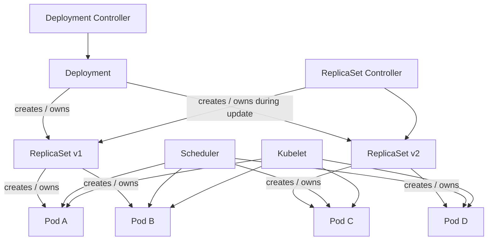
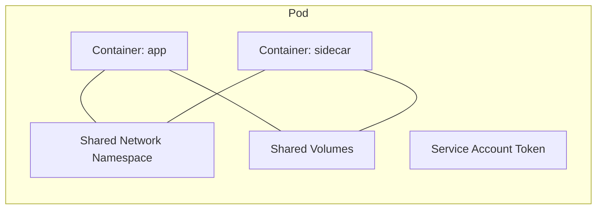
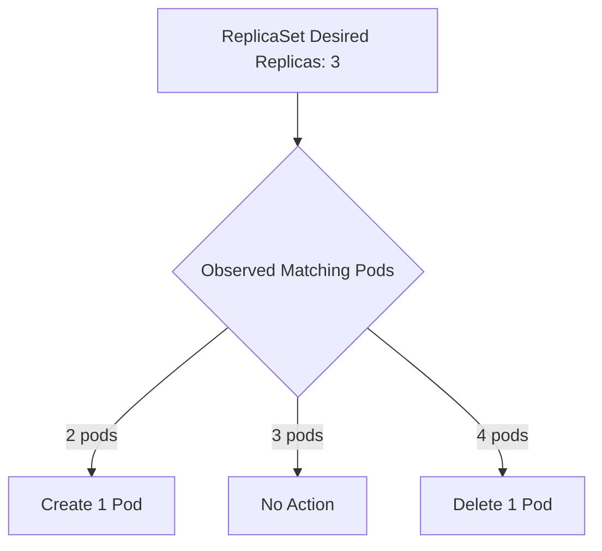
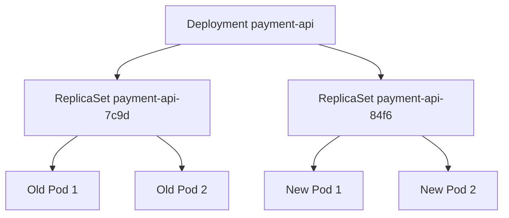
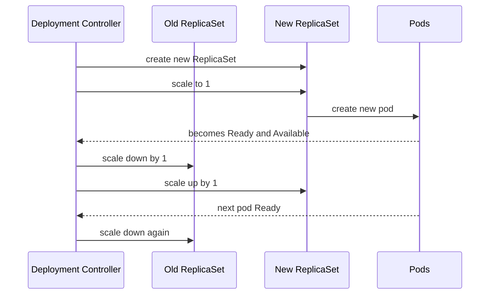
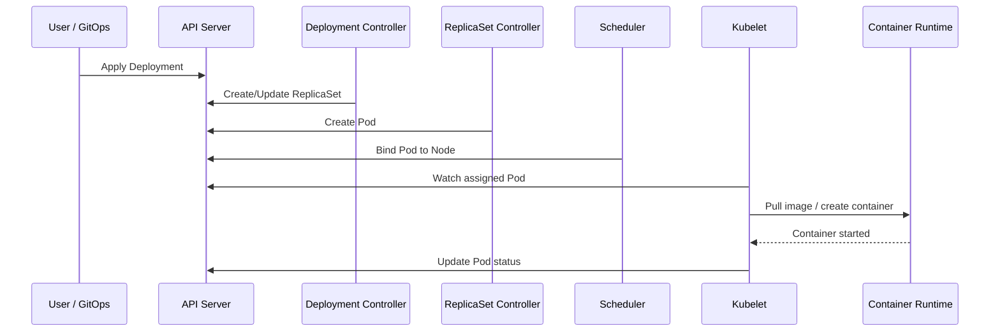
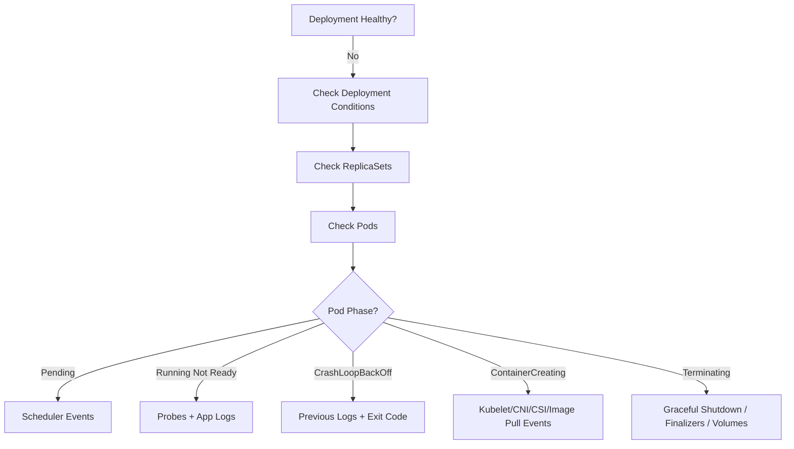

# Pod, Deployment, ReplicaSet Deep Dive

A production engineer should not see a Deployment YAML as a static configuration file. A Deployment is an instruction to a distributed control system.

When you apply it, Kubernetes does not “run YAML”. It creates and reconciles objects:

- a **Deployment** manages rollout intent;
- a **ReplicaSet** manages replica count for a pod template;
- a **Pod** becomes the executable scheduling unit;
- the **kubelet** runs containers on a node;
- controllers continuously compare desired state with observed state.

This part explains how those objects behave in production: lifecycle, ownership, rollout arithmetic, status interpretation, failure modes, and debugging.

---

## 1. The Mental Model

A Deployment is a versioned rollout controller. It does not directly run containers.



You specify the desired state at the Deployment level. Kubernetes expands that intent into lower-level objects.

The simplified reconciliation chain:

```text
Deployment desired state
  -> Deployment controller creates/updates ReplicaSets
  -> ReplicaSet controller creates/deletes Pods
  -> Scheduler assigns Pods to Nodes
  -> Kubelet starts containers
  -> Controllers update status
```

This layered model is the key to debugging. You must know which layer is failing.

---

## 2. Pod: The Smallest Deployable Runtime Unit

A Pod is the smallest deployable unit in Kubernetes. It wraps one or more containers that share selected namespaces and local resources.

A pod has:

- one IP address in the pod network;
- one or more containers;
- shared volumes;
- shared lifecycle boundary;
- labels and annotations;
- a service account identity;
- scheduling constraints;
- resource requests;
- status and conditions.



A pod is not a durable server. Treat it as disposable.

### 2.1 Pod Identity Is Ephemeral

A pod has a name and UID, but both are not stable business identity.

Bad assumptions:

- “This pod will keep the same IP.”
- “This pod name identifies a durable worker.”
- “Local disk state survives rescheduling.”
- “A pod restart is equivalent to application restart only.”

Correct assumptions:

- pods can be deleted and recreated;
- pod IPs change;
- node placement changes;
- local state can disappear;
- replacement pods may overlap with old pods during rollout;
- application identity should be externalized through service discovery, durable storage, leases, or workload identity.

### 2.2 Pod Phase Is Not Enough

Kubernetes pod phase is a coarse summary:

| Phase | Meaning |
|---|---|
| `Pending` | Pod accepted, but one or more containers are not running yet. This includes scheduling and image pull time. |
| `Running` | Pod bound to a node and at least one primary container is running or starting/restarting. |
| `Succeeded` | All containers terminated successfully and will not restart. |
| `Failed` | All containers terminated and at least one failed. |
| `Unknown` | Node/pod state cannot be obtained. |

Production diagnosis usually needs more detail:

- pod conditions;
- container states;
- container waiting reasons;
- events;
- owner references;
- node status;
- probes;
- logs;
- rollout status.

A pod can be `Running` but not `Ready`. That distinction matters.

### 2.3 Pod Conditions

Common conditions include:

| Condition | Operational Meaning |
|---|---|
| `PodScheduled` | Scheduler has assigned the pod to a node. |
| `Initialized` | Init containers completed. |
| `ContainersReady` | All containers are ready. |
| `Ready` | Pod is ready to serve traffic. |
| `PodReadyToStartContainers` | Pod sandbox/network setup is ready in newer Kubernetes versions. |

When debugging, look for the first condition that is false and ask why.

```bash
kubectl get pod <pod-name> -o wide
kubectl describe pod <pod-name>
kubectl get pod <pod-name> -o jsonpath='{.status.conditions}'
```

### 2.4 Container States Inside a Pod

Each container can be:

| State | Meaning |
|---|---|
| `Waiting` | Not running yet. Look at reason/message. |
| `Running` | Process is running. |
| `Terminated` | Process exited. Look at reason, exit code, started/finished time. |

Important waiting reasons:

| Reason | Usual Layer |
|---|---|
| `ImagePullBackOff` | Registry, image name, auth, network, architecture |
| `CrashLoopBackOff` | Application process, config, secret, command, runtime dependency |
| `CreateContainerConfigError` | Invalid config reference, secret/configmap issue |
| `ContainerCreating` | Image pull, volume attach/mount, CNI setup |
| `ErrImagePull` | Image pull failed before backoff |

---

## 3. Multi-Container Pods

A pod can contain multiple containers, but they share fate. If the pod is deleted, all containers go away.

Use multi-container pods only when containers are tightly coupled.

Good cases:

- service mesh sidecar;
- local proxy sidecar;
- log/telemetry sidecar for legacy systems;
- init container preparing config;
- sidecar reloading certificates;
- local helper that must share network namespace.

Bad cases:

- API + worker just because they are in the same repository;
- admin UI + API + scheduler;
- multiple services that need independent scaling;
- unrelated daemons hidden in one pod;
- database + application in the same pod for production.

Senior rule:

> Put containers in the same pod only when they need the same lifecycle, same node, and close local coordination.

---

## 4. Init Containers

Init containers run before app containers. They must complete successfully before the app starts.

Use cases:

- wait for dependency readiness in limited cases;
- render configuration from templates;
- fetch certificates or bootstrap files;
- run schema compatibility checks;
- prepare permissions on mounted volume;
- block startup until preconditions are met.

Example:

```yaml
initContainers:
  - name: render-config
    image: registry.example.com/config-renderer@sha256:REPLACE_ME
    command: ["/bin/render"]
    args:
      - "--input=/config-template/app.yaml"
      - "--output=/generated/app.yaml"
    volumeMounts:
      - name: generated-config
        mountPath: /generated
```

Be careful with init containers that wait for dependencies forever. They can hide architectural coupling and create stuck rollouts.

---

## 5. ReplicaSet: The Replica Count Controller

A ReplicaSet ensures that a specified number of pod replicas are running for a given pod template and selector.

You rarely create ReplicaSets directly in production. Deployments create and manage them.



### 5.1 Selector Is Critical

A ReplicaSet uses a selector to identify pods it owns or should manage.

```yaml
selector:
  matchLabels:
    app.kubernetes.io/name: payment-api
```

The selector must match the pod template labels:

```yaml
template:
  metadata:
    labels:
      app.kubernetes.io/name: payment-api
```

If selectors are wrong, controllers may fail to create pods, fail to adopt pods, or accidentally select pods they should not control.

### 5.2 ReplicaSet Is Not a Rollout Tool

ReplicaSets can maintain replica count. They do not perform rolling updates by themselves in the way Deployments do.

Use Deployments for controlled stateless application updates.

---

## 6. Deployment: The Rollout Controller

A Deployment manages declarative updates for Pods and ReplicaSets.

A Deployment object contains:

- desired replica count;
- pod template;
- selector;
- rollout strategy;
- revision history;
- progress deadline;
- status conditions.

The pod template is the versioned payload. When the template changes, the Deployment creates a new ReplicaSet.

Fields that change the pod template include:

- container image;
- environment variables;
- volume mounts;
- labels under `spec.template.metadata.labels`;
- annotations under `spec.template.metadata.annotations`;
- probes;
- resources;
- security context;
- command/args;
- service account;
- volumes.

Fields outside the pod template may not trigger a new rollout.

### 6.1 Deployment Ownership Chain



You can inspect this:

```bash
kubectl get deployment payment-api
kubectl get rs -l app.kubernetes.io/name=payment-api
kubectl get pods -l app.kubernetes.io/name=payment-api
kubectl describe deployment payment-api
```

---

## 7. Deployment Manifest Baseline

This example focuses on Deployment mechanics. Later parts will improve networking, security, policy, cloud identity, autoscaling, and observability.

```yaml
apiVersion: apps/v1
kind: Deployment
metadata:
  name: payment-api
  labels:
    app.kubernetes.io/name: payment-api
    app.kubernetes.io/component: api
    app.kubernetes.io/part-of: payments
spec:
  replicas: 4
  revisionHistoryLimit: 5
  progressDeadlineSeconds: 300
  minReadySeconds: 10
  strategy:
    type: RollingUpdate
    rollingUpdate:
      maxSurge: 1
      maxUnavailable: 0
  selector:
    matchLabels:
      app.kubernetes.io/name: payment-api
  template:
    metadata:
      labels:
        app.kubernetes.io/name: payment-api
        app.kubernetes.io/component: api
        app.kubernetes.io/part-of: payments
      annotations:
        prometheus.io/scrape: "true"
        prometheus.io/port: "8080"
    spec:
      serviceAccountName: payment-api
      terminationGracePeriodSeconds: 45
      containers:
        - name: app
          image: registry.example.com/payment-api@sha256:REPLACE_ME
          ports:
            - name: http
              containerPort: 8080
          startupProbe:
            httpGet:
              path: /startupz
              port: http
            failureThreshold: 30
            periodSeconds: 2
          readinessProbe:
            httpGet:
              path: /readyz
              port: http
            periodSeconds: 5
            timeoutSeconds: 2
            failureThreshold: 2
          livenessProbe:
            httpGet:
              path: /livez
              port: http
            periodSeconds: 10
            timeoutSeconds: 2
            failureThreshold: 3
          resources:
            requests:
              cpu: "250m"
              memory: "512Mi"
            limits:
              memory: "1Gi"
```

Key decisions:

| Field | Reason |
|---|---|
| `replicas: 4` | Enough capacity to tolerate one unavailable pod if the application needs HA. |
| `maxUnavailable: 0` | During rollout, do not intentionally reduce available capacity. |
| `maxSurge: 1` | Allow one extra pod to come up before removing old pods. |
| `minReadySeconds: 10` | Avoid counting a pod as available immediately after one readiness success. |
| `progressDeadlineSeconds: 300` | Detect stuck rollout. |
| `revisionHistoryLimit: 5` | Keep rollback history without unbounded ReplicaSet accumulation. |

---

## 8. Rollout Mechanics

A rolling update gradually replaces old pods with new pods.

Suppose:

```yaml
replicas: 4
maxSurge: 1
maxUnavailable: 0
```

Allowed during rollout:

- desired replicas: 4;
- maximum total pods: 5;
- minimum available pods: 4.

Simplified rollout:



The Deployment controller is balancing availability and rollout progress using your strategy fields.

### 8.1 `maxSurge`

`maxSurge` controls how many extra pods can exist above desired replicas during rollout.

Example:

| Replicas | maxSurge | Max Total Pods |
|---:|---:|---:|
| 4 | 1 | 5 |
| 4 | 25% | 5 |
| 10 | 30% | 13 |

Large surge speeds rollout but consumes extra capacity. In cloud clusters, this can trigger node autoscaling.

### 8.2 `maxUnavailable`

`maxUnavailable` controls how many desired pods can be unavailable during rollout.

Example:

| Replicas | maxUnavailable | Minimum Available |
|---:|---:|---:|
| 4 | 0 | 4 |
| 4 | 1 | 3 |
| 10 | 20% | 8 |

For user-facing APIs, `maxUnavailable: 0` is often safer if the cluster has spare capacity. For internal workers, allowing unavailability may be acceptable.

### 8.3 The Deadlock Pattern

This configuration can deadlock if no spare capacity exists:

```yaml
replicas: 4
strategy:
  rollingUpdate:
    maxSurge: 1
    maxUnavailable: 0
```

Why?

- Kubernetes must create one extra pod before deleting an old one.
- If the cluster has no room and autoscaling cannot add a node, the new pod stays Pending.
- Since no new pod becomes available, old pods are not deleted.
- Rollout stalls.

Possible fixes:

- ensure cluster autoscaler/Karpenter can add capacity;
- allow `maxUnavailable: 1` if SLO permits;
- reduce requests if oversized;
- pre-scale node capacity before rollout;
- use progressive rollout with capacity planning.

### 8.4 The Capacity Drop Pattern

This configuration may reduce capacity during rollout:

```yaml
replicas: 4
strategy:
  rollingUpdate:
    maxSurge: 0
    maxUnavailable: 1
```

Kubernetes may delete an old pod before creating a new one. That saves capacity but can affect availability.

Use it when capacity is constrained and the service can tolerate temporary reduction.

---

## 9. Availability Is Not Readiness Alone

A pod becomes available to a Deployment only after it is Ready and has satisfied `minReadySeconds`.

```text
Ready now != Available for rollout accounting
```

`minReadySeconds` is useful when a pod can pass readiness briefly and fail shortly after due to warmup bugs, dependency initialization, JIT effects, or delayed background failures.

Example:

```yaml
minReadySeconds: 15
```

This says: do not count the pod as available until it has been ready for at least 15 seconds.

---

## 10. Deployment Conditions

Deployment status conditions help explain rollout state.

Common conditions:

| Condition | Meaning |
|---|---|
| `Available` | Deployment has minimum availability. |
| `Progressing` | Deployment is making progress or has completed progress. |
| `ReplicaFailure` | ReplicaSet failed to create pods. |

Inspect:

```bash
kubectl describe deployment payment-api
kubectl rollout status deployment/payment-api
```

A rollout can fail because:

- new pods cannot schedule;
- image cannot pull;
- containers crash;
- readiness never succeeds;
- quota prevents new pods;
- admission policy rejects pod template;
- service account or secret missing;
- volume mount fails.

The Deployment status tells you that rollout is stuck. Pod events usually tell you why.

---

## 11. Rollback and Revision History

Kubernetes stores Deployment revisions by keeping old ReplicaSets, subject to `revisionHistoryLimit`.

Commands:

```bash
kubectl rollout history deployment/payment-api
kubectl rollout undo deployment/payment-api
kubectl rollout undo deployment/payment-api --to-revision=3
```

Rollback is not magic. It restores a previous pod template. It does not automatically roll back:

- database schema changes;
- external configuration;
- cloud IAM permissions;
- secret rotations;
- queue message format changes;
- irreversible side effects;
- downstream API contract changes.

Production rollback must be designed at system level, not just Deployment level.

### 11.1 Rollback Safety Matrix

| Change Type | Kubernetes Rollback Enough? | Extra Requirement |
|---|---|---|
| Image-only stateless bug | Often yes | Previous image still available |
| Config bug | Maybe | Config version rollback |
| DB migration | Usually no | Backward-compatible migration or rollback script |
| Message schema change | Usually no | Compatibility window |
| IAM permission change | No | Cloud IAM rollback |
| Secret rotation | No | Credential overlap or rollback plan |
| Feature flag | Often yes | Flag system audit and propagation |

---

## 12. Restart vs Reschedule vs Rollout

These are different operations.

| Event | What Happens |
|---|---|
| Container restart | Same pod, same node, container process restarts. |
| Pod recreation | Old pod deleted, new pod created, possibly new IP/name. |
| Reschedule | Pod replacement lands on another node. |
| Rollout | Deployment creates new ReplicaSet and replaces old pods with new template. |
| Rollback | Deployment returns to previous pod template. |

Do not confuse container restart count with rollout count. A pod can restart many times without a Deployment rollout.

---

## 13. Labels, Selectors, and Ownership

Labels are not decoration. They are control-plane join keys.

Recommended baseline labels:

```yaml
app.kubernetes.io/name: payment-api
app.kubernetes.io/instance: payment-api-prod
app.kubernetes.io/version: "1.42.7"
app.kubernetes.io/component: api
app.kubernetes.io/part-of: payments
app.kubernetes.io/managed-by: argocd
```

Use labels for selection and grouping. Use annotations for non-identifying metadata.

### 13.1 Selector Immutability

Deployment selectors are effectively immutable in normal production workflows. Choose them carefully.

Bad selector:

```yaml
selector:
  matchLabels:
    version: v1
```

Why bad?

A version label changes during rollout. Selectors should identify the stable workload identity, not the release version.

Better:

```yaml
selector:
  matchLabels:
    app.kubernetes.io/name: payment-api
```

Put version on the pod template label for observability, not as the Deployment selector.

---

## 14. PodDisruptionBudget Interaction

A PodDisruptionBudget, or PDB, limits voluntary disruptions. It is not part of Deployment itself, but it affects rollout, drain, and node maintenance.

Example:

```yaml
apiVersion: policy/v1
kind: PodDisruptionBudget
metadata:
  name: payment-api
spec:
  minAvailable: 3
  selector:
    matchLabels:
      app.kubernetes.io/name: payment-api
```

For a Deployment with 4 replicas, this permits one voluntary disruption.

PDBs matter during:

- node drains;
- cluster upgrades;
- autoscaler consolidation;
- maintenance operations;
- some platform automation.

A PDB does not prevent all failures. It does not stop a node from dying or a pod from crashing.

---

## 15. Scheduling Path of a Pod

From `kubectl apply` to container running:



Failure can occur at every step.

| Step | Failure Example |
|---|---|
| API admission | Invalid spec, rejected policy, quota exceeded |
| Deployment controller | Selector conflict, invalid rollout config |
| ReplicaSet controller | Pod creation denied, quota exceeded |
| Scheduler | Insufficient CPU/memory, node affinity mismatch, taints not tolerated |
| Kubelet | Image pull failure, volume mount failure, CNI failure |
| Runtime | Entrypoint failure, permission denied, app crash |
| Readiness | App starts but never becomes ready |

This path becomes essential when debugging Pending pods and stuck rollouts.

---

## 16. Common Production Failure Modes

### 16.1 Pending Forever

Symptoms:

```bash
kubectl get pod
# payment-api-xxx 0/1 Pending
```

Check:

```bash
kubectl describe pod <pod-name>
```

Likely causes:

- insufficient CPU or memory;
- node selector mismatch;
- required node affinity cannot be satisfied;
- taint not tolerated;
- persistent volume cannot bind;
- namespace quota exceeded;
- cluster autoscaler cannot scale;
- cloud subnet/IP exhaustion;
- GPU/special hardware unavailable.

Layer:

```text
Scheduler / cluster capacity / cloud infrastructure
```

### 16.2 ContainerCreating Stuck

Likely causes:

- image pull slow;
- CNI networking issue;
- volume attach/mount delay;
- secret/configmap mount issue;
- container runtime problem;
- node disk pressure.

Layer:

```text
Kubelet / container runtime / CNI / CSI
```

### 16.3 CrashLoopBackOff

Likely causes:

- app exits on startup;
- missing config;
- bad secret;
- permission denied due to non-root/read-only filesystem;
- incompatible command/args;
- DB migration failure;
- framework cannot bind port;
- memory too low.

Commands:

```bash
kubectl logs <pod-name> --previous
kubectl describe pod <pod-name>
```

Layer:

```text
Application / container contract
```

### 16.4 Rollout Stuck Because Readiness Never Passes

Symptoms:

```bash
kubectl rollout status deployment/payment-api
# Waiting for deployment "payment-api" rollout to finish...
```

Check:

```bash
kubectl get pods -l app.kubernetes.io/name=payment-api
kubectl describe pod <new-pod>
kubectl logs <new-pod>
```

Likely causes:

- readiness endpoint checks failing dependency;
- app not listening on expected port;
- startup too slow for probe thresholds;
- wrong config;
- service account permission issue;
- schema mismatch;
- TLS/certificate issue.

Layer:

```text
Application readiness / dependency / configuration
```

### 16.5 Rollout Stuck Because New Pods Cannot Schedule

Symptoms:

- old pods keep running;
- new pods stay Pending;
- Deployment does not progress.

Common with:

```yaml
maxSurge: 1
maxUnavailable: 0
```

Likely causes:

- no spare node capacity;
- autoscaler blocked;
- requests too high;
- PDB or topology constraints;
- subnet/IP exhaustion on cloud CNI.

Layer:

```text
Cluster capacity / cloud networking / autoscaling
```

### 16.6 Accidental Selector Collision

Symptoms:

- Deployment appears to manage unexpected pods;
- ReplicaSet adoption behavior surprises team;
- pods disappear or scale unexpectedly.

Cause:

- broad selector labels like `app: api` shared across workloads.

Fix:

- use stable, specific, standardized labels;
- isolate namespaces;
- use review policies for selectors.

---

## 17. Debugging Workflow

Do not start with random commands. Start with the control chain.



### 17.1 Command Sequence

```bash
# 1. Deployment overview
kubectl get deployment payment-api
kubectl describe deployment payment-api
kubectl rollout status deployment/payment-api

# 2. ReplicaSet history
kubectl get rs -l app.kubernetes.io/name=payment-api
kubectl rollout history deployment/payment-api

# 3. Pod state
kubectl get pods -l app.kubernetes.io/name=payment-api -o wide
kubectl describe pod <pod-name>

# 4. Logs
kubectl logs <pod-name>
kubectl logs <pod-name> --previous

# 5. Events
kubectl get events --sort-by=.lastTimestamp

# 6. YAML truth
kubectl get deployment payment-api -o yaml
kubectl get pod <pod-name> -o yaml
```

### 17.2 What to Read in `kubectl describe pod`

Prioritize:

1. Events at the bottom.
2. Container state and last state.
3. Exit code and reason.
4. Probe failures.
5. Image name and pull status.
6. Node assignment.
7. Volumes and mounts.
8. Service account.
9. QoS class.
10. Conditions.

Events are often the fastest path to the layer of failure.

---

## 18. Status Interpretation Examples

### Example A: Image Pull Problem

```text
State: Waiting
Reason: ImagePullBackOff
Events:
  Failed to pull image "registry.example.com/payment-api:1.42.7"
```

Diagnosis direction:

- registry auth;
- image exists;
- node egress;
- image architecture;
- cloud registry permission.

### Example B: App Crash

```text
Last State: Terminated
Reason: Error
Exit Code: 1
Restart Count: 8
```

Diagnosis direction:

- previous logs;
- config validation;
- secret presence;
- command/args;
- startup dependency;
- filesystem permissions.

### Example C: OOM

```text
Last State: Terminated
Reason: OOMKilled
Exit Code: 137
```

Diagnosis direction:

- memory limit;
- heap sizing;
- non-heap memory;
- request volume;
- caches;
- leak;
- startup memory spike.

### Example D: Readiness Failure

```text
Readiness probe failed: HTTP probe failed with statuscode: 503
```

Diagnosis direction:

- app dependencies;
- readiness endpoint logic;
- startup ordering;
- port/path mismatch;
- auth middleware accidentally protecting health endpoint.

---

## 19. Deployment Strategy Decision Matrix

| Workload Type | Typical Strategy | Notes |
|---|---|---|
| Stateless HTTP API | RollingUpdate, `maxSurge > 0`, low/no unavailable | Needs readiness and graceful shutdown. |
| Internal worker | RollingUpdate, may allow unavailable | Consider message lease and idempotency. |
| Singleton scheduler | Deployment with replicas 1 is risky unless leader election exists | Prefer leader election or external scheduler semantics. |
| Stateful database | Not Deployment | Use StatefulSet/operator, or managed cloud service. |
| Batch job | Not Deployment | Use Job/CronJob. |
| Daemon per node | Not Deployment | Use DaemonSet. |
| Canary/progressive release | Deployment plus ingress/service mesh/controller | Native Deployment alone is basic rolling update, not full canary analysis. |

---

## 20. Production Rollout Design

A real rollout plan includes more than `kubectl apply`.

### 20.1 Pre-Rollout Checks

- New image exists and is scanned.
- Config exists for target namespace.
- Secret references exist.
- Required service account permissions exist.
- New pod template passes policy admission.
- Cluster has rollout capacity.
- Downstream services can handle new replica behavior.
- Database/message schema compatibility is confirmed.
- SLO and dashboard are ready.
- Rollback path is known.

### 20.2 Rollout Watch

Watch:

- Deployment progressing condition;
- new ReplicaSet replica count;
- new pod readiness;
- old pod termination;
- error rate;
- latency;
- saturation;
- queue depth;
- downstream dependency metrics;
- node autoscaler behavior;
- load balancer target health.

### 20.3 Post-Rollout Validation

Validate:

- all desired replicas available;
- old ReplicaSet scaled down;
- no unexpected restarts;
- no sustained probe failures;
- error rate normal;
- latency normal;
- resource usage within expected bounds;
- logs free of startup warnings;
- business smoke tests pass.

---

## 21. EKS and AKS Specific Implications

The Pod/Deployment/ReplicaSet model is Kubernetes-native, but cloud infrastructure changes failure modes.

### 21.1 EKS

EKS production rollouts can be affected by:

- VPC CNI IP exhaustion;
- subnet capacity;
- ECR pull permissions;
- IAM role mapping or Pod Identity/IRSA issues;
- security group rules;
- ALB/NLB target registration delay;
- node group capacity;
- Karpenter consolidation;
- Spot interruption;
- EBS volume attach limits.

A pod stuck Pending on EKS may be a Kubernetes scheduling issue, but it may also be a VPC/subnet/IP/node provisioning issue.

### 21.2 AKS

AKS production rollouts can be affected by:

- Azure CNI subnet capacity or overlay configuration;
- ACR pull permissions;
- managed identity/workload identity configuration;
- Application Gateway or Azure Load Balancer health behavior;
- node pool autoscaling limits;
- VM SKU availability;
- Azure Disk attach limits;
- upgrade surge settings;
- regional quota.

A rollout that works in a small dev cluster can fail in production because production has stricter networking, identity, policy, and quota constraints.

---

## 22. Anti-Patterns

### 22.1 Deployment as a Dumping Ground

One Deployment should not represent multiple unrelated runtime roles.

Bad:

```text
payment-service deployment runs API, batch processor, scheduler, report generator
```

Better:

```text
payment-api deployment
payment-worker deployment
payment-scheduler deployment with leader election
payment-report-cronjob
```

### 22.2 Readiness Equals Liveness

Bad:

```yaml
livenessProbe:
  httpGet:
    path: /health
readinessProbe:
  httpGet:
    path: /health
```

Maybe acceptable for trivial demos. Usually wrong in production.

### 22.3 Version Label in Selector

Bad:

```yaml
selector:
  matchLabels:
    app: payment-api
    version: v1
```

A version changes. A selector should be stable.

### 22.4 Rollout Without Capacity Model

Bad assumption:

> maxSurge will just work.

Reality:

- surge pods need CPU/memory;
- node autoscaler needs time;
- cloud provider may lack quota;
- subnets may lack IPs;
- admission policies may reject the new pod.

### 22.5 Rollback as Disaster Recovery

Deployment rollback is not DR. It is pod-template rollback.

Do not use it as a substitute for:

- database backup;
- schema compatibility;
- event replay strategy;
- cross-region recovery;
- secret rollback;
- cloud IAM version control.

---

## 23. Senior Engineer Heuristics

1. **Deployment owns rollout intent, ReplicaSet owns replica count, Pod owns runtime execution.**
2. **Debug by following the ownership chain downward.**
3. **A Running pod is not necessarily a Ready pod.**
4. **A Ready pod is not necessarily a correct service.**
5. **Readiness controls traffic; liveness controls restart. Confusing them creates outages.**
6. **Selectors are control-plane join keys; treat them like database keys.**
7. **Rollback only rolls back the pod template. System rollback is larger.**
8. **Rollout strategy is capacity policy encoded in YAML.**
9. **Pending is usually scheduling/capacity; CrashLoopBackOff is usually application/container contract.**
10. **Cloud networking and identity frequently appear as Kubernetes rollout failures.**

---

## 24. Practical Exercises

### Exercise 1: Trace Ownership

Deploy a simple app and run:

```bash
kubectl get deployment
kubectl get rs
kubectl get pods
kubectl get pod <pod-name> -o jsonpath='{.metadata.ownerReferences}'
kubectl get rs <rs-name> -o jsonpath='{.metadata.ownerReferences}'
```

Draw the ownership tree.

### Exercise 2: Force a Rollout

Change only an annotation under `spec.template.metadata.annotations`:

```yaml
kubectl patch deployment payment-api -p '{
  "spec": {
    "template": {
      "metadata": {
        "annotations": {
          "restartedAt": "2026-07-03T00:00:00Z"
        }
      }
    }
  }
}'
```

Observe new ReplicaSet creation.

### Exercise 3: Break Readiness

Set readiness path to a wrong endpoint.

Observe:

- new pods created;
- containers running;
- readiness failing;
- rollout stuck;
- old pods preserved depending on rollout strategy.

Then fix it.

### Exercise 4: Capacity Deadlock Simulation

Use high resource requests so surge pod cannot schedule.

Observe:

- new pod Pending;
- Deployment not progressing;
- events showing insufficient resources;
- old pods still running.

Then compare behavior with:

```yaml
maxUnavailable: 1
maxSurge: 0
```

### Exercise 5: Rollback Test

Deploy version A, then B, then break C.

Run:

```bash
kubectl rollout history deployment/payment-api
kubectl rollout undo deployment/payment-api
```

Document what changed and what did not change.

---

## 25. Production Review Checklist

### Deployment

- [ ] Selector is stable and specific.
- [ ] Labels follow standard taxonomy.
- [ ] Replicas reflect availability requirement.
- [ ] Rollout strategy matches capacity and SLO.
- [ ] `progressDeadlineSeconds` is configured.
- [ ] `minReadySeconds` is considered for unstable warmup.
- [ ] `revisionHistoryLimit` is bounded.
- [ ] Pod template changes are intentional.

### Pod

- [ ] Service account is explicit.
- [ ] Probes are separated and meaningful.
- [ ] Resource requests are present.
- [ ] Shutdown grace period is realistic.
- [ ] Security context is appropriate.
- [ ] Volumes are explicit and bounded.
- [ ] Init containers have bounded behavior.

### Rollout

- [ ] Cluster has surge capacity or strategy avoids surge.
- [ ] Readiness reflects true serving ability.
- [ ] Rollback plan includes non-Kubernetes changes.
- [ ] Observability exists before rollout.
- [ ] Cloud IAM/identity dependencies are ready.
- [ ] Registry pulls work from node environment.
- [ ] Quotas and policies are validated.

### Debugging

- [ ] Team can explain Deployment → ReplicaSet → Pod ownership.
- [ ] Team knows how to inspect events.
- [ ] Team knows how to read previous container logs.
- [ ] Team can distinguish Pending, CrashLoopBackOff, NotReady, and rollout timeout.
- [ ] Team has run at least one rollback drill.

---

## 26. What This Unlocks

At this point, you should be able to read a Deployment not as YAML, but as a set of operational promises:

- how many replicas should exist;
- how they are selected;
- how they roll forward;
- how they roll back;
- how readiness gates rollout;
- how capacity affects deployment safety;
- how pods move through scheduling and runtime phases;
- where to debug when the system diverges from intent.

This is the transition from “I can deploy to Kubernetes” to “I can reason about Kubernetes rollout behavior under production constraints.”

Next, we will compare Kubernetes workload APIs: Deployment, StatefulSet, DaemonSet, Job, and CronJob. That is where we stop treating Deployment as the default answer and start choosing the correct controller for the job.

---

## References

- Kubernetes Documentation — Pods: `https://kubernetes.io/docs/concepts/workloads/pods/`
- Kubernetes Documentation — Pod Lifecycle: `https://kubernetes.io/docs/concepts/workloads/pods/pod-lifecycle/`
- Kubernetes Documentation — ReplicaSet: `https://kubernetes.io/docs/concepts/workloads/controllers/replicaset/`
- Kubernetes Documentation — Deployments: `https://kubernetes.io/docs/concepts/workloads/controllers/deployment/`
- Kubernetes Documentation — Update a Deployment Without Downtime: `https://kubernetes.io/docs/tasks/run-application/update-deployment-rolling/`
- Kubernetes API Reference — Deployment v1: `https://kubernetes.io/docs/reference/kubernetes-api/workload-resources/deployment-v1/`
- Kubernetes Documentation — Configure Pod Disruption Budget: `https://kubernetes.io/docs/tasks/run-application/configure-pdb/`
- AWS EKS Best Practices Guide: `https://docs.aws.amazon.com/eks/latest/best-practices/introduction.html`
- Azure AKS Baseline Architecture: `https://learn.microsoft.com/en-us/azure/architecture/reference-architectures/containers/aks/baseline-aks`
