# Workload API Design Patterns

Kubernetes does not ask, “what kind of application did you build?”

It asks a more operational question:

> What lifecycle contract should the control plane maintain for this set of Pods?

That is the real purpose of workload APIs.

A `Deployment`, `StatefulSet`, `DaemonSet`, `Job`, and `CronJob` are not just different YAML templates. They are different **control contracts**. Each one encodes a different answer to these questions:

- should the Pods be replaceable or identity-bearing?
- should they run forever or terminate successfully?
- should there be one per cluster, one per node, N replicas, or one per schedule?
- should rollout preserve identity, availability, or completion semantics?
- should Kubernetes restart failed Pods forever, retry until completion, or create a new execution later?
- should storage follow a Pod, a replica identity, or a task execution?
- should the workload survive node loss by being rescheduled somewhere else, or should it be tied to node-local behavior?

Most Kubernetes incidents caused by “bad YAML” are not YAML incidents. They are **wrong workload contract** incidents.

This part builds the decision model.

---

## 1. The Workload API Mental Model

A Pod is the execution unit, but a production system rarely manages bare Pods directly. Bare Pods are too fragile because they do not provide replacement, rollout, scaling, identity management, or completion semantics.

Workload APIs wrap Pod templates with controllers.

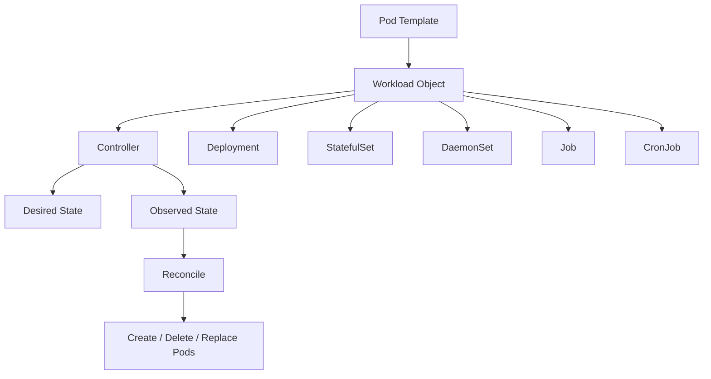

The controller continuously compares desired state with observed state and takes action.

The type of workload determines what “correct” means.

For a `Deployment`, correct usually means:

> N interchangeable Pods are running and available, with controlled rollout from old template to new template.

For a `StatefulSet`, correct means:

> N Pods with stable ordinal identity, stable network identity, and stable storage identity exist and are updated according to ordered semantics.

For a `DaemonSet`, correct means:

> every eligible node runs exactly one copy of this Pod.

For a `Job`, correct means:

> a finite task eventually reaches the requested number of successful completions.

For a `CronJob`, correct means:

> Jobs are created according to a time schedule, within concurrency and deadline rules.

The API object is therefore the operational policy.

---

## 2. Selection Matrix

Use this matrix before writing YAML.

| Requirement | Best Fit | Why |
|---|---|---|
| Stateless HTTP/API service | `Deployment` | Replicas are interchangeable; rolling update is natural |
| Stateless worker consuming a queue forever | `Deployment` | Replicas are interchangeable; scaling can follow queue depth |
| Stream processor with shard assignment handled by app/framework | Usually `Deployment` | Identity often belongs to consumer group/protocol, not Pod name |
| Database, broker, quorum system, or replica with identity | `StatefulSet` | Stable identity and storage matter |
| Per-node log collector / network agent / storage agent | `DaemonSet` | One Pod per eligible node |
| One-off migration / batch task | `Job` | Completion is the desired outcome |
| Scheduled backup/report/reconciliation | `CronJob` | Periodic Job creation is the desired outcome |
| Admin command that must run once manually | `Job` | Execution should terminate and preserve status |
| Sidecar inside another Pod | Not a workload API | It is part of the Pod template |
| Global singleton service | Usually avoid; if required, `Deployment` with `replicas: 1` plus leader election | Kubernetes does not make singleton business semantics safe by itself |

The key distinction is not “stateful versus stateless.” It is **identity versus replaceability**.

---

## 3. The Five Workload Contracts

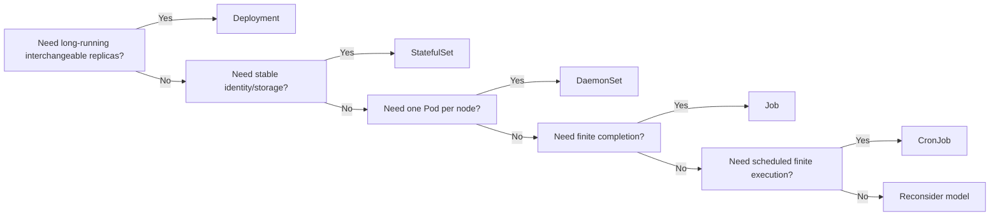

This decision tree is intentionally simple. Complexity usually comes later: networking, persistence, security, scheduling, cost, autoscaling, and observability.

But the first decision must be clean.

---

## 4. Deployment Pattern

A `Deployment` manages stateless, replaceable Pods through a `ReplicaSet`.

Use it when all replicas can be treated as equivalent.

Good examples:

- REST API service;
- GraphQL gateway;
- stateless Java service;
- Node.js frontend backend-for-frontend;
- queue consumer where offset/ack state is external;
- gRPC service;
- horizontally scalable worker;
- internal control-plane component that can be leader-elected.

Bad examples:

- primary database node with local storage;
- broker replica requiring stable name and disk identity;
- application using local disk as durable state;
- workload whose identity is encoded in Pod name without leader election or durable coordination.

### 4.1 Deployment Invariant

The Deployment invariant is:

> The desired number of available interchangeable Pods should exist, and template changes should transition safely from old ReplicaSet to new ReplicaSet.

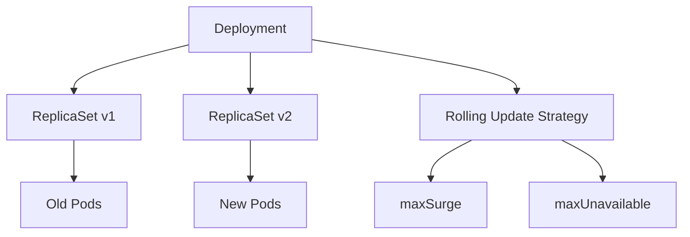

A Deployment does not guarantee:

- request draining by itself;
- database migration safety;
- compatibility between versions;
- exactly-once processing;
- stable pod identity;
- per-replica storage identity;
- global singleton correctness.

Those must be designed separately.

### 4.2 Baseline Deployment

```yaml
apiVersion: apps/v1
kind: Deployment
metadata:
  name: order-api
  labels:
    app.kubernetes.io/name: order-api
    app.kubernetes.io/component: api
spec:
  replicas: 3
  revisionHistoryLimit: 5
  progressDeadlineSeconds: 600
  strategy:
    type: RollingUpdate
    rollingUpdate:
      maxSurge: 1
      maxUnavailable: 0
  selector:
    matchLabels:
      app.kubernetes.io/name: order-api
  template:
    metadata:
      labels:
        app.kubernetes.io/name: order-api
        app.kubernetes.io/component: api
    spec:
      terminationGracePeriodSeconds: 45
      containers:
        - name: app
          image: registry.example.com/platform/order-api:2026.07.03-1a2b3c4
          imagePullPolicy: IfNotPresent
          ports:
            - name: http
              containerPort: 8080
          readinessProbe:
            httpGet:
              path: /ready
              port: http
            periodSeconds: 5
            failureThreshold: 2
          livenessProbe:
            httpGet:
              path: /live
              port: http
            periodSeconds: 10
            failureThreshold: 3
          startupProbe:
            httpGet:
              path: /started
              port: http
            periodSeconds: 5
            failureThreshold: 24
          resources:
            requests:
              cpu: "250m"
              memory: "512Mi"
            limits:
              memory: "1Gi"
          securityContext:
            allowPrivilegeEscalation: false
            readOnlyRootFilesystem: true
            runAsNonRoot: true
            capabilities:
              drop: ["ALL"]
```

Key choices:

- `maxUnavailable: 0` prioritizes availability during rollout.
- `maxSurge: 1` allows one extra Pod above desired replica count.
- `progressDeadlineSeconds` prevents endless silent rollout failure.
- readiness protects traffic routing.
- startup protects slow boot from premature liveness failure.
- memory limit is set; CPU limit is intentionally omitted in many latency-sensitive systems to avoid hard throttling unless governance requires it.

### 4.3 Deployment Failure Modes

| Failure | Symptom | Common Cause | Correct Response |
|---|---|---|---|
| Rollout stuck | `ProgressDeadlineExceeded` | New Pods never become ready | inspect events, probes, image, config, dependencies |
| Partial brownout | some new Pods ready but incompatible | no backward-compatible contract | fix app compatibility, rollback, use canary/progressive delivery |
| CrashLoopBackOff | repeated container crash | bad config, missing secret, startup error | read previous logs, inspect exit code, fix container contract |
| Traffic to unready app | readiness too shallow | readiness only checks process, not dependency readiness | improve readiness contract carefully |
| Rollout too aggressive | capacity drops during rollout | `maxUnavailable` too high | tune rollout strategy and PDB |
| Old Pods killed before draining | dropped requests | weak termination handling | implement SIGTERM/drain/preStop/termination grace |

### 4.4 Deployment Decision Heuristics

Choose `Deployment` when:

- any replica can serve any request;
- identity does not matter;
- storage is external or ephemeral;
- scaling is horizontal;
- rollout can replace replicas gradually;
- traffic routing can be readiness-gated.

Do not choose `Deployment` merely because it is familiar.

The default workload should be `Deployment`, but not every workload is default-shaped.

---

## 5. StatefulSet Pattern

A `StatefulSet` manages Pods with stable identity.

Use it when each replica has a persistent role or durable identity.

Good examples:

- databases;
- brokers;
- distributed coordination systems;
- stateful search nodes;
- systems with replica ordinal identity;
- workloads needing stable DNS names;
- workloads needing stable PVC per replica.

### 5.1 StatefulSet Invariant

The StatefulSet invariant is:

> Each ordinal replica has stable identity across rescheduling: name, DNS identity, and optionally storage identity.

For a StatefulSet named `ledger-db` with three replicas:

```text
ledger-db-0
ledger-db-1
ledger-db-2
```

The identity is not random. It is part of the contract.

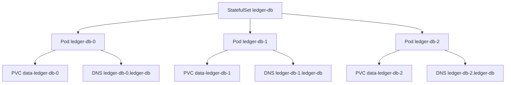

A StatefulSet is not “a Deployment with disk.” It changes the semantics of replacement.

### 5.2 Baseline StatefulSet

```yaml
apiVersion: v1
kind: Service
metadata:
  name: ledger-db
spec:
  clusterIP: None
  selector:
    app.kubernetes.io/name: ledger-db
  ports:
    - name: db
      port: 5432
---
apiVersion: apps/v1
kind: StatefulSet
metadata:
  name: ledger-db
spec:
  serviceName: ledger-db
  replicas: 3
  podManagementPolicy: OrderedReady
  updateStrategy:
    type: RollingUpdate
  selector:
    matchLabels:
      app.kubernetes.io/name: ledger-db
  template:
    metadata:
      labels:
        app.kubernetes.io/name: ledger-db
    spec:
      terminationGracePeriodSeconds: 60
      containers:
        - name: db
          image: registry.example.com/platform/ledger-db:16.3-custom
          ports:
            - name: db
              containerPort: 5432
          volumeMounts:
            - name: data
              mountPath: /var/lib/ledger-db
          readinessProbe:
            tcpSocket:
              port: db
            periodSeconds: 10
          resources:
            requests:
              cpu: "1"
              memory: "4Gi"
            limits:
              memory: "8Gi"
  volumeClaimTemplates:
    - metadata:
        name: data
      spec:
        accessModes: ["ReadWriteOnce"]
        storageClassName: gp3
        resources:
          requests:
            storage: 100Gi
```

In AKS, the `storageClassName` might instead be an Azure Disk CSI class such as `managed-csi` or a custom class. In EKS, it may map to EBS CSI driver classes such as `gp3`.

The abstraction is Kubernetes `StorageClass`; the implementation is cloud-specific.

### 5.3 StatefulSet Misuse

Do not use StatefulSet just because the application is “important.”

Use it when identity matters.

Common mistakes:

- using StatefulSet for stateless APIs because “stable names feel safer”;
- assuming StatefulSet makes a database production-ready;
- forgetting backup/restore design;
- forgetting quorum safety during rollout;
- forgetting zone-aware storage constraints;
- using persistent volumes without testing node or zone failure;
- treating PVC deletion as equivalent to StatefulSet deletion.

StatefulSet gives you stable identity. It does not give you:

- backup;
- replication;
- encryption;
- failover policy;
- data consistency;
- point-in-time recovery;
- cross-region disaster recovery;
- database operational expertise.

### 5.4 OrderedReady vs Parallel

`podManagementPolicy: OrderedReady` means Kubernetes creates or deletes Pods in ordinal order and waits for readiness at each step.

`Parallel` allows faster operations but removes ordered guarantees.

Use `OrderedReady` when identity order matters. Use `Parallel` only when the application can tolerate independent creation/deletion.

### 5.5 StatefulSet Failure Modes

| Failure | Symptom | Root Cause | Response |
|---|---|---|---|
| Pod stuck pending | PVC cannot bind or volume zone mismatch | storage provisioning/topology issue | inspect PVC/PV/events/storage class |
| Rescheduled Pod cannot mount volume | volume attached elsewhere | cloud disk attachment lag or zone issue | inspect CSI events/cloud attachment |
| Rollout stuck at ordinal | lower ordinal not ready | ordered rollout blocks next replica | fix the blocking replica or change strategy intentionally |
| Data loss after deletion | PVC deleted manually | mistaken lifecycle assumption | define retention policy and backup workflow |
| Split brain | multiple active identities | app-level failover bug | fix consensus/fencing, not YAML only |

StatefulSet is powerful because it preserves identity. It is dangerous because identity amplifies operational mistakes.

---

## 6. DaemonSet Pattern

A `DaemonSet` ensures that all or selected nodes run a Pod.

Use it for node-level services.

Good examples:

- log collector;
- metrics collector;
- node monitoring agent;
- CNI/node networking component;
- storage daemon;
- security agent;
- node-local DNS cache;
- GPU device plugin;
- per-node proxy.

### 6.1 DaemonSet Invariant

The DaemonSet invariant is:

> Every eligible node should run one copy of this Pod.

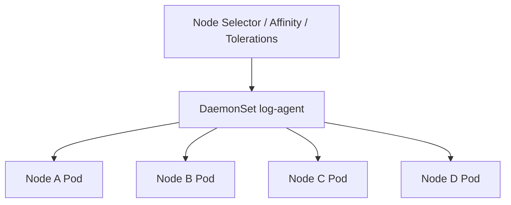

Eligibility depends on:

- node selector;
- node affinity;
- taints and tolerations;
- scheduling constraints;
- OS/architecture constraints;
- cloud provider node pool design.

### 6.2 Baseline DaemonSet

```yaml
apiVersion: apps/v1
kind: DaemonSet
metadata:
  name: node-log-agent
  namespace: platform-observability
spec:
  selector:
    matchLabels:
      app.kubernetes.io/name: node-log-agent
  updateStrategy:
    type: RollingUpdate
    rollingUpdate:
      maxUnavailable: 10%
  template:
    metadata:
      labels:
        app.kubernetes.io/name: node-log-agent
    spec:
      serviceAccountName: node-log-agent
      tolerations:
        - operator: Exists
      containers:
        - name: agent
          image: registry.example.com/platform/node-log-agent:2.8.1
          resources:
            requests:
              cpu: "100m"
              memory: "256Mi"
            limits:
              memory: "512Mi"
          securityContext:
            allowPrivilegeEscalation: false
            readOnlyRootFilesystem: true
            runAsNonRoot: true
          volumeMounts:
            - name: varlog
              mountPath: /var/log
              readOnly: true
      volumes:
        - name: varlog
          hostPath:
            path: /var/log
```

This is a simplified example. Real agents often require privileged access or host mounts. Treat every host mount as a security exception requiring justification.

### 6.3 DaemonSet Cloud Implications

On EKS and AKS, DaemonSets directly affect node economics.

If each DaemonSet consumes 200Mi memory and you have 10 DaemonSets, every node loses roughly 2Gi memory before application Pods run.

This matters for:

- node sizing;
- bin packing;
- cost;
- autoscaler behavior;
- cluster add-ons;
- system reserved resources;
- upgrade surge capacity.

DaemonSets are part of the platform tax.

### 6.4 DaemonSet Failure Modes

| Failure | Symptom | Root Cause | Response |
|---|---|---|---|
| Agent missing on some nodes | desired != current | nodeSelector/toleration mismatch | inspect DaemonSet status and node taints |
| Node pressure | application Pods evicted | too many/heavy DaemonSets | right-size agents, split pools, reduce platform tax |
| Privilege escalation risk | broad host access | excessive hostPath/privileged mode | restrict capabilities and isolate namespaces |
| Upgrade stalls | maxUnavailable too strict | unhealthy nodes or unavailable Pods | tune strategy and repair nodes |
| Agent breaks networking/logging | cluster-wide blast radius | DaemonSet deployed everywhere at once | progressive rollout by node pool/label |

DaemonSet rollouts should be treated like infrastructure changes, not normal app releases.

---

## 7. Job Pattern

A `Job` runs Pods until a finite task completes.

Use it when success is termination.

Good examples:

- database migration;
- one-off import/export;
- reconciliation task;
- batch processing;
- report generation;
- cache warm-up;
- backfill;
- operational command.

### 7.1 Job Invariant

The Job invariant is:

> The configured number of successful completions should eventually be reached, or the Job should fail according to retry/deadline policy.

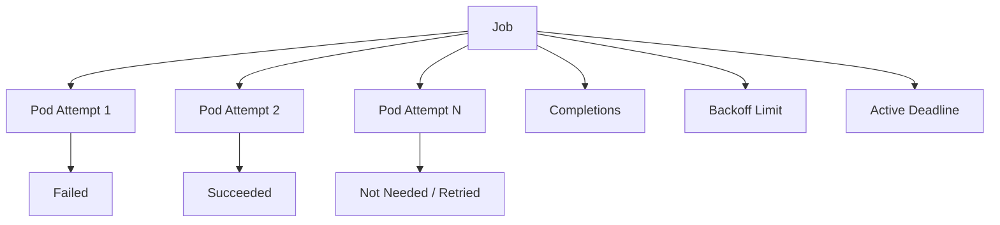

A Job differs from a Deployment because the Pod is not supposed to run forever.

### 7.2 Baseline Job

```yaml
apiVersion: batch/v1
kind: Job
metadata:
  name: order-ledger-backfill-20260703
spec:
  backoffLimit: 3
  activeDeadlineSeconds: 3600
  ttlSecondsAfterFinished: 86400
  template:
    metadata:
      labels:
        app.kubernetes.io/name: order-ledger-backfill
    spec:
      restartPolicy: Never
      containers:
        - name: backfill
          image: registry.example.com/platform/order-worker:2026.07.03-1a2b3c4
          command: ["/app/bin/backfill-ledger"]
          args:
            - "--from=2026-06-01"
            - "--to=2026-07-01"
            - "--batch-size=500"
          resources:
            requests:
              cpu: "500m"
              memory: "1Gi"
            limits:
              memory: "2Gi"
```

Important fields:

- `restartPolicy: Never` or `OnFailure` is required for Job Pods.
- `backoffLimit` prevents infinite retries.
- `activeDeadlineSeconds` prevents a hung task from living forever.
- `ttlSecondsAfterFinished` cleans up completed/failed Job objects later.

### 7.3 Job Idempotency

A production Job must be idempotent or safely resumable.

Kubernetes can retry failed Job Pods. If the task performs side effects, retries can duplicate them unless the application protects itself.

A good Job has:

- deterministic input range;
- checkpointing;
- idempotency key;
- explicit locking when needed;
- safe retry semantics;
- observable progress;
- bounded runtime;
- clear success/failure exit codes.

Bad Job design:

```text
Run script. Hope it finishes. If it fails, rerun manually.
```

Good Job design:

```text
Process range [A, B] in batches.
Record completed batches.
Use idempotency key per record.
Exit non-zero only on unrecoverable failure.
Expose progress logs and metrics.
Bound runtime with activeDeadlineSeconds.
```

### 7.4 Parallel Jobs

Jobs can run multiple Pods in parallel.

```yaml
apiVersion: batch/v1
kind: Job
metadata:
  name: image-thumbnail-batch
spec:
  completions: 100
  parallelism: 10
  backoffLimit: 5
  template:
    spec:
      restartPolicy: Never
      containers:
        - name: worker
          image: registry.example.com/platform/thumbnail-worker:1.9.0
```

Use parallel Jobs only when work can be partitioned safely.

Ask:

- how does each Pod claim work?
- can two Pods process the same item?
- what happens if one Pod dies mid-item?
- what is the maximum external system load?
- is the downstream dependency protected?

### 7.5 Job Failure Modes

| Failure | Symptom | Root Cause | Response |
|---|---|---|---|
| Duplicate side effects | repeated payments/emails/updates | non-idempotent retry | add idempotency and checkpointing |
| Infinite execution | Pod never exits | missing deadline | use activeDeadlineSeconds and app timeout |
| Silent failure | Job completes but data wrong | exit code does not represent domain success | enforce validation before success exit |
| Too much parallel load | downstream outage | high parallelism | throttle, queue, rate-limit, reduce parallelism |
| Lost diagnostics | completed Pods deleted too soon | aggressive cleanup | retain logs/artifacts long enough |

Jobs are not “small Deployments.” They are controlled executions.

---

## 8. CronJob Pattern

A `CronJob` creates Jobs on a schedule.

Use it for periodic finite work.

Good examples:

- scheduled backup;
- daily report generation;
- periodic reconciliation;
- cleanup task;
- certificate inventory scan;
- compliance export;
- external data sync.

### 8.1 CronJob Invariant

The CronJob invariant is:

> At scheduled times, create Jobs according to concurrency, deadline, and history rules.

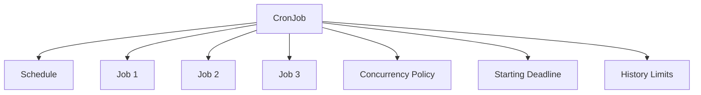

CronJob is a scheduler for Jobs. The actual work still belongs to the Job template.

### 8.2 Baseline CronJob

```yaml
apiVersion: batch/v1
kind: CronJob
metadata:
  name: ledger-daily-reconciliation
spec:
  schedule: "0 2 * * *"
  timeZone: "Asia/Jakarta"
  concurrencyPolicy: Forbid
  startingDeadlineSeconds: 1800
  successfulJobsHistoryLimit: 3
  failedJobsHistoryLimit: 5
  jobTemplate:
    spec:
      backoffLimit: 2
      activeDeadlineSeconds: 7200
      ttlSecondsAfterFinished: 604800
      template:
        spec:
          restartPolicy: Never
          containers:
            - name: reconcile
              image: registry.example.com/platform/ledger-reconciler:2026.07.03-1a2b3c4
              args:
                - "--mode=daily"
              resources:
                requests:
                  cpu: "500m"
                  memory: "1Gi"
                limits:
                  memory: "2Gi"
```

Important choices:

- `timeZone` makes schedule intent explicit.
- `concurrencyPolicy: Forbid` prevents overlapping executions.
- `startingDeadlineSeconds` prevents stale runs from starting too late.
- history limits keep diagnostic objects without unbounded accumulation.
- Job-level deadline and retry policy still matter.

### 8.3 Concurrency Policy

| Policy | Meaning | Use When |
|---|---|---|
| `Allow` | overlapping Jobs are allowed | work is independent and safe to overlap |
| `Forbid` | skip new run if previous still active | most reconciliation/backup/report tasks |
| `Replace` | kill current run and start new one | latest-only work where old run is obsolete |

`Forbid` is the safest default for business jobs.

But skipping has consequences. If a daily reconciliation runs for 25 hours, one day is skipped. Your business process must tolerate that or alert.

### 8.4 CronJob Failure Modes

| Failure | Symptom | Root Cause | Response |
|---|---|---|---|
| Overlapping execution | double processing | `Allow` with long runtime | use `Forbid` or app-level lock |
| Missed schedule | no Job created | controller downtime or deadline exceeded | inspect CronJob events and startingDeadlineSeconds |
| Timezone confusion | job runs at wrong local time | implicit controller timezone | set `timeZone` explicitly |
| Unbounded object growth | thousands of old Jobs | no history/TTL policy | set history limits and TTL |
| Backlog spike | many stale Jobs start after outage | no deadline | set startingDeadlineSeconds |

CronJob correctness is partly Kubernetes and partly business calendar semantics.

---

## 9. Bare Pod: Almost Never for Production

A bare Pod is useful for:

- debugging;
- temporary tests;
- static Pods for node-level bootstrap components;
- very specific control-plane patterns.

Do not deploy production applications as bare Pods.

A bare Pod does not give you normal controller behavior:

- no desired replica count;
- no rollout;
- no replacement policy beyond node/kubelet behavior;
- no declarative scaling;
- no revision history;
- weak operational ownership.

For application workloads, choose a controller.

---

## 10. The Identity / Completion / Placement Triangle

Every workload API primarily optimizes one of three dimensions.

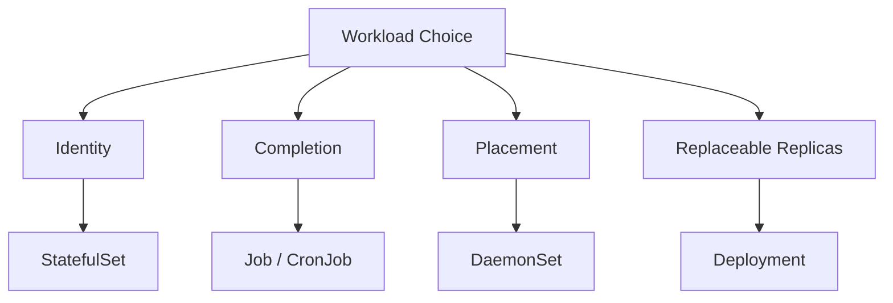

- Deployment optimizes replaceable availability.
- StatefulSet optimizes stable identity.
- DaemonSet optimizes node placement coverage.
- Job optimizes finite completion.
- CronJob optimizes scheduled finite completion.

A poor design tries to force one API to behave like another.

Examples:

- making a Deployment behave like StatefulSet by relying on random Pod names;
- making a CronJob behave like a long-running daemon;
- making a Job behave like a Deployment with infinite retry;
- making a DaemonSet behave like an application autoscaler;
- making StatefulSet solve database HA without database-level replication.

---

## 11. Composite Workload Patterns

Real systems often combine multiple workload APIs.

### 11.1 API + Worker + CronJob

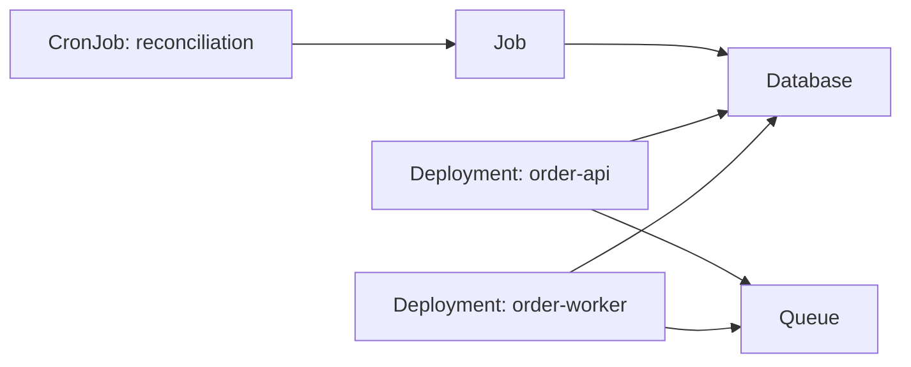

Pattern:

- API receives commands;
- worker processes asynchronous jobs;
- CronJob reconciles or repairs periodically;
- all share external data/service dependencies.

Risk:

- CronJob can conflict with worker if locking/idempotency is not designed.

### 11.2 API + Migration Job

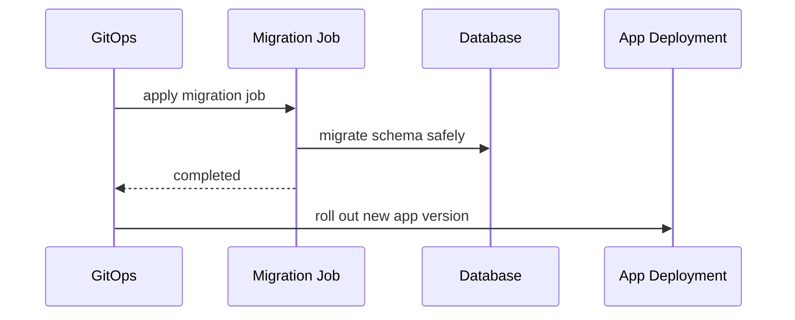

Pattern:

- schema migration runs as Job;
- application rollout follows after migration success.

Risk:

- migration and app compatibility must be designed together.
- rollback is not always symmetric.

### 11.3 DaemonSet + Deployment

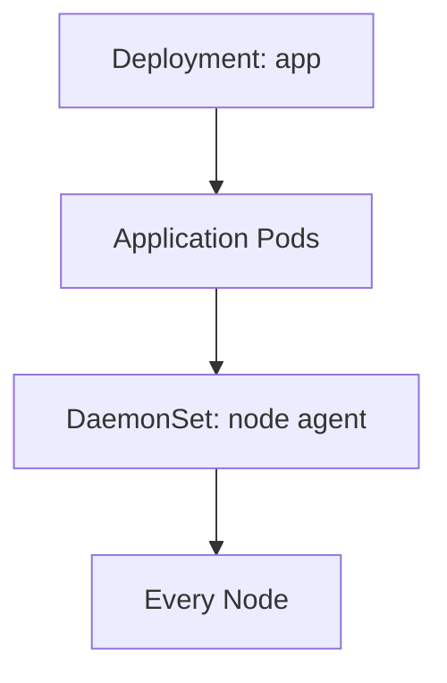

Pattern:

- DaemonSet provides node-local platform capability;
- application Deployment consumes it.

Examples:

- log agent;
- node-local proxy;
- identity sidecar replacement;
- telemetry collector.

Risk:

- DaemonSet outage impacts many apps at once.

### 11.4 StatefulSet + Headless Service + Backup CronJob

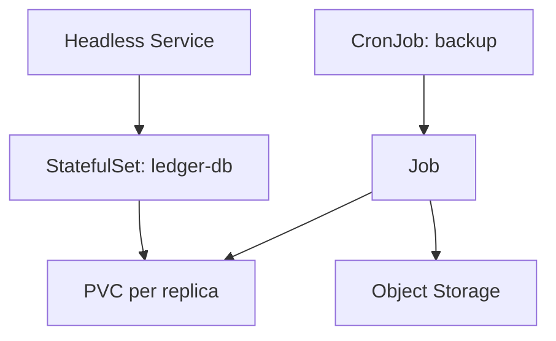

Pattern:

- StatefulSet manages identity/storage;
- CronJob performs backup/export;
- external storage holds recoverable copy.

Risk:

- backup job may overload primary or capture inconsistent data unless database-native backup semantics are used.

---

## 12. EKS and AKS Workload Design Considerations

Workload APIs are Kubernetes primitives, but cloud infrastructure changes their operational behavior.

### 12.1 Node Pool / Node Group Shape

EKS commonly uses managed node groups, self-managed nodes, Fargate, Karpenter, or EKS Auto Mode.

AKS commonly uses system/user node pools, virtual nodes in specific scenarios, cluster autoscaler, KEDA integration, and AKS Automatic.

Workload selection interacts with node design:

| Workload | Cloud Node Concern |
|---|---|
| Deployment | autoscaling, zone spread, load balancing, resource requests |
| StatefulSet | storage zone, disk attachment, backup, disruption policy |
| DaemonSet | per-node overhead, taints, system pools, privileged access |
| Job | burst capacity, quota, deadline, external dependency load |
| CronJob | scheduled capacity spikes, timezone, missed execution |

### 12.2 Zone Awareness

For production, ask:

- should replicas spread across zones?
- can volumes attach across zones?
- does the workload tolerate a zone outage?
- does the cloud load balancer route only to healthy zone endpoints?
- will autoscaler provision capacity in the correct zone?

Deployments can often spread across zones with topology spread constraints.

StatefulSets need deeper thought because PVCs may be zone-bound.

### 12.3 Spot / Preemptible Capacity

Spot-like capacity is attractive for cost but unsafe for all workloads by default.

Good candidates:

- stateless Deployments with enough replicas;
- idempotent queue workers;
- retryable batch Jobs;
- non-critical CronJobs.

Poor candidates:

- quorum-sensitive StatefulSets;
- singleton workloads;
- critical DaemonSets;
- non-idempotent Jobs;
- workloads without graceful termination.

### 12.4 Serverless Pod Models

EKS Fargate and similar managed pod execution models can reduce node management but constrain DaemonSets, storage, networking, and observability patterns.

Use them for workloads whose platform contract fits the limitations.

Do not assume “less node management” means “less architecture.”

---

## 13. Workload API Anti-Patterns

### 13.1 Deployment for Everything

This is the most common beginner pattern.

Symptoms:

- database as Deployment with PVC;
- scheduled task as Deployment with sleep loop;
- one-off migration as Deployment;
- node agent as Deployment;
- single replica Deployment pretending to be a safe singleton.

Fix: classify the lifecycle contract before choosing API.

### 13.2 StatefulSet as Safety Blanket

StatefulSet feels safer because names are stable.

But stable names do not mean safer operations.

A stateless API in StatefulSet can reduce rollout flexibility, confuse service discovery, and create unnecessary identity coupling.

Fix: use StatefulSet only when identity/storage semantics are required.

### 13.3 CronJob as Orchestrator

CronJob is not a general workflow engine.

If your job requires complex branching, compensation, state machine transitions, human approval, or cross-service orchestration, use a workflow engine or application-level orchestration.

CronJob is good for periodic finite execution, not enterprise process modelling.

### 13.4 Job Without Idempotency

A Job that cannot safely retry is a production hazard.

Kubernetes controllers assume retry is normal.

If retry is unsafe, the workload contract and app contract conflict.

### 13.5 DaemonSet Without Cost Accounting

Every DaemonSet is multiplied by node count.

A small resource request becomes large cluster-wide usage.

Fix: treat DaemonSets as platform-level capacity reservations.

---

## 14. Decision Checklist

Before creating a workload object, answer these questions.

### 14.1 Lifecycle

- Is the workload long-running or finite?
- Should success mean “running” or “completed”?
- Should failure trigger replacement or retry-to-completion?
- Can it be stopped and restarted safely?
- What is the maximum allowed runtime?

### 14.2 Identity

- Are replicas interchangeable?
- Does each replica need a stable name?
- Does each replica need stable storage?
- Is identity managed by the application protocol instead?
- What happens if the Pod is rescheduled?

### 14.3 Placement

- Should it run on every node?
- Should it run only on specific node pools?
- Does it require GPU, local SSD, special kernel features, or host access?
- Does it tolerate Spot/preemptible capacity?
- Does it need zone spreading?

### 14.4 Rollout

- Can old and new versions run together?
- Is the rollout backward-compatible?
- What is the maximum unavailable capacity?
- What is the rollback plan?
- Are database/schema changes compatible?

### 14.5 Operations

- How do we observe progress?
- What logs/metrics/events prove correctness?
- What alert fires when it is stuck?
- What is the manual recovery procedure?
- Who owns the workload: app team or platform team?

---

## 15. Practical Workload Review Examples

### 15.1 Example: Payment API

Requirement:

- serves synchronous HTTP traffic;
- stateless;
- uses external database and payment gateway;
- must survive node loss;
- zero-downtime rollout.

Choice: `Deployment`.

Required supporting resources:

- `Service`;
- ingress/gateway;
- `PodDisruptionBudget`;
- `HorizontalPodAutoscaler` later;
- `NetworkPolicy` later;
- cloud workload identity later.

Why not StatefulSet?

- payment API replicas are interchangeable;
- durable identity belongs to database/payment records, not Pods.

### 15.2 Example: Ledger Reconciliation

Requirement:

- runs daily;
- must not overlap;
- can take up to two hours;
- must retry transient failures;
- must produce auditable completion result.

Choice: `CronJob` creating `Job`.

Required choices:

- `concurrencyPolicy: Forbid`;
- explicit `timeZone`;
- `activeDeadlineSeconds`;
- idempotency/checkpointing;
- failure alert if Job fails or misses schedule.

### 15.3 Example: Node Security Agent

Requirement:

- every node must run an agent;
- agent reads host metadata;
- must tolerate system node taints;
- platform-owned.

Choice: `DaemonSet`.

Required choices:

- namespace isolation;
- strict RBAC;
- tolerations;
- resource requests;
- progressive rollout by node group if high blast radius;
- host access review.

### 15.4 Example: Kafka Broker

Requirement:

- broker identity matters;
- persistent storage per broker;
- stable network names;
- ordered operations matter.

Choice: Usually `StatefulSet`, or preferably a mature operator that manages StatefulSets and domain-specific broker lifecycle.

Important: the StatefulSet is only the substrate. Kafka correctness requires broker-specific configuration, replication, partition reassignment, rolling upgrade rules, storage policy, and backup/recovery strategy.

---

## 16. Production Review Template

Use this as a lightweight design review form.

```mdx
## Workload Design Review

### Workload Name

`<name>`

### Selected API

`Deployment | StatefulSet | DaemonSet | Job | CronJob`

### Why This API

Explain lifecycle, identity, placement, and completion semantics.

### Why Not the Alternatives

- Deployment:
- StatefulSet:
- DaemonSet:
- Job:
- CronJob:

### Replica / Execution Model

- desired replicas:
- completion count:
- parallelism:
- schedule:
- concurrency policy:

### Failure Model

- pod crash:
- node loss:
- zone failure:
- dependency outage:
- retry behavior:
- duplicate execution risk:

### Rollout / Upgrade Model

- strategy:
- max unavailable:
- compatibility requirements:
- rollback approach:

### Cloud Dependencies

- EKS/AKS node pool:
- storage class:
- cloud identity:
- load balancer:
- external services:

### Observability

- logs:
- metrics:
- events:
- alerts:
- dashboard:

### Owner

- app owner:
- platform owner:
- escalation path:
```

---

## 17. Exercises

### Exercise 1: Classify Workloads

Classify each workload and explain why:

1. fraud scoring API;
2. nightly settlement report;
3. Prometheus node exporter;
4. PostgreSQL primary/replica cluster;
5. image resize queue worker;
6. one-time schema migration;
7. daily expired-token cleanup;
8. GPU inference service;
9. cluster DNS cache per node;
10. Kafka broker.

For each, identify:

- workload API;
- failure mode;
- required supporting resources;
- cloud-specific concerns.

### Exercise 2: Refactor Bad Workload Design

Given this bad design:

```text
A Deployment with one replica runs a daily report generator.
The container starts, sleeps until 2 AM, generates a report, sleeps again.
Sometimes it crashes and misses reports.
```

Refactor it.

Expected direction:

- replace Deployment with CronJob;
- make report generation finite;
- add `concurrencyPolicy`;
- add deadline;
- add retry policy;
- add idempotency/report key;
- alert on failed/missed run.

### Exercise 3: StatefulSet Risk Review

Take a stateful service you know. Write:

- what identity means;
- what data lives in PVC;
- what happens on node failure;
- what happens on zone failure;
- how backup works;
- how restore is tested;
- what cannot be solved by Kubernetes.

---

## 18. Part Summary

Workload APIs are not syntax variants. They are lifecycle contracts.

The central decisions are:

- replaceable replicas → `Deployment`;
- stable identity/storage → `StatefulSet`;
- node-level placement → `DaemonSet`;
- finite completion → `Job`;
- scheduled finite completion → `CronJob`.

Production Kubernetes skill begins when you stop asking:

> Which YAML should I copy?

And start asking:

> What contract should the control plane enforce for this workload?

That contract determines rollout, failure behavior, scaling, scheduling, cost, security, and recovery.

---

## References

- [Kubernetes Documentation: Workloads](https://kubernetes.io/docs/concepts/workloads/)
- [Kubernetes Documentation: Workload Management](https://kubernetes.io/docs/concepts/workloads/controllers/)
- [Kubernetes Documentation: Deployments](https://kubernetes.io/docs/concepts/workloads/controllers/deployment/)
- [Kubernetes Documentation: StatefulSets](https://kubernetes.io/docs/concepts/workloads/controllers/statefulset/)
- [Kubernetes Documentation: DaemonSet](https://kubernetes.io/docs/concepts/workloads/controllers/daemonset/)
- [Kubernetes Documentation: Jobs](https://kubernetes.io/docs/concepts/workloads/controllers/job/)
- [Kubernetes Documentation: CronJob](https://kubernetes.io/docs/concepts/workloads/controllers/cron-jobs/)
- [Kubernetes Documentation: TTL-after-finished Controller](https://kubernetes.io/docs/concepts/workloads/controllers/ttlafterfinished/)
- [Kubernetes Documentation: Pod Lifecycle](https://kubernetes.io/docs/concepts/workloads/pods/pod-lifecycle/)
