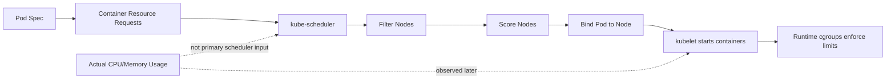
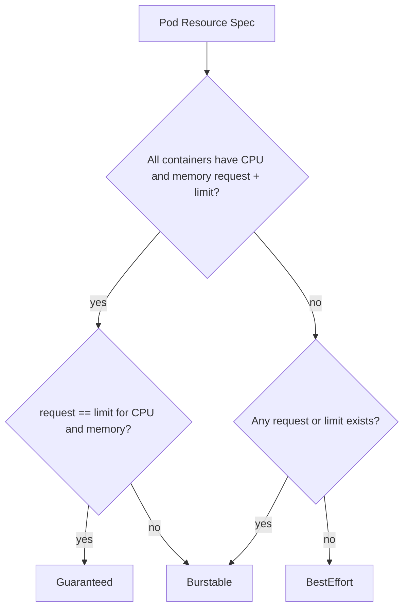
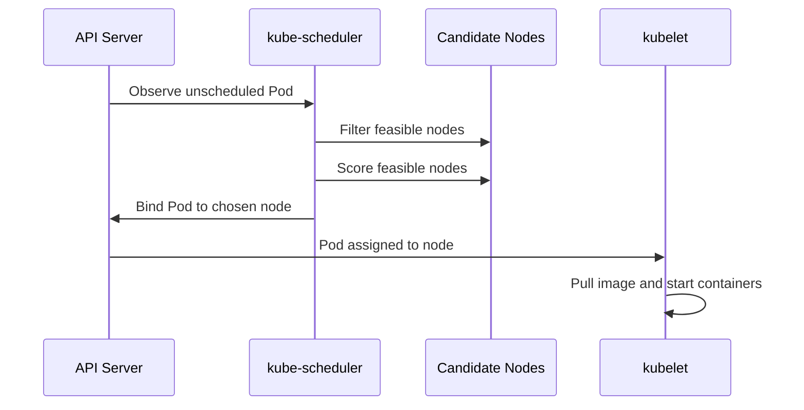
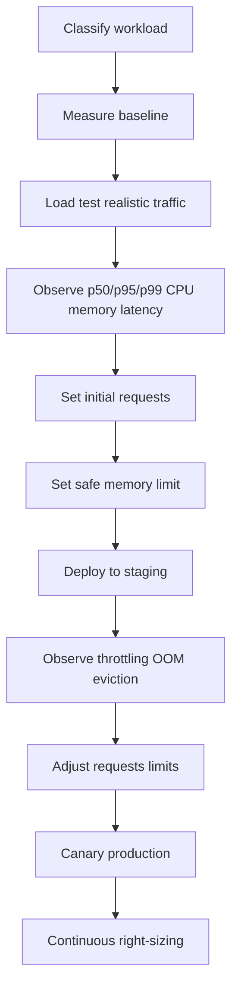

# Part 007 — Requests, Limits, QoS, and Scheduling

Kubernetes scheduling terlihat sederhana dari luar: kita membuat `Pod`, lalu Kubernetes memilih node. Di produksi, ini adalah salah satu sumber paling besar dari masalah performa, cost, reliability, dan incident.

Banyak engineer menganggap `requests` dan `limits` hanya angka administratif di YAML. Itu salah. `requests` adalah kontrak kapasitas yang dipakai scheduler, autoscaler, HPA, cluster autoscaler, dan model bin-packing. `limits` adalah batas enforcement runtime yang bisa menyelamatkan node, tetapi juga bisa membuat aplikasi lambat, terkena throttling, atau mati karena OOM.

Part ini membangun mental model yang akan dipakai terus sampai bagian autoscaling, EKS node provisioning, AKS node pool, FinOps, reliability, dan multi-region.

---

## 1. Target Pembelajaran

Setelah menyelesaikan part ini, kamu harus mampu:

1. Menjelaskan perbedaan `requests`, `limits`, actual usage, node capacity, dan node allocatable.
2. Mendesain resource contract untuk service, worker, batch job, daemon, dan stateful workload.
3. Menentukan kapan memakai CPU limit, kapan menghindarinya, dan bagaimana membaca efek CPU throttling.
4. Memahami QoS class: `Guaranteed`, `Burstable`, dan `BestEffort`.
5. Menjelaskan bagaimana kube-scheduler memilih node berdasarkan request, affinity, taint, topology, dan constraint lain.
6. Mendesain placement strategy untuk workload produksi di EKS/AKS.
7. Mendiagnosis `Pending`, `OOMKilled`, `Evicted`, `CrashLoopBackOff`, `NodePressure`, dan starvation.
8. Membuat checklist resource review sebelum workload dipromosikan ke production.

---

## 2. Mental Model Utama: Kubernetes Tidak Menjadwalkan Berdasarkan Pemakaian Aktual

Kubernetes scheduler tidak duduk menunggu CPU dan memory aktual lalu memilih node yang sedang paling ringan. Scheduler membuat keputusan dari **declared desired capacity**.

Kalimat kuncinya:

> Scheduling is based on resource requests, not real-time usage.

Jika sebuah container memakai 2 GiB memory tetapi request-nya hanya 128 MiB, scheduler akan memperlakukan container itu sebagai workload kecil. Jika banyak workload seperti ini ditempatkan pada node yang sama, node bisa mengalami memory pressure walaupun semua Pod terlihat valid secara YAML.



Implikasi praktisnya:

- `requests` terlalu kecil membuat cluster terlihat masih lega padahal secara runtime sudah rapuh.
- `requests` terlalu besar membuat cluster terlihat penuh padahal resource aktual banyak idle.
- `limits` terlalu kecil membuat aplikasi mati atau throttle.
- Tidak ada `requests` membuat workload menjadi kandidat pertama korban eviction.
- HPA berbasis CPU utilization akan salah membaca beban jika CPU request tidak masuk akal.

---

## 3. Resource Contract: Apa yang Sebenarnya Kamu Janjikan?

Di Kubernetes, resource contract biasanya ditulis seperti ini:

```yaml
apiVersion: apps/v1
kind: Deployment
metadata:
  name: payment-api
spec:
  replicas: 3
  selector:
    matchLabels:
      app: payment-api
  template:
    metadata:
      labels:
        app: payment-api
    spec:
      containers:
        - name: payment-api
          image: registry.example.com/payment-api:1.18.4
          resources:
            requests:
              cpu: "500m"
              memory: "768Mi"
              ephemeral-storage: "1Gi"
            limits:
              memory: "1536Mi"
              ephemeral-storage: "2Gi"
```

Baca manifest itu sebagai kontrak:

- Container meminta jatah scheduling minimal 0.5 CPU core.
- Container meminta jatah scheduling minimal 768 MiB memory.
- Container tidak boleh melewati 1536 MiB memory tanpa risiko dibunuh.
- Container meminta ruang ephemeral storage 1 GiB dan dibatasi 2 GiB.
- Tidak ada CPU limit, sehingga container bisa memakai CPU lebih saat node punya kapasitas idle.

Ini bukan satu-satunya pola yang benar, tetapi ini pola umum untuk service latency-sensitive: memory diberi limit agar node terlindungi, CPU limit sering dihindari agar tidak terjadi throttling tak perlu.

---

## 4. CPU: Compressible Resource

CPU adalah resource yang bisa dibagi dan ditekan. Jika container butuh CPU lebih dari yang tersedia, ia tidak langsung mati. Ia melambat.

Satuan CPU:

```yaml
cpu: "1"      # 1 CPU core
cpu: "500m"   # 0.5 CPU core
cpu: "100m"   # 0.1 CPU core
```

`requests.cpu` dipakai scheduler untuk placement. `limits.cpu` dipakai runtime/cgroup untuk membatasi konsumsi CPU.

### 4.1 Request CPU

`requests.cpu` menjawab pertanyaan:

> Berapa CPU yang harus dianggap reserved agar Pod ini layak ditempatkan?

Contoh:

```yaml
resources:
  requests:
    cpu: "250m"
```

Jika ada 20 Pod dengan request 250m, scheduler menganggap total permintaan CPU adalah 5 core.

### 4.2 Limit CPU

`limits.cpu` menjawab pertanyaan:

> Berapa CPU maksimum yang boleh dikonsumsi container ini?

Contoh:

```yaml
resources:
  limits:
    cpu: "500m"
```

Jika aplikasi ingin burst ke 1 core tetapi limit hanya 500m, aplikasi akan kena CPU throttling.

### 4.3 CPU Limit: Kapan Dipakai?

CPU limit bukan selalu buruk. Ia berguna untuk:

- workload tidak kritikal yang tidak boleh mengganggu workload lain,
- batch job yang bisa dibatasi,
- tenant yang perlu enforcement keras,
- cluster shared multi-team dengan risiko noisy neighbor tinggi,
- workload yang punya perilaku CPU runaway.

Tapi untuk service latency-sensitive, CPU limit sering menjadi penyebab latency spike. Aplikasi Java, Go, Node.js, .NET, atau database proxy bisa mengalami request queueing karena thread siap jalan tetapi dibatasi CFS quota.

Pola yang sering dipakai:

```yaml
resources:
  requests:
    cpu: "500m"
    memory: "1Gi"
  limits:
    memory: "2Gi"
```

CPU request ada. Memory limit ada. CPU limit tidak dipasang.

Ini bukan dogma. Keputusan final harus berbasis observability: CPU usage, throttling, latency, queue depth, dan SLO.

---

## 5. Memory: Non-Compressible Resource

Memory berbeda dari CPU. Jika memory tidak cukup, proses tidak hanya melambat. Ia bisa dibunuh.

Satuan memory:

```yaml
memory: "512Mi"
memory: "1Gi"
memory: "2048Mi"
```

Gunakan `Mi` dan `Gi` untuk binary units. Hindari salah tulis seperti `400m` untuk memory karena `m` berarti milli-byte, bukan megabyte.

### 5.1 Request Memory

`requests.memory` dipakai scheduler untuk menentukan apakah node punya kapasitas yang cukup.

```yaml
resources:
  requests:
    memory: "768Mi"
```

Jika request terlalu rendah, scheduler bisa overpack node. Ketika actual usage naik, kubelet mulai melakukan eviction atau container terkena OOM.

### 5.2 Limit Memory

`limits.memory` adalah batas keras. Jika proses melewati limit, kernel/runtime dapat membunuh proses. Di Kubernetes, ini sering terlihat sebagai:

```text
State:          Terminated
Reason:         OOMKilled
Exit Code:      137
```

Memory limit yang terlalu ketat akan membuat aplikasi tampak “random restart”. Padahal bukan random. Ia melanggar kontrak memory.

### 5.3 Pola Memory untuk Service

Untuk service API biasa:

```yaml
resources:
  requests:
    cpu: "300m"
    memory: "512Mi"
  limits:
    memory: "1Gi"
```

Untuk Java service:

```yaml
resources:
  requests:
    cpu: "500m"
    memory: "1Gi"
  limits:
    memory: "2Gi"
env:
  - name: JAVA_TOOL_OPTIONS
    value: >-
      -XX:MaxRAMPercentage=70
      -XX:InitialRAMPercentage=40
      -XX:+ExitOnOutOfMemoryError
```

Catatan penting: JVM harus container-aware dan heap harus menyisakan ruang untuk metaspace, thread stack, direct buffer, native memory, JIT, agent, dan OS overhead. Jangan set heap sama dengan memory limit.

---

## 6. Ephemeral Storage: Sering Dilupakan, Sering Menjatuhkan Node

`ephemeral-storage` mencakup storage sementara seperti writable layer container, `emptyDir`, log container, dan file sementara.

Contoh:

```yaml
resources:
  requests:
    ephemeral-storage: "1Gi"
  limits:
    ephemeral-storage: "2Gi"
```

Masalah produksi yang umum:

- aplikasi menulis file temporary tanpa cleanup,
- log terlalu verbose ke stdout/stderr,
- sidecar membuat buffer lokal,
- batch job mengekstrak file besar,
- `emptyDir` dipakai seolah storage permanen,
- node masuk `DiskPressure` lalu Pod dievict.

Jika aplikasi menulis file besar, jangan mengandalkan node disk default. Gunakan volume yang sesuai, object storage, atau desain streaming.

---

## 7. Pod Effective Request: Container, Init Container, dan Pod Overhead

Scheduler menghitung resource Pod berdasarkan kombinasi container.

Untuk app containers yang berjalan bersamaan:

```text
pod_request = sum(request of all regular containers)
```

Untuk init containers yang berjalan berurutan:

```text
effective_init_request = max(request among init containers)
```

Secara konseptual:

```text
effective_pod_request = max(sum_regular_container_requests, max_init_container_request) + pod_overhead
```

Contoh:

```yaml
spec:
  initContainers:
    - name: migration-check
      image: app:1.0
      resources:
        requests:
          cpu: "1000m"
          memory: "1Gi"
  containers:
    - name: app
      image: app:1.0
      resources:
        requests:
          cpu: "300m"
          memory: "512Mi"
    - name: sidecar
      image: sidecar:1.0
      resources:
        requests:
          cpu: "100m"
          memory: "128Mi"
```

Regular containers total:

```text
cpu = 300m + 100m = 400m
memory = 512Mi + 128Mi = 640Mi
```

Init container max:

```text
cpu = 1000m
memory = 1Gi
```

Effective request kira-kira:

```text
cpu = max(400m, 1000m) = 1000m
memory = max(640Mi, 1Gi) = 1Gi
```

Ini penting. Init container besar bisa membuat Pod sulit dijadwalkan, walaupun app container kecil.

---

## 8. QoS Class: Guaranteed, Burstable, BestEffort

Kubernetes memberi QoS class pada Pod berdasarkan resource requests dan limits.



### 8.1 Guaranteed

Contoh:

```yaml
resources:
  requests:
    cpu: "500m"
    memory: "1Gi"
  limits:
    cpu: "500m"
    memory: "1Gi"
```

Karakter:

- request dan limit CPU/memory sama untuk semua container,
- paling terlindungi saat node pressure,
- cocok untuk workload sangat kritikal atau predictable,
- bisa membuat utilization cluster lebih rendah,
- CPU limit dapat menyebabkan throttling.

### 8.2 Burstable

Contoh:

```yaml
resources:
  requests:
    cpu: "300m"
    memory: "512Mi"
  limits:
    memory: "1Gi"
```

Karakter:

- paling umum untuk service produksi,
- punya minimum capacity contract,
- bisa burst di atas request jika node punya ruang,
- bisa dievict jika node pressure dan penggunaan melebihi request relatif terhadap prioritas eviction.

### 8.3 BestEffort

Contoh:

```yaml
resources: {}
```

Karakter:

- tidak punya request dan limit,
- paling murah secara YAML, paling mahal secara incident,
- kandidat awal eviction saat node pressure,
- tidak cocok untuk production workload kecuali eksperimen sangat terbatas.

Rule praktis:

> Production workload should almost never be BestEffort.

---

## 9. Node Capacity vs Node Allocatable

Node punya `capacity`, tetapi Pod tidak bisa memakai semuanya.

```text
Node Capacity
  - kube reserved
  - system reserved
  - eviction threshold
  = Node Allocatable for Pods
```

Cek:

```bash
kubectl describe node <node-name>
```

Cari bagian:

```text
Capacity:
  cpu:                8
  memory:             32784000Ki
Allocatable:
  cpu:                7910m
  memory:             30012000Ki
```

Scheduler membandingkan Pod request dengan allocatable, bukan kapasitas marketing instance.

Di EKS dan AKS, allocatable juga dipengaruhi oleh:

- OS dan kubelet overhead,
- daemonset platform,
- CNI plugin,
- logging/monitoring agents,
- kube-proxy atau replacement-nya,
- security agents,
- node image,
- reserved resources dari managed service.

Jangan menghitung kapasitas dari tipe VM/instance saja. Hitung dari node yang benar-benar berjalan.

---

## 10. Scheduling Pipeline

Secara sederhana, scheduling adalah proses memilih node untuk Pod yang belum punya `nodeName`.



Tahapan konseptual:

1. **Queue**: Pod masuk scheduling queue.
2. **Filter**: node yang tidak memenuhi syarat dibuang.
3. **Score**: node yang feasible diberi skor.
4. **Reserve/Permit**: plugin scheduling tertentu bisa melakukan koordinasi.
5. **Bind**: scheduler menulis binding ke API server.
6. **Kubelet execution**: kubelet di node menjalankan container.

Filter dapat gagal karena:

- CPU request tidak muat,
- memory request tidak muat,
- node selector tidak cocok,
- taint tidak ditoleransi,
- volume tidak tersedia di zone itu,
- pod affinity/anti-affinity tidak terpenuhi,
- topology spread constraint tidak bisa dipenuhi,
- node unschedulable,
- node condition tidak sehat.

---

## 11. Debugging Pod Pending

`Pending` bukan diagnosis. Itu gejala.

```bash
kubectl get pod -n payments
kubectl describe pod -n payments payment-api-xxxxx
```

Cari event:

```text
Warning  FailedScheduling  default-scheduler  0/6 nodes are available:
2 Insufficient cpu,
1 node(s) had untolerated taint,
3 node(s) didn't match Pod's node affinity/selector.
```

Cara membaca:

- `Insufficient cpu`: request terlalu besar atau cluster perlu scale out.
- `Insufficient memory`: memory request terlalu besar atau node terlalu kecil.
- `untolerated taint`: Pod belum punya toleration untuk node pool target.
- `node affinity/selector`: label node tidak sesuai.
- `volume node affinity conflict`: storage terikat pada zone berbeda.
- `max node group size reached`: cluster autoscaler tidak bisa menambah node.

Workflow:

```bash
kubectl describe pod -n <ns> <pod>
kubectl get nodes --show-labels
kubectl describe node <node>
kubectl get events -n <ns> --sort-by=.lastTimestamp
kubectl top nodes
kubectl top pods -n <ns>
```

---

## 12. Node Selector: Placement Paling Sederhana

`nodeSelector` memaksa Pod hanya jalan di node dengan label tertentu.

```yaml
spec:
  nodeSelector:
    workload-tier: backend
```

Node harus punya label:

```bash
kubectl label node ip-10-0-1-10 workload-tier=backend
```

Gunakan untuk constraint sederhana:

- workload GPU,
- workload Windows/Linux,
- workload yang harus masuk node pool tertentu,
- workload isolasi compliance,
- workload dengan instance family khusus.

Kelemahan: terlalu kaku. Untuk preferensi, gunakan affinity.

---

## 13. Node Affinity: Required vs Preferred

Node affinity memberi ekspresi lebih kaya.

```yaml
spec:
  affinity:
    nodeAffinity:
      requiredDuringSchedulingIgnoredDuringExecution:
        nodeSelectorTerms:
          - matchExpressions:
              - key: workload-tier
                operator: In
                values:
                  - backend
      preferredDuringSchedulingIgnoredDuringExecution:
        - weight: 80
          preference:
            matchExpressions:
              - key: topology.kubernetes.io/zone
                operator: In
                values:
                  - ap-southeast-3a
```

Baca sebagai:

- Required: harus terpenuhi saat scheduling.
- Preferred: diutamakan, tetapi boleh dilanggar jika tidak memungkinkan.
- IgnoredDuringExecution: jika label berubah setelah Pod berjalan, Pod tidak otomatis diusir.

Gunakan required untuk hard constraint. Gunakan preferred untuk optimasi.

Anti-pattern:

```yaml
requiredDuringSchedulingIgnoredDuringExecution:
  nodeSelectorTerms:
    - matchExpressions:
        - key: kubernetes.io/hostname
          operator: In
          values:
            - specific-node-1
```

Mengikat aplikasi ke node spesifik sering menghancurkan elastisitas dan recovery. Kecuali untuk kasus sangat khusus, gunakan label abstrak seperti `workload-tier`, `capacity-type`, `hardware`, atau `compliance-zone`.

---

## 14. Pod Affinity dan Anti-Affinity

Pod affinity/anti-affinity mengatur placement berdasarkan keberadaan Pod lain.

Contoh anti-affinity agar replica tidak menumpuk di host yang sama:

```yaml
spec:
  affinity:
    podAntiAffinity:
      preferredDuringSchedulingIgnoredDuringExecution:
        - weight: 100
          podAffinityTerm:
            labelSelector:
              matchExpressions:
                - key: app
                  operator: In
                  values:
                    - payment-api
            topologyKey: kubernetes.io/hostname
```

Untuk produksi, sering lebih baik memakai `topologySpreadConstraints` karena lebih eksplisit dan scalable.

---

## 15. Topology Spread Constraints

`topologySpreadConstraints` menjaga sebaran Pod di domain tertentu, misalnya zone atau node.

```yaml
spec:
  topologySpreadConstraints:
    - maxSkew: 1
      topologyKey: topology.kubernetes.io/zone
      whenUnsatisfiable: DoNotSchedule
      labelSelector:
        matchLabels:
          app: payment-api
    - maxSkew: 1
      topologyKey: kubernetes.io/hostname
      whenUnsatisfiable: ScheduleAnyway
      labelSelector:
        matchLabels:
          app: payment-api
```

Baca:

- Sebaran antar zone wajib seimbang (`DoNotSchedule`).
- Sebaran antar host diusahakan, tetapi tidak memblokir scheduling (`ScheduleAnyway`).

Gunakan ini untuk:

- service critical multi-AZ,
- menghindari semua replica ada di node yang sama,
- meningkatkan resilience terhadap node/zone failure,
- mengontrol blast radius.

Trade-off:

- Constraint terlalu ketat bisa membuat Pod `Pending`.
- Cluster autoscaler harus mampu menambah kapasitas di topology yang benar.
- Storage dan volume zone affinity bisa membatasi scheduling.

---

## 16. Taints dan Tolerations

Taint dipasang pada node. Toleration dipasang pada Pod.

Taint mengatakan:

> Jangan jadwalkan Pod ke sini kecuali Pod menoleransi taint ini.

Contoh node pool khusus workload critical:

```bash
kubectl taint nodes node-1 dedicated=critical:NoSchedule
```

Pod yang boleh masuk:

```yaml
spec:
  tolerations:
    - key: dedicated
      operator: Equal
      value: critical
      effect: NoSchedule
```

Efek umum:

- `NoSchedule`: Pod baru tidak dijadwalkan kecuali punya toleration.
- `PreferNoSchedule`: scheduler menghindari jika bisa.
- `NoExecute`: Pod yang tidak toleran bisa diusir dari node.

Taint/toleration sering dipakai untuk:

- system node pool,
- GPU node,
- Spot/preemptible node,
- compliance node,
- isolated tenant node,
- workload dengan hardware khusus.

Penting: toleration hanya memberi izin. Ia tidak memaksa Pod masuk node itu. Untuk memaksa/menargetkan, kombinasikan dengan node affinity atau node selector.

```yaml
spec:
  tolerations:
    - key: dedicated
      operator: Equal
      value: critical
      effect: NoSchedule
  affinity:
    nodeAffinity:
      requiredDuringSchedulingIgnoredDuringExecution:
        nodeSelectorTerms:
          - matchExpressions:
              - key: nodepool
                operator: In
                values:
                  - critical
```

---

## 17. Priority dan Preemption

PriorityClass menentukan tingkat kepentingan Pod.

```yaml
apiVersion: scheduling.k8s.io/v1
kind: PriorityClass
metadata:
  name: platform-critical
value: 1000000
globalDefault: false
description: "Critical platform workloads"
```

Pod memakai priority:

```yaml
spec:
  priorityClassName: platform-critical
```

Jika Pod priority tinggi tidak bisa dijadwalkan, scheduler dapat mencoba preemption: mengusir Pod priority lebih rendah untuk membuka ruang.

Gunakan sangat hati-hati. Priority yang sembrono membuat cluster berubah menjadi arena perang antar workload.

Aturan praktis:

- Priority tinggi hanya untuk platform-critical: DNS, ingress, security agent, observability minimal, control-plane adjunct.
- Jangan memberi semua aplikasi bisnis priority tinggi.
- Kombinasikan dengan PDB, resource request realistis, dan node pool capacity.
- Dokumentasikan siapa boleh membuat PriorityClass.

---

## 18. PodDisruptionBudget Bukan Scheduling Constraint, Tapi Berpengaruh

PDB tidak menentukan node mana yang dipilih scheduler. Namun PDB mempengaruhi eviction sukarela, upgrade, drain, dan node termination.

Contoh:

```yaml
apiVersion: policy/v1
kind: PodDisruptionBudget
metadata:
  name: payment-api-pdb
spec:
  minAvailable: 2
  selector:
    matchLabels:
      app: payment-api
```

Jika replicas hanya 2 dan `minAvailable: 2`, drain node bisa tertahan. Ini sering muncul saat upgrade EKS/AKS atau node replacement.

PDB harus dirancang bersama:

- replica count,
- topology spread,
- rolling update strategy,
- node pool size,
- autoscaler behavior,
- maintenance window.

---

## 19. Node Pressure dan Eviction

Kubelet memonitor tekanan resource di node. Jika resource kritis menipis, kubelet dapat melakukan eviction.

Kondisi umum:

- `MemoryPressure`
- `DiskPressure`
- `PIDPressure`
- `NetworkUnavailable`
- `Ready=False/Unknown`

Cek:

```bash
kubectl describe node <node-name>
```

Pod yang dievict bisa terlihat seperti:

```text
Status: Failed
Reason: Evicted
Message: The node was low on resource: memory.
```

Urutan risiko eviction sangat dipengaruhi QoS:

1. `BestEffort` paling dulu.
2. `Burstable` berikutnya, terutama yang penggunaan memory-nya jauh di atas request.
3. `Guaranteed` paling terlindungi.

Masalah desain yang sering menyebabkan eviction:

- memory request terlalu rendah,
- tidak ada ephemeral-storage request/limit,
- log meledak,
- sidecar tidak diberi request,
- DaemonSet platform memakan resource tidak dihitung saat sizing,
- node pool terlalu kecil untuk workload aktual,
- autoscaler lambat atau tidak bisa menambah node.

---

## 20. EKS dan AKS: Apa yang Berbeda Secara Praktis?

Resource model Kubernetes tetap sama, tetapi realitas cloud berbeda.

### 20.1 EKS

Hal yang perlu kamu perhatikan di EKS:

- tipe instance menentukan CPU/memory/network baseline,
- VPC CNI dapat mempengaruhi pod density karena IP address per node,
- managed node group punya lifecycle dan upgrade behavior sendiri,
- Fargate punya model resource dan batasan berbeda,
- Karpenter/EKS Auto Mode dapat mengganti cara node diprovision,
- Spot interruption harus diperlakukan sebagai scheduling dan disruption problem,
- DaemonSet platform mengurangi kapasitas allocatable.

### 20.2 AKS

Hal yang perlu kamu perhatikan di AKS:

- VM SKU menentukan CPU/memory/ephemeral disk/network,
- system node pool dan user node pool sebaiknya dipisah,
- Azure CNI mode mempengaruhi subnet dan pod addressing,
- node pool upgrade surge mempengaruhi kapasitas sementara,
- AKS Automatic mengubah sebagian responsibility sizing/defaulting,
- Spot node pool perlu taint/toleration dan disruption-aware design,
- managed add-on observability/security mengkonsumsi resource.

Kesimpulan:

> Kubernetes resource contract portable. Capacity behavior tidak sepenuhnya portable.

YAML yang sama bisa sehat di satu cloud dan rapuh di cloud lain jika instance/VM, CNI, daemonset, storage, dan autoscaler berbeda.

---

## 21. Sizing Workflow untuk Production Workload

Jangan mulai dari angka acak seperti `cpu: 100m, memory: 128Mi` untuk semua service. Gunakan workflow.



### 21.1 Untuk API Service

Pertanyaan sizing:

- Berapa concurrency normal dan peak?
- Berapa CPU per request?
- Apakah request blocking I/O atau CPU-bound?
- Berapa memory baseline saat idle?
- Berapa memory growth saat traffic tinggi?
- Apakah ada cache lokal?
- Apakah runtime punya GC?
- Berapa target p99 latency?

Baseline awal:

```yaml
resources:
  requests:
    cpu: "300m"
    memory: "512Mi"
  limits:
    memory: "1Gi"
```

Lalu validasi dengan load test.

### 21.2 Untuk Worker

Worker sering dikendalikan oleh queue depth dan concurrency.

Pertanyaan sizing:

- Berapa message per second per worker?
- Apakah job CPU-bound, I/O-bound, atau memory-bound?
- Apakah concurrency bisa dikonfigurasi?
- Apakah worker idempotent?
- Apakah job bisa diproses ulang setelah crash?

Baseline:

```yaml
resources:
  requests:
    cpu: "500m"
    memory: "768Mi"
  limits:
    memory: "1536Mi"
```

Jika worker CPU-bound, CPU request harus lebih realistis. Kalau tidak, HPA/KEDA bisa membuat scaling terlihat aktif tetapi throughput tidak naik karena CPU starvation.

### 21.3 Untuk Batch Job

Batch job bisa diberi CPU limit jika fairness lebih penting daripada latency.

```yaml
resources:
  requests:
    cpu: "1000m"
    memory: "2Gi"
  limits:
    cpu: "2000m"
    memory: "4Gi"
```

Tapi hati-hati: job besar bisa membuat node pool scale out besar dan mahal.

### 21.4 Untuk DaemonSet

DaemonSet berjalan di setiap node eligible. Resource kecil yang dikalikan banyak node bisa besar.

```yaml
resources:
  requests:
    cpu: "100m"
    memory: "128Mi"
  limits:
    memory: "256Mi"
```

DaemonSet platform harus dihitung saat node pool sizing.

---

## 22. HPA dan Request: Hubungan yang Sering Disalahpahami

HPA CPU utilization biasanya dihitung terhadap CPU request.

Konseptual:

```text
CPU utilization = current CPU usage / CPU request
```

Jika request terlalu kecil, utilization terlihat tinggi dan HPA over-scale.

Jika request terlalu besar, utilization terlihat rendah dan HPA under-scale.

Contoh:

```text
actual CPU usage = 300m
request CPU = 100m
utilization = 300%
```

HPA bisa menambah replica walaupun aplikasi sebenarnya sehat.

Contoh lain:

```text
actual CPU usage = 300m
request CPU = 1000m
utilization = 30%
```

HPA mungkin tidak scale out walaupun latency naik karena CPU queueing di aplikasi.

Karena itu, resource request bukan hanya scheduling number. Ia adalah input autoscaling.

---

## 23. Pattern: Resource Contract per Workload Class

### 23.1 Latency-Sensitive API

```yaml
resources:
  requests:
    cpu: "500m"
    memory: "1Gi"
  limits:
    memory: "2Gi"
```

Placement:

```yaml
topologySpreadConstraints:
  - maxSkew: 1
    topologyKey: topology.kubernetes.io/zone
    whenUnsatisfiable: DoNotSchedule
    labelSelector:
      matchLabels:
        app: payment-api
```

### 23.2 Background Worker

```yaml
resources:
  requests:
    cpu: "300m"
    memory: "512Mi"
  limits:
    memory: "1Gi"
```

Placement bisa lebih fleksibel. Worker idempotent dapat berjalan di Spot node pool jika interruption ditangani.

### 23.3 Platform Daemon

```yaml
resources:
  requests:
    cpu: "100m"
    memory: "128Mi"
  limits:
    memory: "256Mi"
```

Tambahkan toleration jika harus berjalan di semua node, termasuk tainted node.

### 23.4 Critical Control Add-on

```yaml
resources:
  requests:
    cpu: "250m"
    memory: "256Mi"
  limits:
    memory: "512Mi"
priorityClassName: system-cluster-critical
```

Jangan sembarangan memakai priority class built-in. Pahami blast radius.

---

## 24. Anti-Pattern yang Harus Dihindari

### 24.1 Semua Service Pakai Angka Sama

```yaml
resources:
  requests:
    cpu: "100m"
    memory: "128Mi"
```

Ini template-driven, bukan engineering-driven. Service gateway, API ringan, Java monolith, worker, dan batch job tidak punya profil yang sama.

### 24.2 Memory Limit Sama dengan Heap

```yaml
limits:
  memory: "1Gi"
env:
  - name: JAVA_TOOL_OPTIONS
    value: "-Xmx1g"
```

Ini rawan OOM karena JVM butuh native memory di luar heap.

### 24.3 Tidak Ada Request untuk Sidecar

```yaml
containers:
  - name: app
    resources:
      requests:
        cpu: "500m"
        memory: "1Gi"
  - name: proxy-sidecar
    resources: {}
```

Sidecar tanpa request bisa membuat Pod terlihat lebih kecil dari realitas.

### 24.4 Constraint Scheduling Terlalu Ketat

```yaml
nodeSelector:
  topology.kubernetes.io/zone: ap-southeast-3a
```

Jika zone itu penuh atau gagal, Pod tidak punya tempat lain.

### 24.5 Toleration Tanpa Affinity

Toleration memberi izin, bukan arahan. Pod bisa tetap dijadwalkan di node lain jika tidak ada affinity/selector.

### 24.6 PDB Tidak Sinkron dengan Replica dan Node Pool

`minAvailable: 3` dengan `replicas: 3` bisa memblokir drain. Ini sering muncul saat managed node upgrade.

---

## 25. Debugging Cookbook

### 25.1 Pod Pending karena CPU

```bash
kubectl describe pod -n app payment-api-xxx
```

Event:

```text
0/5 nodes are available: 5 Insufficient cpu
```

Investigasi:

```bash
kubectl describe nodes | grep -A 5 Allocated
kubectl top nodes
kubectl get pods -A -o custom-columns='NS:.metadata.namespace,NAME:.metadata.name,NODE:.spec.nodeName,CPU_REQ:.spec.containers[*].resources.requests.cpu,MEM_REQ:.spec.containers[*].resources.requests.memory'
```

Kemungkinan solusi:

- turunkan request jika terlalu tinggi,
- scale out node pool,
- gunakan node pool lebih besar,
- kurangi daemonset overhead,
- aktifkan/benahi cluster autoscaler/Karpenter,
- pindahkan workload ke node pool yang sesuai.

### 25.2 OOMKilled

```bash
kubectl describe pod -n app payment-api-xxx
kubectl logs -n app payment-api-xxx --previous
```

Cari:

```text
Reason: OOMKilled
Exit Code: 137
```

Kemungkinan solusi:

- naikkan memory limit,
- turunkan heap/cache/concurrency,
- cari memory leak,
- set JVM/container memory option,
- pisahkan workload berat,
- perbaiki request agar scheduler tidak overpack.

### 25.3 Evicted karena DiskPressure

```bash
kubectl describe pod -n app <pod>
kubectl describe node <node>
```

Kemungkinan solusi:

- set ephemeral-storage request/limit,
- kurangi log verbosity,
- konfigurasi log rotation,
- pindahkan temporary file ke volume/object storage,
- gunakan node disk lebih besar,
- audit sidecar buffer.

### 25.4 CPU Throttling

Indikator:

- latency naik saat CPU usage tidak terlihat 100%,
- request timeout sporadis,
- metric CFS throttling tinggi,
- CPU limit rendah.

Solusi:

- hapus CPU limit untuk service latency-sensitive,
- naikkan CPU request,
- optimalkan concurrency,
- scale horizontal,
- pisahkan workload noisy.

---

## 26. Resource Review Checklist

Sebelum workload masuk production, jawab:

### Contract

- Apakah semua container punya CPU dan memory request?
- Apakah semua sidecar punya request?
- Apakah memory limit realistis?
- Apakah CPU limit memang dibutuhkan?
- Apakah ephemeral-storage perlu request/limit?

### Runtime

- Apakah runtime memory-aware?
- Apakah heap/cache/concurrency dikontrol?
- Apakah ada risiko temporary file membesar?
- Apakah log volume dipahami?

### Scheduling

- Apakah placement constraint terlalu ketat?
- Apakah node affinity memakai label abstrak, bukan nama node?
- Apakah toleration dikombinasikan dengan selector/affinity jika perlu?
- Apakah topology spread sesuai target availability?
- Apakah storage zone affinity dipahami?

### Reliability

- Apakah replica cukup untuk PDB?
- Apakah Pod tersebar antar node/zone?
- Apakah critical workload punya priority yang masuk akal?
- Apakah eviction risk dipahami?

### Cloud

- Apakah node pool/instance family cocok?
- Apakah DaemonSet overhead dihitung?
- Apakah autoscaler bisa menambah kapasitas di topology yang benar?
- Apakah Spot/preemptible workload sudah interruption-aware?

---

## 27. Deliberate Practice

### Exercise 1 — Right-size API Service

Ambil satu service API. Kumpulkan:

- p50/p95 CPU usage,
- p50/p95 memory usage,
- p99 latency,
- restart count,
- OOMKilled history,
- CPU throttling,
- replica count,
- HPA behavior.

Tulis rekomendasi:

```yaml
resources:
  requests:
    cpu: "..."
    memory: "..."
  limits:
    memory: "..."
```

Jelaskan alasan setiap angka.

### Exercise 2 — Pending Pod Diagnosis

Buat Pod dengan request CPU lebih besar dari node allocatable. Observasi event `FailedScheduling`. Lalu perbaiki dengan:

1. request lebih realistis,
2. node pool lebih besar,
3. autoscaler.

Bandingkan konsekuensi masing-masing.

### Exercise 3 — QoS Experiment

Buat tiga Pod:

- BestEffort,
- Burstable,
- Guaranteed.

Simulasikan memory pressure di node lab. Observasi Pod mana yang lebih dulu terdampak.

### Exercise 4 — Topology Spread

Deploy service dengan 6 replica di 3 zone. Terapkan topology spread constraint. Matikan satu node atau drain satu node. Amati sebaran Pod.

---

## 28. Production Heuristics

Gunakan heuristik ini sebagai awal, bukan pengganti observability.

1. Production workload harus punya request CPU/memory.
2. Hindari BestEffort untuk workload produksi.
3. Memory limit wajib dipahami; jangan asal copy.
4. CPU limit untuk API latency-sensitive harus dipertanyakan.
5. HPA CPU butuh CPU request yang masuk akal.
6. Sidecar adalah container nyata; beri resource nyata.
7. DaemonSet overhead harus dihitung dalam node sizing.
8. Constraint scheduling harus cukup kuat untuk reliability, tetapi tidak membuat cluster brittle.
9. PDB harus sinkron dengan replica dan node maintenance.
10. Right-sizing adalah proses berulang, bukan angka final di awal project.

---

## 29. Mini Reference: Manifest Production Baseline

```yaml
apiVersion: apps/v1
kind: Deployment
metadata:
  name: payment-api
  namespace: payments
spec:
  replicas: 4
  strategy:
    type: RollingUpdate
    rollingUpdate:
      maxSurge: 1
      maxUnavailable: 0
  selector:
    matchLabels:
      app: payment-api
  template:
    metadata:
      labels:
        app: payment-api
        workload-class: api
    spec:
      terminationGracePeriodSeconds: 45
      topologySpreadConstraints:
        - maxSkew: 1
          topologyKey: topology.kubernetes.io/zone
          whenUnsatisfiable: DoNotSchedule
          labelSelector:
            matchLabels:
              app: payment-api
        - maxSkew: 1
          topologyKey: kubernetes.io/hostname
          whenUnsatisfiable: ScheduleAnyway
          labelSelector:
            matchLabels:
              app: payment-api
      containers:
        - name: payment-api
          image: registry.example.com/payment-api:1.18.4
          ports:
            - containerPort: 8080
          resources:
            requests:
              cpu: "500m"
              memory: "1Gi"
              ephemeral-storage: "1Gi"
            limits:
              memory: "2Gi"
              ephemeral-storage: "2Gi"
```

Resource contract di atas belum lengkap tanpa probe, lifecycle, HPA, PDB, NetworkPolicy, identity, dan observability. Tapi sebagai baseline resource/scheduling, ini jauh lebih baik daripada YAML kosong.

---

## 30. Closing Mental Model

Kubernetes scheduling adalah negosiasi antara:

- kebutuhan workload,
- kapasitas node,
- policy placement,
- topology availability,
- cloud infrastructure,
- autoscaler,
- eviction behavior,
- cost.

Jika kamu hanya melihat `kubectl apply`, kamu akan kehilangan sistem sebenarnya. Production Kubernetes bukan tentang membuat Pod jalan. Production Kubernetes adalah tentang memastikan Pod ditempatkan di tempat yang tepat, dengan kapasitas yang benar, dan tetap bertahan ketika cluster berada di bawah tekanan.

Part berikutnya akan membahas **Health Probes and Lifecycle Engineering**: bagaimana Pod tahu kapan menerima traffic, kapan harus direstart, dan bagaimana shutdown tanpa memutus request produksi.

---

## References

- Kubernetes Documentation — Resource Management for Pods and Containers: https://kubernetes.io/docs/concepts/configuration/manage-resources-containers/
- Kubernetes Documentation — Pod Quality of Service Classes: https://kubernetes.io/docs/concepts/workloads/pods/pod-qos/
- Kubernetes Documentation — Assigning Pods to Nodes: https://kubernetes.io/docs/concepts/scheduling-eviction/assign-pod-node/
- Kubernetes Documentation — Taints and Tolerations: https://kubernetes.io/docs/concepts/scheduling-eviction/taint-and-toleration/
- Kubernetes Documentation — Node-pressure Eviction: https://kubernetes.io/docs/concepts/scheduling-eviction/node-pressure-eviction/
- Kubernetes Documentation — Pod Priority and Preemption: https://kubernetes.io/docs/concepts/scheduling-eviction/pod-priority-preemption/
- AWS EKS Best Practices Guide: https://docs.aws.amazon.com/eks/latest/best-practices/introduction.html
- Azure AKS Best Practices: https://learn.microsoft.com/en-us/azure/aks/best-practices
