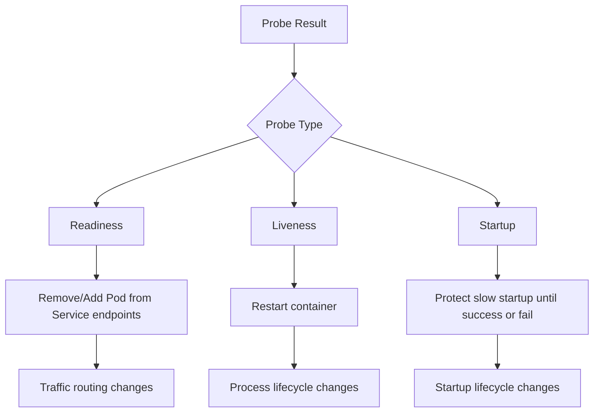
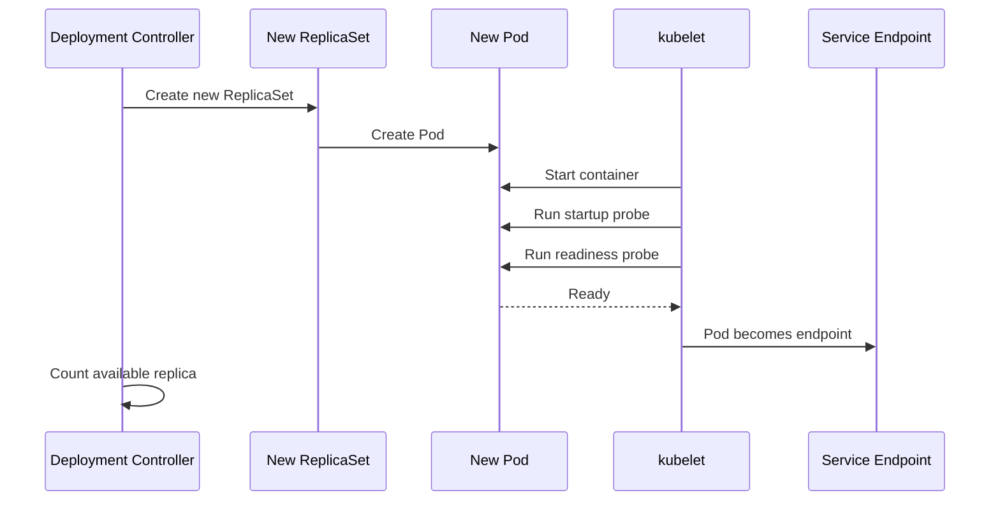
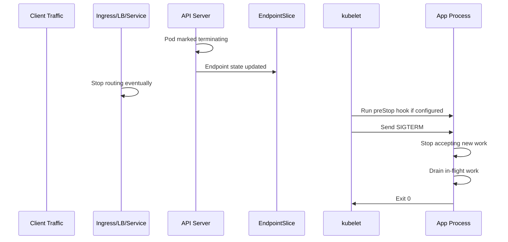
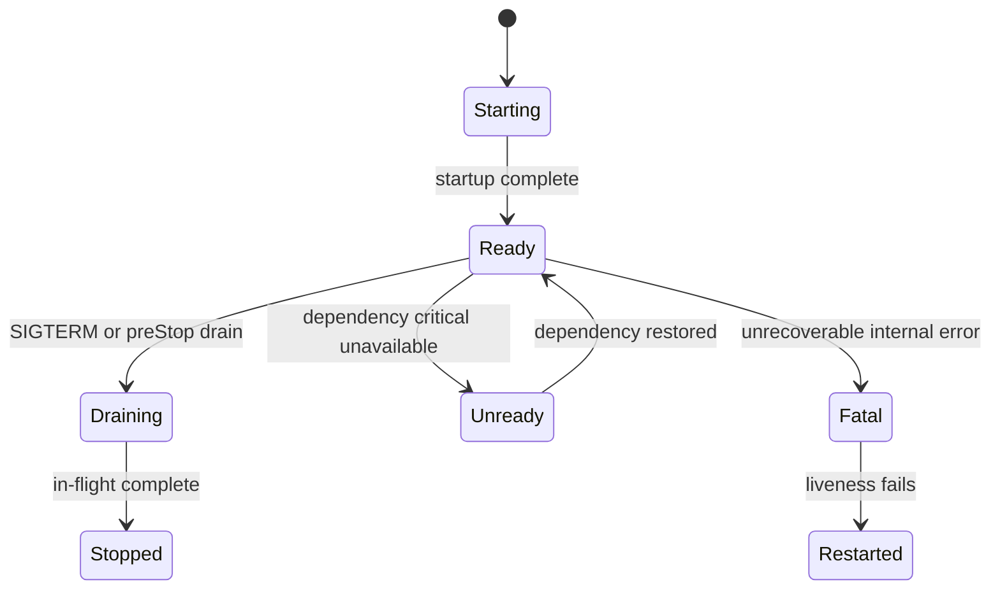

# Part 008 — Health Probes and Lifecycle Engineering

Kubernetes bisa menjalankan container. Itu bukan masalah besar. Tantangan produksi adalah membuat Kubernetes tahu:

- kapan aplikasi sudah boleh menerima traffic,
- kapan aplikasi sedang rusak dan perlu direstart,
- kapan aplikasi sedang start lambat tetapi belum gagal,
- kapan aplikasi harus dikeluarkan dari load balancing,
- bagaimana aplikasi shutdown tanpa memutus request aktif,
- bagaimana rollout tidak membunuh kapasitas layanan.

Probe dan lifecycle hook adalah kontrak antara aplikasi dan orchestrator. Jika kontrak ini salah, Kubernetes akan melakukan hal yang salah dengan sangat konsisten.

---

## 1. Target Pembelajaran

Setelah menyelesaikan part ini, kamu harus mampu:

1. Mendesain `readinessProbe`, `livenessProbe`, dan `startupProbe` sesuai fungsi masing-masing.
2. Membedakan health aplikasi, dependency readiness, dan process liveness.
3. Menghindari probe yang menyebabkan cascading restart.
4. Mendesain graceful shutdown untuk HTTP API, worker, streaming consumer, dan long-running task.
5. Memahami interaksi antara probe, Service endpoints, Deployment rollout, dan load balancer cloud.
6. Mengatur `terminationGracePeriodSeconds`, `preStop`, dan signal handling secara benar.
7. Mendiagnosis `CrashLoopBackOff`, rollout stuck, traffic drop saat deployment, dan restart storm.
8. Membuat lifecycle checklist untuk production readiness review.

---

## 2. Mental Model: Probe Bukan Monitoring

Monitoring bertanya:

> Apakah sistem sehat menurut manusia dan SLO?

Probe bertanya:

> Apa tindakan aman yang harus Kubernetes ambil terhadap container ini sekarang?

Itu berbeda.

Jika probe gagal, Kubernetes tidak membuka dashboard. Kubernetes mengambil aksi:

- readiness gagal → Pod dikeluarkan dari traffic Service,
- liveness gagal → container direstart,
- startup gagal → container dianggap gagal start dan direstart sesuai policy.

Jadi probe harus didesain berdasarkan aksi yang diinginkan.



Rule utama:

> Jangan pakai liveness untuk mengecek dependency eksternal kecuali kamu benar-benar ingin restart container saat dependency itu gagal.

---

## 3. Tiga Jenis Probe

### 3.1 Readiness Probe

Readiness menjawab:

> Apakah Pod ini boleh menerima traffic sekarang?

Jika readiness gagal, Pod tetap berjalan, tetapi tidak menerima traffic dari Service yang memilih Pod tersebut.

Contoh:

```yaml
readinessProbe:
  httpGet:
    path: /readyz
    port: 8080
  initialDelaySeconds: 5
  periodSeconds: 5
  timeoutSeconds: 2
  failureThreshold: 3
  successThreshold: 1
```

Gunakan readiness untuk:

- aplikasi belum selesai warm-up,
- cache wajib belum siap,
- migration compatibility check belum selesai,
- worker belum siap consume,
- dependency kritikal tidak tersedia dan menerima traffic akan gagal total,
- aplikasi sedang graceful shutdown dan harus stop menerima traffic baru.

### 3.2 Liveness Probe

Liveness menjawab:

> Apakah container ini masih bisa pulih sendiri, atau perlu direstart?

Jika liveness gagal, kubelet membunuh container dan restart policy berlaku.

Contoh:

```yaml
livenessProbe:
  httpGet:
    path: /livez
    port: 8080
  initialDelaySeconds: 30
  periodSeconds: 10
  timeoutSeconds: 2
  failureThreshold: 3
```

Gunakan liveness untuk:

- deadlock,
- event loop macet,
- process masih hidup tetapi tidak bisa melayani basic internal operation,
- thread pool utama rusak permanen,
- aplikasi masuk state fatal yang hanya restart bisa pulihkan.

Jangan gunakan liveness untuk:

- database down,
- external API down,
- Kafka broker sementara tidak tersedia,
- Redis timeout sesaat,
- downstream service error,
- readiness condition biasa.

Jika dependency down lalu semua Pod restart, kamu baru saja mengubah dependency outage menjadi restart storm.

### 3.3 Startup Probe

Startup menjawab:

> Apakah aplikasi masih dalam fase startup yang wajar?

Startup probe berguna untuk aplikasi yang start lambat. Selama startup probe belum sukses, liveness/readiness tidak boleh memaksa container dianggap mati terlalu cepat.

Contoh:

```yaml
startupProbe:
  httpGet:
    path: /startupz
    port: 8080
  periodSeconds: 5
  timeoutSeconds: 2
  failureThreshold: 24
```

Konfigurasi di atas memberi startup window sekitar:

```text
5 seconds * 24 = 120 seconds
```

Gunakan startup probe untuk:

- Java service dengan cold start panjang,
- aplikasi yang load model besar,
- service yang melakukan warm-up berat,
- aplikasi yang butuh bootstrap local index/cache,
- legacy app yang unpredictable saat start.

---

## 4. Probe Handler: HTTP, TCP, gRPC, Exec

Kubernetes mendukung beberapa cara probe.

### 4.1 HTTP Probe

Paling umum untuk service HTTP.

```yaml
readinessProbe:
  httpGet:
    path: /readyz
    port: http
```

Kelebihan:

- ekspresif,
- bisa membedakan live/ready/startup,
- mudah dites,
- bisa mengembalikan status code.

Kekurangan:

- butuh endpoint health yang benar,
- bisa salah desain terlalu berat,
- bisa tersangkut di middleware auth/rate-limit jika tidak dipisah.

### 4.2 TCP Probe

Cek apakah port bisa dibuka.

```yaml
livenessProbe:
  tcpSocket:
    port: 5432
```

Kelebihan:

- sederhana,
- cocok untuk service non-HTTP.

Kekurangan:

- port terbuka bukan berarti aplikasi sehat,
- tidak bisa mengecek readiness logis.

### 4.3 gRPC Probe

Cocok untuk service gRPC yang mengimplementasikan health checking.

```yaml
livenessProbe:
  grpc:
    port: 9090
```

Kelebihan:

- native untuk gRPC service,
- tidak perlu HTTP side endpoint.

Kekurangan:

- butuh implementasi health protocol yang benar,
- field dan batasan perlu dicek sesuai versi cluster.

### 4.4 Exec Probe

Menjalankan command di dalam container.

```yaml
livenessProbe:
  exec:
    command:
      - /bin/sh
      - -c
      - test -f /tmp/app-alive
```

Kelebihan:

- cocok untuk aplikasi tanpa port,
- bisa mengecek file/socket lokal.

Kekurangan:

- mahal jika terlalu sering,
- bergantung pada shell/tool di image,
- bisa gagal karena image distroless,
- bisa memperbesar attack surface jika image sengaja dipenuhi tooling.

---

## 5. Probe Field yang Harus Dipahami

Contoh lengkap:

```yaml
readinessProbe:
  httpGet:
    path: /readyz
    port: 8080
  initialDelaySeconds: 5
  periodSeconds: 5
  timeoutSeconds: 2
  failureThreshold: 3
  successThreshold: 1
```

Arti:

- `initialDelaySeconds`: jeda sebelum probe pertama.
- `periodSeconds`: interval probe.
- `timeoutSeconds`: waktu tunggu tiap probe.
- `failureThreshold`: jumlah gagal berturut-turut sebelum dianggap gagal.
- `successThreshold`: jumlah sukses berturut-turut sebelum dianggap sukses.

Perhitungan kasar failure detection:

```text
time_to_mark_unready ≈ periodSeconds * failureThreshold
```

Jika readiness:

```yaml
periodSeconds: 5
failureThreshold: 3
```

Maka Pod bisa butuh sekitar 15 detik untuk dikeluarkan dari endpoints setelah mulai gagal.

Untuk liveness:

```yaml
periodSeconds: 10
failureThreshold: 3
```

Container bisa butuh sekitar 30 detik sebelum direstart setelah gagal terus-menerus.

Jangan set terlalu agresif tanpa alasan. Probe agresif bisa menciptakan incident.

---

## 6. Desain Endpoint: `/livez`, `/readyz`, `/startupz`

Pisahkan endpoint.

```text
/livez     -> process is alive and internally recoverable
/readyz    -> safe to receive traffic
/startupz  -> startup completed enough to enable normal probes
```

### 6.1 `/livez`

Harus ringan dan lokal.

Boleh mengecek:

- event loop masih responsif,
- main thread pool tidak deadlock,
- fatal internal flag tidak aktif,
- process bisa menjalankan operasi trivial.

Jangan mengecek:

- database,
- cache eksternal,
- message broker,
- downstream API,
- object storage,
- DNS eksternal.

Contoh response:

```json
{
  "status": "ok"
}
```

### 6.2 `/readyz`

Harus menjawab apakah Pod boleh menerima traffic.

Boleh mengecek:

- server sudah bind port,
- routing table sudah siap,
- dependency wajib tersedia,
- cache minimum sudah warm,
- schema compatibility aman,
- background bootstrap selesai,
- aplikasi tidak sedang draining.

Tapi jangan terlalu ekstrem. Jika readiness bergantung pada 10 downstream service, satu downstream lambat bisa mengeluarkan semua Pod dari service dan menyebabkan outage total.

Gunakan degradasi jika memungkinkan:

```text
readiness should fail only when receiving normal traffic is worse than receiving no traffic.
```

### 6.3 `/startupz`

Cocok untuk startup yang punya fase eksplisit.

Contoh internal state:

```text
STARTING -> LOADING_CONFIG -> WARMING_CACHE -> READY
```

`/startupz` sukses setelah masuk `READY` pertama kali. Setelah itu, readiness yang mengatur traffic.

---

## 7. Dependency Check: Kapan Masuk Readiness?

Ini keputusan desain, bukan template.

### 7.1 Database

Jika API tidak bisa menjawab request apapun tanpa database, database check boleh masuk readiness.

Tetapi jangan membuat readiness terlalu mahal:

- gunakan lightweight ping,
- pakai timeout kecil,
- cache hasil sebentar jika perlu,
- jangan menjalankan query berat,
- jangan melakukan migration di readiness.

### 7.2 Cache

Jika cache hanya optimasi, jangan jadikan readiness gagal saat cache down. Service masih bisa berjalan degraded.

Jika cache adalah dependency wajib untuk correctness, boleh masuk readiness.

### 7.3 Message Broker

Untuk worker consumer, readiness bisa berarti:

- consumer connected,
- partition assignment siap,
- worker tidak sedang draining,
- concurrency slot tersedia.

Untuk API producer, broker down belum tentu harus membuat API unready jika request bisa ditolak secara eksplisit atau disimpan sementara. Tergantung kontrak bisnis.

### 7.4 Downstream API

Hati-hati. Jika semua service saling memasukkan downstream readiness, outage kecil bisa menjadi domino.

Lebih baik:

- circuit breaker,
- fallback,
- explicit degraded mode,
- SLO-aware error response,
- readiness hanya untuk dependency yang benar-benar membuat menerima traffic menjadi berbahaya.

---

## 8. Probe dan Deployment Rollout

Deployment rollout bergantung pada Pod menjadi Ready.



Jika readiness tidak pernah sukses, rollout stuck.

Cek:

```bash
kubectl rollout status deployment/payment-api -n payments
kubectl describe deployment payment-api -n payments
kubectl describe pod -n payments <new-pod>
```

`minReadySeconds` membuat Pod harus Ready selama durasi tertentu sebelum dihitung available.

```yaml
spec:
  minReadySeconds: 15
```

Ini membantu mencegah Pod yang flapping dianggap sehat terlalu cepat.

---

## 9. Graceful Shutdown: Masalah yang Sering Terlihat Saat Traffic Tinggi

Pod termination bukan sekadar container mati. Ini interaksi antara API server, endpoint controller, kubelet, application process, Service, ingress, dan cloud load balancer.

Tujuan shutdown:

1. Stop menerima traffic baru.
2. Selesaikan request/pekerjaan yang sedang berjalan.
3. Commit/ack offset secara aman.
4. Flush telemetry/log jika perlu.
5. Exit sebelum grace period habis.



Realitas penting:

- Endpoint removal tidak selalu instan sampai semua proxy/LB selesai propagate.
- Cloud load balancer bisa punya delay sendiri.
- Ingress controller punya drain behavior sendiri.
- Aplikasi harus siap menerima SIGTERM.
- `preStop` dan aplikasi shutdown berbagi `terminationGracePeriodSeconds`.

---

## 10. `terminationGracePeriodSeconds`

Default umumnya 30 detik. Untuk banyak service, ini bisa terlalu pendek atau terlalu panjang.

```yaml
spec:
  terminationGracePeriodSeconds: 45
```

Atur berdasarkan:

- p99 request duration,
- max worker processing time,
- offset commit time,
- DB transaction timeout,
- load balancer drain delay,
- deployment speed requirement.

Jika terlalu pendek:

- request aktif terputus,
- job terpotong,
- message diproses ulang,
- transaction gagal,
- logs/telemetry hilang.

Jika terlalu panjang:

- rollout lambat,
- node drain lambat,
- upgrade tertahan,
- incident recovery lambat,
- capacity lama tertahan.

---

## 11. `preStop` Hook

`preStop` berjalan sebelum container menerima TERM signal. Ia berguna untuk memberi waktu propagasi endpoint removal atau memberi tahu aplikasi untuk draining.

Contoh sederhana:

```yaml
lifecycle:
  preStop:
    exec:
      command:
        - /bin/sh
        - -c
        - sleep 10
```

`preStop sleep` sering dipakai sebagai kompensasi propagation delay. Tetapi jangan jadikan ini satu-satunya mekanisme graceful shutdown.

Lebih baik aplikasi punya endpoint internal untuk drain:

```yaml
lifecycle:
  preStop:
    httpGet:
      path: /internal/drain
      port: 8080
```

Aplikasi ketika menerima drain:

1. set readiness false,
2. stop accept work baru,
3. biarkan in-flight selesai,
4. exit saat SIGTERM atau setelah drain selesai.

Catatan penting: total waktu `preStop` + shutdown normal harus muat dalam `terminationGracePeriodSeconds`.

---

## 12. Signal Handling: PID 1 Harus Benar

Kubelet mengirim TERM signal ke process utama container. Jika aplikasi tidak menangani SIGTERM, shutdown bisa brutal.

Masalah umum:

- shell script menjadi PID 1 dan tidak forward signal,
- process child tidak menerima SIGTERM,
- Node.js/Java/Go app tidak memasang shutdown hook,
- worker langsung exit tanpa ack/nack message,
- HTTP server tidak stop accepting connection baru.

Dockerfile buruk:

```dockerfile
CMD sh -c "java -jar app.jar"
```

Lebih baik:

```dockerfile
ENTRYPOINT ["java", "-jar", "app.jar"]
```

Atau gunakan init process seperti `tini` jika butuh process reaping/signal forwarding.

---

## 13. HTTP API Lifecycle Pattern

Production HTTP service harus punya flow:



Manifest baseline:

```yaml
apiVersion: apps/v1
kind: Deployment
metadata:
  name: payment-api
spec:
  replicas: 4
  minReadySeconds: 10
  strategy:
    type: RollingUpdate
    rollingUpdate:
      maxSurge: 1
      maxUnavailable: 0
  selector:
    matchLabels:
      app: payment-api
  template:
    metadata:
      labels:
        app: payment-api
    spec:
      terminationGracePeriodSeconds: 45
      containers:
        - name: payment-api
          image: registry.example.com/payment-api:1.18.4
          ports:
            - name: http
              containerPort: 8080
          startupProbe:
            httpGet:
              path: /startupz
              port: http
            periodSeconds: 5
            timeoutSeconds: 2
            failureThreshold: 24
          readinessProbe:
            httpGet:
              path: /readyz
              port: http
            periodSeconds: 5
            timeoutSeconds: 2
            failureThreshold: 3
            successThreshold: 1
          livenessProbe:
            httpGet:
              path: /livez
              port: http
            periodSeconds: 10
            timeoutSeconds: 2
            failureThreshold: 3
          lifecycle:
            preStop:
              exec:
                command:
                  - /bin/sh
                  - -c
                  - sleep 10
```

Ini baseline, bukan template final. Sesuaikan durasi dengan traffic dan cloud LB behavior.

---

## 14. Worker Lifecycle Pattern

Worker berbeda dari API. Ia mungkin tidak menerima HTTP traffic, tetapi mengambil pekerjaan dari queue/broker.

Readiness untuk worker bisa berarti:

- process siap consume,
- broker connection siap,
- worker tidak sedang draining,
- concurrency slot tersedia,
- partition assignment selesai.

Shutdown worker:

1. Stop polling/fetch message baru.
2. Selesaikan message yang sedang diproses.
3. Commit offset/ack message.
4. Release lock/lease.
5. Exit cleanly.

Manifest:

```yaml
apiVersion: apps/v1
kind: Deployment
metadata:
  name: invoice-worker
spec:
  replicas: 3
  selector:
    matchLabels:
      app: invoice-worker
  template:
    metadata:
      labels:
        app: invoice-worker
    spec:
      terminationGracePeriodSeconds: 120
      containers:
        - name: invoice-worker
          image: registry.example.com/invoice-worker:2.7.1
          ports:
            - name: health
              containerPort: 8081
          readinessProbe:
            httpGet:
              path: /readyz
              port: health
            periodSeconds: 10
            timeoutSeconds: 2
            failureThreshold: 3
          livenessProbe:
            httpGet:
              path: /livez
              port: health
            periodSeconds: 20
            timeoutSeconds: 2
            failureThreshold: 3
          lifecycle:
            preStop:
              httpGet:
                path: /internal/drain
                port: health
```

Untuk worker, grace period sering lebih panjang daripada API karena message processing punya durasi lebih panjang.

---

## 15. Job dan CronJob: Probe Tidak Selalu Perlu

Untuk `Job`, keberhasilan utama ditentukan exit code. Liveness bisa berguna jika job bisa hang permanen, tetapi jangan asal copy probe service API.

Contoh job dengan active deadline:

```yaml
apiVersion: batch/v1
kind: Job
metadata:
  name: settlement-reconciliation
spec:
  backoffLimit: 2
  activeDeadlineSeconds: 3600
  template:
    spec:
      restartPolicy: Never
      containers:
        - name: reconcile
          image: registry.example.com/reconcile:1.4.0
```

Untuk batch:

- gunakan `activeDeadlineSeconds`,
- gunakan `backoffLimit`,
- desain idempotency,
- tulis progress checkpoint,
- hindari liveness yang membunuh job saat fase berat tapi valid.

---

## 16. Stateful Workload Lifecycle

Stateful workload lebih sensitif.

Contoh risiko:

- database replica belum sync tetapi readiness sukses,
- leader election belum selesai,
- node drain membunuh quorum,
- volume detach/attach lambat,
- startup recovery log lama dianggap gagal oleh liveness.

Prinsip:

- startup probe harus cukup longgar untuk recovery valid,
- readiness harus mencerminkan role dan serving capability,
- liveness harus sangat hati-hati,
- PDB dan topology harus dirancang untuk quorum,
- shutdown harus flush state dan leave cluster secara benar.

Untuk database, message broker, dan consensus system, jangan pakai probe generik. Ikuti operator/vendor guidance.

---

## 17. Cloud Load Balancer dan Drain Delay

Di EKS/AKS, traffic path bisa panjang:

```text
Client -> Cloud Load Balancer -> Ingress Controller -> Service -> EndpointSlice -> Pod
```

Atau:

```text
Client -> Cloud Load Balancer Service type=LoadBalancer -> Node/Pod
```

Masalah yang umum:

- Pod sudah Terminating tetapi masih menerima traffic beberapa detik,
- cloud LB health check interval lebih lambat dari readiness,
- ingress controller butuh waktu update upstream,
- kube-proxy/IPVS/eBPF dataplane punya propagation delay,
- connection keep-alive masih mengarah ke Pod lama.

Karena itu, graceful shutdown sering perlu kombinasi:

- readiness false saat drain,
- preStop small delay,
- application-level shutdown hook,
- ingress/LB drain timeout yang sesuai,
- termination grace period cukup.

Jangan menyelesaikan semuanya dengan `sleep 60`. Itu memperlambat deployment dan node drain. Ukur propagation delay aktual.

---

## 18. Rollout Safety dengan Probe

Deployment strategy:

```yaml
strategy:
  type: RollingUpdate
  rollingUpdate:
    maxSurge: 1
    maxUnavailable: 0
minReadySeconds: 10
```

Makna:

- Kubernetes boleh membuat 1 Pod ekstra saat rollout.
- Tidak boleh mengurangi available Pod di bawah desired replicas.
- Pod baru harus Ready minimal 10 detik sebelum dihitung available.

Jika readiness terlalu cepat sukses, Pod belum benar-benar siap tetapi sudah menerima traffic.

Jika readiness terlalu lambat atau terlalu ketat, rollout stuck.

Jika liveness terlalu agresif, Pod baru restart sebelum sempat siap.

Kombinasi aman untuk service kritikal:

```yaml
startupProbe:
  periodSeconds: 5
  failureThreshold: 24
readinessProbe:
  periodSeconds: 5
  failureThreshold: 3
livenessProbe:
  periodSeconds: 10
  failureThreshold: 3
minReadySeconds: 10
strategy:
  rollingUpdate:
    maxSurge: 1
    maxUnavailable: 0
```

Angka ini hanya starting point. Observability harus menentukan final.

---

## 19. Common Failure Modes

### 19.1 Liveness Mengecek Database

```yaml
livenessProbe:
  httpGet:
    path: /health-with-db
    port: 8080
```

Saat DB outage 30 detik, semua Pod restart. Restart menambah beban startup, connection storm, dan outage makin panjang.

Solusi:

- DB check pindah ke readiness jika memang traffic harus dihentikan,
- liveness hanya cek process internal,
- gunakan circuit breaker dan degraded response.

### 19.2 Readiness Terlalu Cepat Sukses

Aplikasi bind port, readiness sukses, tetapi cache/routing belum siap. Pod menerima traffic dan error.

Solusi:

- readiness harus menunggu bootstrap minimal,
- gunakan startup probe,
- gunakan `minReadySeconds`.

### 19.3 Startup Probe Tidak Ada untuk Slow App

Liveness mulai terlalu cepat dan membunuh app sebelum selesai startup. Pod masuk CrashLoopBackOff.

Solusi:

- tambahkan startup probe,
- longgarkan startup window,
- kurangi startup work jika mungkin.

### 19.4 Probe Timeout Terlalu Kecil

```yaml
timeoutSeconds: 1
```

Pada node pressure, GC pause, atau network jitter, probe gagal sporadis. Readiness flapping atau liveness restart.

Solusi:

- gunakan timeout realistis,
- endpoint health harus ringan,
- observasi latency endpoint probe.

### 19.5 `preStop` Lebih Lama dari Grace Period

```yaml
terminationGracePeriodSeconds: 10
lifecycle:
  preStop:
    exec:
      command: ["sh", "-c", "sleep 20"]
```

Kubelet akan membunuh container saat grace period habis. Shutdown hook aplikasi mungkin tidak punya waktu.

Solusi:

- grace period harus mencakup preStop + shutdown,
- jangan sleep tanpa ukuran.

### 19.6 App Tidak Handle SIGTERM

Pod dihapus, aplikasi tidak drain, request aktif putus.

Solusi:

- implement graceful shutdown,
- stop accepting new requests,
- wait for in-flight requests,
- close server cleanly,
- exit sebelum grace period.

---

## 20. Debugging Cookbook

### 20.1 Probe Gagal

```bash
kubectl describe pod -n payments payment-api-xxx
```

Cari event:

```text
Readiness probe failed: HTTP probe failed with statuscode: 503
Liveness probe failed: Get "http://.../livez": context deadline exceeded
Startup probe failed: connection refused
```

Lanjut:

```bash
kubectl logs -n payments payment-api-xxx
kubectl logs -n payments payment-api-xxx --previous
kubectl exec -n payments payment-api-xxx -- curl -v localhost:8080/readyz
```

Jika image distroless dan tidak ada curl, gunakan debug container:

```bash
kubectl debug -n payments -it payment-api-xxx --image=curlimages/curl --target=payment-api
```

### 20.2 CrashLoopBackOff

```bash
kubectl describe pod -n payments payment-api-xxx
kubectl get pod -n payments payment-api-xxx -o yaml
kubectl logs -n payments payment-api-xxx --previous
```

Bedakan:

- app crash sendiri,
- liveness membunuh app,
- startup gagal,
- OOMKilled,
- config invalid.

### 20.3 Rollout Stuck

```bash
kubectl rollout status deployment/payment-api -n payments
kubectl describe deployment payment-api -n payments
kubectl get rs -n payments
kubectl get pods -n payments -l app=payment-api
```

Cari:

- new Pod tidak Ready,
- image pull error,
- readiness fail,
- insufficient resources,
- PDB/strategy interaction,
- quota limit.

### 20.4 Traffic Drop Saat Deployment

Investigasi:

```bash
kubectl get endpointslice -n payments -l kubernetes.io/service-name=payment-api
kubectl describe pod -n payments <terminating-pod>
kubectl logs -n ingress-nginx <controller-pod>
```

Cek:

- readiness false sebelum shutdown?
- preStop cukup?
- ingress drain timeout?
- cloud LB health check interval?
- keep-alive timeout?
- app graceful shutdown?
- `maxUnavailable` terlalu agresif?

---

## 21. Implementation Sketch: Application Health State

Aplikasi produksi sebaiknya punya health state internal, bukan sekadar endpoint selalu `200`.

Pseudo-code:

```text
state = STARTING

on startup complete:
  state = READY

on critical dependency unavailable:
  state = NOT_READY

on dependency restored:
  state = READY

on preStop or SIGTERM:
  state = DRAINING
  stop accepting new work
  wait for in-flight work
  exit

/livez:
  if fatal internal error: 500
  else: 200

/readyz:
  if state == READY: 200
  else: 503

/startupz:
  if startup complete: 200
  else: 503
```

Untuk API server, graceful shutdown perlu memanggil primitive runtime/framework:

- Java: shutdown hook, graceful web server shutdown, executor shutdown.
- Go: `http.Server.Shutdown(ctx)`.
- Node.js: `server.close()`, stop accepting new connections, wait active requests.
- .NET: hosted service shutdown, graceful Kestrel shutdown.

---

## 22. Production Checklist

### Probe Semantics

- Apakah readiness hanya menjawab “boleh menerima traffic”?
- Apakah liveness hanya menjawab “perlu restart”?
- Apakah startup probe melindungi slow startup?
- Apakah probe endpoint ringan?
- Apakah probe tidak melewati auth middleware umum?
- Apakah probe tidak melakukan operasi mahal?

### Dependency Behavior

- Apakah database check berada di probe yang tepat?
- Apakah downstream outage tidak menyebabkan restart storm?
- Apakah degraded mode dipikirkan?
- Apakah timeout probe realistis?

### Shutdown

- Apakah aplikasi handle SIGTERM?
- Apakah readiness berubah false saat draining?
- Apakah in-flight request diberi waktu selesai?
- Apakah worker stop mengambil message baru sebelum exit?
- Apakah offset/ack/lock dilepas dengan benar?
- Apakah `terminationGracePeriodSeconds` cukup?
- Apakah `preStop` tidak memakan seluruh grace period?

### Rollout

- Apakah `maxUnavailable` sesuai SLO?
- Apakah `maxSurge` sesuai kapasitas cluster?
- Apakah `minReadySeconds` dipakai untuk service sensitif?
- Apakah PDB sinkron dengan replica?
- Apakah rollout bisa rollback cepat?

### Cloud Traffic

- Apakah ingress/LB drain behavior diuji?
- Apakah health check cloud dan readiness Kubernetes tidak konflik?
- Apakah connection keep-alive diperhitungkan?
- Apakah terminating Pod masih menerima traffic selama propagation delay?

---

## 23. Deliberate Practice

### Exercise 1 — Break Liveness Intentionally

Buat service dengan liveness yang mengecek database. Matikan database sementara. Amati restart storm.

Lalu ubah:

- liveness hanya internal,
- readiness cek database ringan,
- tambahkan circuit breaker.

Bandingkan behavior.

### Exercise 2 — Slow Startup

Buat aplikasi yang butuh 90 detik untuk start. Tanpa startup probe, liveness akan membunuh terlalu cepat. Tambahkan startup probe dan amati rollout berhasil.

### Exercise 3 — Graceful Shutdown Under Load

Jalankan load test. Deploy versi baru. Ukur:

- request error saat rollout,
- latency spike,
- apakah terminating Pod masih menerima traffic,
- apakah request aktif selesai.

Perbaiki dengan:

- readiness/drain state,
- preStop kecil,
- graceful server shutdown,
- termination grace period.

### Exercise 4 — Worker Drain

Buat worker yang memproses message 60 detik. Lakukan rolling restart. Pastikan message tidak hilang dan tidak diproses paralel tanpa idempotency.

---

## 24. Heuristics untuk Production

1. Readiness failure removes traffic; liveness failure restarts process.
2. Jangan pakai liveness untuk dependency outage biasa.
3. Startup probe adalah alat untuk slow boot, bukan pengganti readiness.
4. Probe harus ringan dan deterministik.
5. Timeout 1 detik sering terlalu agresif untuk sistem produksi sibuk.
6. Graceful shutdown harus diimplementasikan di aplikasi, bukan hanya YAML.
7. `preStop sleep` adalah kompensasi propagation delay, bukan desain utama.
8. Grace period harus cukup untuk preStop dan shutdown app.
9. Worker harus stop mengambil pekerjaan baru sebelum exit.
10. Rollout safety adalah gabungan probe, strategy, PDB, capacity, dan observability.

---

## 25. Closing Mental Model

Probe dan lifecycle hook adalah bahasa yang dipakai aplikasi untuk memberi tahu Kubernetes cara memperlakukannya.

Jika bahasa itu salah, Kubernetes akan tetap patuh, tetapi patuh pada instruksi yang salah.

- Readiness salah → traffic dikirim ke Pod yang belum siap, atau semua Pod dikeluarkan dari service.
- Liveness salah → restart storm.
- Startup salah → slow app tidak pernah berhasil start.
- Shutdown salah → request putus saat rollout dan node drain.

Di produksi, probe bukan dekorasi YAML. Probe adalah bagian dari correctness contract.

Part berikutnya akan masuk ke **Service Discovery and Kubernetes Networking**: bagaimana traffic menemukan Pod, bagaimana Service/EndpointSlice/DNS bekerja, dan bagaimana model network Kubernetes menjadi dasar untuk ingress, load balancer, NetworkPolicy, EKS VPC CNI, dan AKS CNI.

---

## References

- Kubernetes Documentation — Liveness, Readiness, and Startup Probes: https://kubernetes.io/docs/concepts/workloads/pods/probes/
- Kubernetes Documentation — Configure Liveness, Readiness and Startup Probes: https://kubernetes.io/docs/tasks/configure-pod-container/configure-liveness-readiness-startup-probes/
- Kubernetes Documentation — Pod Lifecycle: https://kubernetes.io/docs/concepts/workloads/pods/pod-lifecycle/
- Kubernetes Documentation — Container Lifecycle Hooks: https://kubernetes.io/docs/concepts/containers/container-lifecycle-hooks/
- Kubernetes Documentation — Explore Termination Behavior for Pods and Their Endpoints: https://kubernetes.io/docs/tutorials/services/pods-and-endpoint-termination-flow/
- Kubernetes Documentation — Deployment: https://kubernetes.io/docs/concepts/workloads/controllers/deployment/
- AWS EKS Best Practices Guide: https://docs.aws.amazon.com/eks/latest/best-practices/introduction.html
- Azure AKS Best Practices: https://learn.microsoft.com/en-us/azure/aks/best-practices
