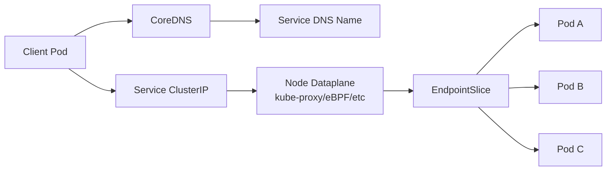
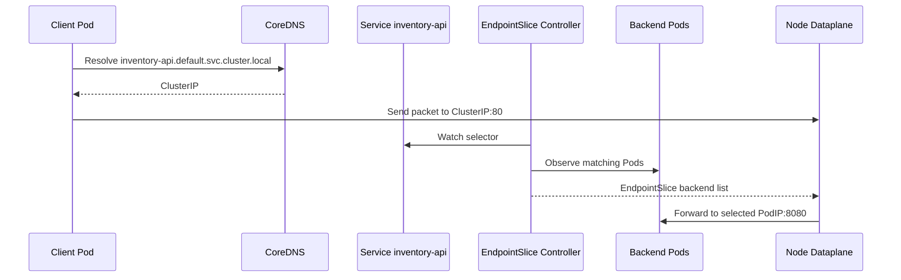
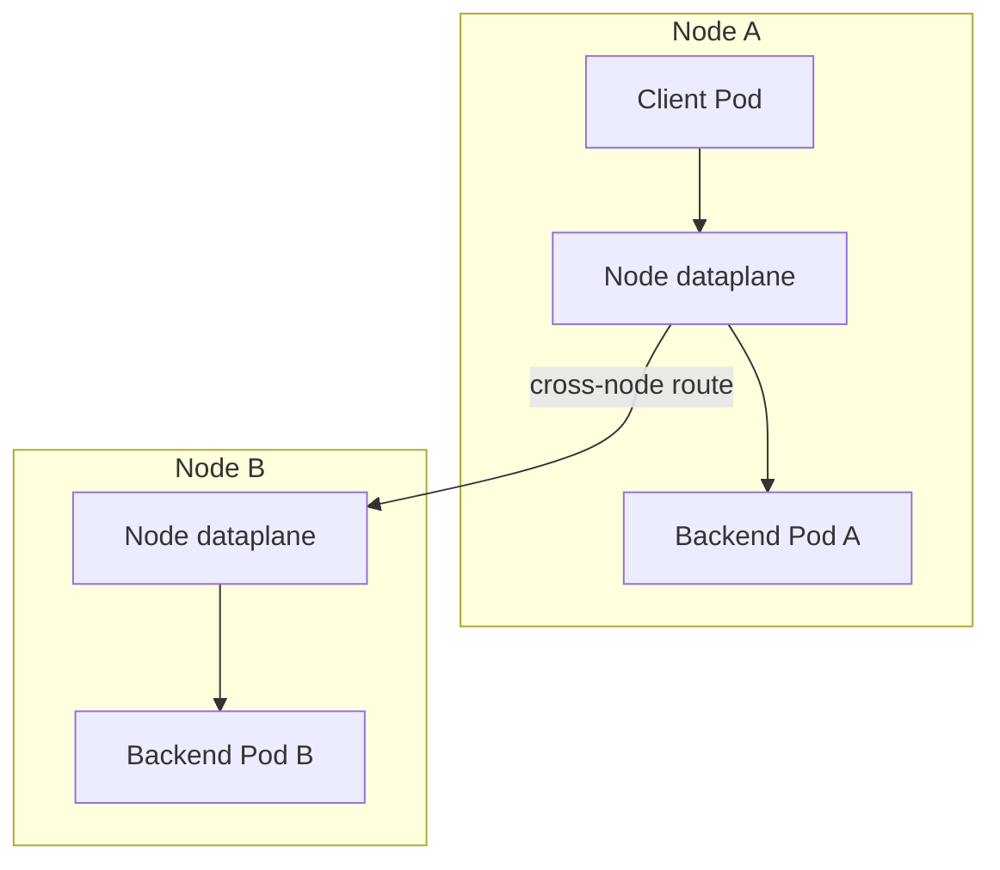
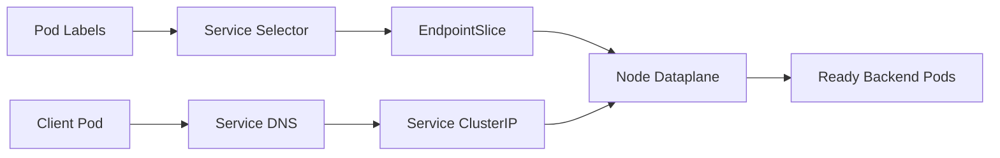

# Part 009 — Service Discovery and Kubernetes Networking

The useful way to learn Kubernetes networking is not to memorize every object. The useful way is to understand the contract:

> A Pod is replaceable and unstable. A Service gives that replaceable group of Pods a stable network identity.

Everything else is implementation detail: labels, EndpointSlices, DNS records, kube-proxy or eBPF dataplane, cloud load balancer integration, CNI behavior, and network policy enforcement.

In production, broken networking rarely looks like “Kubernetes networking is broken”. It looks like:

- rollout succeeds but 20% traffic still hits old behavior;
- service name resolves but connection times out;
- one Availability Zone works and another fails;
- CoreDNS CPU spikes and every service starts failing randomly;
- a Service has zero endpoints because labels drifted;
- pods are healthy, but cloud load balancer health checks fail;
- a migration from ClusterIP to LoadBalancer accidentally exposes an internal API;
- kube-proxy rules, CNI IP exhaustion, or NodePort security group gaps create partial outage.

This part builds the mental model needed to debug those situations.

---

## 1. The Core Model

Kubernetes networking is based on a few invariants.

| Invariant | Meaning | Production consequence |
|---|---|---|
| Every Pod gets an IP | A Pod is directly addressable within the cluster network | Pod IP is not stable, so do not depend on it as identity |
| Containers in the same Pod share network namespace | They share IP and port space | Sidecars can communicate through `localhost`; port collision matters |
| Services select Pods by labels | Service membership is indirect | Label hygiene is production-critical |
| Service IP is stable during Service lifetime | Clients call the Service, not individual Pods | Service becomes the logical dependency boundary |
| EndpointSlice represents backends | Kubernetes materializes selected Pods into endpoints | Debug endpoints, not only Service YAML |
| DNS maps names to Services | Most application code uses DNS names | DNS is part of application availability |
| Network dataplane is implementation-specific | iptables, IPVS, nftables, eBPF, cloud CNI, etc. | Same manifest can have different operational behavior per cluster |



The important distinction:

- `Service` is the stable abstraction.
- `EndpointSlice` is the current resolved backend set.
- CNI/dataplane is how packets actually move.
- DNS is how clients usually discover the Service.

When debugging, never stop at `kubectl get svc`. A Service with a ClusterIP can still have no usable backend.

---

## 2. Why Service Discovery Exists

Without Service discovery, a client needs to know Pod IPs:

```text
order-api -> 10.244.2.17:8080
order-api -> 10.244.5.31:8080
order-api -> 10.244.7.11:8080
```

That does not survive:

- rolling deployment;
- node replacement;
- autoscaling;
- rescheduling after failure;
- blue/green migration;
- pod disruption;
- zone rebalancing.

With a Service:

```text
order-api -> inventory-service.default.svc.cluster.local:8080
```

The client depends on a logical service name. Kubernetes continuously updates the backend set behind that logical name.

This is not only convenience. It is a correctness mechanism.

---

## 3. Minimal Service Example

A Service selects Pods through labels.

```yaml
apiVersion: apps/v1
kind: Deployment
metadata:
  name: inventory-api
spec:
  replicas: 3
  selector:
    matchLabels:
      app.kubernetes.io/name: inventory-api
  template:
    metadata:
      labels:
        app.kubernetes.io/name: inventory-api
    spec:
      containers:
        - name: app
          image: registry.example.com/inventory-api:1.4.2
          ports:
            - name: http
              containerPort: 8080
---
apiVersion: v1
kind: Service
metadata:
  name: inventory-api
spec:
  type: ClusterIP
  selector:
    app.kubernetes.io/name: inventory-api
  ports:
    - name: http
      port: 80
      targetPort: http
```

The Service port is `80`. The container port is `8080`. The name `http` ties the Service to the container port by name.

Prefer named ports in production because they survive container port changes better than hard-coded numeric `targetPort` values.

---

## 4. The Service-to-Pod Resolution Chain

When a client calls:

```text
http://inventory-api.default.svc.cluster.local
```

The chain is:



Conceptually, this is simple. Operationally, there are many places it can break:

| Layer | Example failure | Symptom |
|---|---|---|
| DNS | CoreDNS unavailable | `no such host`, timeout resolving Service name |
| Service | Wrong selector | Service exists but has no endpoints |
| EndpointSlice | Pods not ready | Service resolves but traffic has no backends |
| Dataplane | kube-proxy/eBPF issue | ClusterIP connection fails despite endpoints |
| CNI | routing/IP exhaustion | Pod-to-Pod fails across nodes or new Pods cannot get IPs |
| App | wrong `targetPort` or readiness behavior | traffic reaches wrong port or unready app |

---

## 5. Service Types

Kubernetes gives several Service types. Use them intentionally.

| Type | Scope | Typical use | Production warning |
|---|---|---|---|
| `ClusterIP` | Inside cluster | Internal service-to-service calls | Default and safest for internal APIs |
| `Headless` | DNS returns backend Pod records | Stateful discovery, direct backend identity | Client must handle backend selection/failover |
| `NodePort` | Exposes port on every node | Building block for external LBs, sometimes debugging | Avoid direct public NodePort exposure |
| `LoadBalancer` | Cloud provider creates external/internal LB | L4 public/private exposure | Cloud-specific behavior and cost |
| `ExternalName` | DNS CNAME to external service | Alias external dependency | No proxying, no port mapping, DNS-only abstraction |

Most internal application Services should be `ClusterIP`.

Use `LoadBalancer` when the application needs L4 exposure and a cloud load balancer is the right edge primitive.

Use Ingress/Gateway API when the application needs L7 HTTP routing, host/path routing, TLS termination, request policy, or shared edge infrastructure.

---

## 6. ClusterIP Service

`ClusterIP` is the default Service type.

```yaml
apiVersion: v1
kind: Service
metadata:
  name: billing-api
spec:
  type: ClusterIP
  selector:
    app.kubernetes.io/name: billing-api
  ports:
    - name: http
      port: 80
      targetPort: http
```

Client code should call:

```text
http://billing-api.payments.svc.cluster.local
```

Inside the same namespace, this often works:

```text
http://billing-api
```

But production configuration should prefer fully qualified service names when cross-namespace dependencies are involved:

```text
billing-api.payments.svc.cluster.local
```

This avoids ambiguity when a service with the same name exists in another namespace.

---

## 7. Service Selector Correctness

A Service selector is not validated against a Deployment selector. Kubernetes will happily accept a Service that selects nothing.

Bad example:

```yaml
apiVersion: v1
kind: Service
metadata:
  name: checkout-api
spec:
  selector:
    app: checkout
  ports:
    - port: 80
      targetPort: 8080
```

Deployment labels:

```yaml
metadata:
  labels:
    app.kubernetes.io/name: checkout-api
```

This Service has zero endpoints.

Debug command:

```bash
kubectl get endpointslice -l kubernetes.io/service-name=checkout-api
kubectl describe svc checkout-api
kubectl get pod -l app=checkout
kubectl get pod -l app.kubernetes.io/name=checkout-api
```

Production invariant:

> Every Service selector must be tested against live Pods before release.

In CI, use static policy. In cluster, use admission or conformance checks.

---

## 8. EndpointSlice Mental Model

Older Kubernetes versions used `Endpoints` heavily. Modern Kubernetes uses `EndpointSlice` to scale better for large backend sets.

An EndpointSlice contains a subset of endpoints for a Service.

Conceptually:

```yaml
apiVersion: discovery.k8s.io/v1
kind: EndpointSlice
metadata:
  labels:
    kubernetes.io/service-name: inventory-api
addressType: IPv4
ports:
  - name: http
    port: 8080
    protocol: TCP
endpoints:
  - addresses:
      - 10.42.1.18
    conditions:
      ready: true
  - addresses:
      - 10.42.3.24
    conditions:
      ready: true
```

You normally do not create EndpointSlices manually for selector-based Services. The controller creates them.

But you should inspect them during incident response.

Useful commands:

```bash
kubectl get endpointslice -A
kubectl get endpointslice -n payments -l kubernetes.io/service-name=inventory-api -o wide
kubectl describe endpointslice -n payments -l kubernetes.io/service-name=inventory-api
```

Interpretation:

| Observation | Likely meaning |
|---|---|
| No EndpointSlice | Service selector selects no Pods, or controller problem |
| Endpoints exist but `ready=false` | Pods exist but readiness gate excludes them from traffic |
| Endpoints have unexpected IPs | Label selector captures wrong Pods |
| Endpoints only in one zone | Scheduling/topology issue |
| Endpoint port mismatch | Service `targetPort` / container port mismatch |

---

## 9. DNS Contract

Kubernetes DNS gives Services stable names.

Common forms:

```text
service-name
service-name.namespace
service-name.namespace.svc
service-name.namespace.svc.cluster.local
```

Inside namespace `payments`, a Pod can resolve:

```text
inventory-api
```

From another namespace, use:

```text
inventory-api.payments.svc.cluster.local
```

DNS is not a side concern. DNS is in the critical path of almost every microservice call.

Production implications:

- configure application DNS caching intentionally;
- avoid doing DNS lookup per request in high-throughput paths;
- monitor CoreDNS latency, errors, cache hit ratio, CPU, memory;
- avoid excessive short-lived connections that trigger repeated lookups;
- treat CoreDNS as a tier-0 cluster dependency.

---

## 10. CoreDNS Failure Patterns

CoreDNS failures usually appear as application failures.

| Failure pattern | App symptom | Root cause examples |
|---|---|---|
| DNS timeout | intermittent dependency failures | overloaded CoreDNS, network policy blocking DNS, node issue |
| `NXDOMAIN` | service not found | wrong namespace, wrong name, missing Service |
| slow resolution | high p95/p99 latency | CoreDNS CPU throttling, upstream DNS latency |
| only some Pods fail | node-local issue | node routing, iptables/eBPF, DNS config drift |
| external DNS lookup fails | cannot call external APIs | upstream resolver, NAT, firewall, DNS forwarding config |

Debug from inside cluster:

```bash
kubectl run dns-debug \
  --rm -it \
  --image=registry.k8s.io/e2e-test-images/agnhost:2.45 \
  --restart=Never \
  -- nslookup inventory-api.payments.svc.cluster.local
```

Also inspect:

```bash
kubectl -n kube-system get deploy coredns
kubectl -n kube-system top pod -l k8s-app=kube-dns
kubectl -n kube-system logs deploy/coredns
```

On managed clusters, CoreDNS is often delivered as a managed or cluster add-on. Treat its version, resources, autoscaling, and upgrade lifecycle as platform responsibilities.

---

## 11. Headless Service

A headless Service has no ClusterIP:

```yaml
apiVersion: v1
kind: Service
metadata:
  name: postgres
spec:
  clusterIP: None
  selector:
    app.kubernetes.io/name: postgres
  ports:
    - name: postgres
      port: 5432
      targetPort: postgres
```

Instead of hiding all backends behind one virtual IP, DNS can return records for individual endpoints.

This is useful when:

- clients must know individual backend identities;
- a StatefulSet needs stable per-pod DNS;
- the protocol has its own leader/follower or shard routing semantics;
- a service mesh or client-side load balancer expects endpoint discovery.

With StatefulSet:

```text
postgres-0.postgres.data.svc.cluster.local
postgres-1.postgres.data.svc.cluster.local
postgres-2.postgres.data.svc.cluster.local
```

Production warning:

> Headless Service moves more responsibility to the client.

The client must handle connection selection, retry, stale records, and endpoint failure correctly.

---

## 12. NodePort Service

A NodePort exposes the Service on a port across nodes.

```yaml
apiVersion: v1
kind: Service
metadata:
  name: legacy-api
spec:
  type: NodePort
  selector:
    app.kubernetes.io/name: legacy-api
  ports:
    - name: http
      port: 80
      targetPort: http
      nodePort: 30080
```

Traffic can arrive at:

```text
<NodeIP>:30080
```

In production, direct NodePort access is usually not the desired external interface. It is commonly used as a building block behind a cloud load balancer or for controlled internal scenarios.

Risks:

- every node exposes the port;
- security groups / NSGs must be correct;
- client may hit a node with no local backend unless traffic policy is configured;
- operational ownership becomes unclear;
- port ranges are limited and can collide.

Prefer Ingress/Gateway/API or cloud LoadBalancer Services for intentional exposure.

---

## 13. LoadBalancer Service

A `LoadBalancer` Service asks the cloud provider to provision a cloud load balancer.

```yaml
apiVersion: v1
kind: Service
metadata:
  name: public-metrics-ingest
  annotations:
    service.beta.kubernetes.io/aws-load-balancer-scheme: internet-facing
spec:
  type: LoadBalancer
  selector:
    app.kubernetes.io/name: metrics-ingest
  ports:
    - name: tcp
      port: 443
      targetPort: 8443
```

The exact annotations and behavior are cloud-specific.

On AWS/EKS, L4 exposure often maps to Network Load Balancer behavior through the relevant service controller or AWS Load Balancer Controller.

On Azure/AKS, LoadBalancer Services integrate with Azure Load Balancer and require subnet, public/private, annotation, and health probe awareness.

General production decision:

| Requirement | Better primitive |
|---|---|
| TCP/UDP pass-through | `Service type=LoadBalancer` |
| HTTP host/path routing | Ingress or Gateway API |
| Shared edge with many apps | Ingress/Gateway API |
| Cloud-native WAF/TLS policy | Cloud L7 gateway/controller |
| Internal service-to-service only | `ClusterIP` |

---

## 14. ExternalName Service

`ExternalName` maps a Service name to an external DNS name.

```yaml
apiVersion: v1
kind: Service
metadata:
  name: external-tax-api
spec:
  type: ExternalName
  externalName: tax-api.vendor.example.com
```

This is DNS aliasing, not proxying.

Consequences:

- no Kubernetes load balancing;
- no EndpointSlice backend health;
- no port translation;
- no traffic policy enforcement at Service level;
- external DNS behavior still matters.

Use this sparingly. It can be useful for migration, but it can also hide external dependency ownership.

---

## 15. Service Without Selector

A Service can exist without a selector. This is useful when you want Kubernetes DNS and Service abstraction for something whose endpoints are managed manually or by another controller.

```yaml
apiVersion: v1
kind: Service
metadata:
  name: external-db
spec:
  ports:
    - name: postgres
      port: 5432
      targetPort: 5432
```

Then create EndpointSlice manually:

```yaml
apiVersion: discovery.k8s.io/v1
kind: EndpointSlice
metadata:
  name: external-db-1
  labels:
    kubernetes.io/service-name: external-db
addressType: IPv4
ports:
  - name: postgres
    protocol: TCP
    port: 5432
endpoints:
  - addresses:
      - 10.10.20.15
```

Use case:

- exposing a database outside cluster through Kubernetes DNS;
- gradual migration from VM service to Kubernetes;
- abstracting private endpoints during platform transition.

Production warning:

> Manual endpoints create manual correctness burden.

Health, failover, IP lifecycle, and drift must be handled somewhere.

---

## 16. Traffic Policy

Two fields often matter for production:

```yaml
spec:
  internalTrafficPolicy: Cluster
  externalTrafficPolicy: Cluster
```

### `internalTrafficPolicy`

For internal cluster traffic:

- `Cluster`: route to any ready endpoint in cluster.
- `Local`: route only to node-local endpoints.

`Local` can reduce cross-node traffic and preserve locality, but it can create blackholes if a node has no local endpoint.

### `externalTrafficPolicy`

For external traffic entering through NodePort/LoadBalancer style paths:

- `Cluster`: can route to any endpoint in cluster, may hide original client IP depending on implementation.
- `Local`: sends only to local endpoints and can preserve client source IP, but nodes without local endpoints should not receive traffic.

Production trade-off:

| Goal | Likely setting | Risk |
|---|---|---|
| Simpler load distribution | `Cluster` | possible extra hop/source IP behavior |
| Preserve client IP | `Local` | uneven load or traffic loss if node health is wrong |
| Reduce cross-zone data transfer | locality-aware patterns | capacity imbalance |
| Strict zone-local routing | topology-aware routing | needs careful scheduling and readiness |

Do not change traffic policy without validating cloud load balancer health checks and node/backend registration behavior.

---

## 17. Named Ports and Protocol Discipline

Bad Service:

```yaml
ports:
  - port: 80
    targetPort: 8080
```

Better:

```yaml
ports:
  - name: http
    port: 80
    targetPort: http
```

Deployment:

```yaml
ports:
  - name: http
    containerPort: 8080
```

Why this matters:

- container ports can change without changing Service target logic;
- probes can reference the same named port;
- manifests are easier to review;
- service mesh and observability tools often infer behavior from names;
- protocol naming prevents accidental ambiguity.

Use consistent names:

```text
http
https
grpc
metrics
postgres
redis
```

Avoid vague names like:

```text
port1
main
service
api
```

---

## 18. Readiness and Service Membership

A Pod can exist but not receive Service traffic if it is not ready.

This is a critical contract:

```yaml
readinessProbe:
  httpGet:
    path: /ready
    port: http
  periodSeconds: 5
  failureThreshold: 2
```

Service membership should reflect ability to serve traffic, not process existence.

Bad readiness:

```text
/ready returns 200 as soon as process starts
```

Good readiness:

```text
/ready returns 200 only after:
- app boot complete;
- required config loaded;
- database connection pool ready enough;
- local cache initialized if required;
- schema compatibility checked if necessary;
- dependency degradation policy decided.
```

EndpointSlice readiness is the bridge between application health and Service routing.

---

## 19. Network Path: Same Node vs Cross Node

Packet path differs depending on where client and backend are scheduled.



Cross-node behavior depends heavily on CNI and cloud networking.

In EKS, Pod networking is commonly tied to VPC networking behavior through the AWS VPC CNI unless another CNI architecture is selected.

In AKS, Pod networking depends on the selected Azure CNI mode and cluster networking model.

The manifest can look the same while operational constraints differ:

- pod IP source range;
- subnet capacity;
- route table behavior;
- NAT behavior;
- security group/NSG behavior;
- cross-zone cost;
- max pods per node;
- observability tooling.

This is why cloud networking gets dedicated parts later in the series.

---

## 20. kube-proxy and Dataplane Reality

Historically, Kubernetes used `kube-proxy` to implement Service virtual IP routing on nodes. Depending on cluster configuration and platform, dataplane behavior may use iptables, IPVS, nftables, or eBPF-based alternatives.

You do not need to memorize every implementation to operate Kubernetes well.

You do need to understand the invariant:

> A Service IP is virtual. Something on the node dataplane must translate traffic to actual backend endpoints.

Operational consequences:

- a Service ClusterIP is not a normal interface IP on a pod;
- packet capture may not show what you expect at first glance;
- node-local rules matter;
- CNI and service proxy implementation affect latency, scale, and debuggability;
- upgrades of dataplane components are production changes.

Debugging often requires both Kubernetes and node-level visibility.

---

## 21. Namespace Boundary

Namespace changes DNS and policy scope. It does not create complete network isolation by itself.

A Service named `billing-api` in namespace `payments` gets:

```text
billing-api.payments.svc.cluster.local
```

A different namespace can also have:

```text
billing-api.reporting.svc.cluster.local
```

Naming convention should avoid ambiguity:

```text
<bounded-context>-<capability>-api
```

Examples:

```text
payments-ledger-api
orders-checkout-api
risk-scoring-api
```

Do not rely on short names across namespaces.

---

## 22. Label Strategy for Services

A Service selector should select exactly one logical workload group.

Recommended labels:

```yaml
metadata:
  labels:
    app.kubernetes.io/name: inventory-api
    app.kubernetes.io/part-of: commerce-platform
    app.kubernetes.io/component: api
    app.kubernetes.io/version: "1.4.2"
```

Service selector:

```yaml
selector:
  app.kubernetes.io/name: inventory-api
  app.kubernetes.io/component: api
```

Avoid selecting by version unless you intentionally want version-specific traffic routing.

Bad selector:

```yaml
selector:
  app: api
```

That can accidentally capture unrelated Pods.

Production invariant:

> Service selectors should be stable across rollout and specific enough to avoid accidental backend capture.

---

## 23. Multi-Port Service

A Service can expose multiple ports.

```yaml
apiVersion: v1
kind: Service
metadata:
  name: user-api
spec:
  selector:
    app.kubernetes.io/name: user-api
  ports:
    - name: http
      port: 80
      targetPort: http
    - name: metrics
      port: 9090
      targetPort: metrics
```

This is acceptable, but be deliberate.

If different consumers should access different surfaces, separate Services may be clearer:

```text
user-api             -> application traffic
user-api-metrics     -> metrics scraping
user-api-admin       -> admin-only surface
```

This supports separate RBAC, NetworkPolicy, monitoring, and exposure decisions.

---

## 24. Production Service Manifest Baseline

A reasonable internal Service baseline:

```yaml
apiVersion: v1
kind: Service
metadata:
  name: order-api
  namespace: commerce
  labels:
    app.kubernetes.io/name: order-api
    app.kubernetes.io/part-of: commerce-platform
    app.kubernetes.io/component: api
spec:
  type: ClusterIP
  selector:
    app.kubernetes.io/name: order-api
    app.kubernetes.io/component: api
  ports:
    - name: http
      protocol: TCP
      port: 80
      targetPort: http
```

Deployment excerpt:

```yaml
apiVersion: apps/v1
kind: Deployment
metadata:
  name: order-api
  namespace: commerce
spec:
  replicas: 4
  selector:
    matchLabels:
      app.kubernetes.io/name: order-api
      app.kubernetes.io/component: api
  template:
    metadata:
      labels:
        app.kubernetes.io/name: order-api
        app.kubernetes.io/part-of: commerce-platform
        app.kubernetes.io/component: api
    spec:
      containers:
        - name: app
          image: registry.example.com/order-api:2.8.1
          ports:
            - name: http
              containerPort: 8080
          readinessProbe:
            httpGet:
              path: /ready
              port: http
```

This keeps selector, port, and readiness contracts aligned.

---

## 25. Debugging Cookbook

### 25.1 Service exists, but client gets connection refused

Check:

```bash
kubectl get svc -n commerce order-api -o wide
kubectl describe svc -n commerce order-api
kubectl get endpointslice -n commerce -l kubernetes.io/service-name=order-api -o wide
kubectl get pod -n commerce -l app.kubernetes.io/name=order-api -o wide
```

Likely causes:

- wrong selector;
- pods not ready;
- wrong `targetPort`;
- application not listening on expected interface/port;
- network policy blocking traffic;
- dataplane issue.

### 25.2 DNS fails

Check:

```bash
kubectl -n kube-system get pods -l k8s-app=kube-dns
kubectl -n kube-system logs deploy/coredns
kubectl run net-debug --rm -it --image=nicolaka/netshoot --restart=Never -- bash
```

Inside debug pod:

```bash
nslookup order-api.commerce.svc.cluster.local
curl -v http://order-api.commerce.svc.cluster.local
```

Likely causes:

- wrong namespace;
- Service missing;
- CoreDNS unavailable;
- DNS network policy blocked;
- node-local DNS cache issue;
- application DNS cache stale.

### 25.3 Works from one namespace, fails from another

Check:

```bash
kubectl get networkpolicy -A
kubectl auth can-i get svc -n commerce
kubectl run debug -n failing-namespace --rm -it --image=nicolaka/netshoot --restart=Never -- bash
```

Likely causes:

- NetworkPolicy;
- namespace-specific DNS search behavior;
- wrong short Service name;
- service mesh sidecar policy;
- mTLS authorization;
- egress restrictions.

### 25.4 LoadBalancer created, but traffic fails

Check:

```bash
kubectl describe svc -n edge public-api
kubectl get events -n edge --sort-by=.lastTimestamp
kubectl get endpointslice -n edge -l kubernetes.io/service-name=public-api
```

Cloud-side checks:

- load balancer listeners;
- backend health;
- security groups / NSGs;
- subnet tags or subnet assignment;
- public/private scheme;
- target type;
- health check path/port;
- route table and NAT behavior.

---

## 26. EKS-Specific Service Concerns

EKS production networking often fails because cluster and VPC assumptions diverge.

Key concerns:

| Concern | Why it matters |
|---|---|
| Pod IP allocation | AWS VPC CNI consumes VPC/subnet IP capacity depending on configuration |
| Subnet tagging | Load balancer discovery may depend on subnet tags or explicit annotations |
| Security groups | Node/load balancer/backend communication must be allowed |
| Target type | ALB/NLB can target nodes or pod IPs depending on controller/configuration |
| Cross-zone behavior | Availability and data transfer cost can be affected |
| Fargate | Some target modes are required for pod-level routing |
| Private cluster | Control plane, nodes, and load balancer paths must be intentionally designed |

Do not copy an internet-facing annotation into an internal service. Make exposure explicit and reviewed.

Example of intentionally internal load balancer annotation patterns vary by controller and version. Keep cloud exposure rules in platform templates, not scattered application YAML.

---

## 27. AKS-Specific Service Concerns

AKS production networking has its own constraints.

Key concerns:

| Concern | Why it matters |
|---|---|
| Azure CNI mode | Determines pod IP allocation and subnet planning |
| Azure Load Balancer behavior | `type=LoadBalancer` integrates with Azure LB and health probes |
| NSG and route tables | Traffic may fail outside Kubernetes visibility |
| Private cluster | API, nodes, DNS, and private endpoint behavior matter |
| Application Gateway integration | L7 exposure may bypass some in-cluster load-balancer assumptions |
| Managed identity | Controllers need Azure permissions to configure resources |
| Outbound type | Egress path can affect external calls and DNS/upstream access |

As with EKS, never treat Service YAML as the whole truth. Cloud infrastructure is part of the network path.

---

## 28. Service Discovery and Microservice Contracts

A Service name is effectively part of the internal API contract.

Bad dependency config:

```yaml
INVENTORY_URL: http://10.42.3.17:8080
```

Better:

```yaml
INVENTORY_URL: http://inventory-api.commerce.svc.cluster.local
```

Even better in a larger platform:

```yaml
INVENTORY_BASE_URL: http://inventory-api.commerce.svc.cluster.local
INVENTORY_TIMEOUT_MS: "500"
INVENTORY_RETRY_MAX_ATTEMPTS: "2"
INVENTORY_CIRCUIT_BREAKER_ENABLED: "true"
```

Service discovery solves naming. It does not solve distributed systems.

You still need:

- timeouts;
- retries with backoff;
- circuit breakers;
- idempotency;
- bulkheads;
- observability;
- graceful degradation;
- version compatibility.

---

## 29. Common Anti-Patterns

### Anti-pattern 1: Service selector too broad

```yaml
selector:
  app: api
```

This can capture unrelated Pods.

### Anti-pattern 2: Using NodePort as public API

This bypasses intended edge controls and creates a large attack surface.

### Anti-pattern 3: Relying only on `kubectl get svc`

A Service can exist with no endpoints.

### Anti-pattern 4: No named ports

Numeric ports make drift harder to catch.

### Anti-pattern 5: Readiness not connected to serviceability

If readiness returns 200 before the app can serve real traffic, Service routing becomes unsafe.

### Anti-pattern 6: DNS lookup per request

This can overload DNS and create latency spikes.

### Anti-pattern 7: Copying cloud annotations blindly

Annotations are infrastructure policy. They affect exposure, cost, security, and ownership.

### Anti-pattern 8: Assuming namespace equals isolation

Namespace organizes objects. NetworkPolicy and identity enforce access.

---

## 30. Review Checklist

Before shipping a Service:

- [ ] Is the Service type intentional?
- [ ] Is it internal unless explicitly approved?
- [ ] Are selectors specific and stable?
- [ ] Do selectors match Deployment labels?
- [ ] Are ports named?
- [ ] Does `targetPort` refer to a real named container port?
- [ ] Do readiness probes correctly remove bad backends?
- [ ] Are EndpointSlices populated after rollout?
- [ ] Are DNS names documented for consumers?
- [ ] Is cross-namespace usage fully qualified?
- [ ] Are NetworkPolicies compatible with expected traffic?
- [ ] Are cloud load balancer annotations reviewed by platform/security?
- [ ] Is monitoring in place for DNS, endpoint count, and connection errors?

---

## 31. Practice Lab

Create a namespace:

```bash
kubectl create namespace svc-lab
```

Deploy an app:

```yaml
apiVersion: apps/v1
kind: Deployment
metadata:
  name: echo-api
  namespace: svc-lab
spec:
  replicas: 3
  selector:
    matchLabels:
      app.kubernetes.io/name: echo-api
  template:
    metadata:
      labels:
        app.kubernetes.io/name: echo-api
    spec:
      containers:
        - name: app
          image: hashicorp/http-echo:1.0
          args:
            - "-text=hello-from-echo"
            - "-listen=:8080"
          ports:
            - name: http
              containerPort: 8080
          readinessProbe:
            tcpSocket:
              port: http
            periodSeconds: 5
```

Create Service:

```yaml
apiVersion: v1
kind: Service
metadata:
  name: echo-api
  namespace: svc-lab
spec:
  type: ClusterIP
  selector:
    app.kubernetes.io/name: echo-api
  ports:
    - name: http
      port: 80
      targetPort: http
```

Test:

```bash
kubectl run client \
  -n svc-lab \
  --rm -it \
  --image=curlimages/curl:8.10.1 \
  --restart=Never \
  -- curl -v http://echo-api.svc-lab.svc.cluster.local
```

Break selector intentionally:

```bash
kubectl patch svc echo-api -n svc-lab -p '{"spec":{"selector":{"app":"wrong"}}}'
```

Observe:

```bash
kubectl get endpointslice -n svc-lab -l kubernetes.io/service-name=echo-api
```

Repair selector:

```bash
kubectl patch svc echo-api -n svc-lab -p '{"spec":{"selector":{"app.kubernetes.io/name":"echo-api"}}}'
```

The lesson: the Service object can remain healthy-looking while backend membership is broken.

---

## 32. Mental Model Summary

Service discovery in Kubernetes is a chain of contracts:



The highest-leverage debugging question is:

> At which link in the chain does desired state stop matching runtime reality?

That question scales from local minikube to large EKS/AKS production clusters.

---

## 33. References

- Kubernetes Documentation — Services, Load Balancing, and Networking: https://kubernetes.io/docs/concepts/services-networking/
- Kubernetes Documentation — Service: https://kubernetes.io/docs/concepts/services-networking/service/
- Kubernetes Documentation — EndpointSlices: https://kubernetes.io/docs/concepts/services-networking/endpoint-slices/
- Kubernetes Documentation — DNS for Services and Pods: https://kubernetes.io/docs/concepts/services-networking/dns-pod-service/
- Kubernetes Documentation — Service Internal Traffic Policy: https://kubernetes.io/docs/concepts/services-networking/service-traffic-policy/
- AWS EKS Documentation — Route internet traffic with AWS Load Balancer Controller: https://docs.aws.amazon.com/eks/latest/userguide/aws-load-balancer-controller.html
- Azure AKS Documentation — Concepts for networking: https://learn.microsoft.com/en-us/azure/aks/concepts-network
