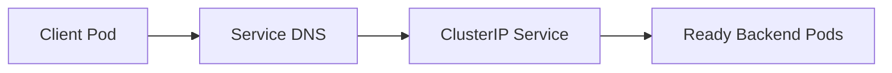
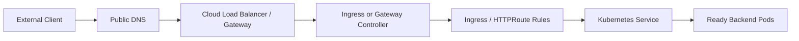
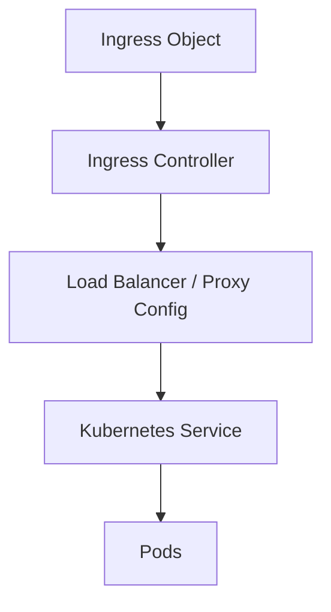
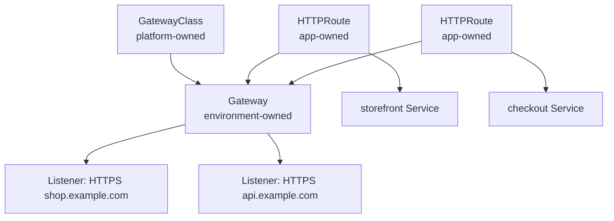
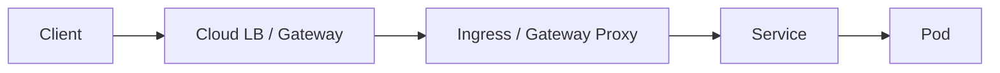
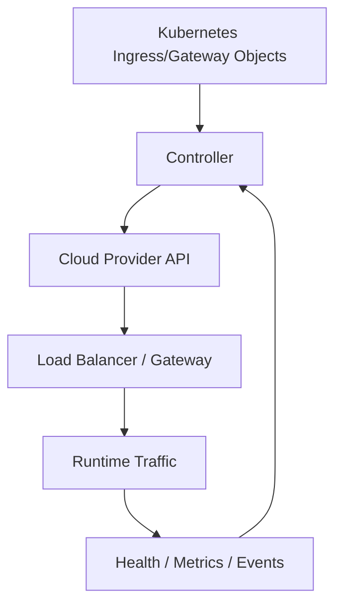
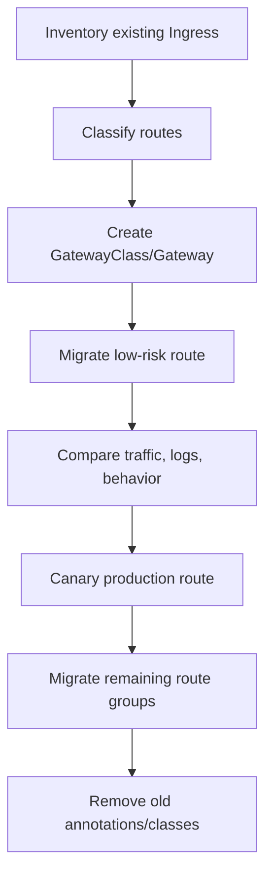
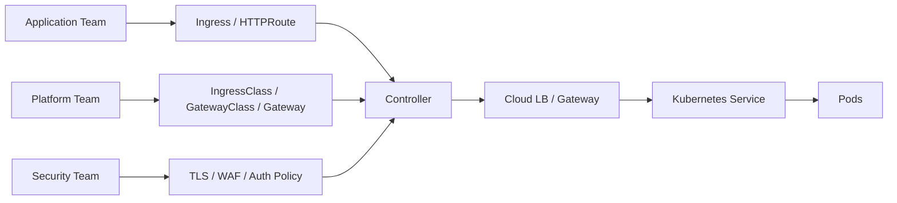

# Part 010 — Ingress, Gateway API, and Edge Routing

A `Service` gives a workload stable network identity. It does not automatically define a safe public HTTP edge.

For HTTP/HTTPS traffic, production Kubernetes usually needs a dedicated routing layer that answers questions like:

- Which hostname maps to which service?
- Where is TLS terminated?
- Who owns certificates?
- How are paths routed?
- How are redirects, headers, retries, timeouts, and WAF policies handled?
- Which team owns the load balancer or gateway infrastructure?
- How do we prevent one app from breaking another app at the shared edge?

This is where `Ingress`, `IngressClass`, and Gateway API enter.

The mental model:

> Edge routing is not just “make my app public”. It is a shared production control plane for external traffic.

---

## 1. From Service to Edge

Internal traffic path:



External HTTP traffic path:



Production edge routing combines Kubernetes objects and cloud infrastructure.

The Kubernetes object alone is not the whole system.

---

## 2. L4 vs L7 Decision

Before creating an Ingress or Gateway, decide what kind of traffic you are exposing.

| Need | Primitive |
|---|---|
| TCP pass-through | `Service type=LoadBalancer`, NLB/Azure LB, or Gateway TCPRoute if supported |
| UDP pass-through | `Service type=LoadBalancer` or Gateway UDPRoute if supported |
| HTTP host routing | Ingress or Gateway API `HTTPRoute` |
| HTTP path routing | Ingress or Gateway API `HTTPRoute` |
| TLS termination | Ingress/Gateway/cloud L7 LB |
| gRPC routing | Gateway API or controller-specific Ingress support |
| WAF integration | Cloud L7 service such as AWS ALB/WAF or Azure Application Gateway/WAF |
| Shared multi-team edge | Gateway API is usually cleaner than annotation-heavy Ingress |

Do not use Ingress for non-HTTP traffic unless the chosen controller explicitly supports it through custom extensions. The portable Ingress API is HTTP-oriented.

---

## 3. Ingress Mental Model

An Ingress is a Kubernetes API object that defines HTTP routing from external traffic to Services.

A minimal Ingress:

```yaml
apiVersion: networking.k8s.io/v1
kind: Ingress
metadata:
  name: storefront
  namespace: commerce
spec:
  ingressClassName: nginx
  rules:
    - host: shop.example.com
      http:
        paths:
          - path: /
            pathType: Prefix
            backend:
              service:
                name: storefront-web
                port:
                  name: http
```

This object does not do anything by itself.

You need an Ingress controller.



The controller watches Kubernetes resources and programs the actual dataplane.

Examples:

- NGINX Ingress Controller;
- AWS Load Balancer Controller;
- Azure Application Gateway Ingress Controller;
- Traefik;
- HAProxy;
- Envoy-based controllers;
- cloud-native managed controllers.

The object is portable only to a point. The behavior is controller-specific.

---

## 4. IngressClass

`IngressClass` tells Kubernetes which controller should handle an Ingress.

```yaml
apiVersion: networking.k8s.io/v1
kind: IngressClass
metadata:
  name: public-alb
spec:
  controller: ingress.k8s.aws/alb
```

Ingress uses it:

```yaml
spec:
  ingressClassName: public-alb
```

Why this matters:

- multiple controllers can exist in one cluster;
- public and private edges can be separated;
- teams can choose approved classes rather than arbitrary annotations;
- platform teams can encode different operational profiles.

Example classes:

```text
public-alb
private-alb
public-appgw
private-appgw
internal-nginx
mesh-gateway
```

Production invariant:

> Every Ingress must declare an explicit `ingressClassName`.

Avoid relying on default classes in large clusters.

---

## 5. Ingress Ownership Problem

Ingress is simple, but it compresses too many concerns into one object:

```text
host ownership
path ownership
TLS
load balancer behavior
WAF
timeouts
retries
headers
redirects
backend protocol
health checks
cloud-specific annotations
```

This creates a scaling problem in large organizations.

Application teams want to define routes. Platform teams want to own shared edge infrastructure. Security teams want to own TLS, WAF, and policy. Network teams want to control public/private exposure.

With Ingress, these concerns often become annotations.

Example:

```yaml
metadata:
  annotations:
    alb.ingress.kubernetes.io/scheme: internet-facing
    alb.ingress.kubernetes.io/target-type: ip
    alb.ingress.kubernetes.io/certificate-arn: arn:aws:acm:...
    alb.ingress.kubernetes.io/healthcheck-path: /health
```

Annotations are powerful but weakly typed. They are easy to copy, easy to drift, and hard to govern.

This is one reason Gateway API exists.

---

## 6. Gateway API Mental Model

Gateway API splits edge routing into role-oriented resources.

Core objects:

| Object | Owner | Purpose |
|---|---|---|
| `GatewayClass` | Platform / infrastructure | Defines a type of gateway and its controller |
| `Gateway` | Platform / environment owner | Represents an actual gateway/listener boundary |
| `HTTPRoute` | Application team | Defines HTTP routing rules to backend Services |
| `ReferenceGrant` | Namespace owner | Allows cross-namespace references safely |



Gateway API creates cleaner ownership boundaries.

The platform team can publish a Gateway. Application teams attach routes to it under policy.

---

## 7. GatewayClass

A `GatewayClass` defines a class of Gateway managed by a specific controller.

```yaml
apiVersion: gateway.networking.k8s.io/v1
kind: GatewayClass
metadata:
  name: public-edge
spec:
  controllerName: example.com/gateway-controller
```

You can think of it like a storage class or ingress class for edge infrastructure.

Production examples:

```text
aws-public-alb
aws-private-alb
azure-public-appgw
azure-private-appgw
internal-envoy
mesh-egress
```

The controller name and parameters are implementation-specific.

---

## 8. Gateway

A `Gateway` represents listeners.

```yaml
apiVersion: gateway.networking.k8s.io/v1
kind: Gateway
metadata:
  name: public-edge
  namespace: platform-edge
spec:
  gatewayClassName: public-edge
  listeners:
    - name: https
      protocol: HTTPS
      port: 443
      hostname: "*.example.com"
      tls:
        mode: Terminate
        certificateRefs:
          - kind: Secret
            name: wildcard-example-com
      allowedRoutes:
        namespaces:
          from: Selector
          selector:
            matchLabels:
              edge-access: public
```

This says:

- there is a public HTTPS listener;
- TLS terminates at the Gateway;
- only namespaces with `edge-access=public` can attach routes.

That is much stronger than “everyone can create Ingress with copied annotations”.

---

## 9. HTTPRoute

Application teams define routing with `HTTPRoute`.

```yaml
apiVersion: gateway.networking.k8s.io/v1
kind: HTTPRoute
metadata:
  name: storefront-route
  namespace: commerce
spec:
  parentRefs:
    - name: public-edge
      namespace: platform-edge
  hostnames:
    - shop.example.com
  rules:
    - matches:
        - path:
            type: PathPrefix
            value: /
      backendRefs:
        - name: storefront-web
          port: 80
```

This separates application intent from gateway infrastructure.

The app team does not need to know:

- load balancer subnet placement;
- WAF attachment;
- listener implementation;
- public IP management;
- certificate provisioning mechanism;
- security group/NSG rules;
- dataplane lifecycle.

They define routing intent under platform policy.

---

## 10. Weighted Traffic Splitting

Gateway API supports traffic splitting through weighted backend references where implemented.

```yaml
apiVersion: gateway.networking.k8s.io/v1
kind: HTTPRoute
metadata:
  name: checkout-canary
  namespace: commerce
spec:
  parentRefs:
    - name: public-edge
      namespace: platform-edge
  hostnames:
    - api.example.com
  rules:
    - matches:
        - path:
            type: PathPrefix
            value: /checkout
      backendRefs:
        - name: checkout-v1
          port: 80
          weight: 90
        - name: checkout-v2
          port: 80
          weight: 10
```

This gives an edge-level primitive for canary traffic. However, do not confuse it with a complete progressive delivery system.

You still need:

- automated analysis;
- rollback criteria;
- metrics comparison;
- error budget awareness;
- version compatibility;
- database compatibility;
- idempotency and replay safety.

---

## 11. Header-Based Routing

Header routing is useful for internal testing, tenant routing, version routing, and controlled migration.

```yaml
apiVersion: gateway.networking.k8s.io/v1
kind: HTTPRoute
metadata:
  name: order-api-route
  namespace: commerce
spec:
  parentRefs:
    - name: public-edge
      namespace: platform-edge
  hostnames:
    - api.example.com
  rules:
    - matches:
        - path:
            type: PathPrefix
            value: /orders
          headers:
            - name: X-Api-Version
              value: v2
      backendRefs:
        - name: order-api-v2
          port: 80
    - matches:
        - path:
            type: PathPrefix
            value: /orders
      backendRefs:
        - name: order-api-v1
          port: 80
```

Production warning:

> Header routing changes API behavior at the edge. It must be visible in logs, traces, and customer support tooling.

Otherwise, incidents become impossible to reason about.

---

## 12. Cross-Namespace Routing and ReferenceGrant

Gateway API is explicit about cross-namespace references.

If a route in one namespace references an object in another namespace, a `ReferenceGrant` may be required depending on the reference type and controller behavior.

Example:

```yaml
apiVersion: gateway.networking.k8s.io/v1
kind: ReferenceGrant
metadata:
  name: allow-commerce-routes
  namespace: platform-edge
spec:
  from:
    - group: gateway.networking.k8s.io
      kind: HTTPRoute
      namespace: commerce
  to:
    - group: ""
      kind: Secret
```

The point is not the exact YAML. The point is the ownership model:

> The namespace owner must consent to being referenced.

This prevents accidental or malicious cross-namespace attachment.

---

## 13. TLS Termination Models

TLS can terminate at different places.



Common models:

| Model | TLS termination | Pros | Risks |
|---|---|---|---|
| Edge termination | Cloud LB/Gateway | Simple app config, WAF integration | plaintext inside cluster unless re-encrypted |
| In-cluster termination | Ingress/Gateway proxy | Kubernetes-native cert handling | cert/private key in cluster |
| End-to-end TLS | Edge and backend TLS | stronger transport boundary | cert complexity, health checks harder |
| mTLS service mesh | sidecars/proxies | workload identity and encryption | operational complexity |

For regulated systems, define the boundary explicitly:

- external client to edge;
- edge to cluster;
- cluster to pod;
- pod to dependency.

Do not say “we use HTTPS” without specifying where TLS terminates.

---

## 14. Certificate Ownership

Certificates are not just secrets. They are lifecycle-managed identity assets.

Production questions:

- Who owns domain validation?
- Who renews certificates?
- Where are private keys stored?
- Is wildcard allowed?
- Which namespaces can use which certificates?
- Is certificate rotation tested?
- Do we need per-tenant or per-service certificates?
- Are failed renewals alerted before expiry?

Possible models:

| Model | Example |
|---|---|
| Cloud-managed cert | AWS ACM, Azure managed cert integrations |
| Kubernetes-managed cert | cert-manager + Kubernetes Secret |
| External secret sync | AWS Secrets Manager / Azure Key Vault synced or mounted |
| Platform-owned wildcard | shared edge cert controlled by platform team |
| App-owned cert | application team owns host/cert lifecycle |

A top-tier platform makes this boring. Developers should not manually paste certificates into YAML.

---

## 15. AWS EKS Edge Routing Options

Common EKS options:

| Option | Typical use |
|---|---|
| AWS Load Balancer Controller + Ingress | Provision ALB for HTTP/HTTPS L7 traffic |
| AWS Load Balancer Controller + Service | Provision NLB for L4 traffic |
| AWS Load Balancer Controller + Gateway resources | Gateway API-based ALB/NLB integration where supported by controller version |
| NGINX/Envoy/Traefik inside cluster behind NLB | More portable proxy behavior, more in-cluster ownership |
| API Gateway / CloudFront in front | Global edge, auth, caching, API management, WAF patterns |

Example ALB Ingress:

```yaml
apiVersion: networking.k8s.io/v1
kind: Ingress
metadata:
  name: storefront
  namespace: commerce
  annotations:
    alb.ingress.kubernetes.io/scheme: internet-facing
    alb.ingress.kubernetes.io/target-type: ip
    alb.ingress.kubernetes.io/healthcheck-path: /ready
spec:
  ingressClassName: alb
  rules:
    - host: shop.example.com
      http:
        paths:
          - path: /
            pathType: Prefix
            backend:
              service:
                name: storefront-web
                port:
                  number: 80
```

Production concerns:

- subnet discovery and tagging;
- security groups;
- public vs internal scheme;
- target type `instance` vs `ip`;
- Fargate compatibility;
- ALB sharing model;
- WAF association;
- certificate ARN ownership;
- controller IAM permissions;
- listener rule limits;
- deletion protection and cleanup behavior.

The AWS Load Balancer Controller is not “just an Ingress controller”. It manages AWS infrastructure in response to Kubernetes resources. Treat its IAM policy and controller version as production-critical.

---

## 16. Azure AKS Edge Routing Options

Common AKS options:

| Option | Typical use |
|---|---|
| Azure Application Gateway Ingress Controller | Use Azure Application Gateway as L7 ingress for AKS |
| Application Gateway for Containers | Managed L7 ingress service for Kubernetes workloads with Ingress/Gateway API support |
| NGINX/Envoy/Traefik inside cluster behind Azure Load Balancer | Portable in-cluster proxy pattern |
| Azure Front Door in front | Global edge, WAF, caching, global routing |
| API Management in front | API governance, developer portal, subscription keys, policy |

Example AGIC-style Ingress shape:

```yaml
apiVersion: networking.k8s.io/v1
kind: Ingress
metadata:
  name: storefront
  namespace: commerce
  annotations:
    appgw.ingress.kubernetes.io/backend-path-prefix: "/"
spec:
  ingressClassName: azure-application-gateway
  rules:
    - host: shop.example.com
      http:
        paths:
          - path: /
            pathType: Prefix
            backend:
              service:
                name: storefront-web
                port:
                  number: 80
```

Production concerns:

- Application Gateway ownership;
- AGIC add-on vs Helm deployment;
- WAF_v2 / Standard_v2 SKU expectations;
- subnet delegation and network design;
- managed identity permissions;
- backend health probe mapping;
- private vs public frontend;
- compatibility with Azure CNI mode;
- migration to Application Gateway for Containers where appropriate.

Azure Application Gateway for Containers is especially relevant for modern AKS designs because it provides Kubernetes-native configuration using Ingress and Gateway API resources while Azure operates the L7 dataplane outside the cluster.

---

## 17. Controller Ownership Model

An edge controller is a reconciler.



This creates several ownership layers:

| Layer | Owner |
|---|---|
| Application route | Application team |
| Namespace access | Platform/security |
| Gateway/listener | Platform/networking |
| Controller deployment | Platform team |
| IAM/managed identity | Platform/security |
| Cloud load balancer | Platform/networking |
| DNS | Platform/networking or domain team |
| Certificates | Platform/security or app team by policy |
| WAF policy | Security/platform |

A mature platform does not let every application team invent this stack independently.

---

## 18. Public and Private Edge Separation

Never mix public and private exposure casually.

Good pattern:

```text
GatewayClass: aws-public-alb
GatewayClass: aws-private-alb
GatewayClass: azure-public-appgw
GatewayClass: azure-private-appgw
```

Or with IngressClass:

```text
public-alb
private-alb
public-appgw
private-appgw
```

Namespace policy:

```yaml
metadata:
  labels:
    edge-access: public
```

Only approved namespaces can attach to public gateways.

Production invariant:

> Public exposure must be opt-in, reviewable, and policy-enforced.

A YAML diff should make exposure changes obvious.

---

## 19. Path Routing Pitfalls

Path routing looks easy:

```text
/api/orders -> order-api
/api/users  -> user-api
/           -> frontend
```

But production failures hide in details:

- trailing slash behavior;
- path rewrite behavior;
- case sensitivity;
- encoded path handling;
- route priority;
- overlapping prefixes;
- app framework base path mismatch;
- redirects generating wrong absolute URLs;
- backend assuming it is mounted at `/`;
- OpenAPI docs served from wrong base path;
- cookie path and SameSite behavior.

Safer rule:

> Prefer host-based routing for major bounded contexts. Use path routing for well-governed API groups, not arbitrary application composition.

Example:

```text
orders.api.example.com
users.api.example.com
admin.example.com
```

instead of:

```text
api.example.com/orders
api.example.com/users
example.com/admin
```

Path routing is valid, but it should be designed, not improvised.

---

## 20. Hostname Ownership

A hostname is a production asset.

Checklist before assigning a host:

- [ ] Who owns the domain?
- [ ] Is it public or private DNS?
- [ ] Which environment is it for?
- [ ] Is TLS certificate available?
- [ ] Is the host shared by multiple teams?
- [ ] Is WAF required?
- [ ] Is authentication enforced at edge, app, or both?
- [ ] Is logging enabled with host and route labels?
- [ ] Is there a decommission process?

Avoid letting teams create arbitrary hosts without governance.

Recommended naming:

```text
<capability>.<env>.example.com
<bounded-context>.api.<env>.example.com
<tenant>.<product>.example.com
```

Examples:

```text
checkout.api.prod.example.com
risk.api.staging.example.com
admin.prod.example.com
```

---

## 21. Health Checks at the Edge

Edge health checks are not always the same as Kubernetes readiness probes.

Path:

```text
Cloud LB / Gateway -> Service / Node / Pod -> /health or /ready
```

Design edge health checks carefully.

Use cases:

| Endpoint | Meaning |
|---|---|
| `/live` | process should be restarted if false |
| `/ready` | pod can serve traffic now |
| `/health` | often ambiguous, avoid unless defined |
| `/startup` | app boot complete |
| `/edge-ready` | edge-specific readiness if needed |

Problems:

- cloud LB checks wrong port;
- health check bypasses host header requirement;
- backend redirects health check to HTTPS/login;
- auth middleware blocks health check;
- app returns 200 despite dependency failure;
- app returns 500 for non-critical dependency and removes all capacity;
- edge and Kubernetes disagree about readiness.

Production invariant:

> Edge health checks and Kubernetes readiness must be intentionally compatible.

---

## 22. Timeouts, Retries, and Backpressure

Ingress/Gateway defaults are often not enough.

You must define:

- connection timeout;
- request timeout;
- idle timeout;
- upstream timeout;
- retry policy;
- max request body size;
- keep-alive behavior;
- HTTP/2 behavior;
- gRPC timeout behavior;
- circuit breaking or overload protection if available.

Bad pattern:

```text
client timeout: 60s
edge timeout: 30s
service timeout: 45s
DB timeout: 55s
```

This creates wasted work and retry storms.

Better hierarchy:

```text
client timeout > edge timeout > service dependency timeout > database/query timeout
```

Example:

```text
client: 5s
edge: 4s
service-to-service: 800ms
database query: 300ms
```

Exact numbers depend on workload, but the ordering matters.

---

## 23. Edge Observability

At the edge, every request should be explainable.

Minimum dimensions:

- hostname;
- path template or route name;
- method;
- status code;
- backend service;
- backend namespace;
- latency;
- upstream latency;
- retry count;
- TLS protocol/cipher if relevant;
- WAF decision if relevant;
- client IP / forwarded headers policy;
- trace ID;
- request ID;
- deployment version if available.

Log example shape:

```json
{
  "host": "api.example.com",
  "route": "checkout-route",
  "namespace": "commerce",
  "backend_service": "checkout-api",
  "method": "POST",
  "path": "/checkout/orders",
  "status": 201,
  "duration_ms": 87,
  "upstream_duration_ms": 63,
  "trace_id": "4b8f..."
}
```

Without route-level observability, edge incidents become guesswork.

---

## 24. Security Boundaries

Edge routing is a security boundary.

Controls to define:

| Control | Questions |
|---|---|
| Public exposure | Which namespaces can attach public routes? |
| TLS | Where does it terminate? What versions/ciphers? |
| WAF | Which routes need WAF? Who owns rules? |
| Auth | Edge auth, app auth, or both? |
| Headers | Which forwarded headers are trusted? |
| Client IP | How is original IP preserved and validated? |
| Request size | What is max body size? |
| Rate limit | Is rate limiting at edge, app, or API gateway? |
| mTLS | Is backend TLS or mTLS required? |
| Secrets | Who can reference certificate secrets? |

Never trust `X-Forwarded-For` unless the trusted proxy boundary is explicit.

---

## 25. Ingress vs Gateway API Decision Matrix

| Situation | Prefer |
|---|---|
| Simple cluster, one controller, few apps | Ingress may be enough |
| Existing stable Ingress platform | Ingress, with governance |
| Multi-team platform | Gateway API |
| Need clear infra/app ownership split | Gateway API |
| Need advanced routing model | Gateway API |
| Need cloud-native managed L7 integration | Depends on cloud controller support |
| Heavy legacy annotations | Plan migration to Gateway API carefully |
| Service mesh ingress gateway | Gateway API may align well depending on mesh |

Gateway API is not automatically better if the implementation is immature in your chosen controller. The production decision is:

> Choose the API your organization can operate safely, not the API that looks newest.

---

## 26. Migration from Ingress to Gateway API

Migration should be incremental.



Checklist:

- [ ] Inventory Ingress objects and annotations.
- [ ] Group by controller/class.
- [ ] Identify public/private exposure.
- [ ] Identify TLS certificate model.
- [ ] Identify WAF/auth/rate-limit behavior.
- [ ] Map annotation behavior to Gateway API or implementation extensions.
- [ ] Build conformance tests for routing behavior.
- [ ] Run side-by-side for low-risk host.
- [ ] Compare logs, headers, redirects, status codes.
- [ ] Prepare rollback DNS or listener strategy.

Do not migrate by translating YAML mechanically. Migrate behavior.

---

## 27. Failure Mode Catalog

| Failure | Symptom | Likely root cause |
|---|---|---|
| Route not attached | Gateway exists but route ignored | `allowedRoutes`, namespace label, parentRef mismatch |
| Host works, path fails | 404/503 for subset | path matching, rewrite, route priority |
| TLS error | browser/curl certificate failure | wrong cert, missing secret, host mismatch, expired cert |
| LB provision fails | no public address | IAM/managed identity, subnet, quota, controller error |
| Backend unhealthy | 502/503 | health check mismatch, wrong port, readiness false |
| One app breaks another | shared listener/rule conflict | weak route ownership and governance |
| Source IP wrong | audit/logging inaccurate | proxy chain or traffic policy issue |
| Infinite redirect | HTTP/HTTPS or base path mismatch | edge/app redirect conflict |
| Works in staging, not prod | environment-specific cloud config | subnet, WAF, DNS, cert, quota, policy drift |
| Controller reconciliation loop failing | config not applied | controller crash, permission denied, invalid resource |

First debugging command set:

```bash
kubectl get ingress -A
kubectl get ingressclass
kubectl describe ingress -n <namespace> <name>
kubectl get gatewayclass
kubectl get gateway -A
kubectl get httproute -A
kubectl describe httproute -n <namespace> <name>
kubectl get events -A --sort-by=.lastTimestamp
```

Then inspect controller logs:

```bash
kubectl -n <controller-namespace> logs deploy/<controller-deployment>
```

And cloud-side resources:

- listeners;
- rules;
- target groups/backend pools;
- health checks;
- public/private IP;
- security groups / NSGs;
- WAF policy;
- certificates;
- DNS records.

---

## 28. Production Gateway Design Example

Target:

- platform team owns public gateway;
- only selected namespaces can attach;
- apps own routes;
- TLS terminates at gateway;
- route observability is required;
- public exposure is explicit.

Namespace:

```yaml
apiVersion: v1
kind: Namespace
metadata:
  name: commerce
  labels:
    edge-access: public
    owner: commerce-platform
```

Gateway:

```yaml
apiVersion: gateway.networking.k8s.io/v1
kind: Gateway
metadata:
  name: public-edge
  namespace: platform-edge
spec:
  gatewayClassName: public-edge
  listeners:
    - name: https
      hostname: "*.prod.example.com"
      port: 443
      protocol: HTTPS
      tls:
        mode: Terminate
        certificateRefs:
          - kind: Secret
            name: wildcard-prod-example-com
      allowedRoutes:
        namespaces:
          from: Selector
          selector:
            matchLabels:
              edge-access: public
```

Route:

```yaml
apiVersion: gateway.networking.k8s.io/v1
kind: HTTPRoute
metadata:
  name: checkout-route
  namespace: commerce
  labels:
    app.kubernetes.io/name: checkout-api
    route-tier: public
spec:
  parentRefs:
    - name: public-edge
      namespace: platform-edge
  hostnames:
    - checkout.prod.example.com
  rules:
    - matches:
        - path:
            type: PathPrefix
            value: /
      backendRefs:
        - name: checkout-api
          port: 80
```

This design is reviewable. A reviewer can see public exposure, hostname, namespace, and backend service.

---

## 29. Edge Design for Regulated Systems

For enforcement, finance, healthcare, government, or regulated systems, edge design must support auditability and defensibility.

Minimum expectations:

- every public route has a named owner;
- every public route has a business justification;
- route changes are reviewed;
- TLS policy is documented;
- WAF/auth/rate-limiting decisions are documented;
- logs include route, user/client identity where appropriate, request ID, and decision outcome;
- sensitive admin surfaces are private by default;
- emergency route disablement exists;
- certificate expiry is monitored;
- DNS ownership is controlled;
- edge changes are traceable to commits and approvals.

A production platform should be able to answer:

> “Who exposed this endpoint, when, why, and under which controls?”

If not, the edge is not governed.

---

## 30. Internal Developer Platform Pattern

Do not ask every application team to hand-write edge YAML from scratch.

Offer a platform abstraction:

```yaml
apiVersion: platform.example.com/v1alpha1
kind: PublicHttpEndpoint
metadata:
  name: checkout
  namespace: commerce
spec:
  hostname: checkout.prod.example.com
  service:
    name: checkout-api
    port: http
  tls:
    policy: platform-managed
  waf:
    profile: standard-public-api
  observability:
    accessLogs: required
```

The platform controller or GitOps generator can produce Gateway API/Ingress resources.

This gives:

- safe defaults;
- fewer annotations;
- consistent observability;
- policy enforcement;
- easier migration between AWS and Azure implementations;
- application-level ergonomics without losing platform control.

This is not necessary on day one. It becomes valuable when route count, team count, and compliance pressure grow.

---

## 31. Practice Lab: Ingress Behavior

Create a namespace:

```bash
kubectl create namespace edge-lab
```

Deploy two services:

```yaml
apiVersion: apps/v1
kind: Deployment
metadata:
  name: app-v1
  namespace: edge-lab
spec:
  replicas: 2
  selector:
    matchLabels:
      app: app-v1
  template:
    metadata:
      labels:
        app: app-v1
    spec:
      containers:
        - name: app
          image: hashicorp/http-echo:1.0
          args:
            - "-text=hello-v1"
            - "-listen=:8080"
          ports:
            - name: http
              containerPort: 8080
---
apiVersion: v1
kind: Service
metadata:
  name: app-v1
  namespace: edge-lab
spec:
  selector:
    app: app-v1
  ports:
    - name: http
      port: 80
      targetPort: http
```

Duplicate for `app-v2`, then create path routing using your cluster's installed Ingress controller.

Observe:

```bash
kubectl describe ingress -n edge-lab
kubectl get events -n edge-lab --sort-by=.lastTimestamp
curl -H 'Host: lab.example.local' http://<ingress-address>/v1
curl -H 'Host: lab.example.local' http://<ingress-address>/v2
```

Break one backend service name and observe the difference between:

- route object accepted;
- backend unavailable;
- edge response code;
- controller event;
- Service endpoint state.

---

## 32. Practice Lab: Gateway API Shape

If your cluster has a Gateway API implementation, test a minimal `Gateway` and `HTTPRoute`.

Gateway:

```yaml
apiVersion: gateway.networking.k8s.io/v1
kind: Gateway
metadata:
  name: lab-gateway
  namespace: edge-lab
spec:
  gatewayClassName: <your-gateway-class>
  listeners:
    - name: http
      protocol: HTTP
      port: 80
      allowedRoutes:
        namespaces:
          from: Same
```

HTTPRoute:

```yaml
apiVersion: gateway.networking.k8s.io/v1
kind: HTTPRoute
metadata:
  name: app-route
  namespace: edge-lab
spec:
  parentRefs:
    - name: lab-gateway
  hostnames:
    - lab.example.local
  rules:
    - matches:
        - path:
            type: PathPrefix
            value: /v1
      backendRefs:
        - name: app-v1
          port: 80
```

Inspect status conditions:

```bash
kubectl describe gateway -n edge-lab lab-gateway
kubectl describe httproute -n edge-lab app-route
```

Gateway API status conditions are important. They tell you whether the route is accepted, programmed, and attached.

---

## 33. Edge Review Checklist

Before exposing a workload:

- [ ] Is this route public or private?
- [ ] Is the namespace allowed to attach to that edge?
- [ ] Is hostname ownership clear?
- [ ] Is TLS termination location clear?
- [ ] Is certificate ownership clear?
- [ ] Is WAF/auth/rate-limit policy defined?
- [ ] Is the backend Service internal-only?
- [ ] Are edge health checks compatible with readiness?
- [ ] Are timeouts and request body limits defined?
- [ ] Are access logs enabled?
- [ ] Are metrics labeled by route/backend?
- [ ] Are source IP and forwarded headers handled safely?
- [ ] Is rollback possible without changing application code?
- [ ] Is DNS cutover planned?
- [ ] Is this using approved IngressClass/GatewayClass?
- [ ] Are cloud permissions least-privilege?

---

## 34. Mental Model Summary

Ingress/Gateway objects are not the edge. They are desired state for the edge.



The production question is:

> Who owns each layer, and how do we prove that the runtime edge matches the declared intent?

That question is more important than memorizing any one controller's annotations.

---

## 35. References

- Kubernetes Documentation — Ingress: https://kubernetes.io/docs/concepts/services-networking/ingress/
- Kubernetes Documentation — Gateway API: https://kubernetes.io/docs/concepts/services-networking/gateway/
- Gateway API Project Documentation: https://gateway-api.sigs.k8s.io/
- Gateway API Implementations: https://gateway-api.sigs.k8s.io/docs/implementations/list/
- AWS EKS Documentation — AWS Load Balancer Controller: https://docs.aws.amazon.com/eks/latest/userguide/aws-load-balancer-controller.html
- AWS EKS Documentation — Application Load Balancing on EKS: https://docs.aws.amazon.com/eks/latest/userguide/alb-ingress.html
- Azure Documentation — Application Gateway Ingress Controller: https://learn.microsoft.com/en-us/azure/application-gateway/ingress-controller-overview
- Azure Documentation — Application Gateway for Containers: https://learn.microsoft.com/en-us/azure/application-gateway/for-containers/overview
