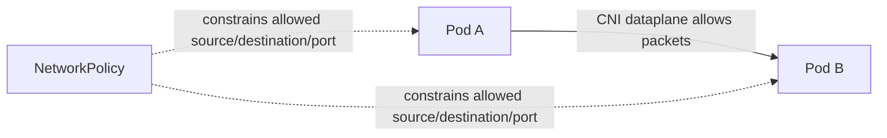
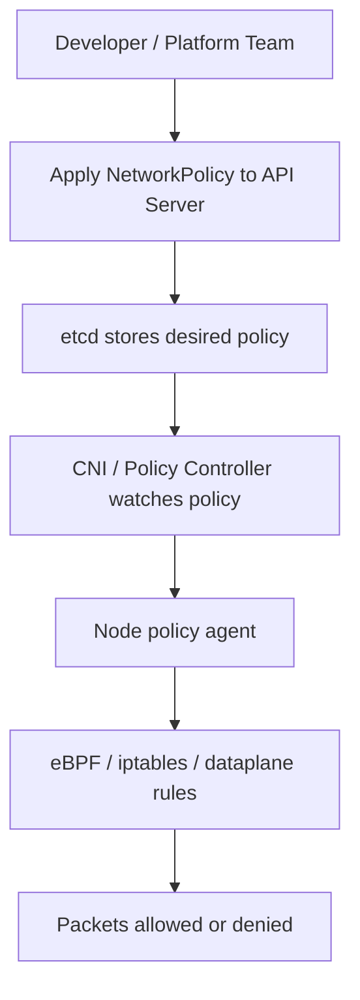
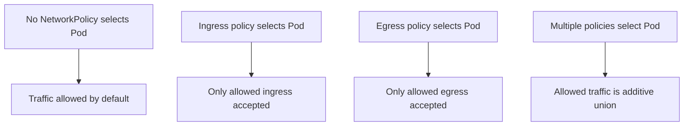
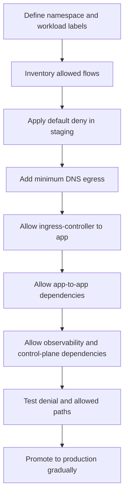
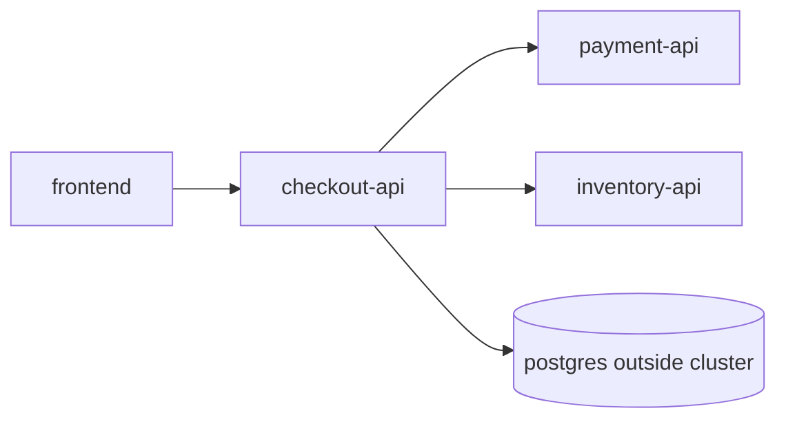
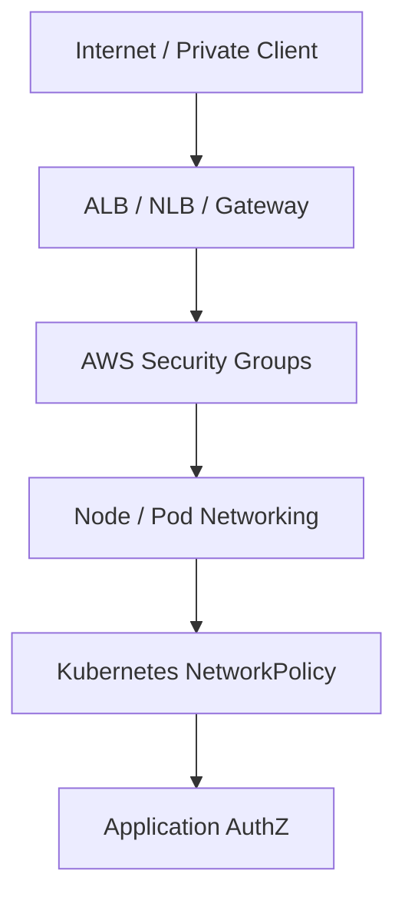
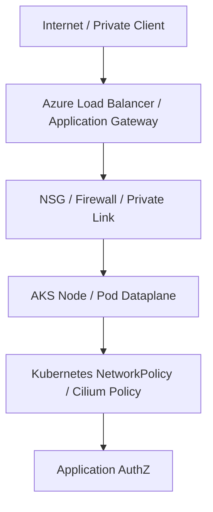
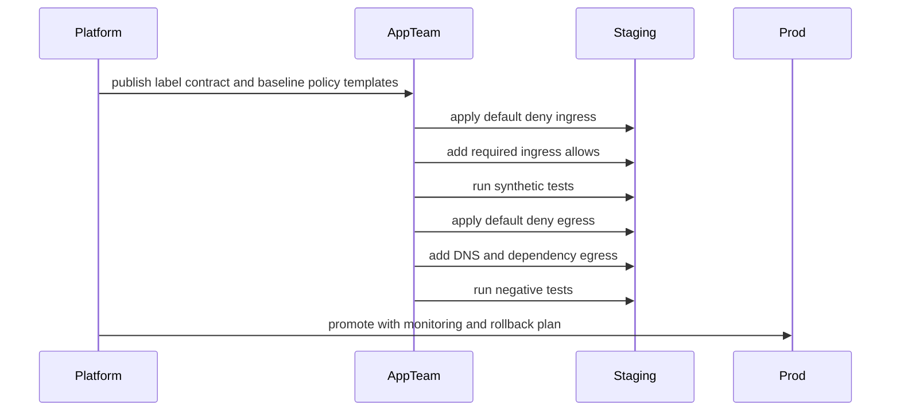

# Part 011 — Network Policy and Zero-Trust Traffic

A Kubernetes `Service` makes communication easy.

A Kubernetes `NetworkPolicy` makes communication intentional.

That difference matters in production. Without a network policy layer, every compromised Pod can usually attempt lateral movement to many other Pods in the same cluster. Namespaces help humans organize workloads, but namespaces alone are not a network firewall. Labels help route traffic, but labels alone do not restrict traffic.

The operational goal of this part:

> Move from “Pods can talk unless something blocks them” to “Pods can talk only when an explicit contract allows it.”

This part focuses on Kubernetes-native `NetworkPolicy` and the cloud-specific realities of AWS EKS and Azure AKS. It does not cover service mesh authorization in depth. Mesh policy, mTLS, and L7 authorization belong later when we discuss platform security and traffic governance. Here we build the L3/L4 foundation.

---

## 1. The Mental Model

A `NetworkPolicy` is not a route.

It does not create connectivity. It constrains connectivity that already exists.



The Kubernetes API stores the intent.

The CNI/network policy implementation enforces the intent.



The most important invariant:

> A `NetworkPolicy` only works if the cluster networking implementation supports it.

Kubernetes accepts the object even if the dataplane ignores it. That is one of the most dangerous footguns in production: YAML exists, but enforcement does not.

---

## 2. What NetworkPolicy Actually Controls

Standard Kubernetes `NetworkPolicy` controls traffic at layer 3 and layer 4:

- source/destination Pod labels;
- source/destination namespace labels;
- IP CIDR blocks;
- TCP, UDP, or SCTP ports;
- ingress direction;
- egress direction.

It does **not** understand normal HTTP application semantics:

- URL path;
- HTTP method;
- JWT claims;
- tenant ID;
- request body;
- application role;
- business permission.

That means this is valid thinking:

> “Only the `frontend` Pod may call the `checkout` Pod on TCP 8080.”

This is not standard `NetworkPolicy` thinking:

> “Only users with role `admin` may call `POST /approve`.”

For that you need application authorization, API gateway policy, service mesh policy, or a combination.

---

## 3. Default Behavior: Allow Until Isolated

A fresh namespace with no policies is usually open inside the cluster.

The subtle part: policies are selective.

A Pod becomes isolated for ingress when at least one ingress `NetworkPolicy` selects it. A Pod becomes isolated for egress when at least one egress `NetworkPolicy` selects it.



The additive union rule is critical.

If one policy allows `frontend -> api:8080`, and another policy allows `metrics -> api:9090`, both are allowed. Policies do not override each other like firewall rules with ordered priority. Standard `NetworkPolicy` has no explicit deny rule. It is allowlist-based once isolation applies.

This design is simple but requires discipline.

---

## 4. The Production Problem

Most teams implement Kubernetes networking backward.

They start with a working app, then try to “add policies” after traffic is already complex.

That creates three problems:

1. Nobody knows the real dependency graph.
2. DNS, metrics, ingress controller, webhooks, and cloud integrations break unexpectedly.
3. Engineers add broad allow rules to recover service quickly.

The result is theater: a few YAML files exist, but lateral movement is still wide open.

The correct production sequence is different:



Network policy is not a one-time manifest. It is a living traffic contract.

---

## 5. Label Design Is the Real Firewall Design

`NetworkPolicy` depends heavily on labels. Bad labels produce bad policy.

Do not build policies around accidental labels such as:

```yaml
app: service
version: v1
pod-template-hash: 68f9dd7c6f
```

`pod-template-hash` changes. `version` changes. `app: service` may not mean anything across teams.

Use stable identity labels.

A good minimal contract:

```yaml
app.kubernetes.io/name: checkout
app.kubernetes.io/component: api
app.kubernetes.io/part-of: commerce
platform.company.io/tier: backend
platform.company.io/exposure: internal
```

For namespaces:

```yaml
platform.company.io/environment: prod
platform.company.io/domain: commerce
platform.company.io/tenant: shared
```

The invariant:

> If labels are unstable, security rules are unstable.

Before writing network policies, standardize workload and namespace labels.

---

## 6. Anatomy of a NetworkPolicy

A typical policy has four questions:

1. Which Pods does this policy select?
2. Which direction does it constrain?
3. Which peers are allowed?
4. Which ports/protocols are allowed?

Example: allow only `frontend` Pods in the same namespace to call `checkout-api` on port `8080`.

```yaml
apiVersion: networking.k8s.io/v1
kind: NetworkPolicy
metadata:
  name: allow-frontend-to-checkout-api
  namespace: commerce
spec:
  podSelector:
    matchLabels:
      app.kubernetes.io/name: checkout
      app.kubernetes.io/component: api
  policyTypes:
    - Ingress
  ingress:
    - from:
        - podSelector:
            matchLabels:
              app.kubernetes.io/name: frontend
      ports:
        - protocol: TCP
          port: 8080
```

Read it precisely:

- It applies to Pods in namespace `commerce` matching `checkout/api`.
- It isolates ingress for those Pods.
- It allows ingress only from Pods in the same namespace matching `frontend`.
- It only allows TCP port `8080`.

It does not allow:

- traffic from another namespace;
- traffic to a different port;
- traffic from non-matching Pods;
- egress from checkout to other systems.

---

## 7. Namespace Selector vs Pod Selector

This is where many bugs appear.

A `podSelector` without `namespaceSelector` selects Pods in the **same namespace as the policy**.

A `namespaceSelector` selects namespaces.

A combined `namespaceSelector` + `podSelector` means Pods matching the pod selector inside namespaces matching the namespace selector.

Example: allow ingress from `ingress-nginx` namespace to app Pods.

```yaml
apiVersion: networking.k8s.io/v1
kind: NetworkPolicy
metadata:
  name: allow-ingress-controller
  namespace: commerce
spec:
  podSelector:
    matchLabels:
      app.kubernetes.io/name: checkout
      app.kubernetes.io/component: api
  policyTypes:
    - Ingress
  ingress:
    - from:
        - namespaceSelector:
            matchLabels:
              kubernetes.io/metadata.name: ingress-nginx
          podSelector:
            matchLabels:
              app.kubernetes.io/name: ingress-nginx
      ports:
        - protocol: TCP
          port: 8080
```

This assumes your namespace has a stable label. Kubernetes automatically adds `kubernetes.io/metadata.name` to namespaces in modern clusters, but platform-owned labels are usually better for long-term policy design.

---

## 8. Default Deny Patterns

The base of zero-trust networking is default deny.

### 8.1 Default deny ingress

```yaml
apiVersion: networking.k8s.io/v1
kind: NetworkPolicy
metadata:
  name: default-deny-ingress
  namespace: commerce
spec:
  podSelector: {}
  policyTypes:
    - Ingress
```

This selects all Pods in the namespace and allows no ingress.

### 8.2 Default deny egress

```yaml
apiVersion: networking.k8s.io/v1
kind: NetworkPolicy
metadata:
  name: default-deny-egress
  namespace: commerce
spec:
  podSelector: {}
  policyTypes:
    - Egress
```

This selects all Pods in the namespace and allows no egress.

### 8.3 Default deny both directions

```yaml
apiVersion: networking.k8s.io/v1
kind: NetworkPolicy
metadata:
  name: default-deny-all
  namespace: commerce
spec:
  podSelector: {}
  policyTypes:
    - Ingress
    - Egress
```

This is simple. It is also dangerous if applied without allow rules for DNS, ingress, monitoring, and required dependencies.

The safe rollout pattern:

1. Start in a non-prod environment.
2. Apply default deny ingress first.
3. Add required ingress allows.
4. Apply default deny egress.
5. Add DNS egress.
6. Add required outbound dependency rules.
7. Run synthetic tests and negative tests.
8. Promote gradually.

---

## 9. DNS Egress Is Usually the First Hidden Dependency

When egress is denied, DNS often breaks first.

Pods usually need to talk to CoreDNS/kube-dns in `kube-system` on UDP/TCP 53.

Example:

```yaml
apiVersion: networking.k8s.io/v1
kind: NetworkPolicy
metadata:
  name: allow-dns-egress
  namespace: commerce
spec:
  podSelector: {}
  policyTypes:
    - Egress
  egress:
    - to:
        - namespaceSelector:
            matchLabels:
              kubernetes.io/metadata.name: kube-system
          podSelector:
            matchLabels:
              k8s-app: kube-dns
      ports:
        - protocol: UDP
          port: 53
        - protocol: TCP
          port: 53
```

This pattern depends on your CoreDNS labels. Always check:

```bash
kubectl -n kube-system get pods --show-labels | grep -E 'coredns|kube-dns'
```

Do not blindly copy DNS policies between clusters.

EKS, AKS, and managed add-ons may use different labels or local DNS features.

---

## 10. Allow App-to-App Traffic

Assume this topology:



A minimal ingress policy for `checkout-api`:

```yaml
apiVersion: networking.k8s.io/v1
kind: NetworkPolicy
metadata:
  name: checkout-api-ingress
  namespace: commerce
spec:
  podSelector:
    matchLabels:
      app.kubernetes.io/name: checkout
      app.kubernetes.io/component: api
  policyTypes:
    - Ingress
  ingress:
    - from:
        - podSelector:
            matchLabels:
              app.kubernetes.io/name: frontend
      ports:
        - protocol: TCP
          port: 8080
```

A minimal egress policy for `checkout-api`:

```yaml
apiVersion: networking.k8s.io/v1
kind: NetworkPolicy
metadata:
  name: checkout-api-egress
  namespace: commerce
spec:
  podSelector:
    matchLabels:
      app.kubernetes.io/name: checkout
      app.kubernetes.io/component: api
  policyTypes:
    - Egress
  egress:
    - to:
        - podSelector:
            matchLabels:
              app.kubernetes.io/name: payment
      ports:
        - protocol: TCP
          port: 8080
    - to:
        - podSelector:
            matchLabels:
              app.kubernetes.io/name: inventory
      ports:
        - protocol: TCP
          port: 8080
```

If the database lives outside the cluster, you may need `ipBlock`.

```yaml
apiVersion: networking.k8s.io/v1
kind: NetworkPolicy
metadata:
  name: checkout-api-egress-external-db
  namespace: commerce
spec:
  podSelector:
    matchLabels:
      app.kubernetes.io/name: checkout
      app.kubernetes.io/component: api
  policyTypes:
    - Egress
  egress:
    - to:
        - ipBlock:
            cidr: 10.20.30.40/32
      ports:
        - protocol: TCP
          port: 5432
```

Be careful with IP blocks. Cloud managed services may change IPs, use private endpoints, or resolve to multiple addresses. A brittle IP allowlist can silently fail during maintenance or failover.

For managed cloud dependencies, prefer stable private networking constructs when possible:

- AWS: VPC endpoints, private RDS endpoint, private subnet routing, security groups;
- Azure: private endpoint, private DNS zone, subnet-level network controls.

NetworkPolicy should be one layer, not the only layer.

---

## 11. Egress to the Internet

Broad egress rules are common and dangerous.

This is the anti-pattern:

```yaml
apiVersion: networking.k8s.io/v1
kind: NetworkPolicy
metadata:
  name: allow-all-egress
  namespace: commerce
spec:
  podSelector: {}
  policyTypes:
    - Egress
  egress:
    - {}
```

This means selected Pods can talk to anything.

Sometimes broad egress is used during migration. If so, treat it as temporary technical debt with an expiry date.

A better model is to classify egress:

| Egress Type | Preferred Control |
|---|---|
| Cluster DNS | NetworkPolicy to CoreDNS/kube-dns |
| Internal service | Pod/namespace selector |
| Cloud service private endpoint | NetworkPolicy + cloud private networking |
| Public SaaS API | Egress gateway / proxy / firewall / FQDN-aware control |
| Package repository | Build-time dependency, not runtime if possible |
| Metadata service | Strongly restrict or block unless workload identity requires it |

Standard `NetworkPolicy` does not support FQDN rules. Some CNI implementations add extra CRDs for FQDN or L7 policy, but those are not portable Kubernetes `NetworkPolicy`.

The portable discipline is:

> Runtime egress should be rare, documented, and owned.

---

## 12. Observability and Control Plane Dependencies

A strict namespace often breaks operational traffic first.

Examples:

- Prometheus scraping app metrics;
- OpenTelemetry collector receiving traces;
- log agent shipping logs;
- admission webhook calling service endpoints;
- service mesh sidecars talking to control plane;
- ingress controller forwarding traffic;
- DNS resolution;
- cloud identity/token endpoints;
- health checkers.

Policy should model these flows explicitly.

Example: allow Prometheus in `monitoring` namespace to scrape metrics port `9090`.

```yaml
apiVersion: networking.k8s.io/v1
kind: NetworkPolicy
metadata:
  name: allow-prometheus-scrape
  namespace: commerce
spec:
  podSelector:
    matchLabels:
      app.kubernetes.io/name: checkout
  policyTypes:
    - Ingress
  ingress:
    - from:
        - namespaceSelector:
            matchLabels:
              platform.company.io/system: monitoring
          podSelector:
            matchLabels:
              app.kubernetes.io/name: prometheus
      ports:
        - protocol: TCP
          port: 9090
```

Do not put monitoring into a generic “allow all from kube-system” policy unless you have reviewed the blast radius.

`kube-system` contains powerful workloads. Allowing everything from it may be too broad.

---

## 13. NetworkPolicy Is Namespaced

A `NetworkPolicy` lives in one namespace and selects Pods only in that namespace.

That means a platform team cannot define a standard `NetworkPolicy` in one namespace and expect it to apply everywhere.

You need one of these platform mechanisms:

- generate policies per namespace;
- use Helm/Kustomize overlays;
- use GitOps app-of-apps;
- use a namespace factory;
- use policy-as-code to require baseline policies;
- use CNI-specific cluster-wide policies where supported;
- use Kubernetes AdminNetworkPolicy where supported by the ecosystem and your dataplane.

For portable Kubernetes, assume baseline policies must be installed in every namespace.

---

## 14. AWS EKS Reality

On EKS, the default pod networking implementation is usually Amazon VPC CNI. For a long time, teams often paired it with Calico or another policy engine when they needed NetworkPolicy enforcement. Modern EKS supports Kubernetes network policies with the Amazon VPC CNI when configured appropriately.

Current production reminders:

- You must ensure the VPC CNI add-on version and configuration support network policy enforcement.
- AWS documents limitations: with Amazon VPC CNI network policies, policies apply to EC2 Linux nodes, not Fargate or Windows nodes.
- Network policy behavior is still L3/L4. It does not replace AWS security groups, NACLs, WAF, IAM, or application authorization.
- EKS Auto Mode has its own managed assumptions. Verify how network policy is enabled and which node/workload modes are supported before standardizing.

EKS traffic governance often has multiple layers:



The practical rule:

> Use AWS controls for VPC boundary and north-south traffic; use NetworkPolicy for pod-level east-west segmentation; use application controls for business authorization.

Do not expect one layer to solve all layers.

---

## 15. Azure AKS Reality

AKS supports Kubernetes network policy through selected networking and policy modes. Azure CNI powered by Cilium is increasingly important in AKS strategy, and AKS Automatic uses Azure CNI Overlay powered by Cilium by default.

Current production reminders:

- Verify the network plugin and network policy mode at cluster creation time; some choices are hard or risky to change later.
- Azure Network Policy Manager has retirement timelines. Avoid starting new long-lived platform designs on a mode that is being retired.
- Azure CNI powered by Cilium can provide a stronger modern dataplane foundation, but feature availability depends on cluster mode, AKS version, and enabled services.
- NetworkPolicy should be combined with Azure network security groups, private endpoints, private DNS, managed identities, and application authorization.

AKS traffic governance often looks like this:



The practical rule:

> Decide AKS networking and policy mode as part of platform architecture, not as an app-team afterthought.

---

## 16. Policy Rollout Strategy

Never apply strict policy cluster-wide in one step.

A safe sequence:



A production rollout should include:

- explicit app dependency map;
- owner approval for each external egress dependency;
- staging validation;
- synthetic positive tests;
- synthetic negative tests;
- dashboard for denied traffic or connection errors;
- rollback mechanism;
- incident runbook.

The negative test is important. A policy that does not block anything is not a security control.

---

## 17. Debugging NetworkPolicy

Start with first principles.

### 17.1 Is the policy selected?

```bash
kubectl -n commerce get networkpolicy
kubectl -n commerce describe networkpolicy checkout-api-ingress
kubectl -n commerce get pods --show-labels
```

Check whether the target Pod labels match `spec.podSelector`.

### 17.2 Is the source selected as expected?

```bash
kubectl -n commerce get pods -l app.kubernetes.io/name=frontend
kubectl get ns --show-labels
```

Check namespace labels and Pod labels separately.

### 17.3 Is DNS blocked?

```bash
kubectl -n commerce run tmp-dns --rm -it --image=busybox:1.36 --restart=Never -- nslookup kubernetes.default
```

If DNS fails, do not assume the app is broken.

### 17.4 Is the port correct?

NetworkPolicy controls container traffic destination ports. A Service may expose `port: 80` and forward to `targetPort: 8080`. Policy usually needs to allow the actual destination port observed by the Pod path.

Always verify:

```bash
kubectl -n commerce get svc checkout -o yaml
kubectl -n commerce get endpointslice -l kubernetes.io/service-name=checkout -o yaml
```

### 17.5 Is the CNI enforcing it?

This is cloud/provider-specific.

On EKS, check VPC CNI version/configuration and policy agent behavior.

On AKS, check network plugin/policy mode and whether the cluster uses the expected dataplane.

The failure mode:

> Kubernetes accepts `NetworkPolicy`, but packets still flow because enforcement is missing or unsupported.

That is why every platform should include a conformance test that verifies deny behavior.

---

## 18. Minimal Conformance Test

Create two Pods in a test namespace:

```yaml
apiVersion: v1
kind: Namespace
metadata:
  name: np-test
  labels:
    platform.company.io/environment: test
---
apiVersion: apps/v1
kind: Deployment
metadata:
  name: echo
  namespace: np-test
spec:
  replicas: 1
  selector:
    matchLabels:
      app: echo
  template:
    metadata:
      labels:
        app: echo
    spec:
      containers:
        - name: echo
          image: hashicorp/http-echo:1.0
          args:
            - "-text=ok"
          ports:
            - containerPort: 5678
---
apiVersion: v1
kind: Service
metadata:
  name: echo
  namespace: np-test
spec:
  selector:
    app: echo
  ports:
    - port: 5678
      targetPort: 5678
```

Test access before policy:

```bash
kubectl -n np-test run client --rm -it --image=curlimages/curl:8.8.0 --restart=Never -- curl -sS http://echo:5678
```

Apply default deny ingress:

```yaml
apiVersion: networking.k8s.io/v1
kind: NetworkPolicy
metadata:
  name: default-deny-ingress
  namespace: np-test
spec:
  podSelector: {}
  policyTypes:
    - Ingress
```

Test again. It should fail or timeout.

Then allow client:

```yaml
apiVersion: networking.k8s.io/v1
kind: NetworkPolicy
metadata:
  name: allow-client-to-echo
  namespace: np-test
spec:
  podSelector:
    matchLabels:
      app: echo
  policyTypes:
    - Ingress
  ingress:
    - from:
        - podSelector:
            matchLabels:
              run: client
      ports:
        - protocol: TCP
          port: 5678
```

This test is crude but valuable. If the default deny policy does not block traffic, your cluster is not enforcing standard NetworkPolicy as expected.

---

## 19. Common Failure Modes

### 19.1 Policy exists but has no effect

Usually caused by missing CNI support, unsupported node mode, or policy enforcement not enabled.

### 19.2 Policy selects no Pods

Usually caused by label mismatch.

### 19.3 Policy allows wrong Pods

Usually caused by broad labels like `app: api` reused by many workloads.

### 19.4 DNS broken after default deny egress

Usually caused by missing CoreDNS/kube-dns allow rule.

### 19.5 Ingress controller cannot reach app

Usually caused by default deny ingress without allowing the ingress controller namespace and Pod labels.

### 19.6 Metrics disappear

Usually caused by blocking Prometheus or collector traffic.

### 19.7 Cloud service access fails

Usually caused by blocking egress to private endpoints, metadata endpoints, token endpoints, or DNS.

### 19.8 Policy too broad after incident

Usually caused by emergency fix such as `egress: [{}]`. Track and remove these.

---

## 20. Production Policy Template

A practical namespace baseline often contains:

```text
namespace/
  00-default-deny-ingress.yaml
  01-default-deny-egress.yaml
  10-allow-dns-egress.yaml
  20-allow-ingress-controller.yaml
  30-allow-observability.yaml
  40-allow-app-dependencies.yaml
  50-allow-approved-external-egress.yaml
```

Do not force app teams to hand-write these from scratch. Provide templates and validation.

A platform should expose a higher-level contract such as:

```yaml
workload:
  name: checkout-api
  namespace: commerce
  listensOn:
    - port: 8080
      allowedFrom:
        - workload: frontend
  calls:
    - workload: payment-api
      port: 8080
    - workload: inventory-api
      port: 8080
    - external: postgres-private-endpoint
      port: 5432
  observability:
    metricsPort: 9090
```

Then generate concrete policies.

That is the platform engineering move: app teams describe intent; platform generates safe primitives.

---

## 21. Review Checklist

Before approving network policy changes, ask:

- Does the target `podSelector` match exactly the intended workload?
- Are namespace labels stable and platform-owned?
- Is default deny applied for ingress and/or egress?
- Is DNS egress explicit?
- Are ingress controller and observability paths explicit?
- Are external dependencies justified and owned?
- Is there any broad `egress: [{}]` or overly broad `ipBlock`?
- Has the policy been tested with positive and negative tests?
- Does the cluster CNI actually enforce NetworkPolicy?
- Are EKS/AKS node modes supported by the chosen policy engine?
- Is there a rollback path?

---

## 22. Exercises

### Exercise 1 — Build a namespace baseline

Create a namespace with:

- default deny ingress;
- default deny egress;
- DNS egress allow;
- app ingress allow from one named source;
- Prometheus scrape allow.

Then prove that an unrelated Pod cannot connect.

### Exercise 2 — Find broad rules

Review a cluster’s network policies and list every rule that allows:

- all egress;
- all ingress;
- entire namespace without Pod selector;
- broad CIDR such as `0.0.0.0/0`;
- `kube-system` without narrower Pod selection.

Classify each as acceptable, temporary debt, or incident risk.

### Exercise 3 — Create a traffic contract

Pick one production service and write its traffic contract:

- who can call it;
- which ports;
- which dependencies it calls;
- which external endpoints it uses;
- which operational systems scrape or receive telemetry.

Generate NetworkPolicy from that contract.

---

## 23. Key Takeaways

- `NetworkPolicy` is an allowlist model, not an ordered firewall rule list.
- A policy only matters if the CNI/dataplane enforces it.
- Default deny is the foundation, but DNS and operational traffic must be modeled deliberately.
- Labels are security-critical. Weak labels produce weak segmentation.
- EKS and AKS have provider-specific support, limitations, and migration concerns.
- Standard Kubernetes `NetworkPolicy` is L3/L4. It is not application authorization.
- Production policy should be generated from clear workload traffic contracts, not copied manually.

---

## References

- Kubernetes Documentation — Network Policies: https://kubernetes.io/docs/concepts/services-networking/network-policies/
- Kubernetes API Reference — NetworkPolicy: https://kubernetes.io/docs/reference/kubernetes-api/networking/network-policy-v1/
- Kubernetes Task — Declare Network Policy: https://kubernetes.io/docs/tasks/administer-cluster/declare-network-policy/
- Amazon EKS User Guide — Limit Pod traffic with Kubernetes network policies: https://docs.aws.amazon.com/eks/latest/userguide/cni-network-policy.html
- Amazon EKS User Guide — Restrict Pod network traffic with Kubernetes network policies: https://docs.aws.amazon.com/eks/latest/userguide/cni-network-policy-configure.html
- Amazon EKS Best Practices — Network Security: https://docs.aws.amazon.com/eks/latest/best-practices/network-security.html
- Azure AKS Documentation — Secure traffic between pods with network policies: https://learn.microsoft.com/en-us/azure/aks/use-network-policies
- Azure AKS Documentation — Azure CNI Powered by Cilium: https://learn.microsoft.com/en-us/azure/aks/azure-cni-powered-by-cilium
- Azure AKS Concepts — Networking in AKS: https://learn.microsoft.com/en-us/azure/aks/concepts-network
