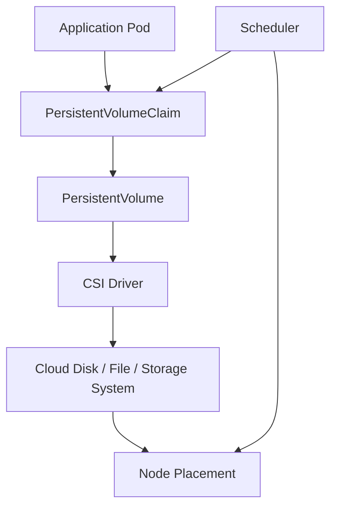
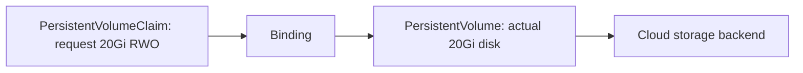
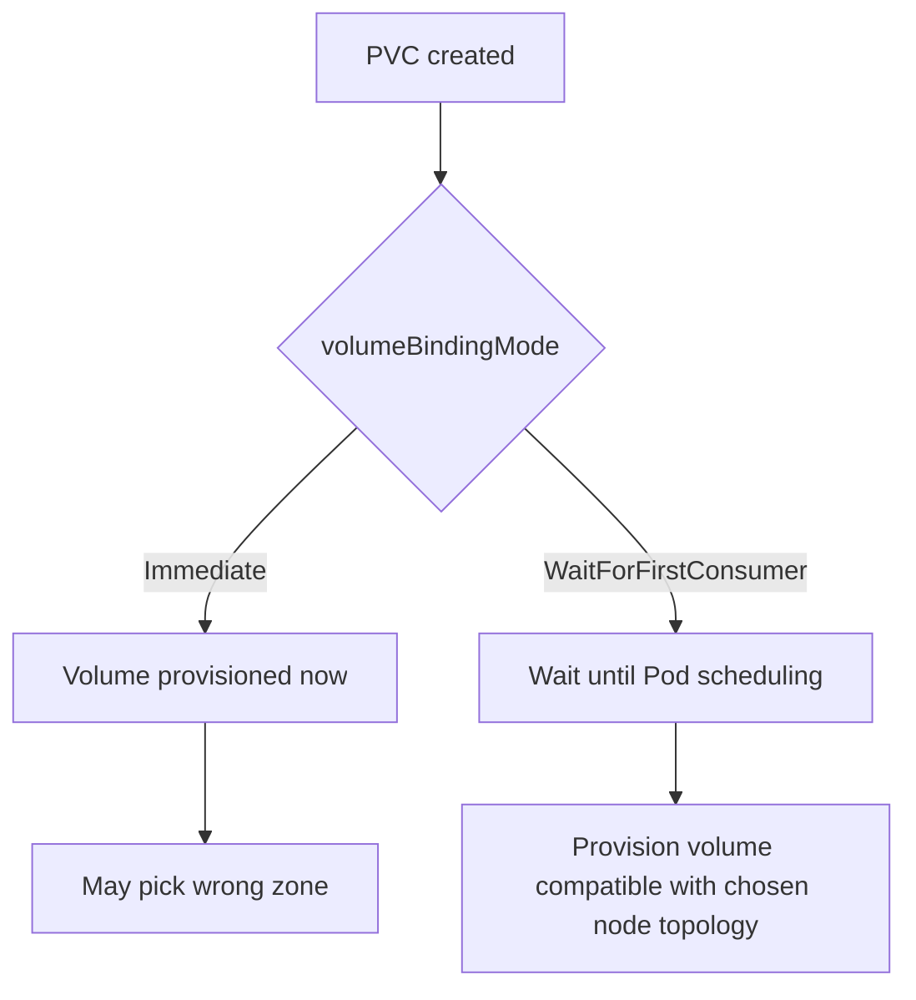
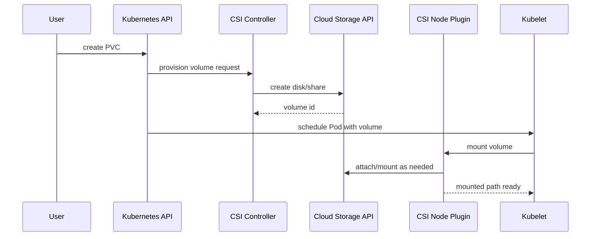
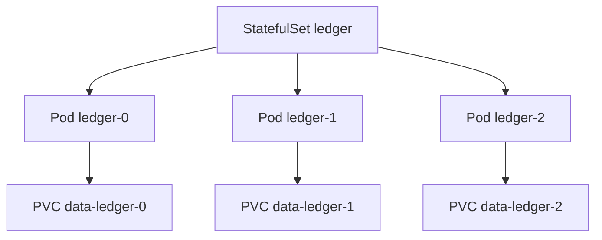
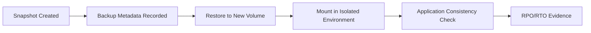
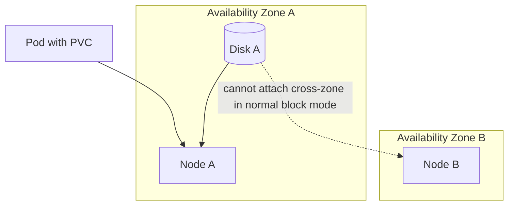
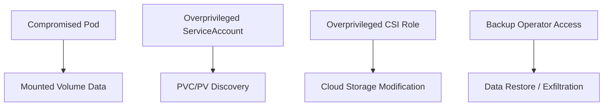

# Part 012 — Storage, PV/PVC, CSI, and Stateful Boundaries

Kubernetes makes stateless workloads easy to move.

Storage makes workloads sticky.

That is the core tension of stateful Kubernetes.

A Pod can die and come back somewhere else. A volume cannot always move with the same freedom. A disk may be zonal. A file share may have different latency and consistency behavior. A cloud storage driver may provision infrastructure outside the cluster. A database may need backup, restore, fencing, and upgrade behavior that Kubernetes cannot infer from YAML.

The operational goal of this part:

> Understand Kubernetes storage as a binding contract between workload identity, scheduler placement, cloud infrastructure, data durability, and recovery procedure.

This part does not teach database internals. It teaches the Kubernetes/cloud boundary you must understand before running stateful workloads on EKS or AKS.

---

## 1. The Mental Model

Storage in Kubernetes is a negotiation between three actors:



The application asks for storage using a `PersistentVolumeClaim`.

The cluster satisfies that claim using a `PersistentVolume`.

A `StorageClass` describes how new volumes should be dynamically provisioned.

A CSI driver talks to the underlying storage system.

The scheduler must place the Pod where the volume can be attached and mounted.

The invariant:

> A PVC is not just storage size. It is a portability, topology, access-mode, durability, and recovery contract.

---

## 2. Why Kubernetes Storage Is Hard

Stateless workload failure is usually cheap:

```text
Pod dies -> ReplicaSet creates new Pod -> Service routes to ready Pods
```

Stateful workload failure is different:

```text
Pod dies -> new Pod needs same data -> scheduler must place it where volume can attach -> storage driver must detach/attach/mount -> app must recover safely
```

The hard parts:

- data must survive Pod deletion;
- volume may be attachable to only one node;
- disk may be limited to one availability zone;
- failed node may hold an attachment lease;
- filesystem may need recovery;
- application may need leader election or fencing;
- backup may not be crash-consistent unless designed;
- restore may require secrets, DNS, identity, and ordering;
- cloud storage behavior differs between AWS and Azure.

Kubernetes can orchestrate mounts. It cannot automatically understand application-level consistency.

---

## 3. Volume Types: Ephemeral vs Persistent

Not every mounted path should be persistent.

| Need | Kubernetes Primitive | Production Note |
|---|---|---|
| Scratch space tied to Pod lifetime | `emptyDir` | Lost when Pod is removed from node |
| Config file | `ConfigMap` volume | Not for large or secret data |
| Secret file | `Secret` volume | Protect RBAC and encryption at rest |
| Durable block storage | PVC backed by cloud disk | Usually single-node attach semantics |
| Shared filesystem | PVC backed by cloud file service | Useful for RWX, different performance profile |
| Local high-performance storage | local PV / instance store | Requires special scheduling and data strategy |

The first design question:

> Does this data need to survive Pod replacement?

If no, prefer ephemeral storage.

If yes, define durability, access, topology, and backup requirements before choosing a storage backend.

---

## 4. PersistentVolume and PersistentVolumeClaim

A `PersistentVolume` is cluster storage.

A `PersistentVolumeClaim` is a workload request for storage.



Example PVC:

```yaml
apiVersion: v1
kind: PersistentVolumeClaim
metadata:
  name: checkout-data
  namespace: commerce
spec:
  accessModes:
    - ReadWriteOnce
  storageClassName: platform-zonal-ssd
  resources:
    requests:
      storage: 20Gi
```

A Pod mounts the claim:

```yaml
apiVersion: v1
kind: Pod
metadata:
  name: checkout-stateful-worker
  namespace: commerce
spec:
  containers:
    - name: app
      image: example.com/checkout-worker:1.0.0
      volumeMounts:
        - name: data
          mountPath: /var/lib/checkout
  volumes:
    - name: data
      persistentVolumeClaim:
        claimName: checkout-data
```

This creates an important lifecycle separation:

- deleting the Pod does not necessarily delete the PVC;
- deleting the PVC may release/delete the underlying PV depending on reclaim policy;
- deleting the namespace may delete all namespaced claims;
- cloud disks may outlive Kubernetes objects depending on driver and reclaim behavior.

Know the reclaim policy before you trust a cluster with data.

---

## 5. StorageClass

A `StorageClass` is a platform offering.

It answers:

- Which provisioner/CSI driver creates the volume?
- Which disk or file type is used?
- Is volume expansion allowed?
- Is binding immediate or delayed until a consumer Pod is scheduled?
- Which reclaim policy applies?
- Which topology constraints apply?

Example generic shape:

```yaml
apiVersion: storage.k8s.io/v1
kind: StorageClass
metadata:
  name: platform-zonal-ssd
provisioner: example.csi.driver
reclaimPolicy: Delete
allowVolumeExpansion: true
volumeBindingMode: WaitForFirstConsumer
parameters:
  type: premium
```

The most important field for cloud disks is often:

```yaml
volumeBindingMode: WaitForFirstConsumer
```

Why? Because many cloud disks are zonal.

If Kubernetes provisions the disk before knowing which zone the Pod will run in, it may create the disk in a zone where the Pod cannot be scheduled. `WaitForFirstConsumer` delays provisioning/binding until Pod scheduling context is known.



Production rule:

> For zonal block storage, prefer `WaitForFirstConsumer` unless you have a specific reason not to.

---

## 6. Access Modes

Access modes describe how a volume may be mounted.

Common modes:

| Mode | Meaning | Typical Backend |
|---|---|---|
| `ReadWriteOnce` | read-write by a single node | cloud block disk |
| `ReadOnlyMany` | read-only by many nodes | file/object-like systems depending on driver |
| `ReadWriteMany` | read-write by many nodes | network file system / file share |
| `ReadWriteOncePod` | read-write by a single Pod | CSI-supported stricter single-Pod semantics |

Do not confuse access modes with application-level safety.

A `ReadWriteMany` filesystem lets multiple Pods mount the same volume, but it does not make your application safe for concurrent writes. Your application still needs locking, idempotency, concurrency control, and corruption prevention.

A `ReadWriteOnce` disk may still be rescheduled to another node after detach/attach. It does not mean “forever bound to one node.” It means the volume access mode does not allow simultaneous multi-node write mounting.

---

## 7. CSI: Container Storage Interface

CSI is the plugin boundary between Kubernetes and storage providers.

Kubernetes does not need built-in knowledge of every cloud disk or file system. Instead, a CSI driver implements operations such as:

- create volume;
- delete volume;
- attach volume;
- detach volume;
- mount volume;
- unmount volume;
- expand volume;
- snapshot volume, if supported;
- clone volume, if supported.



In managed Kubernetes, CSI drivers may be installed as add-ons or managed components.

The production point:

> Storage behavior is controlled by Kubernetes objects plus CSI driver behavior plus cloud storage behavior. Read all three.

---

## 8. AWS EKS Storage Options

On EKS, common storage choices include:

| Backend | Typical Use | Access Pattern | Notes |
|---|---|---|---|
| Amazon EBS via EBS CSI | databases, queues, single-writer state | usually RWO | zonal block storage, attach/detach behavior matters |
| Amazon EFS via EFS CSI | shared files, RWX workloads | RWX | network filesystem, different latency/cost model |
| EC2 instance store / local PV | cache, scratch, high IOPS local state | node-local | data tied to node; design for loss |
| S3 via application/library or specific drivers | object storage | object API | not a POSIX disk replacement |

### 8.1 EBS pattern

EBS is block storage. It is a good fit for single-writer stateful workloads that understand local filesystem semantics.

A simplified EBS-style StorageClass may look like:

```yaml
apiVersion: storage.k8s.io/v1
kind: StorageClass
metadata:
  name: gp3-wait
provisioner: ebs.csi.aws.com
volumeBindingMode: WaitForFirstConsumer
allowVolumeExpansion: true
reclaimPolicy: Delete
parameters:
  type: gp3
  encrypted: "true"
```

Production considerations:

- zone placement matters;
- pod rescheduling may require detach/attach delay;
- snapshot and restore strategy must be tested;
- encryption and KMS ownership should be explicit;
- IAM for the CSI driver must be least-privilege;
- EBS is not generally a shared multi-writer filesystem for arbitrary workloads.

### 8.2 EFS pattern

EFS is a managed network file system. It is commonly used when multiple Pods need shared file access.

Production considerations:

- latency profile differs from block storage;
- throughput mode and access pattern matter;
- POSIX permissions and access points need design;
- backup and lifecycle policy should be explicit;
- network path and security groups matter.

Do not choose EFS just because `ReadWriteMany` sounds convenient. Choose it when the application is safe and performant on a network filesystem.

### 8.3 EKS Auto Mode note

EKS Auto Mode includes managed infrastructure assumptions and storage capabilities. Do not blindly reuse classic EBS CSI assumptions without checking Auto Mode documentation and constraints. Platform-owned StorageClasses should document whether they are for classic EKS, EKS Auto Mode, or both.

---

## 9. Azure AKS Storage Options

On AKS, common storage choices include:

| Backend | Typical Use | Access Pattern | Notes |
|---|---|---|---|
| Azure Disk CSI | databases, single-writer state | usually RWO | block storage, zone/topology matters |
| Azure Files CSI | shared files | RWX | SMB/NFS, useful for shared mounts |
| Ephemeral OS/temp/local disk | scratch/cache | node-local | not durable workload state |
| Blob/Object storage via app/library or driver | object data | object API | not a normal filesystem substitute unless driver semantics fit |

### 9.1 Azure Disk pattern

Azure Disk is block storage. It is usually a fit for single-writer workloads.

A simplified Azure Disk style StorageClass may look like:

```yaml
apiVersion: storage.k8s.io/v1
kind: StorageClass
metadata:
  name: managed-csi-wait
provisioner: disk.csi.azure.com
volumeBindingMode: WaitForFirstConsumer
allowVolumeExpansion: true
reclaimPolicy: Delete
parameters:
  skuName: Premium_LRS
```

Production considerations:

- zone support and SKU capabilities matter;
- disk attach/detach timing affects failover;
- private cluster and identity design affect CSI behavior;
- snapshot/backup must be part of platform lifecycle;
- disk performance tier must be sized against workload I/O.

### 9.2 Azure Files pattern

Azure Files gives shared filesystem semantics using SMB or NFS depending on configuration.

It is often selected for `ReadWriteMany` workloads.

Production considerations:

- SMB vs NFS semantics differ;
- identity, secrets, and mount options matter;
- private endpoint and private DNS should be considered;
- throughput, IOPS, and latency must be tested;
- application concurrency safety is still your responsibility.

---

## 10. StatefulSet and VolumeClaimTemplates

For replicated stateful workloads, you usually do not create one shared PVC manually. You use `StatefulSet` with `volumeClaimTemplates`.

```yaml
apiVersion: apps/v1
kind: StatefulSet
metadata:
  name: ledger
  namespace: finance
spec:
  serviceName: ledger
  replicas: 3
  selector:
    matchLabels:
      app.kubernetes.io/name: ledger
  template:
    metadata:
      labels:
        app.kubernetes.io/name: ledger
    spec:
      containers:
        - name: ledger
          image: example.com/ledger:1.0.0
          ports:
            - containerPort: 8080
          volumeMounts:
            - name: data
              mountPath: /var/lib/ledger
  volumeClaimTemplates:
    - metadata:
        name: data
      spec:
        accessModes:
          - ReadWriteOnce
        storageClassName: platform-zonal-ssd
        resources:
          requests:
            storage: 100Gi
```

This creates stable claim names like:

```text
data-ledger-0
data-ledger-1
data-ledger-2
```

The identity relationship matters:



A replacement `ledger-0` Pod should mount the same `data-ledger-0` PVC.

That stability is why StatefulSet exists.

---

## 11. Reclaim Policy

A PV has a reclaim policy.

Common values:

- `Delete`: deleting the PVC deletes the underlying storage asset, depending on driver behavior.
- `Retain`: deleting the PVC leaves the underlying PV/storage for manual recovery or cleanup.

For production data, this decision is not trivial.

| Environment | Common Reclaim Policy | Reason |
|---|---|---|
| ephemeral dev | `Delete` | reduce orphan cost |
| CI/test | `Delete` | fast cleanup |
| production critical data | often `Retain` or strict backup-controlled `Delete` | avoid accidental data loss |
| generated cache | `Delete` | data can be rebuilt |

Do not let application teams pick reclaim policy casually. It should be a platform-level storage class decision.

The real question:

> If someone deletes this PVC at 02:00, what happens to the data and how do we recover?

If nobody can answer, the storage class is not production-ready.

---

## 12. Volume Expansion

Many CSI drivers support volume expansion.

A PVC can be edited to request more storage:

```yaml
spec:
  resources:
    requests:
      storage: 200Gi
```

But expansion is not magic.

Consider:

- Does the StorageClass allow expansion?
- Does the driver support online expansion?
- Does the filesystem expand automatically?
- Does the application observe the new size?
- Is there a rollback path? Usually shrinking is not supported.
- Does the cloud provider charge immediately for the larger allocation?

Production rule:

> Treat expansion as a one-way operational change unless proven otherwise.

---

## 13. Snapshots and Backups

Volume snapshots are useful, but a snapshot is not always a complete backup strategy.

A storage snapshot may be crash-consistent at the disk level. Your application may require:

- flushing writes;
- pausing writes;
- database checkpoint;
- WAL archiving;
- multi-volume consistency;
- encryption key availability;
- restore ordering;
- application-level validation.

The dangerous assumption:

> “We have snapshots, therefore we have backups.”

A backup is only real if restore has been tested.



Your storage platform should define:

- snapshot schedule;
- retention period;
- encryption key policy;
- cross-zone or cross-region copy if needed;
- restore drill cadence;
- owner and escalation path;
- RPO/RTO target;
- evidence retained for audits.

---

## 14. Topology and Failure Domains

Cloud disks are often tied to zones.

A Pod using a zonal disk must run on a node that can attach that disk.



If all nodes in Zone A are unavailable, a Pod bound to a Zone A disk may not be able to run in Zone B without restore or replication.

This is why “multi-AZ Kubernetes cluster” does not automatically mean “multi-AZ stateful workload.”

For each stateful workload, decide:

- Is storage zonal or regional?
- Can the application replicate data across zones?
- Does failover require restoring from backup?
- Does the scheduler understand volume topology?
- Are node pools available in the required zones?
- What happens if a zone is lost?

Kubernetes schedules Pods. It does not make single-zone disks regionally available.

---

## 15. Running Databases on Kubernetes

This is the uncomfortable truth:

> Kubernetes can run databases. It does not automatically make databases easier to operate.

For many teams, managed databases remain the better default:

- Amazon RDS/Aurora instead of self-managed Postgres on EKS;
- Azure Database for PostgreSQL/Flexible Server instead of self-managed Postgres on AKS;
- managed Redis/Kafka equivalents where operational fit is better.

Run stateful systems on Kubernetes when you have a reason:

- portability requirement;
- custom database engine;
- edge/on-prem/hybrid constraints;
- operator maturity;
- licensing or topology constraints;
- strong internal platform capability.

If you run databases on Kubernetes, require:

- proven operator or carefully designed StatefulSet;
- backup and restore automation;
- failover procedure;
- fencing/leader election correctness;
- resource isolation;
- storage performance testing;
- upgrade procedure;
- disaster recovery drill;
- monitoring and alerts;
- clear ownership.

YAML is not a database operations strategy.

---

## 16. Storage Performance Engineering

Storage performance is not just capacity.

Measure:

- IOPS;
- throughput;
- latency percentiles;
- fsync latency;
- queue depth;
- attach/detach time;
- mount time;
- snapshot time;
- restore time;
- cross-zone behavior;
- cost per workload.

A common failure mode is requesting `100Gi` and assuming the performance is enough. Cloud disks often tie performance to disk type, size, provisioning mode, or explicit IOPS/throughput parameters.

The production test should model application behavior:

```text
write pattern: random/sequential
write size: small/large
sync behavior: fsync per transaction/batched
read pattern: hot/cold
concurrency: single writer/many readers
failure event: node restart, detach, attach, recovery
```

For databases, test recovery, not just steady-state throughput.

---

## 17. Security and Identity

Storage security touches multiple layers:

- Kubernetes RBAC: who can create/delete PVCs and StorageClasses;
- CSI driver identity: what cloud permissions it has;
- encryption at rest: provider-managed or customer-managed keys;
- encryption in transit: especially file shares/network filesystems;
- mount options: filesystem permissions, UID/GID, read-only flags;
- secret handling: credentials for file shares or external systems;
- namespace isolation: who can mount which PVC;
- backup access: who can restore or exfiltrate data;
- deletion protection: reclaim and cloud-side safeguards.

Threat model:



A PVC is often a data access boundary. Treat it with the same seriousness as database credentials.

---

## 18. Operational Runbook

When a Pod using a PVC is stuck, follow this path.

### 18.1 Check PVC state

```bash
kubectl -n commerce get pvc
kubectl -n commerce describe pvc checkout-data
```

Look for:

- `Pending`;
- no matching StorageClass;
- insufficient capacity;
- topology conflict;
- provisioning error;
- quota error.

### 18.2 Check PV binding

```bash
kubectl get pv
kubectl describe pv <pv-name>
```

Look for:

- reclaim policy;
- claimRef;
- node affinity;
- CSI volume handle;
- events.

### 18.3 Check Pod events

```bash
kubectl -n commerce describe pod <pod-name>
```

Look for:

- failed attach;
- failed mount;
- multi-attach error;
- permission denied;
- timeout;
- node affinity conflict.

### 18.4 Check CSI driver

```bash
kubectl -n kube-system get pods | grep -i csi
kubectl -n kube-system logs <csi-controller-pod>
kubectl -n kube-system logs <csi-node-pod>
```

The namespace may differ in managed clusters. Use your platform documentation.

### 18.5 Check cloud asset

In AWS/Azure, verify:

- disk exists;
- disk zone;
- attachment state;
- encryption/KMS status;
- cloud API permission errors;
- quota limits;
- private endpoint/network path for file storage.

Do not debug Kubernetes only. Storage failures often live at the cloud API boundary.

---

## 19. Common Failure Modes

### 19.1 PVC stuck in Pending

Common causes:

- missing StorageClass;
- no default StorageClass when `storageClassName` omitted;
- insufficient cloud quota;
- invalid parameters;
- topology conflict;
- delayed binding waiting for first consumer.

### 19.2 Pod stuck in ContainerCreating

Common causes:

- volume attach timeout;
- mount failure;
- permission issue;
- CSI node plugin problem;
- cloud disk stuck attached to old node.

### 19.3 Multi-attach error

Common causes:

- RWO volume still attached to another node;
- old Pod/node not fully terminated;
- aggressive rescheduling;
- node failure delaying detach.

### 19.4 Data lost after PVC deletion

Common causes:

- reclaim policy `Delete`;
- namespace deletion;
- no backup;
- misunderstanding PV/PVC lifecycle.

### 19.5 Stateful app corrupts shared volume

Common causes:

- using RWX without application concurrency control;
- multiple writers not designed for same files;
- missing locks or unsafe file cache behavior.

### 19.6 Restore fails during incident

Common causes:

- snapshots were never restored in rehearsal;
- secrets/KMS keys unavailable;
- DNS/private endpoint missing;
- app version incompatible with data;
- multi-volume consistency not handled.

---

## 20. Platform Storage Class Design

A serious platform should not expose random cloud defaults directly.

It should offer named classes with documented intent.

Example catalog:

| StorageClass | Backing | Intended Use | Reclaim | Binding | Notes |
|---|---|---|---|---|---|
| `platform-zonal-ssd-delete` | EBS gp3 / Azure Disk Premium | non-critical dev/test state | Delete | WaitForFirstConsumer | cheap cleanup |
| `platform-zonal-ssd-retain` | EBS gp3 / Azure Disk Premium | prod single-writer state | Retain | WaitForFirstConsumer | manual deletion required |
| `platform-shared-file` | EFS / Azure Files | RWX shared files | Retain/Delete by tier | Wait/Immediate by backend | benchmark required |
| `platform-local-ephemeral` | instance/local disk | cache/scratch | Delete | node-specific | data loss expected |

Each class should document:

- backend;
- access modes;
- zone behavior;
- performance profile;
- encryption mode;
- backup support;
- reclaim policy;
- expansion support;
- cost model;
- allowed namespaces/teams;
- operational owner;
- recovery runbook.

The platform abstraction should hide provider complexity without hiding consequences.

---

## 21. EKS vs AKS Decision Matrix

| Requirement | EKS Direction | AKS Direction | Reasoning |
|---|---|---|---|
| Single-writer database volume | EBS CSI | Azure Disk CSI | Block storage, usually RWO |
| Shared file access | EFS CSI | Azure Files CSI | RWX-style shared filesystem |
| High-performance ephemeral cache | EC2 instance store/local PV | local/ephemeral node storage | Must tolerate node loss |
| Multi-zone database HA | App/database replication, not just disk | App/database replication, not just disk | Zonal disks do not equal regional HA |
| Production backup | AWS snapshot/backup + app consistency | Azure snapshot/backup + app consistency | Restore drill required |
| Managed default preference | EKS add-ons / Auto Mode constraints | AKS managed CSI / Automatic constraints | Validate managed mode behavior |

The exact implementation differs, but the thinking is the same:

> Start from workload data semantics, then select storage. Do not start from a StorageClass name.

---

## 22. Review Checklist

Before approving stateful workload deployment, ask:

- What data is stored on the volume?
- Is the data rebuildable or authoritative?
- Which access mode is required and why?
- Is the workload safe for shared writes?
- Is the storage backend zonal or regional?
- What happens during zone failure?
- What happens during node failure?
- What is the reclaim policy?
- Who can delete the PVC?
- Is encryption at rest configured?
- Are backup and restore tested?
- What is the RPO/RTO?
- Is volume expansion supported?
- What are IOPS/throughput/latency requirements?
- Are CSI driver permissions least-privilege?
- Is there a runbook for `Pending`, mount failure, and multi-attach errors?

If these answers are unknown, the workload is not production-ready.

---

## 23. Exercises

### Exercise 1 — PVC lifecycle lab

Create a PVC and Pod. Delete only the Pod. Observe that the PVC remains. Then delete the PVC and observe PV behavior.

Repeat with StorageClasses using `Delete` and `Retain` reclaim policies in a non-production cluster.

### Exercise 2 — Topology lab

Create a multi-zone node pool and a StorageClass with `WaitForFirstConsumer`. Deploy a Pod with a PVC and inspect:

- chosen node zone;
- PV node affinity;
- cloud disk zone;
- rescheduling behavior.

### Exercise 3 — Restore drill

Create data, snapshot it, restore to a new PVC, mount it in an isolated namespace, and validate application-level consistency.

Document actual RTO.

### Exercise 4 — Storage class review

Audit all StorageClasses in a cluster:

```bash
kubectl get storageclass
kubectl describe storageclass <name>
```

Classify each by:

- backend;
- reclaim policy;
- binding mode;
- expansion support;
- production suitability;
- missing documentation.

---

## 24. Key Takeaways

- Kubernetes storage is a contract across app, PVC, PV, StorageClass, CSI, scheduler, node, and cloud backend.
- PVCs are not just “disk size”; they encode topology, access, lifecycle, and recovery implications.
- `WaitForFirstConsumer` is important for zonal cloud block storage.
- EBS/Azure Disk are usually block/RWO patterns; EFS/Azure Files are shared filesystem/RWX patterns.
- Snapshots are not enough. Restore drills prove backup quality.
- Running databases on Kubernetes is possible but demands operational maturity.
- A production platform should expose intentional StorageClasses, not arbitrary cloud defaults.

---

## References

- Kubernetes Documentation — Persistent Volumes: https://kubernetes.io/docs/concepts/storage/persistent-volumes/
- Kubernetes Documentation — Storage Classes: https://kubernetes.io/docs/concepts/storage/storage-classes/
- Kubernetes Documentation — Volumes: https://kubernetes.io/docs/concepts/storage/volumes/
- Kubernetes Documentation — StatefulSet: https://kubernetes.io/docs/concepts/workloads/controllers/statefulset/
- Kubernetes CSI Documentation: https://kubernetes-csi.github.io/docs/
- Amazon EKS User Guide — Use Kubernetes volume storage with Amazon EBS: https://docs.aws.amazon.com/eks/latest/userguide/ebs-csi.html
- Amazon EKS User Guide — Available EKS add-ons: https://docs.aws.amazon.com/eks/latest/userguide/workloads-add-ons-available-eks.html
- Azure AKS Documentation — Use CSI drivers on AKS: https://learn.microsoft.com/en-us/azure/aks/csi-storage-drivers
- Azure AKS Documentation — Create and manage persistent volumes with Azure Files: https://learn.microsoft.com/en-us/azure/aks/create-volume-azure-files
