# Part 013 — Cluster Architecture: Managed vs Self-Managed

> Kubernetes cluster architecture is not a diagram of boxes. It is a boundary of responsibility.

At production scale, the important question is not:

> "Should we use Kubernetes?"

The better question is:

> "Which parts of the Kubernetes operating model are we willing to own, and which parts should be delegated to a cloud provider?"

A weak engineer compares Kubernetes options by feature lists.

A strong engineer compares them by **failure domains**, **upgrade ownership**, **security boundaries**, **blast radius**, **recovery mechanics**, **team skill**, and **organizational accountability**.

This part builds that mental model.

We are not yet deep-diving EKS or AKS implementation. That begins in the next parts. Here, we build the architectural frame you need before choosing between:

- self-managed Kubernetes;
- managed Kubernetes, such as EKS or AKS;
- managed data plane options;
- automatic/autopilot-style operating modes;
- hybrid or edge Kubernetes;
- multi-cluster platform design.

---

## 1. The Core Idea

Kubernetes has three major architectural planes:

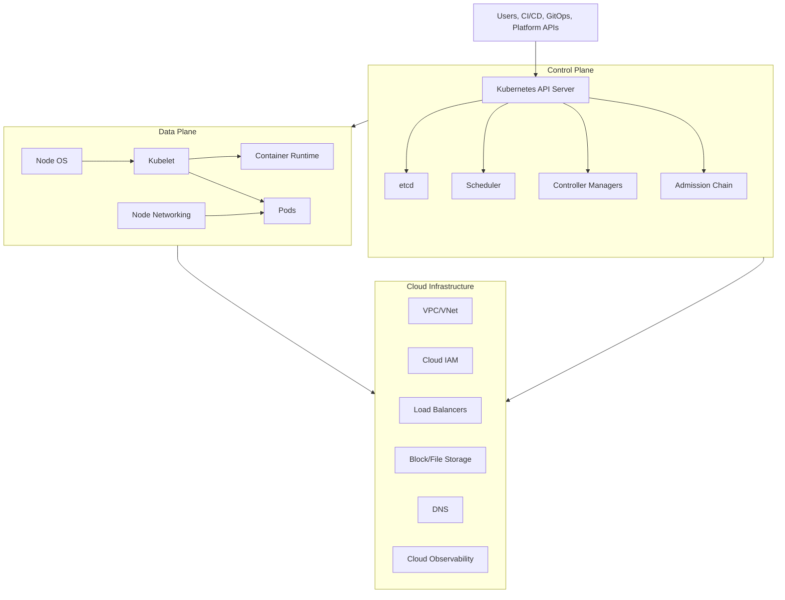

The word **managed** usually means the provider operates some subset of these planes.

It does **not** mean the provider operates your application platform.

That distinction matters.

A managed Kubernetes service usually manages:

- control plane availability;
- control plane patching;
- core cluster API availability;
- integration points into cloud IAM/networking/load balancing/storage;
- sometimes add-ons;
- sometimes node provisioning;
- sometimes scaling behavior;
- sometimes default security posture.

But you still own:

- workload correctness;
- namespace strategy;
- deployment strategy;
- RBAC design;
- policy design;
- runtime security;
- observability semantics;
- incident response;
- service SLOs;
- cost discipline;
- data protection;
- production readiness of every YAML you apply.

Managed Kubernetes removes some undifferentiated operational burden. It does not remove engineering responsibility.

---

## 2. The First Architecture Mistake

Many teams frame the choice like this:

| Bad Question | Why It Is Weak |
|---|---|
| "Should we use EKS, AKS, or self-managed?" | Too broad; ignores responsibility boundaries. |
| "Which one is cheaper?" | Control-plane price is rarely the dominant platform cost. |
| "Which one has more features?" | Feature abundance can increase operational complexity. |
| "Can our app run there?" | Most apps can run; the problem is whether teams can operate them safely. |

A better frame:

| Better Question | Why It Matters |
|---|---|
| Who owns control plane availability? | Determines incident class and staffing model. |
| Who owns node lifecycle? | Determines patching, AMI/image, capacity, disruption risk. |
| Who owns networking? | Determines IP exhaustion, routing, DNS, ingress, security group, private access design. |
| Who owns identity bridge? | Determines blast radius between cloud IAM and Kubernetes RBAC. |
| Who owns upgrades? | Determines API compatibility, add-on lifecycle, and release discipline. |
| Who owns policy enforcement? | Determines whether platform rules are advice or actual guardrails. |
| Who owns recovery? | Determines RPO/RTO credibility. |

Production Kubernetes is an ownership model.

---

## 3. Kubernetes Responsibility Layers

Think in layers.

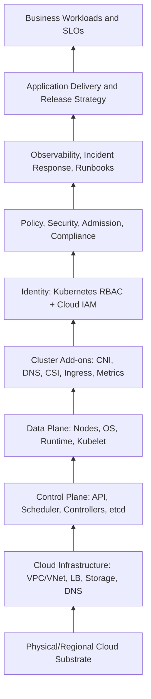

A self-managed cluster makes you responsible for almost everything above the physical cloud substrate.

A managed cluster shifts major parts of L3 to the provider.

A more automatic managed mode can shift parts of L4 and L5.

But L6-L10 are still largely yours.

That is where most production failures live.

---

## 4. Self-Managed Kubernetes

A self-managed Kubernetes cluster means your team runs the Kubernetes control plane and data plane yourself.

Common ways:

- kubeadm;
- kOps;
- Kubespray;
- Cluster API;
- Rancher-managed distributions;
- custom internal Kubernetes distribution;
- edge-specific distributions such as K3s or MicroK8s;
- on-premises or bare-metal platforms.

Self-managed Kubernetes gives you maximum control, but control is not free.

You own:

- API server deployment;
- etcd topology;
- etcd backup and restore;
- scheduler/controller-manager health;
- control plane certificates;
- admission plugin configuration;
- control plane scaling;
- control plane HA;
- network plugin installation;
- DNS installation;
- storage plugin installation;
- node bootstrap;
- OS image lifecycle;
- kubelet configuration;
- container runtime lifecycle;
- cluster upgrade path;
- CVE response;
- break-glass access;
- disaster recovery;
- monitoring for all of the above.

This can be the right choice.

But it is rarely the right default for a cloud-hosted product team.

---

## 5. Managed Kubernetes

A managed Kubernetes service, such as Amazon EKS or Azure AKS, gives you a provider-operated Kubernetes control plane with cloud-native integrations.

The provider usually owns:

- control plane host management;
- API server availability;
- etcd durability and HA;
- control plane patching;
- integration with cloud IAM;
- integration with cloud networking;
- integration with cloud load balancing;
- integration with cloud storage;
- a supported version lifecycle;
- optional managed add-ons;
- optional managed node groups/node pools;
- optional automatic provisioning modes.

You still own:

- cluster architecture choices;
- workload architecture;
- node sizing, unless fully delegated;
- network topology choices;
- namespace model;
- RBAC and authorization design;
- security posture;
- policy-as-code;
- application delivery;
- observability;
- cost;
- resilience drills;
- incident response.

A managed cluster is not "Kubernetes without operations".

It is "Kubernetes with a smaller but still critical operating surface".

---

## 6. Responsibility Matrix

Use this matrix when making architecture decisions.

| Capability | Self-Managed | EKS/AKS Basic Managed | EKS/AKS with Managed Nodes | Automatic/Auto Mode Style |
|---|---|---|---|---|
| Control plane host management | You | Provider | Provider | Provider |
| etcd topology and backup | You | Provider | Provider | Provider |
| API server patching | You | Provider-managed lifecycle | Provider-managed lifecycle | Provider-managed lifecycle |
| Kubernetes version choice | You | You within provider support window | You within provider support window | Often more constrained |
| Worker node OS | You | You | Shared/provider-assisted | Mostly provider-managed |
| Worker node scaling | You | You | Shared | Provider/platform driven |
| CNI install/upgrade | You | Shared/add-on model | Shared/add-on model | Often provider-managed |
| CSI install/upgrade | You | Shared/add-on model | Shared/add-on model | Often provider-managed |
| Ingress/load balancer controller | You | You/shared | You/shared | Often opinionated |
| Cloud IAM integration | You build | Provider integration + your policy | Provider integration + your policy | Provider integration + your policy |
| Kubernetes RBAC | You | You | You | You |
| NetworkPolicy design | You | You | You | You, depending on implementation |
| Admission policy | You | You | You | You, with more provider defaults |
| Workload security | You | You | You | You |
| App SLO | You | You | You | You |
| Cost model | You | You | You | You, with less node-level control |

The key pattern:

> The provider can run infrastructure. The product/platform team still owns intent.

---

## 7. The Production Architecture Question

A Kubernetes cluster is a runtime for desired state.

It does not know whether your desired state is sane.

You can declare:

- no resource requests;
- infinite memory limits;
- root containers;
- public load balancers;
- secrets mounted everywhere;
- no NetworkPolicy;
- no PodDisruptionBudget;
- broken readiness probes;
- node selectors that block scheduling;
- cluster-admin RBAC for CI;
- unbounded CronJobs;
- stateful workloads with no backup;
- overprivileged cloud IAM roles.

Kubernetes will try to make that real.

So cluster architecture must include **guardrails**, not only infrastructure.

---

## 8. The Four Ownership Zones

For production design, split ownership into four zones.

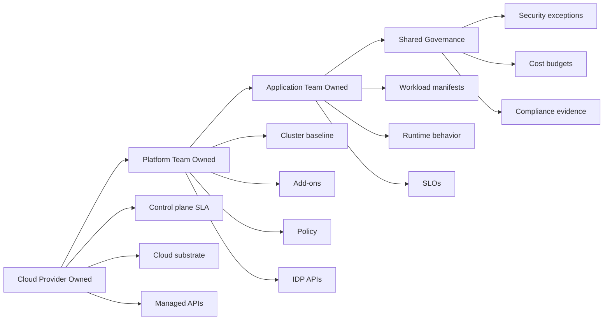

### 8.1 Cloud Provider Owned

Examples:

- physical host substrate;
- managed control plane health;
- managed API availability;
- cloud region/AZ infrastructure;
- managed service implementation;
- service-specific SLAs.

### 8.2 Platform Team Owned

Examples:

- cluster creation pattern;
- baseline add-ons;
- ingress class/gateway class;
- namespace factory;
- RBAC roles;
- workload identity templates;
- Pod Security standards;
- NetworkPolicy baseline;
- observability pipeline;
- GitOps bootstrap;
- upgrade playbooks;
- incident runbooks;
- cost allocation model.

### 8.3 Application Team Owned

Examples:

- deployment manifests;
- resource requests;
- probe correctness;
- application logs and metrics;
- service-level SLOs;
- release safety;
- app-level security assumptions;
- dependency timeout/retry behavior;
- backward compatibility.

### 8.4 Shared Governance

Examples:

- exceptions;
- regulated workload placement;
- data classification;
- production readiness reviews;
- business continuity commitments;
- chargeback/showback;
- audit evidence.

A cluster without explicit ownership zones becomes a shared failure bucket.

---

## 9. Architecture Decision Axes

You should choose cluster architecture by evaluating these axes.

### 9.1 Control Plane Ownership

Ask:

- Do we need custom API server flags?
- Do we need custom admission plugin configuration not supported by provider?
- Do we need direct etcd access?
- Do we need to run in an environment where provider-managed control plane is unavailable?
- Can we staff 24/7 control plane operations?

For most cloud workloads, provider-managed control plane wins.

Self-managed control plane is justified when constraints are exceptional:

- air-gapped environment;
- regulated sovereign environment;
- edge deployment;
- custom distribution;
- deep control-plane experimentation;
- unsupported cloud/on-prem topology;
- requirement for full control over etcd/control-plane internals.

### 9.2 Data Plane Ownership

Ask:

- Do we need custom AMIs/images?
- Do we need GPU/accelerator tuning?
- Do we need specialized kernel modules?
- Do we need eBPF dataplane tuning?
- Do we need strict node hardening?
- Do we want provider-managed node lifecycle?
- Do we need serverless Pod execution?
- Are workloads predictable or bursty?

Data plane ownership is usually where managed Kubernetes still leaves many choices.

### 9.3 Network Ownership

Ask:

- Who owns VPC/VNet CIDR design?
- How many Pods per node?
- Are Pod IPs routable in the cloud network?
- Are there overlapping CIDRs across environments?
- Is private cluster access required?
- How do workloads reach cloud services privately?
- Where does TLS terminate?
- Is egress controlled?
- How are DNS zones delegated?

Networking is the most common place where "managed Kubernetes" still requires deep engineering.

### 9.4 Identity Ownership

Ask:

- Who can call the Kubernetes API?
- How are cloud identities mapped to Kubernetes users/groups?
- How do Pods call cloud APIs?
- Is identity per workload, per namespace, or per node?
- How are break-glass roles audited?
- How are CI/CD credentials scoped?

Identity bridges are dangerous because they connect two authorization systems.

Kubernetes RBAC answers:

> What can this principal do to Kubernetes objects?

Cloud IAM answers:

> What can this principal do to cloud resources?

A platform failure often happens when a principal is safe in one system but dangerous when bridged into the other.

### 9.5 Add-on Ownership

Ask:

- Who owns CoreDNS?
- Who owns kube-proxy or replacement dataplane?
- Who owns CNI upgrades?
- Who owns CSI drivers?
- Who owns ingress controllers?
- Who owns metrics-server?
- Who owns policy controllers?
- Who owns observability agents?

A cluster is not only Kubernetes core.

It is a bundle of controllers.

Each controller has:

- permissions;
- version lifecycle;
- compatibility matrix;
- failure mode;
- cloud API permissions;
- resource usage;
- upgrade procedure.

### 9.6 Upgrade Ownership

Ask:

- Who tracks Kubernetes minor versions?
- Who tracks deprecated APIs?
- Who tests add-on compatibility?
- Who validates CRDs?
- Who rehearses upgrade in staging?
- Who owns application compatibility?
- Who can stop a production upgrade?

Kubernetes upgrades are not only cluster upgrades.

They are API contract upgrades.

### 9.7 Recovery Ownership

Ask:

- What happens if a cluster is lost?
- What happens if the region is lost?
- What happens if GitOps state is wrong?
- What happens if a PVC is deleted?
- What happens if an IAM role is compromised?
- What happens if the ingress controller is broken?
- What happens if CNI cannot allocate IPs?
- What happens if the API server is reachable but all nodes are unhealthy?

Recovery must be designed before failure.

---

## 10. Control Plane Failure Domains

The Kubernetes control plane contains several logical components.

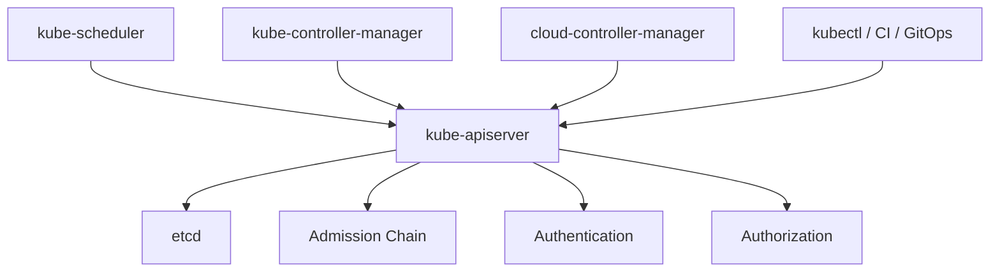

Failure modes:

| Component | Failure Impact |
|---|---|
| API server unavailable | No new desired-state changes; existing Pods usually keep running. |
| etcd unavailable/corrupt | Cluster state unavailable; control plane impaired or down. |
| scheduler impaired | New Pods may remain Pending. |
| controller-manager impaired | Replica reconciliation, node handling, endpoint updates, and other controllers lag. |
| cloud-controller-manager impaired | Cloud LB/node integration may lag or break. |
| admission broken | New object creation/update may fail. |
| authentication broken | Users/controllers may be locked out. |
| authorization too permissive | Compromise blast radius increases. |

Managed Kubernetes reduces your need to directly run these components.

But it does not remove the effects of their behavior.

For example:

- If admission webhooks you installed are down, your API writes may fail.
- If CRDs from your platform are broken, controllers may crash-loop.
- If GitOps applies invalid manifests, the managed API server will still reject or accept based on API rules.
- If you overload the API with noisy controllers, managed control plane behavior can still degrade.

Managed control plane is not a license to ignore control-plane hygiene.

---

## 11. Data Plane Failure Domains

The data plane is where Pods actually run.

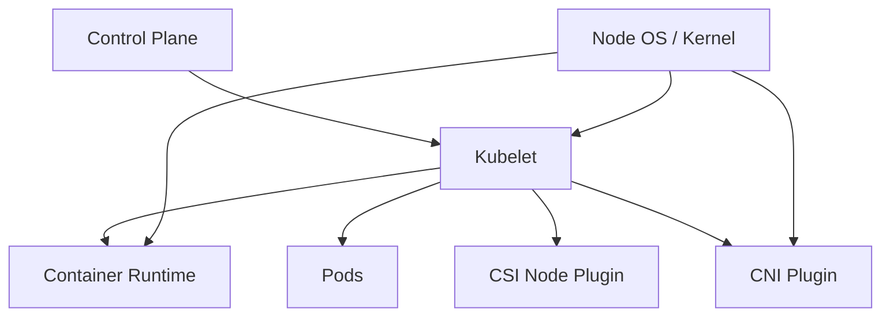

Failure modes:

| Failure | Typical Symptom |
|---|---|
| Node disk pressure | Pods evicted, image pulls fail. |
| Memory pressure | Pods OOMKilled or evicted. |
| CPU saturation | Latency spikes, probe failures, noisy neighbor effects. |
| Kubelet unhealthy | Node NotReady, Pod status stale. |
| Runtime failure | Containers cannot start or stop correctly. |
| CNI failure | Pod sandbox creation fails, networking unavailable. |
| CSI failure | Volumes cannot attach/mount. |
| Node image CVE | Security patch required; disruption planning needed. |
| AZ capacity shortage | Node scale-out fails. |
| Cloud API throttling | Node/load balancer/storage operations delayed. |

The data plane is often where production reality lives.

Even with a managed control plane, bad node and workload design can take down your platform.

---

## 12. Add-on Failure Domains

Kubernetes clusters rely on critical add-ons.

| Add-on | What It Does | Failure Impact |
|---|---|---|
| CNI plugin | Pod networking | Pods fail to start or communicate. |
| CoreDNS | Cluster DNS | Service discovery fails. |
| kube-proxy / dataplane | Service routing | ClusterIP/Service traffic may fail. |
| CSI driver | Storage attach/mount | Stateful workloads fail. |
| Ingress controller | North-south routing | External traffic fails. |
| metrics-server | Resource metrics | HPA may stop scaling. |
| policy controller | Guardrails | Bad manifests may enter, or all writes may fail if webhook is misconfigured. |
| observability agents | Telemetry | Incidents become blind. |
| external-secrets controller | Secret sync | Credential rotation may stall. |
| cert-manager | Certificate lifecycle | TLS expiration risk. |

A production cluster should treat add-ons as first-class infrastructure.

They need:

- ownership;
- version pinning;
- compatibility checks;
- resource requests;
- high availability;
- PodDisruptionBudgets;
- RBAC review;
- upgrade procedure;
- runbooks;
- observability.

---

## 13. Managed Does Not Mean Homogeneous

Even within "managed Kubernetes", there are different operating models.

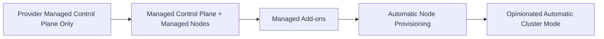

### 13.1 Managed Control Plane Only

You use provider control plane, but manage nodes/add-ons yourself.

Good when:

- you need custom nodes;
- you want strong infrastructure control;
- you have platform maturity;
- you want cloud-managed API server/etcd only.

Risk:

- many day-2 tasks remain yours.

### 13.2 Managed Nodes / Node Pools

Provider helps create and update node groups/pools.

Good when:

- standard VM worker nodes are enough;
- you want lower operational toil;
- you still need node-level control.

Risk:

- you still own sizing, disruption, labels, taints, AMI/image compatibility, and workload placement.

### 13.3 Managed Add-ons

Provider manages versions/installations of certain core add-ons.

Good when:

- you want supported defaults;
- you want simplified upgrade compatibility;
- you prefer provider-integrated lifecycle.

Risk:

- configuration options may be constrained;
- add-on upgrade conflicts can still break workloads;
- you still own integration semantics.

### 13.4 Automatic Node Provisioning

Provider or controller provisions nodes based on pending Pods.

Good when:

- workload shapes vary;
- capacity efficiency matters;
- teams want less node group micromanagement.

Risk:

- bad workload specs can cause bad infrastructure decisions;
- missing requests become expensive or unstable;
- policy guardrails become more important.

### 13.5 Opinionated Automatic Mode

Provider owns larger parts of cluster operations.

Good when:

- platform team wants a paved-road default;
- workloads fit supported patterns;
- speed and safety defaults matter more than deep customization.

Risk:

- fewer escape hatches;
- migration constraints;
- less direct control over low-level infrastructure;
- platform engineers still need to understand the hidden machinery.

---

## 14. When Self-Managed Kubernetes Makes Sense

Self-managed Kubernetes is justified when managed services cannot satisfy a hard requirement.

Examples:

### 14.1 Edge or Disconnected Environments

You may need Kubernetes close to devices, factories, telecom sites, ships, mines, or restricted facilities.

Cloud-managed control plane may be unavailable or unacceptable.

### 14.2 Sovereign or Air-Gapped Requirements

Some environments require no dependency on external cloud APIs.

Self-managed clusters may be necessary for:

- government workloads;
- defense workloads;
- regulated financial workloads;
- isolated manufacturing systems;
- disconnected disaster recovery environments.

### 14.3 Deep Customization

You may need:

- custom API server flags;
- custom scheduler behavior;
- unusual admission plugin configuration;
- custom etcd topology;
- non-standard CNI;
- specialized runtime;
- specialized kernel or hardware integration.

### 14.4 Platform Product Business

If Kubernetes itself is part of your product, you may need deeper ownership.

Examples:

- Kubernetes distribution vendor;
- managed platform provider;
- edge platform product;
- internal cloud provider at massive scale.

### 14.5 Cost at Extreme Scale

At very large scale, some organizations justify self-management to optimize unit economics.

But this only works when operational maturity is very high.

Saving provider fees while increasing outage risk is false economy.

---

## 15. When Managed Kubernetes Should Be Default

Managed Kubernetes should usually be the default when:

- workloads run in public cloud;
- the product team is not in the Kubernetes distribution business;
- control-plane customization is not a core requirement;
- faster time-to-value matters;
- security patches need provider-supported lifecycle;
- the team wants cloud IAM/load-balancer/storage integration;
- the organization wants a supportable platform;
- platform engineers should focus on developer experience and workload reliability.

For most software product teams, the highest-value work is not running etcd.

It is building a safe platform abstraction on top of Kubernetes.

---

## 16. Cluster as a Product

A production Kubernetes cluster should not be treated as a shared server.

It should be treated as a platform product.

A platform product has:

- users;
- APIs;
- guarantees;
- documentation;
- onboarding flow;
- support model;
- operational metrics;
- version lifecycle;
- backward compatibility;
- deprecation policy;
- paved-road templates;
- exception process.

Application teams should not need to understand every CNI detail to deploy a service.

But the platform team absolutely must.

---

## 17. Single Cluster vs Multiple Clusters

Before cloud choice, decide cluster topology.

### 17.1 Single Shared Cluster

Pros:

- simpler initial operation;
- better bin packing;
- easier shared observability;
- fewer cluster-level add-ons;
- lower control-plane overhead.

Cons:

- larger blast radius;
- stronger multi-tenancy requirements;
- noisy neighbor risk;
- complex RBAC/policy design;
- more difficult compliance segmentation.

Good for:

- early platform maturity;
- internal workloads;
- non-regulated shared environments;
- moderate scale.

### 17.2 Cluster per Environment

Example:

- dev cluster;
- staging cluster;
- production cluster.

Pros:

- clear environment isolation;
- safer upgrade testing;
- easier production access control.

Cons:

- still not enough for strong tenant isolation;
- staging may not match production load;
- more duplicated add-ons.

This is the common baseline.

### 17.3 Cluster per Domain or Business Unit

Pros:

- clearer ownership;
- reduced blast radius;
- easier cost allocation;
- better compliance separation.

Cons:

- higher operational overhead;
- more clusters to upgrade;
- more add-ons to manage;
- cross-cluster networking complexity.

Good for mature platform teams.

### 17.4 Cluster per Tenant

Pros:

- strong isolation;
- clean tenant-level recovery;
- simpler noisy-neighbor boundary.

Cons:

- high automation requirement;
- many clusters;
- expensive if not optimized;
- GitOps and fleet management become mandatory.

Good for SaaS platforms with strict isolation requirements.

### 17.5 Cluster per Region

Pros:

- regional resilience;
- lower regional latency;
- regulatory placement;
- controlled failure domains.

Cons:

- global routing complexity;
- data replication complexity;
- release coordination complexity;
- observability federation needed.

Good for high-availability global systems.

---

## 18. Environment Strategy

A mature Kubernetes platform rarely uses only one environment.

A typical progression:

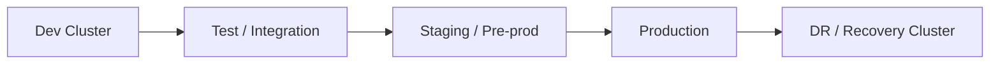

But environment names are not enough.

You need to define:

- what is allowed in each environment;
- whether cloud accounts/subscriptions are separate;
- whether CIDR ranges differ;
- whether IAM identities differ;
- whether cluster add-ons differ;
- whether production has stricter policy;
- whether staging mirrors production topology;
- how data is masked;
- how releases are promoted;
- how rollback is tested.

Bad platform pattern:

> Dev is a playground, staging is fake, production is unique.

Good platform pattern:

> Staging is structurally similar to production, with lower scale and safer data.

---

## 19. Cluster Baseline Architecture

Every cluster should have a baseline.

The baseline is the set of components and policies that exist before any application team deploys.

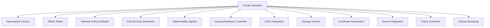

Without a baseline, every team reinvents the platform.

That creates:

- inconsistent security;
- inconsistent observability;
- unpredictable cost;
- operational confusion;
- deployment sprawl;
- undocumented exceptions.

---

## 20. Namespace as a Platform Boundary

A namespace is not a security boundary by itself.

It becomes useful when combined with:

- RBAC;
- ResourceQuota;
- LimitRange;
- NetworkPolicy;
- Pod Security Admission labels;
- workload identity constraints;
- admission policy;
- cost labels;
- observability labels;
- GitOps ownership.

A production namespace should be created by a repeatable platform process.

Example namespace contract:

```yaml
apiVersion: v1
kind: Namespace
metadata:
  name: payments-prod
  labels:
    platform.company.com/environment: prod
    platform.company.com/team: payments
    platform.company.com/data-classification: confidential
    pod-security.kubernetes.io/enforce: restricted
    pod-security.kubernetes.io/audit: restricted
    pod-security.kubernetes.io/warn: restricted
```

Then attach:

- default deny network policies;
- quotas;
- allowed workload identity;
- allowed ingress/gateway routes;
- allowed storage classes;
- team RBAC;
- required labels;
- observability routing.

This is where platform engineering begins.

---

## 21. Cluster API Surface

A Kubernetes cluster exposes many APIs.

Some are built-in.

Some are added by CRDs.

Examples:

| API Surface | Examples |
|---|---|
| Core APIs | Pod, Service, ConfigMap, Secret, Namespace |
| Workload APIs | Deployment, StatefulSet, DaemonSet, Job, CronJob |
| Network APIs | Ingress, Gateway, HTTPRoute, NetworkPolicy |
| Storage APIs | PVC, PV, StorageClass, VolumeSnapshot |
| Policy APIs | ValidatingAdmissionPolicy, Kyverno policies, Gatekeeper constraints |
| Cloud CRDs | AWS Load Balancer Controller resources, Azure workload identity resources |
| GitOps APIs | Argo CD Application, Flux Kustomization |
| Observability APIs | ServiceMonitor, PodMonitor, OpenTelemetryCollector |

Every CRD is an extension of your platform API.

Before installing a CRD, ask:

- Who owns it?
- How is it upgraded?
- How is it backed up?
- What happens if the controller is down?
- What permissions does it need?
- Does it create cloud resources?
- Does it need admission webhooks?
- What is its failure blast radius?

CRDs are powerful. They are also a way to import another control plane into your cluster.

---

## 22. Cluster Lifecycle

Production clusters move through lifecycle stages.

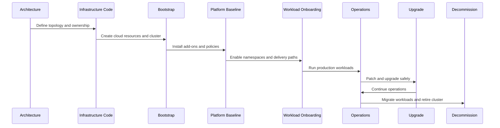

### 22.1 Architecture

Outputs:

- cluster purpose;
- environment;
- region;
- tenancy model;
- network model;
- identity model;
- data classification;
- add-on baseline;
- cost model;
- SLO target;
- recovery target.

### 22.2 Provisioning

Outputs:

- cloud accounts/subscriptions;
- VPC/VNet;
- subnets;
- IAM roles/managed identities;
- security groups/NSGs;
- cluster resource;
- node groups/pools;
- logging/monitoring plumbing.

### 22.3 Bootstrap

Outputs:

- access entries or identity mapping;
- CNI configuration;
- DNS;
- CSI drivers;
- ingress/gateway controller;
- cert manager;
- external secret integration;
- observability agents;
- policy controllers;
- GitOps controller.

### 22.4 Workload Onboarding

Outputs:

- namespace;
- RBAC;
- resource quotas;
- network policies;
- workload identity;
- deployment templates;
- SLO dashboard;
- runbook.

### 22.5 Operations

Outputs:

- alerting;
- incident process;
- capacity review;
- cost review;
- vulnerability review;
- upgrade schedule;
- restore drills.

### 22.6 Decommission

Outputs:

- workload migration;
- DNS cutover;
- data backup;
- secret revocation;
- IAM cleanup;
- cluster deletion;
- audit archive.

---

## 23. Cloud Account / Subscription Topology

Cluster architecture is also cloud account architecture.

Common models:

### 23.1 Single Account / Subscription

Simple, but weak isolation.

Good for:

- experimentation;
- small teams;
- non-production.

Risk:

- production and non-production share too much blast radius.

### 23.2 Account / Subscription per Environment

Common baseline.

Example:

- `platform-dev`;
- `platform-staging`;
- `platform-prod`;
- `security`;
- `shared-network`;
- `observability`.

Good for:

- blast radius control;
- billing separation;
- access control;
- compliance.

### 23.3 Account / Subscription per Domain

Good for large organizations.

Example:

- `payments-prod`;
- `orders-prod`;
- `risk-prod`;
- `analytics-prod`.

This improves ownership but increases platform automation needs.

---

## 24. Network Topology Patterns

Kubernetes cluster architecture must fit cloud network topology.

### 24.1 Public Cluster Endpoint

Pros:

- easy developer/admin access;
- simpler bootstrap;
- lower connectivity complexity.

Cons:

- larger attack surface;
- requires IP allowlisting and strong IAM;
- less desirable for regulated production.

### 24.2 Private Cluster Endpoint

Pros:

- reduced public attack surface;
- better fit for regulated systems;
- forces controlled admin paths.

Cons:

- requires VPN, Direct Connect/ExpressRoute, bastion, private runner, or VPC/VNet peering;
- more complex CI/CD access;
- harder emergency access if poorly designed.

### 24.3 Public Workload Ingress, Private Cluster API

Common production pattern.

- Cluster API private.
- Workloads exposed through controlled ingress/gateway/load balancer.
- Admin access via private network or controlled runner.

### 24.4 Fully Private Workload Cluster

Good for internal systems.

- No public application ingress.
- Private load balancers only.
- Cloud private endpoints for dependencies.

### 24.5 Hybrid Access

Used when on-premises systems must access workloads or cluster APIs.

Requires careful design around:

- routing;
- DNS;
- CIDR overlap;
- firewall rules;
- private endpoints;
- certificate trust;
- latency.

---

## 25. Security Baseline

A production Kubernetes cluster baseline should include at least:

| Area | Baseline |
|---|---|
| API access | Strong IAM/identity provider, least privilege, break-glass path. |
| Kubernetes RBAC | Role-based groups; avoid cluster-admin for humans and CI. |
| Pod Security | Restricted baseline for most namespaces. |
| Network | Default deny per namespace; explicit ingress/egress. |
| Secrets | External secret integration or encrypted Secret handling. |
| Images | Trusted registries, scanning, signing policy where possible. |
| Admission | Policy validation for dangerous configs. |
| Workload identity | Per-workload cloud identity, not node-wide broad permissions. |
| Audit | API audit logs shipped and retained. |
| Runtime | Non-root, restricted capabilities, read-only FS where possible. |

Security must be automated.

A wiki page saying "do not run privileged Pods" is not a control.

---

## 26. Observability Baseline

A production cluster needs observability at multiple levels.

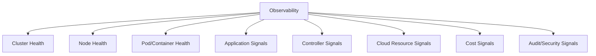

Minimum signals:

- API server request latency/error rates, if exposed by provider;
- node readiness;
- node pressure;
- Pod restarts;
- pending Pods;
- failed scheduling events;
- CoreDNS latency/errors;
- CNI errors;
- CSI errors;
- ingress controller errors;
- HPA behavior;
- cluster autoscaler/provisioner behavior;
- load balancer health;
- application RED metrics;
- cloud API throttling;
- audit log anomalies.

Telemetry without ownership becomes noise.

Every important alert should have:

- owner;
- severity;
- runbook;
- business impact;
- escalation path.

---

## 27. Upgrade Architecture

Managed Kubernetes services have version lifecycles.

You need an upgrade architecture.

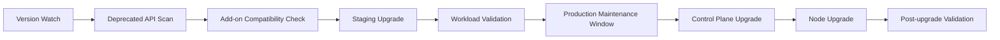

Never treat cluster upgrades as a console click.

Upgrade concerns:

- Kubernetes API removals;
- CRD compatibility;
- admission webhook compatibility;
- CNI compatibility;
- CSI compatibility;
- ingress controller compatibility;
- node image compatibility;
- kubelet skew policy;
- application client library compatibility;
- GitOps controller compatibility;
- observability agent compatibility.

Production readiness means you can upgrade repeatedly without heroics.

---

## 28. Disaster Recovery Architecture

Cluster DR depends on what is inside the cluster.

If the cluster only runs stateless workloads, recovery is mostly:

- recreate cluster;
- bootstrap baseline;
- reapply GitOps state;
- route traffic;
- validate SLO.

If the cluster runs stateful workloads, recovery includes:

- PV snapshots;
- database backups;
- restore ordering;
- consistency guarantees;
- identity and secret restoration;
- DNS cutover;
- application-level verification.

A serious DR design defines:

| Term | Meaning |
|---|---|
| RPO | Maximum acceptable data loss. |
| RTO | Maximum acceptable recovery time. |
| Recovery unit | Workload, namespace, cluster, region, or product. |
| Restore source | Git, backup, snapshot, image registry, secret store. |
| Restore environment | Same region, different region, different account/subscription. |
| Validation | How you prove recovery succeeded. |

A backup you never restore is only a hope.

---

## 29. Cost Architecture

Kubernetes cost is not only node price.

Cost sources:

- control plane fees;
- VM/instance/node cost;
- CPU/memory over-requesting;
- unused node capacity;
- persistent volumes;
- snapshots;
- load balancers;
- NAT gateways;
- data transfer;
- logs ingestion;
- metrics cardinality;
- tracing volume;
- image registry storage/egress;
- cross-AZ traffic;
- managed add-on/service charges.

Cost controls:

- request/limit discipline;
- right-sizing reviews;
- autoscaling;
- Spot/preemptible capacity where safe;
- workload placement;
- namespace/team labels;
- chargeback/showback;
- log retention policies;
- metric cardinality governance;
- cluster consolidation strategy;
- scheduled scale-down for non-prod.

A cluster can be highly available and financially irresponsible.

Top-tier engineers optimize both reliability and cost using explicit trade-offs.

---

## 30. Architecture Documents You Should Produce

For each production cluster or cluster family, produce these documents.

### 30.1 Cluster Architecture Decision Record

Include:

- why Kubernetes;
- why managed vs self-managed;
- why EKS/AKS/other;
- environment strategy;
- region strategy;
- tenancy model;
- network model;
- identity model;
- data plane model;
- add-on model;
- upgrade model;
- DR model;
- known trade-offs.

### 30.2 Cluster Baseline Specification

Include:

- required add-ons;
- required policies;
- default quotas;
- default security posture;
- default observability;
- supported workload types;
- forbidden workload types;
- exception workflow.

### 30.3 Namespace Onboarding Contract

Include:

- team owner;
- environment;
- data classification;
- RBAC groups;
- workload identity;
- quotas;
- network policies;
- ingress rules;
- cost labels;
- SLO expectations.

### 30.4 Upgrade Runbook

Include:

- version target;
- deprecated API scan;
- add-on compatibility;
- staging results;
- production steps;
- rollback/mitigation;
- validation checks.

### 30.5 Incident Runbooks

At minimum:

- Pods stuck Pending;
- ImagePullBackOff spike;
- CoreDNS failure;
- ingress outage;
- CNI IP exhaustion;
- node NotReady storm;
- storage attach failure;
- API access lockout;
- certificate expiration;
- runaway cost.

---

## 31. Decision Matrix

Use this simplified decision matrix.

| Scenario | Preferred Direction |
|---|---|
| Standard SaaS workloads on AWS | EKS managed control plane, managed nodes or Auto Mode depending maturity. |
| Standard SaaS workloads on Azure | AKS managed control plane, node pools or AKS Automatic depending maturity. |
| Need maximum node tuning but not control plane ownership | Managed control plane + custom/self-managed nodes. |
| Need cloud-native IAM/LB/storage integration | Managed Kubernetes. |
| Need air-gapped/edge control | Self-managed or specialized distribution. |
| Need strict per-tenant isolation at scale | Multi-cluster with strong automation. |
| Small team with limited platform staff | Managed/automatic mode; narrow supported workload patterns. |
| Large platform team with heterogeneous workloads | Managed control plane plus carefully designed node pools and platform APIs. |
| Regulated workload | Managed private cluster with strong identity, policy, audit, and network isolation, unless sovereignty requires self-managed. |
| Kubernetes experimentation/research | Self-managed lab cluster, not production default. |

---

## 32. Anti-Patterns

### 32.1 "Managed Means No Platform Team"

Wrong.

Managed Kubernetes reduces infrastructure toil. It does not design your platform.

### 32.2 "One Cluster for Everything"

This usually starts simple and ends with unclear ownership, noisy neighbors, hard upgrades, and security exceptions everywhere.

### 32.3 "Cluster per Team Without Automation"

This creates fleet sprawl.

Many clusters without automation is not maturity. It is entropy.

### 32.4 "Self-Managed for Cost"

Self-managed can be cheaper only if your operational maturity is high enough.

Otherwise, cost moves from cloud bill to incident risk and staff burden.

### 32.5 "Production Cluster as Learning Environment"

Experimentation belongs in isolated environments.

Production should be boring.

### 32.6 "No Clear Add-on Ownership"

If nobody owns the ingress controller, CNI, CSI, DNS, and policy controllers, the platform has hidden single points of failure.

### 32.7 "YAML as the Platform Interface"

Raw YAML is too low-level for most application teams.

A mature platform provides templates, paved roads, policy, and self-service workflows.

---

## 33. Practical Architecture Review Checklist

Use this before approving a cluster design.

### 33.1 Purpose

- [ ] Is the cluster purpose explicit?
- [ ] Is the environment explicit?
- [ ] Is the tenant model explicit?
- [ ] Is the data classification explicit?

### 33.2 Ownership

- [ ] Is control plane ownership clear?
- [ ] Is data plane ownership clear?
- [ ] Is add-on ownership clear?
- [ ] Is namespace ownership clear?
- [ ] Is incident ownership clear?

### 33.3 Network

- [ ] Is CIDR sizing adequate?
- [ ] Are subnets sized for node and Pod growth?
- [ ] Is private/public API access decided?
- [ ] Is egress controlled?
- [ ] Is DNS ownership clear?
- [ ] Is ingress/gateway ownership clear?

### 33.4 Identity

- [ ] Are human access paths explicit?
- [ ] Are CI/CD access paths explicit?
- [ ] Are workload identities scoped per app?
- [ ] Is break-glass access designed?
- [ ] Are audit logs enabled?

### 33.5 Security

- [ ] Is Pod Security baseline enforced?
- [ ] Are privileged workloads controlled?
- [ ] Are default network policies defined?
- [ ] Are secrets externalized or protected?
- [ ] Is admission policy defined?
- [ ] Is image supply-chain policy defined?

### 33.6 Reliability

- [ ] Are node pools spread across AZs?
- [ ] Are critical add-ons highly available?
- [ ] Are PodDisruptionBudgets defined for critical services?
- [ ] Are cluster upgrade steps tested?
- [ ] Are restore drills scheduled?

### 33.7 Cost

- [ ] Are required labels enforced?
- [ ] Are requests/limits required?
- [ ] Is non-prod scale-down defined?
- [ ] Is log/metric retention controlled?
- [ ] Is chargeback/showback possible?

---

## 34. Exercise: Choose an Architecture

You are designing Kubernetes for a payment platform.

Requirements:

- production workloads must run in two regions;
- staging must mirror production structure;
- app teams should not manage cloud IAM directly;
- workloads need access to cloud queues, databases, and secret stores;
- public traffic enters through a WAF and HTTPS gateway;
- internal services must not be exposed publicly;
- compliance requires audit logs and least privilege;
- RTO is 2 hours;
- RPO is 15 minutes for critical data;
- platform team has 5 engineers.

A reasonable answer:

- use managed Kubernetes, not self-managed;
- separate prod and non-prod cloud accounts/subscriptions;
- cluster per region for production;
- private API endpoint;
- public ingress only through controlled gateway/WAF;
- namespace factory per domain/team;
- workload identity templates managed by platform;
- default-deny NetworkPolicy;
- restricted Pod Security;
- GitOps-based delivery;
- managed node groups/node pools or automatic provisioning depending workload fit;
- managed cloud storage for stateful databases where possible, not databases inside Kubernetes by default;
- backup/restore drills for in-cluster state;
- SLO dashboards and incident runbooks.

The key is not the exact tool.

The key is explicit responsibility.

---

## 35. Mental Model Summary

A Kubernetes cluster is a distributed control system plus a cloud infrastructure integration layer.

Managed Kubernetes changes who operates the low-level machinery.

It does not change the need for:

- safe desired state;
- explicit ownership;
- secure identity;
- tested upgrades;
- resilient workload design;
- observability;
- cost control;
- recovery drills.

The highest-level invariant:

> Do not choose Kubernetes architecture by what is possible. Choose it by what your organization can operate safely.

---

## References

- Kubernetes Documentation — Components: https://kubernetes.io/docs/concepts/overview/components/
- Kubernetes Documentation — Cluster Architecture: https://kubernetes.io/docs/concepts/architecture/
- Kubernetes Documentation — Nodes: https://kubernetes.io/docs/concepts/architecture/nodes/
- Kubernetes Documentation — Controllers: https://kubernetes.io/docs/concepts/architecture/controller/
- Kubernetes Documentation — Workloads: https://kubernetes.io/docs/concepts/workloads/
- Kubernetes Documentation — Security: https://kubernetes.io/docs/concepts/security/
- Amazon EKS Best Practices Guide: https://docs.aws.amazon.com/eks/latest/best-practices/introduction.html
- Amazon EKS Architecture: https://docs.aws.amazon.com/eks/latest/userguide/eks-architecture.html
- Azure AKS Baseline Architecture: https://learn.microsoft.com/en-us/azure/architecture/reference-architectures/containers/aks/baseline-aks
- Azure AKS Best Practices: https://learn.microsoft.com/en-us/azure/aks/best-practices
