# Part 014 — AWS EKS Architecture Foundation

> EKS is not "Kubernetes on AWS" in a shallow sense. It is Kubernetes whose control plane, networking, identity, compute, storage, and load-balancing boundaries are deeply shaped by AWS primitives.

This part builds the foundation for production EKS architecture.

We will not yet go deep into EKS VPC networking, EKS Pod Identity, IRSA, Karpenter, or EKS Auto Mode internals. Those have dedicated parts later. Here we build the base map.

By the end, you should understand:

- what AWS manages in EKS;
- what you still own;
- how EKS maps Kubernetes to AWS infrastructure;
- how the control plane and data plane are separated;
- how node groups, Fargate, and Auto Mode differ;
- why VPC design is not optional;
- how IAM access and Kubernetes RBAC interact;
- which add-ons are foundational;
- how to think about production cluster topology.

---

## 1. EKS in One Sentence

Amazon Elastic Kubernetes Service is a managed Kubernetes service where AWS operates the Kubernetes control plane and integrates Kubernetes with AWS compute, networking, IAM, load balancing, storage, and observability services.

That sentence has two implications.

First:

> You do not operate etcd and the Kubernetes control plane hosts directly.

Second:

> You still operate the platform that runs on top of that control plane.

EKS reduces control plane burden. It does not remove architectural responsibility.

---

## 2. EKS System Boundary

A production EKS cluster is not only an `aws eks create-cluster` result.

It is a composition of AWS and Kubernetes resources.

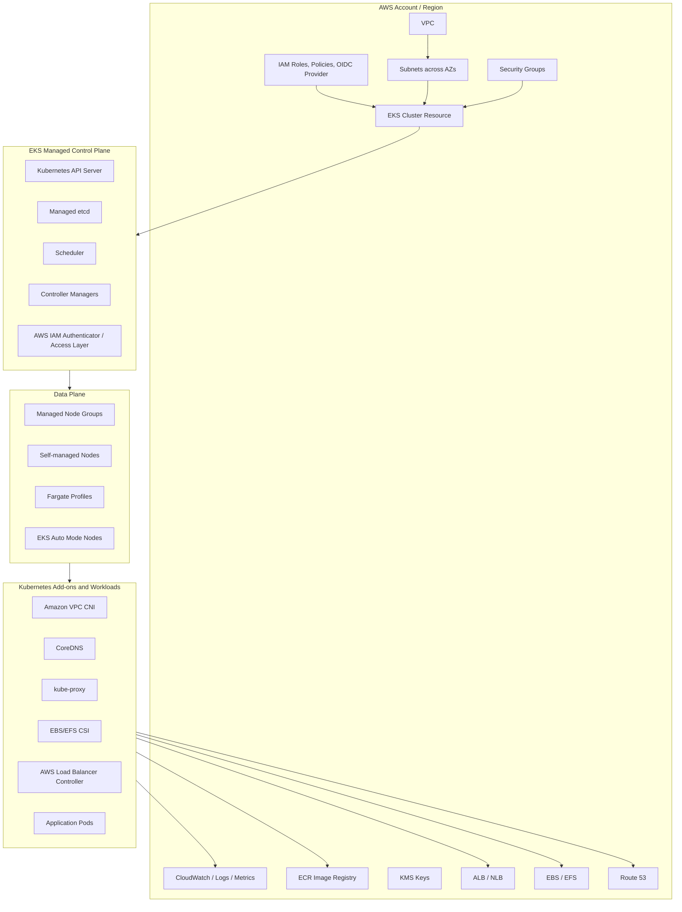

The production design must specify all of these boundaries.

---

## 3. What AWS Manages

AWS manages the EKS control plane.

That includes the hosted Kubernetes control-plane components such as:

- Kubernetes API server;
- etcd backing store;
- control plane availability machinery;
- control plane patching within the EKS lifecycle;
- integration with AWS IAM authentication;
- control plane endpoint exposure;
- parts of logging/audit export capability;
- version support lifecycle;
- integration hooks for EKS add-ons and AWS controllers.

You do not SSH into EKS control-plane nodes.

You do not operate etcd directly.

You do not choose the exact topology of control plane hosts.

This is good.

Most application/platform teams should not spend their scarce engineering time operating Kubernetes control-plane internals unless it is core to their business.

---

## 4. What You Still Own

You still own a large surface.

| Area | Owner |
|---|---|
| VPC and subnet design | You/platform/cloud team |
| IP capacity planning | You/platform/cloud team |
| Cluster endpoint exposure | You |
| Node group/pool strategy unless delegated | You |
| Workload manifests | You/application teams |
| Resource requests/limits | You/application teams/platform policy |
| RBAC design | You |
| IAM permission model | You |
| Workload identity design | You |
| NetworkPolicy design | You |
| Ingress/Gateway strategy | You |
| Add-on configuration | You/shared with AWS if managed add-ons |
| Observability pipeline | You |
| Cost governance | You |
| Upgrade planning | You/shared lifecycle |
| Incident response | You |

The EKS control plane being managed does not prevent bad platform design.

It only gives you a reliable Kubernetes API foundation.

---

## 5. EKS Control Plane Architecture

From the user's perspective, the EKS control plane exposes a Kubernetes API endpoint.

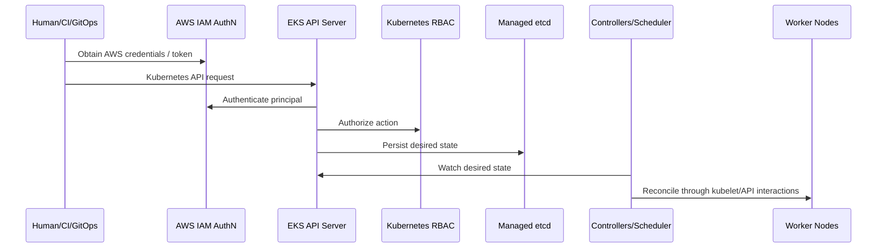

Important invariant:

> EKS authentication starts with AWS identity, but Kubernetes authorization still depends on Kubernetes access/RBAC mapping.

This is a bridge between two systems.

Treat it carefully.

---

## 6. Cluster Endpoint Access

EKS cluster endpoint access can be public, private, or both depending on configuration.

### 6.1 Public Endpoint

Pros:

- easier administrative access;
- simpler bootstrap;
- works from developer machines and SaaS CI runners if allowed.

Cons:

- internet-reachable API endpoint;
- requires strict IAM, RBAC, and allowed CIDR discipline;
- less ideal for regulated production.

### 6.2 Private Endpoint

Pros:

- API reachable only from VPC/private connectivity;
- better production security posture;
- integrates well with private runners, VPN, Direct Connect, bastion, or SSM access.

Cons:

- CI/CD needs private network access;
- break-glass access must be designed;
- bootstrap complexity increases;
- DNS and routing must be correct.

### 6.3 Common Production Pattern

For production:

- private cluster API endpoint where possible;
- public workload ingress only through controlled ALB/NLB/WAF/API Gateway pattern;
- administrative access through VPN/Direct Connect/SSM/private runner;
- break-glass role with audited access;
- no broad public endpoint allowlist.

---

## 7. EKS Data Plane Options

EKS supports multiple ways to run Pods.

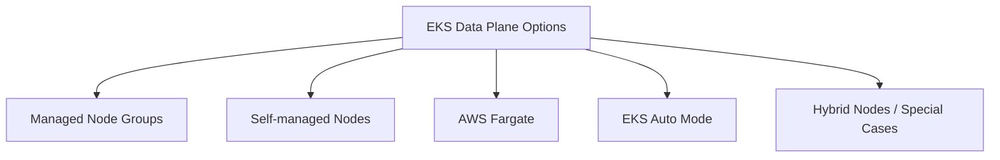

Each is a different operational contract.

---

## 8. Managed Node Groups

Managed Node Groups are the common default for EC2-based EKS workloads.

They give you EC2 worker nodes managed through EKS-integrated lifecycle operations.

Good for:

- general-purpose workloads;
- workloads needing node-level control;
- DaemonSets;
- standard platform add-ons;
- predictable service workloads;
- workloads that need EBS volumes;
- workloads needing custom labels/taints/node selectors.

You still decide:

- instance family;
- capacity type;
- min/max/desired size;
- subnets;
- node IAM role;
- labels;
- taints;
- update strategy;
- launch template customizations where applicable;
- AMI strategy if using custom images;
- workload placement rules.

Managed Node Groups reduce node lifecycle toil.

They do not eliminate node architecture.

### 8.1 Managed Node Group Invariants

A production managed node group should have:

- explicit purpose;
- explicit labels;
- explicit taints if dedicated;
- defined instance types;
- multi-AZ subnet placement;
- node role with minimum required permissions;
- upgrade policy;
- autoscaling integration;
- capacity type decision;
- observability;
- workload disruption plan.

Example conceptual node group taxonomy:

| Node Group | Purpose | Capacity | Taints |
|---|---|---|---|
| `system-ondemand` | Core add-ons | On-Demand | `CriticalAddonsOnly` style pattern, carefully used |
| `general-ondemand` | Baseline services | On-Demand | none |
| `general-spot` | Fault-tolerant stateless workloads | Spot | optional |
| `batch-spot` | Batch/worker jobs | Spot | `workload=batch` |
| `gpu` | ML/GPU workloads | On-Demand/Spot | `hardware=gpu` |
| `stateful` | Stateful workloads needing EBS locality | On-Demand | `workload=stateful` |

The exact taxonomy depends on workload portfolio.

Do not create many node groups without a scheduling reason.

---

## 9. Self-Managed Nodes

Self-managed nodes are EC2 instances you manage outside EKS managed node group lifecycle.

Use when you need:

- custom lifecycle control;
- custom AMIs beyond managed node group constraints;
- unusual bootstrap;
- special kernel/runtime settings;
- unsupported instance patterns;
- deep integration with existing EC2 automation.

Risks:

- more patching responsibility;
- more node upgrade responsibility;
- more bootstrap failure modes;
- more drift risk;
- more operational tooling required.

Self-managed nodes are not wrong.

They are a higher-ownership option.

Use them intentionally.

---

## 10. AWS Fargate for EKS

EKS on Fargate runs Pods without you managing EC2 nodes directly.

You define Fargate profiles that select which Pods should run on Fargate.

Good for:

- simple stateless workloads;
- isolated workloads;
- bursty workloads;
- teams that do not want node management;
- certain serverless operational models.

Limitations and considerations:

- not all DaemonSet-style assumptions work;
- some node-level observability/security agents may not apply normally;
- workload startup/performance/cost patterns differ from EC2 nodes;
- storage/networking capabilities have constraints;
- scheduling is profile-based;
- not ideal for every platform add-on.

Fargate is not "better nodes".

It is a different compute contract.

Use it for workloads that fit that contract.

---

## 11. EKS Auto Mode

EKS Auto Mode is an AWS-managed operating mode that extends AWS management beyond the control plane into more infrastructure responsibilities such as compute provisioning and certain cluster infrastructure behaviors.

The key architectural point:

> Auto Mode shifts more operational responsibility to AWS, but workload intent still drives infrastructure behavior.

If your Pods have bad resource requests, bad topology constraints, bad disruption settings, or unclear workload classes, automatic infrastructure will still make decisions from bad input.

Good for:

- teams wanting a stronger paved road;
- reducing node group management;
- dynamic workload portfolios;
- improving default production posture;
- platform teams that prefer policy and workload abstraction over node micromanagement.

Consider carefully when:

- you require deep custom node control;
- you have unusual networking/runtime requirements;
- you need unsupported DaemonSet or host-level assumptions;
- you need specialized hardware;
- you need migration compatibility with existing node models.

Auto Mode does not remove the need for platform architecture.

It changes the level where platform architecture operates.

Instead of designing many node groups manually, you design:

- workload classes;
- requests/limits discipline;
- placement constraints;
- policy guardrails;
- cost controls;
- exceptions.

---

## 12. Node Model Selection

Use this matrix.

| Requirement | Better Fit |
|---|---|
| General workloads with node-level control | Managed Node Groups |
| Full custom EC2 lifecycle | Self-managed nodes |
| Stateless simple workloads, no node ops | Fargate |
| Dynamic workloads, less node planning | EKS Auto Mode / Karpenter-style provisioning |
| GPU/special hardware | Managed/self-managed node groups, or supported Auto Mode path if available |
| Heavy DaemonSet dependency | EC2 nodes |
| Strict host-level hardening | Custom managed/self-managed nodes |
| Platform wants few knobs for app teams | Auto Mode or tightly governed managed node groups |

Avoid mixing all models casually.

A cluster with managed nodes, self-managed nodes, Fargate, Auto Mode, many ingress controllers, and unmanaged add-ons can become operationally confusing.

Start with a narrow model.

Expand only when a real workload requirement justifies it.

---

## 13. VPC Foundation

EKS networking is VPC-shaped.

A typical production EKS VPC includes:

- multiple Availability Zones;
- private subnets for worker nodes;
- public subnets for internet-facing load balancers, if needed;
- NAT gateways or private egress alternatives;
- VPC endpoints for AWS APIs where appropriate;
- route tables;
- security groups;
- subnet tags for load balancer discovery;
- enough IP address capacity for nodes and Pods;
- optionally secondary CIDR ranges for Pod scaling.

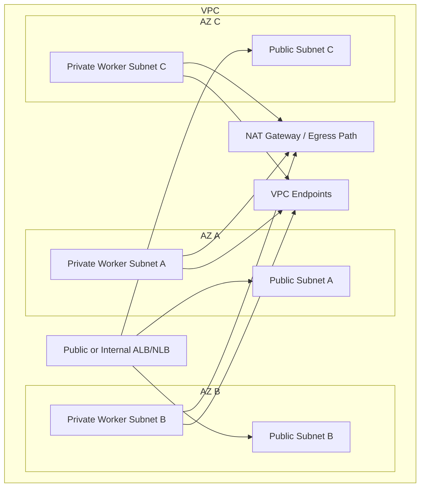

The VPC is not a deployment detail.

It determines:

- pod density;
- IP exhaustion risk;
- load balancer placement;
- public/private exposure;
- egress cost;
- cross-AZ cost;
- security group model;
- private service access;
- DNS behavior;
- hybrid connectivity.

---

## 14. Amazon VPC CNI Mental Model

The default EKS networking model uses the Amazon VPC CNI plugin.

The essential idea:

> Pods receive IP addresses from the VPC, not from an opaque overlay address space.

That means Pods are first-class citizens in the AWS network model.

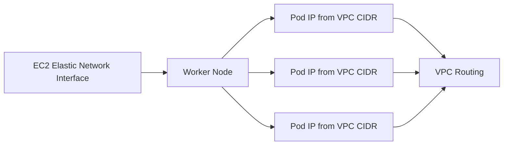

Advantages:

- direct VPC-routable Pod IPs;
- easier integration with AWS network primitives;
- no default overlay encapsulation assumption;
- cloud-native security/routing possibilities.

Trade-offs:

- subnet IP exhaustion becomes a real platform risk;
- instance type affects pod density;
- ENI/IP warm pool behavior matters;
- multi-AZ subnet planning matters;
- scale planning must include Pod count, not only node count.

Part 016 will go much deeper.

For now, remember this invariant:

> In EKS with VPC CNI, Kubernetes scheduling and AWS subnet IP capacity are linked.

A Pod can be schedulable by CPU/memory but still fail because the node or subnet cannot allocate a Pod IP.

---

## 15. Subnet Sizing

Subnet sizing is one of the easiest EKS mistakes to make early and one of the most painful to fix later.

You need IP capacity for:

- worker node primary interfaces;
- Pod IPs;
- load balancers;
- NAT gateways;
- VPC endpoints;
- future growth;
- blue/green clusters;
- surge capacity during upgrades;
- temporarily duplicated workloads during migration.

Bad pattern:

> "We have enough IPs for nodes."

Better pattern:

> "We have enough IPs for nodes, Pods, load balancers, upgrade surge, autoscaling bursts, and future environments."

When designing production EKS, avoid tiny subnets.

IP shortage creates failure modes such as:

- Pods stuck Pending or ContainerCreating;
- CNI cannot assign IP;
- node scale-out succeeds but Pods cannot start;
- upgrade surge fails;
- load balancer creation fails;
- emergency scaling fails during incidents.

---

## 16. Public and Private Subnets

Common EKS production pattern:

| Subnet Type | Purpose |
|---|---|
| Public subnets | Internet-facing ALB/NLB, NAT gateways, public edge components. |
| Private subnets | Worker nodes, internal load balancers, private workloads. |
| Isolated/private service subnets | Sometimes used for database or regulated dependencies. |

Most production worker nodes should run in private subnets.

Public worker nodes increase attack surface and usually indicate a weak design.

Expose workloads through controlled load balancers/gateways, not by placing nodes directly on public subnets.

---

## 17. Security Groups

Security groups exist at multiple EKS-related layers:

- cluster security group;
- node security group;
- load balancer security group;
- security groups for Pods, when used;
- database/dependency security groups;
- VPC endpoint security groups.

Security group design should answer:

- who can reach the API server?
- can nodes reach the control plane?
- can the control plane reach kubelets/webhooks if needed?
- can load balancers reach node targets or Pod targets?
- can Pods reach required AWS services?
- can workloads reach databases?
- can observability agents reach collectors?

Do not treat security groups and NetworkPolicy as substitutes.

They operate at different layers.

| Control | Layer | Typical Scope |
|---|---|---|
| Security Group | AWS VPC networking | ENI/resource-level traffic |
| NetworkPolicy | Kubernetes Pod traffic | Pod/namespace-level traffic |
| RBAC | Kubernetes API | Object access |
| IAM | AWS API | Cloud resource access |

A mature EKS platform uses all of them deliberately.

---

## 18. Load Balancing Foundation

EKS workloads can be exposed using AWS load balancers through Service and Ingress/Gateway controllers.

Common options:

| Pattern | AWS Resource | Typical Use |
|---|---|---|
| Service type `LoadBalancer` | NLB or CLB depending controller/config | L4 TCP/UDP or simple exposure |
| Ingress via AWS Load Balancer Controller | ALB | HTTP/HTTPS host/path routing |
| Gateway API via supported controller | ALB or newer gateway implementation depending controller | More expressive traffic ownership |
| Internal load balancer | Internal ALB/NLB | Private service exposure |

Key decisions:

- ALB vs NLB;
- internet-facing vs internal;
- instance target vs IP target;
- TLS termination location;
- WAF integration;
- cross-zone load balancing;
- health check path;
- ingress ownership;
- DNS automation;
- certificate automation.

Do not let every team create arbitrary public load balancers.

Ingress is a platform boundary.

---

## 19. IAM and Kubernetes Access

EKS authentication integrates AWS IAM with Kubernetes API access.

Historically, this often involved the `aws-auth` ConfigMap.

Modern EKS supports access entries as the recommended direction for managing IAM principal access to clusters.

Important distinction:

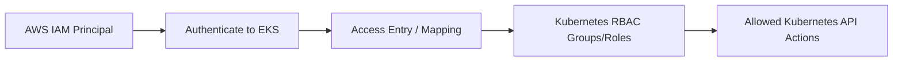

IAM proves who you are to AWS/EKS.

Kubernetes RBAC determines what you can do inside Kubernetes.

This must be explicit.

### 19.1 Human Access Principles

- Use roles, not long-lived IAM users.
- Prefer federated identity through IAM Identity Center or enterprise identity provider.
- Use least privilege groups.
- Avoid direct `cluster-admin` except break-glass.
- Audit access changes.
- Separate read-only, developer, operator, and admin roles.
- Use short-lived credentials.

### 19.2 CI/CD Access Principles

- CI should not use human admin credentials.
- CI should have environment-scoped roles.
- GitOps controller should have tightly scoped permissions.
- Production deploy rights should be explicit and audited.
- Avoid one global deployment role for all clusters.

### 19.3 Break-Glass Access

Production clusters need break-glass access.

But break-glass should be:

- documented;
- auditable;
- time-bound;
- protected by MFA/approval;
- tested;
- not used as normal operations.

---

## 20. Workload Identity Foundation

Do not give broad AWS permissions to node IAM roles and let all Pods inherit them.

That is a classic blast-radius mistake.

Better pattern:

> Each workload gets only the AWS permissions it needs.

In EKS, workload identity is usually handled with:

- EKS Pod Identity;
- IAM Roles for Service Accounts (IRSA);
- careful migration/compatibility planning.

We will deep dive this in Part 021.

For now, the invariant:

> Node role is infrastructure identity. Workload identity should be application-specific.

Bad:

```text
all pods on node can indirectly access broad S3/DynamoDB/SQS permissions
```

Better:

```text
service-account orders-api -> role orders-api-prod -> only required SQS queue and KMS key
service-account billing-worker -> role billing-worker-prod -> only required S3 prefix and DynamoDB table
```

---

## 21. EKS Add-ons

EKS clusters rely on several core add-ons.

Common foundational add-ons:

| Add-on | Purpose |
|---|---|
| Amazon VPC CNI | Pod networking with VPC IPs. |
| CoreDNS | Cluster DNS. |
| kube-proxy | Service networking rules unless replaced by another dataplane. |
| EBS CSI Driver | EBS volume provisioning and attachment. |
| EFS CSI Driver | EFS file storage integration. |
| AWS Load Balancer Controller | ALB/NLB management from Kubernetes resources. |
| ExternalDNS | DNS record automation, often with Route 53. |
| cert-manager | Certificate lifecycle automation. |
| metrics-server | Resource metrics for HPA and kubectl top. |
| ADOT / observability agents | Metrics/traces/logs collection. |
| policy controller | Kyverno/Gatekeeper/admission policies. |

Managed add-ons can reduce lifecycle burden for supported components, but configuration and compatibility still matter.

For every add-on, define:

- owner;
- installation method;
- version pinning strategy;
- upgrade procedure;
- IAM permissions;
- resource requests;
- HA settings;
- dashboards;
- alerts;
- rollback strategy.

---

## 22. CoreDNS as a Critical Service

CoreDNS failure is application failure.

Symptoms:

- services cannot resolve each other;
- external dependencies fail by DNS name;
- Pods seem healthy but requests fail;
- intermittent latency due to DNS retries;
- thundering herd under high query load.

Production guidance:

- run multiple replicas;
- set resource requests;
- use topology spread where appropriate;
- monitor query latency/errors;
- avoid excessive search path behavior from applications;
- consider NodeLocal DNSCache for high-scale clusters;
- include CoreDNS in upgrade testing.

DNS is not boring when it fails.

---

## 23. kube-proxy and Service Dataplane

kube-proxy maintains node-level networking rules for Kubernetes Services in the default model.

In some advanced clusters, eBPF-based dataplanes or alternative CNIs may change this picture.

For EKS foundation, know this:

- Service traffic depends on node dataplane behavior;
- kube-proxy version compatibility matters;
- misconfigured kube-proxy can break ClusterIP/NodePort routing;
- observability of service routing is important;
- replacement dataplanes are architecture decisions, not casual optimizations.

Do not replace fundamental dataplane components unless you understand the failure model.

---

## 24. Storage Foundation

EKS integrates with AWS storage through CSI drivers.

Common storage options:

| Storage | Kubernetes Fit | Notes |
|---|---|---|
| EBS | Block storage for single-node mounted volumes | AZ-bound, common for StatefulSets. |
| EFS | Shared file storage | Multi-AZ file access, different performance model. |
| FSx variants | Specialized file systems | Workload-specific. |
| S3 | Object storage, not POSIX volume by default | Best accessed through application SDK or specific patterns. |

Key production principles:

- Prefer managed databases outside Kubernetes for critical databases unless there is a strong reason.
- Understand EBS AZ affinity.
- Use `WaitForFirstConsumer` where relevant.
- Design backup/restore.
- Encrypt volumes with KMS where required.
- Monitor attach/mount failures.
- Do not assume PVC equals backup.

---

## 25. Image Registry Foundation

ECR is the natural AWS registry for EKS workloads.

Production concerns:

- private repositories;
- image scanning;
- immutable tags or digest pinning;
- lifecycle policies;
- cross-account access;
- cross-region replication;
- pull-through cache where useful;
- admission policy for allowed registries;
- deployment by digest for high assurance.

Bad:

```yaml
image: my-api:latest
```

Better:

```yaml
image: 123456789012.dkr.ecr.ap-southeast-1.amazonaws.com/orders-api@sha256:...
```

Tags are human-friendly.

Digests are deployment truth.

---

## 26. Logging and Observability Foundation

EKS observability usually integrates with some combination of:

- CloudWatch Logs;
- CloudWatch Container Insights;
- Amazon Managed Service for Prometheus;
- Amazon Managed Grafana;
- AWS Distro for OpenTelemetry;
- OpenTelemetry Collector;
- third-party observability platforms;
- Fluent Bit or similar log agents.

Signals should cover:

- node health;
- Pod restarts;
- pending Pods;
- CNI errors;
- CoreDNS errors;
- ingress/controller errors;
- application RED metrics;
- AWS load balancer target health;
- AWS API throttling;
- cost and utilization;
- audit logs.

Do not build an EKS platform where the only debugging tool is `kubectl logs`.

---

## 27. Audit and Control Plane Logging

EKS can expose control plane log types such as API, audit, authenticator, controller manager, and scheduler logs depending on configuration.

Production clusters should treat these as security and operations evidence.

Use them to answer:

- who changed what?
- which identity accessed the API?
- are there forbidden access attempts?
- are controllers failing?
- are API requests being throttled or rejected?
- did a CI/CD identity perform unexpected writes?

Control plane logs have cost.

But lack of audit during incident response costs more.

Design retention and filtering deliberately.

---

## 28. Cluster Creation Inputs

A production EKS cluster creation should define at least:

```yaml
cluster:
  name: prod-platform-ap-southeast-1
  region: ap-southeast-1
  version: "1.xx"
  endpointAccess:
    public: false
    private: true
  logging:
    api: true
    audit: true
    authenticator: true
    controllerManager: true
    scheduler: true
  vpc:
    id: vpc-...
    privateSubnets:
      - subnet-a
      - subnet-b
      - subnet-c
    publicSubnets:
      - subnet-public-a
      - subnet-public-b
      - subnet-public-c
  encryption:
    secretsKmsKey: arn:aws:kms:...
  access:
    mode: API
  addons:
    - vpc-cni
    - coredns
    - kube-proxy
    - aws-ebs-csi-driver
```

This is conceptual, not a complete provider-specific schema.

The point is to make cluster intent explicit.

---

## 29. Infrastructure as Code

Do not create production EKS clusters manually.

Use infrastructure as code.

Common options:

- Terraform;
- AWS CDK;
- Pulumi;
- eksctl for simpler workflows or bootstrap;
- Crossplane/Cluster API in advanced platform scenarios.

IaC should manage:

- VPC/subnets/security groups;
- IAM roles/policies;
- EKS cluster;
- access entries;
- node groups;
- managed add-ons;
- KMS keys;
- logging;
- OIDC provider/workload identity plumbing;
- baseline cloud resources.

GitOps should manage in-cluster platform state:

- namespaces;
- RBAC;
- NetworkPolicies;
- admission policies;
- add-on Helm releases where not managed by IaC;
- workload definitions.

A clean split:

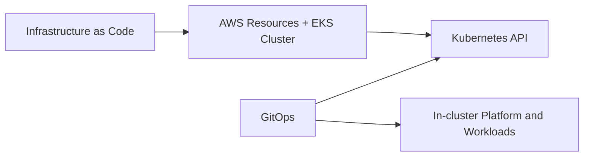

Avoid unclear ownership where Terraform and Argo CD fight over the same object.

---

## 30. Cluster Bootstrap Sequence

A practical EKS bootstrap sequence:

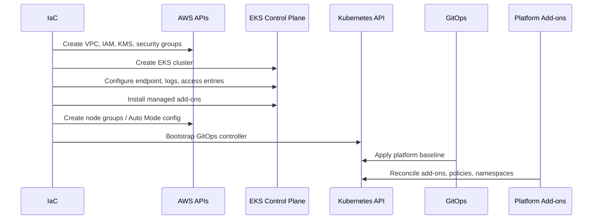

Bootstrap must be repeatable.

If a cluster cannot be recreated from code, your DR story is weak.

---

## 31. EKS Production Cluster Baseline

A reasonable baseline includes:

### 31.1 AWS Layer

- separate production account;
- multi-AZ VPC;
- private worker subnets;
- controlled public ingress subnets;
- KMS keys;
- VPC endpoints where appropriate;
- IAM roles by function;
- access entries;
- audit/control plane logs;
- ECR repositories;
- Route 53 hosted zones/delegation;
- WAF where public ingress exists.

### 31.2 EKS Layer

- supported Kubernetes version;
- private endpoint for production where possible;
- managed add-ons for core components where suitable;
- managed node groups or Auto Mode baseline;
- Pod Security Admission labels;
- ResourceQuota/LimitRange templates;
- default-deny NetworkPolicy templates;
- workload identity integration;
- observability agents;
- ingress/gateway controller;
- certificate automation;
- external secrets integration;
- policy-as-code controller;
- GitOps controller.

### 31.3 Workload Layer

- explicit resource requests;
- readiness/liveness/startup probes;
- non-root runtime;
- least-privilege service account;
- narrow IAM role;
- NetworkPolicy;
- PDB for critical services;
- topology spread constraints;
- structured logs;
- application metrics;
- SLO dashboard;
- runbook.

---

## 32. EKS Multi-AZ Design

EKS production clusters should use multiple Availability Zones.

Multi-AZ design affects:

- worker node placement;
- load balancer subnet mapping;
- StatefulSet volume placement;
- topology spread constraints;
- PodDisruptionBudgets;
- cross-AZ traffic cost;
- failure tolerance;
- capacity availability.

Example topology spread:

```yaml
apiVersion: apps/v1
kind: Deployment
metadata:
  name: orders-api
spec:
  replicas: 6
  selector:
    matchLabels:
      app: orders-api
  template:
    metadata:
      labels:
        app: orders-api
    spec:
      topologySpreadConstraints:
        - maxSkew: 1
          topologyKey: topology.kubernetes.io/zone
          whenUnsatisfiable: ScheduleAnyway
          labelSelector:
            matchLabels:
              app: orders-api
      containers:
        - name: app
          image: example.com/orders-api@sha256:...
          resources:
            requests:
              cpu: "250m"
              memory: "512Mi"
```

For critical services, prefer even spread.

For cost-sensitive services, trade-offs may differ.

---

## 33. EKS Upgrade Foundation

EKS upgrades involve multiple layers:

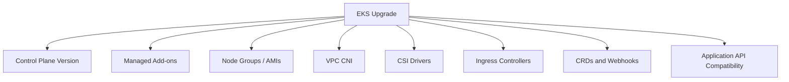

Do not upgrade only the control plane and declare victory.

A production upgrade plan includes:

- target version selection;
- support window review;
- deprecated API scan;
- add-on compatibility matrix;
- staging upgrade;
- node group rolling upgrade;
- workload disruption review;
- PDB validation;
- ingress validation;
- storage validation;
- rollback/mitigation plan;
- post-upgrade smoke test.

---

## 34. EKS Security Foundation

Minimum security posture:

| Layer | Control |
|---|---|
| AWS account | Separate prod account, SCPs if using Organizations. |
| IAM | Least privilege roles, no long-lived admin users. |
| Cluster access | Access entries, RBAC, break-glass design. |
| API endpoint | Private where possible, public CIDR restriction if public. |
| Secrets | KMS encryption, external secrets, limited RBAC. |
| Workload identity | Per-service role, not broad node role. |
| Pod runtime | Non-root, restricted capabilities, read-only filesystem where possible. |
| Network | Security groups + NetworkPolicies. |
| Ingress | WAF/TLS/certificate automation. |
| Audit | Control plane and CloudTrail logging. |
| Supply chain | ECR scanning, signed images where adopted, admission policy. |

Security is not a single feature.

It is a layered model.

---

## 35. EKS Failure Modes

Production engineers must know how EKS fails.

| Failure | Typical Cause | First Checks |
|---|---|---|
| Pods stuck Pending | CPU/memory shortage, constraints, no nodes | `kubectl describe pod`, events, node capacity |
| Pods stuck ContainerCreating | CNI IP allocation, volume mount, image sandbox | CNI logs, node events, PVC events |
| ImagePullBackOff | ECR auth, wrong image, missing repo, network egress | Pod events, ECR policy, node IAM, VPC endpoints/NAT |
| Service unreachable | selector mismatch, endpoint issue, kube-proxy/dataplane | Service, EndpointSlice, Pod labels |
| Ingress 503 | target health check mismatch, readiness, controller config | ALB target group, ingress controller logs |
| DNS failures | CoreDNS down/throttled, network policy, node DNS | CoreDNS logs/metrics, `nslookup` in Pod |
| Nodes NotReady | kubelet/runtime/network/node OS | node describe, SSM/EC2 health, kubelet logs |
| CNI IP exhaustion | subnet/ENI/IP shortage | CNI logs, subnet free IPs, node instance limits |
| PVC pending | StorageClass/topology/CSI issue | PVC events, CSI controller logs |
| Access denied to AWS service | wrong workload identity/IAM policy | Pod service account, role trust policy, CloudTrail |
| Access denied to Kubernetes API | access entry/RBAC issue | auth mode, role binding, access entry |

The top-tier habit:

> Debug from desired state to controller to cloud resource, not randomly from symptoms.

---

## 36. EKS Architecture Anti-Patterns

### 36.1 Tiny VPC CIDR

Works in dev. Fails in production scale.

### 36.2 Public Worker Nodes

Usually unnecessary and increases risk.

### 36.3 One Node Role With Broad Permissions

Creates cross-workload AWS blast radius.

### 36.4 Everyone Is Cluster Admin

Fast today, catastrophic later.

### 36.5 Unmanaged Add-on Sprawl

Random Helm installs with no ownership become platform landmines.

### 36.6 No Upgrade Calendar

EKS/Kubernetes versions have support windows. Ignoring them causes forced, risky upgrades later.

### 36.7 All Workloads on Spot

Spot is powerful, but not every workload is interruption-tolerant.

### 36.8 No Egress Design

NAT costs explode. Private service access breaks. Security teams lose visibility.

### 36.9 GitOps Without Admission Guardrails

GitOps can consistently apply bad state.

Automation amplifies both good and bad intent.

---

## 37. Example Reference Architecture

A reasonable production EKS architecture for a medium platform:

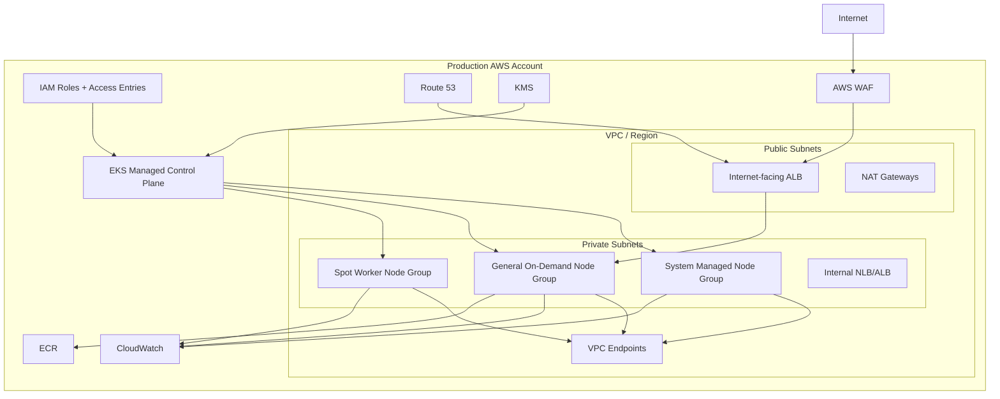

Baseline choices:

- EKS managed control plane;
- private worker nodes;
- multi-AZ subnets;
- access entries for admin/operator/developer roles;
- per-workload identity;
- managed add-ons for VPC CNI/CoreDNS/kube-proxy/EBS CSI where suitable;
- AWS Load Balancer Controller;
- public ALB only at edge;
- internal load balancer for private APIs;
- CloudWatch/control plane logs;
- GitOps platform baseline;
- policy-as-code;
- namespace factory.

---

## 38. Production Readiness Checklist

### 38.1 AWS Foundation

- [ ] Cluster runs in correct AWS account.
- [ ] VPC CIDR has enough capacity.
- [ ] Subnets span at least three AZs where region supports it.
- [ ] Worker nodes run in private subnets.
- [ ] Public subnets are only for edge resources where needed.
- [ ] NAT/private egress is intentionally designed.
- [ ] VPC endpoints are considered for AWS APIs.
- [ ] KMS keys are defined.
- [ ] CloudTrail and relevant logs are enabled.

### 38.2 EKS Control Plane

- [ ] Kubernetes version is within support window.
- [ ] Endpoint access is intentional.
- [ ] Control plane logs are configured.
- [ ] Access entries/RBAC are defined.
- [ ] Break-glass access exists and is audited.
- [ ] Cluster creator dependency is avoided/documented.

### 38.3 Data Plane

- [ ] Node model is explicitly chosen.
- [ ] Node groups have clear purpose.
- [ ] System and application workloads are separated where needed.
- [ ] Node IAM roles are least-privilege.
- [ ] Autoscaling strategy is defined.
- [ ] Spot usage is limited to interruption-tolerant workloads.
- [ ] Node upgrade strategy is tested.

### 38.4 Add-ons

- [ ] VPC CNI version/owner defined.
- [ ] CoreDNS HA/resources defined.
- [ ] kube-proxy version/owner defined.
- [ ] CSI drivers installed and monitored.
- [ ] Ingress/load-balancer controller installed and monitored.
- [ ] metrics-server installed.
- [ ] observability agents installed.
- [ ] policy controller installed.
- [ ] add-on upgrade procedure exists.

### 38.5 Workload Platform

- [ ] Namespace factory exists.
- [ ] ResourceQuota/LimitRange templates exist.
- [ ] Pod Security standards enforced.
- [ ] NetworkPolicy baseline exists.
- [ ] Workload identity template exists.
- [ ] Required labels enforced.
- [ ] GitOps workflow defined.
- [ ] SLO dashboards exist.
- [ ] Incident runbooks exist.

---

## 39. Hands-On Lab: Design an EKS Cluster

Design an EKS cluster for this scenario:

- region: `ap-southeast-1`;
- environment: production;
- workload: Java APIs, background workers, Kafka clients, Redis clients;
- stateful data: managed AWS databases, not in-cluster databases;
- traffic: public HTTPS APIs and internal services;
- compliance: audit logs required;
- cost: Spot allowed for workers, not for critical APIs;
- team: platform team owns cluster, app teams own workloads.

Deliverables:

1. AWS account strategy.
2. VPC subnet strategy.
3. Cluster endpoint strategy.
4. Node group strategy.
5. Ingress strategy.
6. Workload identity strategy.
7. Add-on list.
8. Security baseline.
9. Observability baseline.
10. Upgrade plan.

A strong answer might include:

- separate production AWS account;
- three-AZ VPC;
- private worker subnets;
- public subnets for ALB/NAT only;
- private EKS endpoint with private CI runner;
- managed node groups: system on-demand, general on-demand, worker spot;
- AWS Load Balancer Controller with ALB + WAF;
- internal NLB/ALB for private services;
- EKS access entries mapped to RBAC;
- per-workload Pod Identity/IRSA;
- managed add-ons for VPC CNI/CoreDNS/kube-proxy/EBS CSI;
- CloudWatch/Prometheus/OpenTelemetry pipeline;
- default-deny NetworkPolicy;
- Pod Security restricted;
- GitOps bootstrap;
- quarterly upgrade rehearsal.

---

## 40. Mental Model Summary

EKS is a managed Kubernetes control plane plus AWS-native infrastructure integration.

The correct mental model:

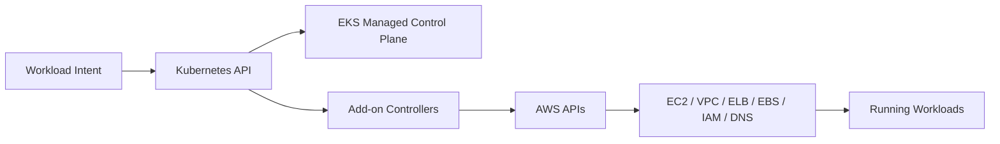

Your workload intent creates AWS infrastructure effects through Kubernetes controllers.

Therefore:

- bad manifests can create bad AWS resources;
- bad IAM can create excessive blast radius;
- bad VPC design can block Pods;
- bad probes can break load balancer health;
- bad requests can break autoscaling;
- bad add-on ownership can break the whole platform.

The production invariant:

> EKS makes the Kubernetes control plane reliable. Your platform design determines whether the system is operable.

---

## References

- Amazon EKS Architecture: https://docs.aws.amazon.com/eks/latest/userguide/eks-architecture.html
- Amazon EKS Best Practices Guide: https://docs.aws.amazon.com/eks/latest/best-practices/introduction.html
- Amazon EKS Data Plane Best Practices: https://docs.aws.amazon.com/eks/latest/best-practices/data-plane.html
- Amazon EKS Auto Mode Best Practices: https://docs.aws.amazon.com/eks/latest/best-practices/automode.html
- Amazon EKS Auto Mode User Guide: https://docs.aws.amazon.com/eks/latest/userguide/automode.html
- Amazon EKS VPC and Subnet Considerations: https://docs.aws.amazon.com/eks/latest/best-practices/subnets.html
- Amazon EKS VPC CNI: https://docs.aws.amazon.com/eks/latest/userguide/managing-vpc-cni.html
- Amazon EKS Access Entries: https://docs.aws.amazon.com/eks/latest/userguide/access-entries.html
- Amazon EKS aws-auth ConfigMap Deprecation Notice: https://docs.aws.amazon.com/eks/latest/userguide/auth-configmap.html
- Kubernetes Documentation — Components: https://kubernetes.io/docs/concepts/overview/components/
- Kubernetes Documentation — Services, Load Balancing, and Networking: https://kubernetes.io/docs/concepts/services-networking/
