# Part 015 — Azure AKS Architecture Foundation

AKS looks simple from the outside: create a cluster, deploy workloads, expose services.

Production AKS is not that.

Production AKS is a set of design decisions around **who owns the control plane, who owns node lifecycle, where identity lives, how traffic enters and leaves, how Azure services are consumed, how policy is enforced, how upgrades are rehearsed, and how failure is contained**.

This part is the AKS counterpart to the previous EKS foundation. The goal is not to memorize every Azure feature. The goal is to build a durable mental model so that when you see an AKS cluster, you can immediately reason about:

- what Azure manages;
- what the platform team must still manage;
- what the application team should never need to manage;
- which defaults are safe;
- which defaults are dangerous at scale;
- where blast radius hides.

AKS is not just Kubernetes on Azure VMs. It is Kubernetes embedded into Azure's identity, networking, load balancing, private connectivity, policy, monitoring, registry, and governance systems.

---

## 1. The Core Mental Model

AKS has three layers:

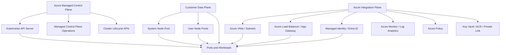

In a production conversation, do not ask only:

> “Is this AKS?”

Ask:

> “Which AKS operating model are we using, which network model owns pod IPs, which identity boundary is used, where is the ingress/egress boundary, which team owns node pool upgrades, and which Azure controls enforce guardrails?”

That is the difference between a cluster and a platform.

---

## 2. AKS Standard vs AKS Automatic

Modern AKS has two broad operating modes:

| Mode | Main Idea | Best Fit | Platform Responsibility |
|---|---|---|---|
| AKS Automatic | Azure applies production-oriented defaults and automates more of the operational surface | Teams that want less infrastructure decision burden | Less node/network/add-on tuning, more workload/platform-policy focus |
| AKS Standard | You control cluster configuration and node pools directly | Enterprises with specific network, compliance, cost, or automation requirements | More explicit ownership of node pools, networking, add-ons, upgrade behavior |

This series mostly teaches AKS Standard foundations because that builds your actual architecture muscle. AKS Automatic is easier to consume after you understand the choices it hides.

### The practical difference

AKS Automatic compresses many platform decisions into managed defaults:

- managed virtual network defaults;
- Azure CNI Overlay powered by Cilium in modern guidance;
- managed ingress/application routing defaults;
- managed egress NAT defaults;
- production-oriented node management;
- opinionated namespace and policy affordances.

AKS Standard exposes more knobs:

- custom VNet/subnet design;
- explicit node pools;
- explicit ingress controller choices;
- explicit egress model;
- explicit monitoring and add-on choices;
- explicit upgrade and surge behavior;
- explicit identity and governance integration.

### The invariant

AKS Automatic reduces accidental misconfiguration, but it does not remove architecture responsibility.

You still own:

- application readiness;
- resource requests;
- rollout safety;
- data boundaries;
- secret usage;
- SLOs;
- dependency behavior;
- namespace and tenancy model;
- regulatory defensibility;
- incident response.

A managed platform can manage nodes. It cannot manage your domain failure model.

---

## 3. Managed Control Plane Boundary

AKS offloads the Kubernetes control plane operation to Azure. Azure creates and manages the API server and associated control plane components. You interact with Kubernetes through `kubectl` and Azure through `az aks` / ARM / Bicep / Terraform / Azure Portal.

But “managed control plane” does not mean “no responsibility”.

### Azure owns

- provisioning and operating the Kubernetes control plane;
- high availability of the managed API plane according to service model;
- control plane patching mechanics;
- integration with Azure resource provider APIs;
- cluster lifecycle APIs;
- managed add-on lifecycle where enabled.

### You still own

- Kubernetes version selection within supported range;
- upgrade planning and testing;
- deprecated API removal;
- node pool lifecycle;
- add-on compatibility;
- RBAC and identity design;
- namespace boundaries;
- workload behavior;
- VNet/subnet sizing when using custom networking;
- ingress/egress security posture;
- policy exceptions;
- backup/restore design.

### Dangerous assumption

> “Azure manages AKS, so upgrades are safe.”

Better model:

> “Azure can orchestrate cluster upgrade mechanics. I must prove my workloads, admission policies, CRDs, controllers, add-ons, node images, and APIs survive that upgrade.”

---

## 4. The AKS Resource Graph

An AKS cluster is not one thing. It is a graph of Azure and Kubernetes resources.

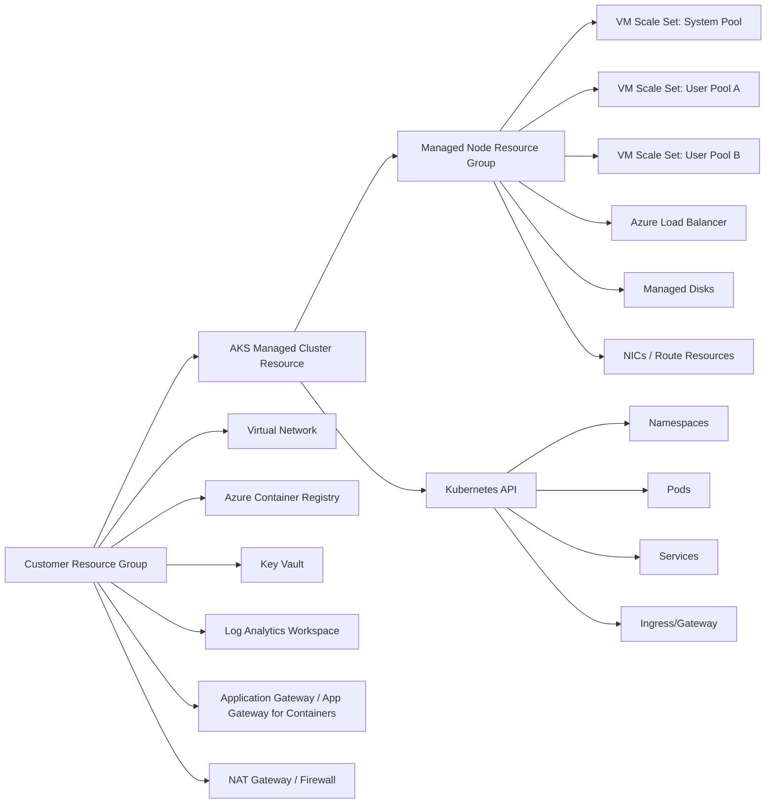

### Important boundary: node resource group

AKS commonly creates a separate managed node resource group for infrastructure resources such as VM scale sets, load balancers, disks, NICs, and related objects.

Production rule:

> Treat the node resource group as AKS-managed infrastructure. Do not manually mutate resources there unless the AKS documentation or your platform runbook explicitly allows it.

Manual mutation creates configuration drift. Drift is not just messy; it creates an upgrade and incident hazard.

---

## 5. System Node Pool vs User Node Pools

AKS has node pools. A node pool maps to a set of nodes with consistent VM SKU, OS, configuration, and lifecycle.

At minimum, production AKS should separate:

| Pool Type | Purpose | Workload Type |
|---|---|---|
| System node pool | Runs critical system pods | CoreDNS, metrics components, CNI/system add-ons, AKS-managed components |
| User node pool | Runs application workloads | Product services, workers, ingress, batch, platform add-ons depending on design |

### Why system/user separation matters

If product workloads fill or destabilize the same pool used by system pods, cluster-level functions degrade:

- DNS slows or fails;
- metrics disappear;
- CNI components struggle;
- ingress/controller pods may not schedule;
- autoscaler signals degrade;
- upgrade operations become less predictable.

### Baseline invariant

System workloads must have reserved scheduling capacity independent of product workload spikes.

### Common production node pool model

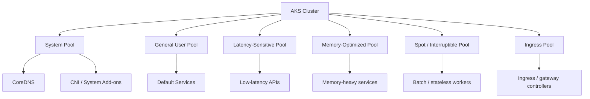

### Node pool anti-patterns

| Anti-Pattern | Why It Hurts |
|---|---|
| One pool for everything | No isolation, bad cost attribution, bad upgrade control |
| Too many tiny pools | Fragmentation, autoscaler inefficiency, operational complexity |
| System workloads mixed with noisy apps | DNS/control add-on instability |
| Spot pool without eviction design | Random workload loss and false incidents |
| GPU/specialized nodes without taints | Expensive nodes consumed by generic pods |
| No labels/taints convention | Scheduling becomes tribal knowledge |

### Practical baseline

Start with:

- one system pool;
- one default user pool;
- one optional ingress/platform pool;
- specialized pools only when there is a measurable reason.

Do not create a pool for every team by default. Prefer namespace-level tenancy first, node-pool tenancy only when isolation, compliance, latency, hardware, or cost model requires it.

---

## 6. VM Scale Sets and Node Lifecycle

AKS node pools are usually backed by Azure Virtual Machine Scale Sets. That means node lifecycle is not only Kubernetes lifecycle. It is also Azure compute lifecycle.

When you scale a node pool, you are changing VMSS capacity. When you upgrade a node pool, you are replacing node images or Kubernetes components on VM instances. When cluster autoscaler acts, it changes VMSS size.

### Node lifecycle pipeline

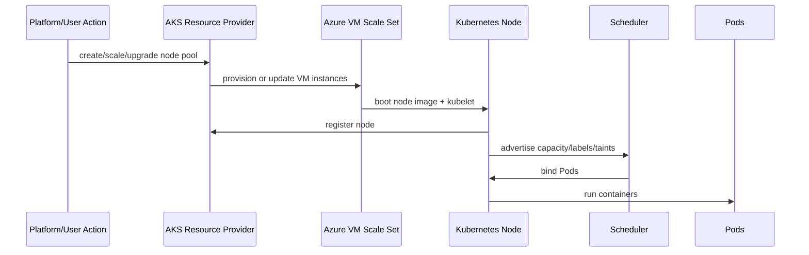

### Operational implications

- Kubernetes sees nodes as schedulable capacity.
- Azure sees nodes as VM instances in a scale set.
- Autoscaling touches both worlds.
- Upgrade touches both worlds.
- Drain must protect workload availability.
- PodDisruptionBudgets matter because node operations evict pods.

### Production node operation rule

No node pool lifecycle action should be approved without checking:

- PodDisruptionBudgets;
- workload replica counts;
- topology spread;
- autoscaler behavior;
- node surge settings;
- remaining subnet IP capacity;
- capacity quota for the VM SKU;
- expected workload interruption.

---

## 7. AKS Networking Foundation

AKS networking is one of the most consequential architecture decisions. It determines:

- pod IP ownership;
- subnet sizing;
- how pods reach Azure services;
- how on-prem networks see traffic;
- egress control;
- network policy engine;
- private cluster access;
- load balancer behavior;
- DNS design.

There are two broad network models:

| Model | Pod IP Source | External Visibility | Primary Benefit | Primary Risk |
|---|---|---|---|---|
| Overlay | Pod IPs from overlay CIDR; outbound usually SNATs to node IP | Pod IP usually hidden outside cluster | Conserves VNet IP space | Less direct pod reachability |
| Flat | Pod IPs from Azure VNet/subnet | Pod IP can be directly visible/routable depending design | Direct integration with VNet/on-prem | Requires careful IP planning |

Modern AKS guidance increasingly pushes toward Azure CNI Overlay for many scenarios because it improves IP efficiency while preserving Azure CNI integration patterns.

### Networking decision questions

Before creating a production AKS cluster, answer:

1. Will pods need direct IP reachability from peered VNets or on-prem?
2. Is preserving VNet IP space more important than direct pod routability?
3. Who owns the VNet: app team, platform team, central networking team?
4. Is outbound internet allowed directly, through NAT Gateway, or through Azure Firewall?
5. Is the API server public, private, or restricted by authorized IP ranges?
6. Which ingress boundary is standard: Azure Load Balancer, Application Gateway, Application Gateway for Containers, managed NGINX, or Gateway API?
7. Which network policy engine is used?
8. How are DNS and private endpoints handled?

If these are not answered up front, the cluster may work but the platform will be ungovernable.

---

## 8. VNet and Subnet Topology

A production AKS cluster belongs inside a network topology, not floating by itself.

Baseline topology:

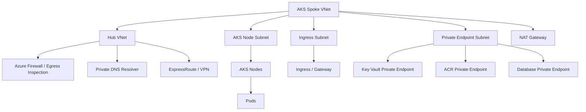

### Subnet design principles

- Do not put unrelated infrastructure into the node subnet.
- Do not delegate the node subnet incorrectly.
- Plan IP capacity based on node count and network model.
- Reserve subnet space for growth, not for the first release only.
- Separate ingress, private endpoints, Azure Firewall, and node pools when required by architecture.
- Treat subnet exhaustion as a production incident risk.

### Common subnet mistakes

| Mistake | Consequence |
|---|---|
| Small node subnet | Node scale or pod scheduling fails later |
| No private endpoint plan | Teams expose services publicly under time pressure |
| Egress not centralized | Regulatory and audit gaps |
| Mixed ingress and node subnet carelessly | Harder security and routing ownership |
| Missing DNS design | Private endpoint resolution failures |

---

## 9. Private Cluster Design

Private AKS means the Kubernetes API server endpoint is not publicly accessible in the same way as a normal public endpoint. This reduces exposure but increases operational design complexity.

Private clusters require a clear access path for:

- CI/CD systems;
- platform engineers;
- break-glass access;
- automation tools;
- GitOps controllers if external;
- monitoring/control integrations.

### Private access model

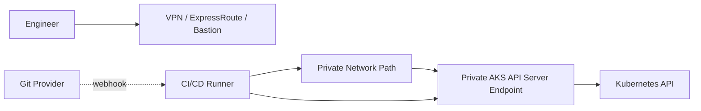

### Private cluster invariant

A private API server is safer only if the private access path is well-governed.

If engineers bypass it with ad-hoc jump boxes, shared credentials, broad firewall rules, or long-lived admin kubeconfigs, the “private” cluster only creates a false sense of security.

### Production checklist

- Private DNS works from all expected admin networks.
- CI/CD runners have private connectivity.
- Break-glass workflow is documented and tested.
- Admin access uses identity, not shared kubeconfig secrets.
- No permanent public fallback exists without approval.
- Monitoring and GitOps controllers can reach required endpoints.
- Incident runbook includes private endpoint troubleshooting.

---

## 10. Identity Foundation: Entra ID, Kubernetes RBAC, and Managed Identity

AKS identity has three overlapping layers:

| Layer | Purpose |
|---|---|
| Microsoft Entra ID | Human and service principal identity source |
| Kubernetes RBAC | Authorization inside Kubernetes API |
| Azure Managed Identity / Workload Identity | Access from cluster/workloads to Azure resources |

Do not collapse them into one concept.

### Control-plane access identity

Human users should authenticate through Entra ID integration and receive Kubernetes permissions through RBAC mappings or Azure RBAC integration, depending on your organization model.

The key question:

> Is Azure RBAC the source of truth for Kubernetes authorization, or does Kubernetes RBAC remain the main in-cluster authorization model?

Both can work. Mixing them without governance creates confusion.

### Workload identity

Workloads should not use static Azure credentials. Production AKS should prefer workload identity patterns that allow a Kubernetes service account to federate with Azure identity and access Azure resources with narrow permissions.

Example target model:

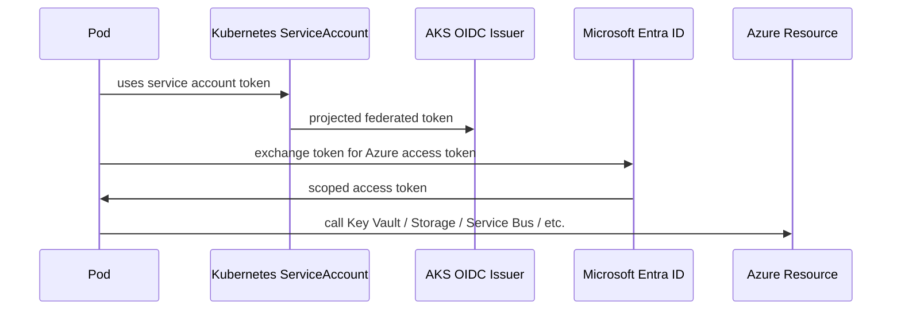

### Managed identity boundary

AKS itself also uses identities for cluster operations. These identities may need permissions against VNets, load balancers, route tables, managed disks, ACR, or other Azure resources depending on configuration.

Do not overgrant cluster identities. A common failure is giving broad Contributor permissions at subscription scope because something failed during provisioning.

Better pattern:

- explicit user-assigned managed identities where appropriate;
- least privilege per resource group or resource;
- infrastructure-as-code controlled role assignments;
- periodic access review;
- separate cluster identity from workload identity.

---

## 11. Container Registry: ACR Integration

AKS commonly pulls images from Azure Container Registry.

Production design decisions:

- Is ACR shared across environments or per environment?
- Is ACR exposed publicly or via Private Link?
- Are images immutable by digest?
- Is vulnerability scanning enforced?
- Is image signing required?
- Are promotion flows tag-based or digest-based?
- Who can push to production repositories?
- Can dev clusters pull production images?

### Minimal pull model

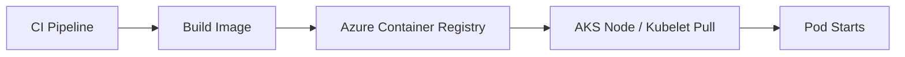

### Production pull invariant

The cluster should be able to pull only the image repositories required for its environment.

Do not use broad registry permissions as a convenience layer. Registry permissions are part of supply-chain security.

---

## 12. Secrets and Key Vault Boundary

Kubernetes `Secret` is an API object. Azure Key Vault is an external secret management service. They solve different parts of the problem.

| Option | Strength | Risk |
|---|---|---|
| Kubernetes Secret only | Simple, native | Secret material lives in Kubernetes API/etcd; needs strict encryption/RBAC |
| Key Vault CSI Driver | External secret source; mount secret into pods | Runtime dependency; mount/update behavior must be understood |
| External Secrets operator style | Syncs external secrets into Kubernetes Secrets | Still creates Kubernetes Secrets; controller becomes sensitive component |
| Workload fetches Key Vault directly | App controls fetch/refresh | App complexity; retry/caching/security mistakes |

### Production design rule

A secret strategy is not complete until it defines:

- where secret material is stored;
- how workload gets it;
- whether it is mounted or env-var injected;
- how rotation happens;
- how app reloads;
- who can read it;
- how access is audited;
- how leaked secrets are revoked.

### Key Vault integration mental model

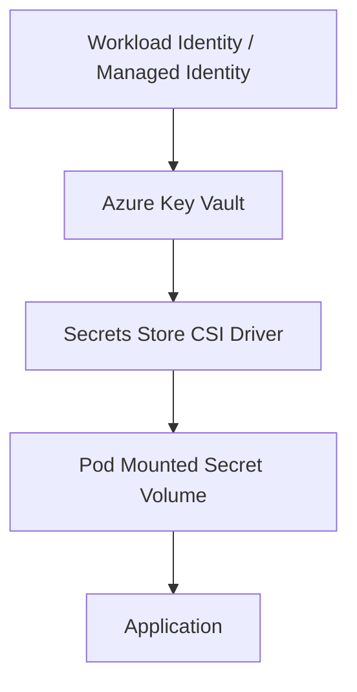

The most common failure is assuming Key Vault rotation automatically makes the application use the new value. Runtime reload remains an application/platform contract.

---

## 13. Ingress and Edge Architecture

AKS does not prescribe one ingress pattern for all systems. You need a platform standard.

Common options:

| Option | Where It Fits |
|---|---|
| Azure Load Balancer Service | Simple L4 exposure |
| NGINX Ingress Controller | Common Kubernetes-native L7 routing |
| Application Gateway Ingress Controller | Azure Application Gateway integrated ingress |
| Application Gateway for Containers | Modern Azure application load balancing with Kubernetes integration |
| Gateway API | Future-facing Kubernetes-native traffic API model |
| Service Mesh Ingress Gateway | Mesh-heavy platforms with mTLS/traffic policy requirements |

### Edge ownership questions

- Does networking team own public IPs and WAF?
- Does platform team own ingress controller lifecycle?
- Do app teams define routes directly?
- Are certificates managed centrally or per namespace?
- Is WAF policy shared or app-specific?
- Is internal ingress separate from external ingress?
- Is Gateway API the long-term route API?

### Baseline edge topology

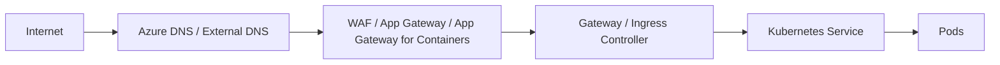

### Production invariant

The app team may own route intent. The platform must own route safety.

That means app teams can request:

- hostname;
- path;
- backend service;
- timeout profile;
- auth policy;
- traffic split.

But platform guardrails must enforce:

- allowed domains;
- TLS policy;
- WAF profile;
- public/private exposure;
- cross-namespace reference controls;
- certificate source;
- forbidden annotations.

---

## 14. Egress Architecture

Ingress gets attention because it is visible. Egress causes incidents because it is invisible.

AKS outbound traffic can be handled through several models:

- Azure Load Balancer outbound rules;
- NAT Gateway;
- user-defined routing through Azure Firewall/NVA;
- managed NAT patterns in automatic modes;
- private endpoints for Azure service access;
- proxy-based egress controls.

### Egress decision matrix

| Requirement | Preferred Direction |
|---|---|
| Simple internet egress | NAT Gateway or managed outbound option |
| Regulated outbound inspection | UDR to Azure Firewall or approved NVA |
| Private Azure service access | Private Link / private endpoints |
| Stable outbound IP allowlisting | NAT Gateway or firewall public IPs |
| Per-namespace egress policy | NetworkPolicy + egress gateway/proxy pattern |

### Egress failure modes

| Failure | Symptom |
|---|---|
| SNAT port exhaustion | Random outbound connection failures |
| Missing private DNS for private endpoints | Service resolves public endpoint or fails |
| Firewall denies required cloud endpoint | Image pull, Key Vault, telemetry, or dependency call fails |
| No egress ownership | App teams add random public dependencies |
| Overbroad egress | Data exfiltration and audit risk |

### Production invariant

Every production AKS cluster should have an egress story before the first workload goes live.

Not after the first audit.

---

## 15. Observability Foundation in AKS

AKS observability usually combines Kubernetes-native telemetry with Azure-native telemetry.

Common layers:

| Layer | Typical Tools |
|---|---|
| Cluster metrics | Azure Monitor managed Prometheus, metrics-server, kube-state-metrics |
| Logs | Container logs to Log Analytics / Azure Monitor |
| Dashboards | Azure Managed Grafana, Grafana, Azure Portal views |
| Traces | OpenTelemetry collector / vendor backend |
| Events | Kubernetes Events, Azure Activity Logs |
| Control plane audit | Azure diagnostics / control-plane logs depending configuration |

### Observability ownership

Platform team should provide:

- cluster health dashboards;
- node pool dashboards;
- ingress/egress dashboards;
- DNS and CoreDNS dashboards;
- API server and control-plane relevant logs where enabled;
- network drop/deny visibility;
- cost/capacity reports;
- alert standards.

Application teams should provide:

- service-level metrics;
- request latency/error rates;
- dependency metrics;
- business operation metrics;
- trace spans;
- actionable alerts tied to SLOs.

### Anti-pattern

> “We installed Azure Monitor, so we have observability.”

Better model:

> “Telemetry exists only if we can answer incident questions quickly.”

Incident questions:

- Which deployment changed?
- Which node pool is failing?
- Are pods unschedulable or crashing?
- Is DNS failing?
- Is ingress returning 502/503?
- Is egress blocked?
- Did a policy deny the deployment?
- Is the app slow or its dependency slow?
- Is the cluster out of IPs, CPU, memory, or SNAT ports?

---

## 16. Azure Policy and Governance

AKS production platforms need guardrails. Without guardrails, every namespace becomes a separate governance experiment.

Azure governance commonly uses:

- Azure Policy for AKS;
- Kubernetes admission policies;
- Gatekeeper/OPA;
- Kyverno;
- RBAC;
- namespace templates;
- resource quotas;
- limit ranges;
- network policies;
- image policy;
- tagging and Azure resource policy.

### Governance layers

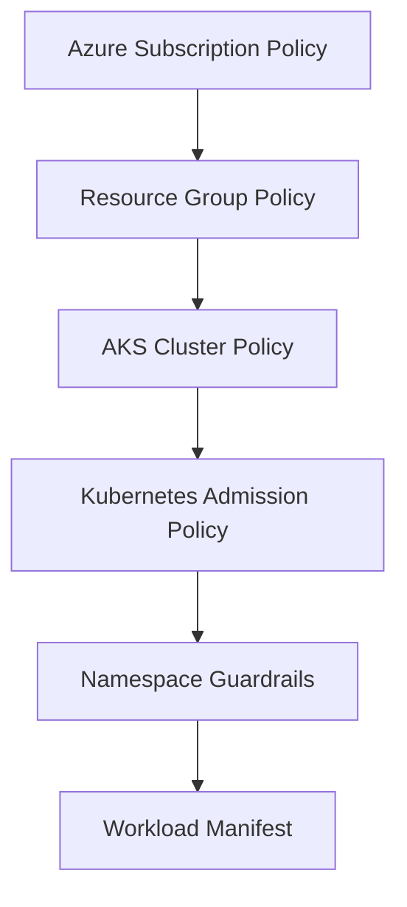

### Guardrail examples

- Pods must run as non-root.
- Privileged containers are forbidden except approved namespaces.
- Images must come from approved registries.
- Public LoadBalancer Services are denied by default.
- Required labels must exist.
- Resource requests are mandatory.
- HostPath is denied.
- Latest image tag is denied.
- Secrets cannot be mounted into unauthorized workloads.
- Ingress hostnames must match allowed domains.

### Production rule

Policies should have lifecycle:

1. audit;
2. warn;
3. enforce;
4. exception process;
5. periodic exception expiry review.

Hard enforcement from day one often causes teams to route around the platform. Audit-only forever creates security theater.

---

## 17. AKS Add-ons and Extension Strategy

AKS has built-in add-ons and integrations, but you can also install open-source or vendor components.

Typical platform add-ons:

- Azure Monitor / Container Insights;
- managed Prometheus;
- managed Grafana;
- Azure Policy add-on;
- Key Vault CSI driver;
- workload identity;
- application routing add-on;
- ingress/gateway controllers;
- cert-manager;
- external-dns;
- secret operators;
- service mesh;
- GitOps controllers;
- policy engines;
- backup tools;
- security agents.

### Add-on ownership matrix

| Add-on Type | Owner | Upgrade Rule |
|---|---|---|
| Cloud provider managed add-on | Platform team + Azure lifecycle | Track AKS compatibility |
| Ingress/gateway | Platform networking | Upgrade with traffic canary |
| Policy engine | Platform security | Audit policies before enforcement |
| GitOps controller | Platform delivery | Upgrade before app feature adoption |
| Observability agent | Platform SRE | Validate telemetry continuity |
| Secret integration | Platform security | Test rotation and outage behavior |

### Add-on failure model

Every add-on is a controller. Every controller can become a cluster-level dependency.

Ask:

- What permissions does it have?
- What namespaces can it affect?
- What CRDs does it own?
- What happens if it is down?
- What happens if it is upgraded incorrectly?
- What happens if its webhook times out?
- Does it block deployments?
- Does it mutate workloads?

Admission webhooks deserve special caution. A broken validating/mutating webhook can block cluster changes.

---

## 18. AKS Upgrade Model

AKS upgrade is not a button. It is a system change.

There are multiple upgrade surfaces:

- Kubernetes control plane version;
- node pool Kubernetes/kubelet version;
- node image version;
- CNI and network components;
- managed add-ons;
- CRDs and controllers;
- ingress/gateway components;
- policy engines;
- service mesh;
- workload APIs.

### Upgrade dependency chain

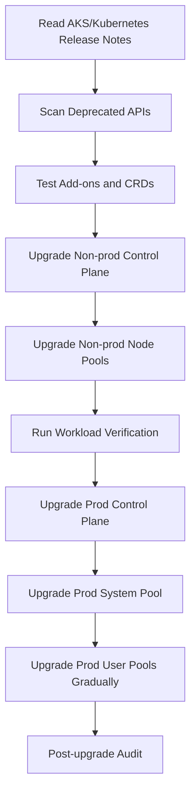

### Upgrade invariants

- Never upgrade production first.
- Never upgrade without deprecated API scan.
- Never upgrade without PDB review.
- Never upgrade all specialized pools at once.
- Never assume add-ons are compatible.
- Never ignore node image updates.
- Never run unsupported Kubernetes versions as a normal operating model.

### Node pool upgrade strategy

For production:

- upgrade system pool carefully;
- upgrade one user pool at a time;
- use surge capacity;
- respect PodDisruptionBudgets;
- watch unschedulable pods;
- watch ingress error rate;
- watch DNS and CNI health;
- watch application SLOs.

---

## 19. AKS Reliability Architecture

Reliability starts with failure domains.

AKS failure domains include:

- pod;
- container;
- node;
- node pool;
- availability zone;
- subnet;
- VNet;
- region;
- Azure service dependency;
- identity provider;
- DNS;
- ingress;
- egress;
- storage account/disk;
- Key Vault;
- ACR;
- monitoring pipeline.

### Zonal design

For production, distribute node pools across availability zones where supported and align workload topology spread with zone failure expectations.

But zone-aware nodes alone are not enough.

You also need:

- replicas > 1;
- topology spread constraints;
- anti-affinity for critical workloads;
- multi-zone storage where required;
- zone-aware ingress/load balancing;
- PDBs that do not block all disruption;
- capacity to survive one zone loss;
- dependency architecture that survives one zone loss.

### Failure-mode table

| Failure | Required Design Response |
|---|---|
| One pod crashes | ReplicaSet restores; readiness removes bad pod |
| One node lost | Pods reschedule; capacity exists elsewhere |
| One node pool degraded | Critical workloads can run on other eligible pools or fail safely |
| One zone lost | Replicas spread across zones; ingress routes remaining endpoints |
| ACR unavailable | Nodes should have pulled current images; rollout may pause |
| Key Vault unavailable | Apps must define cached/rotated secret behavior |
| DNS failure | CoreDNS and upstream DNS observability/runbook |
| Azure identity issue | Workload identity failure surfaces as dependency incident |

### Production invariant

A highly available AKS cluster cannot compensate for a single-replica application, a single-zone database, or an app that dies on dependency timeout.

---

## 20. Namespace and Tenancy Model

AKS platform design must define how teams consume the cluster.

A namespace is not a security boundary by itself, but it is a practical tenancy unit.

Namespace template should include:

- labels and annotations;
- ResourceQuota;
- LimitRange;
- default deny NetworkPolicy;
- allowed ingress/egress policy;
- RBAC bindings;
- service account standards;
- workload identity mapping rules;
- secret access pattern;
- allowed registries;
- logging/monitoring labels;
- ownership metadata;
- cost allocation metadata.

### Namespace factory model

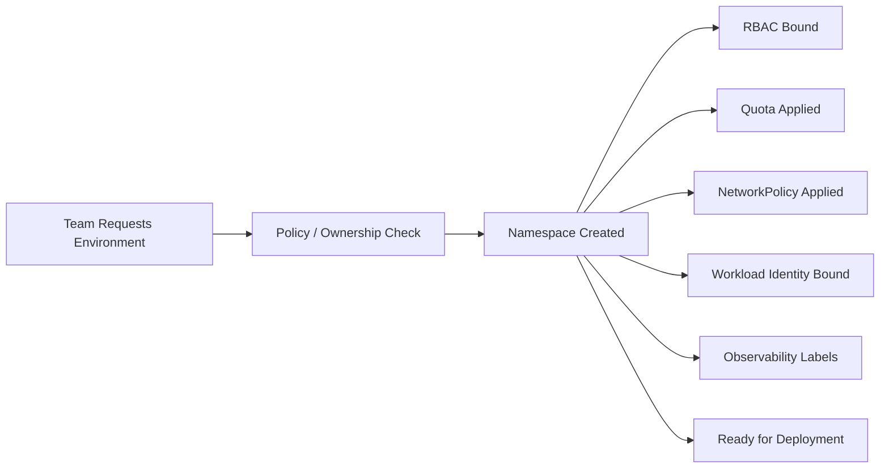

### Tenant isolation levels

| Isolation Level | Mechanism | When to Use |
|---|---|---|
| Soft | Namespace + RBAC + quota | Internal low-risk multi-team platform |
| Medium | Namespace + network policy + policy-as-code + identity isolation | Most enterprise shared clusters |
| Strong | Dedicated node pools + taints + separate identities | Regulated/high-sensitivity workloads |
| Hard | Dedicated cluster/subscription | Strong compliance or blast-radius requirements |

Do not promise hard isolation from namespaces alone.

---

## 21. Production AKS Reference Architecture

A reasonable production AKS baseline looks like this:

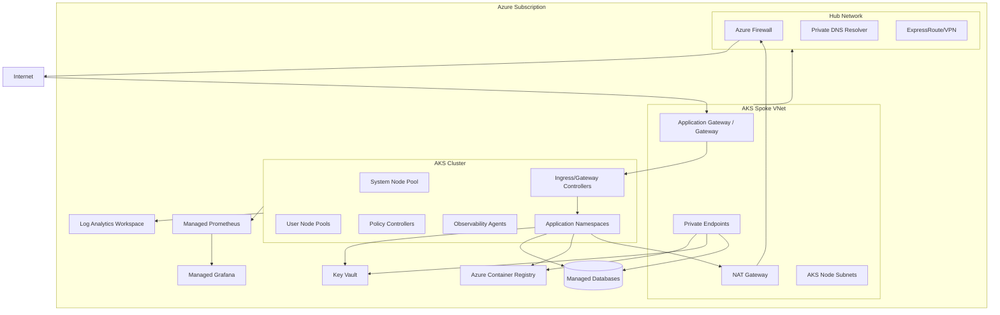

This is not the only architecture. It is a reference shape.

Modify it only after you know what property you are trading away.

---

## 22. AKS Production Readiness Checklist

### Cluster foundation

- [ ] Kubernetes version is supported and upgrade path is known.
- [ ] AKS Standard vs Automatic decision is documented.
- [ ] Cluster is deployed by infrastructure-as-code.
- [ ] Node resource group is treated as managed infrastructure.
- [ ] System and user node pools are separated.
- [ ] Node pool labels/taints follow platform convention.
- [ ] Autoscaler behavior is tested.
- [ ] PDBs exist for critical workloads.

### Networking

- [ ] Network model is chosen deliberately: overlay vs flat.
- [ ] VNet/subnet sizing is based on growth assumptions.
- [ ] Private cluster decision is documented.
- [ ] API server access path is tested.
- [ ] Ingress controller/gateway standard is selected.
- [ ] Egress path is controlled and observable.
- [ ] Private endpoints and private DNS are designed.
- [ ] NetworkPolicy engine is installed and validated.

### Identity/security

- [ ] Entra ID integration is configured.
- [ ] Admin access is not based on shared credentials.
- [ ] Kubernetes RBAC/Azure RBAC model is clear.
- [ ] Workload identity is used for Azure service access.
- [ ] Cluster managed identity permissions are least privilege.
- [ ] ACR pull permissions are environment scoped.
- [ ] Key Vault access is workload scoped.
- [ ] Policy-as-code has audit/enforce lifecycle.

### Operations

- [ ] Azure Monitor/Prometheus/Grafana or equivalent is configured.
- [ ] Alerts are actionable and SLO-linked.
- [ ] Upgrade runbook exists and is rehearsed.
- [ ] Backup/restore strategy is documented.
- [ ] Incident runbooks exist for DNS, CNI, ingress, egress, identity, storage.
- [ ] Cost allocation tags/labels exist.
- [ ] Platform ownership model is documented.

---

## 23. AKS Decision Matrix

| Decision | Default Recommendation | Change When |
|---|---|---|
| Cluster mode | AKS Standard for full architecture control; Automatic for reduced ops | Your organization values managed defaults over custom controls |
| Network model | Azure CNI Overlay for many modern clusters | Direct pod routability or strict flat-network integration is required |
| API access | Private or restricted public | Developer simplicity outweighs strict private access in non-prod |
| Node pools | System + user + specialized only when justified | Hardware/compliance/cost isolation requires more pools |
| Ingress | Standardize on Gateway/Ingress platform | Teams have specialized edge requirements |
| Egress | NAT Gateway or firewall-controlled path | Full private-only dependency model exists |
| Identity | Entra ID + workload identity | Legacy service principal constraints exist temporarily |
| Secrets | Key Vault integration for sensitive production secrets | Simple non-prod or low-risk internal workloads |
| Policy | Audit then enforce | Emergency remediation requires immediate deny |
| Observability | Azure Monitor + Prometheus/Grafana + OTel | Existing enterprise observability platform is mandated |

---

## 24. Practical Lab: Design an AKS Platform Slice

Design a production AKS environment for three workloads:

1. Public API service.
2. Internal worker consuming queue messages.
3. Admin dashboard reachable only through private network.

Define:

- cluster mode;
- VNet/subnet topology;
- node pools;
- ingress pattern;
- egress pattern;
- identity pattern;
- Key Vault access;
- ACR access;
- namespace model;
- NetworkPolicy baseline;
- observability signals;
- upgrade approach.

### Expected output

A good answer should not just say “use AKS”. It should produce something like:

- AKS Standard, private cluster;
- custom spoke VNet peered to hub;
- system pool + general user pool + ingress pool;
- Application Gateway for public API and internal gateway for admin;
- NAT Gateway or Azure Firewall for egress;
- private endpoints for Key Vault, ACR, and database;
- workload identity per service account;
- default deny namespace policies;
- resource quotas per namespace;
- Prometheus metrics + Azure Monitor logs + OpenTelemetry traces;
- staged node pool upgrades with PDB validation.

---

## 25. Troubleshooting Orientation

When AKS fails, classify first.

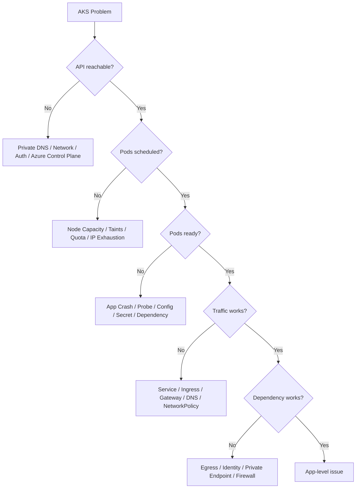

### Commands to build muscle memory

```bash
# Cluster and node pool inventory
az aks show -g <rg> -n <cluster> -o table
az aks nodepool list -g <rg> --cluster-name <cluster> -o table

# Kubernetes view
kubectl get nodes -o wide
kubectl describe node <node>
kubectl get pods -A -o wide
kubectl get events -A --sort-by=.lastTimestamp

# Scheduling issues
kubectl describe pod <pod> -n <ns>
kubectl get quota -A
kubectl get pdb -A

# Network/service issues
kubectl get svc -A
kubectl get ingress -A
kubectl get gateway -A
kubectl get httproute -A
kubectl get endpointslice -A

# Identity/secret symptoms
kubectl describe serviceaccount <sa> -n <ns>
kubectl get secret -n <ns>
kubectl logs <pod> -n <ns>
```

---

## 26. What a Top-Tier Engineer Should Internalize

A top-tier AKS engineer does not merely know AKS commands. They can reason from invariants.

### Invariants

1. AKS manages the control plane, but not your platform operating model.
2. Node pools are capacity and failure-domain contracts.
3. Network model must be chosen before scale, not after exhaustion.
4. Identity must separate human admin access, cluster identity, and workload identity.
5. Ingress is a governance boundary, not just a routing object.
6. Egress must be designed before audit and incident pressure.
7. Secret rotation is a runtime contract, not a storage checkbox.
8. Observability is only useful if it answers failure questions quickly.
9. Policy must include exception workflow or teams will bypass it.
10. Upgrade safety is proven in rehearsal, not asserted in change tickets.

---

## 27. References

- Microsoft Learn — What is Azure Kubernetes Service: https://learn.microsoft.com/en-us/azure/aks/what-is-aks
- Microsoft Learn — Baseline architecture for an AKS cluster: https://learn.microsoft.com/en-us/azure/architecture/reference-architectures/containers/aks/baseline-aks
- Microsoft Learn — AKS best practices: https://learn.microsoft.com/en-us/azure/aks/best-practices
- Microsoft Learn — AKS networking concepts and Azure CNI overview: https://learn.microsoft.com/en-us/azure/aks/concepts-network-cni-overview
- Microsoft Learn — Azure CNI Overlay: https://learn.microsoft.com/en-us/azure/aks/concepts-network-azure-cni-overlay
- Microsoft Learn — AKS Automatic introduction: https://learn.microsoft.com/en-us/azure/aks/intro-aks-automatic
- Microsoft Learn — AKS managed identity overview: https://learn.microsoft.com/en-us/azure/aks/managed-identity-overview
- Kubernetes Documentation — Cluster architecture: https://kubernetes.io/docs/concepts/architecture/
