# Part 016 — EKS VPC Networking Deep Dive

EKS networking is deceptively easy until the first scale event.

Small cluster:

```text
Pods start. Services work. Load balancer works. Everything looks normal.
```

Large production cluster:

```text
Pods stay Pending even though CPU is available.
Node scale-out is slow.
Subnets run out of IPs.
Ingress works but egress randomly fails.
Security groups apply at the wrong boundary.
NetworkPolicy behaves differently than expected.
A node has memory, CPU, and disk, but cannot accept another pod.
```

The root cause is often the same: the engineer treated Kubernetes networking as an overlay abstraction, but EKS default networking is deeply integrated with the **AWS VPC IP model**.

This part explains EKS networking as a production system, not a diagram.

---

## 1. The Core EKS Networking Mental Model

In default EKS networking, pods receive IP addresses from the VPC network through the Amazon VPC CNI.

That single fact changes everything.

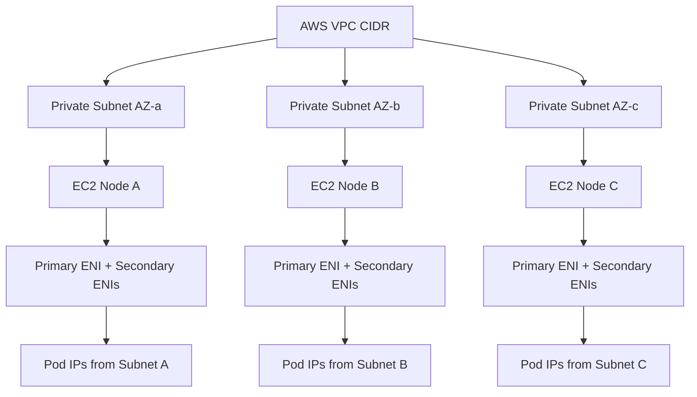

### Important invariant

In EKS default VPC CNI mode, pod capacity is constrained not only by CPU and memory, but also by:

- available subnet IP addresses;
- EC2 instance ENI limits;
- IPs per ENI;
- CNI warm pool settings;
- prefix delegation mode;
- custom networking choices;
- security group for pod configuration;
- node group instance-type mix.

This is why an EKS node can have enough CPU and memory but still be unable to schedule more pods.

---

## 2. What the Amazon VPC CNI Does

The Amazon VPC CNI is the default pod networking add-on for EKS. It has two conceptual parts:

| Component | Purpose |
|---|---|
| CNI binary | Invoked by kubelet when pod sandbox networking is created or removed |
| `ipamd` daemon | Long-running daemon that manages ENIs and warm IP/prefix pools on the node |

When a pod is scheduled to a node:

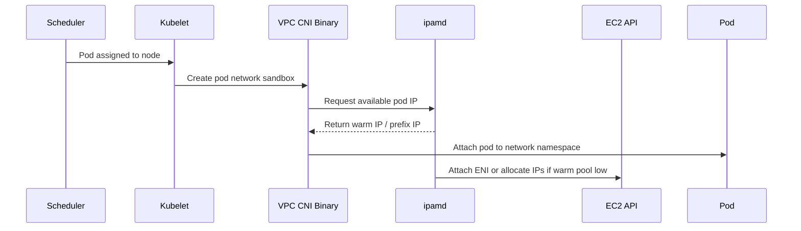

The important part: pod startup latency can be affected by whether `ipamd` already has warm IP capacity available or needs EC2 API calls to attach ENIs/assign addresses.

### Warm pool concept

`ipamd` keeps a warm pool of assignable IPs or prefixes. This avoids waiting for AWS API calls for every pod startup.

But warm pools consume subnet IPs ahead of actual pod usage.

Trade-off:

| Warm Pool Too Small | Warm Pool Too Large |
|---|---|
| Pod startup can be slower during bursts | Subnet IPs are consumed inefficiently |
| More EC2 API pressure during scale events | Other nodes/services may lose available IP space |
| Scaling latency increases | IP exhaustion appears earlier |

A top-tier EKS engineer tunes warm pool behavior based on workload burst profile, subnet capacity, and node group design.

---

## 3. Secondary IP Mode

Secondary IP mode is the classic/default mental model.

Each EC2 node has a primary ENI. The CNI can attach secondary ENIs and allocate secondary private IP addresses to those ENIs. Pods receive those IPs.

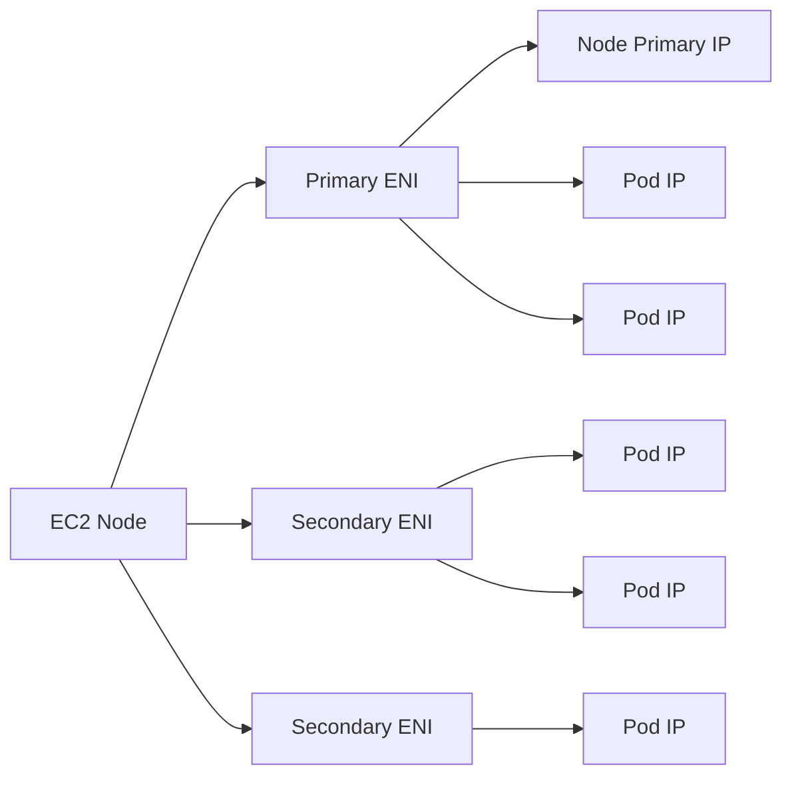

### Constraints

Every instance type has limits:

- maximum ENIs;
- maximum IP addresses per ENI;
- maximum pods supported by EKS bootstrap configuration;
- CPU/memory practical capacity.

This creates the real pod density ceiling.

### Production problem

For small instance types, ENI/IP limits may be reached before CPU/memory. For large clusters, subnet IP exhaustion may happen before compute exhaustion.

That is why EKS capacity planning must include IP math.

---

## 4. Prefix Delegation Mode

Prefix delegation assigns IP prefixes to ENI slots instead of assigning individual secondary IPs. For IPv4, this commonly means assigning `/28` prefixes to ENIs, giving multiple pod IPs per prefix.

Mental model:

```mermaid
flowchart LR
    NODE[EC2 Node] --> ENI[ENI]
    ENI --> PFX1[/28 Prefix]
    ENI --> PFX2[/28 Prefix]
    PFX1 --> PODS1[Pod IP Pool]
    PFX2 --> PODS2[Pod IP Pool]
```

### Why prefix delegation matters

Prefix mode improves pod density and pod startup behavior because a prefix gives the node a block of addresses rather than requiring many individual IP assignments.

It is useful when:

- pods are small and numerous;
- node CPU/memory allows more pods than secondary IP mode supports;
- burst scheduling needs faster IP availability;
- EC2 API call frequency becomes a bottleneck;
- you want better IP allocation efficiency per ENI slot.

### Critical caveat

Prefix delegation requires contiguous address blocks in the subnet. Fragmented subnets can prevent prefix allocation even when the subnet appears to have “enough” free IP addresses.

This is one of the subtle EKS networking traps.

### Migration rule

Do not casually flip existing busy node groups into prefix mode and expect perfect behavior. A safer pattern is:

1. create new node group with prefix mode enabled;
2. cordon/drain old nodes gradually;
3. move workloads;
4. observe pod density and scheduling;
5. remove old node group after validation.

---

## 5. Subnet Sizing Is Capacity Planning

In EKS, subnets are not just network placement. They are pod capacity reservoirs.

If pods receive VPC IPs from node subnets, then every pod consumes address space from those subnets.

### Bad planning model

```text
We need 30 nodes, so /24 should be fine.
```

### Better planning model

```text
We need N nodes per AZ, P pods per node, surge capacity during rollout, autoscaler burst capacity, load balancer IPs, endpoints, future workload growth, and reserved space for blue/green node groups.
```

### Estimate formula

For a first-pass estimate:

```text
required_ips_per_az =
  node_ips
+ pod_ips
+ surge_node_ips
+ surge_pod_ips
+ load_balancer_and_infra_ips
+ upgrade_buffer
+ growth_buffer
```

Where:

```text
pod_ips = expected_nodes_per_az * target_pods_per_node
surge_pod_ips = surge_nodes_per_az * target_pods_per_node
```

Then add a meaningful buffer. Production subnets should not be sized for day-one usage.

### Example

Assume per AZ:

- 40 steady nodes;
- 35 pods per node target;
- 10 surge nodes during upgrade/autoscale;
- 35 pods per surge node;
- 100 miscellaneous infrastructure IPs;
- 30% growth buffer.

```text
steady pod IPs = 40 * 35 = 1400
surge pod IPs = 10 * 35 = 350
node IPs = 50
infra = 100
subtotal = 1900
with 30% buffer = 2470
```

A `/21` has 2048 total addresses before AWS reserved addresses. That might already be too small. A `/20` is safer for this profile.

The exact number depends on your architecture, but the reasoning pattern matters more than the arithmetic.

### Production invariant

If you cannot explain your subnet size from workload scale assumptions, you are guessing.

---

## 6. Multi-AZ Subnet Design

EKS production clusters should use subnets across at least two Availability Zones. In practice, three AZs are common for production regional resilience.

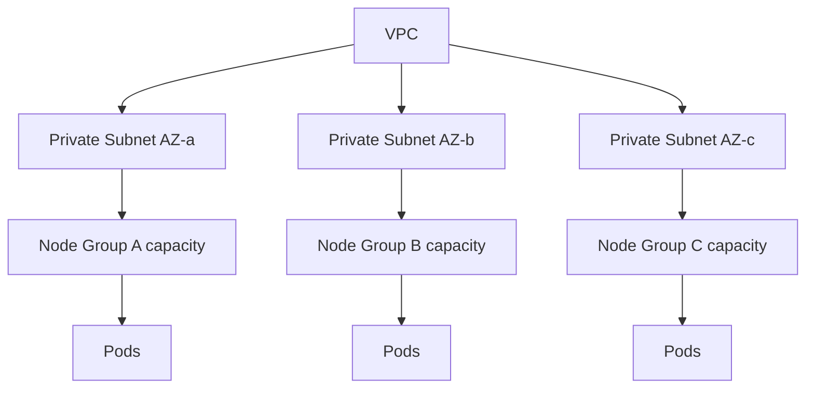

### AZ-aware design concerns

- Do all subnets have similar available IP capacity?
- Are node groups balanced across AZs?
- Do topology spread constraints align with AZ distribution?
- Can the cluster survive one AZ losing capacity?
- Does the autoscaler understand remaining capacity per node group/AZ?
- Are private NAT/egress paths available per AZ or centralized?
- Are load balancers subnet-tagged correctly?

### Subnet tagging

EKS and load balancer integrations depend on subnet tags to discover which subnets are eligible for internal or internet-facing load balancers.

Production rule:

> Subnet tags are infrastructure API contracts. Manage them with IaC, not console edits.

---

## 7. Public vs Private Subnets for Nodes

Production EKS nodes should usually run in private subnets.

Public subnets are generally used for internet-facing load balancers, NAT gateways, bastion/jump patterns if still needed, or other edge infrastructure.

### Common topology

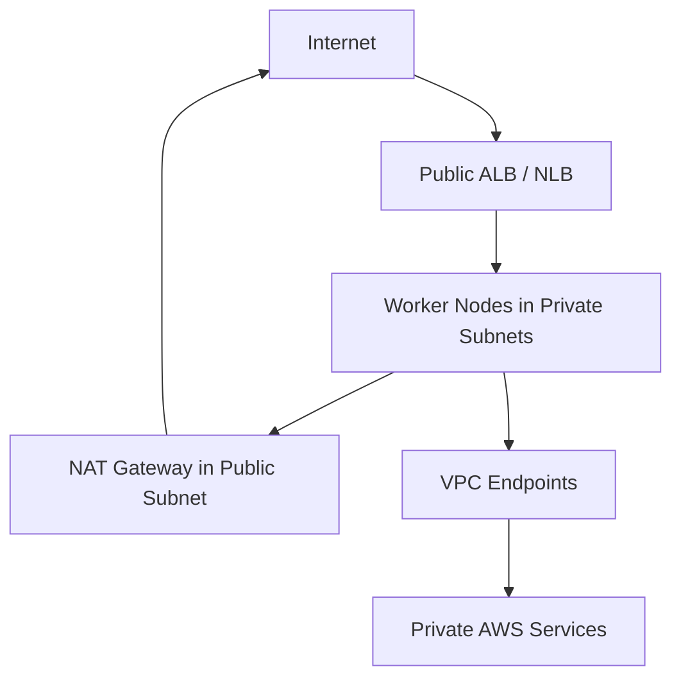

### Why private nodes

- reduce direct exposure;
- simplify security group posture;
- force ingress through approved load balancers;
- make egress explicit;
- align with enterprise network inspection.

### Hidden requirement

Private nodes still need to reach required services:

- ECR image pulls;
- S3 layers if used by registry path;
- STS for IAM role flows;
- CloudWatch logs/metrics;
- EKS API as needed;
- add-on endpoints;
- external dependencies.

This can be achieved through NAT Gateway, VPC endpoints, firewall/proxy, or a combination.

---

## 8. Egress Design in EKS

Egress is where many EKS clusters become non-compliant.

The default “private subnet with NAT Gateway” works technically, but does not automatically answer:

- Which workloads can call the internet?
- Which destinations are allowed?
- Which IPs do partners see?
- Are AWS service calls private?
- Is egress observable?
- Is egress inspected?
- Are secrets or regulated data protected from exfiltration?

### Egress options

| Pattern | Best Fit | Trade-off |
|---|---|---|
| NAT Gateway per AZ | Simple scalable outbound internet | Limited L7 control |
| Centralized egress through firewall | Regulated traffic inspection | More routing complexity, possible bottleneck |
| VPC endpoints | Private AWS service access | Endpoint policy/DNS management |
| Proxy egress | Application-level control | App/runtime configuration overhead |
| Egress gateway/service mesh | Namespace/workload level egress control | Mesh complexity |

### Egress topology with VPC endpoints

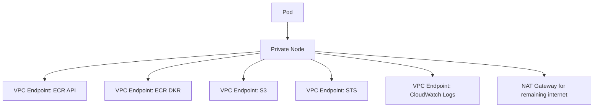

### Production invariant

NAT Gateway is not an egress policy. It is an egress path.

Policy requires some combination of:

- route control;
- firewall/proxy;
- security groups;
- network policy;
- endpoint policies;
- DNS controls;
- observability;
- workload identity scoping.

---

## 9. Security Groups in EKS Networking

Security groups remain an AWS-native network control. But with default VPC CNI, the basic security group association is usually at the node ENI boundary.

That means multiple pods on a node may effectively share node-level security group behavior unless you use additional features such as security groups for pods.

### Node-level security group model

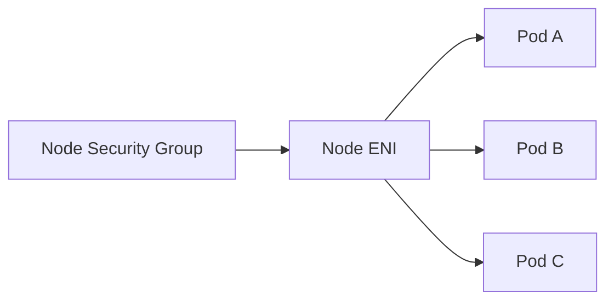

### Security groups for pods mental model

Security groups for pods allow selected pods to receive more granular AWS security group treatment through branch ENI mechanics.

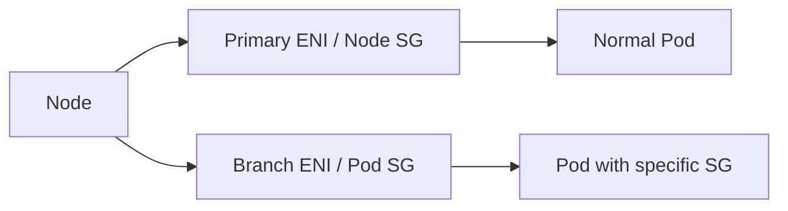

### When to use security groups for pods

Use it when AWS-native network policy must be expressed at workload level, for example:

- a specific service must access RDS with a narrow SG rule;
- a regulated workload requires AWS SG auditability;
- a pod should have different east-west permissions than other pods on same node;
- migration from EC2 security group model requires per-workload compatibility.

### When not to overuse it

Do not make every pod use a dedicated security group by default.

It increases operational complexity and interacts with ENI/pod density constraints. Use it for specific boundaries, not as a replacement for Kubernetes NetworkPolicy everywhere.

---

## 10. Kubernetes NetworkPolicy on EKS

Kubernetes `NetworkPolicy` is an API contract. Enforcement depends on the networking implementation.

With EKS, you must verify which mechanism enforces NetworkPolicy in your cluster:

- Amazon VPC CNI network policy support where applicable;
- Calico or another network policy engine;
- Cilium or an alternate CNI design;
- no enforcement at all if unsupported/misconfigured.

### Critical distinction

A `NetworkPolicy` object can exist in the API and still not be enforced if the cluster networking stack does not support enforcement.

Production validation must include actual traffic tests.

### Default deny baseline

```yaml
apiVersion: networking.k8s.io/v1
kind: NetworkPolicy
metadata:
  name: default-deny-all
  namespace: payments
spec:
  podSelector: {}
  policyTypes:
    - Ingress
    - Egress
```

Then explicitly allow required flows:

```yaml
apiVersion: networking.k8s.io/v1
kind: NetworkPolicy
metadata:
  name: allow-api-to-db
  namespace: payments
spec:
  podSelector:
    matchLabels:
      app: payment-api
  policyTypes:
    - Egress
  egress:
    - to:
        - podSelector:
            matchLabels:
              app: payment-db-proxy
      ports:
        - protocol: TCP
          port: 5432
```

### Production test

For each namespace:

- test allowed ingress;
- test denied ingress;
- test DNS egress;
- test allowed dependency egress;
- test denied internet egress;
- test observability agent traffic;
- test ingress controller to backend traffic.

---

## 11. Custom Networking

Custom networking lets pods use IPs from subnets different from the node primary subnet. This is often used to mitigate IPv4 exhaustion or separate pod IP space from node IP space.

Default behavior:

```text
Pods get IPs from the node primary subnet.
```

Custom networking behavior:

```text
Nodes live in one subnet; pods receive IPs from configured secondary subnets/CIDR ranges.
```

### Mental model

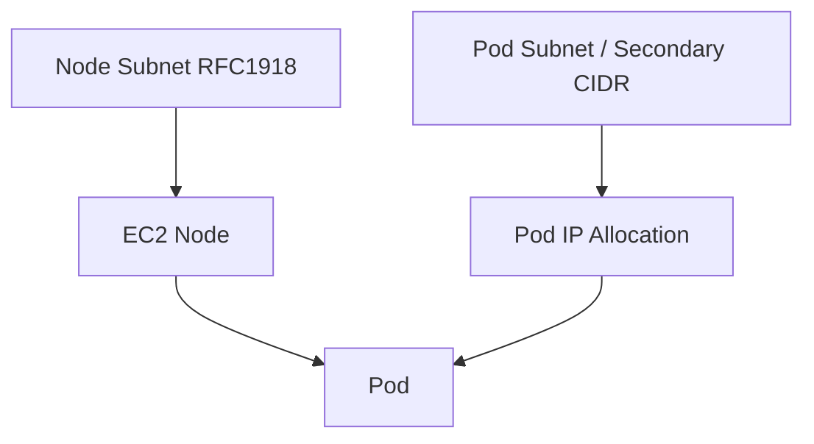

### When custom networking helps

- existing VPC RFC1918 space is constrained;
- pods should consume separate CIDR ranges;
- large cluster IPv4 scale is required;
- you want to use CG-NAT ranges for pod IPs internally;
- you need to reserve primary subnet space for nodes and infrastructure.

### Trade-offs

- more complex subnet and routing design;
- additional operational overhead;
- more complicated troubleshooting;
- more IaC and environment configuration;
- interaction with security groups and load balancers must be understood.

### Design rule

Do not use custom networking just because it sounds advanced. Use it when IP exhaustion or network segmentation requirements justify the complexity.

If your organization can adopt IPv6 for EKS, evaluate that path seriously for long-term scale.

---

## 12. IPv6 EKS Clusters

IPv6 support in EKS is primarily attractive because IPv4 address exhaustion is a real scaling limit. IPv6 changes the address planning conversation.

### Why IPv6 matters

- huge address space;
- less pressure on RFC1918 ranges;
- better long-term scale story;
- avoids some custom networking complexity;
- aligns with future network growth.

### Why IPv6 is not “free”

You must validate:

- application compatibility;
- dependency compatibility;
- on-prem connectivity;
- security tooling;
- logging/search tooling;
- allowlist processes;
- DNS behavior;
- ingress and egress design;
- third-party service compatibility.

### Production stance

IPv6 is not only a Kubernetes decision. It is an enterprise network decision.

Do not let a cluster team silently choose IPv6 if downstream systems, security teams, and operations tooling are not ready.

---

## 13. Pod Density and Instance Type Selection

Pod density is not a generic Kubernetes number in EKS. It depends heavily on the EC2 instance type and CNI mode.

### Node capacity dimensions

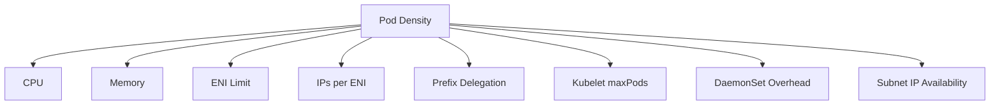

### Common trap

A team chooses small instances for cost efficiency, then discovers:

- too many DaemonSet overhead pods;
- low ENI/IP pod density;
- inefficient bin packing;
- more nodes than expected;
- subnet IP pressure;
- slower scale events;
- noisy networking behavior.

Sometimes fewer larger nodes are cheaper and more stable. Sometimes smaller nodes reduce blast radius. There is no universal answer.

### Decision questions

- Are workloads CPU-bound, memory-bound, or network-bound?
- What is average pod request size?
- How much DaemonSet overhead exists per node?
- Do we need many small pods or fewer large pods?
- What is acceptable node failure blast radius?
- Are we using prefix delegation?
- Is Spot capacity involved?
- Do we need security groups for pods?
- Are there per-node connection/SNAT constraints?

---

## 14. Load Balancers and Subnet Selection

EKS Services of type `LoadBalancer` and AWS Load Balancer Controller resources create AWS load balancers. Their subnet selection depends on tags, annotations, and controller behavior.

### Public vs internal load balancer

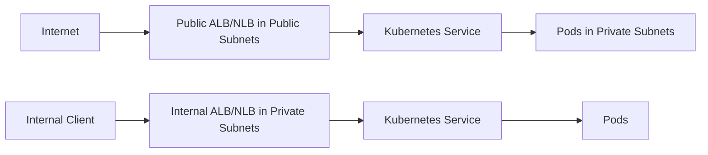

### Production rules

- Public load balancers belong in public subnets.
- Internal load balancers belong in private subnets.
- Subnet tags must be correct and IaC-managed.
- Teams should not create arbitrary public LBs from namespaces.
- Use admission policy to restrict public exposure.
- Standardize annotations allowed for load balancer resources.
- Separate edge ownership from application deployment ownership.

### Failure modes

| Failure | Symptom |
|---|---|
| Missing subnet tags | Load balancer provisioning fails |
| Wrong subnet type | Public/internal exposure incorrect |
| Security group mismatch | Health checks fail |
| Target type mismatch | Traffic does not reach pods/nodes as expected |
| Insufficient subnet IPs | Load balancer creation or scaling fails |
| Controller IAM issue | Ingress/Service remains pending |

---

## 15. DNS in EKS Networking

DNS has two major layers:

1. Kubernetes DNS inside the cluster, typically CoreDNS.
2. AWS DNS/VPC/Route 53 behavior outside or around the cluster.

### Kubernetes DNS path

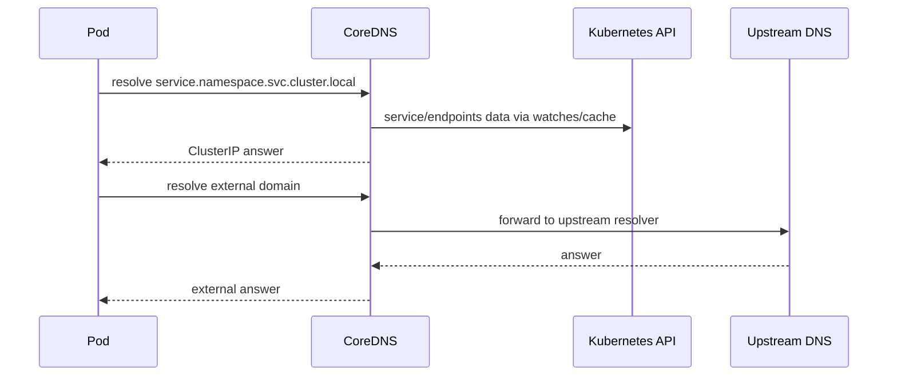

### Production DNS concerns

- CoreDNS replica count and resource requests;
- node-local DNS cache if needed;
- upstream resolver behavior;
- private hosted zones;
- split-horizon DNS;
- VPC resolver rules;
- DNS query volume;
- DNS latency;
- DNS failures during node pressure.

### Common DNS incident

Symptoms:

- app logs show dependency hostname resolution failures;
- pods are Ready but requests fail;
- only some nodes affected;
- CoreDNS pods are CPU throttled or unscheduled;
- node-local DNS cache misconfigured;
- private hosted zone association missing.

Debug path:

```bash
kubectl -n kube-system get deploy coredns
kubectl -n kube-system top pods -l k8s-app=kube-dns
kubectl -n kube-system logs deploy/coredns
kubectl run dns-test --rm -it --image=busybox:1.36 -- nslookup kubernetes.default
kubectl run dns-test-ext --rm -it --image=busybox:1.36 -- nslookup example.com
```

---

## 16. VPC Flow Logs and Network Observability

EKS network troubleshooting often requires both Kubernetes and AWS perspectives.

Kubernetes tells you:

- pod labels;
- service mapping;
- endpoints;
- network policy objects;
- node placement;
- ingress/gateway configuration.

AWS tells you:

- subnet routing;
- security group decisions;
- NACL behavior;
- VPC Flow Logs;
- load balancer health checks;
- NAT Gateway metrics;
- ENI attachment/IP usage;
- firewall logs.

### Observability matrix

| Question | Kubernetes Source | AWS Source |
|---|---|---|
| Is backend selected? | Service, EndpointSlice | N/A |
| Is pod running on expected node? | Pod `-o wide` | EC2 instance metadata |
| Is traffic denied by policy? | NetworkPolicy/CNI logs | Flow Logs/security logs |
| Is LB healthy? | Service/Ingress events | ALB/NLB target health |
| Is egress failing? | Pod logs/events | NAT metrics, firewall logs, Flow Logs |
| Is IP exhausted? | CNI logs, node status | Subnet available IPs, ENI data |

---

## 17. Troubleshooting: Pod Pending with Available CPU

Symptom:

```text
0/20 nodes are available: insufficient vpc.amazonaws.com/pod-eni, too many pods, insufficient IPs, or similar scheduling/CNI symptoms.
```

Debug sequence:

```bash
kubectl describe pod <pod> -n <namespace>
kubectl get nodes -o wide
kubectl describe node <node>
kubectl -n kube-system logs daemonset/aws-node -c aws-node --tail=200
kubectl -n kube-system get ds aws-node -o yaml
```

AWS-side checks:

```bash
aws ec2 describe-subnets --subnet-ids <subnet-ids> \
  --query 'Subnets[*].{SubnetId:SubnetId,AZ:AvailabilityZone,AvailableIpAddressCount:AvailableIpAddressCount,CidrBlock:CidrBlock}'

aws ec2 describe-network-interfaces --filters Name=attachment.instance-id,Values=<instance-id>
```

Classify:

| Root Cause | Evidence |
|---|---|
| Subnet IP exhaustion | low `AvailableIpAddressCount` |
| Instance ENI/IP limit | node cannot receive more pod IPs |
| Warm pool mis-tuned | CNI logs show allocation delay/errors |
| Prefix delegation missing | low pod density on suitable workloads |
| Mixed instance node group | max pod limit constrained by smallest type |
| Security groups for pods limit | pod ENI resource exhausted |

---

## 18. Troubleshooting: Service Works from Some Pods Only

Possible causes:

- NetworkPolicy inconsistency;
- DNS issue on specific nodes;
- node security group path difference;
- pod scheduled in subnet with route difference;
- AZ-specific NACL or route problem;
- target security group allows only some node CIDRs;
- endpoint readiness mismatch;
- kube-proxy/dataplane issue;
- CNI issue on particular node.

Debug:

```bash
kubectl get pod -n <ns> -o wide
kubectl get svc -n <ns>
kubectl get endpointslice -n <ns>
kubectl describe netpol -n <ns>
kubectl run curl-a --rm -it --image=curlimages/curl -- sh
```

Then correlate pod node/subnet/AZ with AWS route tables, NACLs, security groups, and flow logs.

Production lesson:

> Network debugging is rarely “Kubernetes or AWS”. In EKS it is usually Kubernetes and AWS together.

---

## 19. Troubleshooting: Load Balancer Provisioning Fails

Symptoms:

- `Service` stays Pending;
- Ingress has no address;
- AWS Load Balancer Controller logs show permission or subnet errors;
- target groups created but unhealthy;
- controller cannot discover subnets.

Debug:

```bash
kubectl describe svc <svc> -n <ns>
kubectl describe ingress <ing> -n <ns>
kubectl -n kube-system logs deploy/aws-load-balancer-controller --tail=200
kubectl get events -A --sort-by=.lastTimestamp
```

AWS-side:

```bash
aws ec2 describe-subnets --filters Name=vpc-id,Values=<vpc-id> \
  --query 'Subnets[*].{SubnetId:SubnetId,Tags:Tags,AZ:AvailabilityZone,AvailableIpAddressCount:AvailableIpAddressCount}'

aws elbv2 describe-load-balancers
aws elbv2 describe-target-health --target-group-arn <arn>
```

Common fixes:

- add/fix subnet tags;
- fix controller IAM role permissions;
- use correct internal/public annotation;
- fix security group health-check rules;
- ensure pod readiness matches target health expectations;
- ensure enough subnet IP capacity;
- standardize target type.

---

## 20. IaC Baseline for EKS Networking

A production EKS network should be built by infrastructure-as-code. Console-created VPC/subnet/tag changes will eventually hurt you.

### IaC-owned resources

- VPC CIDR and secondary CIDRs;
- public/private subnets per AZ;
- route tables;
- NAT gateways;
- VPC endpoints;
- security groups;
- subnet tags for EKS/load balancers;
- EKS cluster endpoint access settings;
- node groups;
- CNI add-on version/configuration;
- IAM roles for add-ons;
- network policy engine;
- load balancer controller IAM and Helm release;
- cluster security group rules.

### Example subnet tag intent

```hcl
# Pseudocode / illustrative only
public_subnet_tags = {
  "kubernetes.io/role/elb" = "1"
}

private_subnet_tags = {
  "kubernetes.io/role/internal-elb" = "1"
}
```

### Configuration drift risks

| Drift | Risk |
|---|---|
| Manual subnet tag change | LB provisioning changes unexpectedly |
| Manual SG rule | Audit gap and hidden dependency |
| Manual route table edit | Egress/ingress outage |
| Manual CNI config edit | Pod IP allocation behavior changes |
| Manual node bootstrap setting | inconsistent maxPods/capacity |

---

## 21. EKS Networking Design Patterns

### Pattern A — Standard private-node cluster

Best for most production workloads.

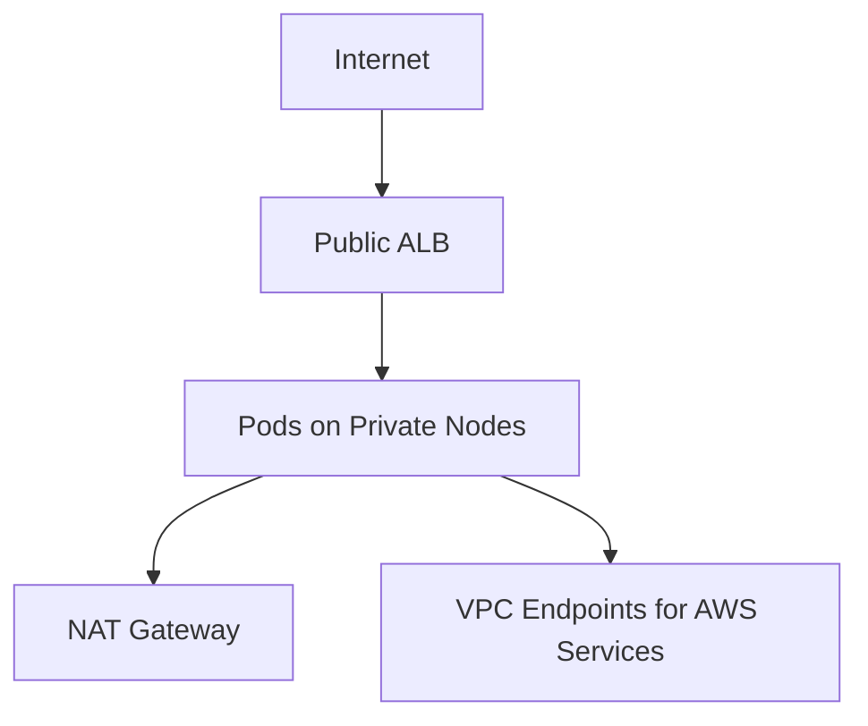

Properties:

- nodes in private subnets;
- public load balancers in public subnets;
- NAT Gateway for outbound;
- VPC endpoints for AWS services;
- default VPC CNI;
- NetworkPolicy enforcement validated.

### Pattern B — Regulated egress cluster

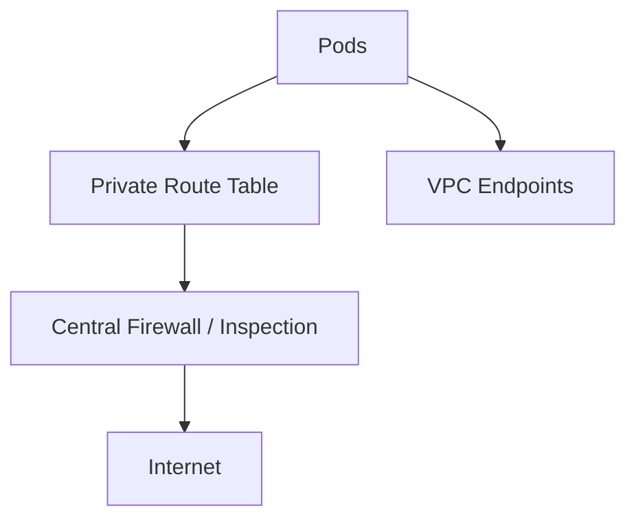

Properties:

- no direct NAT from workload subnets;
- traffic routes through firewall/NVA;
- endpoint policies for AWS services;
- explicit logging and allowlists;
- more operational complexity.

### Pattern C — High-density small-pod cluster

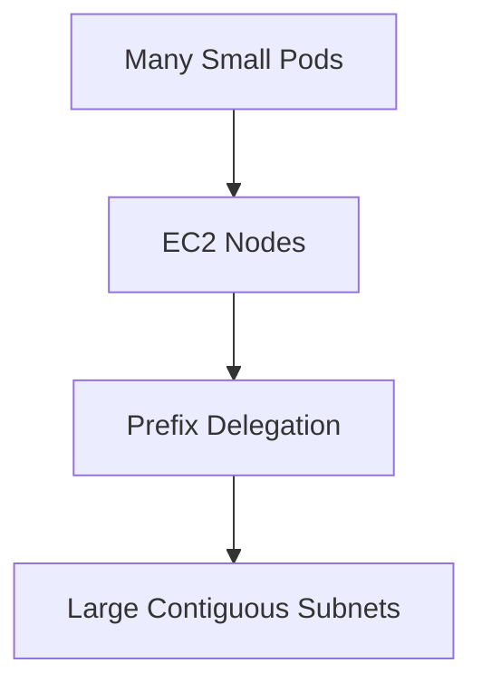

Properties:

- prefix delegation enabled;
- larger subnets with contiguous free space;
- tuned warm prefix settings;
- careful maxPods settings;
- workload resource requests validated.

### Pattern D — IPv4 exhaustion mitigation with custom networking

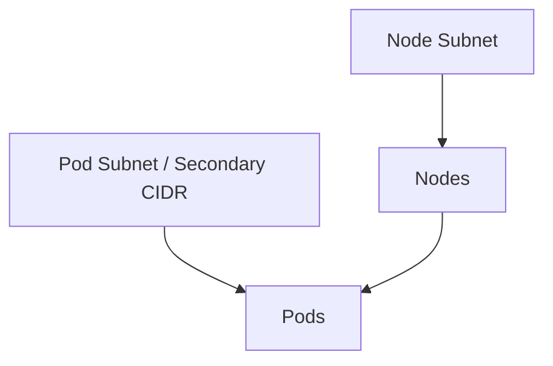

Properties:

- separate pod IP space;
- more IaC complexity;
- useful with constrained RFC1918 ranges;
- evaluate IPv6 as alternative.

---

## 22. EKS Networking Readiness Checklist

### VPC/subnet

- [ ] VPC CIDR sized for growth.
- [ ] Private node subnets exist across at least two AZs; three for production when available.
- [ ] Public subnets exist only for required public edge resources.
- [ ] Available IP capacity is measured per subnet.
- [ ] Subnets have correct EKS/load balancer tags.
- [ ] Route tables are IaC-managed.
- [ ] NACLs are understood and not accidentally blocking ephemeral traffic.
- [ ] NAT Gateway/firewall path is designed.
- [ ] VPC endpoints exist for required AWS services where private access is required.

### CNI/IP allocation

- [ ] VPC CNI version is managed as an EKS add-on or controlled release.
- [ ] CNI IAM permissions are least privilege and use proper identity mechanism.
- [ ] Warm IP/prefix settings are documented.
- [ ] Prefix delegation decision is documented.
- [ ] maxPods behavior is understood for each node group.
- [ ] Node group instance types are selected with ENI/IP limits in mind.
- [ ] Subnet fragmentation is considered before prefix mode.
- [ ] Custom networking/IPv6 decision is documented if needed.

### Security

- [ ] Node security groups are minimal.
- [ ] Security groups for pods are used only where justified.
- [ ] Kubernetes NetworkPolicy enforcement is validated by traffic tests.
- [ ] Default deny policy exists for sensitive namespaces.
- [ ] Egress controls exist beyond “there is a NAT Gateway”.
- [ ] VPC Flow Logs or equivalent visibility is available.

### Load balancing/DNS

- [ ] Public/internal LB ownership is documented.
- [ ] AWS Load Balancer Controller IAM and version are controlled.
- [ ] Subnet discovery is deterministic.
- [ ] Target group health checks are aligned with app readiness.
- [ ] CoreDNS is scaled and resourced.
- [ ] Private hosted zone associations are documented.
- [ ] DNS incident runbook exists.

---

## 23. Practical Lab: EKS IP Capacity Review

Given:

- 3 AZs;
- each AZ has one `/22` private subnet;
- expected 30 nodes per AZ;
- target 25 pods per node;
- upgrade surge 20%;
- autoscaling burst 30%;
- each AZ also hosts internal load balancers and other VPC resources;
- default VPC CNI secondary IP mode.

Answer:

1. Is the subnet size enough?
2. What is the approximate steady pod IP requirement?
3. What is the surge/burst requirement?
4. Which instance types can support target pod density?
5. Would prefix delegation help?
6. Would custom networking or IPv6 be worth evaluating?
7. What metrics would you monitor to avoid surprise exhaustion?

### Expected reasoning

Steady state per AZ:

```text
30 nodes * 25 pods = 750 pod IPs
30 node primary IPs = 30
subtotal = 780 before infra and buffer
```

20% upgrade surge:

```text
6 nodes * 25 pods = 150 pod IPs
6 node IPs = 6
```

30% burst on steady:

```text
9 nodes * 25 pods = 225 pod IPs
9 node IPs = 9
```

Subtotal before infra:

```text
780 + 156 + 234 = 1170 IPs per AZ
```

A `/22` has 1024 total addresses before reserved addresses. That is not enough under this growth model. You need larger subnets, different pod IP strategy, lower pod density assumptions, IPv6, custom networking, or a different cluster layout.

The correct answer is not “increase cluster autoscaler”. Autoscaler cannot create subnet IPs.

---

## 24. What a Top-Tier Engineer Should Internalize

EKS networking is the meeting point of Kubernetes scheduling and AWS VPC reality.

### Invariants

1. Pod IPs are capacity, not just addresses.
2. CPU/memory availability does not guarantee pod schedulability.
3. Subnet sizing is workload capacity planning.
4. Prefix delegation improves density but depends on subnet conditions.
5. Warm IP settings trade startup speed against IP consumption.
6. Security groups are not the same as NetworkPolicy.
7. NAT Gateway is a path, not a governance model.
8. Private nodes still need private or controlled access to AWS services.
9. Load balancer subnet selection must be deterministic and IaC-managed.
10. EKS network debugging requires Kubernetes and AWS evidence together.

When you understand these invariants, EKS networking stops being magic. It becomes a set of explicit contracts.

---

## 25. References

- AWS EKS Best Practices — Networking: https://docs.aws.amazon.com/eks/latest/best-practices/networking.html
- AWS EKS Best Practices — Amazon VPC CNI: https://docs.aws.amazon.com/eks/latest/best-practices/vpc-cni.html
- AWS EKS Best Practices — Optimizing IP address utilization: https://docs.aws.amazon.com/eks/latest/best-practices/ip-opt.html
- AWS EKS Best Practices — Prefix mode for Linux: https://docs.aws.amazon.com/eks/latest/best-practices/prefix-mode-linux.html
- AWS EKS User Guide — Assign more IP addresses to nodes with prefixes: https://docs.aws.amazon.com/eks/latest/userguide/cni-increase-ip-addresses.html
- AWS EKS User Guide — Configure VPC CNI to use IRSA: https://docs.aws.amazon.com/eks/latest/userguide/cni-iam-role.html
- AWS EKS Best Practices — VPC and subnet considerations: https://docs.aws.amazon.com/eks/latest/best-practices/subnets.html
- AWS EKS Best Practices — Custom networking: https://docs.aws.amazon.com/eks/latest/best-practices/custom-networking.html
- AWS EKS Best Practices — IPv6: https://docs.aws.amazon.com/eks/latest/best-practices/ipv6.html
- Kubernetes Documentation — Network Policies: https://kubernetes.io/docs/concepts/services-networking/network-policies/
