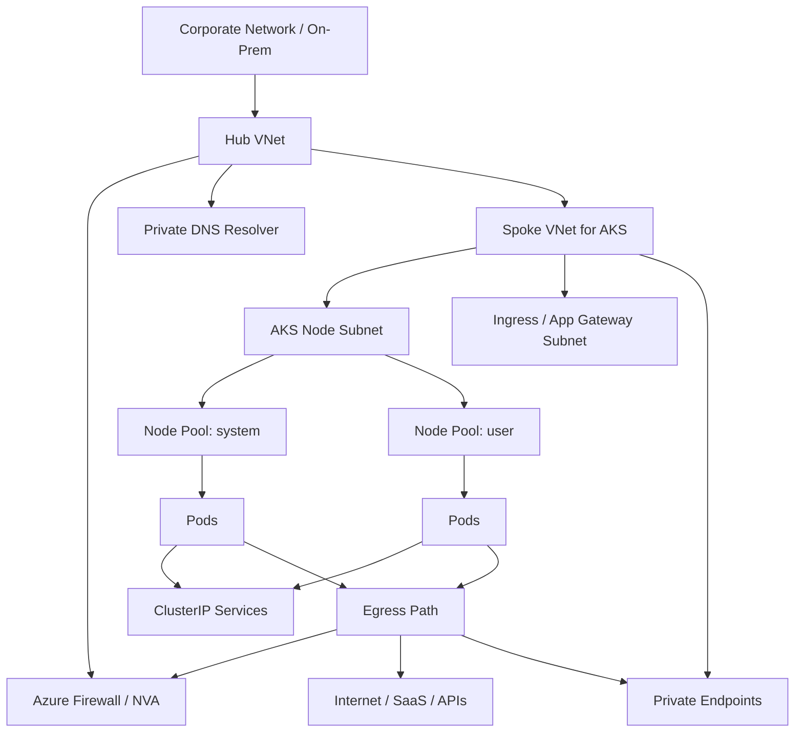
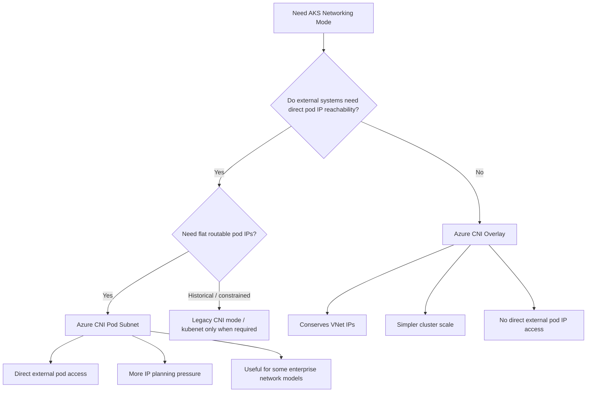
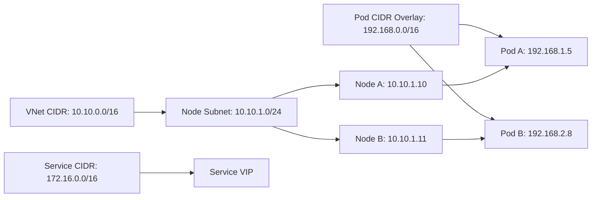
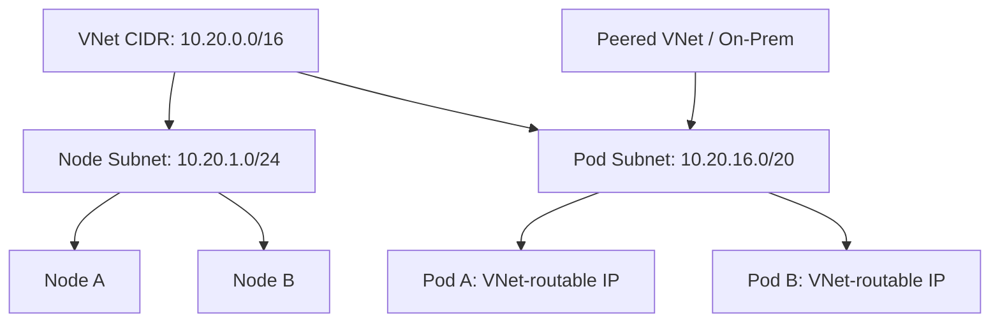
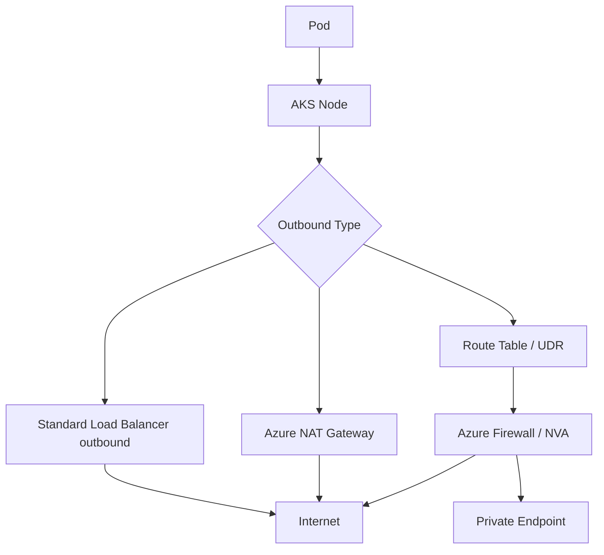
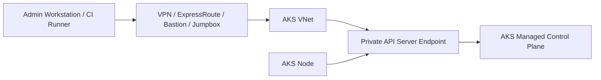
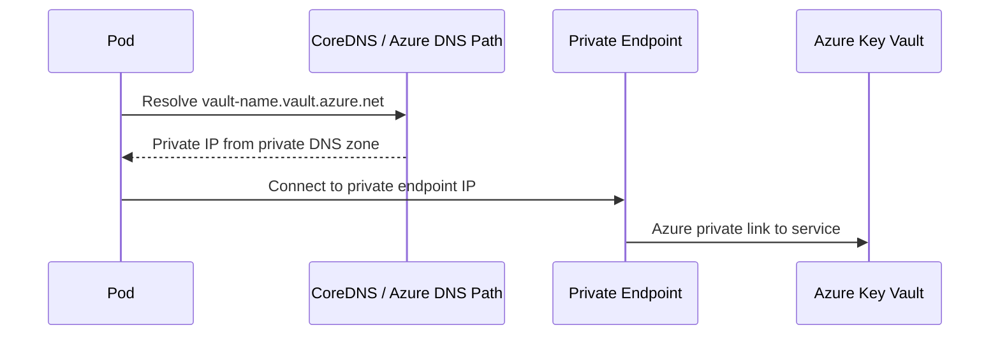

# Part 017 — AKS VNet Networking Deep Dive

AKS networking looks simpler than EKS networking at first because you do not usually think about ENI limits, secondary IP addresses per interface, or EC2 instance pod density tables.

That does not mean AKS networking is simpler.

It means the hard questions move somewhere else:

```text
Which network plugin should this cluster use?
Which IP range owns pods?
Can pods be reached directly from outside the cluster?
Will the VNet survive node pool growth?
Will upgrades fail because surge nodes have no IP space?
Who owns egress: AKS Load Balancer, NAT Gateway, Azure Firewall, or UDR?
Can NetworkPolicy actually be enforced in this cluster?
Can private workloads reach Azure PaaS services without leaking through public internet?
```

The production mistake is to treat AKS networking as a default checkbox during cluster creation. In AKS, the networking choice is an architectural decision. Some choices are hard to change later. Some choices determine IP exhaustion risk. Some choices decide whether pod IPs are routable from the VNet. Some choices determine how security teams can inspect or restrict traffic.

This part builds the mental model.

---

## 1. The Core AKS Networking Mental Model

AKS networking has four address spaces you must reason about separately.

| Space | Owner | Purpose | Production risk |
|---|---|---|---|
| VNet CIDR | Azure network team / platform team | Cloud network boundary | Overlap with peering/on-prem breaks routing |
| Node subnet | AKS node pools | VM/node IPs and some load balancer behavior | Too small prevents scale-out/upgrade |
| Pod address space | Depends on CNI mode | Pod-to-pod and sometimes pod-to-external identity | Too small or wrong mode limits scale/connectivity |
| Service CIDR | Kubernetes cluster | Virtual Service IPs inside cluster | Overlap creates mysterious routing/DNS issues |

The first invariant:

> AKS networking design is mostly IP ownership design.

The second invariant:

> You cannot evaluate an AKS network plugin without asking who needs to route to pod IPs directly.

Most applications do **not** need direct external routing to pod IPs. They need stable Services, ingress, egress, private endpoints, DNS, identity, and observability. That is why Azure CNI Overlay is often the pragmatic default for modern AKS designs. But some environments need flat pod routability, and that changes the decision.

---

## 2. AKS Networking Components

A simplified AKS network topology:



Important AKS networking objects:

| Object | Meaning |
|---|---|
| VNet | Azure virtual network where AKS nodes live or attach |
| Subnet | Address range for node pool, ingress, private endpoints, firewall, gateway, or other services |
| Network plugin | CNI implementation that allocates pod networking |
| Network dataplane | Packet forwarding / policy implementation, such as Azure dataplane or Cilium-based dataplane |
| Service CIDR | Internal Kubernetes virtual IP range for Services |
| DNS service IP | CoreDNS Service IP inside Service CIDR |
| Outbound type | AKS egress behavior: load balancer, NAT gateway, UDR, etc. |
| NSG | Azure network security group applied at subnet/NIC boundary |
| UDR | User-defined route table for forced tunneling through firewall/NVA |
| Private endpoint | Private access to Azure PaaS services |
| Private cluster endpoint | Private API server access pattern |

Do not collapse these into one “networking” bucket. Each has a different owner and failure mode.

---

## 3. The AKS CNI Decision

AKS networking selection is not cosmetic.



### Current practical default

For most production AKS workloads, start evaluation from:

```text
Azure CNI Overlay + managed ingress + explicit egress design + NetworkPolicy-capable dataplane
```

Then move away from that only when you have a concrete reason.

Good reasons to consider flat networking:

- external systems must connect directly to pod IPs;
- existing network appliances require pod IP visibility;
- security model depends on pod IPs being routable from outside cluster;
- specialized workloads require VNet-native pod addressing.

Weak reasons:

- “flat networking feels more enterprise”;
- “we used Azure CNI Node Subnet before”;
- “we want fewer abstractions”;
- “the default in an old reference architecture used it.”

The correct question is not “which mode is more advanced?”

The correct question is:

> What network identity must a pod have outside the cluster boundary?

---

## 4. Azure CNI Overlay

Azure CNI Overlay assigns pod IPs from a private CIDR that is separate from the VNet node subnet. Pods communicate inside an overlay network. Traffic to destinations outside the cluster is routed through node/VNet behavior rather than requiring every pod IP to be allocated from the VNet.

Mental model:



### What Overlay optimizes

| Dimension | Effect |
|---|---|
| VNet IP conservation | Pod IPs do not consume VNet subnet IPs the same way flat pod networking does |
| Scale planning | Node subnet planning is simpler because pods are not allocated directly from node subnet |
| Cluster creation | Easier to allocate pod CIDR separate from enterprise VNet space |
| Common app workloads | Good fit when Services/Ingress are the intended access path |
| Operational defaults | Often easier for platform teams to standardize |

### What Overlay does not give you

| Need | Overlay implication |
|---|---|
| Direct external access to pod IPs | Not the intended model |
| Network appliance sees original pod IP from outside | Usually not the right fit |
| Treat pod IP as enterprise routable identity | Use flat networking instead |
| Avoid all IP planning | You still need pod CIDR, service CIDR, node subnet, and upgrade surge planning |

### Overlay invariant

> Overlay reduces VNet IP pressure, but it does not remove network architecture work.

You still need to design:

- non-overlapping pod CIDR;
- non-overlapping Service CIDR;
- node subnet size;
- egress path;
- ingress path;
- private endpoint DNS;
- firewall route behavior;
- NetworkPolicy enforcement;
- observability and packet tracing strategy.

---

## 5. Azure CNI Pod Subnet

Azure CNI Pod Subnet is the flat networking option to evaluate when pods need routable VNet IP addresses. In this model, pod IPs are allocated from a pod subnet in the VNet.

Mental model:



### When it makes sense

Use flat pod networking when a real requirement exists:

- non-cluster systems must connect to pod IPs directly;
- security appliances inspect pod IPs as first-class network identities;
- external routing policies depend on pod IP ranges;
- integration patterns require direct pod reachability rather than Service/Ingress abstraction.

### The trade-off

Flat networking makes pods more visible to the network. That sounds useful until you pay the cost:

- larger VNet address planning burden;
- more coordination with central network teams;
- more risk of address exhaustion;
- more complex multi-cluster planning;
- more blast radius when ranges overlap;
- more migration pain if CIDRs are wrong.

Flat networking should be chosen because the platform contract requires it, not because it feels lower-level.

---

## 6. Legacy Modes: Know Them, Avoid New Dependence

You will encounter old AKS clusters using legacy modes, especially `kubenet` or older Azure CNI node subnet designs.

Treat them as migration context, not default target architecture.

| Mode | How to think about it |
|---|---|
| kubenet | Legacy overlay-style mode with limitations; useful mostly when maintaining older clusters |
| Azure CNI Node Subnet | Legacy flat model where nodes and pods draw from node subnet; can create large IP pressure |
| Azure CNI Pod Subnet | Modern flat networking option when direct pod routability is required |
| Azure CNI Overlay | Modern common default for IP conservation and general workloads |

The platform rule:

> Do not create new strategic dependence on legacy networking modes unless a provider constraint forces it.

Migration from old networking modes is not just a command. It affects IP space, routing, policy, DNS, load balancing, and possibly application allowlists.

---

## 7. IP Planning: The Part Most Teams Underestimate

AKS IP planning must account for steady state, surge, failure, and future clusters.

Minimum planning inputs:

```text
region_count
cluster_count_per_region
environment_count
node_pool_count
max_nodes_per_pool
max_pods_per_node
upgrade_surge
blue_green_migration_overlap
future_growth_factor
service_count
private_endpoint_count
firewall_and_gateway_subnets
```

### Node subnet sizing

Node subnet must support:

```text
current nodes
+ autoscale headroom
+ upgrade surge nodes
+ blue/green migration overlap if replacing node pools
+ emergency scale-out
+ system node pool isolation
```

Formula-like thinking:

```text
required_node_ips =
  system_pool_max_nodes
+ sum(user_pool_max_nodes)
+ surge_nodes
+ migration_overlap_nodes
+ emergency_headroom
+ Azure reserved subnet addresses
```

Do not size a subnet for current nodes only. That is how upgrades fail.

### Pod address sizing

For Overlay:

```text
pod_cidr_capacity >= max_nodes * max_pods_per_node * growth_factor
```

For flat pod subnet:

```text
pod_subnet_capacity >= max_nodes * max_pods_per_node + churn_buffer + upgrade_buffer
```

### Service CIDR sizing

Service CIDR is not usually the first exhaustion problem, but it must never overlap with:

- VNet CIDR;
- peered VNet CIDRs;
- on-prem CIDRs;
- pod CIDRs;
- common enterprise routes;
- private endpoint ranges;
- Docker/default local ranges where relevant;
- VPN/ExpressRoute ranges.

A bad Service CIDR can produce DNS/routing symptoms that look unrelated to Kubernetes.

---

## 8. Example IP Plan

Example for a production spoke VNet:

```text
VNet:             10.80.0.0/16
AKS node subnet:  10.80.16.0/21
Ingress subnet:   10.80.32.0/24
Private endpoints:10.80.40.0/24
Azure Firewall:   in hub VNet
Pod CIDR overlay: 100.64.0.0/14
Service CIDR:     172.30.0.0/16
DNS service IP:   172.30.0.10
```

Why this shape works:

- node subnet has room for multiple node pools and surge;
- ingress/gateway is separated from nodes;
- private endpoints do not compete with node capacity;
- overlay pod CIDR does not consume VNet IPs;
- Service CIDR is clearly outside VNet and pod CIDR;
- future clusters can receive separate pod CIDRs;
- hub routing/firewall can be managed independently.

Anti-example:

```text
VNet:             10.0.0.0/24
Node subnet:      10.0.0.0/25
Service CIDR:     10.0.0.0/16
Pod CIDR:         10.244.0.0/16 shared everywhere
Private endpoints: same node subnet
```

This design is fragile because ranges overlap or compete, upgrade headroom is too small, and operational ownership is unclear.

---

## 9. Routing and Egress Ownership

AKS egress must be explicit in production.

Common choices:

| Egress model | Typical use |
|---|---|
| LoadBalancer-managed outbound | Simpler clusters, less strict inspection |
| Managed NAT Gateway | Stable high-scale SNAT path, cleaner outbound control |
| User-defined routing | Forced tunneling through Azure Firewall/NVA |
| Private endpoint only | Highly restricted workloads reaching Azure PaaS privately |

The key question:

> When a pod calls an external dependency, which infrastructure owns that packet after it leaves the node?



### Egress failure modes

| Symptom | Likely cause |
|---|---|
| Intermittent outbound failures | SNAT port exhaustion |
| Works from node, fails from pod | NetworkPolicy, DNS, or pod routing issue |
| Works in dev, fails in prod | UDR/firewall/proxy difference |
| Azure PaaS resolves to public IP | Private DNS zone not linked correctly |
| API calls fail only under load | NAT/LB SNAT exhaustion or firewall flow limits |
| Only some nodes fail | Route table, NSG, or subnet association drift |

Egress must be tested under load. A single `curl` from a pod proves almost nothing.

---

## 10. Private Cluster Networking

Private AKS clusters make the API server reachable through private networking rather than a public endpoint. This is common in regulated or enterprise environments.

Mental model:



Private cluster design must answer:

- Where do humans run `kubectl`?
- Where do CI/CD agents run?
- How does GitOps controller reach Git repositories?
- How are private DNS zones linked?
- How are Azure service endpoints/private endpoints resolved?
- How are break-glass operations performed?
- What happens if firewall rules block API server access?

A private cluster is not automatically secure. It simply changes the reachable network path. You still need identity, RBAC, audit logs, admission control, policy, and controlled admin access.

---

## 11. NSG, UDR, and Azure Firewall Boundaries

AKS clusters live inside Azure networking controls.

| Control | Layer | Typical role |
|---|---|---|
| Kubernetes NetworkPolicy | Pod-to-pod / pod-to-external logical policy | App-level segmentation |
| NSG | Subnet/NIC-level filtering | Coarse Azure network boundary |
| UDR | Route control | Force traffic to firewall/NVA |
| Azure Firewall/NVA | Central inspection and allowlisting | Enterprise egress/security control |
| Private Endpoint | PaaS private connectivity | Avoid public service exposure |

Do not use only one layer and pretend it solves all traffic control.

### Important distinction

NetworkPolicy answers:

```text
Should this pod talk to that pod or CIDR?
```

NSG/Firewall answers:

```text
Should this subnet or route be allowed to send traffic to this destination?
```

RBAC answers:

```text
Who can create or modify the policy?
```

Admission policy answers:

```text
Are workloads allowed to run without approved policy/configuration?
```

Production security comes from these layers aligning.

---

## 12. Private Endpoints and DNS

Many production AKS workloads call Azure PaaS services:

- Azure Container Registry;
- Azure Key Vault;
- Azure Storage;
- Azure SQL;
- Event Hubs;
- Service Bus;
- Cosmos DB;
- Azure Monitor ingestion endpoints.

Private endpoints are not just networking objects. They require DNS correctness.



If DNS is wrong, traffic may go to public endpoints even though private endpoints exist.

Production checklist:

- Private DNS zones exist for required services.
- Private DNS zones are linked to the AKS VNet or hub resolver path.
- CoreDNS can resolve through the correct upstream.
- Firewall permits DNS and private endpoint flows.
- Public network access is disabled only after private path is proven.
- Workload identity/RBAC is configured separately from network access.

Private networking does not replace identity authorization.

---

## 13. AKS NetworkPolicy and Dataplane

NetworkPolicy enforcement depends on the networking stack and policy engine. Writing a `NetworkPolicy` object is not the same as enforcing it.

A production cluster should be able to answer:

```text
Which engine enforces NetworkPolicy?
Is enforcement enabled on every node pool?
Are Windows nodes involved?
Are DNS egress rules explicit?
Are ingress controller and observability paths allowed?
How do we test policy in CI or pre-prod?
```

Typical policy baseline:

```yaml
apiVersion: networking.k8s.io/v1
kind: NetworkPolicy
metadata:
  name: default-deny-all
  namespace: payments
spec:
  podSelector: {}
  policyTypes:
    - Ingress
    - Egress
```

Then allow only required paths:

```yaml
apiVersion: networking.k8s.io/v1
kind: NetworkPolicy
metadata:
  name: allow-api-to-postgres-and-dns
  namespace: payments
spec:
  podSelector:
    matchLabels:
      app: payment-api
  policyTypes:
    - Egress
  egress:
    - to:
        - namespaceSelector:
            matchLabels:
              kubernetes.io/metadata.name: kube-system
      ports:
        - protocol: UDP
          port: 53
        - protocol: TCP
          port: 53
    - to:
        - namespaceSelector:
            matchLabels:
              kubernetes.io/metadata.name: data
          podSelector:
            matchLabels:
              app: postgres-proxy
      ports:
        - protocol: TCP
          port: 5432
```

### Common policy mistake

Teams enable default-deny egress and forget DNS. The app now “cannot connect to anything,” but the root issue is name resolution, not the database.

---

## 14. Ingress and VNet Layout

Ingress is covered in the next part, but AKS VNet design must reserve space and ownership for ingress early.

Common patterns:

| Pattern | Meaning |
|---|---|
| In-cluster ingress controller + Azure Load Balancer | NGINX/Envoy/Traefik pods receive traffic through LoadBalancer Service |
| Application Gateway Ingress Controller | Kubernetes controller reconciles Application Gateway config |
| Application Gateway for Containers | Managed L7 ingress service for Kubernetes workloads |
| Gateway API application routing | Kubernetes Gateway API-based managed ingress path |
| Internal-only ingress | Private IP frontend, reachable only from VNet/peering/on-prem |
| Public ingress | Internet-facing frontend with WAF/DDoS/TLS/DNS considerations |

Network planning impact:

- Application Gateway usually needs its own subnet.
- Internal load balancer needs private IP planning.
- Public ingress needs public IP/DNS/TLS lifecycle.
- Gateway/ingress controller needs health probe paths.
- Firewall-before-ingress designs need DNAT and route ownership.

Do not design AKS node subnet first and “add ingress later.” Ingress often has stronger network ownership requirements than worker nodes.

---

## 15. Multi-Node-Pool Networking

Production AKS clusters commonly use separate node pools:

```text
system node pool
linux general workloads
linux memory optimized workloads
linux compute optimized workloads
gpu workloads
windows workloads
isolated regulated workloads
spot/preemptible workloads
```

Networking implications:

- all pools may share a node subnet or use separate subnets depending on design;
- node pool subnet separation can support stronger routing and NSG boundaries;
- separate pools need capacity for surge independently;
- NetworkPolicy behavior must be consistent across pools;
- Windows support may differ from Linux for some networking/security features;
- egress policies should not accidentally vary by subnet unless intended.

A good platform labels node pools by purpose and treats subnet selection as a platform API decision, not a random `az aks nodepool add` parameter.

---

## 16. Failure Modes

### Failure mode: subnet too small for upgrade

Symptoms:

```text
AKS upgrade starts.
New nodes cannot be created.
Upgrade stalls or fails.
Cluster has enough CPU at steady state but not enough IP headroom.
```

Cause:

```text
Node subnet sized for current nodes, not surge nodes.
```

Fix:

- size subnets for max nodes plus surge;
- rehearse upgrades in non-prod with same topology;
- maintain separate node pools if needed;
- document subnet capacity as an SLO dependency.

### Failure mode: Service CIDR overlaps enterprise route

Symptoms:

```text
Some cluster services fail unexpectedly.
DNS resolves but traffic goes nowhere.
Only certain destinations break.
```

Cause:

```text
Service CIDR overlaps with VNet, peered VNet, VPN, or on-prem routes.
```

Fix:

- allocate Service CIDR centrally;
- block cluster creation with overlapping CIDRs;
- maintain IPAM registry for all clusters.

### Failure mode: private endpoint exists but traffic goes public

Symptoms:

```text
App can reach Azure service but firewall logs show public path.
Public network access disabled causes failure.
```

Cause:

```text
Private DNS zone not linked or CoreDNS upstream path incorrect.
```

Fix:

- validate DNS from inside pod;
- validate DNS from node;
- inspect private DNS links;
- validate firewall/DNS resolver path;
- only disable public access after proving private resolution.

### Failure mode: egress works until load increases

Symptoms:

```text
Connection timeouts under traffic.
Retries increase.
Only outbound dependencies fail.
```

Cause:

```text
SNAT port exhaustion or firewall/NAT flow limit.
```

Fix:

- use NAT Gateway or appropriate outbound design;
- monitor SNAT/flow metrics;
- reduce connection churn;
- use connection pooling;
- avoid per-request new connections.

### Failure mode: NetworkPolicy object exists but nothing is blocked

Symptoms:

```text
Policy manifests apply successfully.
Pods still communicate freely.
```

Cause:

```text
Policy enforcement not enabled or unsupported in selected mode/dataplane/node type.
```

Fix:

- verify policy engine;
- run negative tests;
- make policy enforcement a cluster conformance check.

---

## 17. AKS Networking Debugging Cookbook

### Check node and pod addressing

```bash
kubectl get nodes -o wide
kubectl get pods -A -o wide
kubectl get svc -A -o wide
```

Ask:

```text
Are pod IPs in overlay/pod subnet range as expected?
Are node IPs in the expected subnet?
Are Services using the expected Service CIDR?
```

### Debug DNS from a pod

```bash
kubectl run dns-debug --rm -it --image=busybox:1.36 --restart=Never -- sh
nslookup kubernetes.default.svc.cluster.local
nslookup myvault.vault.azure.net
```

Ask:

```text
Does Azure PaaS resolve to private endpoint IP or public IP?
Does internal service DNS resolve?
Does DNS fail only in namespaces with default-deny egress?
```

### Debug routing from a pod

```bash
kubectl run net-debug --rm -it --image=nicolaka/netshoot --restart=Never -- bash
ip addr
ip route
curl -v https://example.com
curl -v http://my-service.my-namespace.svc.cluster.local
```

### Inspect AKS configuration

```bash
az aks show \
  --resource-group rg-prod-aks \
  --name aks-prod \
  --query 'networkProfile'
```

Review:

```text
networkPlugin
networkPluginMode
networkDataplane
podCidr / podCidrs
serviceCidr / serviceCidrs
dnsServiceIP
outboundType
loadBalancerProfile
```

### Inspect subnet capacity

```bash
az network vnet subnet show \
  --resource-group rg-network \
  --vnet-name vnet-prod-spoke \
  --name snet-aks-nodes \
  --query '{addressPrefix:addressPrefix,addressPrefixes:addressPrefixes,ipConfigurations:ipConfigurations}'
```

For production, this should feed dashboards or an IPAM system. Manual inspection during an incident is too late.

---

## 18. Production Design Patterns

### Pattern A — General production default

```text
AKS Standard or Automatic
Azure CNI Overlay
Private cluster where required
Managed NAT Gateway or explicit UDR egress
Application Gateway for Containers or Gateway API app routing
Private endpoints for Azure PaaS
NetworkPolicy default deny per sensitive namespace
Managed Prometheus / Container Insights
```

Use when:

- app access goes through ingress/services;
- no direct pod IP routing is required;
- IP conservation matters;
- platform team wants standardized clusters.

### Pattern B — Enterprise flat pod networking

```text
AKS Standard
Azure CNI Pod Subnet
Dedicated node and pod subnets
Hub-spoke routing
Azure Firewall / NVA inspection
Private ingress
Private endpoints
Strict IPAM governance
```

Use when:

- pod IPs must be routable from outside cluster;
- network/security appliances require pod-level IP visibility;
- enterprise network team accepts the IP planning overhead.

### Pattern C — Highly restricted regulated cluster

```text
Private AKS cluster
No public API endpoint
UDR outbound through firewall
Private endpoints for Azure services
Approved DNS resolver path
No public ingress by default
Namespace NetworkPolicy baseline
Admission policy to require labels/security context/policies
```

Use when:

- regulatory posture requires private control plane;
- public egress must be inspected;
- workload dependencies can be explicitly allowlisted.

### Pattern D — Migration from legacy AKS networking

```text
Inventory old cluster network mode
Create new cluster with target CNI mode
Replicate namespace/platform policies
Migrate ingress/DNS gradually
Migrate workloads by domain or service slice
Retire old cluster after traffic drains
```

Avoid trying to turn a fragile old cluster into the perfect new cluster in place unless provider-supported migration path, testing, and rollback are clear.

---

## 19. Production Checklist

Before approving an AKS cluster for production, require answers to these questions.

### IP and CIDR

- [ ] VNet CIDR does not overlap with peered, on-prem, pod, or Service CIDRs.
- [ ] Node subnet supports max nodes plus upgrade surge.
- [ ] Pod CIDR/subnet supports max pods plus growth.
- [ ] Service CIDR is centrally allocated and non-overlapping.
- [ ] DNS service IP is inside Service CIDR and not conflicting.
- [ ] Private endpoint subnet does not compete with node capacity.

### CNI and dataplane

- [ ] Network plugin is chosen from requirements, not defaults.
- [ ] Overlay vs flat networking decision is documented.
- [ ] NetworkPolicy enforcement engine is known and tested.
- [ ] Windows/Linux node pool differences are documented if applicable.

### Egress

- [ ] Outbound type is explicit.
- [ ] SNAT capacity is sized and monitored.
- [ ] Firewall/NVA route is tested from pods.
- [ ] Required Azure PaaS services resolve privately where expected.
- [ ] Public egress allowlist is documented.

### Ingress

- [ ] Ingress/gateway subnet/IP ownership is planned.
- [ ] Internal vs public ingress is explicit.
- [ ] TLS/DNS ownership is documented.
- [ ] Health probes match workload readiness.

### Operations

- [ ] Upgrade surge has been tested.
- [ ] Cluster network profile is tracked as configuration.
- [ ] IP utilization has alerting.
- [ ] DNS path has a runbook.
- [ ] Route/NSG/UDR changes require review.

---

## 20. Practice Exercise

Design AKS networking for this scenario:

```text
Company: financial SaaS
Region: Southeast Asia + East Asia DR
Workloads: Java APIs, batch workers, Kafka clients, Redis clients
Access: public customer APIs, private admin APIs, internal service-to-service traffic
Dependencies: Azure Key Vault, Azure Storage, Azure SQL, external payment providers
Security: forced egress inspection, no public database access, namespace isolation
Scale: 300 nodes possible per region in 2 years
```

Deliverables:

1. Choose CNI mode and justify it.
2. Define VNet, node subnet, pod CIDR/subnet, Service CIDR, ingress subnet, private endpoint subnet.
3. Define egress path.
4. Define ingress path for public and private APIs.
5. Define private DNS strategy.
6. Define NetworkPolicy baseline.
7. Define failure drills.
8. Define what must be monitored.

Good answer characteristics:

- does not pick flat networking unless direct pod routability is required;
- has upgrade surge headroom;
- separates ingress/private endpoint/node capacity;
- validates private endpoint DNS;
- treats egress as a first-class dependency;
- documents what security controls exist at Kubernetes vs Azure network layer.

---

## References

- Microsoft Learn — Networking concepts for applications in AKS: https://learn.microsoft.com/en-us/azure/aks/concepts-network
- Microsoft Learn — CNI networking in AKS: https://learn.microsoft.com/en-us/azure/aks/concepts-network-cni-overview
- Microsoft Learn — Azure CNI Overlay networking in AKS: https://learn.microsoft.com/en-us/azure/aks/concepts-network-azure-cni-overlay
- Microsoft Learn — IP address planning in AKS: https://learn.microsoft.com/en-us/azure/aks/concepts-network-ip-address-planning
- Microsoft Learn — Configure Azure CNI Overlay: https://learn.microsoft.com/en-us/azure/aks/azure-cni-overlay
- Microsoft Learn — Configure Azure CNI: https://learn.microsoft.com/en-us/azure/aks/configure-azure-cni
- Microsoft Learn — Secure traffic between pods with NetworkPolicy in AKS: https://learn.microsoft.com/en-us/azure/aks/use-network-policies
- Kubernetes Documentation — Network Policies: https://kubernetes.io/docs/concepts/services-networking/network-policies/
