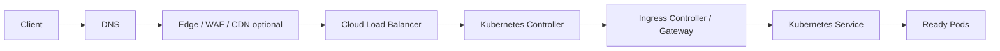
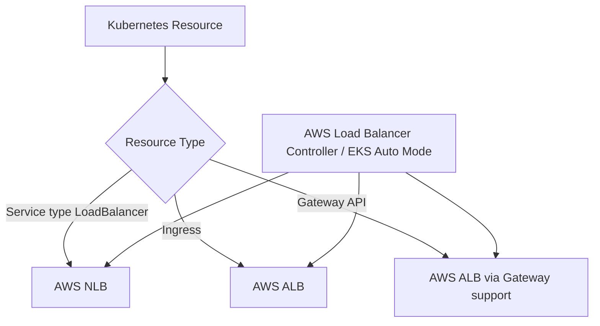
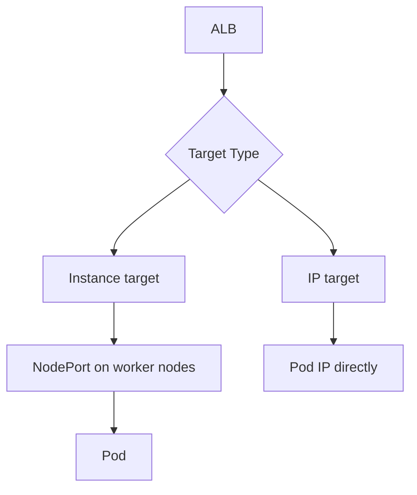
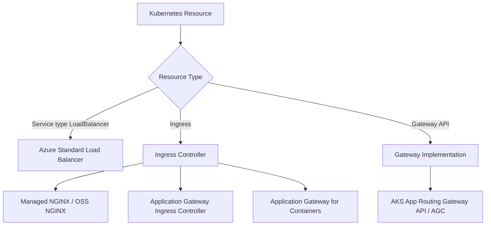
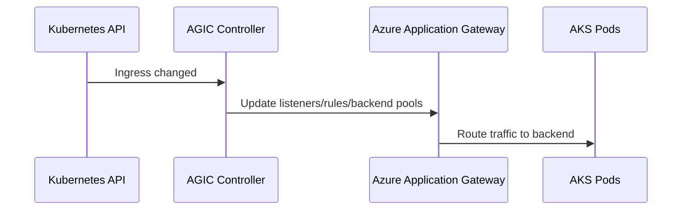
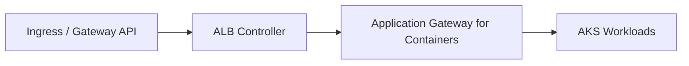
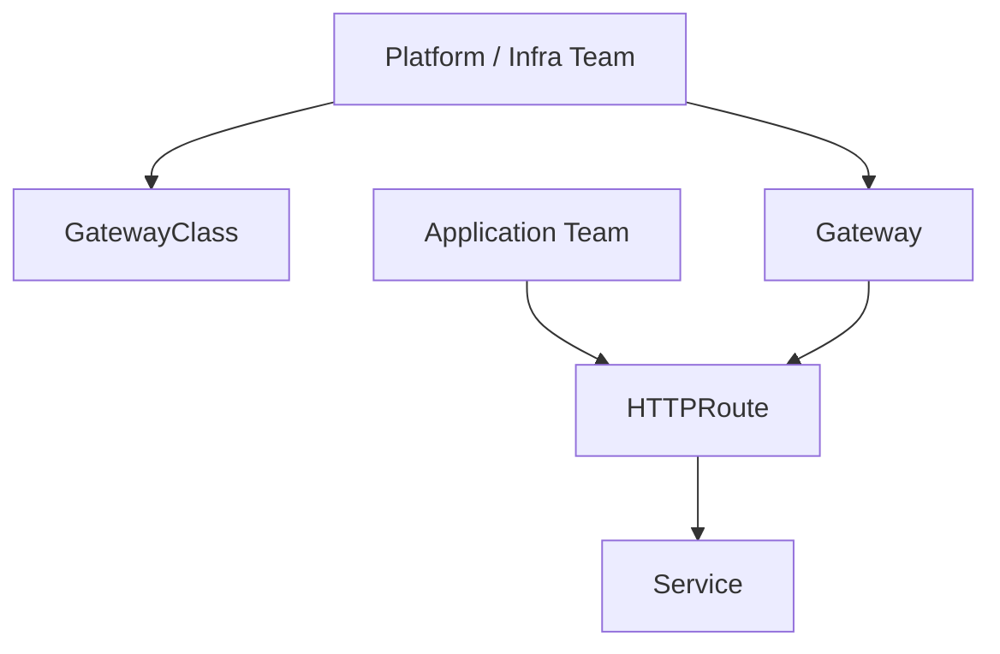
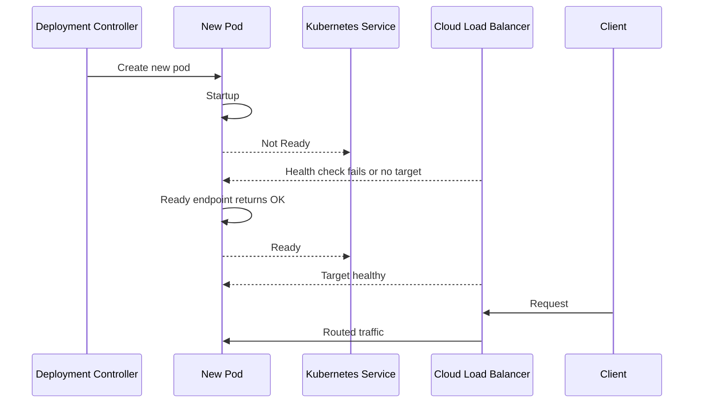

# Part 018 — Cloud Load Balancing and Ingress on AWS/Azure

A Kubernetes workload is not production-ready because it has a `Service`.

It becomes production-ready when traffic has a clear ownership chain:

```text
DNS -> TLS -> edge/WAF -> cloud load balancer -> ingress/gateway -> Service -> Pod -> readiness -> app
```

Each link has a failure mode. Each link has a different owner. Each link has different behavior in AWS and Azure.

This part teaches how to design load balancing and ingress as a production traffic system, not as YAML snippets.

---

## 1. The Traffic Ownership Mental Model

For a user request reaching Kubernetes, ask six questions:

```text
1. Where does DNS point?
2. Where is TLS terminated?
3. Which cloud load balancer receives the packet?
4. Which Kubernetes controller owns cloud resource reconciliation?
5. Which backend target type is used: node, pod, gateway, or proxy?
6. Which health signal decides whether traffic is allowed?
```

Visual model:



If your team cannot draw this path for every public and private endpoint, the platform is not yet production-operable.

---

## 2. Kubernetes Abstractions vs Cloud Reality

Kubernetes gives you generic APIs:

| Kubernetes API | Purpose |
|---|---|
| `Service type: ClusterIP` | Internal stable virtual IP |
| `Service type: LoadBalancer` | Ask cloud/provider to create external/internal L4 load balancer |
| `Ingress` | HTTP/HTTPS routing abstraction |
| `Gateway API` | Role-oriented, extensible, protocol-aware traffic API |

Cloud providers implement those abstractions differently.

On AWS:

```text
Service LoadBalancer -> usually NLB through AWS Load Balancer Controller or EKS Auto Mode
Ingress -> ALB through AWS Load Balancer Controller
Gateway API -> ALB support via AWS Load Balancer Controller in newer versions
```

On Azure:

```text
Service LoadBalancer -> Azure Standard Load Balancer
Ingress -> managed NGINX, AGIC, Application Gateway for Containers, or other controller
Gateway API -> AKS application routing Gateway API, Application Gateway for Containers, or supported implementation
```

Important invariant:

> Kubernetes API expresses desired traffic intent. The cloud controller decides what infrastructure appears.

This is why annotations, controller versions, subnet tags, managed add-ons, identity permissions, and cloud quotas matter.

---

## 3. Layer 4 vs Layer 7

Do not choose a load balancer by popularity. Choose by protocol and routing responsibility.

| Layer | Handles | Kubernetes API | AWS common option | Azure common option |
|---|---|---|---|---|
| L4 | TCP/UDP, connection-level routing | `Service type: LoadBalancer` | NLB | Azure Load Balancer |
| L7 | HTTP/HTTPS/gRPC routing | `Ingress`, `Gateway API` | ALB | Application Gateway / App Gateway for Containers / managed Gateway API / NGINX |

### Choose L4 when

- protocol is not HTTP-aware;
- you need TCP/UDP pass-through;
- TLS termination happens in the app or another proxy;
- workload is a broker, proxy, game server, custom protocol, or database-like endpoint;
- minimal request routing is needed.

### Choose L7 when

- routing depends on host/path/header;
- TLS lifecycle must be centralized;
- WAF policies are required;
- gRPC routing matters;
- canary/weighted routing is needed;
- application teams need route-level ownership.

Production anti-pattern:

```text
Expose every HTTP service as Service type LoadBalancer.
```

That creates one cloud load balancer per service, weak route governance, expensive sprawl, scattered TLS, and poor traffic policy reuse.

---

## 4. Service type LoadBalancer

A `Service` with `type: LoadBalancer` asks the provider to allocate a cloud load balancer and route traffic to service backends.

Baseline:

```yaml
apiVersion: v1
kind: Service
metadata:
  name: public-api
  namespace: platform-demo
spec:
  type: LoadBalancer
  selector:
    app: public-api
  ports:
    - name: http
      port: 80
      targetPort: 8080
```

This is simple and useful, but in production you must define:

- internal or internet-facing;
- static IP or dynamic IP;
- health check behavior;
- source IP preservation;
- allowed source ranges;
- load balancer class/controller ownership;
- cross-zone behavior;
- target type;
- TLS pass-through or termination;
- cost and quota impact.

---

## 5. EKS Load Balancing Model

EKS has several possible controllers/paths. The strategic default for most modern EKS clusters is to use AWS Load Balancer Controller or EKS Auto Mode-managed behavior, not the legacy in-tree service controller.



### ALB vs NLB on EKS

| Feature | ALB | NLB |
|---|---|---|
| Layer | L7 | L4 |
| Typical Kubernetes API | Ingress / Gateway API | Service LoadBalancer |
| Protocol fit | HTTP, HTTPS, gRPC-style app traffic | TCP, UDP, TLS pass-through |
| Routing | Host/path/header-aware | Port/listener/target based |
| Targets | Instance or IP | Instance or IP depending configuration/controller |
| WAF | Natural fit | Not same L7 model |
| Use case | Web APIs, public/private HTTP services | Brokers, TCP services, high-performance L4 ingress |

---

## 6. EKS ALB Ingress Pattern

Example ALB-backed Ingress:

```yaml
apiVersion: networking.k8s.io/v1
kind: Ingress
metadata:
  name: payments-api
  namespace: payments
  annotations:
    alb.ingress.kubernetes.io/scheme: internet-facing
    alb.ingress.kubernetes.io/target-type: ip
    alb.ingress.kubernetes.io/listen-ports: '[{"HTTP": 80}, {"HTTPS": 443}]'
    alb.ingress.kubernetes.io/healthcheck-path: /readyz
spec:
  ingressClassName: alb
  rules:
    - host: api.example.com
      http:
        paths:
          - path: /payments
            pathType: Prefix
            backend:
              service:
                name: payments-api
                port:
                  number: 8080
```

### Target type: instance vs IP



| Target type | Meaning | Trade-off |
|---|---|---|
| instance | ALB targets nodes/NodePort; kube-proxy routes to pods | More indirection; works with node targets |
| ip | ALB targets pod IPs directly | Cleaner path; required for Fargate; depends on pod routability and controller support |

For EKS with VPC CNI, IP target mode is often attractive because pod IPs are VPC IPs. But you still need to understand readiness, security groups, subnet capacity, and controller ownership.

### Subnet discovery matters

For ALB/NLB provisioning, AWS needs to know which subnets are eligible for public or internal load balancers. In production, do not rely on accidental discovery. Use correct subnet tags or explicit subnet annotations where appropriate.

```text
Public LB subnets:  kubernetes.io/role/elb = 1
Internal LB subnets: kubernetes.io/role/internal-elb = 1
Cluster ownership/shared tags when required by architecture
```

Mis-tagged subnets cause some of the most confusing ingress failures: the Ingress object exists, controller runs, but the load balancer never becomes correct.

---

## 7. EKS NLB Service Pattern

Example internal NLB Service:

```yaml
apiVersion: v1
kind: Service
metadata:
  name: internal-tcp-gateway
  namespace: platform
  annotations:
    service.beta.kubernetes.io/aws-load-balancer-scheme: internal
    service.beta.kubernetes.io/aws-load-balancer-nlb-target-type: ip
spec:
  type: LoadBalancer
  selector:
    app: tcp-gateway
  ports:
    - name: tcp
      protocol: TCP
      port: 443
      targetPort: 8443
```

Use NLB when you need:

- L4 traffic;
- TCP/UDP exposure;
- static-ish high-performance endpoint behavior;
- TLS pass-through;
- source IP preservation requirements;
- non-HTTP workloads.

### EKS NLB failure modes

| Symptom | Likely cause |
|---|---|
| Load balancer not created | Controller missing permissions, wrong annotations, subnet discovery failure |
| Targets unhealthy | Health check path/port wrong, readiness not aligned, security groups blocked |
| Traffic goes to wrong nodes | Instance target mode + NodePort/kube-proxy behavior misunderstood |
| Works in public, fails internal | Wrong subnet scheme/tags/security groups/routing |
| Source IP unexpected | External traffic policy/target mode/proxy behavior not designed |

---

## 8. AKS Load Balancing Model

AKS exposes `Service type: LoadBalancer` through Azure Load Balancer. For HTTP ingress, teams choose among managed NGINX/application routing, Application Gateway Ingress Controller, Application Gateway for Containers, Gateway API implementations, or third-party ingress controllers.



### AKS options at a glance

| Option | Layer | Where it runs | Best fit |
|---|---|---|---|
| Azure Load Balancer | L4 | Azure managed LB | TCP/UDP or simple Service exposure |
| Managed NGINX application routing | L7 | In-cluster controller managed by add-on | Existing/basic Ingress API use, migration context |
| Application Gateway Ingress Controller | L7 | Controller in cluster, App Gateway outside | Existing Application Gateway integration |
| Application Gateway for Containers | L7 | Azure-managed dataplane outside cluster | Strategic Azure-native ingress for container workloads |
| AKS app routing Gateway API | L7 | Managed Gateway API implementation | Gateway API-native managed ingress path |
| Self-managed ingress controller | L7 | In cluster | Full customization but full operational ownership |

---

## 9. AKS Azure Load Balancer Service Pattern

Public LoadBalancer Service:

```yaml
apiVersion: v1
kind: Service
metadata:
  name: public-svc
  namespace: demo
spec:
  type: LoadBalancer
  selector:
    app: public-app
  ports:
    - port: 80
      targetPort: 8080
```

Internal LoadBalancer Service:

```yaml
apiVersion: v1
kind: Service
metadata:
  name: internal-svc
  namespace: demo
  annotations:
    service.beta.kubernetes.io/azure-load-balancer-internal: "true"
spec:
  type: LoadBalancer
  selector:
    app: internal-app
  ports:
    - port: 80
      targetPort: 8080
```

Production concerns:

- public vs internal frontend;
- static private/public IP ownership;
- subnet selection;
- health probe protocol/path;
- `externalTrafficPolicy` behavior;
- SNAT/outbound rule interactions;
- Azure resource group ownership;
- public IP SKU and lifecycle;
- firewall and NSG rules.

### Static IP ownership

Avoid letting important endpoints depend on ephemeral IP lifecycle. For production, reserve and explicitly attach static public/private IPs where appropriate, and bind DNS to the intended stable endpoint.

---

## 10. AKS Application Gateway and Application Gateway for Containers

Azure has multiple L7 ingress paths. The important difference is ownership model.

### AGIC mental model



AGIC is useful when your organization already uses Application Gateway and wants Kubernetes Ingress resources to configure it. But it couples Kubernetes reconciliation to an existing Azure L7 resource, and sharing Application Gateway across unrelated ownership domains can create governance risk.

### Application Gateway for Containers mental model

Application Gateway for Containers is a managed L7 load balancing and ingress service for Kubernetes workloads. Its controller translates Kubernetes Ingress/Gateway API intent into Azure-managed application load balancing infrastructure.



Why it matters:

- designed for Kubernetes workloads;
- supports modern Ingress/Gateway API paths;
- data plane is outside the cluster;
- reduces burden of running all ingress dataplane inside nodes;
- better fit for long-term Azure-native container ingress than legacy patterns.

---

## 11. Gateway API as Platform Boundary

Ingress is simple but overloaded. Gateway API separates responsibilities more cleanly.



Typical ownership:

| Resource | Owner | Responsibility |
|---|---|---|
| `GatewayClass` | Platform team | Which controller/provider implements gateway |
| `Gateway` | Platform or environment team | Listener, address, TLS, allowed routes |
| `HTTPRoute` | App team | Host/path/backend routing within allowed boundary |
| `Service` | App team | Backend selection and port contract |

Gateway API is valuable for platform engineering because it models delegation. App teams can own routes without owning the entire edge.

### Example Gateway API shape

```yaml
apiVersion: gateway.networking.k8s.io/v1
kind: Gateway
metadata:
  name: public-gateway
  namespace: platform-ingress
spec:
  gatewayClassName: managed-l7
  listeners:
    - name: https
      protocol: HTTPS
      port: 443
      hostname: "*.example.com"
      tls:
        mode: Terminate
        certificateRefs:
          - name: wildcard-example-com
      allowedRoutes:
        namespaces:
          from: Selector
          selector:
            matchLabels:
              ingress-access: public
---
apiVersion: gateway.networking.k8s.io/v1
kind: HTTPRoute
metadata:
  name: payments-route
  namespace: payments
spec:
  parentRefs:
    - name: public-gateway
      namespace: platform-ingress
  hostnames:
    - api.example.com
  rules:
    - matches:
        - path:
            type: PathPrefix
            value: /payments
      backendRefs:
        - name: payments-api
          port: 8080
```

The exact `gatewayClassName` depends on provider/controller. The design concept is portable; the implementation details are provider-specific.

---

## 12. TLS Termination Patterns

TLS is not just encryption. It is also ownership, certificate lifecycle, compliance, and debugging.

| Pattern | Meaning | Use when |
|---|---|---|
| Terminate at cloud LB | LB handles cert; backend HTTP or re-encrypted | Centralized cert/WAF/edge policy |
| Terminate at ingress controller | In-cluster controller handles cert | App/platform wants Kubernetes-native cert flow |
| Pass-through to pod | App handles TLS | mTLS/custom protocols/end-to-end constraints |
| Terminate and re-encrypt | LB terminates then TLS to backend | Compliance requires encrypted backend hop |

Production questions:

```text
Where is the private key stored?
Who rotates the certificate?
Can app teams request hostnames safely?
Is wildcard allowed?
Is backend traffic encrypted?
How are expired certificates detected before outage?
How does rollback affect cert references?
```

Certificate lifecycle deserves its own part later, but load balancing design must reserve the termination point now.

---

## 13. Health Checks and Readiness Alignment

Cloud load balancer health checks and Kubernetes readiness checks are related but not identical.

Bad design:

```text
Kubernetes readiness checks /readyz.
ALB/App Gateway checks /.
App returns 200 on / even when dependencies are unavailable.
Cloud LB sends traffic to broken pods.
```

Better design:

```text
Readiness endpoint represents ability to serve traffic.
Cloud LB health check path aligns with readiness where possible.
Ingress/gateway backend health reflects same serving contract.
Slow startup protected by startupProbe.
Shutdown protected by readiness drop + graceful termination.
```

Request lifecycle during deployment:



A production ingress is only as good as the readiness semantics behind it.

---

## 14. Public vs Private Ingress

Every endpoint should be classified.

| Exposure | Meaning | Examples |
|---|---|---|
| Public internet | Reachable from internet | Customer APIs, public web apps |
| Partner private | Reachable from partner networks | B2B APIs, private exchange |
| Corporate private | Reachable from internal networks | Admin portals, internal APIs |
| Cluster internal | Reachable only inside cluster | Service-to-service |
| Namespace internal | Restricted by NetworkPolicy/service mesh | Sensitive east-west traffic |

Do not expose admin APIs through the same public ingress just because it is convenient.

### Internal ingress pattern

```text
Private DNS -> internal LB / private Application Gateway / internal Gateway -> Service -> Pods
```

### Public ingress pattern

```text
Public DNS -> CDN/WAF optional -> public ALB/App Gateway/AGC -> Service -> Pods
```

### Hybrid mistake

```text
One public load balancer, host rules for both public and private apps.
```

This is easy to create and hard to govern.

---

## 15. Source IP Preservation

Some workloads need the client source IP for audit, rate limiting, fraud, geo, or access control.

But source IP behavior changes depending on:

- load balancer type;
- target type;
- `externalTrafficPolicy`;
- proxy protocol;
- X-Forwarded-For headers;
- ingress controller behavior;
- CDN/WAF presence;
- NAT/firewall path.

Rule of thumb:

> Do not build security decisions from source IP until you have tested the exact ingress path.

For HTTP, prefer explicit trusted proxy chain handling:

```text
Client IP -> CDN/WAF -> Cloud LB -> Ingress -> App
              adds/updates X-Forwarded-For / Forwarded headers
```

Application code must trust only known proxies, not arbitrary headers from clients.

---

## 16. Controller Ownership and Drift

Cloud load balancers are reconciled by controllers. Manual edits are usually drift.

Examples:

```text
Engineer manually changes ALB listener in AWS console.
Controller reverts it.
Security team changes Azure Load Balancer rule manually.
AKS reconciliation conflicts.
Someone edits Application Gateway shared with AGIC.
Ingress update overwrites part of the configuration.
```

Production rule:

> If Kubernetes owns a cloud load balancer, do not manually mutate that load balancer outside the owning API path.

Exceptions must be documented as provider-supported extension points, annotations, custom resources, or infrastructure-as-code-managed resources that the controller expects.

---

## 17. Decision Matrix

### AWS/EKS

| Requirement | Recommended starting point |
|---|---|
| HTTP public API | ALB via AWS Load Balancer Controller or EKS Auto Mode |
| HTTP internal API | Internal ALB |
| TCP/UDP service | NLB via Service LoadBalancer |
| Fargate backend | ALB/NLB IP target mode as supported |
| Gateway API platform model | AWS Load Balancer Controller Gateway API support where feature fit is adequate |
| Full in-cluster custom proxy | NGINX/Envoy/Kong/etc. behind NLB/ALB, with explicit ownership |

### Azure/AKS

| Requirement | Recommended starting point |
|---|---|
| Simple TCP/UDP | Azure Standard Load Balancer via Service LoadBalancer |
| HTTP public app, Azure-native managed L7 | Application Gateway for Containers |
| Existing Application Gateway estate | AGIC with strict ownership boundaries, or migration to AGC |
| Gateway API-native platform | AKS application routing Gateway API or AGC Gateway API support |
| In-cluster customized ingress | Managed/self-managed NGINX/Envoy/Kong with clear operational ownership |
| Internal-only enterprise APIs | Internal LB / private App Gateway / internal Gateway pattern |

---

## 18. Failure Modes

### Failure mode: Load balancer created but no traffic reaches pods

Symptoms:

```text
DNS resolves.
LB exists.
Request times out or returns 503.
Pods are Running.
```

Likely causes:

- backend health check fails;
- pods are not Ready;
- Service selector does not match pods;
- wrong target port;
- security group/NSG/firewall blocks path;
- target type mismatch;
- ingress controller not reconciling;
- NetworkPolicy blocks ingress controller to backend.

Debug order:

```bash
kubectl get ingress,svc,endpointslices -n <namespace>
kubectl describe ingress <name> -n <namespace>
kubectl describe svc <name> -n <namespace>
kubectl get pods -n <namespace> -o wide
kubectl logs -n <controller-namespace> deploy/<controller-name>
```

### Failure mode: Ingress object exists but cloud LB is not provisioned

Likely causes:

- wrong `ingressClassName`;
- controller not installed;
- controller identity lacks permissions;
- subnet tags/selection incorrect;
- annotation invalid;
- cloud quota exceeded;
- provider add-on not enabled;
- Gateway API CRDs missing or wrong implementation.

### Failure mode: internal endpoint becomes public

Likely causes:

- missing internal scheme annotation;
- wrong Gateway listener/address class;
- public subnet selected;
- DNS points to public frontend;
- shared ingress controller has mixed route policy.

Prevent with policy-as-code:

```text
Sensitive namespaces may only bind to approved internal Gateway/IngressClass.
Public ingress requires explicit label and security review.
```

### Failure mode: deployment causes brief outage

Likely causes:

- LB health check and readiness not aligned;
- termination grace too short;
- preStop missing for slow-draining apps;
- deregistration delay not considered;
- `maxUnavailable` too aggressive;
- app accepts traffic before warmed.

### Failure mode: certificate expires

Likely causes:

- manual certificate management;
- no alerting on expiry;
- wrong secret/cert reference;
- DNS validation broken;
- cloud cert and Kubernetes secret lifecycles split.

---

## 19. Production Traffic Runbook

For every ingress endpoint, document:

```text
Service name:
Namespace:
Business owner:
Public/private classification:
DNS zone and record:
TLS termination point:
Certificate owner:
Cloud load balancer type:
Controller owner:
IngressClass/GatewayClass:
Backend Service:
Health check path:
Readiness endpoint:
Allowed source ranges:
WAF policy:
Rate limit policy:
Observability dashboard:
SLO:
Rollback procedure:
```

Example compact runbook entry:

```yaml
endpoint: api.example.com/payments
classification: public-customer-api
dns:
  provider: Route53
  record: api.example.com
cloudLoadBalancer:
  platform: aws
  type: alb
  scheme: internet-facing
  owner: aws-load-balancer-controller
tls:
  termination: alb
  certificate: acm/wildcard-example-com
routing:
  kubernetesApi: ingress
  namespace: payments
  ingressClassName: alb
  service: payments-api
  servicePort: 8080
health:
  path: /readyz
  expected: 200
security:
  waf: enabled
  sourceRestriction: public
  networkPolicy: allow-ingress-controller-only
slo:
  availability: 99.95
  latencyP95: 300ms
rollback:
  strategy: argocd rollback previous revision
```

---

## 20. Policy Guardrails

Load balancing should not be left to free-form annotations in every team.

Guardrails worth enforcing:

- public ingress requires approved namespace label;
- internal workloads cannot use internet-facing LB scheme;
- only approved `IngressClass` / `GatewayClass` values are allowed;
- TLS is required for public HTTP routes;
- wildcard hosts require platform approval;
- Services of type `LoadBalancer` are blocked by default except approved namespaces;
- cloud LB annotations must match platform templates;
- health check path must be declared;
- owner/team labels are mandatory;
- DNS hostname must match allowed domain suffix.

Example Kyverno-style intent:

```yaml
apiVersion: kyverno.io/v1
kind: ClusterPolicy
metadata:
  name: restrict-public-loadbalancers
spec:
  validationFailureAction: Enforce
  rules:
    - name: block-public-lb-without-approval
      match:
        any:
          - resources:
              kinds:
                - Service
      validate:
        message: "Public LoadBalancer Services require platform approval."
        deny:
          conditions:
            all:
              - key: "{{ request.object.spec.type || '' }}"
                operator: Equals
                value: LoadBalancer
              - key: "{{ request.object.metadata.labels.platform\.company\.com/public-lb-approved || 'false' }}"
                operator: NotEquals
                value: "true"
```

This is not about bureaucracy. It prevents expensive, insecure, untracked cloud entry points.

---

## 21. Observability for Load Balancing

You need visibility at each layer.

| Layer | Signals |
|---|---|
| DNS | resolution errors, wrong target, TTL behavior |
| CDN/WAF | blocked requests, rule matches, latency, origin errors |
| Cloud LB | target health, 4xx/5xx, connection errors, TLS errors, request count |
| Ingress/gateway | route status, proxy errors, upstream latency, config reloads |
| Service | endpoint count, EndpointSlice updates |
| Pod | readiness, restarts, app latency, dependency errors |

Minimal dashboards:

```text
Endpoint availability by host/path
LB target health by backend
Ingress 4xx/5xx by route
Upstream latency by service
TLS certificate expiry
Controller reconciliation errors
EndpointSlice backend count
NetworkPolicy denies if available
```

Alerts should distinguish:

- no healthy backends;
- high 5xx from app;
- high 5xx from ingress/gateway;
- TLS expiry approaching;
- controller reconciliation failures;
- cloud quota exhaustion;
- public endpoint created unexpectedly.

---

## 22. Practice Exercise

Design traffic architecture for this platform:

```text
Clouds: AWS EKS and Azure AKS
Applications:
- public customer REST APIs
- public customer web frontend
- private admin portal
- internal TCP fraud scoring service
- partner B2B API with IP allowlist
- batch worker with no inbound traffic
Security:
- TLS required everywhere public
- WAF required for customer-facing HTTP
- private admin access only through corporate network
- no random Service type LoadBalancer allowed
Operations:
- app teams own route definitions
- platform team owns edge infrastructure
- blue/green or canary desirable for selected APIs
```

Deliverables:

1. Choose AWS load balancer pattern for each app.
2. Choose Azure load balancer/ingress pattern for each app.
3. Define public/private DNS shape.
4. Define Gateway API or Ingress ownership model.
5. Define TLS termination points.
6. Define health check contract.
7. Define policy guardrails.
8. Define observability dashboards and alerts.

Good answer characteristics:

- does not expose batch workers;
- does not give every HTTP service its own public LoadBalancer;
- uses L4 only for protocols that need it;
- separates admin/private from public customer ingress;
- defines ownership between platform and application teams;
- includes health/readiness semantics;
- includes policy enforcement to prevent drift.

---

## 23. Final Mental Model

A production Kubernetes ingress path is a distributed system.

It includes:

```text
DNS
certificate authority
cloud load balancer
controller reconciliation
subnet selection
security groups / NSGs
route tables
gateway or ingress proxy
Kubernetes Service
EndpointSlice
Pod readiness
application health
observability
policy
```

The YAML is only the desired state. The platform engineer's job is to make sure the real traffic path converges safely, predictably, and observably.

---

## References

- Kubernetes Documentation — Service: https://kubernetes.io/docs/concepts/services-networking/service/
- Kubernetes Documentation — Ingress: https://kubernetes.io/docs/concepts/services-networking/ingress/
- Kubernetes Documentation — Gateway API: https://kubernetes.io/docs/concepts/services-networking/gateway/
- AWS EKS User Guide — AWS Load Balancer Controller: https://docs.aws.amazon.com/eks/latest/userguide/aws-load-balancer-controller.html
- AWS EKS User Guide — Application Load Balancing with ALB: https://docs.aws.amazon.com/eks/latest/userguide/alb-ingress.html
- AWS EKS User Guide — Network Load Balancing with NLB: https://docs.aws.amazon.com/eks/latest/userguide/network-load-balancing.html
- AWS EKS Best Practices — Load Balancing: https://docs.aws.amazon.com/eks/latest/best-practices/load-balancing.html
- Microsoft Learn — Use a Public Standard Load Balancer in AKS: https://learn.microsoft.com/en-us/azure/aks/load-balancer-standard
- Microsoft Learn — Create an Internal Load Balancer in AKS: https://learn.microsoft.com/en-us/azure/aks/internal-lb
- Microsoft Learn — Ingress networking in AKS: https://learn.microsoft.com/en-us/azure/aks/concepts-network-ingress
- Microsoft Learn — Application Gateway Ingress Controller: https://learn.microsoft.com/en-us/azure/application-gateway/ingress-controller-overview
- Microsoft Learn — Application Gateway for Containers: https://learn.microsoft.com/en-us/azure/application-gateway/for-containers/overview
- Microsoft Learn — AKS Application Routing with Gateway API: https://learn.microsoft.com/en-us/azure/aks/app-routing-gateway-api
