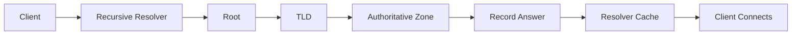
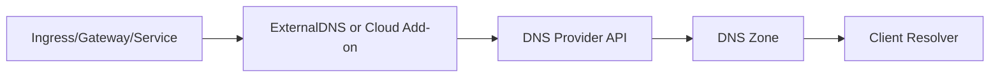
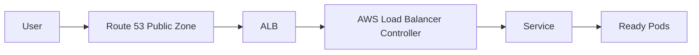
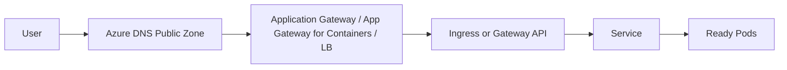
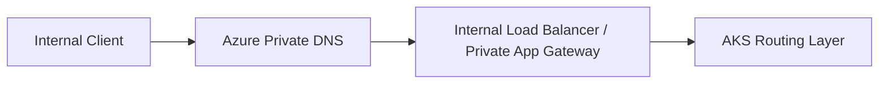
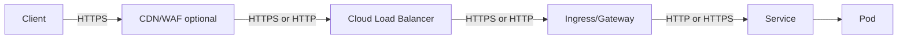
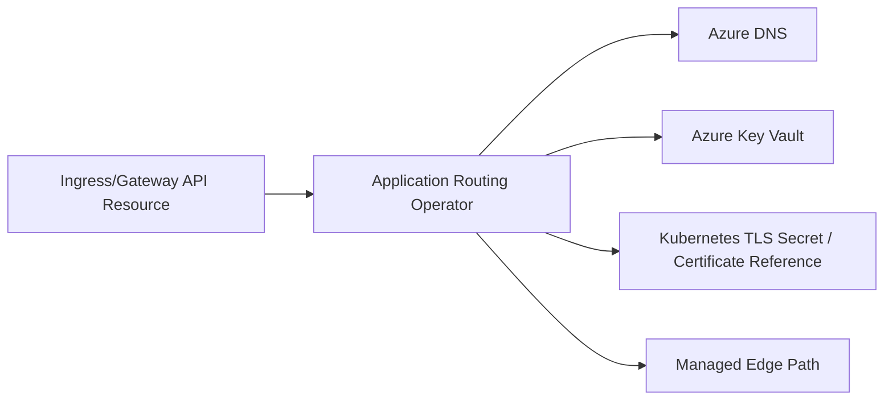
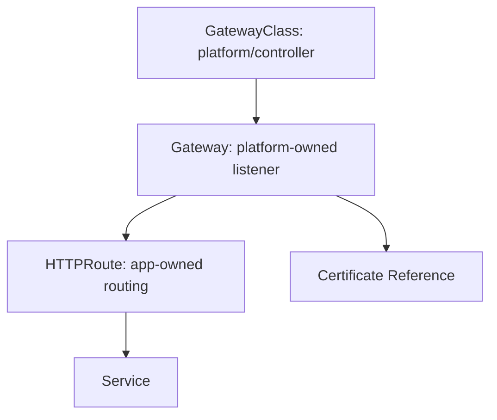
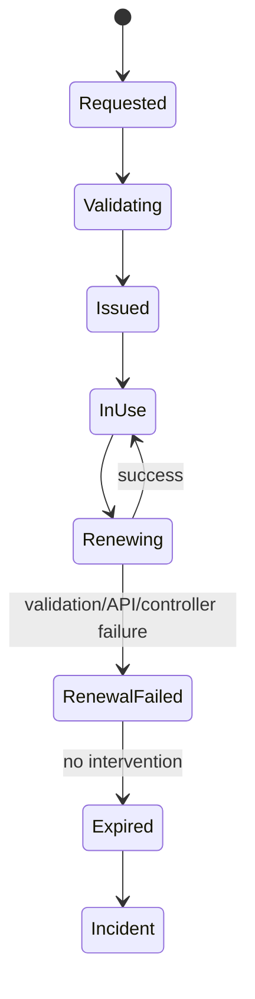

# Part 019 — DNS, TLS, Certificates, and Edge Security

A production endpoint is not just an `Ingress`.

A production endpoint is a chain of contracts:

```text
name -> resolution -> routing -> TLS -> policy -> load balancer -> gateway/ingress -> service -> ready pod
```

When an incident happens, users do not say:

> the Gateway resource is unhealthy.

They say:

> api.company.com is down.

So this part starts from the user-facing name and works inward.

The goal is to make DNS, TLS, and edge security boring. Boring means predictable. Predictable means each layer has a known owner, a known failure mode, a known rollback, and a known observability signal.

---

## 1. The Endpoint Contract

For every endpoint, define the contract explicitly.

```yaml
endpointContract:
  hostname: api.prod.example.com
  visibility: public
  dnsProvider: route53
  dnsZone: example.com
  tlsTermination: aws-alb
  certificateSource: acm
  ingressApi: kubernetes-ingress
  ingressController: aws-load-balancer-controller
  backendService: order-api.default.svc.cluster.local
  backendProtocol: http
  authLayer: application
  waf: enabled
  ownerTeam: platform-edge
  appOwner: order-platform
```

That contract is more important than the YAML.

The YAML is an implementation. The contract is the invariant.

A strong endpoint contract answers:

1. Who owns the DNS record?
2. Who owns the certificate?
3. Who rotates the certificate?
4. Where does TLS terminate?
5. Is traffic public, private, partner-only, or internal?
6. Which controller is allowed to mutate DNS/load balancer resources?
7. Which health check protects the user path?
8. Which logs prove that traffic reached each layer?
9. How do we revoke the endpoint fast?
10. How do we recover if the certificate or DNS automation fails?

If those answers are implicit, the platform is fragile.

---

## 2. Mental Model: DNS Is a Naming Control Plane

DNS is not just a mapping from name to IP.

DNS is a distributed naming control plane with caching, delegation, propagation delay, and stale state.



Kubernetes engineers often underestimate DNS because Kubernetes internal DNS feels simple:

```text
service.namespace.svc.cluster.local
```

External DNS is not that simple.

External DNS has:

- public zones
- private zones
- split-horizon names
- delegation boundaries
- TTL behavior
- negative caching
- wildcard records
- apex record constraints
- cloud-specific alias records
- ownership conflicts
- stale records after controller failure
- propagation delay outside your cluster

A production Kubernetes platform must treat DNS as part of the application delivery path.

---

## 3. Internal DNS vs External DNS

Do not mix these two models.

| Scope | Example | Owner | Failure Impact |
|---|---|---|---|
| Internal Kubernetes DNS | `orders.default.svc.cluster.local` | CoreDNS + Kubernetes API | Service-to-service discovery fails |
| Internal cloud DNS | `orders.prod.internal.example.com` | Route 53 private hosted zone / Azure Private DNS | VPC/VNet workloads cannot resolve private endpoints |
| Public DNS | `api.example.com` | Route 53 public hosted zone / Azure DNS public zone | Internet users cannot reach the service |
| Partner DNS | `partner-api.example.com` | DNS + firewall + private link/VPN policy | Partner traffic fails or leaks |

Internal Kubernetes DNS is derived from Kubernetes objects.

External DNS is usually derived from load balancer, ingress, gateway, or explicit DNS automation.

The mental boundary:

```text
Kubernetes DNS answers: where is the Service inside the cluster?
External DNS answers: where should a client enter the platform?
```

---

## 4. Kubernetes Internal DNS

Kubernetes DNS creates stable names for Services and, in some cases, Pods.

Common Service names:

```text
orders
orders.default
orders.default.svc
orders.default.svc.cluster.local
```

Example:

```bash
kubectl run dns-debug --rm -it --image=busybox:1.36 --restart=Never -- nslookup orders.default.svc.cluster.local
```

### 4.1 DNS Search Path

Inside a Pod, `/etc/resolv.conf` typically includes search domains such as:

```text
default.svc.cluster.local
svc.cluster.local
cluster.local
```

That is why an application in the same namespace can often call:

```text
http://orders:8080
```

But production services should not rely blindly on short names when cross-namespace calls are involved.

Prefer explicit names:

```text
orders.payment.svc.cluster.local
```

This makes dependency intent clear.

### 4.2 Headless Service DNS

A normal Service gives a virtual stable endpoint.

A headless Service gives direct endpoint records.

```yaml
apiVersion: v1
kind: Service
metadata:
  name: postgres
  namespace: data
spec:
  clusterIP: None
  selector:
    app: postgres
  ports:
    - name: postgres
      port: 5432
```

Headless Service is useful when clients need stable per-Pod identity, such as StatefulSet members:

```text
postgres-0.postgres.data.svc.cluster.local
postgres-1.postgres.data.svc.cluster.local
```

Use it carefully. It pushes more topology awareness to clients.

### 4.3 DNS Failure Modes Inside the Cluster

| Symptom | Likely Cause | First Check |
|---|---|---|
| Service name cannot resolve | CoreDNS down, Service missing, namespace typo | `kubectl -n kube-system get pods -l k8s-app=kube-dns` |
| Resolution slow | CoreDNS overloaded, upstream DNS slow, high ndots behavior | CoreDNS metrics/logs |
| External names fail | Egress DNS blocked, upstream resolver unavailable | NetworkPolicy / node DNS config |
| Only some Pods fail | Pod DNS policy, custom `dnsConfig`, node issue | compare `/etc/resolv.conf` |
| Headless records stale | EndpointSlice delay, readiness not aligned | `kubectl get endpointslice` |

DNS debugging is not optional. Every platform runbook needs it.

---

## 5. External DNS Pattern

The external DNS pattern is simple in concept:



ExternalDNS is a common Kubernetes controller that watches exposed Services/Ingresses and synchronizes records with DNS providers.

Example Ingress with ExternalDNS annotation:

```yaml
apiVersion: networking.k8s.io/v1
kind: Ingress
metadata:
  name: orders
  namespace: prod-orders
  annotations:
    external-dns.alpha.kubernetes.io/hostname: orders.prod.example.com
spec:
  ingressClassName: nginx
  rules:
    - host: orders.prod.example.com
      http:
        paths:
          - path: /
            pathType: Prefix
            backend:
              service:
                name: orders
                port:
                  number: 8080
```

The controller resolves the target from the Ingress status or Service status and updates the DNS provider.

This is powerful, but it creates a new privilege boundary.

A DNS controller can publish names. Publishing names is production power.

---

## 6. DNS Ownership Model

External DNS automation needs strict ownership.

Bad model:

```text
Every cluster can mutate every record in example.com.
```

Good model:

```text
Cluster A can mutate only *.dev.example.com.
Cluster B can mutate only *.staging.example.com.
Production platform controller can mutate only approved production zones.
Shared security-owned records require manual or pipeline approval.
```

Typical controls:

- domain filters
- zone ID filters
- TXT registry ownership
- cloud IAM least privilege
- namespace allow-list
- admission policy for hostname suffix
- separate controller instances for public and private zones
- separate cloud identities per environment
- separate change review for root/apex/critical hostnames

Example ExternalDNS flags conceptually:

```yaml
args:
  - --source=ingress
  - --source=service
  - --domain-filter=prod.example.com
  - --registry=txt
  - --txt-owner-id=eks-prod-us-east-1
  - --policy=sync
```

`--policy=sync` can delete records that no longer match desired state. That is correct for strongly-owned zones and dangerous for shared zones.

When in doubt, use `upsert-only` until ownership is mature.

---

## 7. TTL Is a Reliability Lever

TTL is not just performance tuning.

TTL controls how long stale answers survive.

| TTL | Good For | Risk |
|---:|---|---|
| 30s | active cutovers, incident recovery | higher resolver/provider load |
| 60s-300s | normal service endpoints | moderate stale-cache window |
| 1h+ | stable infrastructure records | slow recovery from wrong target |

Rules:

1. Use short TTL during migrations.
2. Raise TTL only when the target is stable.
3. Do not assume all clients obey TTL perfectly.
4. Monitor both DNS record state and actual client behavior.
5. Document expected propagation time in runbooks.

DNS cutovers fail when teams confuse:

```text
authoritative zone updated
```

with:

```text
all clients are using the new answer
```

Those are not the same event.

---

## 8. Split-Horizon DNS

Split-horizon DNS means the same name can resolve differently depending on resolver context.

Example:

```text
api.prod.example.com
  public internet -> public load balancer
  corporate network -> private load balancer
  VPC/VNet -> private load balancer
```

This is useful, but dangerous.

Failure modes:

- public clients receive private IPs
- internal clients receive public IPs and hairpin through the internet
- cert validation works but routing path is wrong
- incident tests from engineer laptop do not match production clients
- private hosted zone overrides public name unexpectedly

Use split-horizon only when the operating model is mature.

For regulated systems, split-horizon DNS must be documented because it affects auditability of traffic paths.

---

## 9. AWS DNS Pattern: Route 53 + EKS

A typical EKS public endpoint pattern:



### 9.1 Public Zone

Use a Route 53 public hosted zone for internet-facing names.

Example:

```text
orders.prod.example.com -> alias to ALB DNS name
```

Prefer alias records for AWS load balancer targets when supported.

### 9.2 Private Zone

Use Route 53 private hosted zones for VPC-only names.

Example:

```text
orders.prod.internal.example.com -> internal ALB/NLB
```

Private zone design needs VPC association planning:

- same account vs cross-account
- same region vs multi-region
- shared services VPC
- EKS VPCs per environment
- resolver forwarding between on-prem and AWS

### 9.3 ExternalDNS with Route 53

ExternalDNS needs permission to change records.

A safe EKS pattern uses workload identity, not static credentials.

Conceptual permission boundary:

```text
ExternalDNS service account -> IAM role -> Route 53 hosted zone permissions
```

The IAM policy should limit:

- hosted zone ARN
- change actions
- list actions needed for reconciliation
- ideally hostname suffix through admission policy because IAM cannot express every DNS ownership invariant cleanly

Example Helm-style values sketch:

```yaml
provider:
  name: aws
policy: upsert-only
registry: txt
txtOwnerId: eks-prod-us-east-1
domainFilters:
  - prod.example.com
serviceAccount:
  annotations:
    eks.amazonaws.com/role-arn: arn:aws:iam::111122223333:role/external-dns-prod
```

Use separate ExternalDNS deployments for public and private zones.

Do not let one controller manage both unless you have a strong reason.

---

## 10. Azure DNS Pattern: Azure DNS + AKS

A typical AKS public endpoint pattern:



For private endpoints:



AKS gives multiple integration paths:

1. ExternalDNS with Azure DNS.
2. Application Routing add-on for managed DNS/TLS workflows.
3. Application Gateway Ingress Controller.
4. Application Gateway for Containers with Gateway API.
5. Manual DNS records through IaC.

Choose based on ownership.

| Pattern | Best When | Risk |
|---|---|---|
| Manual IaC DNS | few stable endpoints | slow app-team iteration |
| ExternalDNS | many dynamic endpoints | controller has DNS mutation power |
| Application Routing add-on | platform wants managed DNS/TLS integration | less custom control |
| App Gateway + Key Vault | centralized edge/security ownership | coordination with network/security team |

---

## 11. TLS Mental Model

TLS answers three questions:

1. Is the server the entity the client intended to reach?
2. Is traffic protected from passive reading and active tampering?
3. Which party terminates or re-encrypts the connection?

In Kubernetes, TLS can terminate at several layers.



Common models:

| Model | Description | Use When |
|---|---|---|
| Edge termination | TLS ends at CDN/WAF/Front Door/CloudFront | centralized internet security |
| Load balancer termination | TLS ends at ALB/App Gateway | common web workloads |
| Ingress termination | TLS ends at NGINX/Envoy/Traefik | app/platform owns cert in cluster |
| TLS passthrough | TLS reaches app Pod | app requires end-to-end TLS ownership |
| Re-encryption | TLS at edge, then TLS again to backend | regulated/internal trust boundary |
| mTLS | both sides authenticate | service mesh or high-security internal traffic |

Do not say “we use HTTPS” until you can say exactly where TLS terminates.

---

## 12. Kubernetes TLS Secrets

A Kubernetes TLS Secret stores certificate and private key material.

Shape:

```yaml
apiVersion: v1
kind: Secret
metadata:
  name: orders-tls
  namespace: prod-orders
type: kubernetes.io/tls
data:
  tls.crt: <base64 PEM certificate chain>
  tls.key: <base64 PEM private key>
```

A typical Ingress reference:

```yaml
apiVersion: networking.k8s.io/v1
kind: Ingress
metadata:
  name: orders
  namespace: prod-orders
spec:
  ingressClassName: nginx
  tls:
    - hosts:
        - orders.prod.example.com
      secretName: orders-tls
  rules:
    - host: orders.prod.example.com
      http:
        paths:
          - path: /
            pathType: Prefix
            backend:
              service:
                name: orders
                port:
                  number: 8080
```

This is simple. The production questions are not simple:

- Who can read the Secret?
- How is the Secret encrypted at rest?
- How is the key generated?
- How is renewal triggered?
- Does the ingress controller reload without dropping connections?
- What happens if renewal fails?
- How many days before expiry do we alert?
- Is the private key ever stored in Git?
- Is the certificate chain complete?
- Does the certificate cover all SANs?

Never treat a TLS Secret as ordinary config.

It is private key material.

---

## 13. Certificate Sources

Production platforms usually choose one or more certificate sources.

| Source | Example | Strength | Weakness |
|---|---|---|---|
| Public CA through ACME | Let's Encrypt with cert-manager | automated, fast | rate limits, DNS/HTTP challenge dependency |
| Cloud certificate manager | AWS ACM, Azure Key Vault certs | cloud-integrated, centralized | controller-specific integration |
| Enterprise CA | internal PKI | compliance and private trust | slower process, integration complexity |
| Service mesh CA | Istio/Linkerd SPIFFE-like identity | workload mTLS | usually not for public browser TLS |
| Manually imported cert | uploaded PEM/PFX | simple emergency path | rotation risk |

The correct source depends on where TLS terminates.

If TLS terminates at AWS ALB, ACM is often the cleanest source.

If TLS terminates at Azure Application Gateway, Key Vault integration is often the cleanest source.

If TLS terminates in an in-cluster ingress controller, cert-manager is often the cleanest source.

---

## 14. cert-manager Pattern

cert-manager extends Kubernetes with certificate resources.

Core objects:

| Object | Scope | Purpose |
|---|---|---|
| `Issuer` | namespace | certificate issuer for one namespace |
| `ClusterIssuer` | cluster | shared issuer across namespaces |
| `Certificate` | namespace | desired certificate and Secret target |
| `CertificateRequest` | namespace | concrete request generated by cert-manager |
| `Order` / `Challenge` | namespace | ACME protocol state |

Example `ClusterIssuer` using ACME HTTP-01:

```yaml
apiVersion: cert-manager.io/v1
kind: ClusterIssuer
metadata:
  name: letsencrypt-prod
spec:
  acme:
    email: platform@example.com
    server: https://acme-v02.api.letsencrypt.org/directory
    privateKeySecretRef:
      name: letsencrypt-prod-account-key
    solvers:
      - http01:
          ingress:
            ingressClassName: nginx
```

Example `Certificate`:

```yaml
apiVersion: cert-manager.io/v1
kind: Certificate
metadata:
  name: orders-cert
  namespace: prod-orders
spec:
  secretName: orders-tls
  dnsNames:
    - orders.prod.example.com
  issuerRef:
    name: letsencrypt-prod
    kind: ClusterIssuer
```

cert-manager then reconciles the desired certificate and writes the target Secret.

### 14.1 HTTP-01 vs DNS-01

| Challenge | How It Works | Good For | Risk |
|---|---|---|---|
| HTTP-01 | CA calls a temporary HTTP path on the hostname | simple public websites | requires public route during issuance |
| DNS-01 | CA checks a TXT record | wildcard certs, private ingress, no HTTP exposure | DNS API permission needed |

DNS-01 often fits platform engineering better because it separates certificate proof from HTTP path routing.

But DNS-01 gives the cert controller DNS mutation power.

That power must be constrained.

---

## 15. AWS TLS Pattern: ACM + ALB

For EKS with AWS Load Balancer Controller, a common pattern is:

```text
Route 53 -> ALB -> Service -> Pod
TLS terminates at ALB
Certificate is stored in ACM
```

Example Ingress:

```yaml
apiVersion: networking.k8s.io/v1
kind: Ingress
metadata:
  name: orders
  namespace: prod-orders
  annotations:
    kubernetes.io/ingress.class: alb
    alb.ingress.kubernetes.io/scheme: internet-facing
    alb.ingress.kubernetes.io/target-type: ip
    alb.ingress.kubernetes.io/listen-ports: '[{"HTTP":80},{"HTTPS":443}]'
    alb.ingress.kubernetes.io/ssl-redirect: '443'
    alb.ingress.kubernetes.io/certificate-arn: arn:aws:acm:us-east-1:111122223333:certificate/abc-def
spec:
  rules:
    - host: orders.prod.example.com
      http:
        paths:
          - path: /
            pathType: Prefix
            backend:
              service:
                name: orders
                port:
                  number: 8080
```

In this model:

- Kubernetes references the certificate ARN.
- The private key stays in ACM, not in a Kubernetes Secret.
- The ALB performs TLS termination.
- The app receives HTTP unless backend protocol is configured for HTTPS.

This is often a strong security posture because private keys are not stored in etcd.

### 15.1 ACM Certificate Ownership

ACM certificates should be provisioned by IaC or a controlled certificate workflow, not copied manually during incidents.

Track:

- domain names/SANs
- validation method
- owning hosted zone
- renewal eligibility
- attached load balancers
- expiry alarms
- environment
- certificate owner

When ACM cannot renew, the incident is usually caused by broken validation DNS records or ownership drift.

---

## 16. Azure TLS Pattern: Key Vault + Application Gateway

For AKS with Application Gateway, a common pattern is:

```text
Azure DNS -> Application Gateway -> AKS backend
TLS terminates at Application Gateway
Certificate is stored in Azure Key Vault
```

Application Gateway can reference certificates from Key Vault. This centralizes certificate handling and keeps private key material outside ordinary Kubernetes Secrets.

Important ownership model:

```text
Application Gateway managed identity -> Key Vault certificate/secret permission -> HTTPS listener
```

Benefits:

- separate security team can own certificate lifecycle
- Application Gateway can pull updated cert versions
- app teams do not handle private keys
- Key Vault access can be audited centrally

Production caveat:

Use versionless Key Vault secret identifiers when automatic rotation is expected. Versioned references pin the listener to one version and can defeat automatic rotation.

---

## 17. AKS Application Routing Add-on

AKS Application Routing can simplify DNS and TLS for common ingress scenarios.

Conceptual model:



This is useful when the platform wants managed integration between:

- AKS routing resources
- Azure DNS
- Azure Key Vault certificates
- external-dns-like automation
- ingress/gateway exposure

Use it when the default path fits.

Avoid it when you need deep custom control over every edge component.

---

## 18. Gateway API TLS Model

Gateway API separates infrastructure owner concerns from route owner concerns.



Example:

```yaml
apiVersion: gateway.networking.k8s.io/v1
kind: Gateway
metadata:
  name: public-gateway
  namespace: platform-edge
spec:
  gatewayClassName: external
  listeners:
    - name: https
      protocol: HTTPS
      port: 443
      hostname: "*.prod.example.com"
      tls:
        mode: Terminate
        certificateRefs:
          - kind: Secret
            name: wildcard-prod-example-com
      allowedRoutes:
        namespaces:
          from: Selector
          selector:
            matchLabels:
              edge-access: public
```

Application route:

```yaml
apiVersion: gateway.networking.k8s.io/v1
kind: HTTPRoute
metadata:
  name: orders
  namespace: prod-orders
spec:
  parentRefs:
    - name: public-gateway
      namespace: platform-edge
  hostnames:
    - orders.prod.example.com
  rules:
    - backendRefs:
        - name: orders
          port: 8080
```

This model is excellent for platform engineering because it separates:

- platform-owned gateway listeners
- app-owned route intent
- policy-controlled namespace attachment
- certificate ownership
- hostnames allowed by environment

---

## 19. Edge Security Controls

TLS is not the whole edge security story.

A production endpoint should define:

| Control | Purpose |
|---|---|
| HTTPS redirect | prevent plaintext client traffic |
| TLS policy | minimum version and cipher posture |
| HSTS | instruct browsers to prefer HTTPS |
| WAF | block common attack patterns |
| rate limiting | protect backend and cost surface |
| request size limits | prevent resource exhaustion |
| header normalization | reduce spoofing and routing bugs |
| source restrictions | allow only expected clients/networks |
| bot protection | reduce automated abuse |
| DDoS posture | absorb volumetric attacks upstream |
| auth boundary | decide whether edge, gateway, or app owns auth |

Do not push all edge security into application code.

Application code should enforce business authorization, but edge infrastructure should reduce obvious bad traffic before it consumes app capacity.

---

## 20. Where to Put WAF

Common WAF locations:

| Platform | WAF Location | Typical Pairing |
|---|---|---|
| AWS | AWS WAF on ALB | EKS ALB ingress |
| AWS | AWS WAF on CloudFront | global edge before regional ALB |
| Azure | WAF_v2 Application Gateway | regional ingress to AKS |
| Azure | Azure Front Door WAF | global edge before regional AKS |

Selection logic:

```text
Need global acceleration and centralized edge? Use CDN/front door layer.
Need regional L7 protection near AKS/EKS? Use ALB/App Gateway WAF.
Need private-only traffic? WAF may sit in internal gateway or be replaced by network/auth controls.
```

Never enable WAF without an exception workflow.

False positives become production incidents.

---

## 21. Certificate Renewal Failure Model

Certificate expiry incidents are embarrassing because they are predictable.

A serious platform treats certificates as lifecycle objects.



Minimum monitoring:

- certificate expiry days remaining
- renewal controller health
- issuer/account health
- failed ACME challenges
- DNS validation record state
- Key Vault/ACM certificate renewal state
- load balancer listener certificate binding
- ingress/gateway reload state
- synthetic HTTPS probe from outside the cluster

Alert thresholds:

| Days Before Expiry | Severity | Action |
|---:|---|---|
| 30 | warning | investigate renewal path |
| 14 | high | assign owner, confirm new cert available |
| 7 | urgent | manual renewal fallback ready |
| 3 | incident | executive-visible service risk |
| 0 | outage | user-facing TLS failure |

Do not wait until three days before expiry to discover that nobody owns DNS validation.

---

## 22. End-to-End TLS vs TLS Termination

A common debate:

> Should we terminate TLS at the load balancer or run TLS all the way to the Pod?

The answer depends on the trust boundary.

### 22.1 Terminate at Load Balancer

Pros:

- simpler app configuration
- centralized certificate management
- easier WAF/header policy
- fewer private keys in cluster
- simpler debugging

Cons:

- traffic may be plaintext inside VPC/VNet unless re-encrypted
- app cannot directly inspect client TLS certs
- compliance teams may object for sensitive data paths

### 22.2 Re-encrypt to Backend

Pros:

- encrypted traffic beyond edge
- compatible with stricter internal security posture
- can use internal CA between gateway and app

Cons:

- more certificate lifecycle work
- backend health checks are harder
- app/framework TLS config becomes operational dependency
- ingress/gateway must trust backend CA

### 22.3 mTLS Between Services

Usually handled with service mesh or dedicated sidecar/proxy model.

Pros:

- workload identity at transport layer
- encrypted east-west traffic
- strong service-to-service authentication

Cons:

- operational complexity
- cert rotation complexity
- debugging complexity
- policy design burden

Use mTLS for clear risk-driven reasons, not because it sounds advanced.

---

## 23. Hostname Admission Policy

One of the best platform guardrails is hostname validation.

Examples of invalid app-owned requests:

```yaml
host: admin.prod.example.com       # reserved
host: login.example.com            # security-owned
host: api.other-team.example.com   # wrong ownership
host: example.com                  # apex not allowed
host: '*.prod.example.com'         # wildcard not app-owned
```

Policy requirements:

- namespace/team can only claim approved suffixes
- prod hostnames require production namespace labels
- reserved hostnames require platform/security approval
- wildcard hostnames limited to platform namespaces
- internal-only hostnames cannot use public ingress class
- public hostnames cannot use private DNS zone without explicit design

Kyverno-style conceptual policy:

```yaml
apiVersion: kyverno.io/v1
kind: ClusterPolicy
metadata:
  name: restrict-ingress-hostnames
spec:
  validationFailureAction: Enforce
  rules:
    - name: require-prod-host-suffix
      match:
        any:
          - resources:
              kinds:
                - Ingress
      validate:
        message: "Production ingress hosts must end with .prod.example.com"
        pattern:
          spec:
            rules:
              - host: "*.prod.example.com"
```

Real policies need more nuance, but the invariant is simple:

```text
App teams should not be able to claim arbitrary DNS names just by committing YAML.
```

---

## 24. Edge Path Observability

A good request trace crosses layers.

```text
DNS answer -> client connect -> edge request log -> load balancer access log -> ingress log -> app log -> trace
```

Minimum signals:

| Layer | Signal |
|---|---|
| DNS | authoritative record value, query logs if enabled |
| TLS | certificate expiry, handshake failures, protocol/cipher stats |
| WAF | allowed/blocked/count rules |
| Load balancer | request count, target response code, target latency, healthy targets |
| Ingress/Gateway | route match, upstream status, config reload errors |
| Service | EndpointSlice count, ready endpoints |
| Pod | readiness state, app status, request logs |

Synthetic probes should test the user-facing hostname:

```bash
curl -Iv https://orders.prod.example.com/health
```

Do not only test the Service inside the cluster.

That proves the app works, not that the endpoint works.

---

## 25. Debugging Cookbook

### 25.1 DNS Record Check

```bash
dig orders.prod.example.com

dig +short orders.prod.example.com

dig @8.8.8.8 orders.prod.example.com

dig @1.1.1.1 orders.prod.example.com
```

Check authoritative nameserver:

```bash
dig NS prod.example.com

dig @ns-123.awsdns-45.com orders.prod.example.com
```

### 25.2 TLS Certificate Check

```bash
openssl s_client -connect orders.prod.example.com:443 -servername orders.prod.example.com </dev/null
```

Important fields:

- subject
- subject alternative names
- issuer
- expiry
- full chain
- verification result

### 25.3 Kubernetes Route Check

```bash
kubectl get ingress -A
kubectl describe ingress -n prod-orders orders
kubectl get gateway -A
kubectl get httproute -A
kubectl get svc -n prod-orders orders
kubectl get endpointslice -n prod-orders -l kubernetes.io/service-name=orders
```

### 25.4 AWS Check

```bash
aws elbv2 describe-load-balancers
aws elbv2 describe-listeners --load-balancer-arn <alb-arn>
aws elbv2 describe-target-health --target-group-arn <target-group-arn>
aws route53 list-resource-record-sets --hosted-zone-id <zone-id>
aws acm describe-certificate --certificate-arn <cert-arn>
```

### 25.5 Azure Check

```bash
az network dns record-set a list -g <rg> -z prod.example.com
az network application-gateway show -g <rg> -n <appgw>
az keyvault certificate show --vault-name <kv> --name <cert>
az aks show -g <rg> -n <cluster>
```

The fastest debugging path is outside-in:

```text
DNS -> TLS -> load balancer listener -> backend health -> ingress/gateway route -> service endpoints -> pod readiness -> app
```

---

## 26. Common Failure Modes

### 26.1 DNS Points to Old Load Balancer

Cause:

- Ingress was recreated.
- Load balancer DNS name changed.
- ExternalDNS failed.
- Manual record drifted from desired state.

Fix:

- confirm current ingress/load balancer status
- update DNS record
- reduce TTL before migration next time
- move record ownership to IaC/controller with guardrails

### 26.2 Certificate Valid but Wrong Host

Cause:

- host rule changed without cert update
- wildcard does not cover required depth
- wrong certificate ARN/Secret referenced
- SNI mismatch

Fix:

- inspect SANs
- inspect listener config
- inspect ingress/gateway TLS config
- add synthetic probe for all hostnames

### 26.3 Renewal Failed

Cause:

- DNS challenge cannot mutate TXT record
- HTTP challenge path not reachable
- CA rate limit
- Key Vault/ACM validation record missing
- cert-manager issuer degraded

Fix:

- inspect `Certificate`, `CertificateRequest`, `Order`, `Challenge`
- inspect DNS provider permissions
- renew manually if inside emergency window
- create permanent expiry alert

### 26.4 Public Endpoint Accidentally Internal

Cause:

- wrong load balancer scheme
- wrong subnet tags
- private DNS zone used
- internal ingress class selected

Fix:

- inspect load balancer scheme
- inspect route table/subnet tags
- inspect DNS answer from public resolver
- enforce ingress class/hostname policy

### 26.5 Internal Endpoint Accidentally Public

Cause:

- public ingress class used
- public DNS zone annotation used
- service type LoadBalancer without internal annotation
- default controller behavior misunderstood

Fix:

- delete or patch public exposure immediately
- rotate any exposed credentials if needed
- add admission control
- review namespace default templates

### 26.6 WAF Blocks Real Traffic

Cause:

- managed rule false positive
- request body size limit
- path normalization difference
- bot rule too aggressive

Fix:

- switch rule to count/detect mode if safe
- inspect WAF logs
- add narrow exception
- maintain rule change review process

---

## 27. Production Design Patterns

### Pattern A: Public Web App on EKS

```text
Route 53 public zone
ExternalDNS manages app hostname
AWS Load Balancer Controller creates ALB
ACM cert terminates TLS on ALB
AWS WAF attached to ALB
ALB target type ip
Service routes to ready Pods
```

Good for:

- public APIs
- web frontends
- standard regional workloads

Main risks:

- ALB annotation sprawl
- cert ARN drift
- WAF false positives
- DNS ownership too broad

### Pattern B: Public Web App on AKS with Application Gateway

```text
Azure DNS public zone
Application Gateway WAF_v2
Key Vault certificate
AGIC or Application Gateway for Containers
AKS Service backend
```

Good for:

- Azure-native edge ownership
- centralized Key Vault certificate lifecycle
- WAF at regional edge

Main risks:

- identity permission between App Gateway and Key Vault
- subnet and routing ownership
- listener/cert reference drift

### Pattern C: In-Cluster Ingress with cert-manager

```text
DNS provider
ExternalDNS
NGINX/Envoy ingress
cert-manager ACME DNS-01
Kubernetes TLS Secret
```

Good for:

- cloud-portable platform
- teams comfortable operating ingress controllers
- custom L7 behavior

Main risks:

- private keys in Kubernetes Secrets
- ingress controller reload behavior
- DNS challenge permission
- multi-tenant secret access control

### Pattern D: Gateway API Platform Edge

```text
Platform owns GatewayClass/Gateway/listeners
App teams own HTTPRoute
Certificates owned by platform/security
Routes attach through allowedRoutes policy
```

Good for:

- internal developer platform
- separation of infrastructure and route ownership
- multi-team governance

Main risks:

- controller maturity differences
- policy complexity
- migration from Ingress mental model

---

## 28. Edge Security Review Checklist

For each production endpoint:

```text
[ ] hostname owner documented
[ ] DNS zone owner documented
[ ] public/private visibility correct
[ ] TTL appropriate for service maturity
[ ] DNS automation ownership bounded
[ ] TLS termination point documented
[ ] certificate source documented
[ ] certificate renewal monitored
[ ] private key not stored in Git
[ ] Kubernetes Secret access minimized if used
[ ] WAF/rate-limit decision documented
[ ] HTTP -> HTTPS redirect enabled where appropriate
[ ] backend health check matches readiness semantics
[ ] synthetic probe checks real hostname
[ ] ingress/gateway controller logs available
[ ] load balancer access logs available
[ ] rollback path documented
[ ] emergency certificate replacement path tested
```

---

## 29. Decision Matrix

| Requirement | Preferred Pattern |
|---|---|
| Keep private keys out of Kubernetes on AWS | ACM + ALB/NLB termination |
| Keep private keys out of Kubernetes on Azure | Key Vault + Application Gateway/App Gateway for Containers |
| Need wildcard certs for many app routes | DNS-01 with cert-manager or cloud cert manager |
| Need app teams to self-serve routes safely | Gateway API with allowedRoutes and hostname policy |
| Need cloud-portable ingress | NGINX/Envoy + cert-manager + ExternalDNS |
| Need enterprise central edge | CloudFront/Front Door + regional ingress |
| Need private-only APIs | private DNS + internal load balancer/gateway |
| Need browser-facing public TLS | public CA / ACM / Key Vault integrated certificate |
| Need service-to-service identity | mTLS/service mesh, not public TLS alone |

---

## 30. Practice Lab

Build the same endpoint contract twice:

1. EKS implementation.
2. AKS implementation.

Requirements:

```text
hostname: orders.lab.example.com
visibility: public
http redirect: enabled
TLS: enabled
certificate renewal: automated
DNS: automated
health check: readiness-compatible
WAF: design only, not necessarily implemented
```

Deliverables:

- endpoint contract YAML
- DNS ownership statement
- TLS termination diagram
- Kubernetes manifest
- cloud-specific manifest/annotation
- certificate renewal runbook
- failure-mode table
- rollback procedure

You understand this part when you can explain why the hostname is available or unavailable without opening the application code.

---

## 31. Part Summary

DNS, TLS, and edge security are not decorations around Kubernetes.

They are the user-facing contract of the platform.

The invariants:

```text
DNS names must have owners.
TLS termination must be explicit.
Certificates must be lifecycle-managed.
Private keys must have a security boundary.
Edge exposure must be policy-controlled.
External automation must be least-privileged.
Synthetic probes must test the real hostname.
```

If those invariants hold, endpoints are operable.

If they do not, Kubernetes YAML only gives the illusion of control.

---

## References

- Kubernetes Documentation — DNS for Services and Pods: https://kubernetes.io/docs/concepts/services-networking/dns-pod-service/
- Kubernetes Documentation — Ingress TLS: https://kubernetes.io/docs/concepts/services-networking/ingress/
- Kubernetes Documentation — TLS Secrets: https://kubernetes.io/docs/reference/kubectl/generated/kubectl_create/kubectl_create_secret_tls/
- Kubernetes Documentation — Manage TLS Certificates in a Cluster: https://kubernetes.io/docs/tasks/tls/managing-tls-in-a-cluster/
- Gateway API Documentation: https://gateway-api.sigs.k8s.io/
- cert-manager Documentation: https://cert-manager.io/docs/
- ExternalDNS Documentation: https://kubernetes-sigs.github.io/external-dns/
- AWS Route 53: https://aws.amazon.com/route53/
- AWS Load Balancer Controller Documentation: https://kubernetes-sigs.github.io/aws-load-balancer-controller/
- AWS Certificate Manager: https://docs.aws.amazon.com/acm/
- Azure DNS Documentation: https://learn.microsoft.com/en-us/azure/dns/
- Azure Application Gateway TLS with Key Vault: https://learn.microsoft.com/en-us/azure/application-gateway/key-vault-certs
- Azure AKS Application Routing: https://learn.microsoft.com/en-us/azure/aks/app-routing
- Azure Key Vault Provider for Secrets Store CSI Driver: https://learn.microsoft.com/en-us/azure/aks/csi-secrets-store-driver
