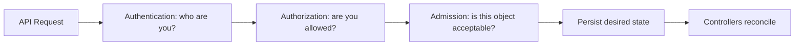
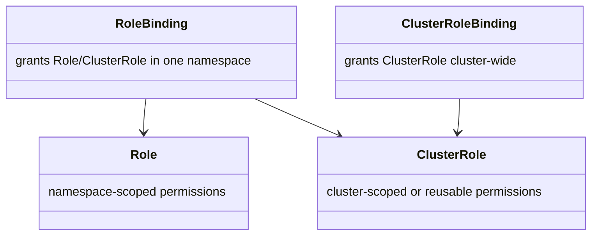
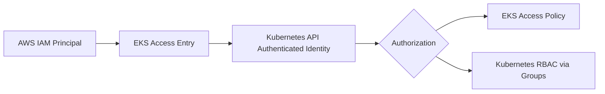
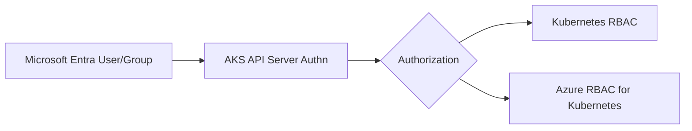
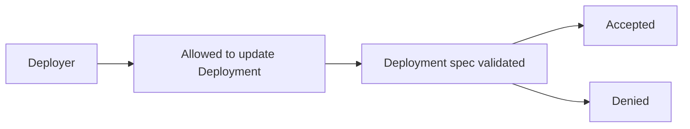

# Part 020 — Kubernetes Identity, RBAC, and Cloud IAM

Identity is where Kubernetes stops being “deployment tooling” and becomes a security boundary.

A production Kubernetes platform has many identities:

- humans
- CI/CD systems
- controllers
- Pods
- nodes
- cloud services
- break-glass operators
- auditors
- incident responders

If they all become `cluster-admin`, you do not have a platform.

You have a shared root shell with YAML.

This part builds the identity model from first principles, then maps it to EKS and AKS.

---

## 1. The Four-Step Security Path

Every Kubernetes API request passes through a conceptual pipeline:

```text
request -> authentication -> authorization -> admission -> persistence/reconciliation
```



Do not collapse these layers.

| Layer | Question | Example |
|---|---|---|
| Authentication | Who is calling? | `alice@example.com`, CI role, service account |
| Authorization | Is the caller allowed? | RBAC, Azure RBAC for Kubernetes, EKS access policy |
| Admission | Is the object allowed? | Pod Security, Kyverno, OPA/Gatekeeper |
| Runtime identity | What credentials does the workload use after scheduling? | IRSA, EKS Pod Identity, AKS Workload Identity |

This part focuses on authentication and authorization. Runtime workload identity gets deeper treatment in the next two parts.

---

## 2. Kubernetes Has No Native Human User Object

Kubernetes has `ServiceAccount` objects.

It does not have first-class `User` objects stored in the Kubernetes API.

Human users are authenticated by external mechanisms such as:

- client certificates
- OIDC identity providers
- cloud IAM integration
- webhook authentication
- managed provider integration

RBAC can refer to users and groups, but Kubernetes does not manage their lifecycle as API objects.

Example RoleBinding subject:

```yaml
subjects:
  - kind: User
    name: alice@example.com
    apiGroup: rbac.authorization.k8s.io
```

That binding references an external identity string. Kubernetes does not create or delete Alice.

This matters for offboarding.

Deleting a person from your company identity provider may stop authentication, but stale RoleBindings can still exist forever.

Access review must inspect both external identity provider state and in-cluster RBAC objects.

---

## 3. Identity Types in a Real Cluster

| Identity Type | Example | Main Risk |
|---|---|---|
| Human operator | platform engineer | excessive cluster-admin |
| Developer | app team member | cross-namespace access |
| CI/CD deployer | GitHub Actions/Azure DevOps role | supply-chain blast radius |
| Kubernetes controller | ingress controller, ExternalDNS | cloud mutation privilege |
| Workload Pod | order-api service account | cloud data access leakage |
| Node identity | EC2 instance role / VMSS identity | all Pods inherit node power if misconfigured |
| Break-glass identity | emergency admin | uncontrolled use |
| Auditor | read-only compliance user | accidental secret read |

The mistake is designing only for humans.

Most production damage is caused by non-human identities with broad permissions.

---

## 4. RBAC Object Model

Kubernetes RBAC has four primary objects:



| Object | Scope | Use |
|---|---|---|
| `Role` | namespace | permissions inside one namespace |
| `ClusterRole` | cluster | cluster-scoped permissions or reusable role template |
| `RoleBinding` | namespace | grants permissions in one namespace |
| `ClusterRoleBinding` | cluster | grants cluster-wide permissions |

A `ClusterRole` is not dangerous by itself.

A `ClusterRoleBinding` to a broad subject is dangerous.

---

## 5. RBAC Grammar

A rule contains:

```yaml
apiGroups:
  - apps
resources:
  - deployments
verbs:
  - get
  - list
  - watch
  - create
  - update
  - patch
  - delete
```

The grammar is:

```text
subject can verb resource in apiGroup within scope
```

Example:

```text
team-order-deployers can update deployments.apps in namespace prod-orders
```

This grammar is simple enough to reason about manually.

If a role cannot be described in one sentence, it is probably too broad.

---

## 6. Verbs Are Not Equal

| Verb | Meaning | Risk |
|---|---|---|
| `get` | read one object | low to high depending on resource |
| `list` | read many objects | can leak inventory/secrets |
| `watch` | stream changes | can leak ongoing state |
| `create` | create new object | can escalate through Pods/jobs |
| `update` | replace object | can alter policy/workloads |
| `patch` | partial update | often equivalent to update in practice |
| `delete` | remove object | availability risk |
| `deletecollection` | delete many objects | high blast radius |
| `bind` | bind roles | privilege escalation risk |
| `escalate` | create/update roles with higher privileges | privilege escalation risk |
| `impersonate` | act as another user/group/SA | severe if broad |

The dangerous verbs are often not the obvious ones.

`create pods` can be privilege escalation if a namespace allows mounting service account tokens or privileged containers.

`get secrets` is usually equivalent to stealing credentials.

`impersonate` can bypass the whole model if granted carelessly.

`bind` and `escalate` must be limited to platform security administrators.

---

## 7. Resources Are Not Equal

Some Kubernetes resources are more sensitive than they appear.

| Resource | Why Sensitive |
|---|---|
| `secrets` | credential/private key exposure |
| `serviceaccounts/token` | can mint service account tokens |
| `pods/exec` | shell access into runtime |
| `pods/portforward` | bypass normal network path |
| `pods/log` | may expose secrets or personal data |
| `events` | may leak names, errors, secret references |
| `roles`, `rolebindings` | privilege management |
| `clusterroles`, `clusterrolebindings` | cluster privilege management |
| `validatingwebhookconfigurations` | policy enforcement control |
| `mutatingwebhookconfigurations` | object mutation control |
| `customresourcedefinitions` | API surface extension |
| `nodes` | infrastructure visibility and scheduling influence |
| `persistentvolumes` | data-plane boundary |

Do not give “read-only” access to `secrets` unless you intend to grant credential access.

Read-only is not safe by default.

---

## 8. Namespace-Scoped Developer Role

A reasonable starting point for app developers:

```yaml
apiVersion: rbac.authorization.k8s.io/v1
kind: Role
metadata:
  name: app-developer
  namespace: prod-orders
rules:
  - apiGroups: [""]
    resources: ["pods", "services", "configmaps", "events"]
    verbs: ["get", "list", "watch"]
  - apiGroups: [""]
    resources: ["pods/log"]
    verbs: ["get"]
  - apiGroups: ["apps"]
    resources: ["deployments", "replicasets"]
    verbs: ["get", "list", "watch"]
  - apiGroups: ["networking.k8s.io"]
    resources: ["ingresses", "networkpolicies"]
    verbs: ["get", "list", "watch"]
```

Binding:

```yaml
apiVersion: rbac.authorization.k8s.io/v1
kind: RoleBinding
metadata:
  name: app-developers
  namespace: prod-orders
subjects:
  - kind: Group
    name: team-orders-developers
    apiGroup: rbac.authorization.k8s.io
roleRef:
  kind: Role
  name: app-developer
  apiGroup: rbac.authorization.k8s.io
```

Notice what is missing:

- no `get secrets`
- no `create pods`
- no `pods/exec`
- no role mutation
- no cluster-wide access

For production, separate observe permissions from mutate permissions.

---

## 9. Namespace Deployer Role

CI/CD often needs mutate permissions.

But CI/CD should not be cluster-admin.

Example:

```yaml
apiVersion: rbac.authorization.k8s.io/v1
kind: Role
metadata:
  name: app-deployer
  namespace: prod-orders
rules:
  - apiGroups: ["apps"]
    resources: ["deployments"]
    verbs: ["get", "list", "watch", "patch", "update"]
  - apiGroups: [""]
    resources: ["services", "configmaps"]
    verbs: ["get", "list", "watch", "patch", "update"]
  - apiGroups: ["batch"]
    resources: ["jobs"]
    verbs: ["get", "list", "watch", "create", "delete"]
  - apiGroups: ["networking.k8s.io"]
    resources: ["ingresses"]
    verbs: ["get", "list", "watch", "patch", "update"]
```

Whether a deployer can update `secrets` is a governance decision.

Many mature platforms avoid granting direct secret mutation to CI/CD and instead use sealed secrets, external secret operators, or secret-specific pipelines.

The invariant:

```text
A compromised CI/CD identity should not automatically become full cluster compromise.
```

---

## 10. Service Accounts

A `ServiceAccount` is the Kubernetes-native identity for a workload or controller.

Example:

```yaml
apiVersion: v1
kind: ServiceAccount
metadata:
  name: orders-api
  namespace: prod-orders
automountServiceAccountToken: false
```

Pod reference:

```yaml
apiVersion: apps/v1
kind: Deployment
metadata:
  name: orders-api
  namespace: prod-orders
spec:
  template:
    spec:
      serviceAccountName: orders-api
      automountServiceAccountToken: false
      containers:
        - name: app
          image: example/orders-api:1.0.0
```

Default posture:

```text
If the app does not call the Kubernetes API, do not mount a Kubernetes token.
```

Set `automountServiceAccountToken: false` by default and opt in only when needed.

### 10.1 Bound Service Account Tokens

Modern Kubernetes uses bound service account tokens with properties such as:

- projected volume
- expiration
- audience
- object binding

This is much better than old long-lived static token Secrets.

But it does not mean every Pod should receive a token.

A token with no purpose is unnecessary attack surface.

---

## 11. Workload Identity Is Not the Same as Kubernetes RBAC

This is one of the most important distinctions.

Kubernetes RBAC controls access to the Kubernetes API.

Cloud IAM controls access to cloud APIs.

Example:

```text
Can this Pod list Kubernetes Secrets?      -> Kubernetes RBAC
Can this Pod read AWS S3 bucket objects?   -> AWS IAM
Can this Pod read Azure Key Vault secrets? -> Azure RBAC / Key Vault access model
```

A workload may have no Kubernetes RBAC and still have powerful cloud permissions.

A workload may have Kubernetes RBAC and no cloud permissions.

Treat them separately.

---

## 12. Cloud IAM vs Kubernetes RBAC

| Concern | Kubernetes RBAC | AWS IAM | Azure RBAC / Entra |
|---|---|---|---|
| Primary API protected | Kubernetes API | AWS APIs | Azure Resource Manager / Entra-protected services |
| Identity source | external user/group or ServiceAccount | IAM principal | Entra identity / managed identity / service principal |
| Permission unit | verbs/resources/apiGroups | actions/resources/conditions | actions/dataActions/scopes/conditions |
| Scope | namespace or cluster | account/resource ARN | management group/subscription/resource group/resource |
| Used for human cluster access | yes, after authn | yes in EKS authn bridge | yes in AKS authn/authz options |
| Used for Pod cloud access | indirectly | IRSA/EKS Pod Identity | AKS Workload Identity/managed identity |

The trap is assuming one layer replaces the other.

It does not.

In production, you usually need both.

---

## 13. EKS Human Access Model

EKS bridges AWS IAM identity to Kubernetes authentication.

Modern EKS access management uses access entries and access policies or Kubernetes groups.

Conceptual flow:



Two authorization patterns:

### Pattern A: EKS Access Policies

EKS-managed access policies grant predefined Kubernetes permissions through EKS access management.

Good for:

- standard admin/view/edit-style access
- simpler operations
- central management through AWS APIs

Risk:

- less tailored than handcrafted RBAC
- teams may misunderstand that access policies contain Kubernetes permissions, not IAM permissions

### Pattern B: Access Entry with Kubernetes Groups

Map IAM principal to Kubernetes groups, then use normal RBAC.

Good for:

- fine-grained custom model
- GitOps-managed RBAC
- consistent Kubernetes authorization across clusters

Risk:

- two systems must stay aligned
- stale group bindings can persist

Example conceptual access entry:

```text
IAM role: arn:aws:iam::111122223333:role/team-orders-prod-developer
Kubernetes group: team-orders-developers
RoleBinding in namespace prod-orders -> app-developer
```

This model is explicit and auditable.

---

## 14. The `aws-auth` Legacy Problem

Many older EKS clusters used the `aws-auth` ConfigMap for IAM-to-Kubernetes mapping.

Modern platform design should prefer EKS access entries where available and plan migration away from legacy `aws-auth` dependency.

Why:

- ConfigMap editing is easy to break.
- It is harder to manage consistently across many clusters.
- Access entries are API-managed and better aligned with current EKS access management.

If you still use `aws-auth`, treat it as critical security configuration.

Guard it with:

- GitOps ownership
- restricted write access
- backup
- change review
- break-glass recovery procedure

---

## 15. AKS Human Access Model

AKS integrates with Microsoft Entra ID for authentication to the Kubernetes API server.

After authentication, AKS authorization can use:

1. Kubernetes RBAC.
2. Azure RBAC for Kubernetes Authorization.
3. A combination depending on cluster configuration and resource type.

Conceptual flow:



### 15.1 Entra ID + Kubernetes RBAC

In this model:

- Entra authenticates the user/group.
- Kubernetes RBAC authorizes actions.
- RoleBindings reference Entra user/group identities.

Good for:

- Kubernetes-native policy
- GitOps-managed RBAC
- portability of role objects

### 15.2 Azure RBAC for Kubernetes Authorization

In this model:

- Azure RBAC role assignments authorize Kubernetes API actions.
- Access can be scoped at cluster or namespace level.
- Built-in AKS roles can grant reader/writer/admin-style permissions.

Good for:

- centralized Azure governance
- integration with Azure role assignment workflows
- organizations already standardized on Azure RBAC

Risk:

- engineers must understand both Azure resource RBAC and Kubernetes object access
- custom resources and fine-grained policy may require careful validation

---

## 16. Local Accounts and Break-Glass

Break-glass access is necessary.

Uncontrolled break-glass access is a vulnerability.

A production cluster should define:

```yaml
breakGlass:
  enabled: true
  storedIn: privileged-access-management-system
  requiresApproval: true
  logged: true
  timeBound: true
  testedQuarterly: true
  disablesAfterUse: true
```

For AKS, local account behavior and Entra integration must be explicitly designed.

For EKS, emergency access must account for both AWS IAM access to the EKS API and Kubernetes authorization state.

Break-glass runbook should answer:

1. Who can activate it?
2. What event qualifies?
3. How is access logged?
4. How long does it last?
5. How is it revoked?
6. How is post-incident review performed?

Never rely on memory during an access incident.

---

## 17. Persona-Based Access Model

Start with personas, not YAML.

| Persona | Scope | Typical Permissions |
|---|---|---|
| Platform admin | cluster | cluster operations, add-ons, policy, emergency repair |
| Security admin | cluster | policy, audit, admission, secret governance, no app deploy by default |
| Network admin | cluster/network namespaces | ingress/gateway/network policy, no app secret access |
| App developer | namespace | read workloads/logs/events, limited debug |
| App deployer | namespace | patch/update approved workload resources |
| SRE/on-call | namespace + limited cluster read | debug, restart, scale, inspect nodes/events |
| Auditor | cluster read excluding secrets | inventory, policy, compliance evidence |
| CI/CD | namespace | deploy only expected resources |
| Controller | specific resources | reconcile one domain only |

A good platform creates standard role bundles for these personas.

Avoid one-off privileges unless they expire.

---

## 18. Multi-Tenant Namespace Access

A namespace is not a perfect security boundary, but it is the primary Kubernetes administrative scope.

For each team namespace:

```yaml
namespaceContract:
  namespace: prod-orders
  owner: team-orders
  environment: prod
  humanReadGroup: team-orders-prod-readers
  deployerGroup: team-orders-prod-deployers
  breakGlassGroup: platform-breakglass
  allowedIngressSuffixes:
    - orders.prod.example.com
  allowedCloudIdentities:
    - orders-api-prod
  secretAccessModel: external-secrets
```

RBAC is part of the namespace contract.

A namespace without an access contract becomes a junk drawer.

---

## 19. Controller Identities

Controllers are dangerous because they reconcile continuously.

Examples:

- AWS Load Balancer Controller
- ExternalDNS
- cert-manager
- external-secrets operator
- cluster autoscaler
- Karpenter
- Azure Key Vault CSI provider
- ingress controllers
- GitOps controllers

Each controller has two permission surfaces:

```text
Kubernetes RBAC: what resources can it watch/mutate in the cluster?
Cloud IAM/RBAC: what cloud APIs can it call?
```

Example: ExternalDNS

```text
Kubernetes RBAC: watch Ingress/Service/Gateway resources
Cloud IAM/RBAC: mutate DNS records in approved zones
```

Example: AWS Load Balancer Controller

```text
Kubernetes RBAC: watch Ingress/Service/EndpointSlice
AWS IAM: create/update/delete ALB/NLB/security-group related resources
```

Example: Key Vault CSI provider

```text
Kubernetes RBAC: mount CSI volume flow
Azure identity: read selected Key Vault secrets/certificates
```

The controller identity must be reviewed like production application identity.

---

## 20. The Secret-Reading Problem

Many teams accidentally grant secret read access because they think it is needed for debugging.

It is rarely safe.

A Kubernetes Secret can contain:

- database passwords
- API tokens
- TLS private keys
- OAuth client secrets
- cloud credentials
- session signing keys
- encryption keys

`get secrets` means the subject can retrieve those values.

`list secrets` means the subject can retrieve all secrets in scope.

Safer alternatives:

- expose sanitized app config separately
- use external secret references
- allow app owners to rotate secrets without viewing them
- provide secret metadata read but not value read if tooling supports it
- create audited break-glass secret read flow

For auditors, avoid `secrets` value access. Provide inventory evidence through external secret manager reports instead.

---

## 21. Debug Access: `exec`, `port-forward`, and Logs

Debug permissions are powerful.

| Permission | Risk |
|---|---|
| `pods/log` | leaks PII/secrets if app logs badly |
| `pods/exec` | runtime shell; can read mounted secrets/env |
| `pods/portforward` | bypass ingress/auth/network controls |
| `pods/attach` | interactive runtime access |

Production policy options:

| Environment | Logs | Exec | Port-forward |
|---|---|---|---|
| dev | broad | allowed | allowed |
| staging | controlled | limited | controlled |
| prod | read with audit | break-glass/time-bound | usually restricted |

For regulated workloads, `exec` should be treated as privileged production access.

---

## 22. Privilege Escalation Traps

### 22.1 `create pods`

If a user can create arbitrary Pods, they may mount service account tokens, use hostPath if admission allows it, or run containers that access internal networks.

Mitigation:

- restrict Pod creation in prod
- use deployment pipelines
- enforce Pod Security / admission policies
- restrict service account token automount

### 22.2 `update deployments`

A user who can update Deployment specs can change image, command, env, volumes, and service account.

That can become code execution.

Mitigation:

- separate deployment authority from human debug access
- use image policy
- restrict serviceAccountName changes through admission
- sign images

### 22.3 `bind` and `escalate`

These verbs allow role privilege manipulation.

Mitigation:

- grant only to cluster security/platform administrators
- monitor role changes
- require code review for RBAC objects

### 22.4 `impersonate`

Impersonation can be legitimate for support tooling.

It is also extremely sensitive.

Mitigation:

- narrow subject/resourceNames
- log all impersonation
- avoid wildcard impersonation

---

## 23. RBAC Testing

Always test access with `kubectl auth can-i`.

Examples:

```bash
kubectl auth can-i get pods -n prod-orders --as alice@example.com

kubectl auth can-i get secrets -n prod-orders --as alice@example.com

kubectl auth can-i update deployments.apps -n prod-orders --as system:serviceaccount:prod-orders:deployer

kubectl auth can-i '*' '*' --all-namespaces --as alice@example.com
```

For groups:

```bash
kubectl auth can-i get pods \
  -n prod-orders \
  --as alice@example.com \
  --as-group team-orders-developers
```

Automated RBAC tests should run in CI for platform role changes.

Example policy regression:

```text
team-orders-developers must be able to read pods in prod-orders
team-orders-developers must not be able to read secrets in prod-orders
team-orders-deployers must be able to patch deployments in prod-orders
team-orders-deployers must not be able to create clusterrolebindings
```

RBAC without tests decays.

---

## 24. Access Review Runbook

Monthly or quarterly, review:

```bash
kubectl get rolebindings -A
kubectl get clusterrolebindings
kubectl get roles -A
kubectl get clusterroles
```

Check:

- subjects that no longer exist
- direct user bindings instead of group bindings
- wildcard verbs/resources
- `cluster-admin` bindings
- `system:masters` membership
- secret readers
- impersonation permissions
- bind/escalate permissions
- controller permissions broader than needed
- namespace access inconsistent with ownership registry

Cloud side:

EKS:

```bash
aws eks list-access-entries --cluster-name <cluster>
aws eks list-associated-access-policies --cluster-name <cluster> --principal-arn <arn>
```

AKS/Azure:

```bash
az role assignment list --scope <aks-resource-id>
az role assignment list --scope <namespace-scope-if-used>
```

Review is not just a list.

For each access path, ask:

```text
Does this subject still need this permission for a current business process?
```

If not, remove it.

---

## 25. Revocation Model

Revocation must be fast and layered.

Human leaves company:

```text
1. Disable identity provider account.
2. Remove cloud IAM/Entra group membership.
3. Remove direct cluster access entries/role assignments.
4. Remove direct Kubernetes RoleBindings if any.
5. Rotate credentials if the user could read secrets.
6. Audit recent access.
```

CI/CD compromised:

```text
1. Disable pipeline identity.
2. Revoke cloud federated credential/trust.
3. Remove Kubernetes binding.
4. Rotate deploy keys/tokens.
5. Inspect recent image/deployment changes.
6. Roll back if needed.
```

Controller compromised:

```text
1. Scale down controller.
2. Revoke cloud role/managed identity.
3. Inspect resources it could mutate.
4. Rotate affected credentials/certs if needed.
5. Redeploy from trusted source.
```

Revocation must account for tokens already issued. Short-lived tokens reduce residual risk.

---

## 26. GitOps and RBAC

RBAC should be managed like code.

Recommended model:

```text
identity provider groups -> environment access registry -> generated RBAC manifests -> GitOps apply -> automated RBAC tests
```

Repository structure:

```text
platform-access/
  clusters/
    eks-prod-us-east-1/
      access-entries.yaml
      rbac.yaml
    aks-prod-westeurope/
      azure-role-assignments.bicep
      rbac.yaml
  namespaces/
    prod-orders/
      namespace-contract.yaml
      rolebindings.yaml
  tests/
    rbac-can-i.yaml
```

Rules:

- prefer group bindings over direct user bindings
- require review for cluster-scoped permissions
- require security approval for secret read, impersonate, bind, escalate
- require expiry for temporary access
- generate repetitive namespace roles
- test access as part of CI

Manual RBAC changes during incident must be reconciled back into Git or explicitly reverted.

---

## 27. Admission Complements RBAC

RBAC controls who can submit a request.

Admission controls whether the requested object is acceptable.

Example:

A deployer may be allowed to update Deployments.

But admission should still prevent:

- privileged containers
- hostPath mounts
- unapproved service accounts
- public ingress in private namespace
- unsigned images
- forbidden registries
- excessive resource requests



RBAC alone cannot express all object-level invariants.

Use RBAC for identity authority.

Use admission for safety invariants.

---

## 28. EKS Access Blueprint

Example production EKS access design:

```yaml
eksAccessModel:
  cluster: eks-prod-us-east-1
  authentication: eks-access-entries
  authorization:
    humanStandardAccess: kubernetes-rbac-groups
    emergencyAdmin: eks-access-policy-time-bound
    ciDeployers: kubernetes-rbac-groups
  groups:
    platform-admins:
      scope: cluster
      role: platform-cluster-admin-limited
    security-auditors:
      scope: cluster
      role: audit-read-no-secrets
    team-orders-developers:
      scope: namespace/prod-orders
      role: app-developer
    team-orders-deployers:
      scope: namespace/prod-orders
      role: app-deployer
  legacyAwsAuth: disabled-or-migrating
```

Operational rules:

- no direct IAM user bindings
- role-based access through AWS IAM roles/groups
- no permanent broad admin for app teams
- namespace RBAC generated from namespace contracts
- access entries managed by IaC
- Kubernetes RBAC managed by GitOps
- break-glass tested and audited

---

## 29. AKS Access Blueprint

Example production AKS access design:

```yaml
aksAccessModel:
  cluster: aks-prod-westeurope
  authentication: microsoft-entra-id
  authorizationMode: kubernetes-rbac-or-azure-rbac-explicitly-chosen
  localAccounts: disabled-except-breakglass-runbook
  groups:
    platform-admins:
      scope: cluster
      role: platform-admin
    security-auditors:
      scope: cluster
      role: audit-read-no-secrets
    team-orders-developers:
      scope: namespace/prod-orders
      role: app-developer
    team-orders-deployers:
      scope: namespace/prod-orders
      role: app-deployer
  azureRoleAssignmentsManagedBy: terraform-or-bicep
  kubernetesRbacManagedBy: gitops
```

Operational rules:

- use Entra groups, not direct user bindings
- define whether Azure RBAC or Kubernetes RBAC is authoritative
- avoid mixing models casually
- document break-glass path
- review Azure role assignments and Kubernetes bindings together
- use managed identity/workload identity for non-human cloud access

---

## 30. Anti-Patterns

### Anti-Pattern 1: Everyone Gets `cluster-admin`

This is not productivity.

It is deferred incident cost.

### Anti-Pattern 2: CI/CD Uses Human Credentials

CI/CD must have its own identity, scope, audit trail, and revocation path.

### Anti-Pattern 3: One Controller Identity for Everything

ExternalDNS, ingress controller, cert manager, and autoscaler should not share a broad cloud identity.

### Anti-Pattern 4: Direct User RoleBindings Everywhere

Use groups. People change roles. Groups express organizational intent.

### Anti-Pattern 5: Read-Only Includes Secrets

Secret read is credential access. Treat it as privileged.

### Anti-Pattern 6: RBAC Without Admission

If a deployer can update a Deployment into a privileged hostPath Pod, the platform is not safe.

### Anti-Pattern 7: No Break-Glass Test

An untested emergency path is a story, not a control.

---

## 31. Minimal Production Access Checklist

```text
[ ] no app team has permanent cluster-admin
[ ] no direct user RoleBindings except approved exception
[ ] groups are used for human access
[ ] CI/CD identities are separate from humans
[ ] controller service accounts are separate per controller
[ ] service account tokens are not mounted by default
[ ] secret read permissions are explicitly approved
[ ] exec/port-forward access is controlled in prod
[ ] bind/escalate/impersonate verbs are tightly restricted
[ ] EKS access entries or AKS Entra integration are IaC-managed
[ ] Kubernetes RBAC is GitOps-managed
[ ] access review is scheduled
[ ] break-glass is tested and logged
[ ] RBAC regression tests exist
[ ] cloud IAM and Kubernetes RBAC are reviewed together
```

---

## 32. Practice Lab

Design access for a production namespace `prod-orders`.

Personas:

```text
team-orders-developers: read pods/logs/events/deployments, no secrets, no exec
team-orders-deployers: patch deployments/services/configmaps/ingress, no role mutation
team-orders-oncall: read plus time-bound exec during incident
platform-admins: cluster platform operations
security-auditors: read inventory and policy, no secret values
ci-orders-prod: deploy only prod-orders workloads
```

Deliverables:

1. namespace access contract
2. Role and RoleBinding manifests
3. EKS access entry mapping or AKS Entra group mapping
4. `kubectl auth can-i` test matrix
5. revocation runbook
6. temporary access process for incident exec
7. list of permissions intentionally not granted

You understand this part when you can explain who can change a production Deployment, who can read a production Secret, and how to revoke both access paths in under ten minutes.

---

## 33. Part Summary

Identity in Kubernetes is a layered system.

The key invariants:

```text
Authentication is not authorization.
Kubernetes RBAC is not cloud IAM.
Human access is not workload identity.
Read-only is not always safe.
Secrets are credentials.
Controllers are privileged actors.
CI/CD needs its own identity.
Break-glass must be tested.
RBAC must be reviewed and tested like code.
```

EKS and AKS provide cloud-native identity bridges, but they do not remove the need for a clear authorization model.

A top-tier Kubernetes engineer can look at an access request and answer:

```text
Who is the subject?
What API is protected?
What scope is required?
What is the minimum permission?
How is it audited?
How is it revoked?
What can go wrong if this identity is compromised?
```

That is the bar.

---

## References

- Kubernetes Documentation — RBAC Authorization: https://kubernetes.io/docs/reference/access-authn-authz/rbac/
- Kubernetes Documentation — Service Accounts: https://kubernetes.io/docs/concepts/security/service-accounts/
- Kubernetes Documentation — Configure Service Accounts for Pods: https://kubernetes.io/docs/tasks/configure-pod-container/configure-service-account/
- Kubernetes Documentation — Authorization Overview: https://kubernetes.io/docs/reference/access-authn-authz/authorization/
- Kubernetes Documentation — Admission Controllers: https://kubernetes.io/docs/reference/access-authn-authz/admission-controllers/
- Amazon EKS — Access Entries: https://docs.aws.amazon.com/eks/latest/userguide/access-entries.html
- Amazon EKS — Access Policies: https://docs.aws.amazon.com/eks/latest/userguide/access-policies.html
- Amazon EKS — IAM Roles for Service Accounts: https://docs.aws.amazon.com/eks/latest/userguide/iam-roles-for-service-accounts.html
- Azure AKS — Access and Identity Concepts: https://learn.microsoft.com/en-us/azure/aks/concepts-identity
- Azure AKS — Microsoft Entra ID with Kubernetes RBAC: https://learn.microsoft.com/en-us/azure/aks/kubernetes-rbac-entra-id
- Azure AKS — Microsoft Entra ID Authorization for Kubernetes API: https://learn.microsoft.com/en-us/azure/aks/entra-id-authorization
- Azure AKS — Microsoft Entra Workload ID: https://learn.microsoft.com/en-us/azure/aks/workload-identity-overview
