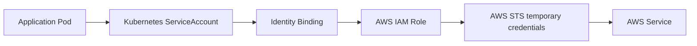
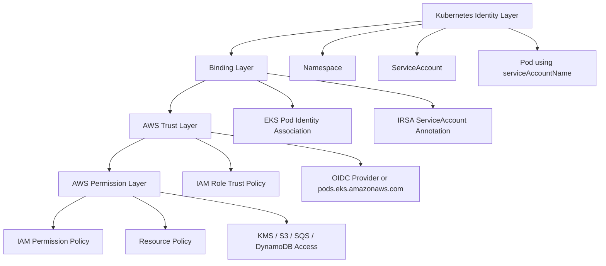
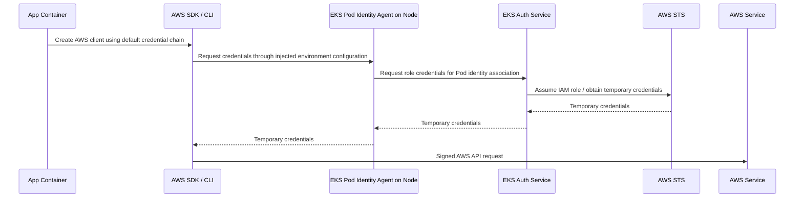
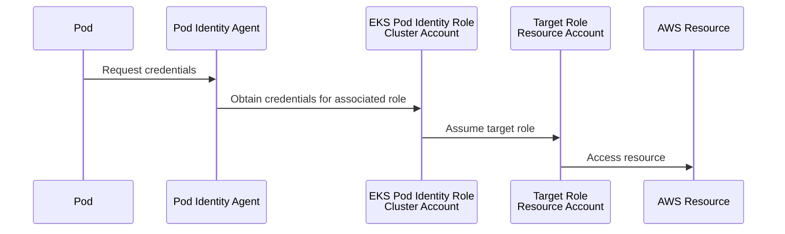
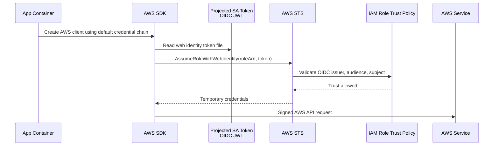
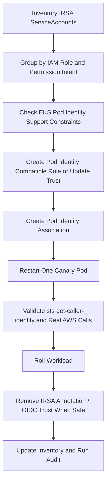
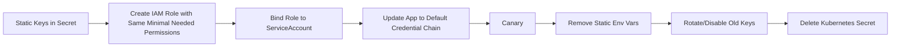
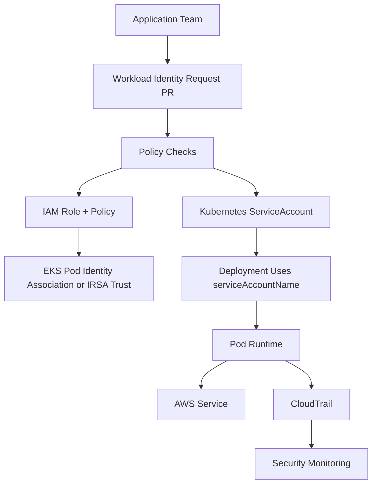

# Part 021 — EKS Pod Identity and IRSA

Kubernetes workloads almost always need access to cloud services: S3 buckets, SQS queues, DynamoDB tables, KMS keys, Secrets Manager, Parameter Store, EventBridge, RDS IAM auth, CloudWatch, ECR, or internal platform APIs. The naive answer is simple: put AWS credentials into a Kubernetes `Secret` and inject them into the Pod.

That answer is also the answer that gets production platforms compromised.

A production EKS platform should treat workload access to AWS as a **runtime identity problem**, not as a secret distribution problem. The application should not carry long-lived keys. The image should not contain credentials. The namespace should not contain static cloud credentials. The node IAM role should not become the accidental super-role for every Pod scheduled on the node.

The right model is:

> A Kubernetes ServiceAccount represents the workload identity inside the cluster, and AWS IAM represents the cloud permission boundary outside the cluster. The platform must bind those two identities with a narrow, auditable, revocable, and automatable contract.

On EKS, there are two main production-grade mechanisms:

1. **EKS Pod Identity**
2. **IAM Roles for Service Accounts**, usually called **IRSA**

They solve the same problem with different operational models.

This part explains both deeply enough to design, implement, debug, migrate, and govern them in a real engineering platform.

---

## 1. The Problem: Pods Need AWS Access Without Static Credentials

A workload may need to do something like this:

```text
checkout-api -> read object from S3
billing-worker -> publish message to SQS
reporting-job -> decrypt data with KMS
inventory-sync -> query DynamoDB
audit-exporter -> put logs into S3
secret-bootstrapper -> read AWS Secrets Manager
```

The unsafe options are common:

| Pattern | Why It Fails |
|---|---|
| Static AWS keys in image | Credentials leak through registry, SBOM, scanner, debug shell, or image copy. |
| Static AWS keys in Kubernetes Secret | Kubernetes Secret becomes a cloud credential vault without cloud-grade rotation/audit by default. |
| Node IAM role shared by all Pods | Every Pod on the node can potentially inherit broad node permissions unless access is strongly constrained. |
| One IAM user per app | Long-lived keys, weak lifecycle management, manual rotation, high audit burden. |
| Homegrown credential sidecar | Another critical security system to build and maintain. |

The production answer is temporary credentials derived from an identity assertion.



The credential should be:

- short-lived
- scoped to one workload identity
- auditable in AWS CloudTrail
- revocable without rebuilding the application
- controlled through infrastructure-as-code
- separated from the worker node role
- observable during incident response

---

## 2. Core Mental Model

Think of the system in four layers:



The key separation:

- **Trust policy** answers: *who may assume this role?*
- **Permission policy** answers: *what may this role do after it is assumed?*
- **Kubernetes RBAC** answers: *who may create, patch, or use the Kubernetes objects?*
- **Application code** answers: *does the SDK use the default credential chain correctly?*

Many incidents happen because teams focus only on the IAM permission policy. In production, the trust boundary is equally important.

---

## 3. The Invariants

These are the rules that should hold across every EKS workload.

### Invariant 1 — No Static AWS Credentials in Workloads

No `AWS_ACCESS_KEY_ID`, `AWS_SECRET_ACCESS_KEY`, or long-lived cloud credential should be stored in:

- container images
- Kubernetes `Secret`
- Helm values
- GitOps repository
- CI/CD variable group, unless it is for CI itself and heavily constrained
- mounted files inside application pods

The workload should obtain temporary credentials at runtime.

### Invariant 2 — The ServiceAccount Is the Unit of Workload Identity

Do not assign AWS permissions to a namespace, Deployment name, container name, or image tag. Bind permissions to a dedicated Kubernetes `ServiceAccount`.

Bad:

```yaml
serviceAccountName: default
```

Better:

```yaml
serviceAccountName: checkout-api-sa
```

Best:

```yaml
apiVersion: v1
kind: ServiceAccount
metadata:
  name: checkout-api-aws-sa
  namespace: checkout-prod
  labels:
    app.kubernetes.io/name: checkout-api
    platform.mycompany.io/identity-owner: checkout-team
```

A dedicated ServiceAccount gives you a stable identity handle for IAM mapping, policy review, audit, and revocation.

### Invariant 3 — The Node Role Is Not the Application Role

The node IAM role is for node-level functions:

- kubelet integration
- pulling images if needed
- CNI operations
- EBS/EFS CSI drivers depending on architecture
- node bootstrap
- logging/monitoring agents when intentionally designed

The node role is not for arbitrary application access.

If application Pods accidentally rely on node role credentials, your platform has a hidden privilege escalation path.

### Invariant 4 — The SDK Credential Chain Is Part of the Contract

Workload identity relies on AWS SDK behavior. If the app hardcodes credentials, disables default credential providers, uses an old SDK, or overrides the credential chain incorrectly, the infrastructure may be correct but the application still fails.

The platform contract must specify:

```text
Application must use an AWS SDK version that supports the selected workload identity mechanism and must not override the default credential provider chain unless reviewed.
```

### Invariant 5 — Identity Association Changes Are Release Changes

Changing which IAM role a workload can assume is a security-impacting release. Treat it like code:

- pull request
- approval
- automated policy checks
- audit trail
- rollback plan
- post-deploy verification

---

## 4. EKS Pod Identity vs IRSA: Decision Matrix

| Dimension | EKS Pod Identity | IRSA |
|---|---|---|
| Binding model | EKS Pod Identity association maps cluster + namespace + ServiceAccount to IAM role. | ServiceAccount annotation points to IAM role ARN. |
| Trust principal | `pods.eks.amazonaws.com` service principal. | Cluster-specific IAM OIDC provider. |
| IAM trust policy reuse | More reusable across clusters because trust does not need one OIDC provider per cluster. | Often cluster-specific because the OIDC provider URL differs per cluster. |
| Setup burden | Requires EKS Pod Identity Agent, unless covered by EKS Auto Mode. | Requires IAM OIDC provider and trust policy conditions. |
| Operational owner split | Clean split: EKS association in EKS, IAM policy/trust in IAM. | Cluster/OIDC/IAM trust are more intertwined. |
| Supported compute | EKS Linux EC2 worker nodes. Not for Fargate/Windows. | Commonly used across EKS EC2 and Fargate scenarios where supported. |
| Cross-account pattern | Association role must be in cluster account; target-role chaining can be used for other accounts. | Cross-account can be modeled in trust/role assumption patterns. |
| Migration fit | Preferred for many new EKS EC2 node workloads if restrictions fit. | Still relevant for existing clusters, Fargate, compatibility, and established GitOps patterns. |
| Failure surface | Agent availability/configuration, association eventual consistency, SDK support. | OIDC provider, trust policy subject/audience, token projection, SDK web identity provider. |
| Platform UX | Central association visible through EKS APIs. | Visible in Kubernetes ServiceAccount and IAM trust policy. |

A practical rule:

```text
Use EKS Pod Identity for new EKS workloads on Linux EC2 nodes when its restrictions fit.
Keep or use IRSA when you need compatibility with existing IRSA estate, Fargate support, or a mature OIDC-based operating model.
```

Do not turn this into ideology. The best mechanism is the one whose failure modes your platform can operate reliably.

---

## 5. EKS Pod Identity Architecture

EKS Pod Identity lets you associate an IAM role with a Kubernetes ServiceAccount through EKS itself.

High-level flow:



The application does not need static credentials. It should use the default AWS SDK credential chain.

The platform creates:

1. IAM permission policy
2. IAM role with trust for `pods.eks.amazonaws.com`
3. EKS Pod Identity association for cluster/namespace/service account/role
4. Kubernetes ServiceAccount
5. Workload using `serviceAccountName`

---

## 6. EKS Pod Identity Trust Policy

A role usable by EKS Pod Identity needs a trust relationship that allows the EKS Pod Identity service principal to assume it.

Example trust policy:

```json
{
  "Version": "2012-10-17",
  "Statement": [
    {
      "Effect": "Allow",
      "Principal": {
        "Service": "pods.eks.amazonaws.com"
      },
      "Action": [
        "sts:AssumeRole",
        "sts:TagSession"
      ]
    }
  ]
}
```

Why `sts:TagSession` matters: session tags improve auditability and policy control. In production, you want CloudTrail to show enough context to answer:

- which cluster?
- which namespace?
- which service account?
- which application?
- which environment?

Do not copy this trust policy blindly into every role without guardrails. The trust policy makes the role eligible for EKS Pod Identity. The actual mapping to a ServiceAccount happens through EKS Pod Identity associations. Your IAM governance must control who may create/update those associations.

---

## 7. EKS Pod Identity Permission Policy Example

Assume `checkout-api` only needs to read objects under one S3 prefix.

Bad policy:

```json
{
  "Version": "2012-10-17",
  "Statement": [
    {
      "Effect": "Allow",
      "Action": "s3:*",
      "Resource": "*"
    }
  ]
}
```

Better policy:

```json
{
  "Version": "2012-10-17",
  "Statement": [
    {
      "Sid": "ListOnlyCheckoutPrefix",
      "Effect": "Allow",
      "Action": [
        "s3:ListBucket"
      ],
      "Resource": "arn:aws:s3:::company-prod-app-data",
      "Condition": {
        "StringLike": {
          "s3:prefix": [
            "checkout-api/*"
          ]
        }
      }
    },
    {
      "Sid": "ReadCheckoutObjects",
      "Effect": "Allow",
      "Action": [
        "s3:GetObject"
      ],
      "Resource": "arn:aws:s3:::company-prod-app-data/checkout-api/*"
    }
  ]
}
```

Production review questions:

- Is the action list minimal?
- Are resource ARNs scoped?
- Are KMS permissions separately scoped if the bucket uses SSE-KMS?
- Is cross-account resource policy required?
- Does the workload need read, write, delete, or list?
- Are destructive actions separated into another role?
- Is access environment-specific?

---

## 8. EKS Pod Identity Association

A Pod Identity association maps:

```text
cluster + namespace + serviceAccount -> IAM role
```

Example CLI:

```bash
aws eks create-pod-identity-association \
  --cluster-name prod-platform-a \
  --namespace checkout-prod \
  --service-account checkout-api-aws-sa \
  --role-arn arn:aws:iam::111122223333:role/eks-prod-checkout-api-s3-read
```

Kubernetes ServiceAccount:

```yaml
apiVersion: v1
kind: ServiceAccount
metadata:
  name: checkout-api-aws-sa
  namespace: checkout-prod
  labels:
    app.kubernetes.io/name: checkout-api
    app.kubernetes.io/part-of: checkout
    platform.mycompany.io/cloud-identity: aws
```

Deployment using the ServiceAccount:

```yaml
apiVersion: apps/v1
kind: Deployment
metadata:
  name: checkout-api
  namespace: checkout-prod
spec:
  replicas: 3
  selector:
    matchLabels:
      app.kubernetes.io/name: checkout-api
  template:
    metadata:
      labels:
        app.kubernetes.io/name: checkout-api
    spec:
      serviceAccountName: checkout-api-aws-sa
      automountServiceAccountToken: true
      containers:
        - name: app
          image: 111122223333.dkr.ecr.ap-southeast-1.amazonaws.com/checkout-api:2026.07.03
          ports:
            - containerPort: 8080
```

Keep `automountServiceAccountToken: true` because workload identity needs a service account identity. If a security baseline globally disables automount, you must intentionally enable it only for workloads that need it.

---

## 9. EKS Pod Identity Agent

EKS Pod Identity requires the Pod Identity Agent on nodes, except when the managed mode you use already includes it. The agent runs on cluster nodes and provides credentials to Pods on the same node.

Operational implications:

- the agent is node-local infrastructure
- failure can affect all Pods on that node that need AWS credentials
- network policies, proxies, or host-level restrictions can break credential retrieval
- SDK calls may fail even when the IAM role and association are correct
- daemonset health should be monitored like CNI, CSI, and node monitoring agents

Minimal operational checks:

```bash
kubectl -n kube-system get pods -l app.kubernetes.io/name=eks-pod-identity-agent
kubectl -n kube-system describe daemonset eks-pod-identity-agent
kubectl -n kube-system logs -l app.kubernetes.io/name=eks-pod-identity-agent --tail=100
```

If the workload runs behind an HTTP proxy, ensure metadata/credential endpoints used by the agent are excluded through `NO_PROXY` where required by your environment.

---

## 10. EKS Pod Identity Cross-Account Access

Many enterprises separate accounts:

```text
platform account: EKS cluster
app account: application AWS resources
security account: KMS / audit / shared services
```

A common pattern is role chaining:



Design rule:

- the role associated directly with EKS Pod Identity lives in the cluster account
- that role may be allowed to assume a target role in another account
- the target account controls trust from the cluster-account role
- resource policies may still be required depending on the AWS service

Avoid letting every Pod Identity role assume a broad shared target role. Cross-account boundaries should reduce blast radius, not centralize privilege.

---

## 11. IRSA Architecture

IRSA uses Kubernetes service account tokens and AWS IAM OIDC federation.

High-level flow:



IRSA has three main objects:

1. IAM OIDC provider for the EKS cluster
2. IAM role trust policy that trusts the OIDC provider and specific ServiceAccount subject
3. Kubernetes ServiceAccount annotated with the IAM role ARN

---

## 12. IRSA Trust Policy

Example trust policy for one namespace/service account:

```json
{
  "Version": "2012-10-17",
  "Statement": [
    {
      "Effect": "Allow",
      "Principal": {
        "Federated": "arn:aws:iam::111122223333:oidc-provider/oidc.eks.ap-southeast-1.amazonaws.com/id/EXAMPLED539D4633E53DE1B71EXAMPLE"
      },
      "Action": "sts:AssumeRoleWithWebIdentity",
      "Condition": {
        "StringEquals": {
          "oidc.eks.ap-southeast-1.amazonaws.com/id/EXAMPLED539D4633E53DE1B71EXAMPLE:aud": "sts.amazonaws.com",
          "oidc.eks.ap-southeast-1.amazonaws.com/id/EXAMPLED539D4633E53DE1B71EXAMPLE:sub": "system:serviceaccount:checkout-prod:checkout-api-aws-sa"
        }
      }
    }
  ]
}
```

The critical condition is `sub`:

```text
system:serviceaccount:<namespace>:<serviceaccount>
```

If you use a wildcard here, you are expanding trust. Sometimes wildcards are justified for platform controllers, but most application roles should use exact subjects.

Risky trust policy:

```json
"StringLike": {
  "...:sub": "system:serviceaccount:checkout-prod:*"
}
```

This means any ServiceAccount in `checkout-prod` can potentially assume the role if it is annotated and allowed. That might be acceptable in a tightly governed namespace factory. It is not acceptable as a casual shortcut.

---

## 13. IRSA Kubernetes ServiceAccount

```yaml
apiVersion: v1
kind: ServiceAccount
metadata:
  name: checkout-api-aws-sa
  namespace: checkout-prod
  annotations:
    eks.amazonaws.com/role-arn: arn:aws:iam::111122223333:role/irsa-prod-checkout-api-s3-read
  labels:
    app.kubernetes.io/name: checkout-api
    platform.mycompany.io/cloud-identity: aws-irsa
```

Deployment:

```yaml
apiVersion: apps/v1
kind: Deployment
metadata:
  name: checkout-api
  namespace: checkout-prod
spec:
  replicas: 3
  selector:
    matchLabels:
      app.kubernetes.io/name: checkout-api
  template:
    metadata:
      labels:
        app.kubernetes.io/name: checkout-api
    spec:
      serviceAccountName: checkout-api-aws-sa
      containers:
        - name: app
          image: 111122223333.dkr.ecr.ap-southeast-1.amazonaws.com/checkout-api:2026.07.03
```

The SDK discovers the injected environment and token file when using the default credential provider chain.

Useful inspection commands:

```bash
kubectl -n checkout-prod get sa checkout-api-aws-sa -o yaml
kubectl -n checkout-prod exec deploy/checkout-api -- env | grep -E 'AWS_ROLE_ARN|AWS_WEB_IDENTITY_TOKEN_FILE|AWS_REGION|AWS_DEFAULT_REGION'
kubectl -n checkout-prod exec deploy/checkout-api -- ls -l /var/run/secrets/eks.amazonaws.com/serviceaccount || true
```

---

## 14. ServiceAccount Token Projection

Both Kubernetes and AWS-specific identity flows rely on service account token mechanics.

Important concepts:

- ServiceAccount identity is not the same as a user identity.
- Modern Kubernetes uses projected, bounded service account tokens rather than indefinitely valid legacy tokens.
- The token audience matters.
- The token subject identifies the namespace and service account.
- If the token is missing or not mounted, the SDK cannot complete the flow.

Production consequence:

```text
A hardened Pod baseline that disables all service account token mounting must include an exception workflow for cloud-identity workloads.
```

Do not mount tokens into every Pod by default. Do not disable them blindly either. Make it intentional.

---

## 15. Application SDK Contract

The application should normally avoid explicit credentials.

Java example:

```java
import software.amazon.awssdk.services.s3.S3Client;

public final class S3ClientFactory {
    public static S3Client create() {
        return S3Client.builder()
                .build(); // uses DefaultCredentialsProvider and default region provider chain
    }
}
```

Avoid this unless there is a specific reviewed reason:

```java
AwsBasicCredentials credentials = AwsBasicCredentials.create(accessKey, secretKey);
S3Client s3 = S3Client.builder()
    .credentialsProvider(StaticCredentialsProvider.create(credentials))
    .build();
```

Node.js conceptual example:

```js
import { S3Client } from "@aws-sdk/client-s3";

const s3 = new S3Client({}); // use default provider chain
```

Go conceptual example:

```go
cfg, err := config.LoadDefaultConfig(context.TODO())
if err != nil {
    panic(err)
}
s3Client := s3.NewFromConfig(cfg)
```

Platform rule:

```text
The workload identity mechanism is only supported when the application uses an AWS SDK version and credential configuration compatible with the selected method.
```

A common platform test is to run a tiny diagnostic pod using the same ServiceAccount:

```bash
kubectl -n checkout-prod run aws-debug \
  --rm -it \
  --image=public.ecr.aws/aws-cli/aws-cli:latest \
  --serviceaccount=checkout-api-aws-sa \
  -- sts get-caller-identity
```

Use this carefully in production. Diagnostic pods are powerful and should be controlled by RBAC.

---

## 16. Least-Privilege IAM Policy Design

A good workload identity policy is not just small. It is shaped around the workload's behavior.

### S3 Read-Only Pattern

```json
{
  "Version": "2012-10-17",
  "Statement": [
    {
      "Sid": "ListSpecificPrefix",
      "Effect": "Allow",
      "Action": "s3:ListBucket",
      "Resource": "arn:aws:s3:::company-prod-data",
      "Condition": {
        "StringLike": {
          "s3:prefix": ["checkout-api/*"]
        }
      }
    },
    {
      "Sid": "ReadSpecificPrefix",
      "Effect": "Allow",
      "Action": "s3:GetObject",
      "Resource": "arn:aws:s3:::company-prod-data/checkout-api/*"
    }
  ]
}
```

### SQS Producer Pattern

```json
{
  "Version": "2012-10-17",
  "Statement": [
    {
      "Effect": "Allow",
      "Action": [
        "sqs:SendMessage",
        "sqs:GetQueueAttributes",
        "sqs:GetQueueUrl"
      ],
      "Resource": "arn:aws:sqs:ap-southeast-1:111122223333:checkout-events-prod"
    }
  ]
}
```

### DynamoDB Read Pattern

```json
{
  "Version": "2012-10-17",
  "Statement": [
    {
      "Effect": "Allow",
      "Action": [
        "dynamodb:GetItem",
        "dynamodb:BatchGetItem",
        "dynamodb:Query",
        "dynamodb:DescribeTable"
      ],
      "Resource": [
        "arn:aws:dynamodb:ap-southeast-1:111122223333:table/product-catalog-prod",
        "arn:aws:dynamodb:ap-southeast-1:111122223333:table/product-catalog-prod/index/*"
      ]
    }
  ]
}
```

### KMS Boundary

If a workload reads encrypted S3 data or decrypts application secrets, KMS access must be explicit.

```json
{
  "Effect": "Allow",
  "Action": [
    "kms:Decrypt"
  ],
  "Resource": "arn:aws:kms:ap-southeast-1:111122223333:key/12345678-1234-1234-1234-123456789012",
  "Condition": {
    "StringEquals": {
      "kms:ViaService": "s3.ap-southeast-1.amazonaws.com"
    }
  }
}
```

KMS is often where otherwise-correct AWS access fails. The S3 permission may be correct, but KMS denies decryption.

---

## 17. Kubernetes RBAC Around Workload Identity

Cloud IAM is only half the story. Kubernetes RBAC decides who can create or modify the objects that activate cloud permissions.

Dangerous permissions:

```text
create serviceaccounts
patch serviceaccounts
update serviceaccounts
create pods
update deployments
patch deployments
create podidentityassociations through AWS API/IaC pipeline
```

Why `create pods` can be dangerous:

If a user can create a Pod using a privileged ServiceAccount, they may be able to obtain that ServiceAccount's AWS permissions even if they cannot modify the ServiceAccount itself.

Production control:

```text
Permission to use a workload identity is permission to use the cloud role behind that identity.
```

You need guardrails such as:

- namespace ownership
- admission policies that restrict `serviceAccountName`
- separate privileged ServiceAccounts for controllers only
- no application workloads using `default` ServiceAccount
- deny Pods from using high-privilege ServiceAccounts unless label/owner/namespace matches
- code owners for identity manifests
- IaC controls for IAM role and association creation

---

## 18. Admission Policy Examples

Conceptual Kyverno-style rule: disallow default ServiceAccount for production namespaces.

```yaml
apiVersion: kyverno.io/v1
kind: ClusterPolicy
metadata:
  name: require-explicit-service-account
spec:
  validationFailureAction: Enforce
  rules:
    - name: no-default-service-account-in-prod
      match:
        any:
          - resources:
              kinds:
                - Pod
              namespaces:
                - "*-prod"
      validate:
        message: "Production Pods must use an explicit ServiceAccount."
        pattern:
          spec:
            serviceAccountName: "!?default"
```

Conceptual policy: require identity annotation/label on ServiceAccounts used for cloud access.

```yaml
apiVersion: kyverno.io/v1
kind: ClusterPolicy
metadata:
  name: require-cloud-identity-owner
spec:
  validationFailureAction: Enforce
  rules:
    - name: require-owner-label-on-cloud-serviceaccount
      match:
        any:
          - resources:
              kinds:
                - ServiceAccount
      preconditions:
        all:
          - key: "{{ request.object.metadata.annotations.\"eks.amazonaws.com/role-arn\" || '' }}"
            operator: NotEquals
            value: ""
      validate:
        message: "ServiceAccounts with AWS role annotations must declare an identity owner."
        pattern:
          metadata:
            labels:
              platform.mycompany.io/identity-owner: "?*"
```

For EKS Pod Identity, because the association lives in AWS/EKS rather than the ServiceAccount annotation, admission alone is not enough. You also need IaC and AWS-side controls.

---

## 19. Platform API Pattern

In mature platforms, teams should not handcraft IAM trust policies and associations repeatedly. They should request a workload identity through a platform contract.

Example `WorkloadIdentityClaim` as a platform abstraction:

```yaml
apiVersion: platform.mycompany.io/v1alpha1
kind: AwsWorkloadIdentityClaim
metadata:
  name: checkout-api-s3-read
  namespace: checkout-prod
spec:
  serviceAccountName: checkout-api-aws-sa
  environment: prod
  owner: checkout-team
  aws:
    accountId: "111122223333"
    region: ap-southeast-1
  permissions:
    s3:
      - bucket: company-prod-data
        prefix: checkout-api/*
        access:
          - read
```

The platform controller or pipeline expands this into:

- IAM policy
- IAM role
- trust policy
- EKS Pod Identity association or IRSA annotation
- Kubernetes ServiceAccount
- audit metadata
- conformance tests

This keeps application teams focused on intent while the platform team controls the dangerous details.

---

## 20. GitOps and Terraform Ownership

Do not split ownership randomly.

A common safe split:

```text
Terraform / IaC:
- IAM role
- IAM policy
- EKS Pod Identity association
- OIDC provider
- cloud resource policies

GitOps / Kubernetes manifests:
- ServiceAccount
- Deployment
- labels and annotations
- policy exceptions
```

For IRSA, the ServiceAccount annotation sits in Kubernetes. That means GitOps modifies the binding reference. The IAM trust policy must already permit that ServiceAccount subject.

For EKS Pod Identity, the association sits in AWS/EKS. That means GitOps may create a ServiceAccount with no visible role annotation. Your observability and inventory tooling must join Kubernetes ServiceAccounts with EKS associations.

Inventory output should answer:

| Cluster | Namespace | ServiceAccount | Mechanism | IAM Role | Owner | Last Changed |
|---|---|---|---|---|---|---|
| prod-platform-a | checkout-prod | checkout-api-aws-sa | EKS Pod Identity | eks-prod-checkout-api-s3-read | checkout-team | 2026-07-03 |
| prod-platform-a | billing-prod | billing-worker-aws-sa | IRSA | irsa-prod-billing-sqs | billing-team | 2026-07-03 |

---

## 21. Migration: IRSA to EKS Pod Identity

A safe migration avoids changing app code and avoids broadening permissions.

Sequence:



Migration guardrails:

- do not remove IRSA trust before canary validation
- do not use a broader role “temporarily”
- verify CloudTrail caller context before and after
- check SDK support
- check compute type support
- check Fargate/Windows restrictions
- check proxy/NO_PROXY behavior
- check Pod Identity Agent availability on all target nodes

Rollback:

- remove or disable Pod Identity association
- restore/keep IRSA annotation and trust
- restart Pods to pick up original credential flow
- validate with `sts get-caller-identity`

---

## 22. Migration: Static Keys to Workload Identity

For a legacy app using AWS access keys:



Important: do not delete old keys before observing the app under real traffic, but do not leave the old keys alive after migration either. The migration is incomplete until the static credentials are revoked.

---

## 23. Failure Mode Catalogue

### Failure Mode 1 — Pod Uses `default` ServiceAccount

Symptom:

- app receives no expected credentials
- or accidentally receives node role credentials if IMDS is reachable

Check:

```bash
kubectl -n checkout-prod get pod <pod> -o jsonpath='{.spec.serviceAccountName}'
```

Fix:

```yaml
spec:
  serviceAccountName: checkout-api-aws-sa
```

### Failure Mode 2 — IAM Permission Denied

Symptom:

```text
AccessDeniedException
User is not authorized to perform: s3:GetObject
```

Check:

```bash
aws sts get-caller-identity
```

Then inspect:

- assumed role ARN
- attached IAM policies
- resource policy
- KMS key policy
- permission boundaries
- SCPs
- session policies

### Failure Mode 3 — Trust Policy Denied

For IRSA, symptoms often include:

```text
AccessDenied: Not authorized to perform sts:AssumeRoleWithWebIdentity
InvalidIdentityToken
```

Check:

- OIDC provider ARN
- trust policy issuer key
- `aud` is `sts.amazonaws.com`
- `sub` matches exact namespace and ServiceAccount
- annotation points to correct role ARN

### Failure Mode 4 — SDK Ignores Workload Identity

Symptom:

- SDK tries IMDS
- SDK uses static env credentials
- SDK says no credentials found

Check:

```bash
kubectl -n checkout-prod exec <pod> -- env | grep AWS
```

Fix:

- update SDK
- remove static credential env vars
- restore default credential chain
- set region correctly

### Failure Mode 5 — Pod Identity Agent Missing

Symptom:

- EKS Pod Identity workloads fail to retrieve credentials
- all affected Pods on a node fail similarly

Check:

```bash
kubectl -n kube-system get daemonset
kubectl -n kube-system get pods -o wide | grep -i pod-identity
```

Fix:

- install/repair add-on
- check node selector/tolerations
- check security software blocking agent ports
- check proxy configuration

### Failure Mode 6 — IMDS Still Exposes Node Role

Symptom:

- workload succeeds with permissions it should not have
- CloudTrail shows node role instead of workload role

Fix:

- restrict IMDS access from Pods where possible
- avoid broad node roles
- use IMDSv2 and hop limit controls as appropriate
- isolate privileged system workloads
- detect node-role usage from application namespaces

### Failure Mode 7 — Association Eventual Consistency

Symptom:

- association was created but new Pods fail for a short period
- immediate smoke test flakes

Fix:

- do not create identity association in request path
- add stabilization wait in provisioning pipeline
- restart only after association is visible
- design idempotent retries

---

## 24. Debugging Cookbook

### Step 1 — Identify ServiceAccount

```bash
kubectl -n <ns> get pod <pod> -o jsonpath='{.spec.serviceAccountName}{"\n"}'
```

### Step 2 — Inspect ServiceAccount

```bash
kubectl -n <ns> get sa <sa> -o yaml
```

For IRSA, look for:

```yaml
annotations:
  eks.amazonaws.com/role-arn: arn:aws:iam::...:role/...
```

For EKS Pod Identity, query EKS associations:

```bash
aws eks list-pod-identity-associations \
  --cluster-name <cluster> \
  --namespace <ns> \
  --service-account <sa>
```

### Step 3 — Test Caller Identity

```bash
kubectl -n <ns> run aws-debug \
  --rm -it \
  --image=public.ecr.aws/aws-cli/aws-cli:latest \
  --serviceaccount=<sa> \
  -- sts get-caller-identity
```

Expected output should show the workload role, not the node role.

### Step 4 — Test the Actual Permission

```bash
kubectl -n <ns> run aws-debug \
  --rm -it \
  --image=public.ecr.aws/aws-cli/aws-cli:latest \
  --serviceaccount=<sa> \
  -- s3 ls s3://company-prod-data/checkout-api/
```

Do not stop at `sts get-caller-identity`. That only proves identity assumption. It does not prove application permission.

### Step 5 — Check CloudTrail

Search for:

- `AssumeRole`
- `AssumeRoleWithWebIdentity`
- denied AWS service API calls
- unexpected node role usage
- session tags if available

---

## 25. Security Review Checklist

For every workload identity:

- [ ] Uses dedicated ServiceAccount, not `default`.
- [ ] Uses EKS Pod Identity or IRSA, not static AWS keys.
- [ ] IAM policy is least-privilege and resource-scoped.
- [ ] KMS access is explicitly reviewed.
- [ ] Trust policy is narrow and understandable.
- [ ] Kubernetes RBAC prevents unauthorized Pod creation with this ServiceAccount.
- [ ] Admission policy blocks accidental use of high-privilege ServiceAccounts.
- [ ] CloudTrail can identify workload usage.
- [ ] Node IAM role is not broad enough to mask app identity failure.
- [ ] SDK uses default credential chain.
- [ ] Diagnostic runbook exists.
- [ ] Ownership metadata exists.
- [ ] Revocation process is tested.
- [ ] Static keys were deleted after migration.

---

## 26. Production Design Patterns

### Pattern A — One ServiceAccount Per Deployable Unit

Use when each service has distinct AWS permissions.

```text
checkout-api -> checkout-api-aws-sa -> checkout-api role
checkout-worker -> checkout-worker-aws-sa -> checkout-worker role
```

Pros:

- strong blast-radius control
- clean audit
- easy revocation

Cons:

- more IAM roles
- more IaC automation needed

This is the default for mature platforms.

### Pattern B — One ServiceAccount Per Permission Class

Use when several workloads intentionally share identical permission.

```text
read-catalog-sa -> read-only catalog resources
```

Pros:

- fewer roles
- easier shared controller setup

Cons:

- weaker per-app audit
- shared blast radius
- more difficult incident isolation

Use sparingly.

### Pattern C — Controller Role With Narrow Kubernetes Scope

Controllers often need AWS permissions and Kubernetes permissions.

Examples:

- ExternalDNS
- AWS Load Balancer Controller
- EBS CSI Driver
- External Secrets Operator
- Cluster Autoscaler/Karpenter

These roles are powerful because they connect Kubernetes state changes to AWS infrastructure changes. Treat them as platform-critical identities.

Rules:

- install in platform namespaces
- pin chart versions
- restrict Kubernetes RBAC
- restrict IAM resources
- monitor CloudTrail
- isolate from app teams

### Pattern D — Break-Glass Role

Avoid giving break-glass access to application Pods. Break-glass should be human/operator flow, time-bound, audited, and outside normal workload identity.

---

## 27. Anti-Patterns

### Anti-Pattern 1 — Namespace Wildcard Trust Everywhere

```json
"StringLike": {
  "...:sub": "system:serviceaccount:payments-prod:*"
}
```

This may be acceptable only if namespace creation, ServiceAccount creation, and Pod creation are tightly controlled. Otherwise, it means too many identities can potentially activate one role.

### Anti-Pattern 2 — Reusing the Node Role for App Permissions

This makes the node a privilege aggregator. One compromised low-value Pod may reach permissions meant for another workload.

### Anti-Pattern 3 — One Shared `app-role-prod`

A shared role for many apps ruins audit and blast-radius control.

### Anti-Pattern 4 — Trusting Helm Values for IAM Safety

A Helm chart can set `serviceAccount.annotations.eks.amazonaws.com/role-arn`, but the security boundary is still IAM trust + Kubernetes RBAC + admission + IaC approval. Helm alone is not governance.

### Anti-Pattern 5 — Debug Pod With Privileged ServiceAccount

A debug pod using a production ServiceAccount is effectively a temporary cloud principal. That should require controlled access.

---

## 28. A Reference Production Blueprint



Required artifacts:

```text
identity/
  checkout-api-s3-read.yaml        # platform identity claim
k8s/
  serviceaccount.yaml
  deployment.yaml
iam/
  role.tf
  policy.tf
  association.tf
policy/
  kyverno-exceptions.yaml          # if needed
runbooks/
  checkout-api-aws-access.md
```

Definition of done:

- app can call required AWS service under canary traffic
- `sts get-caller-identity` shows expected role
- denied actions are tested if feasible
- CloudTrail records expected identity
- static credentials are absent
- owner metadata is indexed
- rollback path exists

---

## 29. Capstone Exercise

Build a production-grade identity for this workload:

```text
Service: invoice-exporter
Namespace: finance-prod
Needs:
- read invoice rows from application DB through app network path
- write generated PDF to s3://company-prod-finance/invoices/yyyy/mm/dd/
- publish event to SQS queue invoice-exported-prod
- decrypt with KMS key used by finance bucket
Must not:
- delete S3 objects
- read other prefixes
- receive messages from SQS
- use static credentials
```

Deliverables:

1. Kubernetes ServiceAccount manifest
2. EKS Pod Identity or IRSA choice with reasoning
3. IAM trust policy
4. IAM permission policy
5. Deployment snippet
6. Debug command to validate identity
7. CloudTrail query fields to inspect
8. Rollback plan
9. Security review notes

Review questions:

- What exact `s3:prefix` conditions are needed?
- Does KMS allow decrypt through S3 only?
- What happens if a developer can create arbitrary Pods in `finance-prod`?
- How do you revoke access immediately?
- What should the app do if credentials temporarily fail?

---

## 30. Final Mental Model

EKS workload identity is not “how Pods get credentials”. That framing is too small.

The better framing:

```text
EKS workload identity is the contract that connects Kubernetes runtime identity, AWS trust, AWS permission, application SDK behavior, audit, and platform governance.
```

EKS Pod Identity and IRSA are both valid mechanisms. The top-tier engineer does not merely memorize the setup commands. They can explain:

- where trust is established
- who can mutate trust
- what credentials are issued
- how credentials are discovered by the app
- what happens when the node, agent, OIDC provider, SDK, trust policy, permission policy, or resource policy fails
- how to prove which role was used
- how to revoke access
- how to scale the pattern across hundreds of services

That is the difference between using Kubernetes and operating Kubernetes as a production platform.

---

## References

- AWS EKS User Guide — Learn how EKS Pod Identity grants pods access to AWS services: https://docs.aws.amazon.com/eks/latest/userguide/pod-identities.html
- AWS EKS User Guide — Assign an IAM role to a Kubernetes service account with EKS Pod Identity: https://docs.aws.amazon.com/eks/latest/userguide/pod-id-association.html
- AWS EKS User Guide — IAM roles for service accounts: https://docs.aws.amazon.com/eks/latest/userguide/iam-roles-for-service-accounts.html
- AWS EKS User Guide — Assign IAM roles to Kubernetes service accounts: https://docs.aws.amazon.com/eks/latest/userguide/associate-service-account-role.html
- AWS EKS User Guide — Use IRSA with AWS SDK: https://docs.aws.amazon.com/eks/latest/userguide/iam-roles-for-service-accounts-minimum-sdk.html
- Kubernetes Documentation — Service Accounts: https://kubernetes.io/docs/concepts/security/service-accounts/
- Kubernetes Documentation — RBAC Authorization: https://kubernetes.io/docs/reference/access-authn-authz/rbac/
