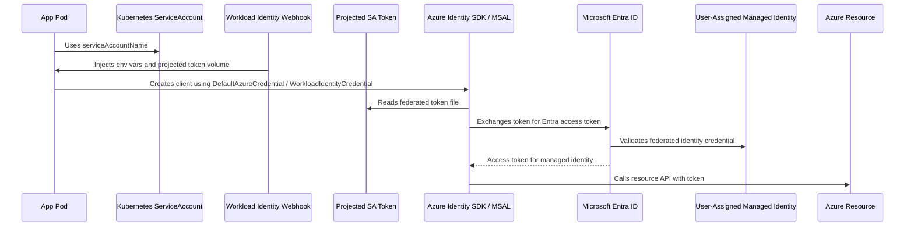
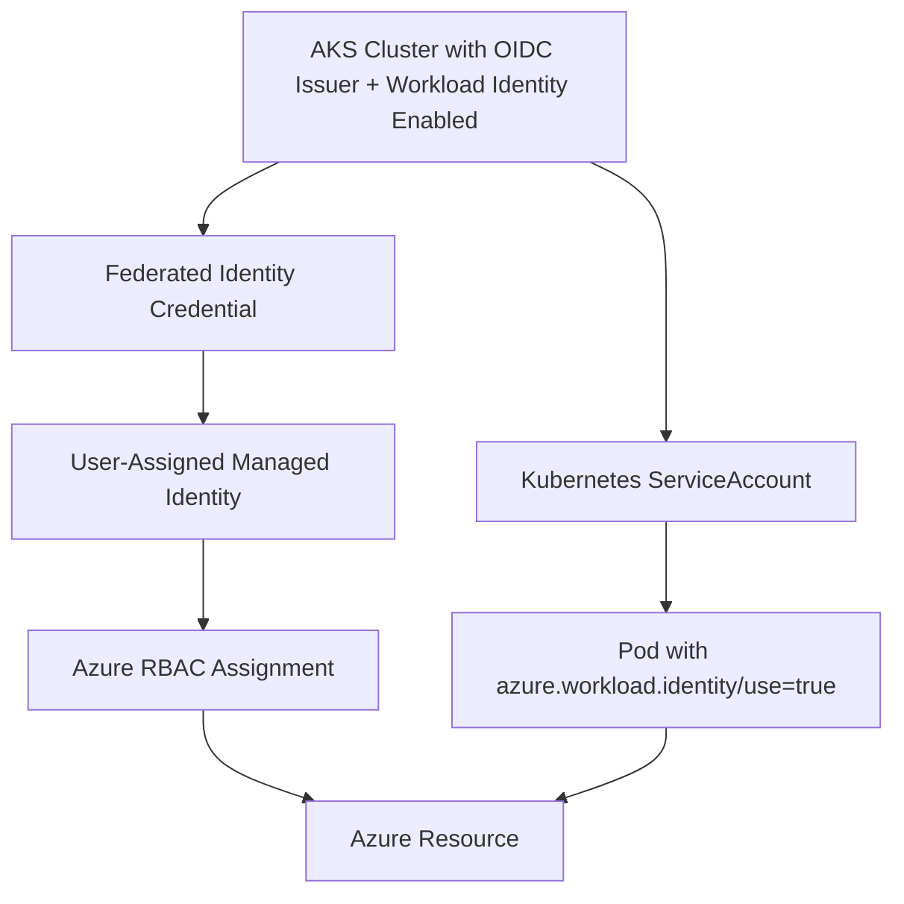
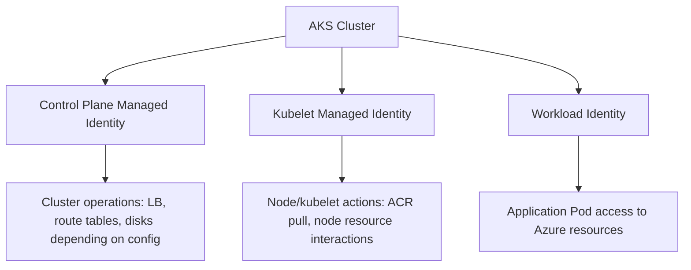
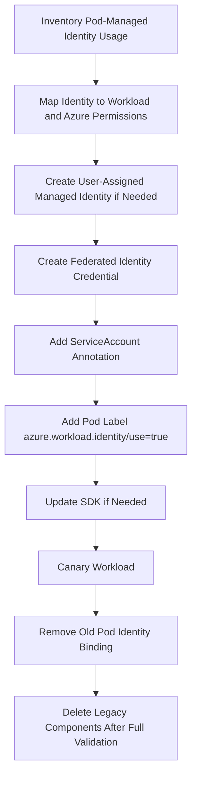
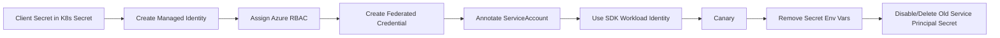
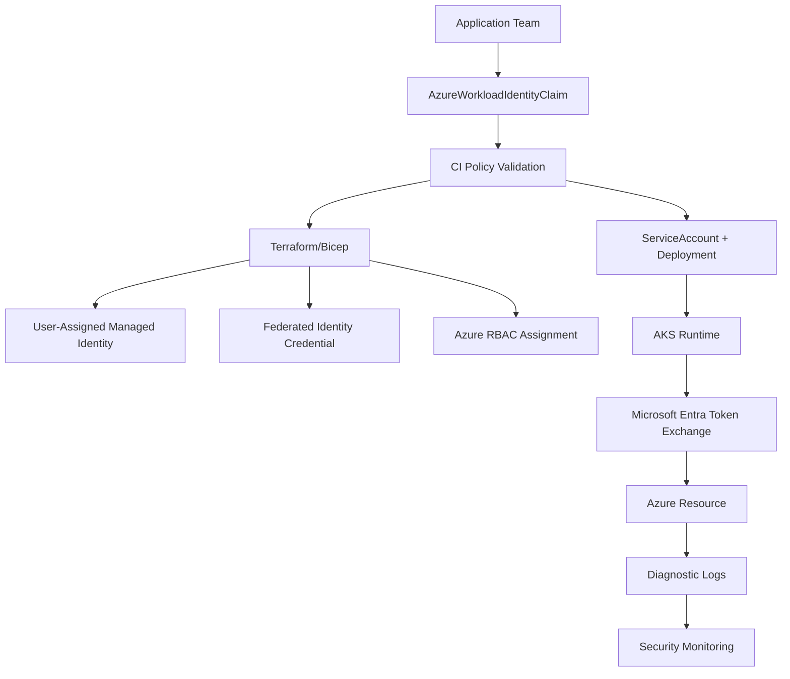

# Part 022 — AKS Workload Identity and Managed Identity

In AKS, the production question is the same as in EKS:

> How does a Pod access cloud resources without storing cloud credentials?

The Azure answer is built around **Microsoft Entra Workload ID** and **managed identities**.

This part explains how AKS workloads authenticate to Azure services such as Key Vault, Storage, Service Bus, Event Hubs, Cosmos DB, Azure SQL, Container Registry, and Azure Monitor without secrets stored in Kubernetes.

The key mental shift:

> A Kubernetes ServiceAccount can become a federated workload identity. Microsoft Entra ID can trust tokens issued for that ServiceAccount and exchange them for Azure access tokens for a managed identity or application identity.

This is not just a configuration trick. It is a production security boundary.

---

## 1. The Problem: Azure Access Without Secrets

A typical AKS workload needs to do this:

```text
checkout-api -> read secret from Key Vault
billing-worker -> send message to Service Bus
media-processor -> read/write Blob Storage
audit-exporter -> write to Event Hubs
reporting-job -> query Azure SQL with Entra auth
```

Unsafe patterns:

| Pattern | Why It Fails |
|---|---|
| Client secret in Kubernetes Secret | Kubernetes becomes a secret distribution system for long-lived Entra credentials. |
| Storage account key in env var | Broad account-level access, weak rotation lifecycle, high blast radius. |
| Connection string in Helm values | Leaks through Git, CI logs, chart history, rendered manifests. |
| Cluster identity reused by apps | Workloads inherit platform-level permissions accidentally. |
| Legacy pod-managed identity without clear migration | More moving parts and older operational model. |

The production target:

```text
Pod -> Kubernetes ServiceAccount -> projected token -> Microsoft Entra token exchange -> managed identity -> Azure resource
```

---

## 2. Azure Identity Vocabulary

Azure identity terminology is easy to confuse. Use precise language.

| Term | Meaning | Production Note |
|---|---|---|
| Microsoft Entra ID | Identity provider previously known as Azure AD. | Issues and validates tokens. |
| Managed identity | Azure-managed identity for a resource/workload. | Avoids explicit client secret management. |
| System-assigned managed identity | Identity tied to lifecycle of one Azure resource. | Useful for platform resource identity. |
| User-assigned managed identity | Standalone identity reusable across resources. | Preferred for explicit workload identities. |
| AKS control plane identity | Identity AKS uses to manage Azure resources for the cluster. | Not your application identity. |
| Kubelet identity | Identity used by nodes/kubelet for actions like pulling images from ACR. | Not your application identity. |
| Workload identity | Federated identity for Pods using Kubernetes ServiceAccount tokens. | Correct model for app-to-Azure access. |
| Federated identity credential | Entra configuration that trusts a token issuer/subject/audience. | Binds AKS ServiceAccount token to an identity. |

A common mistake is saying “AKS has a managed identity, so my Pods can use it.” That is usually the wrong model. The cluster identity and kubelet identity are platform identities. Application Pods should use their own workload identity.

---

## 3. Core Mental Model



Important: the Pod does not receive a managed identity secret. It receives a projected Kubernetes service account token. That token is exchanged for an Entra access token if the federated trust matches.

---

## 4. The Invariants

### Invariant 1 — No Azure Client Secrets in Pods

No `AZURE_CLIENT_SECRET`, storage account key, Service Bus connection string, or long-lived app secret should be injected into normal application Pods if the Azure service supports Entra-based authentication.

Prefer identity-based access:

```text
Blob Storage -> Azure RBAC data plane roles
Key Vault -> Azure RBAC or access policy depending on vault mode
Service Bus -> Azure RBAC roles
Event Hubs -> Azure RBAC roles
Azure SQL -> Microsoft Entra authentication where applicable
```

### Invariant 2 — Workload Identity Is Bound to ServiceAccount

The Kubernetes ServiceAccount is the cluster-side identity handle.

```yaml
apiVersion: v1
kind: ServiceAccount
metadata:
  name: checkout-api-azure-sa
  namespace: checkout-prod
```

The Pod must explicitly use it:

```yaml
spec:
  serviceAccountName: checkout-api-azure-sa
```

### Invariant 3 — The Federated Credential Subject Must Match Exactly

The federated identity credential commonly uses a subject like:

```text
system:serviceaccount:<namespace>:<serviceaccount>
```

If the namespace or ServiceAccount name changes, token exchange fails.

### Invariant 4 — Pod Mutation Is Intentional

In AKS Workload Identity, the Pod template typically needs the label:

```yaml
metadata:
  labels:
    azure.workload.identity/use: "true"
```

Without the required label/mutation behavior, the expected environment variables and projected token volume may not appear.

### Invariant 5 — Azure RBAC Is Data Plane Permission

Successfully exchanging a token does not mean the workload can read a Key Vault secret or write to Storage. The managed identity still needs the correct Azure RBAC role or resource-specific access configuration.

---

## 5. AKS Workload Identity Architecture

AKS Workload Identity has five moving parts:



The critical alignment is:

```text
AKS OIDC issuer URL
+ ServiceAccount subject
+ audience
+ managed identity client ID
+ Azure RBAC role assignment
```

If any piece is wrong, authentication or authorization fails.

---

## 6. Cluster Enablement

For AKS Workload Identity, the cluster needs:

- OIDC issuer enabled
- workload identity enabled

Example for a new cluster:

```bash
az aks create \
  --resource-group rg-platform-prod \
  --name aks-prod-a \
  --location southeastasia \
  --enable-oidc-issuer \
  --enable-workload-identity \
  --node-count 3
```

Example for an existing cluster:

```bash
az aks update \
  --resource-group rg-platform-prod \
  --name aks-prod-a \
  --enable-oidc-issuer \
  --enable-workload-identity
```

Get the OIDC issuer URL:

```bash
AKS_OIDC_ISSUER=$(az aks show \
  --resource-group rg-platform-prod \
  --name aks-prod-a \
  --query "oidcIssuerProfile.issuerUrl" \
  -o tsv)

echo "$AKS_OIDC_ISSUER"
```

The OIDC issuer is what Microsoft Entra uses to validate the service account token.

---

## 7. Create a User-Assigned Managed Identity

For application workloads, prefer a **user-assigned managed identity** because it is explicit, independently lifecycle-managed, and easier to bind to a specific workload.

```bash
az identity create \
  --resource-group rg-app-checkout-prod \
  --name id-checkout-api-prod \
  --location southeastasia
```

Extract values:

```bash
IDENTITY_CLIENT_ID=$(az identity show \
  --resource-group rg-app-checkout-prod \
  --name id-checkout-api-prod \
  --query clientId \
  -o tsv)

IDENTITY_PRINCIPAL_ID=$(az identity show \
  --resource-group rg-app-checkout-prod \
  --name id-checkout-api-prod \
  --query principalId \
  -o tsv)

TENANT_ID=$(az account show --query tenantId -o tsv)
```

Distinguish:

| Value | Meaning |
|---|---|
| `clientId` | Application/client ID used by workload identity SDK configuration. |
| `principalId` | Object ID used in many Azure RBAC role assignments. |
| `tenantId` | Entra tenant ID. |

Using the wrong ID is a very common failure mode.

---

## 8. Grant Azure Resource Access

Example: allow the workload to read secrets from Key Vault using Azure RBAC.

```bash
KEYVAULT_ID=$(az keyvault show \
  --resource-group rg-shared-security-prod \
  --name kv-company-prod \
  --query id \
  -o tsv)

az role assignment create \
  --assignee-object-id "$IDENTITY_PRINCIPAL_ID" \
  --assignee-principal-type ServicePrincipal \
  --role "Key Vault Secrets User" \
  --scope "$KEYVAULT_ID"
```

Example: allow read/write to a Blob Storage container scope.

```bash
STORAGE_ACCOUNT_ID=$(az storage account show \
  --resource-group rg-app-checkout-prod \
  --name stcheckoutprod \
  --query id \
  -o tsv)

az role assignment create \
  --assignee-object-id "$IDENTITY_PRINCIPAL_ID" \
  --assignee-principal-type ServicePrincipal \
  --role "Storage Blob Data Contributor" \
  --scope "$STORAGE_ACCOUNT_ID"
```

Prefer the narrowest scope possible:

```text
resource group scope > resource scope > container/resource sub-scope where supported
```

Avoid subscription-wide roles for application workloads unless there is an exceptional platform reason.

---

## 9. Create the Federated Identity Credential

The federated identity credential tells Entra:

```text
Trust tokens from this AKS OIDC issuer when the subject is this Kubernetes ServiceAccount and the audience is this expected token exchange audience.
```

Example:

```bash
az identity federated-credential create \
  --name fic-checkout-api-prod \
  --identity-name id-checkout-api-prod \
  --resource-group rg-app-checkout-prod \
  --issuer "$AKS_OIDC_ISSUER" \
  --subject "system:serviceaccount:checkout-prod:checkout-api-azure-sa" \
  --audience "api://AzureADTokenExchange"
```

Subject format:

```text
system:serviceaccount:<namespace>:<serviceaccount>
```

This subject is your trust boundary. Treat it like an IAM trust condition.

---

## 10. Kubernetes ServiceAccount

```yaml
apiVersion: v1
kind: ServiceAccount
metadata:
  name: checkout-api-azure-sa
  namespace: checkout-prod
  annotations:
    azure.workload.identity/client-id: "<IDENTITY_CLIENT_ID>"
  labels:
    app.kubernetes.io/name: checkout-api
    platform.mycompany.io/cloud-identity: azure
    platform.mycompany.io/identity-owner: checkout-team
```

Optional tenant annotation when needed:

```yaml
metadata:
  annotations:
    azure.workload.identity/client-id: "<IDENTITY_CLIENT_ID>"
    azure.workload.identity/tenant-id: "<TENANT_ID>"
```

Token expiration tuning is possible, but do not change it casually:

```yaml
metadata:
  annotations:
    azure.workload.identity/service-account-token-expiration: "3600"
```

Shorter token lifetimes can reduce exposure but increase sensitivity to refresh failures. Longer token lifetimes can improve tolerance but increase residual risk. Tune only with a clear reliability/security reason.

---

## 11. Pod / Deployment Configuration

The Pod template must use the ServiceAccount and opt into workload identity mutation.

```yaml
apiVersion: apps/v1
kind: Deployment
metadata:
  name: checkout-api
  namespace: checkout-prod
spec:
  replicas: 3
  selector:
    matchLabels:
      app.kubernetes.io/name: checkout-api
  template:
    metadata:
      labels:
        app.kubernetes.io/name: checkout-api
        azure.workload.identity/use: "true"
    spec:
      serviceAccountName: checkout-api-azure-sa
      containers:
        - name: app
          image: company.azurecr.io/checkout-api:2026.07.03
          env:
            - name: KEYVAULT_URL
              value: "https://kv-company-prod.vault.azure.net/"
          ports:
            - containerPort: 8080
```

After mutation, the Pod should have environment variables similar to:

```text
AZURE_CLIENT_ID
AZURE_TENANT_ID
AZURE_FEDERATED_TOKEN_FILE
AZURE_AUTHORITY_HOST
```

And a projected token file mounted at the expected path.

Inspection:

```bash
kubectl -n checkout-prod exec deploy/checkout-api -- env | grep AZURE_
kubectl -n checkout-prod exec deploy/checkout-api -- ls -l "$AZURE_FEDERATED_TOKEN_FILE"
```

---

## 12. SDK Contract

The application must use an Azure SDK or MSAL flow that understands workload identity.

Java example with Azure Identity:

```java
import com.azure.identity.DefaultAzureCredential;
import com.azure.identity.DefaultAzureCredentialBuilder;
import com.azure.security.keyvault.secrets.SecretClient;
import com.azure.security.keyvault.secrets.SecretClientBuilder;

public final class KeyVaultClientFactory {
    public static SecretClient create(String vaultUrl) {
        DefaultAzureCredential credential = new DefaultAzureCredentialBuilder().build();

        return new SecretClientBuilder()
                .vaultUrl(vaultUrl)
                .credential(credential)
                .buildClient();
    }
}
```

The app should not require:

```text
AZURE_CLIENT_SECRET
AZURE_USERNAME
AZURE_PASSWORD
Storage account key
Service Bus connection string
```

For deterministic behavior, some teams use `WorkloadIdentityCredential` directly rather than `DefaultAzureCredential`. That can be useful when you want to prevent unexpected fallback to developer credentials or managed identity endpoints.

Conceptual Java example:

```java
import com.azure.identity.WorkloadIdentityCredential;
import com.azure.identity.WorkloadIdentityCredentialBuilder;

WorkloadIdentityCredential credential = new WorkloadIdentityCredentialBuilder()
        .clientId(System.getenv("AZURE_CLIENT_ID"))
        .tenantId(System.getenv("AZURE_TENANT_ID"))
        .tokenFilePath(System.getenv("AZURE_FEDERATED_TOKEN_FILE"))
        .build();
```

Platform guidance:

```text
Use DefaultAzureCredential when your runtime environments are intentionally standardized and tested.
Use WorkloadIdentityCredential when you want explicit runtime identity behavior in Kubernetes.
```

---

## 13. Managed Identity Types in AKS

Do not mix these up.



### Control Plane Identity

Used by AKS to manage cluster infrastructure. It is not an app identity.

### Kubelet Identity

Used by kubelet/node components. Commonly involved in pulling from Azure Container Registry.

### Workload Identity

Used by application Pods. This is what you should use for application-to-Azure service access.

If an application needs Key Vault access, do not grant the cluster control plane identity Key Vault permission just because it “works.” That couples application privilege to platform privilege.

---

## 14. Resource Authorization Patterns

### Key Vault

Two models exist depending on vault configuration:

- Azure RBAC authorization
- Key Vault access policies

Prefer standardizing on Azure RBAC for platform consistency if your environment supports it.

Minimal role examples:

| Need | Role |
|---|---|
| Read secret values | Key Vault Secrets User |
| Manage secrets | Key Vault Secrets Officer |
| Read certificates | Key Vault Certificate User |

Be careful: reading a secret value is a sensitive permission. Do not grant broad Key Vault access to a namespace-level shared identity.

### Blob Storage

Common roles:

| Need | Role |
|---|---|
| Read blobs | Storage Blob Data Reader |
| Read/write blobs | Storage Blob Data Contributor |
| Full control including ACL-related operations | Storage Blob Data Owner |

Avoid storage account keys for app workloads.

### Service Bus

Common roles:

| Need | Role |
|---|---|
| Send messages | Azure Service Bus Data Sender |
| Receive messages | Azure Service Bus Data Receiver |
| Manage queues/topics | Azure Service Bus Data Owner |

Separate sender and receiver identities for event-driven systems.

### Event Hubs

Common roles:

| Need | Role |
|---|---|
| Send events | Azure Event Hubs Data Sender |
| Receive events | Azure Event Hubs Data Receiver |
| Manage | Azure Event Hubs Data Owner |

---

## 15. Direct Federation vs Identity Bindings

The standard production model is direct workload identity federation:

```text
AKS OIDC issuer + ServiceAccount subject + audience -> federated credential on managed identity
```

Some AKS environments may also use identity bindings for large-scale patterns. Treat those as an advanced platform feature, not the starting point for application teams.

Key issue: projected service account tokens have an audience. Direct federation expects the `api://AzureADTokenExchange` audience. If another binding/mutation flow changes the token audience, direct federation may fail with an audience mismatch.

Guideline:

```text
Use direct federation first. Add identity binding abstractions only when the platform has a proven scaling problem and a clear ownership model.
```

---

## 16. Multi-Cluster Design

For one app deployed to multiple clusters:

```text
checkout-api in aks-prod-a
checkout-api in aks-prod-b
checkout-api in aks-dr-a
```

Options:

### Option A — One Managed Identity Per Cluster

```text
id-checkout-api-prod-a
id-checkout-api-prod-b
id-checkout-api-dr-a
```

Pros:

- clean blast radius
- easy cluster-level revocation
- clear audit

Cons:

- more identities and role assignments

### Option B — One Managed Identity Shared Across Clusters

```text
id-checkout-api-prod
```

Federated credentials trust multiple issuers/subjects.

Pros:

- simpler app config
- fewer identities

Cons:

- broader blast radius
- more careful audit needed
- harder cluster-specific revocation

For regulated systems, prefer Option A unless operational overhead is unacceptable.

---

## 17. Multi-Tenant Namespace Model

A mature AKS platform should not let app teams freely attach arbitrary managed identities to Pods.

Controls:

- namespace ownership metadata
- admission policy requiring explicit ServiceAccount
- validation of `azure.workload.identity/client-id`
- restrict which client IDs can be used in which namespace
- prohibit `default` ServiceAccount for production workloads
- require `azure.workload.identity/use: "true"` only with approved ServiceAccounts
- inventory all ServiceAccount-to-managed-identity mappings

Conceptual policy rule:

```text
Namespace checkout-prod may only use managed identities tagged owner=checkout-team and environment=prod.
```

This can be implemented through policy-as-code, platform controller, or CI checks.

---

## 18. Admission Guardrails

Example conceptual Kyverno rule: require explicit ServiceAccount in production.

```yaml
apiVersion: kyverno.io/v1
kind: ClusterPolicy
metadata:
  name: require-explicit-service-account-prod
spec:
  validationFailureAction: Enforce
  rules:
    - name: no-default-sa
      match:
        any:
          - resources:
              kinds:
                - Pod
              namespaces:
                - "*-prod"
      validate:
        message: "Production Pods must not use the default ServiceAccount."
        pattern:
          spec:
            serviceAccountName: "!?default"
```

Example conceptual policy: if a Pod opts into Azure Workload Identity, it must use an approved ServiceAccount naming convention.

```yaml
apiVersion: kyverno.io/v1
kind: ClusterPolicy
metadata:
  name: validate-azure-workload-identity-usage
spec:
  validationFailureAction: Enforce
  rules:
    - name: require-azure-sa-name
      match:
        any:
          - resources:
              kinds:
                - Pod
      preconditions:
        all:
          - key: "{{ request.object.metadata.labels.\"azure.workload.identity/use\" || '' }}"
            operator: Equals
            value: "true"
      validate:
        message: "Pods using Azure Workload Identity must use a ServiceAccount ending in -azure-sa."
        pattern:
          spec:
            serviceAccountName: "*-azure-sa"
```

This is only illustrative. Real policies should validate allowed identities per namespace, not just naming.

---

## 19. Key Vault Access: SDK vs CSI Driver

There are two common ways apps consume Key Vault material:

### SDK-Based Access

The app calls Key Vault using Azure SDK and workload identity.

Pros:

- explicit runtime access
- no secret material stored as Kubernetes Secret
- application can handle refresh behavior
- clear identity path

Cons:

- application code must integrate SDK
- app needs error handling for Key Vault dependency

### Secrets Store CSI Driver

The CSI driver mounts secrets from Key Vault as files, optionally syncing to Kubernetes Secret depending on configuration.

Pros:

- app can consume files
- useful for certificates and legacy apps
- centralizes secret retrieval through CSI driver

Cons:

- mounted secret material exists on node filesystem path
- sync-to-Kubernetes-Secret can reintroduce Kubernetes Secret exposure
- CSI driver identity must be carefully scoped
- refresh semantics must be understood

Rule:

```text
Use SDK-based identity for cloud-native applications. Use CSI mounted secrets when file material is required, and avoid syncing to Kubernetes Secret unless there is a strong reason.
```

---

## 20. Application Contract and Error Handling

A production app using workload identity should handle identity dependency failures as first-class runtime conditions.

Examples:

- token file missing
- token exchange denied
- Azure RBAC not propagated yet
- Key Vault private endpoint DNS failure
- transient Entra unavailability
- resource firewall blocks egress
- SDK credential chain misconfigured

Application behavior:

| Operation | Recommended Handling |
|---|---|
| Startup secret fetch | Fail fast if secret is mandatory; do not run with empty defaults. |
| Periodic token refresh | Retry with bounded backoff; emit metric. |
| Optional downstream write | Queue/retry if business semantics allow. |
| Permission denied | Do not retry infinitely; alert as configuration/security issue. |
| Network timeout | Retry with backoff and circuit breaker. |

Do not hide identity failures as generic 500s with no context. Observability should include the failing Azure service, operation, and identity configuration version, without logging tokens.

---

## 21. Debugging Cookbook

### Step 1 — Check Pod Label

```bash
kubectl -n checkout-prod get pod <pod> -o jsonpath='{.metadata.labels.azure\.workload\.identity/use}{"\n"}'
```

Expected:

```text
true
```

### Step 2 — Check ServiceAccount

```bash
kubectl -n checkout-prod get sa checkout-api-azure-sa -o yaml
```

Look for:

```yaml
annotations:
  azure.workload.identity/client-id: "..."
```

### Step 3 — Check Injected Environment

```bash
kubectl -n checkout-prod exec <pod> -- env | grep AZURE_
```

Expected:

```text
AZURE_CLIENT_ID=...
AZURE_TENANT_ID=...
AZURE_FEDERATED_TOKEN_FILE=...
AZURE_AUTHORITY_HOST=...
```

### Step 4 — Check Token File

```bash
kubectl -n checkout-prod exec <pod> -- sh -c 'test -f "$AZURE_FEDERATED_TOKEN_FILE" && echo token-file-present'
```

Do not print the token in shared logs.

### Step 5 — Check Federated Credential

```bash
az identity federated-credential list \
  --resource-group rg-app-checkout-prod \
  --identity-name id-checkout-api-prod \
  -o table
```

Validate:

- issuer equals AKS OIDC issuer
- subject equals `system:serviceaccount:checkout-prod:checkout-api-azure-sa`
- audience equals `api://AzureADTokenExchange`

### Step 6 — Check Azure RBAC

```bash
az role assignment list \
  --assignee "$IDENTITY_PRINCIPAL_ID" \
  --all \
  -o table
```

Confirm role and scope are correct.

### Step 7 — Test From App or Debug Container

A generic debug image may not have the correct SDK tools. Prefer an approved platform diagnostic image that includes Azure CLI or small test binaries, and run it with the same ServiceAccount.

```bash
kubectl -n checkout-prod run azure-debug \
  --rm -it \
  --image=mcr.microsoft.com/azure-cli:latest \
  --serviceaccount=checkout-api-azure-sa \
  --labels='azure.workload.identity/use=true' \
  -- bash
```

Inside:

```bash
az login --service-principal \
  --tenant "$AZURE_TENANT_ID" \
  --username "$AZURE_CLIENT_ID" \
  --federated-token "$(cat $AZURE_FEDERATED_TOKEN_FILE)"

az account show
```

Use this only under controlled RBAC. A debug Pod with a production ServiceAccount has production permissions.

---

## 22. Failure Mode Catalogue

### Failure Mode 1 — Missing Pod Label

Symptom:

```text
AZURE_FEDERATED_TOKEN_FILE is not set
DefaultAzureCredential failed
```

Cause:

```yaml
azure.workload.identity/use: "true"
```

is missing from Pod template labels.

Fix:

Add the label and restart Pods.

### Failure Mode 2 — Wrong Client ID

Symptom:

- token exchange fails
- Entra says application/managed identity not found
- SDK credential acquisition fails

Check:

```bash
kubectl -n <ns> get sa <sa> -o yaml | grep client-id
az identity show --name <identity> --resource-group <rg> --query clientId -o tsv
```

Remember: use `clientId`, not `principalId`, in the ServiceAccount annotation.

### Failure Mode 3 — Wrong Federated Credential Subject

Symptom:

```text
AADSTS70021 / no matching federated identity record found
```

Check subject:

```text
system:serviceaccount:<namespace>:<serviceaccount>
```

Namespace typo is enough to break auth.

### Failure Mode 4 — Wrong Audience

Direct workload identity federation expects the correct token audience, commonly:

```text
api://AzureADTokenExchange
```

If another identity binding or custom token projection uses a different audience, token exchange fails.

### Failure Mode 5 — Azure RBAC Propagation Delay

Symptom:

- token acquisition succeeds
- Azure resource returns authorization failure
- works several minutes later

Fix:

- design provisioning pipeline with propagation wait
- verify role assignment before app rollout
- do not create access in the hot path

### Failure Mode 6 — Key Vault Authorization Mode Mismatch

Symptom:

- role assignment seems correct but Key Vault denies

Check:

- is Key Vault using Azure RBAC authorization?
- or legacy access policies?
- is the identity granted permission in the correct model?

### Failure Mode 7 — Private Endpoint / DNS Failure

Symptom:

- identity works but app cannot connect to Key Vault/Storage
- DNS resolves public endpoint when private endpoint expected
- timeout instead of access denied

Check:

```bash
kubectl -n <ns> exec <pod> -- nslookup <vault-name>.vault.azure.net
kubectl -n <ns> exec <pod> -- curl -v https://<vault-name>.vault.azure.net/
```

Identity and network are separate failure domains.

### Failure Mode 8 — SDK Too Old or Credential Chain Overridden

Symptom:

- environment variables exist
- token file exists
- app still cannot authenticate

Fix:

- update Azure Identity library
- use `DefaultAzureCredential` or `WorkloadIdentityCredential`
- remove explicit client-secret or managed identity endpoint assumptions

### Failure Mode 9 — Multi-Container Token Injection Surprise

By default, the projected service account token volume may be added to containers in the Pod when workload identity mutation applies. Use skip-container annotations only when you understand which containers need identity.

Sidecars should not receive cloud identity unless required.

---

## 23. Observability and Audit

You need to answer:

```text
Which Pod used which managed identity to access which Azure resource at what time?
```

Signals:

- Kubernetes Pod labels and ServiceAccount
- ServiceAccount annotations
- federated identity credential inventory
- Azure Activity Log for role assignment changes
- Entra sign-in/workload identity logs where available
- resource diagnostic logs, such as Key Vault audit logs or Storage logs
- application metrics for token acquisition failures

Suggested metrics:

```text
azure_identity_token_acquisition_success_total
azure_identity_token_acquisition_failure_total
azure_identity_token_acquisition_latency_ms
keyvault_secret_fetch_failure_total
storage_authorization_failure_total
servicebus_send_authorization_failure_total
```

Suggested log fields:

```json
{
  "cloud": "azure",
  "cluster": "aks-prod-a",
  "namespace": "checkout-prod",
  "serviceAccount": "checkout-api-azure-sa",
  "managedIdentityClientId": "redacted-or-hash",
  "azureResource": "kv-company-prod",
  "operation": "SecretClient.GetSecret",
  "result": "failure",
  "errorCategory": "authorization_denied"
}
```

Never log token content.

---

## 24. Platform API Pattern

Expose a higher-level identity request rather than raw Azure commands.

```yaml
apiVersion: platform.mycompany.io/v1alpha1
kind: AzureWorkloadIdentityClaim
metadata:
  name: checkout-api-keyvault-read
  namespace: checkout-prod
spec:
  owner: checkout-team
  serviceAccountName: checkout-api-azure-sa
  environment: prod
  azure:
    tenantId: "00000000-0000-0000-0000-000000000000"
    subscriptionId: "11111111-1111-1111-1111-111111111111"
    resourceGroup: rg-app-checkout-prod
    managedIdentityName: id-checkout-api-prod
  access:
    keyVault:
      - name: kv-company-prod
        permissions:
          - secrets.read
    storage:
      - account: stcheckoutprod
        permissions:
          - blob.read
          - blob.write
```

The platform expands this into:

- user-assigned managed identity
- federated identity credential
- Azure RBAC role assignments
- Kubernetes ServiceAccount
- policy metadata
- audit record
- verification job

This is how you scale workload identity across many teams without making each team an expert in Entra federation details.

---

## 25. GitOps and IaC Ownership

Recommended split:

```text
Terraform/Bicep/Pulumi:
- user-assigned managed identity
- federated identity credential
- Azure RBAC role assignments
- Key Vault access model
- resource diagnostic settings

GitOps/Kubernetes:
- ServiceAccount
- Deployment labels
- namespace metadata
- policy exceptions
```

The boundary should be deterministic. Avoid a model where Helm creates ServiceAccounts, Terraform creates federated credentials, and developers manually patch identities through the portal. That becomes unauditable quickly.

A healthy inventory table:

| Cluster | Namespace | ServiceAccount | Managed Identity | Azure Roles | Owner |
|---|---|---|---|---|---|
| aks-prod-a | checkout-prod | checkout-api-azure-sa | id-checkout-api-prod | Key Vault Secrets User | checkout-team |
| aks-prod-a | billing-prod | billing-worker-azure-sa | id-billing-worker-prod | Service Bus Data Sender | billing-team |

---

## 26. Migration From Pod-Managed Identity

Older AKS systems may use pod-managed identity patterns. The modern target is Microsoft Entra Workload ID.

Safe migration:



Migration principles:

- do not change identity and permission scope at the same time
- validate the new identity under real calls
- remove old bindings after cutover
- update runbooks and dashboards
- avoid proxy-sidecar compatibility modes as permanent architecture

---

## 27. Migration From Secrets to Workload Identity

Legacy example:

```yaml
env:
  - name: AZURE_CLIENT_ID
    valueFrom:
      secretKeyRef:
        name: checkout-azure-sp
        key: client-id
  - name: AZURE_CLIENT_SECRET
    valueFrom:
      secretKeyRef:
        name: checkout-azure-sp
        key: client-secret
```

Migration:



The migration is not complete until the old secret is disabled or deleted.

---

## 28. Security Review Checklist

For every AKS workload identity:

- [ ] Workload uses dedicated ServiceAccount.
- [ ] Pod template has `azure.workload.identity/use: "true"` only when needed.
- [ ] ServiceAccount has correct managed identity client ID.
- [ ] Federated credential subject matches exact namespace and ServiceAccount.
- [ ] Azure RBAC scope is minimal.
- [ ] No client secret, storage key, or connection string remains in Pod env/secrets.
- [ ] Cluster identity and kubelet identity are not reused for app access.
- [ ] Kubernetes RBAC prevents unauthorized use of privileged ServiceAccounts.
- [ ] Admission policy prevents arbitrary identity attachment.
- [ ] Key Vault authorization mode is known and documented.
- [ ] Private endpoint/DNS path is tested if resource is private.
- [ ] SDK credential chain is tested.
- [ ] Token acquisition failures are observable.
- [ ] Revocation procedure is documented.
- [ ] Role assignment changes are audited.

---

## 29. A Production Reference Blueprint



Definition of done:

- ServiceAccount exists with correct annotation.
- Deployment uses ServiceAccount and workload identity label.
- Federated credential issuer/subject/audience matches.
- Managed identity has only required Azure roles.
- App can acquire token using production SDK path.
- App can perform required operation.
- App is denied non-required operation.
- Old secrets are absent or disabled.
- Audit logs can show usage.

---

## 30. Capstone Exercise

Design AKS Workload Identity for this workload:

```text
Service: invoice-publisher
Namespace: finance-prod
Cluster: aks-prod-a
Needs:
- read signing certificate from Key Vault
- write PDF invoice files to one Blob container
- send message to Service Bus topic invoice-events
Must not:
- read all Key Vault secrets
- delete blobs
- receive Service Bus messages
- use client secrets or connection strings
```

Deliverables:

1. Managed identity naming and ownership model
2. Azure RBAC role assignments with scopes
3. Federated identity credential command or IaC equivalent
4. Kubernetes ServiceAccount manifest
5. Deployment snippet
6. Java SDK credential strategy
7. Debug commands
8. Failure-mode checklist
9. Rollback/revocation plan

Review questions:

- Should one identity handle Key Vault, Storage, and Service Bus, or should they be split?
- What is the minimum Blob Storage role?
- Does Key Vault use Azure RBAC or access policies?
- What happens if the namespace is renamed?
- How do you prove no storage account key is used?

---

## 31. Final Mental Model

AKS Workload Identity is not just a safer replacement for secrets. It is the control plane where these systems meet:

```text
Kubernetes ServiceAccount
+ AKS OIDC issuer
+ Microsoft Entra federation
+ Managed identity
+ Azure RBAC
+ SDK credential behavior
+ observability
+ platform governance
```

Top-tier Kubernetes engineers do not merely run `az identity federated-credential create`. They can reason about:

- what identity the Pod has inside Kubernetes
- what issuer Entra trusts
- what subject must match
- what token audience is expected
- what managed identity receives access
- what Azure role authorizes the data-plane operation
- what the app SDK must do
- what logs prove the path
- what to revoke during an incident
- how to scale the pattern across many clusters and teams

That is the level needed for a production AKS platform.

---

## References

- Microsoft Learn — Use Microsoft Entra Workload ID on Azure Kubernetes Service: https://learn.microsoft.com/en-us/azure/aks/workload-identity-overview
- Microsoft Learn — Deploy and configure workload identity on AKS: https://learn.microsoft.com/en-us/azure/aks/workload-identity-deploy-cluster
- Microsoft Learn — Managed identities in AKS: https://learn.microsoft.com/en-us/azure/aks/managed-identity-overview
- Azure Workload Identity Documentation — Service account labels and annotations: https://azure.github.io/azure-workload-identity/docs/topics/service-account-labels-and-annotations.html
- Microsoft Learn — Azure built-in roles: https://learn.microsoft.com/en-us/azure/role-based-access-control/built-in-roles
- Kubernetes Documentation — Service Accounts: https://kubernetes.io/docs/concepts/security/service-accounts/
- Kubernetes Documentation — RBAC Authorization: https://kubernetes.io/docs/reference/access-authn-authz/rbac/
