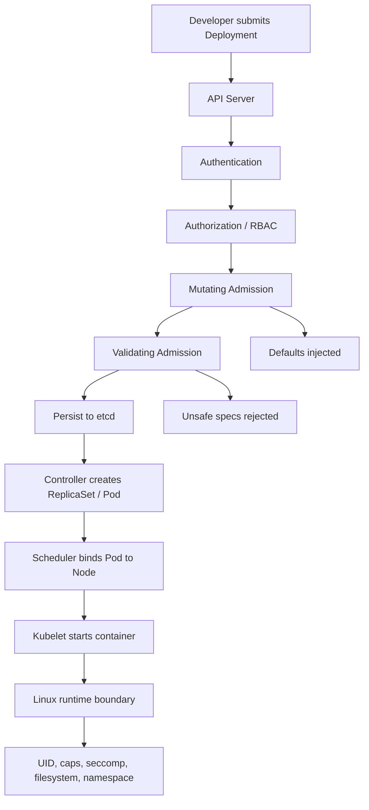
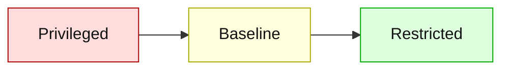
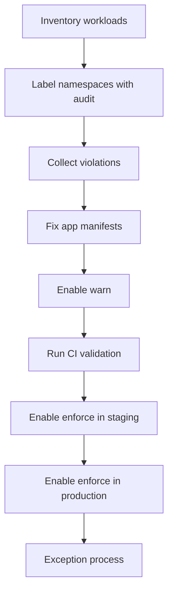
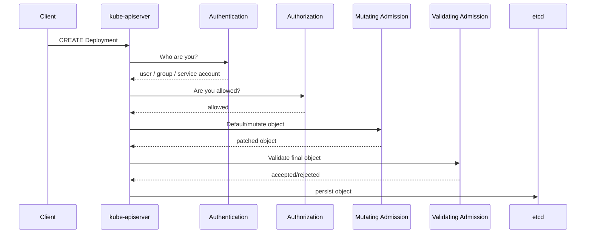

# Part 023 — Security Context, Pod Security, and Admission

Kubernetes security is not one setting. It is a chain of constraints.

The common beginner mistake is to think:

> "We use private clusters and RBAC, so workloads are secure."

That is false.

RBAC controls **who can ask the API server to do something**. NetworkPolicy controls **which Pods can talk to which endpoints**. Workload identity controls **which cloud APIs a Pod can call**. But once the Pod is scheduled, the container process still has a Linux security boundary, filesystem boundary, capability boundary, namespace boundary, and admission-time policy boundary.

This part is about that layer.

The target skill is not memorizing every `securityContext` field. The target skill is the ability to review a workload and answer:

> "If this container is compromised, how far can the attacker move from inside the Pod?"

That is the real production question.

---

## 1. The security model in one sentence

A Kubernetes workload is secure only when **the requested runtime privileges are no wider than the application needs, and the API server refuses unsafe Pod specs before they reach the node**.

That sentence gives us two responsibilities:

1. **Declare a safe runtime contract** using Pod/container security context.
2. **Enforce safe defaults and guardrails** using admission control.



The key observation: by the time the container starts, it is too late to negotiate safety. Safety must be encoded in spec and enforced at admission.

---

## 2. What problem `securityContext` actually solves

A container is not a virtual machine. It is a process running on a node using Linux primitives such as namespaces, cgroups, capabilities, seccomp, AppArmor, SELinux, and filesystem mounts.

`securityContext` lets you constrain how that process runs.

There are two levels:

```yaml
apiVersion: v1
kind: Pod
metadata:
  name: example
spec:
  securityContext:          # Pod-level defaults
    runAsNonRoot: true
    seccompProfile:
      type: RuntimeDefault
  containers:
    - name: app
      image: example/app:1.0.0
      securityContext:      # Container-level overrides
        allowPrivilegeEscalation: false
        readOnlyRootFilesystem: true
        capabilities:
          drop: ["ALL"]
```

The Pod-level context applies defaults where relevant. The container-level context is usually where you set capability, privilege escalation, and read-only filesystem rules.

A production review should not ask only:

> "Does it have a security context?"

A better review asks:

> "Which kernel-level powers does this process receive, and why?"

---

## 3. The production baseline: restricted-by-default workload

For most stateless applications, start here:

```yaml
apiVersion: apps/v1
kind: Deployment
metadata:
  name: orders-api
  namespace: app-orders
spec:
  replicas: 3
  selector:
    matchLabels:
      app.kubernetes.io/name: orders-api
  template:
    metadata:
      labels:
        app.kubernetes.io/name: orders-api
    spec:
      automountServiceAccountToken: false
      securityContext:
        runAsNonRoot: true
        runAsUser: 10001
        runAsGroup: 10001
        fsGroup: 10001
        seccompProfile:
          type: RuntimeDefault
      containers:
        - name: orders-api
          image: registry.example.com/orders-api:1.4.7
          ports:
            - name: http
              containerPort: 8080
          securityContext:
            allowPrivilegeEscalation: false
            readOnlyRootFilesystem: true
            capabilities:
              drop:
                - ALL
          volumeMounts:
            - name: tmp
              mountPath: /tmp
            - name: cache
              mountPath: /app/cache
          resources:
            requests:
              cpu: "250m"
              memory: "512Mi"
            limits:
              memory: "768Mi"
      volumes:
        - name: tmp
          emptyDir: {}
        - name: cache
          emptyDir: {}
```

Important details:

- `runAsNonRoot: true` prevents the container from running as UID 0.
- `runAsUser` and `runAsGroup` make runtime identity explicit.
- `allowPrivilegeEscalation: false` prevents gaining more privileges through mechanisms such as setuid binaries.
- `capabilities.drop: ["ALL"]` removes Linux capabilities by default.
- `seccompProfile.type: RuntimeDefault` uses the container runtime's default syscall filter.
- `readOnlyRootFilesystem: true` makes the application prove its writable paths are explicit.
- `automountServiceAccountToken: false` avoids giving API credentials to Pods that do not need them.
- `emptyDir` mounts create explicit writable scratch space.

This is not perfect security. It is a sane baseline.

---

## 4. Container privilege is a blast-radius multiplier

A compromised container can do only what the process is allowed to do. Runtime privileges determine the difference between "application compromise" and "node compromise".

### 4.1 Dangerous fields

These fields deserve automatic review:

```yaml
securityContext:
  privileged: true
```

`privileged: true` is close to saying: "this container can act like root on the node." It is sometimes necessary for low-level agents, but it should be treated as an exception.

```yaml
hostNetwork: true
hostPID: true
hostIPC: true
```

These make the Pod share host namespaces. They are common in networking, monitoring, and node agents, but they collapse isolation.

```yaml
volumes:
  - name: host
    hostPath:
      path: /var/run/docker.sock
```

`hostPath` can expose sensitive node files or sockets. Mounting the container runtime socket is especially dangerous because it can often lead to node control.

```yaml
securityContext:
  capabilities:
    add:
      - NET_ADMIN
      - SYS_ADMIN
```

Capabilities are fragments of root privilege. `SYS_ADMIN` is particularly broad and should almost never be granted to normal app workloads.

---

## 5. Security context fields that matter most

### 5.1 `runAsNonRoot`

Use it for almost every workload:

```yaml
securityContext:
  runAsNonRoot: true
```

It tells Kubernetes/container runtime that UID 0 is not acceptable.

Caveat: if the image does not declare a numeric non-root user and you do not set `runAsUser`, startup can fail. That failure is good. It reveals an image contract problem.

### 5.2 `runAsUser` and `runAsGroup`

Prefer explicit numeric IDs:

```yaml
securityContext:
  runAsUser: 10001
  runAsGroup: 10001
```

Avoid relying on a username in `/etc/passwd` unless your image is controlled and tested. Numeric IDs make the runtime contract clear.

### 5.3 `fsGroup`

Use when mounted volumes need group ownership:

```yaml
securityContext:
  fsGroup: 10001
```

Be careful with large volumes. Ownership changes can be slow depending on volume type and policy. On high-volume stateful systems, volume permission strategy must be tested during cold start and failover.

### 5.4 `allowPrivilegeEscalation`

Use this by default:

```yaml
securityContext:
  allowPrivilegeEscalation: false
```

It is a simple, high-value control.

### 5.5 Linux capabilities

Default posture:

```yaml
securityContext:
  capabilities:
    drop:
      - ALL
```

If you need one capability, add only that one with a documented reason:

```yaml
securityContext:
  capabilities:
    drop:
      - ALL
    add:
      - NET_BIND_SERVICE
```

Even `NET_BIND_SERVICE` is often unnecessary if the app listens on an unprivileged port such as 8080 and the Service maps port 80 externally.

### 5.6 `seccompProfile`

Default posture:

```yaml
securityContext:
  seccompProfile:
    type: RuntimeDefault
```

Seccomp filters system calls. Runtime defaults are not application-specific perfect profiles, but they are a strong baseline compared with unconfined execution.

### 5.7 `readOnlyRootFilesystem`

Default posture for stateless APIs:

```yaml
securityContext:
  readOnlyRootFilesystem: true
```

This forces application write paths to be explicit.

Typical required writable paths:

- `/tmp`
- application cache directory
- runtime socket directory
- file upload staging directory

Declare them deliberately:

```yaml
volumeMounts:
  - name: tmp
    mountPath: /tmp
volumes:
  - name: tmp
    emptyDir: {}
```

---

## 6. The real contract: safe workload class by class

Different workload classes need different baselines.

| Workload | Expected security posture | Common exception |
|---|---|---|
| Stateless API | restricted, non-root, no service account token, no host access | writable `/tmp`, app cache |
| Worker/consumer | same as stateless API | larger ephemeral storage, cloud identity |
| Batch Job | restricted, explicit service account if needed | write scratch space |
| Ingress controller | restricted where possible, but may need elevated networking | host ports depending on implementation |
| CNI plugin | privileged or host access often required | exception namespace only |
| CSI node plugin | privileged/host mounts often required | exception namespace only |
| Observability agent | host access often required | DaemonSet exception with tight RBAC |
| Security agent | privileged sometimes required | vendor-specific review |

The principle:

> Application namespaces should be restricted. Platform/system namespaces may have exceptions, but exceptions must be bounded, named, reviewed, and monitored.

---

## 7. Pod Security Standards: Privileged, Baseline, Restricted

Kubernetes defines Pod Security Standards as three broad policy levels:

1. **Privileged** — unrestricted; intended for trusted system workloads.
2. **Baseline** — prevents known privilege escalations while allowing common workloads.
3. **Restricted** — heavily restricted; follows hardening best practices.

Use them as an operating model, not just documentation.



A practical environment mapping:

| Namespace type | Recommended PSS level |
|---|---|
| App dev sandbox | `baseline` with `warn/audit: restricted` |
| App staging | `restricted` enforce, limited exceptions |
| App production | `restricted` enforce |
| Platform controllers | `baseline` or privileged exception, case by case |
| CNI/CSI/system agents | privileged exception namespace |
| Security tooling | privileged exception only when justified |

---

## 8. Pod Security Admission

Pod Security Admission is Kubernetes' built-in admission controller for enforcing Pod Security Standards at namespace level.

It works using namespace labels.

Example: enforce restricted in production namespace:

```yaml
apiVersion: v1
kind: Namespace
metadata:
  name: app-orders
  labels:
    pod-security.kubernetes.io/enforce: restricted
    pod-security.kubernetes.io/enforce-version: latest
    pod-security.kubernetes.io/warn: restricted
    pod-security.kubernetes.io/warn-version: latest
    pod-security.kubernetes.io/audit: restricted
    pod-security.kubernetes.io/audit-version: latest
```

Three modes matter:

| Mode | Effect |
|---|---|
| `enforce` | reject non-compliant Pod creation/update |
| `warn` | allow request but return warning to client |
| `audit` | allow request but record audit annotation |

### 8.1 Rollout strategy

Do not turn on `enforce: restricted` blindly across an existing cluster.

Use this progression:



Start with:

```yaml
metadata:
  labels:
    pod-security.kubernetes.io/audit: restricted
    pod-security.kubernetes.io/warn: restricted
```

Then move to:

```yaml
metadata:
  labels:
    pod-security.kubernetes.io/enforce: restricted
```

### 8.2 Version pinning

`latest` follows the current Kubernetes version's definition of the standard. That is convenient but can change behavior during upgrades.

For strict production governance, consider pinning:

```yaml
pod-security.kubernetes.io/enforce-version: v1.34
```

Then plan standard upgrades deliberately.

The trade-off:

| Version strategy | Benefit | Risk |
|---|---|---|
| `latest` | automatically tracks latest standard | upgrade may introduce new violations |
| pinned version | predictable enforcement | may lag behind current hardening |

---

## 9. Admission control mental model

Admission is the final gate before persistence.



The order matters:

- Mutating admission can change the object.
- Validating admission sees the object after mutation.
- Pod Security Admission is validation-oriented for Pod security standards.
- Custom admission webhooks can validate or mutate many resource types.

This creates a powerful but dangerous platform surface.

A broken webhook can block deployments. A careless mutating webhook can hide bad application contracts. A weak validating policy can create false confidence.

---

## 10. What Pod Security Admission does not solve

Pod Security Admission is a baseline, not a full policy platform.

It does not fully answer questions like:

- Is the image from an approved registry?
- Is the image digest pinned?
- Does every Deployment define resource requests?
- Are only approved Ingress classes used?
- Does every namespace have NetworkPolicy?
- Are cloud IAM roles allowed only from specific namespaces?
- Are labels and ownership metadata complete?
- Is this Secret allowed to be mounted by this workload?
- Does this workload violate cost policy?

That is why Part 024 covers policy as code.

The model:

| Layer | Use for |
|---|---|
| Security context | runtime process boundary |
| Pod Security Admission | built-in Pod hardening baseline |
| ValidatingAdmissionPolicy | native CEL-based validation |
| Kyverno/Gatekeeper | richer policy as code |
| Cloud policy | organizational compliance and cloud governance |

---

## 11. Namespace model for production

A practical production cluster should classify namespaces.

```yaml
apiVersion: v1
kind: Namespace
metadata:
  name: app-payments-prod
  labels:
    platform.example.com/tier: production
    platform.example.com/owner: payments
    pod-security.kubernetes.io/enforce: restricted
    pod-security.kubernetes.io/enforce-version: latest
    pod-security.kubernetes.io/warn: restricted
    pod-security.kubernetes.io/warn-version: latest
    pod-security.kubernetes.io/audit: restricted
    pod-security.kubernetes.io/audit-version: latest
```

Platform namespace with exception:

```yaml
apiVersion: v1
kind: Namespace
metadata:
  name: platform-observability
  labels:
    platform.example.com/tier: platform
    platform.example.com/owner: sre
    pod-security.kubernetes.io/enforce: baseline
    pod-security.kubernetes.io/warn: restricted
    pod-security.kubernetes.io/audit: restricted
```

System namespace:

```yaml
apiVersion: v1
kind: Namespace
metadata:
  name: kube-system
  labels:
    platform.example.com/tier: system
    pod-security.kubernetes.io/enforce: privileged
    pod-security.kubernetes.io/warn: baseline
    pod-security.kubernetes.io/audit: baseline
```

This is not permission to be careless in `kube-system`. It is recognition that some system agents need host-level powers.

---

## 12. EKS notes

On EKS, the same Kubernetes-level concepts apply, but there are cloud-specific interactions.

### 12.1 Privileged DaemonSets are common in platform namespaces

Examples often include:

- CNI plugin
- CSI node drivers
- observability agents
- security agents
- node-local DNS agents

Do not copy those privileges into application namespaces.

### 12.2 Service account token exposure matters

EKS workloads often integrate with IAM through EKS Pod Identity or IRSA. A service account token can become the bridge to cloud APIs. That is why `automountServiceAccountToken: false` is a powerful default for workloads that do not need Kubernetes API or cloud identity.

### 12.3 Node role blast radius is still relevant

Pod security reduces in-Pod privilege. It does not replace least-privilege node IAM, workload identity, network policy, or IMDS hardening.

### 12.4 Admission policy is part of platform ownership

EKS does not remove the need for in-cluster policy. In real platforms, teams commonly use Pod Security Admission plus Kyverno or Gatekeeper for custom guardrails.

---

## 13. AKS notes

On AKS, the same workload hardening rules apply, with Azure-specific integrations.

### 13.1 Workload identity and pod security reinforce each other

A Pod with Azure Workload Identity can access Azure resources. The container should still run non-root, without privilege escalation, and with minimal filesystem write surface.

### 13.2 Azure Policy can enforce Kubernetes guardrails

AKS environments often use Azure Policy for governance at subscription/resource-group/cluster level. Treat it as organizational compliance control, not as a substitute for good workload manifests.

### 13.3 System and add-on namespaces need exception modeling

AKS-managed add-ons and node-level agents may require elevated privileges. Application namespace policy should be stricter than platform namespace policy.

---

## 14. Review workflow for a Deployment

When reviewing a workload, use this order.

### Step 1 — Does it need Kubernetes API credentials?

If no:

```yaml
automountServiceAccountToken: false
```

If yes:

- bind a dedicated ServiceAccount
- grant minimal RBAC
- grant minimal cloud permissions
- avoid using default ServiceAccount

### Step 2 — Does it run as root?

Look for:

```yaml
runAsNonRoot: true
runAsUser: 10001
```

If it must run as root, require a written exception and compensating controls.

### Step 3 — Can it escalate privileges?

Look for:

```yaml
allowPrivilegeEscalation: false
```

### Step 4 — What capabilities does it have?

Look for:

```yaml
capabilities:
  drop: ["ALL"]
```

Question every added capability.

### Step 5 — Is the root filesystem writable?

Prefer:

```yaml
readOnlyRootFilesystem: true
```

Declare writable paths explicitly.

### Step 6 — Does it use host access?

Review:

```yaml
hostNetwork: true
hostPID: true
hostIPC: true
hostPath: ...
```

App workloads should almost never need these.

### Step 7 — Does namespace policy enforce the same expectation?

Check namespace labels:

```bash
kubectl get ns app-orders --show-labels
```

---

## 15. Debugging Pod Security failures

### Symptom: Deployment created but Pods do not start

Check ReplicaSet events:

```bash
kubectl describe rs -n app-orders
```

Check namespace labels:

```bash
kubectl get ns app-orders --show-labels
```

Check events:

```bash
kubectl get events -n app-orders --sort-by=.lastTimestamp
```

You may see that Pod creation is forbidden by Pod Security Admission.

### Symptom: app crashes after enabling read-only root filesystem

Look for write attempts:

- `/tmp`
- logs written to files instead of stdout
- local cache directories
- framework-generated files
- JVM temp directory
- Python/Node package cache

Fix by mounting explicit writable paths:

```yaml
volumes:
  - name: tmp
    emptyDir: {}
containers:
  - name: app
    volumeMounts:
      - name: tmp
        mountPath: /tmp
```

### Symptom: app cannot bind to port 80

Better fix: run app on 8080 and expose Service port 80.

```yaml
ports:
  - name: http
    containerPort: 8080
---
apiVersion: v1
kind: Service
metadata:
  name: orders-api
spec:
  ports:
    - name: http
      port: 80
      targetPort: 8080
```

Avoid adding `NET_BIND_SERVICE` unless there is a real reason.

### Symptom: volume permission denied

Check UID/GID:

```bash
kubectl exec -n app-orders deploy/orders-api -- id
```

Check mount ownership:

```bash
kubectl exec -n app-orders deploy/orders-api -- ls -lah /data
```

Potential fixes:

- set `fsGroup`
- use init container to prepare permissions, if allowed
- fix image user/group
- use storage class/CSI options where available

Be careful: init containers running as root can bypass your runtime baseline if not controlled.

---

## 16. Exception design

Exceptions are inevitable. Hidden exceptions are dangerous.

A good exception has:

- owner
- reason
- scope
- expiry
- compensating controls
- review date
- specific namespace/workload match
- audit visibility

Example annotation:

```yaml
metadata:
  annotations:
    security.platform.example.com/exception-id: SEC-2026-0412
    security.platform.example.com/exception-expiry: "2026-10-01"
    security.platform.example.com/exception-reason: "Vendor node security agent requires hostPID and privileged mode"
```

Do not allow permanent anonymous exceptions.

---

## 17. Failure modes

### 17.1 Enforcing restricted on system namespaces

Impact: CNI/CSI/observability agents fail to start.

Prevention:

- classify namespaces
- test admission labels in staging
- avoid blanket namespace labeling

### 17.2 Read-only root filesystem breaks runtime behavior

Impact: app starts crashing after security hardening.

Prevention:

- run app with read-only root filesystem in CI/staging
- declare writable paths explicitly
- inspect framework temp/cache paths

### 17.3 Non-root user cannot access mounted volume

Impact: app fails on startup or cannot persist data.

Prevention:

- test volume ownership
- use `fsGroup` deliberately
- validate stateful failover path

### 17.4 PSA blocks Pods created by controllers

Impact: Deployment exists, but ReplicaSet cannot create Pods.

Prevention:

- validate rendered manifests before apply
- inspect events, not just Deployment status

### 17.5 Security context exists but is meaningless

Example:

```yaml
securityContext:
  runAsNonRoot: true
```

But container also has:

```yaml
hostPath:
  path: /var/run/containerd/containerd.sock
```

Prevention:

- review full Pod spec
- enforce host access policy
- use policy-as-code for high-risk fields

### 17.6 Default service account token exposed everywhere

Impact: compromised app can call Kubernetes API with default namespace ServiceAccount permissions.

Prevention:

- set `automountServiceAccountToken: false` by default
- create dedicated ServiceAccounts only when needed
- bind minimal RBAC

---

## 18. Production checklist

A production app namespace should satisfy:

- [ ] Namespace has Pod Security Admission labels.
- [ ] Production namespaces enforce `restricted` unless exception approved.
- [ ] Workloads run as non-root.
- [ ] Workloads use explicit UID/GID.
- [ ] Privilege escalation is disabled.
- [ ] Linux capabilities are dropped by default.
- [ ] Seccomp uses `RuntimeDefault`.
- [ ] Root filesystem is read-only where feasible.
- [ ] Writable paths are explicit volumes.
- [ ] Host namespace usage is forbidden for app workloads.
- [ ] HostPath usage is forbidden or tightly constrained.
- [ ] Default ServiceAccount is not used by app workloads.
- [ ] Service account token automount is disabled unless needed.
- [ ] Exceptions are documented, scoped, and expiring.
- [ ] CI validates rendered manifests before deployment.
- [ ] Admission failures are visible through events/alerts.

---

## 19. Practice lab

### Lab 1 — Harden a weak Deployment

Start with this unsafe workload:

```yaml
apiVersion: apps/v1
kind: Deployment
metadata:
  name: unsafe-api
spec:
  replicas: 1
  selector:
    matchLabels:
      app: unsafe-api
  template:
    metadata:
      labels:
        app: unsafe-api
    spec:
      containers:
        - name: api
          image: nginx:latest
          ports:
            - containerPort: 80
```

Tasks:

1. Replace mutable image tag with a pinned version or digest.
2. Run as non-root.
3. Disable privilege escalation.
4. Drop all capabilities.
5. Use `RuntimeDefault` seccomp.
6. Make root filesystem read-only.
7. Add writable `/tmp` if needed.
8. Disable service account token automount.
9. Put it in a restricted namespace.

### Lab 2 — Enable Pod Security Admission progressively

Create namespace:

```yaml
apiVersion: v1
kind: Namespace
metadata:
  name: security-lab
  labels:
    pod-security.kubernetes.io/audit: restricted
    pod-security.kubernetes.io/warn: restricted
```

Apply unsafe Pod and observe warnings/events. Then switch to:

```yaml
pod-security.kubernetes.io/enforce: restricted
```

Try again. Explain exactly why it fails.

### Lab 3 — Build an exception namespace

Create a namespace for a fake node agent that needs elevated permissions.

Requirements:

- allow privileged workload only in that namespace
- label owner
- add exception annotations
- document why app namespaces must not copy the pattern

---

## 20. Key takeaways

1. `securityContext` is the runtime privilege contract for container processes.
2. Pod Security Standards provide a shared vocabulary: privileged, baseline, restricted.
3. Pod Security Admission enforces those standards at namespace level.
4. App namespaces should be restricted by default.
5. Platform namespaces may need exceptions, but exceptions must be explicit and audited.
6. Admission control prevents unsafe specs from becoming cluster state.
7. Runtime hardening does not replace RBAC, workload identity, NetworkPolicy, image security, or cloud IAM. It complements them.

---

## References

- Kubernetes Documentation — Security Context: https://kubernetes.io/docs/tasks/configure-pod-container/security-context/
- Kubernetes Documentation — Pod Security Standards: https://kubernetes.io/docs/concepts/security/pod-security-standards/
- Kubernetes Documentation — Pod Security Admission: https://kubernetes.io/docs/concepts/security/pod-security-admission/
- Kubernetes Documentation — Admission Controllers: https://kubernetes.io/docs/reference/access-authn-authz/admission-controllers/
- Kubernetes Documentation — RBAC Authorization: https://kubernetes.io/docs/reference/access-authn-authz/rbac/
- AWS EKS Best Practices — Security: https://docs.aws.amazon.com/eks/latest/best-practices/security.html
- Azure AKS Best Practices — Pod Security: https://learn.microsoft.com/en-us/azure/aks/developer-best-practices-pod-security
