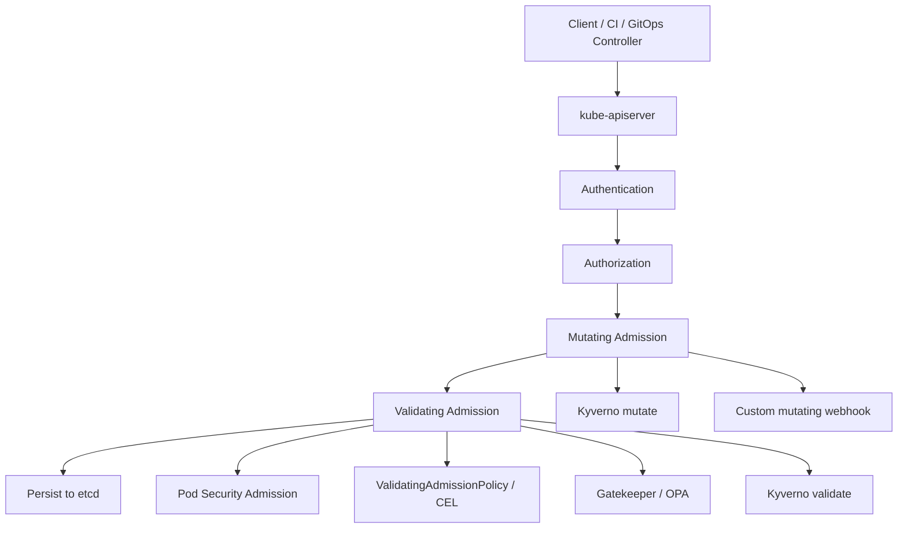
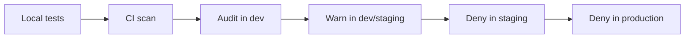
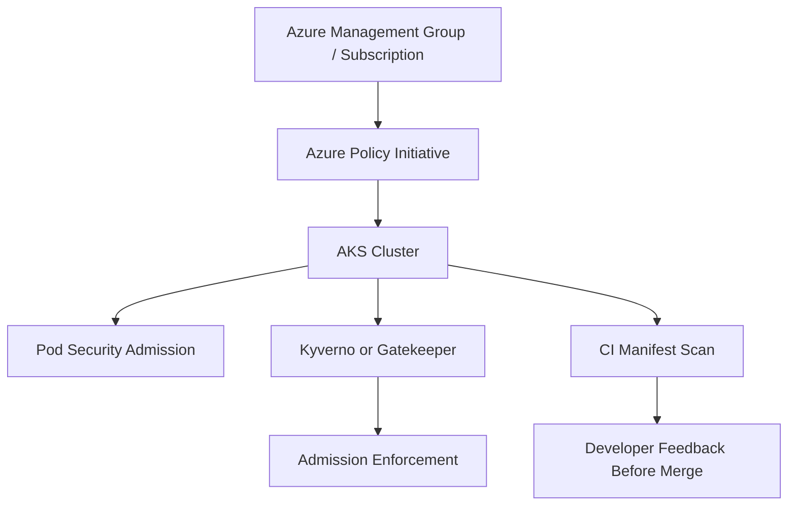
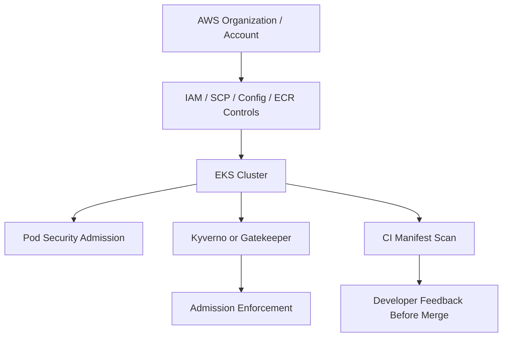
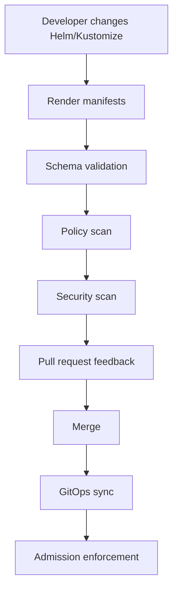
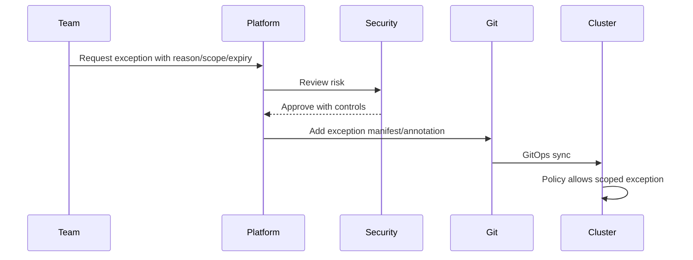
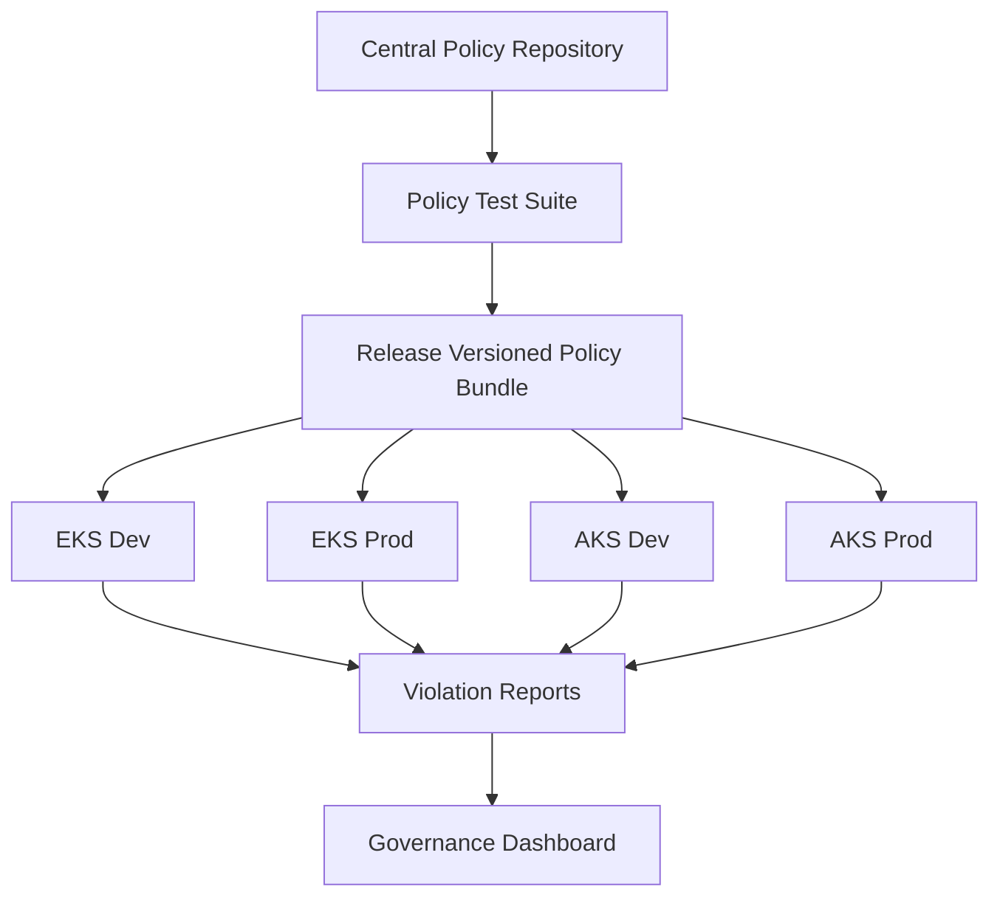

# Part 024 — Policy as Code with OPA, Kyverno, and Cloud Policy

Part 023 gave us the runtime security contract. This part gives us the enforcement operating model.

Kubernetes lets teams declare almost anything. That flexibility is the reason it scales across many workload types. It is also why unmanaged Kubernetes becomes a junk drawer of unsafe YAML.

Policy as code exists because production platforms need repeatable answers to questions like:

- Are workloads allowed to run privileged?
- Are images allowed from this registry?
- Are resource requests required?
- Are mutable image tags forbidden?
- Are ingress resources allowed to be public?
- Are namespaces required to have owners?
- Are cloud identities allowed only from approved service accounts?
- Are exceptions time-bounded?

The goal is not bureaucracy. The goal is a safe platform where teams move faster because the rules are encoded, automated, tested, and visible.

---

## 1. The mental model: policy is a control plane product

Policy is not a YAML dumping ground. Policy is part of the platform API.

A good policy system has these properties:

1. **Clear intent** — engineers know what the rule protects.
2. **Deterministic enforcement** — the same input gets the same result.
3. **Progressive rollout** — audit before warn, warn before block.
4. **Escape hatch** — exceptions exist but are reviewed, scoped, and expiring.
5. **Testability** — policy is tested before it reaches production clusters.
6. **Observability** — violations are visible as metrics/events/reports.
7. **Low operational fragility** — policy engine failure does not accidentally take down the platform.

The wrong model is:

> "Security team wrote a pile of policies and nobody understands why deployments fail."

The right model is:

> "The platform encodes minimum safe contracts; violations produce actionable feedback; exceptions are governed."

---

## 2. Where policy sits in the Kubernetes request path



Admission policy only sees API requests. It does not magically secure runtime by itself. But it decides which specs are allowed to become cluster state.

That makes admission policy high leverage and high risk.

---

## 3. Policy layers: use the smallest sufficient tool

Do not use one giant tool for everything. Use layered policy.

| Layer | Best for | Example |
|---|---|---|
| Pod Security Admission | standard Pod hardening baseline | restricted app namespaces |
| ValidatingAdmissionPolicy | native CEL validation without webhook | require labels, block unsafe fields |
| Kyverno | Kubernetes-native YAML policies, mutate/generate/validate/verify images | default security context, require requests |
| OPA Gatekeeper | expressive Rego constraints, mature audit model | complex cross-field policy |
| Azure Policy for AKS | Azure governance and compliance at scale | built-in AKS security initiatives |
| AWS org/IAM/SCP + in-cluster policy | cloud boundary plus Kubernetes guardrails | prevent unsafe AWS access, enforce cluster rules via Kyverno/Gatekeeper |
| CI policy scan | catch issues before cluster apply | validate Helm/Kustomize output |

Rule of thumb:

> Prefer native and simple controls for simple rules. Use richer engines only when the rule actually requires them.

---

## 4. Policy categories for a production platform

### 4.1 Identity and ownership policy

Examples:

- every namespace must have owner label
- every app workload must have `app.kubernetes.io/name`
- service accounts must not use default identity
- workload identity annotations only allowed in approved namespaces

### 4.2 Runtime hardening policy

Examples:

- no privileged containers in app namespaces
- no hostPath volumes except allowlisted paths
- `runAsNonRoot` required
- `allowPrivilegeEscalation: false` required
- seccomp `RuntimeDefault` required

### 4.3 Supply chain policy

Examples:

- images must come from approved registries
- mutable tags such as `latest` are forbidden
- image digest required for production
- image signature required
- SBOM/vulnerability gates required

Supply chain gets a full part later, so here we focus on policy shape.

### 4.4 Resource and reliability policy

Examples:

- CPU/memory requests required
- memory limit required for app containers
- readiness probe required for Services
- PodDisruptionBudget required for critical apps
- topology spread required for production services

### 4.5 Network and edge policy

Examples:

- namespace must have default-deny NetworkPolicy
- public Ingress must use approved ingress class
- TLS required for external hosts
- LoadBalancer Services disallowed except platform namespaces

### 4.6 Cost and tenancy policy

Examples:

- maximum CPU/memory request per namespace
- LimitRange required
- ResourceQuota required
- team cost-center label required
- Spot-toleration allowed only for fault-tolerant workloads

---

## 5. Native Kubernetes: ValidatingAdmissionPolicy

ValidatingAdmissionPolicy uses CEL expressions to validate Kubernetes API requests. It is in-process and avoids the operational dependency of a separate validating webhook for many simple rules.

Use it when:

- the rule is simple enough for CEL
- you want lower operational overhead
- you do not need mutation
- you do not need complex external data lookup

Example: require owner label on namespaces.

```yaml
apiVersion: admissionregistration.k8s.io/v1
kind: ValidatingAdmissionPolicy
metadata:
  name: require-namespace-owner
spec:
  failurePolicy: Fail
  matchConstraints:
    resourceRules:
      - apiGroups: [""]
        apiVersions: ["v1"]
        operations: ["CREATE", "UPDATE"]
        resources: ["namespaces"]
  validations:
    - expression: "has(object.metadata.labels['platform.example.com/owner'])"
      message: "Namespace must define platform.example.com/owner label."
---
apiVersion: admissionregistration.k8s.io/v1
kind: ValidatingAdmissionPolicyBinding
metadata:
  name: require-namespace-owner-binding
spec:
  policyName: require-namespace-owner
  validationActions:
    - Warn
    - Audit
```

Later, when validated:

```yaml
validationActions:
  - Deny
```

### 5.1 Why start with `Warn` and `Audit`

Policy rollout should be empirical.

If you start with `Deny`, you are guessing. If you start with `Audit`, you measure current reality first.

Recommended rollout:



---

## 6. Kyverno mental model

Kyverno is Kubernetes-native policy as code. Policies are Kubernetes resources written in YAML, and Kyverno can validate, mutate, generate, clean up, and verify images.

Kyverno is attractive when your platform team wants policies that look and feel like Kubernetes manifests rather than Rego programs.

Use Kyverno for:

- requiring labels
- blocking unsafe specs
- mutating defaults
- generating default resources
- verifying images/signatures
- policy reports
- GitOps-friendly policy lifecycle

### 6.1 Kyverno validation example: require resource requests

```yaml
apiVersion: kyverno.io/v1
kind: ClusterPolicy
metadata:
  name: require-resource-requests
spec:
  validationFailureAction: Audit
  background: true
  rules:
    - name: require-cpu-memory-requests
      match:
        any:
          - resources:
              kinds:
                - Pod
      validate:
        message: "All containers must define CPU and memory requests."
        foreach:
          - list: "request.object.spec.containers"
            deny:
              conditions:
                any:
                  - key: "{{ element.resources.requests.cpu || '' }}"
                    operator: Equals
                    value: ""
                  - key: "{{ element.resources.requests.memory || '' }}"
                    operator: Equals
                    value: ""
```

Start with `Audit`. Promote to `Enforce` only after violations are understood.

### 6.2 Kyverno mutation example: default seccomp profile

Mutation can reduce friction, but use it carefully. Mutating too much can hide weak application ownership.

```yaml
apiVersion: kyverno.io/v1
kind: ClusterPolicy
metadata:
  name: default-seccomp-runtime
spec:
  rules:
    - name: add-runtime-default-seccomp
      match:
        any:
          - resources:
              kinds:
                - Pod
      mutate:
        patchStrategicMerge:
          spec:
            securityContext:
              +(seccompProfile):
                type: RuntimeDefault
```

The `+()` anchor means "add if missing".

### 6.3 Kyverno generate example: default deny NetworkPolicy

```yaml
apiVersion: kyverno.io/v1
kind: ClusterPolicy
metadata:
  name: generate-default-deny-network-policy
spec:
  rules:
    - name: default-deny
      match:
        any:
          - resources:
              kinds:
                - Namespace
              selector:
                matchLabels:
                  platform.example.com/network-policy: required
      generate:
        apiVersion: networking.k8s.io/v1
        kind: NetworkPolicy
        name: default-deny
        namespace: "{{request.object.metadata.name}}"
        synchronize: true
        data:
          spec:
            podSelector: {}
            policyTypes:
              - Ingress
              - Egress
```

Generation is powerful. It can also surprise teams. Use clear labels and documentation.

---

## 7. OPA Gatekeeper mental model

OPA Gatekeeper integrates Open Policy Agent with Kubernetes admission control. It uses Rego for policy logic, `ConstraintTemplate` for reusable policy definitions, and `Constraint` resources for concrete enforcement.

Use Gatekeeper when:

- policies need expressive logic
- you already use OPA/Rego elsewhere
- you need mature constraint/audit workflow
- you want reusable parameterized constraints

### 7.1 Gatekeeper example: require labels

ConstraintTemplate:

```yaml
apiVersion: templates.gatekeeper.sh/v1
kind: ConstraintTemplate
metadata:
  name: k8srequiredlabels
spec:
  crd:
    spec:
      names:
        kind: K8sRequiredLabels
      validation:
        openAPIV3Schema:
          type: object
          properties:
            labels:
              type: array
              items:
                type: string
  targets:
    - target: admission.k8s.gatekeeper.sh
      rego: |
        package k8srequiredlabels

        violation[{"msg": msg}] {
          required := input.parameters.labels[_]
          not input.review.object.metadata.labels[required]
          msg := sprintf("Missing required label: %v", [required])
        }
```

Constraint:

```yaml
apiVersion: constraints.gatekeeper.sh/v1beta1
kind: K8sRequiredLabels
metadata:
  name: namespace-must-have-owner
spec:
  match:
    kinds:
      - apiGroups: [""]
        kinds: ["Namespace"]
  parameters:
    labels:
      - platform.example.com/owner
      - platform.example.com/cost-center
```

Gatekeeper separates policy logic from policy instances. That is useful at platform scale.

---

## 8. Kyverno vs Gatekeeper vs ValidatingAdmissionPolicy

| Question | ValidatingAdmissionPolicy | Kyverno | Gatekeeper |
|---|---:|---:|---:|
| Native Kubernetes API | High | Medium | Medium |
| No extra webhook engine | Yes | No | No |
| Supports mutation | No | Yes | No, typically validation-focused |
| Supports generate | No | Yes | No |
| Policy language | CEL | YAML/CEL-like expressions | Rego |
| Best for simple validation | Excellent | Good | Good |
| Best for complex logic | Medium | Medium | Excellent |
| Best for Kubernetes-native teams | Good | Excellent | Medium |
| Best if company already uses OPA | Medium | Medium | Excellent |
| Operational dependency | Low | Medium | Medium |

A mature platform may use more than one, but avoid policy-engine sprawl.

Bad:

```text
PSA + CEL + Kyverno + Gatekeeper + custom webhooks + cloud policies all enforcing overlapping rules with different messages.
```

Better:

```text
PSA for Pod baseline
CEL for simple native checks
Kyverno or Gatekeeper as the main custom policy engine
Cloud policy for cloud governance/compliance
CI scanning before GitOps apply
```

---

## 9. Cloud policy on AKS

AKS commonly integrates with Azure Policy. Azure Policy can apply and enforce built-in security policies and initiatives against AKS clusters.

Use Azure Policy for:

- organizational compliance
- subscription/resource-group governance
- built-in AKS security controls
- reporting across many clusters
- management-plane visibility

Do not rely only on Azure Policy for application developer feedback. Developers still need fast CI feedback and understandable admission messages.

A practical AKS governance stack:



---

## 10. Cloud policy on EKS

EKS governance usually combines AWS-level controls and in-cluster policy.

AWS-level controls may include:

- IAM least privilege
- Service Control Policies
- permission boundaries
- AWS Config rules
- ECR scanning/signing workflows
- account/VPC/subnet/tag governance
- EKS access entries and IAM access control

In-cluster controls often include:

- Pod Security Admission
- ValidatingAdmissionPolicy
- Kyverno or Gatekeeper
- image policy controls
- NetworkPolicy enforcement
- admission guardrails for Services, Ingress, and cloud-controller annotations

A practical EKS governance stack:



The important distinction: AWS governance controls the cloud account boundary; Kubernetes policy controls the Kubernetes API boundary.

You need both.

---

## 11. Policy design principles

### 11.1 Policy must have a reason

Bad message:

```text
Denied by policy rule 473.
```

Good message:

```text
Deployment denied: production workloads must define CPU and memory requests so scheduler placement and capacity planning are deterministic.
```

A useful policy message teaches the platform contract.

### 11.2 Policy must be scoped

Avoid global rules that accidentally block system controllers.

Bad:

```text
All Pods in all namespaces must be restricted.
```

Better:

```text
App namespaces with platform.example.com/tier in [dev, staging, prod] must meet restricted baseline. Platform/system namespaces use separate exception policy.
```

### 11.3 Policy should be progressive

Use phases:

1. document
2. scan in CI
3. audit in cluster
4. warn
5. enforce in dev
6. enforce in staging
7. enforce in production

### 11.4 Policy must be testable

Every critical policy should have positive and negative fixtures:

```text
policies/
  require-resource-requests.yaml
  tests/
    good-deployment.yaml
    bad-missing-cpu-request.yaml
    bad-missing-memory-request.yaml
```

### 11.5 Exceptions must expire

Permanent exceptions are policy debt.

Require annotations like:

```yaml
metadata:
  annotations:
    policy.platform.example.com/exception-id: SEC-2026-0091
    policy.platform.example.com/exception-expiry: "2026-09-30"
    policy.platform.example.com/exception-owner: sre-platform
```

Then write policy to reject expired exceptions.

---

## 12. A production policy catalog

A strong platform does not start with 200 policies. It starts with a small catalog of high-value rules.

### Tier 1 — must-have baseline

| Policy | Reason |
|---|---|
| Namespace owner label required | accountability |
| Pod Security Admission restricted for app prod | runtime hardening |
| Privileged containers forbidden in app namespaces | node compromise prevention |
| hostPath forbidden in app namespaces | node filesystem protection |
| resource requests required | scheduler determinism |
| service account token disabled by default | API credential minimization |
| default NetworkPolicy required | traffic minimization |
| images from approved registries | supply chain boundary |
| `latest` tag forbidden | reproducibility |

### Tier 2 — production maturity

| Policy | Reason |
|---|---|
| readiness probe required for Services | safe traffic routing |
| PDB required for HA workloads | disruption safety |
| topology spread for critical services | AZ/node failure resilience |
| external Ingress must use TLS | edge security |
| LoadBalancer Service restricted | cloud cost/security control |
| cloud IAM annotations restricted | privilege control |
| Secret volume mounts audited | data exposure control |

### Tier 3 — advanced governance

| Policy | Reason |
|---|---|
| image signature verification | supply chain integrity |
| SBOM required | auditability |
| exception expiry enforcement | policy debt control |
| allowed node selectors/tolerations | tenancy/cost safety |
| public ingress approval workflow | exposure governance |
| namespace quota required | cost isolation |

---

## 13. Example: block `latest` image tags

This policy can be implemented in multiple tools.

### 13.1 Kyverno version

```yaml
apiVersion: kyverno.io/v1
kind: ClusterPolicy
metadata:
  name: disallow-latest-tag
spec:
  validationFailureAction: Audit
  background: true
  rules:
    - name: require-non-latest-image
      match:
        any:
          - resources:
              kinds:
                - Pod
      validate:
        message: "Images must not use the mutable 'latest' tag. Pin a version or digest."
        foreach:
          - list: "request.object.spec.containers"
            deny:
              conditions:
                any:
                  - key: "{{ contains(element.image, ':latest') }}"
                    operator: Equals
                    value: true
```

### 13.2 Gatekeeper policy idea

In Gatekeeper, write a reusable Rego template that checks all containers/initContainers/ephemeralContainers and rejects images ending in `:latest`.

Gatekeeper may be better if the organization already standardizes on Rego for cross-platform policy.

### 13.3 Practical caveat

`image: nginx` has no explicit tag but usually resolves like `latest` in many workflows. Good policy should handle both:

- no tag
- `:latest`
- digest absent in production, if digest pinning is required

---

## 14. Example: restrict public ingress

Cloud ingress can create public exposure. This deserves policy.

A simple policy rule:

> In production namespaces, public ingress is allowed only when the namespace has `platform.example.com/public-exposure: approved` and the Ingress/Gateway uses an approved class.

Pseudo-model:

```yaml
metadata:
  labels:
    platform.example.com/public-exposure: approved
```

Ingress:

```yaml
apiVersion: networking.k8s.io/v1
kind: Ingress
metadata:
  name: orders-public
  annotations:
    platform.example.com/exposure-ticket: SEC-2026-1120
spec:
  ingressClassName: public-alb
  tls:
    - hosts:
        - orders.example.com
      secretName: orders-tls
```

Policy should check:

- namespace approval label
- approved ingress class
- TLS exists
- exposure ticket exists
- host domain is allowed

This prevents accidental internet exposure through a single YAML change.

---

## 15. Example: restrict cloud identity annotations

### 15.1 EKS

Workloads using IRSA or EKS Pod Identity can gain AWS permissions. Policy should ensure:

- only approved namespaces can bind privileged roles
- service account names match expected workload identity
- annotations/associations are not arbitrary
- default service account cannot get cloud role

Example intent:

```text
Deny any ServiceAccount in app namespaces if it references an IAM role outside the approved path arn:aws:iam::<account>:role/eks/app/<namespace>/...
```

### 15.2 AKS

Workloads using Azure Workload Identity can gain Azure permissions. Policy should ensure:

- only approved service accounts use workload identity labels/annotations
- client IDs are allowlisted per namespace
- default service account is forbidden
- exception requires ticket and expiry

This is where policy-as-code and cloud IAM design must work together.

---

## 16. Mutating policy: useful but dangerous

Mutation can create a paved road.

Good mutation:

- add harmless defaults
- add labels/annotations needed by platform tooling
- set seccomp default if missing
- generate namespace baseline resources

Dangerous mutation:

- silently add resource requests that do not reflect workload reality
- inject cloud identity
- change image references
- alter security settings without owner awareness
- mutate public/private exposure

Rule:

> Mutate convenience metadata and safe defaults. Validate ownership-critical decisions.

If a value represents an application contract, make the app team declare it.

---

## 17. Webhook failure policy

Admission webhooks usually have `failurePolicy`.

| `failurePolicy` | Meaning | Risk |
|---|---|---|
| `Fail` | reject requests when webhook unavailable | platform outage can block deploys |
| `Ignore` | allow requests when webhook unavailable | unsafe objects may enter cluster |

For high-risk security policy, `Fail` is common. But then webhook reliability becomes production-critical.

You must operate policy engines like production control-plane dependencies:

- multiple replicas
- PodDisruptionBudget
- resource requests
- priority class if appropriate
- monitoring
- alerting
- safe upgrade process
- emergency disable runbook

A policy engine running as one tiny Pod with no PDB is not a control plane. It is a future incident.

---

## 18. Policy observability

Track:

- admission request latency
- webhook errors
- denied requests by policy
- audit violations by namespace/team
- policy report counts
- exception counts and expiry
- top violating workloads
- time from audit to enforcement

Useful views:

```text
Violations by team
Violations by policy
Violations by environment
Denied deploys over time
Expired exceptions
Webhook latency p95/p99
```

Policy without observability becomes folklore.

---

## 19. CI and GitOps integration

Admission policy catches issues at cluster boundary. CI should catch them earlier.

Recommended pipeline:



The cluster should not be the first place a developer learns that YAML violates policy.

CI policy scanning should use the same policy sources as admission when possible.

---

## 20. Exception workflow

A production exception workflow should be boring and explicit.



Exception data model:

```yaml
metadata:
  annotations:
    policy.platform.example.com/exception-id: SEC-2026-1201
    policy.platform.example.com/exception-owner: payments-platform
    policy.platform.example.com/exception-expiry: "2026-08-30"
    policy.platform.example.com/exception-scope: "Deployment/payments-tokenizer"
```

Policy should reject:

- missing expiry
- expired exception
- wildcard namespace exception
- exception without owner
- exception in production without approval reference

---

## 21. Multi-cluster policy architecture

At AWS/Azure scale, policy must be distributed but centrally governed.



Important design decisions:

- version policies
- promote policies like application code
- allow cluster-specific parameters
- keep exceptions close to app ownership
- centralize reporting
- avoid manual one-off cluster edits

---

## 22. Failure modes

### 22.1 Policy engine outage blocks deployments

Cause:

- webhook `failurePolicy: Fail`
- no replicas/PDB
- bad upgrade
- DNS/network problem

Prevention:

- treat policy engine as critical platform component
- monitor webhook health and latency
- test upgrades
- have emergency rollback/disable runbook

### 22.2 Policies overlap and conflict

Cause:

- PSA, Kyverno, Gatekeeper, and cloud policy enforce same rule differently

Impact:

- confusing error messages
- inconsistent behavior
- developer distrust

Prevention:

- policy ownership map
- one primary engine per rule category
- clear messages

### 22.3 Too much mutation hides application contract

Cause:

- policy engine auto-fixes everything

Impact:

- manifests in Git do not represent actual runtime
- teams do not understand resource/security contract

Prevention:

- mutate only safe defaults
- validate ownership-critical fields

### 22.4 Enforce before audit

Cause:

- team enables deny globally without measuring violations

Impact:

- deployment outage
- controllers failing silently
- emergency bypass culture

Prevention:

- audit → warn → enforce
- staged rollout by namespace/environment

### 22.5 Exceptions become permanent

Cause:

- no expiry enforcement
- no owner
- no review loop

Impact:

- production drifts into insecure reality

Prevention:

- exception expiry required
- dashboard expired exceptions
- reject expired exceptions automatically

### 22.6 Policy ignores generated resources

Cause:

- CI scans source YAML, but cluster receives Helm-rendered/Kustomize-rendered output

Prevention:

- scan rendered manifests
- test GitOps output
- compare admission violations with CI results

---

## 23. A practical implementation roadmap

### Phase 1 — Baseline visibility

- inventory namespaces
- label owners/cost centers
- enable Pod Security Admission audit/warn
- deploy one policy engine in audit mode
- build violation dashboard

### Phase 2 — High-value enforcement

- enforce restricted app namespaces
- block privileged app Pods
- block hostPath in app namespaces
- require resource requests
- forbid `latest`
- require namespace owner labels

### Phase 3 — Platform guardrails

- require NetworkPolicy baseline
- restrict LoadBalancer/Ingress classes
- enforce service account conventions
- restrict workload identity annotations
- require PDB/topology for critical apps

### Phase 4 — Supply chain and compliance

- verify image signatures
- require approved registries
- enforce SBOM/vulnerability gates
- integrate cloud policy reporting
- centralize multi-cluster reports

### Phase 5 — Mature operating model

- policy release process
- exception lifecycle automation
- policy SLOs
- emergency runbooks
- quarterly policy review

---

## 24. Production checklist

A production policy platform should satisfy:

- [ ] Pod Security Admission enabled and labeled by namespace class.
- [ ] Policy engine selected intentionally, not accidentally.
- [ ] Policies stored in Git.
- [ ] Policies tested with positive and negative fixtures.
- [ ] CI scans rendered manifests.
- [ ] Enforcement rollout uses audit/warn before deny.
- [ ] Error messages explain the violated contract.
- [ ] Exceptions require owner, scope, reason, and expiry.
- [ ] Expired exceptions are rejected or alerted.
- [ ] Policy engine has replicas, PDB, requests, monitoring, and alerts.
- [ ] Webhook latency and failure rates are monitored.
- [ ] Cloud policy and in-cluster policy responsibilities are separated.
- [ ] Platform/system namespaces have explicit exception model.
- [ ] App namespaces are restricted by default.
- [ ] Reports are aggregated across EKS and AKS clusters.

---

## 25. Practice lab

### Lab 1 — Build a minimal policy catalog

Create policies for:

1. namespace owner label required
2. resource requests required
3. `latest` image tag forbidden
4. privileged containers forbidden in app namespaces
5. LoadBalancer Service forbidden outside platform namespaces

For each policy, define:

- intent
- scope
- audit mode
- enforce mode
- exception format
- test fixtures

### Lab 2 — Compare CEL, Kyverno, and Gatekeeper

Implement "namespace must have owner label" using:

1. ValidatingAdmissionPolicy
2. Kyverno
3. Gatekeeper

Compare:

- readability
- operational dependency
- testability
- error message quality
- fit for platform team skills

### Lab 3 — Design exception lifecycle

Create an exception schema with:

- ID
- owner
- reason
- expiry
- resource scope
- approver
- compensating control

Then write a policy rule idea that rejects expired exceptions.

### Lab 4 — Simulate webhook outage

In a non-production cluster:

1. deploy policy engine
2. create a policy with enforcement
3. scale policy engine down
4. observe behavior with `failurePolicy: Fail`
5. document emergency recovery steps

Do not perform this in production.

---

## 26. Key takeaways

1. Policy as code is a platform control plane product, not a pile of YAML.
2. Use the smallest sufficient enforcement layer.
3. Pod Security Admission gives baseline Pod hardening.
4. ValidatingAdmissionPolicy is strong for native simple validation.
5. Kyverno is strong for Kubernetes-native validate/mutate/generate workflows.
6. Gatekeeper is strong for expressive Rego-based constraints.
7. Azure Policy helps AKS governance at organizational scale.
8. EKS governance combines AWS account/IAM controls with in-cluster policy engines.
9. Always roll out policy progressively: audit, warn, enforce.
10. Exceptions must be scoped, owned, visible, and expiring.

---

## References

- Kubernetes Documentation — Admission Controllers: https://kubernetes.io/docs/reference/access-authn-authz/admission-controllers/
- Kubernetes Documentation — Validating Admission Policy: https://kubernetes.io/docs/reference/access-authn-authz/validating-admission-policy/
- Kubernetes Documentation — Pod Security Admission: https://kubernetes.io/docs/concepts/security/pod-security-admission/
- Kubernetes Documentation — Pod Security Standards: https://kubernetes.io/docs/concepts/security/pod-security-standards/
- Open Policy Agent Documentation — Kubernetes Admission Control: https://www.openpolicyagent.org/docs/kubernetes
- Gatekeeper Documentation: https://open-policy-agent.github.io/gatekeeper/website/docs/
- Kyverno Documentation — Introduction: https://kyverno.io/docs/introduction/
- Microsoft Learn — Azure Policy for AKS: https://learn.microsoft.com/en-us/azure/aks/use-azure-policy
- AWS EKS Best Practices Guide: https://docs.aws.amazon.com/eks/latest/best-practices/introduction.html
