# Part 025 — Supply Chain Security

Kubernetes does not run source code.

It runs **artifacts**.

That small distinction is where many production security programs fail. Teams secure the cluster, lock down RBAC, harden Pods, and write NetworkPolicies, but still allow any CI job to push a mutable image tag that the cluster later pulls with broad registry access.

In production Kubernetes, supply chain security is the discipline of answering one question with evidence:

> Is this exact artifact allowed to run here, now, with this identity, in this namespace, under this risk profile?

Not: “was this image name familiar?”

Not: “did the pipeline pass once?”

Not: “is this repository owned by our team?”

The unit of trust is the **digest**, not the tag.

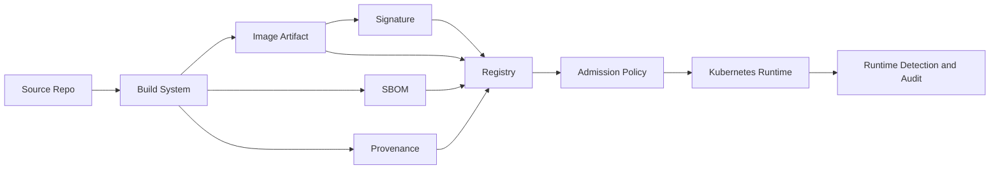

A top-tier Kubernetes engineer does not treat supply chain security as a scanner bolted onto CI. They model it as a chain of custody from source to runtime.

---

## 1. The Production Problem

A Kubernetes cluster is an automation system. If you give it a Deployment that references an image, the kubelet will try to pull and run that image according to the image policy, registry credentials, node runtime, and Pod spec.

That means the cluster is downstream of several decisions:

1. Who can change source code?
2. Who can change the build workflow?
3. Which base image is used?
4. Which dependencies are included?
5. Which secrets are available during build?
6. Which registry accepts the artifact?
7. Can a tag be overwritten?
8. Is the artifact signed?
9. Is the SBOM available?
10. Was the artifact built by a trusted builder?
11. Can an attacker bypass CI and push directly?
12. Can a compromised namespace run arbitrary images?
13. Can a rollback reintroduce a vulnerable digest?

Kubernetes itself cannot infer all of this from `image: my-service:prod`.

You must design the platform so the cluster can verify enough facts before accepting the workload.

---

## 2. Mental Model: Supply Chain as a State Machine

Think of an artifact as moving through states.

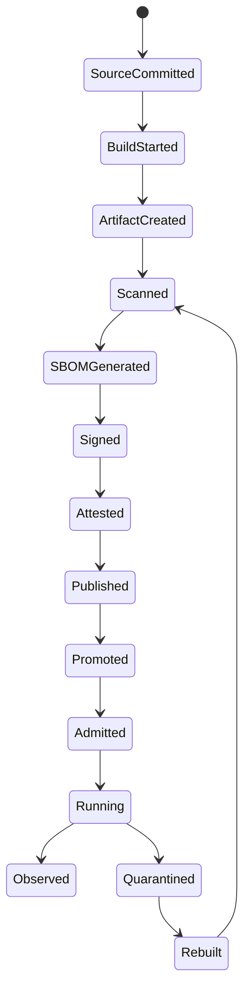

Each transition needs an invariant.

| Transition | Required invariant |
|---|---|
| Source committed | Branch protection and review rules applied |
| Build started | Trusted CI identity, pinned workflow, isolated runner |
| Artifact created | Build uses pinned base images and no leaked secrets |
| Scanned | Vulnerability policy evaluated against severity, exploitability, and environment |
| SBOM generated | SBOM attached to immutable artifact identity |
| Signed | Signature binds artifact digest to trusted identity |
| Attested | Provenance states builder, source, workflow, and parameters |
| Published | Registry enforces immutability and access control |
| Promoted | Same digest moves across environments; no rebuild per environment |
| Admitted | Cluster verifies registry, digest, signature, namespace, and policy |
| Running | Runtime telemetry confirms expected image and behavior |

If a transition has no invariant, it is a trust gap.

---

## 3. Anti-Pattern: “We Scan Images, Therefore We Are Secure”

Image scanning is useful, but it is not supply chain security.

A scanner answers a narrow question:

> Does this artifact contain known vulnerable packages or risky configuration according to the scanner database at scan time?

It does not answer:

- Who built this artifact?
- Was the build workflow tampered with?
- Was the tag overwritten after scanning?
- Was this artifact approved for this namespace?
- Was the artifact signed?
- Was the artifact built from reviewed source?
- Did a deployment bypass the release process?
- Is the running digest the same digest that was scanned?

Scanning is one control in a larger system.

The stronger model is:

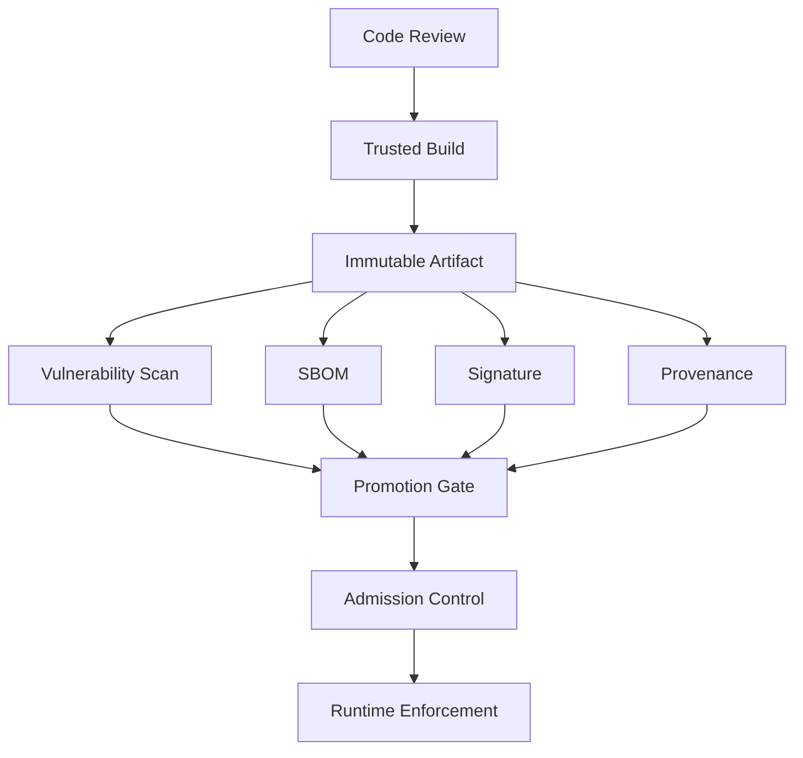

---

## 4. Core Invariants for Production Kubernetes

These are the invariants you want every production platform to enforce.

### 4.1 Deploy by digest, not mutable tag

Bad:

```yaml
image: registry.example.com/payments/api:prod
```

Better:

```yaml
image: registry.example.com/payments/api@sha256:2a5d...
```

Tags are human labels. Digests are content identity.

You can still use tags in CI metadata, release notes, and dashboards. But the deployment manifest should resolve to an immutable digest before it reaches production.

### 4.2 Tags must be immutable in production registries

If your registry allows `prod`, `latest`, or `v1.2.3` to be overwritten, then an old deployment manifest can run a different artifact later.

That breaks auditability and rollback correctness.

In production:

- use immutable tags where supported;
- block direct developer push to release repositories;
- separate build repositories from promotion repositories if needed;
- restrict deletion of release artifacts;
- enable registry audit logs;
- replicate critical images across regions when regional recovery matters.

### 4.3 Build once, promote the same digest

A common mistake is rebuilding the same source for dev, staging, and prod.

That creates three artifacts.

Even if the source commit is the same, the output may differ because of:

- base image drift;
- dependency repository changes;
- timestamp or environment differences;
- build tool changes;
- runner image changes;
- network side effects.

The production pattern is:

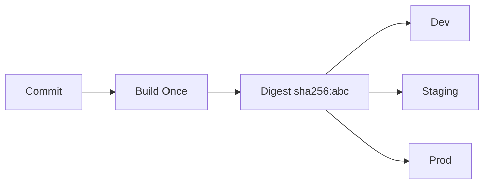

Promotion changes **environment configuration**, not artifact content.

### 4.4 Admission must enforce what CI claims

CI can produce signatures, SBOMs, and provenance. But if the cluster does not check them, an attacker can bypass the intended path by submitting a different image.

Admission policy is where the platform turns build-time evidence into runtime authorization.

### 4.5 Exceptions must expire

Security exceptions are sometimes necessary.

But exceptions without expiry become the real policy.

A production exception needs:

- owner;
- reason;
- affected digest or package;
- namespace/workload scope;
- expiration date;
- compensating control;
- approval reference;
- automated reminder or enforcement.

---

## 5. Threat Model

A practical Kubernetes supply chain threat model should include these attack paths.

| Attack path | Example | Control |
|---|---|---|
| Source tampering | Malicious code merged through weak review | branch protection, CODEOWNERS, signed commits where useful |
| Workflow tampering | CI config changed to skip scan/sign | protected workflow files, review approval, CI policy |
| Runner compromise | Build secret stolen from shared runner | ephemeral runners, least privilege, no long-lived credentials |
| Base image drift | `ubuntu:latest` changes silently | digest-pinned base images, scheduled rebuilds |
| Dependency confusion | Internal package name resolved from public registry | private package registry, namespace reservation, lockfiles |
| Secret leakage | Build args written into image layer | secret mount, build scanning, no secrets in Dockerfile |
| Registry bypass | Developer pushes image directly | registry IAM restrictions, CI-only push role |
| Tag overwrite | Existing deployment pulls new content | immutable tags, deploy by digest |
| Unsigned image | Unknown artifact runs in prod | admission signature verification |
| Stale vulnerable image | Old digest remains deployable | vulnerability re-scan and runtime inventory |
| Admission bypass | Namespace exempted broadly | narrow exceptions, audit, expiry |
| Rollback abuse | Rollback to compromised image | rollback policy checks digest risk state |

The point is not paranoia. The point is explicit control placement.

---

## 6. Artifact Anatomy

A production artifact is more than a container image.

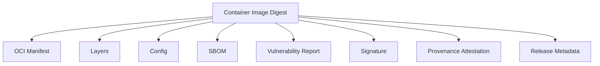

A good platform can answer:

- Which source commit produced this digest?
- Which builder produced it?
- Which dependencies are inside it?
- Which base image was used?
- Which vulnerabilities were known at promotion time?
- Which signature identity approved it?
- Which environments currently run it?
- Which namespace and ServiceAccount are allowed to run it?

---

## 7. Kubernetes Image Pull Semantics

Before designing policy, understand what kubelet does.

The Pod spec contains image references. For each container, Kubernetes supports `imagePullPolicy`:

```yaml
containers:
  - name: api
    image: registry.example.com/payments/api@sha256:...
    imagePullPolicy: IfNotPresent
```

Common values:

| Policy | Meaning | Production note |
|---|---|---|
| `Always` | kubelet checks registry each time before starting | useful for tag freshness, but digest still matters |
| `IfNotPresent` | use local image if already present | acceptable with digests; dangerous with mutable tags |
| `Never` | never pull, only use local image | rarely appropriate for managed clusters |

Important nuance: `Always` does not make mutable tags safe. It makes kubelet check the registry, but the tag may still point to different content over time.

The robust production control is digest pinning.

---

## 8. Baseline Production Manifest Pattern

```yaml
apiVersion: apps/v1
kind: Deployment
metadata:
  name: payments-api
  namespace: payments-prod
  labels:
    app.kubernetes.io/name: payments-api
    app.kubernetes.io/part-of: payments
    app.kubernetes.io/version: "1.18.3"
spec:
  replicas: 6
  selector:
    matchLabels:
      app.kubernetes.io/name: payments-api
  template:
    metadata:
      labels:
        app.kubernetes.io/name: payments-api
        app.kubernetes.io/part-of: payments
        artifact.company.io/digest: "sha256-2a5d..."
    spec:
      serviceAccountName: payments-api
      automountServiceAccountToken: false
      containers:
        - name: api
          image: registry.example.com/payments/api@sha256:2a5d...
          imagePullPolicy: IfNotPresent
          securityContext:
            runAsNonRoot: true
            allowPrivilegeEscalation: false
            readOnlyRootFilesystem: true
            capabilities:
              drop: ["ALL"]
          ports:
            - containerPort: 8080
          readinessProbe:
            httpGet:
              path: /ready
              port: 8080
          resources:
            requests:
              cpu: "500m"
              memory: "512Mi"
            limits:
              memory: "1Gi"
```

The manifest alone is not the full control. It is the deploy-time shape of a larger release process.

---

## 9. Build Pipeline Golden Path

A production-grade build pipeline should have clear phases.

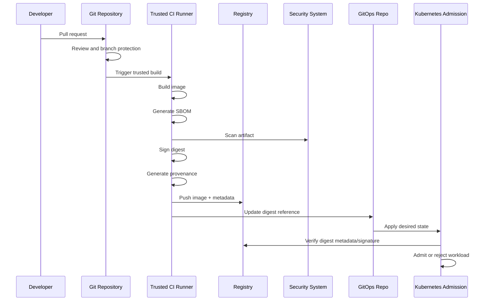

### 9.1 Build rules

Use these as a minimum standard:

- CI runner is ephemeral or strongly isolated.
- Build identity is separate from deploy identity.
- Registry push permission belongs to CI, not individual developers.
- Build secrets are injected through secure secret mounts, not Dockerfile args.
- Base images are pinned by digest.
- Dependencies use lockfiles or equivalent reproducible constraints.
- Output image is tagged and addressed by digest.
- SBOM is generated for the final image.
- Vulnerability scan is attached to the digest.
- Signature and provenance are attached to the digest.
- Promotion updates manifests to the digest.

### 9.2 Dockerfile hygiene

Weak:

```dockerfile
FROM node:latest
ARG NPM_TOKEN
RUN npm config set //registry.npmjs.org/:_authToken=$NPM_TOKEN
RUN npm install
COPY . .
CMD ["npm", "start"]
```

Better pattern:

```dockerfile
FROM node:22-bookworm@sha256:<builder-digest> AS build
WORKDIR /src
COPY package.json package-lock.json ./
RUN --mount=type=secret,id=npmrc,target=/root/.npmrc npm ci
COPY . .
RUN npm run build

FROM gcr.io/distroless/nodejs22-debian12@sha256:<runtime-digest>
WORKDIR /app
COPY --from=build /src/dist ./dist
USER 65532:65532
CMD ["dist/server.js"]
```

The exact base image is less important than the invariant: pin it, scan it, rebuild it deliberately, and understand its patching lifecycle.

---

## 10. SBOM: What It Is and What It Is Not

An SBOM is a bill of materials. It describes what is inside the artifact.

Useful SBOM formats include SPDX and CycloneDX.

An SBOM helps with:

- vulnerability impact analysis;
- license review;
- incident response;
- dependency inventory;
- rebuild prioritization;
- compliance evidence.

It does not automatically make an image safe.

A production SBOM program needs:

1. generation during trusted build;
2. attachment to artifact digest;
3. storage in registry or artifact metadata system;
4. query by package, version, digest, environment, and owner;
5. integration with vulnerability feeds;
6. exception workflow;
7. runtime inventory mapping.

The practical question during a zero-day is:

> Which running Pods include package X version Y, and who owns them?

If your SBOM cannot answer that, it is mostly paperwork.

---

## 11. Signing and Provenance

Image signing answers:

> Did a trusted identity sign this exact digest?

Provenance answers:

> How, where, from what source, and by which builder was this digest produced?

The two should be used together.

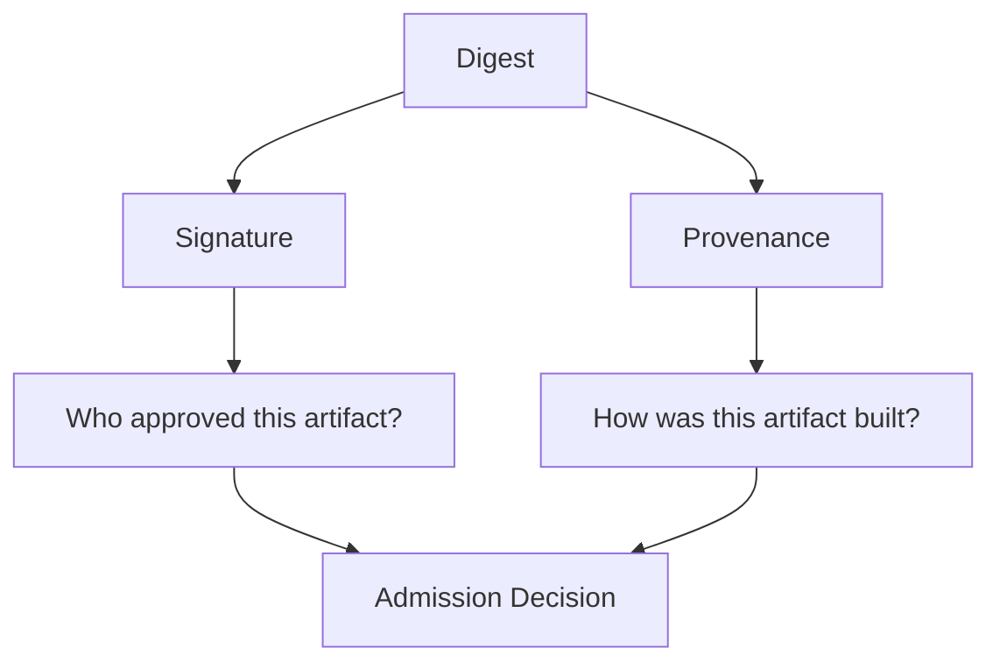

### 11.1 Sigstore and Cosign mental model

Sigstore is commonly used for signing and verifying software artifacts. Cosign is the tool often used for container image signatures and attestations.

A simplified keyless signing flow:

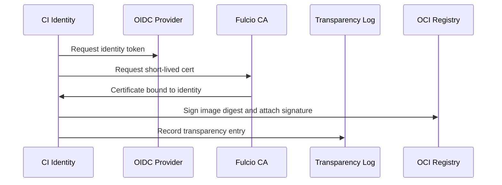

The operational win is that the signature identity can be tied to a workload identity such as a GitHub Actions workflow, GitLab job, or internal CI identity.

### 11.2 Do not reduce signing to “has any signature”

A weak admission rule says:

> image must be signed.

A stronger rule says:

> image digest must be signed by one of these trusted identities, from this repository, through this workflow, with matching provenance, and be allowed in this namespace.

---

## 12. SLSA as a Maturity Model

SLSA is useful because it forces you to reason about tampering resistance and provenance.

Use it as a maturity model, not as a slogan.

| Maturity concern | Low maturity | Higher maturity |
|---|---|---|
| Build execution | developer laptop | isolated trusted builder |
| Provenance | none | generated and distributed |
| Build definition | mutable and weakly reviewed | protected and reviewed |
| Artifact identity | tag | digest |
| Registry | broad push | CI-only push and immutable release repo |
| Admission | image name allowlist | digest/signature/provenance validation |
| Audit | manual | source-to-runtime traceability |

The key idea: the artifact should be hard to tamper with without leaving evidence.

---

## 13. Admission Controls for Supply Chain

Admission is the Kubernetes choke point.

A user submits a workload object. Before it is persisted, admission can validate or mutate it.

For supply chain, admission typically enforces:

- allowed registries;
- no `latest` tag;
- digest-required image references;
- signature verification;
- provenance requirements;
- SBOM presence;
- image vulnerability policy;
- namespace/environment-specific allowlists;
- exemption expiration;
- imagePullSecrets restrictions;
- disallow privileged build containers in production namespaces.

### 13.1 Simple digest-required policy with CEL

`ValidatingAdmissionPolicy` can enforce structural checks such as “images must use digest”.

```yaml
apiVersion: admissionregistration.k8s.io/v1
kind: ValidatingAdmissionPolicy
metadata:
  name: require-image-digest
spec:
  failurePolicy: Fail
  matchConstraints:
    resourceRules:
      - apiGroups: [""]
        apiVersions: ["v1"]
        operations: ["CREATE", "UPDATE"]
        resources: ["pods"]
  validations:
    - expression: >-
        object.spec.containers.all(c, c.image.contains('@sha256:'))
      message: "all container images must be pinned by sha256 digest"
```

This is not signature verification. It is a useful baseline guardrail.

### 13.2 Kyverno image verification example

Kyverno can verify image signatures and mutate/validate resources.

Example shape:

```yaml
apiVersion: kyverno.io/v1
kind: ClusterPolicy
metadata:
  name: verify-payments-images
spec:
  validationFailureAction: Enforce
  background: true
  rules:
    - name: verify-signature
      match:
        any:
          - resources:
              kinds:
                - Pod
              namespaces:
                - payments-prod
      verifyImages:
        - imageReferences:
            - "registry.example.com/payments/*"
          attestors:
            - entries:
                - keyless:
                    subject: "https://github.com/company/payments/.github/workflows/release.yml@refs/heads/main"
                    issuer: "https://token.actions.githubusercontent.com"
```

The exact syntax depends on Kyverno version and signing setup. Treat this as a design pattern, not a copy-paste final policy.

### 13.3 Gatekeeper pattern

OPA Gatekeeper is strong for policy consistency and audit. A common approach is:

- Gatekeeper for structural and organizational policy;
- Kyverno or Sigstore Policy Controller for image signature verification;
- cloud-native policy for subscription/account-level governance;
- CI policy for pre-admission feedback.

Do not put every rule into one engine just because one engine can express it.

---

## 14. AWS EKS Supply Chain Design

A production AWS design usually includes these components.

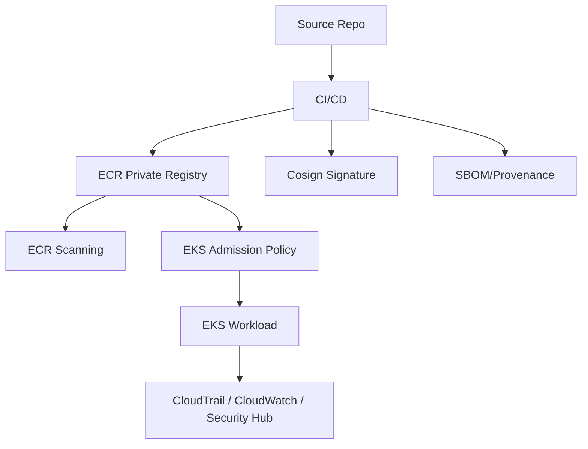

### 14.1 ECR registry controls

Use ECR private repositories for internal images.

Recommended controls:

- image tag immutability for release repositories;
- enhanced scanning where appropriate;
- lifecycle policy for non-release artifacts;
- replication for disaster recovery or multi-region clusters;
- repository policy with CI-only push;
- runtime pull permissions separated from push permissions;
- CloudTrail auditing for push/delete/policy changes;
- KMS encryption where required by compliance;
- private networking via VPC endpoints where needed.

### 14.2 EKS image pull identity

On EC2-backed EKS, nodes typically need permission to pull images from ECR. With workload identity, application Pods should not inherit broad image-push permissions.

Separate these identities:

| Identity | Should do | Should not do |
|---|---|---|
| CI build role | push signed image, attach metadata | run production workloads |
| Node/pull role | pull approved images | push images or mutate registry |
| Application role | access app-specific AWS APIs | mutate registry or cluster policy |
| Admission controller role | verify metadata if needed | broad administrator actions |

### 14.3 EKS policy placement

Use layers:

1. IAM and ECR repository policy prevent unauthorized push.
2. CI signs and attaches metadata.
3. GitOps references digest.
4. Admission enforces registry/digest/signature/provenance rules.
5. Runtime inventory monitors drift.

---

## 15. Azure AKS Supply Chain Design

A production Azure design usually includes these components.

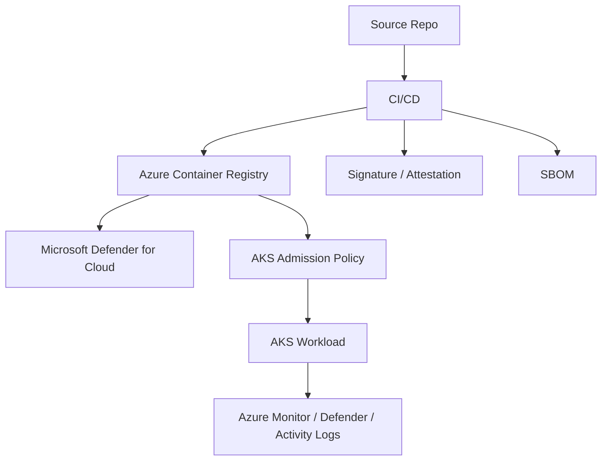

### 15.1 ACR controls

Recommended controls:

- private ACR for internal artifacts;
- ACR access restricted through managed identities or service principals with least privilege;
- admin user disabled;
- private endpoint for restricted networking where required;
- Defender for Cloud vulnerability assessment;
- retention/lifecycle policy;
- repository-scoped permissions where applicable;
- geo-replication for critical multi-region recovery;
- diagnostic logs enabled.

### 15.2 AKS pull identity

AKS can attach ACR access to the cluster or use managed identity patterns. Keep push and pull identities separate.

| Identity | Should do |
|---|---|
| CI identity | push image and metadata to ACR |
| AKS kubelet identity | pull images |
| Workload identity | access application Azure resources |
| Policy identity | evaluate or audit governance state |

Do not let application managed identities push images unless the application is explicitly a build system.

### 15.3 Azure Policy and admission

Azure Policy can help apply governance to AKS clusters. For image signature/provenance use cases, you may still need Kubernetes-native admission controllers depending on the exact validation requirement.

The platform boundary should be explicit:

- Azure Policy: organization/cloud governance and supported AKS policies;
- Gatekeeper/Kyverno: cluster-level Kubernetes policy;
- CI policy: fast developer feedback;
- Defender: vulnerability and runtime posture visibility.

---

## 16. Vulnerability Management That Actually Works

A scanner will produce noise.

A mature program converts findings into risk decisions.

### 16.1 Severity is not enough

A `CRITICAL` CVE in an unused package in a non-exposed batch image may be less urgent than a `HIGH` vulnerability in an internet-facing authentication service.

Use context:

- package reachability;
- exploit availability;
- workload exposure;
- privilege level;
- data sensitivity;
- environment;
- compensating controls;
- runtime usage;
- business criticality.

### 16.2 Do not only scan on push

Vulnerabilities are discovered after artifacts are built.

You need:

- scan on build;
- scan on push;
- periodic re-scan;
- re-scan when vulnerability database changes;
- runtime inventory correlation;
- alert routing to owning team;
- rebuild workflow.

### 16.3 Rebuild strategy

For base image CVEs, teams often patch app code unnecessarily. The real workflow is:

1. identify affected base image digest;
2. find all app images built from it;
3. rebuild with patched base;
4. re-scan;
5. re-sign;
6. promote same artifact through environments;
7. verify runtime rollout.

---

## 17. Promotion and Environment Design

A secure promotion model avoids both uncontrolled rebuilds and uncontrolled deployments.

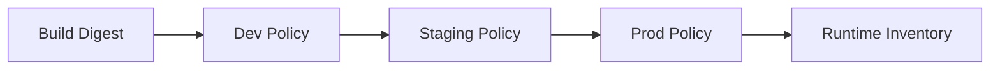

Different environments can have different gates.

| Environment | Typical gate |
|---|---|
| Dev | allowed internal registry, basic scan, optional signature |
| Staging | digest, scan pass, SBOM, signature |
| Prod | digest, scan pass or approved exception, SBOM, trusted signature, provenance, change approval |

Do not make dev as strict as prod on day one if it kills developer flow. But do make the production path non-bypassable.

---

## 18. Runtime Inventory

Admission tells you what was accepted.

Runtime inventory tells you what is actually running.

You need queries like:

```bash
kubectl get pods -A -o jsonpath='{range .items[*]}{.metadata.namespace}{"\t"}{.metadata.name}{"\t"}{range .spec.containers[*]}{.image}{" "}{end}{"\n"}{end}'
```

But a production platform should not rely on ad-hoc commands. It should export running image digests into an inventory system.

Minimum fields:

- cluster;
- namespace;
- workload owner;
- workload kind/name;
- Pod name;
- container name;
- image repository;
- image digest;
- signature status;
- SBOM link;
- vulnerability state;
- deployment time;
- environment;
- exception reference.

During an incident, this inventory is more valuable than another dashboard.

---

## 19. Failure Modes

### 19.1 Tag drift

Symptom: production behaves differently after Pod restart with no manifest change.

Cause: mutable tag points to new digest.

Prevention:

- deploy by digest;
- immutable tags;
- admission policy rejecting tag-only references.

### 19.2 Scanner gate blocks emergency fix

Symptom: urgent security patch cannot deploy because unrelated CVE blocks the image.

Cause: severity-only policy with no exception path.

Prevention:

- explicit exception workflow;
- scoped expiry;
- risk context;
- emergency break-glass with audit.

### 19.3 Signature exists but identity is wrong

Symptom: unsigned bypass fixed, but any developer can sign images locally.

Cause: policy checks signature existence, not trusted signer identity.

Prevention:

- keyless identity constraints;
- trusted issuer/subject policy;
- provenance verification.

### 19.4 Admission outage blocks all deploys

Symptom: admission webhook unavailable; API requests fail.

Cause: `failurePolicy: Fail` with fragile webhook operations.

Prevention:

- HA admission controller;
- resource requests and PDB;
- tested upgrade path;
- scoped matching rules;
- intentional failure policy by criticality.

### 19.5 Stale exception becomes permanent

Symptom: vulnerable image keeps passing for months.

Cause: exception without expiration or owner.

Prevention:

- exception CRD or registry;
- expiry enforcement;
- dashboard by owner;
- periodic review.

### 19.6 Registry regional outage blocks node replacement

Symptom: running Pods survive, but replacement Pods cannot pull images.

Cause: single-region registry dependency.

Prevention:

- registry replication;
- local caching strategy;
- DR runbook;
- critical image pre-pull for specific workloads where justified.

---

## 20. Debugging Cookbook

### 20.1 Find images running without digest

```bash
kubectl get pods -A -o json \
  | jq -r '.items[] | .metadata.namespace as $ns | .metadata.name as $pod | .spec.containers[] | select(.image | contains("@sha256:") | not) | "\($ns)\t\($pod)\t\(.name)\t\(.image)"'
```

### 20.2 Inspect image ID actually running

```bash
kubectl get pod payments-api-abc123 -n payments-prod \
  -o jsonpath='{range .status.containerStatuses[*]}{.name}{"\t"}{.imageID}{"\n"}{end}'
```

The `spec.containers[].image` is what you requested.

The `status.containerStatuses[].imageID` is what the runtime actually pulled.

### 20.3 Debug image pull failure

```bash
kubectl describe pod payments-api-abc123 -n payments-prod
```

Look for events:

- `ErrImagePull`;
- `ImagePullBackOff`;
- registry authentication error;
- DNS error;
- timeout;
- denied by policy;
- not found;
- manifest unknown;
- architecture mismatch.

### 20.4 Check admission rejection

```bash
kubectl apply -f deployment.yaml --server-side
```

Read the exact rejection message. A good policy tells the user what to fix:

Bad message:

```text
policy failed
```

Good message:

```text
container image registry.example.com/payments/api:prod is rejected: production namespaces require sha256 digest and trusted signature from release workflow
```

---

## 21. Production Policy Catalog

A realistic first policy catalog:

| Policy | Dev | Staging | Prod |
|---|---:|---:|---:|
| Allowed registries | enforce | enforce | enforce |
| Disallow `latest` | warn | enforce | enforce |
| Require digest | warn | enforce | enforce |
| Require signature | audit | enforce | enforce |
| Trusted signer identity | audit | enforce | enforce |
| SBOM required | audit | enforce | enforce |
| Critical CVE block | warn | enforce with exception | enforce with exception |
| High CVE block | audit | warn | enforce for internet-facing |
| No privileged containers | enforce | enforce | enforce |
| No broad imagePullSecrets | warn | enforce | enforce |
| Exception expiry | enforce | enforce | enforce |

Start small, enforce progressively, and measure friction.

---

## 22. Platform API for Supply Chain

The platform should not ask every team to invent this process.

Expose a paved road.

Example developer-facing contract:

```yaml
apiVersion: platform.company.io/v1
kind: ReleaseArtifact
metadata:
  name: payments-api-1-18-3
spec:
  service: payments-api
  source:
    repository: github.com/company/payments
    commit: abc123
  image:
    repository: registry.example.com/payments/api
    digest: sha256:2a5d...
  evidence:
    sbom: oci://registry.example.com/payments/api@sha256:...
    provenance: oci://registry.example.com/payments/api@sha256:...
    signature: cosign
  risk:
    vulnerabilityPolicy: prod-standard
    exceptions: []
```

The implementation can use CI, registry, GitOps, and admission tools underneath. The developer sees one release artifact contract.

---

## 23. Top 1% Review Questions

Ask these in design review:

1. Can production run an image that was never built by trusted CI?
2. Can a developer overwrite a production tag?
3. Can the same manifest run a different artifact tomorrow?
4. Can we map running Pods to source commits?
5. Can we find every running workload affected by a new CVE in one hour?
6. Can admission verify signer identity, not just signature presence?
7. Can emergency deployment happen without permanently weakening policy?
8. Are exceptions scoped and expiring?
9. Can a compromised namespace pull from arbitrary public registries?
10. Can CI push to prod registry without review?
11. Can build secrets leak into final image layers?
12. Can we recover if the primary registry region is unavailable?
13. Is rollback subject to the same security gate as forward deployment?
14. Are base images owned and patched deliberately?
15. Are admission controllers themselves highly available and observable?

---

## 24. Hands-On Lab

Build a minimal supply chain path for one service.

### Step 1 — Build image

Create a simple service and container image.

### Step 2 — Push to private registry

Use ECR or ACR.

### Step 3 — Resolve digest

```bash
# Example shape; exact command depends on registry tooling.
docker build -t registry.example.com/demo/api:1.0.0 .
docker push registry.example.com/demo/api:1.0.0
docker inspect --format='{{index .RepoDigests 0}}' registry.example.com/demo/api:1.0.0
```

### Step 4 — Generate SBOM

Use your preferred tool such as Syft, Trivy, or build-system-native SBOM generation.

### Step 5 — Sign image

Use Cosign or equivalent.

### Step 6 — Deploy by digest

Update Deployment manifest to use `@sha256`.

### Step 7 — Enforce digest admission

Start with a simple policy rejecting tag-only images.

### Step 8 — Add signature verification

Use Kyverno, Sigstore Policy Controller, or your platform’s selected admission mechanism.

### Step 9 — Break it intentionally

Try to deploy:

- an unsigned image;
- a tag-only image;
- an image from public Docker Hub;
- an image signed by the wrong identity;
- a digest with an expired exception.

A control you have not tested is a belief, not a control.

---

## 25. Production Checklist

### Registry

- [ ] Production repository enforces tag immutability.
- [ ] Direct developer push is blocked.
- [ ] CI push role is least privilege.
- [ ] Runtime pull role cannot push.
- [ ] Delete permissions are restricted.
- [ ] Audit logs are enabled.
- [ ] Replication/DR is defined for critical images.

### Build

- [ ] Build runner is isolated.
- [ ] Build workflow is protected by review.
- [ ] Base images are pinned.
- [ ] Dependencies are locked.
- [ ] Secrets are not written into layers.
- [ ] SBOM is generated.
- [ ] Vulnerability scan is performed.
- [ ] Artifact is signed.
- [ ] Provenance is generated.

### Deployment

- [ ] Manifests deploy by digest.
- [ ] GitOps updates digest explicitly.
- [ ] Admission rejects untrusted registries.
- [ ] Admission rejects tag-only images in production.
- [ ] Admission verifies trusted signatures.
- [ ] Admission supports scoped exceptions.
- [ ] Exceptions expire.

### Runtime

- [ ] Running image inventory is exported.
- [ ] Vulnerability findings map to runtime owners.
- [ ] Rollbacks pass policy.
- [ ] Admission controller is highly available.
- [ ] Policy decision logs are retained.

---

## 26. Summary

Supply chain security in Kubernetes is not one tool.

It is a set of linked invariants:

- source is reviewed;
- build is trusted;
- artifact is immutable;
- digest is the identity;
- SBOM describes contents;
- scan informs risk;
- signature proves trusted approval;
- provenance explains how it was built;
- registry preserves custody;
- admission enforces policy;
- runtime inventory closes the loop.

The production standard is not “we scan images”.

The production standard is:

> No artifact reaches production unless the platform can verify its identity, origin, risk state, and authorization to run in that environment.

---

## References

- Kubernetes Documentation — Images: https://kubernetes.io/docs/concepts/containers/images/
- Kubernetes Documentation — Pull an Image from a Private Registry: https://kubernetes.io/docs/tasks/configure-pod-container/pull-image-private-registry/
- Kubernetes Documentation — Validating Admission Policy: https://kubernetes.io/docs/reference/access-authn-authz/validating-admission-policy/
- Sigstore: https://www.sigstore.dev/
- SLSA: https://slsa.dev/
- AWS ECR image scanning: https://docs.aws.amazon.com/AmazonECR/latest/userguide/image-scanning.html
- AWS EKS Best Practices: https://docs.aws.amazon.com/eks/latest/best-practices/security.html
- Azure Container Registry security: https://learn.microsoft.com/en-us/azure/container-registry/container-registry-best-practices
- Microsoft Defender for container registries: https://learn.microsoft.com/en-us/azure/defender-for-cloud/defender-for-container-registries-introduction
