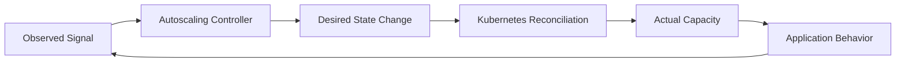
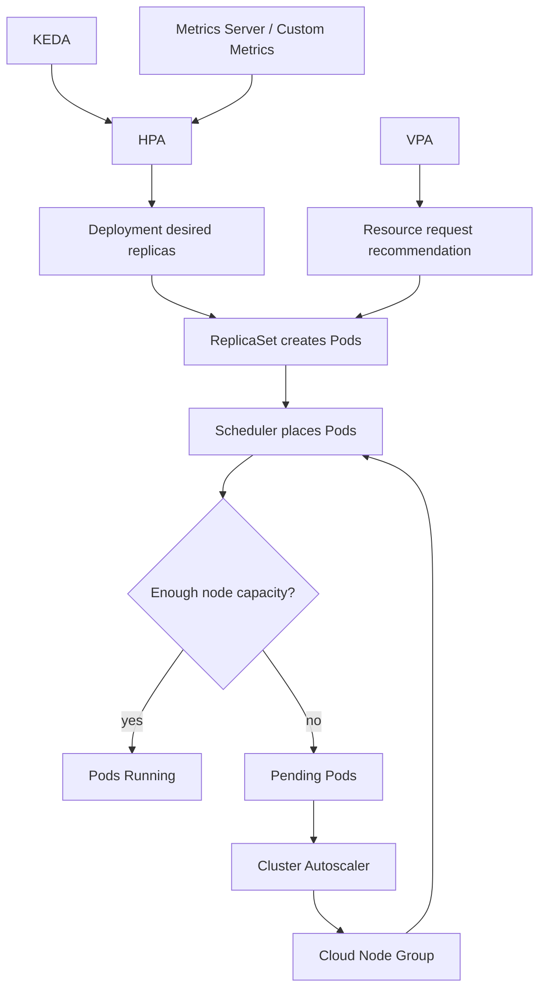
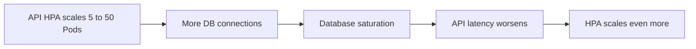
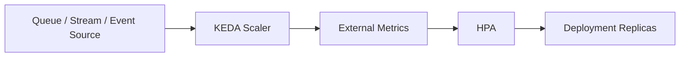
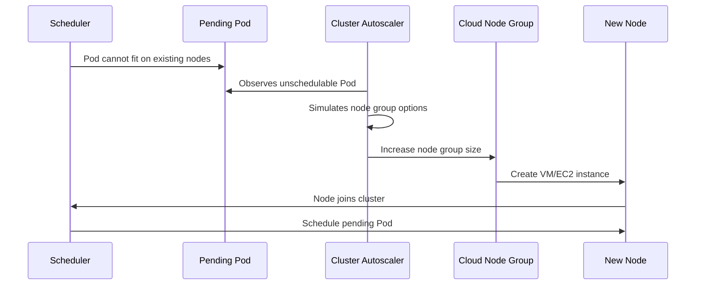
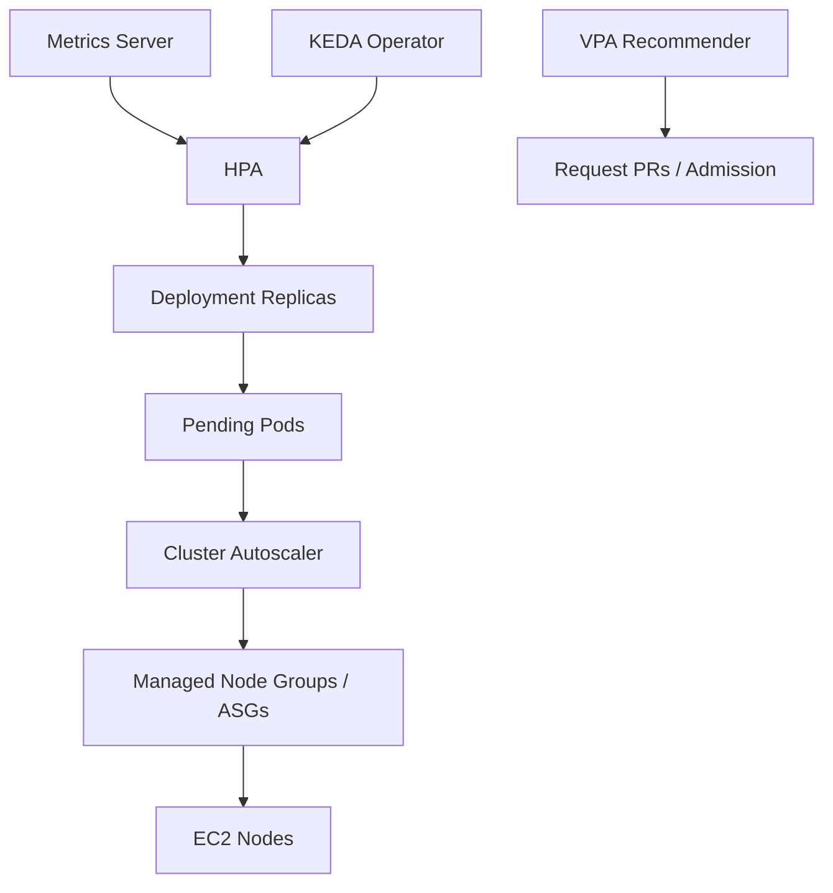
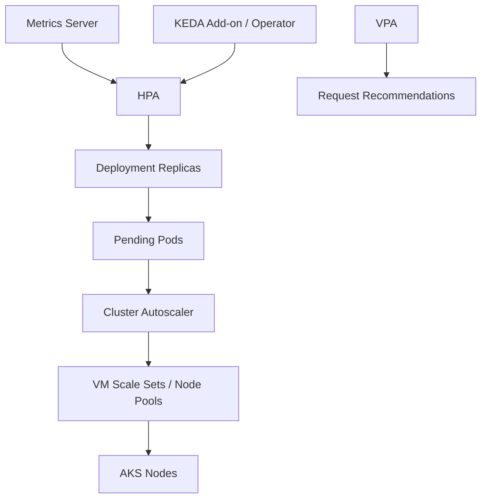
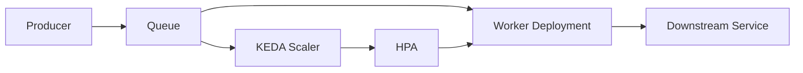
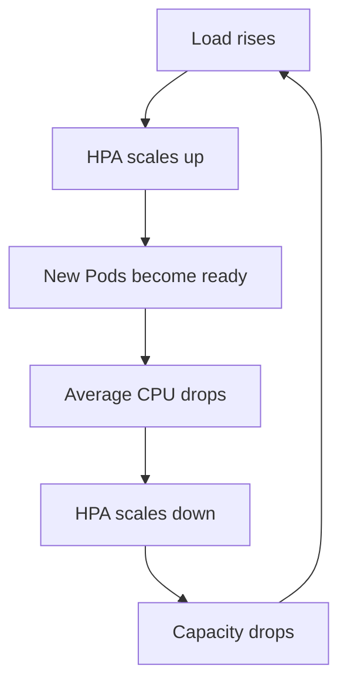

# Part 026 — Autoscaling with HPA, VPA, KEDA, and Cluster Autoscaler

Autoscaling is not magic capacity.

Autoscaling is a set of feedback loops.

A feedback loop observes a signal, compares it to a target, and changes system state. In Kubernetes, the common state changes are:

1. add or remove Pod replicas;
2. change container resource recommendations or requests;
3. add or remove cluster nodes;
4. activate workloads from external events.

When autoscaling works, it looks effortless. When it fails, it fails as a distributed control problem: delayed metrics, cold starts, wrong resource requests, unschedulable Pods, quota limits, slow node provisioning, bad readiness gates, and conflicting controllers.

The top-tier mental model is:

> Autoscaling is safe only when the signal, actuator, delay, and failure mode are understood.



---

## 1. The Four Autoscaling Layers

Kubernetes production autoscaling usually combines four mechanisms.

| Mechanism | Scales | Main signal | Best for |
|---|---|---|---|
| HPA | replicas | CPU, memory, custom metrics, external metrics | stateless services and horizontally scalable workers |
| VPA | resource requests/recommendations | historical CPU/memory usage | right-sizing and request optimization |
| KEDA | replicas through event sources / HPA | queue depth, stream lag, cloud events, cron, external systems | event-driven workers and scale-to-zero patterns |
| Cluster Autoscaler | nodes | unschedulable Pods and underutilized nodes | matching node capacity to Pod demand |

They do not replace each other.

They operate at different layers.



The danger is assuming one loop can fix a problem owned by another loop.

Examples:

- HPA cannot help if no node capacity exists.
- Cluster Autoscaler cannot help if Pod requests are impossible for any node shape.
- KEDA cannot help if trigger authentication is broken.
- VPA cannot help if the application has latency failure unrelated to CPU/memory.

---

## 2. Autoscaling Terminology

| Term | Meaning |
|---|---|
| Signal | Measurement used for scaling decision, such as CPU utilization or queue length |
| Target | Desired level of the signal, such as 60% CPU |
| Actuator | Thing changed by the autoscaler, such as replica count or node count |
| Control loop | Repeated observe-decide-act cycle |
| Stabilization window | Time window used to avoid rapid oscillation |
| Cooldown | Delay before additional scaling action |
| Cold start | Time from scale decision to useful serving capacity |
| Pending Pod | Pod accepted by API but not scheduled |
| Unschedulable Pod | Pending Pod that scheduler cannot place because constraints are not met |
| Scale to zero | Reducing replicas to zero when no work exists |
| Thrashing | Rapid up/down scaling caused by unstable signal or aggressive policy |

---

## 3. HPA Mental Model

Horizontal Pod Autoscaler changes the replica count of a scalable target such as Deployment, ReplicaSet, StatefulSet, or another resource implementing the `/scale` subresource.

A simplified HPA formula is:

```text
desiredReplicas = ceil(currentReplicas * currentMetricValue / desiredMetricValue)
```

Example:

```text
current replicas = 4
current average CPU = 90%
target average CPU = 60%

new desired replicas = ceil(4 * 90 / 60) = 6
```

This explains why HPA is reactive. It observes that the system is already above target, then asks Kubernetes to add replicas.

Those replicas still need to be:

1. created by the controller;
2. scheduled;
3. image-pulled if needed;
4. started;
5. pass startup/readiness probes;
6. receive traffic;
7. warm caches or connections;
8. show new metrics.

That delay is the hidden cost of autoscaling.

---

## 4. HPA Signal Types

HPA can use several metric categories.

| Metric type | Example | Production note |
|---|---|---|
| Resource metric | CPU, memory | CPU works only if requests are set correctly |
| Pods metric | requests per second per Pod | useful for service throughput |
| Object metric | queue length on one object | good for shared object demand |
| External metric | cloud queue depth, SaaS metric | requires external metrics adapter |
| Container resource metric | CPU for a specific container | useful for sidecar-heavy Pods |

### 4.1 CPU utilization depends on requests

HPA CPU utilization is relative to the container CPU request.

If a container requests `100m` and uses `80m`, it is at 80% utilization.

If the request is wrong, the scaling decision is wrong.

This links Part 007 directly to autoscaling: resource requests are not only scheduling hints; they are also control-loop inputs.

---

## 5. Basic HPA Example

```yaml
apiVersion: autoscaling/v2
kind: HorizontalPodAutoscaler
metadata:
  name: payments-api
  namespace: payments-prod
spec:
  scaleTargetRef:
    apiVersion: apps/v1
    kind: Deployment
    name: payments-api
  minReplicas: 4
  maxReplicas: 30
  metrics:
    - type: Resource
      resource:
        name: cpu
        target:
          type: Utilization
          averageUtilization: 60
  behavior:
    scaleUp:
      stabilizationWindowSeconds: 0
      policies:
        - type: Percent
          value: 100
          periodSeconds: 60
        - type: Pods
          value: 4
          periodSeconds: 60
      selectPolicy: Max
    scaleDown:
      stabilizationWindowSeconds: 300
      policies:
        - type: Percent
          value: 25
          periodSeconds: 60
```

Design notes:

- `minReplicas` protects baseline availability and cold-start risk.
- `maxReplicas` protects budget and downstream dependencies.
- scale-up is faster than scale-down.
- scale-down has stabilization to avoid removing capacity too quickly.

---

## 6. HPA Design Rules

### 6.1 Scale on the bottleneck

Do not blindly scale every service on CPU.

| Workload | Better signal |
|---|---|
| CPU-bound API | CPU utilization |
| memory-bound cache | memory or custom capacity metric, but horizontal scaling may not help |
| HTTP service | RPS per Pod, concurrency, latency saturation, CPU as fallback |
| queue worker | queue depth, message age, consumer lag |
| stream processor | partition lag, consumer lag, processing rate |
| batch processor | queue depth, pending jobs, SLA age |
| database | usually not HPA; use database-specific scaling pattern |

A scaling metric should represent pressure that more replicas can relieve.

### 6.2 Do not scale on symptoms too late

Latency is important, but raw latency can be a late signal. By the time p95 latency rises, users are already impacted.

Better pattern:

- use latency for alerting and SLO burn;
- use earlier saturation indicators for scaling;
- combine with load tests to identify leading indicators.

### 6.3 Readiness must represent actual serving capacity

A new Pod should not become Ready before it can handle real traffic.

If readiness is too optimistic, HPA adds replicas but traffic hits cold Pods. Latency gets worse.

If readiness is too strict, HPA adds Pods but they never enter Service endpoints. Capacity does not improve.

### 6.4 Protect dependencies

Scaling one service can overload another.

Example:



This is positive feedback in the wrong direction.

Controls:

- connection pooling;
- per-Pod concurrency limits;
- maxReplicas based on dependency capacity;
- backpressure;
- circuit breakers;
- queueing;
- dependency SLO dashboards.

---

## 7. VPA Mental Model

Vertical Pod Autoscaler focuses on resource requests.

It observes historical resource usage and recommends or applies CPU/memory request changes.

VPA is useful because humans are bad at sizing requests. Teams often over-request memory and under-request CPU, or copy values from old services.

VPA typically has components such as:

- recommender;
- updater;
- admission controller.

Common modes:

| Mode | Behavior | Production use |
|---|---|---|
| `Off` | only recommendations | safe starting point |
| `Initial` | sets requests at Pod creation | useful without disruptive updates |
| `Auto` / `Recreate` | can evict Pods to apply new requests | use carefully for stateless workloads |

### 7.1 VPA is not an instant performance fix

If a Java service has poor GC behavior, VPA may recommend more memory. That may reduce restarts, but it does not fix allocation patterns.

If a service is single-threaded and CPU saturated, increasing CPU request may help scheduling but not throughput unless the app can use more CPU.

### 7.2 HPA and VPA conflict risk

HPA CPU utilization depends on requests.

VPA changes requests.

If both control the same CPU dimension, the system can become hard to reason about.

Safer combinations:

| Combination | Risk |
|---|---|
| HPA on CPU + VPA changes CPU | high interaction risk |
| HPA on external metric + VPA for CPU/memory | often safer |
| VPA in recommendation-only mode + HPA | safe for analysis |
| VPA for memory + HPA on CPU/custom | reasonable with testing |

---

## 8. VPA Recommendation Workflow

A practical production pattern:

1. install VPA in recommendation mode;
2. collect recommendations for 1-2 business cycles;
3. compare current requests vs recommendation percentiles;
4. review outliers with service owners;
5. update requests through GitOps;
6. watch scheduling, eviction, and cost impact;
7. only then consider automated modes for selected workloads.

Example recommendation inspection:

```bash
kubectl describe vpa payments-api -n payments-prod
```

Example VPA object:

```yaml
apiVersion: autoscaling.k8s.io/v1
kind: VerticalPodAutoscaler
metadata:
  name: payments-api
  namespace: payments-prod
spec:
  targetRef:
    apiVersion: apps/v1
    kind: Deployment
    name: payments-api
  updatePolicy:
    updateMode: "Off"
```

For many organizations, `Off` mode plus automated PRs for request updates is the best balance of safety and efficiency.

---

## 9. KEDA Mental Model

KEDA is event-driven autoscaling for Kubernetes.

It watches external event sources and feeds scaling signals into Kubernetes, commonly through HPA.



KEDA is strongest when demand is represented outside the Pod.

Examples:

- SQS queue depth;
- Azure Service Bus queue length;
- Kafka consumer lag;
- RabbitMQ queue depth;
- Redis streams length;
- Prometheus query result;
- cron schedule;
- HTTP add-on demand.

### 9.1 Why KEDA matters

HPA usually needs running Pods to produce resource metrics. For queue workers, the better signal is often queue pressure, not CPU.

KEDA also enables scale-to-zero for many event-driven workloads.

But scale-to-zero has cold-start cost. It is not appropriate for latency-sensitive request paths unless the user experience tolerates activation delay.

---

## 10. KEDA ScaledObject Example

Example shape for queue workers:

```yaml
apiVersion: keda.sh/v1alpha1
kind: ScaledObject
metadata:
  name: invoice-worker
  namespace: billing-prod
spec:
  scaleTargetRef:
    name: invoice-worker
  minReplicaCount: 0
  maxReplicaCount: 50
  pollingInterval: 30
  cooldownPeriod: 300
  triggers:
    - type: aws-sqs-queue
      metadata:
        queueURL: https://sqs.ap-southeast-1.amazonaws.com/123456789012/invoice-events
        queueLength: "20"
        awsRegion: ap-southeast-1
      authenticationRef:
        name: invoice-worker-trigger-auth
```

The important design question:

> Does one replica process roughly `queueLength` messages within the desired time window?

If not, the scaling target is arbitrary.

---

## 11. KEDA Authentication

KEDA scalers need to authenticate to event sources.

Patterns:

| Cloud | Preferred direction |
|---|---|
| EKS | use EKS Pod Identity or IRSA where supported |
| AKS | use Workload Identity or managed identity where supported |
| Generic | use scoped secrets only when identity federation is not available |

Do not place broad queue credentials in a namespace Secret if workload identity is available.

Example shape:

```yaml
apiVersion: keda.sh/v1alpha1
kind: TriggerAuthentication
metadata:
  name: invoice-worker-trigger-auth
  namespace: billing-prod
spec:
  podIdentity:
    provider: aws-eks
```

Exact fields depend on KEDA version and scaler provider. Validate against the KEDA documentation for your installed version.

---

## 12. Cluster Autoscaler Mental Model

Cluster Autoscaler changes node group size.

It watches for:

- Pods that cannot be scheduled;
- nodes that appear underutilized and safe to remove.



Cluster Autoscaler is not a low-latency request scaler. Node creation can take minutes, and image pulls can add more delay.

---

## 13. Cluster Autoscaler Design Rules

### 13.1 Requests are the currency

Cluster Autoscaler reasons about Pod scheduling requirements.

If requests are too low, the cluster may pack too aggressively and create runtime contention.

If requests are too high, the cluster may scale out unnecessarily.

### 13.2 Node groups need clear purpose

Common node group dimensions:

| Dimension | Examples |
|---|---|
| architecture | amd64, arm64 |
| capacity type | on-demand, spot |
| workload class | general, memory-optimized, compute-optimized |
| isolation | regulated, tenant-specific, GPU |
| operating system | Linux, Windows |
| zone strategy | multi-AZ balanced groups |

If every workload can run everywhere, cost may improve but blast radius and governance can degrade.

If every workload needs its own node group, operations become fragmented.

### 13.3 Scale-down is harder than scale-up

Removing nodes must respect:

- PodDisruptionBudgets;
- local storage;
- DaemonSet overhead;
- safe-to-evict annotations;
- topology spread;
- anti-affinity;
- disruption windows;
- workload graceful termination.

If scale-down never happens, check disruption constraints first.

---

## 14. EKS Autoscaling Architecture

A common EKS design:



EKS options:

- HPA with Metrics Server for CPU/memory;
- custom metrics through Prometheus adapter or cloud metrics adapters;
- KEDA for SQS, Kafka, CloudWatch, Prometheus, and other triggers;
- Cluster Autoscaler with Auto Scaling Groups / managed node groups;
- Karpenter or EKS Auto Mode for more dynamic node provisioning, covered in Part 027.

Important EKS-specific bottlenecks:

- subnet IP exhaustion;
- ENI/IP limits per instance type;
- EC2 quota or capacity shortage;
- Spot interruption;
- managed node group scaling limits;
- load balancer target registration delay;
- image pull from ECR under network constraints;
- pod density limits.

---

## 15. AKS Autoscaling Architecture

A common AKS design:



AKS options:

- HPA with Metrics Server;
- AKS KEDA add-on for event-driven scaling;
- cluster autoscaler on node pools;
- multiple node pools for workload classes;
- AKS Automatic for more managed defaults, covered more in Part 028.

Important AKS-specific bottlenecks:

- subnet IP planning depending on Azure CNI mode;
- VM SKU quota;
- regional SKU availability;
- node pool min/max boundaries;
- Azure Load Balancer or Application Gateway registration delay;
- ACR pull networking and identity;
- NSG/UDR egress restrictions;
- PDB and topology constraints blocking scale-down.

---

## 16. Scaling Pattern: Stateless HTTP API

For an HTTP API, the simple path is HPA.

```yaml
apiVersion: autoscaling/v2
kind: HorizontalPodAutoscaler
metadata:
  name: catalog-api
  namespace: commerce-prod
spec:
  scaleTargetRef:
    apiVersion: apps/v1
    kind: Deployment
    name: catalog-api
  minReplicas: 6
  maxReplicas: 60
  metrics:
    - type: Resource
      resource:
        name: cpu
        target:
          type: Utilization
          averageUtilization: 65
```

But mature design asks:

- What is p95 startup time?
- How long until a new Pod becomes Ready?
- How long until load balancer sends traffic to it?
- What is the safe max DB connection count?
- What is max concurrency per Pod?
- What metric leads latency degradation?
- Is there enough node headroom for scale-up?
- Does scale-up require new nodes?

If scale-up requires new nodes, HPA reaction may be too slow for sudden spikes. You may need baseline overcapacity, predictive scaling, scheduled scaling, or pre-warmed node pools.

---

## 17. Scaling Pattern: Queue Worker

Queue workers are often better suited for KEDA.



The scaling target should be based on work throughput.

Example reasoning:

```text
Target SLA: messages processed within 5 minutes
Average processing time per message: 2 seconds
One Pod can process: 30 messages/minute
Expected burst: 3,000 messages
Needed Pods to drain in 5 minutes: 3000 / (30 * 5) = 20 Pods
```

This is better than guessing `queueLength: 10`.

Also protect downstream systems:

- max worker replicas;
- per-Pod concurrency;
- retries with backoff;
- dead-letter queue;
- idempotency;
- rate limits;
- circuit breakers.

---

## 18. Scaling Pattern: Stream Processing

For Kafka or Event Hubs-like workloads, replicas are constrained by partitions or shards.

If a topic has 12 partitions, scaling consumers to 100 Pods may not improve throughput. Many Pods will be idle.

Design questions:

- What is partition count?
- What is consumer group lag?
- What is per-partition processing rate?
- Are messages ordered by key?
- Can the workload process partitions independently?
- What is rebalance cost?
- Does scaling cause duplicate processing or offset instability?

Autoscaling stream processors requires understanding the data system, not just Kubernetes.

---

## 19. Scaling Pattern: Batch and Cron

For batch workloads, HPA is usually not the primary tool.

Options:

- parallel Jobs;
- indexed Jobs;
- KEDA ScaledJob;
- queue-driven workers;
- separate node pool for batch;
- Spot/low-priority capacity where safe;
- max concurrency controls.

Failure mode:

> Batch scales aggressively, consumes all nodes, then latency-sensitive services cannot reschedule during node failures.

Controls:

- taints/tolerations;
- priority classes;
- resource quotas;
- separate node pools;
- PDB for services;
- cluster autoscaler limits;
- budget guardrails.

---

## 20. Stabilization and Oscillation

Autoscaling can oscillate.



Controls:

- scale-down stabilization window;
- conservative scale-down rate;
- realistic resource requests;
- non-zero min replicas;
- load testing;
- avoid noisy metrics;
- average over sufficient time;
- separate startup spikes from steady-state metrics.

Example scale-down protection:

```yaml
behavior:
  scaleDown:
    stabilizationWindowSeconds: 600
    policies:
      - type: Percent
        value: 20
        periodSeconds: 60
```

---

## 21. Cold Start Budget

Every autoscaling design needs a cold start budget.

```text
T_total = T_metric_delay
        + T_controller_loop
        + T_pod_creation
        + T_scheduling
        + T_node_provisioning_if_needed
        + T_image_pull
        + T_container_start
        + T_app_warmup
        + T_readiness
        + T_load_balancer_registration
```

If your traffic spike reaches peak in 30 seconds and new useful capacity takes 4 minutes, reactive autoscaling alone cannot protect the SLO.

Options:

- higher min replicas;
- scheduled scaling before known peak;
- pre-warmed nodes;
- smaller images;
- faster startup;
- readiness that reflects real warmup;
- load shedding;
- queueing;
- CDN/cache;
- predictive scaling outside default HPA.

---

## 22. Resource Requests and Autoscaling Coupling

Consider this Deployment:

```yaml
resources:
  requests:
    cpu: "100m"
    memory: "512Mi"
```

If real steady CPU is `300m`, HPA sees 300% utilization. It may scale up even if latency is fine.

Now consider:

```yaml
resources:
  requests:
    cpu: "2000m"
    memory: "512Mi"
```

If real steady CPU is `300m`, HPA sees 15%. It may not scale up until very late, and Cluster Autoscaler may over-provision nodes.

Requests are a contract across:

- scheduler;
- HPA CPU utilization;
- Cluster Autoscaler simulations;
- bin packing;
- cost allocation;
- eviction behavior.

This is why VPA recommendation and resource observability are part of autoscaling, not separate hygiene.

---

## 23. Failure Modes

### 23.1 HPA says `unknown`

Symptoms:

```bash
kubectl describe hpa payments-api -n payments-prod
```

Shows missing metrics.

Causes:

- Metrics Server missing or unhealthy;
- Pod resource requests missing;
- custom metrics adapter broken;
- RBAC issue;
- APIService unavailable;
- workload has no ready Pods.

### 23.2 HPA scales but Pods stay Pending

Causes:

- no node capacity;
- requests too large;
- node selector mismatch;
- taints not tolerated;
- topology spread impossible;
- PVC zone conflict;
- quota exceeded;
- subnet IP exhaustion;
- cloud provider capacity shortage.

Cluster Autoscaler may or may not fix it depending on node group configuration.

### 23.3 Cluster Autoscaler does not scale up

Causes:

- Pod would not fit any node group;
- node group max size reached;
- cloud quota reached;
- taints/selectors mismatch;
- PVC topology prevents placement;
- autoscaler lacks cloud permissions;
- scale-up backoff;
- Pod has invalid constraints.

### 23.4 Cluster Autoscaler does not scale down

Causes:

- PDB blocks eviction;
- Pod uses local storage;
- Pod annotated as not safe to evict;
- DaemonSet overhead;
- low utilization thresholds not met;
- topology constraints;
- system Pods on candidate node;
- recent scale-up delay.

### 23.5 KEDA does not scale

Causes:

- scaler authentication failure;
- trigger metadata wrong;
- network egress blocked;
- external metrics adapter conflict;
- queue metric not visible;
- polling interval too slow;
- maxReplicaCount too low;
- ScaledObject targets wrong Deployment;
- scale-to-zero activation threshold too high.

### 23.6 VPA causes disruption

Causes:

- auto mode evicts Pods during peak;
- PDB too permissive;
- recommendations based on abnormal traffic;
- memory recommendation too low;
- HPA and VPA interact unexpectedly;
- request increase makes Pods unschedulable.

---

## 24. Debugging Cookbook

### 24.1 Inspect HPA

```bash
kubectl get hpa -A
kubectl describe hpa payments-api -n payments-prod
```

Look for:

- current metrics;
- target metrics;
- desired replicas;
- conditions;
- scaling events;
- metric errors.

### 24.2 Inspect resource metrics

```bash
kubectl top pods -n payments-prod
kubectl top nodes
```

If this fails, fix Metrics Server before blaming HPA.

### 24.3 Inspect pending Pods

```bash
kubectl get pods -n payments-prod --field-selector=status.phase=Pending
kubectl describe pod <pod> -n payments-prod
```

Read scheduler events carefully. They usually explain the real constraint.

### 24.4 Inspect Cluster Autoscaler logs

Exact command depends on installation namespace and chart.

```bash
kubectl logs -n kube-system deployment/cluster-autoscaler
```

Look for:

- scale-up decisions;
- skipped node groups;
- max size reached;
- unremovable nodes;
- cloud provider errors.

### 24.5 Inspect KEDA

```bash
kubectl get scaledobject -A
kubectl describe scaledobject invoice-worker -n billing-prod
kubectl logs -n keda deployment/keda-operator
```

Look for trigger authentication and scaler errors.

### 24.6 Inspect actual Deployment scale

```bash
kubectl get deploy payments-api -n payments-prod
kubectl get rs -n payments-prod
kubectl get events -n payments-prod --sort-by=.lastTimestamp
```

Remember: HPA sets desired replicas on the target. Deployment and ReplicaSet still reconcile Pods.

---

## 25. Observability for Autoscaling

You need dashboards for the control loop, not only the app.

Minimum metrics:

### Workload

- current replicas;
- desired replicas;
- available replicas;
- ready replicas;
- restart rate;
- startup time;
- readiness transition time;
- CPU/memory usage vs requests;
- request rate/concurrency;
- latency and error rate.

### Autoscaler

- HPA current/target metrics;
- HPA desired replicas;
- KEDA scaler values;
- VPA recommendations;
- Cluster Autoscaler scale-up/down events;
- pending Pod count;
- unschedulable reasons.

### Cloud capacity

- node group size;
- quota utilization;
- subnet IP utilization;
- Spot interruption rate;
- image pull latency;
- node join time;
- load balancer target registration time.

The best dashboard shows the chain:

```text
load -> signal -> desired replicas -> pending pods -> nodes -> ready pods -> latency
```

---

## 26. Autoscaling Readiness Checklist

Before enabling autoscaling for a production workload:

- [ ] Workload is horizontally scalable.
- [ ] Requests are realistic.
- [ ] Readiness probe represents real serving readiness.
- [ ] Startup time is measured.
- [ ] Image pull time is measured.
- [ ] Downstream dependency capacity is known.
- [ ] `maxReplicas` is set based on dependency and budget limits.
- [ ] `minReplicas` covers baseline SLO and cold-start risk.
- [ ] PodDisruptionBudget is compatible with scaling and node drain.
- [ ] Node group max size can satisfy max replicas.
- [ ] Subnet/IP capacity is sufficient.
- [ ] Quotas are sufficient.
- [ ] Metrics pipeline is reliable.
- [ ] Scale-up and scale-down behavior are tuned.
- [ ] Runbook exists for pending Pods and missing metrics.
- [ ] Load test validates scaling behavior.

---

## 27. Decision Matrix

| Problem | Best first tool | Why |
|---|---|---|
| Stateless API CPU saturation | HPA | add replicas based on resource/custom metric |
| Queue backlog | KEDA | external event source is the demand signal |
| Requests too high/low | VPA recommendation | right-size scheduling and cost inputs |
| Pods Pending due to no capacity | Cluster Autoscaler | add nodes |
| Sudden traffic spike faster than node provisioning | min replicas / pre-warm / scheduled scaling | reactive loop too slow |
| Cost waste from over-requesting | VPA + FinOps review | fix request model |
| Stream consumer lag | KEDA with lag metric | scale from event-source pressure |
| Database saturation | usually not HPA | dependency needs architecture/control changes |
| Unstable scaling | HPA behavior tuning | reduce oscillation |
| Multi-shape capacity | Cluster Autoscaler or next-gen node provisioner | match Pod constraints to node types |

---

## 28. Load Testing Autoscaling

Do not enable production autoscaling without testing the full loop.

Test cases:

1. steady ramp;
2. sudden spike;
3. burst then idle;
4. partial dependency slowdown;
5. metrics outage;
6. node group max reached;
7. subnet IP exhaustion simulation or quota check;
8. scale-down with PDB;
9. image not cached;
10. cold start after scale-to-zero.

For each test, capture:

- time to HPA decision;
- time to Pod creation;
- time to scheduling;
- time to node provisioning if needed;
- time to readiness;
- time to traffic received;
- SLO impact;
- cost impact;
- downstream impact.

Autoscaling without load testing is hope with YAML.

---

## 29. Top 1% Review Questions

Ask these in architecture review:

1. What exact signal are we scaling on?
2. Is that signal a leading indicator or a late symptom?
3. Can more replicas actually reduce that signal?
4. What is the cold-start time from decision to useful capacity?
5. Does scale-up require new nodes?
6. Can Cluster Autoscaler provision nodes fast enough?
7. Are subnet IPs and quotas sufficient for max scale?
8. What protects downstream dependencies from replica explosion?
9. Is `maxReplicas` based on real capacity math or guesswork?
10. What happens if metrics are missing?
11. What happens if the external scaler cannot authenticate?
12. Can scale-down violate availability or disrupt long-running work?
13. Are HPA and VPA controlling the same dimension?
14. What is the cost ceiling during runaway scaling?
15. Has the full loop been load-tested?

---

## 30. Hands-On Lab

Build three autoscaling scenarios.

### Lab A — HPA for stateless API

1. Deploy a CPU-test API.
2. Set realistic requests.
3. Install/verify Metrics Server.
4. Create HPA.
5. Generate load.
6. Observe HPA desired replicas.
7. Observe pending Pods and node capacity.
8. Tune scale-down behavior.

### Lab B — KEDA for queue worker

1. Create queue or local event source.
2. Deploy worker with idempotent processing.
3. Configure KEDA ScaledObject.
4. Test scale from zero.
5. Measure time to first processed message.
6. Increase backlog and observe scaling.
7. Break scaler auth and confirm alerting.

### Lab C — Cluster Autoscaler

1. Create a node group with small min/max.
2. Deploy workload that exceeds current capacity.
3. Watch Pods become Pending.
4. Observe Cluster Autoscaler scale-up.
5. Confirm node joins and Pods schedule.
6. Reduce replicas.
7. Confirm scale-down behavior.
8. Add PDB/local storage and observe why scale-down changes.

---

## 31. Production Runbook: HPA Scaling Incident

When service is overloaded:

1. Check SLO dashboard: latency, errors, saturation.
2. Check HPA status.
3. Check if desired replicas increased.
4. Check Deployment available replicas.
5. Check pending Pods.
6. Check node capacity and Cluster Autoscaler logs.
7. Check image pull and readiness delays.
8. Check dependency saturation.
9. If needed, manually raise replicas within safe dependency limit.
10. If nodes are blocked, raise node group max or add capacity.
11. If dependency is saturated, stop scaling blindly and apply backpressure.
12. Capture timeline for post-incident tuning.

Manual scaling is not failure. Manual scaling without understanding the blocked loop is failure.

---

## 32. Summary

Autoscaling in Kubernetes is a composition of control loops.

HPA changes replica counts.

VPA recommends or changes resource requests.

KEDA converts external event pressure into scaling signals.

Cluster Autoscaler changes node capacity.

Production success depends on the connections between them:

- requests must be realistic;
- metrics must represent real pressure;
- readiness must represent useful capacity;
- cold start must fit the SLO;
- node capacity must arrive in time;
- dependencies must survive scale-out;
- scale-down must respect disruption constraints;
- failure modes must be observable.

The right question is not “do we have autoscaling?”

The right question is:

> Under what load, with what signal, after what delay, through which controller, does the platform add useful capacity, and what happens when any step fails?

---

## References

- Kubernetes Documentation — Horizontal Pod Autoscaling: https://kubernetes.io/docs/concepts/workloads/autoscaling/horizontal-pod-autoscale/
- Kubernetes Documentation — Autoscaling Workloads: https://kubernetes.io/docs/concepts/workloads/autoscaling/
- Kubernetes Documentation — Node Autoscaling: https://kubernetes.io/docs/concepts/cluster-administration/node-autoscaling/
- Kubernetes Documentation — Resource Management for Pods and Containers: https://kubernetes.io/docs/concepts/configuration/manage-resources-containers/
- KEDA Documentation: https://keda.sh/docs/
- Kubernetes Autoscaler repository: https://github.com/kubernetes/autoscaler
- AWS EKS Best Practices — Cluster Autoscaler: https://docs.aws.amazon.com/eks/latest/best-practices/cas.html
- AWS EKS User Guide — Horizontal Pod Autoscaler: https://docs.aws.amazon.com/eks/latest/userguide/horizontal-pod-autoscaler.html
- Azure AKS — Kubernetes Event-driven Autoscaling: https://learn.microsoft.com/en-us/azure/aks/keda-about
- Azure AKS — Cluster autoscaler: https://learn.microsoft.com/en-us/azure/aks/cluster-autoscaler
