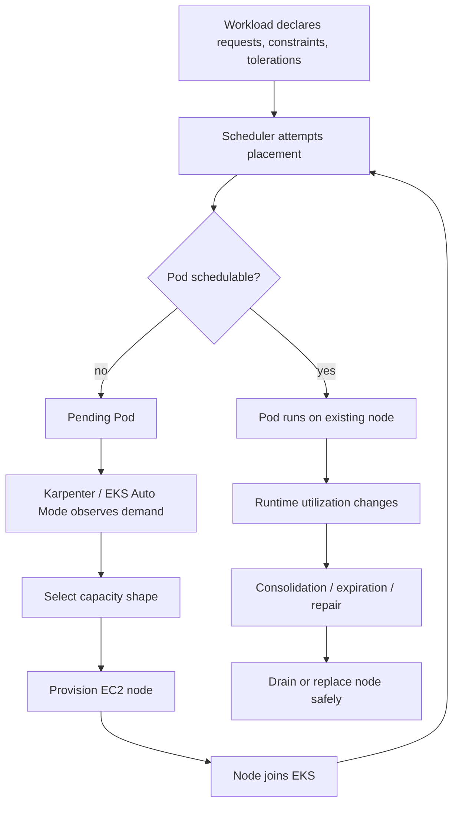
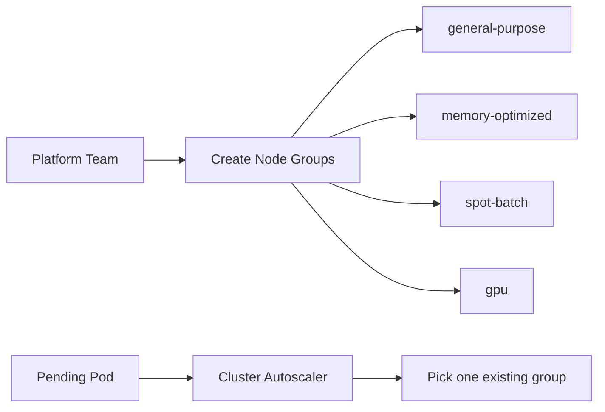
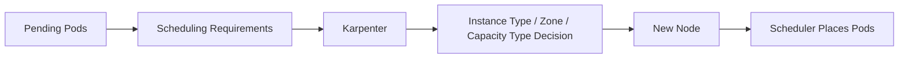
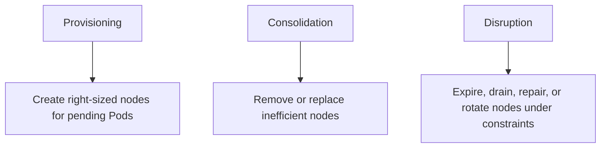
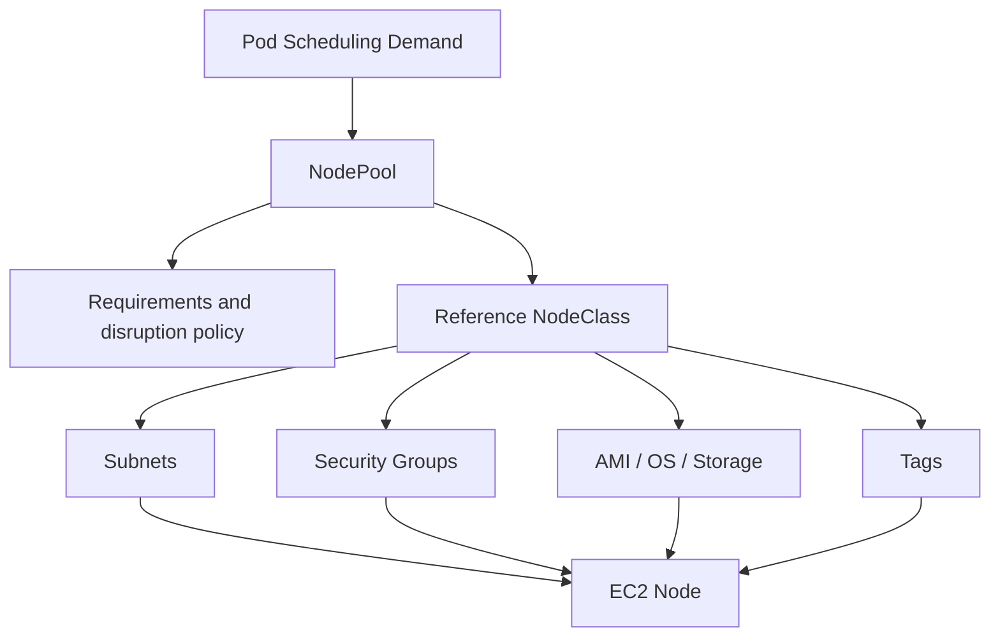
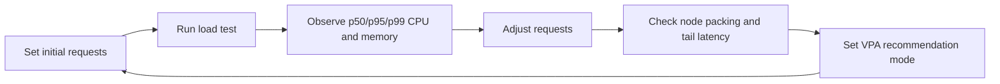
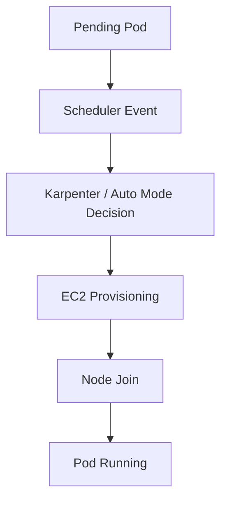
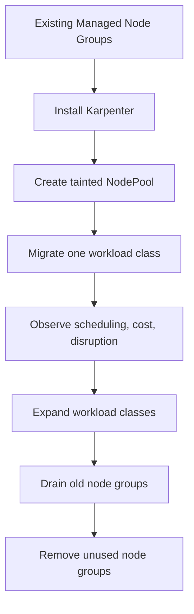

# Part 027 — Karpenter, EKS Auto Mode, and Node Provisioning

Autoscaling Pods is only half of the story.

The other half is answering a harder question:

> Where will those Pods run, and how quickly can the platform create that capacity without destroying reliability, cost, or security?

In old Kubernetes clusters, the answer was usually static node groups plus Cluster Autoscaler. That model works, but it forces platform engineers to pre-design pools of capacity: general-purpose pool, memory pool, compute pool, GPU pool, Spot pool, system pool, batch pool, and so on. Over time, this becomes a fragmented capacity market inside the cluster.

Karpenter and EKS Auto Mode change the operating model.

They move the decision closer to the actual scheduling demand of pending Pods.

A production platform engineer should not think of Karpenter as “a faster Cluster Autoscaler.” That framing is too shallow. Karpenter is a node lifecycle controller. It watches unschedulable Pods, derives the needed compute shape, provisions matching nodes, and later disrupts or consolidates nodes when doing so is safe.

EKS Auto Mode takes that idea further. It delegates more of the EKS data-plane infrastructure operation to AWS: compute, node lifecycle, managed load balancing, networking integration, block storage integration, node security posture, and some default platform components. You still own the application contract, workload requests, disruption budgets, identity, policy, observability, and the Kubernetes resources that describe intent.



The invariant for this part:

> Node provisioning must be treated as a scheduling and disruption system, not as an infrastructure script.

---

## 1. The Problem Karpenter Solves

Cluster Autoscaler usually works by scaling predefined node groups. It asks: “Which existing node group can be scaled to fit this pending Pod?”

Karpenter asks a different question: “What node should exist for these pending Pods?”

That difference matters.

With predefined node groups, you must forecast capacity shapes before the workload arrives. With Karpenter, capacity shape can be derived from Pod constraints at provisioning time.

### 1.1 Static Node Group Thinking



This model is easy to understand, but has predictable failure modes.

| Failure | Why it happens |
|---|---|
| Overprovisioned node groups | Each pool keeps buffer capacity even when demand is low |
| Fragmented capacity | Free CPU/memory exists but not in the right pool |
| Slow platform changes | New workload shape requires a new node group rollout |
| Poor Spot flexibility | Small instance family list reduces Spot availability |
| Cost drift | Teams request special pools that never get retired |

### 1.2 Demand-Driven Node Thinking



Karpenter converts workload declarations into infrastructure decisions.

It pays attention to constraints such as:

- resource requests;
- node selectors;
- node affinity;
- topology spread constraints;
- taints and tolerations;
- Pod disruption budgets;
- instance type requirements;
- zone requirements;
- architecture requirements;
- capacity type preferences such as Spot or On-Demand.

This is why Part 007 and Part 026 matter. If requests and scheduling constraints are wrong, node provisioning will also be wrong.

---

## 2. Karpenter Control Model

Karpenter has three conceptual responsibilities.



### 2.1 Provisioning

Provisioning begins when Pods are pending because the existing cluster cannot satisfy their scheduling requirements.

Karpenter does not merely add one random node. It evaluates the demand and provisions capacity that can satisfy it.

Important inputs:

```yaml
resources:
  requests:
    cpu: "1500m"
    memory: "2Gi"
nodeSelector:
  kubernetes.io/arch: amd64
tolerations:
  - key: workload-tier
    operator: Equal
    value: batch
    effect: NoSchedule
topologySpreadConstraints:
  - maxSkew: 1
    topologyKey: topology.kubernetes.io/zone
    whenUnsatisfiable: ScheduleAnyway
    labelSelector:
      matchLabels:
        app: invoice-worker
```

This Pod is not just asking for CPU and memory. It is asking for an architecture, a scheduling class, and zone distribution behavior.

### 2.2 Consolidation

Provisioning adds nodes. Consolidation removes or replaces nodes.

Consolidation is where many teams become nervous, because it intentionally disrupts infrastructure. The correct framing is:

> Consolidation is safe only when workload disruption contracts are correct.

Those contracts include:

- `PodDisruptionBudget`;
- graceful shutdown;
- readiness behavior;
- replica count;
- anti-affinity;
- topology spread;
- drain-safe storage;
- queue/worker idempotency;
- application tolerance for restart.

If workloads are not drain-safe, disabling consolidation only hides the weakness. It does not fix the platform.

### 2.3 Disruption

Node lifecycle disruption includes:

- replacing expired nodes;
- handling unhealthy nodes;
- removing underutilized nodes;
- replacing expensive nodes with cheaper compatible nodes;
- responding to Spot interruptions;
- respecting configured disruption budgets.

A mature platform defines disruption policy explicitly. Uncontrolled node replacement is dangerous. No node replacement is also dangerous because nodes become stale, expensive, or insecure.

---

## 3. EKS Auto Mode vs Self-Managed Karpenter

Both are demand-driven node provisioning models, but the ownership boundary is different.

| Dimension | Self-managed Karpenter on EKS | EKS Auto Mode |
|---|---|---|
| Controller ownership | You install and operate Karpenter | AWS manages the Auto Mode infrastructure components |
| Compute lifecycle | You configure NodePools/NodeClasses and controller lifecycle | AWS provides managed NodePools/NodeClasses model and managed data plane behavior |
| Flexibility | Highest flexibility | More managed, opinionated, lower operational burden |
| Upgrade burden | You manage Karpenter version, CRDs, IAM, controller health | AWS manages more of the infrastructure lifecycle |
| Best fit | Platform teams needing deep EC2 customization | Teams wanting production-ready EKS infrastructure with less day-2 overhead |
| Risk | Misconfigured controller/IAM/disruption policy | Managed abstraction may constrain some low-level choices |

The strategic question is not “which one is better?”

The better question is:

> Which operational burden should our team own because it creates business value, and which burden should we delegate to AWS?

### 3.1 Use Self-Managed Karpenter When

Use self-managed Karpenter when:

- you need precise EC2 instance selection logic;
- you have complex capacity reservation strategy;
- you need customized AMI lifecycle and bootstrap behavior;
- you operate advanced GPU/accelerator fleets;
- you want fine-grained disruption policy and controller tuning;
- your platform team is ready to own the controller as production software.

### 3.2 Use EKS Auto Mode When

Use EKS Auto Mode when:

- you want AWS to manage more data-plane infrastructure;
- you prefer fewer add-ons to install and maintain;
- you want opinionated node security defaults;
- you want managed integration with load balancing, networking, and storage components;
- your teams should focus more on workload contracts than node internals;
- you can accept the abstraction and constraints of the managed mode.

### 3.3 Hybrid Is Usually Temporary

Running multiple provisioning systems can be valid during migration, but it should not become accidental architecture.

Hybrid provisioning risks:

- overlapping capacity ownership;
- unpredictable scheduling;
- confusing taints/selectors;
- inconsistent labels;
- cost attribution gaps;
- two different disruption policies;
- harder incident debugging.

During migration, mark the boundary explicitly:

```yaml
nodeSelector:
  eks.amazonaws.com/compute-type: auto
tolerations:
  - key: eks-auto-mode
    operator: Exists
    effect: NoSchedule
```

Then remove temporary selectors after the workload class is fully migrated and platform ownership is clear.

---

## 4. Core Objects: NodePool and NodeClass

Karpenter-style provisioning separates *what capacity is acceptable* from *how cloud infrastructure should be configured*.

The exact API group and fields differ between self-managed Karpenter and EKS Auto Mode, but the mental model is stable.



### 4.1 NodePool

A `NodePool` describes the class of nodes that may be created.

It usually answers:

- what instance categories are allowed;
- what CPU/memory range is allowed;
- what zones are allowed;
- whether Spot, On-Demand, or both are allowed;
- what architecture is allowed;
- what taints should nodes receive;
- what labels should nodes receive;
- what disruption/consolidation policy applies;
- what total limits protect the cluster.

Example conceptual NodePool:

```yaml
apiVersion: karpenter.sh/v1
kind: NodePool
metadata:
  name: general-purpose
spec:
  template:
    metadata:
      labels:
        workload-class: general
    spec:
      requirements:
        - key: kubernetes.io/arch
          operator: In
          values: ["amd64"]
        - key: karpenter.sh/capacity-type
          operator: In
          values: ["on-demand", "spot"]
        - key: topology.kubernetes.io/zone
          operator: In
          values: ["ap-southeast-1a", "ap-southeast-1b", "ap-southeast-1c"]
        - key: node.kubernetes.io/instance-type
          operator: In
          values: ["m7i.large", "m7i.xlarge", "m7a.large", "m7a.xlarge", "c7i.large", "c7i.xlarge"]
      nodeClassRef:
        group: karpenter.k8s.aws
        kind: EC2NodeClass
        name: default-private
  disruption:
    consolidationPolicy: WhenEmptyOrUnderutilized
    consolidateAfter: 5m
  limits:
    cpu: "1000"
    memory: 2000Gi
```

This object says: “For general workloads, create compatible AMD64 nodes across these zones, using either Spot or On-Demand, from these instance families, with this disruption strategy.”

### 4.2 NodeClass

A `NodeClass` describes infrastructure-level configuration.

It usually answers:

- which subnets to use;
- which security groups to attach;
- which AMI family or image selection to use;
- what instance profile or IAM role the node uses;
- ephemeral storage configuration;
- block device mappings;
- resource tags;
- metadata options;
- kubelet settings.

Example conceptual EC2 NodeClass:

```yaml
apiVersion: karpenter.k8s.aws/v1
kind: EC2NodeClass
metadata:
  name: default-private
spec:
  amiFamily: AL2023
  role: eks-node-role-prod
  subnetSelectorTerms:
    - tags:
        kubernetes.io/role/internal-elb: "1"
        environment: prod
  securityGroupSelectorTerms:
    - tags:
        aws:eks:cluster-name: prod-platform
  tags:
    cost-center: platform
    owner: eks
    managed-by: karpenter
  blockDeviceMappings:
    - deviceName: /dev/xvda
      ebs:
        volumeSize: 80Gi
        volumeType: gp3
        encrypted: true
```

Keep the separation clean.

`NodePool` is scheduling policy. `NodeClass` is cloud infrastructure policy.

---

## 5. Designing NodePools Like a Platform Product

Bad platforms create one NodePool per team.

Good platforms create NodePools per runtime class.

The difference is subtle but important.

A team is an organizational boundary. A runtime class is a technical contract.

### 5.1 Recommended Runtime Classes

| Runtime class | Purpose | Typical constraints |
|---|---|---|
| `system` | Kubernetes/system add-ons | On-Demand, stable, tainted, protected |
| `general` | ordinary stateless services | mixed instance families, multi-AZ |
| `batch` | interruptible workers | Spot-preferred, tolerant to drain |
| `memory` | high memory services | memory-optimized instance families |
| `compute` | CPU-heavy workloads | compute-optimized families |
| `gpu` | accelerator workloads | GPU families, special device plugins |
| `regulated` | stricter isolation/compliance | On-Demand, dedicated labels/taints, strict policies |

Avoid designing NodePools around vague labels like `team-a`, `team-b`, `important`, or `misc`.

### 5.2 NodePool Naming Standard

Use names that encode runtime intent, not implementation detail.

Good:

```text
system-on-demand
general-flex
batch-spot
memory-on-demand
gpu-training
regulated-on-demand
```

Bad:

```text
nodepool1
new-pool
large-machines
team-joko
prod-special
```

Names become part of debugging language. A bad name creates operational ambiguity during incidents.

---

## 6. Capacity Type Strategy: Spot and On-Demand

Spot is not cheap On-Demand.

Spot is interruptible capacity with a different reliability contract.

The correct question is:

> Which workloads are semantically safe to interrupt?

### 6.1 Workload Suitability Matrix

| Workload | Spot suitable? | Reason |
|---|---:|---|
| stateless web service with many replicas | sometimes | must tolerate node drain and have enough spread |
| queue worker with idempotent processing | yes | interruption can be retried |
| scheduled batch job | yes | if restart/resume is safe |
| single-replica admin app | no | interruption creates outage |
| stateful database | usually no | local disruption and storage semantics are risky |
| control-plane add-on | usually no | platform stability is more important than savings |
| GPU training | depends | checkpointing determines safety |

### 6.2 Spot NodePool Example

```yaml
apiVersion: karpenter.sh/v1
kind: NodePool
metadata:
  name: batch-spot
spec:
  template:
    metadata:
      labels:
        workload-class: batch
    spec:
      taints:
        - key: workload-class
          value: batch
          effect: NoSchedule
      requirements:
        - key: karpenter.sh/capacity-type
          operator: In
          values: ["spot"]
        - key: kubernetes.io/arch
          operator: In
          values: ["amd64"]
        - key: karpenter.k8s.aws/instance-category
          operator: In
          values: ["c", "m", "r"]
        - key: karpenter.k8s.aws/instance-generation
          operator: Gt
          values: ["5"]
  disruption:
    consolidationPolicy: WhenEmptyOrUnderutilized
    consolidateAfter: 2m
```

Corresponding workload:

```yaml
apiVersion: apps/v1
kind: Deployment
metadata:
  name: invoice-export-worker
spec:
  replicas: 10
  selector:
    matchLabels:
      app: invoice-export-worker
  template:
    metadata:
      labels:
        app: invoice-export-worker
    spec:
      tolerations:
        - key: workload-class
          operator: Equal
          value: batch
          effect: NoSchedule
      nodeSelector:
        workload-class: batch
      containers:
        - name: worker
          image: registry.example.com/invoice-export-worker@sha256:...
          resources:
            requests:
              cpu: "500m"
              memory: "512Mi"
            limits:
              memory: "1Gi"
```

This is not enough by itself. The worker must also be semantically safe:

- messages are acknowledged only after durable completion;
- work can be retried;
- duplicate processing is safe;
- shutdown stops pulling new work;
- in-flight work is checkpointed or abandoned safely;
- the queue has dead-letter handling.

Kubernetes cannot make non-idempotent business logic safe.

---

## 7. Instance Type Selection

The largest cost mistake in Karpenter is over-constraining instance type choices.

A narrow list like this is fragile:

```yaml
- key: node.kubernetes.io/instance-type
  operator: In
  values: ["m7i.large"]
```

It creates capacity risk because only one shape can satisfy the demand.

Prefer broader requirement sets when possible:

```yaml
requirements:
  - key: karpenter.k8s.aws/instance-category
    operator: In
    values: ["m", "c", "r"]
  - key: karpenter.k8s.aws/instance-generation
    operator: Gt
    values: ["5"]
  - key: kubernetes.io/arch
    operator: In
    values: ["amd64"]
```

Use explicit instance types only when the workload genuinely requires them.

Legitimate reasons:

- licensed software tied to CPU count or instance family;
- performance-certified workload;
- GPU/accelerator requirement;
- storage throughput requirement;
- regulatory approval for specific instance class;
- capacity reservation tied to a shape.

Illegitimate reasons:

- “we used this instance type before”;
- “it feels safer”;
- “the team asked for a big machine”;
- “we do not know the workload requests.”

---

## 8. Requests Are the Currency of Provisioning

Karpenter does not read your mind.

It provisions based on scheduling constraints and declared requests.

If requests are too low, nodes are under-provisioned and workloads fight at runtime.

If requests are too high, Karpenter creates too much capacity and cost rises.

### 8.1 Bad Request Pattern

```yaml
resources:
  requests:
    cpu: "50m"
    memory: "128Mi"
  limits:
    cpu: "4"
    memory: "8Gi"
```

This says: “Schedule me like a tiny workload, but allow me to behave like a large workload.”

It causes:

- noisy neighbor incidents;
- CPU throttling surprise;
- memory pressure;
- eviction;
- misleading capacity planning;
- poor consolidation decisions.

### 8.2 Better Request Pattern

```yaml
resources:
  requests:
    cpu: "750m"
    memory: "768Mi"
  limits:
    memory: "1.5Gi"
```

For many JVM or Go services, memory limit matters more than CPU limit. CPU can often be request-only unless there is a strong isolation reason.

Request sizing loop:



---

## 9. Disruption Budgets for Nodes and Pods

There are two layers of disruption control.

| Layer | Controls | Example |
|---|---|---|
| Pod layer | how many application Pods can be voluntarily disrupted | `PodDisruptionBudget` |
| Node provisioning layer | how aggressively nodes can be replaced or consolidated | Karpenter/EKS Auto Mode disruption settings |

### 9.1 PodDisruptionBudget Example

```yaml
apiVersion: policy/v1
kind: PodDisruptionBudget
metadata:
  name: payment-api-pdb
spec:
  minAvailable: 80%
  selector:
    matchLabels:
      app: payment-api
```

This is a workload-level statement: at least 80% of matching Pods should remain available during voluntary disruptions.

It is not a guarantee against involuntary failure. It does not stop a node crash. It does not stop a kernel panic. It does not save a single-replica service.

### 9.2 Disruption Failure Mode

A too-strict PDB can block node replacement forever.

Example:

```yaml
spec:
  minAvailable: 1
```

for a Deployment with one replica.

This means the only Pod cannot be voluntarily disrupted. Node drain can stall. Upgrades, consolidation, and security replacement can be blocked.

Better:

- run at least two replicas for services that need availability;
- use topology spread across zones;
- set PDB relative to actual redundancy;
- test drain behavior before production.

---

## 10. Topology: Zones, Spread, and Storage

Node provisioning is zone-aware.

Your workloads should be too.

Bad platform design lets all replicas land in one Availability Zone, then calls the service “highly available.”

### 10.1 Topology Spread Example

```yaml
apiVersion: apps/v1
kind: Deployment
metadata:
  name: customer-api
spec:
  replicas: 6
  selector:
    matchLabels:
      app: customer-api
  template:
    metadata:
      labels:
        app: customer-api
    spec:
      topologySpreadConstraints:
        - maxSkew: 1
          topologyKey: topology.kubernetes.io/zone
          whenUnsatisfiable: DoNotSchedule
          labelSelector:
            matchLabels:
              app: customer-api
      containers:
        - name: api
          image: registry.example.com/customer-api@sha256:...
          resources:
            requests:
              cpu: "500m"
              memory: "512Mi"
```

This says: keep replicas balanced across zones and refuse scheduling if the cluster cannot satisfy it.

That is a stronger availability contract, but it may require Karpenter to provision nodes in specific zones.

### 10.2 Storage Coupling

Persistent volumes can bind workloads to a zone.

If a Pod uses an EBS volume in one AZ, the replacement Pod must run in a compatible zone. Node provisioning must respect that storage topology.

Stateful workloads need extra review:

- volume topology;
- backup/restore behavior;
- detach/attach delay;
- PDB;
- StatefulSet ordered termination;
- zone failure plan;
- storage class binding mode.

For production, do not treat stateful workload placement as “just another Deployment.”

---

## 11. EKS Auto Mode Operating Model

EKS Auto Mode is not just a node scaler.

It changes the data-plane ownership boundary.

### 11.1 What Gets Delegated

In Auto Mode, AWS manages more of the infrastructure required to run workloads. This includes a managed approach to:

- compute provisioning;
- node lifecycle;
- load balancing integration;
- networking support;
- block storage integration;
- node security posture;
- node replacement and patching behavior;
- some managed data-plane components.

You still own:

- application container correctness;
- resource requests;
- Pod disruption budgets;
- readiness/liveness behavior;
- security context;
- IAM permissions;
- Kubernetes RBAC;
- network policies;
- observability and SLOs;
- deployment strategy;
- business-level reliability.

### 11.2 Auto Mode NodePool and NodeClass

EKS Auto Mode includes default NodePools and NodeClasses, but production platforms often add custom ones for separation.

Example conceptual EKS Auto Mode NodeClass:

```yaml
apiVersion: eks.amazonaws.com/v1
kind: NodeClass
metadata:
  name: private-compute
spec:
  subnetSelectorTerms:
    - tags:
        kubernetes.io/role/internal-elb: "1"
        environment: prod
  securityGroupSelectorTerms:
    - tags:
        aws:eks:cluster-name: prod-platform
  ephemeralStorage:
    size: "160Gi"
```

This object is infrastructure policy: private subnet selection, security group selection, and ephemeral storage configuration.

Example conceptual Auto Mode NodePool:

```yaml
apiVersion: karpenter.sh/v1
kind: NodePool
metadata:
  name: regulated-on-demand
spec:
  template:
    metadata:
      labels:
        workload-class: regulated
    spec:
      nodeClassRef:
        group: eks.amazonaws.com
        kind: NodeClass
        name: private-compute
      taints:
        - key: workload-class
          value: regulated
          effect: NoSchedule
      requirements:
        - key: karpenter.sh/capacity-type
          operator: In
          values: ["on-demand"]
        - key: topology.kubernetes.io/zone
          operator: In
          values: ["ap-southeast-1a", "ap-southeast-1b", "ap-southeast-1c"]
  disruption:
    consolidationPolicy: WhenEmptyOrUnderutilized
```

The exact API details can evolve. The design invariant is more important:

> Use custom NodePools to express workload runtime classes. Use NodeClasses to express AWS infrastructure placement and node configuration.

---

## 12. Scheduling Contract for Workload Teams

Platform teams should not expose raw Karpenter complexity to every product team.

Expose a small contract.

Example annotation/label vocabulary:

```yaml
metadata:
  labels:
    platform.example.com/workload-class: general
    platform.example.com/cost-owner: billing
    platform.example.com/runtime: java17
```

Example workload placement:

```yaml
spec:
  template:
    spec:
      nodeSelector:
        workload-class: general
      topologySpreadConstraints:
        - maxSkew: 1
          topologyKey: topology.kubernetes.io/zone
          whenUnsatisfiable: ScheduleAnyway
          labelSelector:
            matchLabels:
              app: billing-api
```

For most teams, the platform API should answer:

- which workload class should I use?;
- what requests are required?;
- what PDB is required?;
- can I use Spot?;
- do I need zone spread?;
- what is my max replica burst?;
- what is the expected cold-start time?;
- what happens during node drain?

Do not ask every service team to become EC2 capacity experts.

---

## 13. Production NodePool Catalog

A practical EKS platform might start with this catalog.

### 13.1 `system-on-demand`

Purpose: platform components.

Rules:

- On-Demand only;
- tainted;
- limited access;
- no random app workloads;
- conservative consolidation;
- high observability.

```yaml
spec:
  template:
    spec:
      taints:
        - key: CriticalAddonsOnly
          value: "true"
          effect: NoSchedule
      requirements:
        - key: karpenter.sh/capacity-type
          operator: In
          values: ["on-demand"]
```

### 13.2 `general-flex`

Purpose: default stateless services.

Rules:

- broad instance family flexibility;
- multi-AZ;
- On-Demand plus optional Spot only if the organization accepts it;
- medium consolidation aggressiveness.

### 13.3 `batch-spot`

Purpose: async, retryable workers.

Rules:

- Spot-first;
- tainted;
- aggressive consolidation acceptable;
- workloads must be idempotent;
- queue lag metrics required.

### 13.4 `regulated-on-demand`

Purpose: restricted workloads.

Rules:

- private subnets;
- On-Demand only;
- strict IAM and network policy;
- dedicated cost tags;
- stronger admission controls;
- controlled disruption window.

---

## 14. Consolidation Design

Consolidation optimizes cost and utilization, but it creates controlled disruption.

### 14.1 Consolidation Modes

Conceptually, consolidation can happen when:

- a node is empty;
- a node is underutilized and Pods can move elsewhere;
- a node can be replaced with cheaper compatible capacity;
- capacity can be packed into fewer nodes.

The safe consolidation checklist:

| Question | Why it matters |
|---|---|
| Are PDBs correct? | Prevents voluntary disruption from causing downtime |
| Are replicas spread? | Prevents all replicas from draining together |
| Is shutdown graceful? | Prevents request loss or duplicate corruption |
| Is storage movable? | Prevents stuck Pods on drained nodes |
| Are DaemonSets accounted for? | DaemonSets can make nodes look non-empty |
| Are long-running jobs safe? | Drain may interrupt work |
| Are observability alerts tuned? | Expected drain should not look like outage |

### 14.2 Consolidation Anti-Patterns

Avoid:

- disabling consolidation globally because one workload is unsafe;
- using PDBs to block all node disruption forever;
- using local storage for critical data without drain design;
- allowing singleton services on flexible nodes;
- mixing system add-ons and interruptible app workloads;
- treating Spot interruption as an exceptional incident instead of normal platform behavior.

---

## 15. Expiration, Repair, and Node Rotation

A node should not live forever.

Long-lived nodes accumulate risk:

- stale kernel;
- old kubelet;
- old container runtime;
- drifted configuration;
- unknown manual changes;
- security exposure;
- degraded hardware;
- zombie processes;
- local disk pressure.

Node expiration and repair turn node lifecycle into a continuous operation instead of a rare upgrade event.

### 15.1 The Appliance Mental Model

The best EKS Auto Mode mental model is:

> A node is an appliance, not a pet server.

You should not SSH into it. You should not patch it manually. You should not store business state on it. You should not rely on it having stable identity beyond Kubernetes node lifecycle.

### 15.2 What Workloads Must Support

If nodes are appliances, workloads must support:

- rescheduling;
- graceful shutdown;
- replacement on another node;
- readiness re-entry;
- stateless local filesystem;
- retryable work;
- externalized durable state;
- topology-aware redundancy.

---

## 16. IAM and Security Boundary

Node provisioning requires AWS permissions.

That creates a sensitive boundary.

### 16.1 Controller IAM

Self-managed Karpenter needs permissions to:

- query instance types and pricing/capacity options;
- create launch templates or equivalent resources;
- create EC2 instances;
- tag instances;
- terminate instances;
- manage instance profiles;
- read cluster state.

Do not treat this as a low-risk automation role. It controls compute creation and termination.

### 16.2 Node IAM

Node IAM role should be minimal.

Do not put application permissions on the node role. Use EKS Pod Identity or IRSA for Pod-level AWS access.

Bad:

```text
node-role has s3:*, sqs:*, dynamodb:*, secretsmanager:*
```

Better:

```text
node-role: node bootstrap and EKS integration only
pod-role: workload-specific access through ServiceAccount mapping
```

### 16.3 Tags as Governance Surface

Tags are not cosmetic. They are governance data.

Minimum tags:

```yaml
tags:
  environment: prod
  platform: eks
  cluster: prod-platform
  workload-class: general
  cost-center: payments
  data-classification: internal
  managed-by: karpenter
```

Use tags for:

- cost allocation;
- incident filtering;
- ownership;
- compliance evidence;
- cleanup safety;
- capacity reporting.

---

## 17. Observability for Node Provisioning

You need visibility across five layers.



### 17.1 Signals to Track

| Signal | Meaning |
|---|---|
| Pending Pods by reason | tells whether workload is blocked by capacity, constraints, quota, or policy |
| Provisioning duration | measures time from pending to node ready |
| Node join failures | indicates IAM, network, bootstrap, or cluster access problem |
| Node consolidation count | shows disruption/cost optimization activity |
| Node termination reason | distinguishes consolidation, expiration, health, Spot, manual, scale-down |
| Unschedulable Pods by namespace | identifies teams with bad requests/constraints |
| EC2 capacity errors | reveals overly narrow instance/zone/capacity constraints |
| PDB blocking drains | reveals unsafe disruption contracts |
| Cost per workload class | validates NodePool design |

### 17.2 Useful Commands

```bash
kubectl get pods -A --field-selector=status.phase=Pending
kubectl describe pod -n <namespace> <pod>
kubectl get nodes -L karpenter.sh/capacity-type,topology.kubernetes.io/zone,node.kubernetes.io/instance-type
kubectl describe node <node-name>
kubectl get events -A --sort-by=.lastTimestamp
kubectl get pdb -A
```

For Karpenter-managed clusters:

```bash
kubectl get nodepools
kubectl describe nodepool <name>
kubectl get nodeclaims
kubectl describe nodeclaim <name>
```

For EKS Auto Mode, inspect the managed NodePool/NodeClass resources available in your cluster and the related EKS events/logs for node lifecycle and capacity decisions.

---

## 18. Common Failure Modes

### 18.1 Pods Stay Pending

Symptoms:

```text
0/12 nodes are available: insufficient cpu, node(s) didn't match node selector, untolerated taint
```

Possible causes:

- requests too large;
- NodePool limits reached;
- instance requirements too narrow;
- no subnet IP capacity;
- no compatible zone;
- missing toleration;
- impossible topology spread;
- PDB not relevant yet, because Pod was never scheduled;
- quota or capacity shortage;
- admission policy blocking required labels.

Debug path:

```bash
kubectl describe pod <pod>
kubectl get nodepools -o yaml
kubectl get events -A --sort-by=.lastTimestamp
aws service-quotas list-service-quotas --service-code ec2
aws ec2 describe-subnets --subnet-ids <ids>
```

### 18.2 Node Created But Does Not Join

Possible causes:

- node IAM role missing permissions;
- EKS access entry or node auth problem;
- private subnet cannot reach required endpoints;
- security group blocks API server access;
- bootstrap failure;
- invalid AMI or user data;
- DNS failure;
- insufficient IPs.

Debug path:

```bash
kubectl get nodes
aws eks describe-cluster --name <cluster>
aws ec2 describe-instances --filters Name=tag:karpenter.sh/nodepool,Values=<pool>
aws ec2 describe-subnets --subnet-ids <ids>
```

### 18.3 Consolidation Causes Customer Impact

Possible causes:

- no PDB;
- wrong PDB;
- single replica;
- readiness endpoint turns ready too early;
- shutdown does not drain connections;
- replicas all in same zone;
- long-running requests not handled;
- queue worker acknowledges too early;
- application startup is too slow for disruption rate.

Fix:

- correct application lifecycle;
- add replicas;
- enforce PDB standards;
- add topology spread;
- tune disruption policy;
- make batch work idempotent;
- test drain in staging.

### 18.4 Cost Does Not Go Down

Possible causes:

- requests too high;
- DaemonSets consume too much per node;
- PDB blocks consolidation;
- local storage blocks drain;
- instance constraints too narrow;
- teams pin workloads to expensive pools;
- HPA min replicas too high;
- topology constraints force extra nodes;
- cluster has idle fixed capacity.

Fix:

- right-size requests;
- review DaemonSet footprint;
- separate system and application pools;
- relax instance requirements;
- use broader Spot capacity where safe;
- review PDBs;
- apply cost allocation by NodePool.

---

## 19. Migration: Managed Node Groups to Karpenter

Migration should be controlled, not big-bang.



### 19.1 Migration Steps

1. Inventory node groups and workloads.
2. Classify workloads by runtime class.
3. Define NodePool catalog.
4. Start with tainted NodePool.
5. Move one low-risk workload.
6. Validate scheduling, drain, and cost.
7. Add observability dashboards.
8. Move more workloads by class.
9. Reduce old node group capacity.
10. Remove unused node groups.

### 19.2 Migration Guardrail

Never migrate all workloads by simply making a broad default NodePool and hoping scheduling does the right thing.

Use taints and selectors during transition.

```yaml
spec:
  taints:
    - key: migration.platform.example.com/karpenter
      value: "true"
      effect: NoSchedule
```

Workload opt-in:

```yaml
tolerations:
  - key: migration.platform.example.com/karpenter
    operator: Equal
    value: "true"
    effect: NoSchedule
nodeSelector:
  workload-class: general
```

When stable, remove migration-specific taints and use normal runtime class placement.

---

## 20. Migration: Karpenter to EKS Auto Mode

If moving from self-managed Karpenter to EKS Auto Mode, treat it as an ownership migration.

You are not only moving nodes. You are moving responsibility.

Migration checklist:

- identify Karpenter NodePools and EC2NodeClasses;
- map them to Auto Mode NodePools and NodeClasses;
- compare labels and taints;
- compare disruption behavior;
- compare subnet/security group selection;
- compare ephemeral storage requirements;
- validate IAM and node access entries;
- migrate one workload class at a time;
- observe node creation and consolidation;
- remove old Karpenter NodePools;
- uninstall self-managed Karpenter only after no NodeClaims remain.

Use a tainted target NodePool for the initial phase:

```yaml
spec:
  template:
    spec:
      taints:
        - key: eks-auto-mode
          value: "true"
          effect: NoSchedule
```

Workload opt-in:

```yaml
tolerations:
  - key: eks-auto-mode
    operator: Equal
    value: "true"
    effect: NoSchedule
nodeSelector:
  eks.amazonaws.com/compute-type: auto
```

---

## 21. Platform API Design

A platform should expose intent, not raw cloud machinery.

Example higher-level contract:

```yaml
apiVersion: platform.example.com/v1
kind: WorkloadProfile
metadata:
  name: billing-api
spec:
  runtimeClass: general
  availability:
    minReplicas: 3
    zoneSpread: required
  scaling:
    maxReplicas: 50
    maxBurstPods: 20
  compute:
    cpuRequest: 500m
    memoryRequest: 768Mi
  disruption:
    minAvailable: 80%
  cost:
    spotAllowed: false
```

The platform can compile this into:

- Deployment defaults;
- PDB;
- topology spread;
- resource policies;
- placement labels;
- admission validation;
- NodePool compatibility checks.

This is what top-tier internal platforms do: they hide accidental complexity while preserving important constraints.

---

## 22. Review Checklist

### 22.1 NodePool Review

Before approving a NodePool, ask:

- What workload class does this represent?
- Is this class technical, not organizational?
- Are instance requirements broad enough?
- Are zones explicit and correct?
- Is capacity type intentional?
- Are labels and taints clear?
- Are limits configured?
- Is disruption policy safe?
- Is cost allocation tagged?
- Does observability distinguish this pool?

### 22.2 Workload Review

Before allowing a workload onto dynamic nodes, ask:

- Are requests realistic?
- Is the workload drain-safe?
- Is the PDB valid?
- Are replicas sufficient?
- Is topology spread needed?
- Does it tolerate Spot if assigned to Spot?
- Does it use Pod identity instead of node IAM?
- Are local files ephemeral?
- Can it restart safely?
- Is cold-start time known?

### 22.3 Incident Review

During incident review, ask:

- Did provisioning fail or did scheduling fail?
- Was capacity unavailable or constraints impossible?
- Did node join fail?
- Did consolidation cause impact?
- Did PDB block required maintenance?
- Were application requests wrong?
- Did HPA create Pods faster than nodes could appear?
- Did cloud quota block scale-out?
- Did IP/subnet capacity block nodes or Pods?

---

## 23. Hands-On Lab

Goal: design a safe EKS node provisioning model for three workload classes.

### 23.1 Scenario

You run:

1. `checkout-api`: latency-sensitive Java service, 6–60 replicas, must survive one AZ failure.
2. `invoice-export-worker`: queue worker, 0–200 replicas, idempotent, can tolerate interruption.
3. `fraud-model-batch`: CPU-heavy batch workload, runs every night, can retry.

### 23.2 Tasks

Create:

- one `general-flex` NodePool;
- one `batch-spot` NodePool;
- one `compute-batch` NodePool;
- one private NodeClass;
- workload placement rules;
- PDBs;
- topology spread rules;
- scaling limits;
- observability dashboard requirements.

### 23.3 Expected Reasoning

`checkout-api` should not depend exclusively on Spot. It should use multi-AZ spread and a PDB. It belongs in `general-flex` or a stricter On-Demand class.

`invoice-export-worker` can use `batch-spot` only if processing is idempotent and queue acknowledgement happens after durable completion.

`fraud-model-batch` can use a CPU-optimized batch class, but the batch controller must handle interruption and retry.

---

## 24. Production Summary

Karpenter and EKS Auto Mode are not merely cost optimization tools.

They are scheduling infrastructure.

The production-grade mindset is:

- define workload runtime classes;
- keep NodePool and NodeClass responsibilities separate;
- make requests accurate;
- design disruption contracts;
- use broad capacity requirements unless there is a real constraint;
- isolate system workloads;
- use Spot only where semantics permit interruption;
- observe pending Pods, provisioning latency, node lifecycle, and PDB blocking;
- migrate gradually with taints/selectors;
- expose a simple platform contract to application teams.

If the platform does this well, teams stop thinking about nodes most of the time.

That is the point.

The platform should make the safe path easy, while still giving senior engineers enough control to handle exceptional workloads correctly.

---

## References

- AWS EKS — Karpenter Best Practices: https://docs.aws.amazon.com/eks/latest/best-practices/karpenter.html
- AWS EKS — Scale cluster compute with Karpenter and Cluster Autoscaler: https://docs.aws.amazon.com/eks/latest/userguide/autoscaling.html
- AWS EKS — Automate cluster infrastructure with EKS Auto Mode: https://docs.aws.amazon.com/eks/latest/userguide/automode.html
- AWS EKS — Create a Node Pool for EKS Auto Mode: https://docs.aws.amazon.com/eks/latest/userguide/create-node-pool.html
- AWS EKS — Create a Node Class for Amazon EKS: https://docs.aws.amazon.com/eks/latest/userguide/create-node-class.html
- AWS EKS — Migrate from Karpenter to EKS Auto Mode: https://docs.aws.amazon.com/eks/latest/userguide/auto-migrate-karpenter.html
- Kubernetes — Assign Pods to Nodes: https://kubernetes.io/docs/concepts/scheduling-eviction/assign-pod-node/
- Kubernetes — Pod Disruption Budgets: https://kubernetes.io/docs/tasks/run-application/configure-pdb/
