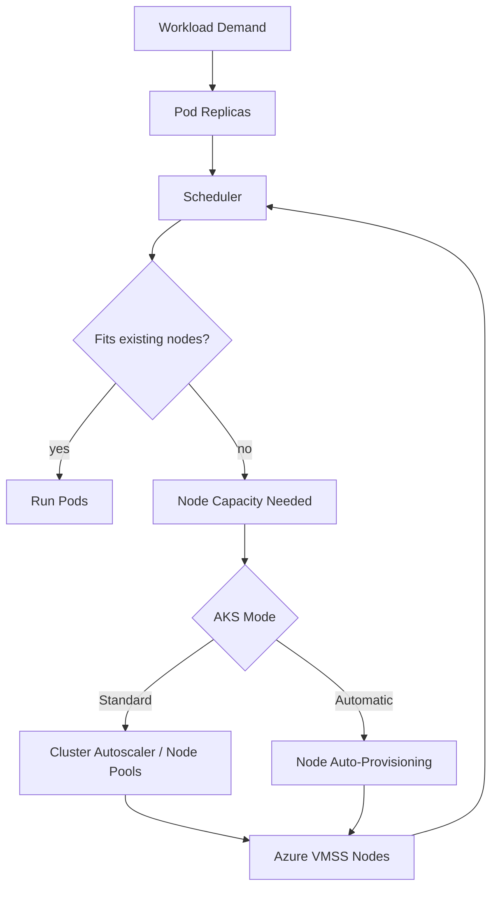
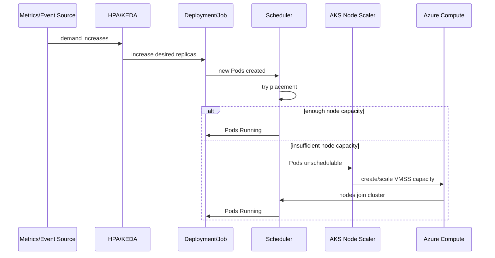
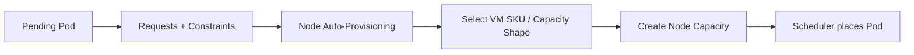
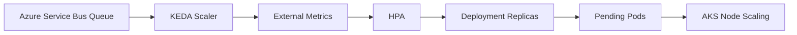
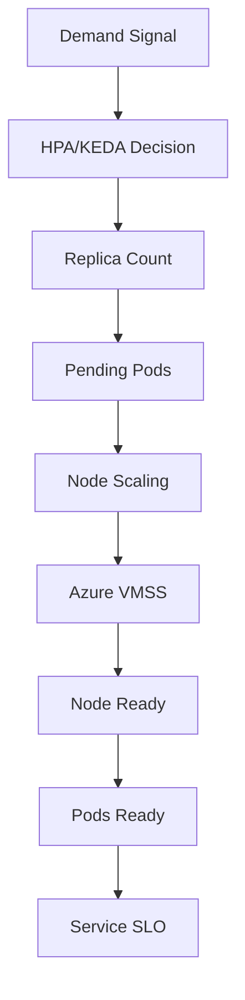
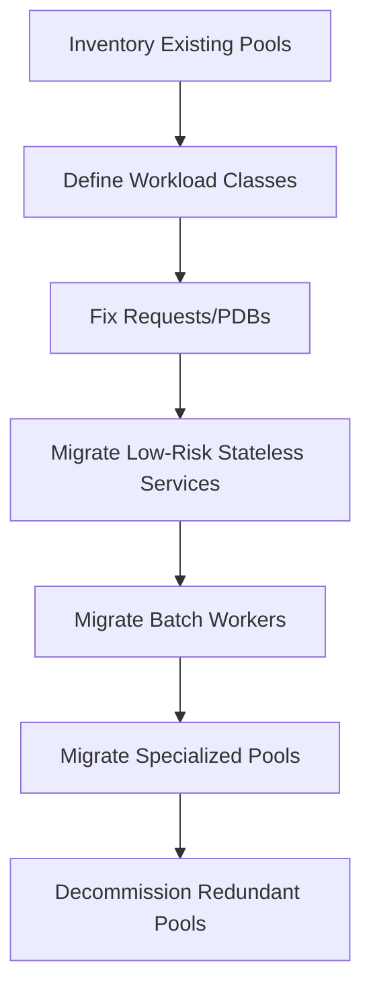

# Part 028 — AKS Automatic, Node Pools, and Scaling

AKS scaling is not a single feature.

It is a stack of decisions.

At the top, application teams scale Pods through replicas, HPA, or KEDA. Underneath that, the platform must decide whether existing nodes have enough allocatable CPU, memory, ephemeral storage, GPU, network, and zone capacity. If they do not, the cluster must create more nodes or provision a better fitting node shape.

In AKS, there are two broad operating models:

1. **AKS Standard**, where the platform team explicitly designs node pools and scaling behavior.
2. **AKS Automatic**, where Azure manages more of the node pool and node auto-provisioning behavior to reduce operational overhead.

The difference is not “manual vs automatic.”

The difference is ownership.



The invariant for this part:

> AKS compute scaling is safe only when workload requests, node pool design, autoscaler policy, disruption handling, and Azure infrastructure limits are treated as one system.

---

## 1. Mental Model: Three Scaling Loops

AKS production scaling usually involves three loops.

| Loop | Acts on | Trigger | Example |
|---|---|---|---|
| Replica loop | Pod count | CPU, memory, custom metric, queue lag, event count | HPA, KEDA |
| Scheduling loop | Pod placement | Pending Pods and constraints | Kubernetes scheduler |
| Node loop | Node count / node shape | Unschedulable Pods, underutilized nodes | Cluster Autoscaler, Node Auto-Provisioning |

Do not collapse them into one vague word: “autoscaling.”

They have different delays, signals, failure modes, and owners.



The most common mistake is tuning the replica loop while ignoring the node loop. HPA can create 100 Pods quickly; Azure still needs time to provision nodes, attach networking, and join them to the cluster.

---

## 2. AKS Standard vs AKS Automatic

### 2.1 AKS Standard

AKS Standard gives you explicit control over node pools.

You decide:

- number of node pools;
- VM sizes;
- min/max node count;
- zones;
- Spot or regular priority;
- system vs user pools;
- autoscaler profile;
- max pods per node;
- upgrade strategy;
- taints and labels;
- GPU/accelerator pools;
- OS SKU;
- workload placement policy.

This is powerful, but it is operationally expensive.

The platform team must continuously answer:

- Are the pools right-sized?
- Are VM SKUs still appropriate?
- Are we wasting idle capacity?
- Are workloads fragmented across pools?
- Are Spot pools safe?
- Are zones balanced?
- Are autoscaler settings correct?
- Are requests accurate enough for bin packing?

### 2.2 AKS Automatic

AKS Automatic shifts more of the node provisioning responsibility to Azure. It is designed to reduce the amount of manual node pool and infrastructure tuning needed by platform teams.

The important mental model:

> AKS Automatic optimizes the default compute platform, but it does not remove the need for correct workload contracts.

You still own:

- resource requests;
- limits where appropriate;
- readiness/liveness behavior;
- PDBs;
- topology requirements;
- application idempotency;
- identity;
- security policy;
- observability;
- SLOs;
- data durability;
- deployment behavior.

AKS Automatic can help select capacity. It cannot infer whether your worker can safely be interrupted or whether your service can tolerate a drain.

### 2.3 Decision Table

| Requirement | Prefer AKS Standard | Prefer AKS Automatic |
|---|---:|---:|
| Need precise VM SKU control | yes | maybe not |
| Want minimal node pool management | no | yes |
| Highly specialized GPU fleet | often yes | depends on supported capabilities |
| Regulated fixed infrastructure footprint | often yes | depends |
| Dynamic general-purpose workload mix | maybe | yes |
| Mature platform team with custom policies | yes | maybe |
| Small team wanting sane defaults | maybe | yes |
| Existing complex node pool taxonomy | yes | migration required |

Do not choose AKS Automatic just because “automatic sounds modern.” Choose it when the managed abstraction matches your operating model.

---

## 3. Node Pools in AKS Standard

A node pool is a group of AKS nodes with shared configuration, backed by Azure compute infrastructure.

Node pools are your compute product surface.

Bad node pool design creates invisible platform debt.

### 3.1 System vs User Node Pools

AKS separates the idea of system and user node pools.

| Pool type | Purpose | Production guidance |
|---|---|---|
| System | critical system components | keep stable, protected, and not overloaded by application workloads |
| User | application workloads | design by runtime class and scaling behavior |

Do not let arbitrary application workloads consume system pool capacity. Use taints, labels, and admission policies to protect it.

Example:

```bash
az aks nodepool add \
  --resource-group rg-platform-prod \
  --cluster-name aks-platform-prod \
  --name sysnp \
  --mode System \
  --node-count 3 \
  --node-vm-size Standard_D4s_v5
```

User pool:

```bash
az aks nodepool add \
  --resource-group rg-platform-prod \
  --cluster-name aks-platform-prod \
  --name general \
  --mode User \
  --node-vm-size Standard_D8s_v5 \
  --enable-cluster-autoscaler \
  --min-count 3 \
  --max-count 30 \
  --labels workload-class=general \
  --node-taints workload-class=general:NoSchedule
```

Application opt-in:

```yaml
tolerations:
  - key: workload-class
    operator: Equal
    value: general
    effect: NoSchedule
nodeSelector:
  workload-class: general
```

This makes placement explicit.

---

## 4. Designing an AKS Node Pool Catalog

Do not create node pools per team by default.

Create node pools per runtime class.

### 4.1 Practical Catalog

| Node pool | Purpose | Priority | Autoscaling |
|---|---|---|---|
| `system` | cluster/system add-ons | regular | fixed or conservative autoscale |
| `general` | ordinary stateless services | regular | broad min/max |
| `batchspot` | retryable batch/worker workloads | Spot | aggressive scale range |
| `memory` | memory-heavy workloads | regular | separate VM family |
| `compute` | CPU-heavy workloads | regular or Spot | scale by batch demand |
| `gpu` | ML/GPU workloads | regular/Spot depending on checkpointing | separate quota and scaling model |
| `regulated` | restricted workloads | regular | tighter min/max and policy |

### 4.2 Why Runtime Class Beats Team Pool

Team pool design:

```text
team-a-pool
team-b-pool
team-c-pool
```

Problems:

- low utilization per team;
- too many VMSS groups;
- inconsistent scaling;
- difficult quota planning;
- unclear security boundary;
- expensive idle buffers;
- slow platform evolution.

Runtime class design:

```text
general
batchspot
memory
compute
regulated
```

Benefits:

- shared capacity;
- simpler placement rules;
- better bin packing;
- consistent policy;
- easier cost analysis;
- easier migration to AKS Automatic or NAP later.

---

## 5. Node Auto-Provisioning

Node Auto-Provisioning is the idea that the platform can choose or create appropriate node capacity based on pending workload requirements rather than relying only on preselected node pools.

In AKS Automatic, node auto-provisioning is part of the managed experience. In AKS Standard, you may choose to enable supported node auto-provisioning features where appropriate.

The mental model is similar to Karpenter-style demand provisioning:



### 5.1 What NAP Improves

Node Auto-Provisioning helps with:

- reducing manual SKU selection;
- right-sizing capacity to workload demand;
- reducing idle buffers;
- supporting dynamic workload mixes;
- simplifying pool taxonomy;
- improving cost efficiency when requests are accurate.

### 5.2 What NAP Does Not Fix

It does not fix:

- bad resource requests;
- unsafe application shutdown;
- missing PDBs;
- wrong HPA/KEDA settings;
- impossible topology constraints;
- Azure quota limits;
- bad identity design;
- poor observability;
- stateful workload recovery flaws.

Automatic capacity is not automatic correctness.

---

## 6. Cluster Autoscaler in AKS Standard

Cluster Autoscaler adjusts node count based on pending Pods and underutilized nodes.

It does not invent a new VM shape. It scales existing autoscaler-enabled pools within configured min/max bounds.

### 6.1 Enable Autoscaler on Cluster Creation

```bash
az aks create \
  --resource-group rg-platform-prod \
  --name aks-platform-prod \
  --node-count 3 \
  --vm-set-type VirtualMachineScaleSets \
  --load-balancer-sku standard \
  --enable-cluster-autoscaler \
  --min-count 3 \
  --max-count 20
```

### 6.2 Enable Autoscaler on Node Pool

```bash
az aks nodepool update \
  --resource-group rg-platform-prod \
  --cluster-name aks-platform-prod \
  --name general \
  --enable-cluster-autoscaler \
  --min-count 3 \
  --max-count 50
```

### 6.3 Node Pool Min/Max Is a Product Decision

`min-count` is not just a cost setting. It defines warm capacity and failure tolerance.

`max-count` is not just a scalability setting. It defines blast radius, quota exposure, and budget risk.

| Setting | Too low | Too high |
|---|---|---|
| min-count | cold start, slow recovery, no zone buffer | wasted cost |
| max-count | scale-out failure | runaway cost, quota pressure |

A production platform should review min/max by workload class, not by guesswork.

---

## 7. Cluster Autoscaler Profile

AKS exposes a cluster autoscaler profile. A critical detail: profile settings are cluster-wide for autoscaler-enabled node pools.

That means one aggressive setting can affect multiple pools.

### 7.1 Important Profile Settings

| Setting | Meaning | Production concern |
|---|---|---|
| `scan-interval` | how often autoscaler evaluates scale changes | lower means faster but more churn/API calls |
| `scale-down-delay-after-add` | wait after scale-up before scale-down resumes | protects against oscillation |
| `scale-down-unneeded-time` | how long a node must be unneeded before removal | cost vs stability trade-off |
| `scale-down-utilization-threshold` | utilization threshold for scale-down eligibility | too high can disrupt too often |
| `max-graceful-termination-sec` | drain wait time | must align with app shutdown |
| `balance-similar-node-groups` | balances similar pools | important for zonal pools |
| `skip-nodes-with-local-storage` | protects local storage workloads | can block cost optimization |
| `new-pod-scale-up-delay` | wait before reacting to new pending Pods | useful for burst smoothing |

Example:

```bash
az aks update \
  --resource-group rg-platform-prod \
  --name aks-platform-prod \
  --cluster-autoscaler-profile \
    scan-interval=30s,scale-down-unneeded-time=15m,scale-down-delay-after-add=10m,balance-similar-node-groups=true
```

### 7.2 Tuning Principle

Do not tune autoscaler profile during a live incident unless you understand the current bottleneck.

A pending Pod may be caused by:

- insufficient node count;
- impossible node selector;
- missing toleration;
- quota failure;
- zone/storage conflict;
- too strict topology spread;
- node pool max reached;
- image pull delay;
- admission failure.

Increasing max nodes does nothing if the Pod cannot match the pool.

---

## 8. Zone-Aware Node Pool Design

Availability zones complicate node scaling.

A single multi-zone node pool is simple, but sometimes you need one node pool per zone for storage topology or balancing behavior.

### 8.1 Multi-Zone Pool

Pros:

- fewer pools;
- simpler management;
- shared capacity;
- less configuration.

Cons:

- less explicit zone count control;
- scale-down may affect balance;
- storage-bound workloads need careful review.

### 8.2 One Pool per Zone

Pros:

- explicit zone capacity;
- easier storage topology alignment;
- better control for regulated workloads;
- useful with `balance-similar-node-groups`.

Cons:

- more pools;
- more autoscaler complexity;
- more min-count cost;
- harder platform operations.

### 8.3 Workload Zone Spread

For highly available services:

```yaml
topologySpreadConstraints:
  - maxSkew: 1
    topologyKey: topology.kubernetes.io/zone
    whenUnsatisfiable: DoNotSchedule
    labelSelector:
      matchLabels:
        app: checkout-api
```

But remember: `DoNotSchedule` is a hard constraint. If capacity is unavailable in one zone, Pods may remain pending instead of running less balanced.

Use `ScheduleAnyway` when availability balance is desirable but not worth blocking startup.

---

## 9. Spot Node Pools in AKS

Azure Spot can reduce cost for interruption-tolerant workloads.

But Spot is not a discount flag. It is a different failure model.

### 9.1 Suitable Workloads

Good candidates:

- idempotent queue workers;
- retryable batch jobs;
- stateless non-critical processors;
- dev/test workloads;
- ML training with checkpointing.

Poor candidates:

- singleton services;
- stateful databases;
- latency-critical APIs with low replica count;
- platform add-ons;
- workloads without graceful shutdown;
- workloads requiring fixed capacity guarantees.

### 9.2 Spot Pool Example

```bash
az aks nodepool add \
  --resource-group rg-platform-prod \
  --cluster-name aks-platform-prod \
  --name batchspot \
  --priority Spot \
  --eviction-policy Delete \
  --spot-max-price -1 \
  --node-vm-size Standard_D8s_v5 \
  --enable-cluster-autoscaler \
  --min-count 0 \
  --max-count 100 \
  --labels workload-class=batchspot kubernetes.azure.com/scalesetpriority=spot \
  --node-taints kubernetes.azure.com/scalesetpriority=spot:NoSchedule workload-class=batchspot:NoSchedule
```

Workload opt-in:

```yaml
tolerations:
  - key: kubernetes.azure.com/scalesetpriority
    operator: Equal
    value: spot
    effect: NoSchedule
  - key: workload-class
    operator: Equal
    value: batchspot
    effect: NoSchedule
nodeSelector:
  workload-class: batchspot
```

### 9.3 Spot Correctness Checklist

A Spot workload must answer:

- Can it be killed and retried?
- Is duplicate execution safe?
- Are messages acknowledged after durable completion?
- Is checkpointing implemented for long jobs?
- Is there a dead-letter path?
- Is shutdown graceful?
- Is capacity fallback needed?
- Is SLO separate from regular workloads?

If those answers are weak, the workload is not Spot-ready.

---

## 10. KEDA on AKS

KEDA is especially important in Azure because many workloads scale from Azure-native event sources:

- Azure Service Bus;
- Azure Event Hubs;
- Azure Storage Queue;
- Azure Monitor metrics;
- Kafka;
- Prometheus;
- cron schedules;
- external scalers.

KEDA is not a replacement for HPA. It can feed external metrics into HPA and define event-driven scaling rules.



### 10.1 ScaledObject Example

```yaml
apiVersion: keda.sh/v1alpha1
kind: ScaledObject
metadata:
  name: invoice-worker-scale
spec:
  scaleTargetRef:
    name: invoice-worker
  minReplicaCount: 0
  maxReplicaCount: 100
  pollingInterval: 15
  cooldownPeriod: 300
  triggers:
    - type: azure-servicebus
      metadata:
        queueName: invoice-export
        namespace: sb-prod-payments
        messageCount: "20"
      authenticationRef:
        name: invoice-worker-auth
```

### 10.2 KEDA + Workload Identity

Avoid connection strings in Kubernetes Secrets when possible. Prefer Workload Identity so KEDA can access Azure metrics/event sources using federated identity.

Conceptual auth object:

```yaml
apiVersion: keda.sh/v1alpha1
kind: TriggerAuthentication
metadata:
  name: invoice-worker-auth
spec:
  podIdentity:
    provider: azure-workload
```

Then bind the right identity to the KEDA/operator path according to the scaler requirements.

### 10.3 KEDA Failure Modes

| Failure | Effect |
|---|---|
| wrong metric source identity | scaler cannot read queue/metric |
| maxReplicaCount too low | backlog grows |
| polling too slow | delayed reaction |
| cooldown too short | oscillation |
| workload cold start too slow | queue latency spikes |
| node pool max too low | replicas created but Pods pending |
| minReplicaCount zero for latency-sensitive worker | first event waits for cold start |

KEDA gives you elasticity. It does not remove the need for latency budgeting.

---

## 11. Requests, Limits, and Bin Packing in AKS

Node scaling depends on requests.

If requests are fiction, node scaling is fiction.

### 11.1 Bad Request Example

```yaml
resources:
  requests:
    cpu: 50m
    memory: 128Mi
  limits:
    cpu: "4"
    memory: 8Gi
```

This workload schedules like a tiny Pod but can behave like a huge Pod.

In AKS, this can cause:

- node memory pressure;
- CPU contention;
- noisy neighbor impact;
- evictions;
- poor autoscaler decisions;
- misleading cost allocation.

### 11.2 Better Request Example

```yaml
resources:
  requests:
    cpu: 750m
    memory: 1Gi
  limits:
    memory: 2Gi
```

Use observed p95/p99 behavior, load tests, and VPA recommendations to tune requests.

### 11.3 Bin Packing Formula

For a rough node fit calculation:

```text
usable_cpu = node_allocatable_cpu - daemonset_cpu - system_buffer
usable_memory = node_allocatable_memory - daemonset_memory - system_buffer
max_pods_by_cpu = floor(usable_cpu / pod_cpu_request)
max_pods_by_memory = floor(usable_memory / pod_memory_request)
actual_fit = min(max_pods_by_cpu, max_pods_by_memory, max_pods_limit, network_limit)
```

Never estimate node capacity from VM size alone. Use Kubernetes allocatable.

```bash
kubectl describe node <node-name> | grep -A8 Allocatable
```

---

## 12. Max Pods, Networking, and IP Capacity

AKS scaling is tied to networking mode.

Azure CNI Overlay, Azure CNI Pod Subnet, and legacy models have different IP planning implications.

The scheduler may think CPU/memory fits, but the cluster can still fail if network capacity or max pod settings are wrong.

### 12.1 Capacity Questions

Ask:

- What is max Pods per node?
- What networking mode is used?
- Does each Pod consume VNet IP or overlay IP?
- Are subnets sized for peak node count?
- Are NAT gateway/SNAT limits sufficient?
- Are NSG/UDR rules compatible with scale-out?
- Are private DNS zones correct for private cluster dependencies?

### 12.2 Scale-Out Failure Pattern

Symptoms:

```text
Pods pending despite autoscaler enabled
Nodes created slowly or not at all
CNI errors in Pod events
IP exhaustion or subnet allocation errors
```

Root causes:

- subnet too small;
- max pods per node too low;
- NAT/SNAT exhaustion;
- route table limits;
- Azure quota limits;
- incompatible node pool networking configuration.

This is why Part 017 exists. Networking is capacity.

---

## 13. Upgrade and Scaling Interaction

Node pool upgrades and autoscaling interact.

During upgrade, AKS may surge nodes, drain old nodes, and reschedule Pods. If your node pool max count, subnet IP capacity, or quota is too tight, upgrade can fail or cause disruption.

### 13.1 Upgrade Readiness Checklist

Before node pool upgrade:

- check PDBs;
- check max surge behavior;
- check node pool max count;
- check subnet IP headroom;
- check Azure regional quota;
- check Pod topology spread;
- check system pool capacity;
- check workload readiness probes;
- check long-running jobs;
- pause risky batch workloads if needed.

### 13.2 PDB Trap

A one-replica service with this PDB blocks voluntary disruption:

```yaml
apiVersion: policy/v1
kind: PodDisruptionBudget
metadata:
  name: admin-ui-pdb
spec:
  minAvailable: 1
  selector:
    matchLabels:
      app: admin-ui
```

Fix availability first:

- run two or more replicas;
- make the app stateless;
- add readiness probe;
- use topology spread;
- then apply PDB.

PDBs are not a substitute for redundancy.

---

## 14. Workload Placement Contract

Application teams should not directly choose arbitrary node pools.

They should choose from supported workload classes.

Example platform contract:

| Workload class | Use for | Guarantees | Restrictions |
|---|---|---|---|
| `general` | stateless APIs | stable regular nodes | requests and PDB required |
| `batchspot` | retryable workers | low cost, interruptible | idempotency required |
| `memory` | memory-heavy services | larger memory nodes | approval required |
| `gpu` | ML workloads | accelerator capacity | quota and checkpointing required |
| `regulated` | sensitive workloads | stricter placement/security | policy exception process |

Example workload:

```yaml
apiVersion: apps/v1
kind: Deployment
metadata:
  name: settlement-api
spec:
  replicas: 6
  selector:
    matchLabels:
      app: settlement-api
  template:
    metadata:
      labels:
        app: settlement-api
        workload-class: general
    spec:
      nodeSelector:
        workload-class: general
      tolerations:
        - key: workload-class
          operator: Equal
          value: general
          effect: NoSchedule
      topologySpreadConstraints:
        - maxSkew: 1
          topologyKey: topology.kubernetes.io/zone
          whenUnsatisfiable: ScheduleAnyway
          labelSelector:
            matchLabels:
              app: settlement-api
      containers:
        - name: api
          image: registry.example.com/settlement-api@sha256:...
          resources:
            requests:
              cpu: 500m
              memory: 768Mi
            limits:
              memory: 1536Mi
```

---

## 15. Cost Engineering for AKS Scaling

Cost is mostly decided before the invoice arrives.

It is decided in:

- resource requests;
- min replicas;
- min node count;
- VM SKU selection;
- Spot eligibility;
- topology spread strictness;
- node pool fragmentation;
- DaemonSet footprint;
- logging volume;
- idle environments;
- upgrade surge capacity.

### 15.1 Cost Review Table

| Cost driver | Review question |
|---|---|
| CPU request | Is p95 usage close to request? |
| memory request | Is request based on real working set? |
| node min count | Is warm capacity justified by SLO? |
| node max count | Is runaway scale protected? |
| VM SKU | Is the pool shape still valid? |
| Spot | Which workloads are truly interruptible? |
| topology spread | Is hard spread required or desirable? |
| DaemonSets | How much capacity does every node lose? |
| logs | Are noisy workloads generating avoidable cost? |

### 15.2 Showback by Workload Class

At minimum, report cost by:

- cluster;
- namespace;
- workload class;
- node pool;
- environment;
- owning team;
- application;
- cost center.

Required labels:

```yaml
metadata:
  labels:
    app.kubernetes.io/name: settlement-api
    platform.example.com/team: payments
    platform.example.com/cost-center: cc-payments
    platform.example.com/workload-class: general
    platform.example.com/environment: prod
```

---

## 16. Observability for AKS Scaling

Scaling incidents are hard when you only observe CPU.

You need a full path view.



### 16.1 Metrics

Track:

- HPA desired/current replicas;
- KEDA scaler activity;
- pending Pods by reason;
- unschedulable events;
- node pool current/min/max;
- node provisioning duration;
- node readiness duration;
- Pod startup duration;
- queue lag;
- service latency;
- node allocatable vs requested;
- node pool utilization;
- scale-down events;
- PDB blocking events;
- Azure quota headroom;
- subnet IP headroom.

### 16.2 Useful Commands

```bash
kubectl get hpa -A
kubectl get scaledobjects -A
kubectl get pods -A --field-selector=status.phase=Pending
kubectl describe pod -n <ns> <pod>
kubectl get nodes -L agentpool,topology.kubernetes.io/zone,kubernetes.azure.com/scalesetpriority
kubectl describe node <node>
kubectl get events -A --sort-by=.lastTimestamp
kubectl get pdb -A
```

Azure CLI:

```bash
az aks nodepool list \
  --resource-group rg-platform-prod \
  --cluster-name aks-platform-prod \
  --output table

az aks show \
  --resource-group rg-platform-prod \
  --name aks-platform-prod \
  --query "agentPoolProfiles[].{name:name,count:count,min:minCount,max:maxCount,vmSize:vmSize,mode:mode}"
```

---

## 17. Failure Modes and Runbooks

### 17.1 HPA Scales Up, Pods Pending

Symptoms:

- HPA desired replicas increases;
- many Pods pending;
- node count not increasing or max reached.

Possible causes:

- node pool max count reached;
- Cluster Autoscaler disabled;
- AKS Automatic/NAP cannot satisfy constraints;
- node selector does not match any scalable pool;
- missing toleration;
- quota exhausted;
- subnet/IP exhaustion;
- topology spread impossible;
- resource requests too large for available SKUs.

Runbook:

```bash
kubectl describe pod <pending-pod>
kubectl get events -A --sort-by=.lastTimestamp
kubectl get nodes -L agentpool
az aks nodepool list --resource-group <rg> --cluster-name <cluster> -o table
az vm list-usage --location <region> -o table
```

Then classify:

| Event says | Likely fix |
|---|---|
| insufficient cpu/memory | increase max nodes, adjust requests, add suitable pool |
| node affinity/selector mismatch | fix placement contract |
| untolerated taint | add toleration or use correct pool |
| volume node affinity conflict | check zone/storage topology |
| quota exceeded | request quota or reduce scale target |
| IP allocation failure | fix subnet/network planning |

### 17.2 Nodes Scale Up, Pods Not Ready

Possible causes:

- image pull too slow;
- app startup too slow;
- readiness probe wrong;
- missing secret/config;
- workload identity failure;
- downstream dependency unavailable;
- node lacks required daemon/plugin;
- DNS or egress failure.

Autoscaler did its job. The application contract failed.

### 17.3 Scale Down Does Not Happen

Possible causes:

- nodes not below utilization threshold;
- PDB blocks drain;
- local storage policy prevents deletion;
- system Pods on node;
- DaemonSet utilization counted;
- scale-down delay not elapsed;
- recent scale-up reset timer;
- node pool min count too high;
- long graceful termination.

Runbook:

```bash
kubectl get pdb -A
kubectl describe node <node>
kubectl get pods -A -o wide --field-selector spec.nodeName=<node>
```

Then inspect autoscaler logs through AKS control plane diagnostics.

### 17.4 KEDA Does Not Scale

Possible causes:

- ScaledObject wrong target;
- TriggerAuthentication wrong;
- workload identity missing;
- metric source unreachable;
- queue name/namespace wrong;
- external metric adapter conflict;
- maxReplicaCount too low;
- cooldown hides expected behavior.

Runbook:

```bash
kubectl get scaledobject -A
kubectl describe scaledobject -n <ns> <name>
kubectl get hpa -n <ns>
kubectl describe hpa -n <ns> <name>
kubectl logs -n keda deploy/keda-operator
```

---

## 18. AKS Automatic Migration Considerations

Moving from AKS Standard to AKS Automatic or NAP-style behavior is not only a compute migration.

It changes how teams request capacity.

### 18.1 Prepare Inventory

Inventory:

- node pools;
- VM SKUs;
- taints/labels;
- workload selectors;
- PDBs;
- HPA/KEDA configs;
- system add-ons;
- network mode;
- storage classes;
- GPU needs;
- Spot workloads;
- quota usage;
- cost by pool;
- disruption history.

### 18.2 Normalize Workload Contracts

Before migration, standardize:

- resource requests;
- workload class labels;
- topology spread;
- PDBs;
- readiness probes;
- identity model;
- cost labels;
- security context;
- namespace policy.

Do not migrate a chaotic cluster and expect Automatic mode to produce a clean platform.

### 18.3 Use Class-by-Class Migration

Migration sequence:



Avoid migrating regulated, GPU, or stateful workloads first.

---

## 19. Platform Guardrails

Use policy to prevent invalid scaling contracts.

### 19.1 Required Requests

Reject Pods without CPU/memory requests.

Conceptual policy:

```yaml
validate:
  message: "containers must define cpu and memory requests"
  pattern:
    spec:
      containers:
        - resources:
            requests:
              cpu: "?*"
              memory: "?*"
```

### 19.2 Prevent Random System Pool Scheduling

Reject application workloads scheduled to system pool unless explicitly allowed.

### 19.3 Require PDB for Production Services

For Deployments with production label and replicas greater than one, require a matching PDB.

### 19.4 Guard Spot Usage

Allow Spot only for workloads marked interruptible:

```yaml
metadata:
  labels:
    platform.example.com/interruptible: "true"
```

Admission policy can reject Spot tolerations without this label.

---

## 20. Hands-On Lab

Goal: design an AKS scaling architecture for a production case-management platform.

### 20.1 Workloads

1. `case-api`: latency-sensitive REST API, Java, 6–80 replicas.
2. `workflow-worker`: async worker, event-driven, 0–200 replicas.
3. `report-export`: batch job, retryable, CPU-heavy.
4. `audit-ingestor`: high-throughput consumer, must not lose data.
5. `admin-ui`: low traffic, internal service, 2 replicas.

### 20.2 Tasks

Design:

- AKS Standard node pool catalog or AKS Automatic adoption plan;
- workload placement rules;
- HPA/KEDA rules;
- PDBs;
- topology spread;
- Spot eligibility;
- min/max node count;
- autoscaler profile;
- observability dashboard;
- incident runbook.

### 20.3 Expected Design Direction

`case-api` belongs on stable regular capacity with zone spread and conservative PDB.

`workflow-worker` can use KEDA and possibly Spot only if work is idempotent and checkpointed.

`report-export` can use CPU/Spot batch capacity if restart is safe.

`audit-ingestor` requires careful offset/acknowledgement semantics and should not blindly use Spot.

`admin-ui` needs redundancy, but not aggressive scaling.

---

## 21. Production Summary

AKS scaling becomes production-grade when you stop treating it as a switch and start treating it as an operating model.

The key ideas:

- AKS Standard gives explicit control over node pools;
- AKS Automatic delegates more node provisioning and right-sizing to Azure;
- Node Auto-Provisioning reduces manual SKU and pool management but still depends on correct workload contracts;
- Cluster Autoscaler scales existing pools within min/max limits;
- KEDA is essential for event-driven Azure workloads;
- requests are the currency of scheduling and scaling;
- PDBs and graceful shutdown determine drain safety;
- zones, storage, and networking are capacity constraints;
- autoscaler profile is cluster-wide and must be tuned carefully;
- Spot is safe only for interruption-tolerant semantics;
- observability must cover the full path from demand signal to ready Pod.

The mature AKS platform makes capacity feel invisible to application teams, but not because capacity is simple.

It feels invisible because the platform has encoded the hard decisions into safe defaults, workload classes, policy, and runbooks.

---

## References

- Microsoft Learn — AKS scaling concepts: https://learn.microsoft.com/en-us/azure/aks/concepts-scale
- Microsoft Learn — Use the Cluster Autoscaler in AKS: https://learn.microsoft.com/en-us/azure/aks/cluster-autoscaler
- Microsoft Learn — Scale node pools in AKS: https://learn.microsoft.com/en-us/azure/aks/scale-node-pools
- Microsoft Learn — AKS cost optimization best practices: https://learn.microsoft.com/en-us/azure/aks/best-practices-cost
- Microsoft Learn — AKS performance and scaling best practices: https://learn.microsoft.com/en-us/azure/aks/best-practices-performance-scale
- Microsoft Learn — KEDA in AKS: https://learn.microsoft.com/en-us/azure/aks/keda-about
- Microsoft Learn — Integrate KEDA with AKS and Azure Monitor: https://learn.microsoft.com/en-us/azure/azure-monitor/containers/integrate-keda
- Kubernetes — Horizontal Pod Autoscaling: https://kubernetes.io/docs/tasks/run-application/horizontal-pod-autoscale/
- Kubernetes — Assign Pods to Nodes: https://kubernetes.io/docs/concepts/scheduling-eviction/assign-pod-node/
- Kubernetes — Pod Disruption Budgets: https://kubernetes.io/docs/tasks/run-application/configure-pdb/
