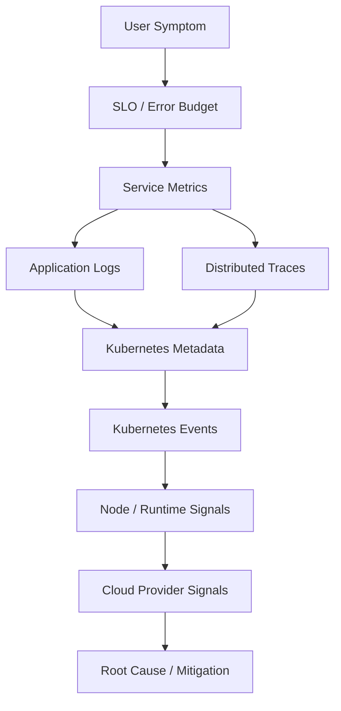
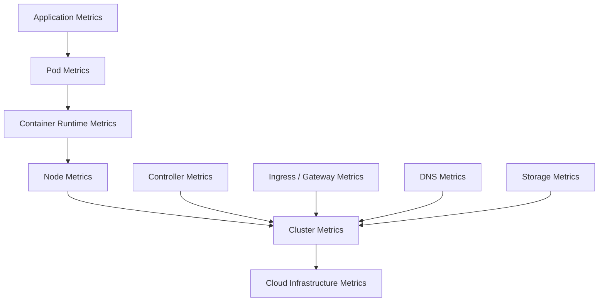
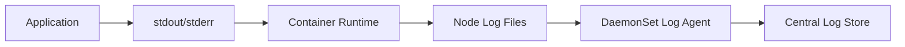
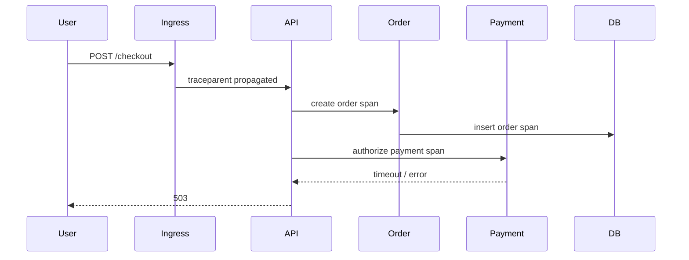
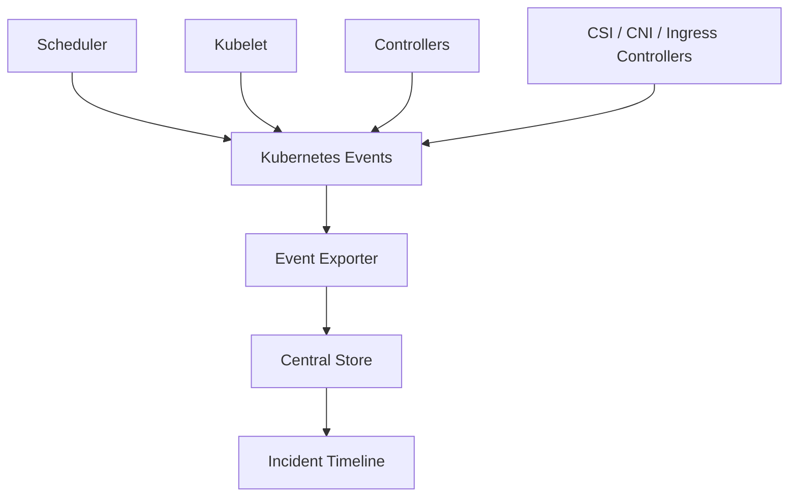
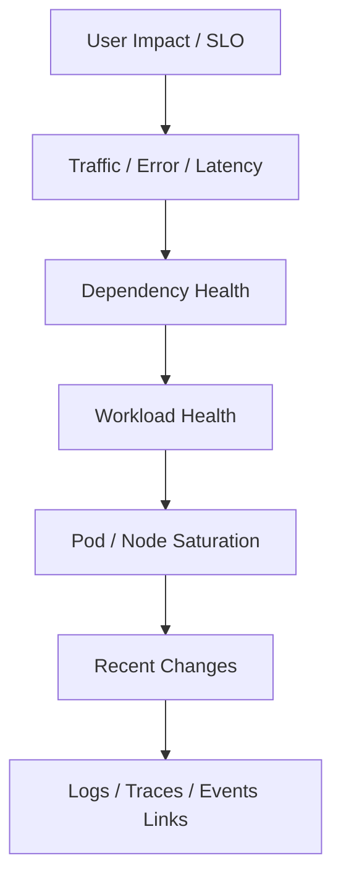
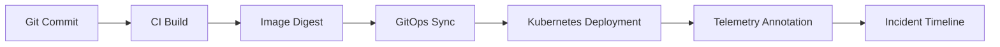
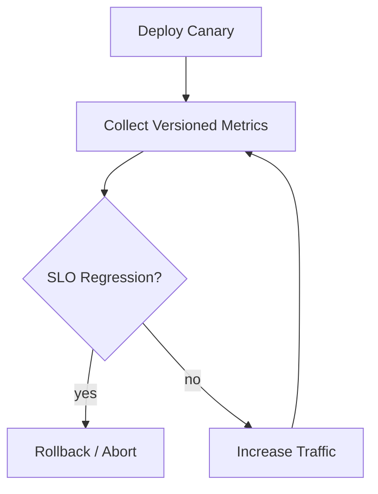
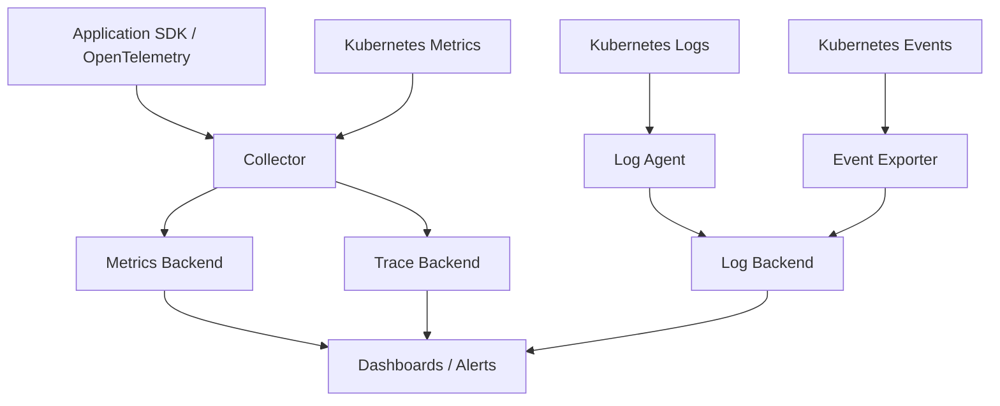
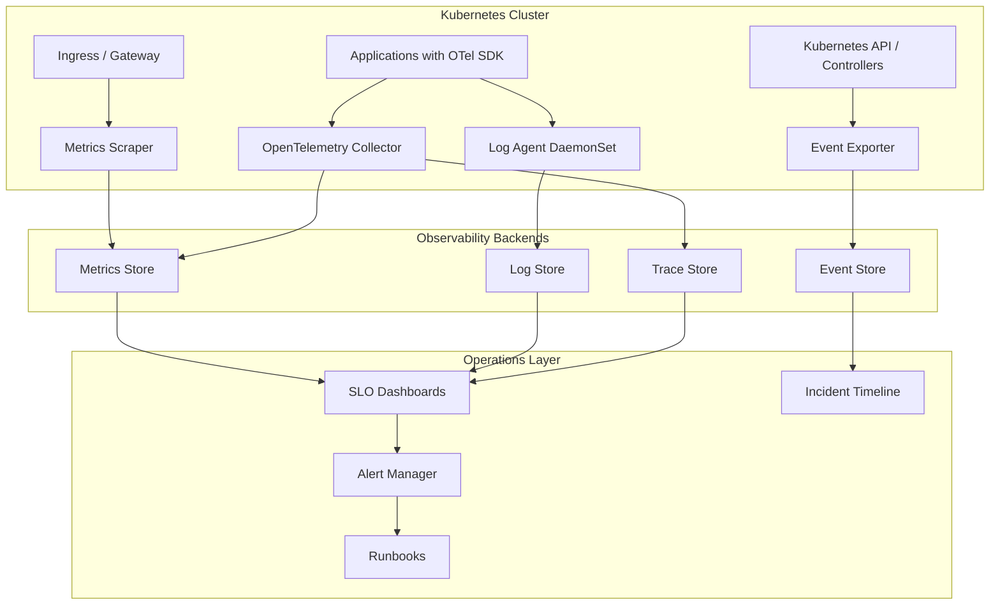

# Part 029 — Observability Foundation: Logs, Metrics, Traces, and Events

Observability is not the same as installing Prometheus, Grafana, CloudWatch, Azure Monitor, Loki, OpenTelemetry, or any other tool.

Those are instruments.

Observability is the ability to answer operational questions from external evidence:

- Is the system healthy?
- Which users are affected?
- What changed?
- Which component is the bottleneck?
- Is this a workload failure, node failure, network failure, dependency failure, or control-plane failure?
- Is the service violating its SLO?
- Can we prove the incident timeline?
- Can we debug it without SSH-ing into nodes or guessing from incomplete logs?

In Kubernetes, this is harder than in a static VM platform because applications are ephemeral, Pods are replaced, nodes are drained, endpoints are dynamic, controllers reconcile asynchronously, and failures often cross layers.

The invariant for this part:

> Kubernetes observability is reliable only when metrics, logs, traces, events, metadata, and SLOs are designed as one evidence system.

---

## 1. The Real Problem

A weak Kubernetes observability setup usually fails in the same way:

1. dashboards exist but do not explain user impact;
2. alerts fire but do not point to ownership or next action;
3. logs exist but cannot be correlated with request, Pod, node, deployment, or trace identity;
4. metrics exist but have uncontrolled cardinality or missing labels;
5. traces exist but stop at the ingress boundary or lose async context;
6. Kubernetes events exist but expire before someone investigates;
7. cloud logs exist but are separated from cluster and application signals;
8. incident reviews rely on screenshots and tribal memory.

A production-grade observability platform solves for evidence quality, not tool count.



The signal chain must be continuous.

If there is a gap between user symptom and infrastructure evidence, incident handling becomes speculation.

---

## 2. Observability vs Monitoring

Monitoring asks:

> Did a known condition happen?

Observability asks:

> Can we understand an unknown condition from emitted evidence?

You need both.

| Capability | Monitoring | Observability |
|---|---|---|
| Primary question | Is known thing broken? | Why is unknown thing happening? |
| Input | Predefined thresholds | Rich telemetry and metadata |
| Output | Alert | Explanation path |
| Example | CPU > 90% | Requests to checkout fail only on zone B after rollout |
| Failure mode | Alert fatigue | Data overload / poor correlation |

In production Kubernetes, monitoring without observability creates noisy alerts. Observability without monitoring creates beautiful dashboards that nobody watches.

---

## 3. The Four Evidence Streams

Kubernetes observability has at least four evidence streams.

| Stream | Best at answering | Weakness |
|---|---|---|
| Metrics | How much? How often? How fast? | Usually loses per-request detail |
| Logs | What happened at a point in code? | Expensive, noisy, hard to aggregate |
| Traces | Where did one request spend time? | Requires instrumentation and context propagation |
| Events | What did Kubernetes decide? | Short retention, not a durable audit log |

A mature platform also collects:

- audit logs;
- cloud load balancer logs;
- VPC/VNet flow logs;
- DNS logs;
- controller logs;
- admission webhook logs;
- deployment metadata;
- CI/CD release metadata;
- feature flag changes;
- incident timeline annotations.

But the four core evidence streams are the foundation.

---

## 4. Metrics Mental Model

Metrics are structured numeric measurements over time.

They are excellent for:

- trend detection;
- alerting;
- SLO evaluation;
- saturation analysis;
- capacity planning;
- rollout comparison;
- anomaly detection;
- fleet-level aggregation.

They are weak for:

- exact request reconstruction;
- detailed business context;
- long exception payloads;
- high-cardinality identifiers;
- causal narratives.

### 4.1 Metric Types

| Type | Meaning | Example |
|---|---|---|
| Counter | Monotonically increasing count | `http_requests_total` |
| Gauge | Current value | `queue_depth` |
| Histogram | Distribution buckets | `http_request_duration_seconds_bucket` |
| Summary | Client-side distribution | Less common in centralized Prometheus setups |

For production services, prefer histograms for latency. Average latency hides tail behavior.

Bad:

```text
avg_latency_ms = 120
```

Better:

```text
p50 = 80ms
p90 = 220ms
p99 = 1300ms
```

The p99 is often where user pain lives.

### 4.2 Golden Signals

For user-facing services, start with four signals:

| Signal | Meaning | Common Metric |
|---|---|---|
| Latency | How long requests take | request duration histogram |
| Traffic | How much demand arrives | requests/sec |
| Errors | How many requests fail | error rate by class |
| Saturation | How close resources are to limits | CPU, memory, queue, connection pool, thread pool |

For infrastructure, use USE:

| Signal | Meaning | Example |
|---|---|---|
| Utilization | How busy resource is | CPU utilization |
| Saturation | How much queued demand exists | disk queue, pending Pods |
| Errors | Explicit failure count | network drops, disk errors |

### 4.3 Kubernetes Metrics Layers



You need metrics at each layer.

| Layer | Examples | Failure detected |
|---|---|---|
| Application | request rate, error rate, latency, queue lag | service regression |
| Pod/container | restarts, CPU, memory, throttling | resource pressure |
| Node | allocatable, disk pressure, network drops | node saturation |
| Cluster | pending Pods, API server latency, scheduling latency | platform bottleneck |
| Ingress/gateway | 4xx/5xx, target health, TLS errors | edge failures |
| Cloud | load balancer, NAT, storage, IAM, DNS | provider integration failures |

### 4.4 Cardinality Discipline

Cardinality is the number of unique time series produced by a metric.

This metric is dangerous:

```text
http_requests_total{user_id="123", order_id="A-999", path="/orders/123/items/456"}
```

Why?

Because every user, order, and path variant creates new time series.

Better:

```text
http_requests_total{method="GET", route="/orders/{orderId}/items/{itemId}", status_class="2xx"}
```

Use bounded labels:

- service;
- namespace;
- route template;
- method;
- status class;
- error class;
- dependency name;
- region;
- zone;
- version;
- workload;
- tenant tier, if bounded.

Avoid unbounded labels:

- user ID;
- session ID;
- order ID;
- email;
- request ID;
- IP address;
- raw URL;
- exception message;
- SQL query text;
- Kubernetes Pod UID as primary business dimension.

The invariant:

> Metrics are for aggregation; logs and traces are for high-cardinality detail.

---

## 5. Logs Mental Model

Logs are timestamped records of application or system events.

They are useful when they are structured, correlated, and intentionally emitted.

They are harmful when they are treated as a dumping ground.

### 5.1 Kubernetes Logging Contract

In Kubernetes, application containers should generally write logs to stdout/stderr. The node/container runtime handles capture; a logging agent ships logs to central storage.



The application should not assume local log files survive Pod restart or node replacement.

### 5.2 Structured Logging

Bad:

```text
Payment failed for user 123, order A-999, timeout from gateway
```

Better:

```json
{
  "timestamp": "2026-07-03T09:15:21Z",
  "level": "ERROR",
  "service": "payment-api",
  "env": "prod",
  "trace_id": "8f2c1d...",
  "span_id": "41a7...",
  "request_id": "req-7c2e",
  "tenant_id": "tenant-42",
  "operation": "authorize_payment",
  "dependency": "card-gateway",
  "error_class": "dependency_timeout",
  "duration_ms": 3012,
  "message": "Payment authorization timed out"
}
```

Structured logs make query, aggregation, and correlation possible.

### 5.3 Log Levels

| Level | Meaning | Production guidance |
|---|---|---|
| DEBUG | Detailed diagnostic context | Disabled or sampled in prod by default |
| INFO | Important state transitions | Useful but bounded |
| WARN | Recoverable abnormal condition | Must be actionable or suppressible |
| ERROR | Failed operation requiring attention | Must include error class and correlation ID |
| FATAL | Process cannot continue | Rare; process exits |

Do not use `ERROR` for expected business rejections.

A payment declined by issuer is not necessarily an application error.

A timeout to issuer is.

### 5.4 Logs Must Carry Identity

Every log line should be joinable to:

- service name;
- environment;
- version/build SHA;
- namespace;
- pod name;
- container name;
- node name;
- trace ID;
- span ID;
- request ID;
- tenant/customer context, if safe;
- operation name;
- dependency name;
- error class.

Kubernetes metadata can be enriched by collectors, but application-level correlation IDs must come from the app or middleware.

### 5.5 Log Sampling

High-volume systems need sampling.

But sample carefully.

Good candidates for sampling:

- successful debug-level request logs;
- high-volume health checks;
- repeated expected validation failures;
- duplicate dependency warnings.

Bad candidates for blind sampling:

- errors;
- security events;
- payment events;
- audit events;
- rare tail-latency samples;
- workflow state transitions.

The platform should support dynamic log-level change, but it must be controlled and time-bound.

---

## 6. Traces Mental Model

A trace represents one request or workflow path across components.

A span represents one operation inside that path.



Traces are strongest for:

- latency breakdown;
- dependency fan-out;
- critical path analysis;
- retries;
- cascading failures;
- async propagation;
- request-specific debugging.

They are weak for fleet-level alerting unless converted into metrics.

### 6.1 Trace Context Propagation

Every ingress request should receive or create a trace context.

That context must propagate through:

- HTTP headers;
- gRPC metadata;
- messaging headers;
- async jobs;
- scheduled workflows;
- outbound dependency calls.

For W3C Trace Context, the key header is usually:

```text
traceparent
```

If trace context stops at the first async boundary, distributed tracing becomes partial storytelling.

### 6.2 Span Naming

Bad span names:

```text
GET
callService
process
query
```

Good span names:

```text
HTTP POST /checkout
OrderService.createOrder
PaymentGateway.authorize
PostgreSQL orders.insert
Kafka publish order-created
```

A span name must identify intent, not just technology.

### 6.3 Sampling Strategy

Tracing everything is expensive at scale.

Common strategies:

| Strategy | Use case | Risk |
|---|---|---|
| Head sampling | Decide at request start | May drop interesting failures |
| Tail sampling | Decide after seeing outcome | More powerful, more infrastructure |
| Error-biased sampling | Keep failed traces | May miss slow successful requests |
| Route-based sampling | Keep critical routes more often | Requires route taxonomy |
| Tenant-tier sampling | Higher fidelity for premium/regulated tenants | Governance complexity |

For serious platforms, start with:

- keep all error traces;
- keep high-latency traces;
- sample successful traces;
- preserve traces for critical business operations;
- ensure sampling decisions are documented.

---

## 7. Kubernetes Events Mental Model

Kubernetes Events describe decisions and observations made by Kubernetes components.

Examples:

- failed scheduling;
- image pull failure;
- probe failure;
- backoff;
- volume attach failure;
- node not ready;
- killing container;
- scaled ReplicaSet;
- load balancer provisioning error.

Events are operational gold, but they are not a durable event store.

A production platform should export Kubernetes events to central storage.



### 7.1 Event Categories

| Category | Example | Likely owner |
|---|---|---|
| Scheduling | insufficient CPU, taint mismatch | platform + app |
| Image | pull backoff, auth failure | app/platform |
| Runtime | crash loop, OOMKilled | app |
| Network | endpoint not ready, LB provisioning fail | platform |
| Storage | PVC pending, attach timeout | platform/data |
| Policy | admission denied | platform/security |
| Node | node not ready, disk pressure | platform/cloud |

### 7.2 Event Retention Problem

Native event retention is limited. During noisy failures, important context can disappear or be compacted before humans inspect it.

Therefore:

- export events;
- normalize event fields;
- correlate events with workload, version, node, and deployment;
- attach event timeline to incidents;
- alert on selected event patterns.

Do not use events as your only observability source. Use them as control-plane evidence.

---

## 8. Metadata Is the Join Key

Telemetry without metadata creates isolated evidence.

Every signal should be joinable by common dimensions.

### 8.1 Required Kubernetes Dimensions

| Dimension | Why it matters |
|---|---|
| cluster | multi-cluster routing and ownership |
| cloud provider | AWS/Azure comparison |
| region | regional incident isolation |
| zone | AZ/zone failure detection |
| namespace | tenant/team boundary |
| workload | application ownership |
| pod | runtime instance |
| container | sidecar/main distinction |
| node | infrastructure correlation |
| image digest | artifact identity |
| app version | rollout diagnosis |
| deployment revision | change correlation |

### 8.2 Required Business Dimensions

Use bounded dimensions only.

| Dimension | Example |
|---|---|
| product domain | billing, order, case-management |
| operation | create_case, approve_order |
| tenant tier | free, enterprise, regulated |
| channel | api, batch, portal |
| criticality | tier-0, tier-1, tier-2 |

Do not put raw PII or unbounded customer identifiers into metrics labels.

### 8.3 Label Contract

A platform should define a standard label contract.

Example Kubernetes labels:

```yaml
metadata:
  labels:
    app.kubernetes.io/name: payment-api
    app.kubernetes.io/instance: payment-api-prod
    app.kubernetes.io/version: "2026.07.03-1a2b3c4"
    app.kubernetes.io/component: api
    app.kubernetes.io/part-of: checkout
    app.kubernetes.io/managed-by: argocd
    platform.company.io/tier: tier-1
    platform.company.io/owner: payments
```

The same identity should appear in logs, metrics, traces, dashboards, alerts, and runbooks.

---

## 9. Service-Level Observability

Infrastructure dashboards are not enough.

The first dashboard for a service should answer:

1. Are users succeeding?
2. How slow is the service?
3. Which dependencies are failing?
4. Was there a recent deployment?
5. Is capacity saturated?
6. Which region/zone/cluster is affected?

### 9.1 RED Dashboard

For request/response services:

| Panel | Metric |
|---|---|
| Request rate | requests per second by route/status |
| Error rate | 5xx, dependency errors, timeout errors |
| Duration | p50/p90/p99 latency |
| Saturation | CPU, memory, queue, DB pool, thread pool |

### 9.2 Worker Dashboard

For async consumers:

| Panel | Metric |
|---|---|
| Input rate | messages/events per second |
| Processing rate | successful messages per second |
| Error rate | failed/retried/dead-lettered |
| Lag/backlog | queue depth, consumer lag |
| Age | oldest message age |
| Saturation | worker concurrency, CPU, memory |

### 9.3 Batch/Cron Dashboard

For jobs:

| Panel | Metric |
|---|---|
| Last success time | timestamp gauge |
| Duration | histogram |
| Records processed | counter |
| Failure count | counter |
| Retry count | counter |
| Data freshness | age of generated artifact/data |

Do not alert on a CronJob Pod failing once if retry succeeds and SLO is intact.

Alert on missed completion or stale business output.

---

## 10. SLO-Driven Observability

A production observability system should be shaped by SLOs.

An SLO converts telemetry into service reliability commitments.

Example:

```text
99.9% of checkout API requests over 30 days must complete successfully under 500ms, excluding client-side 4xx errors.
```

This implies:

- good request counter;
- correct success/error classification;
- latency histogram;
- route-level dimensions;
- burn-rate alerting;
- dashboard linking to traces/logs;
- incident policy when error budget burns too fast.

### 10.1 SLI Design

| Service | Good SLI | Bad SLI |
|---|---|---|
| API | successful non-5xx requests under threshold | CPU < 80% |
| Worker | events processed before age threshold | Pod is Running |
| Batch | output produced before deadline | Job Pod succeeded once |
| Gateway | successful routed requests | load balancer exists |
| Storage dependency | successful operations + latency | disk usage only |

Infrastructure metrics are useful, but user-facing SLOs should be based on user-visible outcomes.

### 10.2 Burn-Rate Alerts

A basic threshold alert says:

> Error rate > 1%.

A burn-rate alert says:

> The service is consuming its monthly error budget too fast.

This reduces noise because it ties alerting to reliability impact.

Example alert classes:

| Alert | Window | Meaning |
|---|---|---|
| Fast burn | 5m + 1h | page now |
| Slow burn | 30m + 6h | urgent business hours |
| Ticket | 6h + 3d | investigate trend |

---

## 11. Alert Design

An alert is not a metric condition.

An alert is an operational contract.

Every alert should have:

- owner;
- severity;
- user impact statement;
- condition;
- threshold rationale;
- runbook link;
- dashboard link;
- expected first action;
- dependency context;
- suppression/maintenance strategy.

### 11.1 Page vs Ticket

Page only when:

- users are affected now;
- error budget is burning fast;
- data loss/corruption risk exists;
- security boundary is breached;
- platform capacity is blocking critical workloads;
- automated recovery failed.

Ticket when:

- trend is unhealthy but not urgent;
- capacity will run out later;
- certificate expires in weeks;
- version is approaching end of support;
- policy drift needs cleanup.

### 11.2 Bad Alerts

Avoid:

- CPU > 80% without user impact;
- any Pod restart count > 0;
- node not ready for 30 seconds;
- deployment replica mismatch during normal rollout;
- transient load balancer provisioning delay;
- every WARN log.

Good alerts encode symptoms and consequences.

---

## 12. Dashboard Design

Dashboards are for diagnosis, not decoration.

A useful dashboard follows the incident path.

### 12.1 Service Dashboard Layout



Suggested order:

1. SLO and error budget;
2. request rate, errors, latency;
3. route/operation breakdown;
4. dependency calls;
5. Kubernetes workload health;
6. resource saturation;
7. recent deployment/change markers;
8. trace/log/event links;
9. runbook links.

### 12.2 Platform Dashboard Layout

1. API server health;
2. scheduler pending Pods;
3. node readiness;
4. node pressure;
5. CNI/IP capacity;
6. DNS/CoreDNS health;
7. ingress/gateway health;
8. storage attach/provisioning;
9. autoscaler activity;
10. admission webhook errors;
11. cluster add-on health;
12. cloud quota/capacity symptoms.

---

## 13. Change Correlation

Most incidents are caused by change.

Your observability system must show changes directly on timelines.

Capture:

- deployment time;
- image digest;
- Git commit;
- chart version;
- config version;
- feature flag changes;
- policy changes;
- node upgrades;
- add-on upgrades;
- cloud infrastructure changes;
- certificate rotation;
- DNS changes.



Without change markers, engineers waste time asking “what changed?” during every incident.

---

## 14. Control-Plane Observability

Kubernetes control plane failures often appear as application issues.

Examples:

- Pods stay Pending;
- rollouts hang;
- Services do not update endpoints;
- admission webhooks timeout;
- CRD controllers lag;
- scheduler latency increases;
- API server throttles clients;
- DNS updates lag.

For managed Kubernetes, AWS/Azure own most control-plane internals, but you still own detecting symptoms and escalating with evidence.

Track:

- API server request latency;
- API server error rate;
- client throttling;
- scheduler pending Pods;
- controller reconciliation failures;
- webhook latency/error rate;
- CRD controller workqueue depth;
- kubelet/node health;
- add-on health.

---

## 15. Node and Runtime Observability

Node-level signals explain many workload symptoms.

Track:

- CPU utilization;
- CPU throttling;
- memory working set;
- OOM kills;
- filesystem usage;
- ephemeral storage pressure;
- disk I/O;
- network transmit/receive;
- packet drops;
- conntrack pressure;
- kubelet errors;
- container runtime errors;
- node conditions;
- image pull latency;
- Pod sandbox creation failures.

Do not stop at Pod CPU and memory.

A service can be healthy at app metrics level but approaching node-level failure due to disk pressure or CNI exhaustion.

---

## 16. Dependency Observability

Most serious incidents are dependency-shaped.

Your service should emit dependency metrics:

| Metric | Purpose |
|---|---|
| outbound request rate | traffic to dependency |
| dependency latency | slow dependency detection |
| dependency error rate | failure boundary |
| timeout count | timeout tuning |
| retry count | amplification detection |
| circuit breaker state | degraded mode visibility |
| pool saturation | local bottleneck |

Dependency labels should be bounded:

```text
dependency="postgres-orders"
dependency="redis-session"
dependency="payment-gateway"
dependency="case-workflow-engine"
```

Avoid raw URL and host cardinality unless carefully controlled.

---

## 17. Observability for Progressive Delivery

Rollouts need telemetry gates.

A safe rollout observes:

- new version request rate;
- new version error rate;
- new version latency;
- old vs new comparison;
- dependency error delta;
- Pod restart delta;
- saturation delta;
- business KPI delta;
- canary trace samples;
- Kubernetes events for new Pods.



Version labels are mandatory for progressive delivery.

Without versioned telemetry, canary analysis is guesswork.

---

## 18. Observability Data Pipeline

A common platform pipeline:



### 18.1 Collector Placement

| Pattern | Description | Use case |
|---|---|---|
| Sidecar collector | Per-Pod collector | strict isolation, expensive |
| DaemonSet collector | Per-node collector | node-local logs/metrics |
| Deployment collector | shared gateway collector | trace/metric aggregation |
| Managed agent | cloud-provided add-on | fastest managed path |

A platform often uses a mix:

- DaemonSet for logs/node metrics;
- Deployment collector for traces/app metrics;
- managed add-on for cloud integration;
- sidecar only for special regulated or legacy cases.

### 18.2 Backpressure

Telemetry systems can fail too.

Design for:

- collector CPU/memory limits;
- queue capacity;
- retry policy;
- batching;
- dropped telemetry counters;
- sampling;
- priority signals;
- failure isolation;
- cost guardrails.

A telemetry outage must not take down the application.

---

## 19. Security and Privacy

Telemetry can leak sensitive data.

Never assume logs are safe just because they are internal.

Risk areas:

- PII in logs;
- secrets in environment dumps;
- tokens in headers;
- SQL parameters;
- stack traces with payloads;
- trace attributes containing customer data;
- metrics labels with user identifiers;
- audit logs with privileged operations;
- cross-tenant observability access.

Guardrails:

- structured logging schema;
- redaction library;
- allowlist fields;
- denylist emergency filters;
- separate audit retention;
- access control by team/tenant;
- encryption at rest;
- retention policy;
- legal hold procedure;
- telemetry review in code review.

---

## 20. Cost Model

Observability cost usually grows through:

- high-cardinality metrics;
- verbose logs;
- duplicate collectors;
- excessive trace sampling;
- long retention for hot storage;
- unbounded Kubernetes metadata;
- debug logs left on;
- per-Pod log sidecars;
- too many dashboards and alerts nobody owns.

Use tiered retention:

| Data | Hot retention | Cold retention |
|---|---:|---:|
| SLO metrics | long | very long |
| raw application logs | short-medium | archive if required |
| security/audit logs | policy-driven | long |
| traces | short | sampled/archived only |
| Kubernetes events | medium | incident-linked archive |
| deployment metadata | long | long |

Cost control must not destroy incident evidence.

The correct goal is useful evidence per dollar, not minimum telemetry spend.

---

## 21. Failure Modes

### 21.1 You Have Dashboards but No Answers

Symptoms:

- many dashboards;
- no SLO view;
- no service ownership;
- no change markers;
- no correlation IDs.

Fix:

- redesign from incident questions;
- create service golden dashboard;
- enforce telemetry labels;
- add deployment annotations.

### 21.2 Metrics Cardinality Explosion

Symptoms:

- backend cost spike;
- query slow;
- ingestion throttling;
- missing samples.

Fix:

- remove unbounded labels;
- aggregate at collector;
- normalize routes;
- enforce metric linting in CI.

### 21.3 Logs Cannot Be Correlated

Symptoms:

- logs exist but cannot join to traces;
- incident timeline manual;
- request ID missing.

Fix:

- propagate trace/request ID;
- inject Kubernetes metadata;
- standardize log schema.

### 21.4 Traces Stop at Async Boundary

Symptoms:

- HTTP trace exists;
- queue/worker processing invisible;
- cause of delay unknown.

Fix:

- propagate trace context through message headers;
- instrument producer and consumer;
- model workflow spans.

### 21.5 Alerts Page for Non-Impact

Symptoms:

- page fatigue;
- engineers ignore alerts;
- CPU alerts dominate.

Fix:

- route alerts by SLO/user impact;
- turn weak alerts into tickets;
- require runbook and owner.

### 21.6 Events Disappear Before Investigation

Symptoms:

- `kubectl describe` no longer shows useful event;
- CrashLoopBackOff root cause unclear;
- scheduler failure evidence lost.

Fix:

- export events;
- retain event timeline;
- include events in incident evidence.

---

## 22. Reference Architecture



This architecture is intentionally tool-neutral.

The same mental model applies whether the backend is CloudWatch, Azure Monitor, Prometheus, Grafana, Loki, Tempo, Datadog, New Relic, Honeycomb, Elastic, or a hybrid stack.

---

## 23. Production Checklist

### 23.1 Service Telemetry Checklist

- [ ] Each service has RED or worker metrics.
- [ ] Metrics use bounded labels.
- [ ] Route labels are normalized.
- [ ] Logs are structured JSON.
- [ ] Logs include trace ID and request ID.
- [ ] Traces propagate through ingress, service calls, and async messaging.
- [ ] Dependencies are labeled and measured.
- [ ] Error classes are standardized.
- [ ] Build/version/image digest is visible.
- [ ] Sensitive data redaction exists.

### 23.2 Platform Telemetry Checklist

- [ ] Node health is monitored.
- [ ] Pod restart/OOM events are visible.
- [ ] Scheduler pending Pod reasons are visible.
- [ ] Kubernetes events are exported.
- [ ] DNS/CoreDNS is monitored.
- [ ] Ingress/gateway metrics are available.
- [ ] Admission webhook errors and latency are tracked.
- [ ] Autoscaler activity is visible.
- [ ] CNI/IP capacity is visible.
- [ ] Storage provisioning/attach errors are visible.

### 23.3 Operational Checklist

- [ ] Every page alert has owner and runbook.
- [ ] SLO dashboards exist for tier-0/tier-1 services.
- [ ] Change markers are visible in dashboards.
- [ ] Incident timeline can link logs, metrics, traces, events.
- [ ] Retention policy matches compliance and incident needs.
- [ ] Cost/cardinality review runs regularly.
- [ ] Access control prevents cross-team/tenant leaks.

---

## 24. Deliberate Practice

### Exercise 1 — Build a Signal Map

Choose one production service and map:

- user-facing SLO;
- application metrics;
- logs;
- traces;
- Kubernetes workload signals;
- node signals;
- ingress signals;
- dependency signals;
- cloud provider signals.

Identify every missing join key.

### Exercise 2 — Design a Minimal Golden Dashboard

Build a dashboard with only 10 panels.

It must answer:

1. Are users impacted?
2. Which operation is failing?
3. Which version is failing?
4. Which dependency is involved?
5. Is the cluster saturated?
6. What changed recently?

### Exercise 3 — Kill the Bad Alerts

Review 20 existing alerts.

For each alert:

- does it imply user impact?
- does it have an owner?
- does it have a runbook?
- should it page, ticket, or be deleted?

### Exercise 4 — Trace an Async Workflow

Instrument an HTTP request that publishes a message and is consumed by a worker.

Success criteria:

- trace crosses producer and consumer;
- worker logs include same trace context;
- failure in worker can be traced to original request;
- queue delay is visible.

---

## 25. Summary

Kubernetes observability is not a dashboard collection.

It is an evidence architecture.

Metrics quantify symptoms. Logs explain local facts. Traces show request paths. Events reveal Kubernetes decisions. Metadata joins the evidence. SLOs decide what matters.

The mature engineer does not ask, “Which observability tool should we install?” first.

They ask:

> What questions must we answer during failure, and what evidence must exist before the failure happens?

That question is the foundation for EKS and AKS observability in the next parts.

---

## References

- Kubernetes Documentation — Observability: https://kubernetes.io/docs/concepts/cluster-administration/observability/
- Kubernetes Documentation — Logging Architecture: https://kubernetes.io/docs/concepts/cluster-administration/logging/
- Kubernetes Documentation — Resource Metrics Pipeline: https://kubernetes.io/docs/tasks/debug/debug-cluster/resource-metrics-pipeline/
- Kubernetes Documentation — Events: https://kubernetes.io/docs/reference/kubernetes-api/cluster-resources/event-v1/
- OpenTelemetry Documentation: https://opentelemetry.io/docs/
- Prometheus Documentation — Metric Types: https://prometheus.io/docs/concepts/metric_types/
- Google SRE Workbook — Alerting on SLOs: https://sre.google/workbook/alerting-on-slos/
