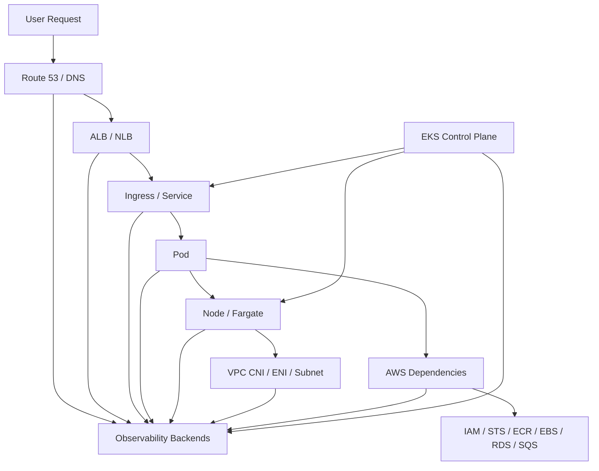
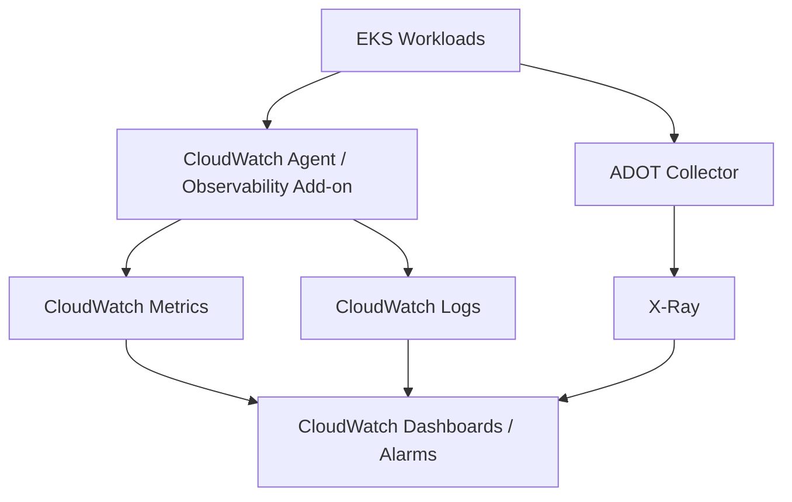
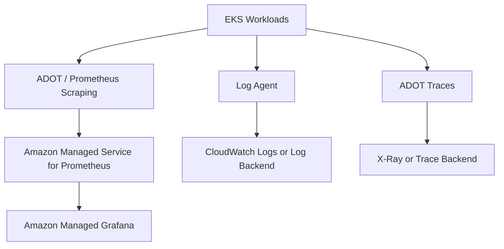
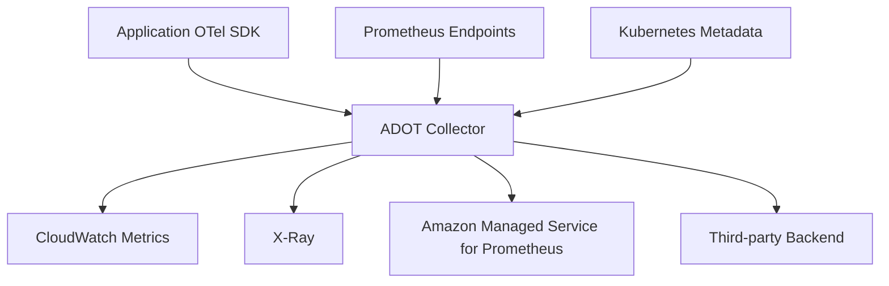
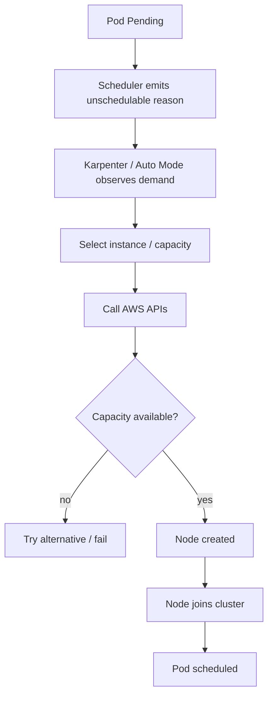

# Part 030 — Observability on EKS

EKS observability is not just Kubernetes observability with an AWS logo.

EKS adds AWS-specific evidence layers:

- CloudWatch metrics and logs;
- Container Insights;
- AWS Distro for OpenTelemetry;
- Amazon Managed Service for Prometheus;
- Amazon Managed Grafana;
- AWS X-Ray;
- EKS control-plane logs;
- VPC Flow Logs;
- load balancer metrics and access logs;
- NAT Gateway metrics;
- EBS/EFS metrics;
- IAM/CloudTrail evidence;
- EKS add-on health;
- Karpenter or EKS Auto Mode signals;
- AWS quota and capacity signals.

The invariant for this part:

> EKS observability is production-grade only when Kubernetes signals and AWS infrastructure signals can be correlated into one incident timeline.

---

## 1. EKS Observability Mental Model

In EKS, AWS owns the managed control plane infrastructure, but you own the operational evidence required to run workloads safely.

That creates an important split:

| Layer | Who manages it? | Who must observe symptoms? |
|---|---|---|
| EKS control plane infrastructure | AWS | You, through exposed logs/metrics/events/support evidence |
| Kubernetes API objects | You | You |
| Worker nodes / Fargate / Auto Mode nodes | You + AWS depending mode | You |
| CNI, CoreDNS, kube-proxy/add-ons | You + AWS managed add-ons | You |
| Application workloads | You | You |
| AWS load balancers, IAM, VPC, storage | You + AWS service boundary | You |

Managed does not mean invisible.

It means the repair boundary changes.



An EKS incident often requires joining Kubernetes and AWS evidence:

- Pod is Pending because node capacity is unavailable;
- node capacity is unavailable because subnet IPs are exhausted;
- ALB returns 503 because target group health check path differs from readiness;
- app fails AWS API calls because Pod identity is misconfigured;
- rollout hangs because admission webhook times out;
- image pull fails because ECR permission or VPC endpoint path is broken;
- DNS fails because CoreDNS is saturated or VPC DNS settings are wrong;
- storage attach fails because EBS volume zone mismatches node zone.

---

## 2. Observability Options on EKS

AWS provides several native and managed choices.

| Capability | AWS-native option | Common OSS/managed option |
|---|---|---|
| Cluster/container metrics | CloudWatch Container Insights | Prometheus |
| Logs | CloudWatch Logs | Fluent Bit/Loki/Elastic/Datadog |
| Traces | X-Ray via ADOT | OpenTelemetry + Jaeger/Tempo/vendor |
| Prometheus metrics | Amazon Managed Service for Prometheus | self-managed Prometheus |
| Dashboards | CloudWatch dashboards, Amazon Managed Grafana | Grafana OSS/vendor |
| Collector | CloudWatch agent, ADOT Collector | OpenTelemetry Collector |
| Control-plane logs | EKS control plane logging to CloudWatch Logs | central SIEM export |
| Cloud network evidence | VPC Flow Logs, ELB metrics/logs | SIEM/network platform |

There is no single correct stack.

There is a correct evidence model.

### 2.1 Common Production Architectures

#### Architecture A — CloudWatch-Centric

Use when:

- team is AWS-first;
- operational team already uses CloudWatch;
- compliance wants AWS-native logs;
- simplicity matters more than OSS portability.



#### Architecture B — Prometheus/Grafana-Centric

Use when:

- platform standardizes on Prometheus metrics;
- Kubernetes-native dashboards are required;
- multi-cloud consistency matters;
- teams already know PromQL.



#### Architecture C — Hybrid Enterprise

Use when:

- security logs go to SIEM;
- app telemetry goes to vendor platform;
- infra metrics stay in CloudWatch;
- Prometheus powers Kubernetes alerting;
- traces use OpenTelemetry.

This architecture is common, but it needs strict ownership and cost control.

---

## 3. CloudWatch Container Insights

Container Insights collects, aggregates, and summarizes metrics and logs from containerized workloads.

For EKS, AWS currently documents two approaches:

1. **OTel Container Insights**, recommended path;
2. **Enhanced Container Insights classic**, using the `amazon-cloudwatch-observability` EKS add-on with different configuration.

The important mental model:

> Container Insights gives a managed AWS-native baseline for cluster, node, Pod, namespace, service, and workload visibility.

It is useful for:

- cluster inventory;
- node health;
- Pod restarts;
- CPU/memory trends;
- workload health;
- container logs;
- EKS Fargate support;
- CloudWatch alarms;
- AWS-native operations.

### 3.1 Baseline Signals

Track at minimum:

| Signal | Why it matters |
|---|---|
| node CPU/memory | capacity and saturation |
| Pod CPU/memory | workload sizing |
| container restarts | instability signal |
| OOM kills | memory contract violation |
| namespace utilization | tenant/team cost and capacity |
| filesystem/ephemeral storage | eviction prevention |
| network bytes/errors | traffic and drops |
| cluster failed node count | infrastructure impact |
| pending Pods | scheduling bottleneck |

### 3.2 When Container Insights Is Not Enough

Container Insights is not a full application observability strategy.

You still need:

- application RED metrics;
- business operation metrics;
- distributed traces;
- dependency metrics;
- structured logs;
- SLO burn-rate alerts;
- release/change annotations;
- custom controller metrics;
- admission webhook metrics;
- Karpenter/Auto Mode signals.

Infrastructure observability cannot infer business failure semantics.

---

## 4. EKS Control Plane Logs

EKS can send control-plane log types to CloudWatch Logs.

Common log types include:

| Log type | Use |
|---|---|
| API server | API requests and errors |
| Audit | security and authorization trail |
| Authenticator | IAM authentication evidence |
| Controller manager | control loop issues |
| Scheduler | scheduling behavior |

Control-plane logs are essential for:

- privileged access investigation;
- RBAC/IAM debugging;
- admission failures;
- API server request errors;
- scheduler issues;
- suspicious activity;
- compliance evidence.

### 4.1 Audit Log Caution

Audit logs can be high volume and sensitive.

They may include:

- user identity;
- request path;
- object references;
- authorization result;
- source IP;
- verbs like `create`, `update`, `delete`, `patch`, `get`, `list`, `watch`.

Production requirements:

- retention policy;
- access control;
- SIEM export if required;
- sensitive event detection;
- cost monitoring;
- query playbooks.

### 4.2 Authenticator Logs

Authenticator logs are particularly useful when debugging EKS access:

- IAM principal mapped incorrectly;
- access entry missing;
- stale `aws-auth` dependency;
- wrong AWS account/role;
- CI/CD identity failure;
- cross-account access issue.

---

## 5. ADOT on EKS

AWS Distro for OpenTelemetry is AWS's supported distribution of OpenTelemetry components.

On EKS, ADOT is commonly used to collect and export:

- application metrics;
- Prometheus metrics;
- traces;
- host/container metrics;
- service telemetry;
- custom telemetry to CloudWatch, X-Ray, Amazon Managed Service for Prometheus, or other supported destinations.



### 5.1 Collector Deployment Patterns

| Pattern | Use case | Trade-off |
|---|---|---|
| Deployment collector | app traces/metrics gateway | easier scaling, network hop |
| DaemonSet collector | node-local metrics/logs | per-node overhead |
| Sidecar collector | strict isolation | operational and cost overhead |
| EKS add-on managed path | AWS-integrated lifecycle | less customization than self-managed |

A practical default:

- Deployment collector for traces and app metrics;
- DaemonSet or managed agent for node/container logs and metrics;
- avoid sidecars unless required.

### 5.2 Collector Pipeline Design

Example conceptual pipeline:

```yaml
receivers:
  otlp:
    protocols:
      grpc: {}
      http: {}
  prometheus:
    config:
      scrape_configs:
        - job_name: kubernetes-pods
          kubernetes_sd_configs:
            - role: pod

processors:
  batch: {}
  memory_limiter:
    check_interval: 1s
    limit_mib: 512
  k8sattributes: {}

exporters:
  awsxray: {}
  awsemf: {}
  prometheusremotewrite:
    endpoint: https://aps-workspaces.<region>.amazonaws.com/workspaces/<id>/api/v1/remote_write

service:
  pipelines:
    traces:
      receivers: [otlp]
      processors: [memory_limiter, k8sattributes, batch]
      exporters: [awsxray]
    metrics:
      receivers: [otlp, prometheus]
      processors: [memory_limiter, k8sattributes, batch]
      exporters: [awsemf, prometheusremotewrite]
```

This is not a copy-paste production file. It shows the moving parts.

Production tuning must include:

- IAM permissions;
- remote write authentication;
- memory limits;
- queue and retry policy;
- sampling;
- Kubernetes metadata enrichment;
- cost/cardinality filters;
- collector self-observability.

### 5.3 Collector Failure Mode

If the collector is down:

- applications should keep serving;
- telemetry may be dropped or buffered within limits;
- alerts should detect collector health;
- backpressure must not exhaust app memory;
- retry storms must not amplify outages.

The collector is production infrastructure. Treat it like any other tier-1 platform component.

---

## 6. Amazon Managed Service for Prometheus

Amazon Managed Service for Prometheus provides managed Prometheus-compatible metric storage and querying.

Use it when:

- you want PromQL;
- you need scalable remote storage;
- you want to avoid operating long-term Prometheus storage yourself;
- you need AWS IAM integration;
- you want Grafana dashboards over Kubernetes metrics.

### 6.1 Metrics Strategy

A common strategy:

- scrape Kubernetes and app metrics using ADOT or Prometheus agent;
- remote-write to AMP;
- query from Amazon Managed Grafana;
- use alerting through managed or integrated alert path;
- keep CloudWatch for AWS service metrics and alarms where appropriate.

### 6.2 What to Scrape

| Target | Why |
|---|---|
| application `/metrics` | service SLO and dependency signals |
| kube-state-metrics | Kubernetes object state |
| node exporter / node metrics | node saturation |
| CoreDNS | DNS health |
| ingress controller | edge routing health |
| AWS Load Balancer Controller | controller reconciliation health |
| Karpenter | provisioning and disruption behavior |
| custom controllers | reconciliation health |
| service mesh, if used | L7 traffic behavior |

### 6.3 Prometheus Cardinality Controls

Remote-write cost and query performance depend heavily on cardinality.

Controls:

- drop high-cardinality labels;
- normalize route labels;
- set scrape intervals intentionally;
- limit histogram buckets;
- avoid duplicate scraping;
- enforce metric naming conventions;
- review top series regularly;
- separate platform vs application metrics ownership.

---

## 7. Amazon Managed Grafana

Amazon Managed Grafana can visualize metrics from multiple sources, including AMP, CloudWatch, X-Ray-related data, and other supported sources.

A production EKS Grafana setup should include dashboards for:

1. service SLOs;
2. namespace/workload health;
3. node saturation;
4. Pod restarts/OOM kills;
5. pending Pods and scheduling reasons;
6. CoreDNS;
7. ingress/load balancer;
8. autoscaling;
9. Karpenter / node provisioning;
10. CNI/IP capacity;
11. storage attach/provisioning;
12. control-plane symptoms;
13. cost/capacity.

Dashboards must include ownership and runbook links.

Do not build anonymous dashboards nobody owns.

---

## 8. AWS X-Ray and Distributed Tracing

X-Ray can be used as the trace backend for EKS applications through OpenTelemetry/ADOT instrumentation.

Use tracing to answer:

- where latency is spent;
- which dependency caused an error;
- whether retries amplify traffic;
- how async workflows behave;
- which version/regional path is affected;
- whether a load balancer or app layer is responsible.

### 8.1 Trace Metadata for EKS

Add attributes:

- service name;
- environment;
- AWS region;
- EKS cluster;
- namespace;
- Pod name;
- container name;
- node name;
- image digest/version;
- route/operation;
- dependency name;
- tenant tier, if bounded and safe.

The goal is to pivot from trace to Pod, from Pod to node, and from node to AWS infrastructure.

---

## 9. Logs on EKS

Common log categories:

| Log category | Examples | Destination |
|---|---|---|
| application logs | structured stdout/stderr | CloudWatch Logs / vendor |
| control-plane logs | audit, API server, scheduler | CloudWatch Logs |
| node/system logs | kubelet, runtime, systemd | CloudWatch Logs / node collector |
| ingress logs | ALB/NLB access logs, controller logs | S3/CloudWatch |
| network logs | VPC Flow Logs | CloudWatch Logs / S3 |
| security logs | CloudTrail, audit logs | SIEM / CloudWatch / S3 |

### 9.1 Application Logs

Application logs should include:

- trace ID;
- request ID;
- operation;
- error class;
- dependency;
- tenant tier;
- version;
- namespace/workload metadata.

Avoid:

- raw secrets;
- AWS credentials;
- bearer tokens;
- full request/response payloads;
- PII;
- unbounded debug logs.

### 9.2 ALB/NLB Evidence

For ALB-backed ingress, use:

- ALB target response codes;
- target health;
- target response time;
- HTTPCode_ELB_5XX;
- HTTPCode_Target_5XX;
- target group health checks;
- ALB access logs if enabled;
- AWS Load Balancer Controller logs/events.

A common diagnostic distinction:

| Symptom | Likely layer |
|---|---|
| ELB 5xx | load balancer/edge issue |
| Target 5xx | application target issue |
| unhealthy targets | readiness/health check mismatch |
| no targets | Service/EndpointSlice/controller issue |
| TLS errors | certificate/listener issue |

---

## 10. EKS Add-On Observability

EKS add-ons are part of your platform runtime.

Observe at least:

| Add-on | Signals |
|---|---|
| VPC CNI | IP allocation, ENI errors, network policy agent, `aws-node` restarts |
| CoreDNS | DNS latency, errors, throttling, Pod restarts |
| kube-proxy | sync errors, iptables/ipvs issues |
| EBS CSI | volume provision/attach/mount errors |
| EFS CSI | mount errors, throughput symptoms |
| AWS Load Balancer Controller | reconciliation errors, AWS API throttling, target group state |
| ADOT / CloudWatch agent | dropped telemetry, collector errors |
| Karpenter | provisioning, consolidation, disruption, cloud provider errors |

Add-on health should be part of the platform dashboard, not hidden in `kubectl get pods -n kube-system`.

---

## 11. VPC CNI and Network Observability

EKS networking failures often look like application failures.

Track:

- subnet free IPs;
- ENI attach failures;
- `aws-node` health;
- Pod IP assignment errors;
- security group for pods behavior;
- DNS resolution latency/errors;
- NAT Gateway errors/port exhaustion symptoms;
- VPC Flow Logs;
- load balancer target health;
- network policy enforcement metrics if enabled.

### 11.1 IP Exhaustion Runbook

Symptoms:

- Pods stuck Pending or ContainerCreating;
- CNI errors in events;
- `aws-node` logs show IP allocation failure;
- subnets near zero available IPs;
- node joins but cannot place Pods.

Check:

```bash
kubectl get pods -A --field-selector=status.phase=Pending
kubectl describe pod <pod> -n <namespace>
kubectl logs -n kube-system ds/aws-node -c aws-node --tail=200
kubectl get nodes -o wide
```

AWS-side checks:

- subnet available IP count;
- ENI limits for instance types;
- prefix delegation setting;
- security group rules;
- route tables;
- NAT Gateway metrics;
- VPC CNI version.

Mitigation options:

- add subnet capacity;
- enable/use prefix delegation where appropriate;
- reduce max Pods per node if mis-sized;
- use larger subnet CIDRs;
- move workloads to additional node groups/subnets;
- review IP-heavy workload patterns.

---

## 12. Karpenter and EKS Auto Mode Observability

If you use Karpenter or EKS Auto Mode, node provisioning becomes a dynamic control loop.

Observe:

- unschedulable Pod reasons;
- provisioning latency;
- node launch failures;
- instance type selection;
- Spot interruption handling;
- consolidation actions;
- disruption budget effects;
- expired nodes;
- node claim state;
- cloud provider capacity errors;
- IAM permission failures;
- subnet/security group discovery.

### 12.1 Provisioning Failure Path



If this path is not observable, teams will blame the application for infrastructure capacity failures.

---

## 13. IAM and Identity Observability

EKS identity failures are common and subtle.

Collect evidence from:

- application logs;
- SDK error codes;
- STS errors;
- CloudTrail;
- EKS authenticator logs;
- Pod Identity Agent logs, if used;
- IRSA OIDC trust policy;
- ServiceAccount annotations;
- access entries;
- IAM policy simulator / access analyzer where appropriate.

Common errors:

| Symptom | Likely issue |
|---|---|
| `AccessDenied` to AWS service | permission policy too narrow/wrong role |
| `InvalidIdentityToken` | OIDC/trust mismatch |
| no credentials found | SDK chain not seeing projected token/agent |
| works on node, not Pod | Pod identity association missing |
| CI can deploy but humans cannot | EKS access entries/RBAC mismatch |

Identity observability must include both Kubernetes identity and AWS IAM identity.

---

## 14. Storage Observability

For EBS-backed workloads:

- PVC pending;
- StorageClass parameters;
- zone topology;
- EBS CSI controller logs;
- attach/detach latency;
- volume throughput/IOPS;
- filesystem usage;
- node zone vs volume zone;
- snapshot/backup status.

For EFS-backed workloads:

- mount target availability;
- security group path;
- EFS CSI logs;
- throughput mode;
- burst credits / throughput symptoms;
- latency;
- permission errors.

Storage failures often cross Kubernetes and AWS boundaries. Your runbook must inspect both.

---

## 15. Recommended EKS Dashboard Set

### 15.1 Executive Reliability Dashboard

- SLO compliance by service;
- error budget burn;
- active incidents;
- top failing services;
- region/cluster impact;
- recent high-risk changes.

### 15.2 Service Dashboard

- RED metrics;
- dependency metrics;
- version comparison;
- trace links;
- application logs;
- Pod restarts/OOM;
- rollout status;
- node/resource saturation.

### 15.3 Platform Dashboard

- cluster/node health;
- pending Pods;
- add-on health;
- CoreDNS;
- VPC CNI/IP capacity;
- ingress/load balancer;
- storage provisioning;
- autoscaler activity;
- control-plane log error trends.

### 15.4 Network Dashboard

- ALB/NLB metrics;
- target health;
- VPC Flow Logs summaries;
- NAT Gateway metrics;
- DNS/CoreDNS;
- subnet IP availability;
- security group/policy symptoms.

### 15.5 Cost/Capacity Dashboard

- requests vs usage;
- namespace cost allocation;
- node utilization;
- Spot/On-Demand mix;
- idle capacity;
- telemetry ingestion volume;
- top cardinality metrics;
- log volume by namespace/service.

---

## 16. Alerting Strategy on EKS

### 16.1 Page Alerts

Page on:

- tier-0/tier-1 SLO fast burn;
- ALB/NLB severe 5xx affecting users;
- service unavailable across replicas;
- CoreDNS severe failure;
- many Pods unschedulable for critical workloads;
- node capacity exhaustion blocking critical services;
- storage attach/provision failures affecting critical stateful workloads;
- admission webhook failure blocking deployments or Pod creation;
- security-critical audit events;
- telemetry pipeline outage for critical services.

### 16.2 Ticket Alerts

Ticket on:

- certificate expires in 30/14/7 days;
- cluster/add-on version drift;
- high but not urgent telemetry cost;
- namespace request/usage mismatch;
- nodes underutilized for days;
- deprecated API usage;
- noisy logs;
- non-critical Pod restart trend.

### 16.3 Avoid Paging On

- single Pod restart;
- CPU > 80% without impact;
- transient pending Pods during scale-up;
- normal deployment rollout mismatch;
- brief ALB target registration delay;
- debug-level collector warnings.

---

## 17. Incident Runbooks

### 17.1 User Sees 5xx

1. Check SLO/error dashboard.
2. Split by route, version, region, cluster.
3. Check ALB/NLB metrics: ELB 5xx vs target 5xx.
4. Check ingress/controller logs and Kubernetes events.
5. Check application error logs by trace ID.
6. Check traces for dependency failure.
7. Check Pod restarts/OOM/readiness failures.
8. Check recent deployment/config changes.
9. Check AWS dependency errors: IAM, RDS, SQS, EBS, DNS.
10. Mitigate: rollback, scale, failover, disable feature, restore dependency.

### 17.2 Pods Pending

1. `kubectl describe pod` for scheduling reason.
2. Check requests vs node allocatable.
3. Check taints/tolerations, affinity, topology spread.
4. Check Cluster Autoscaler/Karpenter/Auto Mode events.
5. Check subnet IP availability.
6. Check AWS capacity errors/quota.
7. Check node group/NodePool constraints.
8. Mitigate by adding capacity, relaxing constraints, fixing requests, expanding subnets, or using alternative instance types.

### 17.3 DNS Failure

1. Check CoreDNS Pods readiness and restarts.
2. Check CoreDNS metrics: latency, errors, throttling.
3. Check node-level DNS path.
4. Check VPC DNS settings.
5. Check NetworkPolicy/security rules.
6. Check upstream dependency DNS.
7. Scale CoreDNS or reduce query amplification.

### 17.4 Image Pull Failure

1. Inspect Pod events.
2. Check image reference and digest.
3. Check ECR repository and tag/digest existence.
4. Check node/Pod IAM path for ECR auth.
5. Check VPC endpoints/NAT path in private clusters.
6. Check registry rate/availability.
7. Mitigate with correct image, credentials, route, or endpoint.

### 17.5 Telemetry Missing

1. Check collector health.
2. Check collector resource pressure.
3. Check exporter errors.
4. Check IAM permissions.
5. Check remote backend availability.
6. Check sampling/filtering config.
7. Check network egress path.
8. Check app instrumentation version.

---

## 18. EKS Observability Implementation Blueprint

A pragmatic staged implementation:

### Stage 1 — Baseline Platform Visibility

- enable EKS control-plane logs required by security/ops;
- install CloudWatch Container Insights or equivalent baseline;
- collect application stdout/stderr logs;
- monitor CoreDNS, VPC CNI, nodes, Pod restarts;
- create platform dashboard;
- define alert ownership.

### Stage 2 — Service Observability

- standardize application metrics;
- expose `/metrics`;
- implement structured logs;
- propagate trace/request IDs;
- define service dashboard template;
- define SLOs for critical services.

### Stage 3 — OpenTelemetry and Tracing

- deploy ADOT Collector;
- instrument apps with OTel SDK;
- export traces to X-Ray or chosen backend;
- add Kubernetes metadata enrichment;
- implement sampling policy;
- correlate logs and traces.

### Stage 4 — Prometheus/Grafana Scale

- deploy AMP remote write path;
- configure Amazon Managed Grafana;
- import/adapt Kubernetes dashboards;
- enforce cardinality controls;
- add burn-rate alerts.

### Stage 5 — Incident Evidence Maturity

- export Kubernetes events;
- add deployment/change annotations;
- integrate CloudTrail and VPC Flow Logs;
- build incident timeline workflow;
- automate runbook links in alerts;
- review observability gaps after every incident.

---

## 19. Governance and Ownership

A serious EKS platform defines ownership by signal.

| Signal | Owner |
|---|---|
| SLO and business metrics | application team |
| app logs/traces | application team with platform standards |
| Kubernetes events | platform team |
| node/add-on metrics | platform team |
| AWS load balancer/network metrics | platform/cloud team |
| IAM/audit logs | platform/security |
| telemetry pipeline | platform observability team |
| dashboard templates | platform + service owners |
| alert routing | owning team |

No telemetry without owner.

No alert without runbook.

No dashboard without user.

---

## 20. Common EKS Anti-Patterns

### 20.1 Only CloudWatch, No App Semantics

You see CPU, memory, and restarts, but not checkout failures or payment latency.

Fix: add app RED metrics and traces.

### 20.2 Only Prometheus, No AWS Evidence

You see Pod metrics, but not ALB target health, NAT errors, IAM failures, or CloudTrail evidence.

Fix: integrate AWS service metrics/logs.

### 20.3 No Control-Plane Logs

RBAC, scheduler, and audit investigations become weak.

Fix: enable required log types with retention/cost policy.

### 20.4 Unbounded Metrics

Remote write cost explodes.

Fix: cardinality review and label governance.

### 20.5 Telemetry Pipeline as Single Point of Failure

Collector failure blinds the team.

Fix: monitor collector, scale it, isolate it, and fail safely.

### 20.6 No Change Markers

Every incident starts with a meeting to ask what changed.

Fix: annotate deployments, config changes, add-on upgrades, and node provisioning changes.

---

## 21. Production Checklist

### 21.1 Cluster Checklist

- [ ] EKS control-plane logs enabled according to security/ops requirements.
- [ ] Log retention policy configured.
- [ ] Container Insights or equivalent baseline deployed.
- [ ] Kubernetes events exported.
- [ ] CoreDNS dashboard exists.
- [ ] VPC CNI dashboard exists.
- [ ] Node/pod saturation dashboard exists.
- [ ] Ingress/load balancer dashboard exists.
- [ ] Storage CSI dashboard exists.
- [ ] Autoscaler/Karpenter/Auto Mode dashboard exists.

### 21.2 Application Checklist

- [ ] Services expose RED or worker metrics.
- [ ] Metrics are scraped/exported.
- [ ] Logs are structured and centralized.
- [ ] Trace/request IDs appear in logs.
- [ ] Traces propagate across service and async boundaries.
- [ ] Dependency metrics are emitted.
- [ ] Version/image digest is visible.
- [ ] Service dashboard follows platform template.
- [ ] Critical services have SLOs and burn-rate alerts.

### 21.3 AWS Integration Checklist

- [ ] ALB/NLB metrics monitored.
- [ ] ALB access logs enabled where required.
- [ ] VPC Flow Logs configured where needed.
- [ ] CloudTrail is available for incident/security review.
- [ ] NAT Gateway metrics monitored for private clusters.
- [ ] ECR image pull failures have runbook.
- [ ] IAM/STS failures have runbook.
- [ ] EBS/EFS metrics and CSI logs are visible.
- [ ] AWS quotas and capacity errors are observable.

### 21.4 Governance Checklist

- [ ] Every alert has owner and runbook.
- [ ] Every dashboard has owner and intended user.
- [ ] Cardinality review exists.
- [ ] Log volume review exists.
- [ ] Telemetry access is least-privilege.
- [ ] Sensitive-data redaction policy exists.
- [ ] Incident reviews produce telemetry improvements.

---

## 22. Deliberate Practice

### Exercise 1 — Build an EKS Incident Evidence Map

Pick one production service.

Map evidence from:

- Route 53;
- ALB/NLB;
- ingress/controller;
- Service/EndpointSlice;
- Pod;
- node;
- VPC CNI;
- IAM/STS;
- application logs;
- traces;
- CloudTrail;
- Kubernetes events.

Find the weakest link.

### Exercise 2 — Reproduce a Health Check Mismatch

Create a workload where Kubernetes readiness and ALB target health disagree.

Observe:

- Pod readiness;
- EndpointSlice;
- target group health;
- ALB metrics;
- controller events;
- application logs.

Then fix the contract.

### Exercise 3 — Simulate IP Exhaustion

In a safe non-production environment, intentionally constrain subnet/node capacity.

Observe:

- pending Pods;
- scheduler events;
- VPC CNI logs;
- subnet available IPs;
- autoscaler behavior.

Write the runbook.

### Exercise 4 — Trace One Critical Request

Instrument one API request through at least two services and one AWS dependency.

Success criteria:

- trace appears in backend;
- logs contain trace ID;
- dependency span exists;
- Kubernetes metadata is attached;
- dashboard links to trace/logs.

---

## 23. Summary

EKS observability must join two worlds:

1. Kubernetes runtime evidence;
2. AWS infrastructure evidence.

A strong EKS platform gives engineers a continuous path from user symptom to service telemetry, Pod state, node health, CNI/IP state, load balancer behavior, IAM decisions, cloud infrastructure, and recent change history.

The top-tier engineer does not just ask whether metrics exist.

They ask:

> Can we reconstruct the incident without guessing?

That is the standard.

---

## References

- Amazon CloudWatch — Container Insights on Amazon EKS: https://docs.aws.amazon.com/AmazonCloudWatch/latest/monitoring/deploy-container-insights-EKS.html
- Amazon CloudWatch — Container Insights: https://docs.aws.amazon.com/AmazonCloudWatch/latest/monitoring/ContainerInsights.html
- Amazon EKS User Guide — Send metric and trace data with ADOT Operator: https://docs.aws.amazon.com/eks/latest/userguide/opentelemetry.html
- AWS Observability Best Practices — EKS Metrics Collection: https://aws-observability.github.io/observability-best-practices/guides/containers/oss/eks/best-practices-metrics-collection/
- Amazon EKS Prescriptive Guidance — Observability Best Practices: https://docs.aws.amazon.com/prescriptive-guidance/latest/amazon-eks-observability-best-practices/introduction.html
- AWS Distro for OpenTelemetry: https://aws-otel.github.io/docs/introduction
- Kubernetes Documentation — Observability: https://kubernetes.io/docs/concepts/cluster-administration/observability/
- Kubernetes Documentation — Logging Architecture: https://kubernetes.io/docs/concepts/cluster-administration/logging/
