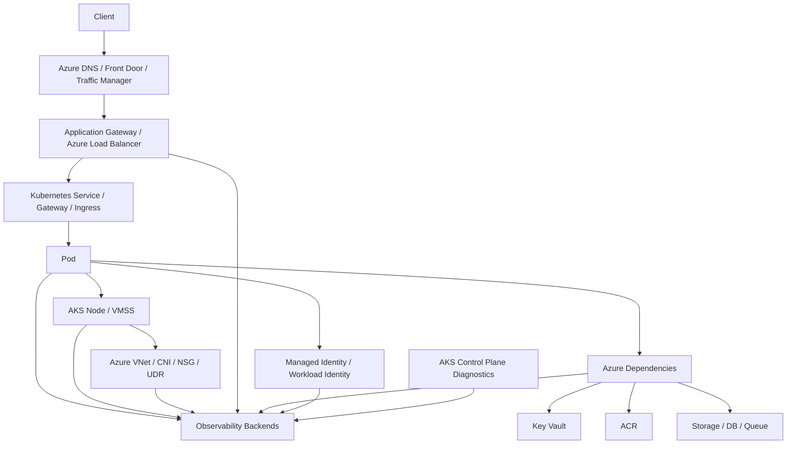
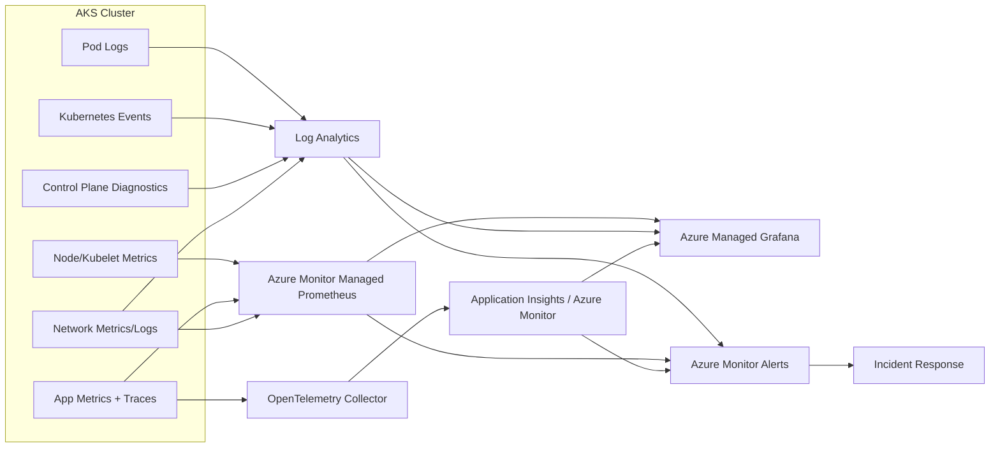
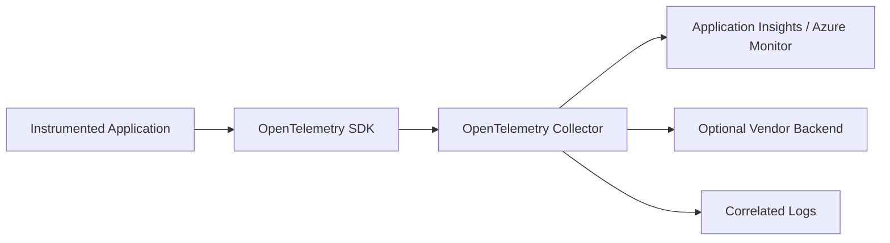

# Part 031 — Observability on AKS

AKS observability is not just "install Prometheus".

AKS runs inside Azure, so every incident crosses at least two worlds:

1. Kubernetes evidence: Pods, Deployments, Services, Events, Nodes, probes, workloads.
2. Azure evidence: Azure Monitor, Log Analytics, Managed Prometheus, Managed Grafana, Activity Logs, Resource Logs, NSG flow evidence, load balancer metrics, Application Gateway metrics, identity, Key Vault, ACR, disk, network, and control-plane diagnostics.

The invariant:

> AKS observability is production-grade only when Kubernetes symptoms and Azure platform evidence can be correlated into one timeline.

If your dashboard can show CPU but cannot answer "why did checkout receive 502 for 9 minutes after node pool upgrade?", it is not an operations system. It is only instrumentation.

---

## 1. What AKS Adds to Kubernetes Observability

Generic Kubernetes observability gives you:

- Pod status;
- container restarts;
- Deployment rollout state;
- Service endpoints;
- cluster events;
- kubelet/node metrics;
- logs;
- traces;
- application metrics.

AKS adds Azure-specific operational surfaces:

- Azure Monitor metrics;
- Log Analytics workspace;
- Container Insights;
- Azure Monitor managed service for Prometheus;
- Azure Managed Grafana;
- diagnostic settings;
- AKS control-plane logs;
- Azure Activity Log;
- Azure Resource Graph;
- Entra ID and Azure RBAC audit trails;
- Managed Identity evidence;
- ACR pull errors and registry logs;
- Azure Load Balancer and Application Gateway evidence;
- Azure CNI, Network Observability, NSG, UDR, NAT Gateway, and Azure Firewall evidence;
- Azure Disk / Azure Files storage metrics;
- Key Vault diagnostics;
- node resource group resources;
- VMSS / node pool health signals.

AKS is managed, but the visibility contract is still yours.



The important thing is not the number of tools.

The important thing is whether they explain the same production event from different angles.

---

## 2. AKS Observability Stack: Responsibility Split

A production AKS observability architecture usually has these layers.

| Layer | Primary evidence | Typical Azure capability | Why it matters |
|---|---|---|---|
| Control plane | API server, scheduler, controller manager, cluster autoscaler logs | AKS diagnostic settings to Log Analytics / storage / Event Hub | Explains control-plane and scaling behavior |
| Node | CPU, memory, disk, kubelet, node condition, VMSS health | Container Insights, VM metrics | Explains capacity, eviction, node failure |
| Pod/container | restarts, logs, resource usage, probes | Container Insights, Log Analytics | Explains workload symptoms |
| Application | RED metrics, traces, domain logs | OpenTelemetry, App Insights, Managed Prometheus | Explains user impact |
| Network | DNS, CNI, NSG, LB/App Gateway, flow logs | Azure Monitor, Network Watcher, Advanced Container Networking Services | Explains connectivity and traffic loss |
| Identity | token exchange, RBAC, Entra ID, managed identity | Activity Log, Entra logs, Azure resource diagnostics | Explains denied access and auth failures |
| Storage | attach/mount, latency, throttling, capacity | Azure Disk/File metrics, CSI logs | Explains I/O and stateful workload failure |
| Delivery | GitOps sync, Helm release, rollout, admission | Argo/Flux metrics, Kubernetes events | Explains deployment-induced incidents |

The cloud-native trap:

> Engineers often monitor Pods, but incidents usually happen at boundaries: DNS, identity, ingress, storage, node pool, quota, or policy.

---

## 3. Container Insights vs Managed Prometheus vs Managed Grafana

These are not interchangeable.

| Capability | What it is | Best for | Not enough for |
|---|---|---|---|
| Container Insights | Azure Monitor feature for container/cluster health and logs | cluster inventory, node/pod/container health, logs, portal-driven investigation | high-cardinality app metrics, PromQL-heavy SLOs |
| Managed Prometheus | Azure Monitor managed Prometheus-compatible metrics platform | Kubernetes/app metrics, PromQL, alerting, Grafana dashboards | logs, traces, raw event narratives |
| Azure Managed Grafana | Managed Grafana visualization service | dashboarding, Prometheus visualization, cross-source views | storage of telemetry itself |
| Log Analytics | log query and analytics workspace | container logs, diagnostic logs, KQL investigations | Prometheus-native metric workflows |
| Application Insights | application performance monitoring | traces, dependencies, request telemetry | cluster-level Kubernetes object view |

A practical rule:

- use Container Insights for cluster/container health and log investigation;
- use Managed Prometheus for metric-driven SLOs and Kubernetes/app metrics;
- use Managed Grafana for dashboards;
- use Log Analytics/KQL for forensic log and platform diagnostics;
- use OpenTelemetry/Application Insights for distributed tracing and application dependency evidence.

Do not force one backend to do everything.

---

## 4. Minimum Production Signal Set

Before discussing tool choice, define the evidence contract.

A production AKS platform should answer these questions quickly:

### Cluster

- Is the Kubernetes API reachable?
- Are control-plane diagnostics enabled?
- Are node pools healthy?
- Are upgrades in progress?
- Are add-ons degraded?
- Are there quota or capacity constraints?

### Nodes

- Are nodes Ready?
- Are nodes under CPU/memory/disk/PID pressure?
- Are kubelet/container runtime errors increasing?
- Are system node pools isolated from user workloads?
- Are Spot/ephemeral node failures expected or abnormal?

### Workloads

- Which Deployment changed before the incident?
- Which Pods restarted?
- Which containers failed probes?
- Which workloads are Pending, OOMKilled, CrashLoopBackOff, or ImagePullBackOff?
- Which namespaces exceed request/limit budgets?

### Traffic

- Is DNS resolving?
- Is ingress accepting traffic?
- Are backend health checks passing?
- Are Services backed by ready endpoints?
- Are Application Gateway / Load Balancer metrics healthy?
- Are NetworkPolicy or NSG rules blocking traffic?

### Identity

- Are workload identity token exchanges succeeding?
- Are Managed Identity permissions correct?
- Are Key Vault, Storage, ACR, or Service Bus calls denied?
- Did RBAC or Azure role assignments change?

### Storage

- Are volumes attaching and mounting?
- Is disk latency increasing?
- Are Azure Disk/File throttling limits hit?
- Are CSI sidecars healthy?

### Application

- Is user-facing latency above SLO?
- Are errors concentrated in one dependency, route, zone, or node pool?
- Are traces complete enough to locate the failing hop?
- Are logs structured and correlated with trace/request IDs?

---

## 5. Reference AKS Observability Architecture



This architecture has one main design goal:

> Use metrics for detection, logs/events for explanation, traces for request path, and Azure diagnostics for platform boundary proof.

---

## 6. AKS Control-Plane Diagnostics

Control-plane observability is often ignored because AKS is managed.

That is a mistake.

You do not manage the AKS control-plane infrastructure, but you still need evidence from it.

Important diagnostic categories can include, depending on cluster features/version:

- kube-apiserver;
- kube-audit;
- kube-audit-admin;
- kube-controller-manager;
- kube-scheduler;
- cluster-autoscaler;
- cloud-controller-manager;
- guard/admission-related logs;
- CNI/network-related diagnostics where supported.

The operational value:

| Signal | What it helps diagnose |
|---|---|
| API server logs | request failures, latency, authentication/authorization failures |
| Audit logs | who changed what, when, from where |
| Scheduler logs | scheduling failures and constraints |
| Controller manager logs | reconciliation and resource controller problems |
| Cluster autoscaler logs | scale-up/scale-down decisions |
| Cloud controller logs | Azure load balancer/storage/cloud integration issues |

The practical design:

- enable diagnostic settings during cluster creation, not after the first outage;
- route logs to Log Analytics for interactive investigation;
- optionally route copies to storage/Event Hub for retention/SIEM;
- define retention by compliance and incident analysis needs;
- exclude high-noise categories only with evidence, not intuition.

### Example Diagnostic Intent

Do not think in terms of "enable all logs forever".

Think in terms of queries you need during incident response:

- who changed RBAC before failed deployment?
- why did the scheduler reject these Pods?
- did cluster autoscaler refuse scale-up because of max node group size?
- did a webhook timeout block admission?
- did the API server reject a deprecated API after upgrade?

---

## 7. Container Insights: Cluster and Container Evidence

Container Insights is useful because it gives a managed baseline for cluster health and workload evidence.

Use it for:

- node inventory;
- node utilization;
- pod/container inventory;
- restarts;
- container logs;
- namespace-level view;
- cluster health visualizations;
- quick portal investigation;
- KQL-based analysis.

But avoid treating it as the whole observability strategy.

It is a strong default for AKS operations, but application SLOs usually need app metrics and traces.

### Useful Investigation Questions

Container Insights should help answer:

- Which namespace is producing most restarts?
- Which node has abnormal memory pressure?
- Which pods are pending or failed?
- Which container logs include errors after a deployment?
- Which workload consumes unexpected resources?
- Which node pool is hot or imbalanced?

### Design Rules

- Label namespaces and workloads consistently.
- Standardize app labels: `app.kubernetes.io/name`, `component`, `part-of`, `version`.
- Keep logs structured.
- Include request/correlation IDs in logs.
- Avoid logging secrets, tokens, headers, or PII.
- Set retention intentionally.
- Use sampling or routing for high-volume debug logs.

---

## 8. Managed Prometheus: Metric Plane

Managed Prometheus gives a Prometheus-compatible metric model without forcing each platform team to operate Prometheus storage.

Use it for:

- Kubernetes metrics;
- node metrics;
- kube-state-metrics-style object state;
- application metrics;
- service-level indicators;
- PromQL alerting;
- Grafana dashboards;
- network observability metrics where supported.

### Metric Taxonomy

| Metric type | Examples | Purpose |
|---|---|---|
| Saturation | CPU, memory, disk, pod capacity, connection count | capacity and scaling |
| Traffic | request rate, queue depth, consumer lag | demand |
| Errors | HTTP 5xx, failed jobs, dependency failures | correctness |
| Latency | p50/p95/p99, dependency latency | user experience |
| State | replicas desired/available, pods ready, node ready | control-plane truth |
| Cost proxy | requested CPU/memory, idle nodes | FinOps |

### Anti-Patterns

Do not create metrics for everything.

Bad metrics are expensive and useless.

Common mistakes:

- unbounded labels such as user ID, order ID, request ID;
- route labels with raw IDs in path;
- per-Pod alerts instead of service-level alerts;
- dashboards without SLO thresholds;
- alerting on CPU without user impact;
- collecting verbose metrics with no owner;
- mixing application health and infrastructure health into one ambiguous alert.

### Production Metric Contract

Every app deployed to AKS should expose:

- request rate;
- error rate;
- latency histogram;
- dependency latency/error metrics;
- queue depth / lag if asynchronous;
- business outcome counters where relevant;
- build/version labels;
- readiness state or health metric if meaningful.

---

## 9. Azure Managed Grafana: Operational Views

Grafana is not the monitoring system.

It is the operational view layer.

Dashboards should be designed by use case.

### Dashboard 1: Executive SLO View

Audience: engineering leadership, incident commander.

Shows:

- service availability;
- error budget burn;
- p95/p99 latency;
- request volume;
- active incidents;
- top impacted services;
- deployment markers.

### Dashboard 2: Service Owner View

Audience: application team.

Shows:

- RED metrics;
- dependency breakdown;
- pod restarts;
- rollout status;
- app version;
- queue/consumer metrics;
- JVM/.NET/Node runtime metrics if relevant.

### Dashboard 3: Platform View

Audience: platform/SRE team.

Shows:

- API server health;
- node pool capacity;
- pending pods;
- cluster autoscaler activity;
- namespace resource usage;
- CoreDNS health;
- ingress health;
- NetworkPolicy/egress symptoms;
- CSI health;
- cost/capacity signals.

### Dashboard 4: Edge and Network View

Audience: platform/network team.

Shows:

- Application Gateway / Load Balancer metrics;
- backend health;
- 4xx/5xx distribution;
- TLS certificate expiry;
- DNS symptoms;
- SNAT/egress capacity;
- network flow metrics/logs;
- Azure Firewall/NAT Gateway evidence if used.

---

## 10. Logs: From Noise to Forensics

Logs are the most abused telemetry type.

A log strategy must define:

- who produces logs;
- what format is allowed;
- what fields are mandatory;
- what is forbidden;
- where logs are stored;
- how long they are retained;
- how logs connect to metrics/traces;
- what queries are part of incident playbooks.

### Minimum Structured Log Fields

For application logs:

```json
{
  "timestamp": "2026-07-03T10:15:30.123Z",
  "level": "ERROR",
  "service": "checkout-api",
  "version": "2026.07.03-42",
  "environment": "prod",
  "namespace": "payments",
  "pod": "checkout-api-7fbb99c7b8-x9n2c",
  "trace_id": "...",
  "span_id": "...",
  "request_id": "...",
  "operation": "createOrder",
  "error_code": "PAYMENT_PROVIDER_TIMEOUT",
  "message": "Payment provider timed out after retry budget exhausted"
}
```

For platform logs, preserve Kubernetes and Azure metadata:

- cluster name;
- namespace;
- workload name;
- pod name;
- container name;
- node name;
- node pool;
- subscription;
- resource group;
- region;
- resource ID;
- correlation ID where available.

### Bad Log Example

```text
failed
```

This is not a log. It is an emotion.

### Better Log Example

```text
level=error service=checkout-api operation=createOrder dependency=payment-provider status=timeout attempt=3 max_attempts=3 timeout_ms=2000 trace_id=abc123
```

The second one can be queried, grouped, and joined with traces.

---

## 11. Tracing and OpenTelemetry on AKS

Tracing answers a different question than metrics.

Metrics answer:

> Is the service unhealthy?

Traces answer:

> Which hop made this request slow or failed?

For AKS, a practical tracing architecture is:



### Trace Contract

Every production trace should include:

- service name;
- environment;
- version;
- route or operation name;
- status;
- latency;
- dependency spans;
- error attributes;
- tenant/customer tier only if allowed and low-cardinality;
- Kubernetes metadata where possible.

### Trace Anti-Patterns

- sampling all traces during high traffic with no cost model;
- sampling away rare errors;
- using raw URL paths with IDs as span names;
- missing dependency instrumentation;
- no correlation between logs and traces;
- no deployment version in telemetry.

---

## 12. AKS Network Observability

Network incidents are hard because Kubernetes and Azure both participate in the packet path.

A single failed request may involve:

- DNS;
- Application Gateway / Load Balancer;
- Gateway/Ingress controller;
- Service;
- EndpointSlice;
- Pod readiness;
- NetworkPolicy;
- Azure CNI;
- NSG;
- UDR;
- Azure Firewall;
- NAT Gateway;
- Private Endpoint DNS;
- external dependency routing.

### Network Evidence Map

| Symptom | Evidence to collect |
|---|---|
| Client gets 502/503 | ingress logs, backend health, endpoints, pod readiness |
| Pod cannot call dependency | DNS query, NetworkPolicy, NSG, UDR, firewall, identity, dependency logs |
| Egress intermittent | NAT/SNAT metrics, connection count, DNS, retry logs |
| East-west service fails | Service endpoints, CoreDNS, NetworkPolicy, pod labels |
| Private endpoint fails | private DNS zone, VNet link, UDR, NSG, firewall |
| Node cannot reach registry | ACR firewall/private endpoint, DNS, managed identity, route table |

### Debugging Principle

Never debug AKS networking from one layer only.

Use a layered path:

```text
client -> Azure edge -> ingress/load balancer -> Service -> EndpointSlice -> Pod -> dependency
```

At each hop ask:

1. Is the object configured?
2. Is the backend healthy?
3. Is DNS resolving?
4. Is routing allowed?
5. Is policy allowing traffic?
6. Is identity required and valid?
7. Is the dependency healthy?

---

## 13. Identity Observability

AKS production workloads often depend on Azure identity:

- Workload Identity;
- Managed Identity;
- Entra ID;
- Azure RBAC;
- Key Vault access policies/RBAC;
- ACR pull permissions;
- Storage/Service Bus/Event Hubs role assignments.

Identity failures usually look like application failures:

- 403 from Key Vault;
- image pull failure from ACR;
- failed token exchange;
- missing federated credential;
- wrong ServiceAccount annotation;
- wrong namespace/service account subject;
- role assignment not propagated;
- tenant/subscription mismatch.

### Evidence to Capture

For identity-related incidents, capture:

- ServiceAccount name and namespace;
- Pod labels and annotations;
- federated identity credential subject;
- user-assigned managed identity client ID;
- Azure role assignments;
- target resource scope;
- Azure Activity Log around role assignment changes;
- application SDK credential chain logs where safe;
- Key Vault/Storage/ACR diagnostics.

### Identity Debugging Checklist

```bash
kubectl -n payments get sa checkout-api -o yaml
kubectl -n payments get pod -l app=checkout-api -o yaml
kubectl -n payments describe pod <pod>
kubectl -n payments logs deploy/checkout-api --since=30m
```

Then verify Azure side:

- does the managed identity exist?
- does federated credential subject match exactly?
- does role assignment exist at the correct scope?
- did propagation delay occur?
- are resource firewall/private endpoint rules blocking access?

---

## 14. Storage Observability

AKS storage failures often involve Azure Disk, Azure Files, CSI drivers, zones, and node pools.

Common symptoms:

- Pod stuck Pending because PVC cannot bind;
- Pod stuck ContainerCreating because volume mount fails;
- attach/detach timeout;
- disk zone mismatch;
- Azure Disk throttling;
- Azure Files latency;
- permission problems with SMB/NFS;
- CSI driver crash;
- StatefulSet rollout blocked by volume issue.

### Storage Evidence

| Layer | Evidence |
|---|---|
| Kubernetes | PVC/PV events, Pod events, StatefulSet status |
| CSI | CSI controller/node logs |
| Azure | Disk/File metrics, activity logs, quota, zone, resource health |
| App | I/O latency, timeout, transaction failure |

### Storage Runbook Skeleton

```bash
kubectl -n data get pvc
kubectl -n data describe pvc <pvc>
kubectl -n data describe pod <pod>
kubectl -n kube-system get pods | grep csi
kubectl -n kube-system logs <csi-controller-pod> --since=30m
kubectl -n kube-system logs <csi-node-pod> --since=30m
```

Then check:

- StorageClass;
- volume binding mode;
- availability zone;
- disk quota;
- node pool zone;
- CSI driver version;
- Azure resource health and metrics.

---

## 15. Alerts: From Symptoms to Action

A production alert must be actionable.

Bad alert:

> CPU above 80%.

Better alert:

> `checkout-api` p95 latency exceeds SLO for 10 minutes while error budget burn rate is above threshold.

Better platform alert:

> More than 20% of production Pods are Pending for 10 minutes due to insufficient CPU in user node pools.

### Alert Classes

| Class | Example | Page? |
|---|---|---|
| User impact | high 5xx, high latency, failed orders | yes |
| Platform capacity | many pending pods, nodes not ready, autoscaler blocked | yes if prod impact likely |
| Security | privileged pod admitted, suspicious RBAC change | depends severity |
| Certificate | cert expires soon | ticket/warning before page |
| Cost | sudden resource spike | ticket unless causing outage |
| Hygiene | high restart count in dev | dashboard/ticket |

### Alert Design Rules

- Alert on symptoms before causes.
- Page humans only for urgent, actionable issues.
- Include service, namespace, cluster, region, severity, and runbook link.
- Include recent deployment marker when possible.
- Use burn-rate alerts for SLOs.
- Avoid one alert per Pod.
- Avoid alerts that require tribal knowledge.

---

## 16. KQL Investigation Patterns

Log Analytics and KQL are central to AKS forensic investigation.

The exact table names and schemas can vary based on configuration and product evolution, but the investigation patterns are stable.

### Pattern 1: Find Recent Container Errors

```kusto
ContainerLogV2
| where TimeGenerated > ago(30m)
| where LogLevel in ("error", "ERROR", "Error") or LogMessage has_any ("Exception", "timeout", "failed")
| project TimeGenerated, PodNamespace, PodName, ContainerName, LogMessage
| order by TimeGenerated desc
```

### Pattern 2: Find Restarting Pods

```kusto
KubePodInventory
| where TimeGenerated > ago(1h)
| summarize max(ContainerRestartCount) by Namespace, PodName, ContainerName
| where max_ContainerRestartCount > 0
| order by max_ContainerRestartCount desc
```

### Pattern 3: Correlate Namespace Resource Pressure

```kusto
InsightsMetrics
| where TimeGenerated > ago(1h)
| where Namespace == "container.azm.ms/telegraf"
| summarize avg(Val), max(Val) by Name, bin(TimeGenerated, 5m)
| order by TimeGenerated desc
```

Do not memorize table names blindly.

Learn the query habit:

1. constrain time;
2. constrain cluster/namespace/service;
3. find abnormal state;
4. join with deployment/change event;
5. preserve evidence in incident notes.

---

## 17. AKS Incident Timeline Template

During an outage, build a single timeline.

```text
T-30m: Argo CD synced checkout-api v2026.07.03-42
T-27m: Pods started failing readiness
T-26m: Application Gateway backend unhealthy count increased
T-25m: 5xx exceeded SLO burn threshold
T-24m: checkout-api logs show Key Vault 403
T-23m: Azure Activity Log shows role assignment removed
T-20m: rollback attempted but still failing due to external identity dependency
T-15m: role assignment restored
T-10m: Pods restarted and token refreshed
T-05m: backend health recovered
T+00m: incident mitigated
```

A good timeline joins:

- deployment events;
- Kubernetes events;
- app logs;
- metrics;
- traces;
- Azure Activity Log;
- platform diagnostics;
- manual operator actions.

This is what separates observability from dashboard watching.

---

## 18. AKS Observability Implementation Blueprint

### Phase 1: Baseline Cluster Evidence

Enable:

- Container Insights;
- diagnostic settings for control-plane categories;
- Log Analytics workspace;
- Azure Monitor metrics;
- Managed Prometheus;
- Azure Managed Grafana integration;
- Activity Log retention/export;
- cluster and node pool resource metrics.

Define:

- workspace naming;
- retention;
- RBAC;
- environment labels;
- tagging;
- data export requirements.

### Phase 2: Application Telemetry Standard

Require every service to emit:

- structured logs;
- RED metrics;
- dependency metrics;
- traces;
- version labels;
- correlation IDs;
- business error codes.

Provide:

- language instrumentation templates;
- OpenTelemetry collector baseline;
- sample dashboards;
- alert rules;
- runbook template.

### Phase 3: Network and Edge Evidence

Enable/standardize:

- ingress controller metrics/logs;
- Application Gateway / Load Balancer metrics;
- DNS failure visibility;
- NetworkPolicy observability;
- network flow evidence where required;
- NAT Gateway/Azure Firewall metrics if used;
- certificate expiry monitoring.

### Phase 4: Identity and Security Evidence

Enable/standardize:

- Azure Activity Log monitoring;
- Entra ID audit/sign-in logs where relevant;
- Key Vault diagnostics;
- ACR diagnostics;
- Kubernetes audit logs;
- policy admission logs;
- privileged workload detection.

### Phase 5: SLO and Incident Operations

Implement:

- service SLO catalog;
- burn-rate alerts;
- incident dashboards;
- release markers;
- post-incident telemetry review;
- recurring alert quality review.

---

## 19. Failure Modes and How to Recognize Them

### Failure Mode 1: Dashboard Green, Users Broken

Cause:

- infrastructure metrics are healthy, but application SLO metrics missing.

Symptoms:

- CPU/memory normal;
- no node issues;
- users report failure;
- no service-level latency/error metrics.

Fix:

- instrument RED metrics and traces;
- alert on user impact;
- add synthetic checks for critical flows.

### Failure Mode 2: Too Many Alerts

Cause:

- alerting on low-level symptoms without deduplication or severity design.

Symptoms:

- hundreds of Pod alerts;
- engineers ignore notifications;
- no clear incident owner.

Fix:

- aggregate by service/namespace;
- classify alerts;
- page on SLO/user-impact first;
- route hygiene issues to tickets.

### Failure Mode 3: Missing Control-Plane Logs

Cause:

- diagnostics not enabled before incident.

Symptoms:

- cannot explain admission failure;
- cannot audit RBAC changes;
- cannot diagnose autoscaler decision.

Fix:

- enable AKS diagnostics as baseline;
- define retention and export;
- create queries for common incidents.

### Failure Mode 4: Log Cost Explosion

Cause:

- high-volume debug logs, verbose libraries, no sampling/routing.

Symptoms:

- Log Analytics bill spikes;
- important logs buried;
- teams disable logging entirely.

Fix:

- enforce log levels;
- sample noisy logs;
- route audit/security logs separately;
- use metrics for high-volume numeric signals.

### Failure Mode 5: Metrics Cardinality Explosion

Cause:

- labels include user IDs, request IDs, raw URLs, tenant IDs, order IDs.

Symptoms:

- Prometheus cost/query latency increases;
- dashboards slow;
- alerts unstable.

Fix:

- restrict label vocabulary;
- normalize route labels;
- review metrics in CI;
- reject unbounded labels.

### Failure Mode 6: Identity Failure Looks Like App Failure

Cause:

- missing managed identity permission or federated credential mismatch.

Symptoms:

- app logs show 403/401;
- Pods Ready but operations fail;
- dependency metrics show failures.

Fix:

- correlate app errors with Activity Log;
- check ServiceAccount annotation and federated credential;
- verify role scope.

### Failure Mode 7: Network Failure Has No Packet Evidence

Cause:

- no network observability, no LB/App Gateway logs, no DNS visibility.

Symptoms:

- intermittent timeouts;
- no clear Kubernetes event;
- only app-level timeout seen.

Fix:

- add edge and network telemetry;
- inspect endpoint/backend health;
- capture route/policy/firewall evidence.

---

## 20. Production Checklist

### Cluster

- [ ] Container Insights enabled or alternative baseline documented.
- [ ] Managed Prometheus enabled or equivalent metric backend exists.
- [ ] Grafana dashboards exist for service, platform, edge, and capacity views.
- [ ] AKS diagnostic settings enabled.
- [ ] Activity Logs retained/exported.
- [ ] Control-plane logs have retention policy.
- [ ] Cluster tags identify environment, owner, cost center, criticality.

### Workload

- [ ] Logs are structured.
- [ ] Logs include service, version, environment, request/trace ID.
- [ ] Metrics include request rate, errors, latency, saturation.
- [ ] Traces include dependency spans.
- [ ] Telemetry does not expose secrets/PII.
- [ ] Deployment/version markers are visible.

### Network

- [ ] Ingress/load balancer metrics and logs are available.
- [ ] Backend health is observable.
- [ ] DNS symptoms can be investigated.
- [ ] Egress/NAT/firewall signals exist if those components are used.
- [ ] NetworkPolicy effects can be verified.

### Identity and Security

- [ ] Kubernetes audit logs or equivalent evidence are retained.
- [ ] Azure Activity Log is monitored for critical changes.
- [ ] Key Vault/ACR diagnostics enabled where relevant.
- [ ] Workload Identity failures have a runbook.
- [ ] Privileged workload/policy violation alerts exist.

### Operations

- [ ] Alerts are tied to runbooks.
- [ ] SLO burn-rate alerts exist for critical services.
- [ ] Alert ownership is defined.
- [ ] Incident timeline template is used.
- [ ] Post-incident telemetry gaps become backlog items.

---

## 21. Runbook: AKS Service Is Returning 503

### Step 1: Confirm User Impact

```bash
kubectl -n prod get deploy,rs,pod,svc,endpointslice
kubectl -n prod get events --sort-by=.lastTimestamp | tail -50
```

Check:

- SLO dashboard;
- error rate;
- latency;
- affected routes;
- deployment marker.

### Step 2: Check Ingress / Edge

- Application Gateway backend health;
- Azure Load Balancer metrics;
- ingress controller logs;
- Gateway/HTTPRoute status;
- TLS certificate status;
- DNS resolution.

### Step 3: Check Service Backends

```bash
kubectl -n prod describe svc checkout-api
kubectl -n prod get endpointslice -l kubernetes.io/service-name=checkout-api -o wide
kubectl -n prod get pod -l app=checkout-api -o wide
```

If there are no ready endpoints, inspect readiness.

### Step 4: Check Rollout

```bash
kubectl -n prod rollout status deploy/checkout-api
kubectl -n prod describe deploy checkout-api
kubectl -n prod describe pod <pod>
kubectl -n prod logs deploy/checkout-api --since=20m
```

Look for:

- readiness failures;
- CrashLoopBackOff;
- image pull errors;
- config/secret errors;
- identity errors;
- dependency timeouts.

### Step 5: Check Azure Boundary

- Activity Log for changes;
- Key Vault diagnostics;
- ACR diagnostics;
- Application Gateway backend logs;
- Azure Firewall/NAT/NSG if applicable;
- node pool health;
- quota/capacity changes.

### Step 6: Mitigate

Possible mitigations:

- rollback release;
- restore identity role assignment;
- fix readiness path;
- scale replicas;
- drain bad node;
- revert ingress rule;
- disable broken route;
- fail over traffic if multi-region.

Do not stop after mitigation. Preserve evidence for post-incident review.

---

## 22. Deliberate Practice

### Exercise 1: Build an Incident Dashboard

Create one dashboard for a critical AKS service.

It must show:

- request rate;
- error rate;
- latency;
- deployment version;
- pod restarts;
- ready replicas;
- ingress/backend health;
- dependency error rate;
- trace exemplar link if available.

Pass condition:

> A new engineer can identify whether the issue is app, rollout, ingress, node, or dependency within 5 minutes.

### Exercise 2: Simulate Broken Readiness

Break readiness path in a staging Deployment.

Observe:

- Pod readiness;
- Service endpoints;
- ingress backend health;
- app logs;
- alert behavior;
- rollout status.

Write a short incident timeline.

### Exercise 3: Simulate Identity Failure

Remove a non-production Key Vault role assignment from a test workload identity.

Observe:

- app logs;
- Azure Activity Log;
- Key Vault diagnostics;
- metrics;
- trace error attributes.

Pass condition:

> You can prove the failure from both app telemetry and Azure control-plane evidence.

### Exercise 4: Metric Cardinality Review

Review metrics from one service.

Reject labels that contain:

- user ID;
- request ID;
- order ID;
- raw URL with IDs;
- email;
- high-cardinality tenant ID unless explicitly approved.

### Exercise 5: Alert Quality Review

Pick 10 existing alerts.

For each, answer:

- Is it actionable?
- Who owns it?
- Does it have a runbook?
- Does it page or create ticket?
- Does it represent user impact or early warning?
- How many times did it fire in the last 30 days?

Delete or downgrade bad alerts.

---

## 23. Design Heuristics

Use these heuristics when building AKS observability:

1. **Metrics detect. Logs explain. Traces localize. Cloud diagnostics prove platform boundaries.**
2. **Every alert needs an owner and a runbook.**
3. **Every critical service needs an SLO dashboard.**
4. **Every production rollout must leave telemetry markers.**
5. **Every managed cloud dependency needs diagnostic visibility.**
6. **Every high-volume telemetry stream needs a cost model.**
7. **Every incident should create at least one observability improvement.**

---

## 24. Mental Model Recap

AKS observability is a multi-layer evidence system.

It joins:

- Kubernetes object state;
- workload telemetry;
- Azure platform diagnostics;
- network evidence;
- identity evidence;
- storage evidence;
- delivery/change events;
- SLO impact.

The best AKS teams do not just ask:

> Is the cluster up?

They ask:

> Can we prove what changed, what broke, who was impacted, why mitigation worked, and how to detect it earlier next time?

That is the operational standard.

---

## References

- Microsoft Learn — Monitor Azure Kubernetes Service (AKS): https://learn.microsoft.com/en-us/azure/aks/monitor-aks
- Microsoft Learn — Enable monitoring for Azure Kubernetes Service clusters: https://learn.microsoft.com/en-us/azure/azure-monitor/containers/kubernetes-monitoring-enable
- Microsoft Learn — Kubernetes monitoring in Azure Monitor: https://learn.microsoft.com/en-us/azure/azure-monitor/containers/kubernetes-monitoring-overview
- Microsoft Learn — Monitor AKS applications with OpenTelemetry Protocol and Azure Monitor: https://learn.microsoft.com/en-us/azure/azure-monitor/containers/kubernetes-open-protocol
- Microsoft Learn — Container Network Observability for AKS: https://learn.microsoft.com/en-us/azure/aks/container-network-observability-how-to
- Microsoft Learn — Container network logs in Advanced Container Networking Services: https://learn.microsoft.com/en-us/azure/aks/container-network-observability-logs
- Kubernetes Documentation — Observability: https://kubernetes.io/docs/concepts/cluster-administration/observability/
