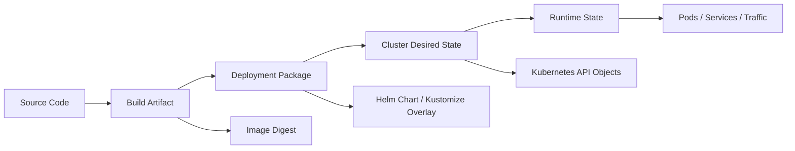
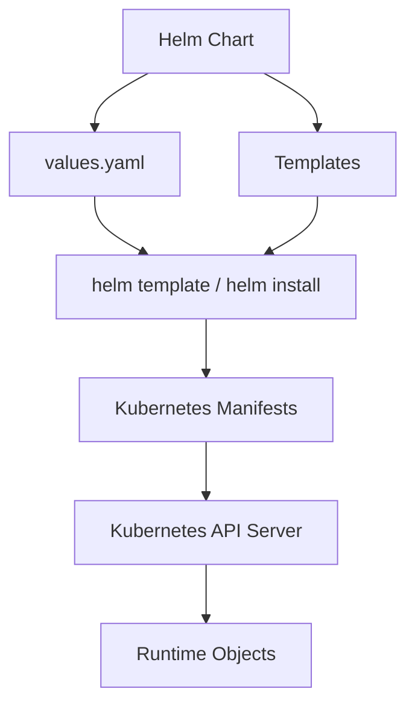
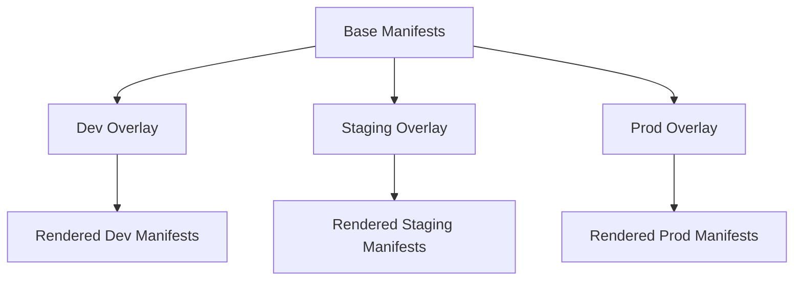
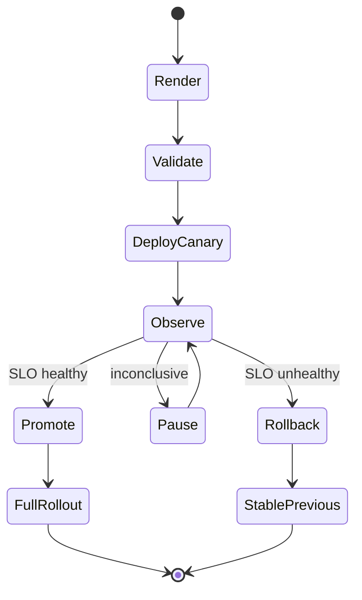
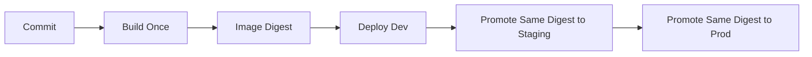
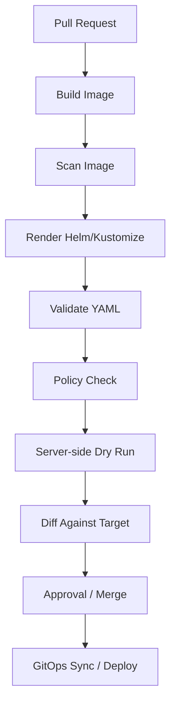

# Part 032 — Delivery with Helm, Kustomize, and Release Strategy

Kubernetes delivery is not the act of running `kubectl apply`.

Production delivery is the controlled movement of desired state across environments while preserving safety, auditability, rollback ability, and operational clarity.

This part focuses on:

- Helm;
- Kustomize;
- release strategy;
- environment promotion;
- progressive delivery;
- rollback contracts;
- AWS/Azure boundaries;
- failure modes;
- review checklists.

The invariant:

> A Kubernetes release is safe only when the manifest, artifact, configuration, runtime contract, and rollback path are all versioned and observable.

If the image is versioned but the values file is manually edited in production, the release is not reproducible.

If the manifest is reproducible but rollback breaks data compatibility, the release is not safe.

If deployment succeeds but no one can tell which version is serving traffic, delivery is not production-grade.

---

## 1. Delivery Mental Model

Kubernetes delivery has four state transitions:



Each transition can fail differently.

| Transition | Typical failure |
|---|---|
| Code → artifact | build/test failure, vulnerable dependency, wrong base image |
| Artifact → package | wrong image tag, invalid chart values, broken template |
| Package → desired state | admission denied, invalid API, RBAC failure, policy failure |
| Desired state → runtime state | image pull failure, probe failure, insufficient resources, bad config |
| Runtime state → traffic | ingress/backend health mismatch, readiness issue, route misconfiguration |

Production delivery engineering means controlling all five.

---

## 2. The Deployment Package Problem

Kubernetes manifests are declarative, but real systems need variation:

- dev/staging/prod differences;
- AWS vs Azure differences;
- region differences;
- cluster-specific ingress classes;
- secret provider differences;
- storage class differences;
- node pool selection;
- autoscaling thresholds;
- resource sizes;
- certificate issuers;
- external service endpoints;
- feature flags;
- policy constraints.

You need a packaging strategy.

The two dominant tools are:

- **Helm**: package + template + release management;
- **Kustomize**: template-free customization and overlays.

They solve related but different problems.

---

## 3. Helm: Mental Model

Helm is a Kubernetes package manager.

A Helm Chart is a parameterized application package.

A Helm release is an installed instance of a chart with specific values.



Helm is powerful because it lets platform/application teams define reusable deployment packages.

Helm is dangerous because it can hide Kubernetes truth behind template complexity.

### Helm Is Good For

- packaging reusable applications;
- publishing charts;
- installing third-party software;
- managing parameterized workloads;
- producing consistent manifests;
- versioning deployment package logic;
- managing chart dependencies.

### Helm Is Bad For

- arbitrary programming inside YAML;
- complex environment logic;
- hiding security-critical defaults;
- per-environment snowflake behavior;
- generating resources no one can review;
- replacing proper platform APIs.

The rule:

> Helm templates should reduce repetition, not create a second programming language no one debugs well.

---

## 4. Helm Chart Structure

A typical chart:

```text
checkout-api/
  Chart.yaml
  values.yaml
  templates/
    deployment.yaml
    service.yaml
    ingress.yaml
    serviceaccount.yaml
    hpa.yaml
    configmap.yaml
    secret-provider.yaml
    _helpers.tpl
  values.schema.json
  README.md
```

Important files:

| File | Purpose |
|---|---|
| `Chart.yaml` | chart metadata and version |
| `values.yaml` | default values |
| `templates/` | Kubernetes resource templates |
| `_helpers.tpl` | shared template helpers |
| `values.schema.json` | validates values contract |
| `README.md` | usage contract |

For production, `values.schema.json` is not optional hygiene. It is safety.

It prevents invalid values from silently rendering dangerous manifests.

---

## 5. Helm Versioning: Chart Version vs App Version

Helm has two important versions:

```yaml
apiVersion: v2
name: checkout-api
version: 1.8.3
appVersion: "2026.07.03-42"
```

| Field | Meaning |
|---|---|
| `version` | version of the chart/package |
| `appVersion` | version of the application being deployed |

Do not confuse them.

Examples:

- changing Deployment labels or probes means chart version changes;
- changing app image only may change appVersion and image digest;
- changing HPA defaults means chart version changes;
- changing config values in environment may not require chart version change but must still be committed and reviewed.

Production invariant:

> The exact chart version, values, and image digest must be recoverable after deployment.

---

## 6. Helm Values Hygiene

Most bad Helm systems fail because of values design.

### Bad Values

```yaml
image: checkout:latest
prod: true
useAzure: false
enableEverything: true
resources: {}
```

Problems:

- mutable tag;
- ambiguous environment boolean;
- cloud-specific logic hidden in app chart;
- unsafe global switch;
- no resource contract.

### Better Values

```yaml
image:
  registry: "myregistry.azurecr.io"
  repository: "platform/checkout-api"
  digest: "sha256:abc123..."
  pullPolicy: IfNotPresent

replicaCount: 4

resources:
  requests:
    cpu: "250m"
    memory: "512Mi"
  limits:
    memory: "768Mi"

serviceAccount:
  create: true
  name: checkout-api
  annotations:
    azure.workload.identity/client-id: "00000000-0000-0000-0000-000000000000"

podLabels:
  app.kubernetes.io/part-of: commerce
  app.kubernetes.io/component: api

probes:
  readiness:
    path: /ready
    initialDelaySeconds: 5
    periodSeconds: 5
  liveness:
    path: /live
    initialDelaySeconds: 20
    periodSeconds: 10
```

This is better because it makes runtime contracts explicit.

### Values Design Rules

1. Prefer explicit nested objects over flat bags.
2. Avoid environment booleans like `prod: true`.
3. Do not allow `latest` in production.
4. Validate values with schema.
5. Keep cloud-specific infrastructure concerns outside generic app charts when possible.
6. Document which values are safe for app teams to change.
7. Separate platform-owned and app-owned values.
8. Make dangerous features opt-in with clear names.

---

## 7. Example Helm Deployment Template

A compact but production-aware Deployment template:

```yaml
apiVersion: apps/v1
kind: Deployment
metadata:
  name: {{ include "checkout.fullname" . }}
  labels:
    {{- include "checkout.labels" . | nindent 4 }}
spec:
  replicas: {{ .Values.replicaCount }}
  strategy:
    type: RollingUpdate
    rollingUpdate:
      maxSurge: {{ .Values.strategy.maxSurge | default "25%" }}
      maxUnavailable: {{ .Values.strategy.maxUnavailable | default 0 }}
  selector:
    matchLabels:
      {{- include "checkout.selectorLabels" . | nindent 6 }}
  template:
    metadata:
      labels:
        {{- include "checkout.selectorLabels" . | nindent 8 }}
        app.kubernetes.io/version: {{ .Chart.AppVersion | quote }}
      annotations:
        checksum/config: {{ include (print $.Template.BasePath "/configmap.yaml") . | sha256sum }}
    spec:
      serviceAccountName: {{ include "checkout.serviceAccountName" . }}
      securityContext:
        runAsNonRoot: true
        seccompProfile:
          type: RuntimeDefault
      containers:
        - name: app
          image: "{{ .Values.image.registry }}/{{ .Values.image.repository }}@{{ .Values.image.digest }}"
          imagePullPolicy: {{ .Values.image.pullPolicy }}
          ports:
            - name: http
              containerPort: 8080
          readinessProbe:
            httpGet:
              path: {{ .Values.probes.readiness.path }}
              port: http
            periodSeconds: {{ .Values.probes.readiness.periodSeconds }}
          livenessProbe:
            httpGet:
              path: {{ .Values.probes.liveness.path }}
              port: http
            periodSeconds: {{ .Values.probes.liveness.periodSeconds }}
          resources:
            {{- toYaml .Values.resources | nindent 12 }}
          securityContext:
            allowPrivilegeEscalation: false
            readOnlyRootFilesystem: true
            capabilities:
              drop:
                - ALL
```

Notice the release-safety elements:

- image by digest;
- version label;
- config checksum rollout trigger;
- readiness/liveness;
- rolling update with zero unavailable;
- security context;
- explicit resources.

---

## 8. Helm Template Review Checklist

Before approving a chart:

- [ ] Does it render deterministic manifests?
- [ ] Are selector labels immutable and stable?
- [ ] Are app labels standard?
- [ ] Are images pinned by digest in prod?
- [ ] Are values validated with schema?
- [ ] Are dangerous defaults impossible?
- [ ] Are security contexts set?
- [ ] Are resources required?
- [ ] Are probes required?
- [ ] Are annotations documented?
- [ ] Are cloud-specific values isolated?
- [ ] Can `helm template` output be reviewed in CI?
- [ ] Does rollback restore the previous values and image digest?

---

## 9. Kustomize: Mental Model

Kustomize customizes Kubernetes YAML without templates.

It starts with a base and applies overlays.



Kustomize is strong when you want Kubernetes-native, reviewable patches.

It is especially useful when:

- base manifests are stable;
- environment differences are small and explicit;
- you want template-free review;
- platform overlays add policy, labels, resources, or patches;
- GitOps controllers apply overlays.

---

## 10. Kustomize Directory Structure

```text
apps/checkout-api/
  base/
    deployment.yaml
    service.yaml
    hpa.yaml
    kustomization.yaml
  overlays/
    dev/
      kustomization.yaml
      patch-resources.yaml
    staging/
      kustomization.yaml
      patch-replicas.yaml
    prod/
      kustomization.yaml
      patch-resources.yaml
      patch-hpa.yaml
```

Base:

```yaml
apiVersion: kustomize.config.k8s.io/v1beta1
kind: Kustomization
resources:
  - deployment.yaml
  - service.yaml
  - hpa.yaml
commonLabels:
  app.kubernetes.io/name: checkout-api
  app.kubernetes.io/part-of: commerce
```

Prod overlay:

```yaml
apiVersion: kustomize.config.k8s.io/v1beta1
kind: Kustomization
resources:
  - ../../base
namespace: commerce-prod
patches:
  - path: patch-resources.yaml
  - path: patch-hpa.yaml
images:
  - name: checkout-api
    newName: myregistry.azurecr.io/platform/checkout-api
    digest: sha256:abc123...
```

Patch:

```yaml
apiVersion: apps/v1
kind: Deployment
metadata:
  name: checkout-api
spec:
  replicas: 6
  template:
    spec:
      containers:
        - name: app
          resources:
            requests:
              cpu: "500m"
              memory: "1Gi"
            limits:
              memory: "1536Mi"
```

The benefit:

> The base remains readable Kubernetes YAML. Environment differences are explicit patches.

---

## 11. Helm vs Kustomize Decision Matrix

| Need | Prefer Helm | Prefer Kustomize |
|---|---:|---:|
| Package reusable product for many teams | yes | maybe |
| Install third-party platform software | yes | sometimes |
| Simple environment overlays | maybe | yes |
| Avoid templating | no | yes |
| Parameterize many optional resources | yes | no |
| Maintain reviewable Kubernetes YAML | maybe | yes |
| Chart repository/versioned package required | yes | no |
| GitOps app overlays | sometimes | yes |
| Complex library helpers | yes | no |
| Strict platform customization over vendor YAML | maybe | yes |

A practical architecture:

- use Helm for reusable packages and third-party apps;
- use Kustomize for environment overlays and final customization;
- render Helm in CI when necessary, then validate output;
- avoid stacking too many abstraction layers.

Common pattern:

```text
Helm chart -> rendered manifests -> Kustomize overlay -> policy validation -> GitOps sync
```

This is powerful, but only if the rendered output is reviewed and validated.

---

## 12. Release Strategy: What Are You Releasing?

A release is not only an image.

A release can change:

- image digest;
- app config;
- secrets reference;
- resource requests/limits;
- HPA behavior;
- probes;
- ingress route;
- TLS settings;
- ServiceAccount identity;
- NetworkPolicy;
- database migration;
- feature flags;
- API contract;
- dependency endpoint;
- RBAC;
- admission policy;
- CRD version.

Every release must be classified.

### Release Classification

| Release type | Risk | Example | Required controls |
|---|---|---|---|
| app-only | medium | new image digest | rollout, probes, rollback |
| config change | medium/high | payment timeout changed | config diff, restart/reload plan |
| infra-adjacent | high | ServiceAccount/IAM change | identity test, audit, rollback |
| traffic change | high | ingress route/TLS | edge validation, canary |
| data change | very high | schema migration | forward/backward compatibility |
| platform change | very high | CNI/ingress/controller upgrade | maintenance plan, rollback/restore |

Do not use the same release process for all categories.

---

## 13. Deployment Strategies

### Rolling Update

Default Kubernetes Deployment strategy.

Good for:

- stateless services;
- backward-compatible changes;
- normal releases;
- small risk changes.

Critical settings:

```yaml
strategy:
  type: RollingUpdate
  rollingUpdate:
    maxSurge: 25%
    maxUnavailable: 0
minReadySeconds: 10
progressDeadlineSeconds: 600
```

Use `maxUnavailable: 0` for critical services where capacity must not drop during rollout.

### Recreate

Stops old Pods before new Pods run.

Good for:

- workloads that cannot run two versions concurrently;
- single-writer systems;
- rare maintenance.

Danger:

- downtime by design.

### Blue/Green

Run old and new versions separately, switch traffic.

Good for:

- high-risk releases;
- fast rollback requirement;
- traffic-router support;
- expensive initialization.

Danger:

- double capacity;
- data compatibility;
- hidden state divergence.

### Canary

Send small traffic percentage to new version.

Good for:

- user-impact risk reduction;
- progressive validation;
- metrics-driven promotion.

Danger:

- requires traffic splitting;
- requires good metrics;
- can be misleading if canary traffic is not representative.

### Shadow

Copy traffic to new version but do not serve responses.

Good for:

- performance validation;
- dependency behavior;
- parsing/compatibility.

Danger:

- duplicate side effects if not designed carefully;
- cost increase;
- privacy/compliance issues.

---

## 14. Progressive Delivery Control Loop

Progressive delivery is a control loop:



The control loop needs:

- traffic splitting;
- metric analysis;
- rollback automation;
- deployment markers;
- clear success criteria;
- timeout behavior;
- human override path.

Without these, "canary" is just a smaller blast radius with manual hope.

---

## 15. Rollback Contract

Rollback is not "apply old YAML".

Rollback has constraints.

### Rollback Must Restore

- image digest;
- chart version;
- values;
- ConfigMap/Secret references;
- ingress route;
- HPA behavior;
- feature flags;
- ServiceAccount/IAM mapping if changed;
- database compatibility assumptions.

### Rollback Cannot Always Restore

- destructive database migration;
- external side effects;
- message format consumed by downstream systems;
- changed cache contents;
- deleted cloud resources;
- mutated CRDs;
- one-way policy changes.

Production rule:

> Every high-risk release must define its rollback boundary before deployment.

### Rollback Decision Table

| Change | Safe rollback? | Notes |
|---|---|---|
| image-only, backward compatible | usually yes | if config unchanged |
| probe change | yes | but may cause traffic flap |
| resource request change | yes | may reschedule Pods |
| ingress route change | yes | if previous route preserved |
| secret rotation | maybe | depends old secret validity |
| IAM removal | maybe | restore role assignment may need propagation |
| DB additive migration | usually yes | if old app ignores new column |
| DB destructive migration | no | restore requires backup/data repair |
| event schema breaking change | no | downstream may already consume bad events |

---

## 16. Release Metadata Standard

Every deployed object should carry enough metadata to answer:

- what is this?
- who owns it?
- which version is running?
- when was it deployed?
- by which pipeline?
- from which commit?
- which chart/overlay produced it?

Recommended labels/annotations:

```yaml
metadata:
  labels:
    app.kubernetes.io/name: checkout-api
    app.kubernetes.io/instance: checkout-api-prod
    app.kubernetes.io/version: "2026.07.03-42"
    app.kubernetes.io/component: api
    app.kubernetes.io/part-of: commerce
    app.kubernetes.io/managed-by: Helm
    platform.company.com/team: payments
    platform.company.com/tier: critical
  annotations:
    platform.company.com/git-sha: "a1b2c3d4"
    platform.company.com/chart-version: "1.8.3"
    platform.company.com/release-id: "rel-20260703-1042"
    platform.company.com/runbook: "https://internal/runbooks/checkout-api"
```

Do not put secrets in annotations.

---

## 17. Environment Promotion Model

A production-grade release process promotes artifacts, not guesses.

Bad model:

```text
dev builds image A
staging builds image B
prod builds image C
```

This means prod is not what staging tested.

Better model:



The artifact should be built once and promoted.

Environment-specific differences should be explicit overlays/values, not rebuilt code.

### Promotion Gates

| Gate | Checks |
|---|---|
| build | unit tests, SAST, dependency scan |
| package | render manifests, schema validate, lint |
| policy | admission/policy-as-code simulation |
| dev | smoke tests |
| staging | integration, performance, migration rehearsal |
| prod canary | SLO, errors, latency, logs |
| full prod | burn-rate and rollback watch |

---

## 18. CI Validation Pipeline

Before anything reaches the cluster, validate the package.



Suggested checks:

- `helm lint`;
- `helm template`;
- `kustomize build`;
- YAML schema validation;
- Kubernetes API validation;
- server-side dry-run;
- policy-as-code check;
- image signature/provenance check;
- forbidden field check;
- deprecated API check;
- resource request/limit check;
- Service selector/endpoints sanity;
- NetworkPolicy baseline;
- ingress hostname/TLS consistency.

---

## 19. Server-Side Dry Run

Client-side rendering is not enough.

A manifest can render valid YAML but still fail against the cluster API because of:

- missing CRD;
- unsupported API version;
- admission policy;
- invalid field;
- RBAC;
- webhook rejection;
- namespace policy.

Use server-side dry-run in a representative cluster when possible:

```bash
kubectl apply --dry-run=server -f rendered.yaml
```

This catches errors closer to runtime truth.

Caveat:

- dry-run still cannot prove runtime success;
- it cannot pull image;
- it cannot prove readiness;
- it cannot validate actual cloud dependency permissions;
- it may trigger admission side effects if webhooks are badly written.

---

## 20. Diff as a Safety Tool

A release review should show what changes.

Useful diff questions:

- Did selector labels change?
- Did Service target port change?
- Did resources decrease?
- Did security context weaken?
- Did ServiceAccount change?
- Did ingress hostname/path change?
- Did NetworkPolicy restrict traffic?
- Did HPA target change?
- Did storage class or PVC template change?
- Did image digest change?
- Did ConfigMap/Secret reference change?

Diff should be reviewed at rendered manifest level, not just values level.

Values diffs can hide template effects.

---

## 21. AWS and Azure Delivery Boundaries

The same app chart may need different cloud integration values.

### EKS Example Differences

- image registry: ECR;
- ServiceAccount annotation for EKS Pod Identity or IRSA;
- ingress class: ALB controller;
- load balancer annotations;
- storage class: EBS/EFS CSI;
- node selectors for Karpenter/managed node groups;
- security groups for pods;
- ACM certificate ARN;
- Route 53 external DNS annotations.

### AKS Example Differences

- image registry: ACR;
- ServiceAccount annotation/label for Workload Identity;
- ingress class: Application Gateway / NGINX / Gateway API controller;
- Azure Load Balancer annotations;
- storage class: Azure Disk/Azure Files;
- node selectors for system/user pools;
- Key Vault CSI provider configuration;
- Azure DNS external DNS configuration;
- managed identity client ID.

Avoid mixing these directly into generic app logic.

Prefer:

```text
base application contract
+ cloud-specific platform overlay
+ environment-specific overlay
```

---

## 22. Example Multi-Cloud Directory Strategy

```text
platform-delivery/
  apps/
    checkout-api/
      chart/
      overlays/
        aws/
          eks-prod-us-east-1/
            values.yaml
            kustomization.yaml
        azure/
          aks-prod-southeastasia/
            values.yaml
            kustomization.yaml
  clusters/
    aws/
      prod-us-east-1/
    azure/
      prod-southeastasia/
  policies/
  pipelines/
  runbooks/
```

The key separation:

- app chart owns workload contract;
- cloud overlay owns cloud integration;
- environment overlay owns size, scale, endpoint, and rollout risk;
- policy layer owns guardrails.

---

## 23. Delivery Failure Modes

### Failure Mode 1: Mutable Image Tag

Symptom:

- rollback deploys a different artifact than before;
- staging and prod have same tag but different digest;
- incident cannot identify exact binary.

Fix:

- deploy by digest;
- store image digest in release metadata;
- forbid `latest` in policy.

### Failure Mode 2: Template Logic Too Clever

Symptom:

- chart behavior differs unexpectedly by values;
- reviewers cannot predict rendered output;
- simple changes break unrelated resources.

Fix:

- simplify chart;
- move complex logic to platform abstraction;
- validate rendered manifests;
- use values schema.

### Failure Mode 3: Selector Label Change

Symptom:

- Deployment creates new ReplicaSet but Service points to no Pods;
- rollback difficult;
- orphaned Pods.

Fix:

- treat selector labels as immutable;
- enforce policy;
- test rendered Service/Pod selector match.

### Failure Mode 4: Config Changed Without Rollout

Symptom:

- ConfigMap changed but Pods still run old config;
- teams think deployment is live but runtime unchanged.

Fix:

- use checksum annotation for restart-on-config-change;
- or implement explicit reload sidecar/app reload;
- define config reload contract.

### Failure Mode 5: Rollback Breaks Due to Database Migration

Symptom:

- app rollback starts but fails on missing/changed column;
- old version cannot read new data.

Fix:

- expand/contract migration;
- backward-compatible schema changes;
- migration rehearsal;
- feature flags;
- rollback boundary review.

### Failure Mode 6: Canary Without Metrics

Symptom:

- canary is manually promoted because "pods look healthy";
- user errors increase after full rollout.

Fix:

- require SLO metrics;
- define analysis window;
- automate rollback on burn-rate/error/latency threshold.

### Failure Mode 7: Environment Drift

Symptom:

- production differs from Git;
- manual hotfix survives unnoticed;
- next deployment overwrites unexpected state.

Fix:

- GitOps drift detection;
- forbid manual production mutation except break-glass;
- audit changes;
- reconcile from source of truth.

### Failure Mode 8: Cloud Annotation Drift

Symptom:

- load balancer behavior changes silently;
- ingress controller creates unexpected resources;
- identity annotation points to wrong role/client ID.

Fix:

- cloud-specific annotations owned by platform overlay;
- validate annotation allowlist;
- diff rendered manifests.

---

## 24. Release Readiness Checklist

Before production release:

### Artifact

- [ ] Image built once and promoted.
- [ ] Image digest recorded.
- [ ] Vulnerability scan completed.
- [ ] Signature/provenance validated where required.
- [ ] SBOM available where required.

### Package

- [ ] Helm/Kustomize renders successfully.
- [ ] Values schema passes.
- [ ] Deprecated API check passes.
- [ ] Policy-as-code check passes.
- [ ] Server-side dry-run passes.
- [ ] Rendered diff reviewed.

### Runtime

- [ ] Requests/limits defined.
- [ ] Probes defined and tested.
- [ ] Security context meets baseline.
- [ ] ServiceAccount identity correct.
- [ ] Config and secret references valid.
- [ ] HPA/KEDA behavior understood.

### Traffic

- [ ] Ingress/Gateway route validated.
- [ ] TLS certificate valid.
- [ ] Backend health check aligns with readiness.
- [ ] Canary/blue-green strategy defined if needed.

### Rollback

- [ ] Previous image digest known.
- [ ] Previous values/overlay known.
- [ ] Data migration rollback boundary understood.
- [ ] Rollback command/runbook documented.
- [ ] Observability watch period defined.

---

## 25. Rollout Runbook

### Step 1: Render

```bash
helm dependency update ./chart
helm lint ./chart
helm template checkout-api ./chart -f values-prod.yaml > rendered.yaml
```

Or:

```bash
kustomize build overlays/prod > rendered.yaml
```

### Step 2: Validate

```bash
kubectl apply --dry-run=server -f rendered.yaml
```

Run policy and schema checks in CI.

### Step 3: Diff

Review changes.

Pay special attention to:

- selectors;
- ServiceAccount;
- image digest;
- resources;
- ingress;
- NetworkPolicy;
- probes;
- HPA;
- PVC templates.

### Step 4: Deploy

```bash
kubectl apply -f rendered.yaml
kubectl -n commerce-prod rollout status deploy/checkout-api --timeout=10m
```

Or use Helm/GitOps according to platform standard.

### Step 5: Observe

Check:

- availability;
- error rate;
- latency;
- restarts;
- readiness failures;
- ingress backend health;
- dependency failures;
- logs/traces.

### Step 6: Promote or Rollback

If healthy:

- continue rollout;
- increase traffic;
- close release watch.

If unhealthy:

- pause rollout;
- rollback;
- preserve evidence;
- create incident/release review.

---

## 26. Helm Rollback Caution

Helm has rollback support, but do not treat it as magic.

```bash
helm history checkout-api -n commerce-prod
helm rollback checkout-api <revision> -n commerce-prod
```

This can restore previous chart/values state, but it does not guarantee:

- database rollback;
- external resource rollback;
- message compatibility;
- cloud IAM propagation;
- cache correctness;
- traffic controller health;
- old image still available;
- old secret still valid.

A Helm rollback is a manifest rollback, not a business-state rollback.

---

## 27. Policy Guardrails for Delivery

Use policy-as-code to reject unsafe releases.

Examples:

- no `latest` tag;
- require digest in prod;
- require resources;
- require readiness probe;
- forbid privileged containers;
- require `runAsNonRoot`;
- allow only approved ingress classes;
- allow only approved storage classes;
- forbid changing selector labels;
- require owner labels;
- restrict LoadBalancer Services;
- require TLS on external routes;
- reject unapproved cloud annotations.

Policy should protect platform invariants, not encode arbitrary style preferences.

---

## 28. Delivery Ownership Model

A mature platform separates responsibilities.

| Concern | App team | Platform team | Security team |
|---|---:|---:|---:|
| app image | owns | supports pipeline | scans/policy |
| Helm chart app contract | owns | templates/standards | reviews guardrails |
| cluster add-ons | consumes | owns | reviews |
| ingress class | consumes | owns | reviews exposure |
| ServiceAccount identity | requests | implements/approves pattern | reviews least privilege |
| NetworkPolicy | owns intent | provides defaults/tools | reviews segmentation |
| deployment pipeline | uses | owns paved road | enforces controls |
| production rollback | owns app decision | supports platform actions | involved if security issue |

The best model is paved-road self-service with guardrails.

Not ticket-driven Kubernetes bureaucracy.

---

## 29. Deliberate Practice

### Exercise 1: Render and Review

Take one service chart.

Render it for dev, staging, and prod.

Compare:

- image digest;
- replicas;
- resources;
- ServiceAccount;
- ingress;
- HPA;
- security context;
- labels;
- annotations.

Pass condition:

> You can explain every environment difference as an intentional operational decision.

### Exercise 2: Break a Selector

In a staging environment, intentionally change a Service selector so it no longer matches Pods.

Observe:

- Service has no endpoints;
- ingress returns 503;
- Pods are healthy but traffic fails.

Write the detection rule that would have caught it before deployment.

### Exercise 3: Rollback Drill

Deploy version A, then version B, then rollback to A.

Record:

- image digest;
- chart version;
- values;
- rollout time;
- metrics;
- logs;
- failed assumptions.

Pass condition:

> Rollback is repeatable without tribal knowledge.

### Exercise 4: Config Change Drill

Change a ConfigMap value.

Verify whether Pods reload or restart.

Document:

- reload strategy;
- checksum annotation;
- observed rollout behavior;
- failure mode if config is invalid.

### Exercise 5: Canary Gate

Define a canary promotion rule for one service:

- 5% traffic for 10 minutes;
- error rate below threshold;
- p95 latency below threshold;
- no increase in dependency failures;
- rollback if threshold violated.

Then simulate failure.

---

## 30. Mental Model Recap

Helm, Kustomize, and release strategy are not just tooling choices.

They define how your organization moves desired state safely.

A production-grade Kubernetes delivery system has these properties:

- reproducible artifact;
- reviewable manifests;
- validated policy;
- explicit environment differences;
- safe rollout strategy;
- observable deployment;
- known rollback boundary;
- clear ownership;
- no hidden manual drift.

The simplest test:

> Can a new platform engineer reconstruct exactly what is running in production, why it differs from staging, how it was released, and how to roll it back safely?

If yes, your delivery system is becoming mature.

If no, you have automation, but not release engineering.

---

## References

- Helm Documentation — Helm: https://helm.sh/
- Helm Documentation — Chart Template Guide: https://helm.sh/docs/chart_template_guide/
- Helm Documentation — Values Files: https://helm.sh/docs/chart_template_guide/values_files/
- Helm Documentation — Chart Best Practices: Values: https://helm.sh/docs/chart_best_practices/values/
- Kubernetes Documentation — Declarative Management of Kubernetes Objects Using Kustomize: https://kubernetes.io/docs/tasks/manage-kubernetes-objects/kustomization/
- Kustomize project: https://kustomize.io/
- Kubernetes Documentation — Deployments: https://kubernetes.io/docs/concepts/workloads/controllers/deployment/
- Kubernetes Documentation — Managing Resources for Containers: https://kubernetes.io/docs/concepts/configuration/manage-resources-containers/
