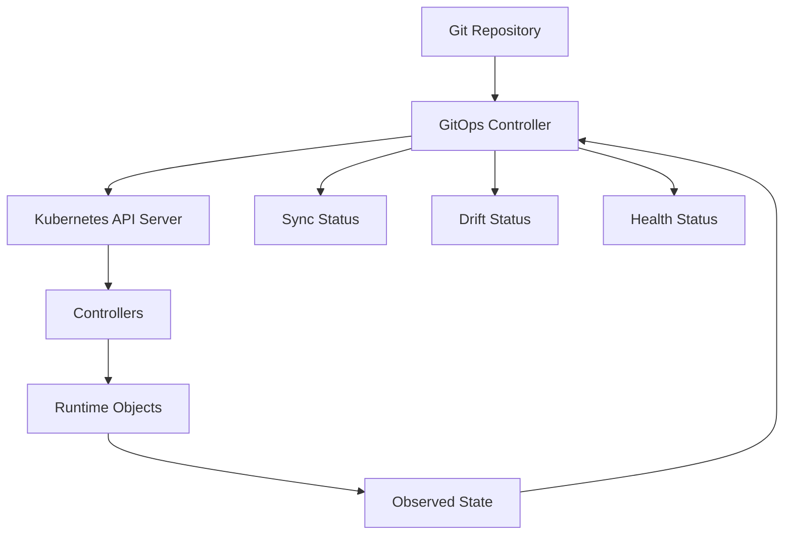
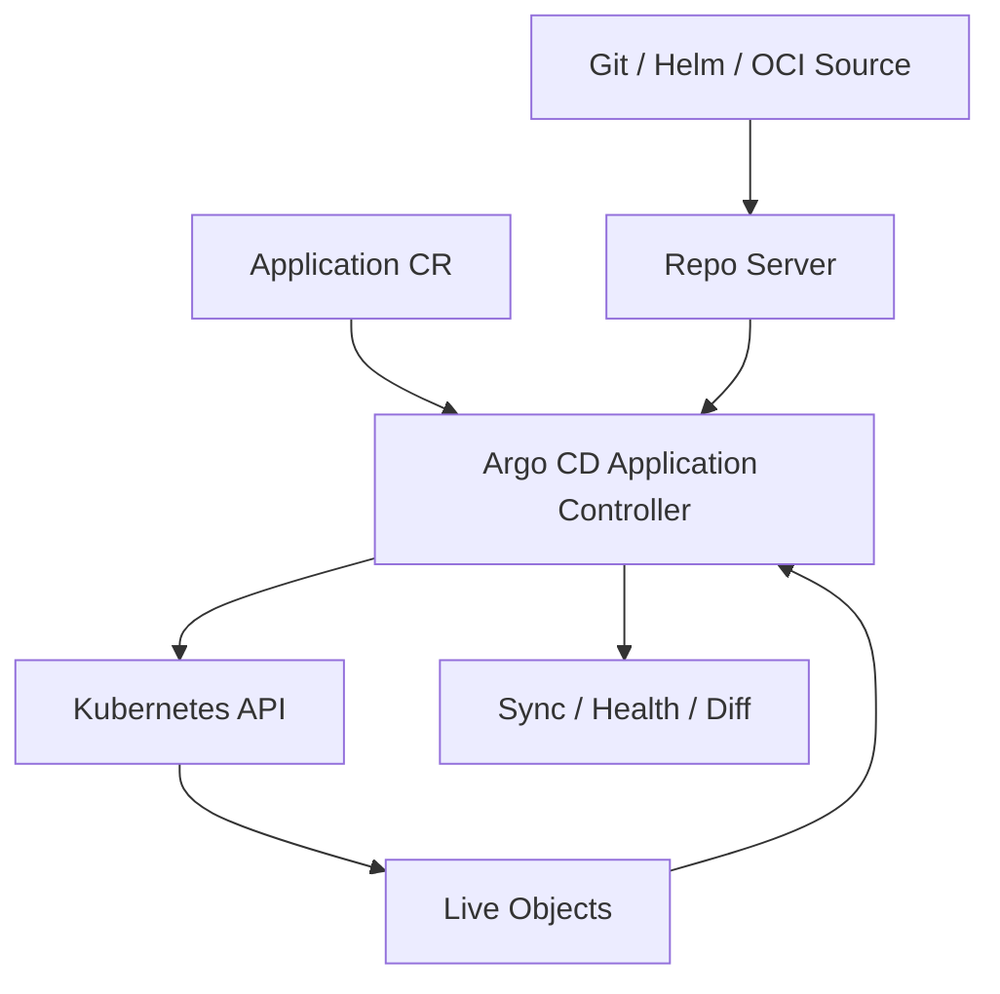
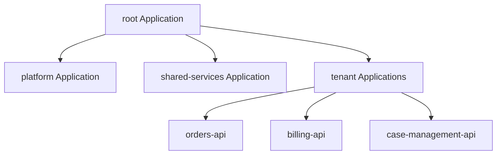
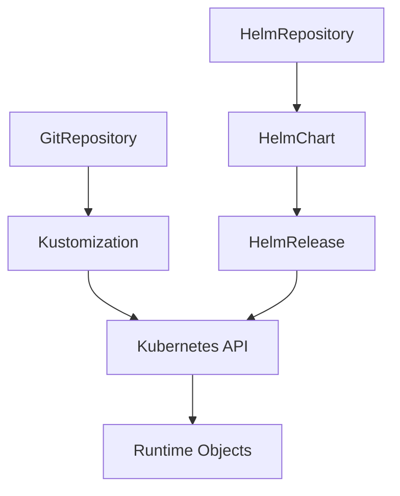
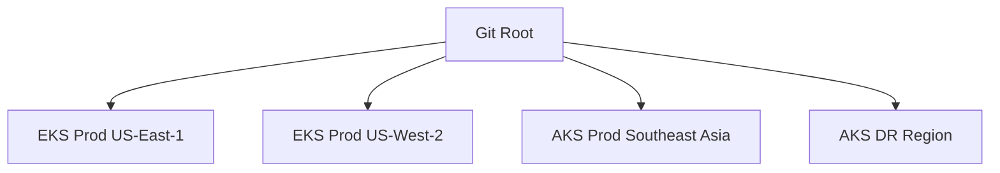
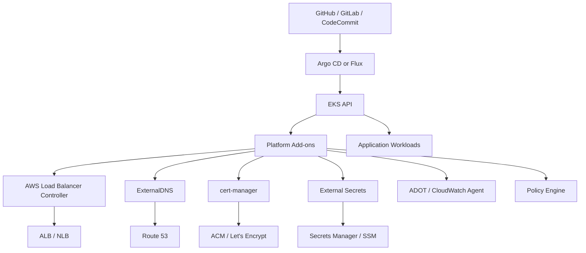
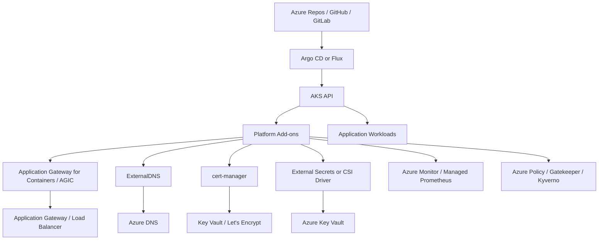
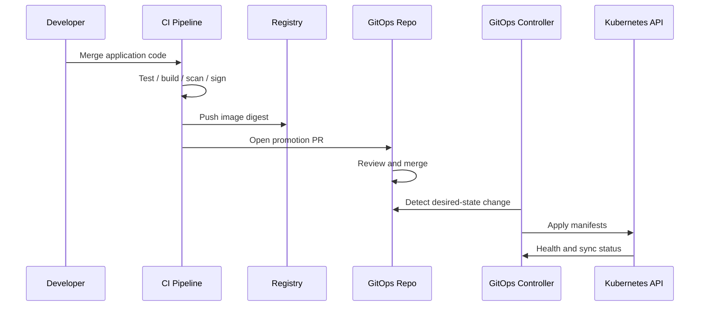

# Part 033 — GitOps with Argo CD / Flux and Environment Promotion

GitOps is not “put YAML in Git”.

GitOps is an operating model where Git stores the desired state, an in-cluster reconciler continuously compares desired state to live state, and every change is traceable, reviewable, reversible, and observable.

The important shift is ownership.

Without GitOps, deployment is usually a command:

```bash
kubectl apply -f production.yaml
```

With GitOps, deployment becomes a reconciled contract:

```text
Git desired state -> GitOps controller -> Kubernetes API -> runtime state -> drift signal
```

That difference matters in production because Kubernetes itself is already a reconciliation system. GitOps simply adds another reconciliation layer above the cluster.

The invariant:

> A production Kubernetes platform should not depend on a person or CI job manually pushing mutable live state into a cluster. It should converge from versioned desired state.

This part covers:

- GitOps mental model;
- Argo CD;
- Flux;
- repository topology;
- app-of-apps and application sets;
- environment promotion;
- secrets;
- drift;
- rollback;
- multi-cluster delivery;
- EKS/AKS integration;
- failure modes;
- production runbooks.

---

## 1. Mental Model: GitOps as a Second Control Plane

Kubernetes reconciles API objects.

GitOps reconciles the desired-state source into Kubernetes API objects.



The GitOps controller does not replace Kubernetes controllers. It feeds them.

A Deployment controller still manages ReplicaSets.
A Service controller still manages endpoints.
A cloud load balancer controller still creates ALB/NLB or Azure Load Balancer resources.
A certificate controller still requests and renews certificates.

GitOps should own the desired shape of those controllers.

### 1.1 The Three States

Every GitOps system compares three states:

| State | Meaning | Example |
|---|---|---|
| Desired state | What Git says should exist | `replicas: 6` |
| Live state | What Kubernetes API says exists | `replicas: 4` |
| Runtime state | What is actually happening | only 2 Pods are Ready |

A mature platform never confuses those states.

A manifest can be synced but the workload unhealthy.
A workload can be healthy but drifted.
A live object can match Git but external cloud resources can still fail.

Example:

```text
Argo CD: Synced
Deployment: Available=True
ALB: target group has unhealthy targets
User experience: failing
```

The correct incident question is not “is Argo green?”

The correct question is:

> Which control loop is failing to converge?

---

## 2. Why GitOps Exists

GitOps solves several production problems that grow with team count.

### 2.1 Auditability

A production change should answer:

- who changed it;
- what changed;
- why it changed;
- which review approved it;
- which environment received it;
- whether the cluster converged;
- whether the workload stayed healthy.

Manual `kubectl edit` breaks that chain.

### 2.2 Drift Detection

Drift means the live cluster differs from Git.

Drift may happen because:

- someone edited an object manually;
- a controller mutated fields;
- a cloud integration added annotations;
- a Helm chart rendered differently;
- a secret was rotated outside Git;
- a policy controller mutated workloads;
- a failed deployment left partial resources.

Drift is not always bad. Unexplained drift is bad.

### 2.3 Safer Promotion

A good GitOps design makes promotion explicit:

```text
dev -> staging -> production
```

Promotion should not mean rebuilding the artifact.

A safer model:

```text
same image digest + environment-specific config + reviewed promotion PR
```

If production uses a different image than staging, staging did not validate production.

### 2.4 Cluster Bootstrap

A new cluster should be reconstructable from source of truth:

```text
cluster primitives -> GitOps controller -> platform components -> application workloads
```

If a cluster cannot be rebuilt from Git and infrastructure state, the platform has hidden state.

---

## 3. Argo CD Mental Model

Argo CD is a Kubernetes-native GitOps controller. It watches application definitions, compares live state to target state, and syncs differences.

Core objects:

| Object | Responsibility |
|---|---|
| `Application` | Defines one desired-state unit from source to destination |
| `AppProject` | Defines boundaries: repos, clusters, namespaces, allowed resources |
| `ApplicationSet` | Generates multiple Applications from templates/generators |
| Repo server | Renders manifests from Git/Helm/Kustomize |
| Application controller | Compares and syncs applications |
| API/UI server | Provides UI/API access |
| Dex/SSO integration | Optional identity integration |



### 3.1 Minimal Argo CD Application

```yaml
apiVersion: argoproj.io/v1alpha1
kind: Application
metadata:
  name: orders-api-prod
  namespace: argocd
spec:
  project: regulated-platform
  source:
    repoURL: https://git.example.com/platform/apps.git
    targetRevision: main
    path: apps/orders-api/overlays/prod
  destination:
    server: https://kubernetes.default.svc
    namespace: orders-prod
  syncPolicy:
    automated:
      prune: true
      selfHeal: true
    syncOptions:
      - CreateNamespace=false
      - ApplyOutOfSyncOnly=true
```

Read it as a contract:

```text
For namespace orders-prod, reconcile this path from this Git revision under this governance project.
```

### 3.2 Sync Policy

Argo CD has two core sync modes:

| Mode | Meaning | Use Case |
|---|---|---|
| Manual sync | Human or pipeline triggers convergence | high-risk apps, migration, regulated approval |
| Automated sync | Controller syncs changes automatically | platform add-ons, low-risk apps, mature promotion flow |

Automated sync options need discipline.

`prune: true` means remove resources that disappeared from Git.
That is powerful and dangerous.

`selfHeal: true` means Argo tries to correct manual drift.
That is excellent for guardrails, but dangerous if operators use manual edits during incidents.

Production rule:

> Use `selfHeal` only when the team has a clear emergency override procedure.

### 3.3 Sync Waves and Phases

Some resources must be applied in order:

- namespace before namespaced resources;
- CRD before custom resources;
- secret before deployment;
- policy exceptions before policy enforcement;
- database migration job before application rollout;
- gateway before route.

Argo CD supports ordering through hooks and sync waves.

```yaml
metadata:
  annotations:
    argocd.argoproj.io/sync-wave: "10"
```

Example ordering:

| Wave | Resource |
|---:|---|
| -10 | Namespace |
| -5 | ResourceQuota / LimitRange |
| 0 | ConfigMap / Secret |
| 5 | ServiceAccount / RBAC |
| 10 | Service |
| 20 | Deployment |
| 30 | Ingress / HTTPRoute |
| 40 | Smoke-test Job |

Do not overuse sync waves. If every object has a wave number, the repo is encoding procedural logic instead of declarative dependency boundaries.

### 3.4 App-of-Apps Pattern

The app-of-apps pattern uses one parent Application to create child Applications.



This works well for cluster bootstrap.

But it can create hidden blast radius if the root app automatically prunes child apps.

Production guardrail:

> Treat root applications like cluster bootloaders. Keep them small, stable, and heavily reviewed.

### 3.5 ApplicationSet Pattern

ApplicationSet is useful when you need to generate many similar Applications.

Common generators:

- list generator;
- Git directory generator;
- cluster generator;
- matrix generator;
- pull-request generator.

Example use cases:

- deploy the same platform add-on to every cluster;
- deploy tenant workloads across environments;
- create preview environments from pull requests;
- fan out apps by region.

Mental model:

```text
ApplicationSet = factory for Application objects
Application = desired-state reconciliation unit
```

If an ApplicationSet generator changes unexpectedly, it can create or delete many Applications. Protect it with strict review.

---

## 4. Flux Mental Model

Flux is a set of GitOps controllers. Instead of one central `Application` object, Flux composes reconciliation through source and workload-specific resources.

Core objects:

| Object | Responsibility |
|---|---|
| `GitRepository` | Fetches manifests from Git |
| `OCIRepository` | Fetches manifests/packages from OCI registry |
| `HelmRepository` | References Helm chart repository |
| `HelmChart` | Produces chart artifact |
| `HelmRelease` | Installs/upgrades Helm chart |
| `Kustomization` | Builds/applies Kustomize/plain manifests |
| Image automation resources | Detect and update image versions |



Flux feels less like “one app object” and more like “a pipeline of reconciled objects”.

### 4.1 Minimal Flux Kustomization

```yaml
apiVersion: source.toolkit.fluxcd.io/v1
kind: GitRepository
metadata:
  name: platform-config
  namespace: flux-system
spec:
  interval: 1m
  url: https://git.example.com/platform/config.git
  ref:
    branch: main
---
apiVersion: kustomize.toolkit.fluxcd.io/v1
kind: Kustomization
metadata:
  name: orders-api-prod
  namespace: flux-system
spec:
  interval: 5m
  sourceRef:
    kind: GitRepository
    name: platform-config
  path: ./apps/orders-api/overlays/prod
  prune: true
  wait: true
  timeout: 3m
```

Read it as:

```text
Fetch this source periodically, build this path, apply it, prune removed objects, and wait for readiness.
```

### 4.2 Flux HelmRelease

```yaml
apiVersion: helm.toolkit.fluxcd.io/v2
kind: HelmRelease
metadata:
  name: external-dns
  namespace: platform-dns
spec:
  interval: 10m
  chart:
    spec:
      chart: external-dns
      version: "1.15.x"
      sourceRef:
        kind: HelmRepository
        name: external-dns
        namespace: flux-system
  values:
    provider: aws
    policy: sync
```

Flux reconciles Helm declaratively. It is not equivalent to a CI job running `helm upgrade`.

### 4.3 Dependency Ordering in Flux

Flux supports `dependsOn` in Kustomization resources.

```yaml
apiVersion: kustomize.toolkit.fluxcd.io/v1
kind: Kustomization
metadata:
  name: platform-apps
  namespace: flux-system
spec:
  dependsOn:
    - name: platform-crds
    - name: platform-policies
  path: ./clusters/prod/apps
  prune: true
  wait: true
```

Good usage:

- CRDs before CRs;
- namespaces before workloads;
- policy engine before policy resources;
- ingress controller before Ingress/Gateway resources.

Bad usage:

- encoding every application startup order;
- compensating for bad readiness probes;
- hiding fragile dependencies.

---

## 5. Argo CD vs Flux Decision Model

Both tools are production-capable. The decision is usually about operating model, not correctness.

| Dimension | Argo CD | Flux |
|---|---|---|
| UX | Strong UI and app-centric model | CLI/controller-centric, composable CRDs |
| Main abstraction | `Application` | Source + `Kustomization`/`HelmRelease` |
| Multi-app generation | `ApplicationSet` | Git/Kustomization composition, automation controllers |
| Human operations | Excellent UI for diff/sync/rollback | Strong Git-native and automation flow |
| Helm | Supported through Application source | First-class HelmRelease controller |
| Image automation | Possible via ecosystem/pipelines | Native image automation toolkit |
| Bootstrap style | Argo CD install + root app | `flux bootstrap` creates GitOps root |
| Team preference | Better for visual operations teams | Better for controller-composition teams |

Practical recommendation:

- Choose **Argo CD** when you want strong visual operations, application inventory, sync UI, and platform/app ownership clarity.
- Choose **Flux** when you want composable controllers, Git-native automation, strong HelmRelease lifecycle, and less UI-centric operations.

Do not choose both for the same resources.

Running Argo CD and Flux in the same cluster is acceptable only when they own disjoint domains:

```text
Argo owns application namespaces.
Flux owns platform add-ons.
```

Even then, resource ownership must be explicit.

---

## 6. Repository Topology

Repository layout is architecture.

A poor layout creates unclear ownership, unsafe promotion, merge conflicts, and operational ambiguity.

### 6.1 Monorepo vs Polyrepo

| Layout | Benefits | Risks |
|---|---|---|
| Single platform monorepo | global visibility, easier policy review, consistent structure | large blast radius, noisy PRs, complex ownership |
| App repo owns manifests | app autonomy, close to code | duplicate patterns, weak platform governance |
| Environment repo | clear promotion and audit | more repos, needs tooling discipline |
| Hybrid | balances ownership and platform consistency | requires clear boundaries |

There is no universal answer.

The invariant:

> The repository topology must match the ownership topology.

If the platform team approves all production namespace changes, production manifests should live in a place where platform review is natural.

If app teams own service config but not ingress/security policy, split those resources.

### 6.2 Recommended Production Layout

For regulated or enterprise environments, use a hybrid layout:

```text
platform-gitops/
  clusters/
    eks-prod-use1/
      bootstrap/
      platform/
      tenants/
    aks-prod-sea/
      bootstrap/
      platform/
      tenants/
  platform-components/
    ingress/
    cert-manager/
    external-dns/
    policies/
    observability/
  tenant-baselines/
    namespace/
    quota/
    network-policy/
    rbac/

application-config/
  apps/
    orders-api/
      base/
      overlays/
        dev/
        staging/
        prod/
    case-management-api/
      base/
      overlays/
        dev/
        staging/
        prod/
```

Platform repo owns:

- cluster bootstrap;
- controllers;
- CRDs;
- ingress layer;
- policy layer;
- observability layer;
- namespace factories;
- quotas;
- baseline RBAC;
- NetworkPolicy defaults.

Application config repo owns:

- app Deployment;
- app Service;
- app HPA/KEDA scaler;
- app config references;
- app route resources when allowed;
- app-specific dashboards/alerts.

### 6.3 Avoid Environment Branches

A common anti-pattern:

```text
main = dev
staging branch = staging
prod branch = prod
```

This makes diffing environments harder and creates branch drift.

Prefer directories or explicit promotion commits:

```text
apps/orders-api/overlays/dev
apps/orders-api/overlays/staging
apps/orders-api/overlays/prod
```

or:

```text
environments/dev/apps/orders-api.yaml
environments/staging/apps/orders-api.yaml
environments/prod/apps/orders-api.yaml
```

Branches are for development flow. Environments are product states.

Do not confuse them.

---

## 7. Environment Promotion Model

A production promotion model has four independent artifacts:

| Artifact | Example | Should change during promotion? |
|---|---|---|
| Container image | `sha256:abc...` | No |
| Kubernetes manifest | Deployment, Service, HPA | Sometimes |
| Runtime config | env-specific config | Yes, intentionally |
| Policy context | quota, network, allowed secrets | Rarely |

The cleanest promotion:

```text
Build once -> test image digest -> promote same digest -> apply env config -> observe SLO
```

### 7.1 Digest-Based Promotion

Bad:

```yaml
image: registry.example.com/orders-api:latest
```

Better:

```yaml
image: registry.example.com/orders-api:1.42.0@sha256:4ec0...
```

The tag helps humans.
The digest identifies the artifact.

### 7.2 Promotion Pull Request

A production promotion PR should show:

```diff
- image: registry.example.com/orders-api:1.41.3@sha256:old
+ image: registry.example.com/orders-api:1.42.0@sha256:new
```

It should link to:

- build result;
- vulnerability scan;
- SBOM/provenance;
- staging deployment;
- smoke test result;
- migration notes;
- rollback plan;
- SLO risk.

### 7.3 Promotion Gates

Use gates appropriate to risk:

| Gate | Low-Risk Service | High-Risk Service |
|---|---|---|
| Unit/integration tests | required | required |
| Manifest validation | required | required |
| Policy validation | required | required |
| Security scan | required | required |
| Staging bake time | short | longer |
| Manual approval | optional | required |
| Progressive rollout | recommended | required |
| Change ticket | optional | often required |

Do not make every service follow the heaviest process. Platform maturity means risk-based control.

---

## 8. Drift Management

Drift has categories.

| Drift Type | Example | Action |
|---|---|---|
| Emergency manual drift | operator scales deployment during incident | capture, review, backport or revert |
| Controller-managed drift | status fields, generated annotations | ignore or configure diff rules |
| Policy mutation drift | Kyverno adds labels/securityContext | move mutation into base manifest or accept as generated |
| Cloud-provider drift | LB annotations/status | ignore status/generated fields |
| Unauthorized drift | manual edit to production image | alert and self-heal/revert |

### 8.1 Drift Policy

Define allowed drift explicitly:

```text
Allowed:
- status fields
- controller-generated finalizers
- cert-manager certificate status
- HPA-managed replica count when HPA owns scaling

Not allowed:
- image changes
- env var changes
- ServiceAccount changes
- securityContext relaxation
- ingress host changes
- NetworkPolicy removal
```

### 8.2 HPA and GitOps Conflict

Common bug:

```yaml
spec:
  replicas: 4
```

HPA changes replicas to 10.
GitOps sees drift and changes replicas back to 4.

Fix:

- remove `spec.replicas` from Git-managed Deployment after HPA creation, or
- configure diff ignore for `spec.replicas`, depending on controller/tooling.

The invariant:

> A field should have one owner.

If HPA owns replica count, Git should not fight it.

---

## 9. Secrets in GitOps

Never store plaintext production secrets in Git.

GitOps does not remove secret management. It forces you to design it.

Patterns:

| Pattern | Description | Fit |
|---|---|---|
| External Secrets Operator | Sync cloud secret store into Kubernetes Secret | strong for AWS/Azure |
| Sealed Secrets | Encrypt Secret for cluster-specific decryption | simple Git-native use |
| SOPS + age/KMS | Encrypt files in Git; decrypt during reconciliation | strong GitOps pattern |
| CSI Secret Store | Mount secrets directly from provider | avoids Secret object in some modes |
| Manual Secret | Created outside Git | acceptable only as exception |

### 9.1 EKS Secret Pattern

Recommended shape:

```text
AWS Secrets Manager / SSM Parameter Store
  -> External Secrets Operator
  -> Kubernetes Secret
  -> Pod volume/env reference
```

Identity:

```text
External Secrets controller ServiceAccount -> EKS Pod Identity / IRSA -> IAM role -> secret read policy
```

### 9.2 AKS Secret Pattern

Recommended shape:

```text
Azure Key Vault
  -> External Secrets Operator or Secrets Store CSI Driver
  -> Kubernetes Secret or mounted file
  -> Pod runtime reference
```

Identity:

```text
ServiceAccount -> AKS Workload Identity -> user-assigned managed identity -> Key Vault access
```

### 9.3 Secret Rotation Contract

A secret rotation is not complete when cloud secret value changes.

It is complete when:

- provider value is rotated;
- Kubernetes projection is updated;
- workload reloads or restarts safely;
- old credential is revoked;
- audit trail is captured;
- dependent systems confirm success.

GitOps only helps with declared wiring. It does not magically reload application processes.

---

## 10. Multi-Cluster GitOps

Multi-cluster GitOps introduces fan-out risk.



One bad commit can affect every cluster.

Guardrails:

- separate global platform components from cluster-local configuration;
- use staged rollout across clusters;
- avoid auto-sync to all clusters at once for high-risk changes;
- use cluster labels and generators carefully;
- require extra review for ApplicationSet/Flux generator changes;
- maintain per-cluster break-glass path.

### 10.1 Cluster Directory Pattern

```text
clusters/
  eks-prod-use1/
    kustomization.yaml
    platform.yaml
    tenants.yaml
  eks-prod-usw2/
    kustomization.yaml
    platform.yaml
    tenants.yaml
  aks-prod-sea/
    kustomization.yaml
    platform.yaml
    tenants.yaml
```

Each cluster should be independently understandable.

Do not force engineers to mentally execute a huge templating system to know what production contains.

---

## 11. AWS EKS GitOps Blueprint

A strong EKS GitOps stack often looks like this:



### 11.1 EKS Bootstrap Order

Recommended order:

1. provision VPC/subnets/IAM/EKS cluster through IaC;
2. configure cluster access entries and admin identity;
3. install GitOps controller;
4. bootstrap platform root application;
5. install CRDs/controllers;
6. install policy engine in audit mode;
7. install networking/ingress controllers;
8. install observability;
9. install secret integration;
10. enable tenant namespace factory;
11. deploy application workloads.

GitOps should not create the cluster itself unless your organization has a very mature cluster API/IaC integration.

### 11.2 EKS Anti-Patterns

Avoid:

- GitOps controller with broad AWS permissions;
- application teams editing AWS LB annotations without guardrails;
- GitOps owning `aws-auth` legacy access config without migration plan;
- one Argo CD instance with admin access to all clusters and weak SSO;
- storing IAM role ARNs in app repos without platform review;
- auto-pruning CRDs before CRs are cleaned up;
- using a central app repo that every team can modify without CODEOWNERS.

---

## 12. Azure AKS GitOps Blueprint

A strong AKS GitOps stack often looks like this:



### 12.1 AKS Bootstrap Order

Recommended order:

1. provision resource group/VNet/AKS/identity through IaC;
2. enable Entra ID integration and workload identity;
3. configure cluster admin access model;
4. install or enable GitOps controller;
5. deploy policy engine and baseline policies;
6. deploy ingress/gateway layer;
7. deploy Azure Monitor/Managed Prometheus/Grafana;
8. deploy Key Vault integration;
9. deploy namespace factory;
10. deploy workloads.

### 12.2 AKS Anti-Patterns

Avoid:

- mixing Azure RBAC and Kubernetes RBAC without clear ownership;
- giving GitOps controller excessive Azure permissions;
- letting app teams mutate managed identity bindings without review;
- using public cluster endpoints without access restrictions in regulated environments;
- GitOps reconciling generated AKS add-on resources directly;
- ignoring Azure Policy mutations/denials in GitOps diff strategy.

---

## 13. CI/CD and GitOps Boundary

CI and GitOps should not fight.

CI should:

- test code;
- build image;
- scan image;
- sign image;
- publish SBOM/provenance;
- update desired state through PR or automation;
- run validation before merge.

GitOps should:

- reconcile desired state;
- report drift;
- apply manifests;
- track sync/health;
- prune removed resources when allowed;
- provide cluster deployment evidence.

Bad boundary:

```text
CI builds image -> CI runs kubectl apply -> Argo detects drift -> Argo reverts
```

Good boundary:

```text
CI builds image -> CI opens promotion PR -> PR merges -> GitOps reconciles
```

### 13.1 Pipeline Skeleton



---

## 14. Progressive Delivery with GitOps

GitOps applies desired state. Progressive delivery controls traffic exposure.

Tools often used:

- Argo Rollouts;
- Flagger;
- service mesh traffic splitting;
- Gateway API route weights;
- cloud load balancer weighted routing;
- feature flags.

The important model:

```text
GitOps owns desired rollout object.
Rollout controller owns progressive traffic shift.
Observability owns judgment signal.
```

Example simplified canary object:

```yaml
apiVersion: argoproj.io/v1alpha1
kind: Rollout
metadata:
  name: orders-api
spec:
  replicas: 6
  strategy:
    canary:
      steps:
        - setWeight: 10
        - pause: { duration: 5m }
        - setWeight: 50
        - pause: { duration: 10m }
        - setWeight: 100
```

This is not safe by itself.

Safety requires:

- metric analysis;
- rollback criteria;
- alert integration;
- schema compatibility;
- idempotent migration;
- operator visibility.

---

## 15. Rollback Model

GitOps rollback is often described too casually.

“Revert the commit” only works if the old version is compatible with current runtime state.

Rollback dimensions:

| Dimension | Example Risk |
|---|---|
| Image rollback | old app cannot read new data |
| Config rollback | old config references deleted secret |
| Manifest rollback | old API version no longer served |
| Database rollback | migration is irreversible |
| Cloud resource rollback | load balancer annotation changed infrastructure |
| Policy rollback | old workload violates new policy |

Production rollback contract:

```text
Every production promotion must define whether rollback is automatic, manual, or impossible.
```

If rollback is impossible, define roll-forward strategy.

### 15.1 GitOps Rollback Runbook

1. Identify failing revision.
2. Confirm whether workload, config, or platform layer failed.
3. Check whether data migration occurred.
4. Confirm old image digest still exists in registry.
5. Revert promotion commit or apply emergency patch branch.
6. Watch GitOps sync.
7. Watch rollout status.
8. Watch SLO and business metrics.
9. Backport emergency change to mainline.
10. Write incident notes.

Never leave production in a manual patch state without a Git reconciliation follow-up.

---

## 16. Access Control for GitOps

GitOps controller permissions are sensitive.

If compromised, the controller can deploy arbitrary workloads.

### 16.1 Minimum Permission Model

Separate controllers/projects by blast radius:

| Domain | Permissions |
|---|---|
| Bootstrap | cluster-scoped, heavily restricted admin path |
| Platform add-ons | selected cluster-scoped resources and namespaces |
| Tenant apps | namespaced resources only |
| Preview envs | isolated namespace, limited resources |

For Argo CD, use `AppProject` to restrict:

- source repositories;
- destination clusters;
- destination namespaces;
- allowed cluster resources;
- allowed namespaced resources.

For Flux, use:

- scoped service accounts;
- namespace isolation;
- Kustomization `serviceAccountName`;
- repository access separation;
- admission policy.

### 16.2 Git Access Is Production Access

Anyone who can merge to the production desired-state repo can change production.

Treat Git repo permissions as production permissions.

Controls:

- CODEOWNERS;
- branch protection;
- signed commits/tags where required;
- mandatory PR review;
- status checks;
- environment-specific approval;
- restricted deploy keys;
- audit log export;
- break-glass path.

---

## 17. Failure Modes

### 17.1 GitOps Controller Down

Symptoms:

- no new deployments;
- drift not corrected;
- sync status stale.

Existing workloads usually keep running.

Runbook:

```bash
kubectl get pods -n argocd
kubectl get pods -n flux-system
kubectl describe pod <controller>
kubectl logs <controller>
```

Check:

- API connectivity;
- DNS;
- repo credentials;
- memory/CPU limits;
- webhook/cert issues;
- network policy.

### 17.2 Git Repository Unreachable

Symptoms:

- reconciliation fails;
- source artifact not updated;
- controller logs auth/network error.

Common causes:

- expired token;
- rotated deploy key;
- firewall egress block;
- Git provider outage;
- DNS issue;
- TLS inspection issue.

Mitigation:

- keep workloads running from last applied state;
- fix source access;
- do not manually apply production unless incident severity demands it;
- document drift if manual patch is required.

### 17.3 Bad Manifest Merged

Symptoms:

- sync failure;
- admission denial;
- rollout failure;
- service outage.

Runbook:

1. Inspect GitOps diff/status.
2. Identify failing object.
3. Check Kubernetes events.
4. Check admission webhook/policy denial.
5. Revert or patch desired state.
6. Confirm sync and health.

### 17.4 Prune Deletes Critical Resource

This is one of the most dangerous GitOps incidents.

Causes:

- path restructuring;
- generator bug;
- label selector mistake;
- ApplicationSet deletion;
- wrong repo path;
- shared resource owned by multiple apps.

Guardrails:

- disable prune for high-risk root apps;
- use orphaned resource monitoring before deletion;
- use sync windows;
- protect namespaces/CRDs/PVCs with policy;
- require review for generator changes;
- test with staging cluster.

### 17.5 Two Controllers Own Same Object

Symptoms:

- continuous drift;
- object flapping;
- managed fields conflict;
- annotations constantly change;
- rollout instability.

Fix:

- establish one owner;
- split resources;
- configure ignore only for controller-owned fields;
- remove duplicate definition.

---

## 18. Production Checklist

### 18.1 Repo Checklist

- [ ] Production desired state is versioned.
- [ ] Environments are explicit.
- [ ] CODEOWNERS maps to real ownership.
- [ ] Branch protection is enabled.
- [ ] Promotion PR shows image digest changes.
- [ ] Secrets are encrypted or externalized.
- [ ] Generated manifests are validated in CI.
- [ ] Policy checks run before merge.

### 18.2 Controller Checklist

- [ ] GitOps controller is highly available enough for the environment.
- [ ] Controller has scoped permissions.
- [ ] Controller resources have requests/limits.
- [ ] Controller logs/metrics are collected.
- [ ] Repo credentials are rotated and monitored.
- [ ] Drift alerts exist for high-risk apps.
- [ ] Sync failure alerts exist.
- [ ] Emergency manual patch procedure exists.

### 18.3 Application Checklist

- [ ] HPA-owned fields do not fight GitOps.
- [ ] Rollback path is defined.
- [ ] Readiness probes represent serving readiness.
- [ ] Config is environment-specific and reviewed.
- [ ] Ingress/Gateway changes are controlled.
- [ ] NetworkPolicy changes are reviewed.
- [ ] ServiceAccount/IAM changes require elevated approval.

---

## 19. Deliberate Practice

### Exercise 1 — Build a GitOps Repo Layout

Design repository layout for:

- 2 EKS clusters;
- 1 AKS cluster;
- 5 application teams;
- shared ingress;
- shared observability;
- per-team namespaces;
- production promotion approval.

Deliver:

- directory tree;
- ownership map;
- promotion flow;
- CODEOWNERS sample.

### Exercise 2 — Identify Field Ownership Conflict

Given:

- Deployment has `replicas: 3` in Git;
- HPA scales to 12;
- Argo CD self-heal is enabled.

Explain:

- what conflict happens;
- how to detect it;
- how to fix it;
- whether the fix differs for Argo CD vs Flux.

### Exercise 3 — Production Promotion PR

Create a promotion PR template with sections for:

- image digest;
- SBOM/provenance;
- scan result;
- staging evidence;
- migration risk;
- rollback contract;
- SLO risk;
- approvers.

### Exercise 4 — GitOps Incident Runbook

Write a runbook for:

```text
A production ApplicationSet change removed 20 Applications from an EKS cluster.
```

Include:

- first 10 minutes;
- containment;
- recovery;
- audit;
- prevention.

---

## 20. Key Takeaways

GitOps is not a tool choice. It is a production operating model.

Argo CD and Flux both implement reconciliation from source of truth, but they shape team workflows differently.

A strong GitOps design makes these things explicit:

- desired-state ownership;
- repository topology;
- environment promotion;
- drift policy;
- secret management;
- controller permissions;
- rollback contract;
- multi-cluster blast radius;
- emergency override.

The deepest rule:

> GitOps works when Git is the source of truth and every controller has clear ownership. GitOps fails when Git becomes just another deployment script repository.

---

## References

- Argo CD Documentation — https://argo-cd.readthedocs.io/
- Argo CD Sync Phases and Waves — https://argo-cd.readthedocs.io/en/stable/user-guide/sync-waves/
- Flux Documentation — https://fluxcd.io/flux/
- Flux Concepts — https://fluxcd.io/flux/concepts/
- Flux Kustomization API — https://fluxcd.io/flux/components/kustomize/kustomizations/
- Kubernetes Server-Side Apply — https://kubernetes.io/docs/reference/using-api/server-side-apply/
- Kubernetes Declarative Management — https://kubernetes.io/docs/tasks/manage-kubernetes-objects/declarative-config/
