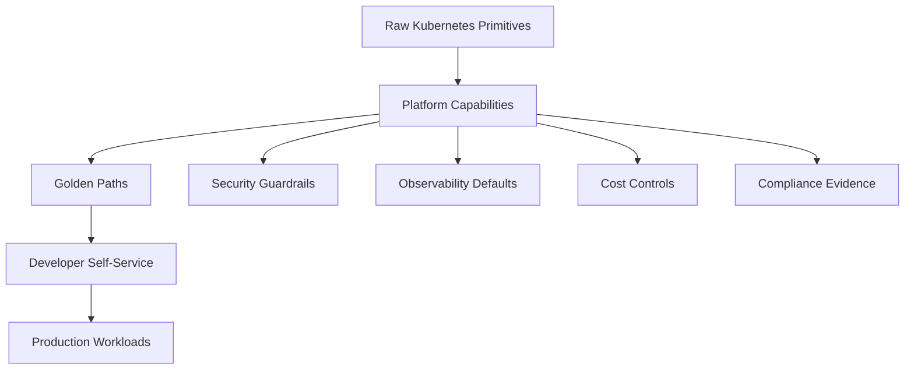
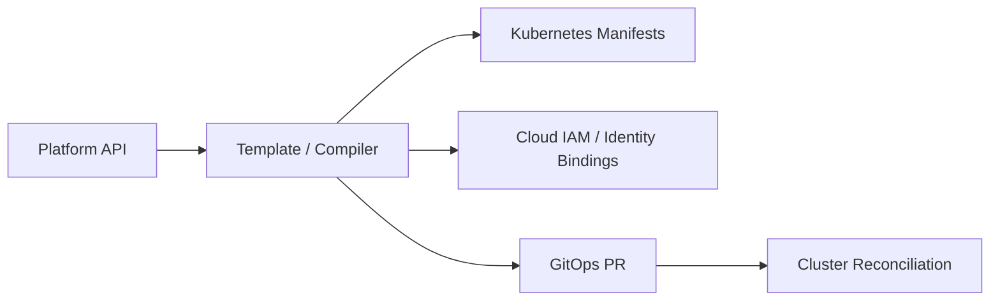
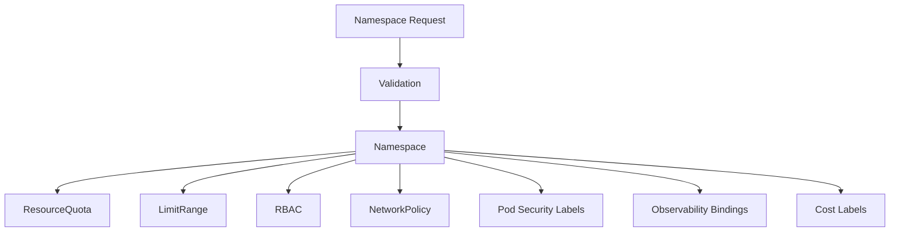
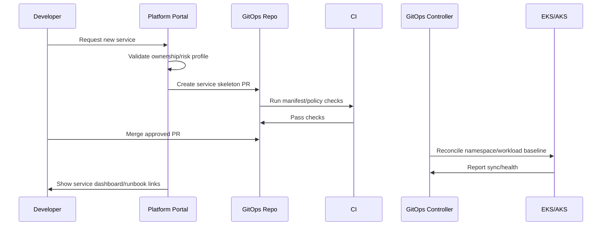
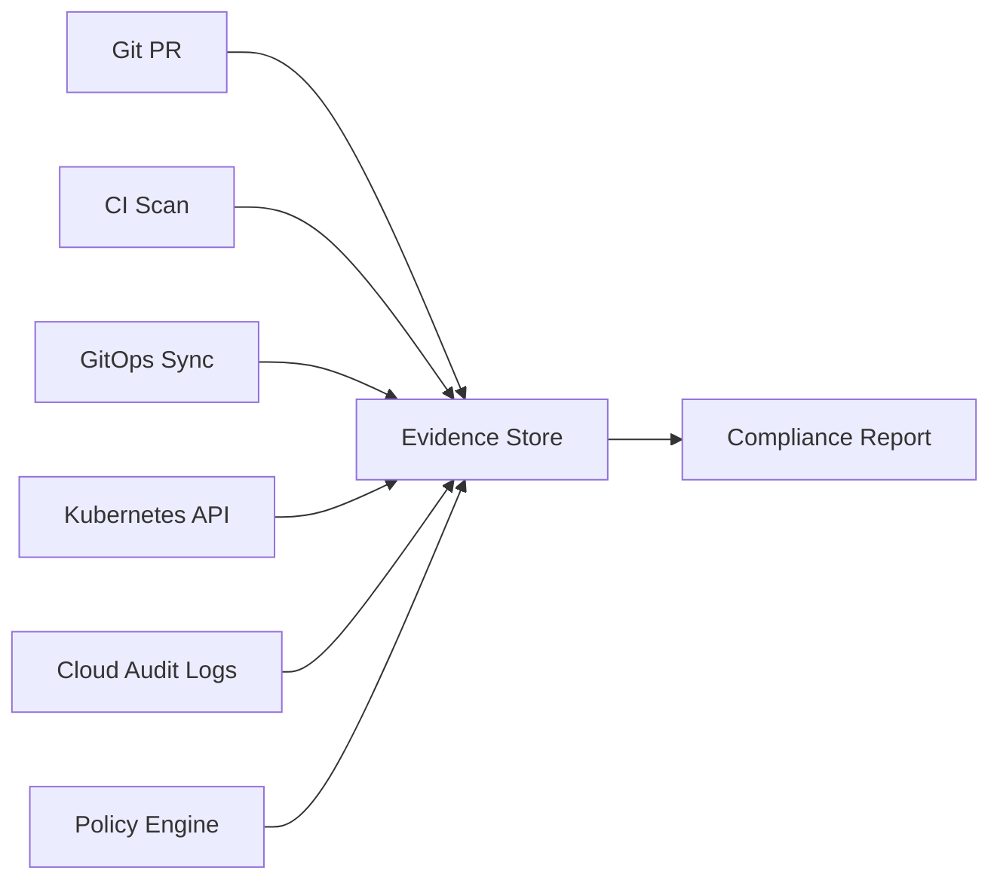
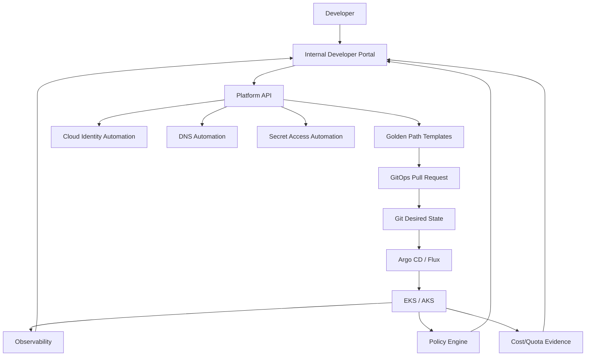

# Part 034 — Platform Engineering and Internal Developer Platform

Kubernetes by itself is not a developer platform.

Kubernetes is a powerful substrate. It exposes primitives: Pod, Deployment, Service, Ingress, Gateway, Secret, ServiceAccount, NetworkPolicy, HPA, PVC, and many others.

Application teams should not need to compose all of those primitives from scratch every time they ship a service.

A production organization needs a platform layer.

The goal of platform engineering is not to hide Kubernetes completely. The goal is to package safe, supported, observable, and compliant paths so teams can move faster without accidentally bypassing production constraints.

The invariant:

> An Internal Developer Platform should reduce cognitive load without removing the important engineering contracts.

This part covers:

- platform engineering mental model;
- Internal Developer Platform architecture;
- golden paths;
- platform APIs;
- namespace factory;
- workload templates;
- service onboarding;
- paved-road delivery;
- scorecards;
- AWS/Azure integration;
- governance;
- operating model;
- failure modes.

---

## 1. Kubernetes Is Not the Product

A common failure in Kubernetes adoption is assuming that giving teams cluster access equals giving them a platform.

It does not.

Raw Kubernetes asks application teams to answer too many questions:

- Which namespace should I use?
- Which labels are mandatory?
- Which ingress controller should I target?
- Which DNS zone owns my hostname?
- How do I get TLS?
- How do I access AWS Secrets Manager or Azure Key Vault?
- How do I configure Pod identity?
- Which resource requests are sane?
- Which probes are required?
- Which NetworkPolicy baseline applies?
- How do I get metrics, logs, and traces?
- How do I promote to production?
- How do I roll back?
- Who approves IAM or managed identity changes?
- What is the SLO template?

A platform exists to encode the answer once, then expose a stable interface.



The platform is not merely a UI.

It is a productized operating model.

---

## 2. Platform Engineering Mental Model

A platform is an integrated set of capabilities presented according to user needs.

For Kubernetes, those capabilities typically include:

| Capability | Kubernetes/Cloud Backing |
|---|---|
| Runtime | EKS, AKS, node pools, autoscaling |
| Delivery | GitOps, Helm, Kustomize, CI promotion |
| Networking | Service, Gateway API, ALB/NLB, Application Gateway, DNS |
| Identity | ServiceAccount, EKS Pod Identity/IRSA, AKS Workload Identity |
| Secrets | AWS Secrets Manager, SSM, Azure Key Vault, ESO/CSI |
| Observability | Prometheus, CloudWatch, Azure Monitor, Grafana, tracing |
| Policy | RBAC, Pod Security, Kyverno, OPA, Azure Policy |
| Reliability | probes, SLOs, rollout, DR, runbooks |
| Cost | quotas, requests, node pools, chargeback/showback |
| Governance | approvals, audit, exception lifecycle |

The platform team packages those capabilities into abstractions.

### 2.1 Platform as Product

Platform-as-product means:

- application developers are users;
- platform capabilities have documentation;
- onboarding time is measured;
- friction is treated as product feedback;
- platform APIs are versioned;
- breaking changes are managed;
- support is explicit;
- adoption is not forced by chaos.

The platform team should not merely run clusters.

It should provide a reliable path from idea to production.

### 2.2 Cognitive Load Budget

Kubernetes has too many knobs.

A good platform decides which knobs developers should see.

Expose:

- service name;
- owner team;
- container image;
- runtime size profile;
- route exposure;
- secrets needed;
- dependencies;
- SLO class;
- data sensitivity;
- scaling profile.

Hide or default:

- low-level pod labels;
- standard probes;
- common resource requests;
- baseline NetworkPolicy;
- common security context;
- common telemetry sidecars/agents;
- standard annotations;
- namespace boilerplate.

Do not hide things that affect production semantics.

If a team chooses “public internet route”, they must understand exposure, auth, WAF, TLS, and approval implications.

---

## 3. The Platform API

A platform API is the interface developers use to request capabilities.

It can be implemented as:

- Git repository template;
- YAML contract;
- Backstage software template;
- internal portal form;
- Kubernetes custom resource;
- Terraform module;
- Crossplane composite resource;
- service catalog request;
- CLI command.

The implementation matters less than the contract.

Example platform API:

```yaml
apiVersion: platform.example.com/v1alpha1
kind: WebService
metadata:
  name: orders-api
spec:
  owner: team-orders
  runtime:
    language: java
    size: medium
    image: registry.example.com/orders-api:1.42.0@sha256:abcd
  exposure:
    type: internal
    host: orders.internal.example.com
  scaling:
    minReplicas: 3
    maxReplicas: 20
    metric: cpu
  identity:
    cloudAccess:
      aws:
        roleProfile: orders-read-secrets
      azure:
        managedIdentityProfile: orders-read-keyvault
  secrets:
    - name: db-credential
      providerRef: orders/prod/db
  reliability:
    sloClass: tier-1
    rollout: canary
```

This is not raw Kubernetes. It is a product contract.

The platform compiler can render:

- Namespace;
- ResourceQuota;
- LimitRange;
- ServiceAccount;
- RBAC;
- ExternalSecret;
- Deployment;
- Service;
- HPA/KEDA scaler;
- HTTPRoute/Ingress;
- NetworkPolicy;
- PodDisruptionBudget;
- ServiceMonitor/alerts;
- dashboard links;
- runbook stub.



### 3.1 Platform API Design Rules

A good platform API is:

- small enough for developers to understand;
- expressive enough for production differences;
- versioned;
- validated;
- policy-aware;
- auditable;
- reversible;
- compatible with GitOps;
- documented with examples;
- observable after deployment.

Bad platform API:

```yaml
podSpec: {}
```

If the platform API exposes the entire PodSpec, it is no longer an abstraction. It is just Kubernetes with extra steps.

Good platform API exposes intent:

```yaml
runtime:
  size: medium
  cpuBurst: false
```

The platform decides the exact request/limit profile.

---

## 4. Golden Path vs Paved Road

A golden path is the recommended end-to-end path for a common workload.

A paved road is the supported infrastructure and tooling behind that path.

Example:

```text
Golden path:
Create a Java REST service with internal route, database secret, HPA, logs, metrics, traces, and production promotion.

Paved road:
Template + GitOps + namespace factory + identity binding + ingress + observability + policy + runbook.
```

Golden paths should be opinionated.

Not every edge case should be in the first path.

### 4.1 Minimum Golden Paths

For an EKS/AKS enterprise platform, start with:

| Golden Path | Purpose |
|---|---|
| Internal HTTP service | default backend service |
| Public HTTP service | internet-facing service with WAF/TLS approval |
| Worker/consumer service | queue/stream/event processor |
| Scheduled job | CronJob with observability and retry defaults |
| Stateful integration shell | app that consumes managed DB/cache but does not run DB in cluster |
| Platform add-on onboarding | install controller/operator safely |
| Preview environment | short-lived per-PR environment |

Do not start with 30 paths. Start with the top 3 high-volume paths and make them excellent.

### 4.2 Golden Path Contract

Every golden path should include:

- what it creates;
- what it does not create;
- ownership model;
- production readiness requirements;
- security defaults;
- cost profile;
- rollback behavior;
- observability outputs;
- support boundary;
- escape hatch.

Escape hatch matters.

If the platform blocks all non-standard work, teams will bypass it.
If the platform allows everything, it stops being a platform.

The balance:

```text
standard path by default, exception path by review
```

---

## 5. Namespace Factory

A namespace is not just a folder.

In Kubernetes production, a namespace is a governance boundary.

A namespace factory creates a namespace with all required baseline objects.



### 5.1 Namespace Baseline

A production namespace should include:

- standardized labels;
- owner/team metadata;
- environment metadata;
- cost center metadata;
- Pod Security Admission labels;
- ResourceQuota;
- LimitRange;
- default deny NetworkPolicy;
- allowed DNS egress policy;
- RBAC bindings;
- ServiceAccount conventions;
- secret access boundary;
- observability scraping rules;
- alert routing metadata.

Example:

```yaml
apiVersion: v1
kind: Namespace
metadata:
  name: orders-prod
  labels:
    platform.example.com/team: team-orders
    platform.example.com/env: prod
    platform.example.com/cost-center: cc-142
    pod-security.kubernetes.io/enforce: restricted
    pod-security.kubernetes.io/audit: restricted
    pod-security.kubernetes.io/warn: restricted
```

ResourceQuota example:

```yaml
apiVersion: v1
kind: ResourceQuota
metadata:
  name: compute-quota
  namespace: orders-prod
spec:
  hard:
    requests.cpu: "24"
    requests.memory: 96Gi
    limits.memory: 128Gi
    pods: "80"
```

Default deny example:

```yaml
apiVersion: networking.k8s.io/v1
kind: NetworkPolicy
metadata:
  name: default-deny
  namespace: orders-prod
spec:
  podSelector: {}
  policyTypes:
    - Ingress
    - Egress
```

A namespace without baseline guardrails is an unmanaged tenancy boundary.

---

## 6. Workload Template

A workload template should encode production invariants.

Baseline Deployment:

```yaml
apiVersion: apps/v1
kind: Deployment
metadata:
  name: orders-api
  labels:
    app.kubernetes.io/name: orders-api
    app.kubernetes.io/part-of: order-management
    app.kubernetes.io/managed-by: platform
spec:
  selector:
    matchLabels:
      app.kubernetes.io/name: orders-api
  strategy:
    type: RollingUpdate
    rollingUpdate:
      maxSurge: 25%
      maxUnavailable: 0
  minReadySeconds: 10
  template:
    metadata:
      labels:
        app.kubernetes.io/name: orders-api
        platform.example.com/tier: tier-1
    spec:
      serviceAccountName: orders-api
      automountServiceAccountToken: false
      terminationGracePeriodSeconds: 45
      securityContext:
        seccompProfile:
          type: RuntimeDefault
      containers:
        - name: app
          image: registry.example.com/orders-api:1.42.0@sha256:abcd
          ports:
            - containerPort: 8080
              name: http
          resources:
            requests:
              cpu: "500m"
              memory: "768Mi"
            limits:
              memory: "1Gi"
          readinessProbe:
            httpGet:
              path: /health/ready
              port: http
            periodSeconds: 10
            failureThreshold: 3
          livenessProbe:
            httpGet:
              path: /health/live
              port: http
            periodSeconds: 20
            failureThreshold: 3
          startupProbe:
            httpGet:
              path: /health/startup
              port: http
            periodSeconds: 5
            failureThreshold: 30
          securityContext:
            runAsNonRoot: true
            allowPrivilegeEscalation: false
            readOnlyRootFilesystem: true
            capabilities:
              drop: ["ALL"]
```

The template should not be blindly copied.

It should be generated from platform intent and tuned by workload class.

### 6.1 Runtime Size Profiles

Instead of asking every team to choose CPU/memory from scratch, define profiles:

| Profile | CPU Request | Memory Request | Memory Limit | Fit |
|---|---:|---:|---:|---|
| small | 250m | 384Mi | 512Mi | low traffic internal service |
| medium | 500m | 768Mi | 1Gi | default REST service |
| large | 1 | 2Gi | 3Gi | heavier service |
| xlarge | 2 | 4Gi | 6Gi | high throughput service |
| custom | reviewed | reviewed | reviewed | special cases |

Profiles reduce noise but still need measurement.

Right-sizing should feed back from observability.

---

## 7. Service Onboarding Flow

A mature onboarding flow should create production-grade assets automatically.



### 7.1 Onboarding Inputs

Ask for intent, not infrastructure details:

- service name;
- owning team;
- environment;
- language/runtime;
- internal/public exposure;
- expected traffic class;
- data sensitivity;
- dependency list;
- secret requirements;
- SLO tier;
- on-call rotation;
- cost center.

### 7.2 Onboarding Outputs

Generate:

- repo skeleton;
- CI pipeline;
- Dockerfile baseline;
- Helm/Kustomize base;
- namespace request;
- ServiceAccount;
- identity binding request;
- secret references;
- Deployment;
- Service;
- Gateway/Ingress route;
- NetworkPolicy;
- HPA/KEDA scaler;
- dashboard;
- alert rules;
- runbook;
- service catalog entry.

The output should be boring.

Boring is good. Boring means standardized and supportable.

---

## 8. Internal Developer Portal

An internal developer portal is the user interface to platform capabilities.

It should not become a decorative catalog.

A useful portal answers:

- What services exist?
- Who owns them?
- What environment are they deployed to?
- What version is running?
- What is their health?
- Where are logs/metrics/traces?
- What dependencies do they use?
- What secrets/identities do they consume?
- What is their SLO?
- How do I deploy/promote/rollback?
- What policy exceptions exist?
- What cost does this service create?

### 8.1 Portal vs Platform

| Portal | Platform |
|---|---|
| UI/catalog/workflows | actual capabilities and automation |
| shows service ownership | enforces namespace/RBAC ownership |
| triggers template | renders and reconciles manifests |
| links dashboards | configures telemetry collection |
| shows scorecards | calculates evidence from cluster/CI/Git |

A portal without automation is documentation with buttons.

A platform without portal may still work, but discoverability suffers.

---

## 9. Scorecards and Production Readiness

Scorecards convert platform standards into visible evidence.

Example service scorecard:

| Check | Severity | Evidence |
|---|---|---|
| owner exists | critical | catalog metadata |
| production namespace has quota | critical | Kubernetes API |
| readiness probe exists | critical | Deployment spec |
| liveness probe exists | warning | Deployment spec |
| image pinned by digest | critical | Deployment spec |
| runs as non-root | critical | Pod security context |
| HPA/KEDA configured | warning | Kubernetes API |
| dashboard exists | warning | Grafana/Azure Monitor/CloudWatch |
| SLO defined | warning | SLO registry |
| runbook exists | critical | repo/catalog link |
| public route approved | critical | approval record |
| secret is externalized | critical | ExternalSecret/CSI config |

Scorecards should drive improvement, not shame.

Use them to prioritize platform work:

```text
If 70% of services fail the same check, the platform should automate it.
```

---

## 10. Guardrails vs Gates

Guardrails allow teams to move safely.

Gates stop movement until a condition is met.

Use guardrails where possible and gates where necessary.

| Control | Type | Example |
|---|---|---|
| Default security context | guardrail | generated template |
| Deny privileged container | gate | admission policy |
| Resource profile default | guardrail | template/profile |
| Production public route approval | gate | workflow approval |
| Default dashboard | guardrail | generated telemetry config |
| Secret plaintext scan | gate | CI/admission |
| Network default deny | guardrail | namespace factory |
| Break-glass access | controlled exception | audited temporary role |

Too many gates cause bypass behavior.
Too few gates create production risk.

---

## 11. AWS EKS Platform Capabilities

An EKS-based internal platform should package AWS capabilities cleanly.

### 11.1 Common EKS Capability Map

| Platform Capability | AWS/EKS Implementation |
|---|---|
| Cluster runtime | EKS, managed node groups, Karpenter, EKS Auto Mode |
| Workload identity | EKS Pod Identity or IRSA |
| Secret source | AWS Secrets Manager / SSM Parameter Store |
| Image registry | ECR |
| Ingress | AWS Load Balancer Controller / EKS Auto Mode LB integration |
| DNS | Route 53 + ExternalDNS |
| Certificates | ACM or cert-manager |
| Observability | CloudWatch, Container Insights, ADOT, AMP, AMG |
| Policy | Kyverno/Gatekeeper, AWS governance integrations |
| Storage | EBS CSI, EFS CSI |
| Audit | CloudTrail, EKS control-plane logs |

### 11.2 EKS Platform Product Examples

Expose these as platform products:

```text
create-internal-service
create-public-service
create-worker
request-aws-secret-access
request-s3-read-access
request-rds-connectivity
request-public-dns-name
request-spot-worker-profile
```

Each product should render or request the right underlying resources.

Example identity product:

```yaml
cloudAccess:
  aws:
    permissions:
      - secretsmanager:GetSecretValue
    resources:
      - arn:aws:secretsmanager:ap-southeast-1:123456789012:secret:orders/prod/*
```

The platform compiles this into:

- IAM policy;
- IAM role;
- Pod Identity association or IRSA annotation;
- Kubernetes ServiceAccount;
- admission policy validation;
- audit evidence.

Application teams should not handcraft trust policies.

---

## 12. Azure AKS Platform Capabilities

An AKS-based internal platform should package Azure capabilities similarly.

### 12.1 Common AKS Capability Map

| Platform Capability | Azure/AKS Implementation |
|---|---|
| Cluster runtime | AKS Standard, AKS Automatic, node pools |
| Workload identity | AKS Workload Identity + managed identity |
| Secret source | Azure Key Vault |
| Image registry | Azure Container Registry |
| Ingress | Application Gateway for Containers, AGIC, Azure Load Balancer |
| DNS | Azure DNS + ExternalDNS |
| Certificates | Key Vault, cert-manager, Application Gateway integration |
| Observability | Azure Monitor, Container Insights, Managed Prometheus, Managed Grafana |
| Policy | Azure Policy for AKS, Kyverno/Gatekeeper |
| Storage | Azure Disk CSI, Azure Files CSI |
| Audit | Azure Activity Log, AKS control-plane logs |

### 12.2 AKS Platform Product Examples

Expose these as platform products:

```text
create-internal-service
create-public-service
create-worker
request-keyvault-secret-access
request-storage-account-access
request-servicebus-consumer
request-private-endpoint-connectivity
request-spot-node-profile
```

Example identity product:

```yaml
cloudAccess:
  azure:
    managedIdentityProfile: orders-prod-reader
    permissions:
      - Key Vault Secrets User
    scope: /subscriptions/.../resourceGroups/rg-prod/providers/Microsoft.KeyVault/vaults/kv-orders-prod
```

The platform compiles this into:

- user-assigned managed identity;
- federated credential;
- Azure role assignment;
- Kubernetes ServiceAccount annotation;
- namespace policy;
- audit evidence.

Application teams should not need to understand every Entra federation detail for common cases.

---

## 13. Multi-Tenancy Operating Model

Kubernetes multi-tenancy is not solved by namespaces alone.

Tenancy dimensions:

| Dimension | Control |
|---|---|
| Identity | RBAC, Entra/IAM mapping, ServiceAccount isolation |
| Compute | ResourceQuota, LimitRange, node pools |
| Network | NetworkPolicy, private ingress, egress control |
| Secrets | per-team secret scope, workload identity |
| Policy | namespace labels, admission controls |
| Observability | team-scoped dashboards/log access |
| Cost | labels, quota, showback |
| Change | Git ownership, promotion approval |

### 13.1 Tenant Model Options

| Model | Fit | Trade-Off |
|---|---|---|
| Namespace per team/env | common internal platform | moderate isolation |
| Cluster per business unit | stronger blast radius | higher cost/ops overhead |
| Cluster per environment | clear promotion boundary | duplicated platform components |
| Cluster per regulated domain | compliance boundary | slower standardization |
| Dedicated node pools per tenant | compute isolation | capacity fragmentation |

The platform should define standard tenant tiers.

Example:

| Tier | Isolation | Use Case |
|---|---|---|
| shared-standard | namespace isolation | most internal services |
| shared-sensitive | namespace + dedicated node pool | sensitive workloads |
| dedicated-cluster | cluster isolation | regulated/high-risk domain |
| sandbox | limited quota | experiments |

---

## 14. Platform Team Topology

A platform cannot survive as a pile of scripts owned by whoever is free.

Define ownership.

### 14.1 Platform Domains

| Domain | Owner |
|---|---|
| Cluster lifecycle | platform infrastructure team |
| Delivery/GitOps | platform delivery team |
| Observability | SRE/platform observability team |
| Security policy | security engineering + platform |
| Identity/secrets | cloud platform + security |
| Networking/ingress | cloud networking + platform |
| Golden paths | platform product team |
| Developer portal | platform experience team |

Small organizations may have one team covering all domains. The boundaries still matter.

### 14.2 Support Model

Define support levels:

| Support Level | Meaning |
|---|---|
| Supported golden path | full support, documented, monitored |
| Supported custom path | reviewed exception, limited support |
| Experimental | no production SLA |
| Unsupported | teams own risk |

Without a support model, every custom workaround becomes platform debt.

---

## 15. Platform SLOs

The platform itself needs SLOs.

Possible platform SLOs:

| SLO | Example |
|---|---|
| Cluster API availability | 99.9% for production clusters |
| GitOps reconciliation latency | 95% of changes reconciled within 5 minutes |
| Namespace provisioning time | 95% within 30 minutes after approval |
| Service onboarding time | median under 1 day |
| Secret access request time | 95% within 1 business day |
| Incident detection | critical cluster issues alerted within 5 minutes |
| Upgrade success | 100% production clusters upgraded before version support deadline |
| Golden path adoption | 80% of new services use supported templates |

Do not only measure infrastructure uptime.

Measure developer flow.

---

## 16. Platform Backlog Prioritization

Platform teams often drown in requests.

Use leverage scoring:

```text
priority = frequency × risk reduction × time saved × strategic alignment / implementation cost
```

Examples:

| Work Item | Leverage |
|---|---|
| Automate namespace baseline | high: every team benefits |
| Create one-off YAML for one service | low: local fix |
| Standardize ExternalSecret pattern | high: security + speed |
| Add dashboard links to portal | medium/high: incident speed |
| Support exotic ingress case | depends on business need |
| Build custom UI before API is stable | often low |

The common trap:

> Building a beautiful portal before the paved roads work.

First make the road real. Then make it easy to discover.

---

## 17. Compliance and Evidence

For regulated systems, the platform should produce evidence automatically.

Evidence examples:

- production change history;
- approval records;
- deployed image digest;
- vulnerability scan result;
- SBOM/provenance reference;
- namespace ownership;
- access review output;
- policy violations/exceptions;
- secret access mapping;
- network exposure list;
- backup/restore drill result;
- incident/runbook links;
- SLO reports.

Kubernetes already has much of the raw data.
The platform must turn it into usable evidence.

### 17.1 Evidence Flow



Manual evidence collection does not scale.

---

## 18. Failure Modes

### 18.1 Platform Becomes a Ticket Queue

Symptom:

- developers wait days for namespace/secret/route changes;
- platform team becomes bottleneck;
- teams bypass platform.

Fix:

- automate high-volume requests;
- define self-service with policy;
- use approval only for high-risk changes;
- publish golden paths.

### 18.2 Platform API Too Leaky

Symptom:

- developers still edit raw Kubernetes for every service;
- templates expose too many knobs;
- support burden remains high.

Fix:

- expose intent fields;
- encode defaults;
- define profiles;
- hide low-level boilerplate;
- add escape hatch by review.

### 18.3 Platform API Too Restrictive

Symptom:

- legitimate use cases cannot ship;
- teams fork templates;
- shadow platforms appear.

Fix:

- create exception workflow;
- observe repeated exceptions;
- promote common exceptions into supported features.

### 18.4 Golden Paths Rot

Symptom:

- generated service fails current policy;
- examples use old API versions;
- dashboard links broken;
- templates do not match runtime reality.

Fix:

- test templates continuously;
- deploy sample services per cluster;
- version golden paths;
- assign ownership.

### 18.5 Portal Lies

Symptom:

- portal says service is healthy, but cluster says failing;
- ownership metadata stale;
- deployed version mismatched.

Fix:

- derive status from source systems;
- avoid duplicate state;
- reconcile catalog metadata;
- show freshness timestamp.

---

## 19. Implementation Blueprint

### 19.1 Phase 1 — Stabilize the Substrate

Deliver:

- EKS/AKS baseline clusters;
- GitOps controller;
- observability baseline;
- policy engine in audit mode;
- ingress baseline;
- secret integration;
- identity model;
- namespace factory v1.

Do not build a complex portal yet.

### 19.2 Phase 2 — Create First Golden Paths

Deliver:

- internal HTTP service template;
- worker service template;
- scheduled job template;
- promotion PR workflow;
- standard dashboards;
- runbook template;
- scorecard v1.

Measure onboarding time.

### 19.3 Phase 3 — Self-Service

Deliver:

- request workflow;
- approval policy;
- automated GitOps PR generation;
- portal/catalog integration;
- service ownership registry;
- dependency metadata;
- production readiness scorecard.

### 19.4 Phase 4 — Scale and Govern

Deliver:

- multi-cluster support;
- tenant tiers;
- cost showback;
- policy exception lifecycle;
- automated compliance evidence;
- upgrade readiness dashboard;
- golden path versioning.

---

## 20. Reference Architecture



The portal is not the source of truth.

Git, Kubernetes, cloud APIs, observability systems, and policy engines are sources of truth for different domains.

The portal composes them into a usable product experience.

---

## 21. Production Checklist

### 21.1 Platform API Checklist

- [ ] API exposes intent, not raw infrastructure overload.
- [ ] API is versioned.
- [ ] API is validated before merge.
- [ ] API has examples.
- [ ] API has clear owner.
- [ ] API has deprecation policy.
- [ ] API supports exception path.

### 21.2 Golden Path Checklist

- [ ] Creates secure baseline by default.
- [ ] Includes probes and lifecycle hooks.
- [ ] Uses digest-pinned images.
- [ ] Integrates logs, metrics, traces.
- [ ] Includes dashboard and runbook.
- [ ] Includes rollback guidance.
- [ ] Produces GitOps PR.
- [ ] Passes policy checks.

### 21.3 Namespace Factory Checklist

- [ ] Namespace has owner/env/cost labels.
- [ ] Pod Security labels exist.
- [ ] ResourceQuota exists.
- [ ] LimitRange exists.
- [ ] Default deny NetworkPolicy exists.
- [ ] RBAC is least privilege.
- [ ] Observability metadata exists.
- [ ] Secret access is scoped.

### 21.4 Operating Model Checklist

- [ ] Platform domains have owners.
- [ ] Support levels are documented.
- [ ] Break-glass process exists.
- [ ] Policy exception lifecycle exists.
- [ ] Platform SLOs exist.
- [ ] Golden paths are tested continuously.
- [ ] Developer feedback loop exists.
- [ ] Adoption and friction are measured.

---

## 22. Deliberate Practice

### Exercise 1 — Design a Namespace Factory

Design a namespace factory for:

- `orders-dev`;
- `orders-staging`;
- `orders-prod`.

Include:

- labels;
- quota;
- limit range;
- default network policy;
- RBAC;
- Pod Security level;
- observability metadata.

Explain differences between environments.

### Exercise 2 — Define a Platform API

Create a `WebService` platform API for a public production API.

It must include:

- owner;
- image digest;
- route host;
- TLS requirement;
- WAF requirement;
- scaling profile;
- secret references;
- workload identity;
- SLO tier;
- rollout strategy.

Then list which Kubernetes and cloud resources would be generated.

### Exercise 3 — Scorecard Design

Create a production readiness scorecard for 20 services.

Define:

- critical checks;
- warning checks;
- evidence source;
- remediation owner;
- automation opportunity.

### Exercise 4 — Platform Failure Review

Scenario:

```text
A platform template generated Deployments without readiness probes for six months. During a node pool upgrade, several services received traffic before they were ready.
```

Write:

- root cause;
- detection gap;
- platform fix;
- policy fix;
- migration plan;
- prevention metric.

---

## 23. Key Takeaways

Kubernetes is the substrate. The platform is the product.

A strong Internal Developer Platform gives teams a safe path to production without forcing every engineer to rediscover Kubernetes, AWS, Azure, networking, IAM, observability, security, and delivery details from first principles.

The platform must encode:

- golden paths;
- platform APIs;
- namespace factories;
- workload templates;
- identity/secrets integration;
- GitOps delivery;
- observability defaults;
- policy guardrails;
- cost controls;
- support model;
- compliance evidence.

The deepest rule:

> A platform is successful when the safest path is also the easiest path.

If the easiest path bypasses the platform, the platform has failed.
If the safest path is too slow, teams will route around it.
If the platform hides every detail, engineers cannot debug production.
If the platform exposes every detail, it does not reduce cognitive load.

The craft is choosing the right abstraction boundary.

---

## References

- CNCF Platforms White Paper — https://tag-app-delivery.cncf.io/whitepapers/platforms/
- CNCF Platform Engineering overview — https://www.cncf.io/blog/2025/11/19/what-is-platform-engineering/
- Kubernetes Documentation — https://kubernetes.io/docs/
- AWS EKS Best Practices — https://docs.aws.amazon.com/eks/latest/best-practices/introduction.html
- Azure AKS Baseline Architecture — https://learn.microsoft.com/en-us/azure/architecture/reference-architectures/containers/aks/baseline-aks
- Backstage Documentation — https://backstage.io/docs/
- Crossplane Documentation — https://docs.crossplane.io/
