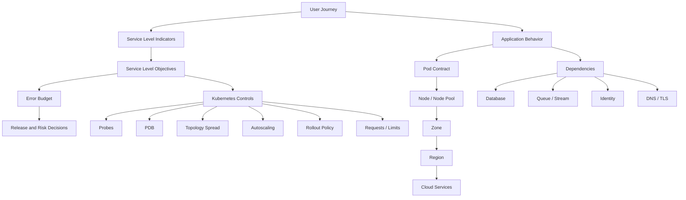
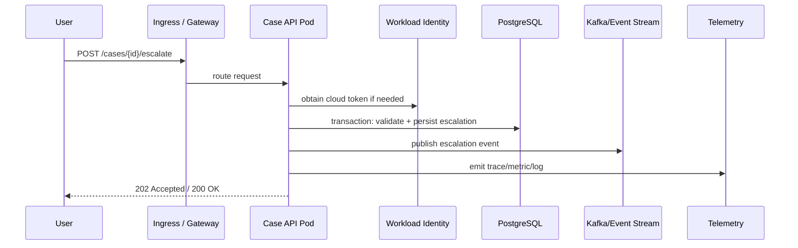

# Part 035 — Reliability, SLO, and Failure Modeling

Kubernetes does not make a system reliable by itself.

It gives you a set of control surfaces:

- desired state reconciliation
- replica management
- rollout strategy
- health probes
- resource isolation
- topology-aware scheduling
- disruption management
- autoscaling
- event stream
- policy enforcement
- cloud integration

Reliability comes from how those surfaces are composed into a system that continues to provide correct user-visible behavior when parts of the platform fail.

This part is about that composition.

The practical question is not:

> Are my Pods running?

The real question is:

> Can the user-visible capability still satisfy its service objective while the platform is changing, failing, scaling, draining, upgrading, throttling, and recovering?

That distinction is the difference between operating Kubernetes as a deployment target and operating Kubernetes as a production platform.

---

## 1. What You Will Build in This Part

By the end of this part, you should be able to:

1. Translate product reliability goals into Kubernetes-level design constraints.
2. Define useful SLIs/SLOs for Kubernetes-hosted services.
3. Connect SLOs to probes, resources, replicas, PDBs, topology spread, autoscaling, and rollout policy.
4. Model failure at container, Pod, node, zone, cluster, region, DNS, certificate, identity, and dependency layers.
5. Design reliability classes for workloads.
6. Run failure reviews before incidents happen.
7. Build runbooks that explain causality, not just commands.
8. Review EKS and AKS reliability from a cloud-provider-aware perspective.

We are not repeating basic probes, resources, autoscaling, storage, GitOps, or observability. Those were already covered in earlier parts. Here we combine them into a reliability system.

---

## 2. The Core Mental Model

Reliability is not a property of a component. It is a property of a user journey under stress.

A Kubernetes workload may look healthy while the user journey is broken:

- Pods are `Running`, but DNS resolution is failing.
- Deployment has all replicas available, but TLS certificate expired.
- HPA is scaling, but downstream database pool is exhausted.
- Service has endpoints, but NetworkPolicy blocks egress.
- Cluster is healthy, but identity federation fails and Pods cannot read secrets.
- Pod readiness is green, but the app returns stale or incorrect data.

A production reliability model must connect multiple layers:



The platform engineer's job is to keep these links honest.

If the SLO says 99.95% availability, but the workload has one replica, no PDB, no zone spread, no graceful shutdown, and no dependency timeout policy, then the SLO is fiction.

---

## 3. Reliability Terms That Matter

### 3.1 SLI

A Service Level Indicator is a measured signal of user-visible service behavior.

Good SLIs are close to the user journey.

Examples:

| Capability | Useful SLI | Weak SLI |
|---|---|---|
| Public REST API | Percentage of valid requests completed successfully under 300 ms | Pod CPU usage |
| Checkout | Percentage of checkout attempts completed without duplicate charge | Deployment available replicas |
| Search | Percentage of queries returning valid result set under 500 ms | Number of Pods running |
| Event processor | Percentage of events processed within 60 seconds | Consumer Pod count |
| Reporting | Percentage of reports generated before SLA deadline | CronJob succeeded count only |
| Payment callback | Percentage of callbacks accepted and persisted exactly once | Service endpoint count |

Kubernetes metrics are supporting evidence. They are usually not the SLI.

### 3.2 SLO

A Service Level Objective is the target threshold for an SLI over a time window.

Examples:

- 99.9% of valid API requests succeed over 30 days.
- 99% of successful responses complete below 300 ms over 7 days.
- 99.95% of payment events are persisted exactly once over 30 days.
- 99% of queue messages are processed within 60 seconds over 24 hours.

A useful SLO has:

- a user-visible event
- a success definition
- an exclusion policy
- a measurement source
- a time window
- an owner
- a consequence when breached

### 3.3 Error Budget

If the SLO is 99.9%, the allowed unreliability is 0.1% for the window.

For 30 days:

```text
30 days = 43,200 minutes
99.9% SLO allows 0.1% bad minutes
0.001 * 43,200 = 43.2 minutes of allowed badness
```

This is not just math. It is a decision tool.

When error budget is healthy:

- release velocity can remain normal
- controlled experiments are acceptable
- dependency upgrades can proceed

When error budget is burning fast:

- freeze risky releases
- prioritize reliability fixes
- reduce blast radius
- review autoscaling, rollouts, and dependency resilience

### 3.4 SLA

A Service Level Agreement is an external promise, often contractual.

Do not confuse internal SLO with external SLA. In engineering practice, internal SLO should usually be stricter than SLA so the team has room to detect and recover before contractual impact.

---

## 4. Kubernetes Reliability Is Mostly About Disruption Control

A Kubernetes cluster is always changing:

- Deployments roll out.
- Nodes are drained.
- Autoscalers add and remove capacity.
- Images are pulled.
- Volumes are attached and detached.
- CNI allocates IPs.
- DNS caches expire.
- Certificates rotate.
- Cloud load balancers update targets.
- Policies mutate or reject objects.
- Add-ons upgrade.
- Nodes reboot.

A reliable platform controls the rate, blast radius, and observability of those changes.

The invariant:

> Every planned change must preserve enough healthy capacity to satisfy the SLO, and every unplanned failure must degrade within an understood blast radius.

---

## 5. Failure Domains

A failure domain is a boundary where failure can be isolated.

In Kubernetes on cloud, the important domains are:

| Domain | Example Failure | Usual Control |
|---|---|---|
| Process | app crash, deadlock, bad config | probes, restart policy, app shutdown contract |
| Container | OOMKill, filesystem full, bad image | requests/limits, image policy, logs |
| Pod | stuck terminating, not ready | probes, termination grace, rollout |
| ReplicaSet | wrong selector, rollout stall | Deployment strategy, validation |
| Node | kernel issue, kubelet failure, disk pressure | node pool spread, eviction, autoscaling |
| Node pool | bad AMI/image, bad VM SKU, taint mistake | canary node pool, surge upgrade |
| Zone | AZ capacity issue, zonal disk failure | topology spread, multi-AZ LB, storage class design |
| Cluster | API server outage, etcd issue, policy outage | managed control plane, multi-cluster strategy |
| Region | cloud regional issue | multi-region architecture, DNS failover |
| DNS | bad record, CoreDNS failure, external DNS delay | DNS monitoring, caching, fallback design |
| TLS | expired cert, wrong secret, CA issue | cert-manager, ACME monitoring, manual break-glass |
| Identity | STS/Entra failure, wrong role binding | workload identity validation, scoped fallback |
| Dependency | database outage, queue lag, API throttling | timeout, retry budget, circuit breaker, backpressure |
| Delivery | bad chart, drift, wrong environment | GitOps policy, canary, progressive delivery |

The mistake is to design only for Pod failure. Pod failure is the easy case.

The hard cases are correlated failures:

- all replicas scheduled on one zone
- all replicas depend on one secret rotation path
- all nodes in one pool use a bad image
- all traffic goes through one ingress controller deployment
- all workloads share one overloaded DNS path
- all releases depend on one broken admission webhook

---

## 6. Reliability Controls in Kubernetes

Think of each Kubernetes object as a reliability lever.

| Control | Reliability Purpose | Common Mistake |
|---|---|---|
| `replicas` | tolerate Pod failure | replica count chosen without traffic or zone model |
| `readinessProbe` | remove unsafe Pods from traffic | probe checks process, not dependency readiness |
| `livenessProbe` | recover wedged processes | probe too aggressive; causes restart storm |
| `startupProbe` | protect slow startup | missing for slow JVM/runtime boot |
| `resources.requests` | reserve scheduling capacity | requests too low; node pressure during peak |
| `resources.limits` | contain blast radius | CPU limit throttles latency-sensitive app |
| `PodDisruptionBudget` | protect against voluntary disruption | `minAvailable: 100%` blocks node drain |
| `topologySpreadConstraints` | reduce correlated failure | only spread by node, not zone |
| `affinity` / `antiAffinity` | influence placement | hard rules make Pods unschedulable |
| `priorityClass` | protect critical workloads | everything marked critical |
| `maxSurge` / `maxUnavailable` | control rollout capacity | unsafe values for low replica count |
| `terminationGracePeriodSeconds` | allow graceful shutdown | shorter than real in-flight request time |
| `preStop` | coordinate drain | used as sleep without understanding endpoint propagation |
| HPA/KEDA | scale replicas by signal | signal is lagging or wrong unit |
| Cluster Autoscaler/Karpenter/NAP | add nodes for pending Pods | missing subnet/IP/capacity planning |
| NetworkPolicy | contain lateral movement | default deny without DNS and observability egress |

Reliability is not one feature. It is the interaction among these controls.

---

## 7. Service Reliability Classes

Do not use the same reliability standard for every workload.

Create workload classes.

### 7.1 Class C — Best Effort Internal

Use for:

- admin tools
- low criticality dashboards
- batch helpers
- non-production-like preview apps

Baseline:

- 1 replica acceptable
- no cross-zone requirement
- basic readiness/liveness
- normal priority
- no strict PDB
- manual recovery acceptable

Not acceptable for:

- customer-facing APIs
- regulatory workflows
- payment/event ingestion

### 7.2 Class B — Standard Production

Use for:

- typical internal APIs
- worker services with retryable work
- business services with moderate impact

Baseline:

- 2+ replicas
- readiness probe required
- startup probe for slow boot
- resource requests required
- graceful shutdown required
- PDB with at least one voluntary disruption allowed
- topology spread across nodes
- dashboard and alerts required

### 7.3 Class A — Critical Production

Use for:

- public APIs
- order creation
- payment orchestration
- enforcement/case lifecycle services
- compliance-impacting workflows

Baseline:

- 3+ replicas
- zone spread required
- PDB required
- strict readiness semantics
- explicit rollout policy
- autoscaling tested under load
- dependency timeout/retry policy
- error-budget policy
- synthetic monitoring
- incident runbook
- restore drill if stateful

### 7.4 Class S — Regulated / Mission Critical

Use for:

- financial settlement
- audit-sensitive workflows
- regulatory enforcement lifecycle
- evidence chain systems
- safety-critical processing

Baseline:

- Class A plus evidence retention
- immutable audit log
- controlled change window
- approval workflow
- recovery test evidence
- policy exception registry
- multi-region or formally accepted regional risk
- strict RPO/RTO
- compliance mapping

---

## 8. SLO-to-Kubernetes Mapping

This is the bridge that most teams skip.

### 8.1 Example: Public API SLO

SLO:

> 99.9% of valid API requests complete successfully under 300 ms over 30 days.

Kubernetes design implications:

| SLO Concern | Kubernetes Control |
|---|---|
| request success | readiness probe, dependency health, rollout policy |
| latency | CPU request, no excessive CPU limit, HPA by latency/RPS, node sizing |
| availability during deploy | `maxUnavailable: 0`, `maxSurge: 1 or 25%`, PDB |
| zone failure tolerance | topology spread by zone, multi-AZ load balancer |
| node drain tolerance | PDB, enough replicas, graceful shutdown |
| traffic safety | ingress health check aligned with readiness |
| dependency protection | timeout, retry budget, circuit breaker |
| diagnosis | logs, metrics, traces, events, deployment annotations |

### 8.2 Example: Queue Consumer SLO

SLO:

> 99% of accepted events are processed within 60 seconds over 24 hours.

Kubernetes design implications:

| SLO Concern | Kubernetes Control |
|---|---|
| lag | KEDA/HPA by queue lag or consumer lag |
| poison messages | dead-letter strategy, app-level handling |
| processing correctness | idempotency, checkpoint discipline |
| capacity | requests, node provisioning, batch size |
| graceful termination | stop polling, finish in-flight message, commit only after success |
| rollout safety | max unavailable low enough to preserve consumers |
| observability | lag, processing age, failure reason, retry count |

### 8.3 Example: Scheduled Job SLO

SLO:

> Daily report must be generated by 06:00 local business time with 99.5% monthly success.

Kubernetes design implications:

| SLO Concern | Kubernetes Control |
|---|---|
| deadline | CronJob schedule, `startingDeadlineSeconds`, alert before deadline |
| retry | `backoffLimit`, idempotent job design |
| concurrency | `concurrencyPolicy: Forbid` or `Replace` based on semantics |
| data correctness | input snapshot/versioning |
| capacity | dedicated node pool or priority |
| failure visibility | job status export, log retention, alert on late run |

---

## 9. PodDisruptionBudget: Useful, But Often Misunderstood

A PDB limits voluntary evictions. It does not protect against every failure.

Voluntary disruptions include:

- node drain
- cluster/node upgrade
- autoscaler scale-down
- manual eviction through eviction API

PDB does not protect against:

- node hardware failure
- kernel crash
- cloud zone outage
- direct Pod deletion
- Deployment deletion
- application crash
- OOMKill
- badly configured rollout

### 9.1 Good PDB for 3+ Replica Stateless API

```yaml
apiVersion: policy/v1
kind: PodDisruptionBudget
metadata:
  name: orders-api-pdb
  namespace: prod-orders
spec:
  maxUnavailable: 1
  unhealthyPodEvictionPolicy: AlwaysAllow
  selector:
    matchLabels:
      app.kubernetes.io/name: orders-api
```

Why `maxUnavailable: 1`?

Because it keeps node drains possible while still preventing too much voluntary disruption at once.

Why `unhealthyPodEvictionPolicy: AlwaysAllow`?

Because an unhealthy Pod should usually not block maintenance forever. If a Pod is already unhealthy, preserving it does not preserve availability.

### 9.2 Dangerous PDB

```yaml
apiVersion: policy/v1
kind: PodDisruptionBudget
metadata:
  name: bad-pdb
spec:
  minAvailable: 100%
  selector:
    matchLabels:
      app: api
```

This can block node drain indefinitely. It is often created with good intent but poor operational semantics.

A PDB must protect availability and allow maintenance.

If it prevents all maintenance, it creates a larger reliability risk.

---

## 10. Topology Spread Constraints

Replica count alone is not enough.

Three replicas on one node do not give high availability.

Three replicas on three nodes in one zone do not survive zone failure.

Three replicas across three zones are a meaningful starting point.

```yaml
apiVersion: apps/v1
kind: Deployment
metadata:
  name: orders-api
  namespace: prod-orders
spec:
  replicas: 3
  selector:
    matchLabels:
      app.kubernetes.io/name: orders-api
  template:
    metadata:
      labels:
        app.kubernetes.io/name: orders-api
    spec:
      topologySpreadConstraints:
        - maxSkew: 1
          topologyKey: topology.kubernetes.io/zone
          whenUnsatisfiable: DoNotSchedule
          labelSelector:
            matchLabels:
              app.kubernetes.io/name: orders-api
        - maxSkew: 1
          topologyKey: kubernetes.io/hostname
          whenUnsatisfiable: ScheduleAnyway
          labelSelector:
            matchLabels:
              app.kubernetes.io/name: orders-api
      containers:
        - name: app
          image: registry.example.com/orders-api@sha256:...
          ports:
            - containerPort: 8080
          readinessProbe:
            httpGet:
              path: /ready
              port: 8080
          startupProbe:
            httpGet:
              path: /started
              port: 8080
            failureThreshold: 30
            periodSeconds: 2
          resources:
            requests:
              cpu: "500m"
              memory: "768Mi"
            limits:
              memory: "1Gi"
```

Hard zone spread is reasonable for critical services if capacity exists in every zone.

For less critical services, `ScheduleAnyway` may be better to avoid availability loss due to temporary capacity shortage.

The trade-off:

| `whenUnsatisfiable` | Benefit | Risk |
|---|---|---|
| `DoNotSchedule` | preserves placement invariant | Pods may remain pending |
| `ScheduleAnyway` | favors availability now | may weaken failure-domain isolation |

Top 1% engineering is not memorizing which one is better. It is knowing which failure you are choosing.

---

## 11. Rollout Reliability

A Deployment rollout is a controlled failure injection.

You are intentionally killing old Pods and introducing new Pods.

Unsafe rollout parameters can violate an SLO even when Kubernetes behaves correctly.

### 11.1 Critical API Rollout Baseline

```yaml
apiVersion: apps/v1
kind: Deployment
metadata:
  name: case-api
spec:
  replicas: 4
  strategy:
    type: RollingUpdate
    rollingUpdate:
      maxUnavailable: 0
      maxSurge: 1
  minReadySeconds: 20
  progressDeadlineSeconds: 600
```

This means:

- do not voluntarily reduce available capacity during rollout
- add at most one extra Pod above desired replica count
- only count Pods as available after they remain ready for 20 seconds
- fail rollout if progress stalls

### 11.2 Common Rollout Failure Modes

| Failure | Symptom | Cause | Control |
|---|---|---|---|
| readiness too weak | traffic errors after rollout | readiness does not check real serving ability | improve readiness contract |
| startup too slow | CrashLoopBackOff | liveness kills app before boot | startup probe |
| capacity drop | latency spike during deploy | `maxUnavailable` too high | reduce maxUnavailable, increase surge |
| node full | new Pods pending | no surge capacity | cluster autoscaler/Karpenter/NAP readiness |
| bad dependency | new version ready but failing user path | readiness checks only local process | synthetic and canary checks |
| rollback false confidence | rollback succeeds but data incompatible | schema/state change not backward compatible | expand/contract migration |

---

## 12. Reliability and Resource Management

Under-sized requests create hidden unreliability.

The scheduler places Pods using requests. If requests are too low, the cluster admits too much work onto the node. Under real load, the node hits pressure and kubelet starts eviction.

### 12.1 Memory

Memory is not compressible.

If a container exceeds its memory limit, it may be OOMKilled.

If a node experiences memory pressure, kubelet may evict Pods according to eviction policy and QoS class.

Reliability impact:

- `BestEffort` Pods are easiest to evict.
- `Burstable` Pods may be evicted before `Guaranteed` depending on usage relative to requests.
- `Guaranteed` can protect critical workloads but can reduce bin-packing efficiency.

### 12.2 CPU

CPU is compressible.

CPU limit does not kill the process; it throttles it.

Reliability impact:

- excessive CPU limits can create latency spikes
- missing CPU requests can cause poor scheduling
- HPA CPU percentage depends on CPU requests

For latency-sensitive services, prefer measured CPU requests and cautious CPU limits.

---

## 13. Reliability and Autoscaling

Autoscaling is not instant reliability.

Autoscaling has delay:

```text
load increase
  -> metric changes
  -> metrics pipeline delay
  -> HPA/KEDA decision
  -> replica creation
  -> scheduler placement
  -> image pull
  -> app startup
  -> readiness
  -> load balancer endpoint propagation
```

This delay is your scaling reaction time.

If your SLO cannot tolerate that delay, you need warm capacity.

### 13.1 Autoscaling Failure Modes

| Failure | Symptom | Control |
|---|---|---|
| wrong metric | scales but SLO still burns | scale on user or queue signal |
| cold start too long | spike during traffic burst | minimum replicas, faster startup, pre-warmed nodes |
| no node capacity | Pods pending | cluster autoscaler/Karpenter/NAP, subnet/IP capacity |
| too aggressive scale down | repeated cold starts | stabilization window |
| dependency saturation | more Pods make system worse | backpressure, concurrency limits |
| HPA/VPA conflict | unstable sizing | use VPA recommend mode or separate responsibilities |

### 13.2 Reliability Rule

Do not scale blindly from application load alone. Scale against the bottleneck.

If the bottleneck is database connections, adding more API Pods can reduce reliability.

---

## 14. Dependency Failure Modeling

Most Kubernetes incidents are not purely Kubernetes incidents.

A user journey usually crosses:

- ingress controller
- application Pod
- identity provider
- secrets provider
- database
- cache
- message broker
- object storage
- external API
- DNS
- certificate chain

Model each dependency as a failure object.

| Dependency | Failure Mode | Platform Evidence | App Control |
|---|---|---|---|
| database | connection exhaustion | latency, connection errors, DB metrics | pooling, timeout, circuit breaker |
| cache | unavailable or stale | connection errors, cache hit drop | fallback, TTL discipline |
| queue | lag spike | consumer lag, processing age | KEDA, backpressure, DLQ |
| object storage | throttling | 429/503, retry metrics | retry budget, idempotency |
| identity | token exchange failure | STS/Entra errors | token cache, fail closed/open decision |
| secrets | mount/sync failure | CSI/ExternalSecrets events | startup validation, rotation runbook |
| DNS | lookup failure | CoreDNS errors, NXDOMAIN | DNS monitoring, caching |

The platform should expose enough telemetry to prove which dependency caused the SLO burn.

---

## 15. EKS Reliability Design Notes

### 15.1 Multi-AZ Is Not Optional for Critical Workloads

For Class A/S workloads:

- use subnets in multiple Availability Zones
- spread node capacity across zones
- ensure load balancer subnets exist in required zones
- configure topology spread by `topology.kubernetes.io/zone`
- review EBS volume topology if stateful

A stateless API with replicas across zones can survive a node or zone problem better than one packed into a single zone.

### 15.2 EBS Is Zonal

EBS volumes are attached within an Availability Zone.

Reliability implication:

- StatefulSet Pods with EBS-backed PVCs are constrained by volume zone.
- Rescheduling to another zone is not simple failover.
- Backup/restore and replication strategy matter.

If the workload needs multi-AZ shared filesystem semantics, evaluate EFS carefully, including latency and consistency expectations.

### 15.3 Node Provisioning

EKS node reliability depends on the provisioning model:

| Model | Reliability Strength | Risk |
|---|---|---|
| Managed Node Groups | predictable, AWS-managed lifecycle | less flexible packing/provisioning |
| Karpenter | fast, workload-aware provisioning | configuration complexity |
| EKS Auto Mode | managed provisioning/operation | less low-level control |
| Fargate | no node management for some workloads | constraints and unsupported patterns |

For critical workloads, do not rely on autoscaling alone. Use minimum warm capacity and test scale from zero separately.

### 15.4 Load Balancer Target Health

EKS traffic path depends on AWS load balancer health checks.

Check alignment:

- load balancer health check path
- Kubernetes readiness path
- Pod termination behavior
- target group deregistration delay
- app graceful shutdown time

If these disagree, traffic may reach a Pod that Kubernetes already considers not ready, or be removed too slowly/quickly.

---

## 16. AKS Reliability Design Notes

### 16.1 Availability Zones and Node Pools

For critical workloads:

- use zone-capable regions
- spread node pools across zones
- avoid single-zone system bottlenecks
- enforce topology spread by zone
- test node image upgrade with surge capacity

### 16.2 Azure Disk Is Zonal/Regional Depending on Disk Type

Most AKS stateful workloads using Azure Disk have placement constraints.

Reliability implication:

- Pod recovery follows disk placement rules
- zone failure can affect volume availability
- restore and replication strategy must be explicit

Azure Files may provide shared filesystem behavior, but it has its own latency, throughput, and semantics trade-offs.

### 16.3 Egress Dependency

AKS production designs often route egress through:

- NAT Gateway
- Azure Firewall
- UDR
- private endpoints
- proxy appliances

A reliable app can fail because egress to identity, registry, storage, or dependency endpoints is blocked.

Always include egress path in failure modeling.

### 16.4 Managed Identity and Key Vault

AKS workload identity improves secretless access, but reliability depends on:

- OIDC issuer availability
- federated credential correctness
- managed identity permissions
- Key Vault network/firewall rules
- token cache behavior

Treat identity as a runtime dependency, not just a security setting.

---

## 17. Failure Modeling Method

Use this sequence for every critical service.

### Step 1 — Define the User Journey

Example:

> User submits enforcement case escalation request.

Include:

- entry point
- service chain
- data writes
- events emitted
- external dependencies
- success definition

### Step 2 — Define SLIs

Example:

- request success rate
- p95 latency
- durable persistence success
- event emission success
- duplicate prevention rate

### Step 3 — Define SLO

Example:

```text
99.9% of valid escalation requests must be accepted, persisted,
and return a final synchronous response under 800 ms over 30 days.
```

### Step 4 — Draw the Runtime Path



### Step 5 — Enumerate Failure Points

| Point | Failure | User Impact | Detection | Mitigation |
|---|---|---|---|---|
| Edge | TLS expired | total outage | synthetic check | certificate alert + renewal runbook |
| API Pod | CrashLoop | partial outage | Pod restart alert | rollback, inspect logs |
| DB | pool exhausted | slow/failing requests | DB metrics, trace spans | limit concurrency, tune pool |
| Kafka | publish timeout | request failure or async loss | producer error metric | outbox pattern |
| Identity | token failure | secret/cloud access failure | STS/Entra error logs | scoped retry/cache |
| Node | memory pressure | evictions | node condition alert | right-size requests |
| Zone | capacity loss | capacity reduction | zone-level metrics | topology spread, multi-zone LB |

### Step 6 — Map Failure to Controls

For every failure, identify:

- prevention
- detection
- containment
- recovery
- evidence

If one of those is missing, reliability is incomplete.

---

## 18. Reliability Review Template

Use this before approving a workload into production.

```md
# Reliability Review: <service-name>

## 1. User Journey
- Capability:
- Criticality class:
- Primary users:
- Business impact of failure:

## 2. SLO
- SLI:
- SLO target:
- Window:
- Exclusions:
- Error budget policy:

## 3. Runtime Path
- Edge:
- Service:
- Database:
- Queue/stream:
- External APIs:
- Identity:
- Secrets:

## 4. Kubernetes Controls
- Replicas:
- Readiness:
- Liveness:
- Startup:
- Resources:
- PDB:
- Topology spread:
- Autoscaling:
- Rollout strategy:
- Priority class:

## 5. Cloud Controls
- EKS/AKS cluster:
- Node pools:
- Zones:
- Load balancer:
- DNS:
- Certificate:
- Storage:
- Identity:

## 6. Failure Model
| Failure | Expected impact | Detection | Recovery | Owner |
|---|---|---|---|---|

## 7. Runbooks
- Pod crash:
- Rollout failure:
- Node drain blocked:
- Dependency outage:
- DNS/TLS failure:
- Identity failure:

## 8. Test Evidence
- Load test:
- Rollout test:
- Node drain test:
- Zone disruption assumption:
- Backup/restore:
```

---

## 19. Failure Injection Exercises

Do not wait for production incidents to learn failure behavior.

| Exercise | Method | Expected Learning |
|---|---|---|
| Pod kill | delete one Pod | replica and readiness behavior |
| Deployment bad image | deploy nonexistent image | rollout failure and alert path |
| Slow startup | increase startup delay | startup probe correctness |
| Memory pressure | run controlled memory stress | eviction and QoS behavior |
| Node drain | cordon/drain node | PDB and topology behavior |
| Zone capacity simulation | taint nodes in one zone | scheduling and traffic impact |
| DNS failure simulation | block DNS egress in test namespace | dependency on CoreDNS |
| Secret rotation | rotate secret while app runs | reload/restart contract |
| Identity permission removal | remove cloud permission | error visibility and fail mode |
| Queue backlog | inject event spike | KEDA/HPA behavior |

Rules:

- Run in non-prod first.
- Define expected outcome before test.
- Capture metrics/logs/events/traces.
- Convert surprise into platform improvement.

---

## 20. Runbook: SLO Burn Investigation

### 20.1 Start From User Impact

```bash
# Identify which SLO is burning
# This is usually done in observability platform, not kubectl.
```

Ask:

- Is the burn availability, latency, correctness, freshness, or durability?
- Is it global or isolated to one route/tenant/zone?
- Did it start after deploy, scale event, node drain, certificate rotation, policy change, or dependency incident?

### 20.2 Check Deployment State

```bash
kubectl -n prod-orders rollout status deployment/orders-api
kubectl -n prod-orders get deploy,rs,pod -l app.kubernetes.io/name=orders-api -o wide
kubectl -n prod-orders describe deployment orders-api
```

Look for:

- rollout stuck
- unavailable replicas
- pending Pods
- old/new ReplicaSet overlap
- image pull errors
- readiness failures

### 20.3 Check Pod Health and Events

```bash
kubectl -n prod-orders get pod -l app.kubernetes.io/name=orders-api -o wide
kubectl -n prod-orders describe pod <pod-name>
kubectl -n prod-orders logs <pod-name> --previous
kubectl -n prod-orders get events --sort-by=.lastTimestamp
```

Look for:

- OOMKilled
- probe failures
- CrashLoopBackOff
- failed mounts
- failed scheduling
- node pressure

### 20.4 Check Capacity and Scheduling

```bash
kubectl top pod -n prod-orders
kubectl top node
kubectl get nodes -L topology.kubernetes.io/zone
kubectl describe node <node-name>
```

Look for:

- memory pressure
- disk pressure
- CPU saturation
- uneven zone distribution
- taints blocking scheduling
- missing capacity in one node pool

### 20.5 Check PDB and Drain Constraints

```bash
kubectl -n prod-orders get pdb
kubectl -n prod-orders describe pdb orders-api-pdb
```

Look for:

- `DisruptionsAllowed: 0`
- selector mismatch
- too strict minAvailable
- unhealthy Pods blocking eviction

### 20.6 Check Traffic Path

```bash
kubectl -n prod-orders get svc,endpointslices
kubectl -n ingress-system get pod,svc
```

For EKS, also inspect load balancer target health and AWS Load Balancer Controller logs.

For AKS, inspect Azure Load Balancer/Application Gateway/Application Gateway for Containers health and controller logs.

### 20.7 Check Dependency Path

Use traces and dependency dashboards.

Validate:

- database latency and connection pool
- queue lag
- external API throttling
- identity token failures
- Key Vault/Secrets Manager access
- DNS errors

### 20.8 Decide Action

Possible actions:

- rollback release
- pause rollout
- increase replicas
- increase node capacity
- remove bad Pod from traffic
- fix dependency configuration
- apply emergency NetworkPolicy exception
- rotate certificate/secret
- restore previous config

Do not blindly restart Pods. Restarting removes evidence and may amplify load.

---

## 21. The Reliability Anti-Patterns

### 21.1 All Green Dashboards, Broken User Journey

Cause:

- dashboards monitor infrastructure state, not user-visible behavior

Fix:

- add synthetic checks and request-level SLIs

### 21.2 Probe as Dependency Health Check

Cause:

- readiness checks every downstream dependency

Risk:

- transient downstream issue removes all Pods from traffic

Fix:

- readiness should answer: can this Pod accept traffic safely now?
- dependency degradation should be managed with circuit breaker/backpressure where appropriate

### 21.3 PDB That Blocks Maintenance

Cause:

- `minAvailable: 100%`

Fix:

- use `maxUnavailable: 1` where possible
- test node drains

### 21.4 One Replica with a 99.9% SLO

Cause:

- SLO not translated into architecture

Fix:

- require reliability class before production approval

### 21.5 Autoscaling Without Warm Capacity

Cause:

- assuming scaling is instantaneous

Fix:

- minimum replicas, pre-warmed nodes, startup optimization

### 21.6 Zone Spread Without Capacity Planning

Cause:

- hard topology spread with insufficient per-zone capacity

Fix:

- capacity reservation, node pool spread, autoscaler validation

### 21.7 Control Plane Dependency Hidden in App SLO

Cause:

- app deployment/recovery depends on Kubernetes API, admission webhooks, GitOps, and cloud APIs

Fix:

- model delivery/control-plane failure separately from serving-path failure

---

## 22. Decision Matrix

### 22.1 How Many Replicas?

| Requirement | Baseline |
|---|---|
| dev/test | 1 |
| internal non-critical | 1-2 |
| standard production API | 2+ |
| critical stateless API | 3+ across zones |
| zone failure tolerance | at least one healthy replica per surviving zone, plus enough capacity |
| high traffic + deploy safety | enough replicas to absorb `maxUnavailable` and load during rollout |

### 22.2 PDB Strategy

| Workload | Suggested PDB |
|---|---|
| 1 replica best effort | usually none or accept drain blocking explicitly |
| 2 replicas | `maxUnavailable: 1` if app tolerates 50% capacity loss briefly |
| 3+ replicas | `maxUnavailable: 1` baseline |
| quorum system | design based on quorum rules, not generic template |
| stateful primary/replica | app-aware disruption rules required |

### 22.3 Topology Strategy

| Workload | Strategy |
|---|---|
| best effort | no hard zone spread |
| standard production | spread by hostname, prefer zone spread |
| critical stateless | hard or strong preferred zone spread |
| stateful zonal storage | align Pod placement with storage topology |
| ingress/controller | spread across nodes/zones; protect with PDB |

---

## 23. Reliability Scorecard

Use this for a quick review.

| Item | Score 0 | Score 1 | Score 2 |
|---|---|---|---|
| SLO | none | vague target | measurable SLI/SLO with owner |
| Replicas | 1 | 2 | 3+ and zone-aware |
| Probes | missing | basic | realistic startup/readiness/liveness |
| Resources | missing | guessed | measured and reviewed |
| PDB | missing | present but untested | tested and maintenance-friendly |
| Topology | none | node spread | zone + node failure-aware |
| Rollout | default | configured | tested with failure scenario |
| Autoscaling | none | basic HPA | signal-driven and load-tested |
| Observability | logs only | dashboards | SLO + trace + runbook |
| Dependency model | implicit | documented | tested with failure injection |
| Cloud path | implicit | partially documented | LB/DNS/TLS/IAM/storage modeled |
| Recovery | tribal | basic runbook | practiced and evidenced |

Interpretation:

- below 12: not production-ready for important workload
- 12-18: standard production with gaps
- 19-24: strong production posture

---

## 24. Capstone Exercise

Design reliability for a `case-escalation-api` deployed on both EKS and AKS.

Requirements:

- SLO: 99.9% successful escalation requests under 800 ms over 30 days.
- Must survive one node failure without user-visible outage.
- Must tolerate planned node drain.
- Must not lose accepted escalation event.
- Must expose evidence for incident review.
- Must have clear difference between EKS and AKS cloud dependencies.

Deliverables:

1. SLI/SLO definition.
2. Workload reliability class.
3. Deployment YAML with probes, resources, rollout, topology spread.
4. PDB YAML.
5. Failure model table.
6. EKS-specific reliability notes.
7. AKS-specific reliability notes.
8. SLO burn runbook.
9. Failure injection plan.

---

## 25. Production Checklist

Before approving a critical workload:

- [ ] User journey is documented.
- [ ] SLI and SLO are measurable.
- [ ] Error budget policy exists.
- [ ] Replica count matches reliability class.
- [ ] Readiness, liveness, and startup probes are realistic.
- [ ] Graceful shutdown is tested.
- [ ] Requests and memory limits are measured.
- [ ] CPU limit policy is deliberate.
- [ ] PDB is configured and drain-tested.
- [ ] Topology spread matches failure-domain target.
- [ ] Rollout strategy is safe for current replica count.
- [ ] Autoscaling signal is tested under load.
- [ ] Dependency timeouts and retry budgets exist.
- [ ] Ingress/LB health check aligns with readiness.
- [ ] DNS/TLS certificate expiration is monitored.
- [ ] Workload identity failure mode is understood.
- [ ] Storage topology and restore path are documented.
- [ ] SLO burn runbook exists.
- [ ] Incident evidence is retained long enough.
- [ ] EKS/AKS-specific cloud dependencies are documented.

---

## 26. References

Official and primary references for this part:

- Kubernetes Documentation — Disruptions: `https://kubernetes.io/docs/concepts/workloads/pods/disruptions/`
- Kubernetes Documentation — Configure Pod Disruption Budget: `https://kubernetes.io/docs/tasks/run-application/configure-pdb/`
- Kubernetes Documentation — Scheduling, Preemption and Eviction: `https://kubernetes.io/docs/concepts/scheduling-eviction/`
- Kubernetes Documentation — Node-pressure Eviction: `https://kubernetes.io/docs/concepts/scheduling-eviction/node-pressure-eviction/`
- Kubernetes Documentation — Topology Spread Constraints: `https://kubernetes.io/docs/concepts/scheduling-eviction/topology-spread-constraints/`
- Kubernetes Documentation — Resource Management: `https://kubernetes.io/docs/concepts/configuration/manage-resources-containers/`
- Google SRE Book — Service Level Objectives: `https://sre.google/sre-book/service-level-objectives/`
- Google SRE Workbook — Implementing SLOs: `https://sre.google/workbook/implementing-slos/`
- AWS EKS Best Practices Guide: `https://docs.aws.amazon.com/eks/latest/best-practices/introduction.html`
- Azure AKS Baseline Architecture: `https://learn.microsoft.com/en-us/azure/architecture/reference-architectures/containers/aks/baseline-aks`
