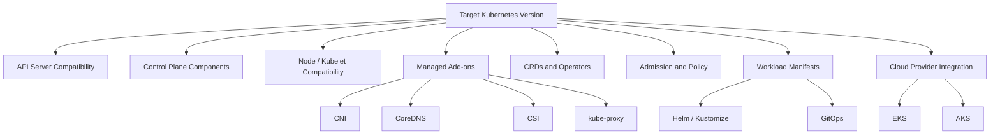
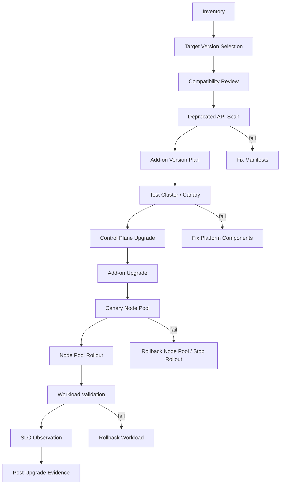
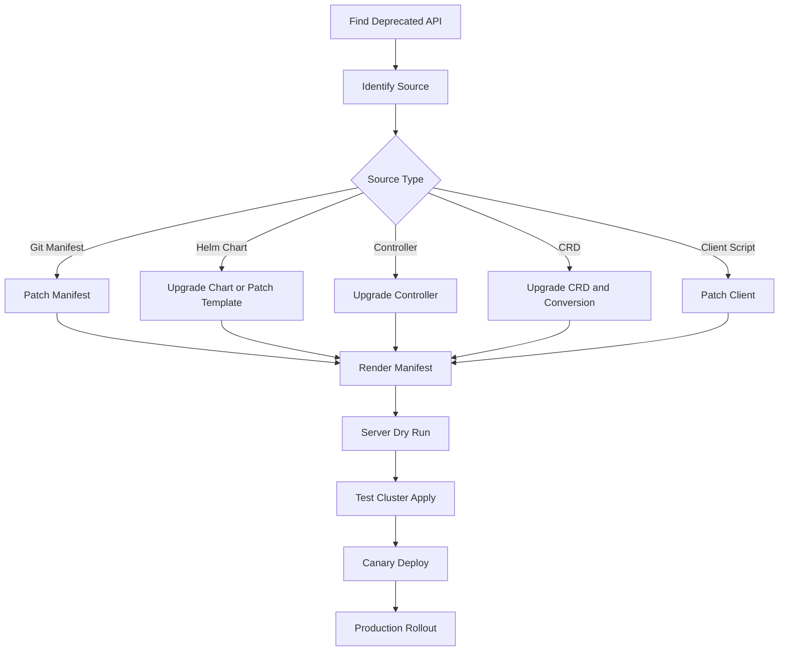

# Part 036 — Upgrades, Versioning, and API Deprecation

A Kubernetes upgrade is not a button click.

It is a compatibility migration across multiple contracts:

- Kubernetes API server version
- kubelet version
- node image / operating system
- container runtime
- CNI plugin
- CSI drivers
- CoreDNS
- kube-proxy
- ingress controller
- cert-manager
- policy engine
- autoscaler
- GitOps controller
- CRDs
- admission webhooks
- Helm charts
- workload manifests
- cloud provider integration

The dangerous belief is:

> We are just upgrading the cluster.

The correct belief is:

> We are changing the execution environment for every application, controller, policy, identity binding, network path, storage integration, and delivery workflow in the platform.

This part teaches Kubernetes upgrades as a production lifecycle discipline.

---

## 1. What You Will Build in This Part

By the end of this part, you should be able to:

1. Explain Kubernetes versioning and version skew as an operational constraint.
2. Build a safe upgrade lifecycle for EKS and AKS.
3. Detect deprecated and removed APIs before they break delivery.
4. Separate control plane, data plane, add-on, CRD, and workload upgrades.
5. Design preflight checks, rollout gates, canary clusters, and rollback boundaries.
6. Manage API version migrations inside GitOps and Helm/Kustomize workflows.
7. Create monthly patch, quarterly minor, and emergency CVE upgrade playbooks.
8. Avoid the most common managed Kubernetes upgrade traps.

---

## 2. The Core Mental Model

Kubernetes is an API-driven platform.

Everything depends on APIs:

- built-in resources such as `Deployment`, `Service`, `Ingress`, `PodDisruptionBudget`
- CRDs such as `Certificate`, `Application`, `HTTPRoute`, `ScaledObject`, `VirtualService`, `ExternalSecret`
- admission webhooks
- controllers watching resources
- GitOps tools applying desired state
- Helm charts rendering manifests
- CI/CD validators
- clients and SDKs

A Kubernetes version upgrade changes API behavior, component compatibility, defaults, and sometimes served API versions.



Upgrade safety depends on knowing which contracts change, not hoping managed Kubernetes hides them.

---

## 3. Kubernetes Versioning Basics

Kubernetes versions use semantic-like numbering:

```text
v1.<minor>.<patch>
```

Example:

```text
v1.34.2
```

Meaning:

- `1` = major version
- `34` = minor version
- `2` = patch version

In production, patch upgrades and minor upgrades are different risk classes.

| Upgrade Type | Example | Typical Risk |
|---|---|---|
| Patch | 1.34.1 → 1.34.2 | bug/security fixes; lower API risk |
| Minor | 1.33.x → 1.34.x | API/default/add-on/version-skew risk |
| Multi-minor | 1.31.x → 1.34.x | high risk; usually not allowed directly for control plane |
| Add-on | CoreDNS/CNI/CSI version change | dataplane/DNS/storage/network risk |
| Node image | OS/runtime/kernel update | workload/runtime compatibility risk |

The operational mistake is treating all of these as one upgrade.

They should be planned, tested, and observed separately.

---

## 4. Version Skew Policy

Kubernetes allows limited version skew among components.

The API server is the center of the compatibility model.

A key operational rule: do not skip minor versions for the API server upgrade path. Even if a provider automates pieces of the process, your planning should assume one minor step at a time.

Important skew concepts:

- kube-apiserver version constrains other control-plane components
- kubelet can usually be older than kube-apiserver within supported skew, but not arbitrarily old
- kubectl has its own skew expectations relative to kube-apiserver
- controllers and webhooks need to understand API versions they watch/mutate/validate

Practical implication:

> Upgrade planning must include clients, automation, and controllers, not just the managed control plane.

---

## 5. API Deprecation Model

Kubernetes APIs evolve.

Old API versions may be deprecated and later removed.

The high-level policy:

- Alpha APIs can change or disappear with little stability guarantee.
- Beta APIs are more stable but can still be deprecated and removed on a defined timeline.
- GA APIs have the strongest compatibility promise within Kubernetes major version 1.

This affects manifests.

A manifest that applied successfully last year may fail after a cluster upgrade if it uses an API version no longer served by the target Kubernetes version.

Example categories historically affected:

- `Ingress`
- `CronJob`
- `PodDisruptionBudget`
- `HorizontalPodAutoscaler`
- flow control resources
- admission registration resources
- CRD versions

---

## 6. API Version Is Part of the Contract

This is not just syntax:

```yaml
apiVersion: networking.k8s.io/v1
kind: Ingress
```

The `apiVersion` defines:

- served endpoint
- schema
- defaulting behavior
- validation behavior
- field names
- required fields
- conversion path

Changing API version can require changing fields.

### 6.1 Ingress Migration Example

Old style:

```yaml
apiVersion: extensions/v1beta1
kind: Ingress
metadata:
  name: app
spec:
  backend:
    serviceName: app
    servicePort: 80
```

Modern style:

```yaml
apiVersion: networking.k8s.io/v1
kind: Ingress
metadata:
  name: app
spec:
  defaultBackend:
    service:
      name: app
      port:
        number: 80
```

This is not a blind replacement. The schema changed.

### 6.2 CronJob Migration Example

Old style:

```yaml
apiVersion: batch/v1beta1
kind: CronJob
```

Modern style:

```yaml
apiVersion: batch/v1
kind: CronJob
```

Even when fields appear similar, validate behavior in a test cluster.

### 6.3 PDB Migration Example

Old style:

```yaml
apiVersion: policy/v1beta1
kind: PodDisruptionBudget
```

Modern style:

```yaml
apiVersion: policy/v1
kind: PodDisruptionBudget
```

Be careful with selector semantics and generated manifests.

---

## 7. The Upgrade Surface Area

A managed Kubernetes upgrade has at least six layers.

### 7.1 Control Plane

Includes:

- API server
- controller manager
- scheduler
- managed etcd
- cloud provider integration

In EKS and AKS, cloud provider manages much of this, but you still own readiness for workloads and add-ons.

### 7.2 Data Plane

Includes:

- nodes
- kubelet
- container runtime
- OS image
- kernel
- node-level agents
- kube-proxy or dataplane equivalent

Node upgrades are where workloads are disrupted.

### 7.3 Cluster Add-ons

Includes:

- CoreDNS
- CNI plugin
- kube-proxy
- CSI drivers
- cloud load balancer controller
- metrics server
- observability agents

Add-ons are often the real source of upgrade incidents.

### 7.4 Platform Controllers

Includes:

- Argo CD / Flux
- cert-manager
- external-dns
- External Secrets Operator
- Gatekeeper/Kyverno
- KEDA
- ingress/gateway controllers
- service mesh components
- Karpenter or cluster autoscaler

These controllers watch and mutate cluster state. If they break, the platform can become unstable even if workloads keep serving traffic.

### 7.5 CRDs

CRDs are APIs too.

Risks:

- schema changes
- conversion webhook failures
- stored version mismatch
- controller version incompatible with CRD version
- GitOps applies old CRD after upgrade

### 7.6 Workloads

Includes:

- manifests
- Helm charts
- Kustomize overlays
- image runtime assumptions
- security context compatibility
- probes
- PDBs
- topology constraints

A workload may fail on new nodes even if it worked on old nodes because OS, runtime, cgroup, kernel, or node policy changed.

---

## 8. Upgrade Architecture

A safe upgrade process has gates.



The goal is not zero risk. The goal is risk compression and fast diagnosis.

---

## 9. Inventory Before Upgrade

Before choosing a target version, collect the platform inventory.

### 9.1 Cluster Inventory

```bash
kubectl version
kubectl get nodes -o wide
kubectl get nodes -L kubernetes.io/os,kubernetes.io/arch,topology.kubernetes.io/zone
kubectl get namespaces
kubectl get storageclass
kubectl get ingressclass
kubectl get gatewayclass
```

### 9.2 API Inventory

```bash
kubectl api-resources --verbs=list --namespaced -o wide
kubectl api-versions
```

### 9.3 Workload API Usage

```bash
kubectl get deploy,statefulset,daemonset,job,cronjob -A
kubectl get ingress -A
kubectl get pdb -A
kubectl get hpa -A
kubectl get crd
```

### 9.4 Add-on Inventory

```bash
kubectl -n kube-system get deploy,daemonset,pod
kubectl -n kube-system get configmap
kubectl get mutatingwebhookconfiguration,validatingwebhookconfiguration
```

### 9.5 Git Inventory

From GitOps repositories:

- rendered manifests
- Helm chart versions
- Kustomize overlays
- CRD definitions
- policy resources
- controller versions
- environment-specific overlays

The cluster tells you what is live. Git tells you what will be reapplied.

You need both.

---

## 10. Deprecated API Detection

Do not wait until upgrade day to discover removed APIs.

Use several layers.

### 10.1 Static Scan in Git

Search for old API versions:

```bash
grep -R "apiVersion: extensions/v1beta1" ./clusters ./apps ./charts || true
grep -R "apiVersion: networking.k8s.io/v1beta1" ./clusters ./apps ./charts || true
grep -R "apiVersion: batch/v1beta1" ./clusters ./apps ./charts || true
grep -R "apiVersion: policy/v1beta1" ./clusters ./apps ./charts || true
grep -R "apiVersion: autoscaling/v2beta" ./clusters ./apps ./charts || true
```

Static scanning is crude but valuable.

### 10.2 Rendered Manifest Scan

Helm values can hide API versions.

Always scan rendered manifests:

```bash
helm template my-app ./chart -f values-prod.yaml > rendered.yaml
kubectl apply --dry-run=server -f rendered.yaml
```

For Kustomize:

```bash
kubectl kustomize overlays/prod > rendered.yaml
kubectl apply --dry-run=server -f rendered.yaml
```

### 10.3 Live Cluster Scan

```bash
kubectl get all -A
kubectl get ingress -A -o yaml
kubectl get pdb -A -o yaml
kubectl get hpa -A -o yaml
```

Not all resources are included in `kubectl get all`. Do not rely on it as complete inventory.

### 10.4 Admission and Audit Logs

For production-grade detection, use API server audit logs to find deprecated API usage by clients/controllers.

Why?

Because a deprecated API may be used by:

- old controller
- CI/CD job
- kubectl plugin
- operator
- script
- developer laptop

Git scan will not catch every client.

---

## 11. Server-Side Dry Run

Server-side dry run is a strong preflight because it asks the API server to validate the manifest using current server-side schema/admission behavior without persisting the object.

```bash
kubectl apply --server-side --dry-run=server -f rendered.yaml
```

Use it in CI against:

- current cluster version
- target test cluster version
- canary cluster version

This catches:

- removed APIs
- invalid fields
- admission rejection
- schema mismatch
- CRD validation errors

It does not prove runtime behavior.

You still need canary deployment.

---

## 12. CRD Upgrade Risks

CRDs deserve special attention because they define APIs used by platform controllers.

Common CRD risks:

| Risk | Symptom | Prevention |
|---|---|---|
| old CRD reapplied | controller breaks after Git sync | pin CRD ownership and upgrade order |
| conversion webhook down | API requests fail | high availability for webhook |
| schema tightened | existing objects invalid | pre-validate objects |
| stored version old | upgrade blocked or data conversion issue | inspect stored versions |
| controller/CRD mismatch | reconcile errors | upgrade CRD and controller as documented |

Inspect CRD versions:

```bash
kubectl get crd <name> -o yaml
```

Look at:

- `spec.versions`
- `status.storedVersions`
- conversion configuration
- schema changes

For GitOps, decide whether CRDs are managed by:

- platform bootstrap repository
- Helm chart
- separate CRD lifecycle job
- cloud add-on manager

Do not let application teams unknowingly upgrade platform CRDs.

---

## 13. Admission Webhook Upgrade Risks

Admission webhooks are in the request path for API changes.

A broken webhook can block deployments cluster-wide.

Before upgrade, inventory:

```bash
kubectl get validatingwebhookconfiguration
kubectl get mutatingwebhookconfiguration
```

For each webhook, review:

- owner
- namespace
- service endpoint
- failure policy
- timeout
- certificate validity
- API versions watched
- compatibility with target Kubernetes version

### 13.1 FailurePolicy Trade-off

| `failurePolicy` | Behavior | Risk |
|---|---|---|
| `Fail` | reject request if webhook unavailable | safety over availability; can block operations |
| `Ignore` | allow request if webhook unavailable | availability over enforcement; policy gap |

Critical security controls may require `Fail`, but then webhook availability becomes part of platform reliability.

---

## 14. EKS Upgrade Model

EKS separates:

- Kubernetes control plane version
- managed node group version / AMI
- EKS add-ons
- Fargate runtime
- cluster access/auth mode
- EKS Auto Mode components where applicable

EKS Kubernetes versions have a lifecycle with standard support followed by extended support. This creates an upgrade deadline and potentially a cost/risk pressure if clusters stay too long on older versions.

### 14.1 EKS Upgrade Sequence

Recommended sequence:

1. Inventory current cluster and add-ons.
2. Read target EKS release notes.
3. Validate deprecated APIs.
4. Check EKS upgrade insights if available.
5. Upgrade platform controllers in test cluster.
6. Upgrade control plane one minor version.
7. Upgrade EKS add-ons: VPC CNI, CoreDNS, kube-proxy, CSI drivers.
8. Canary one node group or node pool.
9. Roll node groups gradually.
10. Validate workloads, SLOs, and alerts.
11. Clean up deprecated compatibility flags/manifests.

### 14.2 EKS Control Plane Upgrade

Important operational properties:

- EKS upgrades API server infrastructure behind the managed control plane.
- Once a control plane upgrade starts, you should treat it as not casually reversible.
- If provider health checks fail, EKS may revert infrastructure deployment, but you should not design your rollback plan around downgrading Kubernetes.

The rollback strategy is mostly:

- stop further rollout
- fix workloads/add-ons
- keep old node groups until validated
- maintain backup/restore and cluster rebuild capability

### 14.3 EKS Add-ons

Core add-ons:

- Amazon VPC CNI
- CoreDNS
- kube-proxy
- EBS CSI driver
- EFS CSI driver if used
- AWS Load Balancer Controller if self-managed
- Karpenter if used

For each add-on:

- check compatible version with target Kubernetes
- upgrade in documented order
- watch controller logs
- validate dataplane behavior

Example checks:

```bash
kubectl -n kube-system get ds aws-node
kubectl -n kube-system get deploy coredns
kubectl -n kube-system get ds kube-proxy
kubectl get nodes -o wide
kubectl get pods -A --field-selector=status.phase!=Running
```

### 14.4 EKS Node Upgrade

Node upgrade is workload disruption.

Use:

- managed node group update strategy
- canary node group
- Karpenter NodePool disruption controls
- EKS Auto Mode update behavior review
- PDB validation
- surge capacity

Before draining nodes:

```bash
kubectl get pdb -A
kubectl get pods -A -o wide | grep <node-name>
kubectl describe node <node-name>
```

If `DisruptionsAllowed` is zero for critical workloads, drain can block.

Do not solve by deleting PDB casually. Understand whether the workload has enough capacity.

---

## 15. AKS Upgrade Model

AKS separates:

- Kubernetes control plane version
- node pool version
- node image version
- add-ons/extensions
- CNI/network mode
- Azure Policy/Defender/monitoring integrations
- AKS Automatic behavior where applicable

AKS publishes supported Kubernetes versions and release tracking. AKS also has node image lifecycle considerations, including OS SKU changes over time.

### 15.1 AKS Upgrade Sequence

Recommended sequence:

1. Inventory cluster, node pools, add-ons, and extensions.
2. Check supported AKS versions for region.
3. Review AKS release notes and breaking changes.
4. Scan deprecated APIs.
5. Validate manifests against target test cluster.
6. Upgrade control plane.
7. Upgrade system node pool.
8. Upgrade one user node pool canary.
9. Roll remaining user node pools.
10. Upgrade node images if separate.
11. Validate monitoring, ingress, identity, storage, and workload SLOs.

### 15.2 AKS Control Plane and Node Pools

AKS lets you manage control plane and node pool upgrades with more explicit node pool operations.

Key concerns:

- surge settings
- drain timeout
- PDB blocking
- zone and subnet capacity
- VM SKU availability
- node image compatibility
- managed identity permissions
- CNI compatibility

Inspect cluster:

```bash
az aks show --resource-group <rg> --name <cluster> --query kubernetesVersion
az aks get-upgrades --resource-group <rg> --name <cluster>
az aks nodepool list --resource-group <rg> --cluster-name <cluster> -o table
```

### 15.3 AKS Node Image Upgrade

Node image upgrade can be separate from Kubernetes minor upgrade.

It may include:

- OS security patches
- container runtime updates
- kernel updates
- Azure agent updates

Treat node image upgrades as production changes:

- canary first
- observe node readiness
- check DaemonSets
- watch workload restart patterns
- validate CNI/storage behavior

### 15.4 AKS Automatic

AKS Automatic shifts more platform operation to Azure-managed defaults.

This reduces manual decisions but does not remove responsibility for:

- workload compatibility
- SLO validation
- API deprecation
- manifests
- application shutdown behavior
- dependency resilience

Managed does not mean consequence-free.

---

## 16. Upgrade Environments

A serious platform needs at least one of these:

### 16.1 Test Cluster

A persistent non-prod cluster that tracks upcoming Kubernetes versions.

Use for:

- platform controller validation
- API deprecation testing
- add-on compatibility
- workload smoke tests

### 16.2 Canary Cluster

A production-like cluster with limited real workload or internal traffic.

Use for:

- validating cloud integration
- real GitOps flow
- observability and policy behavior
- node upgrade patterns

### 16.3 Canary Node Pool

A node pool in the same production cluster running target version/image.

Use for:

- workload runtime compatibility
- DaemonSet behavior
- CNI/storage checks
- controlled workload migration

Example pattern:

```yaml
apiVersion: apps/v1
kind: Deployment
metadata:
  name: upgrade-canary
spec:
  replicas: 1
  selector:
    matchLabels:
      app: upgrade-canary
  template:
    metadata:
      labels:
        app: upgrade-canary
    spec:
      nodeSelector:
        platform.example.com/nodepool: canary-1-34
      containers:
        - name: app
          image: registry.example.com/platform-smoke@sha256:...
```

---

## 17. Preflight Checklist

Before any minor upgrade:

- [ ] Target version is supported by EKS/AKS in the region.
- [ ] Current version is inside provider support window.
- [ ] Upgrade path does not skip unsupported minor versions.
- [ ] Release notes reviewed.
- [ ] Deprecated/removed APIs scanned in Git and live cluster.
- [ ] Rendered Helm/Kustomize manifests validated.
- [ ] CRDs and controllers compatibility reviewed.
- [ ] Admission webhooks reviewed.
- [ ] Add-on compatibility matrix reviewed.
- [ ] Ingress/gateway controller compatibility reviewed.
- [ ] CNI compatibility reviewed.
- [ ] CSI/storage compatibility reviewed.
- [ ] Observability agents compatibility reviewed.
- [ ] Autoscaler/Karpenter/NAP compatibility reviewed.
- [ ] PDBs reviewed for drain safety.
- [ ] Critical workloads have enough replicas.
- [ ] Node pool surge/capacity available.
- [ ] Subnet/IP capacity available.
- [ ] Maintenance/change window approved if needed.
- [ ] Rollback/stop plan documented.
- [ ] SLO dashboard and alerts ready.
- [ ] Incident owner assigned.

---

## 18. Upgrade Execution Runbook

### 18.1 Freeze Risky Changes

During upgrade window:

- pause high-risk feature releases
- allow only approved platform changes
- keep rollback owners available
- ensure observability is healthy before starting

### 18.2 Snapshot Current State

```bash
kubectl version > before-kubectl-version.txt
kubectl get nodes -o wide > before-nodes.txt
kubectl get pods -A -o wide > before-pods.txt
kubectl get pdb -A > before-pdb.txt
kubectl get events -A --sort-by=.lastTimestamp > before-events.txt
```

For GitOps:

- record application revisions
- record platform chart versions
- record CRD versions

### 18.3 Upgrade Control Plane

Provider-specific command or portal operation.

During control plane upgrade, observe:

```bash
kubectl get --raw='/readyz?verbose'
kubectl get nodes
kubectl get pods -A
```

Avoid unnecessary write operations until API server health is clear.

### 18.4 Upgrade Add-ons

Upgrade core add-ons in planned order.

Typical order depends on provider guidance, but review:

- CNI
- kube-proxy
- CoreDNS
- CSI drivers
- cloud load balancer controllers
- metrics/observability components

Validate after each add-on.

### 18.5 Canary Nodes

Create or upgrade a small canary node pool.

Move controlled workloads:

- smoke test app
- one low-risk service
- selected DaemonSet validation

Observe:

```bash
kubectl get nodes -o wide
kubectl describe node <canary-node>
kubectl get pods -A -o wide | grep <canary-node>
kubectl get events -A --sort-by=.lastTimestamp
```

### 18.6 Roll Node Pools

Proceed one pool at a time.

Before each pool:

```bash
kubectl get pdb -A
kubectl get pods -A --field-selector=status.phase!=Running
kubectl top nodes
```

During drain/replace:

- watch pending Pods
- watch PDBs
- watch DaemonSets
- watch ingress target health
- watch SLO dashboard

### 18.7 Post-Upgrade Validation

```bash
kubectl version
kubectl get nodes -o wide
kubectl get pods -A
kubectl get deploy,statefulset,daemonset -A
kubectl get pdb -A
kubectl get events -A --sort-by=.lastTimestamp | tail -n 100
```

Validate:

- no unexpected pending Pods
- no crash loops
- no DNS issues
- no ingress target issues
- no CNI errors
- no CSI attach/mount errors
- no admission webhook timeouts
- no SLO burn

---

## 19. Rollback Reality

You usually cannot rely on Kubernetes minor version downgrade as rollback.

Control plane downgrade is generally not the rollback path in managed Kubernetes.

Real rollback options:

| Layer | Rollback Option |
|---|---|
| workload | rollback Deployment/Helm/Git revision |
| add-on | downgrade to compatible add-on version if supported |
| node | stop rollout, keep old node pool, move workloads back |
| controller | rollback controller deployment and CRD if safe |
| policy | disable/enforce-to-audit policy change |
| cluster | rebuild from IaC and restore workloads/data if disaster |

Therefore:

- keep old node pools until new ones are validated
- avoid deleting old launch templates/VMSS too early
- keep previous Git revisions
- keep platform backups
- test cluster rebuild

The best rollback is a staged rollout that lets you stop before broad impact.

---

## 20. Upgrade Cadences

### 20.1 Monthly Patch Review

Purpose:

- security fixes
- node image patches
- add-on patches
- bug fixes

Activities:

- review provider release notes
- patch node images/add-ons
- run smoke tests
- verify SLO impact

### 20.2 Quarterly Minor Readiness

Purpose:

- avoid support deadline pressure
- keep API migration small
- test upcoming changes early

Activities:

- maintain next-version test cluster
- scan deprecated APIs
- validate platform controllers
- update charts and CRDs
- canary node pool

### 20.3 Emergency CVE Upgrade

Purpose:

- address high-risk vulnerability quickly

Activities:

- classify affected layers
- patch only necessary layer if possible
- reduce change scope
- monitor blast radius
- do post-incident review if emergency process was needed

---

## 21. Upgrade Governance

A platform team should maintain an upgrade registry.

```md
# Kubernetes Upgrade Registry

## Cluster
- Name:
- Cloud:
- Region:
- Current version:
- Target version:
- Support deadline:
- Owner:

## Workloads
- Critical namespaces:
- Class A/S workloads:
- PDB risks:
- Deprecated API risks:

## Add-ons
| Add-on | Current | Target | Owner | Test status |
|---|---|---|---|---|

## CRDs / Controllers
| Controller | CRDs | Current | Target | Risk |
|---|---|---|---|---|

## Gates
- API scan passed:
- Render validation passed:
- Test cluster passed:
- Canary node pool passed:
- SLO dashboard ready:

## Execution
- Date:
- Change ticket:
- Primary engineer:
- Incident commander:
- Rollback/stop criteria:
```

This prevents upgrades from becoming tribal knowledge.

---

## 22. Stop Criteria

Define stop criteria before execution.

Examples:

- more than 5% critical workload Pods pending for more than 10 minutes
- SLO burn rate exceeds agreed threshold
- ingress target health fails in more than one zone
- CNI errors appear on canary nodes
- CSI mount failures occur for stateful workload
- admission webhook latency or errors block deployment
- node drain blocks due to PDB for more than defined threshold
- CoreDNS error rate increases materially

When stop criteria trigger:

1. Stop rollout.
2. Preserve evidence.
3. Keep old capacity.
4. Restore workload traffic if needed.
5. Fix root cause before continuing.

---

## 23. EKS-Specific Preflight

Check:

- EKS target version support window
- EKS upgrade insights
- API deprecations
- VPC CNI target version
- CoreDNS target version
- kube-proxy target version
- EBS/EFS CSI version
- AWS Load Balancer Controller compatibility
- Karpenter compatibility
- EKS Auto Mode constraints if enabled
- managed node group update settings
- Fargate profile behavior if used
- IAM access entries/auth mode
- Pod Identity/IRSA behavior
- subnet and IP capacity

Useful commands:

```bash
aws eks describe-cluster --name <cluster> --query 'cluster.version'
aws eks list-addons --cluster-name <cluster>
aws eks describe-addon-versions --kubernetes-version <target-version>
aws eks list-nodegroups --cluster-name <cluster>
```

For each managed add-on:

```bash
aws eks describe-addon --cluster-name <cluster> --addon-name <addon-name>
```

---

## 24. AKS-Specific Preflight

Check:

- target Kubernetes version available in region
- AKS support window/LTS decision if applicable
- release tracker notes
- node OS SKU support
- node image upgrade requirements
- system/user node pool versions
- surge and drain settings
- Azure CNI mode compatibility
- Azure Policy add-on behavior
- Azure Monitor/managed Prometheus agents
- Application Gateway/Application Gateway for Containers compatibility
- workload identity and managed identity permissions
- subnet/IP capacity
- private endpoint/DNS dependencies

Useful commands:

```bash
az aks show --resource-group <rg> --name <cluster>
az aks get-upgrades --resource-group <rg> --name <cluster>
az aks nodepool list --resource-group <rg> --cluster-name <cluster> -o table
az aks nodepool get-upgrades --resource-group <rg> --cluster-name <cluster> --nodepool-name <pool>
```

---

## 25. API Deprecation Migration Workflow

Use this flow for each deprecated API.



Important: source matters.

If Helm chart emits old API, patching live object is not enough. GitOps will reapply the old manifest.

---

## 26. Manifest Compatibility Pipeline

Add this to CI for platform and application repositories.

```bash
set -euo pipefail

# 1. Render
helm template app ./chart -f values-prod.yaml > rendered.yaml

# 2. Static checks
grep -n "apiVersion: extensions/v1beta1" rendered.yaml && exit 1 || true
grep -n "apiVersion: networking.k8s.io/v1beta1" rendered.yaml && exit 1 || true
grep -n "apiVersion: batch/v1beta1" rendered.yaml && exit 1 || true
grep -n "apiVersion: policy/v1beta1" rendered.yaml && exit 1 || true

# 3. Server validation against target cluster
kubectl apply --dry-run=server -f rendered.yaml
```

For a more mature pipeline:

- validate against multiple target versions
- use policy-as-code
- check CRD schemas
- block unowned alpha/beta APIs
- publish compatibility report

---

## 27. Add-on Upgrade Matrix

Maintain this table per cluster.

| Add-on | Current | Target | Owner | Upgrade Order | Validation |
|---|---|---|---|---|---|
| CNI | | | platform/network | before/after control plane per provider | Pod IP allocation, node readiness |
| CoreDNS | | | platform | after control plane | DNS lookup, error rate |
| kube-proxy | | | platform | after control plane | Service connectivity |
| CSI driver | | | platform/storage | version-specific | volume attach/mount |
| ingress controller | | | platform/edge | version-specific | target health, routing |
| cert-manager | | | platform/security | before cert API changes | renewal test |
| GitOps | | | platform/delivery | before major cluster changes | sync health |
| policy engine | | | platform/security | test first | admission latency/rejection |
| autoscaler | | | platform/capacity | before node rollout | pending Pod scale-up |

---

## 28. Upgrade Incident Patterns

### 28.1 Deprecated API Breaks GitOps Sync

Symptom:

- Argo CD/Flux reports sync failure
- manifest rejected by API server

Cause:

- old `apiVersion` no longer served

Response:

- patch source manifest/chart
- render and dry-run
- sync again

Prevention:

- target-version validation before upgrade

### 28.2 PDB Blocks Node Upgrade

Symptom:

- node pool upgrade hangs
- drain does not complete
- `DisruptionsAllowed: 0`

Cause:

- strict PDB or insufficient replicas

Response:

- scale replicas if safe
- adjust PDB deliberately
- reschedule workloads

Prevention:

- PDB drain test before upgrade

### 28.3 CNI Upgrade Breaks Pod Networking

Symptom:

- new Pods cannot get IP
- node NotReady
- network plugin errors

Cause:

- incompatible CNI version/config
- subnet/IP exhaustion
- node role permission issue

Response:

- stop node rollout
- inspect CNI logs
- validate IAM/permissions/subnets

Prevention:

- canary node pool
- CNI compatibility review

### 28.4 CoreDNS Regression

Symptom:

- apps fail to resolve services/external names
- intermittent timeouts

Cause:

- CoreDNS config/version/resource issue

Response:

- inspect CoreDNS logs
- check resource throttling
- rollback config/version if supported

Prevention:

- DNS synthetic tests
- CoreDNS dashboard

### 28.5 Admission Webhook Blocks Everything

Symptom:

- deployments cannot apply
- API requests timeout or fail

Cause:

- webhook service unavailable
- certificate expired
- incompatible admission review version

Response:

- identify failing webhook
- decide break-glass patch based on policy
- restore webhook availability

Prevention:

- webhook HA, cert monitoring, timeout/failurePolicy review

---

## 29. Workload Compatibility Testing

A workload is not upgrade-safe until tested on target nodes.

Test:

- startup time
- graceful shutdown
- readiness behavior
- resource usage
- DNS resolution
- outbound identity/token access
- secret mount/sync
- volume mount if stateful
- ingress routing
- autoscaling signal
- log/metric/trace emission
- policy admission

Use canary node pool with selected workloads.

Example affinity for test:

```yaml
spec:
  template:
    spec:
      nodeSelector:
        platform.example.com/upgrade-canary: "true"
```

Remove after validation.

---

## 30. Versioning Policy for Platform Teams

Adopt a formal policy.

Example:

```md
# Kubernetes Versioning Policy

1. Production clusters must remain within standard provider support unless exception approved.
2. Minor upgrades are performed at least every quarter or per provider deadline.
3. API deprecation scan runs on every platform and application repository merge.
4. All rendered manifests must pass server-side dry-run against current and next target version.
5. Add-ons must have an owner and compatibility target.
6. CRDs are managed only by platform-owned repositories unless explicitly delegated.
7. Critical workloads must pass canary-node validation before broad node rollout.
8. Node pool upgrades must respect PDB and SLO stop criteria.
9. Emergency CVE upgrades may bypass normal windows but require post-change review.
10. No cluster may enter extended support without documented risk/cost acceptance.
```

---

## 31. Decision Matrix

### 31.1 Upgrade Now or Wait?

| Condition | Decision |
|---|---|
| security CVE affecting current version | upgrade/patch urgently |
| provider support deadline approaching | upgrade with priority |
| target version newly released yesterday | wait unless required; use test cluster first |
| critical add-on incompatible | postpone or upgrade add-on first |
| deprecated APIs still present | fix before control plane upgrade |
| node pool has no surge/IP capacity | fix capacity first |
| SLO currently burning | avoid non-emergency upgrade |

### 31.2 Patch or Minor?

| Need | Upgrade Type |
|---|---|
| CVE fix in node image | node image patch |
| Kubernetes API removed in future | manifest migration before minor |
| provider support deadline | minor upgrade |
| CNI bug | add-on upgrade |
| app runtime issue on node OS | node image or workload fix |

---

## 32. Upgrade Readiness Scorecard

| Area | 0 | 1 | 2 |
|---|---|---|---|
| Version support | unknown | known | deadline tracked |
| API deprecation | not scanned | Git scanned | Git + live + audit scanned |
| Add-ons | unknown | listed | compatibility mapped |
| CRDs | unknown | listed | ownership + upgrade path known |
| Webhooks | unknown | listed | HA/failure policy/certs reviewed |
| PDB | unknown | listed | drain-tested |
| Node capacity | unknown | checked | surge/canary planned |
| Test cluster | none | partial | target-version validation |
| Workload testing | none | smoke | canary + SLO validation |
| Rollback/stop | none | informal | documented stop criteria |

Interpretation:

- below 10: upgrade is high-risk
- 10-15: proceed only for low criticality or with strong manual oversight
- 16-20: production-grade readiness

---

## 33. Capstone Exercise

Design an upgrade from Kubernetes `1.N` to `1.N+1` for a production EKS and AKS platform.

Requirements:

- 20 application namespaces
- 5 critical services
- GitOps delivery
- cert-manager
- ingress controller
- KEDA
- policy engine
- cloud workload identity
- stateful workloads using cloud disks
- strict maintenance window

Deliverables:

1. Inventory checklist.
2. Deprecated API scan plan.
3. Add-on compatibility matrix.
4. CRD ownership plan.
5. EKS upgrade runbook.
6. AKS upgrade runbook.
7. Canary node pool plan.
8. Stop criteria.
9. Post-upgrade validation checklist.
10. Communication template.

---

## 34. Final Production Checklist

Before declaring upgrade complete:

- [ ] Cluster version matches target.
- [ ] All node pools match target or documented supported skew.
- [ ] Add-ons are compatible and healthy.
- [ ] No unexpected pending Pods.
- [ ] No broad CrashLoopBackOff.
- [ ] No unresolved CNI errors.
- [ ] No unresolved CSI errors.
- [ ] CoreDNS healthy and DNS tests pass.
- [ ] Ingress/gateway routes healthy.
- [ ] Admission webhooks healthy.
- [ ] GitOps sync healthy.
- [ ] Observability pipeline healthy.
- [ ] Critical workload SLOs stable.
- [ ] Deprecated API findings closed or tracked.
- [ ] Old node pools removed only after validation.
- [ ] Upgrade registry updated.
- [ ] Lessons learned captured.

---

## 35. References

Official and primary references for this part:

- Kubernetes Version Skew Policy: `https://kubernetes.io/releases/version-skew-policy/`
- Kubernetes Deprecation Policy: `https://kubernetes.io/docs/reference/using-api/deprecation-policy/`
- Kubernetes Deprecated API Migration Guide: `https://kubernetes.io/docs/reference/using-api/deprecation-guide/`
- Kubernetes API Overview: `https://kubernetes.io/docs/reference/using-api/`
- Kubernetes Server-Side Apply: `https://kubernetes.io/docs/reference/using-api/server-side-apply/`
- Amazon EKS Kubernetes Versions Lifecycle: `https://docs.aws.amazon.com/eks/latest/userguide/kubernetes-versions.html`
- Amazon EKS Update Existing Cluster: `https://docs.aws.amazon.com/eks/latest/userguide/update-cluster.html`
- Amazon EKS Add-ons: `https://docs.aws.amazon.com/eks/latest/userguide/eks-add-ons.html`
- Azure AKS Supported Kubernetes Versions: `https://learn.microsoft.com/en-us/azure/aks/supported-kubernetes-versions`
- Azure AKS Upgrade Cluster: `https://learn.microsoft.com/en-us/azure/aks/upgrade-cluster`
- Azure AKS Release Tracker: `https://learn.microsoft.com/en-us/azure/aks/release-tracker`
