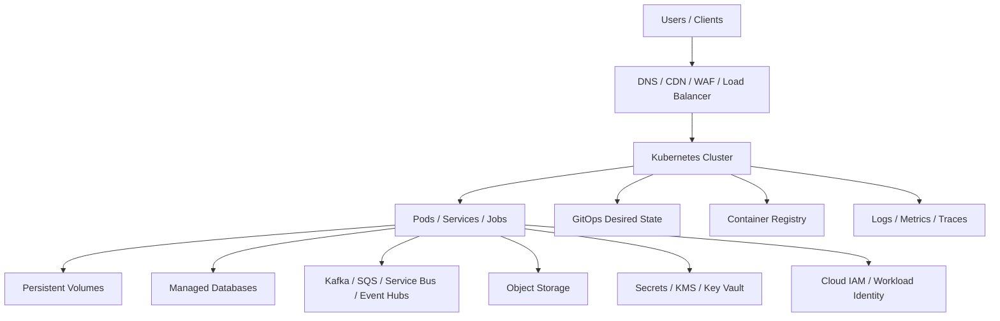
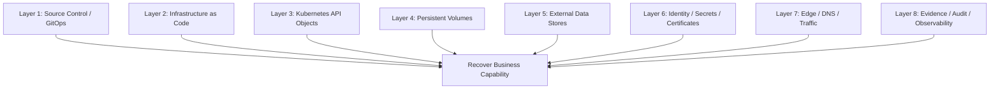
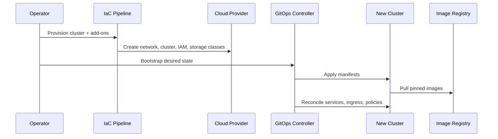
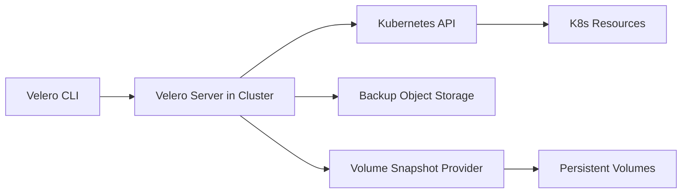
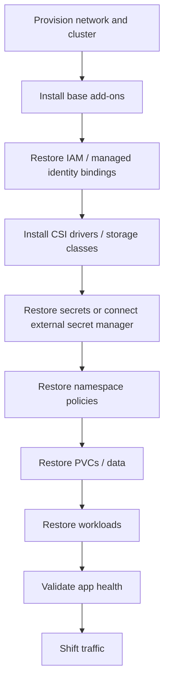
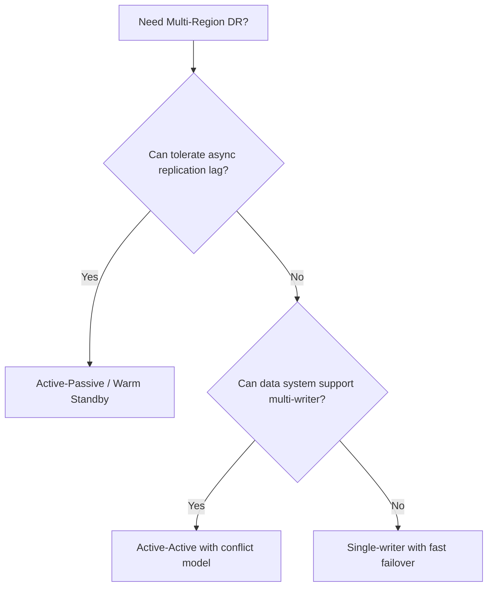

# Part 037 — Backup, Disaster Recovery, and Business Continuity

Backup is not a folder of YAML files.

In a production Kubernetes platform, backup is a **recoverability system**. Its value is not measured by how many backups exist, but by whether a known business function can be restored within an agreed **RPO** and **RTO**, under pressure, with evidence, without hidden dependencies.

Most teams learn this late. They back up manifests, install Velero, snapshot disks, and assume they have disaster recovery. Then the real incident happens:

- the cluster is gone but DNS is still pointing to it;
- the workload restores but the cloud identity binding is broken;
- the PersistentVolume exists but the application data is inconsistent;
- secrets restore but cannot decrypt because Key Vault or KMS permissions changed;
- Git contains desired state but not runtime-generated resources;
- the backup works in the same region but not in the recovery region;
- the restore succeeds technically but the business journey is still broken.

This part builds the mental model, design rules, and implementation blueprint for Kubernetes backup, disaster recovery, and business continuity on **AWS EKS** and **Azure AKS**.

---

## 1. The Core Mental Model

A Kubernetes cluster is not the system of record for everything.

It is an orchestration control plane that references many external systems.



Disaster recovery must answer:

> If this cluster, node pool, namespace, storage volume, region, identity provider, DNS zone, or cloud account becomes unavailable, what exact system state must exist somewhere else for the business process to continue?

That means DR is not “restore Kubernetes.”  
DR is “restore the **business capability**.”

---

## 2. Vocabulary That Actually Matters

### RPO — Recovery Point Objective

How much data loss is acceptable?

Examples:

- `RPO = 0` means no committed business transaction may be lost.
- `RPO = 5 minutes` means losing the last 5 minutes of state is acceptable.
- `RPO = 24 hours` may be acceptable for generated reports or rebuildable caches.

Kubernetes YAML usually has low RPO because it is stored in Git.  
Persistent data may have higher risk because it depends on snapshot frequency, database replication, and consistency model.

### RTO — Recovery Time Objective

How long may the business function be unavailable?

Examples:

- `RTO = 5 minutes`: requires warm standby or active-active.
- `RTO = 1 hour`: can use automated restore into pre-provisioned environment.
- `RTO = 24 hours`: may allow manual recovery.

### MTD — Maximum Tolerable Downtime

The point at which downtime causes unacceptable business damage.

RTO must be lower than MTD.

### Recovery Scope

A recovery scope defines what is being restored:

- one Pod;
- one namespace;
- one application;
- one cluster;
- one region;
- one cloud provider;
- one business journey.

Many DR plans fail because they never define scope.

---

## 3. What Must Be Recoverable?

A Kubernetes production platform contains multiple state categories.

| State Type | Example | Source of Truth | Backup Strategy |
|---|---|---|---|
| Declarative platform config | Namespaces, RBAC, policies, controllers | Git / IaC | Git + IaC state backup |
| Workload manifests | Deployments, Services, Ingress/Gateway, HPAs | GitOps repo | Git + Git provider backup |
| Runtime-generated Kubernetes objects | PVCs, Secrets, dynamically created resources | Cluster API | Velero / cloud-native backup |
| Persistent data | PVs, disks, fileshares | Storage provider / database | CSI snapshots / DB-native backup |
| External data | RDS, Cosmos DB, S3, Blob, Kafka | External service | Service-specific backup/replication |
| Identity binding | IAM roles, managed identities, RBAC | IaC + cloud IAM | IaC + policy export |
| Image artifacts | Container images, SBOM, signatures | Registry | Registry replication/retention |
| Secrets material | Kubernetes Secret, Secrets Manager, Key Vault | Secret manager | Secret manager backup/replication |
| DNS/edge config | DNS records, WAF, certificates | IaC / DNS provider | IaC + zone export |
| Observability evidence | logs, metrics, traces, audit logs | Observability backend | Retention + archive |

The dangerous assumption:

> “If Git has my manifests, I can rebuild everything.”

That is only true for stateless workloads with externally managed state and reproducible cloud infrastructure.

For stateful workloads, Git is not enough.

---

## 4. The Recovery Invariant

Every application should have an explicit recovery invariant:

```text
Given a total loss of <scope>,
we can restore <business capability>
to <RPO>
within <RTO>
using <documented procedure>
validated by <last successful restore test timestamp>.
```

Example:

```text
Given a total loss of the production EKS cluster in ap-southeast-1,
we can restore the Case Intake API and worker pipeline
to RPO <= 15 minutes
within RTO <= 60 minutes
using the cross-region DR runbook,
validated by a restore drill completed on 2026-06-15.
```

If the sentence cannot be completed, the system does not have a real DR design.

---

## 5. Kubernetes Backup Is Layered

Do not treat backup as a single tool.



A strong recovery design composes all layers.  
A weak design backs up only layer 3 and layer 4.

---

## 6. Why Managed Kubernetes Changes the Backup Model

In self-managed Kubernetes, teams sometimes think about backing up `etcd` directly.

In managed Kubernetes:

- EKS manages the Kubernetes control plane;
- AKS manages the Kubernetes control plane;
- you normally do not own direct etcd backup/restore;
- you recover user-facing cluster state through APIs, GitOps, IaC, and backup tools.

The control plane is managed, but your application state is not magically protected.

Managed Kubernetes reduces some failure modes. It does not eliminate DR ownership.

---

## 7. Disaster Classes

You need different plans for different disasters.

| Disaster | Example | Typical Recovery |
|---|---|---|
| Workload failure | Bad deployment, crash loop | Rollback / GitOps revert |
| Namespace corruption | Accidental delete, policy mistake | Namespace restore |
| PVC corruption | Bad write, filesystem corruption | Restore snapshot / app-native recovery |
| Cluster failure | Cluster unusable, severe misconfig | Rebuild cluster + restore state |
| Region failure | Cloud region unavailable | Fail over to another region |
| Account/subscription failure | IAM lockout, billing/security event | Separate account/subscription DR |
| Supply chain incident | Bad image, compromised artifact | Revoke image, redeploy trusted digest |
| Secret compromise | Leaked credentials | Rotate secret + invalidate sessions |
| Data corruption | Logical bad data committed | Point-in-time recovery / compensation |
| Dependency outage | Database, queue, identity unavailable | Degraded mode / failover |

Do not use the same runbook for all disasters.

---

## 8. Backup Strategy for Stateless Workloads

For stateless workloads, the source of truth should be:

- Git repository;
- container registry;
- IaC state;
- secret manager;
- cloud identity configuration.

Minimal restore path:



For a truly stateless service, backup is mostly reproducibility.

The production question becomes:

> Can a clean cluster be built from zero using only Git, registry, secrets, and IaC?

If not, the workload is not truly stateless operationally.

---

## 9. Backup Strategy for Stateful Workloads

For stateful workloads, separate **control state** from **data state**.

Example with a StatefulSet:

- StatefulSet manifest is control state;
- PVC objects are Kubernetes state;
- PV disk contents are data state;
- database logical consistency is application state.

A disk snapshot does not automatically mean application-consistent backup.

### Crash-consistent vs application-consistent

| Type | Meaning | Risk |
|---|---|---|
| Crash-consistent | Like power loss at snapshot time | May require recovery on startup |
| Application-consistent | App flushed/paused/wal-backed before backup | Safer but requires app integration |
| Logical backup | DB dump/export at logical layer | Portable but slower |
| Continuous replication | Data replicated to standby | Lower RPO but operationally complex |

For databases, prefer database-native backup and replication over generic PV backup when possible.

Kubernetes PV snapshot is useful. It is not a universal database DR strategy.

---

## 10. Velero Mental Model

Velero backs up Kubernetes resources and can coordinate persistent volume backup/snapshot depending on configuration and provider support.



Velero is useful for:

- namespace backup/restore;
- cluster migration;
- restoring Kubernetes API objects;
- backing up selected PVs;
- disaster recovery drills;
- moving apps between clusters.

Velero should not be the only protection for:

- managed databases;
- object stores;
- external queues;
- IAM policies;
- DNS records;
- container registries;
- secrets manager content unless explicitly integrated.

---

## 11. Example: Velero Schedule

```yaml
apiVersion: velero.io/v1
kind: Schedule
metadata:
  name: production-critical-hourly
  namespace: velero
spec:
  schedule: "0 * * * *"
  template:
    includedNamespaces:
      - case-management
      - enforcement-workflow
    includedResources:
      - deployments
      - statefulsets
      - services
      - configmaps
      - secrets
      - persistentvolumeclaims
      - ingresses
      - httproutes
      - gateways
    excludedResources:
      - events
      - pods
      - replicasets
    ttl: 168h0m0s
    snapshotVolumes: true
    storageLocation: default
```

Notes:

- Do not blindly back up all namespaces.
- Exclude high-churn objects that are not useful for recovery.
- Know whether Secrets should be backed up or restored from external secret managers.
- Define retention by business need, not default habit.
- Validate restore into a non-production cluster.

---

## 12. Restore Is Not Apply

A restore must reconstruct dependencies in the correct order.

Bad order:

```text
Restore workloads → discover identity missing → pods fail
```

Better order:

```text
Network → cluster → identity → storage class → secrets → policies → workloads → edge traffic
```



The restore order is part of the backup design.

---

## 13. EKS Backup and DR Blueprint

A production EKS recovery plan typically includes:

### 13.1 Infrastructure

- AWS accounts and organizational structure;
- VPC, subnets, route tables;
- NAT gateways or egress gateways;
- EKS cluster;
- EKS add-ons;
- node groups, Karpenter, or EKS Auto Mode node classes;
- security groups;
- IAM roles and policies;
- OIDC provider or EKS Pod Identity associations;
- CloudWatch, Prometheus, logging sinks.

These should be IaC-managed.

### 13.2 Cluster State

Options:

- GitOps desired state;
- Velero backup;
- AWS Backup for EKS where applicable;
- export of CRDs and controller configurations;
- add-on version matrix.

### 13.3 Storage

For EKS:

- EBS CSI snapshots for block volumes;
- EFS backup strategy for shared filesystem workloads;
- S3 versioning/replication for object state;
- RDS/Aurora native backup and cross-region replication for databases;
- DynamoDB point-in-time recovery and global tables when relevant.

Do not pretend that EBS snapshot and RDS backup are the same thing. They solve different layers.

### 13.4 Identity

Recoverability requires:

- IAM roles;
- trust policies;
- Pod Identity associations or IRSA annotations;
- KMS keys and grants;
- Secrets Manager permissions;
- access entries;
- cluster-admin break-glass role;
- audit trail.

Identity errors are among the most common restore blockers.

### 13.5 Edge

- Route 53 records;
- health checks;
- ACM certificates;
- ALB/NLB controllers;
- WAF;
- CloudFront if used;
- external-dns configuration;
- load balancer annotations.

DNS failover must be rehearsed. A restored app with stale DNS is not recovered.

---

## 14. AKS Backup and DR Blueprint

A production AKS recovery plan typically includes:

### 14.1 Infrastructure

- Azure subscription and management group policies;
- resource groups;
- VNet, subnets, route tables;
- NAT Gateway / Azure Firewall;
- AKS cluster;
- system and user node pools;
- Azure CNI mode;
- managed identities;
- role assignments;
- Azure Policy;
- Azure Monitor / Log Analytics / Managed Prometheus.

### 14.2 Cluster State

Options:

- GitOps desired state;
- Azure Backup for AKS;
- Velero;
- IaC-managed cluster and add-ons;
- exported policy assignments and diagnostic settings.

### 14.3 Storage

For AKS:

- Azure Disk CSI snapshots;
- Azure Files backup where applicable;
- Azure Blob replication for object state;
- Azure SQL / PostgreSQL / Cosmos DB native backup and replication;
- application-level backups for complex stateful apps.

Azure Backup for AKS is designed to protect cluster state and application data stored on supported CSI-backed persistent volumes. Validate what is supported before relying on it for critical recovery.

### 14.4 Identity

Recoverability requires:

- user-assigned managed identities;
- federated identity credentials;
- Entra ID groups;
- Azure RBAC role assignments;
- Key Vault access model;
- ACR pull permissions;
- cluster admin break-glass path.

If workload identity is not recreated, restored Pods may start but fail when calling Azure services.

### 14.5 Edge

- Azure DNS records;
- Front Door / Traffic Manager;
- Application Gateway or Application Gateway for Containers;
- public/private load balancer;
- Web Application Firewall policy;
- Key Vault certificates;
- external-dns integration.

AKS DR is usually not only an AKS problem. It is an Azure networking, identity, and data replication problem.

---

## 15. Recovery Topologies

### 15.1 Backup-only

You have backups, but no warm recovery environment.


Good for:

- low RTO requirements;
- non-critical workloads;
- lower cost environments.

Risk:

- recovery time depends on provisioning speed;
- hidden dependency drift is discovered late.

### 15.2 Pilot Light

Minimal DR environment exists, but workloads are scaled down.


Good for:

- moderate RTO;
- cost-controlled resilience.

Risk:

- scale-up may fail due to quota/IP/capacity constraints;
- stale controller/add-on versions.

### 15.3 Warm Standby

DR environment runs core services at reduced capacity.

Good for:

- lower RTO;
- regular traffic validation.

Risk:

- higher cost;
- requires config/data synchronization discipline.

### 15.4 Active-Active

Multiple regions actively serve traffic.

Good for:

- very low RTO;
- global latency reduction;
- high availability requirements.

Risk:

- hardest data consistency model;
- complex routing;
- split-brain risk;
- higher operational load.

Most systems do not need active-active. Many teams choose it before they understand the data model.

---

## 16. Multi-Region DR: The Real Constraint Is Data

Kubernetes can be recreated faster than data can be safely recovered.

For multi-region DR, answer:

- Is data replicated synchronously or asynchronously?
- Is stale data acceptable?
- Can writes happen in both regions?
- How is conflict resolved?
- Does the app support idempotency?
- Are sequence numbers region-specific?
- Are events replayable?
- Are consumers exactly-once, at-least-once, or best-effort?
- Can the system operate read-only during recovery?



A Kubernetes platform engineer should not promise active-active if the data model is single-writer.

---

## 17. DR for GitOps

GitOps improves recovery only if GitOps itself is recoverable.

Check:

- Is the Git provider available during DR?
- Is there a mirror repository?
- Are deploy keys/secrets available?
- Is the GitOps controller bootstrapped by IaC?
- Are cluster-specific overlays portable?
- Are cloud-specific resources separated cleanly?
- Are secrets encrypted with keys available in the recovery region?
- Can you promote DR environment without editing many files manually?

Bad GitOps DR:

```text
prod overlay contains hard-coded cluster IDs, subnet IDs, certificate ARNs, identity IDs
```

Better GitOps DR:

```text
base + environment overlay + cluster-specific generated values managed by platform pipeline
```

---

## 18. DR for Secrets

Secrets are often the restore killer.

Possible patterns:

### Pattern A — Backup Kubernetes Secrets

Simple but risky.

Pros:

- easy restore;
- works without external secret manager.

Cons:

- backup now contains sensitive material;
- encryption and access control become critical;
- rotation after restore may be required.

### Pattern B — External Secret Manager as Source of Truth

Preferred for production.

Pros:

- Kubernetes Secret can be regenerated;
- secret rotation can be centralized;
- access is identity-controlled.

Cons:

- external secret manager must be available in DR region;
- workload identity must restore before workloads;
- secret path/naming must be portable.

### Pattern C — Sealed Secrets / SOPS

Useful for GitOps.

Pros:

- encrypted secret material stored declaratively;
- good for environment bootstrap.

Cons:

- key management becomes DR-critical;
- cluster-specific encryption keys can complicate restore.

Rule:

> Secret recovery design must specify where the secret value lives, where the decryption key lives, and who can access both during incident response.

---

## 19. DR for Certificates

TLS failure can block recovery even when the app is healthy.

Track:

- certificate issuer;
- private key storage;
- renewal automation;
- DNS validation dependency;
- certificate region constraints;
- ingress/gateway reference;
- WAF/CDN binding;
- expiration alerting.

For AWS:

- ACM certificates for ALB/CloudFront;
- cert-manager for in-cluster certs;
- Route 53 validation;
- cross-region certificate requirements for some services.

For Azure:

- Key Vault certificates;
- Application Gateway certificate integration;
- cert-manager with DNS validation;
- Azure DNS or external DNS provider.

DR runbook must include certificate validation, not just deployment validation.

---

## 20. Backup Validation Strategy

A backup that is never restored is not evidence.

Validation levels:

| Level | Test | Confidence |
|---|---|---|
| L0 | Backup job succeeded | Very low |
| L1 | Backup object exists | Low |
| L2 | Restore into empty namespace | Medium |
| L3 | Restore into clean cluster | High |
| L4 | Restore into clean cluster + validate business journey | Very high |
| L5 | Regional failover drill with traffic shift | Highest |

Production teams should schedule restore tests.  
The output should be evidence, not vibes.

Example evidence:

```text
Restore Drill ID: DR-2026-06-15-EKS-CASE
Scope: case-management namespace + RDS PITR + ALB traffic validation
RPO target: <= 15m
RTO target: <= 60m
Actual RPO: 8m
Actual RTO: 42m
Failed checks: external-dns permission missing in DR account
Remediation: added IAM role to DR bootstrap module
Next drill: 2026-07-15
```

---

## 21. Restore Runbook Template

```md
# Restore Runbook: <Application>

## 1. Scope
- Application:
- Environment:
- Cluster:
- Region:
- Data stores:
- Recovery objective:

## 2. Trigger
- Disaster type:
- Declared by:
- Incident channel:
- Customer impact:

## 3. Preconditions
- Backup timestamp:
- Git commit:
- Image digests:
- Secrets source:
- Cloud account/subscription access:
- Required approvals:

## 4. Restore Order
1. Provision infrastructure
2. Bootstrap cluster add-ons
3. Restore identity bindings
4. Restore secrets/certificates
5. Restore storage/data
6. Restore workloads
7. Validate internal health
8. Validate business journey
9. Shift traffic
10. Monitor and declare recovery

## 5. Validation
- API health:
- DB connectivity:
- Queue lag:
- Auth flow:
- Critical user journey:
- Error budget impact:

## 6. Rollback / Abort
- Abort criteria:
- Traffic rollback:
- Data rollback:
- Escalation:

## 7. Evidence
- Logs:
- Metrics:
- Screenshots:
- Commands:
- Incident timeline:
```

Runbooks should be executable by someone who did not design the system.

---

## 22. Example: Namespace Restore Drill

```bash
# 1. Create isolated restore namespace
kubectl create namespace restore-drill-case-management

# 2. Restore selected backup into namespace mapping
velero restore create case-restore-$(date +%Y%m%d%H%M) \
  --from-backup production-critical-hourly-20260703010000 \
  --namespace-mappings case-management:restore-drill-case-management

# 3. Watch restore
velero restore describe case-restore-202607030100 --details
kubectl get all -n restore-drill-case-management

# 4. Validate PVC binding
kubectl get pvc -n restore-drill-case-management

# 5. Validate app-level health without exposing public traffic
kubectl port-forward svc/case-api 8080:80 -n restore-drill-case-management
curl -fsS http://localhost:8080/internal/health
```

Do not point production DNS to a restored namespace until business validation is complete.

---

## 23. Example: Clean Cluster Restore Drill

```bash
# 1. Provision new cluster through IaC
terraform apply -var-file=dr-test.tfvars

# 2. Bootstrap platform base
argocd app sync platform-root
argocd app wait platform-root --health

# 3. Restore cluster resources
velero restore create dr-clean-cluster-restore \
  --from-backup production-critical-hourly-20260703010000

# 4. Validate identities
kubectl auth can-i get secrets \
  --as=system:serviceaccount:case-management:case-api \
  -n case-management

# 5. Validate storage
kubectl get pvc -A
kubectl get volumesnapshot -A

# 6. Validate workloads
kubectl get deploy,statefulset,daemonset -A
kubectl get pods -A --field-selector=status.phase!=Running

# 7. Validate edge not yet public
kubectl get ingress,gateway,httproute -A
```

A clean cluster drill catches assumptions that namespace restore does not.

---

## 24. Common Failure Modes

### 24.1 Backup Succeeds but Restore Fails

Causes:

- CRDs missing in target cluster;
- admission webhook unavailable;
- storage class name mismatch;
- cloud identity not recreated;
- namespace policy blocks restored Pod;
- immutable field conflict;
- volume snapshot class missing;
- target Kubernetes version incompatible.

Mitigation:

- restore into clean cluster regularly;
- version platform add-ons;
- record restore prerequisites;
- run preflight checks.

### 24.2 Restored Pods Cannot Access Cloud Services

Causes:

- IRSA/EKS Pod Identity association missing;
- AKS federated credential missing;
- role assignment not propagated;
- KMS/Key Vault permissions absent;
- service account name changed.

Mitigation:

- make identity bindings IaC-managed;
- test cloud API calls as part of restore validation.

### 24.3 Restored Data Is Inconsistent

Causes:

- crash-consistent PV snapshot used for database;
- app wrote across multiple volumes;
- backup taken during migration;
- queue offset and database state out of sync.

Mitigation:

- use app-native backup for databases;
- quiesce workload if required;
- coordinate backups across state boundaries;
- design idempotent recovery.

### 24.4 DNS Failover Is Slow or Wrong

Causes:

- high TTL;
- stale record;
- health check not connected to business signal;
- split public/private DNS;
- certificate mismatch.

Mitigation:

- define DNS failover runbook;
- use health-checked routing where appropriate;
- test failover with non-prod hostname.

### 24.5 Backup Contains Secrets but Nobody Can Decrypt

Causes:

- lost encryption key;
- KMS/Key Vault not replicated;
- access removed;
- cluster-specific sealed secret key lost.

Mitigation:

- treat encryption keys as DR-critical assets;
- document break-glass access;
- test secret restore.

---

## 25. Backup Policy Design

A good backup policy is specific.

Bad:

```text
Back up the cluster daily.
```

Better:

```text
For namespace case-management:
- Kubernetes resources: hourly, 7-day retention
- PV snapshots: every 4 hours, 14-day retention
- PostgreSQL: PITR 7 days, daily snapshot 35 days
- Secrets: external Secrets Manager replicated to DR account
- Restore drill: monthly namespace restore, quarterly clean-cluster restore
```

Policy dimensions:

- scope;
- frequency;
- retention;
- encryption;
- immutability;
- access control;
- geographic replication;
- restore test frequency;
- owner;
- evidence location.

---

## 26. Business Continuity Is Bigger Than DR

DR restores the system.

Business continuity keeps the organization functioning.

Include:

- incident command structure;
- customer communication;
- manual fallback process;
- degraded mode behavior;
- read-only mode;
- compensation workflow;
- data reconciliation;
- regulatory evidence;
- post-incident review.

For regulatory systems, business continuity must answer:

- Can cases still be received?
- Can enforcement deadlines be tracked?
- Can decisions be audited?
- Can users distinguish provisional vs final state?
- Can late-arriving events be reconciled?
- Can manual actions be re-entered safely?

Kubernetes is only one layer of that answer.

---

## 27. Degraded Mode Design

Not every failure should trigger full DR.

Example degraded modes:

| Dependency Failed | Degraded Mode |
|---|---|
| Search index | Serve primary records without search |
| Notification provider | Queue notifications for later |
| Reporting DB | Disable reports, keep transaction path open |
| Analytics pipeline | Buffer events |
| External payment API | Accept request as pending |
| Identity provider | Allow existing sessions, block new login |
| Object storage | Read-only mode for metadata |

A well-designed system may survive without failover by reducing capability intentionally.

---

## 28. DR Decision Matrix

| Requirement | Recommended Pattern |
|---|---|
| RTO > 24h, RPO > 24h | Backup-only |
| RTO 4–24h | Automated rebuild + restore |
| RTO 1–4h | Pilot light |
| RTO 15–60m | Warm standby |
| RTO < 15m | Active-passive with pre-warmed traffic plane |
| Near-zero RTO/RPO | Active-active, only if data model supports it |
| Strict auditability | Immutable backups + restore evidence |
| Heavy stateful DB | DB-native replication/backup first |
| Stateless APIs | GitOps + image registry + IaC may be sufficient |
| Cloud provider outage concern | Multi-region or multi-cloud, with complexity accepted |

---

## 29. Recovery Readiness Scorecard

Score each item from 0 to 3.

| Area | 0 | 1 | 2 | 3 |
|---|---|---|---|---|
| Git/IaC | Manual config | Partial IaC | Full IaC | Full IaC tested in clean env |
| Cluster state | No backup | Manual export | Scheduled backup | Tested restore |
| PV/data | No backup | Ad hoc snapshot | Scheduled snapshot | App-consistent restore tested |
| Identity | Manual | Documented | IaC-managed | Restored in drill |
| Secrets | Unknown | Manual copy | External manager | DR-replicated/tested |
| DNS/edge | Manual | Documented | IaC-managed | Failover tested |
| Observability | Logs only | Dashboards | Alerts | Incident evidence retained |
| Runbooks | None | Draft | Reviewed | Executed in drill |
| Ownership | Unknown | Named team | RACI | On-call trained |
| Business journey | Not tested | Technical health only | Partial journey | Full journey validation |

Target: no critical system below 2; high-criticality systems should be mostly 3.

---

## 30. Capstone Exercise

Design DR for this platform:

```text
Case Management Platform
- Frontend SPA
- Case API
- Workflow worker
- PostgreSQL database
- Object storage for evidence files
- Kafka/Event Hubs event stream
- Search index
- Notification service
- EKS or AKS cluster
- GitOps delivery
- External identity provider
```

Produce:

1. RPO/RTO table per business function.
2. State inventory.
3. Backup policy.
4. Restore order.
5. Recovery topology.
6. Identity recovery plan.
7. DNS failover plan.
8. Restore drill script.
9. Evidence template.
10. Known non-recoverable assumptions.

Expected insight:

> The Kubernetes cluster is recoverable only after network, identity, secrets, storage, data, image, and edge dependencies are recoverable.

---

## 31. Production Checklist

Before claiming DR readiness:

- [ ] Every critical app has RPO/RTO.
- [ ] Every persistent state has an owner and backup mechanism.
- [ ] GitOps repo and IaC state are recoverable.
- [ ] Registry images are immutable and retained.
- [ ] Secrets recovery is tested.
- [ ] Identity bindings are IaC-managed.
- [ ] Storage snapshots are tested.
- [ ] Database-native backups are tested.
- [ ] DNS/edge failover is documented.
- [ ] Restore runbook exists.
- [ ] Clean-cluster restore drill has been performed.
- [ ] Business journey validation is included.
- [ ] Evidence is stored outside the failed cluster.
- [ ] Break-glass access is tested.
- [ ] Post-restore reconciliation is documented.

---

## 32. Key Takeaways

- Backup is not recovery.
- Recovery is not business continuity.
- Kubernetes cluster state is only one recovery layer.
- Managed control planes do not remove application DR responsibility.
- PV snapshots are not always application-consistent.
- Identity and secrets frequently break restores.
- Multi-region DR is mostly a data-model problem.
- GitOps improves recovery only if cloud, secret, identity, and data dependencies are portable.
- The only trustworthy backup is one that has been restored and validated.

---

## References

- Kubernetes Documentation — Cluster Architecture and Components: https://kubernetes.io/docs/concepts/overview/components/
- Kubernetes Documentation — Persistent Volumes: https://kubernetes.io/docs/concepts/storage/persistent-volumes/
- Kubernetes Documentation — Volume Snapshots: https://kubernetes.io/docs/concepts/storage/volume-snapshots/
- Kubernetes Documentation — Disruptions: https://kubernetes.io/docs/concepts/workloads/pods/disruptions/
- Velero Documentation — Overview: https://velero.io/docs/main/
- Velero Documentation — Restore Reference: https://velero.io/docs/main/restore-reference/
- AWS Documentation — AWS Backup for Amazon EKS: https://docs.aws.amazon.com/aws-backup/latest/devguide/eks-backups.html
- AWS Containers Blog — Back up and restore Amazon EKS resources using Velero: https://aws.amazon.com/blogs/containers/back-up-and-restore-your-amazon-eks-cluster-resources-using-velero/
- Azure Architecture Center — AKS Backup and Recovery: https://learn.microsoft.com/en-us/azure/architecture/operator-guides/aks/aks-backup-and-recovery
- Azure Backup — AKS Backup Overview: https://learn.microsoft.com/en-us/azure/backup/azure-kubernetes-service-backup-overview
- Azure Architecture Center — AKS Multi-Region Baseline: https://learn.microsoft.com/en-us/azure/architecture/reference-architectures/containers/aks-multi-region/aks-multi-cluster
