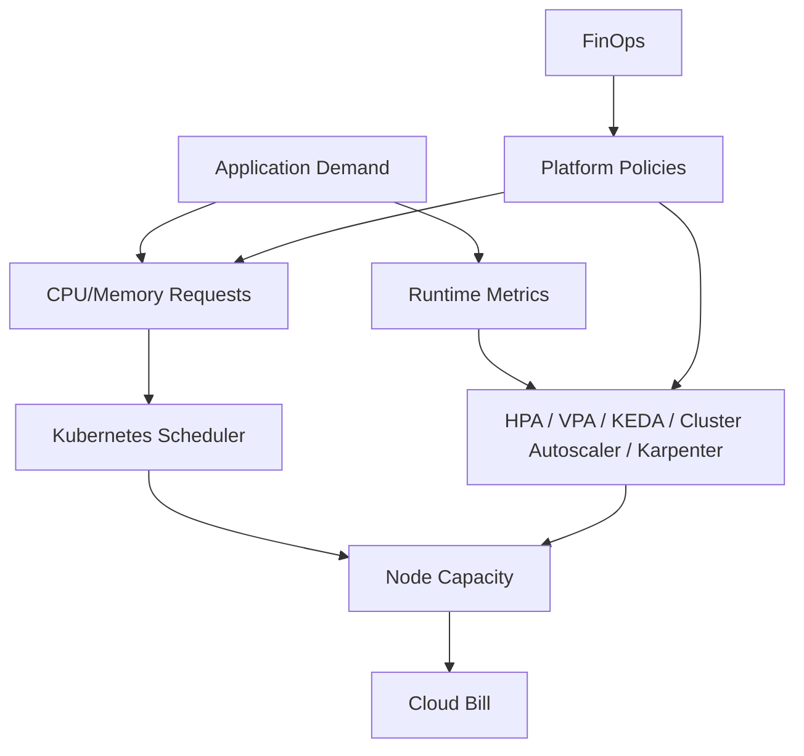
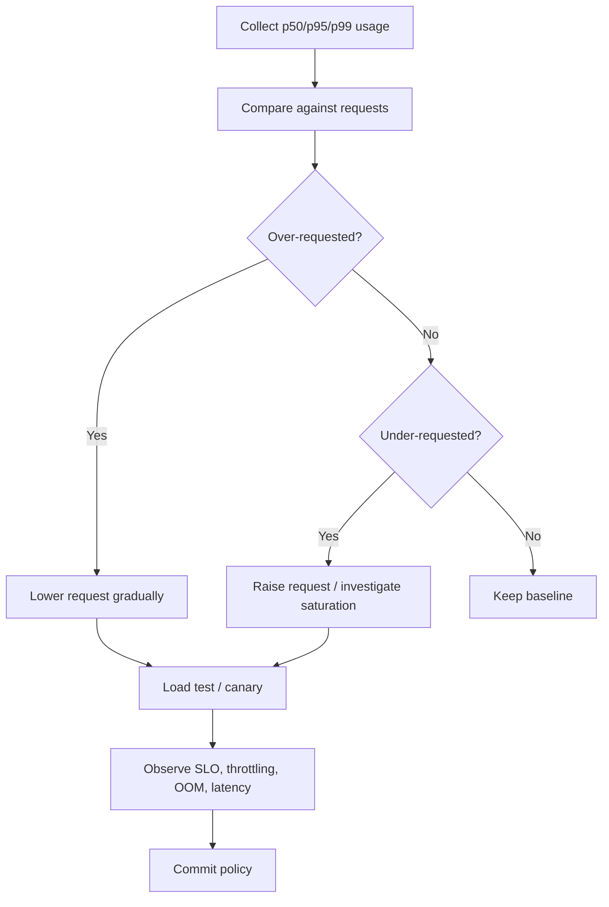

# Part 038 — Cost Engineering, FinOps, and Capacity Planning

Kubernetes does not make infrastructure cheap.

Kubernetes makes infrastructure **programmable**.

That programmability can reduce waste, or it can hide waste behind abstractions: oversized requests, idle node pools, expensive NAT egress, over-collected logs, unused PersistentVolumes, zombie LoadBalancers, always-on dev clusters, fragmented Spot capacity, and noisy autoscaling loops.

Cost engineering in Kubernetes is not “buy smaller nodes.”  
It is designing a platform where **resource intent**, **scheduler behavior**, **autoscaler behavior**, **cloud billing**, and **team accountability** are connected.

This part builds a production mental model for Kubernetes cost engineering and capacity planning across **AWS EKS** and **Azure AKS**.

---

## 1. The Core Mental Model

In Kubernetes, cost is shaped by scheduling commitments.



The cloud provider charges for actual infrastructure.  
The Kubernetes scheduler places Pods based on declared requests.  
The autoscaler changes capacity based on pending Pods and signals.

Therefore:

> Cost efficiency depends on the accuracy of declared resource intent and the platform’s ability to convert that intent into the right capacity at the right time.

---

## 2. The First Principle: Requests Are Reservations

A CPU/memory request is not a comment.  
It is a scheduling reservation.

Example:

```yaml
resources:
  requests:
    cpu: "500m"
    memory: "1Gi"
  limits:
    cpu: "1"
    memory: "2Gi"
```

This says:

- reserve 0.5 vCPU and 1 GiB memory for scheduling;
- allow CPU bursting up to 1 vCPU;
- kill the container if memory exceeds 2 GiB.

If the app usually uses 100m CPU and 300Mi memory, the platform may be paying for idle reserved capacity.

The scheduler does not know your real usage. It knows requests.

---

## 3. The Kubernetes Cost Equation

A practical model:

```text
Total Kubernetes Cost =
  Compute Cost
+ Storage Cost
+ Network Cost
+ Load Balancer Cost
+ Observability Cost
+ Control Plane / Management Tier Cost
+ Registry / Artifact Cost
+ Backup / DR Cost
+ Security / Policy Tooling Cost
+ Operational Labor Cost
```

Most cost projects focus only on compute.  
That is incomplete.

For many production clusters, hidden cost drivers include:

- NAT Gateway data processing;
- cross-AZ traffic;
- public load balancers;
- log ingestion;
- metrics cardinality;
- managed Prometheus active series;
- orphaned disks;
- premium storage classes;
- unused snapshots;
- container image storage;
- inter-region replication;
- idle environments.

---

## 4. Cost Signals You Must Collect

At minimum:

| Signal | Why It Matters |
|---|---|
| Pod request CPU/memory | Scheduler reservation |
| Pod actual CPU/memory | Right-sizing |
| Node allocatable capacity | Real usable capacity |
| Node utilization | Waste and headroom |
| Pending Pods | Capacity shortage |
| HPA desired/current replicas | Autoscaling behavior |
| VPA recommendations | Request correction |
| KEDA scaler activity | Event-driven capacity |
| Cluster Autoscaler/Karpenter actions | Node lifecycle |
| PV size and usage | Storage waste |
| LoadBalancer inventory | Network cost |
| NAT/egress bytes | Hidden network cost |
| Log/metric ingestion volume | Observability cost |
| Namespace/team labels | Chargeback/showback |

Without team/workload labels, cost attribution becomes guesswork.

---

## 5. Labeling and Ownership

Cost engineering starts with metadata.

Required labels:

```yaml
metadata:
  labels:
    app.kubernetes.io/name: case-api
    app.kubernetes.io/component: api
    app.kubernetes.io/part-of: case-management
    platform.example.com/team: enforcement-platform
    platform.example.com/environment: production
    platform.example.com/cost-center: reg-enforcement
    platform.example.com/criticality: tier-1
```

Enforce labels at admission.

Without ownership labels, the platform team becomes the owner of everyone’s waste.

---

## 6. Request Accuracy

Request accuracy is the ratio between requested resources and actual usage.

```text
CPU Request Efficiency = p95 CPU Usage / CPU Request
Memory Request Efficiency = p95 Memory Usage / Memory Request
```

Interpretation:

| Ratio | Meaning |
|---|---|
| < 0.2 | likely over-requested |
| 0.2–0.5 | conservative but possibly acceptable |
| 0.5–0.8 | healthy for many services |
| > 0.9 | risk of saturation or eviction depending on memory/CPU |
| > 1.0 | usage exceeds request, may rely on burst/headroom |

Memory should usually be sized more conservatively than CPU because memory pressure can cause OOM kills and node eviction. CPU throttling is painful; memory OOM is often fatal.

---

## 7. Limits Strategy

Bad default:

```yaml
resources:
  requests:
    cpu: "100m"
    memory: "128Mi"
  limits:
    cpu: "100m"
    memory: "128Mi"
```

This often creates CPU throttling and memory kills.

A more nuanced policy:

| Resource | Request | Limit |
|---|---|---|
| CPU | required | optional or higher than request |
| Memory | required | required for most workloads |
| Ephemeral storage | required for risky workloads | required where logs/temp files can grow |

Common production stance:

- set CPU requests;
- avoid overly tight CPU limits for latency-sensitive services;
- set memory requests and limits;
- use VPA recommendations;
- load test before enforcing hard policies.

---

## 8. Bin Packing

Bin packing means fitting workload reservations into node capacity efficiently.

Example:

Node allocatable:

```text
CPU:    7.5 vCPU
Memory: 28 GiB
```

Workload requests:

```text
Pod A: 1 CPU, 4 GiB
Pod B: 1 CPU, 4 GiB
Pod C: 500m, 1 GiB
...
```

The scheduler packs Pods by constraints:

- CPU;
- memory;
- pod count;
- topology spread;
- affinity/anti-affinity;
- taints/tolerations;
- storage topology;
- GPU/device requirements;
- architecture;
- zone;
- security constraints.

Poor bin packing comes from:

- wrong requests;
- too many node shapes;
- too few node shapes;
- hard anti-affinity;
- strict topology spread;
- excessive daemonset overhead;
- large sidecars;
- huge per-node reserved resources;
- IP address limits.

---

## 9. Fragmentation

Fragmentation occurs when a cluster has free resources but cannot place a Pod.

Example:

```text
Node 1 free: 500m CPU, 8Gi memory
Node 2 free: 500m CPU, 8Gi memory
Node 3 free: 500m CPU, 8Gi memory

Pending Pod request: 1 CPU, 1Gi memory
```

Total CPU free is 1.5 CPU, but no single node has 1 CPU.

Autoscaler may add a node despite apparent unused capacity.

This is not necessarily a bug.  
It is a packing constraint.

Mitigations:

- right-size requests;
- reduce unnecessary anti-affinity;
- use flexible node provisioning;
- consolidate nodes;
- choose better instance/VM shapes;
- split oversized Pods;
- use Karpenter/Node Auto-Provisioning where appropriate.

---

## 10. EKS Cost Drivers

Common EKS cost components:

- EKS cluster management fee;
- extended support charge for old Kubernetes versions;
- EC2 worker nodes;
- Fargate Pod usage if used;
- EBS volumes and snapshots;
- EFS;
- Elastic Load Balancers;
- NAT Gateway;
- inter-AZ and inter-region data transfer;
- CloudWatch logs and metrics;
- Amazon Managed Prometheus;
- Amazon Managed Grafana;
- ECR storage and scanning;
- AWS Backup;
- KMS requests;
- WAF/CloudFront if used.

EKS cost engineering must include AWS-native resources created by Kubernetes controllers.

A `Service type: LoadBalancer` is not just YAML. It can create a cloud load balancer.

---

## 11. AKS Cost Drivers

Common AKS cost components:

- AKS cluster management tier;
- VMSS node pools;
- AKS Automatic managed node capacity;
- Azure Disks;
- Azure Files;
- Load Balancer;
- NAT Gateway / Firewall;
- Application Gateway / Application Gateway for Containers;
- Azure Monitor / Log Analytics;
- Managed Prometheus;
- Azure Managed Grafana;
- ACR storage/scanning;
- Azure Backup;
- public IPs;
- bandwidth / cross-region transfer;
- Key Vault operations;
- Defender for Cloud if enabled.

AKS Free tier is commonly suited for development/testing and non-production, while Standard/Premium tiers add production-oriented guarantees and support features. AKS Automatic uses Standard tier.

---

## 12. Cost Ownership Model

A mature platform separates:

| Role | Responsibility |
|---|---|
| Application team | resource requests, scaling config, workload efficiency |
| Platform team | node pools, autoscalers, guardrails, observability, policy |
| SRE | reliability/cost trade-off, SLO/error budget |
| Security | policy exceptions, runtime restrictions |
| Finance/FinOps | budget, allocation, reporting |
| Architecture | workload placement, service boundaries |

Cost cannot be owned only by finance.  
Finance sees the bill after the architecture has already made decisions.

---

## 13. Showback and Chargeback

### Showback

Teams see cost but are not billed internally.

Good for:

- early maturity;
- awareness;
- behavior change;
- non-punitive discovery.

### Chargeback

Teams are financially accountable.

Good for:

- mature organizations;
- platform product model;
- business-unit accountability.

Risk:

- teams under-request to reduce apparent cost;
- reliability may degrade;
- shared infrastructure allocation becomes politically complex.

Use policy and SLOs to prevent cost-driven underprovisioning.

---

## 14. Namespace Cost Allocation

A simple allocation model:

```text
Namespace Compute Cost =
  sum(pod_request_cpu / total_node_allocated_cpu * node_cpu_cost)
+ sum(pod_request_memory / total_node_allocated_memory * node_memory_cost)
```

But real allocation is harder because:

- DaemonSets consume every node;
- system namespaces consume shared capacity;
- GPUs/devices are discrete;
- Spot vs On-Demand cost differs;
- idle capacity must be allocated somewhere;
- cross-namespace shared services exist;
- HPA changes replica count over time.

A better model distinguishes:

- direct workload cost;
- shared platform cost;
- idle/waste cost;
- DR/resilience premium;
- observability overhead.

---

## 15. Rightsizing Workflow



Use at least several days of data for steady services.  
Use longer windows for weekly/monthly batch patterns.

Do not right-size from one quiet hour.

---

## 16. VPA as Recommendation Engine

Vertical Pod Autoscaler can be used in modes:

- `Off` / recommendation only;
- `Initial`;
- `Auto`;
- `Recreate`.

Production pattern:

1. Start with recommendation mode.
2. Compare VPA recommendations with SLO.
3. Adjust requests through GitOps.
4. Automate only for lower-risk workloads.
5. Avoid uncontrolled VPA on latency-critical apps without testing.

Example VPA:

```yaml
apiVersion: autoscaling.k8s.io/v1
kind: VerticalPodAutoscaler
metadata:
  name: case-api-vpa
  namespace: case-management
spec:
  targetRef:
    apiVersion: apps/v1
    kind: Deployment
    name: case-api
  updatePolicy:
    updateMode: "Off"
```

Treat VPA output as evidence, not absolute truth.

---

## 17. HPA Cost Behavior

HPA changes replica count.  
It does not directly reduce node cost unless node autoscaling follows.

Cost risks:

- scaling on noisy CPU metrics;
- low stabilization window;
- high max replicas without quota;
- missing requests causing invalid CPU utilization;
- scale-up causing node sprawl;
- scale-down blocked by PDB or long termination.

Good HPA policy:

```yaml
apiVersion: autoscaling/v2
kind: HorizontalPodAutoscaler
metadata:
  name: case-api
spec:
  scaleTargetRef:
    apiVersion: apps/v1
    kind: Deployment
    name: case-api
  minReplicas: 3
  maxReplicas: 30
  metrics:
    - type: Resource
      resource:
        name: cpu
        target:
          type: Utilization
          averageUtilization: 65
  behavior:
    scaleUp:
      stabilizationWindowSeconds: 60
      policies:
        - type: Percent
          value: 100
          periodSeconds: 60
    scaleDown:
      stabilizationWindowSeconds: 300
      policies:
        - type: Percent
          value: 25
          periodSeconds: 60
```

Scale down more slowly than scale up for user-facing services.

---

## 18. KEDA Cost Behavior

KEDA is powerful because it scales from event signals:

- queue depth;
- stream lag;
- HTTP request rate;
- cron schedule;
- cloud service metrics.

Cost advantage:

- workers can scale to zero;
- batch capacity follows demand;
- off-hours jobs do not need idle replicas.

Risk:

- bad scaler threshold causes oscillation;
- external metric latency causes delayed response;
- maxReplicaCount too high causes capacity shock;
- downstream services get overloaded.

Example:

```yaml
apiVersion: keda.sh/v1alpha1
kind: ScaledObject
metadata:
  name: enforcement-worker
  namespace: enforcement-workflow
spec:
  scaleTargetRef:
    name: enforcement-worker
  minReplicaCount: 0
  maxReplicaCount: 50
  pollingInterval: 30
  cooldownPeriod: 300
  triggers:
    - type: kafka
      metadata:
        bootstrapServers: kafka.example:9092
        consumerGroup: enforcement-worker
        topic: enforcement-events
        lagThreshold: "100"
```

KEDA is not just cost optimization. It is workload shaping.

---

## 19. Node Autoscaling

Node autoscaling converts pending Pods into cloud capacity.

Tools:

| Platform | Common Options |
|---|---|
| EKS | Cluster Autoscaler, Karpenter, EKS Auto Mode |
| AKS | Cluster Autoscaler, Node Auto-Provisioning, AKS Automatic |

Node autoscaler decisions are affected by:

- requests;
- node pool constraints;
- taints/tolerations;
- topology spread;
- zones;
- instance availability;
- quotas;
- IP availability;
- PDBs;
- daemonset overhead;
- consolidation policies.

A pending Pod is a cost signal.

---

## 20. Karpenter / EKS Auto Mode Cost Model

Karpenter-style provisioning improves cost by:

- selecting from many instance types;
- using Spot and On-Demand flexibility;
- consolidating underutilized nodes;
- expiring old nodes;
- matching node shape to workload demand.

But it requires:

- clear disruption budgets;
- workload tolerance for node churn;
- flexible Pod constraints;
- strong observability;
- testing with real workloads.

Bad pattern:

```text
strict nodeSelector + one instance type + no Spot tolerance + high requests
```

This leaves the autoscaler little room to optimize.

Good pattern:

```text
flexible instance families + multiple zones + appropriate disruption budgets + right-sized requests
```

---

## 21. AKS Automatic / Node Auto-Provisioning Cost Model

AKS Automatic and Node Auto-Provisioning reduce manual node-pool management by provisioning capacity based on workload requirements.

Cost advantages:

- fewer hand-crafted node pools;
- better matching capacity to workload;
- reduced idle pool risk;
- managed defaults for many platform concerns.

Risks:

- less direct control than fully manual pools;
- policy and quota still matter;
- workload constraints can still force expensive nodes;
- observability is required to understand why capacity was selected.

Use managed automation where it matches organizational maturity.  
Do not abdicate cost ownership to automation.

---

## 22. Spot / Low-Priority Capacity

Spot capacity can reduce cost for interruptible workloads.

Good candidates:

- stateless services with enough replicas;
- batch jobs;
- CI workloads;
- asynchronous workers;
- non-critical analytics;
- cache layers with graceful degradation.

Poor candidates:

- singleton stateful systems;
- strict low-latency tier-1 services without redundancy;
- workloads that cannot tolerate eviction;
- long-running jobs without checkpointing.

Kubernetes requirements:

- tolerate Spot taints;
- handle termination signals;
- use PDBs carefully;
- checkpoint or retry work;
- separate critical and interruptible pools;
- monitor interruption rate.

---

## 23. Storage Cost Engineering

Storage waste patterns:

- oversized PVCs;
- orphaned PVs;
- retained disks after namespace deletion;
- premium storage for low-I/O workloads;
- snapshots retained forever;
- logs written to disk instead of stdout;
- stateful apps using block storage when object storage is better.

Checklist:

- define StorageClass catalog;
- enforce default StorageClass intentionally;
- require owner labels on PVC;
- alert on unbound PVC;
- alert on released PV;
- measure actual filesystem usage;
- apply retention policy for snapshots;
- use database-native backup for databases.

Example policy idea:

```text
Gold storage requires:
- production namespace
- owner label
- approved cost center
- explicit retention class
```

---

## 24. Network Cost Engineering

Network costs are often invisible to application teams.

Cost drivers:

- NAT Gateway egress;
- cross-AZ traffic;
- cross-region replication;
- load balancer hourly cost;
- load balancer data processing;
- public IPs;
- PrivateLink/private endpoint cost;
- firewall inspection;
- CDN/WAF;
- data transfer to observability backends.

Design questions:

- Are Pods in private subnets calling public endpoints through NAT?
- Can endpoints use private connectivity?
- Is cross-zone load balancing creating data transfer cost?
- Are chatty services split across zones unnecessarily?
- Are logs exported cross-region?
- Is service mesh adding extra network overhead?

Cost engineering and network architecture are inseparable.

---

## 25. Observability Cost Engineering

Observability can become one of the largest bills.

Cost drivers:

- high log volume;
- debug logs in production;
- high-cardinality metrics;
- excessive scrape intervals;
- per-pod labels as metric labels;
- long retention;
- tracing every request at 100%;
- duplicate telemetry pipelines;
- control-plane logs enabled without retention policy.

Controls:

- log levels by environment;
- sampling for traces;
- metric cardinality budget;
- retention tiers;
- drop rules at collector;
- per-namespace telemetry budget;
- alert on ingestion spikes;
- chargeback/showback for telemetry.

Example collector filtering strategy:

```text
Keep:
- error logs
- audit/security logs
- SLO metrics
- request traces sampled by policy

Drop or reduce:
- verbose debug logs
- high-cardinality labels
- health-check traces
- repetitive info logs
```

Never optimize observability cost by deleting evidence needed for incident response.  
Optimize by designing evidence intentionally.

---

## 26. Environment Cost Strategy

Not every environment needs production posture.

| Environment | Cost Strategy |
|---|---|
| Production | high availability, SLO-driven, limited Spot |
| Staging | production-like but smaller scale |
| UAT | scheduled uptime if acceptable |
| Dev | scale down/off-hours |
| Preview | ephemeral, TTL enforced |
| Load test | scheduled, isolated, budget-approved |
| DR | pilot light/warm standby based on RTO |

Use environment TTL policies.

Example:

```yaml
metadata:
  labels:
    platform.example.com/environment: preview
    platform.example.com/ttl-hours: "48"
```

Admission and cleanup controllers can enforce this.

---

## 27. Capacity Planning

Capacity planning answers:

> How much capacity must exist before demand arrives?

Autoscaling answers:

> How quickly can capacity react after demand appears?

Both are needed.

Capacity planning inputs:

- traffic forecast;
- historical peak;
- launch calendar;
- SLO;
- cold-start time;
- node provisioning time;
- image pull time;
- database capacity;
- queue backlog tolerance;
- quota;
- IP availability;
- regional capacity risk.

---

## 28. Headroom Strategy

Headroom is paid insurance.

Too little headroom:

- pending Pods;
- slow scale-up;
- request latency;
- missed SLO;
- cascading failures.

Too much headroom:

- idle cost;
- poor utilization;
- hidden waste.

Define headroom by criticality:

| Tier | Recommended Headroom Concept |
|---|---|
| Tier 0 | enough for AZ loss or major burst |
| Tier 1 | enough for expected peak + scale-up delay |
| Tier 2 | moderate headroom |
| Tier 3 | minimal headroom / scale on demand |
| Batch | queue-based, minimal idle |

Headroom should be explicit and visible in cost reports.

---

## 29. Quota Planning

Autoscaling fails if quota is exhausted.

Track:

- EC2 vCPU quotas;
- instance family quotas;
- Spot capacity constraints;
- Azure VM family quotas;
- public IP quotas;
- load balancer limits;
- disk/PV limits;
- ENI/IP limits on EKS;
- subnet IP capacity on AKS/EKS;
- managed Prometheus active series limits;
- API rate limits.

Quota is a capacity dependency.

---

## 30. IP Capacity Planning

IP shortage is a Kubernetes capacity failure.

EKS VPC CNI:

- Pod IPs come from VPC subnets;
- ENI and prefix delegation affect density;
- subnet sizing constrains scale.

AKS:

- Azure CNI mode affects Pod IP consumption;
- overlay mode reduces VNet IP pressure;
- Pod subnet mode requires explicit planning.

Capacity plan must include:

```text
max pods = min(
  compute capacity,
  memory capacity,
  pod count limit,
  IP capacity,
  storage attach limits,
  quota,
  autoscaler constraints
)
```

Many scaling incidents are actually IP planning incidents.

---

## 31. Load Test for Cost

A load test should measure:

- throughput;
- latency;
- error rate;
- CPU usage;
- memory usage;
- replica scaling;
- node scaling;
- cold start time;
- cost per request;
- cost per business transaction;
- telemetry ingestion;
- downstream pressure.

Useful metric:

```text
Cost per 1,000 successful requests =
  incremental infrastructure cost during test / successful requests * 1000
```

Or for batch:

```text
Cost per processed event =
  workload infrastructure cost / successfully processed events
```

Cost per transaction is more actionable than monthly cluster cost.

---

## 32. Unit Economics

Connect infrastructure cost to business value.

Examples:

| System | Unit Cost |
|---|---|
| API platform | cost per 1,000 requests |
| Batch processor | cost per million events |
| Case management | cost per case processed |
| Document platform | cost per document stored/processed |
| Recommendation system | cost per recommendation generated |
| Reporting | cost per report generated |

Unit economics prevents shallow optimization.

A service may be expensive per cluster but cheap per business transaction if it handles high value or high volume.

---

## 33. Guardrails

Policy examples:

- every Pod must define requests;
- production Pods must define memory limits;
- preview namespaces must have TTL;
- PVCs must have owner and retention labels;
- LoadBalancer Services require approval outside allowed namespaces;
- premium storage requires approved label;
- max HPA replicas require tier justification;
- GPU workloads require explicit node pool;
- debug logging cannot be default in production;
- cluster versions outside support window trigger escalation.

Example Kyverno-style intent:

```yaml
apiVersion: kyverno.io/v1
kind: ClusterPolicy
metadata:
  name: require-resource-requests
spec:
  validationFailureAction: Enforce
  rules:
    - name: require-cpu-memory-requests
      match:
        any:
          - resources:
              kinds:
                - Pod
      validate:
        message: "CPU and memory requests are required."
        pattern:
          spec:
            containers:
              - resources:
                  requests:
                    cpu: "?*"
                    memory: "?*"
```

Cost guardrails should prevent accidental waste, not block necessary engineering.

---

## 34. Budget Alerts

Budget alerts should exist at multiple levels:

- cloud account/subscription;
- cluster;
- namespace;
- team;
- cost center;
- service;
- telemetry backend;
- storage class;
- environment.

Alert types:

- absolute monthly spend;
- forecasted spend;
- anomalous daily increase;
- sudden LoadBalancer count increase;
- log ingestion spike;
- PV growth;
- node count surge;
- expensive instance/VM type usage.

A cost alert without owner metadata is noise.

---

## 35. Cost Incident Runbook

```md
# Cost Incident Runbook

## Trigger
- Budget breach
- Daily anomaly
- Namespace spike
- Node count surge
- Log ingestion spike

## Triage
1. Identify scope: account/subscription, cluster, namespace, workload
2. Identify driver: compute, network, storage, observability, backup
3. Identify change event: deployment, HPA, KEDA, GitOps sync, policy change
4. Identify owner
5. Estimate customer/reliability risk before mitigation

## Mitigation
- scale down non-critical workload
- revert bad deployment
- cap HPA maxReplicas temporarily
- reduce debug logs
- delete orphaned LoadBalancer/PV after verification
- pause non-critical jobs
- adjust autoscaler profile
- add quota/budget guardrail

## Validation
- confirm spend rate drops
- confirm SLO not violated
- record evidence
- create permanent fix
```

Cost incidents are operational incidents.

---

## 36. Anti-Patterns

### Anti-pattern 1: No requests

Scheduler cannot plan. Autoscaling breaks. Cost reports become meaningless.

### Anti-pattern 2: Huge default requests

Everything looks stable but nodes are mostly idle.

### Anti-pattern 3: Tight CPU limits everywhere

Latency suffers due to throttling. Engineers over-scale replicas to compensate.

### Anti-pattern 4: One giant node pool

No workload-specific optimization. Critical and cheap workloads compete.

### Anti-pattern 5: Too many node pools

Fragmentation and operational complexity increase.

### Anti-pattern 6: Unlimited observability

Logs and metrics become accidental data lake.

### Anti-pattern 7: Cost optimization without SLO

Teams cut too deep and create reliability incidents.

### Anti-pattern 8: Relying only on cloud bill

Cloud bill is late. Kubernetes signals are earlier.

---

## 37. EKS Optimization Checklist

- [ ] Cluster version is in standard support unless exception approved.
- [ ] Node provisioning strategy is defined: managed node groups, Karpenter, EKS Auto Mode.
- [ ] Requests are required by policy.
- [ ] VPA recommendations are collected.
- [ ] HPA behavior is tuned.
- [ ] Spot capacity is used only for interruption-tolerant workloads.
- [ ] Karpenter consolidation/disruption policy is reviewed.
- [ ] NAT Gateway usage is measured.
- [ ] Cross-AZ traffic is monitored.
- [ ] EBS volumes are right-sized.
- [ ] Unused EBS volumes/snapshots are cleaned.
- [ ] LoadBalancers are owner-labeled.
- [ ] CloudWatch retention is explicit.
- [ ] Managed Prometheus cardinality is controlled.
- [ ] ECR retention policy exists.
- [ ] Backup retention is intentional.
- [ ] Team/cost-center labels are enforced.

---

## 38. AKS Optimization Checklist

- [ ] Pricing tier is intentional: Free, Standard, or Premium.
- [ ] AKS Automatic vs Standard is chosen deliberately.
- [ ] Node pool strategy is documented.
- [ ] VM SKU family matches workload profile.
- [ ] Requests and memory limits are enforced.
- [ ] VPA recommendations are reviewed.
- [ ] KEDA is used for event-driven workers where appropriate.
- [ ] Cluster Autoscaler/Node Auto-Provisioning is configured.
- [ ] Spot node pools are limited to tolerant workloads.
- [ ] Azure CNI mode is cost/capacity appropriate.
- [ ] NAT Gateway/Firewall egress cost is monitored.
- [ ] Azure Monitor/Log Analytics ingestion is controlled.
- [ ] Managed Prometheus cardinality is controlled.
- [ ] Azure Disk/File usage is reviewed.
- [ ] Orphaned public IPs/load balancers are cleaned.
- [ ] ACR retention policy exists.
- [ ] Azure Backup retention is intentional.
- [ ] Resource group tags align with Kubernetes labels.

---

## 39. Platform Cost Maturity Model

| Level | Behavior |
|---|---|
| 0 | Nobody knows cluster cost drivers |
| 1 | Monthly cloud bill review |
| 2 | Namespace/team attribution |
| 3 | Requests enforced, waste reported |
| 4 | Autoscaling + rightsizing workflow |
| 5 | Unit economics and SLO-aware optimization |
| 6 | Platform APIs include cost guardrails by design |

Aim for level 4 before attempting aggressive chargeback.

---

## 40. Capstone Exercise

Given:

```text
Production platform:
- 20 Java APIs
- 10 async workers
- 3 PostgreSQL-backed services
- 1 search cluster
- 5 preview environments per team
- EKS or AKS
- GitOps delivery
- HPA on APIs
- KEDA on workers
- Managed Prometheus
- Centralized logs
```

Produce:

1. Resource request policy.
2. HPA/KEDA scaling policy.
3. Node pool or node provisioning strategy.
4. Spot usage policy.
5. Storage cost policy.
6. Observability cost policy.
7. Namespace label standard.
8. Cost dashboard design.
9. Budget alert design.
10. Monthly rightsizing workflow.
11. Cost incident runbook.
12. SLO guardrails to prevent unsafe optimization.

Expected insight:

> A platform is cost-efficient when teams can express workload intent accurately and the platform can translate that intent into safe, elastic, observable, accountable cloud capacity.

---

## 41. Key Takeaways

- Kubernetes cost is driven by scheduling intent, not only runtime usage.
- CPU and memory requests are economic commitments.
- Autoscaling reduces cost only if it actually reduces infrastructure.
- Observability, network, storage, and backup can dominate cost if unmanaged.
- Cost allocation requires labels, ownership, and policy.
- Spot saves money only for workloads designed for interruption.
- Headroom is not waste if it protects SLOs intentionally.
- Capacity planning must include quota, IPs, storage attach limits, and cloud limits.
- FinOps must be SLO-aware; blind cost cutting creates incidents.
- The best unit of cost is not cluster cost, but cost per business transaction.

---

## References

- Kubernetes Documentation — Resource Management for Pods and Containers: https://kubernetes.io/docs/concepts/configuration/manage-resources-containers/
- Kubernetes Documentation — Horizontal Pod Autoscaling: https://kubernetes.io/docs/tasks/run-application/horizontal-pod-autoscale/
- Kubernetes Documentation — Node-pressure Eviction: https://kubernetes.io/docs/concepts/scheduling-eviction/node-pressure-eviction/
- Kubernetes Documentation — Assigning Pods to Nodes: https://kubernetes.io/docs/concepts/scheduling-eviction/assign-pod-node/
- KEDA Documentation: https://keda.sh/docs/
- AWS EKS Best Practices — Cost Optimization: https://docs.aws.amazon.com/eks/latest/best-practices/cost-opt.html
- AWS EKS Best Practices — Cluster Autoscaling: https://docs.aws.amazon.com/eks/latest/best-practices/cas.html
- AWS EKS User Guide — EKS Auto Mode: https://docs.aws.amazon.com/eks/latest/userguide/automode.html
- AWS EKS Pricing: https://aws.amazon.com/eks/pricing/
- Azure AKS Best Practices — Cost Optimization: https://learn.microsoft.com/en-us/azure/aks/best-practices-cost
- Azure AKS Pricing Tiers: https://learn.microsoft.com/en-us/azure/aks/free-standard-pricing-tiers
- Azure AKS Pricing: https://azure.microsoft.com/en-us/pricing/details/kubernetes-service/
- Azure AKS Cluster Autoscaler: https://learn.microsoft.com/en-us/azure/aks/cluster-autoscaler
- FinOps Foundation: https://www.finops.org/framework/
