# Part 039 — Multi-Cluster, Multi-Region, and Hybrid Patterns

> The hard part of multi-cluster Kubernetes is not creating another cluster. The hard part is deciding which responsibilities must be duplicated, which responsibilities must be centralized, and which responsibilities must never cross a failure boundary.

Kubernetes makes it deceptively easy to create more clusters. Cloud providers make it even easier. EKS and AKS can provision managed control planes quickly, infrastructure-as-code can stamp out environments, GitOps can sync workloads, and DNS can distribute traffic.

That does not mean multi-cluster is automatically better.

Multi-cluster is a **failure-domain design decision**. It increases isolation, regional resilience, and organizational separation. It also increases operational complexity, policy drift, cost surface, identity complexity, deployment coordination, observability fragmentation, and incident response burden.

A top-tier engineer does not ask:

> “Should we use multi-cluster?”

They ask:

> “What exact failure, compliance, scale, or ownership problem cannot be solved cleanly inside one well-designed cluster?”

This part builds the mental model for answering that.

---

## 1. Skill Target

After this part, you should be able to:

1. Distinguish **multi-AZ**, **multi-cluster**, **multi-region**, **multi-cloud**, and **hybrid** patterns.
2. Choose active-active, active-passive, warm-standby, pilot-light, or isolated-cluster topology intentionally.
3. Design traffic routing across EKS and AKS clusters without confusing DNS, load balancers, ingress, Gateway API, and service mesh responsibilities.
4. Identify which stateful components can realistically run across regions and which should not.
5. Build a GitOps promotion model that keeps clusters consistent without hiding drift.
6. Define identity, policy, observability, and incident workflows across clusters.
7. Avoid common traps: fake active-active, global mutable state, hidden shared dependencies, and centralized control planes that become single points of failure.

---

## 2. Core Mental Model

A cluster is not merely a compute pool. A cluster is a boundary around:

- Kubernetes API state
- Control plane availability
- Admission policy
- Runtime networking
- Workload identity
- Node capacity
- Cloud integration
- Operational blast radius
- Upgrade lifecycle
- Incident response scope

A region is not merely a location. A region is a stronger boundary around:

- Cloud service control planes
- regional networking
- managed database instances
- storage systems
- quota
- outage domain
- legal/data residency boundary
- latency boundary

Multi-cluster and multi-region architecture is about choosing where to put those boundaries.

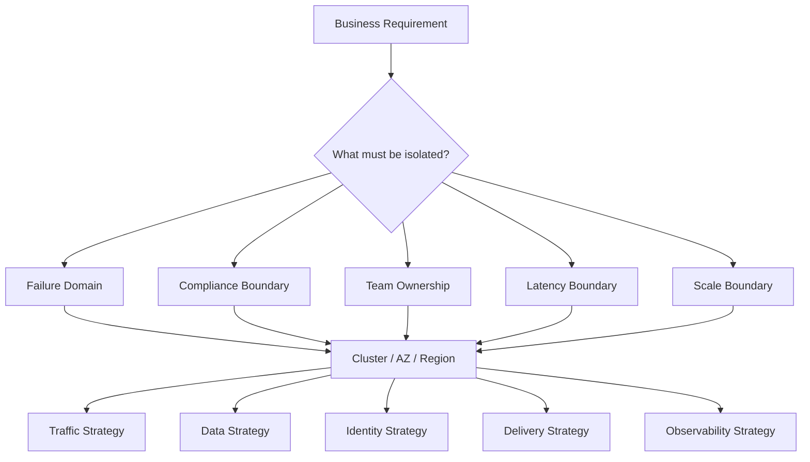

The most important principle:

> Do not introduce another cluster unless you can describe the failure or ownership boundary it improves.

---

## 3. Vocabulary That Must Be Precise

### 3.1 Multi-AZ

A single cluster spreads nodes across multiple availability zones inside one region.

Typical goal:

- tolerate node failure
- tolerate AZ impairment where possible
- improve workload availability

It does **not** protect you from a regional outage.

In EKS, the managed control plane itself is deployed across multiple Availability Zones. In AKS, a cluster is regional and node pools can use availability zones in supported regions.

### 3.2 Multi-Cluster

Multiple Kubernetes clusters exist. They may be in the same region, different regions, different accounts/subscriptions, or different clouds.

Typical goals:

- stronger isolation
- independent upgrades
- tenant separation
- separate blast radius
- platform migration
- regional DR
- environment separation

### 3.3 Multi-Region

The application runs or can recover across multiple cloud regions.

Typical goals:

- regional disaster recovery
- user latency optimization
- regulatory locality
- business continuity

A multi-region system almost always implies multi-cluster for EKS/AKS because managed Kubernetes clusters are regional resources.

### 3.4 Multi-Cloud

The application can run across cloud providers, for example AWS EKS and Azure AKS.

Typical goals:

- strategic portability
- acquisition/integration
- regulatory or customer requirement
- cloud exit leverage
- workload placement flexibility

Multi-cloud is almost never free. The tax is paid in networking, identity, data, observability, security policy, and operations.

### 3.5 Hybrid

The application spans cloud and non-cloud environments, such as on-premises Kubernetes, edge clusters, Azure Local, Outposts, or other private infrastructure.

Typical goals:

- latency near physical systems
- data locality
- disconnected/limited connectivity
- regulated infrastructure
- migration bridge

Hybrid is not “multi-cloud but with a data center.” Hybrid introduces connectivity unreliability, hardware lifecycle, partial autonomy, and local operations concerns.

---

## 4. The Decision Matrix

| Requirement | Single Cluster Multi-AZ | Multi-Cluster Same Region | Multi-Region | Multi-Cloud | Hybrid |
|---|---:|---:|---:|---:|---:|
| Node failure tolerance | Strong | Strong | Strong | Strong | Depends |
| AZ failure tolerance | Good if designed | Good if designed | Good | Good | Depends |
| Region failure tolerance | No | No | Yes | Yes if spread | Depends |
| Tenant isolation | Medium | Strong | Strong | Strong | Strong |
| Operational simplicity | Best | Medium | Hard | Very hard | Very hard |
| Cost efficiency | Best | Medium | Expensive | Expensive | Variable |
| Upgrade isolation | Limited | Strong | Strong | Strong | Strong |
| Compliance boundary | Limited | Good | Strong | Strong | Strong |
| Data consistency complexity | Low | Medium | High | Very high | Very high |
| Incident complexity | Low | Medium | High | Very high | Very high |

The default should be:

1. Start with **one production cluster per region**, multi-AZ.
2. Add **more clusters** when isolation or scale demands it.
3. Add **more regions** when RTO/RPO/user-latency/regulatory requirements demand it.
4. Add **more clouds** only when the business requirement justifies the operational tax.
5. Add **hybrid** only when the workload genuinely requires locality, disconnected operation, or migration bridge.

---

## 5. Common Topologies

### 5.1 Single Region, Multi-AZ, One Cluster

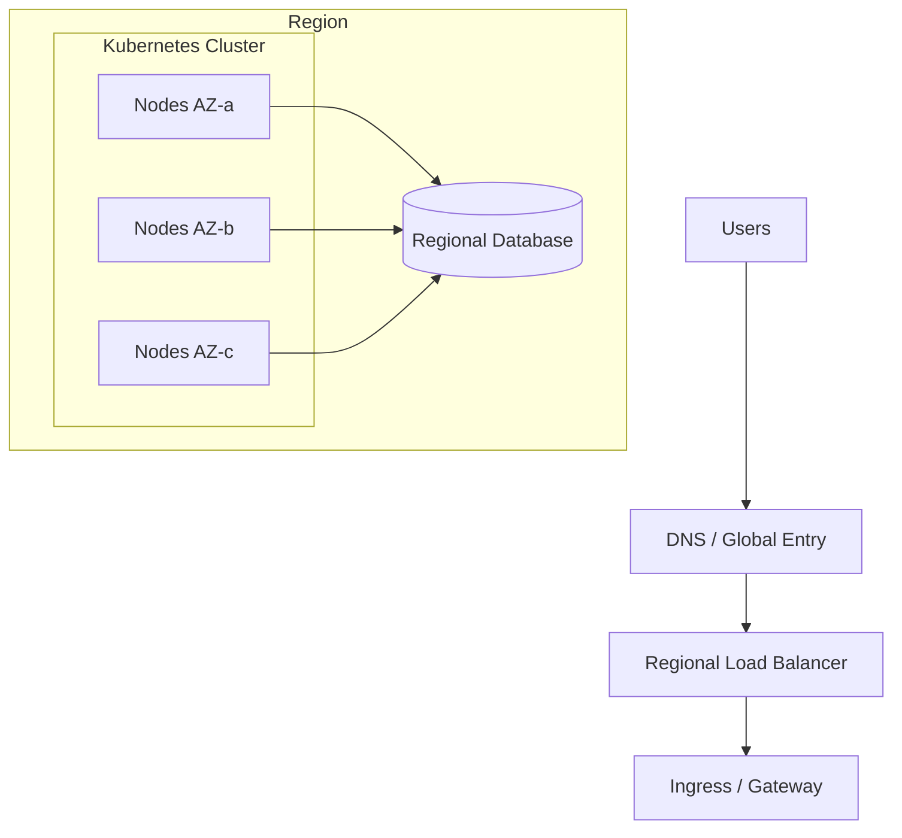

Use when:

- regional outage tolerance is not required
- RTO can accept restore/rebuild
- application is early-stage or internal
- state is strongly regional
- operational team is small

Risks:

- regional outage takes down the application
- cluster-wide misconfiguration can affect all workloads
- upgrades and policy mistakes have broad impact

This is still the best baseline for many production systems when paired with strong backup/restore and infrastructure-as-code.

---

### 5.2 Same Region, Multiple Clusters

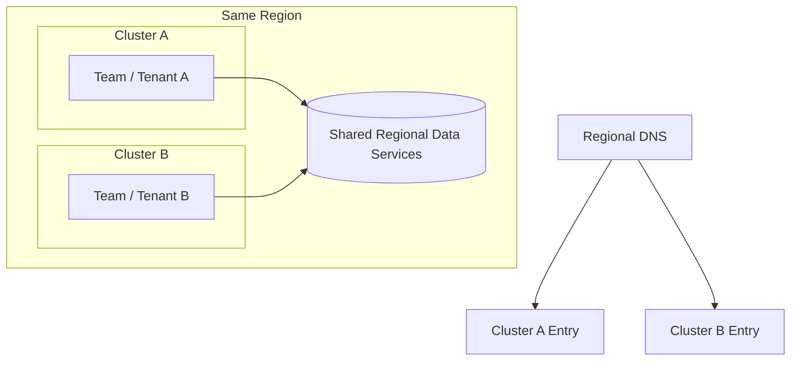

Use when:

- tenants require stronger isolation
- platform needs independent upgrade windows
- one cluster is reaching API/control-plane or operational scale limits
- different workload classes require different node/network/security posture
- you need separate blast radius but not regional DR

Examples:

- PCI workload cluster vs general application cluster
- internet-facing cluster vs internal processing cluster
- high-compliance tenant cluster vs standard tenant cluster
- platform/shared-services cluster vs app clusters

Risks:

- shared regional dependencies can still fail everyone
- policy drift between clusters
- duplicate add-ons and cost
- cross-cluster service calls become ambiguous

Key rule:

> Same-region multi-cluster improves cluster isolation, not regional resilience.

---

### 5.3 Active-Passive Multi-Region

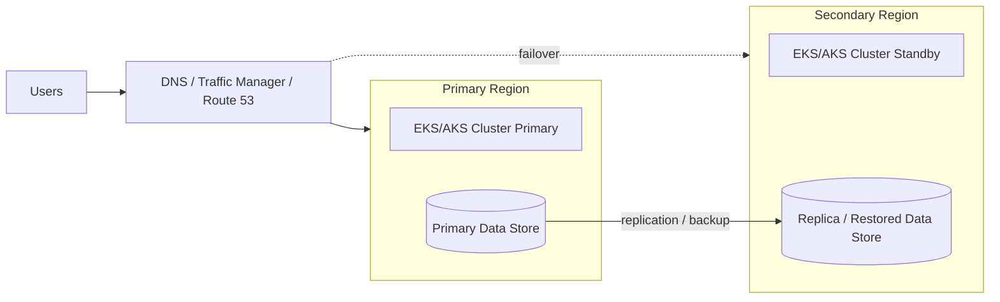

Use when:

- regional outage protection is required
- active-active data consistency is too complex
- RTO/RPO can tolerate failover steps
- cost must be lower than full active-active

Variants:

| Pattern | Secondary State | Cost | RTO | RPO | Notes |
|---|---|---:|---:|---:|---|
| Backup/Restore | no live app | lowest | high | backup interval | simplest, slowest |
| Pilot Light | minimal infra | low | medium-high | depends | core services ready |
| Warm Standby | scaled-down app | medium | medium-low | depends | common DR pattern |
| Hot Standby | near full stack | high | low | low | close to active-active |

Failure mode:

- failover works technically but business cannot operate because dependencies were not included in the DR scope.

DR scope must include:

- Kubernetes manifests
- cloud infrastructure
- DNS/traffic control
- certificates
- secrets
- databases
- object storage
- message brokers
- IAM/managed identity
- container registries
- CI/CD or GitOps access
- observability
- runbooks
- human permissions

---

### 5.4 Active-Active Multi-Region

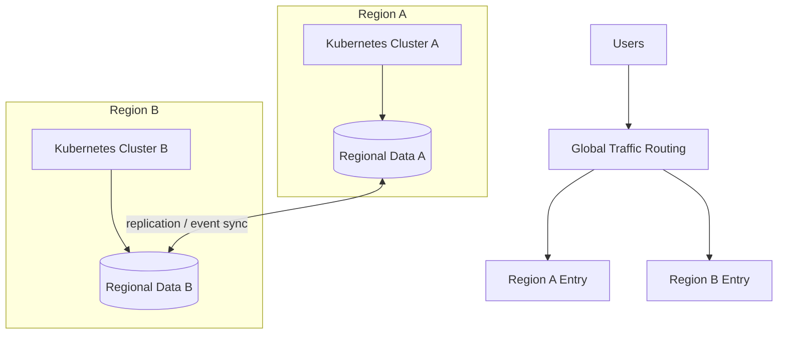

Use when:

- very low RTO is required
- latency must be close to users
- regional capacity sharing is needed
- application is designed for regional autonomy

Hard constraints:

- data model must tolerate concurrency and conflict
- idempotency must be strong
- user/session locality must be defined
- global ordering assumptions must be removed
- cross-region dependency calls must be minimized

Most failed active-active designs are not Kubernetes failures. They are data consistency failures.

Bad active-active:

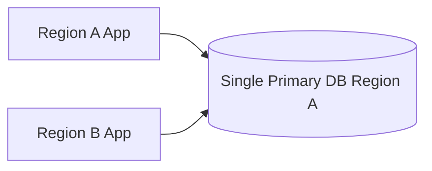

This is not true active-active. It is active-active compute with single-region state.

It may improve read latency for static assets, but it does not solve regional failure if all writes depend on one region.

---

### 5.5 Cell-Based Architecture

A cell is an isolated slice of the platform that contains enough infrastructure to serve a subset of traffic independently.

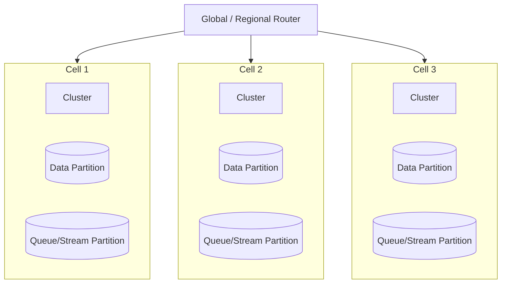

Use when:

- blast radius must be capped
- workload scale is huge
- tenants/customers can be partitioned
- failure isolation matters more than global pooling efficiency

Cell design requires:

- tenant/customer routing key
- placement registry
- cell-local data
- cell-local observability
- cell-local operational controls
- migration/rebalancing process

Kubernetes fits cell architecture well because clusters can become cell boundaries. But the platform must own customer-to-cell routing and data placement.

---

### 5.6 Multi-Cloud EKS + AKS

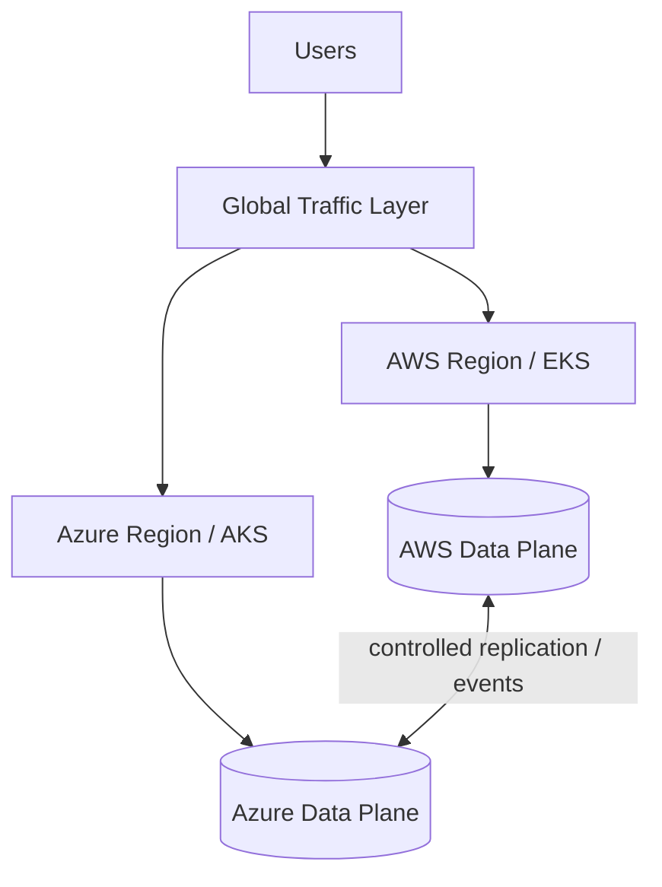

Use when:

- business explicitly requires AWS and Azure
- acquisition or enterprise customer environment forces dual-cloud
- regulatory or sovereignty constraints require provider options
- platform strategy values portability enough to pay the tax

Do not choose multi-cloud merely because Kubernetes is portable.

Kubernetes abstracts workload scheduling. It does not abstract:

- IAM vs Entra ID
- Route 53 vs Azure DNS
- ALB/NLB vs Azure Load Balancer/Application Gateway
- EBS/EFS vs Azure Disk/Azure Files
- CloudWatch vs Azure Monitor
- ECR vs ACR
- KMS vs Key Vault
- VPC vs VNet
- PrivateLink vs Private Endpoint
- AWS quotas vs Azure quotas

The multi-cloud invariant:

> Standardize application contracts, not cloud implementation details.

A healthy multi-cloud design standardizes:

- workload manifest conventions
- container contract
- health/lifecycle endpoints
- telemetry semantic conventions
- GitOps promotion model
- policy intent
- SLO/error budget definitions
- incident runbooks

It allows provider-specific implementations for:

- identity
- networking
- load balancing
- storage
- secret backends
- observability sinks
- node provisioning

---

### 5.7 Hybrid and Edge

Hybrid/edge clusters are often constrained by:

- intermittent connectivity
- local hardware lifecycle
- local IP constraints
- local operators
- air-gapped or semi-connected updates
- physical security concerns
- local data sovereignty
- latency to machines/devices

Do not design hybrid as if the central cloud control plane is always reachable.

Hybrid principle:

> The local cluster must have a defined autonomy level.

Autonomy levels:

| Level | Meaning | Example |
|---|---|---|
| 0 | Cloud-dependent | cluster cannot operate without central connectivity |
| 1 | Runtime autonomous | running workloads continue, changes blocked |
| 2 | Operationally autonomous | local ops can deploy emergency config |
| 3 | Fully autonomous | local system can operate, recover, and later reconcile |

Hybrid GitOps must handle delayed reconciliation, version pinning, and local overrides.

---

## 6. Traffic Strategy Across Clusters

Traffic strategy is usually the most visible part of multi-cluster design, but it is only one part.

### 6.1 DNS-Based Routing

DNS can route users to different regional entries using:

- latency-based routing
- weighted routing
- failover routing
- geo-routing
- manual cutover

AWS examples:

- Route 53 latency/weighted/failover records
- Route 53 Application Recovery Controller for controlled failover

Azure examples:

- Azure Traffic Manager
- Azure Front Door
- DNS with health probes and routing rules

DNS works well for:

- coarse regional routing
- failover
- blue/green region cutover
- weighted migration

Weaknesses:

- DNS caching and TTL behavior
- client resolver behavior
- not ideal for request-level routing
- health checks may not understand application semantics

Design rule:

> DNS failover should be tested as a production control, not assumed as a configuration feature.

---

### 6.2 Global Edge Proxy

A global edge proxy can provide:

- WAF
- TLS termination
- global routing
- request-level routing
- origin health checking
- caching
- bot protection
- DDoS protection

Examples:

- AWS CloudFront + Route 53 + ALB/NLB origins
- Azure Front Door + Application Gateway/AKS origins
- third-party global edge providers

Use when:

- you need application-aware routing
- edge security matters
- TLS/certificate control must be centralized
- users are globally distributed
- failover must be faster than DNS-only behavior

Risk:

- the edge becomes a central dependency
- origin health checks become too shallow
- routing rules drift from cluster intent

---

### 6.3 Gateway API per Cluster

Gateway API is cluster-local unless paired with higher-level multi-cluster orchestration.

Good model:

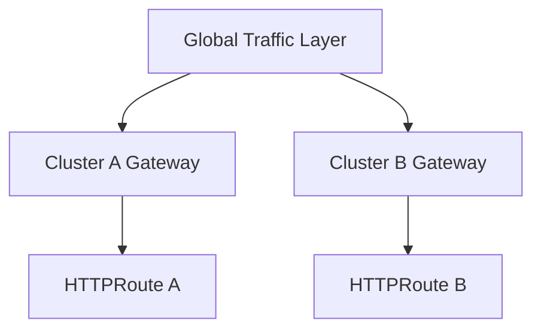

Gateway API gives a strong role model inside each cluster:

- infrastructure/platform team owns `GatewayClass` and `Gateway`
- application team owns `HTTPRoute`
- policy team owns admission/guardrails

In multi-cluster, keep the same route contract across clusters but allow provider-specific GatewayClasses.

Example abstraction:

```yaml
apiVersion: gateway.networking.k8s.io/v1
kind: HTTPRoute
metadata:
  name: orders-route
  namespace: orders
spec:
  parentRefs:
    - name: public-gateway
      namespace: platform-ingress
  hostnames:
    - orders.example.com
  rules:
    - matches:
        - path:
            type: PathPrefix
            value: /
      backendRefs:
        - name: orders-api
          port: 8080
```

The `HTTPRoute` can be consistent, while AWS and Azure use different underlying controllers.

---

### 6.4 Service Mesh Across Clusters

A service mesh can provide:

- mTLS
- service identity
- traffic splitting
- retries/timeouts
- observability
- cross-cluster service discovery
- policy

But cross-cluster service mesh is not a free lunch.

Risks:

- complex trust domain management
- hard-to-debug cross-region latency
- hidden coupling between clusters
- control-plane blast radius
- certificate rotation failure
- data-plane sidecar/resource overhead

Use cross-cluster mesh when:

- service-to-service calls truly cross clusters
- mTLS identity is mandatory
- traffic policy needs to be enforced consistently
- the team can operate mesh failure modes

Avoid it when:

- async/event replication would be simpler
- services can be region-local
- you only need north-south routing
- the platform team cannot debug the mesh under incident pressure

---

## 7. Data Strategy: The Real Constraint

Kubernetes can duplicate compute. Data duplication is the hard part.

### 7.1 Stateless Workload, Regional Data

Simplest pattern:

- deploy app in each region
- each app talks to regional data
- users are routed to home region

Good for:

- tenant-sharded systems
- regional compliance
- low latency
- bounded blast radius

Need:

- user-to-region mapping
- cross-region migration process
- regional backup
- eventual analytics aggregation

### 7.2 Stateless Workload, Single Primary Data

Common but dangerous:

- app runs in many regions
- writes go to one primary region

Good for:

- read-heavy workloads
- regional cache/edge compute
- migration stage

Bad for:

- regional DR if primary data region fails
- low-latency writes
- true active-active

### 7.3 Active-Passive Data

Primary region handles writes. Secondary receives replication or backups.

Need:

- RPO measured from replication/backup delay
- promotion procedure
- application write freeze or cutover
- DNS/traffic cutover
- rollback/reconciliation plan

Failure mode:

- secondary data is available, but application secrets/certs/IAM are missing.

### 7.4 Active-Active Data

Writes occur in more than one region.

Need:

- conflict resolution
- idempotency
- causal ordering strategy
- distributed transaction avoidance
- reconciliation jobs
- tenant partitioning or CRDT-like semantics where applicable

Most enterprise systems should avoid generic active-active writes unless the domain model supports it.

Safer pattern:

> Active-active for reads and regional ownership for writes.

---

## 8. Multi-Cluster GitOps

GitOps is the most practical way to keep many clusters understandable.

Bad pattern:

```text
one giant repo
└── random overlays
    ├── prod-a
    ├── prod-b
    ├── prod-old
    ├── prod-hotfix
    └── prod-do-not-touch
```

Better pattern:

```text
platform-gitops/
├── clusters/
│   ├── aws-us-east-1-prod-a/
│   │   ├── cluster-addons/
│   │   ├── platform-policies/
│   │   ├── ingress/
│   │   └── apps/
│   ├── aws-us-west-2-prod-b/
│   └── azure-eastus-prod-a/
├── environments/
│   ├── dev/
│   ├── staging/
│   └── prod/
├── apps/
│   ├── orders/
│   ├── billing/
│   └── identity/
└── policy-library/
```

Alternative split:

```text
platform-live/
├── aws/
│   └── eks/
├── azure/
│   └── aks/
└── shared/

application-live/
├── orders/
│   ├── dev/
│   ├── staging/
│   └── prod/
└── billing/
```

### 8.1 Cluster Registry

A mature platform needs a cluster registry.

Minimum fields:

```yaml
clusterId: aws-use1-prod-platform-01
provider: aws
service: eks
region: us-east-1
environment: prod
ownerTeam: platform-runtime
purpose: shared-apps
criticality: tier-1
networkMode: vpc-cni-prefix-delegation
identityMode: eks-pod-identity
entrypoint: public-gateway
observabilityProfile: eks-standard
policyProfile: restricted-prod
backupProfile: velero-prod
upgradeChannel: manual-prod
```

For AKS:

```yaml
clusterId: azure-eastus-prod-platform-01
provider: azure
service: aks
region: eastus
environment: prod
ownerTeam: platform-runtime
purpose: shared-apps
criticality: tier-1
networkMode: azure-cni-overlay
identityMode: workload-identity
entrypoint: application-gateway-for-containers
observabilityProfile: aks-standard
policyProfile: restricted-prod
backupProfile: azure-backup-aks-prod
upgradeChannel: manual-prod
```

The registry becomes the source for:

- ownership
- SLO classification
- policy profile
- cost attribution
- upgrade planning
- incident routing
- DR scope
- GitOps target selection

---

## 9. Identity Across Clusters

Do not try to make all clusters share the same runtime identity implementation.

Instead, standardize the **application identity contract**.

Example contract:

```yaml
workloadIdentity:
  app: orders-api
  requiredPermissions:
    - read-secret: orders/db-credentials
    - publish-event: order-created
    - read-object: invoices-template-bucket
  environment: prod
```

Provider mapping:

| Intent | EKS | AKS |
|---|---|---|
| Workload identity | EKS Pod Identity / IRSA | AKS Workload Identity |
| Secret backend | AWS Secrets Manager / SSM | Azure Key Vault |
| KMS | AWS KMS | Azure Key Vault / Managed HSM |
| Registry | ECR | ACR |
| Human access | EKS access entries + IAM | Entra ID + Kubernetes/Azure RBAC |
| Audit | CloudTrail + Kubernetes audit | Azure Activity Logs + Kubernetes audit/diagnostics |

Invariant:

> A workload should know what capability it needs, not which cloud credential mechanism grants it.

---

## 10. Policy Across Clusters

Policy must be consistent in intent, but provider-aware in implementation.

Policy layers:

1. Cluster admission policy
2. Namespace policy
3. Runtime security policy
4. Network policy
5. Cloud IAM policy
6. Registry policy
7. Infrastructure policy
8. GitOps/repository policy

Example policy intent:

```yaml
policyIntent:
  name: restricted-prod-workload
  requirements:
    - must-run-as-non-root
    - must-not-use-host-network
    - must-pin-image-by-digest
    - must-declare-resource-requests
    - must-have-readiness-probe
    - must-use-approved-registry
    - must-use-workload-identity
    - must-not-mount-service-account-token-unless-needed
```

Implementation options:

- Kubernetes Pod Security Admission
- ValidatingAdmissionPolicy
- Kyverno
- OPA Gatekeeper
- Azure Policy for AKS
- AWS Config/CloudFormation Guard/Terraform policy for infra
- CI policy checks
- registry admission checks

Multi-cluster trap:

> Policies that are copied manually will drift.

Use GitOps and policy versioning.

Example policy release flow:

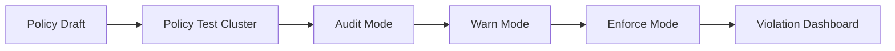

---

## 11. Observability Across Clusters

Multi-cluster observability has two goals:

1. Local debugging must work when a cluster/region is isolated.
2. Global correlation must work across clusters.

Do not make every incident depend on a central observability system that may be unavailable during regional failure.

### 11.1 Local Signals

Each cluster should expose local:

- workload metrics
- node metrics
- kube-state metrics
- Kubernetes events
- ingress/gateway metrics
- DNS metrics
- autoscaler metrics
- policy violation metrics
- audit logs
- control-plane logs where available

### 11.2 Global Signals

Global dashboards should aggregate:

- per-cluster SLO burn
- regional request volume
- error rate by cluster
- latency by region
- rollout version matrix
- capacity headroom
- pending pods
- cluster health
- policy violations
- cost per cluster/namespace/team

### 11.3 Required Labels

Every telemetry event should carry:

```yaml
cluster: aws-use1-prod-platform-01
provider: aws
region: us-east-1
environment: prod
namespace: orders
service: orders-api
version: 2026.07.03-1421
team: order-platform
criticality: tier-1
cell: cell-a
```

Without consistent metadata, multi-cluster observability becomes a pile of dashboards.

---

## 12. Upgrade Strategy Across Clusters

Multiple clusters create upgrade flexibility. They also create version sprawl.

Do not let every cluster drift indefinitely.

### 12.1 Version Rings


Each ring validates:

- Kubernetes API compatibility
- CRD compatibility
- admission webhooks
- ingress/gateway controllers
- CNI behavior
- CSI behavior
- autoscaler behavior
- policy engine behavior
- GitOps sync behavior
- workload rollout behavior

### 12.2 Upgrade Registry

Track per cluster:

```yaml
clusterId: aws-use1-prod-platform-01
kubernetesVersion: "1.33"
providerVersionPolicy: eks-standard-support
addons:
  vpc-cni: "..."
  coredns: "..."
  kube-proxy: "..."
  aws-ebs-csi-driver: "..."
controllers:
  argocd: "..."
  external-dns: "..."
  cert-manager: "..."
  karpenter: "..."
nextUpgradeWindow: 2026-08-15
riskStatus: api-deprecation-scan-clean
```

---

## 13. Incident Response Across Clusters

Multi-cluster incidents fail in one of four patterns:

1. **Local cluster failure** — one cluster is unhealthy.
2. **Regional failure** — all clusters/services in a region are affected.
3. **Global control failure** — GitOps, DNS, identity, registry, or policy breaks many clusters.
4. **Application-level global failure** — bad release/config affects every cluster.

Incident response must distinguish these quickly.

### 13.1 First Triage Questions

1. Is traffic failing globally or regionally?
2. Is failure tied to a cluster, node pool, namespace, service, or version?
3. Did GitOps sync recently?
4. Did DNS/global traffic routing change?
5. Did certificate/secret/identity rotate?
6. Did a cloud provider control plane or regional service degrade?
7. Are other clusters with the same version healthy?
8. Can we safely isolate one region/cluster?

### 13.2 Kill Switches

A mature platform has tested controls:

- stop GitOps sync for one app
- stop GitOps sync for one cluster
- remove cluster from global traffic
- lower traffic weight
- disable canary
- rollback route
- freeze deployment pipeline
- scale down bad workload
- block bad image digest
- revoke bad workload identity
- disable policy enforce mode temporarily

Kill switches must be documented and rehearsed.

---

## 14. Anti-Patterns

### 14.1 “Kubernetes Gives Us Multi-Cloud”

Kubernetes gives a common workload API. It does not remove provider-specific infrastructure.

### 14.2 Active-Active Compute, Single-Region State

This is not active-active resilience. It is distributed stateless capacity with centralized state.

### 14.3 One Global Cluster Management Plane for Everything

If one tool misconfiguration can break every cluster, you moved the single point of failure from workload cluster to management layer.

### 14.4 Cross-Region Synchronous Calls

Cross-region synchronous dependency chains create latency, fragility, and cascading failure.

Prefer:

- regional autonomy
- async replication
- event-driven reconciliation
- local fallback

### 14.5 Shared Admin Credentials Across Clusters

Shared break-glass credentials are easy to operate and hard to defend.

Use:

- per-cluster access
- audited break-glass
- short-lived credentials
- strong MFA/approval
- incident-specific elevation

### 14.6 Inconsistent Cluster Add-Ons

Multi-cluster platforms fail when every cluster has a slightly different ingress, CNI, CSI, policy, or observability setup without documentation.

Use cluster profiles.

---

## 15. Implementation Blueprint: AWS + Azure Multi-Region Platform

### 15.1 Target Shape

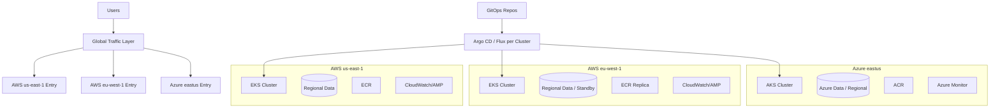

### 15.2 Cluster Profiles

| Profile | Provider | Purpose | Networking | Identity | Ingress | Autoscaling |
|---|---|---|---|---|---|---|
| `eks-prod-standard` | AWS | general prod apps | VPC CNI prefix delegation | EKS Pod Identity | ALB/Gateway | Karpenter/EKS Auto Mode |
| `eks-prod-isolated` | AWS | regulated workloads | private subnets, SG for pods | EKS Pod Identity | internal ALB/NLB | managed node groups/Karpenter |
| `aks-prod-standard` | Azure | general prod apps | Azure CNI Overlay | Workload Identity | App Gateway for Containers | AKS Automatic/NAP |
| `aks-prod-isolated` | Azure | regulated workloads | private cluster, UDR/firewall | Workload Identity | private ingress | dedicated node pools |

### 15.3 Standard Workload Contract

Every production app declares:

```yaml
application:
  name: orders-api
  owner: order-platform
  criticality: tier-1
  regions:
    - aws:us-east-1
    - aws:eu-west-1
  traffic:
    exposure: public
    routing: weighted-global
    failover: manual-confirmed
  runtime:
    minReplicasPerRegion: 3
    maxReplicasPerRegion: 100
    podDisruptionBudget: required
    topologySpread: zone
  identity:
    cloudPermissionsProfile: orders-api-prod
  data:
    mode: regional-primary-with-standby
    rpo: 5m
    rto: 30m
  observability:
    slo: 99.9
    telemetryProfile: standard-http-service
```

This contract can be compiled into provider-specific resources.

---

## 16. Review Checklist

Before approving multi-cluster/multi-region design:

- [ ] The reason for each cluster is documented.
- [ ] The failure domain improvement is explicit.
- [ ] The data consistency model is explicit.
- [ ] RTO and RPO are measurable.
- [ ] Traffic failover is rehearsed.
- [ ] DNS/global routing behavior is tested.
- [ ] Secrets/certificates exist in recovery regions.
- [ ] Registry/image availability is regionalized or replicated.
- [ ] GitOps can operate during partial regional failure.
- [ ] Observability works locally and globally.
- [ ] Human access works during incident response.
- [ ] Break-glass access is audited.
- [ ] Policy is versioned and rolled out by ring.
- [ ] Upgrade rings are defined.
- [ ] Cluster profiles are documented.
- [ ] Cost model is approved.
- [ ] DR drills are scheduled.

---

## 17. Deliberate Practice

### Exercise 1 — Topology Selection

Given three services:

1. public checkout API, tier-1, 99.95% SLO, RTO 15 minutes, RPO 1 minute
2. internal reporting API, tier-3, RTO 24 hours, RPO 12 hours
3. regional compliance workflow API, EU-only data residency

Design cluster and region placement.

Deliverable:

- topology diagram
- data strategy
- traffic strategy
- identity strategy
- DR procedure

### Exercise 2 — Fake Active-Active Detection

Review a proposed design where two regions run the app, but all writes go to a single primary database.

Find:

- what resilience it actually provides
- what outage it does not survive
- how to improve it without overengineering

### Exercise 3 — Cluster Registry

Create a cluster registry for:

- one EKS prod cluster
- one AKS prod cluster
- one EKS DR standby cluster
- one sandbox cluster

Include:

- owner
- version
- network mode
- identity mode
- ingress mode
- policy profile
- observability profile
- backup profile
- upgrade ring

### Exercise 4 — Global Incident Drill

Simulate a bad image pushed to all clusters by GitOps.

Write runbook steps to:

- freeze sync
- identify affected clusters
- remove traffic from bad clusters
- rollback
- block image digest
- verify recovery
- produce postmortem evidence

---

## 18. Production Heuristics

1. Prefer regional autonomy over cross-region synchronous calls.
2. Prefer cluster profiles over handcrafted clusters.
3. Prefer GitOps reconciliation per cluster over one central imperative deployer.
4. Prefer traffic cutover controls that humans have rehearsed.
5. Prefer explicit data ownership over magical replication.
6. Prefer provider-specific infrastructure behind common application contracts.
7. Prefer local observability plus global aggregation.
8. Prefer version rings over simultaneous fleet upgrades.
9. Prefer tested DR over documented DR.
10. Prefer fewer clusters until the isolation benefit is undeniable.

---

## 19. References

- Kubernetes Documentation — Gateway API: https://kubernetes.io/docs/concepts/services-networking/gateway/
- Kubernetes Documentation — Services, Load Balancing, and Networking: https://kubernetes.io/docs/concepts/services-networking/
- Kubernetes Blog — Gateway API v1.5: https://kubernetes.io/blog/2026/04/21/gateway-api-v1-5/
- Kubernetes Blog — Cluster API v1.12: https://kubernetes.io/blog/2026/01/27/cluster-api-v1-12-release/
- AWS EKS Architecture: https://docs.aws.amazon.com/eks/latest/userguide/eks-architecture.html
- AWS EKS Best Practices Guide: https://docs.aws.amazon.com/eks/latest/best-practices/introduction.html
- AWS EKS Disaster Recovery and Resiliency: https://docs.aws.amazon.com/eks/latest/userguide/disaster-recovery-resiliency.html
- AWS Route 53 Application Recovery Controller: https://docs.aws.amazon.com/r53recovery/latest/dg/multi-region.html
- Azure AKS Multi-Region Deployment Models: https://learn.microsoft.com/en-us/azure/aks/reliability-multi-region-deployment-models
- Azure AKS Multi-Cluster Baseline Architecture: https://learn.microsoft.com/en-us/azure/architecture/reference-architectures/containers/aks-multi-region/aks-multi-cluster
- Azure AKS FAQ: https://learn.microsoft.com/en-us/azure/aks/faq
- Azure AKS Planning: https://learn.microsoft.com/en-us/azure/architecture/reference-architectures/containers/aks-start-here
