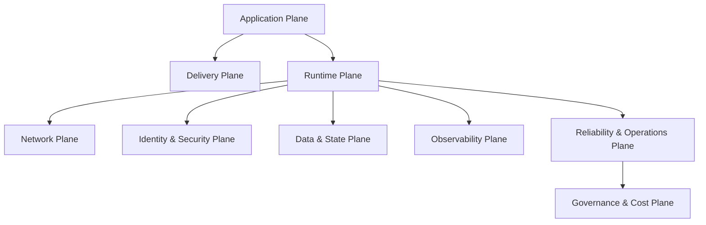
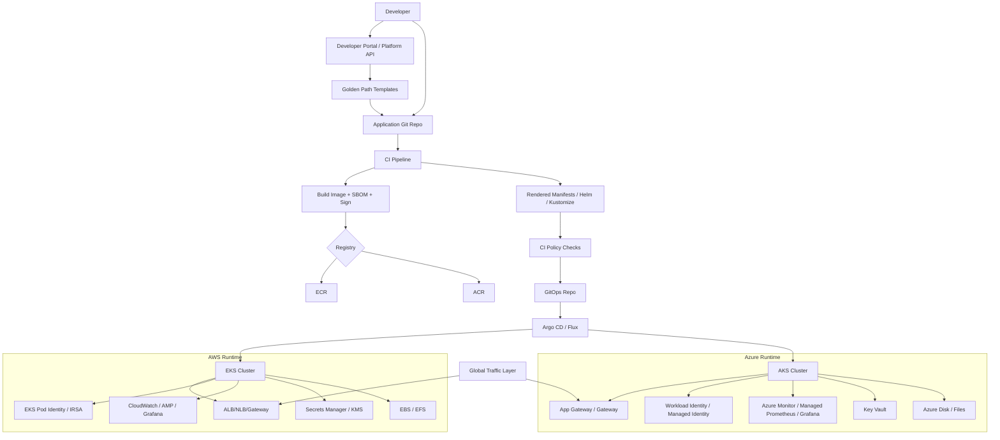
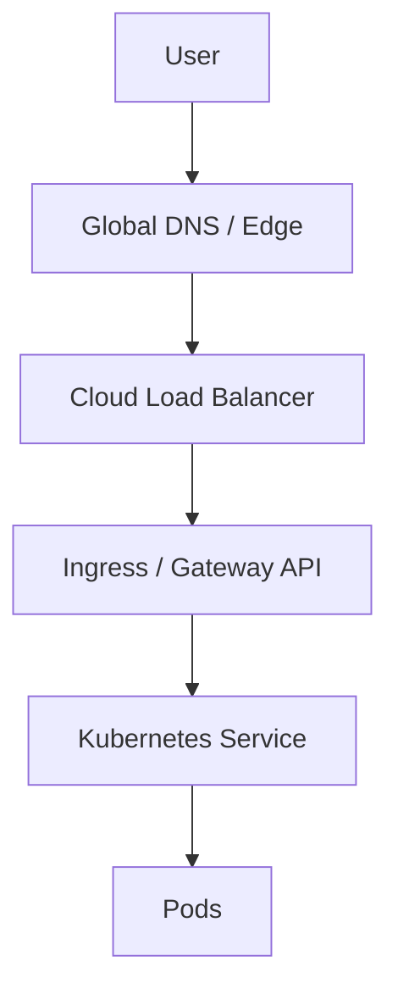
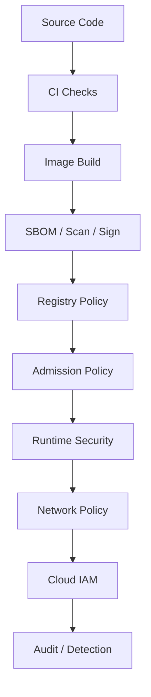
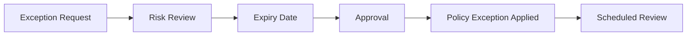
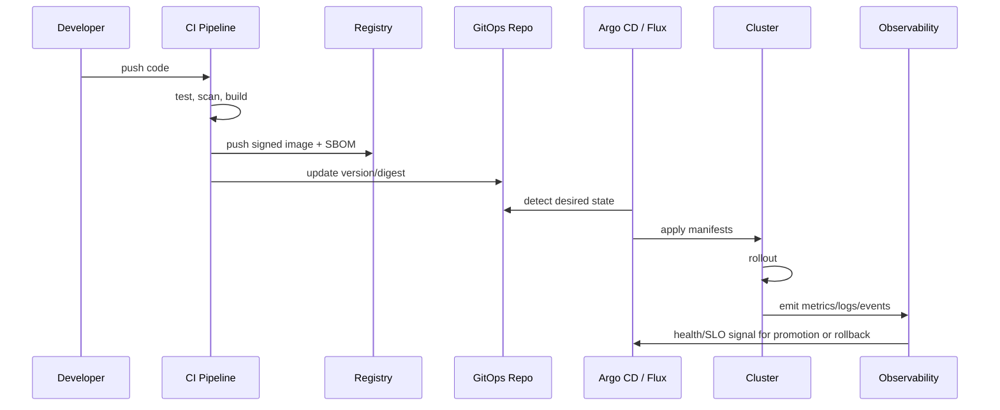

# Part 040 — Final Production Platform Blueprint

> A production Kubernetes platform is not a cluster. It is a controlled operating environment where application teams can ship safely, platform teams can govern predictably, and the business can recover when the system fails.

This final part consolidates the whole series into one production blueprint.

The goal is not to create a universal template. There is no universal Kubernetes platform. A bank, streaming company, SaaS product, public-sector platform, and internal enterprise system have different constraints.

The goal is to create a **decision framework and reference architecture** that lets you build the right platform intentionally.

---

## 1. Final Mental Model

A Kubernetes platform has eight planes:



Each plane has a clear ownership boundary.

| Plane | Primary Question | Owner |
|---|---|---|
| Application | What is being deployed? | App teams |
| Delivery | How does desired state reach clusters? | Platform + App teams |
| Runtime | Where and how does workload run? | Platform runtime team |
| Network | How does traffic enter, leave, and move? | Platform/network team |
| Identity/Security | Who can do what? | Security + platform |
| Data/State | What state exists and how is it recovered? | App + data platform |
| Observability | How do we know what is happening? | SRE + platform + app teams |
| Reliability/Ops | How do we survive failure/change? | SRE + platform |
| Governance/Cost | How do we control risk and spend? | Platform + FinOps + security |

The platform is good when these planes are explicit. The platform is fragile when these planes are implicit.

---

## 2. Reference Architecture: Dual-Cloud Production Platform

This blueprint supports both AWS EKS and Azure AKS without pretending they are identical.



The common abstraction is not “same YAML everywhere”. The common abstraction is:

- same workload contract
- same release lifecycle
- same security intent
- same observability semantics
- same reliability expectations
- provider-specific implementation behind the scenes

---

## 3. Platform Principles

### Principle 1 — Kubernetes Is a Reconciliation Platform

Do not operate Kubernetes as a command runner. Operate it as a desired-state system.

Implications:

- production changes should be declarative
- drift should be visible
- controllers must be understood as actors
- status conditions matter
- failed reconciliation is a first-class incident signal

### Principle 2 — Cloud-Managed Does Not Mean Ops-Free

EKS and AKS remove much of the control-plane burden. They do not remove:

- networking design
- IAM/RBAC design
- workload resource sizing
- release safety
- backup/DR
- observability
- policy management
- cost control
- incident response
- upgrade planning

### Principle 3 — Standardize Intent, Not Provider Internals

Do not force AWS and Azure to look identical.

Standardize:

- app contract
- SLO model
- telemetry labels
- runtime security baseline
- release workflow
- policy lifecycle
- incident process

Allow divergence in:

- load balancer implementation
- identity provider implementation
- secret backend
- node provisioning
- observability sink
- storage class implementation

### Principle 4 — Make Failure Domains Visible

Every workload should declare:

- criticality
- owner
- region strategy
- replica strategy
- dependency list
- data recovery model
- PDB/topology requirement
- SLO
- escalation path

### Principle 5 — Platform Is a Product

A platform that only works when experts operate it manually is not mature.

A mature platform exposes safe self-service:

- namespace creation
- workload onboarding
- secret binding
- DNS/route request
- certificate request
- scaling profile
- observability dashboard
- cost attribution
- policy exception request
- production readiness review

---

## 4. Cluster Architecture Blueprint

### 4.1 Baseline Cluster Types

| Cluster Type | Purpose | Characteristics |
|---|---|---|
| Sandbox | experimentation | relaxed policy, low cost, no production data |
| Dev | integration | shared dev services, moderate policy |
| Staging | prod-like validation | strong policy, prod-like ingress/identity |
| Prod Standard | general production | high availability, policy enforcement, full observability |
| Prod Isolated | regulated/high-risk workloads | dedicated cluster/account/subscription, stricter access |
| DR Standby | recovery | warm/pilot-light/hot depending on RTO/RPO |
| Platform Management | optional control tooling | GitOps, fleet visibility, policy catalog, no app runtime if avoidable |

### 4.2 EKS Baseline

Recommended EKS production defaults:

- private worker nodes
- public subnets only for internet-facing load balancers
- private API endpoint where operationally feasible
- EKS access entries instead of legacy `aws-auth`-centric access model
- EKS Pod Identity for new workloads where supported, IRSA where needed
- VPC CNI with prefix delegation when pod density/IP strategy benefits
- managed add-ons for core components where appropriate
- EBS CSI and/or EFS CSI installed intentionally
- Karpenter or EKS Auto Mode for modern provisioning where compatible
- CloudWatch/ADOT/Prometheus/Grafana observability path
- Route 53 / ALB / NLB / Gateway design documented
- AWS Secrets Manager/KMS boundary defined

### 4.3 AKS Baseline

Recommended AKS production defaults:

- private cluster where required by risk profile
- separate system and user node pools
- Azure CNI Overlay for most general-purpose scenarios unless flat pod routability is required
- Workload Identity for pod-to-Azure access
- managed identity for cluster/cloud integrations
- Azure Monitor + Managed Prometheus + Managed Grafana when appropriate
- Azure Key Vault integration for secrets/certificates
- Azure Policy or policy engine integration
- Application Gateway for Containers / Application Gateway / ingress choice documented
- zone-aware node pools in supported regions
- AKS Automatic or Node Auto-Provisioning where the workload/ops model fits

---

## 5. Workload Contract

Every production workload should have a contract.

```yaml
apiVersion: platform.example.com/v1
kind: WorkloadContract
metadata:
  name: orders-api
spec:
  ownership:
    team: order-platform
    serviceTier: tier-1
    escalation: pagerduty-order-platform
  runtime:
    workloadType: deployment
    minReplicas: 3
    maxReplicas: 50
    resourceProfile: medium-http
    gracefulShutdownSeconds: 45
    runtimeSecurityProfile: restricted
  traffic:
    exposure: public
    route: orders.example.com
    protocol: http
    tls: required
    gatewayProfile: public-standard
  identity:
    workloadIdentityProfile: orders-api-prod
    cloudPermissions:
      - secrets.read.orders-db
      - events.publish.order-created
  data:
    statefulness: stateless-app-regional-db
    rpo: 5m
    rto: 30m
  observability:
    sloAvailability: 99.9
    sloLatencyP95Ms: 300
    dashboardProfile: http-service
    logRetention: 30d
  delivery:
    strategy: progressive
    rollback: automatic-on-slo-burn
  cost:
    costCenter: commerce
    budgetClass: prod-tier-1
```

This does not need to be an actual CRD initially. It can begin as a YAML spec in a repo and mature into a platform API later.

The value is that every platform decision becomes inspectable.

---

## 6. Namespace Factory Blueprint

A namespace should not be a blank folder. It should be a provisioned boundary.

When a team requests a namespace, the platform creates:

- namespace labels
- resource quota
- limit range
- network policies
- RBAC bindings
- service accounts
- workload identity binding template
- policy profile
- default observability labels
- cost labels
- secret access boundary
- default deny egress/ingress where applicable
- GitOps application target

Example baseline:

```yaml
apiVersion: v1
kind: Namespace
metadata:
  name: orders-prod
  labels:
    environment: prod
    team: order-platform
    criticality: tier-1
    pod-security.kubernetes.io/enforce: restricted
    pod-security.kubernetes.io/audit: restricted
    pod-security.kubernetes.io/warn: restricted
```

Resource boundary:

```yaml
apiVersion: v1
kind: ResourceQuota
metadata:
  name: orders-prod-quota
  namespace: orders-prod
spec:
  hard:
    requests.cpu: "40"
    requests.memory: 160Gi
    limits.memory: 240Gi
    pods: "200"
```

Default deny network:

```yaml
apiVersion: networking.k8s.io/v1
kind: NetworkPolicy
metadata:
  name: default-deny
  namespace: orders-prod
spec:
  podSelector: {}
  policyTypes:
    - Ingress
    - Egress
```

A namespace factory is the beginning of an Internal Developer Platform.

---

## 7. Runtime Workload Baseline

A production Deployment should encode:

- resource requests
- readiness probe
- startup probe if slow boot
- liveness probe only when safe
- security context
- graceful shutdown
- topology spread
- PDB
- labels for observability/cost/ownership
- image digest or controlled tag policy
- service account

Example:

```yaml
apiVersion: apps/v1
kind: Deployment
metadata:
  name: orders-api
  namespace: orders-prod
  labels:
    app.kubernetes.io/name: orders-api
    app.kubernetes.io/part-of: commerce
    platform.example.com/team: order-platform
    platform.example.com/criticality: tier-1
spec:
  replicas: 3
  strategy:
    type: RollingUpdate
    rollingUpdate:
      maxSurge: 1
      maxUnavailable: 0
  selector:
    matchLabels:
      app.kubernetes.io/name: orders-api
  template:
    metadata:
      labels:
        app.kubernetes.io/name: orders-api
        platform.example.com/team: order-platform
        platform.example.com/criticality: tier-1
    spec:
      serviceAccountName: orders-api
      terminationGracePeriodSeconds: 60
      securityContext:
        seccompProfile:
          type: RuntimeDefault
      containers:
        - name: app
          image: example-registry/orders-api@sha256:replace-with-real-digest
          imagePullPolicy: IfNotPresent
          ports:
            - containerPort: 8080
          resources:
            requests:
              cpu: "500m"
              memory: "512Mi"
            limits:
              memory: "1Gi"
          securityContext:
            allowPrivilegeEscalation: false
            runAsNonRoot: true
            readOnlyRootFilesystem: true
            capabilities:
              drop:
                - ALL
          readinessProbe:
            httpGet:
              path: /ready
              port: 8080
            periodSeconds: 5
            timeoutSeconds: 2
            failureThreshold: 3
          livenessProbe:
            httpGet:
              path: /live
              port: 8080
            periodSeconds: 10
            timeoutSeconds: 2
            failureThreshold: 3
          lifecycle:
            preStop:
              httpGet:
                path: /shutdown/drain
                port: 8080
```

PDB:

```yaml
apiVersion: policy/v1
kind: PodDisruptionBudget
metadata:
  name: orders-api
  namespace: orders-prod
spec:
  minAvailable: 2
  selector:
    matchLabels:
      app.kubernetes.io/name: orders-api
```

Topology spread:

```yaml
apiVersion: apps/v1
kind: Deployment
metadata:
  name: orders-api
spec:
  template:
    spec:
      topologySpreadConstraints:
        - maxSkew: 1
          topologyKey: topology.kubernetes.io/zone
          whenUnsatisfiable: ScheduleAnyway
          labelSelector:
            matchLabels:
              app.kubernetes.io/name: orders-api
```

---

## 8. Networking Blueprint

### 8.1 North-South Traffic



Design decisions:

| Decision | Options | Must Document |
|---|---|---|
| Global routing | DNS, Front Door, CloudFront, Traffic Manager, Route 53 | failover behavior, TTL, health checks |
| Cloud LB | ALB/NLB/Azure LB/App Gateway | public/private, source IP, health check |
| Cluster routing | Ingress/Gateway API | controller owner, TLS owner, route policy |
| TLS | edge, cloud LB, gateway, pod | termination point, cert renewal |
| WAF | edge or regional | rule ownership, false-positive process |

### 8.2 East-West Traffic

Default posture:

- namespace isolation
- default deny where feasible
- explicit NetworkPolicy for app dependencies
- service-to-service calls through stable Service DNS
- no direct Pod IP dependency
- mTLS/service mesh only where operationally justified

### 8.3 Egress

Production egress must answer:

- which workloads can call the internet?
- which workloads can call cloud APIs?
- how are NAT costs controlled?
- are IP allowlists required?
- how is DNS egress handled?
- how are exfiltration attempts detected?

EKS common options:

- NAT Gateway
- private VPC endpoints / PrivateLink
- security groups for pods
- egress proxy

AKS common options:

- NAT Gateway
- Azure Firewall
- private endpoints
- UDR
- egress gateway/proxy

---

## 9. Identity and Access Blueprint

### 9.1 Human Access

Human access should be:

- role-based
- time-bound where possible
- audited
- environment-aware
- separate for read-only, deploy, admin, break-glass

EKS:

- IAM principal mapped through EKS access entries/access policies
- Kubernetes RBAC where fine-grained authorization is required
- CloudTrail + audit logs

AKS:

- Microsoft Entra ID integration
- Kubernetes RBAC or Azure RBAC for Kubernetes Authorization
- Azure Activity Logs + Kubernetes audit logs

### 9.2 Workload Access

Workload access should use cloud-native workload identity, not static cloud credentials in Kubernetes Secrets.

EKS:

- EKS Pod Identity for new workloads where appropriate
- IRSA where required or already standardized

AKS:

- AKS Workload Identity
- user-assigned managed identity
- federated identity credentials

Invariant:

> A Pod should get only the cloud permissions it needs, through its ServiceAccount identity, without long-lived static credentials.

---

## 10. Security Blueprint

Security layers:



Minimum production controls:

- non-root containers
- no privileged workloads by default
- drop Linux capabilities
- `RuntimeDefault` seccomp
- image provenance/signing strategy
- vulnerability management SLA
- allowed registries
- digest pinning or immutable tag policy
- Pod Security Admission restricted baseline for prod
- admission policy for required requests/probes/labels
- NetworkPolicy for tenant boundaries
- workload identity instead of static credentials
- secret encryption and external secret backend where appropriate
- audit logs retained
- break-glass access controlled

Policy exception flow:



No permanent policy exception should exist without owner, reason, and expiry.

---

## 11. Delivery Blueprint

A production delivery flow:



Release strategy by criticality:

| Criticality | Strategy | Rollback |
|---|---|---|
| Tier 3 | rolling update | manual/standard |
| Tier 2 | rolling + smoke test | fast rollback |
| Tier 1 | progressive/canary | SLO-aware rollback |
| Regulated | progressive + approval gates | audited rollback |

Promotion model:

```text
dev -> staging -> prod-canary -> prod-ring-1 -> prod-all
```

Rules:

- the artifact must be immutable
- environment promotion changes config, not image rebuild
- rendered manifests must be reviewable
- drift must be visible
- rollback must be rehearsed
- deploy freeze must exist

---

## 12. Observability Blueprint

### 12.1 Required Signals

For every service:

- request rate
- error rate
- latency distribution
- saturation
- dependency errors
- rollout version
- pod restarts
- readiness failures
- HPA activity
- queue lag where applicable

For every cluster:

- API server health
- node readiness
- pending pods
- scheduling failures
- CNI/IP exhaustion
- DNS errors
- ingress/gateway errors
- certificate expiry
- policy violations
- storage attach/mount errors
- autoscaler activity
- cost/capacity trend

### 12.2 Standard Labels

```yaml
labels:
  service: orders-api
  namespace: orders-prod
  team: order-platform
  environment: prod
  cluster: aws-use1-prod-platform-01
  provider: aws
  region: us-east-1
  criticality: tier-1
  version: 2026.07.03-1421
```

### 12.3 Dashboard Set

Minimum dashboards:

- fleet overview
- cluster health
- namespace health
- workload health
- ingress/gateway traffic
- SLO burn
- rollout health
- autoscaling/capacity
- policy/security violations
- cost by namespace/team
- DR readiness

### 12.4 Alerting Rules

Alert on symptoms first:

- user-facing availability drop
- high latency
- error budget burn
- payment/order/critical workflow failure

Then alert on causes:

- pending pods
- DNS failure
- ingress health failure
- certificate expiry
- node pressure
- CNI IP exhaustion
- storage mount failures
- admission webhook failure

Avoid alerting on every raw metric threshold without service impact context.

---

## 13. Reliability Blueprint

### 13.1 SLO Model

Example:

```yaml
slo:
  service: orders-api
  objective: 99.9
  window: 30d
  sli:
    type: availability
    good: http_requests_total{status!~"5.."}
    total: http_requests_total
  burnRateAlerts:
    - window: 5m
      threshold: 14.4
    - window: 1h
      threshold: 6
```

### 13.2 Failure Domains

Map every service across:

- pod
- node
- node pool
- availability zone
- cluster
- region
- cloud provider
- external dependency

### 13.3 Production Readiness Review

Before production:

- [ ] owner and escalation path exist
- [ ] SLO defined
- [ ] readiness/liveness/startup probes reviewed
- [ ] resource requests set from measurement
- [ ] PDB defined for replicated services
- [ ] topology spread defined where needed
- [ ] graceful shutdown tested
- [ ] rollback tested
- [ ] dashboard exists
- [ ] alerts reviewed
- [ ] dependency list documented
- [ ] RTO/RPO documented
- [ ] backup/restore tested if stateful
- [ ] security baseline passes
- [ ] cost owner assigned

---

## 14. Backup and DR Blueprint

### 14.1 What Must Be Recoverable

- cluster infrastructure definition
- Kubernetes manifests
- CRDs and controller versions
- secrets/certificates or external secret references
- persistent volumes
- databases
- object storage
- message brokers/streams
- DNS/global routing
- IAM/managed identities
- registry images
- GitOps state
- observability access
- runbooks

### 14.2 DR Levels

| Level | Description | Example |
|---|---|---|
| L0 | Rebuild from IaC and backups | low-criticality systems |
| L1 | Backup/restore cluster apps | internal workloads |
| L2 | Pilot-light region | moderate RTO |
| L3 | Warm standby | production tier-1 |
| L4 | Active-active regional | very high availability |

### 14.3 Restore Drill

A restore drill must prove:

- manifests apply cleanly
- controllers work
- secrets resolve
- certificates are valid
- data restores with acceptable RPO
- app boots
- traffic can be routed
- observability works
- humans can access system
- post-restore validation passes

A backup that has not been restored is only an assumption.

---

## 15. Cost and Capacity Blueprint

### 15.1 Cost Drivers

Kubernetes cost is shaped by:

- node instance/VM size
- unused requested CPU/memory
- memory limits causing restarts
- node fragmentation
- storage class choice
- load balancers
- NAT/egress
- observability ingestion/retention
- cross-zone/cross-region traffic
- idle environments
- overprovisioned replicas
- inefficient autoscaling

### 15.2 Required Cost Metadata

```yaml
metadata:
  labels:
    platform.example.com/team: order-platform
    platform.example.com/cost-center: commerce
    platform.example.com/environment: prod
    platform.example.com/criticality: tier-1
```

### 15.3 Capacity Review

Weekly or monthly:

- requested vs used CPU
- requested vs used memory
- node allocatable vs requested
- bin packing efficiency
- pending pods
- autoscaler blocked events
- IP/subnet exhaustion risk
- load balancer count/cost
- storage growth
- observability ingestion
- namespace/team cost

### 15.4 FinOps Principle

Do not optimize cost by weakening reliability blindly.

Use service tiers:

| Tier | Cost Strategy |
|---|---|
| Tier 1 | reliability first, optimize waste carefully |
| Tier 2 | balanced reliability/cost |
| Tier 3 | aggressive scaling down, Spot where possible |
| Dev/Sandbox | scheduled shutdown, quotas, low-cost pools |

---

## 16. Governance Blueprint

Governance is not paperwork. Governance is how a platform makes safe behavior the default.

### 16.1 Controls

| Control | Mechanism |
|---|---|
| Naming | admission policy / templates |
| Ownership | required labels |
| Security baseline | Pod Security / policy-as-code |
| Resource discipline | quota / requests policy |
| Image trust | registry + admission |
| Identity | workload identity profiles |
| Network isolation | NetworkPolicy templates |
| Cost attribution | labels + reports |
| DR readiness | periodic drills |
| Upgrade compliance | fleet version dashboard |
| Exceptions | approval + expiry |

### 16.2 Scorecard

Example service scorecard:

```yaml
scorecard:
  service: orders-api
  checks:
    ownership: pass
    slo: pass
    probes: pass
    resourceRequests: pass
    securityContext: pass
    workloadIdentity: pass
    networkPolicy: warn
    pdb: pass
    topologySpread: pass
    dashboard: pass
    alerts: pass
    costLabels: pass
    drPlan: warn
```

Scorecards should guide improvement, not only block delivery.

---

## 17. Operating Model

### 17.1 Team Boundaries

| Team | Owns |
|---|---|
| Platform Runtime | clusters, add-ons, node pools, GitOps runtime |
| Network Platform | VPC/VNet, ingress, DNS, egress, private connectivity |
| Security | baseline policy, audit, exceptions, vulnerability process |
| SRE | SLOs, incident process, reliability reviews |
| App Teams | workload code, manifests, service SLO, dependencies |
| Data Platform | databases, backup, replication, data recovery |
| FinOps | reporting, allocation, optimization process |

### 17.2 Change Classes

| Change | Risk | Process |
|---|---|---|
| app config | low-medium | GitOps PR + checks |
| app version | medium | promotion + rollout monitoring |
| ingress route | medium-high | review + validation |
| policy enforce | high | audit/warn/enforce rollout |
| Kubernetes upgrade | high | ring rollout |
| CNI change | very high | dedicated test + maintenance |
| identity model change | very high | migration plan |
| DR cutover | very high | approved runbook |

### 17.3 Incident Command

During incident:

- one incident commander
- one communications owner
- one operations lead
- one app/domain lead
- one platform lead
- one scribe

Do not let ten people run `kubectl` randomly.

---

## 18. End-to-End Implementation Roadmap

### Phase 1 — Foundation

Deliver:

- baseline EKS/AKS cluster design
- IaC modules
- network topology
- identity integration
- registry integration
- basic observability
- namespace factory v1

Exit criteria:

- one non-critical app deployed
- GitOps sync works
- logs/metrics/events visible
- human access audited
- baseline policy in audit mode

### Phase 2 — Production Hardening

Deliver:

- restricted Pod Security baseline
- workload identity
- ingress/Gateway standard
- certificate automation
- resource policy
- network policy templates
- SLO dashboards
- backup/restore process

Exit criteria:

- tier-2 production app onboarded
- restore drill completed
- policy exceptions tracked
- rollback runbook tested

### Phase 3 — Scale and Reliability

Deliver:

- autoscaling standards
- Karpenter/EKS Auto Mode or AKS Automatic/NAP decisions
- capacity dashboards
- multi-AZ reliability patterns
- progressive delivery
- platform scorecards

Exit criteria:

- tier-1 app onboarded
- SLO burn alerts working
- failure injection performed
- cost reports by team available

### Phase 4 — Multi-Region / DR

Deliver:

- regional topology
- global traffic routing
- replicated registry/secrets/data plan
- warm standby or active-active model
- DR runbooks
- DR drills

Exit criteria:

- successful regional failover test
- RTO/RPO measured
- business validation passed

### Phase 5 — Platform Productization

Deliver:

- developer portal
- self-service APIs
- golden path templates
- policy catalog
- service scorecards
- platform SLOs
- operational review cadence

Exit criteria:

- app teams onboard mostly without platform handholding
- exceptions are visible
- drift is visible
- cost/reliability/security posture can be reported

---

## 19. Final Capstone Project

Build a production-grade platform slice that runs the same reference application on EKS and AKS.

### Requirements

Application:

- HTTP API
- worker component
- scheduled job
- external secret
- cloud object storage access
- database dependency mocked or real
- public ingress
- internal service call

Platform:

- EKS cluster profile
- AKS cluster profile
- GitOps delivery
- Helm or Kustomize overlays
- workload identity on both clouds
- TLS/certificate automation
- observability dashboards
- SLO alerts
- policy enforcement
- network policy
- autoscaling
- backup plan
- DR runbook
- cost labels

### Deliverables

1. Architecture diagram
2. Cluster registry
3. Workload contract
4. Namespace factory manifests
5. EKS implementation notes
6. AKS implementation notes
7. GitOps repo structure
8. Security policy catalog
9. Observability dashboard list
10. SLO definition
11. Failure mode analysis
12. DR runbook
13. Cost model
14. Production readiness review

### Evaluation Criteria

You are done when another senior engineer can:

- understand the architecture without asking you to explain every hidden decision
- deploy the workload safely
- debug a failed rollout
- identify who owns each component
- reason about cost
- reason about security
- perform a restore drill
- fail over traffic according to runbook

---

## 20. Final Master Checklist

### Architecture

- [ ] cluster purpose documented
- [ ] region strategy documented
- [ ] failure domains documented
- [ ] provider-specific differences accepted and documented
- [ ] ownership boundaries explicit

### Workload

- [ ] resource requests set
- [ ] probes implemented correctly
- [ ] graceful shutdown tested
- [ ] PDB set where needed
- [ ] topology spread considered
- [ ] security context hardened
- [ ] service account scoped

### Networking

- [ ] ingress/Gateway model selected
- [ ] TLS ownership documented
- [ ] DNS strategy documented
- [ ] egress strategy documented
- [ ] NetworkPolicy applied where needed
- [ ] source IP/health check behavior understood

### Identity and Security

- [ ] human access audited
- [ ] workload identity used
- [ ] static cloud credentials avoided
- [ ] policy-as-code active
- [ ] exception process exists
- [ ] registry/image policy exists
- [ ] secrets/certificates rotation planned

### Delivery

- [ ] immutable artifacts
- [ ] GitOps desired state
- [ ] rendered manifests reviewable
- [ ] rollback tested
- [ ] drift visible
- [ ] environment promotion defined

### Observability

- [ ] logs/metrics/traces/events available
- [ ] cluster dashboards exist
- [ ] service dashboards exist
- [ ] SLO alerts exist
- [ ] rollout health visible
- [ ] cost telemetry exists

### Reliability

- [ ] SLO defined
- [ ] dependencies documented
- [ ] autoscaling tested
- [ ] node/AZ failure considered
- [ ] backup/restore tested
- [ ] DR runbook rehearsed

### Operations

- [ ] runbooks exist
- [ ] incident roles clear
- [ ] break-glass access tested
- [ ] upgrade ring exists
- [ ] version/deprecation scan process exists
- [ ] platform scorecards exist

---

## 21. What “Top 1%” Looks Like Here

A strong Kubernetes engineer can write manifests.

A top-tier platform engineer can explain why the manifests are safe, what they assume, how they fail, how they recover, how they are governed, and how the cloud provider changes the design.

You should now be able to reason through:

- whether a workload belongs in Kubernetes at all
- which workload API fits
- how requests/limits affect scheduling and cost
- how probes affect rollout and traffic safety
- how Service/Gateway/DNS/LB layers interact
- how EKS and AKS identity differ
- how CNI choices affect pod density and network reachability
- how policy becomes enforceable without blocking useful delivery
- how autoscaling loops interact
- how observability becomes evidence
- how upgrades are rehearsed
- how DR is tested
- how multi-region design is constrained by data, not YAML
- how to turn Kubernetes into an internal platform product

That is the real skill.

---

## 22. Series Completion

This is the final planned part of the series.

The main 40-part series is complete.

Recommended next learning tracks:

1. **Build From Scratch: Enterprise Kubernetes Platform with EKS and AKS** — implement the complete platform as IaC + GitOps.
2. **Kubernetes Security Engineering Deep Dive** — threat modeling, admission control, runtime security, incident response.
3. **Cloud Networking for Platform Engineers** — VPC/VNet, routing, DNS, private connectivity, egress, firewalls, service mesh.
4. **SRE for Kubernetes Platforms** — SLO, error budgets, chaos/failure testing, incident command, reliability reviews.
5. **Platform Engineering Product Design** — golden paths, developer portals, scorecards, workflow design, platform adoption.
6. **Multi-Region Data Architecture** — replication, consistency, failover, event-driven regional autonomy.

---

## 23. References

- Kubernetes Documentation — Components: https://kubernetes.io/docs/concepts/overview/components/
- Kubernetes Documentation — Workloads: https://kubernetes.io/docs/concepts/workloads/
- Kubernetes Documentation — Services, Load Balancing, and Networking: https://kubernetes.io/docs/concepts/services-networking/
- Kubernetes Documentation — Gateway API: https://kubernetes.io/docs/concepts/services-networking/gateway/
- Kubernetes Documentation — Pod Security Admission: https://kubernetes.io/docs/concepts/security/pod-security-admission/
- Kubernetes Documentation — RBAC: https://kubernetes.io/docs/reference/access-authn-authz/rbac/
- Kubernetes Documentation — Horizontal Pod Autoscaling: https://kubernetes.io/docs/tasks/run-application/horizontal-pod-autoscale/
- Kubernetes Documentation — Version Skew Policy: https://kubernetes.io/releases/version-skew-policy/
- AWS EKS Architecture: https://docs.aws.amazon.com/eks/latest/userguide/eks-architecture.html
- AWS EKS Best Practices Guide: https://docs.aws.amazon.com/eks/latest/best-practices/introduction.html
- AWS EKS Auto Mode: https://docs.aws.amazon.com/eks/latest/userguide/automode.html
- AWS EKS Pod Identity: https://docs.aws.amazon.com/eks/latest/userguide/pod-identities.html
- AWS EKS Cluster Autoscaling Best Practices: https://docs.aws.amazon.com/eks/latest/best-practices/cluster-autoscaling.html
- AWS EKS Disaster Recovery and Resiliency: https://docs.aws.amazon.com/eks/latest/userguide/disaster-recovery-resiliency.html
- Azure AKS Documentation: https://learn.microsoft.com/en-us/azure/aks/
- Azure AKS Planning Guidance: https://learn.microsoft.com/en-us/azure/architecture/reference-architectures/containers/aks-start-here
- Azure AKS Baseline Architecture: https://learn.microsoft.com/en-us/azure/architecture/reference-architectures/containers/aks/baseline-aks
- Azure AKS Workload Identity: https://learn.microsoft.com/en-us/azure/aks/workload-identity-overview
- Azure AKS Monitoring: https://learn.microsoft.com/en-us/azure/aks/monitor-aks
- Azure AKS Multi-Region Deployment Models: https://learn.microsoft.com/en-us/azure/aks/reliability-multi-region-deployment-models
