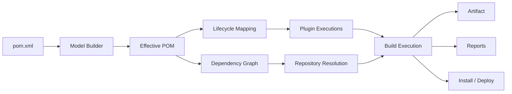
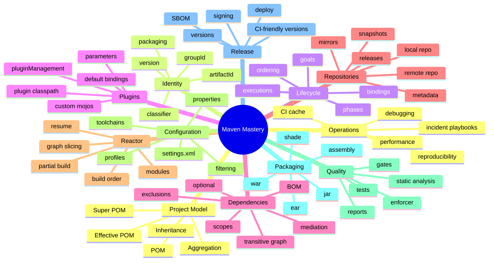
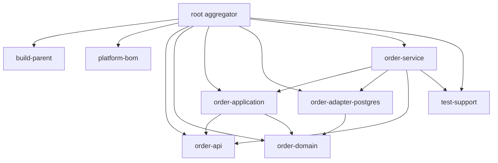
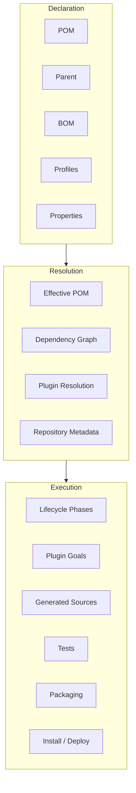
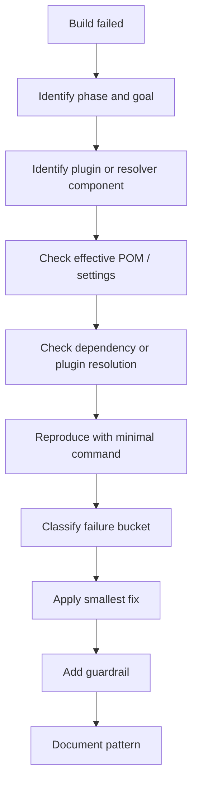
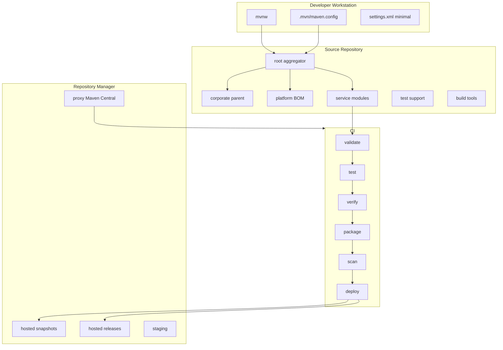

# Part 001 — Kaufman Skill Map for Maven Mastery

Maven sering diremehkan karena kelihatannya hanya berisi command sederhana:

```bash
mvn clean install
```

Itu cara paling cepat untuk memakai Maven, tetapi juga cara paling lambat untuk benar-benar memahaminya.

Pada level engineer biasa, Maven dipakai sebagai **tool untuk menjalankan build**.
Pada level senior, Maven dipahami sebagai **sistem deklaratif yang membangun model project, menghitung dependency graph, mengikat plugin ke lifecycle, menjalankan build plan, lalu menghasilkan artifact yang bisa dipercaya**.

Seri ini tidak akan mengajarkan Maven sebagai kumpulan command hafalan. Kita akan membangun kemampuan untuk membaca Maven seperti membaca sistem produksi:

- apa input-nya,
- apa state-nya,
- apa graph-nya,
- apa invariant-nya,
- apa failure mode-nya,
- apa efek perubahan satu baris `pom.xml` terhadap seluruh organisasi build.

Referensi resmi Apache Maven mendeskripsikan Maven sebagai software project management and comprehension tool berbasis Project Object Model/POM, yang mengelola build, reporting, dan dokumentasi dari satu pusat informasi. POM sendiri adalah fundamental unit of work di Maven. Lifecycle Maven terdiri dari lifecycle seperti `default`, `clean`, dan `site`, sedangkan dependency mechanism Maven menyelesaikan direct dan transitive dependencies dari repository. Seri ini menggunakan fakta-fakta resmi tersebut sebagai basis, lalu bergerak ke praktik engineering enterprise.

---

## 1. Target Seri Ini

Setelah menyelesaikan seri ini, targetnya bukan sekadar bisa menjalankan Maven.

Targetnya adalah kamu bisa:

1. Mendesain struktur Maven untuk project Java enterprise besar.
2. Menjelaskan kenapa build tertentu menghasilkan artifact tertentu.
3. Mendeteksi dependency conflict sebelum menjadi runtime incident.
4. Membuat parent POM, BOM, dan multi-module architecture yang scalable.
5. Men-debug build failure tanpa trial-and-error acak.
6. Menentukan kapan memakai profile, kapan menolaknya.
7. Menentukan kapan dependency harus dikelola di module, parent, BOM, atau repository policy.
8. Membuat build reproducible dan CI/CD-friendly.
9. Mengamankan supply chain build dari dependency drift, repository poisoning, credential leakage, dan artifact ambiguity.
10. Memimpin migrasi Maven 3 ke Maven 4 dengan risiko terukur.

Maven mastery bukan soal banyak plugin yang dihafal. Maven mastery adalah kemampuan menjawab pertanyaan ini:

> “Dari deklarasi ini, Maven akan membangun model apa, menjalankan execution plan apa, menyelesaikan dependency seperti apa, dan memproduksi artifact dengan guarantee apa?”

---

## 2. Model Mental Utama

Bayangkan Maven sebagai pipeline deterministic yang menerima `pom.xml` dan environment build, lalu menghasilkan artifact.



Bagian pentingnya: Maven tidak langsung “menjalankan command”. Maven membangun **model** terlebih dahulu.

Setiap kali kamu mengetik:

```bash
mvn verify
```

Maven secara konseptual melakukan ini:

1. Membaca `pom.xml`.
2. Menggabungkan parent POM, Super POM, profiles, properties, plugin management, dependency management.
3. Membentuk effective POM.
4. Menentukan lifecycle phase yang diminta.
5. Menentukan plugin goals yang bound ke phase tersebut.
6. Menyelesaikan dependency graph.
7. Mengambil artifact dari local/remote repository.
8. Menjalankan plugin execution sesuai urutan lifecycle.
9. Menghasilkan output di `target/`.
10. Mengembalikan exit code untuk shell/CI.

Jadi command Maven bukan unit utama. Unit utamanya adalah **model + graph + execution plan**.

---

## 3. Deconstruction: Maven Dipecah Menjadi 12 Skill

Pendekatan Kaufman dimulai dengan deconstruction: skill besar dipecah menjadi sub-skill kecil yang bisa dilatih.

Untuk Maven, skill map-nya seperti ini:



Kita akan menguasai Maven dengan membangun skill ini satu per satu.

---

## 4. Apa yang Bukan Target Seri Ini

Agar belajar efisien, seri ini tidak akan mengulang hal-hal yang bukan inti Maven.

Tidak akan mengulang:

- Java syntax dasar.
- OOP dasar.
- HTTP/API design dasar.
- SQL dasar.
- Docker/Kubernetes dasar.
- Testing theory umum.
- CI/CD theory umum.
- Security theory umum.

Kita tetap akan menyentuh testing, CI/CD, security, repository, dan deployment, tetapi hanya dari sudut Maven:

- bagaimana Maven menjalankan test,
- bagaimana Maven menghasilkan artifact,
- bagaimana Maven menyelesaikan dependency,
- bagaimana Maven publish artifact,
- bagaimana Maven menjaga build invariant.

Maven harus dipelajari sebagai **build substrate** untuk sistem Java, bukan sebagai silabus Java umum.

---

## 5. Kompetensi Top 1% dalam Maven

Engineer top 1% tidak berarti tahu semua plugin. Itu tidak realistis dan tidak berguna.

Engineer top 1% berarti memiliki **operational fluency**.

### 5.1 Bisa Membaca Build Seperti Membaca Sistem

Mereka tidak berhenti di:

```text
Build failed.
```

Mereka bertanya:

- Failure terjadi di phase apa?
- Goal apa yang sedang dieksekusi?
- Plugin version mana yang menjalankan goal itu?
- Parameter apa yang dipakai plugin?
- Parameter itu berasal dari mana: default, parent, profile, CLI, property, atau plugin config?
- Dependency graph apa yang aktif saat itu?
- Apakah failure deterministik atau environment-specific?

### 5.2 Bisa Mendesain Build Agar Tidak Rapuh

Mereka tidak membuat POM yang “jalan di laptop saya”.

Mereka membuat POM yang:

- jalan di laptop engineer,
- jalan di CI ephemeral runner,
- jalan ketika local repository kosong,
- jalan ketika module dibangun parsial,
- tetap deterministic saat dependency baru dirilis,
- tidak bergantung pada urutan manual,
- bisa diaudit enam bulan kemudian.

### 5.3 Bisa Mengontrol Dependency Graph

Mereka tahu bahwa dependency bukan daftar library. Dependency adalah graph yang bisa menyebabkan:

- classpath conflict,
- method missing at runtime,
- security vulnerability,
- binary incompatibility,
- duplicate class,
- dependency hell,
- startup failure,
- behavior drift.

### 5.4 Bisa Menggunakan Maven untuk Governance

Maven bisa menjadi enforcement layer:

- enforce JDK version,
- enforce Maven version,
- ban dependency tertentu,
- require dependency convergence,
- require plugin version pinning,
- require license header,
- fail build jika snapshot dependency masuk release branch,
- fail build jika dependency vulnerability melewati threshold.

Maven yang baik bukan hanya membangun artifact. Maven yang baik menjaga batas kualitas organisasi.

---

## 6. Skill Ladder

Kita akan memakai ladder berikut untuk mengukur progres.

| Level | Kemampuan | Ciri Umum |
|---:|---|---|
| 0 | User pasif | Hanya menjalankan `mvn clean install`. |
| 1 | Basic user | Bisa menambahkan dependency dan menjalankan test. |
| 2 | Project maintainer | Bisa mengatur plugin, compiler, test, package. |
| 3 | Dependency engineer | Bisa membaca tree, scope, BOM, exclusions, convergence. |
| 4 | Reactor engineer | Bisa mendesain multi-module dan partial build. |
| 5 | Build reliability engineer | Bisa membuat build reproducible, deterministic, CI-friendly. |
| 6 | Enterprise build architect | Bisa membuat parent/BOM/repository/release governance lintas tim. |
| 7 | Maven internals-capable engineer | Bisa menulis plugin, extension, dan memahami Maven 4 migration model. |

Seri ini bergerak dari level 0 ke level 7.

---

## 7. Minimal Lab Repository yang Akan Dipakai

Agar pembelajaran konkret, seri ini akan berulang kali memakai bentuk lab enterprise kecil berikut:

```text
maven-in-action-lab/
├── pom.xml                         # root aggregator
├── build-parent/
│   └── pom.xml                     # corporate/product parent
├── platform-bom/
│   └── pom.xml                     # dependency alignment BOM
├── order-api/
│   ├── pom.xml
│   └── src/main/java/...
├── order-domain/
│   ├── pom.xml
│   └── src/main/java/...
├── order-application/
│   ├── pom.xml
│   └── src/main/java/...
├── order-adapter-postgres/
│   ├── pom.xml
│   └── src/main/java/...
├── order-service/
│   ├── pom.xml
│   └── src/main/java/...
├── test-support/
│   ├── pom.xml
│   └── src/testFixtures/java/...
└── build-tools/
    └── pom.xml                     # optional custom plugin / rules
```

Repository ini sengaja tidak dibuat sebagai toy project satu module. Banyak masalah Maven baru terlihat pada multi-module build:

- dependency version drift,
- parent inheritance yang salah,
- cyclic module dependency,
- test-support dependency leakage,
- plugin config duplication,
- reactor order problem,
- release artifact ambiguity,
- CI cache inconsistency,
- partial build failure.

---

## 8. Invariant Maven yang Harus Selalu Dipegang

Invariant adalah aturan yang seharusnya tetap benar meskipun project berubah.

### Invariant 1 — Build Harus Bisa Dijelaskan dari POM

Kalau build hanya bisa dijelaskan oleh “urutan manual yang biasa dilakukan senior”, build itu rapuh.

Build yang sehat harus bisa dijelaskan dari:

- `pom.xml`,
- parent POM,
- effective POM,
- `settings.xml` yang eksplisit,
- CI pipeline file,
- repository policy.

### Invariant 2 — Version Harus Punya Ownership

Setiap dependency version harus punya rumah.

Kemungkinan rumahnya:

- module POM,
- parent POM,
- internal BOM,
- external BOM,
- plugin management,
- CI property.

Kalau version tersebar tanpa aturan, organisasi akan kehilangan kontrol dependency graph.

### Invariant 3 — Plugin Version Harus Dipin

Build tidak boleh bergantung pada plugin version floating atau default tidak sadar.

Jika plugin behavior berubah, build bisa berubah tanpa perubahan source code.

Aturan enterprise:

```xml
<pluginManagement>
  <plugins>
    <plugin>
      <groupId>org.apache.maven.plugins</groupId>
      <artifactId>maven-compiler-plugin</artifactId>
      <version>...</version>
    </plugin>
  </plugins>
</pluginManagement>
```

Plugin version adalah bagian dari build definition.

### Invariant 4 — Release Build Tidak Boleh Mengandalkan SNAPSHOT yang Tidak Dikontrol

SNAPSHOT berguna untuk integrasi cepat. Tetapi SNAPSHOT tidak boleh masuk ke release artifact tanpa governance.

Masalah SNAPSHOT:

- bisa berubah tanpa version string berubah,
- sulit direproduksi,
- bisa berbeda antara laptop dan CI,
- bisa hilang atau terhapus dari repository policy tertentu.

### Invariant 5 — CI Build Harus Bisa Berjalan dari Empty Local Repository

Kalau build hanya berhasil karena `.m2/repository` lokal sudah “kebetulan lengkap”, build itu tidak valid.

CI yang sehat harus bisa dimulai dari:

```text
empty workspace + empty local repo + declared repository config
```

### Invariant 6 — Dependency Scope Harus Merefleksikan Runtime Boundary

`compile`, `provided`, `runtime`, dan `test` bukan label kosmetik. Scope menentukan classpath.

Scope salah bisa menyebabkan:

- compile berhasil tapi runtime gagal,
- test berhasil tapi deployment gagal,
- artifact terlalu besar,
- dependency bocor ke consumer,
- app server conflict.

### Invariant 7 — Parent POM Tidak Boleh Menjadi Tempat Sampah

Parent POM sering tumbuh menjadi global dumping ground.

Parent yang baik:

- mengatur policy,
- mengelola versi,
- menyediakan plugin management,
- tidak memaksa dependency runtime yang tidak dibutuhkan semua module,
- tidak menyembunyikan behavior berbahaya di profile default.

---

## 9. Maven Sebagai Graph, Bukan Folder

Banyak engineer melihat Maven project sebagai folder.

Maven melihatnya sebagai graph.



Dari graph ini Maven menentukan build order.

Kalau kamu menjalankan:

```bash
mvn -pl order-service -am verify
```

Maven tidak hanya membangun `order-service`. Maven juga membangun module upstream yang diperlukan oleh `order-service`.

Inilah sebabnya Maven reactor adalah topik tersendiri. Pada project enterprise, build efficiency banyak ditentukan oleh kemampuan memotong graph dengan benar.

---

## 10. Tiga Lapisan Maven: Declaration, Resolution, Execution

Untuk memahami Maven secara tajam, pecah menjadi tiga lapisan:



Masalah Maven biasanya terjadi karena engineer mencampur tiga lapisan ini.

Contoh:

- Dependency sudah dideklarasikan, tapi tidak masuk classpath karena scope salah.
- Plugin sudah dikonfigurasi, tapi tidak jalan karena tidak bound ke lifecycle.
- Profile sudah dibuat, tapi tidak aktif karena activation salah.
- BOM sudah diimport, tapi version masih override dari parent lain.
- Module ada di folder, tapi tidak masuk reactor karena tidak ada di `<modules>`.

Diagnosis Maven yang baik selalu bertanya:

1. Apakah deklarasinya ada?
2. Apakah deklarasinya masuk effective model?
3. Apakah model itu ikut resolution?
4. Apakah resolution itu masuk execution?
5. Apakah execution itu berjalan di phase yang diminta?

---

## 11. Roadmap Belajar Cepat Tapi Dalam

Ini bukan roadmap “install Maven lalu selesai”. Ini roadmap untuk menjadi fluent.

### Stage 1 — Model and Lifecycle

Tujuan: memahami Maven sebagai model-driven build system.

Part terkait:

- Part 001 — Kaufman Skill Map
- Part 002 — Maven as Build System, Not Just a Tool
- Part 003 — The POM Mental Model
- Part 004 — Effective POM, Super POM, and Inheritance
- Part 005 — Coordinates, Artifacts, and Packaging
- Part 006 — Lifecycle, Phase, Goal, and Execution Plan
- Part 007 — Maven Plugin System in Action
- Part 008 — Standard Project Layout and Build Conventions

Kemampuan akhir stage:

- bisa menjelaskan apa yang terjadi saat `mvn verify`,
- bisa membaca effective POM,
- bisa membedakan phase dan goal,
- bisa memahami kenapa plugin tertentu jalan atau tidak jalan.

### Stage 2 — Dependency and Repository Control

Tujuan: mengontrol dependency graph.

Part terkait:

- Part 009 — Dependency Graph Fundamentals
- Part 010 — Dependency Management, BOMs, and Version Strategy
- Part 011 — Scopes, Classpaths, and Runtime Boundaries
- Part 012 — Repositories, Resolution, and Metadata
- Part 013 — `settings.xml` and Enterprise Build Configuration
- Part 014 — Repository Managers

Kemampuan akhir stage:

- bisa membaca dependency tree,
- bisa menentukan rumah version,
- bisa menghindari classpath leakage,
- bisa menjelaskan remote/local repository behavior,
- bisa mendesain repository topology organisasi.

### Stage 3 — Multi-Module and Build Architecture

Tujuan: Maven untuk codebase besar.

Part terkait:

- Part 015 — Multi-Module Reactor Basics
- Part 016 — Multi-Module Enterprise Architecture
- Part 017 — Parent POM Design Patterns
- Part 018 — Build Profiles Without Chaos
- Part 019 — Resource Filtering and Build-Time Configuration
- Part 020 — Compiler, Toolchains, and Java Version Strategy

Kemampuan akhir stage:

- bisa mendesain aggregator, parent, BOM,
- bisa menghindari parent POM dumping ground,
- bisa menjalankan partial build,
- bisa mengelola Java version lintas module.

### Stage 4 — Quality, Packaging, and Generated Code

Tujuan: Maven sebagai enforcement layer.

Part terkait:

- Part 021 — Testing with Surefire and Failsafe
- Part 022 — Code Quality Checks in the Maven Build
- Part 023 — Maven Enforcer and Build Governance
- Part 024 — Shading, Assembly, and Packaging Patterns
- Part 025 — WAR, EAR, and Jakarta Enterprise Builds
- Part 026 — Generated Sources and Annotation Processing
- Part 027 — Build Helper and Non-Standard Layouts

Kemampuan akhir stage:

- bisa memisahkan unit/integration test,
- bisa membuat quality gate,
- bisa memilih packaging strategy,
- bisa mengelola generated source dengan aman.

### Stage 5 — Production Build Engineering

Tujuan: build yang aman, cepat, reproducible, dan bisa dioperasikan.

Part terkait:

- Part 028 — Reproducible Builds and Determinism
- Part 029 — Supply Chain Security, SBOM, and Signing
- Part 030 — Release, Versioning, and CI-Friendly Versions
- Part 031 — Deploy, Publish, and Distribution Management
- Part 032 — CI/CD Pipeline Design for Maven
- Part 033 — Performance Engineering for Large Maven Builds
- Part 034 — Debugging Maven Like a Senior Engineer
- Part 035 — Common Failure Modes and Incident Playbooks

Kemampuan akhir stage:

- bisa membuat build deterministic,
- bisa mengamankan supply chain,
- bisa mempercepat build besar,
- bisa membuat incident playbook Maven.

### Stage 6 — Extension, Migration, and Reference Architecture

Tujuan: mampu menyesuaikan Maven untuk kebutuhan organisasi.

Part terkait:

- Part 036 — Writing Custom Maven Plugins
- Part 037 — Maven Extensions and Core Extension Points
- Part 038 — Maven 4 Upgrade and New Model
- Part 039 — Maven vs Gradle, Bazel, and Build-System Tradeoffs
- Part 040 — Enterprise Maven Reference Architecture

Kemampuan akhir stage:

- bisa menulis plugin internal,
- bisa memahami extension risk,
- bisa merencanakan migrasi Maven 4,
- bisa membuat reference architecture organisasi.

---

## 12. Cara Belajar Setiap Part

Setiap part akan mengikuti pola berikut:

1. **Problem framing** — masalah nyata yang ingin diselesaikan.
2. **Mental model** — struktur konseptual yang harus dipahami.
3. **Implementation** — konfigurasi Maven nyata.
4. **Execution** — command dan hasil yang diharapkan.
5. **Failure mode** — cara salah yang umum terjadi.
6. **Diagnostics** — command untuk membuktikan akar masalah.
7. **Enterprise pattern** — bagaimana ini diterapkan di organisasi besar.
8. **Checklist** — aturan praktis yang bisa dipakai di code review.

Format ini sengaja mirip engineering handbook. Bukan sekadar tutorial, tetapi juga playbook.

---

## 13. Command Dasar yang Akan Sering Dipakai

Kita akan memakai command berikut berulang kali.

### Build Phase

```bash
mvn validate
mvn compile
mvn test
mvn package
mvn verify
mvn install
mvn deploy
```

### Clean Lifecycle

```bash
mvn clean
mvn clean verify
```

### Debug Model

```bash
mvn help:effective-pom
mvn help:active-profiles
mvn help:effective-settings
```

### Debug Dependency

```bash
mvn dependency:tree
mvn dependency:tree -Dverbose
mvn dependency:analyze
mvn dependency:resolve
```

### Debug Reactor

```bash
mvn -pl order-service -am verify
mvn -pl order-service -amd verify
mvn -rf :order-service verify
```

### Debug Failure

```bash
mvn -e verify
mvn -X verify
```

Command-command ini bukan untuk dihafal kosong. Kita akan mengaitkan setiap command dengan model internal Maven.

---

## 14. Failure Mode yang Akan Kita Latih

Maven failure jarang benar-benar misterius. Biasanya failure masuk ke salah satu bucket berikut.

| Failure | Gejala | Penyebab Umum |
|---|---|---|
| Model failure | Maven tidak bisa membaca project | XML invalid, parent tidak ditemukan, property hilang. |
| Resolution failure | Dependency/plugin tidak ditemukan | Repository salah, metadata stale, credential salah, network/proxy. |
| Mediation failure | Version tidak sesuai ekspektasi | Transitive dependency, nearest-wins, BOM order, override parent. |
| Scope failure | Compile/test/runtime classpath berbeda | Scope salah, dependency bocor, provided/runtime mismatch. |
| Lifecycle failure | Plugin tidak jalan | Goal tidak bound, phase salah, execution id tidak aktif. |
| Plugin failure | Goal error | Parameter salah, plugin version bug, environment tidak cocok. |
| Reactor failure | Module build order salah | Missing module, cyclic dependency, partial build tanpa `-am`. |
| Packaging failure | Artifact tidak sesuai | Shade/assembly salah, resource filtering salah, manifest salah. |
| Release failure | Artifact tidak bisa dipublish | Version invalid, credentials, staging repo, signing, distributionManagement. |
| Reproducibility failure | Build berbeda antar environment | Timestamp, plugin drift, SNAPSHOT, OS path, locale, timezone. |

Tujuan akhir: kamu bisa melihat error Maven dan langsung menyusun hypothesis tree.

---

## 15. Senior Diagnostic Loop

Ketika Maven gagal, jangan langsung menghapus `.m2`.

Menghapus `.m2` kadang berguna, tetapi sebagai langkah pertama itu seperti restart server tanpa membaca log.

Pakai loop ini:



Smallest fix penting. Jangan mengubah parent, BOM, plugin, profile, dan CI sekaligus. Build system adalah graph; perubahan besar membuat root cause kabur.

---

## 16. Prinsip “Smallest Useful Maven”

Maven mudah berubah menjadi kompleks karena semua orang menambahkan konfigurasi untuk menyelesaikan masalah lokal.

Prinsip kita:

> Mulai dari Maven convention. Tambahkan konfigurasi hanya ketika ada invariant yang ingin dijaga.

Contoh:

Jangan langsung membuat profile `dev`, `qa`, `uat`, `prod` hanya karena environment ada empat.

Tanya dulu:

- Apakah artifact seharusnya berbeda antar environment?
- Apakah konfigurasi environment seharusnya runtime config, bukan build-time config?
- Apakah profile membuat build tidak reproducible?
- Apakah CI bisa membuktikan semua profile valid?

Maven bisa melakukan banyak hal. Tetapi build yang baik sering kali lebih sedikit melakukan hal yang tidak perlu.

---

## 17. POM Sebagai Kontrak Organisasi

Pada project kecil, `pom.xml` adalah file build.

Pada organisasi besar, POM adalah kontrak:

- kontrak artifact identity,
- kontrak dependency policy,
- kontrak Java version,
- kontrak plugin version,
- kontrak test phase,
- kontrak quality gate,
- kontrak publication path,
- kontrak consumer compatibility.

Karena itu, perubahan POM harus direview seperti perubahan code penting.

Pertanyaan code review untuk POM:

1. Apakah perubahan ini memengaruhi artifact public?
2. Apakah dependency baru masuk compile/runtime/test scope yang benar?
3. Apakah version dikelola di tempat yang tepat?
4. Apakah plugin version dipin?
5. Apakah behavior build berubah di CI?
6. Apakah release reproducibility berubah?
7. Apakah consumer module terdampak?
8. Apakah perubahan ini seharusnya di parent/BOM, bukan module lokal?

---

## 18. Build Ownership Model

Di organisasi besar, Maven failure sering bukan masalah teknis murni. Itu masalah ownership.

| Area | Owner Ideal | Risiko Jika Tidak Ada Owner |
|---|---|---|
| Parent POM | Platform/build engineering | Semua tim copy-paste config sendiri. |
| BOM | Architecture/platform team | Dependency drift dan runtime conflict. |
| Repository manager | DevOps/platform/security | Artifact tidak trusted, cache tidak stabil. |
| Plugin versions | Build engineering | Build behavior berubah diam-diam. |
| CI Maven config | Platform/CI team | Laptop dan CI berbeda. |
| Release workflow | Release engineering | Artifact tidak reproducible atau tidak traceable. |
| Security rules | AppSec/platform | Vulnerable dependency lolos. |

Maven bisa menjadi alat governance hanya jika ownership-nya jelas.

---

## 19. Latihan Deliberate Practice

Setiap skill Maven perlu latihan eksplisit.

### Latihan 1 — Predict the Build

Sebelum menjalankan command, prediksi:

```bash
mvn package
```

Akan menjalankan phase apa saja?
Plugin goal apa yang bound?
Artifact apa yang dihasilkan?
Test mana yang jalan?

Kemudian buktikan dengan log.

### Latihan 2 — Read the Effective POM

Jangan hanya baca `pom.xml` lokal.

Jalankan:

```bash
mvn help:effective-pom
```

Cari:

- final dependency versions,
- plugin versions,
- source directories,
- resource configuration,
- active profiles,
- inherited config.

### Latihan 3 — Break Dependency Graph Intentionally

Tambahkan dua dependency yang membawa versi transitive berbeda.

Lalu jalankan:

```bash
mvn dependency:tree
```

Tentukan version mana yang menang dan kenapa.

### Latihan 4 — Build Partial Reactor

Di multi-module project:

```bash
mvn -pl order-service verify
mvn -pl order-service -am verify
mvn -pl order-domain -amd verify
```

Bandingkan graph yang dibangun.

### Latihan 5 — Make Build Fail for the Right Reason

Tambahkan Enforcer rule untuk melarang SNAPSHOT dependency pada release branch.

Build yang baik bukan build yang selalu hijau. Build yang baik gagal ketika invariant dilanggar.

---

## 20. Anti-Pattern yang Akan Kita Bongkar

### Anti-Pattern 1 — `mvn clean install` sebagai Reflex

Banyak engineer selalu menjalankan:

```bash
mvn clean install
```

Padahal sering kali cukup:

```bash
mvn test
mvn verify
mvn -pl module-a -am test
```

`install` menulis artifact ke local repository. Kalau tidak diperlukan, itu bisa mencemari local state dan menyembunyikan dependency issue.

### Anti-Pattern 2 — Semua Version di Semua Module

Jika setiap module mendeklarasikan version sendiri, tidak ada dependency governance.

Gunakan `dependencyManagement` atau BOM ketika banyak module harus align.

### Anti-Pattern 3 — Parent POM Berisi Semua Dependency

Parent POM seharusnya mengatur policy dan version, bukan memaksa semua module memakai dependency runtime yang sama.

Lebih aman:

- version di `dependencyManagement`,
- dependency aktual di module yang membutuhkan.

### Anti-Pattern 4 — Profile untuk Environment Runtime

Profile sering dipakai untuk `dev`, `qa`, `prod`.

Itu berbahaya jika menghasilkan artifact berbeda untuk environment berbeda.

Dalam banyak sistem modern, artifact seharusnya sama; konfigurasi environment masuk saat runtime.

### Anti-Pattern 5 — Exclusion Tanpa Root Cause

Exclusion bisa menyelesaikan conflict, tetapi juga bisa menyembunyikan masalah graph.

Sebelum exclusion:

- baca dependency tree,
- pahami siapa membawa dependency,
- cek apakah BOM alignment lebih tepat,
- cek apakah dependency direct lebih eksplisit diperlukan.

### Anti-Pattern 6 — Menghapus `.m2` Tanpa Diagnosis

Kadang local repo corrupt. Tetapi kalau setiap error diselesaikan dengan hapus `.m2`, tim tidak pernah memahami failure mode.

Diagnosis dulu. Bersihkan cache hanya jika root cause memang cache/resolution stale/corruption.

---

## 21. Maven Review Checklist

Gunakan checklist ini saat review PR yang mengubah Maven config.

### Identity

- Apakah `groupId`, `artifactId`, `version`, dan `packaging` benar?
- Apakah artifact name stabil dan tidak ambigu?
- Apakah module baru masuk reactor bila diperlukan?

### Dependency

- Apakah dependency baru memakai scope yang benar?
- Apakah version berada di tempat yang tepat?
- Apakah dependency sudah tersedia di BOM/internal platform?
- Apakah ada transitive dependency berisiko?
- Apakah exclusion punya alasan jelas?

### Plugin

- Apakah plugin version dipin?
- Apakah plugin diletakkan di `pluginManagement` atau `plugins` dengan benar?
- Apakah execution bound ke phase yang tepat?
- Apakah parameter plugin reproducible?

### Build Behavior

- Apakah build lokal dan CI menjalankan lifecycle yang sama?
- Apakah profile default mengubah artifact?
- Apakah generated source masuk lifecycle dengan benar?
- Apakah integration test berjalan di phase yang benar?

### Release

- Apakah release artifact bebas SNAPSHOT tidak terkendali?
- Apakah distribution management benar?
- Apakah signing/SBOM/checksum policy terpenuhi?
- Apakah artifact bisa direproduksi?

---

## 22. Output Akhir Seri

Pada akhir seri, kamu akan memiliki reference architecture seperti ini:



Ini bukan diagram hiasan. Ini target mental model: Maven sebagai bagian dari engineering platform.

---

## 23. Ringkasan Part 001

Maven mastery dimulai dari perubahan cara melihat.

Jangan melihat Maven sebagai command-line tool.
Lihat Maven sebagai:

- project model,
- dependency graph resolver,
- lifecycle executor,
- plugin runtime,
- artifact producer,
- repository client,
- enterprise governance layer.

Part berikutnya akan membongkar Maven sebagai build system: bagaimana Maven mengubah POM menjadi build execution plan, kenapa deklarasi lebih penting daripada command, dan mengapa `mvn verify` sering lebih sehat daripada `mvn clean install`.

---

## Referensi Resmi

- Apache Maven — Welcome to Apache Maven: https://maven.apache.org/
- Apache Maven — What is Maven: https://maven.apache.org/what-is-maven.html
- Apache Maven — Introduction to the POM: https://maven.apache.org/guides/introduction/introduction-to-the-pom.html
- Apache Maven — POM Reference: https://maven.apache.org/pom.html
- Apache Maven — Introduction to the Build Lifecycle: https://maven.apache.org/guides/introduction/introduction-to-the-lifecycle.html
- Apache Maven — Introduction to the Dependency Mechanism: https://maven.apache.org/guides/introduction/introduction-to-dependency-mechanism.html
- Apache Maven — Introduction to Repositories: https://maven.apache.org/guides/introduction/introduction-to-repositories.html
- Apache Maven — Running Apache Maven: https://maven.apache.org/run.html
- Apache Maven — What's new in Maven 4: https://maven.apache.org/whatsnewinmaven4.html
