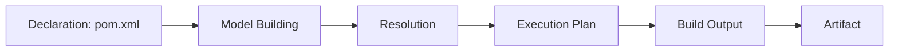
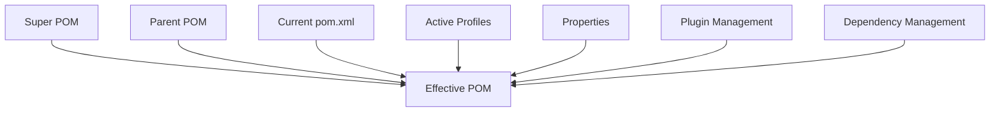
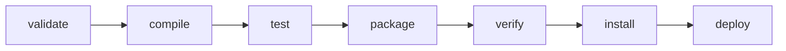
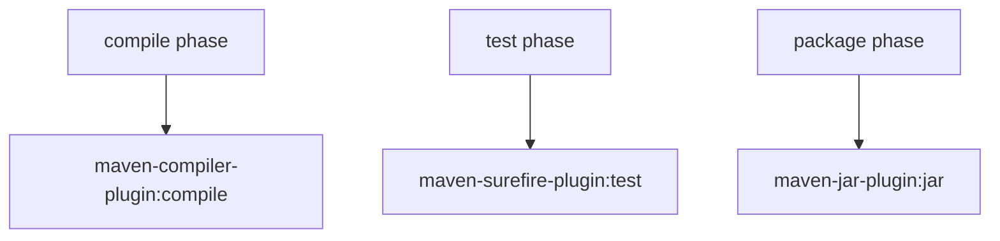
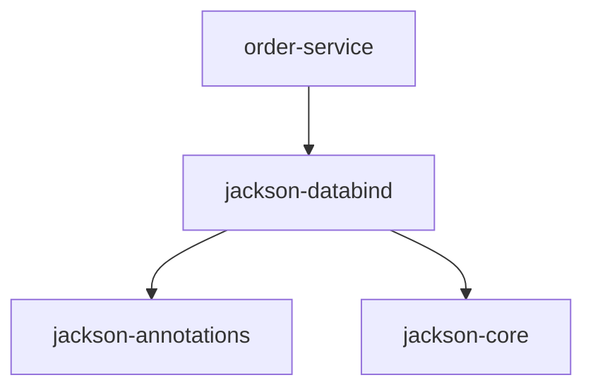
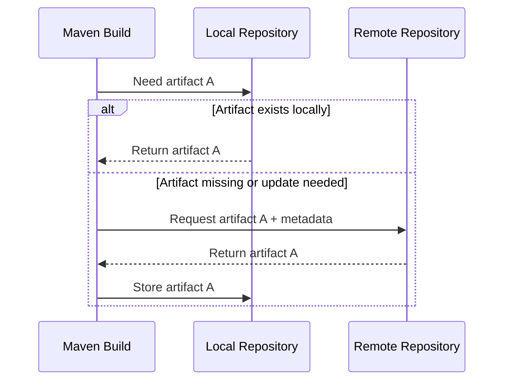
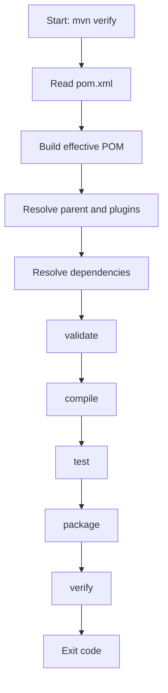
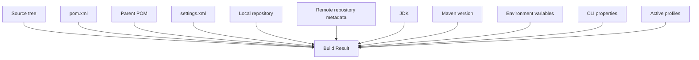
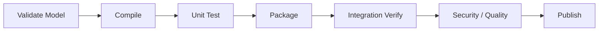
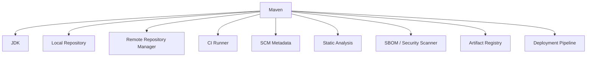

# Part 002 — Maven as a Build System, Not Just a Tool

Kebanyakan engineer pertama kali mengenal Maven lewat command:

```bash
mvn clean install
```

Command itu berguna, tetapi berbahaya sebagai pintu masuk mental model.

Kalau Maven dipahami sebagai command runner, kita akan bertanya:

> “Command apa yang harus saya jalankan?”

Kalau Maven dipahami sebagai build system, kita akan bertanya:

> “Model apa yang sedang dibangun Maven, graph apa yang diselesaikan, lifecycle phase apa yang dieksekusi, plugin goal apa yang terikat, dan artifact apa yang seharusnya keluar?”

Perbedaan ini sangat besar.

Engineer yang hanya hafal command akan lambat ketika build rusak.
Engineer yang memahami model bisa melakukan diagnosis.

---

## 1. Maven dalam Satu Kalimat

Maven adalah build system deklaratif untuk project Java/JVM yang menggunakan `pom.xml` sebagai Project Object Model untuk mendeskripsikan project, dependency, build lifecycle, plugin configuration, repository, reporting, dan publication metadata.

Apache Maven mendeskripsikan Maven sebagai build tool untuk Java project yang memakai POM untuk mengelola compilation, testing, dan documentation. Dokumentasi lain dari Maven juga menekankan bahwa Maven bertujuan memberi uniform build system, project information, dan praktik development yang lebih baik.

Kalimat praktisnya:

> Maven mengubah deklarasi project menjadi execution plan yang menghasilkan artifact.



---

## 2. Tool vs Build System

Mari bedakan dua cara berpikir.

### 2.1 Maven sebagai Tool

Cara berpikir tool-centric:

```text
Saya ingin build.
Saya jalankan mvn clean install.
Kalau gagal, saya cari command lain.
```

Gejalanya:

- sering copy-paste command dari Stack Overflow,
- tidak tahu perbedaan `package`, `verify`, `install`, `deploy`,
- tidak tahu dependency datang dari mana,
- menghapus `.m2` sebagai default debugging,
- menambahkan exclusion tanpa membaca dependency tree,
- menaruh dependency di parent agar “semua module bisa compile”,
- membuat profile untuk semua environment.

### 2.2 Maven sebagai Build System

Cara berpikir system-centric:

```text
Saya punya project model.
Maven membangun effective model.
Maven menyelesaikan dependencies dan plugins.
Maven mengikat goals ke lifecycle phases.
Maven menjalankan execution plan.
Maven menghasilkan artifact dan reports.
```

Gejalanya:

- bisa membaca effective POM,
- bisa menjelaskan phase/goal/plugin,
- bisa membaca dependency mediation,
- bisa mendesain parent/BOM/module structure,
- bisa membedakan local install dan remote deploy,
- bisa membuat build reproducible,
- bisa mendesain CI command yang minimal dan benar.

---

## 3. Maven Itu Deklaratif

Maven berbeda dari shell script.

Shell script biasanya imperative:

```bash
mkdir -p target/classes
javac -d target/classes $(find src/main/java -name '*.java')
jar cf target/app.jar -C target/classes .
```

Maven biasanya declarative:

```xml
<project>
  <modelVersion>4.0.0</modelVersion>

  <groupId>com.acme.order</groupId>
  <artifactId>order-service</artifactId>
  <version>1.0.0-SNAPSHOT</version>
  <packaging>jar</packaging>
</project>
```

Dari deklarasi minimal ini, Maven sudah tahu banyak convention:

- source code utama ada di `src/main/java`,
- test source ada di `src/test/java`,
- output build ada di `target`,
- packaging `jar` menghasilkan JAR,
- lifecycle `compile` akan mengompilasi source,
- lifecycle `test` akan menjalankan test,
- lifecycle `package` akan membuat artifact.

Kamu tidak menjelaskan setiap langkah. Kamu mendeskripsikan project, lalu Maven memakai convention dan plugin binding.

---

## 4. Project Object Model: Input Utama Maven

File `pom.xml` bukan file konfigurasi biasa. Ia adalah model project.

Contoh minimal:

```xml
<project xmlns="http://maven.apache.org/POM/4.0.0"
         xmlns:xsi="http://www.w3.org/2001/XMLSchema-instance"
         xsi:schemaLocation="http://maven.apache.org/POM/4.0.0 https://maven.apache.org/xsd/maven-4.0.0.xsd">
  <modelVersion>4.0.0</modelVersion>

  <groupId>com.acme.order</groupId>
  <artifactId>order-service</artifactId>
  <version>1.0.0-SNAPSHOT</version>
  <packaging>jar</packaging>
</project>
```

Model ini menjawab beberapa pertanyaan fundamental:

| Pertanyaan | Dijawab Oleh |
|---|---|
| Project ini siapa? | `groupId`, `artifactId`, `version` |
| Output-nya apa? | `packaging` |
| Source-nya di mana? | convention atau build config |
| Butuh dependency apa? | `<dependencies>` |
| Build memakai plugin apa? | `<build><plugins>` |
| Version dikelola di mana? | `<dependencyManagement>` dan `<pluginManagement>` |
| Artifact dipublish ke mana? | `<distributionManagement>` |
| Metadata project apa? | name, description, licenses, developers, scm |

Maven membaca `pom.xml`, tetapi yang dipakai saat build bukan hanya POM mentah. Maven membangun **effective POM**.

---

## 5. Effective POM: Build Definition Sebenarnya

`pom.xml` yang kamu lihat bukan keseluruhan build definition.

Maven juga memperhitungkan:

- Super POM,
- parent POM,
- inherited configuration,
- default lifecycle bindings,
- active profiles,
- properties,
- plugin management,
- dependency management,
- settings.

Hasil akhirnya adalah effective POM.



Command penting:

```bash
mvn help:effective-pom
```

Gunakan ketika:

- dependency version tidak sesuai ekspektasi,
- plugin configuration terasa “muncul sendiri”,
- profile tampaknya aktif/tidak aktif,
- parent POM menyembunyikan config,
- CI berbeda dari laptop.

Rule pertama debugging Maven:

> Jangan hanya baca POM lokal. Baca effective POM.

---

## 6. Coordinates: Identitas Artifact

Maven memakai coordinates untuk mengidentifikasi artifact.

```xml
<groupId>com.acme.order</groupId>
<artifactId>order-service</artifactId>
<version>1.0.0-SNAPSHOT</version>
```

Secara praktis:

```text
com.acme.order:order-service:1.0.0-SNAPSHOT
```

Kadang coordinate lengkap juga melibatkan packaging/type dan classifier:

```text
groupId:artifactId:packaging:classifier:version
```

Contoh:

```text
com.acme.order:order-service:jar:1.0.0
com.acme.order:order-service:test-jar:tests:1.0.0
com.acme.order:order-service:war:1.0.0
```

Coordinates penting karena Maven repository bukan menyimpan “file acak”. Repository menyimpan artifact berdasarkan identity.

Local repository path biasanya mengikuti pola:

```text
~/.m2/repository/<groupId path>/<artifactId>/<version>/<artifactId>-<version>.<extension>
```

Contoh:

```text
~/.m2/repository/com/acme/order/order-service/1.0.0/order-service-1.0.0.jar
```

Artifact identity adalah fondasi dependency resolution, publication, dan reuse.

---

## 7. Lifecycle: Urutan Phase, Bukan Sekadar Command

Maven punya lifecycle. Lifecycle adalah urutan phase.

Lifecycle yang paling sering dipakai:

- `clean`,
- `default`,
- `site`.

Default lifecycle berisi phase seperti:

```text
validate -> compile -> test -> package -> verify -> install -> deploy
```

Jika kamu menjalankan:

```bash
mvn package
```

Maven menjalankan phase dari awal lifecycle sampai `package`.

Secara konseptual:



Maka:

```bash
mvn verify
```

berarti:

```text
jalankan validate, compile, test, package, verify
```

Bukan hanya phase `verify` secara terisolasi.

Ini penting untuk debugging. Jika build gagal saat `test`, menjalankan `mvn verify` tetap akan gagal di `test` sebelum sampai `verify`.

---

## 8. Phase vs Goal

Ini salah satu konsep Maven yang paling sering membingungkan.

### Phase

Phase adalah titik dalam lifecycle.

Contoh:

```text
compile
test
package
verify
install
deploy
```

### Goal

Goal adalah task konkret milik plugin.

Contoh:

```text
compiler:compile
surefire:test
jar:jar
install:install
deploy:deploy
```

### Binding

Binding adalah hubungan antara phase dan goal.

Misalnya untuk project `jar`, phase `compile` biasanya menjalankan goal compiler plugin, phase `test` menjalankan surefire, dan phase `package` menjalankan jar plugin.



Jadi saat kamu menjalankan:

```bash
mvn package
```

Maven tidak menjalankan “package magic”. Maven menjalankan semua plugin goals yang bound ke phases sampai `package`.

---

## 9. Plugin: Unit Eksekusi Nyata

Maven core tidak melakukan semua pekerjaan secara langsung.

Banyak pekerjaan dilakukan oleh plugin:

| Tugas | Plugin Umum |
|---|---|
| Compile Java | `maven-compiler-plugin` |
| Run unit tests | `maven-surefire-plugin` |
| Run integration tests | `maven-failsafe-plugin` |
| Build JAR | `maven-jar-plugin` |
| Build WAR | `maven-war-plugin` |
| Copy dependencies | `maven-dependency-plugin` |
| Enforce rules | `maven-enforcer-plugin` |
| Generate sources | OpenAPI/JAXB/Protobuf plugins, etc. |
| Deploy artifact | `maven-deploy-plugin` |

Plugin punya:

- groupId,
- artifactId,
- version,
- goals,
- parameters,
- executions,
- dependencies sendiri.

Contoh konfigurasi plugin:

```xml
<build>
  <plugins>
    <plugin>
      <groupId>org.apache.maven.plugins</groupId>
      <artifactId>maven-compiler-plugin</artifactId>
      <version>3.14.0</version>
      <configuration>
        <release>21</release>
      </configuration>
    </plugin>
  </plugins>
</build>
```

Perhatikan: plugin juga artifact Maven. Plugin juga perlu di-resolve dari repository. Jadi build bisa gagal bukan hanya karena dependency aplikasi tidak ditemukan, tetapi juga karena plugin build tidak ditemukan.

---

## 10. Dependency Resolution: Maven Membangun Graph

Dependency bukan list. Dependency adalah graph.

Contoh:

```xml
<dependencies>
  <dependency>
    <groupId>com.fasterxml.jackson.core</groupId>
    <artifactId>jackson-databind</artifactId>
    <version>2.17.2</version>
  </dependency>
</dependencies>
```

Kamu hanya mendeklarasikan satu dependency. Tetapi Maven juga membaca dependency dari artifact tersebut.

Secara konseptual:



Maven menyelesaikan transitive dependencies agar classpath lengkap.

Command penting:

```bash
mvn dependency:tree
```

Output dependency tree adalah “X-ray” dari classpath.

Gunakan dependency tree untuk menjawab:

- dependency ini datang dari mana?
- version mana yang menang?
- siapa membawa library rentan?
- apakah dependency ada di compile/test/runtime scope?
- apakah exclusion bekerja?

---

## 11. Repository: Dari Mana Artifact Datang

Maven menyelesaikan artifact dari repository.

Ada dua tipe besar:

1. Local repository.
2. Remote repository.

Local repository biasanya ada di:

```text
~/.m2/repository
```

Remote repository bisa berupa:

- Maven Central,
- repository manager internal,
- hosted snapshot repository,
- hosted release repository,
- staging repository.

Alurnya:



Repository resolution adalah alasan build bisa berbeda antara laptop dan CI jika:

- local repo laptop sudah punya artifact lama,
- CI memakai mirror berbeda,
- snapshot update policy berbeda,
- credentials berbeda,
- remote metadata berubah,
- repository manager cache corrupt/stale.

---

## 12. Artifact: Output yang Bisa Dikonsumsi

Maven build biasanya menghasilkan artifact.

Contoh artifact:

- JAR,
- WAR,
- EAR,
- POM,
- source JAR,
- javadoc JAR,
- test JAR,
- shaded JAR,
- assembly archive.

Artifact bisa:

- dipakai module lain dalam reactor,
- di-install ke local repository,
- di-deploy ke remote repository,
- diambil oleh service lain sebagai dependency,
- dipakai deployment pipeline.

Perbedaan penting:

```bash
mvn package
```

Menghasilkan artifact di `target/`.

```bash
mvn install
```

Menghasilkan artifact lalu memasangnya ke local repository.

```bash
mvn deploy
```

Menghasilkan artifact lalu mempublikasikannya ke remote repository.

Tiga command ini punya dampak berbeda.

Jangan memakai `install` atau `deploy` kalau kebutuhanmu hanya menjalankan test atau membuat package lokal.

---

## 13. Anatomy of `mvn verify`

Mari lihat `mvn verify` sebagai build system execution, bukan command tunggal.



Pada project nyata, di antara phase-phase ini bisa ada:

- generate sources,
- process resources,
- annotation processing,
- unit tests,
- integration tests,
- static analysis,
- packaging,
- enforcer checks,
- coverage checks,
- SBOM generation,
- signing verification.

`verify` biasanya command CI yang lebih sehat daripada `install` karena ia menjalankan verification lifecycle tanpa mencemari local repository dengan artifact hasil build.

---

## 14. Kenapa `clean install` Sering Salah Kaprah

`mvn clean install` melakukan dua hal:

1. `clean` menghapus output build sebelumnya.
2. `install` menjalankan lifecycle sampai install, lalu memasang artifact ke local repo.

Itu berguna ketika module lain di luar reactor perlu memakai artifact lokal.

Tetapi untuk banyak situasi, ini berlebihan.

| Kebutuhan | Command Lebih Tepat |
|---|---|
| Cek compile | `mvn compile` |
| Jalankan unit test | `mvn test` |
| Jalankan semua verification | `mvn verify` |
| Buat artifact lokal di target | `mvn package` |
| Build module dan upstream dependency | `mvn -pl module-a -am verify` |
| Install artifact untuk project lain | `mvn install` |
| Publish ke remote repo | `mvn deploy` |

Masalah dengan reflex `clean install`:

- lebih lambat,
- menghapus cache output yang sebenarnya masih valid,
- menulis artifact ke local repository,
- bisa menyembunyikan dependency antar project yang seharusnya explicit,
- tidak merepresentasikan pipeline produksi jika CI sebenarnya hanya `verify` lalu publish terpisah.

Rule praktis:

> Gunakan phase serendah mungkin yang membuktikan hal yang ingin kamu buktikan.

---

## 15. Maven Build State

Maven build dipengaruhi oleh beberapa state.



Build reproducible berarti semua state penting dikontrol atau dideklarasikan.

Kalau tidak, dua environment bisa menghasilkan hasil berbeda meskipun source code sama.

Contoh state berbahaya:

- JDK berbeda,
- Maven version berbeda,
- plugin version tidak dipin,
- SNAPSHOT dependency berubah,
- profile aktif otomatis karena environment variable,
- local repo punya artifact yang tidak ada di remote,
- repository mirror berbeda,
- timezone memengaruhi generated file,
- resource filtering menyisipkan nilai lokal.

---

## 16. Minimal Project Walkthrough

Buat struktur:

```text
hello-maven/
├── pom.xml
└── src/
    ├── main/
    │   └── java/
    │       └── com/acme/Hello.java
    └── test/
        └── java/
            └── com/acme/HelloTest.java
```

`pom.xml`:

```xml
<project xmlns="http://maven.apache.org/POM/4.0.0"
         xmlns:xsi="http://www.w3.org/2001/XMLSchema-instance"
         xsi:schemaLocation="http://maven.apache.org/POM/4.0.0 https://maven.apache.org/xsd/maven-4.0.0.xsd">
  <modelVersion>4.0.0</modelVersion>

  <groupId>com.acme</groupId>
  <artifactId>hello-maven</artifactId>
  <version>1.0.0-SNAPSHOT</version>
  <packaging>jar</packaging>

  <properties>
    <maven.compiler.release>21</maven.compiler.release>
    <project.build.sourceEncoding>UTF-8</project.build.sourceEncoding>
  </properties>

  <dependencies>
    <dependency>
      <groupId>org.junit.jupiter</groupId>
      <artifactId>junit-jupiter</artifactId>
      <version>5.10.3</version>
      <scope>test</scope>
    </dependency>
  </dependencies>

  <build>
    <plugins>
      <plugin>
        <groupId>org.apache.maven.plugins</groupId>
        <artifactId>maven-surefire-plugin</artifactId>
        <version>3.3.1</version>
      </plugin>
    </plugins>
  </build>
</project>
```

`Hello.java`:

```java
package com.acme;

public final class Hello {
    private Hello() {
    }

    public static String message() {
        return "hello, maven";
    }
}
```

`HelloTest.java`:

```java
package com.acme;

import org.junit.jupiter.api.Test;

import static org.junit.jupiter.api.Assertions.assertEquals;

class HelloTest {
    @Test
    void returnsMessage() {
        assertEquals("hello, maven", Hello.message());
    }
}
```

Jalankan:

```bash
mvn test
```

Yang terjadi secara konseptual:

1. Maven membaca POM.
2. Maven resolve JUnit dependency untuk test classpath.
3. Maven compile `src/main/java`.
4. Maven compile `src/test/java`.
5. Maven menjalankan Surefire.
6. Maven menghasilkan test report.

Jalankan:

```bash
mvn package
```

Tambahan yang terjadi:

1. Semua phase sampai test berjalan.
2. Maven membuat JAR di `target/hello-maven-1.0.0-SNAPSHOT.jar`.

Jalankan:

```bash
mvn install
```

Tambahan yang terjadi:

1. Maven menyalin artifact ke local repository.
2. Project lain di mesin yang sama bisa mengambil artifact itu sebagai dependency.

---

## 17. Build Plan Thinking

Sebelum menjalankan Maven, latih prediksi.

Contoh POM:

```xml
<packaging>jar</packaging>
```

Command:

```bash
mvn package
```

Prediksi:

- phase sampai `package` akan berjalan,
- main source dikompilasi,
- test source dikompilasi,
- unit test dijalankan,
- JAR dibuat,
- artifact belum di-install ke local repo,
- artifact belum di-deploy ke remote repo.

Command:

```bash
mvn -DskipTests package
```

Prediksi:

- test execution dilewati,
- tergantung plugin config, test compilation mungkin tetap terjadi atau tidak,
- artifact tetap dibuat,
- risiko: artifact bisa dibuat tanpa bukti test pass.

Command:

```bash
mvn dependency:tree
```

Prediksi:

- Maven menjalankan dependency plugin goal langsung,
- ini bukan default lifecycle phase,
- output memperlihatkan dependency graph.

Skill penting: bedakan command yang memanggil phase dengan command yang memanggil plugin goal.

---

## 18. Direct Goal Invocation vs Lifecycle Phase

Maven command bisa memanggil phase:

```bash
mvn verify
```

Atau plugin goal langsung:

```bash
mvn dependency:tree
mvn help:effective-pom
mvn compiler:compile
```

Perbedaannya:

| Command | Jenis | Dampak |
|---|---|---|
| `mvn verify` | lifecycle phase | Menjalankan semua phase sampai `verify`. |
| `mvn package` | lifecycle phase | Menjalankan semua phase sampai `package`. |
| `mvn dependency:tree` | plugin goal | Menjalankan goal spesifik dependency plugin. |
| `mvn help:effective-pom` | plugin goal | Menampilkan model efektif. |
| `mvn surefire:test` | plugin goal | Menjalankan goal test secara langsung, bisa melewati phase sebelumnya jika tidak siap. |

Prinsipnya:

> Untuk build normal, gunakan lifecycle phase. Untuk diagnosis atau task spesifik, gunakan plugin goal.

---

## 19. Design Implication: Maven Mengharapkan Convention

Maven paling kuat ketika project mengikuti convention.

Default layout:

```text
src/main/java
src/main/resources
src/test/java
src/test/resources
target
```

Jika kamu mengikuti convention, POM bisa kecil.

Jika kamu melawan convention, POM membesar.

Contoh non-standard source directory:

```xml
<build>
  <sourceDirectory>source</sourceDirectory>
  <testSourceDirectory>tests</testSourceDirectory>
</build>
```

Ini mungkin valid untuk legacy migration. Tetapi untuk project baru, ini menambah cognitive load tanpa value.

Enterprise rule:

> Ikuti convention kecuali ada alasan migrasi atau integrasi yang kuat. Setiap deviation harus bisa dijelaskan.

---

## 20. Maven as Contract Boundary

Maven bukan hanya alat internal producer. POM juga dikonsumsi oleh pihak lain.

Saat artifact dipublish, consumer melihat metadata dependency dari POM.

Contoh:

```xml
<dependency>
  <groupId>com.acme.order</groupId>
  <artifactId>order-client</artifactId>
  <version>1.2.0</version>
</dependency>
```

Consumer tidak hanya mengambil JAR. Consumer juga membaca metadata transitive dependencies dari POM artifact tersebut.

Implikasinya:

- dependency yang kamu deklarasikan bisa bocor ke consumer,
- scope yang salah bisa memaksa consumer membawa library yang tidak perlu,
- optional/exclusion salah bisa membuat consumer runtime gagal,
- published POM adalah public contract.

Pada library internal enterprise, POM adalah API surface.

---

## 21. Maven dan CI/CD

CI/CD seharusnya tidak asal menjalankan command lokal engineer.

Pipeline harus memisahkan intensi:



Mapping Maven command:

| Pipeline Stage | Maven Command Umum |
|---|---|
| Fast PR check | `mvn -B verify` |
| Module-specific PR | `mvn -B -pl module-a -am verify` |
| Release package | `mvn -B clean verify` |
| Publish snapshot | `mvn -B deploy` |
| Publish release | release-specific workflow with signing/staging |

`-B` atau batch mode penting di CI agar output tidak menunggu input interaktif.

```bash
mvn -B verify
```

CI build harus explicit. Jangan bergantung pada profile yang hanya aktif di laptop tertentu.

---

## 22. Common Misreadings

### Misreading 1 — “Dependency Ada di POM, Berarti Ada di Runtime”

Belum tentu. Scope menentukan classpath.

`test` dependency tidak ada di runtime production.
`provided` dependency diasumsikan disediakan container/runtime.
`runtime` dependency tidak dibutuhkan compile tapi dibutuhkan saat runtime.

### Misreading 2 — “Plugin di pluginManagement Berarti Jalan”

Belum tentu.

`pluginManagement` hanya menyediakan default config/version untuk plugin ketika plugin dipakai.

Agar plugin berjalan, biasanya perlu ada di `<plugins>` atau terikat default lifecycle binding.

### Misreading 3 — “Module Ada di Folder, Berarti Dibuild”

Belum tentu.

Module harus ada di root aggregator:

```xml
<modules>
  <module>order-api</module>
  <module>order-service</module>
</modules>
```

### Misreading 4 — “`install` Sama dengan `package`”

Tidak sama.

`package` membuat artifact di `target`.
`install` memasang artifact ke local repository.

### Misreading 5 — “`clean` Selalu Dibutuhkan”

Tidak selalu.

`clean` berguna untuk memastikan output lama tidak memengaruhi build, tetapi selalu `clean` membuat feedback loop lambat dan bisa menyembunyikan incremental issue.

---

## 23. Implementation: POM Kecil Tapi Serius

POM berikut jauh lebih sehat daripada POM besar hasil copy-paste.

```xml
<project xmlns="http://maven.apache.org/POM/4.0.0"
         xmlns:xsi="http://www.w3.org/2001/XMLSchema-instance"
         xsi:schemaLocation="http://maven.apache.org/POM/4.0.0 https://maven.apache.org/xsd/maven-4.0.0.xsd">
  <modelVersion>4.0.0</modelVersion>

  <groupId>com.acme.billing</groupId>
  <artifactId>invoice-domain</artifactId>
  <version>1.0.0-SNAPSHOT</version>
  <packaging>jar</packaging>

  <properties>
    <maven.compiler.release>21</maven.compiler.release>
    <project.build.sourceEncoding>UTF-8</project.build.sourceEncoding>
    <junit.jupiter.version>5.10.3</junit.jupiter.version>
  </properties>

  <dependencies>
    <dependency>
      <groupId>org.junit.jupiter</groupId>
      <artifactId>junit-jupiter</artifactId>
      <version>${junit.jupiter.version}</version>
      <scope>test</scope>
    </dependency>
  </dependencies>

  <build>
    <pluginManagement>
      <plugins>
        <plugin>
          <groupId>org.apache.maven.plugins</groupId>
          <artifactId>maven-compiler-plugin</artifactId>
          <version>3.14.0</version>
          <configuration>
            <release>${maven.compiler.release}</release>
          </configuration>
        </plugin>
        <plugin>
          <groupId>org.apache.maven.plugins</groupId>
          <artifactId>maven-surefire-plugin</artifactId>
          <version>3.3.1</version>
        </plugin>
      </plugins>
    </pluginManagement>
  </build>
</project>
```

Catatan penting:

- `maven.compiler.release` mengontrol target Java API level.
- JUnit diberi scope `test`.
- Plugin version dipin.
- Config plugin masuk `pluginManagement` agar siap diekstrak ke parent POM nanti.
- Belum ada profile karena belum ada kebutuhan nyata.

Ini bukan POM final enterprise. Ini baseline sehat.

---

## 24. Debugging Path untuk Build Sederhana

Misalnya build gagal.

Jangan langsung ubah POM.

Ikuti path ini:

### 24.1 Lihat Phase/Goal yang Gagal

```bash
mvn -e verify
```

Cari baris:

```text
Failed to execute goal ...
```

Goal itu memberi tahu plugin mana yang gagal.

### 24.2 Lihat Effective POM

```bash
mvn help:effective-pom > effective-pom.xml
```

Cek apakah konfigurasi yang kamu kira aktif memang aktif.

### 24.3 Lihat Dependency Graph

```bash
mvn dependency:tree > dependency-tree.txt
```

Cek dependency conflict/scope.

### 24.4 Jalankan Minimal Command

Jika gagal di test:

```bash
mvn test
```

Jika gagal di compile:

```bash
mvn compile
```

Jika gagal di dependency resolution:

```bash
mvn dependency:resolve
```

Diagnosis yang baik mempersempit masalah.

---

## 25. Build System Thinking in Code Review

Saat melihat perubahan ini:

```xml
<dependency>
  <groupId>org.apache.commons</groupId>
  <artifactId>commons-lang3</artifactId>
  <version>3.14.0</version>
</dependency>
```

Jangan hanya bertanya “library ini populer atau tidak?”

Tanya:

- scope-nya benar?
- version ini sudah dikelola BOM?
- apakah module ini benar-benar butuh dependency langsung?
- apakah dependency ini akan bocor ke consumer?
- apakah library ini membawa transitive dependency?
- apakah ada vulnerability/license concern?
- apakah dependency ini membuat binary compatibility berubah?

Saat melihat perubahan ini:

```xml
<plugin>
  <artifactId>maven-antrun-plugin</artifactId>
  <executions>...</executions>
</plugin>
```

Tanya:

- kenapa perlu imperative script di Maven?
- apakah ada plugin Maven yang lebih tepat?
- phase binding-nya benar?
- apakah output-nya reproducible?
- apakah cross-platform?
- apakah akan jalan di CI Linux dan laptop Windows/macOS?

Maven code review adalah build system review.

---

## 26. Enterprise Boundary: Maven Tidak Berdiri Sendiri

Maven berinteraksi dengan:

- JDK,
- local filesystem,
- repository manager,
- CI runner,
- SCM,
- artifact signing,
- vulnerability scanner,
- container build,
- deployment platform,
- developer IDE.



Karena itu, Maven problem sering tampak seperti problem lain:

- “CI flaky” ternyata snapshot dependency drift.
- “Runtime bug” ternyata scope salah.
- “Docker build gagal” ternyata artifact belum package.
- “IDE error” ternyata generated source belum dikenali.
- “Security scan noisy” ternyata dependency tree tidak dikontrol.

Build system adalah titik temu banyak failure mode.

---

## 27. Latihan Part 002

### Latihan A — Prediksi Phase

Untuk tiap command, tulis phase/goal yang kamu prediksi.

```bash
mvn compile
mvn test
mvn package
mvn verify
mvn install
mvn dependency:tree
mvn help:effective-pom
```

Lalu jalankan dan cocokkan dengan output.

### Latihan B — Bandingkan `package` dan `install`

1. Jalankan:

```bash
mvn clean package
```

2. Cek:

```bash
ls target
```

3. Jalankan:

```bash
mvn install
```

4. Cek local repository:

```bash
ls ~/.m2/repository/com/acme/hello-maven/1.0.0-SNAPSHOT
```

Tulis perbedaan efeknya.

### Latihan C — Baca Effective POM

```bash
mvn help:effective-pom > effective-pom.xml
```

Cari:

- `maven-compiler-plugin`,
- `maven-surefire-plugin`,
- source directory,
- output directory,
- dependency JUnit.

Tandai mana yang kamu tulis sendiri dan mana yang datang dari default/inheritance.

### Latihan D — Dependency Graph

```bash
mvn dependency:tree
```

Cari dependency transitive dari JUnit.

Pertanyaan:

- Apa dependency direct?
- Apa dependency transitive?
- Scope apa yang dipakai?
- Apakah dependency test masuk artifact runtime?

---

## 28. Checklist Part 002

Sebelum lanjut, pastikan kamu bisa menjawab:

- Apa bedanya Maven sebagai tool dan Maven sebagai build system?
- Apa itu POM?
- Apa itu effective POM?
- Apa itu lifecycle phase?
- Apa itu plugin goal?
- Apa bedanya phase dan goal?
- Apa bedanya dependency dan plugin?
- Apa itu repository local dan remote?
- Apa bedanya `package`, `install`, dan `deploy`?
- Kenapa `mvn clean install` bukan default terbaik untuk semua situasi?
- Kenapa dependency harus dipahami sebagai graph?
- Kenapa published POM adalah contract untuk consumer?

Kalau jawabanmu masih berbentuk hafalan command, ulangi part ini.

Kalau jawabanmu sudah berbentuk model execution, lanjut ke Part 003.

---

## 29. Ringkasan Part 002

Maven bukan command runner.

Maven adalah build system deklaratif yang:

1. Membaca POM.
2. Membentuk effective POM.
3. Menyelesaikan dependency dan plugin artifact.
4. Mengikat plugin goal ke lifecycle phase.
5. Menjalankan execution plan.
6. Menghasilkan artifact.
7. Meng-install atau deploy artifact bila diminta.

Mental model ini akan menjadi dasar seluruh seri.

Part berikutnya akan membedah POM lebih dalam: bukan hanya elemen XML-nya, tetapi perannya sebagai contract build, metadata publik, inheritance surface, dan governance boundary.

---

## Referensi Resmi

- Apache Maven — Welcome to Apache Maven: https://maven.apache.org/
- Apache Maven — What is Maven: https://maven.apache.org/what-is-maven.html
- Apache Maven — Introduction to the POM: https://maven.apache.org/guides/introduction/introduction-to-the-pom.html
- Apache Maven — POM Reference: https://maven.apache.org/pom.html
- Apache Maven — Introduction to the Build Lifecycle: https://maven.apache.org/guides/introduction/introduction-to-the-lifecycle.html
- Apache Maven — Running Apache Maven: https://maven.apache.org/run.html
- Apache Maven — Introduction to the Dependency Mechanism: https://maven.apache.org/guides/introduction/introduction-to-dependency-mechanism.html
- Apache Maven — Introduction to Repositories: https://maven.apache.org/guides/introduction/introduction-to-repositories.html
- Apache Maven Dependency Plugin — Usage: https://maven.apache.org/plugins/maven-dependency-plugin/usage.html
