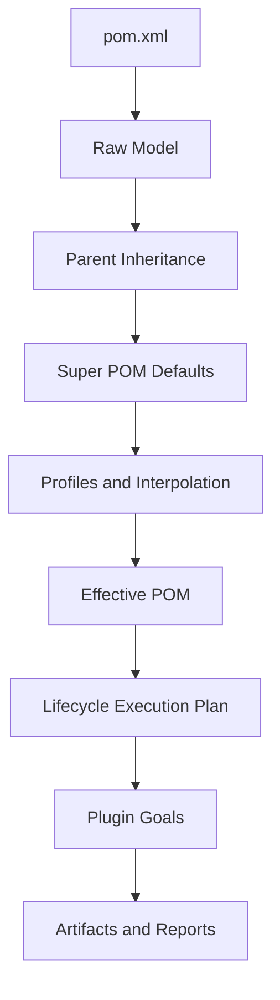
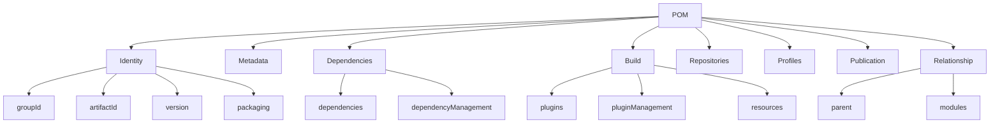
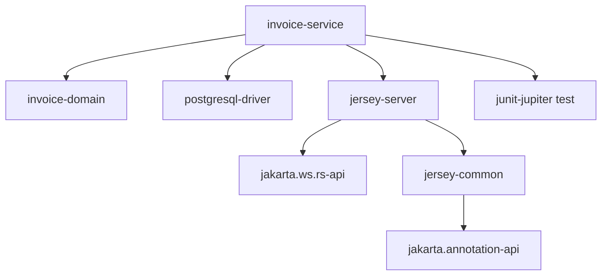
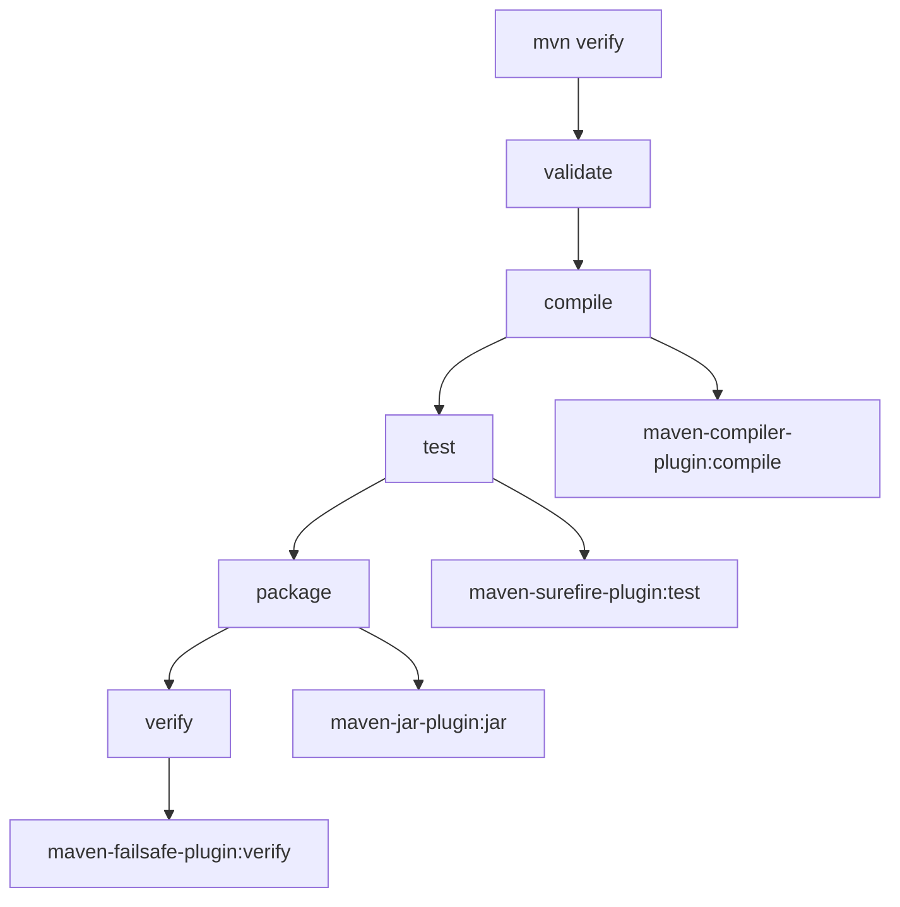
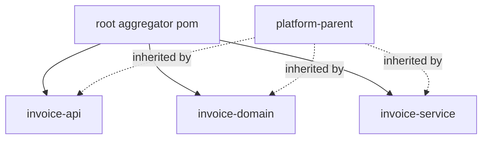

# Part 003 — The POM Mental Model

Maven terlihat seperti tool command line:

```bash
mvn clean install
```

Tapi pusat Maven bukan command. Pusatnya adalah **POM**.

POM adalah **Project Object Model**: representasi XML dari sebuah Maven project. Di Maven, project bukan hanya folder berisi source code. Project adalah unit yang memiliki identitas, dependencies, lifecycle behavior, metadata, build rules, publication metadata, dan relasi dengan project lain.

Mental model yang harus kamu pegang:

> `pom.xml` adalah kontrak build yang menjelaskan artifact apa yang sedang dibuat, bagaimana artifact itu dibangun, dependency apa yang membentuk classpath-nya, plugin apa yang menjalankan lifecycle-nya, dan metadata apa yang dipublikasikan ke ekosistem Maven.

Kalau kamu melihat POM hanya sebagai file konfigurasi, kamu akan sering bingung saat build besar mulai gagal. Kalau kamu melihat POM sebagai **model deklaratif dari artifact dan graph build**, Maven akan menjadi jauh lebih mudah diprediksi.

---

## 1. POM sebagai Kontrak, Bukan Script

Banyak engineer yang datang dari shell script, Makefile, Ant, atau Gradle imperative style cenderung mencari alur seperti ini:

```text
step 1: compile
step 2: copy file
step 3: run test
step 4: package
```

Maven tidak didesain dengan gaya utama seperti itu.

Maven bertanya:

```text
Project ini artifact apa?
Packaging-nya apa?
Dependencies-nya apa?
Lifecycle phase apa yang diminta?
Plugin goal apa yang terikat ke phase itu?
Konfigurasi finalnya seperti apa setelah inheritance, profile, dan default diterapkan?
```

Dengan kata lain, Maven bukan terutama menjalankan script. Maven membangun **effective model**, lalu mengeksekusi lifecycle berdasarkan model itu.

Diagram mentalnya:



Konsekuensinya besar:

- Mengubah POM berarti mengubah model project.
- Build failure sering bukan karena command salah, tapi karena effective model salah.
- Dependency conflict bukan masalah satu dependency, tapi masalah graph.
- Plugin behavior sering berasal dari default binding, parent POM, pluginManagement, atau profile aktif.

Maven senior-level bukan hafal semua tag XML. Maven senior-level adalah mampu menjawab:

> Nilai final yang dipakai Maven berasal dari mana?

---

## 2. Struktur Besar POM

POM memiliki banyak elemen, tapi secara mental bisa dipetakan menjadi beberapa zona:



Kita akan bahas masing-masing bukan sebagai tag, tapi sebagai tanggung jawab.

---

## 3. Identity: Artifact Ini Siapa?

Empat elemen paling mendasar:

```xml
<groupId>com.acme.billing</groupId>
<artifactId>invoice-service</artifactId>
<version>1.8.3</version>
<packaging>jar</packaging>
```

Ini bukan formalitas. Ini adalah identitas artifact di ecosystem Maven.

Secara lengkap, artifact biasanya dikenali oleh koordinat:

```text
groupId:artifactId:version[:packaging][:classifier]
```

Contoh:

```text
com.acme.billing:invoice-service:1.8.3
com.acme.billing:invoice-api:jar:1.8.3
com.acme.billing:invoice-client:jar:sources:1.8.3
```

Identity menentukan:

- nama artifact di local repository,
- nama artifact di remote repository,
- cara project lain mereferensikan artifact ini,
- path metadata Maven,
- dependency resolution,
- release/promotion strategy,
- version governance.

Local repository path biasanya mengikuti pola:

```text
~/.m2/repository/com/acme/billing/invoice-service/1.8.3/invoice-service-1.8.3.jar
```

Jadi saat kamu menulis POM, kamu tidak hanya memberi nama project. Kamu sedang mendaftarkan artifact ke sistem koordinat global organisasi.

### 3.1 `groupId`

`groupId` adalah namespace organisasi/domain. Untuk enterprise, `groupId` harus stabil, bukan mengikuti struktur team yang cepat berubah.

Kurang baik:

```xml
<groupId>com.acme.team-alpha</groupId>
```

Lebih baik:

```xml
<groupId>com.acme.billing</groupId>
```

Atau untuk platform shared:

```xml
<groupId>com.acme.platform.messaging</groupId>
```

Kenapa?

Karena artifact bisa hidup lebih lama daripada struktur organisasi. Team bisa merge, rename, rotate. Artifact identity seharusnya tidak sering berubah.

### 3.2 `artifactId`

`artifactId` adalah nama artifact spesifik.

Untuk service:

```xml
<artifactId>invoice-service</artifactId>
```

Untuk API contract:

```xml
<artifactId>invoice-api</artifactId>
```

Untuk client library:

```xml
<artifactId>invoice-client</artifactId>
```

Untuk BOM:

```xml
<artifactId>billing-bom</artifactId>
```

Untuk parent:

```xml
<artifactId>billing-parent</artifactId>
```

Nama artifact sebaiknya menjelaskan bentuk artifact, bukan hanya domain.

Kurang jelas:

```xml
<artifactId>invoice</artifactId>
```

Lebih jelas:

```xml
<artifactId>invoice-domain</artifactId>
<artifactId>invoice-api</artifactId>
<artifactId>invoice-persistence</artifactId>
<artifactId>invoice-service</artifactId>
```

### 3.3 `version`

`version` bukan hanya nomor rilis. Dalam Maven, version mempengaruhi dependency mediation, repository metadata, snapshot resolution, dan release reproducibility.

Contoh release version:

```xml
<version>1.8.3</version>
```

Contoh snapshot version:

```xml
<version>1.8.4-SNAPSHOT</version>
```

Mental model:

```text
Release version  = immutable artifact candidate
SNAPSHOT version = mutable development stream
```

Di enterprise, memperlakukan `SNAPSHOT` seperti release adalah sumber banyak insiden:

- build yang kemarin sukses hari ini gagal,
- artifact berubah tanpa version berubah,
- cache CI menyimpan artifact lama,
- environment staging dan dev memakai bytecode berbeda walau version sama,
- rollback tidak deterministik.

Gunakan SNAPSHOT untuk inner-loop development. Gunakan release version untuk artifact yang menjadi dependency lintas team atau dipromosikan antar environment.

### 3.4 `packaging`

`packaging` menentukan jenis artifact dan default lifecycle bindings.

Contoh umum:

```xml
<packaging>jar</packaging>
<packaging>war</packaging>
<packaging>pom</packaging>
<packaging>ear</packaging>
```

`packaging` bukan sekadar extension file output. Ia mempengaruhi plugin goal default yang dijalankan Maven.

Contoh:

- `jar` akan mengikat compiler/test/jar plugin ke phase umum.
- `war` akan mengikat war packaging behavior.
- `pom` biasanya tidak menghasilkan compiled artifact; sering dipakai untuk parent, aggregator, atau BOM.

Kesalahan umum:

```xml
<packaging>jar</packaging>
<modules>
  <module>api</module>
  <module>service</module>
</modules>
```

Aggregator root yang hanya mengelola modules biasanya harus:

```xml
<packaging>pom</packaging>
```

Karena root tersebut bukan artifact runtime berupa JAR. Ia adalah build coordination artifact.

---

## 4. Metadata: Project Ini Menjelaskan Apa?

Metadata POM sering diabaikan karena build bisa jalan tanpa metadata lengkap. Tapi untuk artifact yang dipublikasikan, metadata menjadi penting.

Contoh:

```xml
<name>Invoice Service</name>
<description>Service for invoice calculation, issuance, and lifecycle transitions.</description>
<url>https://engineering.acme.internal/billing/invoice-service</url>

<licenses>
  <license>
    <name>Acme Internal Use Only</name>
    <url>https://legal.acme.internal/licenses/internal</url>
  </license>
</licenses>

<organization>
  <name>Acme Billing Platform</name>
</organization>

<developers>
  <developer>
    <id>billing-platform</id>
    <name>Billing Platform Team</name>
    <email>billing-platform@acme.example</email>
  </developer>
</developers>

<scm>
  <connection>scm:git:ssh://git.example/acme/billing/invoice-service.git</connection>
  <developerConnection>scm:git:ssh://git.example/acme/billing/invoice-service.git</developerConnection>
  <url>https://git.example/acme/billing/invoice-service</url>
  <tag>HEAD</tag>
</scm>
```

Di internal enterprise, metadata berguna untuk:

- artifact catalog,
- dependency ownership,
- SBOM,
- vulnerability response,
- license compliance,
- release traceability,
- documentation generation,
- onboarding engineer baru.

Kalau sebuah library internal dipakai 80 service, metadata owner bukan kosmetik. Saat ada CVE, breaking change, atau migration campaign, kamu butuh tahu siapa pemilik artifact itu.

---

## 5. Dependency Contract: Project Ini Butuh Apa?

Bagian dependencies mendeskripsikan library yang dibutuhkan project.

```xml
<dependencies>
  <dependency>
    <groupId>org.postgresql</groupId>
    <artifactId>postgresql</artifactId>
    <version>42.7.4</version>
  </dependency>

  <dependency>
    <groupId>org.junit.jupiter</groupId>
    <artifactId>junit-jupiter</artifactId>
    <version>5.11.0</version>
    <scope>test</scope>
  </dependency>
</dependencies>
```

Jangan melihat dependency sebagai daftar JAR. Lihat sebagai deklarasi graph.

Setiap dependency membawa kemungkinan:

- transitive dependencies,
- classpath conflict,
- version mediation,
- licensing impact,
- CVE impact,
- runtime footprint,
- binary compatibility risk,
- startup performance impact,
- shaded classes,
- duplicate classes,
- dependency hell.

Mental model dependency Maven:



Saat kamu menambah satu dependency, kamu sebenarnya mengubah graph.

Pertanyaan senior sebelum menambah dependency:

```text
Apakah dependency ini runtime atau compile only?
Apakah dependency ini membawa transitive dependency besar?
Apakah version-nya sudah dikelola BOM?
Apakah ada dependency serupa yang sudah dipakai organisasi?
Apakah dependency ini aman secara license/security?
Apakah artifact ini akan bocor ke public API?
Apakah dependency ini perlu exclusion?
```

---

## 6. `dependencyManagement`: Version Policy, Bukan Dependency Usage

Salah satu salah paham paling umum:

```xml
<dependencyManagement>
  ...
</dependencyManagement>
```

disangka sama dengan:

```xml
<dependencies>
  ...
</dependencies>
```

Padahal berbeda.

`dependencyManagement` tidak otomatis menambahkan dependency ke classpath. Ia hanya menyediakan default version, scope, atau exclusion ketika dependency tersebut benar-benar dipakai.

Contoh parent/BOM:

```xml
<dependencyManagement>
  <dependencies>
    <dependency>
      <groupId>org.postgresql</groupId>
      <artifactId>postgresql</artifactId>
      <version>42.7.4</version>
    </dependency>
  </dependencies>
</dependencyManagement>
```

Child module:

```xml
<dependencies>
  <dependency>
    <groupId>org.postgresql</groupId>
    <artifactId>postgresql</artifactId>
  </dependency>
</dependencies>
```

Child tidak perlu version karena version diatur oleh `dependencyManagement`.

Mental model:

```text
dependencyManagement = catalog / policy / alignment
dependencies        = actual usage / classpath membership
```

Kalau kamu memakai multi-module enterprise build, version dependency sebaiknya tidak tersebar di semua module. Letakkan di parent/BOM, lalu module hanya menyatakan dependency apa yang ia gunakan.

Buruk:

```text
service-a pom: jackson 2.17.1
service-b pom: jackson 2.15.4
service-c pom: jackson 2.16.0
service-d pom: jackson 2.17.1
```

Lebih baik:

```text
platform-bom: jackson 2.17.1
service-a: uses jackson-databind
service-b: uses jackson-databind
service-c: uses jackson-core
service-d: uses jackson-databind
```

Version alignment adalah governance, bukan preferensi style.

---

## 7. Build Contract: Project Ini Dibangun Bagaimana?

Bagian `build` menentukan cara Maven membangun project.

Contoh ringkas:

```xml
<build>
  <plugins>
    <plugin>
      <groupId>org.apache.maven.plugins</groupId>
      <artifactId>maven-compiler-plugin</artifactId>
      <version>3.13.0</version>
      <configuration>
        <release>21</release>
      </configuration>
    </plugin>
  </plugins>
</build>
```

Bagian `build` sering berisi:

- plugin compiler,
- plugin surefire/failsafe,
- plugin jar/war,
- plugin source/javadoc,
- code generator,
- resource filtering,
- build helper,
- enforcer,
- shade/assembly,
- deploy/release plugin,
- quality gates.

Secara mental, `build` menjawab:

```text
Ketika lifecycle mencapai phase tertentu, plugin goal apa yang harus berjalan dan dengan konfigurasi apa?
```

Diagram:



POM tidak harus menyebut semua plugin itu secara eksplisit karena Maven memiliki default lifecycle bindings berdasarkan packaging. Namun di production build, kamu biasanya harus mengunci plugin version dan mengatur behavior eksplisit untuk menghindari drift.

---

## 8. `pluginManagement`: Plugin Policy, Bukan Plugin Execution

Mirip dengan `dependencyManagement`, ada `pluginManagement`.

Contoh parent POM:

```xml
<build>
  <pluginManagement>
    <plugins>
      <plugin>
        <groupId>org.apache.maven.plugins</groupId>
        <artifactId>maven-compiler-plugin</artifactId>
        <version>3.13.0</version>
        <configuration>
          <release>21</release>
        </configuration>
      </plugin>
    </plugins>
  </pluginManagement>
</build>
```

Ini tidak selalu berarti plugin langsung dieksekusi sebagai execution tambahan. Ia menyediakan default version/configuration untuk plugin saat plugin itu dipakai oleh lifecycle binding atau dideklarasikan dalam child.

Mental model:

```text
pluginManagement = plugin version/config policy
plugins          = plugin participation in build
```

Pattern enterprise:

```xml
<build>
  <pluginManagement>
    <plugins>
      <!-- semua plugin version dikunci di parent -->
    </plugins>
  </pluginManagement>

  <plugins>
    <!-- plugin governance yang wajib jalan di semua module -->
  </plugins>
</build>
```

Contoh plugin wajib:

```xml
<plugin>
  <groupId>org.apache.maven.plugins</groupId>
  <artifactId>maven-enforcer-plugin</artifactId>
</plugin>
```

Contoh plugin policy saja:

```xml
<plugin>
  <groupId>org.apache.maven.plugins</groupId>
  <artifactId>maven-javadoc-plugin</artifactId>
  <version>3.10.0</version>
</plugin>
```

Kalau javadoc tidak selalu dibangun di local dev, version/config bisa disiapkan di `pluginManagement`, lalu CI release profile yang mengaktifkan execution-nya.

---

## 9. Parent Relationship: Project Ini Mewarisi Apa?

Parent POM dipakai untuk inheritance.

```xml
<parent>
  <groupId>com.acme.platform</groupId>
  <artifactId>platform-parent</artifactId>
  <version>7.2.0</version>
  <relativePath>../pom.xml</relativePath>
</parent>
```

Child mewarisi banyak hal dari parent:

- properties,
- dependency management,
- plugin management,
- repositories,
- build config tertentu,
- reporting config,
- profiles effects ketika aktif,
- metadata tertentu.

Parent POM menjawab:

```text
Project ini mengikuti policy build siapa?
```

Di enterprise, parent POM adalah governance mechanism. Ia bisa memaksa:

- minimum Maven version,
- minimum JDK version,
- banned dependency,
- allowed plugin version,
- compiler release,
- encoding,
- reproducible timestamp,
- dependency convergence,
- license checks,
- test execution policy.

Namun parent juga bisa menjadi sumber coupling berbahaya. Jika satu parent terlalu besar dipakai semua service, perubahan kecil bisa mempengaruhi ratusan build.

Prinsip:

> Parent POM adalah inheritance boundary. Jangan jadikan ia tempat semua keputusan organisasi tanpa versioning dan release discipline.

---

## 10. Aggregation: Project Ini Mengorkestrasi Module Apa?

Aggregation memakai elemen `modules`.

```xml
<modules>
  <module>invoice-api</module>
  <module>invoice-domain</module>
  <module>invoice-persistence</module>
  <module>invoice-service</module>
</modules>
```

Aggregation menjawab:

```text
Ketika build dijalankan dari root ini, subproject apa yang ikut dibangun dalam reactor?
```

Inheritance dan aggregation sering digabung, tapi secara konsep berbeda.



Satu POM bisa menjadi parent sekaligus aggregator, tapi tidak wajib.

Pattern umum kecil:

```text
root pom = parent + aggregator
```

Pattern enterprise lebih bersih:

```text
platform-parent   = inheritance policy
billing-bom       = dependency version alignment
invoice-root      = aggregation for this repo
invoice-service   = deployable runtime artifact
```

Kita akan bahas detail multi-module di part berikutnya, tapi untuk POM mental model kamu harus sudah membedakan:

```text
parent  = inheritance
modules = aggregation/reactor
```

---

## 11. Properties: Variable atau Policy Surface?

Properties tampak seperti variable:

```xml
<properties>
  <java.version>21</java.version>
  <project.build.sourceEncoding>UTF-8</project.build.sourceEncoding>
  <maven.compiler.release>${java.version}</maven.compiler.release>
</properties>
```

Tapi dalam Maven enterprise, properties adalah **policy surface**.

Ia bisa dipakai untuk:

- Java release version,
- dependency version,
- plugin parameter,
- encoding,
- reproducible timestamp,
- generated source location,
- test skip flag,
- CI-friendly version variable.

Contoh:

```xml
<properties>
  <revision>1.8.3</revision>
  <changelist>-SNAPSHOT</changelist>
  <java.version>21</java.version>
  <jackson.version>2.17.1</jackson.version>
</properties>
```

Namun properties juga bisa membuat POM opaque.

Buruk:

```xml
<properties>
  <x>21</x>
  <v1>2.17.1</v1>
  <skip>true</skip>
</properties>
```

Lebih baik:

```xml
<properties>
  <java.release>21</java.release>
  <jackson.version>2.17.1</jackson.version>
  <skip.integration.tests>false</skip.integration.tests>
</properties>
```

Rule praktis:

> Nama property harus menjelaskan policy yang dikendalikan, bukan hanya nilai yang disimpan.

---

## 12. Repositories: Artifact Diambil dari Mana?

POM bisa mendeklarasikan repositories:

```xml
<repositories>
  <repository>
    <id>internal-releases</id>
    <url>https://repo.acme.example/maven/releases</url>
    <releases>
      <enabled>true</enabled>
    </releases>
    <snapshots>
      <enabled>false</enabled>
    </snapshots>
  </repository>
</repositories>
```

Namun di enterprise, repository declaration sering lebih baik dikendalikan lewat `settings.xml` dan repository manager, bukan tersebar di semua POM.

Kenapa?

Karena repository adalah trust boundary.

Jika setiap project bebas menambah repository:

- dependency bisa datang dari sumber yang tidak diaudit,
- build bisa bocor ke internet,
- resolusi artifact tidak konsisten,
- supply-chain risk meningkat,
- CI dan local dev berbeda.

Pattern yang lebih baik:

```text
Developer/CI Maven settings.xml
        ↓
Corporate repository manager mirror
        ↓
Approved upstream repositories
```

POM idealnya tidak perlu tahu semua detail repository enterprise. Ia cukup mendeklarasikan artifact yang dibutuhkan; organisasi mengatur dari mana artifact disediakan.

---

## 13. Distribution Management: Artifact Dipublikasikan ke Mana?

Kalau `repositories` menjawab “download dari mana”, `distributionManagement` menjawab “publish ke mana”.

Contoh:

```xml
<distributionManagement>
  <repository>
    <id>internal-releases</id>
    <url>https://repo.acme.example/maven/releases</url>
  </repository>
  <snapshotRepository>
    <id>internal-snapshots</id>
    <url>https://repo.acme.example/maven/snapshots</url>
  </snapshotRepository>
</distributionManagement>
```

Ini dipakai oleh phase/goal deploy.

Mental model:

```text
install = publish to local repository
 deploy = publish to remote repository
```

Di production, `distributionManagement` bukan detail teknis. Ia bagian dari release governance.

Pertanyaan yang harus dijawab:

- Apakah artifact ini boleh dipublish?
- Ke repository mana release artifact masuk?
- Ke repository mana snapshot artifact masuk?
- Siapa yang punya credential deploy?
- Apakah deploy hanya boleh dari CI?
- Apakah artifact harus melewati staging/promotion?

---

## 14. Profiles: Model Variants yang Harus Dibatasi

Profiles memungkinkan POM berubah berdasarkan kondisi.

```xml
<profiles>
  <profile>
    <id>ci</id>
    <properties>
      <skip.integration.tests>false</skip.integration.tests>
    </properties>
  </profile>
</profiles>
```

Profiles berguna, tapi berbahaya jika menjadi cara utama mengubah behavior build.

Anti-pattern:

```bash
mvn clean package -Pdev
mvn clean package -Ptest
mvn clean package -Pstaging
mvn clean package -Pprod
```

Jika output artifact berbeda per environment, kamu berisiko kehilangan reproducibility.

Build artifact idealnya sama. Runtime config yang berbeda sebaiknya datang dari environment/config management, bukan dari build profile yang menghasilkan bytecode/resource berbeda.

Profile cocok untuk:

- local developer convenience,
- optional reporting,
- release signing,
- CI-only verification,
- platform-specific native configuration,
- temporary migration path.

Profile berbahaya untuk:

- memilih dependency production vs staging,
- memasukkan secret,
- mengubah source behavior secara diam-diam,
- menonaktifkan test default,
- menghasilkan artifact berbeda dengan version sama.

Rule:

> Profile boleh mengubah proses build, tapi harus sangat hati-hati jika mengubah isi artifact runtime.

---

## 15. POM sebagai Public API

Untuk application internal yang tidak dikonsumsi project lain, POM sering dianggap internal. Tapi untuk library, BOM, parent, plugin, atau shared contract, POM adalah bagian dari public API.

Saat artifact dipublish, POM ikut dipublish. Consumer akan membaca metadata dependency dari POM tersebut.

Contoh library:

```xml
<dependency>
  <groupId>com.acme.platform</groupId>
  <artifactId>acme-observability-core</artifactId>
  <version>3.4.0</version>
</dependency>
```

Jika POM library ini mendeklarasikan dependency secara salah, consumer ikut terkena.

Contoh kesalahan:

```xml
<dependency>
  <groupId>org.slf4j</groupId>
  <artifactId>slf4j-simple</artifactId>
  <version>2.0.13</version>
</dependency>
```

Library observability tidak seharusnya memaksakan binding logging runtime ke semua consumer. Biasanya ia cukup bergantung ke API:

```xml
<dependency>
  <groupId>org.slf4j</groupId>
  <artifactId>slf4j-api</artifactId>
</dependency>
```

Binding logging dipilih application.

Mental model:

```text
Library POM affects consumer classpath.
Application POM mostly affects its own runtime artifact.
Parent/BOM POM affects organizational policy.
Plugin POM affects build-time extension behavior.
```

Jadi desain POM harus disesuaikan dengan tipe artifact.

---

## 16. Empat Tipe POM yang Sering Tertukar

Dalam enterprise Maven, setidaknya ada empat tipe POM penting.

### 16.1 Application POM

Menghasilkan deployable artifact.

```text
invoice-service/pom.xml
packaging: jar atau war
```

Fokus:

- runtime dependencies,
- packaging,
- test execution,
- container/deployment metadata,
- application-specific plugin config.

### 16.2 Library POM

Menghasilkan artifact yang dikonsumsi project lain.

```text
invoice-client/pom.xml
packaging: jar
```

Fokus:

- clean dependency surface,
- minimal transitive dependencies,
- binary compatibility,
- source/javadoc artifacts,
- semantic versioning.

### 16.3 Parent POM

Mengatur inheritance/policy.

```text
platform-parent/pom.xml
packaging: pom
```

Fokus:

- plugin management,
- dependency management,
- common properties,
- enforcer rules,
- build conventions.

### 16.4 BOM POM

Mengatur dependency version alignment.

```text
platform-bom/pom.xml
packaging: pom
```

Fokus:

- dependency versions,
- dependency scopes/exclusions jika perlu,
- importable dependency management,
- no build side effects.

Parent dan BOM sebaiknya tidak selalu digabung. BOM di-import oleh consumer tanpa mewarisi build behavior. Parent diwarisi oleh project yang ingin mengikuti build policy.

---

## 17. Good POM Design: Minimum Explicitness yang Tepat

Ada dua ekstrem buruk.

Ekstrem pertama: POM terlalu implicit.

```xml
<project>
  <modelVersion>4.0.0</modelVersion>
  <groupId>com.acme</groupId>
  <artifactId>service</artifactId>
  <version>1.0-SNAPSHOT</version>
</project>
```

Build mungkin jalan, tapi terlalu banyak bergantung pada default tersembunyi.

Ekstrem kedua: POM terlalu verbose.

```xml
<!-- Semua plugin, semua phase, semua path, semua default ditulis ulang -->
```

Build menjadi sulit dibaca karena noise.

POM bagus punya explicitness yang tepat:

- identity jelas,
- packaging tepat,
- dependency usage jelas,
- version dependency tidak tersebar,
- plugin version dikunci di parent/pluginManagement,
- plugin execution hanya ditulis jika ada alasan,
- profile minimal,
- property meaningful,
- repository tidak liar,
- artifact publication jelas.

Rule:

> Explicit untuk policy dan risk. Biarkan convention bekerja untuk hal yang benar-benar standar.

---

## 18. POM Review Checklist

Gunakan checklist ini saat mereview POM production.

### Identity

```text
[ ] groupId stabil dan sesuai domain/platform
[ ] artifactId jelas menggambarkan artifact
[ ] version strategy konsisten
[ ] packaging sesuai peran artifact
```

### Dependencies

```text
[ ] dependency version tidak tersebar sembarangan
[ ] scope benar
[ ] dependency test tidak bocor ke runtime
[ ] dependency provided tidak salah dipakai
[ ] transitive dependency besar dipahami
[ ] exclusion punya alasan
[ ] dependency publik library minimal
```

### Build

```text
[ ] plugin version dikunci
[ ] compiler release jelas
[ ] test plugin behavior eksplisit
[ ] generated source path jelas
[ ] resource filtering tidak membocorkan secret
[ ] quality/security checks ada di phase yang tepat
```

### Parent/BOM

```text
[ ] parent dipakai untuk build policy
[ ] BOM dipakai untuk version alignment
[ ] parent tidak menjadi tempat semua hal tanpa boundary
[ ] child tidak override policy tanpa alasan
```

### Repository/Release

```text
[ ] repository source dikendalikan enterprise
[ ] distribution management jelas
[ ] snapshot/release dipisah
[ ] deploy credential tidak berada di POM
```

### Reproducibility

```text
[ ] plugin version tidak floating
[ ] dependency version tidak floating
[ ] build tidak bergantung pada profile implisit berbahaya
[ ] artifact sama untuk environment berbeda
[ ] timestamp/output nondeterminism dikendalikan jika perlu
```

---

## 19. Diagnostic Commands untuk Memahami POM

POM yang kamu tulis bukan selalu POM yang Maven pakai. Maven memakai effective POM.

Perintah penting:

```bash
mvn help:effective-pom
```

Dengan asal-usul elemen:

```bash
mvn help:effective-pom -Dverbose
```

Melihat effective settings:

```bash
mvn help:effective-settings
```

Melihat dependency tree:

```bash
mvn dependency:tree
```

Melihat dependency tree untuk scope tertentu:

```bash
mvn dependency:tree -Dscope=runtime
```

Melihat plugin configuration help:

```bash
mvn help:describe -Dplugin=compiler -Ddetail
```

Melihat active profiles:

```bash
mvn help:active-profiles
```

Debug penuh:

```bash
mvn -X verify
```

Untuk engineer senior, command-command ini bukan troubleshooting tambahan. Ini alat baca model.

---

## 20. Studi Kasus: POM yang Tampak Benar tapi Rapuh

Misalkan ada service:

```xml
<project xmlns="http://maven.apache.org/POM/4.0.0"
         xmlns:xsi="http://www.w3.org/2001/XMLSchema-instance"
         xsi:schemaLocation="http://maven.apache.org/POM/4.0.0 https://maven.apache.org/xsd/maven-4.0.0.xsd">
  <modelVersion>4.0.0</modelVersion>

  <groupId>com.acme</groupId>
  <artifactId>invoice</artifactId>
  <version>1.0-SNAPSHOT</version>

  <dependencies>
    <dependency>
      <groupId>com.fasterxml.jackson.core</groupId>
      <artifactId>jackson-databind</artifactId>
      <version>2.15.0</version>
    </dependency>
    <dependency>
      <groupId>org.junit.jupiter</groupId>
      <artifactId>junit-jupiter</artifactId>
      <version>5.9.0</version>
    </dependency>
  </dependencies>
</project>
```

Build mungkin jalan. Tapi secara enterprise, POM ini punya masalah:

1. `groupId` terlalu umum.
2. `artifactId` ambigu.
3. Java version tidak dikontrol.
4. Plugin version tidak dikunci.
5. JUnit tidak diberi `test` scope, sehingga bisa bocor ke runtime/compile classpath.
6. Dependency version tersebar lokal.
7. Tidak ada parent/BOM policy.
8. Tidak ada enforcer.
9. Tidak ada release/repository strategy.
10. Snapshot mungkin dipakai terus tanpa release discipline.

Versi lebih baik:

```xml
<project xmlns="http://maven.apache.org/POM/4.0.0"
         xmlns:xsi="http://www.w3.org/2001/XMLSchema-instance"
         xsi:schemaLocation="http://maven.apache.org/POM/4.0.0 https://maven.apache.org/xsd/maven-4.0.0.xsd">
  <modelVersion>4.0.0</modelVersion>

  <parent>
    <groupId>com.acme.platform</groupId>
    <artifactId>platform-service-parent</artifactId>
    <version>7.2.0</version>
  </parent>

  <groupId>com.acme.billing</groupId>
  <artifactId>invoice-service</artifactId>
  <version>${revision}${changelist}</version>
  <packaging>jar</packaging>

  <name>Invoice Service</name>
  <description>Billing service responsible for invoice lifecycle operations.</description>

  <dependencies>
    <dependency>
      <groupId>com.fasterxml.jackson.core</groupId>
      <artifactId>jackson-databind</artifactId>
    </dependency>

    <dependency>
      <groupId>org.junit.jupiter</groupId>
      <artifactId>junit-jupiter</artifactId>
      <scope>test</scope>
    </dependency>
  </dependencies>
</project>
```

Versi ini belum lengkap, tapi lebih sehat karena version policy dan build policy didelegasikan ke parent/BOM.

---

## 21. POM Smells

Berikut smell yang harus langsung membuatmu curiga.

### 21.1 Version Dependency Bertebaran

```xml
<version>...</version>
```

muncul di puluhan module untuk dependency yang sama.

Risiko:

- dependency convergence sulit,
- upgrade campaign mahal,
- classpath conflict,
- security patch lambat.

### 21.2 Plugin Tanpa Version

```xml
<plugin>
  <artifactId>maven-compiler-plugin</artifactId>
</plugin>
```

Risiko:

- build behavior berubah saat default/plugin resolution berubah,
- local dan CI berbeda,
- future Maven version memberi warning/error.

### 21.3 Profile Environment Menghasilkan Artifact Berbeda

```bash
-Pdev
-Pprod
```

Risiko:

- artifact tidak immutable,
- impossible rollback,
- prod bug tidak bisa direproduksi dari artifact staging.

### 21.4 Parent Terlalu Gemuk

Satu parent mengatur semua jenis project:

```text
web app, CLI, library, batch job, plugin, BOM, generated contracts
```

Risiko:

- build lambat,
- config conflict,
- perubahan parent blast radius besar,
- child banyak override.

### 21.5 Exclusion Tanpa Komentar

```xml
<exclusions>
  <exclusion>
    <groupId>...</groupId>
    <artifactId>...</artifactId>
  </exclusion>
</exclusions>
```

Risiko:

- dependency hilang secara tidak jelas,
- runtime `ClassNotFoundException`,
- engineer berikutnya tidak tahu alasan.

Tambahkan komentar jika exclusion bukan obvious.

---

## 22. Production Mental Model

Saat kamu melihat POM, jangan mulai dari XML. Mulai dari pertanyaan.

```text
1. Artifact apa yang dibuat?
2. Siapa consumer artifact ini?
3. Policy build diwarisi dari mana?
4. Dependency graph dikendalikan oleh siapa?
5. Plugin execution berasal dari mana?
6. Artifact dipublish ke mana?
7. Build output deterministik atau tidak?
8. Apa yang berubah antara local dan CI?
9. Apa yang berubah antara snapshot dan release?
10. Bagaimana cara membuktikan effective model-nya?
```

Itulah cara membaca POM seperti engineer senior.

---

## 23. Latihan Praktis

Ambil satu project Maven nyata di mesinmu. Jangan ubah apa pun dulu.

Jalankan:

```bash
mvn help:effective-pom -Dverbose > effective-pom.xml
mvn help:active-profiles
mvn dependency:tree > dependency-tree.txt
mvn help:effective-settings > effective-settings.xml
```

Lalu jawab:

```text
1. Dari mana compiler plugin version berasal?
2. Dari mana Java release/source/target berasal?
3. Dependency mana yang version-nya diwarisi dari dependencyManagement?
4. Dependency mana yang version-nya ditulis langsung?
5. Repositories apa yang terlihat di effective POM/settings?
6. Profiles apa yang aktif tanpa kamu sadari?
7. Plugin apa yang jalan karena default lifecycle binding?
8. Apakah ada dependency test tanpa scope test?
9. Apakah ada dependency runtime yang harusnya provided?
10. Apakah artifact ini application, library, parent, atau BOM?
```

Kalau kamu bisa menjawab itu, kamu tidak lagi hanya “menjalankan Maven”. Kamu mulai membaca model Maven.

---

## 24. Ringkasan

POM adalah pusat Maven.

Bukan karena semua tag XML penting, tapi karena POM adalah model deklaratif yang mengikat:

- artifact identity,
- dependency graph,
- build lifecycle behavior,
- plugin configuration,
- inheritance policy,
- module aggregation,
- repository resolution,
- publication metadata,
- release governance.

Mental model utama:

```text
Raw POM + parent + super POM + profiles + interpolation + defaults = effective POM
Effective POM + requested lifecycle phase = build execution plan
Build execution plan + dependency graph + repositories = artifact output
```

Jika kamu memahami POM seperti ini, Maven berubah dari tool yang “kadang misterius” menjadi sistem yang bisa dibaca, diprediksi, dan dikendalikan.

---

## References

- Apache Maven — POM Reference: https://maven.apache.org/pom.html
- Apache Maven — Introduction to the POM: https://maven.apache.org/guides/introduction/introduction-to-the-pom.html
- Apache Maven — Introduction to the Build Lifecycle: https://maven.apache.org/guides/introduction/introduction-to-the-lifecycle.html
- Apache Maven — Introduction to the Dependency Mechanism: https://maven.apache.org/guides/introduction/introduction-to-dependency-mechanism.html
- Apache Maven Help Plugin — `help:effective-pom`: https://maven.apache.org/plugins/maven-help-plugin/effective-pom-mojo.html
