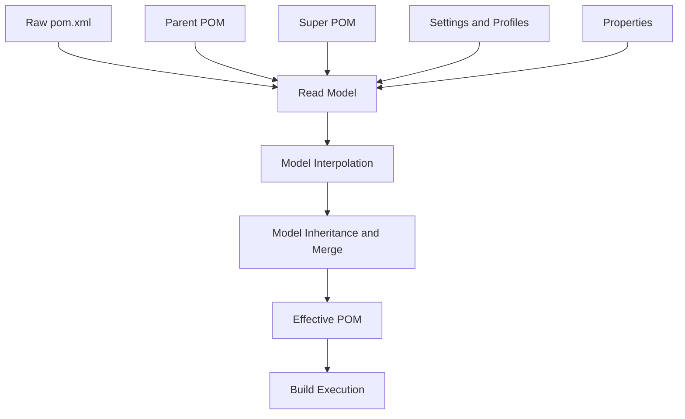
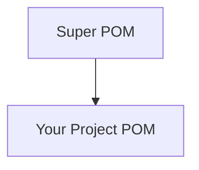
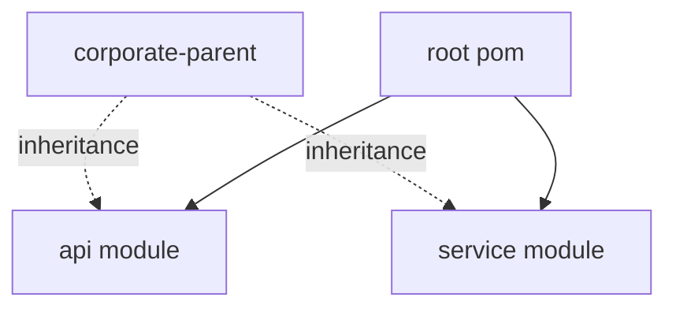
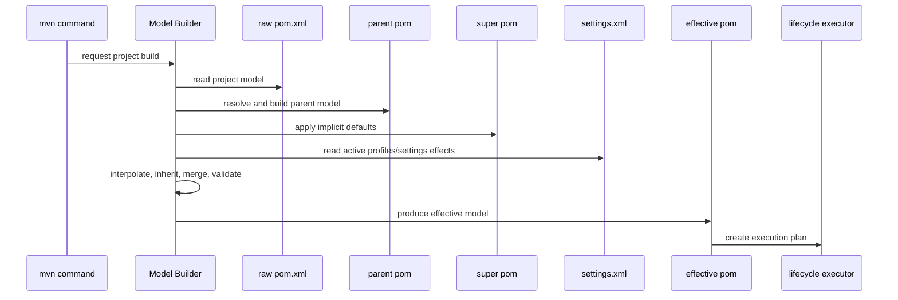
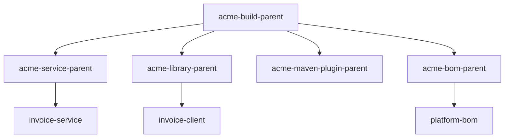

# Part 004 — Effective POM, Super POM, and Inheritance

Di Maven, file yang kamu tulis bukan satu-satunya file yang Maven pakai.

Kamu menulis:

```text
pom.xml
```

Maven mengeksekusi:

```text
effective POM
```

Perbedaan ini adalah sumber banyak kebingungan.

Engineer junior sering bertanya:

```text
Kenapa plugin ini jalan padahal tidak ada di pom.xml?
Kenapa dependency version ini muncul padahal tidak saya tulis?
Kenapa repository ini dipakai?
Kenapa Java source level berubah di CI?
Kenapa child module mewarisi config yang tidak terlihat?
```

Jawabannya hampir selalu ada di effective model.

Mental model utama:

> Maven tidak mengeksekusi raw POM secara langsung. Maven membangun model final dari raw POM, parent POM, Super POM, active profiles, properties, interpolation, defaults, dan inheritance rules. Model final itulah effective POM.

---

## 1. Raw POM vs Effective POM

Raw POM adalah file `pom.xml` yang kamu lihat di repository.

Contoh:

```xml
<project xmlns="http://maven.apache.org/POM/4.0.0"
         xmlns:xsi="http://www.w3.org/2001/XMLSchema-instance"
         xsi:schemaLocation="http://maven.apache.org/POM/4.0.0 https://maven.apache.org/xsd/maven-4.0.0.xsd">
  <modelVersion>4.0.0</modelVersion>

  <groupId>com.acme.billing</groupId>
  <artifactId>invoice-service</artifactId>
  <version>1.0.0-SNAPSHOT</version>
</project>
```

Effective POM adalah model lengkap setelah Maven menambahkan default dan inheritance.

Kamu bisa melihatnya dengan:

```bash
mvn help:effective-pom
```

Lebih berguna lagi:

```bash
mvn help:effective-pom -Dverbose
```

Mode verbose menambahkan komentar asal-usul elemen sehingga kamu bisa tahu konfigurasi berasal dari POM mana.

Secara sederhana:



Kesalahan umum adalah menganggap raw POM sebagai truth. Dalam Maven, truth operasional adalah effective POM.

---

## 2. Kenapa Effective POM Ada?

Maven ingin project kecil bisa dibangun dengan konfigurasi minimal.

Misalnya project sederhana:

```xml
<project xmlns="http://maven.apache.org/POM/4.0.0"
         xmlns:xsi="http://www.w3.org/2001/XMLSchema-instance"
         xsi:schemaLocation="http://maven.apache.org/POM/4.0.0 https://maven.apache.org/xsd/maven-4.0.0.xsd">
  <modelVersion>4.0.0</modelVersion>
  <groupId>com.example</groupId>
  <artifactId>demo</artifactId>
  <version>1.0-SNAPSHOT</version>
</project>
```

Kamu tetap bisa menjalankan:

```bash
mvn test
```

Kenapa?

Karena Maven punya default:

- source directory,
- test source directory,
- output directory,
- resource directory,
- lifecycle bindings,
- default repository,
- plugin behavior tertentu berdasarkan packaging.

Default itu tidak terlihat di raw POM, tapi terlihat di effective POM.

Maven memakai effective POM agar:

- project kecil tidak perlu verbose,
- convention-over-configuration bekerja,
- parent bisa menyebarkan policy,
- plugin bisa punya default configuration,
- lifecycle bisa dieksekusi konsisten.

Namun ada trade-off: konfigurasi bisa tersembunyi.

Itulah kenapa engineer senior harus nyaman membaca effective POM.

---

## 3. Super POM: Parent Tersembunyi Semua Project

Semua Maven POM secara implisit mewarisi dari **Super POM**.

Super POM menyediakan default global Maven seperti:

- repository `central`,
- plugin repository,
- default build directories,
- source/resource directories,
- reporting output directory,
- beberapa default plugin management historis.

Meskipun kamu tidak menulis parent, POM kamu tetap punya parent konseptual:



Contoh default yang biasanya kamu rasakan:

```text
src/main/java
src/main/resources
src/test/java
src/test/resources
target/classes
target/test-classes
target/site
```

Itulah sebabnya Maven project bisa punya layout standar tanpa kamu menulis konfigurasi path.

Super POM juga menjelaskan kenapa Maven tahu Maven Central. Repository central bukan muncul dari udara. Ia adalah bagian dari default model Maven, walau di enterprise biasanya diarahkan ulang lewat mirror di `settings.xml`.

Rule:

> Jika sesuatu terjadi tanpa kamu tulis di POM, curigai Super POM, default lifecycle binding, plugin default, parent POM, atau active profile.

---

## 4. Parent POM: Inheritance yang Disengaja

Parent POM adalah inheritance eksplisit.

Child:

```xml
<parent>
  <groupId>com.acme.platform</groupId>
  <artifactId>platform-parent</artifactId>
  <version>7.2.0</version>
  <relativePath>../pom.xml</relativePath>
</parent>
```

Parent:

```xml
<project xmlns="http://maven.apache.org/POM/4.0.0"
         xmlns:xsi="http://www.w3.org/2001/XMLSchema-instance"
         xsi:schemaLocation="http://maven.apache.org/POM/4.0.0 https://maven.apache.org/xsd/maven-4.0.0.xsd">
  <modelVersion>4.0.0</modelVersion>

  <groupId>com.acme.platform</groupId>
  <artifactId>platform-parent</artifactId>
  <version>7.2.0</version>
  <packaging>pom</packaging>

  <properties>
    <java.release>21</java.release>
    <project.build.sourceEncoding>UTF-8</project.build.sourceEncoding>
  </properties>
</project>
```

Child mewarisi properties tersebut.

Effective child kira-kira memiliki:

```xml
<properties>
  <java.release>21</java.release>
  <project.build.sourceEncoding>UTF-8</project.build.sourceEncoding>
</properties>
```

Parent POM biasanya dipakai untuk:

- standardisasi plugin version,
- standardisasi dependency version,
- Java version policy,
- encoding,
- test conventions,
- enforcer rules,
- reproducible build configuration,
- release/deploy configuration,
- reporting.

Parent POM adalah alat governance.

Tapi governance yang terlalu besar bisa berubah menjadi coupling.

---

## 5. Inheritance vs Aggregation

Ini harus jelas sejak awal.

Inheritance:

```xml
<parent>...</parent>
```

Aggregation:

```xml
<modules>
  <module>api</module>
  <module>service</module>
</modules>
```

Inheritance menjawab:

```text
POM ini mewarisi konfigurasi dari siapa?
```

Aggregation menjawab:

```text
Ketika build dari root, module apa yang ikut dibangun?
```

Diagram:



Satu root POM bisa menjadi parent sekaligus aggregator:

```xml
<packaging>pom</packaging>

<modules>
  <module>api</module>
  <module>service</module>
</modules>
```

Child:

```xml
<parent>
  <groupId>com.acme.billing</groupId>
  <artifactId>invoice-root</artifactId>
  <version>1.0.0-SNAPSHOT</version>
  <relativePath>../pom.xml</relativePath>
</parent>
```

Ini valid dan umum.

Namun pada skala enterprise, sering lebih bersih memisahkan:

```text
corporate-parent  = reusable inheritance policy
platform-bom      = dependency version alignment
repo-root         = aggregation only for this repository
module-pom        = actual artifact
```

Kenapa?

Karena aggregator mengikuti struktur repository, sementara parent mengikuti policy organisasi. Keduanya berubah dengan alasan berbeda.

---

## 6. Apa Saja yang Diwarisi?

Tidak semua elemen POM diwarisi dengan cara yang sama, tapi secara praktis child bisa menerima banyak konfigurasi dari parent.

Yang umum diwarisi atau berpengaruh besar:

```text
properties
dependencyManagement
dependencies
pluginManagement
plugins
repositories
pluginRepositories
build configuration
reporting
distributionManagement
profiles effects when active
```

Yang sering membingungkan:

- `dependencies` di parent bisa menjadi dependency child juga.
- `dependencyManagement` hanya mengatur version/scope default, tidak menambahkan dependency otomatis.
- `pluginManagement` mengatur plugin default, tidak selalu membuat plugin execution baru.
- `plugins` di parent bisa membuat plugin ikut berjalan di child jika inherited.
- Profile definition sendiri tidak diwarisi secara sederhana; effects dari active profile yang masuk ke model bisa berpengaruh.

Karena detail merge bisa rumit, jangan bergantung pada tebakan. Gunakan effective POM.

---

## 7. `dependencyManagement` dalam Inheritance

Parent:

```xml
<dependencyManagement>
  <dependencies>
    <dependency>
      <groupId>com.fasterxml.jackson.core</groupId>
      <artifactId>jackson-databind</artifactId>
      <version>2.17.1</version>
    </dependency>
  </dependencies>
</dependencyManagement>
```

Child:

```xml
<dependencies>
  <dependency>
    <groupId>com.fasterxml.jackson.core</groupId>
    <artifactId>jackson-databind</artifactId>
  </dependency>
</dependencies>
```

Effective child menggunakan version dari parent.

Ini bagus.

Tapi jika child menulis version sendiri:

```xml
<dependency>
  <groupId>com.fasterxml.jackson.core</groupId>
  <artifactId>jackson-databind</artifactId>
  <version>2.15.0</version>
</dependency>
```

Child override policy parent.

Kadang perlu, tapi harus jarang dan eksplisit.

Pattern sehat:

```text
Parent/BOM owns versions.
Child owns usage.
```

Jangan meletakkan semua dependency umum di parent `dependencies`, karena semua child akan mendapat dependency itu walaupun tidak memakai.

Buruk:

```xml
<!-- parent pom -->
<dependencies>
  <dependency>
    <groupId>org.postgresql</groupId>
    <artifactId>postgresql</artifactId>
    <version>42.7.4</version>
  </dependency>
</dependencies>
```

Jika parent dipakai oleh module API murni, module API juga mendapat PostgreSQL driver. Itu classpath pollution.

Lebih baik:

```xml
<!-- parent pom -->
<dependencyManagement>
  <dependencies>
    <dependency>
      <groupId>org.postgresql</groupId>
      <artifactId>postgresql</artifactId>
      <version>42.7.4</version>
    </dependency>
  </dependencies>
</dependencyManagement>
```

Lalu hanya persistence module yang memakai:

```xml
<dependencies>
  <dependency>
    <groupId>org.postgresql</groupId>
    <artifactId>postgresql</artifactId>
  </dependency>
</dependencies>
```

---

## 8. `pluginManagement` dalam Inheritance

Parent:

```xml
<build>
  <pluginManagement>
    <plugins>
      <plugin>
        <groupId>org.apache.maven.plugins</groupId>
        <artifactId>maven-compiler-plugin</artifactId>
        <version>3.13.0</version>
        <configuration>
          <release>${java.release}</release>
        </configuration>
      </plugin>
    </plugins>
  </pluginManagement>
</build>
```

Child dengan packaging `jar` tidak perlu menulis compiler plugin agar default lifecycle memakai compiler plugin. Namun plugin version/config dari `pluginManagement` dapat dipakai saat plugin tersebut resolved.

Jika child butuh konfigurasi tambahan:

```xml
<build>
  <plugins>
    <plugin>
      <groupId>org.apache.maven.plugins</groupId>
      <artifactId>maven-compiler-plugin</artifactId>
      <configuration>
        <showWarnings>true</showWarnings>
      </configuration>
    </plugin>
  </plugins>
</build>
```

Version tetap dari parent.

Mental model:

```text
pluginManagement = default plugin catalog/config
plugins          = plugin participating in this build
```

Jangan ulangi version plugin di semua child.

Buruk:

```text
module-a: compiler plugin 3.11.0
module-b: compiler plugin 3.13.0
module-c: compiler plugin no version
```

Baik:

```text
parent pluginManagement: compiler plugin 3.13.0
child modules: no version, only usage-specific config if needed
```

---

## 9. Plugin Inheritance dan `<inherited>false</inherited>`

Plugin configuration di parent biasanya diwariskan.

Contoh parent:

```xml
<build>
  <plugins>
    <plugin>
      <groupId>org.apache.maven.plugins</groupId>
      <artifactId>maven-enforcer-plugin</artifactId>
      <executions>
        <execution>
          <id>enforce-build-rules</id>
          <goals>
            <goal>enforce</goal>
          </goals>
          <configuration>
            <rules>
              <requireMavenVersion>
                <version>[3.9.0,)</version>
              </requireMavenVersion>
            </rules>
          </configuration>
        </execution>
      </executions>
    </plugin>
  </plugins>
</build>
```

Semua child akan menjalankan enforcer.

Kadang kamu ingin plugin hanya berjalan di parent, bukan child. Gunakan:

```xml
<inherited>false</inherited>
```

Contoh:

```xml
<plugin>
  <groupId>org.apache.maven.plugins</groupId>
  <artifactId>maven-deploy-plugin</artifactId>
  <inherited>false</inherited>
</plugin>
```

Gunakan dengan hati-hati.

Jika terlalu sering memakai `<inherited>false</inherited>`, mungkin parent POM kamu terlalu banyak melakukan hal yang bukan policy umum.

---

## 10. Merge Semantics: Kenapa Konfigurasi Bisa Tercampur?

Saat child dan parent sama-sama punya konfigurasi plugin, Maven perlu menggabungkannya.

Parent:

```xml
<plugin>
  <groupId>org.apache.maven.plugins</groupId>
  <artifactId>maven-surefire-plugin</artifactId>
  <configuration>
    <failIfNoTests>false</failIfNoTests>
    <argLine>-Dfile.encoding=UTF-8</argLine>
  </configuration>
</plugin>
```

Child:

```xml
<plugin>
  <groupId>org.apache.maven.plugins</groupId>
  <artifactId>maven-surefire-plugin</artifactId>
  <configuration>
    <includes>
      <include>**/*Test.java</include>
    </includes>
  </configuration>
</plugin>
```

Effective config bisa berisi gabungan:

```xml
<configuration>
  <failIfNoTests>false</failIfNoTests>
  <argLine>-Dfile.encoding=UTF-8</argLine>
  <includes>
    <include>**/*Test.java</include>
  </includes>
</configuration>
```

Ini berguna, tapi bisa membingungkan.

Masalah lebih besar muncul pada list/map-like XML elements. Kadang child menambah, kadang override, tergantung elemen dan aturan combine.

Maven mendukung atribut seperti:

```xml
combine.self="override"
combine.children="append"
```

Contoh override konfigurasi parent:

```xml
<configuration combine.self="override">
  <skipTests>true</skipTests>
</configuration>
```

Contoh append children:

```xml
<resources combine.children="append">
  <resource>
    <directory>src/generated/resources</directory>
  </resource>
</resources>
```

Jangan gunakan ini sembarangan. Jika kamu butuh banyak override/append kompleks, itu tanda desain parent-child kurang bersih.

Rule:

> Parent harus memberi default yang stabil. Child hanya override untuk alasan lokal yang jelas.

---

## 11. Properties dan Interpolation

POM sering memakai placeholders:

```xml
<version>${revision}${changelist}</version>
```

```xml
<configuration>
  <release>${java.release}</release>
</configuration>
```

Interpolation berarti Maven mengganti property expression dengan nilai aktual saat membangun model.

Sumber property bisa dari:

- POM properties,
- parent properties,
- profiles,
- command line `-D`,
- settings,
- environment variables via `env.*`,
- built-in Maven/project properties.

Contoh:

```bash
mvn verify -DskipTests=true
```

Jika plugin membaca `${skipTests}`, command line bisa mengubah behavior build.

Ini powerful, tapi juga risk.

Masalah umum:

```bash
mvn deploy -DskipTests
```

Kalau release pipeline membolehkan property bebas, test bisa tidak sengaja dilewati.

Enterprise build sebaiknya membedakan:

```text
Local developer convenience flags
CI controlled flags
Release forbidden overrides
```

Gunakan enforcer/pipeline guard untuk policy penting.

---

## 12. Profile Effects dalam Effective POM

Profile bisa mengubah model.

Contoh:

```xml
<profiles>
  <profile>
    <id>ci</id>
    <activation>
      <property>
        <name>env.CI</name>
      </property>
    </activation>
    <build>
      <plugins>
        <plugin>
          <groupId>org.apache.maven.plugins</groupId>
          <artifactId>maven-failsafe-plugin</artifactId>
          <executions>
            <execution>
              <goals>
                <goal>integration-test</goal>
                <goal>verify</goal>
              </goals>
            </execution>
          </executions>
        </plugin>
      </plugins>
    </build>
  </profile>
</profiles>
```

Jika profile aktif, effective POM berubah.

Lihat active profiles:

```bash
mvn help:active-profiles
```

Lihat effective POM dengan profile tertentu:

```bash
mvn help:effective-pom -Pci
```

Profile sering menjadi sumber “works on my machine”.

Contoh:

```text
Local: profile ci tidak aktif, failsafe tidak jalan
CI: profile ci aktif, integration test jalan dan gagal
```

Atau sebaliknya:

```text
Local: profile dev aktif karena file tertentu ada
CI: file tidak ada, dependency/plugin tidak aktif
```

Rule:

> Profile activation harus eksplisit dan mudah dibuktikan. Hindari build behavior penting yang hanya aktif karena kondisi implisit yang tidak terlihat.

---

## 13. Effective Settings Ikut Berpengaruh

POM bukan satu-satunya input Maven.

Ada juga settings:

```text
~/.m2/settings.xml
$MAVEN_HOME/conf/settings.xml
```

Settings bisa mengatur:

- mirrors,
- servers credentials,
- proxies,
- active profiles,
- repositories lewat profile,
- plugin groups.

Lihat final settings:

```bash
mvn help:effective-settings
```

Kenapa penting?

Karena dua engineer bisa memakai POM sama, tapi settings berbeda.

Contoh:

```text
Engineer A memakai mirror internal Nexus.
Engineer B langsung ke Maven Central.
CI memakai Artifactory virtual repository.
```

Dependency resolution bisa berbeda jika repository manager, mirror, atau update policy berbeda.

Build production-grade harus mengontrol settings di CI, bukan bergantung pada config random dari agent.

---

## 14. `relativePath`: Parent dari Filesystem atau Repository?

Child parent declaration sering memakai:

```xml
<relativePath>../pom.xml</relativePath>
```

Default Maven juga mencari parent relatif di `../pom.xml` jika `relativePath` tidak ditulis.

Ini nyaman untuk multi-module repo.

Tapi ada jebakan.

Jika child mereferensikan parent version `7.2.0`, namun `../pom.xml` adalah parent lokal dengan version berbeda atau perubahan belum dirilis, Maven bisa memakai parent dari filesystem, bukan remote repository.

Contoh child:

```xml
<parent>
  <groupId>com.acme.platform</groupId>
  <artifactId>platform-parent</artifactId>
  <version>7.2.0</version>
  <relativePath>../pom.xml</relativePath>
</parent>
```

Jika local parent cocok koordinatnya, Maven bisa resolve dari file relatif.

Untuk parent external/corporate yang harus selalu dari repository, gunakan:

```xml
<relativePath />
```

Contoh:

```xml
<parent>
  <groupId>com.acme.platform</groupId>
  <artifactId>platform-parent</artifactId>
  <version>7.2.0</version>
  <relativePath />
</parent>
```

Mental model:

```text
relativePath filled = parent can be resolved from filesystem
relativePath empty  = parent should be resolved from repository
```

Gunakan local relative parent untuk repo multi-module yang parent-nya bagian dari repo yang sama. Gunakan empty relativePath untuk corporate parent released.

---

## 15. Model Building Order: Cara Berpikir Praktis

Detail internal Maven model builder bisa kompleks, tapi sebagai engineer aplikasi kamu butuh urutan mental yang berguna.

Ketika Maven membaca project, kira-kira pikirkan seperti ini:

```text
1. Baca raw pom.xml.
2. Resolve parent POM.
3. Build parent model terlebih dahulu.
4. Gabungkan inheritance dari parent.
5. Tambahkan Super POM defaults.
6. Aktifkan profiles yang relevan.
7. Lakukan interpolation properties.
8. Terapkan dependencyManagement/pluginManagement/defaults.
9. Hasilkan effective POM.
10. Dari effective POM, buat execution plan untuk lifecycle phase yang diminta.
```

Diagram:



Urutan persis bisa memiliki detail tambahan, tapi model ini cukup untuk debugging mayoritas kasus.

---

## 16. Contoh: Dependency Version Muncul dari Mana?

Child POM:

```xml
<parent>
  <groupId>com.acme.platform</groupId>
  <artifactId>platform-parent</artifactId>
  <version>7.2.0</version>
</parent>

<artifactId>invoice-service</artifactId>

<dependencies>
  <dependency>
    <groupId>org.postgresql</groupId>
    <artifactId>postgresql</artifactId>
  </dependency>
</dependencies>
```

Tidak ada version.

Build sukses.

Pertanyaan: version PostgreSQL dari mana?

Langkah debugging:

```bash
mvn help:effective-pom -Dverbose > effective-pom.xml
```

Cari:

```bash
grep -n "postgresql" effective-pom.xml
```

Atau:

```bash
mvn dependency:tree -Dincludes=org.postgresql:postgresql
```

Kemungkinan sumber:

1. parent `dependencyManagement`,
2. imported BOM di parent,
3. imported BOM di child,
4. active profile,
5. transitive dependency jika tidak direct,
6. command line/profile property yang mengisi version.

Jangan tebak. Buktikan dari effective POM dan dependency tree.

---

## 17. Contoh: Plugin Jalan Padahal Tidak Ditulis

Raw POM:

```xml
<packaging>jar</packaging>
```

Command:

```bash
mvn package
```

Maven menjalankan compile, test, jar packaging.

Kenapa `maven-compiler-plugin`, `maven-surefire-plugin`, dan `maven-jar-plugin` bisa jalan?

Karena lifecycle default untuk packaging `jar` punya default plugin goal bindings.

Untuk melihat plugin execution, gunakan debug:

```bash
mvn -X package
```

Atau effective POM:

```bash
mvn help:effective-pom
```

Namun perlu diingat: tidak semua default lifecycle binding selalu muncul persis seperti yang kamu harapkan di raw POM. Maven execution plan adalah gabungan packaging lifecycle mapping, plugin configuration, dan requested phase.

Mental model:

```text
packaging decides default lifecycle bindings
pluginManagement can control versions/config
plugins can add/override executions
requested phase decides how far lifecycle runs
```

---

## 18. Contoh: Child Override Parent Java Version

Parent:

```xml
<properties>
  <java.release>21</java.release>
</properties>

<build>
  <pluginManagement>
    <plugins>
      <plugin>
        <groupId>org.apache.maven.plugins</groupId>
        <artifactId>maven-compiler-plugin</artifactId>
        <version>3.13.0</version>
        <configuration>
          <release>${java.release}</release>
        </configuration>
      </plugin>
    </plugins>
  </pluginManagement>
</build>
```

Child:

```xml
<properties>
  <java.release>17</java.release>
</properties>
```

Effective compiler release untuk child menjadi `17`.

Apakah ini salah?

Tergantung policy.

Bisa benar jika module tersebut library yang harus kompatibel dengan Java 17.

Bisa salah jika organisasi ingin semua service runtime Java 21.

Cara mengendalikan:

- buat parent berbeda untuk Java 17 library dan Java 21 service,
- gunakan enforcer rule,
- review effective POM,
- batasi override property kritikal.

Jangan menganggap property parent tidak bisa dioverride.

---

## 19. Anti-Pattern: Parent POM sebagai Dependency Dump

Parent buruk:

```xml
<dependencies>
  <dependency>
    <groupId>org.postgresql</groupId>
    <artifactId>postgresql</artifactId>
    <version>42.7.4</version>
  </dependency>
  <dependency>
    <groupId>com.fasterxml.jackson.core</groupId>
    <artifactId>jackson-databind</artifactId>
    <version>2.17.1</version>
  </dependency>
  <dependency>
    <groupId>org.junit.jupiter</groupId>
    <artifactId>junit-jupiter</artifactId>
    <version>5.11.0</version>
    <scope>test</scope>
  </dependency>
</dependencies>
```

Semua child mendapat dependency itu.

Masalah:

- API module mendapat PostgreSQL driver,
- domain module mendapat Jackson walau tidak butuh,
- dependency tree membesar,
- classpath conflict meningkat,
- build lambat,
- ownership kabur.

Parent lebih baik:

```xml
<dependencyManagement>
  <dependencies>
    <dependency>
      <groupId>org.postgresql</groupId>
      <artifactId>postgresql</artifactId>
      <version>42.7.4</version>
    </dependency>
    <dependency>
      <groupId>com.fasterxml.jackson.core</groupId>
      <artifactId>jackson-databind</artifactId>
      <version>2.17.1</version>
    </dependency>
    <dependency>
      <groupId>org.junit.jupiter</groupId>
      <artifactId>junit-jupiter</artifactId>
      <version>5.11.0</version>
      <scope>test</scope>
    </dependency>
  </dependencies>
</dependencyManagement>
```

Child memilih yang dipakai.

Rule:

> Parent boleh memaksakan build policy, tapi jangan memaksakan runtime dependencies kecuali benar-benar universal dan aman.

---

## 20. Anti-Pattern: Child Terlalu Banyak Override

Child yang sehat biasanya pendek.

Child yang bau biasanya penuh override:

```xml
<properties>
  <java.release>17</java.release>
  <skipTests>true</skipTests>
</properties>

<build>
  <plugins>
    <plugin>
      <artifactId>maven-compiler-plugin</artifactId>
      <version>3.8.1</version>
      ...
    </plugin>
    <plugin>
      <artifactId>maven-surefire-plugin</artifactId>
      <configuration combine.self="override">
        ...
      </configuration>
    </plugin>
  </plugins>
</build>
```

Banyak override bisa berarti:

- parent terlalu kaku,
- child punya kebutuhan berbeda dan harus pakai parent lain,
- policy organisasi tidak cocok,
- ada migration debt,
- engineer menambal build tanpa memahami sumber masalah.

Refactoring options:

1. Split parent by artifact type.
2. Move version alignment to BOM.
3. Move optional plugin behavior to profiles.
4. Create narrower parent.
5. Remove parent behavior that bukan universal.
6. Turn repeated child overrides into parent-supported extension points.

---

## 21. Parent POM Layering Strategy

Untuk organisasi besar, satu parent global sering menjadi bottleneck.

Lebih baik pakai layering.



Layer 1: base parent

```text
encoding
minimum Maven/JDK
generic enforcer
repository policy if needed
reproducible build basics
```

Layer 2: artifact-type parent

```text
service parent: packaging, integration test, container metadata
library parent: source/javadoc, binary compatibility, publishing
plugin parent: maven-plugin-plugin, plugin testing
bom parent: no accidental compile/test behavior
```

Layer 3: product/repo-specific parent jika perlu

```text
billing-service-parent
risk-platform-parent
```

Prinsip:

> Parent hierarchy harus mengikuti perbedaan build behavior yang nyata, bukan mengikuti struktur organisasi semata.

---

## 22. BOM vs Parent dalam Effective Model

BOM di-import ke `dependencyManagement`.

```xml
<dependencyManagement>
  <dependencies>
    <dependency>
      <groupId>com.acme.platform</groupId>
      <artifactId>platform-bom</artifactId>
      <version>7.2.0</version>
      <type>pom</type>
      <scope>import</scope>
    </dependency>
  </dependencies>
</dependencyManagement>
```

BOM tidak menjadi parent. Ia tidak memberikan pluginManagement, properties umum, atau build config inheritance seperti parent.

Perbedaan:

```text
Parent inheritance:
- build policy
- plugin policy
- properties
- reporting
- dependencyManagement

BOM import:
- dependency version alignment only through dependencyManagement
```

Kapan memakai parent?

```text
Saat consumer harus mengikuti build convention kamu.
```

Kapan memakai BOM?

```text
Saat consumer hanya butuh version alignment dependency kamu.
```

Contoh:

- Internal service dalam platform yang sama: parent + BOM bisa masuk akal.
- External consumer library: BOM lebih aman daripada parent.
- Cross-team dependency alignment: BOM lebih fleksibel.
- Build governance internal: parent lebih tepat.

---

## 23. Debugging: Dari Error ke Effective Source

Saat build gagal, jangan langsung edit POM.

Gunakan workflow:

```text
1. Baca error paling awal yang meaningful.
2. Tentukan kategori: dependency, plugin, lifecycle, repository, profile, Java version, test, packaging.
3. Lihat effective POM.
4. Lihat active profiles.
5. Lihat effective settings.
6. Lihat dependency tree jika dependency/classpath.
7. Lihat debug log jika plugin execution/resolution.
8. Baru ubah POM/parent/settings.
```

Commands:

```bash
mvn -e verify
mvn -X verify
mvn help:effective-pom -Dverbose
mvn help:active-profiles
mvn help:effective-settings
mvn dependency:tree
mvn dependency:tree -Dverbose
mvn help:describe -Dplugin=org.apache.maven.plugins:maven-compiler-plugin -Ddetail
```

Gunakan `-Dverbose` pada effective POM untuk asal-usul konfigurasi.

Jika plugin config salah, cari plugin tersebut di effective POM.

Jika dependency version salah, cari dependency di effective POM dan dependency tree.

Jika repository salah, cek effective settings dan mirror.

Jika behavior beda local vs CI, bandingkan:

```bash
mvn help:effective-pom -Dverbose
mvn help:effective-settings
mvn help:active-profiles
```

di local dan CI.

---

## 24. Incident Playbook: Java Version Salah di CI

Gejala:

```text
Fatal error compiling: error: release version 21 not supported
```

Kemungkinan:

- CI memakai JDK 17,
- POM compiler release 21,
- toolchains tidak dikonfigurasi,
- parent mengubah Java release,
- profile CI mengaktifkan release berbeda.

Langkah:

```bash
mvn -version
mvn help:effective-pom -Dverbose | grep -n "maven-compiler-plugin" -A80
mvn help:active-profiles
```

Cek:

```text
Maven runtime JDK berapa?
Compiler plugin release berapa?
Nilai java.release berasal dari parent atau child?
CI image memakai JDK sesuai policy?
Apakah toolchains.xml ada?
```

Fix yang benar bukan selalu mengubah POM ke Java 17. Bisa jadi CI image yang salah.

Decision:

```text
Jika policy project Java 21 -> fix CI JDK/toolchain.
Jika project harus Java 17 -> override property secara eksplisit dan dokumentasikan.
Jika multi-JDK build -> gunakan Maven Toolchains.
```

---

## 25. Incident Playbook: Dependency Version Tidak Sesuai

Gejala:

```text
NoSuchMethodError
ClassNotFoundException
Dependency version berbeda antara local dan CI
```

Langkah:

```bash
mvn dependency:tree -Dincludes=com.fasterxml.jackson.core
mvn help:effective-pom -Dverbose
mvn help:effective-settings
```

Cek:

```text
Apakah direct dependency punya version lokal?
Apakah version datang dari parent dependencyManagement?
Apakah imported BOM berubah?
Apakah transitive dependency menang karena nearest-wins?
Apakah CI memakai parent SNAPSHOT terbaru?
Apakah local .m2 cache stale?
```

Fix:

- pindahkan version ke BOM/parent dependencyManagement,
- tambahkan explicit dependencyManagement untuk align transitive version,
- hindari snapshot untuk shared dependency antar team,
- gunakan enforcer dependency convergence jika cocok,
- bersihkan cache hanya sebagai diagnosis, bukan root fix.

---

## 26. Incident Playbook: Plugin Behavior Berubah

Gejala:

```text
Build mulai gagal tanpa perubahan source code.
Plugin warning/error baru muncul.
Generated source berubah.
Test runner berubah behavior.
```

Kemungkinan:

- plugin version tidak dikunci,
- parent version berubah,
- Maven version berubah,
- profile aktif berbeda,
- plugin dependency berubah,
- CI image berubah.

Langkah:

```bash
mvn help:effective-pom -Dverbose | grep -n "<plugins>" -A300
mvn -version
mvn -X verify
```

Fix:

- pin plugin version di parent `pluginManagement`,
- pin Maven version di CI image/wrapper/pipeline,
- gunakan enforcer requireMavenVersion,
- dokumentasikan plugin upgrade sebagai change request,
- jangan biarkan plugin version implicit di production build.

---

## 27. Effective POM Review untuk Pull Request

Saat PR mengubah parent, BOM, atau POM root, review raw diff saja tidak cukup.

Minta output:

```bash
mvn help:effective-pom -Dverbose
mvn dependency:tree
```

Untuk multi-module:

```bash
mvn -pl :invoice-service help:effective-pom -Dverbose
mvn -pl :invoice-service dependency:tree
```

Review pertanyaan:

```text
Apakah dependency baru masuk ke semua module?
Apakah plugin execution baru berjalan di semua module?
Apakah child override masih diperlukan?
Apakah repository baru ditambahkan?
Apakah profile mengubah artifact output?
Apakah plugin/dependency version berubah secara luas?
Apakah parent update punya blast radius?
```

Untuk parent POM, PR impact harus dilihat sebagai graph impact, bukan file impact.

---

## 28. Practical Pattern: Clean Parent POM Skeleton

Contoh parent yang cukup sehat:

```xml
<project xmlns="http://maven.apache.org/POM/4.0.0"
         xmlns:xsi="http://www.w3.org/2001/XMLSchema-instance"
         xsi:schemaLocation="http://maven.apache.org/POM/4.0.0 https://maven.apache.org/xsd/maven-4.0.0.xsd">
  <modelVersion>4.0.0</modelVersion>

  <groupId>com.acme.platform</groupId>
  <artifactId>acme-service-parent</artifactId>
  <version>7.2.0</version>
  <packaging>pom</packaging>

  <properties>
    <java.release>21</java.release>
    <project.build.sourceEncoding>UTF-8</project.build.sourceEncoding>
    <project.reporting.outputEncoding>UTF-8</project.reporting.outputEncoding>
  </properties>

  <dependencyManagement>
    <dependencies>
      <dependency>
        <groupId>com.acme.platform</groupId>
        <artifactId>acme-platform-bom</artifactId>
        <version>7.2.0</version>
        <type>pom</type>
        <scope>import</scope>
      </dependency>
    </dependencies>
  </dependencyManagement>

  <build>
    <pluginManagement>
      <plugins>
        <plugin>
          <groupId>org.apache.maven.plugins</groupId>
          <artifactId>maven-compiler-plugin</artifactId>
          <version>3.13.0</version>
          <configuration>
            <release>${java.release}</release>
          </configuration>
        </plugin>

        <plugin>
          <groupId>org.apache.maven.plugins</groupId>
          <artifactId>maven-surefire-plugin</artifactId>
          <version>3.3.1</version>
        </plugin>

        <plugin>
          <groupId>org.apache.maven.plugins</groupId>
          <artifactId>maven-failsafe-plugin</artifactId>
          <version>3.3.1</version>
        </plugin>
      </plugins>
    </pluginManagement>

    <plugins>
      <plugin>
        <groupId>org.apache.maven.plugins</groupId>
        <artifactId>maven-enforcer-plugin</artifactId>
        <version>3.5.0</version>
        <executions>
          <execution>
            <id>enforce-build-environment</id>
            <phase>validate</phase>
            <goals>
              <goal>enforce</goal>
            </goals>
            <configuration>
              <rules>
                <requireMavenVersion>
                  <version>[3.9.0,)</version>
                </requireMavenVersion>
                <requireJavaVersion>
                  <version>[21,)</version>
                </requireJavaVersion>
              </rules>
            </configuration>
          </execution>
        </executions>
      </plugin>
    </plugins>
  </build>
</project>
```

Catatan:

- dependency versions datang dari BOM,
- plugin versions dikunci,
- enforcer benar-benar berjalan,
- compiler release terpusat,
- tidak ada runtime dependency dipaksa ke semua child.

---

## 29. Practical Pattern: Child POM yang Bersih

Child service:

```xml
<project xmlns="http://maven.apache.org/POM/4.0.0"
         xmlns:xsi="http://www.w3.org/2001/XMLSchema-instance"
         xsi:schemaLocation="http://maven.apache.org/POM/4.0.0 https://maven.apache.org/xsd/maven-4.0.0.xsd">
  <modelVersion>4.0.0</modelVersion>

  <parent>
    <groupId>com.acme.platform</groupId>
    <artifactId>acme-service-parent</artifactId>
    <version>7.2.0</version>
    <relativePath />
  </parent>

  <groupId>com.acme.billing</groupId>
  <artifactId>invoice-service</artifactId>
  <version>1.8.3-SNAPSHOT</version>
  <packaging>jar</packaging>

  <name>Invoice Service</name>

  <dependencies>
    <dependency>
      <groupId>com.acme.billing</groupId>
      <artifactId>invoice-domain</artifactId>
    </dependency>

    <dependency>
      <groupId>org.postgresql</groupId>
      <artifactId>postgresql</artifactId>
      <scope>runtime</scope>
    </dependency>

    <dependency>
      <groupId>org.junit.jupiter</groupId>
      <artifactId>junit-jupiter</artifactId>
      <scope>test</scope>
    </dependency>
  </dependencies>
</project>
```

Child ini tidak perlu tahu plugin version. Tidak perlu menulis Jackson version. Tidak perlu menulis compiler plugin jika parent sudah mengatur policy.

Child hanya menyatakan:

```text
Saya artifact apa.
Saya butuh dependency apa.
Saya punya konfigurasi lokal apa jika benar-benar perlu.
```

Itu bentuk POM yang mudah dirawat.

---

## 30. Checklist Effective POM Debugging

Gunakan checklist ini ketika Maven terlihat “misterius”.

```text
[ ] Jalankan mvn help:effective-pom -Dverbose
[ ] Jalankan mvn help:active-profiles
[ ] Jalankan mvn help:effective-settings
[ ] Jalankan mvn dependency:tree jika masalah classpath
[ ] Jalankan mvn -version untuk membuktikan Maven/JDK runtime
[ ] Cek parent chain
[ ] Cek imported BOM
[ ] Cek pluginManagement vs plugins
[ ] Cek profile activation
[ ] Cek command line -D overrides
[ ] Cek settings mirror/repository/server
[ ] Cek relativePath parent resolution
[ ] Cek default lifecycle binding dari packaging
```

Jangan langsung edit POM sebelum tahu sumber nilai final.

---

## 31. Latihan Praktis

Buat struktur kecil:

```text
maven-effective-demo/
  pom.xml
  api/
    pom.xml
  service/
    pom.xml
```

Root parent/aggregator:

```xml
<project xmlns="http://maven.apache.org/POM/4.0.0"
         xmlns:xsi="http://www.w3.org/2001/XMLSchema-instance"
         xsi:schemaLocation="http://maven.apache.org/POM/4.0.0 https://maven.apache.org/xsd/maven-4.0.0.xsd">
  <modelVersion>4.0.0</modelVersion>
  <groupId>com.example</groupId>
  <artifactId>maven-effective-demo</artifactId>
  <version>1.0.0-SNAPSHOT</version>
  <packaging>pom</packaging>

  <modules>
    <module>api</module>
    <module>service</module>
  </modules>

  <properties>
    <java.release>21</java.release>
  </properties>

  <dependencyManagement>
    <dependencies>
      <dependency>
        <groupId>org.junit.jupiter</groupId>
        <artifactId>junit-jupiter</artifactId>
        <version>5.11.0</version>
        <scope>test</scope>
      </dependency>
    </dependencies>
  </dependencyManagement>
</project>
```

Child API:

```xml
<project xmlns="http://maven.apache.org/POM/4.0.0"
         xmlns:xsi="http://www.w3.org/2001/XMLSchema-instance"
         xsi:schemaLocation="http://maven.apache.org/POM/4.0.0 https://maven.apache.org/xsd/maven-4.0.0.xsd">
  <modelVersion>4.0.0</modelVersion>
  <parent>
    <groupId>com.example</groupId>
    <artifactId>maven-effective-demo</artifactId>
    <version>1.0.0-SNAPSHOT</version>
  </parent>
  <artifactId>api</artifactId>
</project>
```

Child service:

```xml
<project xmlns="http://maven.apache.org/POM/4.0.0"
         xmlns:xsi="http://www.w3.org/2001/XMLSchema-instance"
         xsi:schemaLocation="http://maven.apache.org/POM/4.0.0 https://maven.apache.org/xsd/maven-4.0.0.xsd">
  <modelVersion>4.0.0</modelVersion>
  <parent>
    <groupId>com.example</groupId>
    <artifactId>maven-effective-demo</artifactId>
    <version>1.0.0-SNAPSHOT</version>
  </parent>
  <artifactId>service</artifactId>

  <dependencies>
    <dependency>
      <groupId>org.junit.jupiter</groupId>
      <artifactId>junit-jupiter</artifactId>
    </dependency>
  </dependencies>
</project>
```

Jalankan:

```bash
mvn -pl service help:effective-pom -Dverbose
mvn -pl service dependency:tree
```

Jawab:

```text
1. Apakah service mewarisi java.release?
2. Apakah api mendapat JUnit dependency?
3. Apakah service mendapat JUnit version?
4. Dari mana version JUnit berasal?
5. Apa bedanya dependencyManagement di root dengan dependencies di child?
```

Eksperimen lanjutan:

- Pindahkan JUnit dari `dependencyManagement` root ke `dependencies` root.
- Jalankan dependency tree untuk `api`.
- Lihat bagaimana API ikut mendapat JUnit.
- Kembalikan lagi ke `dependencyManagement`.

Latihan ini akan membuat inheritance Maven terasa konkret.

---

## 32. Ringkasan

Effective POM adalah model final yang dipakai Maven.

Raw POM hanyalah salah satu input.

Input lain:

- parent POM,
- Super POM,
- profiles,
- settings,
- properties,
- interpolation,
- dependency management,
- plugin management,
- default lifecycle bindings.

Mental model utama:

```text
Raw POM is what you wrote.
Effective POM is what Maven understood.
Build execution is what Maven does from that understanding.
```

Jika build gagal, jangan mulai dari tebak-tebakan. Cari effective source.

Perintah wajib:

```bash
mvn help:effective-pom -Dverbose
mvn help:active-profiles
mvn help:effective-settings
mvn dependency:tree
mvn -X verify
```

Engineer yang menguasai Maven bukan yang paling banyak hafal tag XML, tapi yang paling cepat menemukan asal-usul konfigurasi final.

---

## References

- Apache Maven — Introduction to the POM: https://maven.apache.org/guides/introduction/introduction-to-the-pom.html
- Apache Maven — POM Reference: https://maven.apache.org/pom.html
- Apache Maven Model Builder — Super POM: https://maven.apache.org/maven-model-builder/super-pom.html
- Apache Maven Help Plugin — `help:effective-pom`: https://maven.apache.org/plugins/maven-help-plugin/effective-pom-mojo.html
- Apache Maven — Guide to Working with Multiple Modules: https://maven.apache.org/guides/mini/guide-multiple-modules.html
- Apache Maven — Introduction to Build Profiles: https://maven.apache.org/guides/introduction/introduction-to-profiles.html
- Apache Maven — Guide to Configuring Plug-ins: https://maven.apache.org/guides/mini/guide-configuring-plugins.html
