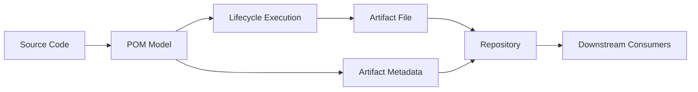
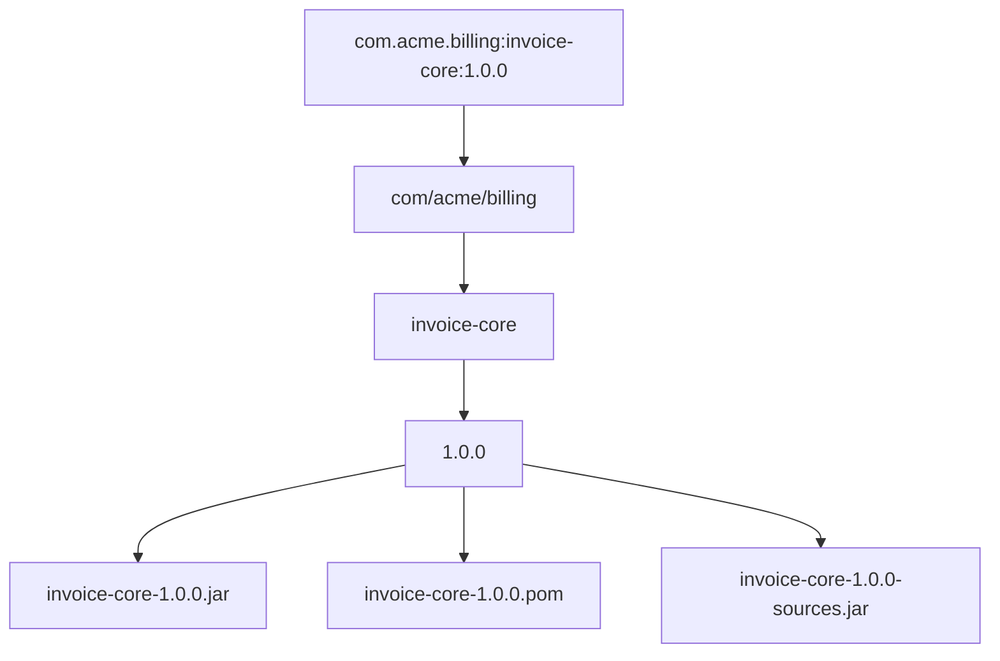
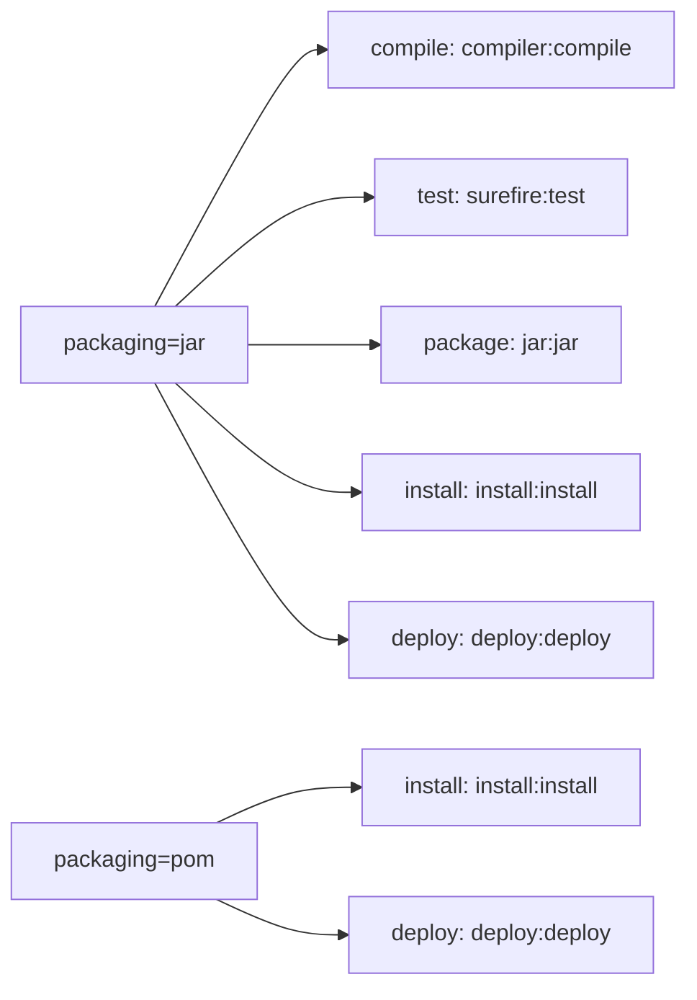
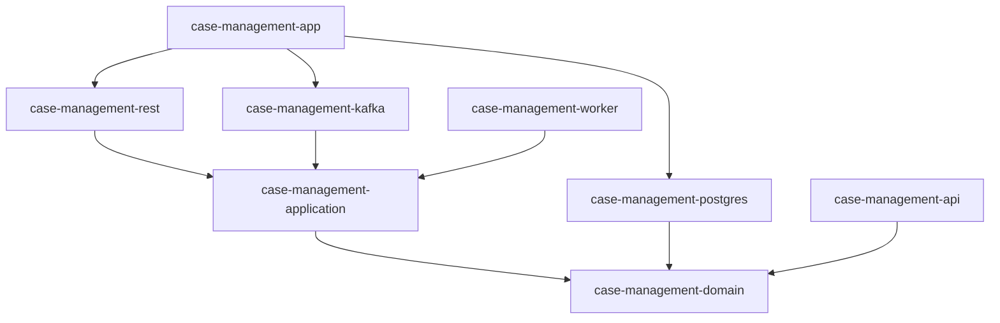

# Part 005 — Coordinates, Artifacts, and Packaging

Di Maven, hal yang kelihatannya paling sederhana sering menjadi akar masalah paling mahal:

```xml
<groupId>com.acme.billing</groupId>
<artifactId>invoice-service</artifactId>
<version>1.12.0</version>
```

Tiga baris ini bukan dekorasi. Ini adalah **identity contract**.

Maven tidak mengenali project berdasarkan nama folder, nama repository Git, nama service di Kubernetes, atau nama tim. Maven mengenali artifact melalui koordinat. Koordinat itu menentukan:

- artifact mana yang dicari,
- versi mana yang dipilih,
- file mana yang diunduh,
- metadata mana yang dibaca,
- dependency graph mana yang terbentuk,
- classpath mana yang disusun,
- artifact mana yang dipublikasikan,
- artifact mana yang dikonsumsi sistem lain.

Kalau POM adalah kontrak build, maka coordinates adalah **primary key** untuk artifact di ekosistem Maven.

Part ini membangun mental model yang sangat penting sebelum masuk ke dependency graph, repository resolution, BOM, multi-module, dan release. Tanpa memahami identity dan packaging, dependency management akan terasa seperti kumpulan aturan XML. Dengan memahami identity, Maven berubah menjadi sistem yang masuk akal.

---

## 1. Target Kompetensi

Setelah menyelesaikan part ini, kamu harus bisa:

1. Menjelaskan perbedaan antara **project**, **module**, **artifact**, **package**, **dependency**, dan **repository item**.
2. Mendesain koordinat Maven yang stabil untuk organisasi besar.
3. Memahami bahwa `groupId:artifactId:version` adalah representasi ringkas, tetapi identity dependency di beberapa konteks juga melibatkan `type` dan `classifier`.
4. Menjelaskan hubungan antara `packaging` dan default lifecycle binding.
5. Memutuskan kapan memakai classifier, kapan membuat artifact terpisah, dan kapan menolak keduanya.
6. Menghindari naming dan packaging anti-pattern yang menyebabkan dependency chaos jangka panjang.
7. Membaca artifact name di repository dan menebak koordinat, packaging, classifier, serta tujuannya.

---

## 2. Mental Model: Maven Artifact sebagai Immutable Product

Di sistem produksi, build yang sehat bukan hanya “kode berhasil dikompilasi”. Build yang sehat menghasilkan artifact yang bisa dikonsumsi secara deterministik.

Artifact Maven adalah hasil build yang diberi identitas dan metadata. Biasanya artifact berupa `.jar`, `.war`, `.pom`, `.zip`, atau file lain yang dipublikasikan ke repository.

Pikirkan artifact sebagai **produk immutable dari pipeline build**.



Hal penting: downstream consumer tidak mengonsumsi folder source code. Mereka mengonsumsi artifact dan metadata-nya.

Sebuah library Java yang dipakai service lain bukan sekadar `.jar`. Ia adalah kombinasi:

```txt
identity + binary content + metadata + usage semantics
```

Di Maven:

```txt
groupId + artifactId + version + packaging/type + classifier + POM metadata
```

Inilah kenapa perubahan kecil pada identity bisa berdampak besar. Mengubah `artifactId` bukan rename biasa; itu menciptakan artifact baru dari perspektif dependency graph.

---

## 3. Project, Module, Artifact, Package: Jangan Campur Aduk

Empat istilah ini sering dipakai bergantian, padahal berbeda.

### 3.1 Project

Project adalah unit Maven yang memiliki `pom.xml`.

Minimal:

```xml
<project>
  <modelVersion>4.0.0</modelVersion>

  <groupId>com.acme.billing</groupId>
  <artifactId>invoice-core</artifactId>
  <version>1.0.0</version>
</project>
```

Project bisa menghasilkan artifact, bisa juga hanya menjadi aggregator atau parent.

### 3.2 Module

Module adalah project Maven yang menjadi bagian dari reactor build multi-module.

Aggregator POM:

```xml
<project>
  <modelVersion>4.0.0</modelVersion>

  <groupId>com.acme.billing</groupId>
  <artifactId>billing-platform</artifactId>
  <version>1.0.0</version>
  <packaging>pom</packaging>

  <modules>
    <module>billing-api</module>
    <module>billing-domain</module>
    <module>billing-service</module>
  </modules>
</project>
```

Module adalah relasi build-time di dalam source tree. Artifact adalah output yang bisa dipublikasikan.

Satu module biasanya menghasilkan satu main artifact, tetapi bisa juga attach artifact tambahan seperti `sources`, `javadoc`, `tests`, atau generated schema.

### 3.3 Artifact

Artifact adalah file yang dihasilkan atau dikonsumsi Maven, dengan koordinat.

Contoh file repository:

```txt
invoice-core-1.0.0.jar
invoice-core-1.0.0.pom
invoice-core-1.0.0-sources.jar
invoice-core-1.0.0-javadoc.jar
```

Semua bisa berkaitan dengan koordinat yang sama, tetapi classifier/type berbeda.

### 3.4 Package

Di Maven, “package” bisa berarti dua hal yang mudah membingungkan:

1. **Java package**, misalnya `com.acme.billing.invoice`.
2. **Maven package phase**, yaitu phase lifecycle yang menghasilkan packaged artifact.
3. **Maven packaging**, misalnya `jar`, `war`, `pom`, `maven-plugin`.

Kalau bicara Maven, selalu perjelas konteksnya.

---

## 4. Coordinates: Primary Key Maven

Koordinat Maven dasar terdiri dari:

```txt
groupId:artifactId:version
```

Sering disebut **GAV**.

Contoh:

```xml
<dependency>
  <groupId>org.slf4j</groupId>
  <artifactId>slf4j-api</artifactId>
  <version>2.0.17</version>
</dependency>
```

Namun dalam praktik dependency matching tertentu, terutama dependency management, identity bisa melibatkan:

```txt
groupId:artifactId:type:classifier
```

Dengan version sebagai versi yang dikelola atau dipilih.

Mental model-nya:

```txt
GAV = identity ringkas artifact umum
GAVTC = identity lengkap saat type/classifier relevan
```

Jangan menganggap semua dependency hanya `groupId`, `artifactId`, `version`. Itu cukup untuk banyak kasus `.jar` normal tanpa classifier, tetapi tidak cukup untuk semua artifact.

---

## 5. `groupId`: Namespace Organisasi dan Ownership

`groupId` adalah namespace. Biasanya mengikuti domain organisasi secara terbalik.

Contoh:

```txt
com.acme
com.acme.billing
com.acme.billing.invoice
org.apache.maven
io.netty
```

### 5.1 Apa Fungsi `groupId`?

`groupId` menjawab pertanyaan:

```txt
Artifact ini berasal dari namespace ownership mana?
```

Ia bukan sekadar kategori teknis. Dalam organisasi besar, `groupId` bisa membawa informasi:

- ownership organisasi,
- boundary product,
- boundary platform,
- domain bisnis,
- governance policy,
- release authority.

Contoh enterprise:

```txt
com.acme.platform          # platform/shared engineering
com.acme.identity          # identity domain
com.acme.billing           # billing domain
com.acme.risk              # risk domain
com.acme.enforcement       # enforcement domain
com.acme.integration.sap   # integration adapter to SAP
```

### 5.2 `groupId` yang Terlalu Dangkal

```xml
<groupId>com.acme</groupId>
<artifactId>common-utils</artifactId>
```

Masalah:

- ownership tidak jelas,
- artifact mudah menjadi dumping ground,
- governance sulit,
- dependency graph terlihat datar,
- konflik nama artifact meningkat.

### 5.3 `groupId` yang Terlalu Dalam

```xml
<groupId>com.acme.billing.invoice.internal.calculation.discount.v2</groupId>
```

Masalah:

- identity terlalu terikat struktur internal,
- refactor package/domain menjadi breaking change koordinat,
- artifact sulit dipahami,
- downstream dependency terlalu spesifik.

### 5.4 Heuristic yang Baik

Gunakan `groupId` untuk ownership yang relatif stabil, bukan struktur kode yang sering berubah.

Baik:

```txt
com.acme.billing
com.acme.platform.messaging
com.acme.enforcement.workflow
```

Buruk:

```txt
com.acme.billing.controllers.impl.v2
com.acme.utils
com.acme.newproject
```

Invariant:

```txt
groupId should change rarely.
```

Kalau `groupId` berubah setiap refactor, kamu sedang memakai Maven coordinate sebagai struktur folder, bukan sebagai artifact identity.

---

## 6. `artifactId`: Nama Produk Build

`artifactId` adalah nama artifact dalam namespace `groupId`.

Contoh:

```txt
invoice-api
invoice-domain
invoice-service
invoice-client
billing-bom
billing-parent
```

### 6.1 Apa Fungsi `artifactId`?

`artifactId` menjawab:

```txt
Artifact spesifik apa yang diproduksi?
```

Kalau `groupId` adalah namespace, `artifactId` adalah nama produk.

### 6.2 Naming yang Baik

Nama artifact harus:

- lowercase,
- stabil,
- spesifik,
- mudah dicari,
- tidak bergantung pada implementasi sementara,
- tidak mengandung versi teknologi yang bisa berubah kecuali memang artifact itu adapter teknologi.

Contoh baik:

```txt
billing-api
billing-domain
billing-application
billing-infrastructure
billing-postgres-adapter
billing-kafka-events
billing-test-support
billing-bom
billing-parent
```

Contoh buruk:

```txt
new-service
common
utils
core
service
backend
api-v2-final
billing-java17
```

`core` dan `common` bukan selalu salah, tetapi sering menjadi tanda bahwa boundary belum dipahami.

### 6.3 Jangan Menggunakan Nama Layer Terlalu Generik Tanpa Domain

Buruk:

```txt
api
domain
service
repository
```

Lebih baik:

```txt
billing-api
billing-domain
billing-service
billing-postgres
```

Kenapa? Dalam repository manager, CI logs, dependency tree, dan SBOM, nama `api` saja tidak memberi konteks.

### 6.4 Naming Multi-Module yang Konsisten

Untuk product `enforcement-case`, struktur artifact bisa seperti:

```txt
enforcement-case-parent
enforcement-case-bom
enforcement-case-api
enforcement-case-domain
enforcement-case-application
enforcement-case-postgres
enforcement-case-kafka
enforcement-case-rest
enforcement-case-worker
enforcement-case-test-support
```

Ini verbose, tetapi sangat terbaca pada dependency tree:

```bash
mvn dependency:tree
```

Output yang jelas lebih berharga daripada nama pendek yang ambigu.

---

## 7. `version`: Identity dalam Waktu

`version` menunjukkan titik waktu atau release state artifact.

Contoh:

```txt
1.0.0
1.3.7
2.0.0-SNAPSHOT
2026.07.03
1.0.0-rc.1
```

Di Maven, versi bukan hanya informasi manusia. Versi dipakai dalam:

- dependency mediation,
- repository path,
- snapshot metadata,
- release promotion,
- reproducibility,
- rollback,
- SBOM,
- audit.

### 7.1 Release Version vs Snapshot Version

Release:

```txt
1.2.0
```

Maknanya:

```txt
Artifact ini seharusnya immutable.
```

Snapshot:

```txt
1.2.1-SNAPSHOT
```

Maknanya:

```txt
Artifact ini masih bergerak dan bisa berubah antar build.
```

Snapshot berguna untuk integrasi cepat antar module/tim, tetapi berbahaya untuk reproducible build dan audit produksi.

Part khusus release/versioning akan membahas ini jauh lebih dalam. Untuk sekarang, pegang invariant ini:

```txt
Release coordinates must be immutable.
Snapshot coordinates are mutable development coordinates.
```

### 7.2 Jangan Pakai Version untuk Menyimpan Environment

Buruk:

```txt
1.0.0-dev
1.0.0-qa
1.0.0-prod
```

Environment bukan versi artifact. Artifact yang sama harus bisa dipromosikan antar environment.

Lebih baik:

```txt
artifact: invoice-service-1.0.0.jar
config dev: externalized
config qa: externalized
config prod: externalized
```

Kalau build ulang untuk setiap environment, kamu kehilangan invariant penting:

```txt
The artifact tested should be the artifact deployed.
```

### 7.3 Jangan Pakai Version sebagai Branch Name

Buruk:

```txt
1.0.0-feature-login
1.0.0-john-local
```

Branch adalah konsep VCS. Version adalah konsep artifact repository.

Untuk build ephemeral, gunakan metadata CI di repository snapshot/internal, bukan release coordinate yang bocor ke consumer.

---

## 8. Repository Path: Bagaimana Coordinates Menjadi File

Koordinat Maven diterjemahkan ke path repository.

Koordinat:

```txt
com.acme.billing:invoice-core:1.0.0
```

Path repository release umum:

```txt
com/acme/billing/invoice-core/1.0.0/invoice-core-1.0.0.jar
com/acme/billing/invoice-core/1.0.0/invoice-core-1.0.0.pom
```

Dengan classifier `sources`:

```txt
com/acme/billing/invoice-core/1.0.0/invoice-core-1.0.0-sources.jar
```

Dengan classifier `javadoc`:

```txt
com/acme/billing/invoice-core/1.0.0/invoice-core-1.0.0-javadoc.jar
```

Mapping sederhana:

```txt
groupId      -> directory path
artifactId   -> artifact directory + filename prefix
version      -> version directory + filename component
classifier   -> optional filename suffix
type/ext     -> file extension and artifact handler semantics
```

Diagram:



Ini sebabnya coordinates harus stabil. Mereka bukan hanya label; mereka menentukan storage address dan consumption identity.

---

## 9. Artifact File vs POM Metadata

Ketika Maven mengunduh dependency, Maven tidak hanya mengambil `.jar`. Maven juga membaca `.pom` untuk memahami transitive dependencies.

Untuk dependency:

```xml
<dependency>
  <groupId>com.acme.billing</groupId>
  <artifactId>invoice-core</artifactId>
  <version>1.0.0</version>
</dependency>
```

Maven umumnya membutuhkan:

```txt
invoice-core-1.0.0.pom
invoice-core-1.0.0.jar
```

POM dependency berisi metadata seperti:

- dependency transitif,
- dependency management,
- exclusions,
- properties,
- project metadata,
- license/developer/scm info jika dipublikasikan.

Mental model:

```txt
.jar = binary content
.pom = dependency contract and project metadata
```

Kalau `.jar` ada tetapi `.pom` rusak atau hilang, downstream resolution bisa terganggu.

---

## 10. `packaging`: Jenis Project dan Default Build Behavior

`packaging` menentukan jenis artifact utama yang dihasilkan project dan default lifecycle bindings yang digunakan Maven.

Default packaging jika tidak ditulis adalah:

```xml
<packaging>jar</packaging>
```

Contoh eksplisit:

```xml
<project>
  <modelVersion>4.0.0</modelVersion>
  <groupId>com.acme.billing</groupId>
  <artifactId>invoice-service</artifactId>
  <version>1.0.0</version>
  <packaging>jar</packaging>
</project>
```

Packaging umum:

```txt
jar
war
ear
pom
maven-plugin
```

Beberapa plugin atau ecosystem dapat memperkenalkan packaging tambahan.

### 10.1 Packaging Bukan Sekadar Extension

Kesalahan umum:

```txt
packaging = file extension
```

Lebih tepat:

```txt
packaging = project/artifact type + lifecycle binding behavior
```

Untuk project `jar`, Maven punya default binding untuk compile, test, package, install, deploy.

Untuk project `pom`, Maven tidak mengompilasi source Java karena POM packaging biasanya dipakai untuk parent, aggregator, atau BOM.

### 10.2 Packaging Menentukan Default Goal Bindings

Contoh konseptual:



Detail binding dapat berbeda tergantung Maven/plugin version, tetapi mental model-nya stabil: packaging memengaruhi goal apa yang otomatis berjalan pada phase tertentu.

### 10.3 Packaging `pom`

`pom` packaging dipakai untuk project yang output utamanya adalah metadata POM.

Use case:

1. Parent POM.
2. Aggregator multi-module.
3. BOM artifact.
4. Corporate/platform build policy artifact.

Contoh parent/aggregator:

```xml
<project>
  <modelVersion>4.0.0</modelVersion>

  <groupId>com.acme.platform</groupId>
  <artifactId>acme-service-parent</artifactId>
  <version>1.0.0</version>
  <packaging>pom</packaging>

  <modules>
    <module>service-api</module>
    <module>service-impl</module>
  </modules>
</project>
```

Contoh BOM:

```xml
<project>
  <modelVersion>4.0.0</modelVersion>

  <groupId>com.acme.platform</groupId>
  <artifactId>acme-platform-bom</artifactId>
  <version>1.0.0</version>
  <packaging>pom</packaging>

  <dependencyManagement>
    <dependencies>
      <dependency>
        <groupId>org.slf4j</groupId>
        <artifactId>slf4j-api</artifactId>
        <version>2.0.17</version>
      </dependency>
    </dependencies>
  </dependencyManagement>
</project>
```

`pom` packaging bukan berarti “tidak penting”. Dalam enterprise Maven, artifact `pom` sering lebih strategis daripada `.jar` karena mengontrol dependency policy banyak service.

### 10.4 Packaging `jar`

`jar` adalah default untuk library atau application yang dikemas sebagai Java archive.

Use case:

- domain library,
- client SDK,
- application service executable JAR,
- shared testing support,
- plugin helper library.

Contoh:

```xml
<packaging>jar</packaging>
```

Artifact:

```txt
invoice-core-1.0.0.jar
invoice-core-1.0.0.pom
```

### 10.5 Packaging `war`

`war` dipakai untuk web application archive, biasanya untuk servlet/Jakarta EE deployment.

Use case:

- legacy servlet application,
- Jakarta EE web module,
- application server deployment artifact.

Contoh:

```xml
<packaging>war</packaging>
```

Artifact:

```txt
invoice-web-1.0.0.war
```

`war` packaging punya implikasi dependency seperti `provided` dependencies untuk servlet container. Ini akan dibahas lebih detail di part WAR/EAR.

### 10.6 Packaging `maven-plugin`

`maven-plugin` dipakai ketika project menghasilkan Maven plugin.

Use case:

- internal build governance plugin,
- code generation plugin,
- validation plugin,
- custom packaging automation.

Contoh:

```xml
<packaging>maven-plugin</packaging>
```

Jangan membuat Maven plugin hanya karena ingin menjalankan script build. Custom plugin layak jika logic build:

- dipakai banyak project,
- punya lifecycle semantics jelas,
- perlu konfigurasi typed,
- perlu testing,
- perlu versioning sebagai artifact internal.

---

## 11. `type`: Artifact Type dalam Dependency Declaration

Dalam dependency declaration, `type` menunjukkan tipe artifact yang ingin dikonsumsi.

Default:

```xml
<type>jar</type>
```

Biasanya tidak perlu ditulis.

Contoh dependency POM/BOM:

```xml
<dependency>
  <groupId>com.acme.platform</groupId>
  <artifactId>acme-platform-bom</artifactId>
  <version>1.0.0</version>
  <type>pom</type>
  <scope>import</scope>
</dependency>
```

Dalam BOM import, `type` harus `pom` karena yang diimpor bukan `.jar`, tetapi POM metadata berisi dependency management.

### 11.1 `packaging` vs `type`

`packaging` ada di project yang memproduksi artifact.

```xml
<packaging>war</packaging>
```

`type` ada di dependency yang mengonsumsi artifact.

```xml
<dependency>
  <groupId>com.acme.billing</groupId>
  <artifactId>billing-web</artifactId>
  <version>1.0.0</version>
  <type>war</type>
</dependency>
```

Mental model:

```txt
packaging = how this project is built
type      = what kind of artifact I want to consume
```

Sering sama, tetapi tidak identik secara konseptual.

---

## 12. `classifier`: Variant Tambahan dari Artifact yang Sama

Classifier membedakan artifact tambahan dengan koordinat dasar yang sama.

Contoh umum:

```txt
invoice-core-1.0.0.jar
invoice-core-1.0.0-sources.jar
invoice-core-1.0.0-javadoc.jar
invoice-core-1.0.0-tests.jar
```

Di dependency:

```xml
<dependency>
  <groupId>com.acme.billing</groupId>
  <artifactId>invoice-core</artifactId>
  <version>1.0.0</version>
  <classifier>tests</classifier>
</dependency>
```

### 12.1 Kapan Classifier Masuk Akal?

Classifier cocok untuk artifact yang merupakan varian tambahan dari artifact utama, bukan produk konseptual yang benar-benar berbeda.

Masuk akal:

```txt
sources
javadoc
tests
linux-x86_64
windows-x86_64
jakarta
```

Tergantung konteks.

Tidak selalu masuk akal:

```txt
api
domain
client
server
prod
qa
```

Kalau artifact punya lifecycle, dependency, ownership, dan compatibility sendiri, biasanya lebih baik menjadi artifactId terpisah.

### 12.2 Rule of Thumb

Gunakan classifier jika:

```txt
same logical artifact, same version, auxiliary variant
```

Gunakan artifactId terpisah jika:

```txt
different logical component, different dependencies, different consumers, different compatibility surface
```

Contoh buruk:

```txt
payment-1.0.0-client.jar
payment-1.0.0-server.jar
```

Lebih baik:

```txt
payment-client-1.0.0.jar
payment-server-1.0.0.jar
```

Kenapa? Client dan server biasanya punya dependency, release concern, dan consumer berbeda.

### 12.3 Classifier dan Dependency Management

Saat dependency memakai classifier/type, pastikan dependency management cocok dengan identity lengkap.

Contoh:

```xml
<dependencyManagement>
  <dependencies>
    <dependency>
      <groupId>com.acme.billing</groupId>
      <artifactId>invoice-core</artifactId>
      <version>1.0.0</version>
      <type>test-jar</type>
      <classifier>tests</classifier>
    </dependency>
  </dependencies>
</dependencyManagement>
```

Kalau kamu hanya mengelola `groupId/artifactId` default jar, variant dengan classifier bisa tidak terkena aturan yang kamu kira berlaku.

---

## 13. Extension, Type, Packaging, Classifier: Tabel Mental Model

| Konsep | Letak | Menjawab | Contoh |
|---|---|---|---|
| `packaging` | POM producer | Project ini dibangun sebagai apa? | `jar`, `war`, `pom` |
| `type` | Dependency consumer | Artifact tipe apa yang dikonsumsi? | `jar`, `pom`, `war`, `test-jar` |
| extension | File repository | File fisiknya berekstensi apa? | `.jar`, `.pom`, `.war` |
| classifier | Producer/consumer | Variant tambahan yang mana? | `sources`, `javadoc`, `tests` |

Contoh artifact utama:

```txt
groupId    = com.acme.billing
artifactId = invoice-core
version    = 1.0.0
packaging  = jar
file       = invoice-core-1.0.0.jar
```

Contoh artifact sumber:

```txt
groupId    = com.acme.billing
artifactId = invoice-core
version    = 1.0.0
type       = jar
classifier = sources
file       = invoice-core-1.0.0-sources.jar
```

Contoh BOM:

```txt
groupId    = com.acme.platform
artifactId = acme-platform-bom
version    = 1.0.0
type       = pom
file       = acme-platform-bom-1.0.0.pom
```

---

## 14. Artifact Taxonomy untuk Enterprise Project

Dalam project enterprise, artifact sebaiknya tidak tumbuh liar. Buat taxonomy.

Contoh taxonomy untuk platform domain `case-management`:

```txt
case-management-parent       # parent POM for inheritance
case-management-bom          # dependency version alignment
case-management-api          # public API contracts / interfaces / DTOs if justified
case-management-domain       # pure domain model/rules
case-management-application  # application/use-case orchestration
case-management-rest         # REST adapter
case-management-postgres     # persistence adapter
case-management-kafka        # event adapter
case-management-worker       # background worker executable
case-management-test-support # test fixtures/utilities
case-management-app          # deployable application assembly
```

Diagram dependency arah sehat:



Catatan: taxonomy ini bukan template universal. Ia menunjukkan cara berpikir:

```txt
artifact boundary should reveal architectural boundary
```

Kalau semua diberi nama `common`, `core`, dan `service`, dependency graph tidak menjelaskan arsitektur apa pun.

---

## 15. Parent, BOM, Aggregator: Semuanya `pom`, Tapi Perannya Berbeda

Tiga artifact ini sering sama-sama punya `packaging=pom`, tetapi perannya berbeda.

### 15.1 Parent POM

Dipakai melalui:

```xml
<parent>
  <groupId>com.acme.platform</groupId>
  <artifactId>acme-service-parent</artifactId>
  <version>1.0.0</version>
</parent>
```

Tujuan:

- mewariskan plugin management,
- mewariskan dependency management,
- mewariskan properties,
- mewariskan build policy.

### 15.2 BOM

Dipakai melalui:

```xml
<dependencyManagement>
  <dependencies>
    <dependency>
      <groupId>com.acme.platform</groupId>
      <artifactId>acme-platform-bom</artifactId>
      <version>1.0.0</version>
      <type>pom</type>
      <scope>import</scope>
    </dependency>
  </dependencies>
</dependencyManagement>
```

Tujuan:

- menyelaraskan versi dependency,
- tidak mewariskan plugin configuration,
- tidak mengatur module structure.

### 15.3 Aggregator POM

Dipakai melalui:

```xml
<modules>
  <module>module-a</module>
  <module>module-b</module>
</modules>
```

Tujuan:

- membangun beberapa module dalam satu reactor,
- menentukan source tree relationship,
- bukan otomatis parent.

### 15.4 Jangan Campur Peran Tanpa Sengaja

Satu POM bisa menjadi parent dan aggregator sekaligus, terutama di root repository. Tetapi secara mental harus dipisah.

```txt
parent     = inheritance relationship
aggregator = reactor/source-tree relationship
BOM        = dependency version alignment relationship
```

Kalau peran ini bercampur tanpa desain, multi-module build akan sulit dipindah, sulit dipublish, dan sulit dikonsumsi.

---

## 16. Naming Strategy: Designing Coordinates for Long-Term Stability

Koordinat yang baik harus bertahan lebih lama daripada struktur internal project.

### 16.1 Naming Decision Checklist

Sebelum membuat artifact baru, jawab:

1. Siapa owner artifact ini?
2. Siapa consumer langsungnya?
3. Apakah artifact ini public API, internal module, deployable, atau build policy?
4. Apakah artifact ini perlu dipublish ke repository?
5. Apakah artifact ini punya compatibility contract sendiri?
6. Apakah artifact ini bisa berubah versi secara independen?
7. Apakah namanya masih benar jika teknologi internal diganti?
8. Apakah namanya jelas di dependency tree?
9. Apakah artifact ini akan menjadi dumping ground?
10. Apakah artifact ini seharusnya classifier, module, atau artifactId terpisah?

### 16.2 Stable Naming Patterns

Untuk library:

```txt
<domain>-<capability>
```

Contoh:

```txt
billing-money
risk-score-model
enforcement-case-state-machine
```

Untuk adapter:

```txt
<domain>-<technology-or-system>-adapter
```

Contoh:

```txt
billing-postgres-adapter
billing-kafka-adapter
identity-ldap-adapter
```

Untuk API/client:

```txt
<service>-api
<service>-client
```

Contoh:

```txt
invoice-api
invoice-client
```

Untuk build policy:

```txt
<org-or-platform>-parent
<org-or-platform>-bom
<org-or-platform>-build-tools
```

Contoh:

```txt
acme-service-parent
acme-platform-bom
acme-build-enforcer-rules
```

### 16.3 Avoid Technology Lock-In in Artifact Names

Buruk:

```txt
billing-spring-service
billing-java17-service
billing-jpa-domain
```

Kecuali artifact memang adapter teknologi.

Lebih baik:

```txt
billing-service
billing-domain
billing-postgres-adapter
```

`postgres` masuk akal untuk adapter persistence. `java17` biasanya bukan bagian dari domain artifact.

---

## 17. Version Alignment Across Related Artifacts

Dalam multi-module product, sering ada beberapa artifact yang dirilis bersama.

Contoh:

```txt
billing-api:1.8.0
billing-domain:1.8.0
billing-service:1.8.0
billing-postgres:1.8.0
billing-kafka:1.8.0
```

Ini disebut lockstep versioning.

Kelebihan:

- sederhana,
- mudah trace release,
- cocok untuk satu product/repository,
- kompatibel dengan Maven reactor.

Kekurangan:

- artifact kecil ikut naik versi meski tidak berubah,
- dependency churn,
- bisa terlihat lebih besar dari real change.

Alternatifnya independent versioning:

```txt
billing-api:2.1.0
billing-domain:1.14.3
billing-client:3.0.0
```

Kelebihan:

- lebih presisi,
- cocok untuk library yang benar-benar independen.

Kekurangan:

- koordinasi release lebih kompleks,
- dependency management lebih penting,
- consumer harus memahami compatibility matrix.

Heuristic:

```txt
One deployable product, one repository, one release train -> lockstep is usually acceptable.
Shared libraries with independent consumers -> consider independent versioning.
```

---

## 18. Case Study: Dari Struktur Buruk ke Artifact Model yang Sehat

### 18.1 Struktur Awal

```txt
root
├── common
├── core
├── service
├── api
└── util
```

POM:

```xml
<groupId>com.acme</groupId>
<artifactId>common</artifactId>
```

```xml
<groupId>com.acme</groupId>
<artifactId>core</artifactId>
```

```xml
<groupId>com.acme</groupId>
<artifactId>service</artifactId>
```

Masalah:

1. Tidak ada domain ownership.
2. Nama terlalu generik.
3. Dependency tree tidak informatif.
4. `common` cenderung menjadi tempat sampah.
5. Tidak jelas mana artifact public, internal, deployable.

### 18.2 Struktur Baru

```txt
enforcement-case
├── enforcement-case-parent
├── enforcement-case-bom
├── enforcement-case-api
├── enforcement-case-domain
├── enforcement-case-application
├── enforcement-case-rest
├── enforcement-case-postgres
├── enforcement-case-kafka
├── enforcement-case-worker
└── enforcement-case-test-support
```

Coordinates:

```txt
com.acme.enforcement:enforcement-case-parent:1.0.0
com.acme.enforcement:enforcement-case-bom:1.0.0
com.acme.enforcement:enforcement-case-api:1.0.0
com.acme.enforcement:enforcement-case-domain:1.0.0
com.acme.enforcement:enforcement-case-application:1.0.0
com.acme.enforcement:enforcement-case-rest:1.0.0
com.acme.enforcement:enforcement-case-postgres:1.0.0
com.acme.enforcement:enforcement-case-kafka:1.0.0
com.acme.enforcement:enforcement-case-worker:1.0.0
com.acme.enforcement:enforcement-case-test-support:1.0.0
```

Sekarang dependency tree lebih menjelaskan arsitektur.

### 18.3 Evaluasi

Bukan berarti semua project harus punya 10 module. Yang penting:

```txt
artifact boundaries should match meaningful build and consumption boundaries
```

Kalau module tidak pernah dikonsumsi terpisah, tidak perlu dipublish sebagai artifact terpisah. Kalau boundary hanya untuk kerapian source, mungkin cukup package Java, bukan Maven module.

---

## 19. Anti-Pattern Coordinates dan Packaging

### 19.1 `common-utils`

```xml
<artifactId>common-utils</artifactId>
```

Biasanya berisi:

- date utils,
- string utils,
- HTTP helpers,
- domain helper,
- security helper,
- random constants,
- test hacks.

Masalah:

- dependency melebar,
- API tidak cohesive,
- sulit versioning,
- sulit delete,
- downstream terlalu banyak bergantung.

Lebih baik pecah berdasarkan capability:

```txt
platform-time
platform-json
platform-validation
billing-money
```

Atau jangan buat library sama sekali jika hanya dipakai satu service.

### 19.2 `api` Tanpa Domain

```xml
<artifactId>api</artifactId>
```

Buruk di multi-repository atau repository manager.

Lebih baik:

```xml
<artifactId>invoice-api</artifactId>
```

### 19.3 Environment-Specific Artifact

```txt
invoice-service-prod-1.0.0.jar
invoice-service-qa-1.0.0.jar
```

Ini membuat environment menjadi bagian artifact identity. Hindari.

### 19.4 Classifier untuk Produk yang Berbeda

```txt
order-1.0.0-client.jar
order-1.0.0-server.jar
```

Kalau client dan server punya konsumen berbeda, jadikan artifact berbeda:

```txt
order-client-1.0.0.jar
order-server-1.0.0.jar
```

### 19.5 Mengubah Coordinates untuk Refactor Internal

Kalau package Java berubah dari:

```txt
com.acme.billing.invoice
```

ke:

```txt
com.acme.billing.invoicing
```

bukan berarti Maven coordinates harus berubah.

Coordinates adalah identity artifact, bukan cermin package Java.

### 19.6 Publishing Internal Implementation Accidentally

Module internal:

```txt
billing-internal-cache
```

Jika dipublish dan dipakai consumer lain, ia menjadi public contract de facto.

Rule:

```txt
Published artifact becomes an API surface, whether you intended it or not.
```

---

## 20. Diagnostic Commands

### 20.1 Melihat Koordinat Project

```bash
mvn help:evaluate -Dexpression=project.groupId -q -DforceStdout
mvn help:evaluate -Dexpression=project.artifactId -q -DforceStdout
mvn help:evaluate -Dexpression=project.version -q -DforceStdout
mvn help:evaluate -Dexpression=project.packaging -q -DforceStdout
```

### 20.2 Melihat Effective POM

```bash
mvn help:effective-pom
```

Untuk file:

```bash
mvn help:effective-pom -Doutput=effective-pom.xml
```

### 20.3 Melihat Artifact yang Dihasilkan

```bash
mvn clean package
ls -lah target/
```

Perhatikan:

```txt
target/<artifactId>-<version>.<extension>
```

### 20.4 Melihat Dependency Tree

```bash
mvn dependency:tree
```

Dengan detail scope:

```bash
mvn dependency:tree -Dverbose
```

### 20.5 Mengunduh Artifact Berdasarkan Coordinates

```bash
mvn dependency:get \
  -Dartifact=com.acme.billing:invoice-core:1.0.0
```

Dengan classifier/type:

```bash
mvn dependency:get \
  -Dartifact=com.acme.billing:invoice-core:1.0.0:jar:sources
```

Format artifact parameter bisa membingungkan, jadi selalu cek dokumentasi plugin yang dipakai.

---

## 21. Design Exercise: Artifact Boundary Review

Ambil satu repository Maven yang kamu punya. Buat tabel:

| Module | groupId | artifactId | packaging | Dipublish? | Consumer | Stability |
|---|---|---|---|---|---|---|
| root | ... | ... | pom | yes/no | ... | ... |
| api | ... | ... | jar | yes/no | ... | ... |
| service | ... | ... | jar | yes/no | ... | ... |

Lalu jawab:

1. Apakah `groupId` menunjukkan ownership yang tepat?
2. Apakah `artifactId` cukup jelas di dependency tree?
3. Apakah ada artifact yang terlalu generik?
4. Apakah ada module internal yang tidak seharusnya dipublish?
5. Apakah ada classifier yang seharusnya artifact terpisah?
6. Apakah ada artifact terpisah yang sebenarnya hanya classifier?
7. Apakah packaging sesuai tujuan?
8. Apakah parent, BOM, dan aggregator dicampur tanpa sadar?

Output latihan ini seharusnya berupa daftar keputusan, bukan sekadar rename.

---

## 22. Implementation Recipe: Membuat Artifact Model yang Bersih

Misal kita ingin membuat product `case-lifecycle`.

### 22.1 Root Aggregator

```xml
<project>
  <modelVersion>4.0.0</modelVersion>

  <groupId>com.acme.enforcement</groupId>
  <artifactId>case-lifecycle</artifactId>
  <version>1.0.0-SNAPSHOT</version>
  <packaging>pom</packaging>

  <modules>
    <module>case-lifecycle-parent</module>
    <module>case-lifecycle-bom</module>
    <module>case-lifecycle-domain</module>
    <module>case-lifecycle-application</module>
    <module>case-lifecycle-rest</module>
    <module>case-lifecycle-postgres</module>
    <module>case-lifecycle-app</module>
  </modules>
</project>
```

Catatan: apakah parent dan BOM menjadi module dalam root yang sama tergantung strategi release. Ini contoh latihan, bukan aturan universal.

### 22.2 Parent POM

```xml
<project>
  <modelVersion>4.0.0</modelVersion>

  <groupId>com.acme.enforcement</groupId>
  <artifactId>case-lifecycle-parent</artifactId>
  <version>1.0.0-SNAPSHOT</version>
  <packaging>pom</packaging>

  <properties>
    <project.build.sourceEncoding>UTF-8</project.build.sourceEncoding>
    <maven.compiler.release>21</maven.compiler.release>
  </properties>
</project>
```

### 22.3 BOM POM

```xml
<project>
  <modelVersion>4.0.0</modelVersion>

  <groupId>com.acme.enforcement</groupId>
  <artifactId>case-lifecycle-bom</artifactId>
  <version>1.0.0-SNAPSHOT</version>
  <packaging>pom</packaging>

  <dependencyManagement>
    <dependencies>
      <dependency>
        <groupId>com.acme.enforcement</groupId>
        <artifactId>case-lifecycle-domain</artifactId>
        <version>${project.version}</version>
      </dependency>
      <dependency>
        <groupId>com.acme.enforcement</groupId>
        <artifactId>case-lifecycle-application</artifactId>
        <version>${project.version}</version>
      </dependency>
    </dependencies>
  </dependencyManagement>
</project>
```

### 22.4 Domain Module

```xml
<project>
  <modelVersion>4.0.0</modelVersion>

  <parent>
    <groupId>com.acme.enforcement</groupId>
    <artifactId>case-lifecycle-parent</artifactId>
    <version>1.0.0-SNAPSHOT</version>
    <relativePath>../case-lifecycle-parent/pom.xml</relativePath>
  </parent>

  <artifactId>case-lifecycle-domain</artifactId>
  <packaging>jar</packaging>
</project>
```

Perhatikan: child tidak perlu menulis ulang `groupId` dan `version` jika inherited dari parent. Tapi sebagai engineer, kamu tetap harus tahu effective coordinates-nya.

---

## 23. Senior-Level Reasoning: Coordinate Change adalah Breaking Change

Mengubah API public jelas breaking change. Tetapi di Maven, mengubah coordinates juga bisa breaking change.

Perubahan berikut memutus consumer:

```txt
com.acme.billing:invoice-core:1.0.0
```

menjadi:

```txt
com.acme.invoice:invoice-core:1.0.0
```

atau:

```txt
com.acme.billing:billing-invoice-core:1.0.0
```

Dari perspektif Maven, itu artifact berbeda.

Consumer lama tidak otomatis pindah. BOM lama tidak otomatis mengelola artifact baru. Repository metadata lama tidak menunjuk artifact baru.

Kalau rename coordinates diperlukan, lakukan seperti migrasi API:

1. Publish artifact baru.
2. Deprecate artifact lama.
3. Beri migration guide.
4. Update BOM.
5. Update consumer bertahap.
6. Monitor dependency graph.
7. Hentikan artifact lama setelah window kompatibilitas.

Jangan melakukan rename koordinat hanya karena struktur internal berubah.

---

## 24. Senior-Level Reasoning: Artifact Boundary adalah Architecture Boundary

Di organisasi besar, dependency graph Maven sering menjadi peta arsitektur yang lebih jujur daripada diagram Confluence.

Kalau diagram bilang:

```txt
Service A depends only on API of Service B
```

Tetapi dependency tree menunjukkan:

```txt
service-a -> service-b-impl -> service-b-postgres -> service-b-domain
```

maka arsitektur aktual adalah yang ada di dependency graph.

Coordinates yang baik membantu menjaga arsitektur karena dependency menjadi terbaca.

Bad artifact names hide coupling:

```txt
service-a -> common -> core -> util
```

Good artifact names reveal coupling:

```txt
case-review-service -> enforcement-case-client -> enforcement-case-api
```

Inilah sebabnya Maven naming bukan urusan estetika. Ia bagian dari architecture governance.

---

## 25. Checklist Review Sebelum Publish Artifact

Sebelum artifact dipublish ke repository internal atau public, periksa:

```txt
[ ] groupId menunjukkan ownership stabil.
[ ] artifactId jelas, spesifik, lowercase, dan tidak generik.
[ ] version mengikuti strategi release organisasi.
[ ] packaging sesuai output utama.
[ ] artifact tidak mengandung environment-specific config.
[ ] artifact tidak membocorkan secret/resource lokal.
[ ] POM metadata valid.
[ ] dependencies tidak membawa internal implementation yang tidak perlu.
[ ] classifiers digunakan hanya untuk variant yang tepat.
[ ] sources/javadoc/test artifacts hanya dipublish jika memang berguna.
[ ] artifact boundary merepresentasikan boundary konsumsi.
[ ] artifact ini layak menjadi public contract bagi consumer.
```

Kalau kamu tidak bisa menjelaskan consumer artifact, jangan buru-buru publish.

---

## 26. Ringkasan Mental Model

Pegang model ini:

```txt
Maven project  = unit POM/source/build
Maven module   = project dalam reactor multi-module
Maven artifact = product build yang punya coordinates
Coordinates    = primary key artifact
Packaging      = jenis project + default lifecycle behavior
Type           = jenis artifact yang dikonsumsi dependency
Classifier     = variant tambahan dari artifact yang sama
Repository     = storage address untuk artifact + metadata
```

Invariant penting:

```txt
Coordinates are identity, not decoration.
```

```txt
Artifact names should reveal architecture boundaries.
```

```txt
Published artifacts become contracts.
```

```txt
Packaging affects build behavior, not just file extension.
```

```txt
Classifier is for auxiliary variants, not unrelated products.
```

---

## 27. Referensi Utama

- Apache Maven — POM Reference: `https://maven.apache.org/pom.html`
- Apache Maven — Naming Convention of Maven Coordinates: `https://maven.apache.org/guides/mini/guide-naming-conventions.html`
- Apache Maven — Maven Artifacts: `https://maven.apache.org/repositories/artifacts.html`
- Apache Maven — Maven Dependencies: `https://maven.apache.org/repositories/dependencies.html`
- Apache Maven — Introduction to the Dependency Mechanism: `https://maven.apache.org/guides/introduction/introduction-to-dependency-mechanism.html`
- Apache Maven — Introduction to the Build Lifecycle: `https://maven.apache.org/guides/introduction/introduction-to-the-lifecycle.html`

---

## 28. Penutup

Part ini membangun fondasi identity artifact.

Part berikutnya akan masuk ke mesin eksekusi Maven: **lifecycle, phase, goal, dan execution plan**.

Di sana kita akan membedah kenapa `mvn test`, `mvn package`, `mvn verify`, dan `mvn clean install` menjalankan hal berbeda; bagaimana plugin goal diikat ke phase; dan bagaimana membaca build sebagai execution graph, bukan urutan command misterius.
