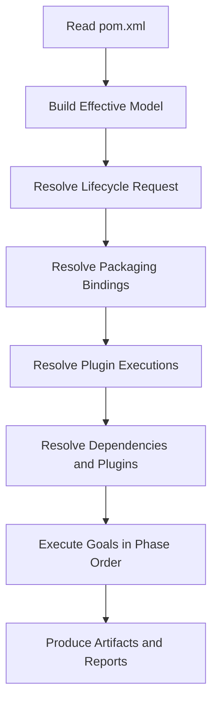
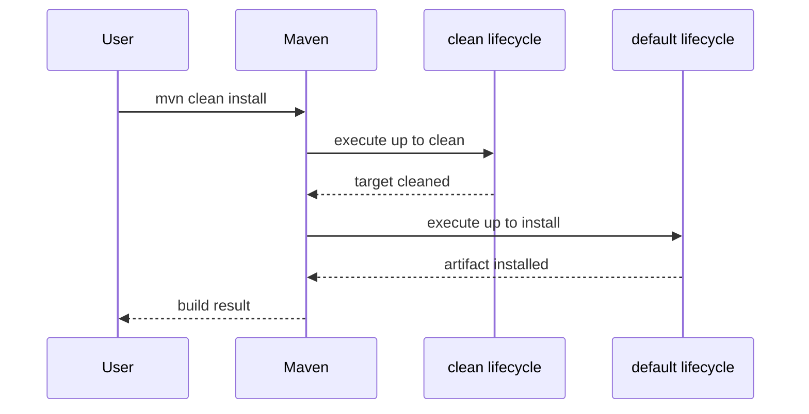
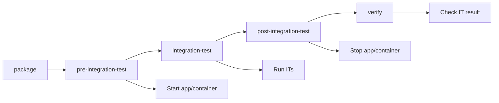
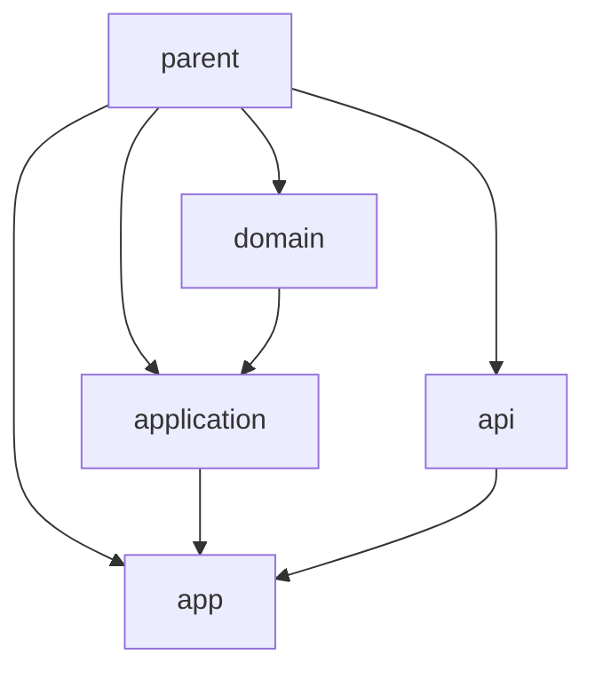

# Part 006 — Lifecycle, Phase, Goal, and Execution Plan

Banyak engineer memakai Maven dengan command seperti ini:

```bash
mvn clean install
```

Lalu ketika build gagal, debugging-nya menjadi trial and error:

```bash
mvn clean package
mvn clean compile
mvn -DskipTests install
mvn dependency:tree
mvn clean install -U
```

Kadang berhasil. Kadang tidak. Masalahnya bukan karena command-nya salah, tetapi karena mental model-nya belum lengkap.

Maven bukan menjalankan “command” dalam arti shell script biasa. Maven membangun model project, memilih lifecycle, menghitung phase yang harus dilewati, mengikat plugin goals, lalu menjalankan execution plan.

Part ini membangun mental model tersebut.

Kalau Part 005 menjawab:

```txt
Artifact apa yang sedang kita bangun?
```

Part ini menjawab:

```txt
Langkah build apa yang dijalankan Maven, dalam urutan apa, oleh plugin goal mana, dan kenapa?
```

---

## 1. Target Kompetensi

Setelah menyelesaikan part ini, kamu harus bisa:

1. Menjelaskan perbedaan **lifecycle**, **phase**, **goal**, **plugin**, dan **execution**.
2. Memprediksi apa yang terjadi saat menjalankan `mvn test`, `mvn package`, `mvn verify`, `mvn install`, dan `mvn deploy`.
3. Menjelaskan kenapa `mvn clean install` menjalankan dua lifecycle berbeda.
4. Membedakan invoking phase vs invoking plugin goal langsung.
5. Membaca binding default berdasarkan packaging.
6. Menambahkan plugin execution ke phase tertentu tanpa mengacaukan lifecycle.
7. Mendiagnosis kenapa plugin goal jalan dua kali, tidak jalan, atau jalan di phase yang salah.
8. Mendesain execution plan yang cocok untuk CI/CD enterprise.

---

## 2. Mental Model: Maven Build sebagai Execution Plan

Maven build dapat dipikirkan sebagai pipeline deklaratif.



Ketika kamu menjalankan:

```bash
mvn package
```

Maven tidak mencari script bernama `package`. Maven memahami `package` sebagai **phase** dalam lifecycle `default`. Maven lalu menjalankan semua phase sebelum `package` dan semua plugin goals yang bound ke phase-phase itu.

Mental model ringkas:

```txt
Command -> requested phases/goals -> lifecycle plan -> plugin goal executions -> artifact/result
```

---

## 3. Lima Istilah yang Harus Dipisahkan

### 3.1 Lifecycle

Lifecycle adalah rangkaian phase bernama yang merepresentasikan alur build.

Maven punya lifecycle bawaan utama:

```txt
clean
default
site
```

`default` adalah lifecycle utama untuk build artifact.

### 3.2 Phase

Phase adalah titik bernama dalam lifecycle.

Contoh phase di default lifecycle:

```txt
validate
compile
test
package
verify
install
deploy
```

Phase bukan task. Phase adalah slot/tahap.

### 3.3 Plugin

Plugin adalah artifact Maven yang menyediakan satu atau lebih goal.

Contoh:

```txt
maven-compiler-plugin
maven-surefire-plugin
maven-failsafe-plugin
maven-jar-plugin
maven-install-plugin
maven-deploy-plugin
```

### 3.4 Goal

Goal adalah task konkret yang dijalankan oleh plugin.

Contoh:

```txt
compiler:compile
compiler:testCompile
surefire:test
jar:jar
install:install
deploy:deploy
```

Goal adalah pekerjaan nyata.

### 3.5 Execution

Execution adalah konfigurasi yang mengikat goal ke phase tertentu, dengan id dan configuration tertentu.

Contoh:

```xml
<plugin>
  <groupId>org.apache.maven.plugins</groupId>
  <artifactId>maven-antrun-plugin</artifactId>
  <version>3.1.0</version>
  <executions>
    <execution>
      <id>echo-during-validate</id>
      <phase>validate</phase>
      <goals>
        <goal>run</goal>
      </goals>
      <configuration>
        <target>
          <echo message="Validating project model" />
        </target>
      </configuration>
    </execution>
  </executions>
</plugin>
```

Mental model:

```txt
lifecycle = pipeline
phase     = named checkpoint in pipeline
plugin    = provider of executable tasks
goal      = executable task
execution = configured binding of goal into lifecycle
```

---

## 4. Lifecycle Bawaan Maven

### 4.1 `clean` Lifecycle

Tujuan: membersihkan output build sebelumnya.

Phase umum:

```txt
pre-clean
clean
post-clean
```

Command:

```bash
mvn clean
```

Biasanya menjalankan `maven-clean-plugin:clean` untuk menghapus `target/`.

### 4.2 `default` Lifecycle

Tujuan: membangun, menguji, mem-package, memverifikasi, menginstall, dan mendeploy artifact.

Phase penting:

```txt
validate
initialize
generate-sources
process-sources
generate-resources
process-resources
compile
process-classes
generate-test-sources
process-test-sources
generate-test-resources
process-test-resources
test-compile
process-test-classes
test
prepare-package
package
pre-integration-test
integration-test
post-integration-test
verify
install
deploy
```

Tidak semua phase selalu punya goal terikat. Banyak phase adalah extension points.

### 4.3 `site` Lifecycle

Tujuan: membuat dan mempublikasikan site/report dokumentasi project.

Phase umum:

```txt
pre-site
site
post-site
site-deploy
```

Dalam banyak organisasi modern, `site` jarang menjadi jalur utama CI, tetapi tetap relevan untuk project yang memakai Maven reporting/site.

---

## 5. Phase Invocation: Maven Menjalankan Semua Phase Sebelumnya

Command:

```bash
mvn package
```

Tidak hanya menjalankan phase `package`. Maven menjalankan semua phase default lifecycle dari awal sampai `package`.

Secara konseptual:

```txt
validate -> initialize -> ... -> compile -> test -> package
```

Command:

```bash
mvn test
```

Jalurnya sampai `test`:

```txt
validate -> ... -> compile -> test-compile -> test
```

Command:

```bash
mvn verify
```

Jalurnya sampai `verify`:

```txt
validate -> ... -> test -> package -> pre-integration-test -> integration-test -> post-integration-test -> verify
```

Command:

```bash
mvn install
```

Jalurnya sampai `install`:

```txt
validate -> ... -> verify -> install
```

Command:

```bash
mvn deploy
```

Jalurnya sampai `deploy`:

```txt
validate -> ... -> verify -> install -> deploy
```

Invariant penting:

```txt
Invoking a phase means invoking all earlier phases in the same lifecycle.
```

---

## 6. Kenapa `mvn clean install` Menjalankan Dua Lifecycle?

Command:

```bash
mvn clean install
```

Ini bukan satu lifecycle. Ini dua request:

```txt
clean phase from clean lifecycle
install phase from default lifecycle
```

Maven menjalankan:

```txt
clean lifecycle up to clean
then default lifecycle up to install
```

Diagram:



Ini menjelaskan kenapa `clean` bukan “modifier” untuk `install`. Ia adalah phase tersendiri dari lifecycle berbeda.

---

## 7. Goal Invocation: Menjalankan Task Langsung

Command phase:

```bash
mvn package
```

Command goal langsung:

```bash
mvn compiler:compile
```

Perbedaannya besar.

`mvn package`:

- masuk lifecycle,
- menjalankan phase-phase sebelumnya,
- menjalankan semua goal yang bound ke phase tersebut,
- memperhatikan packaging default bindings,
- memperhatikan executions di POM.

`mvn compiler:compile`:

- menjalankan goal `compile` dari compiler plugin langsung,
- tidak otomatis menjalankan seluruh lifecycle sampai compile dengan cara yang sama,
- bisa melewati goal lain yang biasanya bound sebelum compile.

Rule:

```txt
Use lifecycle phases for normal builds.
Use direct goals for diagnostics, one-off tasks, or explicit plugin operations.
```

Contoh direct goal yang wajar:

```bash
mvn help:effective-pom
mvn dependency:tree
mvn versions:display-dependency-updates
```

Contoh direct goal yang perlu hati-hati:

```bash
mvn compiler:compile
mvn surefire:test
mvn jar:jar
```

Karena bisa melewati lifecycle context yang biasanya kamu butuhkan.

---

## 8. Default Binding Berdasarkan Packaging

Maven tidak punya satu execution plan universal. Packaging memengaruhi goal yang otomatis bound ke phase.

Untuk `jar`, secara konseptual:

```txt
process-resources     -> resources:resources
compile               -> compiler:compile
process-test-resources-> resources:testResources
test-compile          -> compiler:testCompile
test                  -> surefire:test
package               -> jar:jar
install               -> install:install
deploy                -> deploy:deploy
```

Untuk `pom`, biasanya lebih minimal:

```txt
install -> install:install
deploy  -> deploy:deploy
```

Untuk `war`, phase `package` akan menggunakan goal terkait WAR packaging.

Mental model:

```txt
packaging selects the default lifecycle goal bindings.
```

Jadi saat kamu mengubah:

```xml
<packaging>jar</packaging>
```

menjadi:

```xml
<packaging>pom</packaging>
```

kamu bukan hanya mengubah ekstensi artifact. Kamu mengubah default execution plan.

---

## 9. Lifecycle sebagai Extension Points

Banyak phase Maven terlihat kosong dalam project sederhana.

Contoh:

```txt
generate-sources
process-sources
generate-resources
process-classes
prepare-package
pre-integration-test
post-integration-test
```

Phase tersebut adalah extension points.

Contoh penggunaan:

| Phase | Use Case |
|---|---|
| `generate-sources` | generate Java dari OpenAPI, Protobuf, JAXB, Avro |
| `process-resources` | copy/filter resources |
| `process-classes` | bytecode enhancement, instrumentation |
| `prepare-package` | prepare files sebelum packaging |
| `pre-integration-test` | start container/server |
| `integration-test` | run integration tests |
| `post-integration-test` | stop container/server |
| `verify` | verify integration test result, quality gates |

Senior engineer tidak asal menaruh plugin execution di phase yang “kelihatannya jalan”. Ia memilih phase berdasarkan invariant input/output.

Contoh:

```txt
Generated Java source must exist before compile.
```

Maka goal code generation harus bound sebelum `compile`, biasanya `generate-sources`.

```txt
Integration test environment must be started before integration-test and stopped even when test fails.
```

Maka gunakan `pre-integration-test` dan `post-integration-test`, bukan menjalankan semuanya di `test`.

---

## 10. Execution Ordering dalam Phase

Dalam satu phase, beberapa goal bisa berjalan.

Urutan konseptual dipengaruhi oleh:

1. default lifecycle bindings,
2. plugin executions dari POM,
3. urutan deklarasi plugin/execution,
4. Maven version dan model rules.

Jangan mendesain build yang bergantung pada urutan implisit yang tidak jelas.

Jika goal B membutuhkan output goal A, lebih baik tempatkan mereka di phase berbeda yang semantik urutannya jelas.

Buruk:

```xml
<execution>
  <id>generate-and-process-in-same-phase</id>
  <phase>generate-sources</phase>
  ...
</execution>
```

lalu berharap plugin lain di phase yang sama selalu jalan setelahnya tanpa desain eksplisit.

Lebih baik:

```txt
generate-sources -> generate files
process-sources  -> post-process generated files
compile          -> compile generated + handwritten source
```

Invariant:

```txt
If ordering matters, model it with lifecycle semantics, not hope.
```

---

## 11. Anatomy Plugin Execution

Plugin execution minimal:

```xml
<build>
  <plugins>
    <plugin>
      <groupId>org.apache.maven.plugins</groupId>
      <artifactId>maven-antrun-plugin</artifactId>
      <version>3.1.0</version>
      <executions>
        <execution>
          <id>print-build-info</id>
          <phase>validate</phase>
          <goals>
            <goal>run</goal>
          </goals>
          <configuration>
            <target>
              <echo message="Building ${project.groupId}:${project.artifactId}:${project.version}" />
            </target>
          </configuration>
        </execution>
      </executions>
    </plugin>
  </plugins>
</build>
```

Komponen penting:

| Element | Fungsi |
|---|---|
| `groupId` | namespace plugin artifact |
| `artifactId` | plugin artifact name |
| `version` | versi plugin, harus dipin |
| `executions` | daftar binding goal ke lifecycle |
| `execution/id` | identitas execution |
| `phase` | phase tempat goal dijalankan |
| `goals/goal` | goal plugin yang dijalankan |
| `configuration` | parameter untuk goal/plugin |

### 11.1 Pin Plugin Version

Jangan bergantung pada plugin version implisit.

Buruk:

```xml
<plugin>
  <artifactId>maven-compiler-plugin</artifactId>
</plugin>
```

Lebih baik:

```xml
<plugin>
  <groupId>org.apache.maven.plugins</groupId>
  <artifactId>maven-compiler-plugin</artifactId>
  <version>3.14.0</version>
</plugin>
```

Versi plugin memengaruhi build behavior. Untuk reproducible build, plugin version harus jelas.

### 11.2 Plugin Configuration vs Execution Configuration

Plugin-level configuration:

```xml
<plugin>
  <artifactId>maven-compiler-plugin</artifactId>
  <version>3.14.0</version>
  <configuration>
    <release>21</release>
  </configuration>
</plugin>
```

Execution-level configuration:

```xml
<plugin>
  <artifactId>some-plugin</artifactId>
  <version>1.0.0</version>
  <executions>
    <execution>
      <id>execution-a</id>
      <phase>generate-sources</phase>
      <goals>
        <goal>generate</goal>
      </goals>
      <configuration>
        <mode>a</mode>
      </configuration>
    </execution>
    <execution>
      <id>execution-b</id>
      <phase>generate-test-sources</phase>
      <goals>
        <goal>generate</goal>
      </goals>
      <configuration>
        <mode>b</mode>
      </configuration>
    </execution>
  </executions>
</plugin>
```

Rule:

```txt
Plugin-level config = shared defaults
Execution-level config = phase/use-case-specific behavior
```

---

## 12. `pluginManagement` vs `plugins`

Ini salah satu sumber kebingungan paling sering.

`pluginManagement` tidak otomatis menjalankan plugin. Ia hanya menyediakan default version/configuration untuk plugin yang dipakai child atau plugin declaration lain.

Contoh parent:

```xml
<build>
  <pluginManagement>
    <plugins>
      <plugin>
        <groupId>org.apache.maven.plugins</groupId>
        <artifactId>maven-compiler-plugin</artifactId>
        <version>3.14.0</version>
        <configuration>
          <release>21</release>
        </configuration>
      </plugin>
    </plugins>
  </pluginManagement>
</build>
```

Agar aktif di child:

```xml
<build>
  <plugins>
    <plugin>
      <groupId>org.apache.maven.plugins</groupId>
      <artifactId>maven-compiler-plugin</artifactId>
    </plugin>
  </plugins>
</build>
```

Namun default lifecycle binding untuk packaging `jar` tetap bisa menjalankan compiler plugin walaupun kamu tidak menulisnya eksplisit. Konfigurasi dari `pluginManagement` dapat dipakai untuk plugin yang sesuai.

Mental model:

```txt
pluginManagement = policy/default catalog
plugins          = active build participation
```

Part parent POM akan membahas ini lebih dalam.

---

## 13. Command Semantics: Apa yang Sebenarnya Terjadi?

### 13.1 `mvn validate`

Menjalankan lifecycle sampai `validate`.

Use case:

- cek model,
- enforce rules,
- validate properties,
- fail fast sebelum dependency besar di-resolve.

Cocok untuk Maven Enforcer.

### 13.2 `mvn compile`

Menjalankan sampai compile main source.

Use case:

- cek kompilasi cepat,
- generate source sebelum compile,
- tidak menjalankan test.

Tidak cukup untuk CI gate.

### 13.3 `mvn test`

Menjalankan unit test phase.

Use case:

- local feedback,
- fast test cycle.

Hati-hati: integration test yang benar biasanya tidak berjalan di `test` jika mengikuti Surefire/Failsafe convention.

### 13.4 `mvn package`

Menghasilkan artifact di `target/`.

Use case:

- membuat JAR/WAR lokal,
- smoke check packaging.

Belum tentu menjalankan verification penuh setelah integration test.

### 13.5 `mvn verify`

Menjalankan sampai verification.

Use case:

- CI build gate,
- unit + integration test + verification,
- quality checks yang bound ke `verify`.

Dalam banyak project enterprise, `verify` lebih tepat untuk CI daripada `install`.

### 13.6 `mvn install`

Menjalankan sampai install artifact ke local repository.

Use case:

- local development antar project terpisah,
- install artifact agar dikonsumsi project lain di mesin yang sama.

Jangan jadikan `install` sebagai CI default kecuali ada alasan. CI sebaiknya tidak bergantung pada local repository sebagai handoff antar stage kecuali didesain dengan jelas.

### 13.7 `mvn deploy`

Menjalankan sampai publish artifact ke remote repository.

Use case:

- publish snapshot/release ke repository manager,
- release pipeline.

Jangan menjalankan `deploy` dari laptop untuk release produksi kecuali proses organisasi memang mengizinkan dan audit-nya jelas.

---

## 14. Why `verify` is Often Better Than `install` for CI

Banyak pipeline memakai:

```bash
mvn clean install
```

Karena historis. Tapi untuk CI gate, sering lebih tepat:

```bash
mvn clean verify
```

Kenapa?

`verify` menjawab:

```txt
Apakah project valid, compile, test, package, dan lolos verification?
```

`install` menambahkan:

```txt
Copy artifact ke local Maven repository runner.
```

Di ephemeral CI runner, install ke local repo sering tidak memberi nilai kecuali stage berikutnya dalam job yang sama membutuhkannya.

Rule praktis:

```txt
Local multi-project dev: install can be useful.
CI validation: verify is usually the right gate.
Publishing: deploy should be explicit release/publish stage.
```

---

## 15. Integration Test Lifecycle: Jangan Taruh Semua di `test`

Maven membedakan unit test dan integration test secara lifecycle.

Unit test biasanya:

```txt
test phase -> surefire:test
```

Integration test biasanya:

```txt
pre-integration-test -> start environment
integration-test     -> failsafe:integration-test
post-integration-test-> stop environment
verify               -> failsafe:verify
```

Diagram:



Kenapa `verify` penting? Karena Failsafe secara tradisional memisahkan running integration tests dan verifying result agar `post-integration-test` tetap punya kesempatan membersihkan environment.

Anti-pattern:

```txt
Run integration tests using Surefire in test phase and start external dependencies manually.
```

Masalah:

- cleanup sulit,
- unit test lambat,
- local feedback buruk,
- CI stage tidak jelas,
- test category kacau.

---

## 16. Build Plan untuk Code Generation

Code generation harus terjadi sebelum source dikompilasi.

Contoh OpenAPI/Protobuf/JAXB generation:

```txt
generate-sources -> generated Java files appear
compile          -> compile generated + handwritten Java
```

Jika generated test source:

```txt
generate-test-sources -> generated test Java files appear
test-compile          -> compile test sources
```

Anti-pattern:

```txt
Generate sources in compile phase.
```

Masalah:

- compiler bisa mulai sebelum source tersedia,
- IDE integration buruk,
- incremental build membingungkan,
- phase semantics salah.

Better invariant:

```txt
Every phase should receive its required inputs from earlier phases.
```

---

## 17. Build Plan untuk Resource Processing

Resource processing default untuk `jar` biasanya terjadi sebelum compile output/package.

Conceptual path:

```txt
src/main/resources -> process-resources -> target/classes
src/test/resources -> process-test-resources -> target/test-classes
```

Jika melakukan filtering:

```xml
<resources>
  <resource>
    <directory>src/main/resources</directory>
    <filtering>true</filtering>
  </resource>
</resources>
```

Pastikan filtering tidak memasukkan secret atau environment-specific config ke artifact release.

Part resource filtering akan membahas ini khusus.

---

## 18. Debugging Execution Plan

### 18.1 Gunakan Log Normal Terlebih Dahulu

```bash
mvn clean verify
```

Maven menampilkan goal execution seperti:

```txt
--- maven-resources-plugin:...:resources (default-resources) @ invoice-core ---
--- maven-compiler-plugin:...:compile (default-compile) @ invoice-core ---
--- maven-surefire-plugin:...:test (default-test) @ invoice-core ---
--- maven-jar-plugin:...:jar (default-jar) @ invoice-core ---
```

Baca baris ini sebagai execution trace:

```txt
plugin:version:goal (execution-id) @ module
```

### 18.2 Gunakan Debug Mode Jika Perlu

```bash
mvn -X clean verify
```

`-X` sangat verbose. Pakai saat perlu melihat:

- model building,
- plugin resolution,
- dependency resolution,
- configuration injection,
- class realms,
- execution detail.

Jangan mulai dari `-X` jika belum membaca log normal.

### 18.3 Effective POM

```bash
mvn help:effective-pom -Doutput=effective-pom.xml
```

Cari plugin:

```bash
grep -n "maven-compiler-plugin" effective-pom.xml
```

Effective POM menjawab:

```txt
Konfigurasi akhir apa yang dilihat Maven?
```

Bukan:

```txt
Kenapa plugin dieksekusi dalam urutan tertentu?
```

Untuk urutan, baca build log.

### 18.4 Describe Plugin Goal

```bash
mvn help:describe \
  -Dplugin=org.apache.maven.plugins:maven-compiler-plugin \
  -Dgoal=compile \
  -Ddetail
```

Gunakan untuk memahami:

- parameter goal,
- default value,
- required fields,
- user property,
- goal description.

### 18.5 Dependency Tree Bukan Execution Plan

```bash
mvn dependency:tree
```

Ini menampilkan dependency graph, bukan lifecycle execution plan.

Jangan memakai dependency tree untuk menjawab “kenapa plugin X jalan”. Gunakan build log/effective POM/help describe.

---

## 19. Common Failure Mode: Plugin Goal Tidak Jalan

### Gejala

Kamu menambahkan plugin:

```xml
<plugin>
  <groupId>com.acme.build</groupId>
  <artifactId>schema-validator-maven-plugin</artifactId>
  <version>1.0.0</version>
</plugin>
```

Tapi saat `mvn verify`, plugin tidak berjalan.

### Penyebab

Plugin dideklarasikan tanpa execution dan goal-nya tidak punya default binding untuk packaging-mu.

### Fix

Bind goal ke phase:

```xml
<plugin>
  <groupId>com.acme.build</groupId>
  <artifactId>schema-validator-maven-plugin</artifactId>
  <version>1.0.0</version>
  <executions>
    <execution>
      <id>validate-schemas</id>
      <phase>validate</phase>
      <goals>
        <goal>validate</goal>
      </goals>
    </execution>
  </executions>
</plugin>
```

Mental model:

```txt
Declaring a plugin is not always the same as scheduling its goal.
```

---

## 20. Common Failure Mode: Plugin Goal Jalan Dua Kali

### Gejala

Code generation berjalan dua kali, file duplikat, atau test dieksekusi dua kali.

### Penyebab Umum

1. Goal punya default binding dan kamu menambahkan execution lagi di phase yang sama.
2. Parent dan child sama-sama mendefinisikan execution dengan id berbeda.
3. Profile mengaktifkan execution tambahan.
4. Command menjalankan phase dan direct goal sekaligus.

Contoh bermasalah:

```bash
mvn test surefire:test
```

`test` phase bisa menjalankan `surefire:test`, lalu direct goal menjalankannya lagi.

### Diagnostic

Baca log:

```txt
--- maven-surefire-plugin:...:test (default-test) @ app ---
--- maven-surefire-plugin:...:test (manual-test) @ app ---
```

Lihat execution id.

### Fix

- Hilangkan execution duplikat.
- Gunakan same execution id jika memang ingin override inherited execution.
- Hindari mencampur phase dan direct goal tanpa alasan.

---

## 21. Common Failure Mode: Goal Jalan di Phase yang Salah

### Gejala

Generated source tidak ikut compile.

### Penyebab

Generator bound ke `compile`, padahal source harus ada sebelum compile.

Buruk:

```xml
<execution>
  <id>generate-api</id>
  <phase>compile</phase>
  <goals>
    <goal>generate</goal>
  </goals>
</execution>
```

Fix:

```xml
<execution>
  <id>generate-api</id>
  <phase>generate-sources</phase>
  <goals>
    <goal>generate</goal>
  </goals>
</execution>
```

Invariant:

```txt
A phase should not produce inputs required by itself.
```

---

## 22. Common Failure Mode: `mvn package` Hijau, `mvn verify` Merah

Ini bukan kontradiksi. `verify` menjalankan phase setelah `package`.

Kemungkinan:

- integration test gagal,
- Failsafe verify gagal,
- quality gate bound ke `verify`,
- enforcer rule bound ke `verify`,
- artifact inspection gagal.

Lesson:

```txt
package proves artifact can be packaged.
verify proves build verification passed.
```

Untuk CI, gagal di `verify` biasanya lebih bermakna daripada sukses di `package`.

---

## 23. Common Failure Mode: `mvn test` Hijau, CI `verify` Merah

Kemungkinan:

- local hanya menjalankan unit test,
- CI menjalankan integration test,
- profile CI mengaktifkan checks tambahan,
- plugin bound ke `verify` tidak jalan di `test`,
- environment CI lebih bersih sehingga implicit local state hilang.

Ini sehat jika memang desainnya begitu. Yang tidak sehat adalah tim tidak tahu perbedaannya.

Dokumentasikan command contract:

```txt
mvn test        -> fast local unit test gate
mvn verify      -> full local/CI verification gate
mvn deploy      -> publish artifact, only in release pipeline
```

---

## 24. Designing Lifecycle Policy for a Real Project

Untuk project enterprise, lifecycle policy bisa seperti ini:

| Command | Audience | Purpose | Expected Runtime |
|---|---|---|---|
| `mvn test` | developer | fast unit feedback | cepat |
| `mvn verify` | developer/CI | full verification | sedang/lama |
| `mvn deploy` | CI release | publish artifact | controlled |
| `mvn -pl module -am test` | developer | focused module feedback | cepat |
| `mvn help:effective-pom` | engineer | diagnose model | diagnostic |

### 24.1 Bind Checks ke Phase yang Tepat

Suggested policy:

```txt
validate             -> enforcer, project structure checks
compile              -> compile main code
process-test-sources -> generate test fixtures if needed
test                 -> unit tests
package              -> create artifact
pre-integration-test -> start test environment
integration-test     -> run integration tests
post-integration-test-> stop test environment
verify               -> verify IT result, quality gates, artifact checks
install              -> local repository handoff only when needed
deploy               -> remote publication only in controlled pipeline
```

### 24.2 Jangan Semua di `verify`

`verify` bukan tempat sampah untuk semua check.

Letakkan check sedini mungkin sesuai input-nya.

Contoh:

- POM structure invalid? `validate`.
- Generated source needed? `generate-sources`.
- Main code style? bisa sebelum/sekitar `compile`, tergantung plugin.
- Unit test? `test`.
- Integration test result? `verify`.
- Artifact signature? bisa `verify` atau release profile tergantung pipeline.

Rule:

```txt
Fail as early as correctness allows.
```

---

## 25. Multi-Module Reactor dan Lifecycle

Dalam multi-module build:

```bash
mvn verify
```

Maven membangun reactor, menentukan urutan module berdasarkan dependency, lalu menjalankan lifecycle untuk tiap module.

Konseptual:



Maven tidak sekadar berjalan berdasarkan urutan folder. Reactor sorting mempertimbangkan relasi antar module.

Command partial:

```bash
mvn -pl application -am verify
```

Artinya:

```txt
Build selected module application and also make required upstream modules.
```

Command:

```bash
mvn -pl domain -amd verify
```

Artinya:

```txt
Build selected module domain and also make downstream dependents.
```

Part multi-module akan membahas ini mendalam. Untuk sekarang, pahami bahwa lifecycle dieksekusi dalam konteks reactor graph.

---

## 26. Command Composition: Phase dan Goal Bisa Dicampur

Maven command menerima beberapa phase/goals:

```bash
mvn clean dependency:tree verify
```

Maven akan mengeksekusi sesuai urutan request dan semantics masing-masing.

Namun command seperti ini sering membingungkan untuk CI karena diagnostic goal bercampur dengan build goal.

Lebih baik pisahkan:

```bash
mvn clean verify
mvn dependency:tree
```

Kecuali kamu memang punya alasan kuat.

Rule:

```txt
CI command should be boring and explainable.
```

---

## 27. Profiles dan Lifecycle: Hidden Execution Plan Mutation

Profile dapat menambah plugin execution.

Contoh:

```xml
<profiles>
  <profile>
    <id>ci</id>
    <build>
      <plugins>
        <plugin>
          <groupId>org.apache.maven.plugins</groupId>
          <artifactId>maven-enforcer-plugin</artifactId>
          <version>3.5.0</version>
          <executions>
            <execution>
              <id>ci-enforce</id>
              <phase>validate</phase>
              <goals>
                <goal>enforce</goal>
              </goals>
            </execution>
          </executions>
        </plugin>
      </plugins>
    </build>
  </profile>
</profiles>
```

Command:

```bash
mvn verify
```

berbeda dengan:

```bash
mvn -Pci verify
```

Karena execution plan berubah.

Profiles adalah alat kuat, tetapi juga sumber non-reproducibility jika activation-nya tersembunyi.

Part profiles akan membahas ini secara khusus.

---

## 28. Build Lifecycle sebagai Contract Tim

Dalam tim besar, command Maven harus punya arti yang disepakati.

Contoh contract:

```txt
mvn test
```

Artinya:

```txt
Fast feedback. Tidak butuh Docker, database, network, atau secret.
```

```txt
mvn verify
```

Artinya:

```txt
Full verification. Boleh butuh testcontainers/local dependencies, menjalankan integration tests dan quality gates.
```

```txt
mvn deploy
```

Artinya:

```txt
Publish artifact ke repository remote. Hanya CI release context yang boleh menjalankan.
```

Jika setiap service punya arti command berbeda, developer experience memburuk. Build governance bukan hanya XML; ia juga kesepakatan operasional.

---

## 29. Practical Lab 1: Prediksi Execution Plan

Buat project sederhana:

```bash
mvn archetype:generate \
  -DgroupId=com.acme.training \
  -DartifactId=lifecycle-lab \
  -DarchetypeArtifactId=maven-archetype-quickstart \
  -DinteractiveMode=false
```

Masuk folder:

```bash
cd lifecycle-lab
```

Jalankan:

```bash
mvn test
```

Catat plugin goals yang muncul.

Lalu:

```bash
mvn package
```

Bandingkan dengan `test`.

Lalu:

```bash
mvn verify
```

Jika tidak ada integration test/check tambahan, hasilnya mungkin mirip dengan package, tetapi phase yang dilewati tetap lebih panjang.

Pertanyaan:

1. Plugin goal apa yang muncul di `test`?
2. Plugin goal apa yang baru muncul di `package`?
3. Apakah `verify` menambah goal baru?
4. Apa packaging project ini?
5. Dari mana default binding berasal?

---

## 30. Practical Lab 2: Tambahkan Execution di `validate`

Tambahkan plugin:

```xml
<build>
  <plugins>
    <plugin>
      <groupId>org.apache.maven.plugins</groupId>
      <artifactId>maven-antrun-plugin</artifactId>
      <version>3.1.0</version>
      <executions>
        <execution>
          <id>print-coordinates</id>
          <phase>validate</phase>
          <goals>
            <goal>run</goal>
          </goals>
          <configuration>
            <target>
              <echo message="Project: ${project.groupId}:${project.artifactId}:${project.version}" />
            </target>
          </configuration>
        </execution>
      </executions>
    </plugin>
  </plugins>
</build>
```

Jalankan:

```bash
mvn validate
mvn test
mvn package
```

Pertanyaan:

1. Apakah execution muncul di semua command?
2. Kenapa muncul saat `test` dan `package`?
3. Apa invariant phase invocation yang terbukti?

Jawaban:

Karena `test` dan `package` melewati `validate`, maka execution di `validate` ikut berjalan.

---

## 31. Practical Lab 3: Direct Goal vs Phase

Jalankan:

```bash
mvn compiler:compile
```

Lalu:

```bash
mvn compile
```

Bandingkan log.

Pertanyaan:

1. Apakah keduanya menjalankan goal yang sama?
2. Apakah lifecycle path-nya sama?
3. Apakah resources diproses dengan cara yang sama?
4. Mana yang lebih cocok untuk normal build?

Tujuan lab ini bukan menghafal output, tetapi membangun intuisi:

```txt
Direct goal invocation is not equivalent to lifecycle phase invocation.
```

---

## 32. Senior-Level Heuristics

### 32.1 Prefer Phase Commands for Build Contracts

Gunakan:

```bash
mvn clean verify
```

Daripada:

```bash
mvn clean resources:resources compiler:compile surefire:test jar:jar
```

Kecuali kamu sedang debugging plugin.

### 32.2 Bind Plugin Goals to Semantically Correct Phases

Jangan tanya:

```txt
Di phase mana plugin ini bisa jalan?
```

Tanya:

```txt
Output plugin ini dibutuhkan sebelum phase apa?
Input plugin ini tersedia setelah phase apa?
```

### 32.3 Keep CI Build Commands Stable

Build command yang sering berubah adalah bau desain.

Lebih baik command stabil:

```bash
mvn -B -ntp clean verify
```

Dengan behavior dikontrol oleh POM/pipeline yang jelas.

### 32.4 Avoid Hidden Lifecycle Mutation

Hati-hati dengan:

- profile auto-activation,
- plugin execution di parent yang tidak diketahui child team,
- default plugin versions yang berubah,
- direct goals di CI,
- shell script wrapper yang menyembunyikan Maven command.

### 32.5 Read the Build Log as a Trace

Setiap baris plugin execution menjawab:

```txt
What goal ran?
Which plugin version?
Which execution id?
Which module?
```

Contoh:

```txt
--- maven-compiler-plugin:3.14.0:compile (default-compile) @ invoice-core ---
```

Baca sebagai:

```txt
compiler plugin version 3.14.0 menjalankan goal compile melalui execution default-compile pada module invoice-core
```

---

## 33. Failure Playbook Ringkas

### 33.1 Plugin Tidak Jalan

Periksa:

```txt
[ ] Apakah plugin punya default binding untuk packaging ini?
[ ] Apakah execution punya phase?
[ ] Apakah command mencapai phase tersebut?
[ ] Apakah profile yang berisi execution aktif?
[ ] Apakah plugin ada di pluginManagement saja?
```

### 33.2 Plugin Jalan Dua Kali

Periksa:

```txt
[ ] Apakah ada default binding + custom execution?
[ ] Apakah parent dan child punya execution berbeda?
[ ] Apakah profile menambahkan execution?
[ ] Apakah command mencampur phase dan direct goal?
[ ] Apakah execution id berbeda sehingga Maven tidak merge/override?
```

### 33.3 Output Tidak Tersedia

Periksa:

```txt
[ ] Apakah producer goal bound ke phase sebelum consumer?
[ ] Apakah output directory didaftarkan ke build?
[ ] Apakah plugin berjalan di module yang benar?
[ ] Apakah partial reactor build melewatkan module producer?
```

### 33.4 Local Hijau, CI Merah

Periksa:

```txt
[ ] Apakah CI menjalankan phase lebih jauh?
[ ] Apakah CI profile aktif?
[ ] Apakah local punya target/ lama?
[ ] Apakah local repository berisi artifact yang tidak ada di CI?
[ ] Apakah plugin/dependency resolution berbeda?
```

---

## 34. Minimal Enterprise Build Command Set

Untuk service Maven modern, command set yang sehat bisa seperti ini:

```bash
# Fast local feedback
mvn test

# Full verification before push / CI gate
mvn clean verify

# Focused module build
mvn -pl module-name -am test

# Diagnose final model
mvn help:effective-pom -Doutput=effective-pom.xml

# Diagnose dependency graph
mvn dependency:tree

# Publish only from controlled pipeline
mvn deploy
```

Tambahkan flags CI:

```bash
mvn -B -ntp clean verify
```

Makna:

- `-B`: batch mode, cocok untuk CI.
- `-ntp`: no transfer progress, log lebih bersih.

Jangan memasukkan `-DskipTests` ke command default CI. Kalau perlu skip, buat keputusan eksplisit, terisolasi, dan auditable.

---

## 35. Ringkasan Mental Model

Pegang model ini:

```txt
Lifecycle = ordered build pipeline
Phase     = named step/checkpoint in lifecycle
Plugin    = artifact that provides executable goals
Goal      = concrete task
Execution = binding of goal + config to a phase
Packaging = selector of default lifecycle bindings
Command   = request for phases/goals
```

Invariant penting:

```txt
Invoking a phase executes all previous phases in the same lifecycle.
```

```txt
mvn clean install executes clean lifecycle, then default lifecycle up to install.
```

```txt
Direct goal invocation is not equivalent to lifecycle phase invocation.
```

```txt
Packaging changes default execution behavior.
```

```txt
A plugin declared only in pluginManagement is policy, not necessarily active execution.
```

```txt
Bind goals based on input/output semantics, not guesswork.
```

---

## 36. Referensi Utama

- Apache Maven — Introduction to the Build Lifecycle: `https://maven.apache.org/guides/introduction/introduction-to-the-lifecycle.html`
- Apache Maven — Running Apache Maven: `https://maven.apache.org/run.html`
- Apache Maven — Guide to Configuring Plug-ins: `https://maven.apache.org/guides/mini/guide-configuring-plugins.html`
- Apache Maven — Guide to Configuring Default Mojo Executions: `https://maven.apache.org/guides/mini/guide-default-execution-ids.html`
- Apache Maven — Introduction to Plugin Prefix Resolution: `https://maven.apache.org/guides/introduction/introduction-to-plugin-prefix-mapping.html`
- Apache Maven — Maven POM Reference: `https://maven.apache.org/pom.html`

---

## 37. Penutup

Part ini membahas mesin eksekusi Maven: lifecycle, phase, goal, plugin execution, dan command semantics.

Setelah ini, kita akan masuk ke Part 007: **Maven Plugin System in Action**.

Di sana fokusnya bukan lagi “goal berjalan di phase mana”, tetapi bagaimana plugin sendiri bekerja: mojo, parameters, prefix resolution, plugin classpath, plugin dependencies, configuration injection, descriptor, dan cara membaca plugin seperti komponen produksi.
