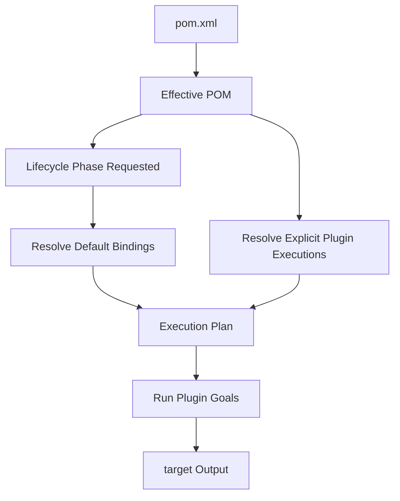
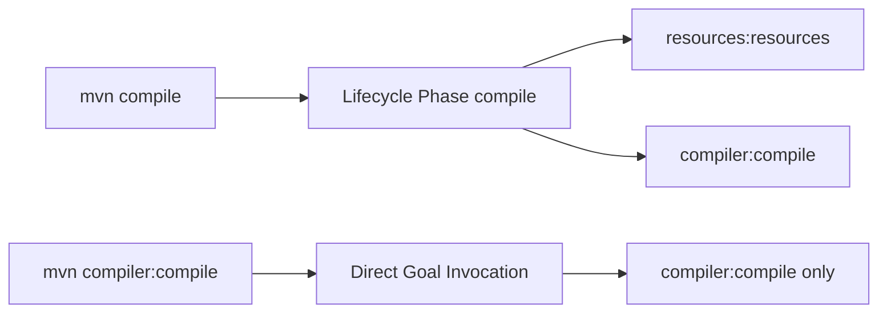
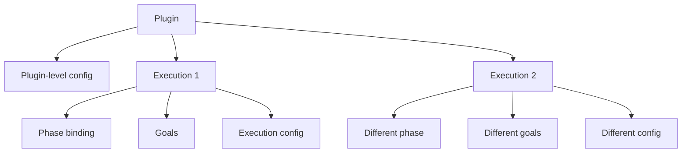
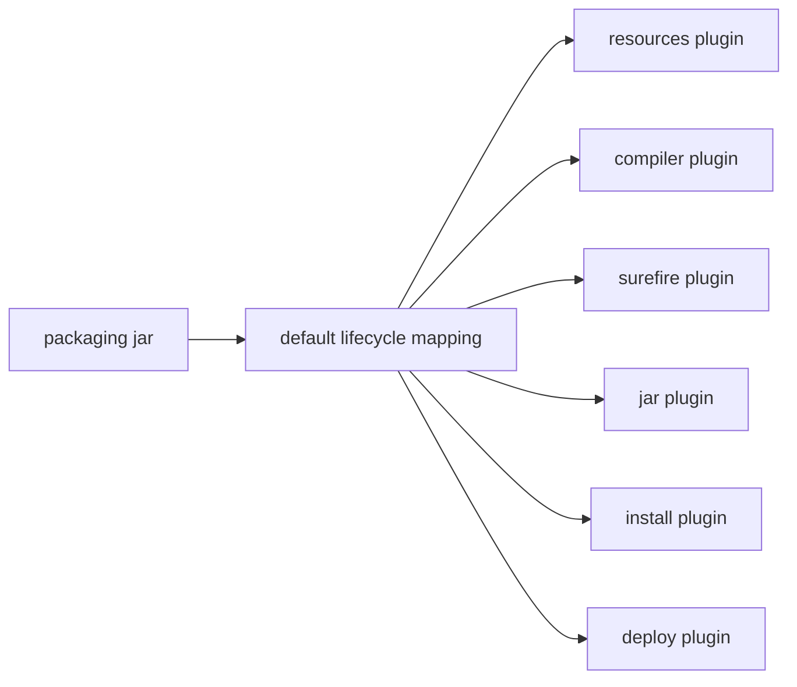
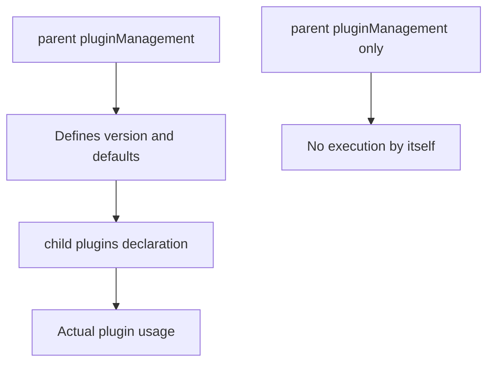
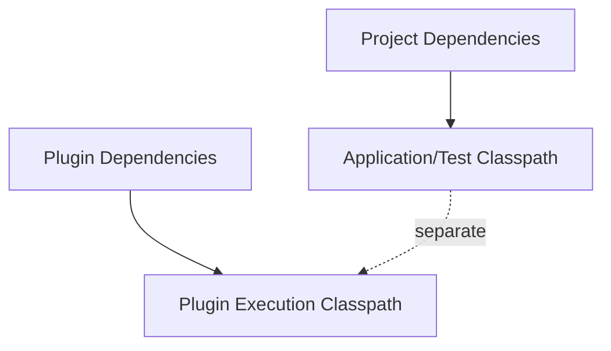
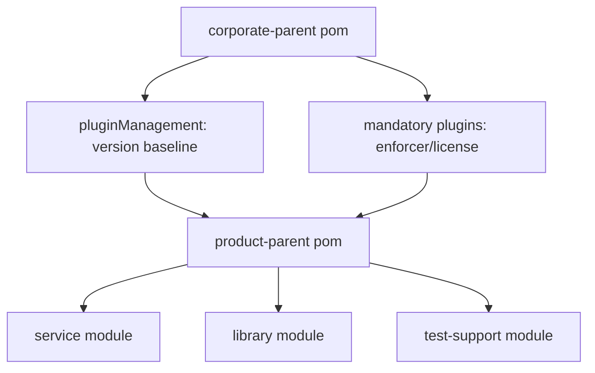
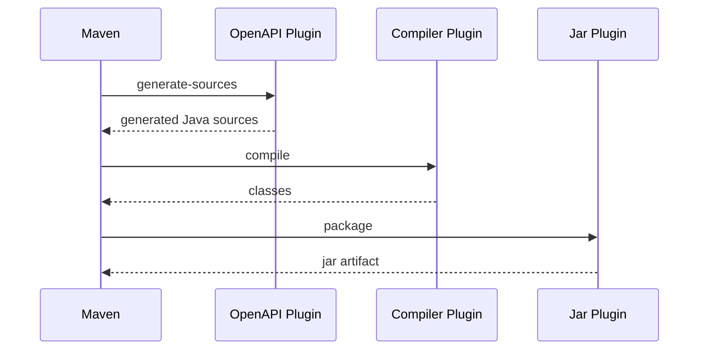

# Part 007 — Maven Plugin System in Action

Di bagian sebelumnya kita sudah membangun model mental tentang lifecycle: Maven tidak sekadar menjalankan command, tetapi menjalankan **phase** yang memiliki **plugin goal binding**.

Sekarang kita masuk ke mesin eksekusinya: **plugin system**.

Kalau POM adalah kontrak build, lifecycle adalah urutan tahap build, maka plugin adalah komponen yang benar-benar melakukan kerja:

- compile source,
- copy resources,
- run tests,
- create JAR/WAR,
- generate source,
- check code style,
- build site,
- deploy artifact,
- sign artifact,
- produce reports.

Tanpa plugin, Maven hanya punya model. Dengan plugin, model itu menjadi tindakan.

Referensi resmi Maven menjelaskan plugin goal sebagai task spesifik yang lebih kecil dari build phase. Goal dapat bound ke phase atau dipanggil langsung dari command line. Maven plugin sendiri terdiri dari satu atau lebih Mojo; setiap Mojo merepresentasikan goal. Ini penting: `compiler:compile`, `surefire:test`, `jar:jar`, dan `deploy:deploy` bukan “fitur bawaan hard-coded” yang kamu panggil secara ajaib. Mereka adalah goal dari plugin yang ditempatkan Maven ke lifecycle execution plan.

---

## 1. Masalah yang Diselesaikan Plugin System

Build Java enterprise tidak pernah hanya “compile”.

Satu service produksi biasanya punya kebutuhan seperti:

```txt
validate model
compile source
copy resources
run unit tests
run integration tests
generate OpenAPI client
generate JAXB classes
check formatting
check license header
run static analysis
package artifact
attach source JAR
attach javadoc JAR
sign artifact
deploy artifact
publish reports
```

Kalau semua itu ditulis sebagai shell script, hasilnya biasanya:

- tidak portable,
- sulit diwariskan antar project,
- sulit dikonfigurasi secara deklaratif,
- sulit dihubungkan dengan dependency graph,
- sulit masuk ke multi-module reactor,
- sulit diprediksi urutan eksekusinya,
- sulit diaudit oleh organisasi.

Maven plugin system menyelesaikan itu dengan satu prinsip:

> Build behavior harus dideklarasikan sebagai goal yang bisa dikaitkan ke lifecycle, dikonfigurasi lewat POM, dan dieksekusi secara konsisten oleh Maven.

Plugin system membuat build menjadi extensible tanpa mengubah Maven core.



Jadi ketika build gagal, jangan langsung berpikir “Maven error”. Lebih tepat:

> Plugin goal tertentu gagal dalam execution tertentu, pada phase tertentu, dengan parameter tertentu, menggunakan classpath tertentu.

Itu framing senior.

---

## 2. Vocabulary Wajib

Kita perlu presisi istilah. Banyak bug Maven terjadi karena istilah ini dicampuradukkan.

| Istilah | Makna | Contoh |
|---|---|---|
| Plugin | Artifact Maven yang berisi satu atau lebih goal | `maven-compiler-plugin` |
| Goal | Task spesifik yang bisa dijalankan | `compile`, `testCompile` |
| Mojo | Implementasi Java dari goal | class annotated `@Mojo` |
| Phase | Tahap lifecycle | `compile`, `test`, `package` |
| Execution | Konfigurasi goal binding tertentu di POM | `<execution><id>...</id>` |
| Binding | Relasi goal ke phase | `compiler:compile` bound ke `compile` |
| Parameter | Konfigurasi goal | `<release>17</release>` |
| Plugin prefix | Nama pendek plugin saat CLI | `compiler` dalam `compiler:compile` |
| Plugin version | Versi plugin yang dipakai Maven | `3.13.0`, `3.14.0`, dst |
| Plugin classpath | Dependency plugin, terpisah dari dependency project | dependency internal plugin |

Contoh command:

```bash
mvn compiler:compile
```

Dibaca sebagai:

```txt
Run goal `compile` from plugin resolved by prefix `compiler`.
```

Contoh lifecycle invocation:

```bash
mvn compile
```

Dibaca sebagai:

```txt
Run all lifecycle phases up to `compile`, including default and explicit plugin goals bound to those phases.
```

Command ini kelihatan mirip, tapi efeknya tidak sama.

---

## 3. Plugin Bukan Phase

Kesalahan umum:

```txt
compile adalah plugin
```

Salah.

`compile` bisa berarti dua hal tergantung konteks:

```bash
mvn compile
```

Di sini `compile` adalah **lifecycle phase**.

```bash
mvn compiler:compile
```

Di sini `compile` adalah **goal** milik `maven-compiler-plugin`.

Perbedaannya sangat penting.



`mvn compile` menjalankan phase dari awal sampai `compile`, termasuk goal yang bound sebelumnya.

`mvn compiler:compile` menjalankan goal itu secara langsung. Tidak selalu menjalankan phase-phase sebelum compile dengan cara yang sama.

Rule praktis:

> Untuk build normal, panggil lifecycle phase: `validate`, `test`, `package`, `verify`, `install`, atau `deploy`. Untuk debugging atau task khusus, panggil plugin goal langsung.

---

## 4. Bentuk Dasar Plugin di POM

Plugin dideklarasikan di bawah:

```xml
<build>
  <plugins>
    <plugin>
      <groupId>org.apache.maven.plugins</groupId>
      <artifactId>maven-compiler-plugin</artifactId>
      <version>3.13.0</version>
      <configuration>
        <release>17</release>
      </configuration>
    </plugin>
  </plugins>
</build>
```

Struktur dasarnya:

```txt
plugin identity
  groupId
  artifactId
  version
plugin configuration
plugin executions
plugin dependencies
```

Untuk plugin resmi Apache, `groupId` biasanya:

```xml
<groupId>org.apache.maven.plugins</groupId>
```

Untuk plugin dari ecosystem lain, groupId berbeda:

```xml
<groupId>org.codehaus.mojo</groupId>
<artifactId>build-helper-maven-plugin</artifactId>
```

Jangan mengandalkan implicit plugin version. Di build enterprise, plugin version harus dipin.

Kenapa?

Karena plugin adalah code yang dieksekusi dalam build. Jika versinya berubah tanpa sadar, output build bisa berubah.

---

## 5. Plugin-Level Configuration vs Execution-Level Configuration

Ada dua lokasi konfigurasi penting.

### 5.1 Plugin-Level Configuration

```xml
<plugin>
  <groupId>org.apache.maven.plugins</groupId>
  <artifactId>maven-compiler-plugin</artifactId>
  <version>3.13.0</version>
  <configuration>
    <release>17</release>
    <showWarnings>true</showWarnings>
  </configuration>
</plugin>
```

Konfigurasi ini berlaku umum untuk goal plugin tersebut, kecuali ditimpa oleh execution-level configuration.

Cocok untuk:

- konfigurasi global plugin,
- plugin yang dipanggil langsung dari CLI,
- default lifecycle binding,
- nilai yang sama untuk semua execution.

### 5.2 Execution-Level Configuration

```xml
<plugin>
  <groupId>org.apache.maven.plugins</groupId>
  <artifactId>maven-antrun-plugin</artifactId>
  <version>3.1.0</version>
  <executions>
    <execution>
      <id>echo-build-info</id>
      <phase>validate</phase>
      <goals>
        <goal>run</goal>
      </goals>
      <configuration>
        <target>
          <echo message="Building ${project.groupId}:${project.artifactId}:${project.version}"/>
        </target>
      </configuration>
    </execution>
  </executions>
</plugin>
```

Execution-level configuration berlaku untuk execution tertentu.

Cocok untuk:

- goal yang sama dijalankan lebih dari sekali dengan parameter berbeda,
- binding goal ke phase tertentu,
- build step khusus module,
- memisahkan behavior `generate-sources` vs `generate-test-sources`,
- membuat build plan eksplisit.

Mental model:



Rule:

> Jika konfigurasi menjelaskan “plugin ini secara umum”, letakkan di plugin-level. Jika konfigurasi menjelaskan “run ini secara spesifik”, letakkan di execution-level.

---

## 6. Default Lifecycle Binding

Maven punya default binding berdasarkan `packaging`.

Contoh umum untuk `jar` packaging:

```txt
process-resources -> resources:resources
compile           -> compiler:compile
process-test-resources -> resources:testResources
test-compile      -> compiler:testCompile
test              -> surefire:test
package           -> jar:jar
install           -> install:install
deploy            -> deploy:deploy
```

Ini menjelaskan kenapa POM minimal seperti ini bisa build:

```xml
<project>
  <modelVersion>4.0.0</modelVersion>
  <groupId>com.acme</groupId>
  <artifactId>billing-core</artifactId>
  <version>1.0.0</version>
</project>
```

Karena default packaging adalah `jar`, dan Maven punya default plugin bindings untuk `jar`.

Tapi default bukan berarti “tidak ada plugin”. Artinya plugin binding datang dari Maven core/default lifecycle mapping.



Inilah alasan `mvn package` bisa menghasilkan JAR walaupun kamu tidak pernah menulis `maven-jar-plugin` di POM.

---

## 7. Explicit Plugin Execution

Default binding cukup untuk project sederhana. Tetapi enterprise build butuh step tambahan.

Contoh: generate build metadata sebelum package.

```xml
<plugin>
  <groupId>org.codehaus.mojo</groupId>
  <artifactId>buildnumber-maven-plugin</artifactId>
  <version>3.2.0</version>
  <executions>
    <execution>
      <id>create-build-number</id>
      <phase>validate</phase>
      <goals>
        <goal>create</goal>
      </goals>
    </execution>
  </executions>
</plugin>
```

Dibaca:

```txt
During validate phase, run buildnumber:create for execution create-build-number.
```

Execution punya tiga bagian utama:

```xml
<execution>
  <id>...</id>
  <phase>...</phase>
  <goals>...</goals>
  <configuration>...</configuration>
</execution>
```

`id` bukan dekorasi. `id` adalah identitas execution.

Gunakan nama yang menjelaskan intention:

```xml
<id>generate-openapi-server-stubs</id>
<id>attach-sources-jar</id>
<id>run-license-check</id>
<id>copy-docker-context</id>
```

Jangan gunakan:

```xml
<id>default</id>
<id>run</id>
<id>plugin</id>
<id>step1</id>
```

Karena saat build gagal di CI, execution id akan menjadi clue.

---

## 8. Urutan Eksekusi Plugin dalam Phase

Kalau beberapa plugin bound ke phase yang sama, Maven menjalankannya berdasarkan urutan deklarasi di POM setelah memperhitungkan default bindings dan model merging.

Contoh:

```xml
<build>
  <plugins>
    <plugin>
      <groupId>org.apache.maven.plugins</groupId>
      <artifactId>maven-enforcer-plugin</artifactId>
      <version>3.5.0</version>
      <executions>
        <execution>
          <id>enforce-build-rules</id>
          <phase>validate</phase>
          <goals>
            <goal>enforce</goal>
          </goals>
        </execution>
      </executions>
    </plugin>

    <plugin>
      <groupId>org.codehaus.mojo</groupId>
      <artifactId>buildnumber-maven-plugin</artifactId>
      <version>3.2.0</version>
      <executions>
        <execution>
          <id>create-build-number</id>
          <phase>validate</phase>
          <goals>
            <goal>create</goal>
          </goals>
        </execution>
      </executions>
    </plugin>
  </plugins>
</build>
```

Di phase `validate`, enforcer akan berjalan sebelum buildnumber karena urutan deklarasi.

Tapi jangan desain build yang terlalu bergantung pada urutan implisit dalam phase yang sama. Jika step B benar-benar butuh output step A, pilih phase yang lebih tepat atau buat dependency eksplisit lewat file/output convention.

Bad smell:

```txt
plugin A dan plugin B sama-sama di validate, tapi B diam-diam butuh file dari A
```

Lebih baik:

```txt
A di generate-resources
B di process-resources
```

Atau gunakan phase yang menggambarkan state artifact.

---

## 9. Memilih Phase yang Tepat

Kesalahan umum enterprise build: semua custom task ditempel ke `generate-sources` atau `validate`.

Maven lifecycle punya phase karena setiap phase merepresentasikan state tertentu.

| Kebutuhan | Phase yang masuk akal | Catatan |
|---|---|---|
| Cek Maven/JDK/dependency policy | `validate` | Fail early sebelum kerja mahal |
| Generate source utama | `generate-sources` | Output harus masuk compile source roots |
| Generate resource utama | `generate-resources` | Output menjadi resource build |
| Copy/filter resources | `process-resources` | Sebelum compile jika resource dibutuhkan |
| Generate test source | `generate-test-sources` | Untuk test-only generated code |
| Run unit tests | `test` | Biasanya Surefire |
| Prepare integration test env | `pre-integration-test` | Start container/server |
| Run integration tests | `integration-test` | Biasanya Failsafe integration-test |
| Tear down integration env | `post-integration-test` | Stop container/server |
| Validate integration result | `verify` | Failsafe verify, final checks |
| Create artifact | `package` | JAR/WAR/EAR/etc |
| Install locally | `install` | Local repo only |
| Publish remotely | `deploy` | Remote repo/distribution |

Rule penting:

> Jangan letakkan task mahal di phase awal jika task itu tidak dibutuhkan untuk semua build.

Contoh anti-pattern:

```xml
<phase>validate</phase>
```

untuk generate 5000 class dari schema.

Efeknya:

```bash
mvn validate
```

menjadi lambat, padahal user hanya ingin validasi metadata.

Lebih tepat:

```xml
<phase>generate-sources</phase>
```

karena output-nya source untuk compile.

---

## 10. Plugin Prefix Resolution

Command ini:

```bash
mvn compiler:compile
```

menggunakan prefix `compiler`.

Maven perlu memetakan prefix ke plugin artifact:

```txt
compiler -> org.apache.maven.plugins:maven-compiler-plugin
```

Untuk plugin Apache, prefix biasanya berasal dari artifactId dengan pola:

```txt
maven-<prefix>-plugin
```

Contoh:

```txt
maven-clean-plugin      -> clean
maven-compiler-plugin   -> compiler
maven-surefire-plugin   -> surefire
maven-jar-plugin        -> jar
maven-deploy-plugin     -> deploy
```

Untuk plugin non-Apache, prefix bisa berbeda dan biasanya didefinisikan di plugin descriptor.

Di build enterprise, jangan terlalu bergantung pada prefix untuk dokumentasi internal. Tuliskan plugin identity lengkap di POM.

Lebih eksplisit:

```xml
<plugin>
  <groupId>org.codehaus.mojo</groupId>
  <artifactId>build-helper-maven-plugin</artifactId>
  <version>3.6.0</version>
</plugin>
```

Daripada hanya instruksi:

```bash
mvn build-helper:add-source
```

Karena prefix resolution bergantung pada plugin groups, metadata, dan repository availability.

---

## 11. `pluginManagement` vs `plugins`

Ini salah satu sumber kebingungan terbesar.

### 11.1 `plugins`

`plugins` berarti plugin dipakai oleh project.

```xml
<build>
  <plugins>
    <plugin>
      <groupId>org.apache.maven.plugins</groupId>
      <artifactId>maven-enforcer-plugin</artifactId>
      <version>3.5.0</version>
      <executions>
        <execution>
          <id>enforce</id>
          <goals>
            <goal>enforce</goal>
          </goals>
        </execution>
      </executions>
    </plugin>
  </plugins>
</build>
```

### 11.2 `pluginManagement`

`pluginManagement` berarti plugin version/configuration disediakan sebagai default untuk child/module, tetapi tidak otomatis membuat plugin berjalan.

```xml
<build>
  <pluginManagement>
    <plugins>
      <plugin>
        <groupId>org.apache.maven.plugins</groupId>
        <artifactId>maven-compiler-plugin</artifactId>
        <version>3.13.0</version>
        <configuration>
          <release>17</release>
        </configuration>
      </plugin>
    </plugins>
  </pluginManagement>
</build>
```

Agar module memakai plugin itu secara eksplisit:

```xml
<build>
  <plugins>
    <plugin>
      <groupId>org.apache.maven.plugins</groupId>
      <artifactId>maven-compiler-plugin</artifactId>
    </plugin>
  </plugins>
</build>
```

Version/configuration akan diambil dari `pluginManagement` parent.

Mental model:



Rule:

> `pluginManagement` adalah catalog/control plane. `plugins` adalah execution/use plane.

Di corporate parent POM, sebagian besar plugin version sebaiknya ada di `pluginManagement`. Tapi plugin governance yang wajib untuk semua module, misalnya enforcer, bisa diletakkan di `plugins` parent agar diwarisi dan berjalan.

---

## 12. Versi Plugin Harus Dipin

Dependency version sering dipin, tapi plugin version sering dilupakan.

Itu riskan.

Plugin adalah executable build code. Perubahan plugin version dapat mengubah:

- parameter default,
- output archive,
- test discovery,
- compiler behavior,
- report format,
- generated source,
- reproducibility,
- parallel build safety,
- failure behavior.

Contoh buruk:

```xml
<plugin>
  <artifactId>maven-compiler-plugin</artifactId>
  <configuration>
    <release>17</release>
  </configuration>
</plugin>
```

Contoh benar:

```xml
<plugin>
  <groupId>org.apache.maven.plugins</groupId>
  <artifactId>maven-compiler-plugin</artifactId>
  <version>3.13.0</version>
  <configuration>
    <release>17</release>
  </configuration>
</plugin>
```

Lebih enterprise:

```xml
<build>
  <pluginManagement>
    <plugins>
      <plugin>
        <groupId>org.apache.maven.plugins</groupId>
        <artifactId>maven-compiler-plugin</artifactId>
        <version>${maven-compiler-plugin.version}</version>
        <configuration>
          <release>${java.release}</release>
        </configuration>
      </plugin>
    </plugins>
  </pluginManagement>
</build>
```

Dengan properties:

```xml
<properties>
  <java.release>17</java.release>
  <maven-compiler-plugin.version>3.13.0</maven-compiler-plugin.version>
</properties>
```

Tapi jangan terlalu jauh membuat semua versi menjadi property jika tidak ada governance. Property bagus untuk centralization, tapi juga bisa membuat effective POM lebih sulit dibaca.

---

## 13. Plugin Dependency Bukan Project Dependency

Plugin bisa punya dependency sendiri.

Contoh:

```xml
<plugin>
  <groupId>org.apache.maven.plugins</groupId>
  <artifactId>maven-checkstyle-plugin</artifactId>
  <version>3.4.0</version>
  <dependencies>
    <dependency>
      <groupId>com.puppycrawl.tools</groupId>
      <artifactId>checkstyle</artifactId>
      <version>10.17.0</version>
    </dependency>
  </dependencies>
</plugin>
```

Dependency di dalam plugin ini masuk ke plugin classpath, bukan project classpath.

Perbedaan:



Ini penting untuk kasus:

- Checkstyle version override,
- custom annotation processor plugin behavior,
- OpenAPI generator dependencies,
- JAXB plugin dependencies,
- database migration plugin driver dependencies,
- plugin extension behavior.

Jangan taruh dependency build tool di project dependencies hanya supaya plugin bisa melihatnya.

Bad:

```xml
<dependencies>
  <dependency>
    <groupId>org.postgresql</groupId>
    <artifactId>postgresql</artifactId>
    <version>42.7.3</version>
  </dependency>
</dependencies>
```

hanya karena migration plugin butuh JDBC driver.

Better:

```xml
<plugin>
  <groupId>org.flywaydb</groupId>
  <artifactId>flyway-maven-plugin</artifactId>
  <version>10.15.0</version>
  <dependencies>
    <dependency>
      <groupId>org.postgresql</groupId>
      <artifactId>postgresql</artifactId>
      <version>42.7.3</version>
    </dependency>
  </dependencies>
</plugin>
```

Karena JDBC driver itu dependency untuk tool execution, bukan runtime dependency aplikasi, kecuali aplikasi memang menggunakannya.

---

## 14. Parameter Resolution

Plugin parameter bisa berasal dari beberapa tempat:

- `<configuration>` di POM,
- property Maven,
- default value plugin,
- command-line property `-D...`,
- environment/system property jika plugin mendukung,
- execution-level override.

Contoh:

```xml
<plugin>
  <groupId>org.apache.maven.plugins</groupId>
  <artifactId>maven-surefire-plugin</artifactId>
  <version>3.5.0</version>
  <configuration>
    <skipTests>${skip.unit.tests}</skipTests>
  </configuration>
</plugin>
```

```bash
mvn test -Dskip.unit.tests=true
```

Ini powerful, tapi rawan chaos.

Rule enterprise:

> Property untuk parameter plugin boleh digunakan jika parameter itu memang bagian dari build interface yang sengaja diekspos.

Contoh baik:

```xml
<properties>
  <java.release>17</java.release>
  <skip.integration.tests>false</skip.integration.tests>
</properties>
```

Contoh buruk:

```xml
<properties>
  <internal.surefire.argLine.magic>${some.profile.value}</internal.surefire.argLine.magic>
</properties>
```

Jika property terlalu indirect, build sulit dibaca.

---

## 15. Direct Goal Invocation vs Lifecycle Invocation

Ada dua cara menjalankan plugin.

### 15.1 Direct Goal Invocation

```bash
mvn dependency:tree
mvn help:effective-pom
mvn compiler:compile
mvn versions:display-dependency-updates
```

Cocok untuk:

- diagnostics,
- one-off task,
- local inspection,
- plugin utility.

### 15.2 Lifecycle Invocation

```bash
mvn verify
mvn package
mvn install
mvn deploy
```

Cocok untuk:

- build normal,
- CI,
- release,
- deterministic execution.

Jangan desain pipeline produksi yang bergantung pada banyak direct goal invocation acak:

```bash
mvn clean
mvn resources:resources
mvn compiler:compile
mvn surefire:test
mvn jar:jar
```

Lebih baik:

```bash
mvn clean verify
```

Karena lifecycle invocation menjaga urutan phase dan default bindings.

---

## 16. Plugin Inheritance

Plugin declaration dapat diwariskan dari parent POM.

Contoh parent:

```xml
<build>
  <plugins>
    <plugin>
      <groupId>org.apache.maven.plugins</groupId>
      <artifactId>maven-enforcer-plugin</artifactId>
      <version>3.5.0</version>
      <executions>
        <execution>
          <id>enforce-java-and-maven</id>
          <phase>validate</phase>
          <goals>
            <goal>enforce</goal>
          </goals>
          <configuration>
            <rules>
              <requireMavenVersion>
                <version>[3.9.0,)</version>
              </requireMavenVersion>
              <requireJavaVersion>
                <version>[17,)</version>
              </requireJavaVersion>
            </rules>
          </configuration>
        </execution>
      </executions>
    </plugin>
  </plugins>
</build>
```

Child module akan menjalankan execution tersebut kecuali inheritance dikendalikan.

Jika plugin tidak boleh diwariskan:

```xml
<plugin>
  <groupId>org.example</groupId>
  <artifactId>some-plugin</artifactId>
  <version>1.0.0</version>
  <inherited>false</inherited>
</plugin>
```

Atau pada execution:

```xml
<execution>
  <id>root-only-task</id>
  <inherited>false</inherited>
  <phase>validate</phase>
  <goals>
    <goal>run</goal>
  </goals>
</execution>
```

Gunakan dengan hati-hati.

Pattern enterprise:

- parent POM mewariskan build governance,
- aggregator/root POM menjalankan root-only orchestration,
- module POM hanya override jika benar-benar perlu.

---

## 17. Aggregator Goal

Beberapa goal bersifat aggregator: goal berjalan sekali untuk seluruh reactor, bukan per module.

Contoh umum: beberapa goal report, site, release, atau dependency analysis tertentu.

Kenapa penting?

Karena dalam multi-module build, kamu harus tahu apakah plugin execution berjalan:

```txt
per module
```

atau:

```txt
sekali di root/reactor
```

Failure mode:

```txt
Plugin dikira berjalan per module, ternyata aggregator.
```

Atau sebaliknya:

```txt
Plugin dikira root-only, ternyata berjalan di semua module.
```

Konsekuensi:

- duplicate output,
- race condition di parallel build,
- file overwrite,
- report kacau,
- build lambat,
- deployment ganda.

Rule:

> Untuk plugin yang menyentuh root directory, repository-wide report, atau cross-module aggregation, cek dokumentasi goal apakah aggregator dan thread-safe.

Command diagnostik:

```bash
mvn help:describe \
  -Dplugin=org.apache.maven.plugins:maven-help-plugin \
  -Dgoal=describe \
  -Ddetail
```

`help:describe` bisa menampilkan metadata goal, parameter, dan informasi goal yang berguna untuk memahami behavior plugin.

---

## 18. Thread Safety dan Parallel Build

Maven bisa menjalankan module secara parallel:

```bash
mvn -T 4 verify
mvn -T 1C verify
```

Tapi parallel build aman hanya jika plugin dan project structure mendukung.

Plugin goal dapat menandai dirinya thread-safe. Jika tidak, Maven biasanya memberi warning saat parallel build.

Risk area:

- plugin menulis ke file global,
- plugin memakai static mutable state,
- plugin menulis ke directory yang sama dari beberapa module,
- plugin membaca/menulis local repository secara tidak aman,
- plugin menjalankan external process dengan shared path,
- generated sources antar module berbagi folder.

Pattern aman:

```txt
each module writes only to ${project.build.directory}
```

Biasanya:

```txt
target/
```

Pattern berbahaya:

```txt
../generated
../../build-output
${session.executionRootDirectory}/target/shared
```

Jika butuh output shared, desain sebagai module artifact, bukan shared file system side effect.

---

## 19. Plugin Classpath Isolation

Maven menjalankan plugin dengan classloader terpisah dari project.

Ini membuat build lebih aman dan modular, tapi juga menyebabkan kebingungan.

Contoh problem:

```txt
Project punya dependency library X versi 2.
Plugin memakai library X versi 1.
```

Biasanya itu tidak konflik karena classpath project dan classpath plugin terpisah.

Tapi beberapa plugin secara sengaja memuat class dari project classpath. Misalnya:

- test plugin,
- code generation plugin,
- annotation processing,
- schema/codegen plugin,
- migration plugin.

Maka pertanyaan debugging-nya bukan hanya:

```txt
Apakah dependency ada?
```

Tapi:

```txt
Dependency itu ada di classpath mana?
```

Checklist:

| Gejala | Kemungkinan |
|---|---|
| `ClassNotFoundException` saat plugin jalan | Dependency harus masuk plugin dependencies |
| Test tidak menemukan class | Dependency harus masuk test/project classpath |
| Annotation processor tidak jalan | Processor path/plugin config salah |
| Codegen plugin gagal memuat extension | Extension harus jadi plugin dependency |
| Runtime aplikasi gagal | Dependency project scope salah |

---

## 20. Default Execution IDs

Maven punya konsep execution id, termasuk untuk default bindings.

Beberapa default execution bisa dikonfigurasi dengan id khusus seperti:

```xml
<execution>
  <id>default-compile</id>
  <configuration>
    ...
  </configuration>
</execution>
```

Ini berguna ketika kamu perlu mengkonfigurasi default mojo execution yang datang dari lifecycle binding, bukan execution eksplisit buatanmu.

Tapi jangan gunakan pattern ini tanpa alasan kuat, karena mudah membuat POM sulit dibaca.

Lebih umum dan mudah dipahami:

```xml
<plugin>
  <groupId>org.apache.maven.plugins</groupId>
  <artifactId>maven-compiler-plugin</artifactId>
  <version>3.13.0</version>
  <configuration>
    <release>17</release>
  </configuration>
</plugin>
```

Gunakan default execution id override ketika:

- plugin punya beberapa default execution,
- kamu perlu mengkonfigurasi salah satu goal default secara berbeda,
- plugin-level config terlalu luas,
- dokumentasi plugin memang merekomendasikan execution id tertentu.

---

## 21. Reporting Plugin vs Build Plugin

Maven membedakan build plugin dan reporting plugin.

Build plugin berada di:

```xml
<build>
  <plugins>
    ...
  </plugins>
</build>
```

Reporting plugin berada di:

```xml
<reporting>
  <plugins>
    ...
  </plugins>
</reporting>
```

Build plugin mempengaruhi build lifecycle.

Reporting plugin mempengaruhi site/report generation.

Dalam banyak project modern, reporting Maven site tidak selalu dipakai, karena organisasi menggunakan SonarQube, CI reports, GitHub/GitLab artifacts, atau dashboard internal. Tapi konsep reporting plugin tetap penting untuk memahami `site` lifecycle.

Rule:

> Jangan meletakkan quality gate penting hanya di reporting. Quality gate yang harus menggagalkan build harus berada di build lifecycle.

Contoh:

- Checkstyle report saja tidak cukup untuk governance.
- Checkstyle check yang bound ke `verify` bisa menggagalkan build.

---

## 22. Contoh Build Plugin Governance di Parent POM

Berikut contoh parent POM yang mengontrol plugin versions dan build policy.

```xml
<project>
  <modelVersion>4.0.0</modelVersion>
  <groupId>com.acme.platform</groupId>
  <artifactId>acme-service-parent</artifactId>
  <version>1.12.0</version>
  <packaging>pom</packaging>

  <properties>
    <java.release>17</java.release>
    <maven.compiler.plugin.version>3.13.0</maven.compiler.plugin.version>
    <maven.surefire.plugin.version>3.5.0</maven.surefire.plugin.version>
    <maven.enforcer.plugin.version>3.5.0</maven.enforcer.plugin.version>
  </properties>

  <build>
    <pluginManagement>
      <plugins>
        <plugin>
          <groupId>org.apache.maven.plugins</groupId>
          <artifactId>maven-compiler-plugin</artifactId>
          <version>${maven.compiler.plugin.version}</version>
          <configuration>
            <release>${java.release}</release>
            <showWarnings>true</showWarnings>
          </configuration>
        </plugin>

        <plugin>
          <groupId>org.apache.maven.plugins</groupId>
          <artifactId>maven-surefire-plugin</artifactId>
          <version>${maven.surefire.plugin.version}</version>
          <configuration>
            <failIfNoTests>false</failIfNoTests>
          </configuration>
        </plugin>
      </plugins>
    </pluginManagement>

    <plugins>
      <plugin>
        <groupId>org.apache.maven.plugins</groupId>
        <artifactId>maven-enforcer-plugin</artifactId>
        <version>${maven.enforcer.plugin.version}</version>
        <executions>
          <execution>
            <id>enforce-build-baseline</id>
            <phase>validate</phase>
            <goals>
              <goal>enforce</goal>
            </goals>
            <configuration>
              <rules>
                <requireMavenVersion>
                  <version>[3.9.0,)</version>
                </requireMavenVersion>
                <requireJavaVersion>
                  <version>[17,)</version>
                </requireJavaVersion>
              </rules>
            </configuration>
          </execution>
        </executions>
      </plugin>
    </plugins>
  </build>
</project>
```

Interpretasi:

- Compiler dan Surefire version/config disediakan sebagai default via `pluginManagement`.
- Enforcer benar-benar dijalankan karena berada di `plugins`.
- Child module cukup mendeklarasikan compiler/surefire jika perlu, atau default binding akan menggunakan konfigurasi plugin-level yang tersedia dari model.
- Build baseline enforced sejak `validate`.

---

## 23. Plugin Configuration Design: Stable Interface vs Local Override

Dalam organisasi besar, plugin config adalah API internal.

Contoh:

```xml
<properties>
  <java.release>17</java.release>
  <skip.integration.tests>false</skip.integration.tests>
  <coverage.minimum.line>0.80</coverage.minimum.line>
</properties>
```

Ini bukan hanya variabel. Ini interface build.

Pertanyaan desain:

1. Apakah module boleh override?
2. Apakah CI boleh override via `-D`?
3. Apakah default aman?
4. Apakah perubahan property mengubah artifact output?
5. Apakah property mempengaruhi test saja atau production packaging?
6. Apakah property akan tercatat di build logs?
7. Apakah property bisa membocorkan secret?

Rule:

> Parameter yang mengubah artifact production harus dikontrol lebih ketat daripada parameter yang hanya mengubah local developer feedback.

Contoh high-risk:

```bash
-DskipTests=true
-Dmaven.test.skip=true
-Ddocker.registry=...
-Drevision=...
```

Contoh lower-risk:

```bash
-Dstyle.color=always
-DtrimStackTrace=false
```

---

## 24. Jangan Sembunyikan Build Logic Berlebihan di Plugin

Plugin system powerful, tapi bisa disalahgunakan.

Anti-pattern:

```txt
Custom Maven plugin menjalankan deployment, database migration, permission setup, Kafka topic creation, cloud provisioning, dan release tagging sekaligus.
```

Itu membuat Maven build menjadi orchestration monster.

Build system seharusnya menghasilkan artifact dan menjalankan verifikasi yang berkaitan langsung dengan artifact. Deployment runtime kompleks lebih baik di CI/CD, IaC, atau release orchestration layer.

Batas sehat:

| Cocok di Maven Plugin | Lebih cocok di luar Maven |
|---|---|
| Compile | Cloud provisioning |
| Unit/integration test | Blue/green deployment |
| Code generation | Runtime traffic shifting |
| Static analysis | Production migration orchestration |
| Packaging | Kubernetes rollout strategy |
| Artifact signing | Incident rollback |
| SBOM generation | Environment approval workflow |

Maven boleh memproduksi input untuk proses itu, tetapi jangan semua proses dipaksa masuk Maven.

---

## 25. Debugging Plugin Execution

Ketika plugin gagal, jangan langsung edit POM. Bangun bukti.

### 25.1 Lihat Effective POM

```bash
mvn help:effective-pom -Doutput=effective-pom.xml
```

Cari plugin:

```bash
grep -n "maven-compiler-plugin" effective-pom.xml
```

Pertanyaan:

- version plugin dari mana?
- configuration akhirnya apa?
- execution id apa saja?
- phase binding-nya apa?
- apakah inherited dari parent?
- apakah profile mengubah config?

### 25.2 Describe Plugin Goal

```bash
mvn help:describe \
  -Dplugin=org.apache.maven.plugins:maven-compiler-plugin \
  -Dgoal=compile \
  -Ddetail
```

Cari:

- parameter name,
- default value,
- user property,
- required flag,
- thread safety,
- since version.

### 25.3 Jalankan dengan Error dan Debug

```bash
mvn -e verify
mvn -X verify
```

`-e` menampilkan stack trace.

`-X` menampilkan debug log lebih detail, termasuk resolution dan plugin config.

Jangan langsung pakai `-X` untuk semua kasus. Output-nya besar. Pakai `-e` dulu untuk stack trace, lalu `-X` jika perlu melihat resolution/config internals.

### 25.4 Narrow the Reactor

Untuk multi-module:

```bash
mvn -pl :billing-service -am verify
```

Atau resume:

```bash
mvn -rf :billing-service verify
```

Plugin failure harus direproduksi di scope sekecil mungkin.

---

## 26. Build Plan Reading Exercise

Misal POM:

```xml
<project>
  <modelVersion>4.0.0</modelVersion>
  <groupId>com.acme</groupId>
  <artifactId>order-service</artifactId>
  <version>1.0.0</version>

  <build>
    <plugins>
      <plugin>
        <groupId>org.apache.maven.plugins</groupId>
        <artifactId>maven-enforcer-plugin</artifactId>
        <version>3.5.0</version>
        <executions>
          <execution>
            <id>enforce</id>
            <phase>validate</phase>
            <goals>
              <goal>enforce</goal>
            </goals>
          </execution>
        </executions>
      </plugin>

      <plugin>
        <groupId>org.apache.maven.plugins</groupId>
        <artifactId>maven-compiler-plugin</artifactId>
        <version>3.13.0</version>
        <configuration>
          <release>17</release>
        </configuration>
      </plugin>
    </plugins>
  </build>
</project>
```

Command:

```bash
mvn package
```

Execution plan konseptual:

```txt
validate
  enforcer:enforce (explicit)

initialize

generate-sources

process-sources

generate-resources

process-resources
  resources:resources (default jar binding)

compile
  compiler:compile (default jar binding, configured release=17)

process-test-resources
  resources:testResources

test-compile
  compiler:testCompile

test
  surefire:test

package
  jar:jar
```

Kamu tidak menulis `resources`, `surefire`, atau `jar`, tetapi mereka tetap berjalan karena default lifecycle bindings untuk `jar` packaging.

---

## 27. Failure Modes yang Sering Muncul

### 27.1 Plugin Version Drift

Gejala:

```txt
Build lokal dan CI beda output.
```

Kemungkinan:

- plugin version tidak dipin,
- Maven version berbeda,
- parent POM berbeda,
- effective POM berubah karena profile.

Solusi:

- pin plugin versions,
- enforce Maven/JDK version,
- commit Maven Wrapper jika organisasi mengizinkan,
- inspect effective POM di local dan CI.

### 27.2 Plugin Bound ke Phase Salah

Gejala:

```txt
Generated source tidak ikut compile.
```

Kemungkinan:

- generator berjalan setelah `compile`,
- output directory tidak ditambahkan sebagai source root,
- plugin execution tidak bound ke lifecycle,
- profile tidak aktif.

Solusi:

- bind generator ke `generate-sources`,
- gunakan plugin yang otomatis menambahkan source root atau build-helper,
- cek effective POM.

### 27.3 Plugin Config di `pluginManagement` Tapi Tidak Jalan

Gejala:

```txt
Saya sudah konfigurasi plugin, tapi Maven tidak menjalankannya.
```

Kemungkinan:

- plugin hanya ada di `pluginManagement`, bukan `plugins`,
- tidak ada default lifecycle binding untuk goal itu,
- execution tidak punya phase,
- goal hanya dipanggil direct tapi command tidak menjalankannya.

Solusi:

- deklarasikan plugin di `build.plugins`,
- tambahkan execution phase,
- panggil lifecycle phase yang benar.

### 27.4 Parameter Name Salah

Gejala:

```txt
Konfigurasi terlihat benar tapi diabaikan.
```

Kemungkinan:

- salah parameter,
- parameter berubah antar versi plugin,
- configuration nesting salah,
- parameter hanya berlaku pada goal berbeda.

Solusi:

```bash
mvn help:describe -Dplugin=... -Dgoal=... -Ddetail
```

### 27.5 Plugin Dependency Diletakkan di Project Dependency

Gejala:

```txt
Plugin tetap gagal ClassNotFound walau dependency sudah ditambahkan.
```

Kemungkinan:

- dependency ditambahkan ke project classpath, bukan plugin classpath.

Solusi:

- pindahkan dependency ke `<plugin><dependencies>`.

---

## 28. Plugin System Checklist untuk Code Review

Saat review POM, gunakan checklist ini.

### Identity

- Apakah `groupId`, `artifactId`, dan `version` plugin eksplisit?
- Apakah versi plugin dikontrol parent/BOM internal?
- Apakah plugin berasal dari source terpercaya?

### Lifecycle

- Apakah execution bound ke phase yang tepat?
- Apakah execution id jelas?
- Apakah goal yang dijalankan benar?
- Apakah direct goal invocation tidak dipakai sebagai pengganti lifecycle normal?

### Configuration

- Apakah config ada di level yang tepat: plugin-level atau execution-level?
- Apakah property yang dipakai jelas dan terdokumentasi?
- Apakah command-line override aman?
- Apakah config inherited secara sengaja?

### Classpath

- Apakah plugin dependency dipisahkan dari project dependency?
- Apakah generator/plugin membutuhkan dependency tambahan?
- Apakah annotation processor path jelas?

### Multi-module

- Apakah plugin harus jalan di semua module atau root saja?
- Apakah plugin aggregator?
- Apakah aman untuk parallel build?
- Apakah output selalu di `${project.build.directory}`?

### CI/Reproducibility

- Apakah plugin version dipin?
- Apakah output deterministic?
- Apakah plugin mengakses network tanpa kontrol?
- Apakah plugin memakai local machine state?
- Apakah plugin menghasilkan artifact tambahan yang harus di-attach?

---

## 29. Pattern: Plugin Management di Corporate Parent

Struktur enterprise yang sehat biasanya seperti ini:



Corporate parent:

- mengunci plugin version,
- mengunci Maven/JDK minimum,
- mengatur repository policy,
- menyediakan default compiler/test behavior,
- menjalankan mandatory governance plugin.

Product parent:

- menambah plugin config spesifik domain,
- mengatur packaging pattern,
- mengatur codegen common,
- mengatur test/integration plugin.

Module:

- override seminimal mungkin,
- deklarasikan plugin hanya jika module butuh behavior khusus,
- jangan menduplikasi version plugin.

---

## 30. Mini Case Study: Generated OpenAPI Source

Masalah:

```txt
Project ingin generate Java source dari OpenAPI spec sebelum compile.
```

Naive approach:

```bash
mvn openapi-generator:generate
mvn compile
```

Ini buruk untuk CI karena build behavior berada di command sequence eksternal.

Maven-native approach:

```xml
<plugin>
  <groupId>org.openapitools</groupId>
  <artifactId>openapi-generator-maven-plugin</artifactId>
  <version>${openapi.generator.maven.plugin.version}</version>
  <executions>
    <execution>
      <id>generate-order-api-server</id>
      <phase>generate-sources</phase>
      <goals>
        <goal>generate</goal>
      </goals>
      <configuration>
        <inputSpec>${project.basedir}/src/main/openapi/order-api.yaml</inputSpec>
        <generatorName>jaxrs-spec</generatorName>
        <output>${project.build.directory}/generated-sources/openapi</output>
        <apiPackage>com.acme.order.api</apiPackage>
        <modelPackage>com.acme.order.model</modelPackage>
      </configuration>
    </execution>
  </executions>
</plugin>
```

Execution plan:



Yang perlu diverifikasi:

- apakah plugin otomatis menambahkan generated source root?
- apakah output masuk `target/`, bukan `src/main/java`?
- apakah generated code deterministic?
- apakah spec file masuk source control?
- apakah plugin version dipin?
- apakah generator config berubah antar module?

Rule:

> Generated code sebaiknya output ke `target/generated-sources/...`, bukan commit ke `src/main/java`, kecuali organisasi sengaja memilih checked-in generated source untuk alasan review, compatibility, atau build isolation.

---

## 31. Mini Case Study: Enforcer sebagai Guardrail

Masalah:

```txt
Team sering build dengan Maven/JDK berbeda, dependency conflict baru ketahuan di runtime.
```

Solusi Maven-native:

```xml
<plugin>
  <groupId>org.apache.maven.plugins</groupId>
  <artifactId>maven-enforcer-plugin</artifactId>
  <version>${maven.enforcer.plugin.version}</version>
  <executions>
    <execution>
      <id>enforce-platform-rules</id>
      <phase>validate</phase>
      <goals>
        <goal>enforce</goal>
      </goals>
      <configuration>
        <rules>
          <requireMavenVersion>
            <version>[3.9.0,)</version>
          </requireMavenVersion>
          <requireJavaVersion>
            <version>[17,)</version>
          </requireJavaVersion>
          <dependencyConvergence/>
        </rules>
      </configuration>
    </execution>
  </executions>
</plugin>
```

Kenapa phase `validate`?

Karena ini guardrail. Kalau environment salah, build harus gagal sebelum compile/test/package.

Mental model:

```txt
validate = reject invalid build input
```

Jangan tunggu `test` atau `package` untuk policy fundamental.

---

## 32. Mini Case Study: Attach Source JAR

Masalah:

```txt
Library internal perlu publish source JAR agar developer experience di IDE bagus.
```

Plugin execution:

```xml
<plugin>
  <groupId>org.apache.maven.plugins</groupId>
  <artifactId>maven-source-plugin</artifactId>
  <version>${maven.source.plugin.version}</version>
  <executions>
    <execution>
      <id>attach-sources</id>
      <phase>verify</phase>
      <goals>
        <goal>jar-no-fork</goal>
      </goals>
    </execution>
  </executions>
</plugin>
```

Kenapa bukan command manual?

Karena source JAR harus menjadi bagian dari artifact publication contract.

Jika release pipeline menjalankan:

```bash
mvn deploy
```

source JAR ikut attached dan deployed.

---

## 33. Plugin Governance: Jangan Semua Module Sama

Ada godaan membuat parent POM menjalankan semua plugin untuk semua module.

Contoh:

```txt
compiler, surefire, failsafe, jacoco, javadoc, source, shade, docker, openapi, protobuf, jaxb, flyway, checkstyle, pmd, spotbugs semua diwariskan ke semua module
```

Ini membuat build lambat dan penuh edge case.

Lebih baik pisahkan berdasarkan module type.

| Module Type | Plugin Umum |
|---|---|
| library | compiler, surefire, jar, source, javadoc optional |
| service | compiler, surefire, failsafe, packaging, container/image external step |
| API contract | openapi/protobuf/xsd generation, validation plugin |
| test-support | compiler, surefire, jar, no deploy sometimes |
| BOM | no compile/test, flatten/release/deploy metadata |
| parent | enforcer, pluginManagement, no source compile |

Jangan memaksa plugin compile/test berjalan di module `pom` kecuali plugin mendukung dan memang perlu.

---

## 34. Invariant Plugin System

Pegang invariant ini:

1. Plugin melakukan kerja; lifecycle hanya memberi urutan.
2. Goal adalah task; phase adalah titik lifecycle.
3. Direct goal invocation tidak sama dengan lifecycle invocation.
4. `pluginManagement` tidak menjalankan plugin.
5. `plugins` berarti plugin menjadi bagian dari build model.
6. Default bindings datang dari packaging.
7. Plugin version harus dipin untuk build reproducibility.
8. Plugin dependency berbeda dari project dependency.
9. Execution id adalah bagian dari observability build.
10. Phase harus dipilih berdasarkan state artifact, bukan asal jalan.
11. Plugin output harus predictable dan module-local.
12. Build governance wajib fail early.

---

## 35. Practice: Membaca Plugin dari Effective POM

Latihan:

```bash
mvn help:effective-pom -Doutput=effective-pom.xml
```

Cari semua plugin:

```bash
grep -n "<artifactId>maven-.*-plugin</artifactId>" effective-pom.xml
```

Untuk setiap plugin, jawab:

1. Plugin ini datang dari mana: POM sendiri, parent, Super POM, profile?
2. Apakah version eksplisit?
3. Apakah ada execution?
4. Execution bound ke phase mana?
5. Apakah goal-nya default binding atau explicit?
6. Apakah config ada di plugin-level atau execution-level?
7. Apakah plugin punya dependencies?
8. Apakah plugin harus jalan di module ini?
9. Apakah aman untuk parallel build?
10. Apakah output-nya masuk `target/`?

Kalau kamu bisa menjawab ini tanpa menebak, kamu sudah mulai membaca Maven seperti build engineer.

---

## 36. Kesimpulan

Maven plugin system adalah titik di mana POM berubah menjadi aksi.

Engineer yang hanya tahu command akan melihat Maven seperti kotak hitam.
Engineer yang memahami plugin system akan melihat Maven sebagai execution graph yang bisa dianalisis:

```txt
phase -> bound goals -> plugin parameters -> plugin classpath -> output -> next phase
```

Setelah bagian ini, kamu harus mulai men-debug Maven dengan pertanyaan yang lebih tajam:

- goal apa yang gagal?
- goal itu berasal dari plugin apa?
- execution id-nya apa?
- bound ke phase apa?
- config akhirnya apa di effective POM?
- classpath mana yang dipakai?
- apakah plugin berjalan per module atau aggregator?
- apakah plugin version dipin?

Part berikutnya akan membahas **standard project layout**. Ini penting karena plugin Maven bekerja paling baik saat project mengikuti convention. Saat layout diubah tanpa alasan kuat, banyak default plugin behavior mulai bocor dan build menjadi lebih mahal untuk dipahami.

---

## References

- Apache Maven — Introduction to the Build Lifecycle: `https://maven.apache.org/guides/introduction/introduction-to-the-lifecycle.html`
- Apache Maven — Introduction to Maven Plugin Development: `https://maven.apache.org/guides/introduction/introduction-to-plugins.html`
- Apache Maven — Guide to Configuring Plug-ins: `https://maven.apache.org/guides/mini/guide-configuring-plugins.html`
- Apache Maven — Guide to Configuring Default Mojo Executions: `https://maven.apache.org/guides/mini/guide-default-execution-ids.html`
- Apache Maven Help Plugin — `help:describe`: `https://maven.apache.org/plugins/maven-help-plugin/describe-mojo.html`
- Apache Maven Core — Plugin Bindings for Default Lifecycle Reference: `https://maven.apache.org/ref/3.9.9/maven-core/default-bindings.html`
