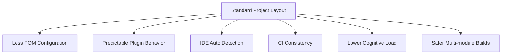
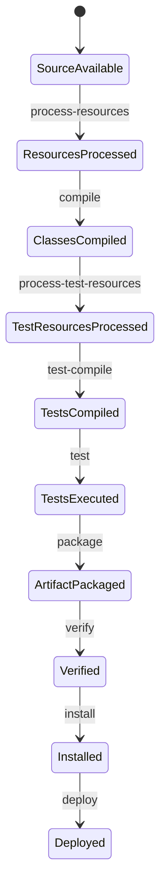
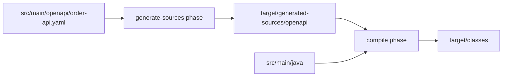
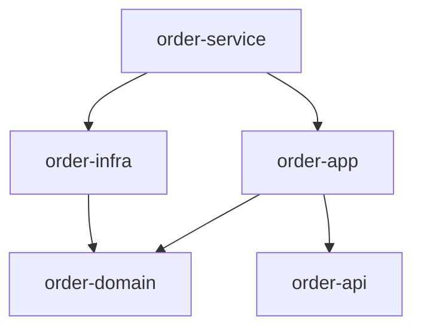
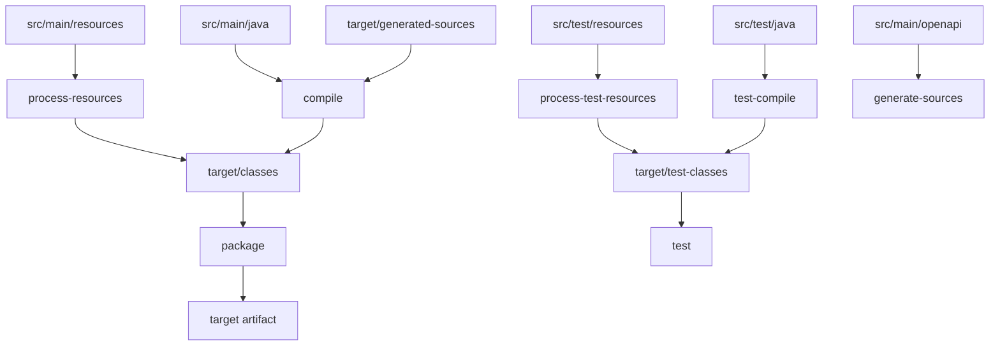

# Part 008 — Standard Project Layout and Build Conventions

Maven terkenal dengan prinsip **convention over configuration**.

Kalimat itu sering terdengar sederhana, tapi dalam build engineering artinya dalam:

> Maven bisa menjalankan build dengan sedikit konfigurasi karena banyak plugin sudah sepakat tentang lokasi source, resource, test, generated output, site, dan artifact output.

Standard Project Layout bukan sekadar gaya folder. Ia adalah **kontrak tidak tertulis antara project, Maven core, plugin, IDE, CI, repository, dan engineer yang membaca project itu dua tahun kemudian**.

Kalau layout dipatuhi, POM bisa pendek dan build mudah ditebak.
Kalau layout dilanggar tanpa alasan kuat, POM membengkak, plugin config bertambah, IDE behavior berbeda, CI menjadi fragile, dan debugging makin mahal.

Referensi resmi Apache Maven menyatakan bahwa direktori `target` digunakan untuk semua output build, sedangkan `src` berisi material sumber build dengan subdirektori berdasarkan tipe seperti `main`, `test`, dan `site`. Layout standar ini menjadi dasar banyak default behavior plugin Maven.

---

## 1. Kenapa Layout Penting?

Maven bukan build script imperative seperti:

```bash
javac $(find source -name "*.java") -d output
jar cf app.jar output
```

Maven bekerja dari model:

```txt
project model + standard layout + plugin defaults = build behavior
```

Jika project mengikuti standard layout, Maven bisa menyimpulkan banyak hal:

```txt
src/main/java       -> production Java source
src/main/resources  -> production resources
src/test/java       -> test Java source
src/test/resources  -> test resources
target/classes      -> compiled production classes
target/test-classes -> compiled test classes
target/*.jar        -> packaged artifact
```

Plugin seperti compiler, resources, surefire, jar, war, source, javadoc, dan site menggunakan asumsi layout ini.



Layout adalah bagian dari API project.

Ketika kamu mengubah layout, kamu mengubah API build.

---

## 2. Layout Maven Standar

Struktur minimal project JAR:

```txt
my-app/
  pom.xml
  src/
    main/
      java/
      resources/
    test/
      java/
      resources/
  target/
```

Struktur yang lebih lengkap:

```txt
my-app/
  pom.xml
  README.md
  src/
    main/
      java/
      resources/
      filters/
    test/
      java/
      resources/
      filters/
    it/
      java/
      resources/
    site/
      markdown/
      resources/
  target/
```

Tidak semua direktori wajib ada.

Maven tidak butuh folder kosong untuk bekerja. Tetapi jika folder ada, maknanya sebaiknya konsisten dengan konvensi.

---

## 3. Direktori Inti

### 3.1 `pom.xml`

Root project Maven selalu punya POM.

```txt
my-app/pom.xml
```

POM adalah model build. Layout adalah input fisik yang dibaca oleh model tersebut.

Jangan letakkan POM jauh dari source tanpa alasan kuat. Jika source dan POM tidak berada dalam boundary yang sama, developer dan CI akan sulit memahami artifact boundary.

### 3.2 `src/main/java`

Production Java source.

```txt
src/main/java/com/acme/order/OrderService.java
```

Masuk ke compile classpath dan dikompilasi ke:

```txt
target/classes
```

Rule:

> Code yang menjadi bagian artifact production masuk `src/main/java`.

Bukan:

```txt
src/java
source
app
java
```

kecuali ada alasan legacy kuat.

### 3.3 `src/main/resources`

Production resources.

Contoh:

```txt
src/main/resources/application.properties
src/main/resources/logback.xml
src/main/resources/META-INF/services/...
src/main/resources/db/migration/V1__init.sql
```

Resources diproses oleh resources plugin dan masuk ke:

```txt
target/classes
```

Lalu ikut dikemas ke JAR/WAR.

Rule:

> File yang harus tersedia di runtime classpath masuk `src/main/resources`.

Jangan campur file dokumentasi developer, CI script, atau deployment manifest ke resources kecuali aplikasi memang harus membaca file itu dari classpath.

### 3.4 `src/test/java`

Test Java source.

```txt
src/test/java/com/acme/order/OrderServiceTest.java
```

Dikompilasi ke:

```txt
target/test-classes
```

Masuk test classpath, bukan production artifact.

Rule:

> Test code tidak boleh bocor ke artifact production.

Kalau class test helper perlu dipakai banyak module, buat module `test-support` dengan artifact terpisah. Jangan import antar `src/test/java` module secara filesystem.

### 3.5 `src/test/resources`

Resources untuk test.

Contoh:

```txt
src/test/resources/application-test.properties
src/test/resources/fixtures/order-created.json
src/test/resources/logback-test.xml
```

Masuk ke:

```txt
target/test-classes
```

Tidak ikut production artifact.

Rule:

> Test fixture masuk `src/test/resources`, bukan `src/main/resources`.

Kalau fixture masuk `src/main/resources`, fixture itu bisa terpackage ke artifact production.

### 3.6 `target/`

Semua output build Maven berada di `target/`.

Contoh:

```txt
target/classes
target/test-classes
target/generated-sources
target/generated-test-sources
target/surefire-reports
target/failsafe-reports
target/my-app-1.0.0.jar
```

Rule keras:

> Jangan commit `target/`.

`target/` adalah disposable build output.

Jika sesuatu harus disimpan permanen, ia bukan output biasa. Ia harus menjadi source input, artifact, atau generated artifact yang dipublish.

---

## 4. Layout sebagai Build State Machine

Maven lifecycle mengubah isi directory secara bertahap.



Direktori output merepresentasikan state:

| State | Direktori/File |
|---|---|
| production source tersedia | `src/main/java` |
| production resources tersedia | `src/main/resources` |
| production classes compiled | `target/classes` |
| test source tersedia | `src/test/java` |
| test classes compiled | `target/test-classes` |
| unit test reports | `target/surefire-reports` |
| integration test reports | `target/failsafe-reports` |
| packaged artifact | `target/*.jar`, `target/*.war` |

Saat build gagal, tanyakan:

```txt
State mana yang belum tercapai?
```

Contoh:

```txt
ClassNotFound during test
```

Bisa berarti:

- production class belum compiled,
- test classpath salah,
- test resource tidak copied,
- generated source belum masuk source root,
- dependency scope salah.

Layout membantu narrowing.

---

## 5. Source vs Resource

Perbedaan source dan resource harus bersih.

| Jenis | Lokasi | Diproses oleh | Output |
|---|---|---|---|
| Java source | `src/main/java` | compiler plugin | `.class` di `target/classes` |
| Main resource | `src/main/resources` | resources plugin | copied ke `target/classes` |
| Test source | `src/test/java` | compiler plugin testCompile | `.class` di `target/test-classes` |
| Test resource | `src/test/resources` | resources plugin testResources | copied ke `target/test-classes` |

Source diubah menjadi class.
Resource biasanya disalin, kadang difilter.

Jangan letakkan `.java` di resources.
Jangan letakkan runtime config di source folder.

Struktur yang baik:

```txt
src/main/java/com/acme/order/OrderService.java
src/main/resources/com/acme/order/messages.properties
src/test/java/com/acme/order/OrderServiceTest.java
src/test/resources/com/acme/order/order-fixture.json
```

Struktur buruk:

```txt
src/main/java/config/application.yml
src/main/resources/com/acme/order/GeneratedThing.java
src/test/java/fixtures/order.json
```

---

## 6. Package Path Harus Selaras dengan Java Package

Maven tidak memaksa package path secara khusus. Java compiler yang peduli.

Tetapi layout yang sehat:

```txt
src/main/java/com/acme/order/OrderService.java
```

isi file:

```java
package com.acme.order;

public class OrderService {
}
```

Mismatch membuat navigasi buruk dan kadang membuat tool analysis bingung.

Bad:

```txt
src/main/java/service/OrderService.java
```

isi:

```java
package com.acme.order;
```

Walaupun compiler bisa menerima di banyak kondisi, jangan lakukan ini di project enterprise.

Rule:

> Physical path harus mengikuti logical package.

---

## 7. `src/main/filters` dan `src/test/filters`

Maven mengenal konsep filter untuk resource filtering.

Contoh:

```txt
src/main/filters/prod.properties
src/test/filters/test.properties
```

POM:

```xml
<build>
  <filters>
    <filter>src/main/filters/build.properties</filter>
  </filters>
</build>
```

Resource filtering bisa mengganti placeholder:

```properties
app.version=${project.version}
```

menjadi:

```properties
app.version=1.0.0
```

Tapi filtering harus digunakan hati-hati.

Risiko:

- build tidak reproducible,
- secret bocor ke artifact,
- config berbeda antara local dan CI,
- file binary rusak jika difilter,
- artifact berubah hanya karena property environment.

Rule:

> Filter hanya metadata build yang aman dan deterministic. Jangan filter secret production ke artifact.

Kita akan bahas resource filtering lebih detail di Part 019.

---

## 8. `src/site`

Maven punya site lifecycle.

Struktur umum:

```txt
src/site/
  site.xml
  markdown/
    index.md
  resources/
    architecture.png
```

Di banyak organisasi modern, Maven site tidak menjadi pusat dokumentasi. Tetapi `src/site` tetap konvensi resmi untuk material site Maven.

Gunakan jika:

- project library internal butuh dokumentasi publishable,
- organisasi masih memakai Maven site,
- plugin report Maven perlu dikumpulkan sebagai site,
- dokumentasi versioned bersama artifact.

Jangan gunakan `src/site` sebagai tempat dokumen random jika tidak ada site lifecycle.

Untuk dokumentasi engineering biasa, folder seperti ini lebih umum:

```txt
docs/
adr/
architecture/
```

Tetapi itu di luar standard Maven layout. Tidak masalah, selama jelas bukan input build Maven kecuali dikonfigurasi.

---

## 9. `src/main/webapp` untuk WAR

Untuk project `war`, layout umum:

```txt
src/main/webapp/
  WEB-INF/
    web.xml
  index.jsp
  assets/
```

Contoh POM:

```xml
<packaging>war</packaging>
```

WAR plugin akan memakai `src/main/webapp` sebagai web application source directory secara default.

Struktur:

```txt
my-webapp/
  pom.xml
  src/
    main/
      java/
      resources/
      webapp/
        WEB-INF/
          web.xml
        index.jsp
```

Rule:

> File webapp masuk `src/main/webapp`, bukan `src/main/resources`, kecuali file itu memang harus berada di classpath `WEB-INF/classes`.

Perbedaan:

```txt
src/main/resources -> WEB-INF/classes
src/main/webapp    -> root WAR content
```

Ini penting untuk aplikasi servlet/Jakarta EE.

---

## 10. Generated Sources

Generated source sebaiknya berada di `target/`, bukan `src/main/java`.

Konvensi umum:

```txt
target/generated-sources/<tool>/
target/generated-test-sources/<tool>/
```

Contoh:

```txt
target/generated-sources/openapi/
target/generated-sources/jaxb/
target/generated-sources/protobuf/
target/generated-test-sources/test-fixtures/
```

Kenapa bukan `src/main/java`?

Karena generated source adalah output dari input lain:

```txt
schema/openapi/proto/xsd -> generator -> generated java
```

Jika generated source dicampur dengan handwritten source:

- ownership kabur,
- diff besar,
- merge conflict,
- manual edit tidak sengaja,
- regeneration sulit dipercaya,
- code review penuh noise.

Pattern benar:

```txt
src/main/openapi/order-api.yaml
src/main/java/com/acme/order/OrderService.java
target/generated-sources/openapi/com/acme/order/api/OrderApi.java
```

Diagram:



Rule:

> Source of truth masuk `src/`. Generated output masuk `target/`.

Pengecualian boleh ada, tetapi harus sadar.

Generated source boleh di-commit jika:

- generator sulit distandarkan,
- consumer butuh source tanpa generator,
- regulatory audit meminta snapshot generated code,
- build isolation tidak boleh mengunduh generator,
- organisasi sengaja memilih checked-in generated code.

Tapi default-nya: jangan commit generated output.

---

## 11. Direktori Contract: OpenAPI, XSD, Protobuf, SQL

Maven tidak punya satu konvensi universal untuk semua contract file modern.

Tapi enterprise project perlu konsisten.

Contoh layout yang masuk akal:

```txt
src/main/openapi/
  order-api.yaml
src/main/proto/
  order-events.proto
src/main/xsd/
  order.xsd
src/main/sql/
  schema.sql
src/main/db/
  migration/
    V1__create_order_table.sql
```

Atau jika tool ecosystem punya konvensi dominan, ikuti tool tersebut.

Prinsip:

1. Contract production di bawah `src/main/<contract-type>`.
2. Contract test di bawah `src/test/<contract-type>`.
3. Generated output ke `target/generated-sources/<tool>`.
4. POM plugin mengikat generator ke lifecycle yang tepat.
5. Jangan menyimpan contract di root tanpa struktur.

Bad:

```txt
openapi.yaml
schema.xsd
proto/order.proto
sql/V1.sql
```

Bukan selalu salah, tapi dalam project besar root cepat menjadi tempat sampah.

Better:

```txt
src/main/openapi/order-api.yaml
src/main/proto/order-events.proto
src/main/db/migration/V1__init.sql
```

---

## 12. Integration Test Layout

Maven standar menyediakan `src/test/java`, tetapi integration test sering butuh pemisahan.

Ada beberapa pattern.

### 12.1 Pattern A: Naming Convention di `src/test/java`

```txt
src/test/java/com/acme/order/OrderServiceTest.java
src/test/java/com/acme/order/OrderServiceIT.java
```

Surefire menjalankan `*Test`.
Failsafe menjalankan `*IT`.

Kelebihan:

- sederhana,
- IDE mudah,
- tidak butuh source root tambahan.

Kekurangan:

- unit dan integration test bercampur di folder sama,
- dependency/resource IT bisa bercampur.

### 12.2 Pattern B: `src/it/java`

```txt
src/it/java/com/acme/order/OrderServiceIT.java
src/it/resources/application-it.properties
```

Butuh konfigurasi tambahan untuk menambahkan source root.

Kelebihan:

- pemisahan jelas,
- cocok untuk test berat.

Kekurangan:

- tidak Maven-standard default,
- butuh plugin tambahan,
- IDE mungkin perlu import config benar.

### 12.3 Pattern C: Module Terpisah

```txt
order-service/
order-service-it/
```

Kelebihan:

- isolation paling kuat,
- dependency IT tidak bocor ke service module,
- lifecycle bisa berbeda,
- cocok untuk contract/system integration tests.

Kekurangan:

- module lebih banyak,
- reactor lebih kompleks.

Rule:

> Untuk project kecil, naming convention cukup. Untuk enterprise service dengan dependency eksternal berat, pertimbangkan module integration-test terpisah.

Kita akan bahas Surefire/Failsafe lebih dalam di Part 021.

---

## 13. Multi-Module Layout

Struktur multi-module Maven yang sehat:

```txt
platform-order/
  pom.xml                  # aggregator/root
  order-parent/
    pom.xml                # optional product parent
  order-bom/
    pom.xml                # dependency management BOM
  order-api/
    pom.xml
    src/main/java/
  order-domain/
    pom.xml
    src/main/java/
  order-application/
    pom.xml
    src/main/java/
  order-service/
    pom.xml
    src/main/java/
    src/main/resources/
  order-it/
    pom.xml
    src/test/java/
```

Root aggregator:

```xml
<packaging>pom</packaging>
<modules>
  <module>order-bom</module>
  <module>order-api</module>
  <module>order-domain</module>
  <module>order-application</module>
  <module>order-service</module>
  <module>order-it</module>
</modules>
```

Jangan campur semua source di root project.

Bad:

```txt
platform-order/
  pom.xml
  src/main/java/...
  api/src/main/java/...
  service/src/main/java/...
```

Root aggregator sebaiknya tidak punya production source kecuali memang root itu juga artifact. Biasanya root hanya orchestration.

Rule:

> Dalam multi-module project, setiap module harus punya artifact boundary yang jelas.

---

## 14. Aggregator Root Tidak Sama dengan Parent

Layout sering kacau karena root POM dianggap selalu parent POM.

Padahal Maven mengenal dua konsep:

- aggregation: root mencantumkan `<modules>`,
- inheritance: child mencantumkan `<parent>`.

Bisa sama file, bisa berbeda.

Pattern sederhana:

```txt
root pom = aggregator + parent
```

Pattern enterprise lebih eksplisit:

```txt
root aggregator pom
corporate/product parent pom
modules inherit from parent
```

Contoh:

```txt
platform-order/
  pom.xml              # aggregator only
  order-parent/pom.xml # parent inherited by modules
  order-api/pom.xml
  order-service/pom.xml
```

Kenapa dipisah?

- aggregator sering repository-local,
- parent bisa dipublish dan dipakai repo lain,
- root bisa berisi modules yang tidak semua harus inherit config sama,
- product parent lifecycle berbeda dari root orchestration.

Rule:

> Layout harus membuat jelas apakah POM tertentu adalah artifact parent, aggregator, BOM, atau deployable module.

---

## 15. Naming Module dan Directory

Maven module directory tidak wajib sama dengan `artifactId`, tapi sebaiknya sama atau sangat dekat.

Good:

```txt
order-api/          artifactId: order-api
order-domain/       artifactId: order-domain
order-service/      artifactId: order-service
```

Bad:

```txt
api/                artifactId: order-api-v2
domain-model/       artifactId: acme-order-domain
svc/                artifactId: order-runtime-service
```

Tidak selalu salah, tapi menambah cognitive load.

Rule:

> Directory name, module name, dan artifactId harus membentuk mapping yang mudah ditebak.

Untuk repository besar:

```txt
services/order-service/
libraries/order-common/
contracts/order-api/
```

boleh, asal aggregator module path eksplisit dan konsisten.

---

## 16. Layout untuk Parent, BOM, dan Library

### 16.1 Parent POM Module

```txt
acme-service-parent/
  pom.xml
```

Biasanya tidak punya `src/main/java`.

POM:

```xml
<packaging>pom</packaging>
```

Isi:

- properties,
- dependencyManagement,
- pluginManagement,
- repositories policy jika diperlukan,
- build governance.

### 16.2 BOM Module

```txt
acme-platform-bom/
  pom.xml
```

POM:

```xml
<packaging>pom</packaging>
<dependencyManagement>
  <dependencies>
    ...
  </dependencies>
</dependencyManagement>
```

Tidak punya source.

### 16.3 Library Module

```txt
order-domain/
  pom.xml
  src/main/java/
  src/test/java/
```

Menghasilkan JAR.

### 16.4 Service Module

```txt
order-service/
  pom.xml
  src/main/java/
  src/main/resources/
  src/test/java/
  src/test/resources/
```

Menghasilkan deployable artifact: JAR, WAR, atau image input.

---

## 17. Layout dan Dependency Direction

Layout harus mendukung architecture, bukan melawannya.

Contoh modular service:

```txt
order-api       -> DTO/API interfaces/contracts
order-domain    -> domain model/rules
order-app       -> use cases/application services
order-infra     -> persistence/adapters
order-service   -> runtime assembly
```

Dependency direction:



Layout yang baik membuat dependency direction terlihat.

Layout buruk:

```txt
order-common
order-util
order-core
order-service
```

Masalahnya: `common`, `util`, `core` sering tidak menjelaskan boundary. Semua module bisa tergoda saling tarik dependency.

Rule:

> Module layout harus menjawab “artifact ini bertanggung jawab atas apa?” bukan hanya “isinya campuran apa?”

---

## 18. `target/` sebagai Boundary Build Output

Semua plugin custom/generator sebaiknya menulis ke:

```txt
${project.build.directory}
```

yang default-nya:

```txt
target
```

Contoh baik:

```xml
<outputDirectory>${project.build.directory}/generated-sources/openapi</outputDirectory>
```

Contoh buruk:

```xml
<outputDirectory>${project.basedir}/src/main/java</outputDirectory>
```

atau:

```xml
<outputDirectory>${session.executionRootDirectory}/generated</outputDirectory>
```

Kecuali benar-benar sengaja.

Kenapa?

Karena output di luar `target`:

- tidak otomatis dibersihkan oleh `mvn clean`,
- bisa tertinggal dari build lama,
- bisa masuk Git tidak sengaja,
- bisa tabrakan antar module,
- tidak aman untuk parallel build.

Rule:

> Build output harus disposable, module-local, dan dibersihkan oleh `clean`.

---

## 19. `mvn clean` dan Layout

`mvn clean` membersihkan output build default, terutama `target/`.

Jika plugin menghasilkan file di luar `target/`, `mvn clean` mungkin tidak membersihkannya kecuali kamu konfigurasi clean plugin tambahan.

Ini sering menyebabkan bug:

```txt
Build sukses karena file generated lama masih ada.
```

Kemudian CI fresh checkout gagal.

Checklist:

- Apakah generated output masuk `target/`?
- Apakah clean menghapus output?
- Apakah build dari fresh checkout berhasil?
- Apakah build setelah `git clean -xdf` berhasil?

Command sanity:

```bash
git clean -xdf
mvn clean verify
```

Hati-hati: `git clean -xdf` menghapus semua file untracked. Gunakan hanya jika paham risikonya.

---

## 20. IDE dan Standard Layout

IDE seperti IntelliJ IDEA, Eclipse, dan VS Code Java tooling memahami Maven standard layout.

Jika layout standar:

- source root otomatis terdeteksi,
- test source root otomatis terdeteksi,
- resources otomatis masuk classpath,
- generated sources kadang otomatis dikenali jika plugin mendukung,
- dependency classpath mengikuti Maven.

Jika layout custom:

- IDE import bisa berbeda dari CLI,
- developer A sukses, developer B gagal,
- test discovery tidak konsisten,
- annotation processor/generator tidak terlihat.

Rule:

> Jika build hanya sukses di IDE tetapi gagal di CLI, build belum benar. Maven CLI adalah source of truth.

CI harus menjalankan Maven command, bukan mengandalkan IDE metadata.

---

## 21. Non-Standard Layout: Kapan Boleh?

Non-standard layout boleh, tapi harus membayar biaya konfigurasi dan dokumentasi.

Alasan valid:

- migrasi legacy besar,
- source generated oleh tool lama,
- monorepo dengan constraint lama,
- polyglot repo yang perlu layout bersama,
- regulatory archive structure,
- compatibility dengan app server/tool vendor lama.

Alasan lemah:

- “team biasa pakai folder `source`”,
- “lebih pendek”,
- “biar beda”,
- “copy dari project lama tanpa paham”,
- “IDE tetap jalan”.

Jika harus non-standard:

1. Konfigurasi eksplisit di POM.
2. Dokumentasikan alasan.
3. Pastikan `mvn clean verify` dari fresh checkout berhasil.
4. Pastikan IDE import tidak butuh manual step.
5. Pastikan generated output tetap di `target`.
6. Tambahkan enforcer/check jika perlu.

Contoh menambah source directory dengan build-helper:

```xml
<plugin>
  <groupId>org.codehaus.mojo</groupId>
  <artifactId>build-helper-maven-plugin</artifactId>
  <version>${build.helper.maven.plugin.version}</version>
  <executions>
    <execution>
      <id>add-legacy-source</id>
      <phase>generate-sources</phase>
      <goals>
        <goal>add-source</goal>
      </goals>
      <configuration>
        <sources>
          <source>${project.basedir}/legacy-src</source>
        </sources>
      </configuration>
    </execution>
  </executions>
</plugin>
```

Tapi jangan jadikan ini default untuk project baru.

---

## 22. Layout untuk Resources: Jangan Jadikan Tempat Sampah

`src/main/resources` sering menjadi tempat semua file non-Java.

Itu salah.

Pertanyaan yang harus diajukan:

> Apakah file ini harus masuk runtime classpath artifact?

Jika ya, `src/main/resources` cocok.

Jika tidak, cari tempat lain.

| File | Lokasi yang lebih tepat |
|---|---|
| README developer | root `README.md` |
| ADR | `adr/` atau `docs/adr/` |
| Dockerfile | root atau `src/main/docker` sesuai konvensi tim |
| Kubernetes manifest | `deploy/`, `k8s/`, atau chart repo |
| CI config | `.github/`, `.gitlab-ci.yml`, etc |
| OpenAPI source | `src/main/openapi` |
| Protobuf | `src/main/proto` |
| XSD | `src/main/xsd` |
| Test fixture | `src/test/resources` |
| Runtime config template | tergantung strategy, hati-hati filtering |

Rule:

> `resources` berarti classpath resource, bukan “file yang bukan Java”.

---

## 23. Layout untuk Test Fixtures

Test fixture harus dipisahkan dari production resource.

Good:

```txt
src/test/resources/fixtures/order/valid-order.json
src/test/resources/fixtures/order/invalid-status.json
src/test/resources/contracts/order-event.avro
```

Bad:

```txt
src/main/resources/test-data/order.json
```

Kenapa?

Karena `src/main/resources` masuk artifact production.

Untuk fixture besar:

```txt
src/test/resources/fixtures/
```

Untuk reusable fixtures antar module:

```txt
order-test-fixtures/
  pom.xml
  src/main/java/
  src/main/resources/
```

Lalu module lain menambahkan dependency test scope:

```xml
<dependency>
  <groupId>com.acme.order</groupId>
  <artifactId>order-test-fixtures</artifactId>
  <version>${project.version}</version>
  <scope>test</scope>
</dependency>
```

Ini lebih sehat daripada copy-paste fixture antar module.

---

## 24. Layout untuk Annotation Processor

Annotation processor bisa membuat source generated saat compile.

Output biasanya:

```txt
target/generated-sources/annotations
```

Contoh kasus:

- MapStruct,
- Lombok delombok/annotation behavior,
- JPA metamodel,
- custom annotation processor.

Rule:

> Generated annotation output harus berada di target, dan build harus bisa regenerate dari source.

Jangan commit generated annotations kecuali sengaja.

Pastikan:

- annotation processor dependency dikonfigurasi dengan benar,
- generated source dikenali IDE,
- clean build tetap sukses,
- processor version dipin.

---

## 25. Layout untuk Reports

Maven plugin menghasilkan report di `target/`.

Contoh:

```txt
target/surefire-reports/
target/failsafe-reports/
target/site/
target/checkstyle-result.xml
target/spotbugsXml.xml
target/jacoco.exec
target/site/jacoco/
```

CI sebaiknya mengambil report dari lokasi predictable.

Pattern:

```txt
unit test reports        -> target/surefire-reports
integration test reports -> target/failsafe-reports
coverage reports         -> target/site/jacoco or target/jacoco.exec
static analysis          -> target/*reports*
```

Rule:

> Report adalah build output. Jangan commit. Publish sebagai CI artifact jika dibutuhkan.

---

## 26. Layout untuk Distribution Artifacts

Artifact utama biasanya:

```txt
target/${project.artifactId}-${project.version}.jar
```

Tambahan:

```txt
target/${project.artifactId}-${project.version}-sources.jar
target/${project.artifactId}-${project.version}-javadoc.jar
target/${project.artifactId}-${project.version}-tests.jar
```

Classifier muncul di nama artifact:

```txt
my-lib-1.0.0-sources.jar
my-lib-1.0.0-javadoc.jar
my-lib-1.0.0-tests.jar
```

Jangan rename artifact manual di luar Maven tanpa alasan. Artifact identity harus mengikuti coordinates.

Jika butuh distribution bundle:

- gunakan assembly plugin,
- atau packaging module khusus,
- atau CI artifact packaging,
- jangan shell script random yang mengambil file dari banyak module tanpa deklarasi.

---

## 27. Layout dan Reproducible Builds

Reproducible build membutuhkan input dan output yang jelas.

Layout membantu karena:

- source input berada di `src/`,
- output berada di `target/`,
- clean bisa menghapus output,
- generated files punya lokasi predictable,
- resources diproses di phase predictable,
- artifact packaging punya input predictable.

Risiko reproducibility:

```txt
source generated ke src/main/java
output di luar target
resource filtering dari environment
plugin membaca file dari home directory
plugin mengambil timestamp current time
plugin mengakses network saat package
```

Rule:

> Build reproducible dimulai dari layout yang membedakan input permanen dan output disposable.

---

## 28. Layout dan Secret Management

Jangan letakkan secret di:

```txt
src/main/resources/application-prod.properties
src/test/resources/real-credential.json
src/main/filters/prod-secret.properties
```

Karena bisa:

- masuk artifact,
- masuk Git,
- masuk CI logs,
- masuk container image,
- masuk dependency artifact di repository.

Pattern aman:

- secret masuk runtime secret manager,
- local dummy config masuk test resources,
- template aman boleh masuk repository,
- `settings.xml` untuk credential Maven repository,
- CI secret injection untuk pipeline, bukan source tree.

Jika file harus ada untuk local development:

```txt
src/test/resources/application-test.example.properties
```

atau:

```txt
config/application-local.example.yml
```

Jangan commit real secret.

---

## 29. Legacy Migration Strategy

Misal legacy project:

```txt
legacy-app/
  source/
  test/
  conf/
  build-output/
  lib/
  build.xml
```

Target Maven layout:

```txt
legacy-app/
  pom.xml
  src/main/java/
  src/main/resources/
  src/test/java/
  src/test/resources/
```

Migrasi bertahap:

### Step 1 — Inventory

```txt
source/      -> Java source?
conf/        -> runtime resources or deployment config?
lib/         -> dependencies or local proprietary jars?
test/        -> unit tests or integration tests?
```

### Step 2 — Move Source

```txt
source/ -> src/main/java/
test/   -> src/test/java/
```

### Step 3 — Classify Config

```txt
conf/runtime-classpath -> src/main/resources
conf/deployment        -> deploy/ or config/
conf/test              -> src/test/resources
```

### Step 4 — Replace `lib/`

Dependencies in `lib/` should become Maven dependencies.

If proprietary jar has no repository:

- publish to internal repository manager,
- do not use `system` scope unless temporary emergency,
- document replacement plan.

### Step 5 — Make Clean Build Work

```bash
mvn clean verify
```

from fresh checkout.

### Step 6 — Remove Legacy Build Output

Delete old output directories from repository.

Rule:

> Migration selesai bukan saat Maven command sukses sekali, tapi saat fresh checkout + clean build + IDE import + CI all pass without manual steps.

---

## 30. Anti-Patterns Layout

### 30.1 Source di Root

```txt
com/acme/App.java
pom.xml
```

Masalah:

- tidak scalable,
- plugin default tidak bekerja,
- IDE/import aneh,
- root penuh campuran.

### 30.2 Generated Code di Source Manual

```txt
src/main/java/com/acme/generated/...
```

Masalah:

- manual edit tidak sengaja,
- diff noise,
- regeneration tidak clear.

Better:

```txt
target/generated-sources/<tool>/
```

### 30.3 Test Fixture di Main Resources

```txt
src/main/resources/fixtures/test-order.json
```

Masalah:

- masuk production artifact.

Better:

```txt
src/test/resources/fixtures/test-order.json
```

### 30.4 Semua Module Bernama `common`

```txt
common/
core/
util/
base/
```

Masalah:

- boundary kabur,
- dependency direction kacau.

Better:

```txt
order-api/
order-domain/
order-persistence/
order-service/
```

### 30.5 Shared Build Output Antar Module

```txt
../generated/
../dist/
```

Masalah:

- parallel build tidak aman,
- clean tidak predictable,
- module coupling tersembunyi.

Better:

```txt
module-a/target/generated-sources/...
module-b depends on module-a artifact
```

---

## 31. Standard Layout Review Checklist

Gunakan checklist ini saat review repository Maven.

### Source Layout

- Apakah production Java ada di `src/main/java`?
- Apakah production resources ada di `src/main/resources`?
- Apakah test Java ada di `src/test/java`?
- Apakah test resources ada di `src/test/resources`?
- Apakah package path sesuai Java package?

### Output Layout

- Apakah semua output masuk `target/`?
- Apakah `target/` tidak di-commit?
- Apakah generated source masuk `target/generated-sources`?
- Apakah `mvn clean` membersihkan output?

### Resource Hygiene

- Apakah `src/main/resources` hanya berisi runtime classpath resources?
- Apakah test fixture tidak masuk main resources?
- Apakah secret tidak masuk resources/filter?
- Apakah resource filtering aman dan minimal?

### Multi-module

- Apakah root aggregator tidak campur source tanpa alasan?
- Apakah module directory dan artifactId konsisten?
- Apakah parent/BOM/service/library boundary jelas?
- Apakah module names menjelaskan responsibility?

### Non-standard Layout

- Apakah ada alasan valid?
- Apakah POM mengkonfigurasi secara eksplisit?
- Apakah dokumentasi menjelaskan kenapa?
- Apakah IDE dan CI tetap konsisten?

---

## 32. Good Layout Example: Enterprise Service

```txt
order-platform/
  pom.xml
  order-parent/
    pom.xml
  order-bom/
    pom.xml
  order-api/
    pom.xml
    src/main/openapi/order-api.yaml
    src/main/java/com/acme/order/api/
    src/test/java/com/acme/order/api/
  order-domain/
    pom.xml
    src/main/java/com/acme/order/domain/
    src/test/java/com/acme/order/domain/
  order-application/
    pom.xml
    src/main/java/com/acme/order/application/
    src/test/java/com/acme/order/application/
  order-persistence/
    pom.xml
    src/main/java/com/acme/order/persistence/
    src/main/resources/db/migration/
    src/test/java/com/acme/order/persistence/
    src/test/resources/fixtures/
  order-service/
    pom.xml
    src/main/java/com/acme/order/service/
    src/main/resources/application.properties
    src/test/java/com/acme/order/service/
    src/test/resources/application-test.properties
  order-it/
    pom.xml
    src/test/java/com/acme/order/it/
    src/test/resources/
```

Kelebihan:

- artifact boundary jelas,
- contract terpisah,
- domain tidak tergantung infrastructure,
- service assembly terpisah,
- integration tests bisa berat tanpa mencemari module utama,
- BOM bisa mengatur versi dependency platform,
- parent bisa mengatur build policy.

---

## 33. Good Layout Example: Library

```txt
money-lib/
  pom.xml
  src/main/java/com/acme/money/
    Money.java
    CurrencyCode.java
    ExchangeRate.java
  src/main/resources/META-INF/services/
  src/test/java/com/acme/money/
    MoneyTest.java
  src/test/resources/fixtures/
```

Library harus sederhana:

- no deployment config,
- no environment-specific resources,
- no Docker/Kubernetes noise,
- no test fixture in main resources,
- source/javadoc artifact optional tapi sering berguna.

---

## 34. Good Layout Example: Contract-First Module

```txt
order-contract/
  pom.xml
  src/main/openapi/order-api.yaml
  src/main/proto/order-events.proto
  src/main/xsd/order-command.xsd
  src/test/resources/examples/
  target/generated-sources/openapi/
  target/generated-sources/protobuf/
  target/generated-sources/jaxb/
```

Generated output tidak terlihat di Git.

POM mengikat generator:

```txt
generate-sources -> generate Java from contracts
compile          -> compile generated + handwritten support code
package          -> package contract artifact
```

Rule:

> Contract module harus jelas membedakan contract source, generated source, examples, dan packaged artifact.

---

## 35. Mermaid: Layout to Lifecycle Mapping



Baca diagram ini sebagai contract:

- input permanen ada di `src`,
- output sementara ada di `target`,
- lifecycle phase memindahkan project dari satu state ke state berikutnya.

---

## 36. Layout Decision Record Template

Untuk non-standard layout, buat decision record singkat.

```md
# ADR: Use src/it/java for integration tests

## Context
We have integration tests requiring containers and external service fixtures. Mixing them with unit tests in src/test/java makes local feedback slow and CI selection harder.

## Decision
Integration tests will live in src/it/java and src/it/resources. The build-helper plugin will add these directories during generate-test-sources. Failsafe will execute classes matching *IT.

## Consequences
- Unit tests remain fast in src/test/java.
- IDE import must respect Maven configuration.
- New contributors must not put integration tests in src/test/java unless intentionally fast and isolated.
- CI will run unit tests and integration tests in separate stages.
```

Ini tidak perlu panjang. Yang penting alasan dan konsekuensi jelas.

---

## 37. Invariant Layout Maven

Pegang invariant ini:

1. `src/main/java` adalah production Java source.
2. `src/main/resources` adalah production classpath resources.
3. `src/test/java` adalah test source.
4. `src/test/resources` adalah test classpath resources.
5. `target/` adalah disposable build output.
6. Generated output default-nya masuk `target/generated-sources` atau `target/generated-test-sources`.
7. `target/` tidak boleh di-commit.
8. Root aggregator sebaiknya tidak punya source kecuali memang artifact.
9. Parent POM dan BOM biasanya tidak punya source.
10. Resource bukan tempat semua file non-Java.
11. Layout custom harus punya alasan, konfigurasi eksplisit, dan dokumentasi.
12. Maven CLI clean build adalah source of truth, bukan IDE.

---

## 38. Practice: Audit Layout Project Maven

Ambil satu project Maven dan jalankan audit manual:

```bash
find . -maxdepth 3 -type d | sort
```

Jawab:

1. Apakah ada source di luar `src/main/java`?
2. Apakah ada test di luar `src/test/java`?
3. Apakah ada resource production yang sebenarnya test fixture?
4. Apakah ada secret/config environment di resources?
5. Apakah ada generated output yang di-commit?
6. Apakah ada output build di luar `target`?
7. Apakah module directory cocok dengan artifactId?
8. Apakah root aggregator punya source?
9. Apakah parent/BOM module punya source tanpa alasan?
10. Apakah `mvn clean verify` dari fresh checkout sukses?

Kemudian jalankan:

```bash
git status --ignored --short
```

Pastikan `target/` ignored.

---

## 39. Kesimpulan

Standard Project Layout adalah salah satu alasan Maven bisa sederhana.

Bukan karena Maven tidak kompleks, tetapi karena Maven memindahkan sebagian kompleksitas ke konvensi yang disepakati.

Jika layout dipatuhi, Maven bisa bekerja dengan sedikit konfigurasi:

```txt
src/main/java       -> compile
src/main/resources  -> process-resources
src/test/java       -> test-compile
src/test/resources  -> process-test-resources
target/             -> output
```

Jika layout dilanggar, kamu harus membayar dengan konfigurasi tambahan, debugging tambahan, dan risiko tambahan.

Engineer senior tidak dogmatis. Kadang layout custom memang perlu. Tapi senior engineer akan memastikan custom layout punya alasan, batas, dokumentasi, dan tidak merusak clean build.

Part berikutnya akan masuk ke **dependency graph fundamentals**: direct dependency, transitive dependency, scope, optional, exclusion, dan mediation. Di situlah Maven mulai terasa seperti graph engine, bukan sekadar build runner.

---

## References

- Apache Maven — Introduction to the Standard Directory Layout: `https://maven.apache.org/guides/introduction/introduction-to-the-standard-directory-layout.html`
- Apache Maven — Introduction to the Build Lifecycle: `https://maven.apache.org/guides/introduction/introduction-to-the-lifecycle.html`
- Apache Maven — Introduction to the POM: `https://maven.apache.org/guides/introduction/introduction-to-the-pom.html`
- Apache Maven — Guide to Configuring Plug-ins: `https://maven.apache.org/guides/mini/guide-configuring-plugins.html`
- Apache Maven — Maven Core Default Lifecycle Bindings: `https://maven.apache.org/ref/3.9.9/maven-core/default-bindings.html`
