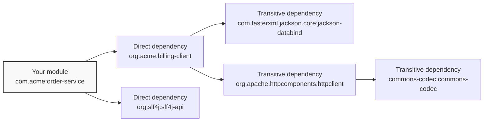
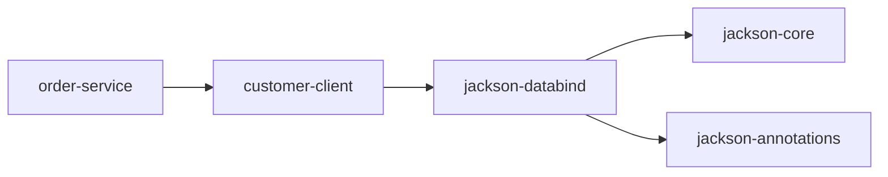
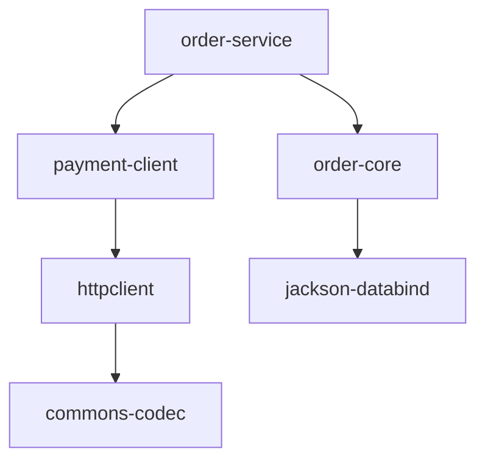
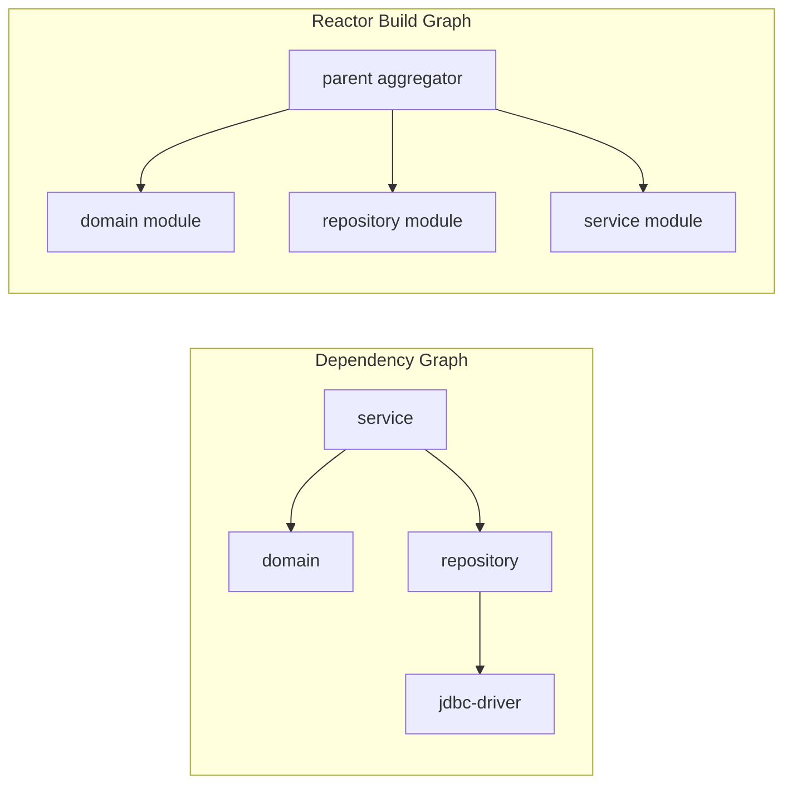
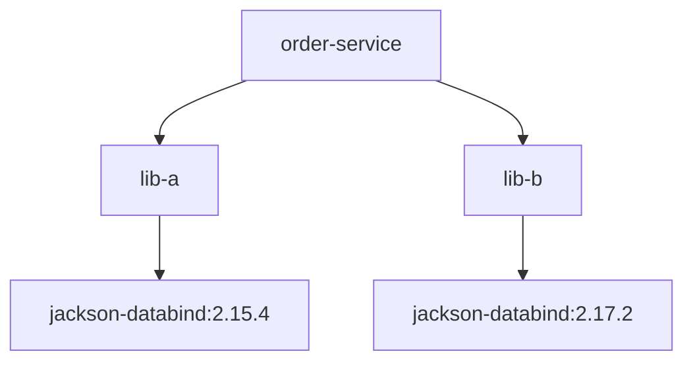
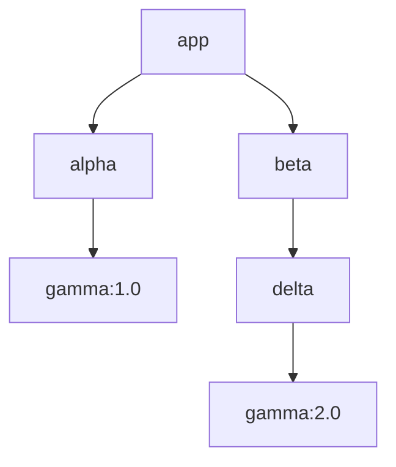
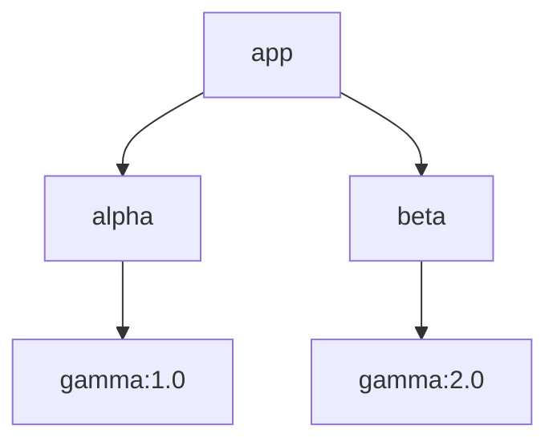

# Part 009 — Dependency Graph Fundamentals

Maven dependency management is often explained as “put libraries in `pom.xml`.” That explanation is dangerously incomplete.

At production scale, Maven dependencies are a **directed graph of artifacts** that becomes one or more **runtime classpaths**. The important word is not “library”. The important word is **graph**.

If you understand the graph, Maven becomes predictable.

If you do not understand the graph, Maven feels like magic:

- one version appears even though you declared another,
- a class exists in local development but not in production,
- a CVE comes from a library nobody remembers adding,
- a shaded JAR behaves differently from tests,
- a WAR accidentally packages servlet APIs,
- a transitive dependency silently changes after a parent/BOM update,
- two modules compile but fail together at runtime.

This part builds the mental model needed before moving into `dependencyManagement`, BOMs, scopes, repository resolution, and enterprise dependency governance.

---

## 1. What You Should Be Able To Do After This Part

After this part, you should be able to:

1. Read a dependency tree as an architecture artifact.
2. Distinguish **declared dependency**, **resolved dependency**, and **classpath entry**.
3. Explain why Maven selected a specific version.
4. Diagnose version conflicts using `mvn dependency:tree`.
5. Recognize when exclusions are correct and when they are hiding bad architecture.
6. Understand why optional dependencies do not mean “runtime optional”.
7. Predict how transitive dependencies enter your build.
8. Detect graph risks before they become incidents.

The target is not memorizing every Maven rule. The target is being able to reason from first principles when the build is broken.

---

## 2. The Core Mental Model

A Maven project has **declared dependencies** in its POM.

Those dependencies may have their own dependencies.

Maven resolves the reachable graph and produces a classpath for each build context.



This is not just a download graph. It affects:

- compile-time symbols,
- test runtime behavior,
- packaged artifacts,
- application startup,
- classloading order,
- vulnerability surface,
- license exposure,
- binary compatibility,
- deployment size,
- reproducibility.

A dependency graph is part of your software architecture.

---

## 3. Three Different Things People Confuse

Maven engineers must separate these three concepts:

| Concept | Meaning | Example |
|---|---|---|
| Declared dependency | What you explicitly write in `pom.xml` | `spring-context` declared in your module |
| Resolved dependency | What Maven selects after transitive traversal and conflict mediation | `jackson-databind:2.17.2` selected after mediation |
| Classpath entry | What is actually available to compiler/test/runtime/plugin execution | JAR included in `target/classes` test runtime classpath |

These are not equivalent.

You can declare a dependency that does not appear in a runtime package.
You can get a dependency that you never declared.
You can resolve one version but run with another if packaging or deployment adds competing libraries.

This is why Maven debugging should ask:

> “Which graph am I looking at, and for which build context?”

---

## 4. A Minimal Dependency Declaration

```xml
<dependencies>
  <dependency>
    <groupId>com.fasterxml.jackson.core</groupId>
    <artifactId>jackson-databind</artifactId>
    <version>2.17.2</version>
  </dependency>
</dependencies>
```

This says:

> “This project depends on artifact `com.fasterxml.jackson.core:jackson-databind:2.17.2` with default scope `compile`.”

Because the default scope is `compile`, that dependency is available for compile and runtime contexts unless modified by packaging/plugin behavior.

But this declaration does not only bring `jackson-databind`.

It can also bring transitive dependencies declared by `jackson-databind`, such as `jackson-annotations` and `jackson-core`.

That is where the graph begins.

---

## 5. Direct Dependencies

A direct dependency is one you declare in your POM.

```xml
<dependency>
  <groupId>org.postgresql</groupId>
  <artifactId>postgresql</artifactId>
  <version>42.7.3</version>
</dependency>
```

Direct dependencies communicate two things:

1. **Build requirement** — your code needs this artifact.
2. **Architecture ownership** — your module intentionally chooses this relationship.

At senior level, direct dependencies should be treated as **explicit architectural edges**.

Bad direct dependency:

```xml
<dependency>
  <groupId>com.acme.internal</groupId>
  <artifactId>customer-service-impl</artifactId>
  <version>1.8.0</version>
</dependency>
```

This often means a module is reaching into another module’s implementation.

Better direct dependency:

```xml
<dependency>
  <groupId>com.acme.customer</groupId>
  <artifactId>customer-api</artifactId>
  <version>1.8.0</version>
</dependency>
```

A direct dependency is not just a build line. It is a coupling statement.

---

## 6. Transitive Dependencies

A transitive dependency is brought because one of your dependencies depends on it.

Example:



Your POM may only declare `customer-client`, but your classpath may contain Jackson.

This is convenient, but it creates risk:

- dependency count grows silently,
- CVEs may come from deep graph nodes,
- incompatible versions may be selected,
- unused dependencies may still be packaged,
- classpath conflicts can emerge from unrelated features.

Transitivity is Maven’s productivity multiplier and risk multiplier.

---

## 7. The Dependency Graph Is Directed

Maven dependency edges have direction.



`order-service` depends on `payment-client`.

`payment-client` does **not** depend on `order-service`.

This matters for:

- module independence,
- release order,
- cyclic coupling avoidance,
- reusable libraries,
- test fixtures,
- service boundaries.

If two artifacts need each other, your graph has a design problem, not only a Maven problem.

Maven can sometimes hide poor architecture through multi-module ordering, but it cannot make cyclic design healthy.

---

## 8. The Dependency Graph Is Not the Reactor Graph

This is one of the most common Maven misconceptions.

A **dependency graph** describes artifact dependencies.

A **reactor graph** describes build order among modules in a multi-module build.

They often overlap, but they are not the same thing.



A module can be in the reactor without being a dependency.

A dependency can be outside the reactor and resolved from a repository.

This difference becomes critical when using:

```bash
mvn -pl service -am test
```

`-am` means “also make required modules”. Maven chooses modules based on the reactor/dependency relationship among selected modules, not because every module in the aggregator is needed.

---

## 9. Version Conflict: The Real Problem Maven Solves

Suppose your project depends on two libraries:



Only one version of `jackson-databind` can normally be placed on the ordinary Java classpath.

Maven must choose.

This is dependency mediation.

The key question is:

> “When multiple versions of the same artifact appear in the graph, which one wins?”

Maven’s documented mediation rule is commonly summarized as:

1. **Nearest definition wins**.
2. If depths are equal, the declaration appearing first wins.
3. A directly declared dependency is usually nearest because it is depth 1.

This explains many surprising builds.

---

## 10. Nearest Definition Wins

Consider this graph:



Distances from app:

| Artifact | Path | Distance |
|---|---:|---:|
| `gamma:1.0` | `app -> alpha -> gamma` | 2 |
| `gamma:2.0` | `app -> beta -> delta -> gamma` | 3 |

Maven selects `gamma:1.0` because it is nearer.

This does **not** mean `1.0` is newer, safer, or more compatible.

It only means it is nearer in the graph.

That rule is deterministic. It is not semantic.

---

## 11. Direct Declaration as Override

If you want `gamma:2.0`, declare it directly:

```xml
<dependencies>
  <dependency>
    <groupId>com.example</groupId>
    <artifactId>gamma</artifactId>
    <version>2.0</version>
  </dependency>

  <dependency>
    <groupId>com.example</groupId>
    <artifactId>alpha</artifactId>
    <version>1.0</version>
  </dependency>

  <dependency>
    <groupId>com.example</groupId>
    <artifactId>beta</artifactId>
    <version>1.0</version>
  </dependency>
</dependencies>
```

Now `gamma:2.0` is depth 1.

It wins.

However, this pattern has a hidden cost: your module now explicitly owns `gamma`, even if your code does not use it directly.

For isolated fixes, that may be acceptable.

For broad version alignment, prefer `dependencyManagement` or a BOM. That is Part 010.

---

## 12. Same Depth: Declaration Order Matters

Consider this graph:



Both `gamma` versions are distance 2.

Maven uses the first declaration path from the POM order.

```xml
<dependencies>
  <dependency>
    <groupId>com.example</groupId>
    <artifactId>alpha</artifactId>
    <version>1.0</version>
  </dependency>

  <dependency>
    <groupId>com.example</groupId>
    <artifactId>beta</artifactId>
    <version>1.0</version>
  </dependency>
</dependencies>
```

If `alpha` appears before `beta`, `gamma:1.0` may win.

This is why changing POM order can change runtime behavior.

At enterprise scale, relying on declaration order is fragile. Use dependency management.

---

## 13. Dependency Scope: Minimal Model

Scopes are covered deeply in Part 011. For now, know that scope influences which classpath receives a dependency.

Common scopes:

| Scope | Rough meaning |
|---|---|
| `compile` | Available to compile and runtime; default scope |
| `provided` | Needed to compile, expected from runtime/container |
| `runtime` | Not needed to compile, needed to run |
| `test` | Needed only for tests |
| `system` | Legacy/rare; avoid in normal builds |
| `import` | Only used in `dependencyManagement` for importing BOM POMs |

Example:

```xml
<dependency>
  <groupId>jakarta.servlet</groupId>
  <artifactId>jakarta.servlet-api</artifactId>
  <version>6.0.0</version>
  <scope>provided</scope>
</dependency>
```

This means:

> “Compile against Servlet API, but do not package it as a normal runtime dependency because the server provides it.”

Wrong scope is a runtime incident generator.

---

## 14. Scope Is Not Only Local

Scope also affects transitivity.

If your dependency has dependencies of its own, Maven uses scope propagation rules to decide how those transitive dependencies appear.

This is where many teams get surprised.

Example failure:

- Your WAR declares an internal library as `compile`.
- That library declares servlet API incorrectly as `compile`.
- Your WAR packages servlet API into `WEB-INF/lib`.
- Application server also provides servlet API.
- Runtime classloading becomes unpredictable.

The fix is not random exclusion.

The fix is ownership:

- servlet API should likely be `provided` where appropriate,
- internal libraries should not leak container APIs unnecessarily,
- deployable modules should make runtime boundaries explicit.

---

## 15. Optional Dependencies

A Maven optional dependency says:

> “This dependency is used by this project, but it should not be automatically forced onto downstream consumers as a normal transitive dependency.”

Example:

```xml
<dependency>
  <groupId>com.example</groupId>
  <artifactId>metrics-exporter-prometheus</artifactId>
  <version>1.3.0</version>
  <optional>true</optional>
</dependency>
```

This does not mean:

- Maven will decide dynamically at runtime,
- the dependency can be absent if your code always uses it,
- optional dependencies are safe plugin toggles,
- optional is a replacement for modular design.

Optional dependencies are a publication hint to consumers.

They are useful for libraries that support multiple integrations.

Bad library design:

```text
reporting-core
├── prometheus client
├── datadog client
├── new relic client
├── elastic client
└── cloudwatch client
```

Better library design:

```text
reporting-core
reporting-prometheus
reporting-datadog
reporting-cloudwatch
```

Optional dependencies can reduce transitive pollution, but separate artifacts usually produce cleaner boundaries.

---

## 16. Exclusions

An exclusion removes a transitive dependency from a dependency path.

```xml
<dependency>
  <groupId>com.example</groupId>
  <artifactId>legacy-client</artifactId>
  <version>2.4.0</version>
  <exclusions>
    <exclusion>
      <groupId>commons-logging</groupId>
      <artifactId>commons-logging</artifactId>
    </exclusion>
  </exclusions>
</dependency>
```

Exclusions are path-specific.

They say:

> “When bringing `legacy-client`, do not bring this specific transitive artifact through this edge.”

They do not globally ban the dependency from the whole graph.

The same artifact may still arrive through another path.

---

## 17. Good Exclusion vs Bad Exclusion

Good exclusion:

```xml
<dependency>
  <groupId>com.example</groupId>
  <artifactId>legacy-client</artifactId>
  <version>2.4.0</version>
  <exclusions>
    <exclusion>
      <groupId>commons-logging</groupId>
      <artifactId>commons-logging</artifactId>
    </exclusion>
  </exclusions>
</dependency>
```

Reason:

- known logging bridge strategy,
- replacement is explicitly declared,
- tests validate logging behavior,
- dependency tree is checked.

Bad exclusion:

```xml
<exclusion>
  <groupId>*</groupId>
  <artifactId>*</artifactId>
</exclusion>
```

Reason:

- hides graph ownership,
- may break runtime unexpectedly,
- makes upgrades dangerous,
- forces consumers to rediscover hidden requirements.

Use exclusions as surgery, not as architecture.

---

## 18. The “Used But Undeclared” Smell

A common Maven smell:

Your code imports a class from a transitive dependency.

Example:

```java
import com.fasterxml.jackson.databind.ObjectMapper;
```

But your POM only declares:

```xml
<dependency>
  <groupId>com.acme</groupId>
  <artifactId>customer-client</artifactId>
  <version>1.4.0</version>
</dependency>
```

`customer-client` happens to bring Jackson transitively.

Your code compiles.

But your module has a hidden dependency on Jackson.

If `customer-client` changes its internals and removes Jackson, your module breaks.

Rule:

> If your source code directly uses a library, declare it directly.

Transitive dependencies are implementation details of the dependency that brought them.

---

## 19. The “Declared But Unused” Smell

The opposite smell:

```xml
<dependency>
  <groupId>org.apache.commons</groupId>
  <artifactId>commons-lang3</artifactId>
  <version>3.14.0</version>
</dependency>
```

No code uses it.

Why this matters:

- larger graph,
- more CVE exposure,
- more classpath shadowing risk,
- slower dependency resolution,
- confusing ownership,
- accidental API surface leakage.

Unused dependency is not harmless. It is architecture noise.

---

## 20. Artifact Identity in a Graph

Maven conflict mediation is based on artifact identity.

A simplified identity is:

```text
groupId:artifactId:type:classifier
```

Version is the thing being selected.

This means these can be different artifacts:

```text
com.example:rules-engine:jar
com.example:rules-engine:test-jar:tests
com.example:rules-engine:jar:linux-x86_64
```

Classifier and type matter in advanced builds.

Most application teams mostly see plain JAR dependencies, but generated clients, test fixtures, native artifacts, and shaded artifacts can introduce classifiers.

Do not debug classifier problems as normal version conflicts.

---

## 21. Dependency Tree Command

Your first diagnostic tool:

```bash
mvn dependency:tree
```

Useful variants:

```bash
mvn dependency:tree -Dverbose
mvn dependency:tree -Dincludes=com.fasterxml.jackson.core
mvn dependency:tree -Dincludes=org.slf4j
mvn dependency:tree -Dscope=runtime
mvn dependency:tree -Dscope=test
```

For a multi-module project:

```bash
mvn -pl order-service dependency:tree
mvn -pl order-service -am dependency:tree
```

Use `-pl` to focus on the module you are diagnosing.

Do not read a 5,000-line tree if the failure is inside one deployable module.

---

## 22. Reading `dependency:tree`

Example output:

```text
com.acme:order-service:jar:1.0.0
+- com.acme:payment-client:jar:2.3.0:compile
|  +- org.apache.httpcomponents.client5:httpclient5:jar:5.3.1:compile
|  |  \- org.slf4j:slf4j-api:jar:2.0.12:compile
|  \- com.fasterxml.jackson.core:jackson-databind:jar:2.17.2:compile
+- com.acme:customer-client:jar:1.8.0:compile
|  \- com.fasterxml.jackson.core:jackson-databind:jar:2.15.4:compile - omitted for conflict with 2.17.2
\- org.junit.jupiter:junit-jupiter:jar:5.10.2:test
```

Read it as:

- Root project is `order-service`.
- `payment-client` and `customer-client` are direct compile dependencies.
- `httpclient5`, `slf4j-api`, and Jackson are transitive dependencies.
- Jackson `2.15.4` appears but loses mediation.
- JUnit is test-scoped.

This output is architecture evidence.

Attach it to build incident analysis when relevant.

---

## 23. Dependency Graph Failure Modes

### Failure Mode 1: Compile Passes, Runtime Fails

Symptom:

```text
java.lang.NoSuchMethodError: 'void com.fasterxml.jackson.databind.ObjectMapper.someMethod()'
```

Possible graph cause:

- compiled against newer version,
- runtime packaged older version,
- app server provides conflicting library,
- shaded artifact changed classpath,
- dependency mediation changed after BOM update.

Diagnostic path:

```bash
mvn -pl app dependency:tree -Dincludes=com.fasterxml.jackson.core
mvn -pl app dependency:build-classpath
jar tf target/app.jar | grep jackson
```

For WAR:

```bash
jar tf target/app.war | grep WEB-INF/lib | grep jackson
```

### Failure Mode 2: Class Exists Locally, Missing in CI

Possible causes:

- local repository has stale artifact,
- dependency declared through profile active locally but not CI,
- snapshot differs,
- settings mirror changes repository content,
- generated source dependency not declared.

### Failure Mode 3: Security Scanner Reports Unknown Library

Possible causes:

- transitive dependency,
- plugin dependency,
- shaded embedded dependency,
- container base image dependency,
- test dependency included in image accidentally.

Do not assume scanner output maps one-to-one to POM direct dependencies.

---

## 24. Dependency Graph vs Plugin Dependency Graph

Project dependencies are not the only dependencies in a Maven build.

Plugins have their own dependencies.

```xml
<plugin>
  <groupId>org.apache.maven.plugins</groupId>
  <artifactId>maven-surefire-plugin</artifactId>
  <version>3.3.1</version>
</plugin>
```

The plugin itself resolves dependencies needed to run the plugin.

Those dependencies are not automatically your application dependencies.

This distinction matters when:

- vulnerability scanners report plugin libraries,
- plugin classpath conflicts with project classpath,
- annotation processors are configured through compiler plugin,
- custom plugins load project classes,
- build extensions alter core behavior.

Do not debug plugin dependency conflicts as application dependency conflicts.

---

## 25. Dependency Graph vs Dependency Management

This is critical.

`dependencyManagement` does not add a dependency by itself.

It only manages versions/configuration for dependencies that appear elsewhere.

This POM fragment does **not** add Jackson:

```xml
<dependencyManagement>
  <dependencies>
    <dependency>
      <groupId>com.fasterxml.jackson.core</groupId>
      <artifactId>jackson-databind</artifactId>
      <version>2.17.2</version>
    </dependency>
  </dependencies>
</dependencyManagement>
```

This fragment declares Jackson:

```xml
<dependencies>
  <dependency>
    <groupId>com.fasterxml.jackson.core</groupId>
    <artifactId>jackson-databind</artifactId>
  </dependency>
</dependencies>
```

If a managed version exists, Maven fills the version.

Part 010 goes deep into this.

---

## 26. Why Dependency Graphs Become Hard in Enterprise Systems

Small projects have a dependency list.

Large systems have dependency ecosystems.

Enterprise Maven graphs become hard because of:

1. Many modules.
2. Many teams.
3. Many parent POMs.
4. Multiple BOMs.
5. Framework-managed versions.
6. Internal libraries with transitive dependencies.
7. Legacy app server dependencies.
8. Plugin dependencies.
9. Security patch pressure.
10. Inconsistent Java versions.
11. Snapshot usage.
12. Repository manager policies.
13. Generated clients.
14. Shaded artifacts.
15. Test fixtures leaking into production artifacts.

The graph is not merely technical. It is organizational.

A dependency graph reflects how teams share code, publish APIs, and govern change.

---

## 27. A Practical Example: Internal Client Library

Suppose you have:

```text
order-service
└── customer-client
    ├── jackson-databind
    ├── okhttp
    └── customer-api-model
```

Bad usage:

```java
// order-service code
import okhttp3.OkHttpClient;
```

But `order-service` does not declare `okhttp` directly.

It only gets it through `customer-client`.

This creates hidden coupling to `customer-client` internals.

Better:

- If `order-service` truly uses OkHttp, declare OkHttp directly.
- If only `customer-client` should know OkHttp, hide it behind `customer-client` API.
- If `customer-client` exposes OkHttp types publicly, that library’s API boundary is polluted.

Maven reveals architecture mistakes because dependency edges are coupling edges.

---

## 28. Public API Leakage

Library authors must avoid leaking implementation dependencies into public API.

Bad API:

```java
public class CustomerClient {
    public okhttp3.Response execute(CustomerRequest request) {
        // ...
    }
}
```

Now every consumer effectively depends on OkHttp concepts.

Better API:

```java
public interface CustomerClient {
    CustomerResponse getCustomer(CustomerId id);
}
```

Implementation can use OkHttp internally.

POM design should follow API design.

If your public Java API exposes a third-party type, the third-party dependency is no longer just implementation detail.

---

## 29. Dependency Graph and Binary Compatibility

A selected dependency version can compile but break runtime compatibility.

Example:

- `module-a` compiled with `lib-x:1.0`.
- `module-b` compiled with `lib-x:2.0`.
- final application resolves only `lib-x:1.0`.
- `module-b` calls method introduced in `2.0`.
- runtime throws `NoSuchMethodError`.

This is not a compiler error in the final module if compiled artifacts are already built.

It is a graph alignment problem.

BOMs, enforcer rules, dependency convergence checks, and integration tests reduce this risk.

---

## 30. Classpath Shadowing

Java classpath behavior can select one class when multiple JARs contain the same class name.

Dependency mediation chooses versions for the same Maven artifact identity.

It does not solve duplicate classes across different artifacts.

Example:

```text
com.legacy:legacy-json:1.0 contains com.example.JsonUtil
com.acme:common-json:2.0 contains com.example.JsonUtil
```

Maven may include both because they are different artifacts.

The classloader chooses one based on classpath order.

This can create subtle supply-chain and runtime risks.

Diagnostics:

```bash
mvn dependency:tree
mvn enforcer:enforce
jar tf dependency-a.jar | grep 'com/example/JsonUtil.class'
jar tf dependency-b.jar | grep 'com/example/JsonUtil.class'
```

Senior-level dependency work includes duplicate-class detection, not only version convergence.

---

## 31. Snapshot Dependencies in the Graph

A snapshot dependency is mutable.

```xml
<dependency>
  <groupId>com.acme</groupId>
  <artifactId>pricing-client</artifactId>
  <version>1.8.0-SNAPSHOT</version>
</dependency>
```

The coordinate looks stable, but the content can change.

Snapshot dependencies are useful during active development but dangerous in release and regulated environments.

Risks:

- build result changes without POM change,
- CI and local build differ,
- old snapshot remains cached,
- rollback is unclear,
- artifact provenance is weak.

Rule:

> Release artifacts should not depend on snapshot artifacts.

Enforce this with Maven Enforcer in production pipelines.

---

## 32. Dependency Graph Diagnostic Workflow

When a dependency problem appears, use this workflow.

### Step 1: Identify the failing class/artifact

From error:

```text
java.lang.ClassNotFoundException: org.foo.Bar
```

Find which artifact should contain it.

### Step 2: Inspect the focused tree

```bash
mvn -pl failing-module dependency:tree -Dincludes=org.foo
```

### Step 3: Inspect effective POM

```bash
mvn -pl failing-module help:effective-pom
```

### Step 4: Check runtime packaging

```bash
jar tf target/*.jar | grep foo
jar tf target/*.war | grep WEB-INF/lib | grep foo
```

### Step 5: Check scope

```bash
mvn -pl failing-module dependency:tree -Dscope=runtime
mvn -pl failing-module dependency:tree -Dscope=test
```

### Step 6: Identify mediation

Look for:

```text
omitted for conflict with ...
```

### Step 7: Decide ownership fix

Possible fixes:

- declare direct dependency,
- add version to dependency management,
- import/update BOM,
- correct scope,
- remove unused dependency,
- exclude transitive dependency,
- fix upstream library POM,
- split artifact boundary,
- align parent POM.

Do not start with exclusions. Start with ownership.

---

## 33. The Dependency Ownership Matrix

| Situation | Correct ownership response |
|---|---|
| Your code imports a class directly | Declare direct dependency |
| Dependency version must align across product | Manage version in BOM/parent |
| Transitive dependency is wrong for all consumers | Fix upstream POM if possible |
| Transitive dependency is wrong only for this edge | Use exclusion carefully |
| Library exposes third-party type in public API | Treat third-party dependency as API dependency |
| Deployable must not package container API | Use `provided` in deployable boundary |
| Security patch needed across many modules | Update BOM/dependency management, not 80 POMs manually |
| Test-only tool appears in runtime package | Fix scope or packaging configuration |

This matrix prevents random POM patching.

---

## 34. Anti-Patterns

### Anti-Pattern 1: Version Everywhere

```xml
<!-- repeated in 40 modules -->
<dependency>
  <groupId>com.fasterxml.jackson.core</groupId>
  <artifactId>jackson-databind</artifactId>
  <version>2.17.2</version>
</dependency>
```

Problem:

- hard to upgrade,
- inconsistent patches,
- module drift,
- dependency convergence pain.

Use dependency management or BOMs.

### Anti-Pattern 2: Exclusion-Driven Development

```xml
<exclusions>
  <exclusion>
    <groupId>*</groupId>
    <artifactId>*</artifactId>
  </exclusion>
</exclusions>
```

Problem:

- hides real dependency requirements,
- increases runtime risk,
- makes library behavior non-obvious.

### Anti-Pattern 3: Depending on Implementation Modules

```xml
<artifactId>payment-service-impl</artifactId>
```

Problem:

- internal implementation leaks,
- release coupling grows,
- tests become brittle,
- service/API boundaries blur.

### Anti-Pattern 4: Test Dependencies in Shared Production Libraries

```xml
<dependency>
  <groupId>org.mockito</groupId>
  <artifactId>mockito-core</artifactId>
</dependency>
```

No `test` scope.

Problem:

- test libraries leak into runtime graph,
- packaging grows,
- security scanners detect unnecessary libraries.

---

## 35. Senior-Level Heuristics

Use these heuristics in code review:

1. Every direct dependency should have a reason.
2. Every version should have an owner.
3. Every exclusion should have a comment or ticket-level justification.
4. Every deployable should have a clean runtime dependency tree.
5. Every internal library should minimize transitive leakage.
6. Every framework upgrade should include dependency tree diff.
7. Every release should ban snapshots.
8. Every security patch should be applied at the alignment layer, not randomly per module.
9. Every module should declare what it directly uses.
10. Every unexpected dependency should be explained or removed.

A clean dependency graph is a form of operational maturity.

---

## 36. Dependency Tree Diffing

Before and after upgrading a parent, BOM, or framework:

```bash
mvn -pl order-service dependency:tree -Dscope=runtime > before.txt
# upgrade version
mvn -pl order-service dependency:tree -Dscope=runtime > after.txt
diff -u before.txt after.txt
```

Look for:

- version changes,
- new dependencies,
- removed dependencies,
- scope changes,
- mediation changes,
- duplicate libraries,
- old vulnerable versions reappearing.

For regulated systems, dependency tree diff should be part of change evidence.

---

## 37. Minimal Practice Project

Create this structure:

```text
maven-dependency-graph-lab/
├── pom.xml
├── app/
│   ├── pom.xml
│   └── src/main/java/com/acme/app/App.java
├── client-a/
│   ├── pom.xml
│   └── src/main/java/com/acme/a/ClientA.java
└── client-b/
    ├── pom.xml
    └── src/main/java/com/acme/b/ClientB.java
```

Goal:

- `app` depends on `client-a` and `client-b`.
- `client-a` depends on one Jackson version.
- `client-b` depends on another Jackson version.
- Observe mediation.
- Add direct dependency in `app`.
- Observe mediation change.
- Move version into dependency management.
- Observe alignment.

This tiny lab teaches more than reading ten dependency articles.

---

## 38. Command Checklist

Use these often:

```bash
# Full dependency tree
mvn dependency:tree

# Tree for one module
mvn -pl order-service dependency:tree

# Runtime graph only
mvn -pl order-service dependency:tree -Dscope=runtime

# Test graph only
mvn -pl order-service dependency:tree -Dscope=test

# Focus on one group/artifact
mvn -pl order-service dependency:tree -Dincludes=com.fasterxml.jackson.core

# Effective POM
mvn -pl order-service help:effective-pom

# Build classpath
mvn -pl order-service dependency:build-classpath

# Analyze used/unused dependencies
mvn -pl order-service dependency:analyze
```

Treat these as inspection tools, not emergency-only commands.

---

## 39. Part 009 Summary

Maven dependencies form a graph, and that graph becomes classpaths and packaged runtime artifacts.

The key ideas:

- direct dependencies are explicit coupling,
- transitive dependencies are inherited coupling,
- Maven mediates version conflicts deterministically,
- nearest definition wins,
- same-depth conflicts may depend on declaration order,
- scopes affect classpath boundaries,
- optional dependencies are publication hints,
- exclusions are graph surgery,
- dependency management does not declare dependencies,
- dependency trees should be reviewed as architecture evidence.

The senior-level move is not memorizing POM syntax.

The senior-level move is asking:

> “What graph am I creating, who owns each edge, and what classpath will this produce?”

---

## 40. What Comes Next

Part 010 moves from graph mechanics to graph governance:

```text
learn-maven-part-010-dependency-management-bom-version-strategy.mdx
```

You will learn how `dependencyManagement`, BOMs, and version strategy turn dependency graphs from local chaos into organization-level policy.

---

## References

- Apache Maven — Introduction to the Dependency Mechanism: `https://maven.apache.org/guides/introduction/introduction-to-dependency-mechanism.html`
- Apache Maven — POM Reference: `https://maven.apache.org/pom.html`
- Apache Maven Dependency Plugin: `https://maven.apache.org/plugins/maven-dependency-plugin/`
- Apache Maven Enforcer Plugin: `https://maven.apache.org/enforcer/maven-enforcer-plugin/`
