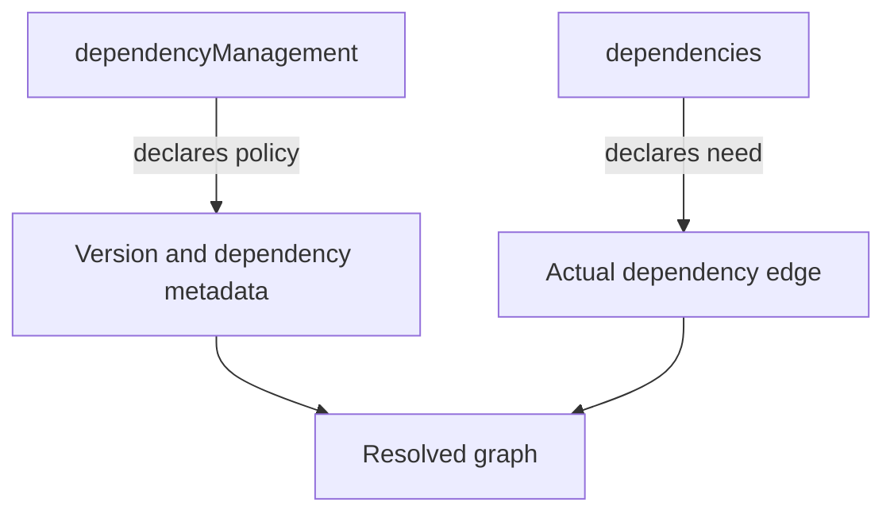
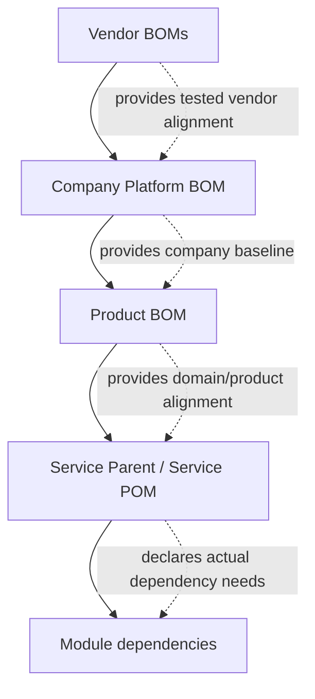

# Part 010 — Dependency Management, BOMs, and Version Strategy

Part 009 explained Maven dependencies as a graph.

This part explains how mature teams control that graph.

The main tool is `dependencyManagement`. The main pattern is the BOM. The main skill is version governance.

Most Maven teams learn this too late. They begin with versions scattered across modules, then a security patch arrives, then they discover the same library appears in 46 places with 9 different versions.

At that point, the problem is not XML.

The problem is the absence of version ownership.

---

## 1. What You Should Be Able To Do After This Part

After this part, you should be able to:

1. Explain why `dependencyManagement` does not add dependencies.
2. Use `dependencyManagement` to centralize versions.
3. Import a BOM correctly with `type=pom` and `scope=import`.
4. Decide when to use a parent POM versus a BOM.
5. Design a company/product/platform version alignment strategy.
6. Avoid version drift in multi-module builds.
7. Diagnose why a managed version did or did not apply.
8. Handle vendor BOMs such as framework/platform BOMs safely.
9. Create a clean internal BOM for enterprise services.
10. Build a dependency governance model that survives team growth.

This is where Maven changes from “build tool” to “organizational control plane”.

---

## 2. The Problem: Version Drift

Imagine a product with 20 Maven modules.

Each module declares its own versions:

```xml
<!-- module-a -->
<dependency>
  <groupId>com.fasterxml.jackson.core</groupId>
  <artifactId>jackson-databind</artifactId>
  <version>2.15.4</version>
</dependency>
```

```xml
<!-- module-b -->
<dependency>
  <groupId>com.fasterxml.jackson.core</groupId>
  <artifactId>jackson-databind</artifactId>
  <version>2.16.1</version>
</dependency>
```

```xml
<!-- module-c -->
<dependency>
  <groupId>com.fasterxml.jackson.core</groupId>
  <artifactId>jackson-databind</artifactId>
  <version>2.17.2</version>
</dependency>
```

This creates drift.

Drift causes:

- inconsistent runtime behavior,
- incompatible transitive dependencies,
- duplicate dependency mediation outcomes,
- slower security patching,
- harder framework upgrades,
- unpredictable multi-module integration,
- noisy code reviews,
- weak release evidence.

Version drift is not a Maven inconvenience. It is a software supply-chain governance failure.

---

## 3. The Mental Model

`dependencies` says:

> “I need this artifact.”

`dependencyManagement` says:

> “When this artifact is needed, use this version/configuration.”

They are different layers.



`dependencyManagement` is policy.

`dependencies` is demand.

Resolution uses both.

---

## 4. `dependencyManagement` Does Not Add Dependencies

This does not add Jackson to your project:

```xml
<dependencyManagement>
  <dependencies>
    <dependency>
      <groupId>com.fasterxml.jackson.core</groupId>
      <artifactId>jackson-databind</artifactId>
      <version>2.17.2</version>
    </dependency>
  </dependencies>
</dependencyManagement>
```

Your code will not compile against Jackson unless Jackson is declared in `<dependencies>` directly or arrives transitively through another dependency.

To declare it:

```xml
<dependencies>
  <dependency>
    <groupId>com.fasterxml.jackson.core</groupId>
    <artifactId>jackson-databind</artifactId>
  </dependency>
</dependencies>
```

Now Maven uses the managed version `2.17.2`.

This separation is the core of Maven version governance.

---

## 5. Basic Pattern: Parent Manages, Module Declares

Parent POM:

```xml
<project>
  <modelVersion>4.0.0</modelVersion>

  <groupId>com.acme.platform</groupId>
  <artifactId>acme-service-parent</artifactId>
  <version>1.0.0</version>
  <packaging>pom</packaging>

  <dependencyManagement>
    <dependencies>
      <dependency>
        <groupId>com.fasterxml.jackson.core</groupId>
        <artifactId>jackson-databind</artifactId>
        <version>2.17.2</version>
      </dependency>

      <dependency>
        <groupId>org.slf4j</groupId>
        <artifactId>slf4j-api</artifactId>
        <version>2.0.13</version>
      </dependency>
    </dependencies>
  </dependencyManagement>
</project>
```

Child module:

```xml
<project>
  <modelVersion>4.0.0</modelVersion>

  <parent>
    <groupId>com.acme.platform</groupId>
    <artifactId>acme-service-parent</artifactId>
    <version>1.0.0</version>
  </parent>

  <artifactId>order-service</artifactId>

  <dependencies>
    <dependency>
      <groupId>com.fasterxml.jackson.core</groupId>
      <artifactId>jackson-databind</artifactId>
    </dependency>
  </dependencies>
</project>
```

The child declares what it uses.

The parent defines the version.

This is clean because dependency ownership and version ownership are separate.

---

## 6. What Can Be Managed?

In `dependencyManagement`, Maven can manage dependency metadata such as:

- version,
- scope,
- exclusions,
- type,
- classifier.

Typical version management:

```xml
<dependencyManagement>
  <dependencies>
    <dependency>
      <groupId>org.junit.jupiter</groupId>
      <artifactId>junit-jupiter</artifactId>
      <version>5.10.2</version>
      <scope>test</scope>
    </dependency>
  </dependencies>
</dependencyManagement>
```

Child:

```xml
<dependency>
  <groupId>org.junit.jupiter</groupId>
  <artifactId>junit-jupiter</artifactId>
</dependency>
```

Now the child inherits version and scope.

However, be careful with managed scope. It can make the child POM shorter, but it can also hide important context.

For dependencies like JUnit, managed test scope is usually fine.

For dependencies whose scope varies by packaging type, local explicit scope can be clearer.

---

## 7. Dependency Management and Transitive Dependencies

`dependencyManagement` can also affect transitive dependency versions.

Suppose your app declares:

```xml
<dependency>
  <groupId>com.acme</groupId>
  <artifactId>customer-client</artifactId>
  <version>1.5.0</version>
</dependency>
```

`customer-client` depends on:

```text
com.fasterxml.jackson.core:jackson-databind:2.15.4
```

Your app parent manages:

```xml
<dependencyManagement>
  <dependencies>
    <dependency>
      <groupId>com.fasterxml.jackson.core</groupId>
      <artifactId>jackson-databind</artifactId>
      <version>2.17.2</version>
    </dependency>
  </dependencies>
</dependencyManagement>
```

Maven can use the managed version when resolving that dependency in your project graph.

This is powerful.

It means you can align dependency versions without editing every upstream POM.

But it also means your application can override the version expected by a library.

That override must be tested.

---

## 8. Managed Version Is Not Compatibility Proof

A managed version only controls selection.

It does not prove binary compatibility.

Example:

- `customer-client:1.5.0` was tested with Jackson `2.15.4`.
- Your platform manages Jackson `2.17.2`.
- Maven resolves `2.17.2`.
- Compilation passes.
- Runtime may still fail if behavior changed.

Version alignment reduces chaos.

It does not remove testing responsibility.

Every platform-level dependency upgrade should include:

- dependency tree diff,
- unit tests,
- integration tests,
- runtime smoke tests,
- compatibility notes,
- rollback plan.

---

## 9. BOM: Bill of Materials

A BOM is a POM whose main purpose is to provide dependency management.

It usually has:

```xml
<packaging>pom</packaging>
```

and a large `dependencyManagement` section.

A BOM says:

> “These artifacts are intended to be used together at these versions.”

Example internal BOM:

```xml
<project>
  <modelVersion>4.0.0</modelVersion>

  <groupId>com.acme.platform</groupId>
  <artifactId>acme-platform-bom</artifactId>
  <version>2026.07.0</version>
  <packaging>pom</packaging>

  <dependencyManagement>
    <dependencies>
      <dependency>
        <groupId>com.fasterxml.jackson.core</groupId>
        <artifactId>jackson-databind</artifactId>
        <version>2.17.2</version>
      </dependency>

      <dependency>
        <groupId>org.slf4j</groupId>
        <artifactId>slf4j-api</artifactId>
        <version>2.0.13</version>
      </dependency>
    </dependencies>
  </dependencyManagement>
</project>
```

A BOM is not an artifact you run.

It is a version alignment contract.

---

## 10. Importing a BOM

A BOM is imported inside `dependencyManagement`:

```xml
<dependencyManagement>
  <dependencies>
    <dependency>
      <groupId>com.acme.platform</groupId>
      <artifactId>acme-platform-bom</artifactId>
      <version>2026.07.0</version>
      <type>pom</type>
      <scope>import</scope>
    </dependency>
  </dependencies>
</dependencyManagement>
```

The key parts:

```xml
<type>pom</type>
<scope>import</scope>
```

Without these, Maven treats it like a normal dependency declaration rather than importing its managed dependency set.

After importing the BOM, a module can declare:

```xml
<dependency>
  <groupId>com.fasterxml.jackson.core</groupId>
  <artifactId>jackson-databind</artifactId>
</dependency>
```

The version comes from the imported BOM.

---

## 11. Parent POM vs BOM

This distinction matters.

A parent POM is inherited through `<parent>`.

A BOM is imported through `dependencyManagement`.

| Aspect | Parent POM | BOM |
|---|---|---|
| Mechanism | Inheritance | Import into dependency management |
| Can manage dependencies | Yes | Yes |
| Can manage plugins | Yes | No, not through BOM import |
| Can configure build | Yes | No |
| Can enforce company build behavior | Yes | Limited |
| Can be combined with another parent | No, Maven has single parent | Yes, multiple BOMs can be imported |
| Best for | Build policy and shared config | Version alignment |

Maven has single inheritance for parent POMs.

BOMs give composition.

This is why mature builds often use both:

```text
parent POM = build policy
BOM = dependency version policy
```

---

## 12. Recommended Enterprise Split

For serious systems, separate these concerns:

```text
acme-build-parent
├── pluginManagement
├── compiler configuration
├── surefire/failsafe defaults
├── enforcer rules
├── repository policy hooks
└── organization build conventions

acme-platform-bom
├── framework versions
├── internal library versions
├── approved third-party versions
├── security-patched dependency versions
└── integration-tested dependency set
```

Why split?

Because not every consumer should inherit your build config, but many consumers may want your dependency alignment.

Examples:

- Internal microservices inherit `acme-build-parent` and import `acme-platform-bom`.
- SDKs published to external partners may import the BOM but avoid internal build parent.
- Legacy services may not be ready for parent migration but can adopt the BOM first.
- Libraries can use the BOM without inheriting deployable service conventions.

---

## 13. Multi-BOM Import

A project may import more than one BOM.

Example:

```xml
<dependencyManagement>
  <dependencies>
    <dependency>
      <groupId>org.springframework.boot</groupId>
      <artifactId>spring-boot-dependencies</artifactId>
      <version>3.3.1</version>
      <type>pom</type>
      <scope>import</scope>
    </dependency>

    <dependency>
      <groupId>com.acme.platform</groupId>
      <artifactId>acme-platform-bom</artifactId>
      <version>2026.07.0</version>
      <type>pom</type>
      <scope>import</scope>
    </dependency>
  </dependencies>
</dependencyManagement>
```

This is powerful but must be governed.

Questions to ask:

1. Which BOM owns framework dependencies?
2. Which BOM owns internal library versions?
3. Which BOM wins when both manage the same artifact?
4. Are overrides intentional and documented?
5. Is the imported set integration-tested?

Do not stack BOMs casually.

A BOM import order can affect effective dependency management.

Always inspect the effective POM and dependency tree after BOM changes.

---

## 14. Vendor BOMs

Frameworks often publish BOMs to align their ecosystem.

Examples:

```xml
<dependency>
  <groupId>org.springframework.boot</groupId>
  <artifactId>spring-boot-dependencies</artifactId>
  <version>3.3.1</version>
  <type>pom</type>
  <scope>import</scope>
</dependency>
```

or:

```xml
<dependency>
  <groupId>software.amazon.awssdk</groupId>
  <artifactId>bom</artifactId>
  <version>2.25.60</version>
  <type>pom</type>
  <scope>import</scope>
</dependency>
```

A vendor BOM is useful because the vendor has tested a coherent set of versions.

But it does not know your whole application.

Your platform may still need to manage:

- internal libraries,
- logging stack,
- security-patched overrides,
- JDBC drivers,
- test stack,
- observability libraries,
- organization-approved versions.

Vendor BOMs are inputs to your platform policy, not a replacement for it.

---

## 15. BOM Ownership Models

### Model A: Framework BOM as Source of Truth

Use when:

- one major framework dominates the service,
- team follows framework release cadence,
- minimal custom platform governance.

Pros:

- simple,
- vendor tested,
- easier upgrades.

Cons:

- less control,
- organization-specific patches may scatter,
- non-framework dependency alignment remains unsolved.

### Model B: Company BOM Imports Vendor BOM

```text
acme-platform-bom
└── imports spring-boot-dependencies
└── manages acme libraries
└── overrides selected third-party versions
```

Pros:

- single internal import for teams,
- centralized patches,
- internal libraries aligned.

Cons:

- platform team owns compatibility validation,
- BOM release process needed.

### Model C: Product BOM Per Product Line

```text
acme-platform-bom
acme-payments-bom
acme-regulatory-bom
acme-data-bom
```

Pros:

- better domain-specific alignment,
- supports different release cadences.

Cons:

- possible divergence,
- BOM composition complexity.

For enterprise systems, Model B plus product overlays is often the practical target.

---

## 16. Version Strategy Is Architecture

A version strategy answers:

1. Who decides dependency versions?
2. Where are versions declared?
3. How are versions upgraded?
4. How are security patches applied?
5. How are compatibility risks tested?
6. How are exceptions documented?
7. How is drift detected?
8. What is allowed in release artifacts?

Without explicit answers, every team invents its own strategy.

That creates graph chaos.

---

## 17. Recommended Version Ownership Layers

Use layers:



Layer responsibilities:

| Layer | Owns |
|---|---|
| Vendor BOM | Vendor ecosystem versions |
| Company platform BOM | Approved third-party baseline and internal shared versions |
| Product BOM | Product-specific libraries and tested combinations |
| Service parent | Build policy and plugin defaults |
| Module POM | Actual dependency declarations |

This makes version decisions inspectable.

---

## 18. Version Placement Rules

Use these rules in code review:

1. **Application module POMs should rarely contain third-party versions.**
2. **Shared internal library versions should be managed by product/platform BOM.**
3. **Plugin versions belong in `pluginManagement`, not dependency BOM.**
4. **Test library versions should still be centrally managed.**
5. **Security-patched versions should be applied centrally.**
6. **Temporary overrides must have expiry and reason.**
7. **Direct dependency declaration should remain local because it documents usage.**

Bad:

```xml
<dependency>
  <groupId>org.slf4j</groupId>
  <artifactId>slf4j-api</artifactId>
  <version>2.0.13</version>
</dependency>
```

Better:

```xml
<dependency>
  <groupId>org.slf4j</groupId>
  <artifactId>slf4j-api</artifactId>
</dependency>
```

Version comes from BOM or parent dependency management.

---

## 19. Plugin Versions Are Different

Do not confuse dependency versions with plugin versions.

This manages application/library dependencies:

```xml
<dependencyManagement>
  <dependencies>
    ...
  </dependencies>
</dependencyManagement>
```

This manages build plugins:

```xml
<build>
  <pluginManagement>
    <plugins>
      <plugin>
        <groupId>org.apache.maven.plugins</groupId>
        <artifactId>maven-compiler-plugin</artifactId>
        <version>3.13.0</version>
      </plugin>
    </plugins>
  </pluginManagement>
</build>
```

A BOM imported via `dependencyManagement` does not configure your compiler plugin.

Build policy belongs in parent POM/plugin management.

Dependency version policy belongs in BOM/dependency management.

---

## 20. The Internal BOM Structure

A production internal BOM should be organized by ownership, not random alphabetical dumping.

Example:

```xml
<dependencyManagement>
  <dependencies>
    <!-- 1. Internal platform modules -->
    <dependency>
      <groupId>com.acme.platform</groupId>
      <artifactId>acme-logging</artifactId>
      <version>${acme.logging.version}</version>
    </dependency>

    <!-- 2. Internal domain APIs -->
    <dependency>
      <groupId>com.acme.customer</groupId>
      <artifactId>customer-api</artifactId>
      <version>${customer.api.version}</version>
    </dependency>

    <!-- 3. Serialization stack -->
    <dependency>
      <groupId>com.fasterxml.jackson.core</groupId>
      <artifactId>jackson-databind</artifactId>
      <version>${jackson.version}</version>
    </dependency>

    <!-- 4. Logging stack -->
    <dependency>
      <groupId>org.slf4j</groupId>
      <artifactId>slf4j-api</artifactId>
      <version>${slf4j.version}</version>
    </dependency>
  </dependencies>
</dependencyManagement>
```

Properties can improve readability:

```xml
<properties>
  <jackson.version>2.17.2</jackson.version>
  <slf4j.version>2.0.13</slf4j.version>
  <customer.api.version>4.8.1</customer.api.version>
</properties>
```

But avoid property chaos. Every property should have a reason.

---

## 21. Property-Based Versions: Useful or Dangerous?

Properties make coordinated upgrades easier.

Good:

```xml
<properties>
  <jackson.version>2.17.2</jackson.version>
</properties>

<dependencyManagement>
  <dependencies>
    <dependency>
      <groupId>com.fasterxml.jackson.core</groupId>
      <artifactId>jackson-databind</artifactId>
      <version>${jackson.version}</version>
    </dependency>
    <dependency>
      <groupId>com.fasterxml.jackson.core</groupId>
      <artifactId>jackson-core</artifactId>
      <version>${jackson.version}</version>
    </dependency>
  </dependencies>
</dependencyManagement>
```

Useful when several artifacts share a release train.

Bad:

```xml
<properties>
  <dep1.version>1.0.0</dep1.version>
  <dep2.version>2.0.0</dep2.version>
  <dep3.version>3.0.0</dep3.version>
</properties>
```

If every dependency gets a property, you may create an unreadable indirection layer.

Heuristic:

> Use version properties for families, release trains, or frequently upgraded dependencies. Do not use them mechanically for every artifact.

---

## 22. BOM Import Precedence

When multiple BOMs or dependency management sections manage the same artifact, effective management order matters.

This can become subtle.

Example:

```xml
<dependencyManagement>
  <dependencies>
    <dependency>
      <groupId>com.vendor</groupId>
      <artifactId>vendor-bom</artifactId>
      <version>1.0.0</version>
      <type>pom</type>
      <scope>import</scope>
    </dependency>

    <dependency>
      <groupId>com.acme</groupId>
      <artifactId>acme-bom</artifactId>
      <version>2026.07.0</version>
      <type>pom</type>
      <scope>import</scope>
    </dependency>
  </dependencies>
</dependencyManagement>
```

If both manage the same artifact, inspect the effective POM instead of guessing:

```bash
mvn help:effective-pom
```

Then inspect resolved graph:

```bash
mvn dependency:tree -Dincludes=the.group:the-artifact
```

Policy:

> Do not rely on memory for BOM precedence. Inspect the effective POM and dependency tree.

---

## 23. Local Override Pattern

Sometimes a module needs a temporary override.

Example:

```xml
<dependencyManagement>
  <dependencies>
    <!-- TEMP: override due to CVE-XXXX-YYYY until platform BOM 2026.08.0 -->
    <dependency>
      <groupId>org.example</groupId>
      <artifactId>example-lib</artifactId>
      <version>4.2.9</version>
    </dependency>
  </dependencies>
</dependencyManagement>
```

Rules for local overrides:

1. Comment the reason.
2. Link to issue/security ticket if possible.
3. Add expiry condition.
4. Add test coverage for compatibility.
5. Move to platform BOM if more than one module needs it.

Uncommented overrides become permanent archaeology.

---

## 24. Dependency Management in Multi-Module Builds

Typical structure:

```text
order-platform/
├── pom.xml                 # aggregator + parent
├── order-bom/
│   └── pom.xml             # dependency management only
├── order-api/
│   └── pom.xml
├── order-domain/
│   └── pom.xml
├── order-infra/
│   └── pom.xml
└── order-service/
    └── pom.xml
```

There are two valid designs.

### Design 1: Root Parent Manages Everything

Root `pom.xml` contains `dependencyManagement`.

Simple for one repository.

Weakness:

- harder to share version alignment outside repo,
- parent inheritance required,
- external consumers cannot easily import dependency policy.

### Design 2: Dedicated BOM Module

`order-bom` contains dependency management.

Other modules inherit parent and/or import BOM.

Pros:

- shareable,
- publishable,
- decouples build policy from dependency policy,
- cleaner for multi-repo ecosystems.

For enterprise systems, prefer dedicated BOM once reuse crosses repository boundaries.

---

## 25. Internal BOM Example

`order-bom/pom.xml`:

```xml
<project>
  <modelVersion>4.0.0</modelVersion>

  <parent>
    <groupId>com.acme.order</groupId>
    <artifactId>order-parent</artifactId>
    <version>1.0.0-SNAPSHOT</version>
  </parent>

  <artifactId>order-bom</artifactId>
  <packaging>pom</packaging>

  <dependencyManagement>
    <dependencies>
      <dependency>
        <groupId>com.acme.order</groupId>
        <artifactId>order-api</artifactId>
        <version>${project.version}</version>
      </dependency>

      <dependency>
        <groupId>com.acme.order</groupId>
        <artifactId>order-domain</artifactId>
        <version>${project.version}</version>
      </dependency>

      <dependency>
        <groupId>com.fasterxml.jackson.core</groupId>
        <artifactId>jackson-databind</artifactId>
        <version>${jackson.version}</version>
      </dependency>
    </dependencies>
  </dependencyManagement>
</project>
```

Consumer:

```xml
<dependencyManagement>
  <dependencies>
    <dependency>
      <groupId>com.acme.order</groupId>
      <artifactId>order-bom</artifactId>
      <version>1.0.0</version>
      <type>pom</type>
      <scope>import</scope>
    </dependency>
  </dependencies>
</dependencyManagement>

<dependencies>
  <dependency>
    <groupId>com.acme.order</groupId>
    <artifactId>order-api</artifactId>
  </dependency>
</dependencies>
```

This lets consumers use aligned internal artifacts without hardcoding versions.

---

## 26. Parent + BOM Combined Pattern

Service POM:

```xml
<project>
  <modelVersion>4.0.0</modelVersion>

  <parent>
    <groupId>com.acme.platform</groupId>
    <artifactId>acme-service-parent</artifactId>
    <version>2026.07.0</version>
  </parent>

  <artifactId>order-service</artifactId>

  <dependencyManagement>
    <dependencies>
      <dependency>
        <groupId>com.acme.platform</groupId>
        <artifactId>acme-platform-bom</artifactId>
        <version>2026.07.0</version>
        <type>pom</type>
        <scope>import</scope>
      </dependency>
    </dependencies>
  </dependencyManagement>

  <dependencies>
    <dependency>
      <groupId>com.fasterxml.jackson.core</groupId>
      <artifactId>jackson-databind</artifactId>
    </dependency>
  </dependencies>
</project>
```

This is explicit but repetitive.

An alternative is to import the BOM inside the parent POM’s `dependencyManagement`.

Then service POMs only inherit parent.

Tradeoff:

- simpler child POMs,
- tighter coupling between build parent and dependency policy.

There is no universal answer. Choose based on how independently you need to version build policy and dependency policy.

---

## 27. Do Not Put Everything in the Parent Automatically

A common mistake:

```xml
<parent>
  <groupId>com.acme</groupId>
  <artifactId>everything-parent</artifactId>
</parent>
```

This parent contains:

- plugin config,
- dependency management,
- profiles,
- repositories,
- reporting,
- distribution management,
- test settings,
- release config,
- environment-specific behavior,
- unrelated product versions.

This becomes a build monolith.

Symptoms:

- teams fear parent upgrades,
- small changes affect hundreds of modules,
- exceptions multiply,
- hidden profiles alter builds,
- external consumers cannot adopt partial policy.

Better:

```text
acme-build-parent
acme-platform-bom
acme-testing-bom
acme-observability-bom
acme-product-bom
```

Composition beats mega-parent inheritance.

---

## 28. Dependency Convergence

Dependency convergence means the graph resolves consistent versions for dependencies rather than multiple conflicting versions.

Example conflict:

```text
app
├── alpha -> commons-io:2.11.0
└── beta  -> commons-io:2.16.1
```

Maven will select one.

But convergence governance asks:

> “Should this graph be allowed to contain conflicting candidate versions at all?”

Maven Enforcer can check dependency convergence.

Example:

```xml
<plugin>
  <groupId>org.apache.maven.plugins</groupId>
  <artifactId>maven-enforcer-plugin</artifactId>
  <version>3.5.0</version>
  <executions>
    <execution>
      <id>enforce-dependency-convergence</id>
      <goals>
        <goal>enforce</goal>
      </goals>
      <configuration>
        <rules>
          <dependencyConvergence />
        </rules>
      </configuration>
    </execution>
  </executions>
</plugin>
```

Strict convergence can be noisy in legacy systems.

Use it intentionally:

- strict for new modules,
- report-only or scoped rules during migration,
- enforced for security-sensitive services,
- temporary ignores with expiry.

---

## 29. Banned Dependencies

Some dependencies should not enter production graphs.

Examples:

- vulnerable library versions,
- test libraries in runtime,
- old logging implementations,
- forbidden licenses,
- deprecated internal artifacts,
- app-server-provided APIs packaged into WARs.

Use enforcer rules or repository manager policy.

Example:

```xml
<bannedDependencies>
  <excludes>
    <exclude>commons-logging:commons-logging</exclude>
    <exclude>log4j:log4j</exclude>
  </excludes>
</bannedDependencies>
```

A BOM aligns good versions.

An enforcer blocks forbidden versions.

You usually need both.

---

## 30. Security Patch Workflow

Scenario:

A security scanner reports `example-lib:1.2.0` vulnerable.

Bad workflow:

1. Search all POMs.
2. Manually update random modules.
3. Hope dependency mediation works.
4. Merge partial fixes.

Good workflow:

1. Identify graph paths:

```bash
mvn dependency:tree -Dincludes=org.example:example-lib
```

2. Identify version ownership:

```bash
mvn help:effective-pom | grep -n "example-lib" -A 5 -B 5
```

3. Update BOM or parent dependency management.
4. Run dependency tree diff.
5. Run test suite.
6. Add enforcer ban for vulnerable version if necessary.
7. Release new BOM/parent.
8. Upgrade consumers.

Security patches should move through ownership layers, not POM scavenger hunts.

---

## 31. Version Upgrade Playbook

Use this for framework/library upgrades.

### Step 1: Locate ownership

Where is the version managed?

- vendor BOM,
- company BOM,
- product BOM,
- parent POM,
- local module POM,
- transitive dependency only.

### Step 2: Change one ownership layer

Avoid changing 20 child POMs unless there is no better layer.

### Step 3: Generate dependency tree diff

```bash
mvn -pl service-a dependency:tree -Dscope=runtime > before.txt
mvn -pl service-a dependency:tree -Dscope=runtime > after.txt
diff -u before.txt after.txt
```

### Step 4: Check affected APIs

Look for:

- removed classes,
- changed methods,
- behavior changes,
- transitive version changes,
- logging backend changes,
- serialization changes.

### Step 5: Run integration boundary tests

Especially for:

- JSON/XML serialization,
- database drivers,
- HTTP clients,
- Kafka clients,
- security libraries,
- time/date libraries,
- logging frameworks.

### Step 6: Publish aligned version

Release BOM/parent and upgrade consumers intentionally.

---

## 32. Handling Internal Library Versions

Internal libraries can be more dangerous than third-party libraries because teams assume they are safe.

Example:

```xml
<dependency>
  <groupId>com.acme.customer</groupId>
  <artifactId>customer-client</artifactId>
  <version>7.2.1</version>
</dependency>
```

If every service chooses its own client version, platform behavior fragments.

Better:

```xml
<dependency>
  <groupId>com.acme.customer</groupId>
  <artifactId>customer-client</artifactId>
</dependency>
```

Version from product/platform BOM.

Internal BOM should answer:

- which API versions are approved,
- which client versions match which server capability,
- which generated contract versions are supported,
- which deprecated versions are banned,
- which versions are allowed for long-term support.

For regulated lifecycle/case-management platforms, this becomes audit evidence.

---

## 33. Version Ranges: Avoid for Production Builds

Maven supports version ranges, but production builds should avoid them in most cases.

Example risky declaration:

```xml
<version>[1.0,2.0)</version>
```

Problem:

- builds can change without POM change,
- reproducibility weakens,
- testing evidence no longer maps to a precise artifact,
- rollback becomes ambiguous,
- repository metadata changes can alter resolution.

Use fixed versions in BOMs and parent POMs.

For production:

> Precise versions beat clever version ranges.

---

## 34. SNAPSHOTs in Dependency Management

Avoid managing snapshots for release-bound builds:

```xml
<dependencyManagement>
  <dependencies>
    <dependency>
      <groupId>com.acme</groupId>
      <artifactId>pricing-client</artifactId>
      <version>2.1.0-SNAPSHOT</version>
    </dependency>
  </dependencies>
</dependencyManagement>
```

This creates a mutable platform.

Acceptable only for:

- active local integration,
- short-lived feature branches,
- pre-release staging environments with clear controls.

Not acceptable for:

- release BOM,
- production service parent,
- regulated deployment evidence,
- long-lived CI default branch.

Rule:

> A release BOM should contain release versions.

---

## 35. CI-Friendly Versions

Maven can support CI-friendly version placeholders such as `${revision}`, `${sha1}`, and `${changelist}` in specific versioning workflows.

Example:

```xml
<version>${revision}</version>

<properties>
  <revision>1.4.0</revision>
</properties>
```

This is useful for coordinated multi-module builds and release automation.

But do not confuse it with dependency version governance.

CI-friendly project versioning answers:

> “What version is this project being built as?”

Dependency management answers:

> “What versions of dependencies should this project use?”

They are related but separate concerns.

Part 030 will go deeper into release and CI-friendly versions.

---

## 36. Diagnosing Managed Version Problems

Symptom:

> “I imported the BOM, but Maven still uses the wrong version.”

Diagnostic checklist:

### 1. Is the BOM imported in the right place?

Correct:

```xml
<dependencyManagement>
  <dependencies>
    <dependency>
      <type>pom</type>
      <scope>import</scope>
    </dependency>
  </dependencies>
</dependencyManagement>
```

Wrong:

```xml
<dependencies>
  <dependency>
    <type>pom</type>
    <scope>import</scope>
  </dependency>
</dependencies>
```

### 2. Does another dependency management entry override it?

Run:

```bash
mvn help:effective-pom
```

### 3. Is the dependency declared with an explicit local version?

Local explicit versions can override managed expectations.

### 4. Are you inspecting the correct module?

In multi-module builds:

```bash
mvn -pl the-module help:effective-pom
mvn -pl the-module dependency:tree
```

### 5. Is the artifact identity exactly the same?

Check:

- `groupId`,
- `artifactId`,
- `type`,
- `classifier`.

### 6. Is a profile changing dependency management?

Run active profile diagnostics:

```bash
mvn help:active-profiles
```

---

## 37. Effective POM Is the Source of Truth

When in doubt:

```bash
mvn help:effective-pom
```

For a module:

```bash
mvn -pl order-service help:effective-pom
```

The effective POM shows merged configuration from:

- Super POM,
- parent POMs,
- current POM,
- active profiles,
- imported dependency management.

Do not argue from source POM fragments alone.

Maven executes the effective model.

---

## 38. Dependency Tree Confirms Resolution

Effective POM shows configuration.

Dependency tree shows actual resolved graph.

Use both.

```bash
mvn -pl order-service help:effective-pom > effective-pom.xml
mvn -pl order-service dependency:tree > dependency-tree.txt
```

If they disagree with your expectation, your mental model is wrong or incomplete.

That is good news: Maven is giving you evidence.

---

## 39. Enterprise Review Checklist

Use this checklist during POM review.

### Dependency declaration

- Does the module directly declare what it uses?
- Are versions omitted when centrally managed?
- Are scopes explicit where important?
- Are test dependencies scoped to test?

### Dependency management

- Is version ownership clear?
- Are related artifacts aligned?
- Are temporary overrides documented?
- Are internal libraries managed centrally?
- Are security patches applied at the right layer?

### BOM usage

- Are BOM imports in `dependencyManagement`?
- Are `type=pom` and `scope=import` present?
- Is BOM order intentional?
- Are vendor BOMs wrapped or directly imported?
- Is the effective POM inspected after BOM changes?

### Governance

- Are snapshots banned in release builds?
- Are vulnerable versions banned?
- Is dependency convergence checked?
- Are dependency tree diffs part of upgrade review?
- Is repository policy aligned with build policy?

---

## 40. A Practical Refactoring: From Version Chaos to BOM

### Before

```text
service-a/pom.xml -> jackson 2.15.4
service-b/pom.xml -> jackson 2.16.1
service-c/pom.xml -> jackson 2.17.2
service-d/pom.xml -> no direct jackson, transitive 2.14.3
```

### Step 1: Create platform BOM

```xml
<artifactId>acme-platform-bom</artifactId>
<packaging>pom</packaging>

<dependencyManagement>
  <dependencies>
    <dependency>
      <groupId>com.fasterxml.jackson.core</groupId>
      <artifactId>jackson-databind</artifactId>
      <version>2.17.2</version>
    </dependency>
  </dependencies>
</dependencyManagement>
```

### Step 2: Import BOM in services or parent

```xml
<dependencyManagement>
  <dependencies>
    <dependency>
      <groupId>com.acme.platform</groupId>
      <artifactId>acme-platform-bom</artifactId>
      <version>2026.07.0</version>
      <type>pom</type>
      <scope>import</scope>
    </dependency>
  </dependencies>
</dependencyManagement>
```

### Step 3: Remove local versions

```xml
<dependency>
  <groupId>com.fasterxml.jackson.core</groupId>
  <artifactId>jackson-databind</artifactId>
</dependency>
```

### Step 4: Inspect graph

```bash
mvn dependency:tree -Dincludes=com.fasterxml.jackson.core
```

### Step 5: Add enforcement

Add convergence checks or banned vulnerable versions.

### Step 6: Document ownership

The BOM release notes should state:

```text
Jackson aligned to 2.17.2 across platform.
Reason: security patch + framework compatibility.
Validated by: order-service, payment-service, customer-service integration tests.
Rollback: acme-platform-bom 2026.06.1.
```

This is what professional dependency governance looks like.

---

## 41. Anti-Patterns

### Anti-Pattern 1: BOM as Dependency

Wrong:

```xml
<dependencies>
  <dependency>
    <groupId>com.acme</groupId>
    <artifactId>acme-bom</artifactId>
    <version>1.0.0</version>
  </dependency>
</dependencies>
```

BOMs should be imported in `dependencyManagement` with `type=pom` and `scope=import`.

### Anti-Pattern 2: Mega Parent

One parent controls everything for everyone.

Problem:

- impossible to upgrade safely,
- high blast radius,
- hidden coupling between unrelated teams.

### Anti-Pattern 3: Local Version Override Without Reason

```xml
<dependency>
  <groupId>org.example</groupId>
  <artifactId>example-lib</artifactId>
  <version>9.9.9</version>
</dependency>
```

Why does this module override the platform?

If nobody can answer, it is build debt.

### Anti-Pattern 4: Vendor BOM Blind Trust

Importing a framework BOM does not solve:

- internal client versions,
- security exceptions,
- non-framework libraries,
- organization repository policy,
- test stack alignment.

### Anti-Pattern 5: Version Ranges for “Automatic Updates”

Automatic dependency changes without deliberate validation are not maturity.

They are uncontrolled change.

---

## 42. Senior-Level Heuristics

1. A module declares dependencies; a BOM declares versions.
2. Parent POM is for build behavior; BOM is for dependency alignment.
3. A version should appear once at the right ownership layer.
4. Vendor BOMs are useful but not sufficient for enterprise governance.
5. Do not rely on nearest-wins for important dependency versions.
6. Every override should be temporary or intentionally owned.
7. Security patches belong in BOMs or dependency management first.
8. Effective POM beats guesswork.
9. Dependency tree confirms actual graph resolution.
10. Reproducibility requires fixed, inspectable dependency versions.

---

## 43. Practice Lab

Create:

```text
maven-bom-lab/
├── pom.xml
├── platform-bom/
│   └── pom.xml
├── service-a/
│   └── pom.xml
└── service-b/
    └── pom.xml
```

Exercise:

1. Put Jackson versions directly in `service-a` and `service-b`.
2. Observe drift using `dependency:tree`.
3. Create `platform-bom`.
4. Move Jackson version to `platform-bom`.
5. Import BOM in root parent or each service.
6. Remove local versions.
7. Confirm resolved versions.
8. Add a temporary local override.
9. Inspect effective POM.
10. Remove override and restore central ownership.

Expected learning:

- `dependencyManagement` does not add dependencies,
- BOM import controls version alignment,
- local explicit versions create drift,
- effective POM reveals actual management,
- dependency tree confirms resolution.

---

## 44. Part 010 Summary

Dependency management is Maven’s version policy mechanism.

The important points:

- `dependencies` declares need.
- `dependencyManagement` declares policy.
- BOMs package dependency policy for reuse.
- Parent POMs and BOMs solve different problems.
- Vendor BOMs provide ecosystem alignment but not full enterprise governance.
- Internal BOMs should align platform, product, and internal library versions.
- Version drift is an architecture and supply-chain risk.
- Effective POM and dependency tree are the two core inspection tools.
- Security patches should move through ownership layers.
- Mature teams treat version strategy as operational policy.

The senior Maven question is:

> “Where should this version be owned so that change is safe, visible, and enforceable?”

---

## 45. What Comes Next

Part 011 moves from version alignment to classpath boundaries:

```text
learn-maven-part-011-scope-classpath-runtime-boundaries.mdx
```

You will learn how Maven scopes affect compile, test, runtime, packaging, transitivity, and deployment behavior.

---

## References

- Apache Maven — Introduction to the Dependency Mechanism: `https://maven.apache.org/guides/introduction/introduction-to-dependency-mechanism.html`
- Apache Maven — POM Reference: `https://maven.apache.org/pom.html`
- Apache Maven Dependency Plugin — Managing Dependencies: `https://maven.apache.org/plugins/maven-dependency-plugin/examples/managing-dependencies.html`
- Apache Maven Enforcer Plugin: `https://maven.apache.org/enforcer/maven-enforcer-plugin/`
- Apache Maven — Guide to Configuring Plug-ins: `https://maven.apache.org/guides/mini/guide-configuring-plugins.html`
