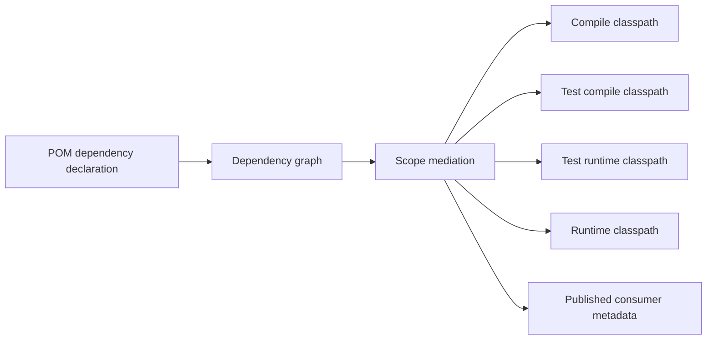
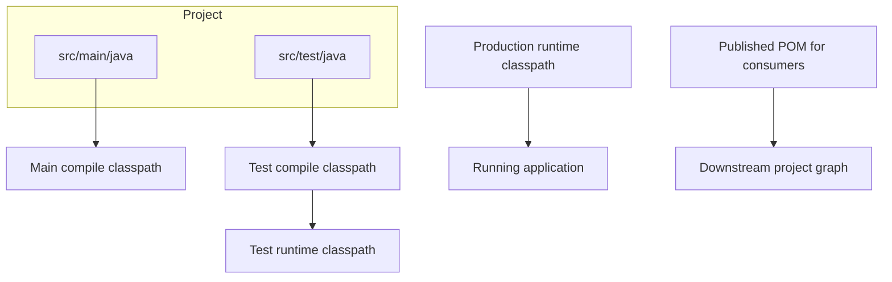
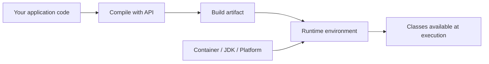
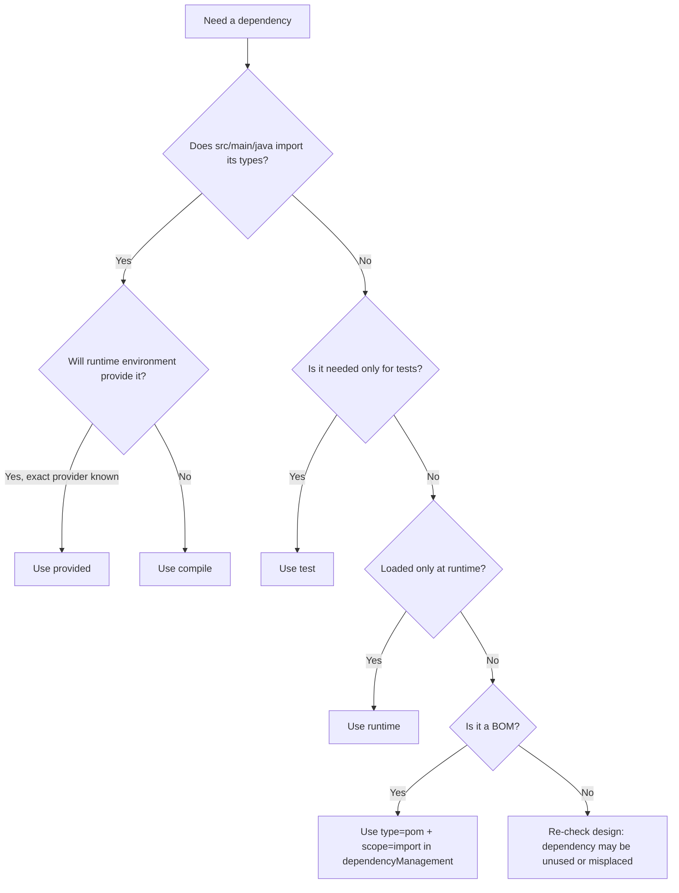
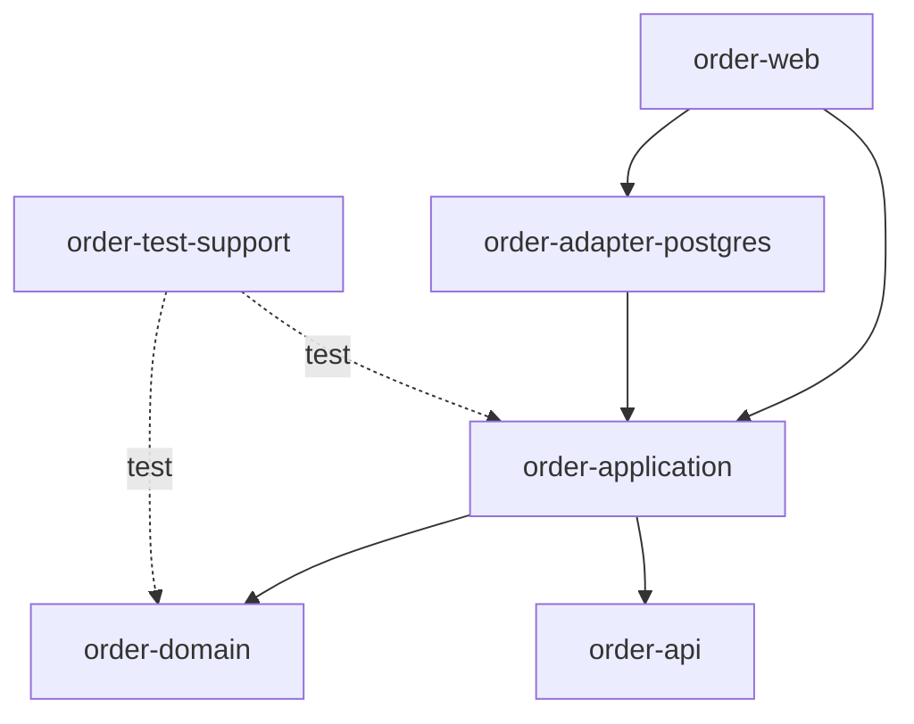

# Scopes, Classpaths, and Runtime Boundaries

Maven dependency scope is often taught as a small table: `compile`, `provided`, `runtime`, `test`, `system`, `import`.

That explanation is technically true and operationally insufficient.

At production scale, scope is not just a label on a dependency. Scope is a **classpath boundary contract**.

It answers four questions:

1. Can my main source code compile against this artifact?
2. Can my test source code compile and run against this artifact?
3. Must this artifact be present when the application executes?
4. Should downstream consumers inherit this dependency transitively?

When engineers get scope wrong, the build may still pass. The failure appears later as a runtime incident:

- `ClassNotFoundException`
- `NoClassDefFoundError`
- `NoSuchMethodError`
- duplicate classes
- fat JAR conflicts
- app-server classloader conflicts
- test-only libraries leaking into production artifacts
- production-only runtime dependencies missing from integration tests

This part builds the mental model needed to reason about those failures without guessing.

---

## 1. Scope Is Not About Where the JAR Lives

A common beginner model is:

> Maven downloads dependencies into `.m2`, then puts them into the project.

That model hides the real behavior.

A dependency can be downloaded into the local repository and still not be used in a particular classpath.

A better model:



The dependency graph is not equal to the runtime classpath.

The runtime classpath is a **projection** of the graph.

Scope is one of the rules Maven uses to build that projection.

---

## 2. The Six Maven Scopes

Maven defines six dependency scopes:

| Scope | Primary meaning | Main use |
|---|---|---|
| `compile` | Needed to compile main code and available to consumers | Normal library dependency |
| `provided` | Needed to compile, but expected from JDK/container/runtime environment | Servlet API, Jakarta EE API, container APIs |
| `runtime` | Not needed to compile main code, but needed to execute | JDBC driver, logging implementation, runtime provider |
| `test` | Needed only for tests | JUnit, Mockito, testcontainers, test fixtures |
| `system` | Similar to provided but resolved from an explicit local file path | Legacy escape hatch; avoid |
| `import` | Imports dependency management from another POM | BOM import only inside `dependencyManagement` |

The dangerous mistake is to treat this as a vocabulary problem.

It is a **boundary-design problem**.

---

## 3. Classpath Projections

Think of a Maven project as having several classpaths.



Each dependency scope contributes differently:

| Scope | Main compile | Test compile | Test runtime | Production runtime | Transitive to consumers |
|---|---:|---:|---:|---:|---:|
| `compile` | yes | yes | yes | yes | yes |
| `provided` | yes | yes | usually yes for tests | no | no |
| `runtime` | no | yes for tests | yes | yes | yes as runtime |
| `test` | no | yes | yes | no | no |
| `system` | yes | yes | yes | usually no publication value | no useful portability |
| `import` | no direct classpath effect | no direct classpath effect | no direct classpath effect | no direct classpath effect | no direct dependency |

This table should become instinctive.

When you read a dependency declaration, ask:

> Which classpath should this dependency enter, and who is responsible for providing it at runtime?

---

## 4. `compile`: The Default, But Not Always the Right Default

If no scope is specified, Maven uses `compile`.

```xml
<dependency>
  <groupId>org.apache.commons</groupId>
  <artifactId>commons-lang3</artifactId>
  <version>3.14.0</version>
</dependency>
```

This means:

- available to `src/main/java`
- available to `src/test/java`
- available during runtime
- propagated to downstream consumers if this project is used as a dependency

Use `compile` when the dependency is part of your **public or internal implementation contract**.

Examples:

- a library your main code imports directly
- a type exposed in your public API
- a framework API used directly by production code
- utility dependency required by runtime behavior

### The direct-use rule

If your source code directly imports a type, declare that dependency directly.

Do not rely on a transitive dependency just because it currently appears in the dependency tree.

Bad:

```java
import org.apache.commons.lang3.StringUtils;
```

But `pom.xml` only declares a framework that happens to bring `commons-lang3` transitively.

This is fragile. The upstream framework can remove or change its transitive dependency and your build breaks without a source change in your repo.

Good:

```xml
<dependency>
  <groupId>org.apache.commons</groupId>
  <artifactId>commons-lang3</artifactId>
</dependency>
```

The POM must document what your source code directly uses.

### The API leakage rule

If a dependency's type appears in your published API, the dependency is part of your consumer contract.

Example:

```java
public interface MoneyFormatter {
    org.joda.money.Money parse(String text);
}
```

Here, `joda-money` is not just an implementation detail. Consumers need the type to compile against your interface.

That dependency must not be hidden as `runtime` or `test`.

---

## 5. `provided`: Compile Against It, Do Not Package It

`provided` means:

> My code needs this dependency to compile, but the runtime environment will provide it.

Classic examples:

```xml
<dependency>
  <groupId>jakarta.servlet</groupId>
  <artifactId>jakarta.servlet-api</artifactId>
  <version>6.0.0</version>
  <scope>provided</scope>
</dependency>
```

The servlet API is required to compile a web application, but the servlet container provides the API at runtime.

If you package your own servlet API inside a WAR, you can create classloader conflicts with the container.

### Correct mental model

`provided` is not “less important than compile.”

It is “owned by someone else at runtime.”



The dependency exists at runtime, but not because your Maven artifact packages it.

### Common `provided` use cases

| Use case | Why `provided` fits |
|---|---|
| Servlet API in WAR | Provided by servlet container |
| Jakarta EE API in application server deployment | Provided by app server runtime |
| JDK-attached APIs in older Java setups | Provided by JDK/runtime |
| Compile-only annotations sometimes | Needed for compilation, not runtime |

### `provided` is dangerous in standalone apps

If you build a standalone CLI or Spring Boot executable JAR, `provided` often causes missing runtime classes.

Bad for standalone app:

```xml
<dependency>
  <groupId>com.example</groupId>
  <artifactId>payment-sdk</artifactId>
  <version>1.2.0</version>
  <scope>provided</scope>
</dependency>
```

Unless the runtime launcher or platform injects `payment-sdk`, this will fail in production.

### Diagnostic question

Before using `provided`, ask:

> Can I name the exact runtime component that provides this dependency?

If the answer is vague, do not use `provided`.

Good answers:

- “Tomcat 10 provides `jakarta.servlet-api`.”
- “The corporate app server runtime provides `jakarta.transaction-api`.”
- “The plugin host provides this API.”

Bad answers:

- “It should already be there.”
- “The platform probably has it.”
- “We do not want to package too many JARs.”

---

## 6. `runtime`: Execute With It, Do Not Compile Against It

`runtime` means:

> Main code does not compile against this dependency directly, but the application needs it at execution time.

Common examples:

```xml
<dependency>
  <groupId>org.postgresql</groupId>
  <artifactId>postgresql</artifactId>
  <version>42.7.3</version>
  <scope>runtime</scope>
</dependency>
```

Your application may compile only against `java.sql` or a framework abstraction, while the PostgreSQL JDBC driver is loaded at runtime.

Other examples:

- logging binding or implementation
- SLF4J provider
- JDBC driver
- runtime implementation discovered by `ServiceLoader`
- optional runtime engine selected by configuration

### `runtime` and service-provider loading

Many Java systems use runtime discovery:

```java
ServiceLoader.load(PaymentProvider.class)
```

The source code compiles against the SPI, but runtime needs one or more provider implementation artifacts.

That is often a `runtime` dependency.

```xml
<dependency>
  <groupId>com.acme.payment</groupId>
  <artifactId>payment-spi</artifactId>
</dependency>

<dependency>
  <groupId>com.acme.payment</groupId>
  <artifactId>payment-provider-postgres</artifactId>
  <scope>runtime</scope>
</dependency>
```

### When `runtime` is wrong

If production source code imports classes from the dependency, `runtime` is wrong.

Bad:

```java
import org.postgresql.PGConnection;
```

If main code imports `PGConnection`, the PostgreSQL driver is no longer runtime-only. It is compile-time visible and should usually be `compile`, unless the direct usage is moved behind an adapter module.

---

## 7. `test`: Test Boundary, Not Production Boundary

`test` means:

> This dependency is available only for test compilation and test execution.

Examples:

```xml
<dependency>
  <groupId>org.junit.jupiter</groupId>
  <artifactId>junit-jupiter</artifactId>
  <version>5.10.2</version>
  <scope>test</scope>
</dependency>

<dependency>
  <groupId>org.mockito</groupId>
  <artifactId>mockito-core</artifactId>
  <version>5.12.0</version>
  <scope>test</scope>
</dependency>
```

`test` dependencies must not be required by production code.

This sounds obvious, but the failure mode is subtle in multi-module systems.

### The test-support module trap

A project may have a module like:

```text
order-test-support
```

If production modules depend on it accidentally with `compile` scope, test utilities leak into production artifacts.

Bad:

```xml
<dependency>
  <groupId>com.acme.order</groupId>
  <artifactId>order-test-support</artifactId>
  <version>${project.version}</version>
</dependency>
```

Better:

```xml
<dependency>
  <groupId>com.acme.order</groupId>
  <artifactId>order-test-support</artifactId>
  <version>${project.version}</version>
  <scope>test</scope>
</dependency>
```

At enterprise scale, test-support modules should be visibly named and enforced by rules.

Example policy:

- artifacts ending in `-test-support` may only be used with `test` scope
- artifacts ending in `-test-fixtures` may only be used with `test` scope
- test libraries must be banned from production dependency trees

---

## 8. `system`: The Legacy Escape Hatch You Should Avoid

`system` scope tells Maven to use a local file path.

Example:

```xml
<dependency>
  <groupId>com.vendor</groupId>
  <artifactId>legacy-sdk</artifactId>
  <version>1.0</version>
  <scope>system</scope>
  <systemPath>${project.basedir}/lib/legacy-sdk.jar</systemPath>
</dependency>
```

This is rarely acceptable in a production-grade Maven build.

Problems:

- not portable across machines
- not resolved through repository metadata
- hard to cache correctly in CI
- hard to audit
- hard to reproduce
- bad for supply-chain governance
- not naturally published as a normal dependency

Correct approach:

1. install the third-party artifact into an internal repository manager
2. assign proper coordinates
3. declare it as a normal dependency

Example:

```xml
<dependency>
  <groupId>com.vendor</groupId>
  <artifactId>legacy-sdk</artifactId>
  <version>1.0.0-acme-1</version>
</dependency>
```

We will discuss internal repository hosting later. For now, remember:

> A local JAR path is not dependency management. It is an uncontrolled bypass.

---

## 9. `import`: Not a Runtime Scope

`import` is special.

It is used only inside `dependencyManagement`, only with a dependency of type `pom`.

```xml
<dependencyManagement>
  <dependencies>
    <dependency>
      <groupId>com.acme.platform</groupId>
      <artifactId>acme-platform-bom</artifactId>
      <version>2026.07.0</version>
      <type>pom</type>
      <scope>import</scope>
    </dependency>
  </dependencies>
</dependencyManagement>
```

This does not add a dependency to any classpath.

It imports managed versions and related dependency-management declarations from another POM.

Wrong mental model:

> “I imported the BOM, so I depend on all those libraries.”

Correct mental model:

> “I imported version decisions. I still need to declare the dependencies I use.”

After importing a BOM, you still declare actual dependencies:

```xml
<dependencies>
  <dependency>
    <groupId>com.fasterxml.jackson.core</groupId>
    <artifactId>jackson-databind</artifactId>
  </dependency>
</dependencies>
```

The BOM supplies the version. The dependency declaration supplies the usage.

---

## 10. Transitive Scope Mediation

Maven does not simply copy every transitive dependency into your project with its original scope.

It combines the scope of your direct dependency with the scope of that dependency's dependency.

Suppose:

```text
Your project -> A -> B
```

You declare dependency `A`. `A` declares dependency `B`.

The resulting scope of `B` depends on both declarations.

| Direct dependency A scope | B declared as `compile` | B declared as `provided` | B declared as `runtime` | B declared as `test` |
|---|---|---|---|---|
| `compile` | `compile` | omitted | `runtime` | omitted |
| `provided` | `provided` | omitted | `provided` | omitted |
| `runtime` | `runtime` | omitted | `runtime` | omitted |
| `test` | `test` | omitted | `test` | omitted |

This table explains many surprising dependency trees.

Example:

```text
app -> framework-core:compile -> jdbc-driver:runtime
```

Result:

```text
jdbc-driver:runtime
```

Example:

```text
webapp -> appserver-api:provided -> servlet-api:compile
```

Result:

```text
servlet-api:provided
```

Example:

```text
app -> lib-a:compile -> lib-b:test
```

Result:

```text
lib-b omitted
```

Test dependencies of upstream projects do not become your project dependencies.

That is good. Otherwise, every library would leak its test ecosystem into consumers.

---

## 11. Runtime Boundaries by Packaging Type

Scope decisions depend on how the artifact is executed.

### Library JAR

A library JAR is consumed by another project.

For a library:

- `compile` dependencies become consumer-visible
- API dependencies must be explicit
- implementation dependencies can still be compile if code imports them
- test dependencies must stay test-only
- runtime dependencies should be used only when consumers need them at runtime but not compile time

Library rule:

> Be careful with every dependency you export transitively. Consumers inherit your choices.

### Standalone application JAR

A standalone app owns more of its runtime.

For a standalone app:

- `provided` should be rare
- runtime dependencies must be packaged or made available by deployment
- tests should reflect runtime classpath as closely as possible
- fat/thin packaging choices matter

Standalone app rule:

> If nobody else provides it, your deployment must.

### WAR application

A WAR runs inside a servlet container or application server.

For a WAR:

- servlet/Jakarta APIs are often `provided`
- container-provided libraries should not be packaged
- application libraries should be packaged under `WEB-INF/lib`
- container version must match compile-time API assumptions

WAR rule:

> Match compile-time API to the runtime container. Do not smuggle competing APIs into the WAR.

### Maven plugin

A Maven plugin runs inside Maven's plugin classloader.

For Maven plugins:

- plugin dependencies are not application dependencies
- Maven core dependencies may need special handling
- users of the plugin do not automatically depend on the plugin's implementation libraries

Plugin rule:

> Plugin classpath is separate from project classpath.

---

## 12. Scope Decision Algorithm

Use this decision tree whenever you add a dependency.



For senior engineering, add two more checks:

1. Does this dependency appear in a public API type?
2. Does this dependency cross an ownership boundary between teams/platform/runtime?

If yes, review the scope more carefully.

---

## 13. Runtime Failure Patterns

### Pattern 1: `ClassNotFoundException`

Usually means a class was never present in runtime classpath.

Possible Maven causes:

- dependency declared as `provided` but runtime does not provide it
- dependency declared as `test`
- runtime dependency not packaged into deployment artifact
- optional dependency not declared explicitly
- deployment process ignored Maven runtime classpath

Diagnostic commands:

```bash
mvn dependency:tree -Dincludes=com.vendor:vendor-sdk
mvn dependency:build-classpath -Dmdep.outputFile=classpath.txt
```

Questions:

- Is the dependency in compile classpath?
- Is it in runtime classpath?
- Is it inside the deployed artifact?
- Is it present in the container/platform?

### Pattern 2: `NoClassDefFoundError`

Often means the class was available during compilation or initial loading but missing later during execution.

Typical causes:

- runtime graph differs from test graph
- shaded/fat JAR did not include dependency
- container classloader hides or overrides class
- dependency exists in one module but not the deployable module

### Pattern 3: `NoSuchMethodError`

Usually means the class exists, but the version at runtime is not the version expected at compile time.

Maven causes:

- transitive dependency mediation chose older version
- container provides older API than compile-time dependency
- fat JAR includes duplicate/conflicting versions
- dependency appears from different paths with different versions

Diagnostic commands:

```bash
mvn dependency:tree -Dverbose
mvn dependency:tree -Dincludes=group.id:artifact-id
```

Then compare:

- compile-time resolved version
- runtime packaged version
- container/platform version

### Pattern 4: Duplicate class conflict

Symptoms:

- random behavior differences between local and CI
- one class loaded from unexpected JAR
- service provider loaded twice
- logging provider conflict

Maven causes:

- fat JAR includes overlapping artifacts
- app server provides a library also packaged by app
- old shaded dependency not relocated
- internal fork uses same packages as upstream

---

## 14. Scope in Multi-Module Builds

Multi-module builds amplify scope mistakes.

Example structure:

```text
order-platform/
  order-api/
  order-domain/
  order-application/
  order-adapter-postgres/
  order-web/
  order-test-support/
```

Possible dependency direction:



Rules:

- `order-api` should have minimal compile dependencies.
- `order-domain` should not depend on web/container APIs.
- `order-adapter-postgres` can depend on JDBC/PostgreSQL implementation details.
- `order-web` may use `provided` for servlet APIs if deployed as WAR.
- `order-test-support` should only be consumed with `test` scope.

Bad dependency:

```xml
<dependency>
  <groupId>com.acme.order</groupId>
  <artifactId>order-web</artifactId>
  <version>${project.version}</version>
</dependency>
```

If a domain module depends on `order-web`, the architecture is inverted. Maven scope cannot fix that. The module graph itself is wrong.

Scope is not a replacement for architecture.

---

## 15. Optional Dependencies vs Scope

`optional` is not a scope.

```xml
<dependency>
  <groupId>com.acme</groupId>
  <artifactId>feature-x</artifactId>
  <version>1.0.0</version>
  <optional>true</optional>
</dependency>
```

Optional means downstream consumers do not receive the dependency transitively.

It is often used by libraries that support multiple integrations.

Example:

```text
reporting-core
  optional -> reporting-pdf
  optional -> reporting-excel
```

Consumers choose the feature they need:

```xml
<dependency>
  <groupId>com.acme.reporting</groupId>
  <artifactId>reporting-core</artifactId>
</dependency>

<dependency>
  <groupId>com.acme.reporting</groupId>
  <artifactId>reporting-pdf</artifactId>
</dependency>
```

Do not confuse optional with runtime.

- `runtime` says “needed at execution, not compile.”
- `optional` says “do not force this dependency on downstream consumers.”

They solve different problems.

---

## 16. Dependency Management Can Control Scope, But Use Carefully

`dependencyManagement` can centralize versions and sometimes scope declarations.

Example:

```xml
<dependencyManagement>
  <dependencies>
    <dependency>
      <groupId>jakarta.servlet</groupId>
      <artifactId>jakarta.servlet-api</artifactId>
      <version>6.0.0</version>
      <scope>provided</scope>
    </dependency>
  </dependencies>
</dependencyManagement>
```

Then a child module can declare:

```xml
<dependency>
  <groupId>jakarta.servlet</groupId>
  <artifactId>jakarta.servlet-api</artifactId>
</dependency>
```

The managed scope applies.

This is powerful, but it can hide intent.

For common platform rules, managed scope is acceptable:

- servlet API is always provided in WAR modules
- test libraries are always test scoped
- annotation-only dependencies are compile-only/provided by convention

For ambiguous dependencies, prefer explicit scope in the consuming module.

Reason:

> The person reading the module POM should understand the runtime boundary without opening five parent POMs.

---

## 17. Scope and Artifact Publication

When you publish a library, your POM becomes metadata for consumers.

A dependency declared as `compile` can become part of a consumer's transitive graph.

This creates an organizational responsibility:

> A published POM is not only build configuration. It is a dependency contract distributed to other teams.

Example:

```xml
<dependency>
  <groupId>com.acme.platform</groupId>
  <artifactId>platform-internal-testkit</artifactId>
  <version>1.4.0</version>
</dependency>
```

If this appears in a published library with compile scope, every consumer may inherit it.

Consequences:

- larger dependency graph
- possible security findings
- possible license issues
- test utilities in production
- accidental dependency on internal-only APIs

Before publishing a library, inspect:

```bash
mvn dependency:tree
mvn help:effective-pom
```

Ask:

- Which dependencies are part of my public contract?
- Which are implementation details?
- Which should be optional?
- Which should not exist in this module?

---

## 18. Production Examples

### Example A: Servlet WAR

```xml
<dependencies>
  <dependency>
    <groupId>jakarta.servlet</groupId>
    <artifactId>jakarta.servlet-api</artifactId>
    <scope>provided</scope>
  </dependency>

  <dependency>
    <groupId>com.fasterxml.jackson.core</groupId>
    <artifactId>jackson-databind</artifactId>
  </dependency>

  <dependency>
    <groupId>org.junit.jupiter</groupId>
    <artifactId>junit-jupiter</artifactId>
    <scope>test</scope>
  </dependency>
</dependencies>
```

Reasoning:

- servlet API provided by the container
- Jackson used by application code and packaged with app
- JUnit only for tests

### Example B: JDBC application

```xml
<dependencies>
  <dependency>
    <groupId>com.acme</groupId>
    <artifactId>order-domain</artifactId>
  </dependency>

  <dependency>
    <groupId>org.postgresql</groupId>
    <artifactId>postgresql</artifactId>
    <scope>runtime</scope>
  </dependency>
</dependencies>
```

Reasoning:

- application compiles against domain and perhaps `java.sql`
- PostgreSQL driver is loaded at runtime
- if source imports PostgreSQL-specific classes, change the design or change the scope

### Example C: Public library with optional adapters

```xml
<dependencies>
  <dependency>
    <groupId>com.acme</groupId>
    <artifactId>payment-api</artifactId>
  </dependency>

  <dependency>
    <groupId>com.acme</groupId>
    <artifactId>payment-stripe-adapter</artifactId>
    <optional>true</optional>
  </dependency>
</dependencies>
```

Reasoning:

- consumers need `payment-api`
- not every consumer wants Stripe
- optional prevents forcing the adapter transitively

---

## 19. Senior-Level Scope Review Checklist

Before merging a POM change, review these invariants.

### Source usage invariant

Every dependency whose types are imported by `src/main/java` must be declared directly unless deliberately hidden behind a generated/provided contract.

### Runtime ownership invariant

Every `provided` dependency must have a named runtime provider.

### Test isolation invariant

Test libraries and test-support modules must not appear in production dependency trees.

### Consumer contract invariant

Libraries must not export internal implementation dependencies unnecessarily.

### Reproducibility invariant

Scope must not depend on local IDE behavior or manually attached classpaths.

### Deployment invariant

The deployed artifact and its runtime environment together must contain exactly the classes needed to run, no more and no less.

---

## 20. Commands for Scope Debugging

### Show the resolved tree

```bash
mvn dependency:tree
```

### Focus on one artifact

```bash
mvn dependency:tree -Dincludes=org.postgresql:postgresql
```

### Output runtime classpath

```bash
mvn dependency:build-classpath \
  -Dmdep.outputFile=target/runtime-classpath.txt
```

### Analyze declared vs used dependencies

```bash
mvn dependency:analyze
```

This can reveal:

- used but undeclared dependencies
- declared but unused dependencies

Do not blindly apply its suggestions. Reflection, service loading, annotation processing, generated sources, and framework configuration can make a dependency appear unused even when it is required.

### Inspect effective POM

```bash
mvn help:effective-pom
```

Use this when scope comes from parent POM, imported BOM, profile, or dependency management.

---

## 21. Anti-Patterns

### Anti-pattern: Use `provided` to reduce artifact size

Wrong reason:

> “The JAR is too large, so mark dependencies as provided.”

Correct reasoning:

> Use `provided` only when the runtime environment actually provides the dependency.

Artifact size is a packaging problem, not a scope problem.

### Anti-pattern: Rely on transitive dependencies for direct imports

Wrong:

```java
import com.fasterxml.jackson.databind.ObjectMapper;
```

But `jackson-databind` appears only through a framework dependency.

Correct:

Declare it directly.

### Anti-pattern: Make test utilities compile dependencies

Wrong:

```xml
<dependency>
  <groupId>com.acme</groupId>
  <artifactId>test-data-builder</artifactId>
</dependency>
```

Correct:

```xml
<dependency>
  <groupId>com.acme</groupId>
  <artifactId>test-data-builder</artifactId>
  <scope>test</scope>
</dependency>
```

### Anti-pattern: Use `system` for vendor JARs

Wrong:

```xml
<scope>system</scope>
<systemPath>${project.basedir}/lib/vendor.jar</systemPath>
```

Correct:

Publish the vendor JAR into a controlled internal repository with real coordinates.

---

## 22. Practice Lab: Predict the Runtime Classpath

Given this project:

```xml
<dependencies>
  <dependency>
    <groupId>com.acme</groupId>
    <artifactId>a</artifactId>
    <version>1.0.0</version>
  </dependency>

  <dependency>
    <groupId>com.acme</groupId>
    <artifactId>b</artifactId>
    <version>1.0.0</version>
    <scope>provided</scope>
  </dependency>

  <dependency>
    <groupId>com.acme</groupId>
    <artifactId>c</artifactId>
    <version>1.0.0</version>
    <scope>runtime</scope>
  </dependency>

  <dependency>
    <groupId>com.acme</groupId>
    <artifactId>d</artifactId>
    <version>1.0.0</version>
    <scope>test</scope>
  </dependency>
</dependencies>
```

Assume:

```text
a -> x:compile
b -> y:compile
c -> z:compile
d -> w:compile
```

Predict:

| Artifact | Main compile? | Production runtime? | Test runtime? | Consumer transitive? |
|---|---:|---:|---:|---:|
| `a` | yes | yes | yes | yes |
| `x` | yes | yes | yes | yes |
| `b` | yes | no | yes | no |
| `y` | yes as provided projection | no | yes | no |
| `c` | no | yes | yes | runtime |
| `z` | no | yes | yes | runtime |
| `d` | no | no | yes | no |
| `w` | no | no | yes | no |

Then verify with:

```bash
mvn dependency:tree
mvn dependency:build-classpath
```

---

## 23. Enterprise Policy Template

A production organization can encode dependency-scope governance like this:

```text
Dependency Scope Policy

1. Direct Usage
   Any artifact whose classes are imported by src/main/java must be directly declared.

2. Provided Scope
   provided scope requires a named runtime provider in module documentation.

3. Test Scope
   Test frameworks, fixture modules, testcontainers, mock libraries, and generated test data builders must be test scoped.

4. System Scope
   system scope is banned. Vendor artifacts must be published to the internal repository manager.

5. Runtime Scope
   runtime dependencies must have an execution-time loading mechanism: driver manager, ServiceLoader, framework bootstrap, or deployment descriptor.

6. Published Libraries
   Public libraries must review transitive compile dependencies before release.

7. CI Verification
   dependency:tree and enforcer checks must run in CI for modules published outside their owning team.
```

The goal is not bureaucratic purity.

The goal is to keep classpath boundaries explicit enough that runtime behavior is predictable.

---

## 24. What You Should Be Able to Do Now

After this part, you should be able to:

- explain why scope is a classpath projection rule
- choose `compile`, `provided`, `runtime`, or `test` based on runtime ownership
- avoid `system` scope in production builds
- use `import` only for BOMs inside `dependencyManagement`
- predict transitive scope mediation
- diagnose classpath-related runtime errors
- review dependency scope changes in multi-module projects
- design organization-level scope policies

The real skill is not memorizing the scope names.

The real skill is this:

> Given a dependency, identify who needs it, when they need it, who owns it at runtime, and whether consumers should inherit it.

That is the boundary model.

---

## References

- Apache Maven — Introduction to the Dependency Mechanism: https://maven.apache.org/guides/introduction/introduction-to-dependency-mechanism.html
- Apache Maven — POM Reference: https://maven.apache.org/pom.html
- Apache Maven Dependency Plugin: https://maven.apache.org/plugins/maven-dependency-plugin/
- Apache Maven Help Plugin: https://maven.apache.org/plugins/maven-help-plugin/
