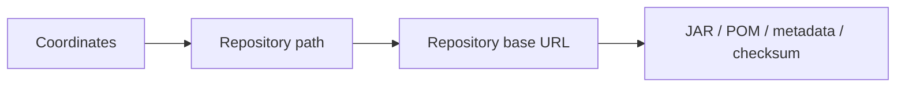
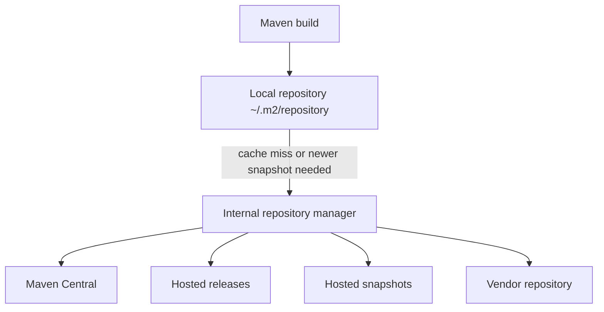
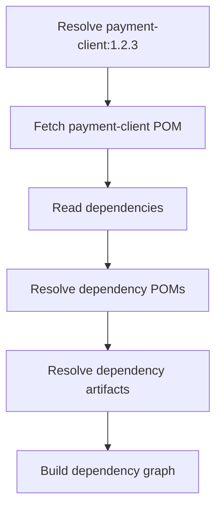
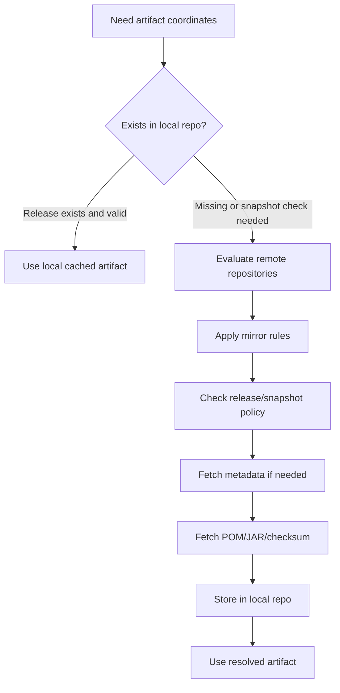
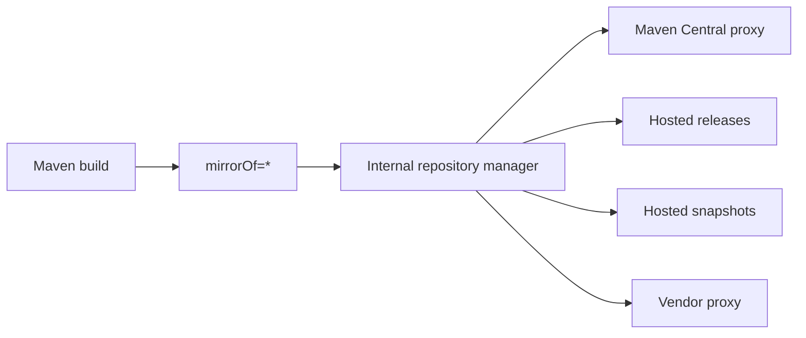
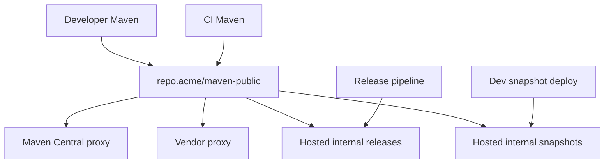
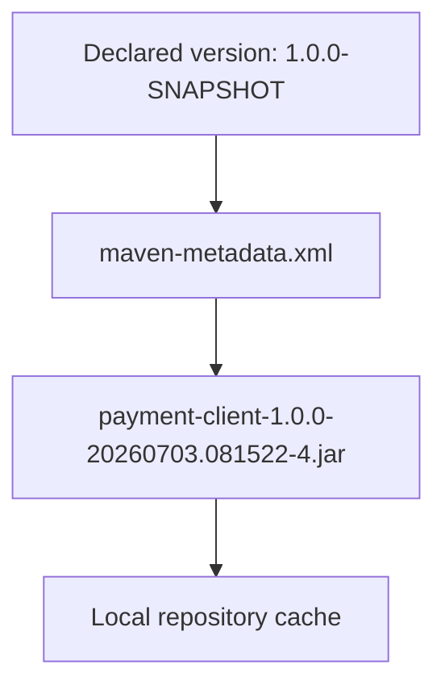

# Repositories, Resolution, and Metadata

A Maven build does not only compile code.

It resolves a distributed graph of artifacts.

Every time you run:

```bash
mvn test
```

Maven may need to resolve:

- parent POMs
- project dependencies
- transitive dependency POMs
- Maven plugins
- plugin dependencies
- extensions
- build reports
- metadata files
- checksums
- snapshot timestamp metadata

At small scale, this feels automatic.

At enterprise scale, artifact resolution is infrastructure.

If repository configuration is weak, builds become slow, nondeterministic, insecure, or impossible to reproduce.

This part explains Maven repository resolution as a system.

---

## 1. Repository Mental Model

A Maven repository is not a package search engine.

A Maven repository is a structured artifact store.

Given coordinates:

```text
groupId    = org.example
artifactId = payment-client
version    = 1.2.3
extension  = jar
classifier = <none>
```

Maven can derive a repository path:

```text
org/example/payment-client/1.2.3/payment-client-1.2.3.jar
org/example/payment-client/1.2.3/payment-client-1.2.3.pom
```

The repository does not need to “understand Java.”

It mainly needs to serve files by predictable paths and metadata.



This is why Maven repositories can be served over HTTP, HTTPS, or file-based protocols.

The contract is file-oriented.

---

## 2. Local Repository vs Remote Repository

Maven has two repository categories:

| Repository type | Location | Role |
|---|---|---|
| Local repository | Machine running Maven | Cache remote artifacts and store locally installed artifacts |
| Remote repository | HTTP/file repository outside the build process | Source of shared artifacts |

Default local repository:

```text
${user.home}/.m2/repository
```

The local repository is not your source of truth.

It is a cache plus a local staging area.

Remote repositories are the shared artifact sources:

- Maven Central
- internal hosted release repository
- internal hosted snapshot repository
- internal proxy repository
- partner/vendor repository
- file-based repository for controlled offline environments



In a mature organization, developers and CI usually do not talk directly to many remote repositories. They talk to an internal repository manager.

---

## 3. What Maven Actually Resolves

When you add this dependency:

```xml
<dependency>
  <groupId>com.acme.payment</groupId>
  <artifactId>payment-client</artifactId>
  <version>1.2.3</version>
</dependency>
```

Maven does not only fetch:

```text
payment-client-1.2.3.jar
```

It also needs the POM:

```text
payment-client-1.2.3.pom
```

The POM tells Maven:

- this artifact's own dependencies
- dependency exclusions
- parent POM information
- relocation information, if present
- packaging metadata
- sometimes dependency management

That means artifact resolution is recursive.



A missing POM is not harmless. It can break transitive dependency resolution or make the graph incomplete.

---

## 4. Repository Layout

Maven repository layout maps coordinates to paths.

For:

```text
groupId    = com.acme.order
artifactId = order-api
version    = 2.4.1
```

The normal repository path is:

```text
com/acme/order/order-api/2.4.1/order-api-2.4.1.pom
com/acme/order/order-api/2.4.1/order-api-2.4.1.jar
```

With classifier:

```text
com/acme/order/order-api/2.4.1/order-api-2.4.1-sources.jar
com/acme/order/order-api/2.4.1/order-api-2.4.1-javadoc.jar
```

With metadata:

```text
com/acme/order/order-api/maven-metadata.xml
com/acme/order/order-api/2.4.1/*.sha1
com/acme/order/order-api/2.4.1/*.asc
```

Important files:

| File | Purpose |
|---|---|
| `.pom` | Dependency metadata and project model |
| `.jar` | Main binary artifact |
| `-sources.jar` | Source attachment |
| `-javadoc.jar` | Javadoc attachment |
| `.sha1`, `.sha256`, `.sha512` | Checksum files, depending on repository support |
| `.asc` | PGP detached signature, required by some repositories |
| `maven-metadata.xml` | Version and snapshot metadata |

A Maven repository is therefore a deterministic file hierarchy, not a database table exposed to the build.

---

## 5. Repository Resolution Path

A simplified artifact resolution flow:



This flow is simplified, but it captures the important operational points:

- local repository is checked
- remote repositories are selected
- mirror settings may rewrite repository targets
- release/snapshot policies matter
- metadata may be needed before artifact files
- fetched files are cached locally

---

## 6. Local Repository Is a Cache, Not a Registry

The local repository contains:

- artifacts downloaded from remote repositories
- artifacts installed with `mvn install`
- locally cached metadata
- marker files describing failed or partial resolution attempts

You can inspect it:

```bash
ls ~/.m2/repository/com/acme/order/order-api/2.4.1
```

But do not manually edit it as normal workflow.

Manual `.m2` surgery often hides the real problem.

Acceptable actions:

```bash
rm -rf ~/.m2/repository/com/acme/order/order-api
mvn -U test
```

or:

```bash
mvn dependency:purge-local-repository
```

Use these when local cache is corrupted or stale.

### Local install is not release

`mvn install` installs artifacts into the local repository.

It does not publish them to the organization.

```bash
mvn install
```

This helps local multi-project development, but it is not a release workflow.

For shared artifacts, use deployment to a remote repository:

```bash
mvn deploy
```

We will cover deployment and distribution management in a later part.

---

## 7. Remote Repositories

A remote repository is defined by two core ideas:

1. base URL
2. policy

Example:

```xml
<repositories>
  <repository>
    <id>internal-releases</id>
    <url>https://repo.acme.internal/repository/maven-releases/</url>
    <releases>
      <enabled>true</enabled>
    </releases>
    <snapshots>
      <enabled>false</enabled>
    </snapshots>
  </repository>

  <repository>
    <id>internal-snapshots</id>
    <url>https://repo.acme.internal/repository/maven-snapshots/</url>
    <releases>
      <enabled>false</enabled>
    </releases>
    <snapshots>
      <enabled>true</enabled>
    </snapshots>
  </repository>
</repositories>
```

The policy tells Maven whether to look for release artifacts, snapshot artifacts, or both.

Production recommendation:

- separate release and snapshot repositories
- do not allow releases in snapshot repositories
- do not allow snapshots in release repositories
- route all external access through a repository manager

---

## 8. Repositories in POM vs `settings.xml`

Repositories can be declared in a POM:

```xml
<repositories>
  <repository>
    <id>vendor-repo</id>
    <url>https://vendor.example.com/maven</url>
  </repository>
</repositories>
```

But enterprise builds should be careful with this.

A repository in a POM travels with the project.

That can be useful for open-source projects, but risky inside a company because every project can define its own supply chain.

A stronger enterprise pattern:

- project POMs avoid external repository declarations
- `settings.xml` defines mirror/proxy behavior
- CI uses controlled settings
- internal repository manager decides where artifacts are fetched from

`settings.xml` can also hold credentials, proxy configuration, local repository path, server IDs, plugin groups, and profiles.

Credential rule:

> Credentials do not belong in `pom.xml`.

They belong in user or CI settings.

---

## 9. Mirrors: Rewrite Where Maven Goes

A mirror tells Maven:

> When a build asks for repository X, use repository Y instead.

Example:

```xml
<settings>
  <mirrors>
    <mirror>
      <id>internal-repository</id>
      <name>Internal Maven Repository Manager</name>
      <url>https://repo.acme.internal/repository/maven-public/</url>
      <mirrorOf>*</mirrorOf>
    </mirror>
  </mirrors>
</settings>
```

This routes all repository requests through a single internal endpoint.

That endpoint must be able to serve or proxy everything required.



Important detail:

A given repository can have at most one mirror selected. Maven does not aggregate multiple mirrors for the same repository. If you need an aggregated view, use a repository manager.

### Advanced mirror matching

Examples:

```xml
<mirrorOf>*</mirrorOf>
```

Matches all repositories.

```xml
<mirrorOf>external:*</mirrorOf>
```

Matches external repositories, excluding localhost/file repositories.

```xml
<mirrorOf>external:http:*</mirrorOf>
```

Matches external HTTP repositories.

```xml
<mirrorOf>*,!special-repo</mirrorOf>
```

Matches all except `special-repo`.

Avoid whitespace mistakes:

```xml
<!-- Bad: whitespace can change behavior -->
<mirrorOf>!repo1, *</mirrorOf>

<!-- Better -->
<mirrorOf>!repo1,*</mirrorOf>
```

---

## 10. Repository Manager as Build Infrastructure

A repository manager is not just a cache.

It is a policy enforcement point.

Typical tools:

- Sonatype Nexus Repository
- JFrog Artifactory
- Apache Archiva

A mature topology:



Responsibilities:

| Responsibility | Repository manager role |
|---|---|
| Availability | Cache external artifacts |
| Security | Block known-bad dependencies, enforce approved sources |
| Governance | Separate releases/snapshots, manage permissions |
| Audit | Track who published what and when |
| Reproducibility | Preserve artifacts even if upstream changes/disappears |
| Performance | Reduce internet dependency and speed CI |

In regulated or enterprise systems, direct downloads from random project POM repositories should be treated as a supply-chain risk.

---

## 11. Metadata: The Hidden Control Plane

`maven-metadata.xml` is how Maven discovers version and snapshot information.

For a release artifact family, metadata can contain known versions.

For snapshots, metadata is more critical because the logical version is mutable.

Example logical version:

```text
1.0.0-SNAPSHOT
```

But a deployed snapshot file may be timestamped:

```text
payment-client-1.0.0-20260703.081522-4.jar
```

Maven uses metadata to map:

```text
1.0.0-SNAPSHOT -> timestamped snapshot artifact
```



This is why snapshots are inherently less reproducible than releases.

The same POM line can resolve to different binary content on different days.

---

## 12. Release Versions vs Snapshot Versions

### Release version

```xml
<version>1.2.3</version>
```

Expected properties:

- immutable once published
- stable metadata
- suitable for production builds
- should not be overwritten

### Snapshot version

```xml
<version>1.2.4-SNAPSHOT</version>
```

Expected properties:

- mutable development version
- may be republished repeatedly
- resolved through snapshot metadata
- useful for integration during active development
- risky for reproducible production builds

Enterprise rule:

> Production releases should not depend on snapshot dependencies.

CI can enforce this with enforcer rules.

---

## 13. Snapshot Update Policy

Snapshot resolution depends on update policy.

Common policies:

| Policy | Meaning |
|---|---|
| `always` | Check remote every build |
| `daily` | Check once per day |
| `interval:N` | Check every N minutes |
| `never` | Do not check for updates |

Example:

```xml
<snapshots>
  <enabled>true</enabled>
  <updatePolicy>always</updatePolicy>
  <checksumPolicy>fail</checksumPolicy>
</snapshots>
```

Developer builds may tolerate frequent snapshot updates.

Release builds should not.

If you need to force snapshot update:

```bash
mvn -U test
```

But `-U` should not become a permanent ritual. If everyone needs `-U`, your snapshot workflow or repository metadata may be unhealthy.

---

## 14. Plugin Repositories Are Separate

Project dependencies use:

```xml
<repositories>
```

Maven plugins use:

```xml
<pluginRepositories>
```

Example:

```xml
<pluginRepositories>
  <pluginRepository>
    <id>internal-plugin-releases</id>
    <url>https://repo.acme.internal/repository/maven-plugins/</url>
    <releases>
      <enabled>true</enabled>
    </releases>
    <snapshots>
      <enabled>false</enabled>
    </snapshots>
  </pluginRepository>
</pluginRepositories>
```

This separation matters because a build may resolve:

- project dependencies
- Maven plugins
- plugin dependencies

A project can fail even when all application dependencies are available if a required plugin cannot be resolved.

Example failure:

```text
Plugin org.apache.maven.plugins:maven-compiler-plugin:... or one of its dependencies could not be resolved
```

Do not debug that as an application dependency problem. It is plugin resolution.

---

## 15. Parent POM Resolution

Parent POMs are resolved before the full child model can be built.

```xml
<parent>
  <groupId>com.acme.platform</groupId>
  <artifactId>platform-parent</artifactId>
  <version>2026.07.0</version>
</parent>
```

Maven tries:

1. relative path, if applicable
2. local repository
3. remote repositories

A missing parent POM blocks model building.

Common failure:

```text
Non-resolvable parent POM
```

Causes:

- parent not installed locally
- parent not deployed remotely
- wrong `<relativePath>`
- CI does not have repository credentials
- mirror rules do not route to internal releases
- parent was deployed only to snapshots but version is release-like, or vice versa

Diagnostic steps:

```bash
mvn -X validate
mvn help:effective-pom
ls ~/.m2/repository/com/acme/platform/platform-parent
```

---

## 16. Release Repository vs Snapshot Repository

A clean repository topology separates immutable and mutable artifacts.

```text
maven-releases/
  com/acme/order/order-api/1.0.0/order-api-1.0.0.jar

maven-snapshots/
  com/acme/order/order-api/1.1.0-SNAPSHOT/order-api-1.1.0-20260703.081522-4.jar
```

Why separate them?

| Concern | Release repository | Snapshot repository |
|---|---|---|
| Immutability | Must be immutable | Mutable by design |
| Retention | Long-lived | Often short retention |
| Production use | Allowed | Usually forbidden |
| Access control | Strict | More permissive for dev teams |
| Promotion | Target of release pipeline | Source for integration builds |

If snapshots and releases share the same repository without policy, the organization loses an important safety boundary.

---

## 17. Checksums and Signatures

Repositories may provide checksum files and PGP signatures.

Examples:

```text
artifact-1.0.0.jar.sha1
artifact-1.0.0.jar.sha256
artifact-1.0.0.jar.sha512
artifact-1.0.0.jar.asc
```

Checksums help detect corrupted transfer or unexpected content.

Signatures help verify artifact provenance when the repository and artifact producer support it.

This topic becomes central in supply-chain security, SBOM, signing, and release governance. For now, keep this invariant:

> Artifact resolution is not only about finding a file. It is about trusting the file.

---

## 18. Offline Builds

Maven supports offline mode:

```bash
mvn -o package
```

Offline mode uses only what is already available locally.

It is useful for:

- air-gapped builds
- reproducibility experiments
- detecting accidental remote resolution
- disaster recovery testing

But offline success does not prove the build is portable.

A build can pass offline on one developer machine because `.m2` contains old artifacts unavailable anywhere else.

For serious reproducibility, test with a clean local repository and controlled remote repository.

Example:

```bash
rm -rf /tmp/m2-clean
mvn -Dmaven.repo.local=/tmp/m2-clean verify
```

This reveals missing repository declarations, missing credentials, undeployed parent POMs, and accidental local-only dependencies.

---

## 19. Clean-Room Resolution Test

A clean-room resolution test asks:

> Can a fresh machine build this project using only the documented repository path?

Command:

```bash
rm -rf /tmp/acme-m2
mvn \
  -s ci/settings.xml \
  -Dmaven.repo.local=/tmp/acme-m2 \
  -U \
  verify
```

This is one of the best tests for Maven repository correctness.

It detects:

- undeployed parent POM
- artifact only present in one developer's local `.m2`
- wrong mirror configuration
- missing plugin repository
- snapshot metadata problem
- dependency declared from unapproved external repository
- local filesystem dependency disguised as build config

Run this in CI periodically, especially for libraries published to other teams.

---

## 20. Failure Modes and Playbooks

### Failure: Could not find artifact

Example:

```text
Could not find artifact com.acme:payment-client:jar:1.2.3
```

Check:

1. Was the artifact deployed?
2. Is the version correct?
3. Is it in release or snapshot repository?
4. Does the build have the right mirror/settings?
5. Does the repository policy allow this version type?
6. Is the artifact path correct?

Command:

```bash
mvn -X dependency:get \
  -Dartifact=com.acme:payment-client:1.2.3
```

### Failure: Unauthorized

Example:

```text
status code: 401, reason phrase: Unauthorized
```

Check:

- repository `<id>` matches `<server><id>` in settings
- CI secrets are available
- token/password not expired
- mirror rewrites to a repository requiring different credentials
- user has read permission

Remember:

> Credentials are matched by repository/server id, not by URL alone.

### Failure: Snapshot not updating

Check:

- snapshot repository enabled
- update policy
- local cache metadata
- `mvn -U`
- repository manager cache
- artifact actually deployed after producer build

### Failure: Plugin cannot be resolved

Check:

- plugin repository/mirror path
- `pluginRepositories`, if needed
- plugin version pinned
- corporate repository manager proxies plugin artifacts
- plugin dependencies available

### Failure: Works locally, fails in CI

Likely causes:

- artifact only installed locally with `mvn install`
- CI settings missing mirror
- CI lacks credentials
- CI uses clean local repo
- local machine has stale/cached dependency
- undeclared repository in IDE settings

Debug principle:

> If it works only on one machine, the build is not yet a Maven build. It is a local environment accident.

---

## 21. Enterprise Repository Governance

A production-grade Maven organization should define repository governance explicitly.

### Policy 1: All external resolution goes through internal repository manager

Use `mirrorOf=*` or a carefully controlled equivalent.

Benefits:

- auditability
- caching
- dependency allow/block rules
- availability
- reproducibility
- central security scanning

### Policy 2: Project POMs should not define arbitrary external repositories

Exception cases must be reviewed.

Reason:

- POM repositories are supply-chain inputs
- external repositories may disappear
- they may serve inconsistent metadata
- they may bypass security controls

### Policy 3: Releases are immutable

A release coordinate must not be overwritten.

If content changes, version changes.

### Policy 4: Snapshot dependency usage is controlled

Allowed in:

- active development branches
- integration environments
- producer-consumer testing

Forbidden in:

- production release artifacts
- long-lived release branches
- regulated deployment baselines

### Policy 5: CI uses checked-in settings template plus secure credentials

Recommended:

```text
ci/settings.xml
```

contains mirrors and repository IDs, but not secrets.

Secrets are injected by CI.

---

## 22. Recommended Enterprise `settings.xml` Shape

Example skeleton:

```xml
<settings xmlns="http://maven.apache.org/SETTINGS/1.0.0"
          xmlns:xsi="http://www.w3.org/2001/XMLSchema-instance"
          xsi:schemaLocation="http://maven.apache.org/SETTINGS/1.0.0 https://maven.apache.org/xsd/settings-1.0.0.xsd">

  <localRepository>${user.home}/.m2/repository</localRepository>
  <interactiveMode>false</interactiveMode>

  <mirrors>
    <mirror>
      <id>acme-maven-public</id>
      <url>https://repo.acme.internal/repository/maven-public/</url>
      <mirrorOf>*</mirrorOf>
    </mirror>
  </mirrors>

  <servers>
    <server>
      <id>acme-maven-releases</id>
      <username>${env.MAVEN_REPO_USER}</username>
      <password>${env.MAVEN_REPO_TOKEN}</password>
    </server>
    <server>
      <id>acme-maven-snapshots</id>
      <username>${env.MAVEN_REPO_USER}</username>
      <password>${env.MAVEN_REPO_TOKEN}</password>
    </server>
  </servers>

  <profiles>
    <profile>
      <id>acme-repositories</id>
      <repositories>
        <repository>
          <id>acme-maven-public</id>
          <url>https://repo.acme.internal/repository/maven-public/</url>
          <releases>
            <enabled>true</enabled>
            <checksumPolicy>fail</checksumPolicy>
          </releases>
          <snapshots>
            <enabled>true</enabled>
            <updatePolicy>daily</updatePolicy>
            <checksumPolicy>fail</checksumPolicy>
          </snapshots>
        </repository>
      </repositories>
      <pluginRepositories>
        <pluginRepository>
          <id>acme-maven-public</id>
          <url>https://repo.acme.internal/repository/maven-public/</url>
          <releases>
            <enabled>true</enabled>
            <checksumPolicy>fail</checksumPolicy>
          </releases>
          <snapshots>
            <enabled>true</enabled>
            <updatePolicy>daily</updatePolicy>
            <checksumPolicy>fail</checksumPolicy>
          </snapshots>
        </pluginRepository>
      </pluginRepositories>
    </profile>
  </profiles>

  <activeProfiles>
    <activeProfile>acme-repositories</activeProfile>
  </activeProfiles>
</settings>
```

This is a template, not a universal answer.

The important design is:

- settings own repository routing and credentials
- POMs own project identity and dependencies
- repository manager owns policy and proxying

---

## 23. Repository Resolution Diagnostic Commands

### Show effective settings

```bash
mvn help:effective-settings
```

Use this to inspect mirrors, profiles, repositories, and server configuration visible to Maven.

### Show effective POM

```bash
mvn help:effective-pom
```

Use this to see repositories inherited from parents/profiles.

### Force update snapshots/releases metadata

```bash
mvn -U verify
```

### Use a clean local repository

```bash
mvn -Dmaven.repo.local=/tmp/m2-clean verify
```

### Resolve one artifact explicitly

```bash
mvn dependency:get -Dartifact=com.acme:payment-client:1.2.3
```

### Debug repository access

```bash
mvn -X verify
```

Look for:

- selected repositories
- selected mirrors
- metadata URLs
- transfer attempts
- authentication failures
- checksum failures
- cached failure markers

---

## 24. Repository Architecture Decision Record

For serious systems, write an ADR like this:

```md
# ADR: Maven Repository Resolution Architecture

## Decision
All Maven builds must resolve artifacts through `https://repo.acme.internal/repository/maven-public/` using a `mirrorOf=*` settings rule.

## Context
Teams previously declared external repositories in project POMs. This caused nondeterministic builds, missing artifacts in CI, inconsistent snapshot behavior, and unreviewed supply-chain inputs.

## Consequences
- CI and developer machines use the same repository route.
- External artifacts are cached and audited.
- New external repositories require platform approval.
- Project POMs must not declare arbitrary remote repositories.
- Internal release and snapshot deployment use separate hosted repositories.

## Enforcement
- CI uses managed `settings.xml`.
- Enforcer rules ban snapshot dependencies in release profiles.
- Repository manager blocks unapproved sources.
- Build scans/checks inspect effective POM and effective settings.
```

This turns repository behavior from tribal knowledge into an architectural boundary.

---

## 25. What You Should Be Able to Do Now

After this part, you should be able to:

- explain the difference between local and remote repositories
- map Maven coordinates to repository paths
- explain why POM files are part of dependency resolution
- describe the role of `maven-metadata.xml`
- distinguish release and snapshot resolution
- use mirrors to route builds through an internal repository manager
- debug missing artifact, unauthorized, stale snapshot, and plugin resolution failures
- design a clean repository topology for enterprise Maven builds
- test build portability using a clean local repository

The senior-level mental model is this:

> Maven resolution is not “download a JAR.” It is a controlled graph-resolution process over artifact files, POM metadata, repository policy, mirrors, credentials, cache state, and trust boundaries.

Once you see that, repository incidents become diagnosable instead of mysterious.

---

## References

- Apache Maven — Introduction to Repositories: https://maven.apache.org/guides/introduction/introduction-to-repositories.html
- Apache Maven — Settings Reference: https://maven.apache.org/settings.html
- Apache Maven — Using Mirrors for Repositories: https://maven.apache.org/guides/mini/guide-mirror-settings.html
- Apache Maven — Maven Remote Repositories: https://maven.apache.org/repositories/remote.html
- Apache Maven — Maven Repository Layout: https://maven.apache.org/repository/layout.html
- Apache Maven Dependency Plugin: https://maven.apache.org/plugins/maven-dependency-plugin/
- Apache Maven Help Plugin: https://maven.apache.org/plugins/maven-help-plugin/
