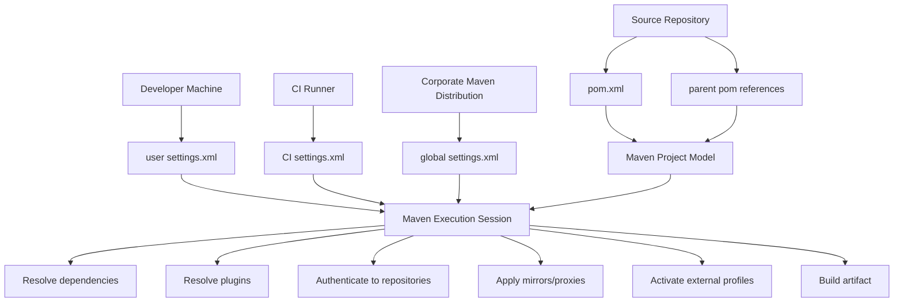
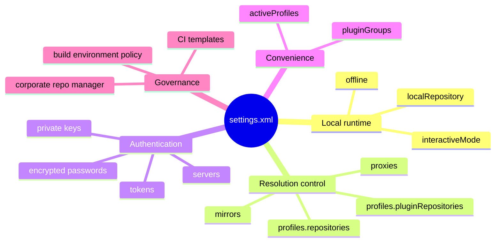
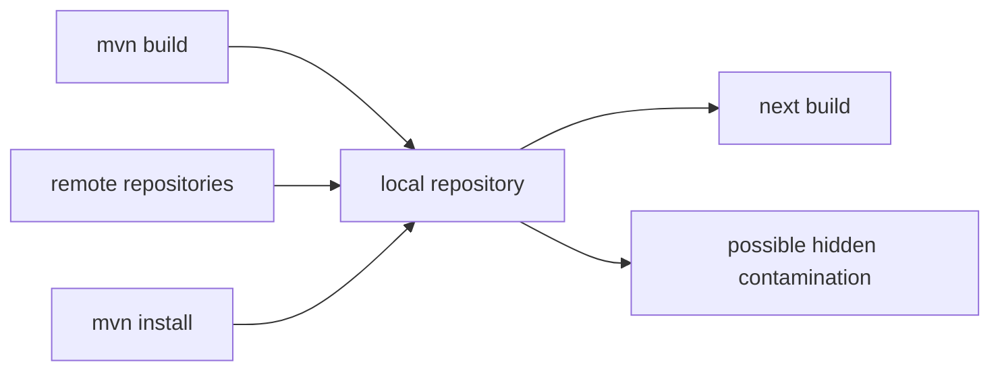
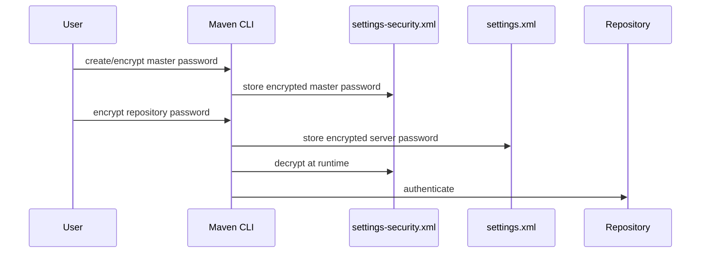
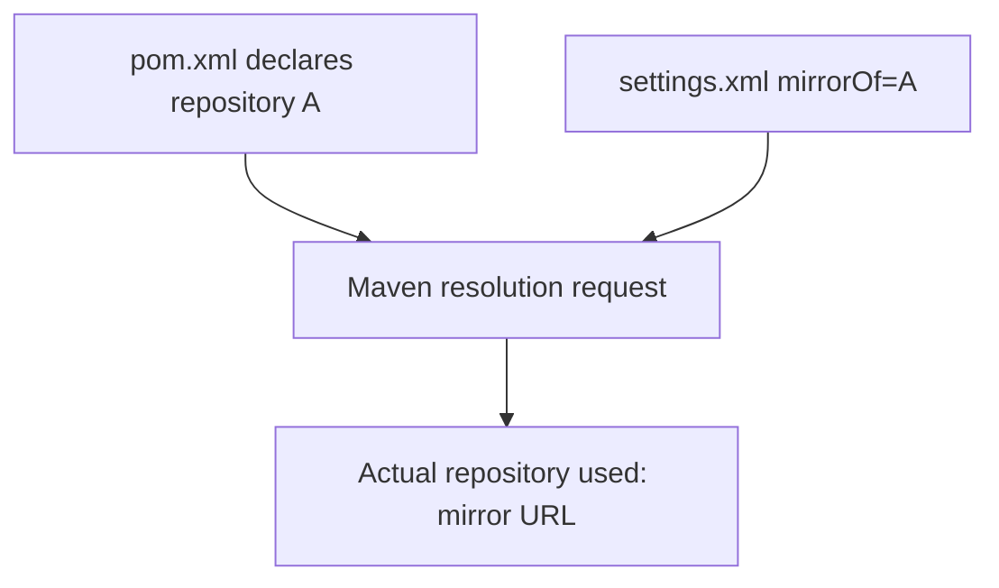
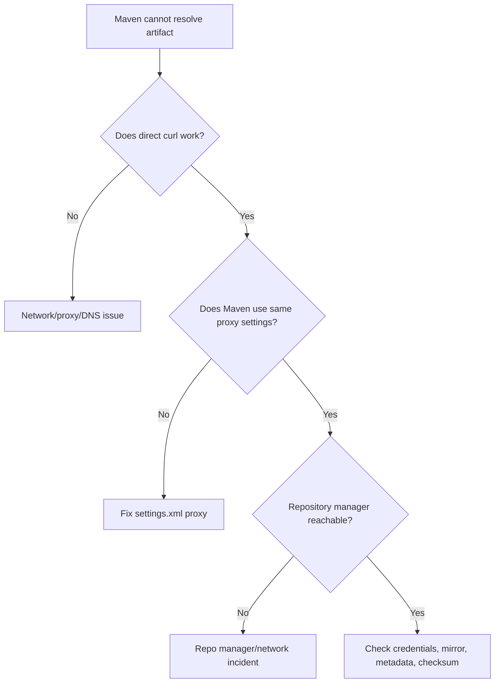
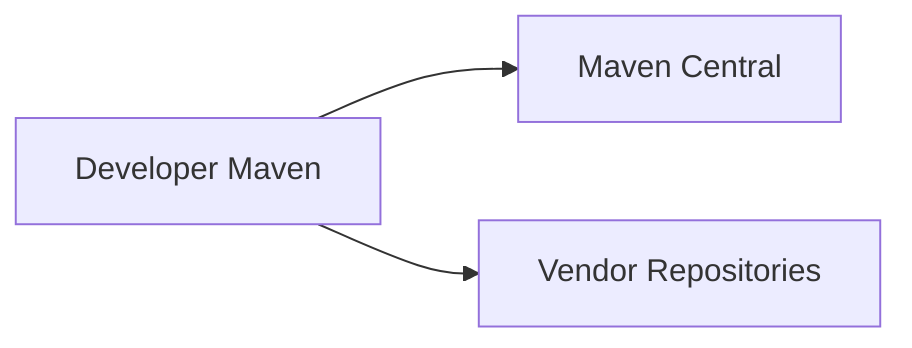
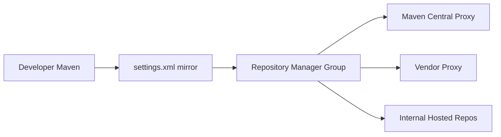
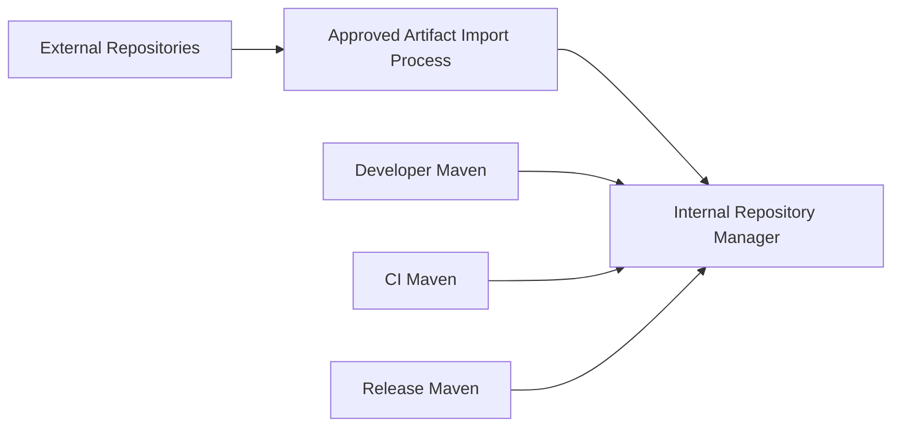
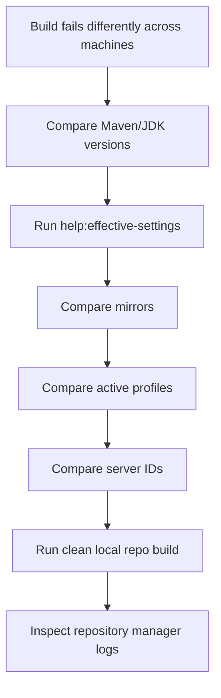

# `settings.xml` and Enterprise Build Configuration

Most engineers treat Maven configuration as if it lives in one place: `pom.xml`.

That is incomplete.

A production Maven build is shaped by at least four layers:

1. the project model in `pom.xml`,
2. the inherited/default model from parents and the Super POM,
3. runtime configuration from `settings.xml`,
4. command-line/session configuration from the Maven invocation.

The POM answers:

> What is this project and how should it be built?

`settings.xml` answers:

> How should this Maven runtime behave in this machine, user account, network, and organization?

That distinction is the difference between a clean enterprise build and a build that only works on one developer laptop.

This part is about `settings.xml` as **runtime build infrastructure configuration**.

Not as a random XML file.

Not as a place to hide broken project design.

Not as a dumping ground for environment-specific hacks.

---

## 1. The Core Mental Model

Maven has a project model.

Maven also has an execution environment.

`pom.xml` belongs to the project.

`settings.xml` belongs to the execution environment.



A POM should be shareable.

A settings file usually should not.

A POM should describe project intent.

A settings file should describe execution context.

A POM should not contain personal credentials.

A settings file may contain credentials, but even then it should be generated, encrypted, injected, or managed carefully.

---

## 2. Why `settings.xml` Exists

Maven projects are distributed.

Different developers, CI agents, release agents, and production build workers may build the same project from different networks.

One developer may be behind a corporate proxy.

Another may be outside the VPN.

CI may need credentials to deploy artifacts.

Release automation may need a signing key or deployment token.

An enterprise may require all external dependencies to go through a repository manager.

These concerns are not project source concerns.

They are build environment concerns.

That is why Maven has settings.

The official Maven settings reference describes `settings.xml` as a place for values that configure Maven execution in ways similar to the POM, but that should not be bundled with a specific project or distributed to an audience. Typical examples include local repository location, alternate remote repository servers, and authentication information.

Reference:

- https://maven.apache.org/settings.html
- https://maven.apache.org/ref/3.9.16/maven-settings/settings.html

---

## 3. The Two Main Settings Files

Maven supports two main settings locations:

```txt
${maven.home}/conf/settings.xml
${user.home}/.m2/settings.xml
```

In practice:

| Location | Name | Ownership | Typical Usage |
|---|---|---|---|
| `${maven.home}/conf/settings.xml` | global settings | Maven installation / base image / corporate Maven distro | organization defaults, corporate mirrors, default plugin groups |
| `${user.home}/.m2/settings.xml` | user settings | developer user / CI runner user | credentials, local overrides, active profiles, proxy config |

The enterprise trap is assuming every build sees the same settings.

It does not.

A developer laptop, GitHub Actions runner, Jenkins agent, GitLab runner, Kubernetes build pod, and release workstation may all have different settings.

That means a serious Maven setup needs **settings governance**.

---

## 4. What Belongs in `pom.xml` vs `settings.xml`

The first design decision is separation of responsibility.

### Belongs in `pom.xml`

Use the POM for project-intrinsic facts:

- project coordinates,
- module structure,
- dependencies,
- plugin versions,
- plugin executions,
- build lifecycle behavior,
- source/resource layout,
- packaging type,
- artifact publication coordinates,
- reproducibility settings,
- project-owned build profiles,
- dependency management,
- plugin management.

### Belongs in `settings.xml`

Use settings for environment-specific facts:

- credentials,
- repository mirrors,
- corporate proxies,
- local repository path,
- active profile selection for this execution context,
- server authentication for deployment,
- private repository access,
- plugin group shortcuts,
- offline mode preference,
- CI-only repository authentication.

### Usually Wrong in `settings.xml`

Avoid placing project logic here:

- dependency versions,
- plugin versions,
- compiler source/release policy,
- test behavior,
- packaging behavior,
- code generation behavior,
- module definitions,
- artifact naming,
- default build quality gates.

If a clean checkout cannot explain its own build model without your personal settings file, the project is under-specified.

---

## 5. The `settings.xml` Skeleton

A settings file usually looks like this:

```xml
<settings xmlns="http://maven.apache.org/SETTINGS/1.2.0"
          xmlns:xsi="http://www.w3.org/2001/XMLSchema-instance"
          xsi:schemaLocation="http://maven.apache.org/SETTINGS/1.2.0 https://maven.apache.org/xsd/settings-1.2.0.xsd">

  <localRepository>${user.home}/.m2/repository</localRepository>

  <interactiveMode>true</interactiveMode>
  <offline>false</offline>

  <pluginGroups>
    <pluginGroup>org.example.maven.plugins</pluginGroup>
  </pluginGroups>

  <servers>
    <!-- repository credentials -->
  </servers>

  <mirrors>
    <!-- repository redirection -->
  </mirrors>

  <proxies>
    <!-- corporate network proxy -->
  </proxies>

  <profiles>
    <!-- environment-specific profiles -->
  </profiles>

  <activeProfiles>
    <!-- explicitly activated profile IDs -->
  </activeProfiles>
</settings>
```

Do not memorize the XML.

Memorize the responsibilities.



---

## 6. `localRepository`: Cache, State, and Isolation

The local repository is the artifact cache on the machine.

Default:

```txt
${user.home}/.m2/repository
```

It contains downloaded dependencies, downloaded plugins, installed local artifacts, metadata, checksums, and sometimes partially failed downloads.

This makes it both useful and dangerous.

Useful because builds are faster after first resolution.

Dangerous because it can hide problems.

A build may pass on your laptop only because an artifact exists in your local repository from a previous manual install.

### Local Repository as Mutable Build State

Think of the local repository as mutable state.



A production-grade build should not depend on accidental local state.

### Common Commands

Use a separate local repository:

```bash
mvn -Dmaven.repo.local=/tmp/maven-clean-repo verify
```

Force update of snapshots/releases metadata where applicable:

```bash
mvn -U verify
```

Run offline after dependencies are already available:

```bash
mvn -o verify
```

Remove local cached artifact manually when debugging:

```bash
rm -rf ~/.m2/repository/com/example/problematic-lib
```

### Enterprise Rule

For CI, use controlled cache isolation.

Do not let unrelated projects freely poison each other's dependency cache without retention, invalidation, and checksum strategy.

A good CI model often uses:

- ephemeral runner workspace,
- persistent dependency cache keyed by JDK/Maven/settings hash,
- explicit cache invalidation,
- repository manager as source of truth,
- clean-room build job for release verification.

---

## 7. `interactiveMode` and Non-Interactive Builds

`interactiveMode` controls whether Maven is allowed to interact with the user.

For developer machines, interactive mode may be fine.

For CI, release, and automation, interaction is a bug.

Prefer:

```bash
mvn --batch-mode verify
```

or:

```bash
mvn -B verify
```

Batch mode reduces prompts and produces more automation-friendly logs.

In serious pipelines, every build should be non-interactive.

A build that waits for input is not automated.

---

## 8. `offline`: Useful but Easy to Misread

`offline` tells Maven not to connect to remote repositories.

Equivalent command-line mode:

```bash
mvn -o verify
```

Offline mode is useful for:

- deterministic local experiments,
- air-gapped build verification,
- checking whether all required artifacts are already cached,
- reducing network variance during debugging.

But offline does not mean the build is reproducible.

It only means Maven will not contact remote repositories.

If the local repository is contaminated, offline builds can still lie.

### Diagnostic Pattern

Use three different runs:

```bash
# normal resolution
mvn verify

# force update metadata
mvn -U verify

# clean local repo path
mvn -Dmaven.repo.local=/tmp/m2-clean verify
```

If only the normal run passes, you probably have hidden local state.

---

## 9. `pluginGroups`: Convenience, Not Build Logic

`pluginGroups` lets Maven resolve plugin prefixes without fully qualified plugin coordinates.

For example, if you configure:

```xml
<pluginGroups>
  <pluginGroup>com.acme.build</pluginGroup>
</pluginGroups>
```

Then Maven can resolve shorthand plugin invocations for that group.

This is convenience.

It should not be required for a project to build.

Inside a POM, production plugin usage should be explicit:

```xml
<plugin>
  <groupId>com.acme.build</groupId>
  <artifactId>acme-quality-plugin</artifactId>
  <version>1.8.0</version>
</plugin>
```

If your build requires every developer to configure plugin groups manually before `mvn verify` works, you have made the build environment too magical.

---

## 10. `servers`: Authentication by ID Matching

The `servers` section stores credentials and authentication material.

Example:

```xml
<servers>
  <server>
    <id>company-releases</id>
    <username>${env.MAVEN_REPO_USER}</username>
    <password>${env.MAVEN_REPO_TOKEN}</password>
  </server>
</servers>
```

The most important rule:

> The `server/id` must match the repository ID used by Maven for that operation.

For deployment, it often matches `distributionManagement` in the POM:

```xml
<distributionManagement>
  <repository>
    <id>company-releases</id>
    <url>https://repo.example.com/repository/maven-releases/</url>
  </repository>
  <snapshotRepository>
    <id>company-snapshots</id>
    <url>https://repo.example.com/repository/maven-snapshots/</url>
  </snapshotRepository>
</distributionManagement>
```

Settings:

```xml
<servers>
  <server>
    <id>company-releases</id>
    <username>${env.MAVEN_REPO_USER}</username>
    <password>${env.MAVEN_REPO_TOKEN}</password>
  </server>
  <server>
    <id>company-snapshots</id>
    <username>${env.MAVEN_REPO_USER}</username>
    <password>${env.MAVEN_REPO_TOKEN}</password>
  </server>
</servers>
```

If IDs do not match, Maven may behave like credentials are missing.

This is one of the most common Maven deployment failures.

### Bad Pattern

```xml
<!-- POM -->
<repository>
  <id>releases</id>
</repository>

<!-- settings.xml -->
<server>
  <id>company-releases</id>
</server>
```

Those are different identities.

Maven will not infer that they are related.

### Good Pattern

```xml
<!-- POM -->
<repository>
  <id>company-releases</id>
</repository>

<!-- settings.xml -->
<server>
  <id>company-releases</id>
</server>
```

Keep repository IDs stable, documented, and organization-wide.

---

## 11. Credentials: Passwords, Tokens, Private Keys

A server entry may use username/password.

It may also use private key authentication for certain transports.

Example:

```xml
<server>
  <id>company-sftp-repository</id>
  <username>deploy</username>
  <privateKey>/home/ci/.ssh/maven_deploy_key</privateKey>
  <passphrase>${env.MAVEN_SSH_KEY_PASSPHRASE}</passphrase>
</server>
```

Most modern enterprise Maven repositories use HTTPS plus token-based credentials.

Prefer tokens over human passwords.

Prefer short-lived or scoped tokens over long-lived universal credentials.

Prefer CI secret injection over committed settings files.

### Credential Scope Design

A serious build platform uses separate credentials for:

| Actor | Permission |
|---|---|
| developer read token | resolve internal artifacts |
| CI read token | resolve internal artifacts |
| CI snapshot deploy token | deploy snapshots only |
| release deploy token | deploy releases/staging only |
| repository admin token | never used by normal build jobs |
| security scanner token | read metadata and artifacts as needed |

Do not use one god-token everywhere.

That is not convenience.

That is an incident waiting to happen.

---

## 12. Maven Password Encryption: Useful, Not a Vault

Maven supports encrypted passwords in settings.

For Maven 3, the guide uses a master password and `settings-security.xml`.

Reference:

- https://maven.apache.org/guides/mini/guide-encryption.html

For Maven 4, the Maven documentation describes a `settings-security4.xml` file and recommends using the `mvnenc` CLI tool.

Reference:

- https://maven.apache.org/guides/mini/guide-encryption-4.html

This helps avoid plaintext passwords in `settings.xml`.

But do not misunderstand it.

Encrypted settings are not a full secret management system.

The Maven documentation itself warns about local plaintext remnants such as shell history and editor caches when handling passwords.

### Maven 3-style Conceptual Flow



### Enterprise Reality

In CI, environment variables or CI secret stores are often safer than checking in encrypted settings.

Example:

```xml
<server>
  <id>company-releases</id>
  <username>${env.MAVEN_REPO_USER}</username>
  <password>${env.MAVEN_REPO_TOKEN}</password>
</server>
```

Then CI injects:

```bash
MAVEN_REPO_USER=ci-release-bot
MAVEN_REPO_TOKEN=***
```

The actual `settings.xml` can be generated per job and deleted after use.

---

## 13. `mirrors`: Redirecting Repository Access

A mirror tells Maven:

> When a build wants repository X, use repository Y instead.

Example:

```xml
<mirrors>
  <mirror>
    <id>company-maven-all</id>
    <name>Company Maven Repository Group</name>
    <url>https://repo.example.com/repository/maven-all/</url>
    <mirrorOf>*</mirrorOf>
  </mirror>
</mirrors>
```

This is the foundation of enterprise dependency control.

Instead of every project reaching out to Maven Central or random external repositories, all resolution can be routed through an internal repository manager.

Official Maven mirror guide:

- https://maven.apache.org/guides/mini/guide-mirror-settings.html

### Mirror Matching

Common `mirrorOf` patterns:

| Pattern | Meaning |
|---|---|
| `central` | mirror the repository with ID `central` |
| `*` | mirror all repositories |
| `external:*` | mirror all non-localhost/non-file repositories |
| `external:http:*` | mirror external HTTP repositories |
| `*,!repo1` | mirror all except repository ID `repo1` |

The exact matching semantics matter.

A mirror is not the same as adding another repository.

A mirror replaces the target for matching repositories.

### Enterprise Mirror Design

A typical enterprise settings file:

```xml
<mirrors>
  <mirror>
    <id>company-maven-group</id>
    <name>Company Maven Group</name>
    <url>https://repo.example.com/repository/maven-public/</url>
    <mirrorOf>external:*</mirrorOf>
  </mirror>
</mirrors>
```

This says:

- internal local/file repositories are not mirrored,
- external remote repositories are redirected,
- the repository manager becomes the policy boundary.

### Stronger Lockdown

```xml
<mirror>
  <id>company-all</id>
  <url>https://repo.example.com/repository/maven-all/</url>
  <mirrorOf>*</mirrorOf>
</mirror>
```

This is stricter.

It can also break legitimate local testing if not handled carefully.

Use it intentionally.

---

## 14. Mirror vs Repository

This distinction matters.

A repository says:

> Maven may search here.

A mirror says:

> When Maven tries to search there, redirect to here.



If a project declares:

```xml
<repositories>
  <repository>
    <id>vendor-repo</id>
    <url>https://vendor.example.com/maven</url>
  </repository>
</repositories>
```

And settings has:

```xml
<mirror>
  <id>company-mirror</id>
  <url>https://repo.example.com/repository/maven-public/</url>
  <mirrorOf>*</mirrorOf>
</mirror>
```

Maven will route the request to the company mirror.

This is why mirrors are so powerful for enterprise governance.

---

## 15. `proxies`: Corporate Network Reality

Some organizations require outbound traffic through an HTTP/HTTPS proxy.

Example:

```xml
<proxies>
  <proxy>
    <id>corp-proxy</id>
    <active>true</active>
    <protocol>https</protocol>
    <host>proxy.example.com</host>
    <port>8080</port>
    <username>${env.PROXY_USER}</username>
    <password>${env.PROXY_PASSWORD}</password>
    <nonProxyHosts>localhost|127.0.0.1|*.example.com</nonProxyHosts>
  </proxy>
</proxies>
```

Do not put proxy configuration in the POM.

Proxy configuration belongs to the network environment.

If developers, CI, and release agents have different network paths, they may need different settings files.

### Proxy Failure Signals

Typical symptoms:

- dependency resolution timeout,
- SSL handshake failure,
- `407 Proxy Authentication Required`,
- plugin resolution timeout,
- artifact downloads work in browser but fail in Maven,
- Maven Central reachable locally but not in CI.

### Diagnostic Flow



---

## 16. Settings Profiles

`settings.xml` can define profiles.

But settings profiles are not the same as project profiles in a POM.

They are useful for environment-provided properties and repository definitions.

Example:

```xml
<profiles>
  <profile>
    <id>company</id>
    <repositories>
      <repository>
        <id>company-maven-public</id>
        <url>https://repo.example.com/repository/maven-public/</url>
        <releases>
          <enabled>true</enabled>
        </releases>
        <snapshots>
          <enabled>true</enabled>
        </snapshots>
      </repository>
    </repositories>
  </profile>
</profiles>

<activeProfiles>
  <activeProfile>company</activeProfile>
</activeProfiles>
```

### What Settings Profiles Are Good For

Use them for:

- environment-specific repository definitions,
- machine-local properties,
- CI-specific activation of repository access,
- controlled external dependency routing.

### What Settings Profiles Are Bad For

Avoid using them for:

- dependency version selection,
- plugin version selection,
- skipping tests by default,
- changing compiler behavior,
- changing packaging behavior,
- hiding required project properties.

If a project needs a settings profile to know how to compile itself, something is wrong.

---

## 17. `activeProfiles`: Explicit External Activation

Profiles can be activated in settings:

```xml
<activeProfiles>
  <activeProfile>company</activeProfile>
  <activeProfile>ci</activeProfile>
</activeProfiles>
```

This makes every Maven invocation under that settings file use those profiles.

That can be convenient.

It can also be dangerous.

A developer may not realize their build depends on an always-active local setting.

### Diagnostic Command

Use:

```bash
mvn help:active-profiles
```

Also inspect effective POM:

```bash
mvn help:effective-pom
```

If behavior differs between machines, compare active profiles first.

---

## 18. CLI Overrides: `-s`, `-gs`, `-Dmaven.repo.local`

Maven lets you explicitly choose settings files.

Use custom user settings:

```bash
mvn -s .ci/maven/settings.xml verify
```

Use custom global settings:

```bash
mvn -gs /opt/maven/conf/settings.xml verify
```

Use isolated local repository:

```bash
mvn -Dmaven.repo.local=.m2/repository verify
```

A strong CI pipeline does not rely on whatever settings happen to exist in the runner image.

It declares the settings file used by the job.

Example:

```bash
mvn \
  --batch-mode \
  --settings .ci/maven/settings.xml \
  -Dmaven.repo.local=.m2/repository \
  verify
```

---

## 19. Enterprise CI Settings Template

A common CI pattern is to keep a template in the repository:

```txt
.ci/maven/settings.xml
```

It contains no raw secrets:

```xml
<settings xmlns="http://maven.apache.org/SETTINGS/1.2.0"
          xmlns:xsi="http://www.w3.org/2001/XMLSchema-instance"
          xsi:schemaLocation="http://maven.apache.org/SETTINGS/1.2.0 https://maven.apache.org/xsd/settings-1.2.0.xsd">

  <mirrors>
    <mirror>
      <id>company-maven-public</id>
      <url>${env.MAVEN_MIRROR_URL}</url>
      <mirrorOf>external:*</mirrorOf>
    </mirror>
  </mirrors>

  <servers>
    <server>
      <id>company-maven-public</id>
      <username>${env.MAVEN_REPO_USER}</username>
      <password>${env.MAVEN_REPO_TOKEN}</password>
    </server>
    <server>
      <id>company-releases</id>
      <username>${env.MAVEN_DEPLOY_USER}</username>
      <password>${env.MAVEN_DEPLOY_TOKEN}</password>
    </server>
    <server>
      <id>company-snapshots</id>
      <username>${env.MAVEN_DEPLOY_USER}</username>
      <password>${env.MAVEN_DEPLOY_TOKEN}</password>
    </server>
  </servers>
</settings>
```

CI injects the environment variables.

The pipeline uses it explicitly:

```bash
mvn -B -s .ci/maven/settings.xml verify
```

For release:

```bash
mvn -B -s .ci/maven/settings.xml deploy
```

### Why This Works

The settings file is reviewable.

Secrets are not committed.

Repository IDs are stable.

The build does not depend on unknown runner state.

Developers can reproduce CI locally with equivalent environment variables.

---

## 20. Stronger CI Pattern: Generate Settings at Runtime

In stricter environments, do not keep even a settings template that references production repo URLs.

Generate it during the job:

```bash
mkdir -p "$RUNNER_TEMP/maven"
cat > "$RUNNER_TEMP/maven/settings.xml" <<EOF
<settings xmlns="http://maven.apache.org/SETTINGS/1.2.0"
          xmlns:xsi="http://www.w3.org/2001/XMLSchema-instance"
          xsi:schemaLocation="http://maven.apache.org/SETTINGS/1.2.0 https://maven.apache.org/xsd/settings-1.2.0.xsd">
  <mirrors>
    <mirror>
      <id>company-maven-public</id>
      <url>${MAVEN_MIRROR_URL}</url>
      <mirrorOf>external:*</mirrorOf>
    </mirror>
  </mirrors>
  <servers>
    <server>
      <id>company-releases</id>
      <username>${MAVEN_DEPLOY_USER}</username>
      <password>${MAVEN_DEPLOY_TOKEN}</password>
    </server>
  </servers>
</settings>
EOF

mvn -B -s "$RUNNER_TEMP/maven/settings.xml" verify
rm -f "$RUNNER_TEMP/maven/settings.xml"
```

This reduces persistent secret exposure.

But be careful: shell tracing can leak secrets.

Avoid:

```bash
set -x
```

around secret generation.

---

## 21. Settings File as Build Policy Boundary

In an enterprise, `settings.xml` enforces several policies:

| Policy | Settings Mechanism |
|---|---|
| all external dependency resolution must go through repository manager | mirror `external:*` or `*` |
| CI must deploy only with scoped token | `servers` with CI secrets |
| developers cannot deploy releases | do not provide release server credentials |
| all plugin resolution goes through internal repository | mirror/plugin repository routing |
| proxy required for outbound traffic | `proxies` |
| release builds must be clean-room | custom local repo path |
| air-gapped builds must not reach internet | `offline` plus internal repositories |

`settings.xml` is not just configuration.

It is part of supply-chain control.

---

## 22. Common Enterprise Settings Topologies

### Topology A: Developer Direct Internet



Simple.

Bad for enterprise control.

Problems:

- untracked dependency ingress,
- inconsistent availability,
- no central cache,
- difficult incident response,
- inconsistent developer experience.

### Topology B: Developer Through Repository Manager



This is the usual healthy baseline.

### Topology C: Air-Gapped Enterprise



In air-gapped environments, settings must prevent accidental external resolution.

The repository manager becomes the only allowed source.

---

## 23. A Production-Grade Developer Settings Example

```xml
<settings xmlns="http://maven.apache.org/SETTINGS/1.2.0"
          xmlns:xsi="http://www.w3.org/2001/XMLSchema-instance"
          xsi:schemaLocation="http://maven.apache.org/SETTINGS/1.2.0 https://maven.apache.org/xsd/settings-1.2.0.xsd">

  <interactiveMode>true</interactiveMode>
  <offline>false</offline>

  <mirrors>
    <mirror>
      <id>company-maven-public</id>
      <name>Company Maven Public Group</name>
      <url>https://repo.example.com/repository/maven-public/</url>
      <mirrorOf>external:*</mirrorOf>
    </mirror>
  </mirrors>

  <servers>
    <server>
      <id>company-maven-public</id>
      <username>${env.MAVEN_REPO_USER}</username>
      <password>${env.MAVEN_REPO_TOKEN}</password>
    </server>
  </servers>

  <profiles>
    <profile>
      <id>company-defaults</id>
      <properties>
        <company.repository.policy>internal-only</company.repository.policy>
      </properties>
    </profile>
  </profiles>

  <activeProfiles>
    <activeProfile>company-defaults</activeProfile>
  </activeProfiles>
</settings>
```

This gives developers read access.

It does not give them release deployment access.

Deployment credentials should be separate.

---

## 24. A Production-Grade CI Settings Example

```xml
<settings xmlns="http://maven.apache.org/SETTINGS/1.2.0"
          xmlns:xsi="http://www.w3.org/2001/XMLSchema-instance"
          xsi:schemaLocation="http://maven.apache.org/SETTINGS/1.2.0 https://maven.apache.org/xsd/settings-1.2.0.xsd">

  <interactiveMode>false</interactiveMode>

  <mirrors>
    <mirror>
      <id>company-maven-public</id>
      <name>Company Maven Public Group</name>
      <url>${env.MAVEN_PUBLIC_REPOSITORY_URL}</url>
      <mirrorOf>external:*</mirrorOf>
    </mirror>
  </mirrors>

  <servers>
    <server>
      <id>company-maven-public</id>
      <username>${env.MAVEN_READ_USER}</username>
      <password>${env.MAVEN_READ_TOKEN}</password>
    </server>
    <server>
      <id>company-snapshots</id>
      <username>${env.MAVEN_SNAPSHOT_DEPLOY_USER}</username>
      <password>${env.MAVEN_SNAPSHOT_DEPLOY_TOKEN}</password>
    </server>
  </servers>

</settings>
```

CI branch builds usually need snapshot deployment at most.

Release credentials should be available only to release jobs.

---

## 25. A Production-Grade Release Settings Example

```xml
<settings xmlns="http://maven.apache.org/SETTINGS/1.2.0"
          xmlns:xsi="http://www.w3.org/2001/XMLSchema-instance"
          xsi:schemaLocation="http://maven.apache.org/SETTINGS/1.2.0 https://maven.apache.org/xsd/settings-1.2.0.xsd">

  <interactiveMode>false</interactiveMode>

  <mirrors>
    <mirror>
      <id>company-maven-public</id>
      <name>Company Maven Public Group</name>
      <url>${env.MAVEN_PUBLIC_REPOSITORY_URL}</url>
      <mirrorOf>external:*</mirrorOf>
    </mirror>
  </mirrors>

  <servers>
    <server>
      <id>company-maven-public</id>
      <username>${env.MAVEN_READ_USER}</username>
      <password>${env.MAVEN_READ_TOKEN}</password>
    </server>
    <server>
      <id>company-releases</id>
      <username>${env.MAVEN_RELEASE_DEPLOY_USER}</username>
      <password>${env.MAVEN_RELEASE_DEPLOY_TOKEN}</password>
    </server>
    <server>
      <id>company-staging</id>
      <username>${env.MAVEN_RELEASE_DEPLOY_USER}</username>
      <password>${env.MAVEN_RELEASE_DEPLOY_TOKEN}</password>
    </server>
  </servers>

</settings>
```

Release settings should be used by a small number of controlled jobs.

Never use release deployment credentials in generic pull-request builds.

---

## 26. Settings and Plugin Resolution

Dependencies are not the only artifacts Maven resolves.

Maven also resolves plugins.

That means plugin repositories matter.

A project might not declare plugin repositories explicitly, but plugins still resolve through repository infrastructure.

If your enterprise mirrors external repositories, make sure plugin artifacts also resolve through controlled repository paths.

Common failure:

```txt
Could not find artifact org.apache.maven.plugins:maven-compiler-plugin:maven-plugin:...
```

This may be caused by:

- repository manager missing Maven Central proxy,
- mirror misconfiguration,
- plugin repository policy issue,
- metadata cache failure,
- corporate network proxy failure,
- artifact blocked by repository policy.

Do not debug this as a compiler problem first.

Debug it as resolution.

---

## 27. Settings and Parent POM Resolution

Parent POMs are artifacts too.

If a child POM references:

```xml
<parent>
  <groupId>com.acme.platform</groupId>
  <artifactId>acme-parent</artifactId>
  <version>3.4.1</version>
</parent>
```

Maven must resolve that parent unless it is available by relative path.

Settings can affect that resolution through mirrors, repositories, credentials, and local repository path.

A build may fail before dependency resolution if parent resolution fails.

Typical error:

```txt
Non-resolvable parent POM
```

Diagnosis:

1. Is `relativePath` expected?
2. Is the parent installed locally only?
3. Is the parent deployed to internal repository?
4. Does settings include credentials for that repository?
5. Does mirror route the request correctly?
6. Does repository manager contain the parent POM?

---

## 28. `settings.xml` Anti-Patterns

### Anti-Pattern 1: Project Requires Personal Settings

Symptom:

```txt
Works on Alice's machine only.
```

Cause:

- dependency repository only in Alice's `settings.xml`,
- required profile only active in Alice's settings,
- dependency version property hidden in settings.

Fix:

- move project build facts into POM,
- keep only environment facts in settings,
- document required external repositories or route through mirror.

### Anti-Pattern 2: Credentials in Repository

```xml
<password>real-password</password>
```

committed to source control is a security incident.

Fix:

- rotate credential,
- purge history where required,
- use CI secrets,
- use token with least privilege,
- audit repository access.

### Anti-Pattern 3: One Token for Everything

One token used by all developers, CI jobs, and release jobs creates no accountability and huge blast radius.

Fix:

- separate read/deploy/release/admin credentials,
- use scoped tokens,
- rotate regularly,
- audit usage.

### Anti-Pattern 4: Mirror `*` Without Understanding

A universal mirror can break local file repositories and special test setups.

Fix:

- use `external:*` for most enterprise builds,
- use `*` only when strict lockdown is intended,
- document exceptions.

### Anti-Pattern 5: Settings Profiles Change Build Semantics

If a settings profile controls compiler version, plugin behavior, or dependencies, the build is no longer self-describing.

Fix:

- move semantic build config into POM,
- use settings only for environment access.

---

## 29. Debugging `settings.xml` Problems

Use these commands.

Show effective settings:

```bash
mvn help:effective-settings
```

Show active profiles:

```bash
mvn help:active-profiles
```

Show effective POM:

```bash
mvn help:effective-pom
```

Run with debug logs:

```bash
mvn -X verify
```

Use explicit settings:

```bash
mvn -s /path/to/settings.xml verify
```

Use clean local repo:

```bash
mvn -Dmaven.repo.local=/tmp/m2-clean verify
```

Force metadata update:

```bash
mvn -U verify
```

### Debugging Decision Tree



The mistake is to stare at the POM when the real difference is settings.

---

## 30. Deployment Failure Playbook

Symptom:

```txt
Failed to deploy artifacts: Could not transfer artifact ... status: 401 Unauthorized
```

Check:

1. Does `distributionManagement.repository.id` match `settings.servers.server.id`?
2. Is the token injected into the environment?
3. Does CI mask but still provide the variable?
4. Does token have deploy permission?
5. Is the target repository release vs snapshot policy correct?
6. Are you deploying a `-SNAPSHOT` version to a release repo?
7. Is the repository URL correct?
8. Is a mirror unexpectedly redirecting deployment?
9. Is the repository manager requiring different auth type?
10. Are credentials expired or rotated?

### Example ID Mismatch

POM:

```xml
<distributionManagement>
  <repository>
    <id>releases</id>
    <url>https://repo.example.com/repository/maven-releases/</url>
  </repository>
</distributionManagement>
```

Settings:

```xml
<server>
  <id>company-releases</id>
  <username>${env.USER}</username>
  <password>${env.TOKEN}</password>
</server>
```

Fix one side:

```xml
<server>
  <id>releases</id>
  <username>${env.USER}</username>
  <password>${env.TOKEN}</password>
</server>
```

or better, standardize the repository ID globally:

```xml
<id>company-releases</id>
```

---

## 31. Resolution Failure Playbook

Symptom:

```txt
Could not resolve dependencies for project
```

Check:

1. Does artifact exist in repository manager?
2. Is it release or snapshot?
3. Does repository policy allow releases/snapshots?
4. Is the mirror routing to correct group repository?
5. Is repository manager proxy healthy?
6. Are credentials required for read?
7. Is local metadata stale?
8. Does `mvn -U` change behavior?
9. Does a clean local repository reproduce the issue?
10. Is the artifact actually deployed with the expected coordinates?

Command set:

```bash
mvn -U -X dependency:tree
mvn -Dmaven.repo.local=/tmp/m2-clean verify
mvn help:effective-settings
```

---

## 32. Clean-Room Build Practice

A clean-room build uses:

- explicit Maven version,
- explicit JDK version,
- explicit settings file,
- empty local repository,
- batch mode,
- no hidden machine credentials,
- repository manager as controlled source,
- no manual local installs.

Example:

```bash
rm -rf /tmp/m2-clean
mvn \
  -B \
  -s .ci/maven/settings.xml \
  -Dmaven.repo.local=/tmp/m2-clean \
  clean verify
```

For release confidence, run at least one clean-room verification before deploy.

---

## 33. Settings Design Checklist

A production `settings.xml` strategy should answer:

- Where are settings files stored?
- Which settings file does CI use?
- Are settings generated or static?
- Are credentials committed anywhere?
- Are repository IDs standardized?
- Are developer read credentials separate from deploy credentials?
- Are release credentials isolated to release jobs?
- Do all external dependencies go through a repository manager?
- Are plugin artifacts also controlled?
- Can the project build with an empty local repository?
- Can a new developer bootstrap without tribal knowledge?
- Can a repository incident be diagnosed from logs?
- Are settings templates reviewed like infrastructure code?

If the answer is unclear, the build system is not yet production-grade.

---

## 34. What Top Engineers Notice

A junior engineer sees:

```bash
mvn clean install
```

A senior engineer sees:

- which POM is used,
- which parent is resolved,
- which settings file is active,
- which mirror rewrites repositories,
- which credentials map to which IDs,
- which local repository state affects the result,
- whether dependency and plugin resolution share the same trust boundary,
- whether CI and local builds are equivalent,
- whether a clean-room build would pass.

A top-level build engineer goes further:

- settings files are infrastructure,
- repository IDs are stable contracts,
- credentials are scoped capabilities,
- mirrors are supply-chain policy,
- local repositories are mutable cache state,
- CI settings must be explicit and reproducible,
- build behavior must not depend on personal machine magic.

---

## 35. Practice Lab

Create three settings files:

```txt
.mvn/lab/dev-settings.xml
.mvn/lab/ci-settings.xml
.mvn/lab/release-settings.xml
```

Implement:

1. dev settings with read-only internal repository access,
2. CI settings with snapshot deployment access,
3. release settings with release deployment access,
4. all external repositories mirrored through one repository manager URL,
5. all secrets supplied from environment variables,
6. build command using explicit `-s`,
7. clean local repository test.

Then verify:

```bash
mvn -s .mvn/lab/dev-settings.xml -Dmaven.repo.local=/tmp/m2-dev verify
mvn -s .mvn/lab/ci-settings.xml -Dmaven.repo.local=/tmp/m2-ci verify
mvn -s .mvn/lab/release-settings.xml -Dmaven.repo.local=/tmp/m2-release verify
```

Write down any difference.

If there is a difference, classify it:

- intentional environment difference,
- accidental settings difference,
- hidden POM dependency on settings,
- credential/permission difference,
- repository availability difference.

This exercise builds the instinct that separates normal Maven users from build-system engineers.

---

## 36. Summary

`settings.xml` is Maven's runtime environment configuration.

It should not carry project build semantics.

It should carry environment-specific access, routing, authentication, and local execution behavior.

The most important rules:

- keep project facts in POM,
- keep environment facts in settings,
- use explicit settings in CI,
- never commit real credentials,
- standardize repository IDs,
- route external resolution through repository managers,
- isolate deployment credentials,
- test with clean local repositories,
- inspect effective settings when builds differ across machines.

The next part moves from local Maven runtime configuration to enterprise repository managers: Nexus, Artifactory, hosted repositories, proxy repositories, group/virtual repositories, release promotion, repository governance, and artifact trust boundaries.

---

## References

- Apache Maven Settings Reference: https://maven.apache.org/settings.html
- Apache Maven Settings Model Reference 3.9.16: https://maven.apache.org/ref/3.9.16/maven-settings/settings.html
- Apache Maven Guide to Configuring Maven: https://maven.apache.org/guides/mini/guide-configuring-maven.html
- Apache Maven Guide to Password Encryption: https://maven.apache.org/guides/mini/guide-encryption.html
- Apache Maven 4 Password Encryption: https://maven.apache.org/guides/mini/guide-encryption-4.html
- Apache Maven Guide to Mirrors: https://maven.apache.org/guides/mini/guide-mirror-settings.html
- Apache Maven Introduction to Repositories: https://maven.apache.org/guides/introduction/introduction-to-repositories.html
